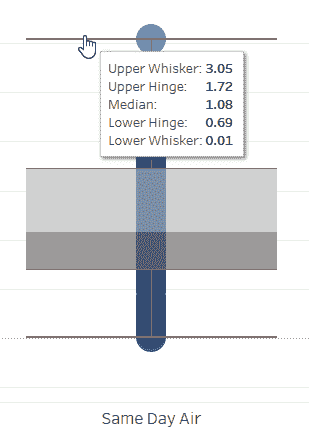
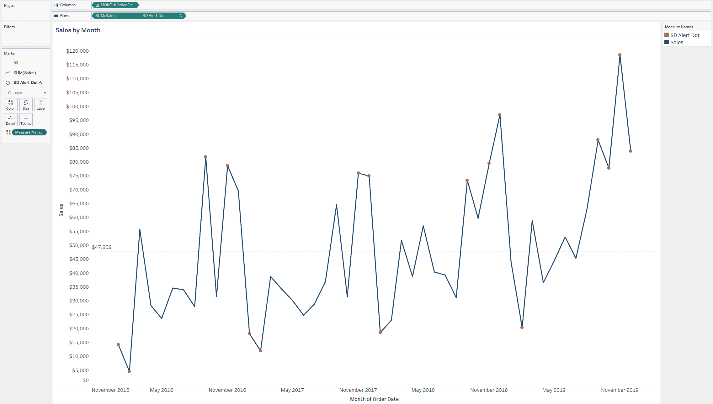

# 第二章：定量分析

本章讨论的是制作展示分布、传播和许多细微差别的可视化图表。如果您曾经处理过数据，您就会知道，在清晰和易于理解的方式中传达详细复杂信息可能是一项挑战。我们将提供技术来帮助您克服这一挑战。

本章的可视化重点是度量和统计。使用数值字段，我们将向您展示不同的图表如何通过数据值的数值表示提供不同的洞见。*度量*是我们可以应用函数如`SUM()`的数值字段。*统计*当然是数学的一个分支；在 Tableau 中，我们使用它的概念在专门的函数中工作，处理平均数、中位数、均值、标准偏差（SD）等等。（如果你以前没有学过统计学也不用担心——我们会一步步引导你！）这些函数通常不会产生类似总销售额的总和值，而是描述数据点如何分布：它们的高点、低点、数据点集中的地方以及离群值的位置。

每个数据集都有独特的数据形状。一旦您探索它们，大多数都具有一些共同的特征。有些数据形状可能很难处理，因此我们还将探讨处理这些形状的技术。

在本章中，我们将探讨以下类型的可视化：

+   直方图

+   点图

+   抖动图

+   范围点图

+   箱线图

+   折线图

+   帕累托图

因为我们知道您正在使用这些可视化工具来完成工作，我们将继续使用案例研究来帮助您了解这些图表类型在涉及真实人员（比如您的老板）的实际业务沟通中如何运作。通过我们对办公用品零售商、物流公司和大型银行的分析师的建议，我们将为您概述每种类型的一般情况，包括其外观、优缺点以及它最适合的信息类型。我们还将花时间学习一些统计学的核心概念，这些概念可以帮助您将数据见解提升到更高的水平。

# 直方图：办公必需品案例研究

我们的第一个案例研究涉及销售办公用品的大型零售连锁店。我们称之为*办公必需品*（*OE*）。数据团队正准备向 OE 的高级管理层和董事会做一次重要的演示。董事会希望了解谁在下订单，多频繁，以及数量有多少。

团队成员应该从这些数据中挖掘出哪些指标？以及他们如何最好地展示他们所发现的内容，知道他们可能只有几秒钟来传达数据中最重要的见解？团队成员知道他们需要考虑的一件事是订单频率。OE 的客户下了多少订单？他们大多数是经常回购的顾客，还是只购买一次？

要回答这个问题，最好的图表是直方图。在我们深入制作之前，让我们先给您一些关于这种流行图表类型的背景知识。

一个*直方图*是一种专门用于可视化具有数值的数据点*分布*或散布的条形图。在这种情况下，OE 公司的销售如何在其客户中分布？您可能决定查看去年在 OE 公司的零售店中花费 100 到 200 美元的客户数量，或特定客户购买特定产品的次数。

与标准条形图不同，直方图的 y 轴（即垂直轴）具有数字值、范围或间隔（通常称为*bin*），表示为一个标题，其 x 轴（即水平轴）表示频率，如每年每位客户的订单数。直方图是一种在 x 轴上表示频率，在 y 轴上表示客户数的条形图。

## 策略：创建一个简单的购买行为直方图

对于这种类型的图表，我们将使用 LOD 表达式而不是 bin 来构建直方图。正如在第 1 章中提到的，Tableau 的 LOD 表达式允许您定义度量的*聚合*（如总和、平均值或中位数）。默认情况下，Tableau 基于视图或工作表中的详细信息或字段来聚合任何字段，但 LOD 允许您创建定制的聚合字段。让我们来试试：

1.  创建一个名为`**[# Orders per Customer]**`的字段。这告诉 Tableau 按客户名称统计订单的不同数量：

    ```
    //Orders per Customer
    {FIXED [Customer Name]: COUNTD([Order ID])}
    ```

1.  右键单击度量并选择创建 → Bins。将打开对话框。

1.  在审查度量的各种值后，Tableau 将自动建议一个 bin 大小。您可以自由调整这些以满足您的需求。对于这个分析，客户订单数量不应该是小数，所以将 bin 大小改为 1。

1.  创建 bin 后，它会显示为数据窗格中的离散维度。这是一个重要的观点，因为它将为您使用它在图表中时的行为提供洞察。

1.  现在，将[Orders per Customer (bin)]拖放到列中。正如预期的那样，Tableau 创建了离散的标题。

1.  现在，将[# of Customers]，即 COUNTD([Customer Name])度量，拖放到行中：

    ```
    //# Customers
    COUNTD([Customer Name])
    ```

您应该得到类似于图 2-1 的结果。让我们停下来消化这个可视化效果。


###### 图 2-1\. 客户数量的订单频率直方图

即使您没有上过统计课，您可能也熟悉统计学中最常见的视觉之一：正态分布，也广为人知为*钟形曲线*（图 2-2）。每当您查看直方图时，正态分布应该会出现在您的脑海中。

尽管你刚刚创建的直方图*不是*正态分布，但将其与正态分布进行比较将有助于解释数据形状。在*正态分布*中，数据被表示为曲线的顶部代表平均值或平均值。曲线是对称的：数据的一半位于平均值的左侧，另一半位于右侧。

当你处理数字时，*标准偏差*（*SD*）指的是数据集中数字从“正常”或平均值分散出来的程度。在实践中，你的 SD 越大，数据点之间的变化就越大；相反，SD 越小，差异或数据分散就越小。在正态分布中，大多数数据在平均值的一个 SD 内；95% 的数据距平均值两个 SD。


###### 图 2-2\. 一个正态分布，显示每个标准差的百分比

你可以从你制作的图表中看到（图 2-1），订单频率明显集中在四到八个订单的范围内，而一些顾客订单频率更高（我们称他们为异常值）。

我们可以通过将直方图切分为小多个并比较数据在诸如 [Segment] 这样的维度上的分布或扩展来创造更即时的价值，如 图 2-3 所示。我们将在 第三章 中更详细地讨论这种图表类型，但现在只需知道，小多个图表（也称为*格栅图*）实际上是一系列使用完全相同轴线的图表，通常以网格形式排列。

尝试将 [Segment] 拖动到行和颜色上。


###### 图 2-3\. 按顾客分割的订单频率直方图，按部门分开

现在事情变得有趣了。之前，我们看到了顾客订单频率的总体分布，但现在我们已经按业务单位/部门将其分开了。尽管每个直方图的数据形状与原始数据类似，但我们肯定可以分辨出它们之间的一些差异：

+   从整体上看，购买来自消费者部门的顾客数量占据了其他两个部门。

+   这些异常客户仅存在于消费者部门。

+   家庭办公室的订单频率看起来相对稳定，通常范围在 4 到 9 之间；与其他部门相比，这个段的数量更加接近。

为了更精确，尝试将 y 轴改为每行独立，如 图 2-4 所示。不过，当你做出这个改变时，请务必小心！应该非常清楚条形图长度代表什么，以及它们在每个部分中是唯一的。


###### 图 2-4\. 独立 y 轴下的订单频率直方图

让我们看看您可以利用的其他几种技术，以制作更有效的直方图。

## 策略：创建一个具有连续区间的直方图

在数学和统计书籍中，直方图通常显示没有任何间隙的条形图，正如图 2-5 所示。要做到这一点，通过右键单击字段将您的箱从离散变成连续。


###### 图 2-5\. 这些连续直方图的订单频率是按客户数量计算的，注意条形之间的空隙

回想一下，从第一章可以知道，连续字段将绘制坐标轴：这意味着，我们不再为每个订单区间设定标题，而是使用一个不间断的数轴。此外，柱的宽度将自动调整为区间的大小——在我们的情况下，是 1。

## 策略：在直方图中使用 LOD 表达式

我们可以做的最后一件事是将现有的箱子创建为任何数量或更多的箱子。为什么要做这些额外的努力？有两个原因。

首先，我们减少图表中的整体噪声。很可能，当您查看初始直方图时，您的视线被吸引到右侧。这甚至可能会妨碍您准确记住直方图的整体形状。

接下来，图表在演讲时变得更易读，这对您的演示非常有帮助。由于 11 到 17 组中成员如此之少，将它们分组在一起使我们可以为该组分配一个单一的数字。这些步骤的结果如图 2-6 所示：

1.  创建与图 2-1 相同的直方图（显示按客户计算的订单频率）。

1.  创建一个名为`**[Orders per Customer Grouping]**`的计算字段。此计算将把大于 11 的每个客户的订单组合成一个部分。这将消除空箱子并将所有内容分组到一个最终柱中：

    ```
    //Orders per Customer Grouping
    IF [Orders per Customer] <=10 THEN [Orders per Customer]
    ELSE 11
    END
    ```

    

    ###### 图 2-6\. 每个客户的订单分组

1.  将您新计算的字段拖放到[每个客户的订单]列上。您应该右键单击并将其拖放到可视化效果中，以便快速将其作为维度而不是聚合度量项放置（见图 2-7）。

    

    ###### 图 2-7\. 拖放字段

    现在你的图表中所有大于 10 的数据都集中在一个柱状图中。将其视为我们解决方案的中间步骤。我们绝对*不建议*您与观众分享这个直方图：最终的柱状图可能会令人困惑，甚至有误导性。

1.  相反，为了准确性的缘故，我们将进行最后一次更改。首先，通过右键单击列架上的字段将其更改为离散。接下来，我们将对值 11 进行*别名*（即为其指定别名）。您可以通过右键单击 11 并选择编辑别名来为此值指定别名。图 2-8 显示了结果。


###### 图 2-8\. 完成的直方图

现在我们已经清楚地处理了数据的右“尾部”，而 11+清楚地向观众传达了最终柱形条代表的大于或等于 11 的一切。祝你的演示好运！

# 点图和抖动图：Office Essentials 案例研究

Office Essentials 的高级管理团队现在想要知道，客户每个订单平均花费多少。数据团队应该使用哪种类型的图表？

单独的直方图将无法传达所有见解。您需要一个整合其他图表类型的策略。本节介绍了两种可用于显示定量信息的图表类型：点图和抖动图。

如果有人要求你提供某个度量的平均值，请谨慎行事。*平均值* 是一个非常汇总的数值；当你只呈现这个信息级别时，你可能会过度简化底层数据集。更重要的是，你的听众可能会合理地问道：“但如果有离群值导致平均值偏斜怎么办？”

如果只有聚合数据，回应可能会很困难。为了避免这种情况，我们建议从详细数据开始，然后再呈现汇总的平均值。包含这些额外细节立即为您提供了一个回应，并允许听众在思考过程中更具分析性。

## 策略：创建基本点图

*点图* 是一种将数据表示为圆圈（点）的一维图表。每个点代表一个单独的数据点。当你有大量数据点或者维度内有许多成员时，或者这些数据点的分布是重要见解时，这种图表非常有效。我们喜欢使用点图，因为它们在视觉屏幕上占用很少的空间。让我们继续构建一个（图 2-9）并仔细观察一下：

1.  将[订单 ID]拖放到标记卡片的详细信息上。这将定义您将显示数据的级别。

1.  将`SUM([销售额])`拖放到列上。

1.  将标记类型更改为圆圈。

1.  由于我们的数据朝向较小的数值密集，通过将颜色的不透明度改为 60%，添加透明度。

1.  为了确保回答原始问题，从分析窗格中拖放平均线跨整个表格。


###### 图 2-9\. 显示每个订单销售金额的点图，包含平均值

现在您已经有了潜在的图片，您能得出什么结论？我们会得出这样的结论，很多数据密度确实存在于较小的值周围，很可能在平均值周围，但我们不能忽视明显的异常值。

问题是，现在我们有很多重叠的数据点，在共享的数值上聚集在一起，这使得很难看到单个数据点。为了清理这个视图，您需要一种方法来扩展所有那些在一起收集的数据点。这个技术术语称为*抖动*数据——即将点图转换为抖动图。

## 策略：创建抖动图

创建抖动图时，您将获得点图的优势，但成员在 y 轴上随机分布。数据点不再重叠那么多。*抖动图*几乎与点图相同，但包括 y 轴上的数值。该值没有分析价值，不应显示；它的唯一目的是展开数据并使其更少密集，以便更容易阅读。

如果您正在使用 Tableau 抽取或已发布的数据源，则可以访问名为`RANDOM()`的内置函数，该函数返回 0 到 1 之间的随机小数。如果可以的话，我们强烈建议您利用这个函数：它将确保您的抖动是自然的，不受任何其他指标的影响。（其他方法涉及对数据进行索引，要求您对数据施加某种排序。）

按照以下步骤创建您的抖动图：

1.  双击进入行并输入`**RANDOM()**`，然后按 Enter 键。您会注意到聚合将是`SUM(RANDOM())`。更改此项，以免过度聚合并返回大于 1 的值。

1.  通过右键单击`SUM(RANDOM())`并将度量更改为最小值来更改聚合（参见图 2-10）。

1.  右键单击 y 轴（行）并取消选中“显示标题”。


###### 图 2-10\. 将测量值更改为最小值

让我们看看在图 2-11 中得到的结果图表。


###### 图 2-11\. 完成的抖动图

现在我们对数据有了更清晰的认识。当我们查看以前的图表时，它是一维的，所以我们真的不知道左侧有多少密度。这应该给管理层提供所需的洞察力。

# 范围点图：Office Essentials 案例研究

我们为 OE 创建的抖动图细节太多了，让人感到不知所措。团队的可视化将在演示中作为幻灯片展示，因此需要快速传达重点。高级经理们想要简短精炼的信息——他们可以轻松记住并告诉他人。

所以，您无法说服您的高管接受抖动图，因为这对他们来说是太多的数据。我们曾经有过同样的困扰！我们如何在不丢失重要信息的情况下简化这个图表？当我们遇到这种情况时，我们的第一个反应是建议一个折中的方案：只显示聚合数据，但在类似提示工具的次要位置包含详细信息。

不过，如果这仍然对您来说是太多的数据，我们有另一个解决方案：*范围点图*。它是点图的一种简化版本，仍然展示了数据形状的一些关键特征。范围点图表示聚合值，如平均值、最小值、最大值或中位数，而不是所有单个数据点。它们可以是数据集整体范围的良好视觉表示。

由于您的数据是关于客户平均花费的数据，您需要关注的关键特征包括平均值（当然），最小值，最大值以及最小值和最大值之间的范围。

## 策略：创建一个范围点图

使用以下步骤创建您的范围点图：

1.  确保有一个表示每个订单 ID 的总销售额的度量。在这个数据集中，这意味着您将创建一个 LOD 表达式。这个计算告诉 Tableau 找到每个订单 ID 的`SUM()`销售额，因为您的最终可视化效果将不包含订单 ID 的详细信息：

    ```
    //Sales by Order ID
    {FIXED [Order ID]: SUM([Sales])}
    ```

1.  右键单击并拖动[按订单 ID 销售]到列架上选择聚合方式，并选择`AVG()`。将标记类型设置为圆圈，并选择您喜欢的颜色。

1.  制作一个名为`**[订单销售范围]**`的计算字段，以找到最大值和最小值之间的差异。

    ```
    //Range of Order Sales
    MAX([Sales by Order ID])-MIN([Sales by Order ID])
    ```

1.  再次右键单击并拖动[按订单 ID 销售]到列架上，但这次选择最小值。（您需要一个范围的起点，没有比最小值更好的选择。）将其设置为双轴并同步轴线。还要确保这个新轴的标记位于后面，右键单击并选择“将标记移至后面”。

1.  将标记类型更改为甘特条形图。这将允许您将度量值——即我们的[订单销售范围]——放到大小上。

1.  将[订单销售范围]拖放到大小。

1.  将[子类别]拖放到行上，以便您可以比较产品类别之间的范围和平均值。

1.  调整格式和大小，直到您喜欢最终的视觉效果（我们在图 2-12 中展示）。


###### 图 2-12\. 范围点图

这种可视化效果讲述了一个更具吸引力的故事。一眼就能看到许多元素，如每个子类别的平均值和范围，并进行一些自然的视觉比较。例如，可以看到信封订单平均为$550，并且与类似子类别相比，范围并不是太极端。

如果您喜欢这种可视化效果，可以进一步操作如下：

+   如果发现您的数据存在严重偏斜或异常值——正如您的数据一样——尝试将平均值更改为中位数。

+   如果您的受众无法决定他们想要看到中位数还是平均数，请建立一个允许他们在两者之间切换的参数。

+   您还可以利用百分位数而不是最小值和最大值范围。

如果你看到一个或两个极端值显著地拉动数据形状，你的策略应该是让这一点知道，但提供一个解决方案。让我们试试百分位数，看看我们能得出什么结论。

## 策略：使用中位数和杠杆百分位数

如果你想象你的数据散开，*百分位数*允许你把数据点分成从 0%到 100%的几个部分。最常见的百分位数是分位数和分位数。 *分位数* 将数据分成四分之一：四个相等的部分，每个部分占数据集的 25%。 *分位数* 将数据分成 10 个相等的部分，每个部分占 10%。

百分位数还用于与正态分布相关的统计场景中。请记住，在正态分布中，数据的 95%位于平均值的两个标准偏差之内——因此，限制范围在 2.5%和 97.5%之间可能是合适的，或者说“95%的数据”位于特定范围内。

从先前策略的图表开始，按照以下步骤创建一个范围：

1.  首先通过右键单击将平均值的聚合从先前的策略更改为中位数。现在你可以进行百分位数计算：

    ```
    //2.5% of Data
    PERCENTILE([Sales by Order ID],.025)
    ```

1.  你可以重复这个计算到 97.5%或 0.975。然后，你可以创建一个新的范围，几乎与我们的原始范围相同。继续以完全相同的方式完成图表：

    ```
    //97.5% of Data
    PERCENTILE([Sales by Order ID],.975)

    //Percentile Range
    [97.5% of Data]-[2.5% of Data]
    ```

1.  用[2.5%的数据]替换第二轴的 MIN([订单 ID 销售额])，并用[百分位范围]替换[订单销售范围]。图 2-13 显示了更新后的视图。


###### 图 2-13\. 带有杠杆百分位数的分段点图

那么是什么让这个视图特别？当然，我们缩小了范围，但我们也减少了视图中的噪音量。

每次你制作一个图表时，问问自己：你希望观众带走什么见解？哪些见解与他们的需求相关？

如果 OE 高管需要平均或中位订单价值以及一个简短的说法，这个范围点图将满足这一需求。现在他们有一个简单的方法来传达关于每个段的信息，比如这样：“除了一些离群值，我们大部分复印机订单的平均价格约为$1,500。”

# 箱形图：Spear-Tukey 运输案例研究

我们的下一个案例研究发生在 Spear-Tukey Shipping (STS)，一家运输和物流公司。¹ STS 在全球范围内运输产品，需要严格的截止期限，因此流程必须精确。如果出现问题，公司需要知道。

当客户使用 STS 发货时，他们必须选择一种运输方式。有四种方法。它们都不同，并且每一种都有自己的交货期限。交货*必须*在指定的天数内完成。

最近，STS 听到了关于延迟交货的投诉，但高管们不确定问题有多严重（甚至是否真的是问题）。数据团队已经收集了数据并正在进行分析。团队计划向 CEO 呈现结果，CEO 想知道公司每种方法符合要求的截止日期的频率。

表 2-1 列出了 STS 的方法和截止日期。

表 2-1\. 运输方法和截止日期

| **方法** | **交货天数** |
| --- | --- |
| 当天空运 | 1 |
| 紧急空运 | 2 |
| 紧急陆运 | 3 |
| 陆运 | 5 |

在我们深入讨论之前，让我们先考虑预期。在 OE 案例研究中，我们没有预期的答案；也许我们有一些制度上或直觉上的猜测，但我们使用可视化工具来*寻找*答案。然而，在这里，我们有一个应该受到控制的过程；目标是找到那些设计不合理的*例子*。我们也有大量每种方法的数据，因此需要想办法在一个图表中将所有信息可视化，而不会变得过于复杂和令人困惑。

对于任何高度受控的过程，我们发现最好依靠统计数据来传达性能。对于这个用例，我们将几个概念结合到一个可视化中，即*箱线图*（图 2-14）。箱线图比我们到目前为止展示的其他图表稍微复杂一些，所以让我们看看它们是如何构建的。


###### 图 2-14\. 箱线图的构造

箱线图包括以下元素：

中位数

*中位数*，或者数据的中点，被表示为盒子内的一条线。

四分位数

Q1 和 Q3 是四分位数；在 Tableau 中，你也会看到它们被标记为*中间值*。Q1 位于数据的 25%，而 Q3 位于 75%处。

内四分位距（IQR）

Q1 和 Q3 之间的范围。

触须

这些是从盒子伸出的水平线。它们可以通过两种方式构建：

+   *最小*触须可以延伸到 Q1 减去 1.5 倍的 IQR。*最大*触须可以延伸到 Q3 加上 1.5 倍的 IQR。

+   或者，触须可以延伸到数据集的最小值和最大值。

离群值

任何超出触须范围的数据点，显示为点。

## 策略：创建基本的箱线图

现在你对我们正在构建的东西有了一个感觉，请跟随我们一起尝试：

1.  创建`**[Days to Delivery]**`字段。你将构建这个计算字段来计算发货日期和交货日期之间的天数：

    ```
    //Days to Delivery
    [Delivery Date]-[Ship Date]
    ```

1.  将[Days to Delivery]字段拖动到行架上。请注意，当您拖动该字段时，Tableau 将使用一种度量来聚合数据。我们不想查看聚合数据，因此我们可以通过以下两种方式之一来解除数据的聚合：

    +   选择分析 → 取消勾选聚合测量。

    +   将[清单 ID]拖放到详细信息中。这是数据集中的最低详细级别，并将构建等于行级值的聚合。

1.  包括运输方式。还将[运输方式]拖放到列中。

1.  将标记类型更改为圆圈，并将不透明度降至 60%。请注意，您再次得到了与点图非常相似的东西，如图 2-15 所示。

    

    ###### 图 2-15\. 每个点表示交货所需的天数。

1.  要将其转换为箱线图，请转到分析面板并将箱线图拖放到工作表上。当您将其拖放到单元格上时，Tableau 现在在您的数据上绘制了一个箱线图。

当您悬停在箱线图上时，摘要工具提示将显示中位数、四分位数和盒须的值（参见图 2-16）。


###### 图 2-16\. 完成的箱线图

此时，您可能想知道如何解释这个箱线图——以及如何向 CEO 解释。首先，缩小数据范围。让我们放大同日空运方法的数据（参见图 2-17）并首先尝试解释该部分。



###### 图 2-17\. 解释箱线图

我们可以看到第三行，同日空运交货的中位时间为 1.08 天。您可以表达为“我们的同日空运交货中有 50%在 1.08 天内到达。”观察箱限（IQR），您可以补充说“25%的交货在不到一天（0.69 天）内到达，75%在不到 2 天（1.725 天）内到达。”

看起来最大值为 3.05 天。这意味着我们可以自信地说，STS 的同日空运交货 100%在三天内到达——对于应该是同日的东西来说，这并不理想！

在 Tableau 中，我们可以通过右键单击编辑进一步自定义此可视化。这里有很多信息。我们可以减少屏幕上的标记总数，仅留下箱线图和任何异常值。

正如我们所提到的，我们可以通过两种方式扩展盒须。在右键单击以编辑时，您将看到两种选项。单击复选框以隐藏箱线图内部的标记。您可以在图 2-18 中看到最终版本。


###### 图 2-18\. 定制的箱线图

如果这个箱线图适合您的受众，太棒了！但这里涉及很多内容，有时箱线图可能会让观众感到不安。知道这一点，通常我们会将箱线图与更少让人不安的图表（如直方图）配对，以帮助传达内容并确保每个人都理解主要信息。

## 策略：结合箱线图和直方图

要创建此图表，我们将从您刚刚构建的箱线图开始。这次，不是解聚您的测量值，而是需要对它们进行聚合。如果您将[清单 ID]添加到详细信息中，您就可以开始了！

1.  修改箱线图，使触须从最小到最大范围。

1.  现在你有了这个视图，可以引入其他需要聚合的度量作为双轴。创建一个名为`**[Days to Delivery by Manifest ID]**`的特定 LOD 计算字段：

    ```
    //Days to Delivery by Manifest ID
    {FIXED [Manifest ID]: AVG([Days to Delivery])}
    ```

1.  创建分箱，使用与本章开头构建直方图时相同的方法。将分箱设置为每 0.5 天一个。在数据窗格中右键单击字段并转换为连续型。

1.  点击顶部工具栏旁边的交换行和列图标（排序图标旁边），切换行和列的布局。

1.  将新的分箱计算[Days to Delivery by Manifest ID (bin)]拖动到列中，位于 AVG([Days to Delivery])的右侧。

1.  在此可视化的标记卡上，将标记类型更改为柱形图。从详细信息中移除[Manifest ID]。

1.  创建一个名为`**[# Shipments]**`的计算字段，并将其拖动到行中：

    ```
    // # Shipments
    COUNTD([Manifest ID])
    ```

1.  右键单击[Days to Delivery by Manifest ID (bin)]，选择双轴；右键单击新创建的双轴并同步轴线。

1.  在所有标记卡上，从颜色中移除[Measure Names]，右键单击以隐藏顶部的额外轴线。

    图 2-19 展示了我们的结果——更易于阅读，不是吗？解释数据也更容易。


###### 图 2-19\. 完成的箱线图和直方图合并

现在 STS CEO 可以看到箱线图的构建与基础数据的关系。高管们可以看到每个柱形的频率并理解数据在箱线图形式下的呈现方式。他们还可以同时看到数据的频率和密度。

# 线图：办公室必备案例研究

现在让我们回到 OE，在那里数据团队现在需要展示公司过去几年的整体销售数据，按月份细分，使用数据的样本。这个想法是，良好的视图可以帮助预测未来几个月的销售，并识别趋势，特别是如果公司需要快速采取行动的情况。按月份显示销售情况很容易，但如何表明什么是正常的，什么是不正常的？

多年来我们学到的一件事是，每当有人问及趋势时，他们的脑海中就会形成一幅折线图的心理图像。与条形图一样，*折线图*是数据可视化中常用的工具。它们将指标随时间显示出来。在这里，我们不会深入讨论如何处理时间（我们将把它保存到第四章），但我们确实想介绍一些可以使用统计值和派生度量来制作具有真正影响力的折线图的方法。听起来 OE 的领导层有兴趣变得更加数据驱动，这些技术将有所帮助。

## 策略：构建一条线图

让我们从基本的折线图开始，显示 OE 的按月销售额（图 2-20）。要构建此图，右键单击并拖动[订单日期]到列中，选择底部的月份。将`SUM([销售])`拖动到行中。


###### 图 2-20\. 按月销售的折线图

这提供了一些直观的见解。我们可以看出数据中存在季节性：每年的 9 月、11 月和 12 月发生了峰值。总体上看，销售额似乎随时间而增加。

但我们可以通过包含统计量来讲述更复杂的故事。我们将从内置且易于在 Tableau 中使用的工具开始。在第一章中，我们探索了为平均值添加参考线；这一次，让我们更进一步，添加*参考分布*：图表上一组指示范围的带子，使观众可以看到线条落在该范围内的情况。

## 策略：将参考分布添加到折线图中

记住，我们警告过您，平均值（以及其他聚合值）并不总是足够传达足够的信息？通过显示您所提供的平均值的确切程度，这是减轻这种情况的一个很好的方式。

我们将在这里包含的参考分布显示置信区间的范围。*置信区间*是从随机样本计算的一系列值，这些值很可能包含所选择的测量的真实值。它是您的数据的两个项目的函数：*样本大小*（或数据点数）和整体*置信水平*。随着样本大小的增加，置信区间可能会变窄，因为观察次数增加了。置信水平具有相反的效果：您对数据越有信心（例如，如果您需要对数据的信心为 99%，而不是 95%），带子越宽。

要添加置信区间，请按照以下步骤操作：

1.  从分析面板中，将一个平均线拖放到视图上，然后将其放置在表上。

1.  焦点放在中间部分，除了线条，还添加一个置信区间，并指定置信水平。在此过程中，将标签选项更改为数值，而不是计算。

    现在图表（图 2-21）显示了平均每月销售额，并且用灰色带表示置信区间。


###### 图 2-21\. 带置信区间的平均月销售折线图

为什么要向图表添加这种类型的上下文？对于这个演示文稿，这是为了为依赖我们提供的平均值的 OE 高管和董事会增加细节。现在，由于那个灰色带子，他们可以轻松地看到哪些月份的销售额低于或高于平均水平——这正是他们寻找的信息类型。

虽然我们刚刚创建的图表显示基于提供的样本数据的计算平均值为$47,858，但平均值两侧存在约$7,000 的*误差范围*，用来展示平均值*可能*是什么。误差范围是一种表示我们可以在 95%的置信水平下陈述如果我们有*所有*的月销售额数值，那么平均值将在$40,542 和$55,174 之间。

## 策略：在线图中添加标准差

你也可以在 Tableau 中使用分布带和参考线来表示百分位数或标准差。接下来我们将添加标准差：

1.  右键点击平均线，然后点击“编辑”。

1.  再次更改为仅线条。

1.  要创建另一条参考线，右键点击坐标轴，然后选择分布。

1.  将计算值更改为标准差，保持因子为-1 和 1。同样，选择样本选项，因为我们没有*所有*数据，只有一个子集。

1.  将标签选项更改为数值，然后点击“确定”（见图 2-22）。


###### 图 2-22\. 在线图中添加标准差

那么从这个生成的图表我们能得出什么结论呢？首先，与平均值相比，存在*很大的差距*。对于任何给定的月份，销售额可能会与平均值相差高达$25,000。这几乎是计算的每月平均值的一半，情况不太乐观。

OE 高管应该从中得到什么启示呢？他们需要意识到每月销售数据存在大量的变异。在这个时候，也许还不适合使用这些数据来预测未来的数值。

我们的观众也想知道什么是正常的，什么是不正常的。什么时候他们应该担心？

我们将尝试另一种处理标准差的方法，但不是将它们显示为参考分布，而是将它们用作一种警示策略。这是一种客观的方法来审查数据集并查看哪里真正存在有意义的统计变异（在统计学中，当报告的数值距平均值超出一定数量的标准差时，通常会说某事处于“失控”状态）。

## 策略：使用参考分布作为警示策略

我们的下一个图表将展示每月销售额和平均线，就像以前一样。不过这次，我们将在超过平均值 1 个标准差的月份添加红色圆点：

1.  创建一个名为`**[SD Alert Dot]**`的新计算字段。此计算将比较月销售额与视图平均值加 1 个标准差的数额，以及减去 1 个标准差的数额。如果条件成立，它将返回销售额。然后我们将该销售额转换成一个点。

    ```
     //SD Alert Dot
    IF SUM([Sales])>=(WINDOW_AVG(SUM([Sales]))+WINDOW_STDEV(SUM([Sales])))
    OR
    SUM([Sales])<=(WINDOW_AVG(SUM([Sales]))-WINDOW_STDEV(SUM([Sales])))

    THEN SUM([Sales])
    ELSE NULL
    END
    ```

1.  当你阅读这个计算字段时，看起来好像有很多内容，但让我们简化各个组成部分：

    +   `SUM([Sales])`只是销售金额，会按月绘制，因为这是您视图的详细级别。

    +   `WINDOW_AVG(SUM([Sales]))`与平均参考线完全相同：它是视图中所有数据点（在“窗口”中）的平均值。

    +   `WINDOW_STDEV(SUM([Sales]))`与平均值的概念相同，但这次是标准差。

    其余的条件是确定销售价值是否在这些点之上或之下。如果是，则返回销售额；否则，可以将其置空。

1.  将[SD Alert Dot]字段拖动到您的行架上。

1.  右键单击并使其成为双轴，然后同步您的轴。

1.  将您的第二轴的标记类型更改为圆圈。确保您的第一个标记仍然是一条线。

1.  适当地着色测量，并右键单击右下角的空指示器以隐藏它。

1.  您还可以通过单击可视化的顶部或底部标准差处来拖动参考分布。

    图 2-23 显示了生成的折线图。



###### 图 2-23. 折线图，红色标记的月份在平均值的±1 个标准差内。

那么这张图与前一个带参考线带的例子有什么区别？两者都显示趋势指标和标准差，但关键区别在于*观众如何感知它们*。使用参考线带，团队将向高管展示标准差的分布，但警报点则邀请他们采取行动。

这就是以图表形式展示信息与真正数据驱动的区别。一个强大的数据驱动组织定义了具有度量标准的警报或阈值，以便其领导知道何时采取行动。

我们的下一个案例研究将看看另一种将统计输出转化为维度的方法。

# 基于统计的计算维度：Banco de Tableau 案例研究

我们下一个研究案例位于 Banco de Tableau（BoT），这是一个大型（虚构的）金融机构，您在第一章中已经见过。该银行正在寻找利用其商户类别数据更好地了解其客户的新方法。数据包含许多类别，BoT 数据团队需要一种方法来根据它们的总消费进行分组和评分。

来自第一章的 Top N 条形图很棒，但现在团队需要一种更全面的方式来传达结果。它应包括数据集中的*每一个*类别，而不仅仅是前 10 个。团队成员希望将最低消费者与最高消费者进行比较，并进行更深入的洞察。

部署统计学是深化数据可视化的一个好方法。我们将在这里尝试两种方法。第一种是根据视图中的数据为数据点分配一个摘要统计值。第二种是使用帕累托图（请稍候详细了解）。

## 策略：为数据点分配摘要统计值

下面是为数据点分配摘要统计值的步骤：

1.  从一个新的水平条形图开始，该图显示了每个[商户类别]的总交易金额。将条形图按降序排序。

1.  创建一个名为`**[Merchant Category Level]**`的计算字段，可以将商户类别分为三个群体：一个为前 10%，一个为后 10%，还有一个包含其余数据的群体。将计算字段拖动到颜色上。记住，在这里，`window_percentile`将是基于我们视图中的数据的相应百分位数：

    ```
    //Merchant Category Level
    IF SUM([Transaction Amount])
      <=WINDOW_PERCENTILE(SUM([Transaction Amount]),.1)
    THEN 'Bottom 10%'
    ELSEIF SUM([Transaction Amount])
      >=WINDOW_PERCENTILE(SUM([Transaction Amount]),.9)
    THEN 'Top 10%'
    ELSE 'Middle'
    END
    ```

    这个计算实际上只评估了一件重要的事情：交易金额是否高于或低于特定百分位数。

1.  将计算字段添加为视图的标题。这将允许您创建新的聚合，如各个群体的平均值。您可能需要手动重新排序标题。

有几个理由需要分配一个摘要统计值。现在，通过数学分析，我们已经平均分离出了我们的商户类别。这样做也使我们能够对这些新的分类进行汇总讨论。如果我们想要获得更加深刻的见解，我们可以添加一个仅针对某个百分位数内商户的参考线。

例如，在我们的图表（图 2-24）中，我们可以看到在前 10%的商户类别中，平均支出为 1,010 万美元。与底部 10%的商户类别相比，其平均支出仅为 175 万美元。


###### 图 2-24。为数据点分配摘要统计值

使用统计数据创建各种分组还使图表变得动态，可以实现我们的银行家们期望的深度分析。如果我们在筛选数据时改变分析范围，后续的可视化也将更新。我们可以筛选数据以查看在特定时间段内完成的交易，甚至是在特定地区完成的交易，可视化效果也会相应变化。

到目前为止，我们已经讨论了如何展示分类数据及其分布，但我们还没有深入探讨。现在让我们来做这件事。

# 帕累托图：Amplify Performance（AP）案例研究

我们再次分析 Amplify Performance 的数据。这一次，高管们希望更好地理解资助金额的分布情况。他们已经看过第一章的树状图，并知道一些项目类别似乎占据了大部分资金，但他们希望能够向更广泛的观众传达这一点。我们可以建立什么样的可视化来满足这一要求？

## 策略：使用帕累托图显示分类数据

你听说过*80/20 法则*吗？通常称为*帕累托原则*，它表明一个度量或结果的 80%与数据的 20%有关。

为了更直观地看到这一可视化效果，我们可以构建一个*帕累托图*：这是一个双轴图表，它以初始排序的条形图为基础，并添加一条线表示总体的累计百分比。总体的累计百分比展示了 80/20 法则。更具体地说，这张图表旨在展示与分类数据相关的数值分布。

###### 注意

帕累托原理认为，80%的后果来自于 20%的原因。我们通过将这一原理应用于数据可视化，称 80%的指标可以追溯到数据的 20%。这一原理由质量管理先驱[约瑟夫·M·朱兰](https://oreil.ly/govqe)开发，并以[维尔弗雷多·帕累托](https://oreil.ly/r8HS0)（1848–1923），一位意大利经济学家命名，他著名地证明了意大利 80%的土地归属于仅占人口 20%的人。

当你需要帮助观众关注重要内容并轻松传达分布情况时，帕累托图就非常有用了。我们将首先为 AP 构建一个基本的垂直条形图（如果你不记得如何做，请回顾第一章）。然后我们将把它转化为帕累托图。

你是否会发现，20%的项目类别占据了 80%的拨款金额？以下是步骤：

1.  拖动[项目类别]到列上。

1.  将[拨款金额]拖动到行上。

1.  使用工具栏按[拨款金额]降序对项目类别进行排序，如图 2-25 所示。

    

    ###### 图 2-25\. 在垂直条形图中排序项目类别

1.  按住 Ctrl 键并将`SUM([Grant Amount])`作为副本拖到您的行架上。

1.  再次右键点击新的度量值并创建快速表格计算；使用累计总数。

1.  再次右键点击表格计算并编辑它。这次点击“添加次要计算”，选择“总体百分比”。这将把累计总数呈现为百分比形式（见图 2-26）。

    

    ###### 图 2-26\. 帕累托图的表格计算

1.  将第二个指标的标记类型更改为线条。然后右键单击它以使其成为双轴图表，并为线图表打开标签（见图 2-27）。

    

    ###### 图 2-27\. 双轴帕累托图

1.  通过编辑轴标签来清理视图。安喜欢将次要轴标记为`**[累计 %]**`。

1.  您还可以添加参数或常数参考线以准确定位数据的 80%位置。现在让我们来看看最终的产品（见图 2-28）。


###### 图 2-28\. 完成的帕累托图

AP 的资金是否遵循 80/20 法则？的确：从图表中可以看出，55 个总类别中的 9 个项目类别占据了 81%的资金。换句话说，16%的项目类别占用了 81%的资金。这意味着 AP 的支出实际上比帕累托分布稍微更集中！我们确信，看到资金分布方式会让执行团队深思。

# 结论

在本章中，您已经看到了在现实世界中处理数值数据的几种方法。我们探讨了使用直方图、点图和抖动图查看数据分布的方式，前者使您的受众能够看到总结数据，后者使他们能够看到构成整体图像的个体数据点。

您还学习了如何使用应用统计概念创建显示重要摘要统计信息的箱线图（中位数和四分位距是您的朋友），并学会了如何通过包含直方图来说服您的受众接受此图表。

您还看到了如何将内置的统计计算（如标准差）轻松添加到折线图中，以帮助表达数据中的微妙差异。此外，您还探讨了使用统计阈值帮助使您的组织数据驱动，使您的受众能够快速看到“失控”的数据点，并在决策中提供指导。

在最后两节中，您探讨了即使对于分类数据，也可以计算新的统计维度来描述您的数据（并测试至关重要的 80/20 法则）的方式。

有了这些知识，您将准备好继续学习下一章关于比较的内容，我们将向您展示如何比较分类数据（维度）和新的图表类型中的度量。

¹ 这不是它的真实名称。相反，我们使用了 Mary Eleanor Spear 创造的范围条和 John Tukey 开发的[箱线图和须状图](https://en.m.wikipedia.org/wiki/Box_plot)的名称。当我们回答完您的问题时，您将明白为什么我们选择了他们。
