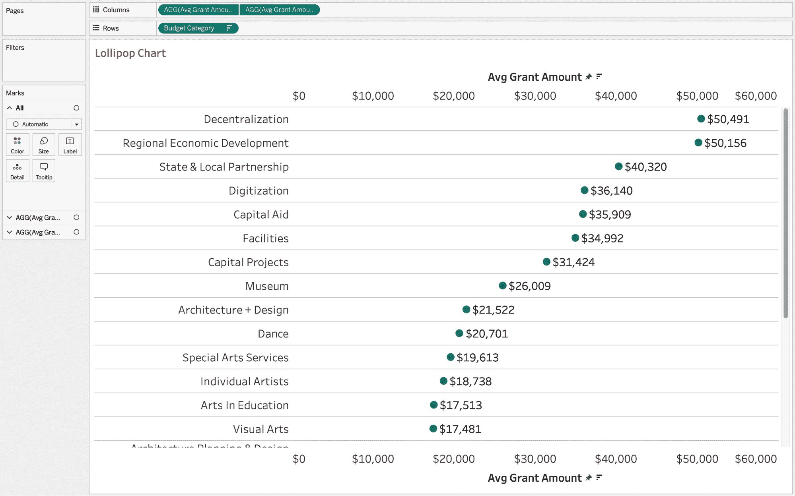
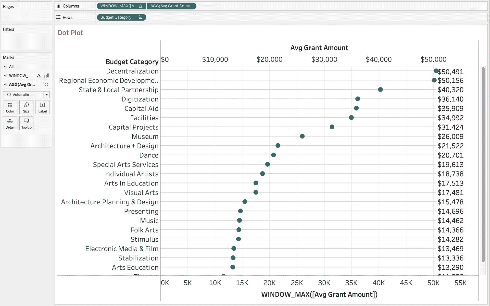
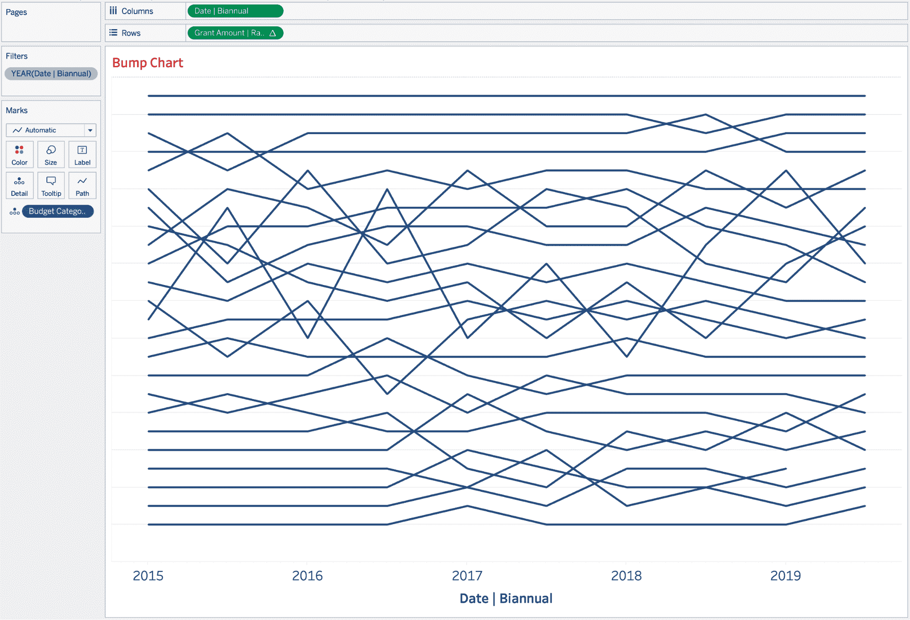
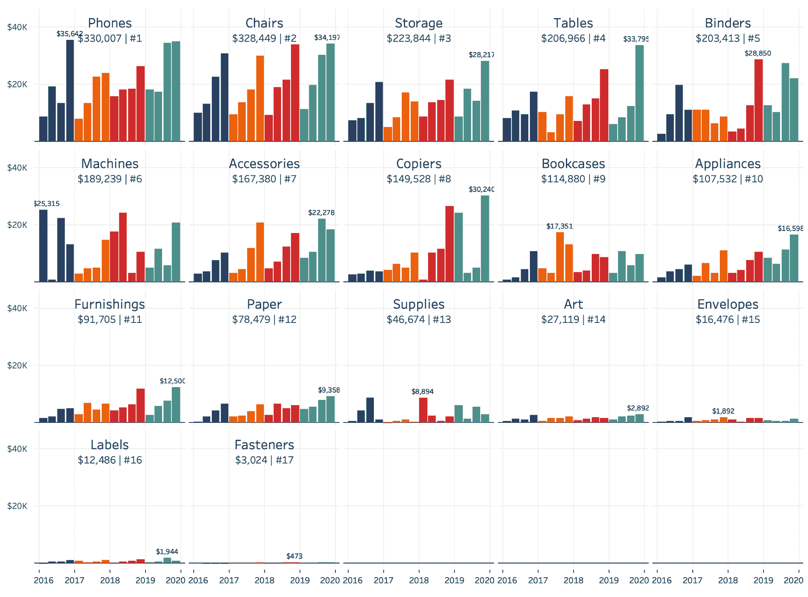

# 第三章：进行比较

比较是数据可视化的核心。我们的观众经常专注于比较两个或更多的值。作为从业者，我们的工作是简化每组值的比较。

比较中有些比较容易。如果你在比较一个单一值的两个组，你的比较就很直接：使用柱状图。大多数情况下，你应该只使用柱状图，因为柱状图是最多才能且最常见的用于比较的图表类型。

但是每个柱状图都有一个挑战：它是一个柱状图！你的观众已经看过这种图表类型数百、数千甚至数百万次。在本章中，我们将为您提供一些替代方案，如克利夫兰点图和棒棒糖图，以及各种格式化柱状图的方法。

在创建这些替代图表时，请认真考虑您是为了观众的需求还是为了自己而寻找柱状图。如果是为了你自己，就保持为柱状图。如果是为了你的观众，那么很好——使用替代方案。

并非所有的比较都像柱状图那么直接。有时您正在比较一个维度的成员及其内部不同时间点。其他时候，您正在比较多个成员与多个维度。有时您担心实际度量，有时是值的排名。有时您有兴趣比较值，而不是其他成员，而是整体组。

在本章中，我们将提供其他比较方法，包括柱状图上的柱状图，显示两个时间段之间排名变化的图表，颠簸图，哑铃图，栅格和平行坐标。

# 柱状图及其替代方案：增强性能案例研究

正如我们已经讨论过的那样，数据可视化从业者制作了大量的柱状图——这是理所当然的。正如您在第一章中所学到的，柱状图比较一个或多个组在单一度量上的两个或更多的组。柱状图易于使用，因为您只需比较一个柱的长度或高度与另一个即可。一眼就能看出差异的大小。

一个在表演艺术领域的非营利组织，AP 正试图更好地了解其赠款计划。其高管们想知道平均赠款金额与赠款类型的比较情况。他们已经向资助者展示了同样的图表四年了，现在正在寻找不同的方式来增强数据的视觉冲击力！他们如何能够增加这些数据的视觉冲击？

在授予数据中，您将使用名为[Program]的组来比较数据，并创建名为[Avg Grant Amount]的度量。您将使用此组和此度量进行五个示例。

## 策略：与基本柱状图进行比较

首先，让我们从基本的柱状图开始：

1.  连接到非营利授予数据集。

1.  创建一个名为`**[Avg Grant Amount]**`的计算字段。

1.  使用现有字段并编写以下公式：

    ```
    // Avg Grant Amount
    SUM([Grant Amount])/COUNT([Record ID])
    ```

1.  将[程序]添加到列中，将[平均拨款金额]添加到行中。

1.  将标记类型更改为条形。

1.  在列架上旋转标签，使文本垂直显示。

我们首先创建了这个垂直条形图，因为几乎每个人在学习如何制作条形图时都是垂直绘制的。当你使用文档编辑器或电子表格工具时，这种方式经常被强化。大多数人无法避免默认设置是垂直条形图。另一种选择是水平条形图，接下来你将学习如何制作。

但首先，让我们来解剖这个垂直条形图。在这里，[程序]在列上，[平均拨款金额]在行上，正如你在图 3-1 中所见。


###### 图 3-1：显示类别平均拨款金额的垂直条形图

让我们像您的观众一样查看这个图表。乍一看，它看起来很不错。例如，您可以轻松识别出去中心化和地区经济发展基金作为平均拨款金额最大的两个类别。

然而，当你开始比较时，确定组的顺序更加困难。虽然按字母顺序排序很好，但并不是那么有意义。另外，要读标签，您需要稍微弯曲脖子。如果有更好的方式就好了。

我们几乎总是建议使用水平条形图而不是垂直条形图。如果在阅读本文之前制作了许多垂直条形图，那完全没问题。这并不是你的错，是你的小学老师让你为所有数学和科学项目制作垂直条形图。我们中的许多人习惯从左到右阅读，特别是说母语为从左到右语言的人，所以我们处理文本和信息的方式也很容易。这意味着选择垂直条形图而不是水平条形图。（记住，并不意味着你必须放弃水平条形图。）

## 策略：将垂直条形图转换为水平条形图

在下一个示例中，您将制作一个水平条形图：

1.  复制蓝图 3-1 中的工作表。

1.  将工作表设置为填充整个视图。

1.  单击“交换轴”按钮以交换行和列。

1.  如有必要，在行上旋转标签。

1.  将[程序]组按[平均拨款金额]降序排列。

1.  右键单击可视化并选择“格式”。使用 Tableau 颜色调色板中第二轻灰色选项添加行分隔线，以匹配图 3-2。

1.  在格式面板中，单击线按钮（五个选项中的第五个），然后通过将这些值设置为无来删除所有网格线、零线和坐标轴标尺。

1.  将条的大小调整为最大值的约 50%。

1.  单击“标签”在“标记”卡上，并选择“显示标签”。

1.  右键单击[平均拨款金额]轴，并取消选择“显示标题”以隐藏标题。


###### 图 3-2。水平条形图对您的受众来说更容易解释，因为文本可以从左到右阅读

水平条形图为您的柱形图的标签打开了机会。您可以包含标签以向柱形图添加更多上下文，指示与以往期间的变化，总数的百分比，或与其他成员的排名相比。

如果您选择添加标签，可以隐藏轴。轴和标签达到相同的目标：它们为柱状大小提供比例。包括两者意味着包含冗余信息，作为从业者，您希望最小化冗余。（但是，如果您发现您的受众经常误解信息，您可能需要包含冗余信息，在文本形式中提供额外的背景信息，或选择不同的可视化方式进行沟通。）

对于这个水平条形图示例，我们选择添加了标签，所以我们让您隐藏了轴并移除了 Tableau 格式面板中包含的网格线，网格标尺和所有其他线型。我们还建议您按指标对值进行排序。Luke 个人喜好也是增加每个柱之间的空白（通过减少柱宽）并在格式选项中包含行分隔符，如图 3-2 所示。

现在再假设您是我们预期受众中的一个个体。与之前一样，您可以迅速看出去中心化和地区经济发展是平均拨款金额最高的两个类别。但是现在，您还可以看到州和地方合作伙伴是接下来的，平均拨款金额大约低了$10,000。您可以看到大多数类别的平均拨款金额在$14,000 到$20,000 之间。最后，您可以看到艺术教育，戏剧和文学的平均拨款金额最小。当然，所有这些信息在垂直条形图中都是可用的，但是使用我们的水平条形图，我们可以更快地获得这些见解。

现在我们已经为水平条形图做出了推荐，让我们谈谈帮助您的受众打破看到条形图的例行公事的替代方法。接下来，我们将向您展示如何创建棒棒糖图和单点（或克利夫兰）点图。

## 策略：创建棒棒糖图

打破条形图单调性的最简单方法之一是创建*lollipop chart*。这只是一个带有每个柱形图末端圆圈的柱形图（Figure 3-3）。出于某种原因——也许是圆形的端点——受众和开发者喜欢使用这种图表类型。


###### 图 3-3\. 棒棒糖图表是您或您的观众从查看条形图中休息的快捷方式，尽管棒棒糖图表也是一种条形图

按照以下步骤创建您的棒棒糖图：

1.  创建一个新工作表。

1.  使用相同的维度创建一个双轴图表——在本例中使用 [平均授予金额]。这将给您两个可以控制的 Marks 卡。如果您还没有制作双轴图表，可以通过两次将 [平均授予金额] 添加到列轴上来完成。然后右键单击列上最右边的度量，并选择双轴。在视图的顶轴上，右键单击并选择同步轴。结果显示在 图 3-4 中。

    ###### 提示

    同步轴确切地执行其名称所示的功能：它确保跨双轴图表的度量单位是相同的。如果您在两个轴上使用相同的度量标准，则需要确保启用此选项。

    

    ###### 图 3-4\. 棒棒糖图的第一步

1.  对于 Marks 卡 1，在列上点击最左边的 [平均授予金额]。然后进行以下更改：

    1.  将标记类型更改为条形。

    1.  将条形的大小改为小于圆圈。

1.  对于 Marks 卡 2，在列上点击最右边的 [平均授予金额] 度量。然后进行以下更改：

    1.  将标记类型从自动更改为圆圈。

    1.  在此 Marks 卡上显示标记标签，并将对齐方式更改为右中。

    1.  如有必要，调整圆圈大小。请参阅 图 3-5 查看结果。

        

    ###### 图 3-5\. 创建一个带有条形和圆圈的同步双轴，以制作双轴图表。确保为圆圈添加标签而不是条形。

1.  格式化可视化如下：

    1.  通过右键单击并取消在轴上显示标题来隐藏标题。

    1.  删除网格线、零线和轴标尺。

    1.  添加行分隔线。

    这会生成 图 3-6 中的可视化效果。


###### 图 3-6\. 最终的棒棒糖图，显示按类别平均授予金额

观众和开发人员喜欢棒棒糖图表。它们提供了一种从条形图中稍作休息的微妙方式，并且构建棒棒糖图表并不需要太多工作。

棒棒糖图的一个缺点：它们不能完全准确地代表数据。条形图是数据的准确表示，但我们在每个条形的末端加上一个圆圈。圆圈的中心与条形的中心对齐。这意味着圆圈的一半会误传数据（图 3-7）。


###### 图 3-7\. 棒棒糖图在创建可视化的完全准确描述方面并非像素完美，但这没关系

关于这种不准确性，我们的任务是创建近似数据的可视化。大多数图表类型已经是数据的近似值。如果这种抽象水平会改变读者对数据的解释，请不要使用它。如果仍然是一个接近的近似值，请随时使用它。只需准备好证明您的决定即可！

## 策略：创建基本的克利夫兰点图

正如我们在本章开头提到的，我们的受众正在寻找替代柱状图的方法。卢克个人最喜欢*Cleveland 点图*。他喜欢使用它，因为它增加了数据元素的间距，减弱了非数据元素的影响，同时仍然提供与柱状图相同的信息。

[克利夫兰点图](https://www.jstor.org/stable/2288400?seq=1)并不来自俄亥俄州克利夫兰市。相反，它是由威廉·克利夫兰和罗伯特·麦吉尔在 1984 年发布的设计。使用点图，我们可以沿着轴用圆圈显示值。然后在轴的末端显示每组的值，如图 3-8 所示。


###### 图 3-8\. 按类别显示平均资助金额的克利夫兰点图

我们喜欢点图而不是柱状图的原因是，我们可以增加整体的空白空间，保持现有值的比较，并将文本/值对齐到单列中。我们还可以使用金额标签作为参考，快速了解数据范围（回顾第二章中的点图）。

按照以下步骤创建基本的克利夫兰点图：

1.  要构建可视化效果，请创建一个新的工作表。

    1.  将[程序]添加到行中。

    1.  与棒棒糖图一样，两次将[Avg Grant Amount]添加到列中，然后创建同步的双轴。

1.  在列上的最左边的[Avg Grant Amount]测量中，双击并编辑计算。在`WINDOW_MAX()`函数中包装[Avg Grant Amount]（图 3-9）。

    `WINDOW_MAX()`计算是一个表格计算，将返回所有[Avg Grant Amount]的最大值。通过右键单击并设置计算使用为“表格（向下）”来编辑表格计算。

    ###### 注意

    表格计算允许您在正在创建的可视化数据之上进行分析。虽然我们不会详细讨论*它们的功能，但您可以查看 Tableau 自己的[前 10 个表格计算博客](https://oreil.ly/jHVud)以获取更多见解。

    

    ###### 图 3-9\. 在列上创建一个临时的`WINDOW_MAX()`计算

1.  根据以下方式自定义您的条形图：

    1.  将标记类型从自动更改为条形。将条的大小更改为可能的最小值。我们不希望条形过于显眼，因此将其颜色更改为浅灰色。

    1.  在标签中添加[平均授予金额]。

    1.  如果您希望使背景条大小更窄，您可以单击 Marks 卡上的颜色，并将边框颜色设置为与背景相匹配的颜色。完成此步骤后，您的可视化应类似于图 3-10。

        

    ###### 图 3-10\. 在调整格式之前窥视克利夫兰点图

1.  调整圆圈如下：

    1.  单击列上最右侧的[平均授予金额]。将标记类型从自动更改为圆圈。

    1.  更改圆圈的大小。我们更喜欢较小的圆圈，即小于我们使用`WINDOW_MAX()`创建的线条之间距离的 50%。必须手动调整此标记的大小，因此尽量眼测到一个看似合适的大小。

1.  完成可视化（图 3-11）：

    1.  将颜色调整为与背景线条明显不同的颜色。

    1.  隐藏坐标轴。

    1.  在格式窗格中删除所有线条和分隔线。


###### 图 3-11\. 最终结果：显示按类别平均授予金额的克利夫兰点图

正如我们之前提到的，点图为我们提供与条形图相同的信息，同时增加了空白空间，保留了比较的便利性，并将标签垂直对齐。我们可能会在右对齐标签或增加线条与标签之间的空白方面挑剔，但对于大多数受众来说，这里的基本点图已经足够了。

# 排名变化的条形图：AP 案例研究

并非所有比较都需要您检查测量值跨越或在测量内部的大小。有时，您的受众仅对比较不同组的排名变化以及一段时间内的排名变化感兴趣。Tableau 提供了许多显示值排名的方法。我们将从一个简单的方法开始：显示总授予金额的当前排名以及从一年到另一年的排名变化。

现在我们更好地了解了分发的资助金额，我们希望比较按组和年份分类的资助。让我们探讨如何显示排名顺序变化。

AP 正在仔细查看其账簿，并试图更好地理解年度资金趋势。高管们想要了解他们服务的每个行业部门分别获得了多少资金，并且从 2018 年到 2019 年每个部门是否出现了增长或减少。您将如何构建一个展示这些变量之间关系的可视化呢？

## 策略：在条形图上显示排名和排名变化

在本例中，我们将再次显示 2019 年的总授予金额。这一次，我们将显示相对于 2019 年所有其他组的排名，同时也显示从 2018 年到 2019 年在同一度量标准上排名的总变化。图 3-12 显示了一个预览。


###### 图 3-12\. 我们将为下一个策略创建的可视化快照。注意右侧的排名值及排名变化的//分隔符。

在图表中使用排名的原因很简单：我们人类只能处理有限的信息量。有时候，比较两个测量之间的变化时，通过比较排名的变化更容易理解。这里是这种策略的步骤：

1.  通过将[Program]添加到行，将[授予金额 | 2019]添加到列以及将其添加到 Marks 卡上的标签，创建基本条形图(图 3-13)

    

    ###### 图 3-13\. 一个水平条形图显示 2019 年按类别划分的总授予金额

    ###### 注意

    Tableau 内置了几种排名计算，包括`RANK()`、`RANK_DENSE()`、`RANK_MODIFIED()`、`RANK_PERCENTILE()`和`RANK_UNIQUE()`。尽管这些计算在某些情况下可能更合理，但我们将使用`INDEX()`函数。由于它在计算中不进行排名数字的比较，因此更可靠和灵活。

1.  创建排名计算如下：

    1.  创建名为`**[指数 | 授予金额 | 2019]**`的新计算：

        ```
        // Index | Grant Amount | 2019
        INDEX()
        ```

        `INDEX()`根据您指定的表计算方式创建一个值的递增计数。我们将通过调整视图上的表计算来设置[指数 | 授予金额 | 2019]执行这种递增计数。

    1.  将`**[指数 | 授予金额 | 2019]**`添加到 Marks 卡上的标签。您会注意到，该函数只是通过视图上的标记从上到下添加了一个递增的值(图 3-14)。

        

        ###### 图 3-14\. 一个未格式化的水平条形图显示 2019 年的总授予金额和未排序的`INDEX()`值

    1.  要使计算像排名一样工作，请通过右键单击 Marks 卡上的值并编辑表计算来编辑表计算。选择特定维度，并确保选择了 Program。现在您可以编辑排序顺序。选择自定义，并在[授予金额 | 2019]上选择降序。该函数现在应该看起来像一个唯一的排名(图 3-15)！

        

    ###### 图 3-15\. 显示 2019 年总赠款金额和基于 2019 年总赠款金额的排序`INDEX()`值的未格式化水平条形图

1.  创建排名变动计算：

    1.  创建[指数 | 赠款金额 | 2018]的副本，并称新计算为`**[Index | Grant Amount | 2018]**`：

        ```
        // Index | Grant Amount | 2018
        INDEX()
        ```

    1.  对于下一个计算，你将计算两个指数计算之间的差异。创建一个名为`**[Index Change | Grant Amount]**`的计算：

        ```
        // Index Change | Grant Amount
        [Index | Grant Amount | 2018] - [Index | Grant Amount | 2019]
        ```

    1.  将此计算添加到 Marks 卡上的文本中。编辑表格计算。你可以定制[指数 | 赠款金额 | 2018]和[指数 | 赠款金额 | 2019]。这些表格计算显示在图 3-16 中。

        

        ###### 图 3-16\. 一定要编辑 2018 年和 2019 年的表格计算。使用下拉菜单选择要更新的表格计算。

        这是一个重要的步骤，因为接下来的计算依赖于正确排序[指数 | 赠款金额 | 2019]和[指数 | 赠款金额 | 2018]。

    1.  一定要对[指数 | 赠款金额 | 2019]进行降序自定义排序，使用[赠款金额 | 2019]进行排序，并对[指数 | 赠款金额 | 2018]进行降序自定义排序，使用[赠款金额 | 2018]进行排序。这将为你提供一个正确的计算，显示从 2018 年到 2019 年的排名变化。

1.  一旦计算正确显示结果，右键点击并编辑[指数变化 | 赠款金额]的文本格式。使用自定义格式写`**(↑0);(↓0);""**`，如图 3-17 所示。你可以通过按住 Alt 键并输入`24`来输入上箭头，按 Alt-25 来输入下箭头。

    

    ###### 图 3-17\. 使用自定义文本格式添加箭头到正值和负值

    此自定义格式化以三种方式格式化值：当值为正时，当值为负时，或当值为零时。这些规则按照正、负和零的顺序指定，并用分号分隔。根据这些规则，正值将以带有上箭头的括号显示，负值将以带有下箭头的括号显示，如果排名没有变化，则不会显示任何内容，因为我们使用空引号。

    一旦你格式化了标签的显示，可视化效果会类似于图 3-18。

    

    ###### 图 3-18\. 一个未格式化的横向条形图，显示 2019 年的总授款金额，使用未排序的`INDEX()`值进行 2019 年总授款金额的排名，并使用嵌套的`INDEX()`函数在单个计算中显示排名变化

1.  现在您已经在仪表板上放置了所有组件，您需要通过格式化可视化文本的方式，格式化线条和分隔符，并对类别进行排序来完成视图。

    从编辑文本标签开始。对于这种策略，您将把所有的测量指标放在一行，并添加两个斜杠以帮助区分排名和值（见图 3-19）。


###### 图 3-19\. 更改排名条形图标签的文本编辑器视图

这种策略的优点在于显示排名变化。该元素使观众能够看到变化如何影响从一个时期到下一个时期的类别顺序（见图 3-20）。


###### 图 3-20\. 最终版本显示 2019 年的总授款金额，跨 24 个类别的排名比较以及从 2018 年到 2019 年的排名变化

# 跨多个时期的排名变化的颠簸图：AP 案例研究

之前的策略侧重于在仅两个时期内对排名变化的跟踪。如果您试图在多个时期内跟踪这一时期呢？显然，带有几个条形图箭头的文本是行不通的。我们需要使用不同的图表类型。

AP 委员会对 2018 年和 2019 年按行业部门资助的演示非常印象深刻，因此他们要求您提供更多信息。他们要求对同一行业部门进行评估，以表明每年分配了多少授款资金。这一次，他们希望看到这些信息在 2015 年到 2020 年的五年期间的表现。您将如何创建一个仍然清晰可读且具有影响力的可视化呢？

首先，让我们看一看一张折线图，显示每个季度的总授款金额，并从您的受众角度考虑它（见图 3-21）。


###### 图 3-21\. 一张（不太理想的）折线图，显示每个类别每季度的总授款金额

此线图有很多线，但惊人地不难跟踪。通常，应避免在折线图上有超过八条线，因为太多线条往往会重叠。但观众更感兴趣的是任何类别与其他类别的比较，而此图表未显示随时间的变化。所需的是一种能描述这种排名变化的图表。

用于随时间变化排名的最佳图表类型之一是*颠簸图表*。使用颠簸图表可以看到排名如何随时间变化，而不至于完全迷失在信息中。与构建前述图表不同，让我们构建一个颠簸图表，允许我们选择单个类别（图 3-22）。


###### 图 3-22\. 一个颠簸图表显示 24 个类别按季度排名随时间变化

怎么制作颠簸图表？

## 策略：制作颠簸图表

颠簸图表与折线图有根本区别。这种颠簸图表策略显示了从 2015 年到 2019 年每半年类别排名的变化。信息不关心基础拨款总额有多接近；相反，它只关注整体排名。在这种情况下，颠簸图表展示了艺术家个人拨款在其他类别相对排名的周期性特征：

1.  创建如下线图：

    1.  将`SUM([Grant Amount])`添加到行，并将[Program]添加到 Marks 卡片的详细信息。

    1.  创建一个名为`**[Date | Biannual]**`的新计算字段，返回最接近半年的日期，即 1 月 1 日或 7 月 1 日：

        ```
        // Date | Biannual
        IF MONTH([Date]) > 6
        THEN DATEADD('month', 6, DATETRUNC('year', [Date]))
        ELSE DATETRUNC('year', [Date])
        END
        ```

        将此计算放置在列上，然后右键单击并更改为精确日期。

    1.  使用[Date | Biannual]添加一个上下文过滤器，并选择所有年份，但不包括 2020 年。

        ###### 注

        *上下文过滤器*与标准维度过滤器略有不同，因为它过滤数据不包括在固定 LOD 计算中。标准维度过滤器在 LOD 计算完成后应用于视图。

    1.  在行上为`SUM([Grant Amount])`添加一个排名表计算。设置排名为唯一且降序（图 3-23）。在[Program]上计算此计算。

        

        ###### 图 3-23\. 为每个日期按节目创建唯一降序排名的总拨款美元

    1.  将度量的副本拖动到数据窗格的表区域。这将创建一个新的保存计算。编辑计算名称为`**[Grant Amount | Rank]**`。

        创建计算后，您的可视化将如图 3-24 所示。

        

    ###### 图 3-24\. 添加排名计算后的工作进展

1.  根据以下准备标签：

    1.  编辑排名轴并反转轴。隐藏排名轴。

    1.  要添加标签，请创建两个计算。第一个应命名为`**[Bump Category Label]**`：

        ```
        // Bump Category Label
        IF [Date | Biannual] = {MIN([Date | Biannual])}
        OR [Date | Biannual] = {MAX([Date | Biannual])}
        THEN [Program]
        END
        ```

        将第二个`**[Bump Rank Label]**`命名为调用。

        ```
        // Bump Rank Label
        IF MAX([Date | Biannual]) = MIN({MAX([Date | Biannual])})
        OR MIN([Date | Biannual]) = MAX({MIN([Date | Biannual])})
        THEN [Grant Amount | Rank]

        END
        ```

        我们将在第四章讨论这些计算的部分。现在只需知道，这两个计算将显示每个类别的起始和结束日期及相应的排名标签即可。  

1.  构建标签如下所示：

    1.  将[Bump Category Label]添加为标签的属性。

    1.  将[Bump Rank Label]添加到标签中，并将表格计算更改为在[Program]上使用特定维度。

    1.  编辑[Date | Biannual]轴，使其范围从 2013 年 1 月 1 日到 2022 年 1 月 1 日，然后隐藏轴。我们设置轴的范围超出数据中的值，以便为标签腾出空间。

    1.  右键单击并格式化[Bump Rank Label]，以便在排名值前面添加`**#**`（见图 3-25）。

        

        ###### 图 3-25\. 突显图表文本标签的自定义格式

    1.  格式化文本后，将标签对齐到中间。此时的图表如图 3-26 所示。

        

    ###### 图 3-26\. 在添加突出显示之前查看突出显示的进度

1.  突出显示单个类别：

    1.  从[Program]创建名为`**[Program Parameter]**`的参数。

    1.  从维度和参数创建名为`**[Program | TF]**`的计算：

        ```
        // Program | TF
        [Program] = [Program Parameter]
        ```

    1.  将这个新维度放置在 Marks 卡片的大小和颜色上。

    1.  编辑颜色，使 False 值为灰色，True 值为蓝色。将 True 值放在 False 值前面，并使 True 值的大小大于 False 值的大小。

    1.  编辑[Grant Amount | Rank]和[Bump Rank Label]的表格计算，以包括[Program]和[Program | TF]作为计算表格计算的特定维度（见图 3-27）。

        ![调整排名计算的表格计算，以包含[Program | TF]作为选定的维度](Images/TAST_0327.png)

    ###### 图 3-27\. 调整排名计算的表格计算，以包括[Program | TF]作为选定的维度

    完成此步骤后，您的可视化将如图 3-28 所示。

    

    ###### 图 3-28\. 显示单个类别的最小格式的突显突显图表

1.  格式化突显图表如下所示：

    1.  移除所有线条和分隔线。

    1.  还值得将你的工具提示格式化为包含`SUM([Grant Amount])`。我们更喜欢超越默认的工具提示格式。

    图 3-29 展示了最终的突出显示的突显图表。


###### 图 3-29\. 一个完全格式化的凸起图显示最终的可视化结果

# 层次数据的哑铃图：办公必需品案例研究

比较不仅限于条形图和排名。有时，你必须比较层次结构的数据。用于层次比较最常见的方法之一是哑铃图。（惊喜！）

我们在本章的其余部分进行的比较可以应用于任何行业。然而，对于这个策略——以及本章剩余的策略——我们将从社区资助数据转换为使用零售数据。

OE 公司的销售副总裁请求数据团队提供公司产品线子类别的销售量按地区显示的分析。他计划在未来一年内增加团队成员，并需要更好地了解销售机会。OE 公司有 17 个子类别和 4 个销售地区。

在许多数据点需要表示的情况下，如何清晰地呈现数据是最好的方式？你可能会把这些数据看作是单列条形图（图 3-30）。


###### 图 3-30\. 这种子类别和区域并列条形图不理想，因为它占用了空间

我们不能说这是一个糟糕的解决方案：如果我们的受众查看任何子类别，他们将能够轻松比较各个地区。问题在于，如果他们对存储子类别感兴趣，例如，他们必须浏览几十个数据点，直到找到他们感兴趣的信息。当他们找到时，他们必须重新适应图表。

另一种选择是将[Region]移动到列中，将[Margin 的百分比]移动到行中，以在每个子类别内创建垂直条形图。这减少了观众的认知负荷：他们现在能够更快地处理信息，因为每一行现在都是一个子类别（而不是子类别和地区的组合）。现在，当他们从左到右扫描时，他们能够快速比较子类别内的各个地区（图 3-31）。


###### 图 3-31\. 即使这种并列条形图也占用了太多空间

虽然这张图在每个地区内提供了清晰度，但它很长，限制了读者在各个子类别之间进行比较的能力。在这里可能很有效的替代条形图的方法是*哑铃图*——点图的近亲。

###### 注意

*杠铃图* 的名称来自于其形状类似杠铃，一根直杆两侧各有一个重物。在数据可视化中，这个概念可以扩展到包括更多点，其中第一个和最后一个点（以及线的长度）代表所绘制度量的最小值和最大值。

杠铃图将点放置在多条线上，每条线代表第二维度，感兴趣的度量是线的连续性。示例见 图 3-32。


###### 图 3-32\. 杠铃图可以显著整合原本可能以并排条形图表示的可视化

结果是一种简洁的视觉表现形式，使您的观众能够快速理解度量内的性能，同时把握总体表现。杠铃图的成功不仅在于绘图设计，还在于格式化。通过 图 3-32 中的图表，您的观众可以按照一个子类别从左到右或快速上下扫描比较值的准则。

那么您如何构建这种可视化呢？

## 策略：构建杠铃图表

按照以下步骤构建我们的杠铃图：

1.  创建基础可视化：

    1.  连接到 Sample – Superstore 数据集。将 [子类别] 添加到行上。

    1.  将 [区域] 添加到颜色。在本例中，我们已经定制了颜色。

    1.  创建名为 `**[% 利润率]**` 的计算：

        ```
        // % Margin
        SUM([Profit]) / SUM([Sales])
        ```

    1.  将 [% 利润率] 计算添加两次到列架上 (图 3-33)。

        

    ###### 图 3-33\. 创建杠铃图表，从堆叠条形图开始

1.  自定义标记卡：

    1.  对于最左侧的 [% 利润率] 标记卡，将标记类型从自动更改为线条。将 [区域] 从颜色移到路径。

    1.  对于最右侧的 [% 利润率] 标记卡，将标记类型从自动更改为圆圈。通过为圆圈标记添加边框来格式化颜色。

    1.  创建同步双轴图表。

1.  完善格式：

    1.  你将在行架上添加一个内联计算。在行架上 [子类别] 右侧双击并输入 `**MIN(0.0)**`，如 图 3-34 所示。这将创建一个标尺，观众将使用它从子类别移动到轴上的值。按 Enter 键。

        ###### 小贴士

        使用 `MIN(0.0)`，`MIN(0)` 和 `MIN(1)` 是 Tableau 开发中常见的惯例，用于创建虚拟连续轴。它们通常用于将不同的度量添加到标签或进行额外的格式化。

        

    ###### 图 3-34\. 添加 `MIN(0.0)` 作为临时计算

    这将给你一个新的垂直轴。右键单击并隐藏新的轴（参见图 3-35，取消选中显示标题以隐藏轴）。

    

    ###### 图 3-35\. 取消选中显示标题以隐藏轴

1.  调整子类别大小，使其适合简洁视图：

    1.  格式化并移除所有边框线，除了列网格线和零轴行。

    1.  格式化这些线的类型和颜色，使其相同。

    1.  在[子类别]标题上右键单击，并选择隐藏行的字段标签（在整本书中我们会经常这样做）。

    1.  右键单击任何子类别，并格式化标题，使成员右对齐。

    1.  右键单击[MIN(0.0)]标题并取消选中显示标题。

    1.  调整圆圈大小，使其显眼但不会分散观众注意力。保持线条细，但不要使用最细的（以使其与指南区分开）。

    图 3-36 展示了最终结果。


###### 图 3-36\. 杠铃图的最终版本

另一种选择是使线条略大于圆圈（参见图 3-37，另一种替代杠铃图，其中点之间的线条较粗）。 无论您选择宽线还是窄线，都可以利用圆圈的边框颜色来帮助区分圆圈的颜色和形状与线条的颜色。


###### 图 3-37\. 另一种替代杠铃图，其中点之间的线条较粗

杠铃图的结果是一个简洁的图表，使您的观众能够快速比较组内的值，甚至跨组查看值。

# 格子图/小多图表：办公必需品案例研究

请考虑图 3-38 所示的线条图，展示了四年来每个季度的总销售额，分为 17 个子类别。


###### 图 3-38\. 另一种不太理想的线条图，显示按子类别销售情况

假设你是观众中的一员。你对这个图表的反应可能是，“这是什么鬼？太乱了！” 实际上，几乎没有人希望看到超过八条线的线条图（认真的）！ 您的观众希望追踪单一线条，但即使使用颜色编码，也不可能仅跟踪一个线条。 您必须找到更好的方法来传达这些信息。 我们更倾向于使用小多图或格子图表来分享这些信息的一种方式。

*格子图* 实际上是一系列使用完全相同坐标轴的图表，通常按网格排列。 与显示具有 17 条线的单一线条图相比，我们可以选择显示 17 个单独的图表——例如作为条形图——以展示数据中的模式（参见图 3-39，小多图可以用来显示模式）。



###### 图 3-39\. 小倍数可用于显示组内随时间变化的模式

在 OE，销售副总裁非常欣赏数据团队提供的见解，因此他要求提供更多信息。在做出招聘决策时，他希望看到更细粒度的视图，显示按季度的销售情况。如何清晰地表示这些信息呢？

图 3-39 展示了我们 17 个子类别按季度的总销售额。每年都有不同的颜色以帮助分析。我们还在每个子类别内添加了标签，显示最大值，以提供额外的背景信息。

使用小倍数，你的观众可以追踪数据中的模式。在这种情况下，他们将能够看到数据的季节性以及子类别的整体表现。当他们查看这张图表时，他们可以看到手机和椅子是最畅销的产品。他们可以注意到椅子、桌子、配件和纸的季节性一致。他们还可以注意到 2019 年 Q2 和 Q3，复印机销量显著下降，然后在 Q4 恢复到正常值。现在你的观众可以追踪个别数值了。

这种图表类型的一个缺点是不知道任何特定柱的实际值 —— 但这几乎是每种可视化都面临的挑战。此外，跨子类别比较数值可能会很困难。但这是任何图表的斗争；任何图表类型都需要权衡。你的工作是权衡选项并选择最佳类型。

在 Tableau 中构建格子图表时，难度取决于期望的结果。您可以通过检查销售区域和业务部门来创建一个简单的格子图表，就像图 3-40 所示。


###### 图 3-40\. 一个简单的小倍数图，其中两个维度定义行和列

在 Tableau 中完成这种类型的格子图表非常简单：行上至少需要一个维度，列上需要另一个维度（图 3-41）。

![在列上 [分段] 和在行上 [区域] 的近距离观察](Images/TAST_0341.png)

###### 图 3-41\. [分段] 在列上和 [区域] 在行上的近距离观察

真正的挑战是使用单个维度创建一个小倍数的网格。在接下来的策略中，您将使用单个维度创建一个格子图表。这绝非一种即插即用的图表。要创建此可视化，您需要考虑如何设计您的网格并添加标签。

最后一点：由于使用了表格计算，如果某个维度的某个成员在视图的任何部分缺少数据，这些图表可能会出现问题。

## 策略：为单个维度创建格子图表

让我们开始吧！使用 Sample - Superstore 数据集，创建一个新工作表，并按照以下步骤操作：

1.  创建网格。这需要使用表计算。您将在此步骤中编写三个计算并创建一个参数：

    1.  创建一个名为`**[索引]**`的新计算，用于对网格上显示的成员进行排序：

        ```
        // Index
        INDEX()
        ```

        您将在另外两个计算中使用此计算，这些计算将形成列和行。

    1.  创建一个名为`**[总列数]**`的新整数参数。这将为我们的镶嵌图表动态更改列数提供一种方法。将值设置为 5。

    1.  创建一个名为`**[列名]**`的计算，用于将每个成员编码到适当的列中：

        ```
        // Columns
        ([Index] - 1) % [Total Columns]
        ```

        此计算使用`INDEX()`函数，该函数创建一个从 1 到任意数字的值的运行计数，并应用模函数。

        ###### 提示

        模运算符计算除法问题的余数。还记得在小学时计算除法问题的余数而不是小数吗？我们打赌您从未想过成年后还会用到它！

        此计算的输出为您提供了一个维度的成员，根据您在总列数参数中指定的任何数字分成多组：在这里，是五组。图 3-42（#output_of_the_index_and_columns_calculat）显示了您希望看到的映射。

        

        ###### 图 3-42。索引和列计算的输出

    1.  现在您已经有了[列]的计算，您所需要的只是[行]的计算：

        ```
        // Rows
        ((([Index] - 1) - [Columns]) - 1) / [Total Columns]
        ```

        将[子类别]和[索引]添加到详细信息中。将[列]添加到列架上，将[行]添加到行架上。将[列]和[行]更改为离散。

    1.  要在工作表上构建网格，请编辑[列]、[行]和[索引]的表计算，并选择具体维度，选择[子类别]。右键单击标记卡上的[子类别]，使用销售总额降序创建自定义排序。对于[行]计算，您有两个表计算需要编辑。确保表计算使用相同的计算依据和排序顺序选项（图 3-43，#use_table_calculations_to_build_the_grid）。

        

    ###### 图 3-43。使用表计算为小多重叠图构建网格

1.  现在，您已经建立了网格，可以开始构建可视化。您将根据订单日期查看销售情况：

    1.  将[订单日期]拖放到列中。然后右键单击并选择连续的季度日期类型（图 3-44，#change_order_date_to_a_date_value_by_qua）。

        

        ###### 图 3-44。将订单日期更改为按季度的日期值

    1.  将 SUM([销售额])添加到行中。将 YEAR([订单日期])添加到颜色中。您可能需要将标记类型更改为条形图。这使您得到了图 3-45（#a_small_multiple_chart_without_sub-categ）中的可视化效果。

        

        ###### 图 3-45\. 每个网格部分没有子类别标签的小多图表

        我们已完成可视化的基础。现在，每个框的标签会很好。要做到这一点，您将创建一个双轴图表，并添加两个自定义计算。

1.  要在每个多重图表的正上方添加一个居中的标签，请创建一个自定义日期计算，以识别最中间的日期：

    1.  通过识别我们日期的端点然后取两者的平均来完成此操作。编写以下计算，称为`**[订单日期 | SM 标签]**`：

        ```
        // Order Date | SM Label
        {MIN([Order Date])} + (({MAX([Order Date])} - {MIN([Order Date])})/2)
        ```

        它找到第一个和最后一个订单日期，然后找到两个日期的中间。 (您将在第四章中了解更多信息。)

    1.  将此计算作为确切日期添加到“列”货架上。您会注意到一个单独的堆积条形图，对应于新的日期计算（图 3-46）。

        

        ###### 图 3-46\. 为获取适当的标签而进行的工作进展

    1.  编辑[订单日期 | SM 标签]的标记卡。将标记类型更改为文本并从颜色中删除 YEAR([订单日期])。

    1.  创建一个同步的双轴。在同一标记卡上，将[子类别]和[索引]从详细信息移动到文本。

        您会看到一个问题是，文本在每个子类别上不对齐（图 3-47）。这是因为对于[订单日期 | SM 标签]轴，每个标签都位于该子类别的总体总数处。我们需要找到一些魔法（或巧妙的方法）来对齐这些标签。

        

    ###### 图 3-47\. 现在显示了小多个图表的标签，但高度因小多个网格的单元格而异

1.  通过找到子类别的单个最大季度总额，然后调整标签，使其比该值高出一个倍数，可以对齐标签。如果假设每个类别按季度最高的总销售额来自 2018 年 Q4 的复印机，并且该值为 100 美元，则我们希望所有子类别的标签略高于图表中心位置，例如在 120 处。

    但有一点需要注意：您需要文本居中，并且需要条形图的高度相同。而且您可以只用一个计算来完成！如何实现？通过使用`SIZE()`函数计算每个计算中发生的标记数量！

    ###### 提示

    `SIZE()`是另一个有用的表格计算。它在数据分区内找到数据点的总数。例如，如果您有一个简单的文本表格，其中有 10 行数据，`SIZE()`将为 10。

    1.  创建一个称为`**[条形 + 标签]**`的计算：

        ```
        // Bars + Label
        IF SIZE() > 1
        THEN SUM([Sales])
        ELSE 1.1 * AVG({
          MAX(
           {FIXED [Sub-Category], DATETRUNC("quarter", [Order Date]) :
            SUM([Sales])
          })
        })
        END
        ```

        在这个计算中，`SIZE()` 首先根据您设置的表格计算来计算标记的数量。对于文本标记，这将返回一个值为 1。对于条形图，`SIZE()` 将返回每个子类别显示的季度数。由于条形图的值为 16，计算将返回总销售额。对于文本，它返回比季度销售额最高的单个子类别多 1.1 倍的值。

    1.  使用 `[Bars + Label]` 计算替换 `SUM([Sales])` 和 [Rows]。编辑表格计算并按订单日期的季度进行选择。在 [Order | SM Label] Marks 卡片上的标签中添加 `SUM([Sales])`。这将使您获得 图 3-48 中的可视化效果。

        

    ###### 图 3-48\. 三维分析图现在具有相同位置的标签，但只需进行格式化即可

1.  要完成可视化效果，您需要将显示在 [Order Date | SM Label] 上的文本格式化如下：

    1.  您可以根据自己的喜好格式化此文本；我们将子类放在第一行，并将指数（充当排名）和`SUM([Sales])`放在第二行（图 3-49）。

        

        ###### 图 3-49\. 文本格式化后的可视化示例

    1.  在 [Order Date] Marks 卡片上的 [Quarter of Order Date] 中添加`SUM([Sales])`到标签。我们将字体设置为大小 7，然后显示每个子类别的最高值，可通过在范围部分选择 Pane 然后选择“标记最大值”来完成（图 3-50）。

        

        ###### 图 3-50\. 通过选择 Min/Max，然后选择 Pane，然后勾选“标记最大值”来为条形图上的最大值添加标签

    1.  隐藏列和行的标题。根据您的喜好调整线条和边框。例如，我们喜欢保留网格线并包括将设置为背景颜色的行和列分隔线。最终结果是一个 5 × 4 的小多重图表（图 3-51）。

        

        ###### 图 3-51\. 最终结果是一个组织良好的三维分析图表，使您的观众能够检查子类别中的模式

    1.  如果您要显示数百个多重图表，可能希望过滤到前 20 个。您可以通过使用您的指数计算进行过滤，将范围设置为 1 到 20。只需确保您的过滤器上的表格计算设置正确即可。

使用网格图，您可以创建多个具有相同基础框架的图表。通过使用网格图，您能够检查数据子集在彼此之间的外观。这允许在子集内部和跨子集之间进行比较。

您可以在 Tableau 中使用多个维度创建网格图，或者使用单个维度和一些方便的表格计算。此特定示例处理了一个带有日期的单个维度网格图。这可能是最难创建的！

# 多度量标平行坐标图：OE 案例研究

对于我们本章的最后一种策略，让我们来处理分析师经常不得不进行的比较：在多个度量中比较单个维度的多个成员。我们经常看到的最常见的做法是使用条形图（或表格），如图 3-52 所示。


###### 图 3-52\. 多条形图显示销售额、销售单位、利润和利润百分比。这种图表有效，但也有替代方案。

唯一的缺点是可能会有太多的成员/行需要管理；您可能更喜欢以更简洁的格式总结您的数据。

您可以使用*平行坐标图*来实现这一点。平行坐标用于绘制具有多个维度的数据，并比较它们之间的关系。在这种图表类型中，每个变量都有自己的坐标轴。这些轴通常使用不同的测量单位，并且针对每个测量进行了归一化处理。这样可以保持比例尺度的一致性。然后使用线条连接每个维度的成员，跨度量和相应的坐标轴。

因为通常会同时绘制许多成员，所以图表很快会变得混乱。我们建议您要么突出显示一个维度的单个成员相对于整个组，要么尽量减少进行比较的成员数量。我们更倾向于突出显示一个维度的单个成员（见图 3-53）。


###### 图 3-53\. 平行坐标图允许观众快速比较多个维度中的任何成员

平行坐标图可以快速比较多个度量中任何一个维度的成员，比柱状图通常更快提供背景信息。此外，该图表并不适合比较任何两个变量之间的关系；这更适合散点图。

平行坐标图可能是 OE 所需的内容。在做出雇佣决策之前，销售副总裁要求提供更多信息。数据团队的任务是比较零售商的 17 个子类别在四个指标上的表现：总销售额、总单位销售、利润或利润（以美元计）、以及利润率占销售额的百分比。报告应比较每个子类别相对于其他子类别的表现。

如何在显示子类别之间的关系的同时最好地表示这些数据？最好的方法是使用平行坐标图。

## 策略：构建平行坐标图

首先，您需要构建*标准化指标*。这意味着将任何一组指标从其现有比例转换为一个从 0 到 1 的比例。这个计算的格式很简单：

```
value – lowest value
------
highest value – lowest value

```

1.  由于您正在处理四个指标，您必须对四个计算进行标准化。这些计算是`**[销售 | 标准化]**`、`**[利润率 | 标准化]**`、`**[% 利润率 | 标准化]**`和`**[单位 | 标准化]**`：

    ```
    // Sales | Normalized
    (SUM([Sales]) - WINDOW_MIN(SUM([Sales])))
    /
    (WINDOW_MAX(SUM([Sales])) - WINDOW_MIN(SUM([Sales])))

    // Units | Normalized
    (SUM([Quantity]) - WINDOW_MIN(SUM([Quantity])))
    /
    (WINDOW_MAX(SUM([Quantity])) - WINDOW_MIN(SUM([Quantity])))

    // Margin | Normalized
    (SUM([Profit]) - WINDOW_MIN(SUM([Profit])))
    /
    (WINDOW_MAX(SUM([Profit])) - WINDOW_MIN(SUM([Profit])))

    // % Margin | Normalized
    ((SUM([Profit])/SUM([Sales])) - WINDOW_MIN(SUM([Profit])/SUM([Sales])))
    /
    (WINDOW_MAX(SUM([Profit])/SUM([Sales])) - WINDOW_MIN(SUM([Profit])/SUM([Sales])))
    ```

    ###### 提示

    您也可以使用嵌套的 LOD 进行此操作。在适当的级别使用固定的 LOD 表达式替换`WINDOW_MAX()`和`WINDOW_MIN()`函数。

    您会注意到每个计算具有类似的结构。

1.  按以下步骤构建情节：

    1.  将[子类别]放在详细信息中。将[度量名称]添加到列中，将[度量值]添加到行中。将[销售 | 标准化]、[单位 | 标准化]、[利润率 | 标准化]和[% 利润率 | 标准化]添加到[度量值]标记卡中。

    1.  编辑每个表格计算，使其跨子类别计算。将标记类型更改为线条。

        图 3-54 显示此步骤后的情节。

        

        ###### 图 3-54\. 平行坐标图的开始预览

    1.  将第二个[度量值]添加到行中。编辑最左侧的[度量值]标记卡，将[子类别]从详细信息移动到路径中。

    1.  将线条尺寸调窄并将颜色更改为中灰色。

    1.  创建一个同步双轴图表。格式化并删除所有线条和边框。然后隐藏标题。这将创建图 3-55。

        

    ###### 图 3-55\. 添加垂直线对我们的受众非常有用，因为它界定了变化发生的位置

1.  突出显示[子类别]维度中的单个成员如下：

    1.  从[子类别]创建一个参数，并将其命名为`**[子类别参数]**`。

    1.  创建名为`**[子类别 | TF]**`的新计算：

        ```
         // Sub-Category | TF
        [Sub-Category] = [Sub-Category Parameter]
        ```

    1.  在最右侧的[度量值]标记卡上，将[子类别 | TF]添加到大小和颜色中。在最左侧的[度量值]标记卡上，将[子类别 | TF]添加到详细信息中。

    1.  你需要再次编辑表格计算，以显示正确的颜色和大小值。在“度量值”窗格中编辑表格计算时，请确保使用[子类别]和[子类别 | TF]进行计算。

    1.  为 True 和 False 值设置颜色。将 True 值设置为相对于 False 值具有更高的亮度。在本例中，我们将 True 值设置为#7C00B2，将 False 值设置为#CEB8D8。确保 True 值位于 False 值之上。使 True 值略微宽于 False 值。

    1.  将实际值添加到第二个标记卡的工具提示中，并格式化工具提示。通过删除提示框内的所有值，从第一个标记卡中删除工具提示。

    1.  编辑轴，使值从精确的 0 到 1。

    此示例所需的核心工作已完成（图 3-56）。

    

    ###### 图 3-56\. 在格式化的平行坐标图中，您不能仅仅因为限制而向图表的顶部和底部添加标签。相反，您将创建单独的工作表。

    如果您希望此图表有简单的标签，可以编辑最左侧的[度量值]标记卡，并将[度量名称]添加到标签中，然后显示最小值和最大值上的值。但是，我们将向您展示一种多页方法，以便数据更具上下文。

1.  在每个轴的顶部，您希望显示最大值。这将为您的观众提供上下文。为此，您需要创建一个单独的工作表：

    1.  首先，在列上创建四个相同的临时计算（图 3-57）。双击并键入`**MIN(0.0)**`。再做三次。这将创建四个单独的标记卡，我们可以在其上放置标签。

        

        ###### 图 3-57\. 添加`MIN(0.0)`，直到建立平行坐标的顶部标签

    1.  将所有标记卡更改为文本标记。在每个标记卡上，您将添加一个测量类型和轴上最大值的标签。

    1.  在第一个标记卡上，创建一个名为`**[销售 | 窗口最大]**`的新计算：

        ```
        // Sales | Window Max
        WINDOW_MAX(SUM([Sales]))
        ```

        将此计算添加到文本。编辑文本。在第一行写上`**销售**`，在第二行放置计算（图 3-58）。

        

        ###### 图 3-58\. 添加描述维度和窗口最大值的文本

    1.  在第二个 MIN(0.0)卡上重复此任务，针对[单位 | 窗口最大]。分别对第三和第四个标记卡进行[利润率 | 窗口最大]和[%利润率 | 窗口最大]的重复：

        ```
        // Units | Window Max
        WINDOW_MAX(SUM([Quantity]))

        // Margin | Window Max
        WINDOW_MAX(SUM([Profit]))

        // % Margin | Window Max
        WINDOW_MAX(SUM([Profit])/SUM([Profit]))
        ```

    1.  在每个标记卡的详情中添加[子类别]。然后删除所有线条和边框。最后，隐藏标题。这将使您得到图 3-59 中混乱的可视化效果。

        

        ###### 图 3-59\. 在添加筛选器以显示单个值之前，预览正在进行中的顶部标签

    1.  要清理这些内容，我们需要创建并添加一个名为`**[First]**`的单个计算到我们的筛选器中：

        ```
        // First
        FIRST() = 0
        ```

        然后将计算放置在筛选器上。不要担心立即选择 True 或 False。无论如何，在任何操作生效之前，您都需要编辑您的表格计算。

    1.  将您的表格计算设置为跨子类别计算，然后编辑筛选器以使值为真。最后，关闭工具提示。

        现在您将拥有一个值得分享的标题（图 3-60）！

        

    ###### 图 3-60\. 一个将用作平行坐标顶部的工作表

1.  我们需要创建的最后一个工作表将显示每个度量的最低值，并且看起来像是在标记底部轴：

    1.  重复从上一步骤开始的相同过程，向列中添加自定义 MIN(0.0)计算。

    1.  在第一个标记卡上，计算销售的窗口最小值，单位的窗口最小值，然后计算边界和边界百分比的最小值。每个值将放置在文本上：

        ```
        // Sales | Window Min
        WINDOW_MIN(SUM([Sales]))

        // Units | Window Min
        WINDOW_MIN(SUM([Quantity]))

        // Margin | Window Min
        WINDOW_MIN(SUM([Profit]))

        // % Margin | Window Min
        WINDOW_MIN(SUM([Profit])/SUM([Profit]))
        ```

    1.  将每个详情添加到[子类别]中。然后格式化您的工作表。

    1.  添加[First]作为筛选器，重复我们在步骤 4f 中讨论的步骤。

    结果是四个值，代表我们平行坐标中每个轴上可能的最低值（图 3-61）。

    

    ###### 图 3-61\. 一个将用作平行坐标底部的工作表

1.  现在您有了三张包含所需关键数据的工作表，需要将它们拼接在一个仪表板上。最佳的方法是在仪表板上使用垂直容器来完成此操作。

    理想情况下，此可视化应该与表格（是的，是表格）或一系列柱状图配对，显示各个值。但出于策略的考虑，我们将使用一个仪表板来显示单一可视化效果：

    1.  创建一个新的仪表板，并将其大小设置为 800 像素 × 500 像素。

    1.  添加一个垂直平铺容器。

        ###### 小贴士

        我们将在第十二章更深入地探讨垂直容器。现在，知道容器允许您将多个工作表放在内部，并精确控制每张工作表的高度就足够了。

    1.  添加视觉元素：在容器中，首先添加平行坐标的顶部，然后是平行坐标本身，最后是页脚。对于每个表，确保它使用整个视图。你还应该隐藏标题。

    1.  两个图例都没有提供太多价值，因此从仪表板中移除它们。

    1.  调整标题和页脚的间距。我们建议将标题的高度固定为 60，页脚为 30。

    1.  将 [子类别] 参数添加到仪表板上。

结果是一个非常干净的平行坐标图（图 3-62）。


###### 图 3-62\. 单个仪表板显示标题、平行坐标和页脚

正如前面提到的，平行坐标图旨在总结特定组的性能在多个测量方面相对于其他组的情况。与散点图不同，它不提供两个或多个指标之间关系的具体细节。它也不描述其他组在同一指标上的表现。真正的目的是检查一个组在这些多个测量上的表现如何。

在我们的例子中，如果我们看 Appliances，我们可能会注意到这是一个平均水平的类别。在任何特定的指标上都没有突出！如果我们看另一个子类别 Copiers，我们会看到不同的模式（图 3-63）。


###### 图 3-63\. 更新后的平行坐标视图，选择了 Copiers 子类别

Copiers 和 Appliances 一样，销售额平均，但这就是事情开始有所不同的地方。Copiers 的总单位是最低的，但它们产生了最高的总利润和非常高的利润百分比。结果是一张简洁地讲述了两个子类别不同故事的图表。虽然创建平行坐标图需要很多工作，但回报可能是巨大的！如果你不确定是否要继续创建平行坐标图，你总是可以使用柱状图。

# 结论

在本章中，您探索了比较数据的各种方式。通常我们比较单个维度的成员在单个度量上的情况。对于这种比较类型，我们建议您使用柱状图。

如果您的观众厌倦了柱状图，您可以尝试其他替代方案——虽然它们在技术上不是柱状图，但提供相同的目的。这些替代方案包括棒棒糖图和克利夫兰点图。事实上，并不总是需要改变图表类型成为完全不同的东西；有时候只需调整柱状图的格式使其看起来略有不同即可。

您还探索了如何在不明确使用排名计算的情况下计算排名。通过使用`INDEX()`进行排序，您可以更可靠且更快地计算唯一的排名（特别是在服务器上呈现时）。通过使用`INDEX()`进行单独的排名计算，您学会了如何显示排名随时间的变化，并显示该排名的变化，无论是上升还是下降。

您还学会了如何创建颠簸图表，以展示多个成员在时间序列上的顺序。在颠簸图中，您需要反转轴并使用 LOD 计算来识别线条的起始点和终点，以提供标签。您还专注于突出颠簸图中的单个成员，以强调洞察力。

接下来，您处理了需要比较多个维度或多个度量的情景。有些比较很直接。通过杠铃图，您学会了如何使用双轴图表和一些格式设置来突出多个度量之间的差异。

您还了解了多面板或小多面板图表。当行和列上有独特维度时，有时创建这些图表很容易。其他时候，我们面临使用单一维度创建网格的挑战。通过这个例子，您看到简单的算术和精心设计的计算可以轻松创建网格。您还学会了向网格添加标签并不总是那么简单。但再次地，我们可以利用 Tableau 的强大功能来确定视图的某个部分上的标记数量，并基于标记卡上的详细信息提供动态计算。

最后，您通过创建平行坐标图解决了多维数据的问题。这要求您对数据进行归一化处理。还需要一些额外的表来创建看起来像是平行坐标系统每个轴端点的值。通过这个例子，您掌握了`WINDOW_MAX()`、`WINDOW_MIN()`和`FIRST()`。最终的结果是一种可让您在多个维度上对比一个组与其他组的简明视觉化。

还记得我们在平行坐标策略中的最后一条建议：条形图适用于本章中所有的示例。条形图非常实用且多功能。然而，当您希望以更简洁的形式传达信息时，请考虑本章讨论的其他图表类型。

在下一章中，我们肯定会利用本章中的一些图表类型。但我们的重点将放在向您展示如何充分利用日期及其导出的计算上，而不是在数据更新时更新过滤器和参数。第四章还侧重于自动化洞察力，而不是更新数据时更新过滤器和参数。
