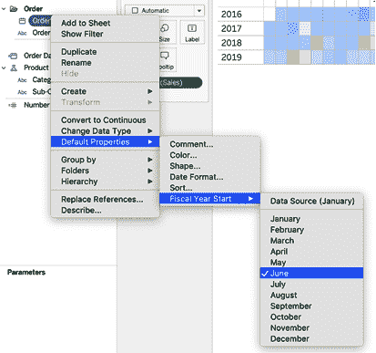

# 第四章：处理时间

在我们辩论本书内容时，没有任何一章包含的示例比这个更多。我们有如此多关于时间的例子，以至于我们在几乎所有章节中都添加了它们，包括早期章节。

让时间变得有趣的是，我们可以在我们的数据中有一个与时间相关的单列，这使得我们的数据极其灵活。这是因为时间数据自然上具有层次结构。无论是秒、分钟、小时、天、周、月、季度还是年，包含时间数据的列都为您提供了其他任何数据列所不具备的灵活性。

在第三章中，我们讨论了分类数据。分类数据非常适合进行比较。关于所有比较的一个基本假设是一致性。当我们作为开发者可视化两个非时间基准的值时，我们的观众假定我们正在进行适当的比较。您的观众可能认为它们是同一时间段。

想象一下，您正在进行呼叫中心分析并比较总呼叫量。如果今天是 2020 年 5 月 17 日，您可能不希望将 2019 年和 2020 年的总呼叫量进行比较，因为它们的长度相差太大！无论我们是试图比较从当前年度开始到现在的日期，还是比较一个月的表现与一年前同月份的表现，我们的观众都会认为时间段的一致性是开发者与用户之间的一种默契。

本章的目标是讨论日期和日期时间的自然层次结构，并帮助您开发能够标准化和自动化您的可视化的计算方法。

在本章中，我们将为您详细介绍基础计算，使您成为日期计算的专家。在建立这种基础理解之后，我们将过渡到针对我们在处理日期数据时经常遇到的具体挑战的策略。请记住：在本书的其余部分，您将看到大量利用日期的示例。

# 理解日期和时间

Tableau 为用户提供了一个非常简单的界面来处理时间。默认情况下，Tableau 创建一个层次结构，允许用户轻松导航到任何日期时间的可能性。如果您将任何日期或日期时间字段拖放到可视化中，该字段将自动按年份聚合显示。这是 Tableau 中日期的默认设置。

除了年份作为默认设置外，Tableau 还将时间值放入层次结构中。如果您深入研究这种层次结构，将会通过季度、月份、周、日、小时、分钟和秒向您的视图添加额外的细节。

###### 提示

这种层次结构也将提供给您的观众。如果您不需要该功能，则需要创建自定义日期计算——这是我们强烈建议的。

尽管时间字段的默认设置是年份，您可以右键单击编辑年份计算并选择适当的时间。

如果您不希望年份成为默认值，您可以在 Mac 上点击并按住 Option 键，或者在 PC 上右键单击，同时将时间字段拖放到视图中。从那里，您可以选择感兴趣的日期部分或值（图 4-1）。


###### 图 4-1\. 点击并拖动日期到视图后，右键单击更改日期类型后您将看到的视图（左）；点击并按住 Ctrl 键（或 Mac 上的 Option 键）拖动日期到视图后您将看到的视图（右）

## 日期部分和日期值

您可以处理日期的方式开启了许多可能性。当您查看 图 4-1 时，您会看到许多处理日期的选项。您可以选择像年份（2015）、季度（Q2）或月份（May）这样的日期*部分*，也可以选择像季度（Q2 2015）、月份（May 2015）或日期（May 8, 2015）这样的日期*值*。它们之间的区别在于您要么选择日期的特定部分，要么截断日期到最近的日期值。

## 日期计算

无论是确定日期部分还是截断到的值，Tableau 通过 `DATEPART()`、`DATENAME()` 和 `DATETRUNC()` 函数在计算字段中提供了相同的灵活性。`DATEPART()` 返回感兴趣的日期部分的单个数值。例如，如果设置为返回月份，则 2015 年 5 月 8 日将返回值 5。`DATENAME()` 返回感兴趣的日期部分的字符串，因此如果设置为返回月份，则 2015 年 5 月 8 日将返回 May。这是一个微妙的区别，但信息显示的方式将会不同。与 `DATEPART()` 和 `DATENAME()` 不同，`DATETRUNC()` 返回实际的日期或日期时间值。使用 `DATETRUNC()`，值将四舍五入或截断到最近的指定日期值。

现在，如果前面的两段听起来耳熟能详，那是因为我们希望以此方式向您展示下一个要点。虽然 Tableau 视图上的字段可能显示为 YEAR、QUARTER 或 MONTH，但实际上它们在幕后使用这些计算。让我们来看看图 4-2、4-3 和 4-4，您将看到在列上有月份的日期部分和年份的日期值。如果您双击其中任何一个值，Tableau 将显示底层计算。

首先，在列架上有一个离散的月份和连续的年份。这些字段看起来漂亮而干净，并且易于理解。但是在每个字段的底层实际上都是更复杂的函数。


###### 图 4-2\. 列架显示离散月份和连续年份

如果您双击离散字段 `MONTH(Order Date)`，将会打开即席计算编辑器。在本书中我们会经常使用这个编辑器。图 4-3 展示了 `MONTH(Order Date)` 的基础计算。原来这个计算使用了 `DATEPART()` 函数，并指定 `month` 作为函数的第一个参数。这有助于返回订单日期的月份部分。


###### 图 4-3\. `DATEPART()` 函数构建了离散 `MONTH(Order Date)` 字段的基础

如果您双击年份字段 `YEAR(Order Date)` 的连续字段，则底层函数是 `DATETRUNC()`，如前所述，将字段舍入到指定级别。这在 图 4-4 中有所显示。在这种情况下，`year` 将返回 [Order Date] 年份的 1 月 1 日。


###### 图 4-4\. `DATETRUNC()` 函数构建了连续 `YEAR(Order Date)` 字段的基础

观察这些计算的好处在于，它帮助您在使用 Tableau 中的任何时间字段的默认设置时学习日期计算。同样出色的是，您可以快速更改这些计算——甚至在会议中共享见解时进行。  

# 日期层次结构和自定义日期

您会注意到 图 4-4 中的所有日期都包括层次结构——这是位于列字段名称左侧的小 + 按钮。默认情况下，日期字段将自动创建这些层次结构。当您将日期字段添加到视图时，观众将能够与该日期层次结构进行交互。如果您希望与日期字段的特定层次结构交互，则处理日期可能会有所挑战。

幸运的是，有方法可以绕过自动化日期层次结构。您可以通过创建自定义日期来实现：右键单击数据源中的原始时间字段，选择创建 → 自定义日期（图 4-5）。然后，您必须选择感兴趣的日期部分或日期值。创建了这个字段后，将其放置在视图中的某个位置，您会注意到日期没有关联的层次结构。


###### 图 4-5\. 创建自定义日期的菜单操作

## 离散日期与连续日期

为了更好地理解 Tableau 中如何直观表示日期，让我们看看四个可视化，在其中我们在水平轴上变化了两个组成部分。让我们看看日期部分和日期值之间的差异，也看看两种图表类型的离散和连续轴如何变化。这为您提供了四种探索选项（图 4-6）。


###### 图 4-6\. 视觉输出因日期是离散还是连续以及您是否使用日期部分或日期值而异

您可以看到仅更改两个选项如何产生操作方式完全不同的四个图表。两个重要的差异值得重申：日期部分选择仅返回日期字段的单个部分，日期部分的默认选项通常是离散的。这会创建分隔每个日期部分的*区间*。

您仍然可以将离散日期部分转换为连续以创建连续轴。图表类型看起来相似，但轴的功能不同。如果您查看右上角的连续日期部分可视化，您会发现每个月的轴刻度位于月份名称的中心。而左上角的离散日期部分，可视化具有每个月的桶，并且没有刻度与每个月的值对齐。这些刻度使我们的观众更容易理解他们正在查看的月份，因此出于这个原因，我们更喜欢使用连续字段。

这也适用于您的日期值选项。如果您选择月份的日期值，Tableau 默认会将每个值舍入到每个月的开始。这样可以查看数据的逐年月视图。默认情况下，日期值是连续字段，但您可以将它们转换为离散字段。请注意，在图 4-6 左下角的轴上，轴是不同的标签名称桶。然而，在右下角的连续日期值中，显示了一个带有刻度的单一轴。

###### 提示

请记住，离散维度将仅为存在的数据创建标题。如果日期中存在间隔，您可能希望使用连续轴来保留任何未表示的日期。

在离散日期轴上有一个位置。如果您计划使用柱状图，可以使用离散日期部分。如果您使用折线图，我们建议使用连续轴。

# 调用频率：芯片和螺栓呼叫中心案例研究

汽车零部件制造商 Chips and Bolts (CaB)的呼叫中心正寻求提高其客户满意度得分。执行官们需要在评估他们的绩效之前更好地理解基础知识。作为第一步，他们想要知道他们接到了多少电话。他们希望在 2.5 年的时间窗口内以 15 分钟为间隔追踪这些数据，以更好地了解呼叫量可能如何与客户满意度调查相关联。如何表示这些信息？

在 Tableau 中处理时间并不是没有挑战的。但在 Tableau 中轻松将小时和分钟放在图表中：如果您使用的是日期时间字段，Tableau 会自动将其放置在日期时间层次结构中。例如，创建一个关于总呼叫量的图表并不是那么困难。

如前所示的连续日期部分示例，将单个日期部分转换为连续轴以绘制多个时间段是相当容易的。使用连续日期值截断日期到特定日期部分，但有时您希望做相反的操作。在这个例子中，我们希望为小时、分钟和天创建一个连续轴。看看图 4-7，显示了在 2.5 年内每 15 分钟从呼叫中心接收到的总入站电话呼叫。


###### 图 4-7\. 每 15 分钟总呼叫量的面积图

对于前四个策略，您将把日期时间转换为各种聚合级别。要完成最终的分析，按每 15 分钟聚合的连续轴上的呼叫数据，您需要使每个日期都完全相同，但保留数据中每行的时间。

## 策略：按小时确定总通话时间

在这个策略中，我们将解决处理时间的挑战，特别是在连续轴上。该策略的结果显示在图 4-8 中。


###### 图 4-8\. 每年销售按小时绘制的线图

在这个策略中，我们将按小时绘制总呼叫量，按年份分类：

1.  创建一个新的工作表，并设置为适合整个视图。

1.  将[开始日期时间]放在列上。然后将显示更改为离散小时。

1.  如果您使用的是 Tableau Desktop 2020.1 或更早版本，您的数据源已经带有[记录数]字段。如果您使用的是 Tableau 2020.2 或更新版本，请创建一个名为`**[记录数]**`的计算字段：

    ```
    // Number of Records
    1
    ```

1.  将[记录数]作为总和添加到行中。

1.  将[开始日期时间]的离散年份添加到颜色中。

这样做可以让您看到，无论是哪一年，呼叫量都在早上 7 点左右开始上升，但真正在早上 8 点左右增加。您还可以看到，2020 年的呼叫量全面下降。

这项分析缺少的是更深入的调查。通话是否发生在每个小时的开头或半小时？如果您正在制定人员配备计划，确切的时间可能更有用。

## 策略：创建一个按分钟测量总通话时间的图表

我们将通过创建一个可视化来扩展之前的策略，该可视化绘制了每天按分钟计的总通话量：

1.  按小时的 HOUR 分层上点击“+”对数据进行排序。图 4-9 显示了结果可视化。

    

    ###### 图 4-9\. 一条按小时和分钟分段销售的折线图，每年的三年数据

    结果显示了一天中的通话次数，但现在我们有两个离散的轴：顶部轴按小时分割，第二个轴按分钟，每小时还创建了高达 60 个单独的分区。这仅在数据存在时创建分区。因此，如果小时 0 没有数据，分钟 53（事实上没有），则分区不存在。

1.  添加任何缺失的分区。如果要包含任何指定日期部分的缺失分区，请右键单击该日期部分并选择显示缺失值（图 4-10 右键单击）。


###### 图 4-10\. 若要显示缺失值，请右键单击日期字段，然后选择显示缺失值

如果您查看图 4-9，您会看到您的可视化具有两组离散的箱柜：一个用于小时，一个用于分钟。对于小时和分钟使用离散值是困难的，因为您最终会得到 1,440 个分区（24 小时 × 60 分钟）。

那么如何创建一个单一的轴？在这个计算中，我们将依赖于两个常用的计算：`DATEADD()` 和 `DATEDIFF()`。

`DATEADD()` 添加或减去日期或时间，并需要三个输入：

+   指定的日期部分，用引号括起来且小写。这显示我们要添加到日期中的单位，无论是秒、小时还是年。

+   任何整数，表示我们想要添加或减去的时间量。如果指定了负数，将从值中减去时间。

+   初始日期时间字段。

这个非常多才多艺的计算是我们经常使用的。

`DATEDIFF()` 根据感兴趣的日期部分计算两个日期之间的差异，并需要三个输入：

+   指定的日期部分

+   开始日期

+   结束日期

您可以指定各种日期部分：`year`、`quarter`、`month`、`dayofyear`、`day`、`weekday`、`week`、`hour`、`minute`、`second`、`iso-year`、`iso-quarter`、`iso-week` 和 `iso-weekday`。

###### 提示

欲获取更多技术帮助，请阅读[Tableau 有关日期函数的文档](https://oreil.ly/blPRT)。

## 策略：创建一个连续的按秒计的日期时间轴

现在，您将创建一个允许您拥有单一时间轴的计算：

1.  创建名为`**[time]**`的计算字段，并编写以下计算：

    ```
    // time
    DATEADD(
        "day",
        DATEDIFF(
            "day",
            [Start Date Time],
            {MAX(DATETRUNC("day", [Start Date Time]))}
        ),
        [Start Date Time]
    )
    ```

    此计算将更改数据集中所有日期为数据集中的最大日期。时间（小时、分钟和秒）保持不变。

1.  创建如下连续轴：

    1.  移除所有列上的计算。

    1.  将[time]字段添加为列的确切日期。

    这将生成图 4-11 中的可视化。


###### 图 4-11\. 使用连续轴每秒的总呼叫量

您现在有了一个连续的轴。然而，这个分析是秒级的，这并不是非常有用或深刻的。与其进行每秒的分析，也许您想捕捉每 15 秒的数据。

## 策略：为 15 秒间隔创建连续的日期时间轴。

您将继续探索日期时间，创建一个自定义计算，基于每天每 15 秒的呼叫进行聚合：

1.  使用我们之前策略的可视化。

1.  创建一个新的计算并命名为`**[time / 15 sec]**`。

1.  撰写以下内容：

    ```
    // time / 15 sec
    DATEADD(
      "second",
      -(DATEPART("second",[time]) % 15),
      [time]
    )
    ```

    这里首先计算时间字段的秒数。然后使用模运算符（`%`）计算每 15 秒的总秒数。因此，不是计数到 60，而是计数到 14；然后，而不是继续到 15，重新从 0 开始。

    此计算的结果是将日期时间截断为最近的 15 秒。

1.  单击并拖动[time / 15 sec]以替换时间字段为连续轴。这将生成图 4-12 中的可视化。


###### 图 4-12\. 使用连续轴显示每天每 15 秒的总呼叫量

您开始看到类似于每小时绘图的模式，但这个视图仍然过于详细。与其每 15 秒查看一次，不如每 15 分钟查看一次？

## 策略：为 15 分钟间隔创建连续的日期时间轴。

当我们开始处理这些数据时，我们发现每小时 LOD 的信息很有趣，但我们需要看更多信息以便更具体。从那里开始，我们看到了每分钟和每 15 秒的图表。这些图表太详细了。在这个策略中，我们创建了一个计算，将时间截断为每 15 分钟。结果将是比前三个更具可操作性的图表。

1.  创建名为`**[time / 15 min]**`的新计算。

1.  撰写以下内容：

    ```
    // time / 15 min
    DATEADD(
      "minute",
      -(DATEPART("minute", [time]) % 15),
      DATETRUNC("minute", [time])
    )
    ```

    [time / 15 min]的格式看起来几乎相同，只是我们用`minute`替换了`second`，我们的第三个参数现在是`DATETRUNC("minute", [time])`而不是`time`。这是因为我们使用[time / 15 sec]在 Tableau 中已经是最低级别（秒）。因为我们在更高级别的数据上工作，我们需要将所有值汇总到最近的分钟。

1.  向最近的分钟卷起：

    1.  点击并拖动以用[时间/15 秒]替换[时间/15 分钟]。

    1.  在标记卡上，单击路径，将线型更改为步进。我们喜欢使用步进路径而不是直线，因为我们知道该线表示该 15 分钟增量中的所有值。

    最后，在图 4-13 中，我们有一个单一的轴，可以看到数据在 15 分钟间隔内的模式。这个图表为我们提供了关于每天早晨通话快速增长速度的大量信息，比最近小时（但不太精确）要精确得多。

    

    ###### 图 4-13\. 每天每 15 分钟的总通话次数，使用连续轴

    你仍然有代表 2020 年的红线，比所有其他值都低得多。这可能是因为我们仅收集到了 2020 年 4 月 14 日为止的数据。由于业务可能是季节性的，比较类似的时间段可能是值得的。但在我们这样做之前，我们希望深入了解每 15 分钟的通话次数。

1.  让我们看看每 15 分钟的通话次数，通过调整颜色上的维度来按星期几进行。右键单击 YEAR(开始日期时间)，将日期类型更改为`工作日`的离散日期部分（这位于日期部分的“更多”部分下）。之后可以随意编辑颜色。图 4-14 显示了结果可视化。


###### 图 4-14\. 每天每 15 分钟的总通话次数，按星期几着色，并使用连续轴

# 热图（突出显示表格）

图 4-14 中的信息非常有用，但要阅读这些洞察力，行数实在是太多了。当我们处理具有八条或更多线条的折线图时，我们会立即考虑其他图表类型。在这种情况下，我们选择的图表类型是*热图*—尽管 Tableau 称之为*突出显示表格*。热图允许观众通过颜色、强度或色调来看待变化，而不是通过方向。这个热图显示为一个矩阵，以便任何人都能轻松追踪维度中单个成员的变化。

## 策略：构建一个基本的热图

让我们创建一个重新构想前一战略折线图分析的热图：

1.  创建一个新工作表。

1.  将标记类型更改为方块。

1.  通过使用[开始日期时间]创建一个自定义的工作日日期部分，并将其放置在列上。

1.  将[时间/15 分钟]放在行上，但选择小时日期部分。

1.  将[记录数]放在颜色上。

1.  选择适合你的调色板。我们选择了一个自定义调色板（我们将在第十二章中更详细地讨论它）。

    结果是图 4-15 中的热图。


###### 图 4-15\. 使用热图显示每天每小时和周几的总通话量

再次看到通话从上午 8 点开始增加，通过颜色变化。但您还能看到周一特别是早上非常繁忙。周末较为宁静，周日异常缓慢。我们还看到通话在下午 5 点后开始减少（图表中显示为 17）。

## 策略：创建更详细的热图

即使数据相当精细，热图也可以非常有帮助。随着可视化的复杂性和细节增加，热图的价值也在不断提高。按照以下步骤为您的热图添加更多细节：

1.  复制前一策略中的可视化。

1.  通过使用[开始日期时间]创建一个定制日期以用作月份的日期部分。

1.  将其放在列上并放在您的工作日计算左侧的列上。

1.  在行上单击 HOUR(time / 15 min)上的+。这将显示四舍五入到最近 15 分钟的时间。

1.  您会注意到仪表板上没有值的地方有些空白。如果您想为这些位置添加标记，您需要使用查找计算：`ZN(LOOKUP(SUM([Number of Records]),0))`。（我们将在第六章中更详细地讨论这个。）将此计算添加到颜色中。

1.  格式化您的列和行标题以使其更易读。图 4-16 显示了生成的可视化效果。


###### 图 4-16\. 使用热图显示每天每 15 分钟的总通话次数按月和周几

我们选择在小时和月份级别上设置分隔符。这使您的观众可以快速导航到分析段落。

该图表显示了按月和周几每 15 分钟递增的通话量。那么，您能从这些数据中获取哪些见解呢？

+   平均每年几乎每个月的工作日早上 8 点通话量增加。

+   更多通话倾向于在夏季晚些时候发生。

+   无论一周的哪一天，通常一月份的通话量都很大。

+   在四月、七月和十二月，周一的通话量较多。这可能是因为周末暖气或空调出现故障，导致周一需要服务。

从这种可视化中识别通话模式可能对人员配备非常有帮助。周一总是很忙，但在四月、七月和十二月这些日子加强人员配备可能是有意义的。由于夏季晚些时候的通话量较高，可能需要在下午 6 点而不是下午 5 点之前进行人员配备。这可以通过在 11 月和 12 月的非周一减少工作时间来抵消。

我们喜欢热力图。它们是代表时间的被低估的工具，并且在数据可以用一个维度的许多成员表示时特别有用。

# 年初至今比较值：CaB 呼叫中心案例研究

现在呼叫中心更好地理解了呼入呼叫量，工作人员希望了解这种变化随时间的变化。现在是四月，他们想要在分析中看到当前年份的数据。您如何创建与前几年相比的同类比较？

在这个案例研究中，我们将继续分析呼叫中心的数据。在最终分析中，我们关心的是跨年适当的比较。为此，让我们回到我们按年每 15 分钟的总呼叫量绘制的图表（图 4-17）。


###### 图 4-17。每 15 分钟按年的总呼叫量

我们看到呼叫量有所下降，但这是因为 2020 年与其他年份处于不同的时间点。部分原因是我们的数据仅截至 2020 年 4 月 14 日。可能更公平的比较是将 2018 年、2019 年和 2020 年截至 4 月 14 日的呼叫量进行比较，而不是它们的整体总数。

这是我们经常面临的挑战，无论数据类型如何：能够比较相似的时间段。那么你如何解决这个问题呢？通过一个设计良好的日期计算。

接下来两个策略的目标是创建一个计算，将最近一年的最近日期与前几年的相同日期进行比较。对于下一个策略，您将重新创建一个显示进度到总体的柱状图。这将使您的观众能够在同时显示可比较的年初至今值的同时关注总体值。然后，我们将在我们的折线图上应用一个过滤器，以进行适当的年初至今比较，而不是在图 4-18 中显示的可视化。


###### 图 4-18。显示总呼叫量与前两年总呼叫量的可视化（顶部），以及三年同一天的总呼叫量（底部）

## 策略：使用两个柱状图显示总体进展

在这个策略中，您将使用柱状图来显示总体进展：

1.  按以下方式构建计算：

    1.  将日期归一化为同一年，创建名为`**[开始日期时间 | 同一年]**`的计算：

        ```
        // Start Date Time | Same Year
        DATEADD(
          "year",
          DATEDIFF("year", {MAX([Start Date Time])}, [Start Date Time]),
          DATETRUNC("day", [Start Date Time])
        )
        ```

    1.  创建名为`**[开始日期时间 | 同一年 | TF]**`的第二个计算。这是一个布尔值，用于检测一个日期是否小于或等于最近一年的同一天的年初至今：

        ```
        // Start Date Time | Same Year | TF
        DATEPART("dayofyear", [Start Date Time | Same Year])
          <= DATEPART("dayofyear", {MAX([Start Date Time])})
        ```

    1.  创建名为`**[总呼叫量 | 年初至今]**`的第三个计算：

        ```
        // Total Calls | YTD
        SUM(
          IF [Start Date Time| Same Year | TF]
          THEN [Number Records]
          END
        )
        ```

    这将为每一年返回年初至今的值。

1.  构建可视化：

    1.  将[记录数量]添加到行。

    1.  在行架上的 [Number of Records] 右侧添加 [Total Calls | YTD]。

    1.  创建一个同步双轴图表。

    1.  将 [Start Date Time] 作为离散年名称添加到列和颜色中。

    1.  将 `SUM([Number of Records])` Marks 卡片上的不透明度设置为 40%。

    1.  格式化您的可视化图表，删除列和行分隔线，添加较暗的列轴标尺和刻度线，样式化网格线，仅显示左轴，并重命名轴。

    1.  在 AGG(Total Calls | YTD) Marks 卡片上显示标签。

    这将导致 图 4-19 中的柱状图。


###### 图 4-19\. 显示最近一年的截至当前日期的年度进展的结果可视化。

在这个可视化中，我们在聚合内嵌了一个 `IF` 语句，以在计算内执行过滤。这是您应该经常做的事情，以使可视化变得动态。随着年度的推移，我们将看到 2020 年的柱子增加。2018 年和 2019 年的 100%不透明柱子也将继续增长。这些柱子最终将在同一轴上显示的 40%不透明柱子值处达到顶峰。

回顾 图 4-17。该可视化显示了 2018 年和 2019 年所有日期的总通话次数。它还仅显示了 2020 年 4 月 14 日之前的日期。这不是一种直接对比。如果我们能够比较这些值，那将是很好的。

## 策略：在线图上比较类似期间。

与之前的策略不同，我们在这里使用一个 `IF` 语句来过滤我们的数据，我们将明确地在筛选架上放置一个计算。我们这个策略的目标是使用本章早些时候创建的可视化，并添加一个年度筛选：

1.  复制您在前述连续数据策略中展示的最终可视化图，如 图 4-13 所示。

1.  确保您已完成上述策略的步骤 1a 和步骤 1b。

1.  编辑 [Start Date Time] 的工作日，当前在颜色上的离散年日期类型。

1.  将 [Start Time Date | Same Year | TF] 添加到筛选架上，选择 True，并点击确定。

1.  编辑轴并移除轴标题。图 4-20 显示了结果。


###### 图 4-20\. 显示 2018 年、2019 年和 2020 年同一天过滤的每天每 15 分钟总通话次数的可视化图。

当将我们前两个策略的结果并列时，最终结果是一个迷你的年度仪表板，允许您的受众追踪今年以来的总呼叫量，以及呼叫发生的时间（图 4-21）。


###### 图 4-21。显示 2018 年、2019 年和 2020 年每天同一天的总呼叫量及每 15 分钟的比较的迷你仪表板

# 自动化报告

在这一节中，我们将讨论通过使用自定义计算来自动化报告。无论是呼叫中心数据、财务报告还是学生注册人数，我们花费大量时间开发在月底自动更新的表格。虽然实施这些表格需要一点时间，但这些努力可以大大节省时间。Tableau 的新手用户最常见的一个行为是手动更新数据，然后转到仪表板并编辑过滤器以包含更新后的数据。下一个策略的目标是展示如何根据仪表板上的数据自动更新仪表板。

# 月对比月和年对比年变化的自动化报告：CaB 呼叫中心案例研究

现在 CaB 呼叫中心开始了解年度整体呼叫量，员工们希望更仔细地查看制造周期和大订单对他们的满意度评分的影响。他们要求增加一个月对比一个月的视图，除了已提供的年度对比报告。这个视图将显示更详细的数据。你将如何构建一个依然易于理解的报告？你将采取哪些步骤来自动化这个报告？

看看图 4-22 中的表格。它显示了每天平均呼叫量以及月对比月和年对比年的呼叫变化百分比。该表格显示了 2019 年 3 月至 2020 年 3 月的数据。我们决定不报告 4 月的任何内容，因为我们的数据报告仅到 4 月 14 日。当我们有 4 月最后一天的数据报告时，报告将自动更新，以便表格显示 2019 年 4 月至 2020 年 4 月的指标。此外，该表格显示了按呼叫原因分解的呼叫量，并进行总计汇总。


###### 图 4-22。2019 年 3 月至 2020 年 3 月每天平均呼叫量及呼叫变化百分比，月对比月和年对比年

## 策略：自动滚动表

在这个策略中，您将重新创建图 4-22 中显示的表格。这将始终显示基于最后条目日期的最后 13 个完整的月份：

1.  为此可视化构建基本表格。为我们的表格创建指标，`**[Calls/Day]**`：

    ```
    // Calls/Day
    SUM([Number Records])/COUNTD(DATETRUNC("day", [Start Date Time]))
    ```

    将[Calls/Day]添加到文本中。将[Call Reason]添加到列中，并按每天呼叫次数降序排列维度。创建一个名为`**[Start Date Time | Month]**`的新自定义日期，返回月度日期值。将其作为离散值放置在列中。添加列总计，并将它们放置在顶部，如图 4-23 所示。

    

    ###### 图 4-23\. 要将总计添加到列的顶部，请选择分析 → 总计，然后选择显示列总计和列总计到顶部

1.  格式化您的表格，以便仅存在行分隔符，如图 4-24 所示。仅为您的总计添加带色块。这将成为您的月对月计算、年对年计算以及将要创建的自动化的基础。

    

    ###### 图 4-24\. 表格显示每天的呼叫次数按呼叫原因和月份分类

1.  创建月对月计算。这是通过表格计算完成的。将此新计算命名为`**[Calls/Day | % Change 1]**`：

    ```
    // Calls/Day | % Change 1
    (ZN([Calls/Day]) - LOOKUP(ZN([Calls/Day]), -1))
    /
    ABS(LOOKUP(ZN([Calls/Day]), -1))
    ```

    此计算基于前值创建百分比变化，即前一个月的值。因为企业可能是季节性的（许多企业都是如此），通常最好将值与前一年进行比较。要执行此操作，请创建一个名为`**[Calls/Day | % Change 12]**`的新计算：

    ```
    // Calls/Day | % Change 12
    (ZN([Calls/Day]) - LOOKUP(ZN([Calls/Day]), -12))
    /
    ABS(LOOKUP(ZN([Calls/Day]), -12))
    ```

    您会注意到，计算略有不同：–1 已更改为–12\. 双击[Calls/Day | % Change 1]和[Calls/Day | % Change 12]。这将转换表格以包括[测量名称]，而文本现在为[测量值]。需要更新[Calls/Day | % Change 1]和[Calls/Day | % Change 12]中的表格计算，但您可以等到所有视图组件都准备好后再执行此操作。

1.  现在让我们只展示完整的月份。通过编写一个名为`**[Start Date Time | Max Date]**`的计算来计算[开始日期时间]的最大日期：

    ```
    // Start Date Time | Max Date
    {MAX([Start Date Time])}
    ```

    在这里，我们使用一个 LOD 计算来计算数据集中的最大日期。我们将监视此日期，以便知道何时更新我们的表格。这将允许您动态计算相关的时间段。您只需找到动态表格的起点和终点。首先计算上个完整月份的最后一天，并将计算命名为`**[Last Day of Last Full Month]**`：

    ```
    // Last Day of Last Full Month
    DATETRUNC("month", [Start Date Time | Max Date] + 1) - 1
    ```

    使用此计算来创建一个布尔值以过滤当前月份的数据——当前月份尚未完成。创建一个名为`**[Start Date Time | Full Months]**`的计算：

    ```
    // Start Date Time | Full Months
    [Start Date Time] <= [Last Day of Last Full Month]
    ```

    将此计算添加到筛选器中，并选择 True。

1.  将此可视化结果筛选至最近的 13 个完整月。创建一个名为`**[开始日期时间 | 最近 13 个月]**`的新计算：

    ```
    //Start Date Time | Last 13 Months
    [Start Date Time] > DATEADD("month", -12,
      [Last Day of Last Full Month] + 1) - 1
    ```

    将此计算放置在[开始日期时间 | 月]的左侧。右键单击假标题并选择隐藏。然后从同一菜单中取消选择显示标题（图 4-25）。

    

    ###### 图 4-25\. 通过取消选择显示标题隐藏标题

1.  通过编辑[每天呼叫数 | %变化 1]和[每天呼叫数 | %变化 12]表计算设置在[度量值]标记卡中，只取消选择[呼叫原因]，如图 4-26 所示，完成表格计算。

    ![[每天呼叫数 | %变化 1]和[每天呼叫数 | %变化 12]的表计算设置](Images/TAST_0426.png)

    ###### 图 4-26\. [每天呼叫数 | %变化 1]和[每天呼叫数 | %变化 12]的表计算设置

1.  确保将月度同比和年度同比计算都格式化为百分比。最后，右键单击并编辑别名（图 4-27）。将[每天呼叫数 | %变化 1]更改为 MoM（月同比），将[每天呼叫数 | %变化 12]更改为 YoY（年同比）。

![右键单击[度量名称]，选择编辑别名](Images/TAST_0427.png)

###### 图 4-27\. 右键单击[度量名称]，选择编辑别名

所有这些工作的结果（如前面显示的图 4-22）是一个简单的表格，提供了许多重要见解，并且每月自动更新。

大多数时候，作为开发人员，我们几乎不考虑一年、一个月或甚至一周的定义是什么意思。我们只是假设一年从 1 月 1 日到 12 月 31 日。但在组织中，财政年度可以用许多方式定义。下一节将简要介绍在 Tableau 中处理财政日期的工作原理。

# 非标准日历

*财政年度*可以在任何时间开始；可以是 1 月 1 日、6 月 5 日，甚至是标准日历年的第五个星期一。这完全取决于具体情况。Tableau 提供了一些灵活性。

如果您的日历年从月初开始，可以通过右键单击，然后导航到默认属性 → 财年起始日 → 财年月份（图 4-28）。这简化了与该特定日期度量相关联的层次结构。



###### 图 4-28\. 右键单击日期以更改财年起始日的默认属性（在此示例中，财年起始日设为六月）

一些组织使用标准的格里高利日历作为其财政年度：从 1 月 1 日至 12 月 31 日。然而，其他组织从每月开始的第一天开始财政年度或月份。因此，如果 1 月 1 日是星期二，则财政年度将从 12 月 30 日开始。这种日历类型称为*ISO-8601*。虽然名字很奇怪，但请知道该日历基于周。您可以通过右键单击视图中的日期值并选择 ISO-8601 周为基础来指定日历类型。（在本节中我们称之为*ISO 日历*。）

在图 4-29（#data_in_a_standard_calendar）和图 4-30（#data_in_an_iso_calendar）中，您可以看到标准日历数据如何与 ISO 日历略有不同。


###### 图 4-29\. 标准日历中的数据


###### 图 4-30\. ISO 日历中的数据

## 策略：构建一个以六月 1 日为财政年度起点的月度柱状图。

让我们花点时间来建立一个以六月为财政起点的可视化。为了简单起见，想象你正在构建一个柱状图，显示每月和财政年度的总销售额。您将复制 Figure 4-31：

1.  连接到样本 - 超级商店数据集。

1.  复制[Order Date]字段，并将其命名为`**[Order Date | June]**`。

1.  右键单击[Order Date | June]并将默认财政年度开始日期更改为六月。

1.  将[Order Date | June]添加为按月连续数据值到列中。

1.  将`SUM([Sales])`添加到行中。

1.  将年份添加到颜色中（[Order Date | June]）。

1.  将标记类型更改为柱形图。

1.  右键单击 2016 年 9 月柱形图，并向标记添加注释，显示日期和总销售额。


###### 图 4-31\. 按月销售，按财政年份着色，使用六月开始的财政年度

# 可视化 4-5-4 日历：Office Essentials 案例研究

我们的大型零售店 OE 一直依赖与日历年相关的数据指标。该公司希望重新设计一些标准报告，现在采用 4-5-4 日历。您如何完成此任务？

零售商通常使用*4-5-4 日历*。这种日历允许他们通过将一年分为基于重复的四周、五周和四周的月份来比较销售额。零售商使用此日历是因为假期往往重叠，并且相似月份中显示相同数量的星期六和星期日。4-5-4 销售日历并非完美：因为该日历基于 52 周或 364 天，这每年多余一天需要考虑。为了调整此问题，每五到六年将向财政日历添加一周。这发生在 2012 年和 2017 年，并将在 2023 年再次发生。

4-5-4 日历年随年而异。当二月一日是在星期四、星期五或星期六时，日历年在二月一日后的第一个星期天开始。如果二月一日是在星期天、星期一、星期二或星期三，则日历年在二月一日所在周的星期天开始。

下一个策略专注于构建 4-5-4 零售日历的日期组件。这些组件包括年度周数、年度月份、年度季度以及季度周数。在构建完组件后，将建立可视化突出显示其中一些计算。

## 策略：使用 4-5-4 零售日历构建条形图

1.  创建一个计算，计算二月一日。将此计算命名为`**[Feb 1]**`：

    ```
    // Feb 1
    DATEADD("month", 1, DATETRUNC("year", [Order Date]))
    ```

1.  基于二月一日是否在周三之后计算日历年的开始日期。将此计算命名为`**[454 Year Start]**`：

    ```
    // 454 Year Start
    IF DATEPART('weekday', [Feb 1]) > 4
    THEN DATETRUNC('week', DATEADD('week', 1, [Feb 1]))
    ELSE DATETRUNC('week', [Feb 1])
    END
    ```

1.  确定去年的 4-5-4 日历年的开始日期，计算去年的二月一日。将此计算命名为`**[Feb 1 | PY]**`：

    ```
    // Feb 1 | PY
    DATEADD('year', -1, DATEADD("month", 1, DATETRUNC("year", [Order Date])))
    ```

    计算前一个日历年的开始日期。我们将使用此计算与当前年份的值来确定日历年的周数。将此计算标记为`**[454 Prior Year Start]**`：

    ```
    // 454 Prior Year Start
    IF DATEPART('weekday', [Feb 1 | PY]) > 4
    THEN DATETRUNC('week', DATEADD('week', 1, [Feb 1 | PY]))
    ELSE DATETRUNC('week', [Feb 1 | PY])
    END
    ```

1.  解析年度零售周：

    ```
    // Retail Week
    IF [454 Year Start] <= [Order Date]
    THEN DATEDIFF('week', [454 Year Start], [Order Date]) + 1
    ELSE ({FIXED [Feb 1] : MAX(DATEDIFF('week',
      [454 Prior Year Start], DATETRUNC('year',[454 Year Start])))}
    +
    DATEPART('week', [Order Date])
         )
    END
    ```

1.  现在您有了这周的数据，您可以创建像零售季度、零售季度月、零售季度周、零售月和零售月周等组件。逐步构建每一个这些计算：

    ```
    //Retail Quarter
    FLOOR(([Retail Week]-1)/13)+1

    //Retail Week of Quarter
    (([Retail Week] - 1) % 13) + 1

    // Retail Month of Quarter
    IF [Retail Week of Quarter] <= 4
    THEN 1
    ELSEIF [Retail Week of Quarter] > 4
    AND [Retail Week of Quarter] <= 9
    THEN 2
    ELSEIF [Retail Week of Quarter] > 9
    AND [Retail Week of Quarter] <= 13
    THEN 3
    END

    //Retail Month
    IF [Retail Week] <= 4
    THEN "February"
    ELSEIF [Retail Week] > 4 AND [Retail Week] <= 9
    THEN "March"
    ELSEIF [Retail Week] > 9 AND [Retail Week] <= 13
    THEN "April"
    ELSEIF [Retail Week] > 13 AND [Retail Week] <= 17
    THEN "May"
    ELSEIF [Retail Week] > 17 AND [Retail Week] <= 22
    THEN "June"
    ELSEIF [Retail Week] > 22 AND [Retail Week] <= 26
    THEN "July"
    ELSEIF [Retail Week] > 26 AND [Retail Week] <= 30
    THEN "August"
    ELSEIF [Retail Week] > 30 AND [Retail Week] <= 35
    THEN "September"
    ELSEIF [Retail Week] > 35 AND [Retail Week] <= 39
    THEN "October"
    ELSEIF [Retail Week] > 39 AND [Retail Week] <= 43
    THEN "November"
    ELSEIF [Retail Week] > 43 AND [Retail Week] <= 48
    THEN "December"
    ELSEIF [Retail Week] > 48 AND [Retail Week] <= 52
    THEN "January"
    END

    // Retail Week of Month
    IF [Retail Week of Quarter] <= 4
    THEN [Retail Week of Quarter]
    ELSEIF [Retail Week of Quarter] > 4
    AND [Retail Week of Quarter] <= 9
    THEN [Retail Week of Quarter] - 4
    ELSEIF [Retail Week of Quarter] > 9
    AND [Retail Week of Quarter] <= 13
    THEN [Retail Week of Quarter] - 9
    END
    ```

    拥有所有这些计算对于使用零售日历的任何可视化都非常有用。让我们创建一个我们喜欢用来展示零售日历的可视化。

1.  将[零售季度月]作为离散维度添加到列中。将[零售季度]作为离散维度添加到行中。将[零售月周]作为连续维度添加到行中。在[零售月周]右侧创建一个临时的连续维度 0.0。创建一个同步双轴。

1.  添加如下详细信息：

    1.  将[零售月周]的标记卡设置为条形图。将`[Profit Ratio] * (SUM([Profit])/SUM([Sales]))`添加到颜色中。将`SUM([Sales])`和[零售周]的连续维度添加到文本中。格式化文本，使其显示如图 4-32 所示。

        

        ###### 图 4-32\. 4-5-4 条形图的文本标签

    1.  在标记卡的 0.0 值上，将标记类型设置为文本。将[零售月]添加到文本中。

1.  对于最后一部分，我们需要在控制两个轴的列上放置一个值。创建名为`**[bar]**`的计算并将其添加到列中：

    ```
    // bar
    IF COUNTD([Retail Week]) = 1
    THEN SUM([Sales])/WINDOW_MAX(SUM([Sales]))
    ELSE .9
    END
    ```

    此计算将以零售周的最大销售额百分比显示条形图，并将每个州的标签放置在 0.9 上。更改表计算并选择所有值，如图 4-33 所示。

    

    ###### 图 4-33\. 4-5-4 条形图的表计算设置

    设置条形轴范围在 0 到 1.8 之间，然后隐藏轴。反转[零售月的周]字段的轴，然后隐藏轴。

1.  最后，根据您的设计标准格式化图表。

    展示的结果可见于图 4-34。


###### 图 4-34\. 按照 4-5-4 零售月和周显示销售和利润的条形图

# 结论

在本章中，我们只是浅尝了日期和时间的冰山一角。因为日期和时间具有自然的层次结构，并且可以被视为维度或度量，一个单独的日期字段有几乎无限的组合选项。

在章节开头，我们讨论了理解日期*部分*和日期*值*之间差异的重要性。使用日期部分，Tableau 返回日期或时间字段的单个组成部分。日期部分的基础计算是`DATEPART()`函数。

在前两种策略中，我们展示了如何绘制日期的部分。组合多个日期部分（在这种情况下是小时和分钟）可能导致显示过多的离散值。

使用日期值，Tableau 返回截断到指定日期部分的日期。这意味着月份的日期部分将返回月份的名称或数字，而月份的日期值将返回年份和月份的组合。日期值的基础计算是`DATETRUNC()`函数。

Tableau 默认将日期部分设置为维度，将日期值设置为连续值。虽然这些是默认值，但我们可以将其转换为离散或连续值。我们选择离散或连续值会影响我们的坐标轴可能的外观，从而影响我们最可能选择的图表类型。

最后一个我们讨论的基础是 Tableau 默认提供日期层次结构给您的观众。如果您希望限制此层次结构的可用性，则必须使用自定义日期。

对于大多数观众来说，使用连续轴更直观，因为这符合人们对时间的思考方式！这使得线形图成为首选。处理日期的一个挑战是创建单个日期部分的连续图。我们解决了创建连续轴的这一挑战。在这些挑战中，我们从展示数据精确到最接近一天内的秒，到最接近 15 秒，再到最接近 15 分钟。

虽然线形图和偶尔的条形图是展示日期和时间值的两种常见方式，我们喜欢使用热力图（仅 Tableau 称为 *高亮表格*）。线形图在描述超过五条线时能力有限——对于大多数数据精通的受众来说，即使是解释模式也变得困难。线形图的一个简单替代方案是热力图。我们强调了在处理日期和时间字段时，这种图表类型的灵活性。

处理日期时的另一个常见挑战是将前年与本年到目前为止进行比较。我们向您展示了一个可以用来计算任意日期的年初至今值的计算公式。这可以用于聚合计算中，并且可以用来创建显示达到总体进度的图表。我们扩展了相同的年初至今计算方法以调整线形图，以进行公平比较。

我们还研究了如何利用 LOD 和表计算创建自动化报告。通过使用离散日期值和 `LAST()` 函数，您可以轻松显示最近 *N* 个月的数据。我们还展示了如何使用表计算完成月对月和年对年的计算。

我们在章节中讨论了非公历日历。公历是标准，但有些组织的财政年度起始月份不同于一月。我们甚至超越传统日历，讨论了 4-5-4 日历，这在零售和消费品公司中很常见。

下一章将涵盖关键绩效指标（KPI）。KPI 是独立的度量标准，您的受众可以用来推动日常运营或指导战略决策。虽然 KPI 侧重于度量本身，但通常由特定时间段定义。如果您熟练掌握 Tableau 中的日期字段，创建动态自动化的 KPI 将变得自然而然。
