# 第五章：关键绩效指标

让我们再谈谈数据可视化中更具争议的一个话题：*关键绩效指标*或*KPI*。围绕 KPI 的争议是因为您仅仅呈现一个单一的数字，事实上，您根本没有使用任何特定的可视化——您只是将一个数字或值显示为文本。尽管如此，这个文本也有其艺术性，在本章中，我们将讨论创建 KPI 的艺术。

这种类型的分析有助于回答常见的商业问题，例如：

+   本月我们的营收是多少？

+   上个月我们是否达到了筹款目标？

+   发货时间与去年同期相比如何？

+   我们的打八折促销效果如何？

+   利润率随时间（时间作为维度）的变化如何？

几乎每个使用数据的组织都在使用 KPI。这是因为组织内设立的目标通常使用一个单一的度量来衡量。通常这个度量的定义由领导者确定，并定期作为时间快照进行审查。作为仪表板的开发者，您的工作是使这个度量指标易于获得。KPI 通常在一个时间点上进行测量，无论是一周、一个月还是一年。这使得任何仪表板开发者都非常重要地了解 KPI 所涵盖的特定时间以及如何准确地测量该指标。

开发有用的 KPI 意味着不仅仅提供一个单一数字；它意味着为该指标提供额外的背景信息。这种背景信息可以是月度或年度的百分比变化，或者作为*火花线*（一种非常小的折线图，通常没有坐标轴或标签）或其他微型图表的一部分，这些图表也没有坐标轴或标签。

现在，并非每个收集的数据点——也不是每个创建的仪表板——都需要一个关键绩效指标（KPI），但无论您的观众是高管、销售人员还是在车间工作的机械师，他们很可能都在使用自己的 KPI。这些个体中的每一个都会意识到他们的 KPI 仅仅是衡量的一个元素，并且这些 KPI 通常不能说明实际结果的驱动因素。

例如，高管可能对盈利能力的增长感兴趣。即使简单的盈利能力增长也有几个驱动因素：当前期销售额，前期销售额，当前期成本以及前期成本。一个机械师，可能用单位创建的数量来衡量生产力，必须考虑到这个数字的背景。例如，某个月创建的单位数量可能因休假量、机器维修停机时间或部件复杂性而有所不同。

请记住，KPI 根据指标和受众的不同频率进行检查。例如，机械师可能每 15 分钟观察一次表，以确保机器不会故障并减少产出，因为机械师的工作是在当下保持机器运行。高管可能每月检查一次工厂产量，因为他们的工作是引导组织的长远未来，并需要关注数十个指标。

每个人都使用 KPI，但 KPI 作为独立的值通常不提供足够的上下文。当前值是否是数据中异常的单个高峰，还是其性能的一致体现？作为开发者，你有责任不仅分享 KPI，还要用增强决策的上下文特征来增强 KPI。请问自己以下问题：

+   这个值相对于 KPI 的上一个度量的移动方向是什么？

+   你的 KPI 一年的趋势如何？

+   这个 KPI 是否跨越了一个阈值并需要警报？

使用指标显示方向性，显示火花线，并添加颜色；不要让 KPI 独立存在。记住，你是开发者，你需要支持正确使用 KPI！

# 显示 KPIs

在深入研究如何创建 KPI 之前，让我们从一个我们在初学者 Tableau 开发者中最常见的场景开始：一系列没有上下文的 KPI 大数字。此外，这些值每个月都需要手动更新。

在开发 Tableau 仪表板时，尽量自动化尽可能多的计算。让我们来看看图 5-1，它展示了四个 KPI：销售额、利润、利润率和数量。


###### 图 5-1\. 新手 KPI 提供的值没有任何上下文，并且需要手动筛选

当我们与初学者开发者合作时，我们经常看到这张图中展示的完全相同的解决方案：每个 KPI 单独的表格，其数字未必与表格的标题对齐，需要手动更新的值。

我们已经参与了太多组织，不知道*自动化*很少意味着在任何月、周或年底自动更新值的计算。更常见的是，开发人员在数据更新后可能需要更新一系列隐藏的过滤器，这些过滤器可能就在仪表板的旁边或者在数据更新后的几次点击之后。作为开发者，你不应该每天、每月或每周都需要打开仪表板并更新过滤器。你应该设计那些能够根据选择的日期自动更新的计算方法。

否则，如果您在 2020 年 3 月报告了 KPI，但 4 月刚刚结束，高管们期望看到新的值，您必须进入报告并更新过滤器以代表 2020 年 4 月之前的数据，然后领导才能看到报告。这不仅不是解决问题的最有效方法，而且可以通过良好设计的计算自动化分析。

# 显示 KPI：办公必需品案例研究

为了减少重复的工作量和报告所花费的时间，OE 的高管团队希望改善其 KPI 跟踪。具体来说，高管要求数据团队尽可能自动化许多功能。如何格式化新报告以确保 KPI 准确？

在本章的全部内容中，我们将使用样本 - 超级商店数据集。我们将为销售、利润、销售利润占比和总销售单位构建 KPI。我们还将在月度级别查看每个指标的情况。为了增加适当的复杂性，在所有这些示例中，我们将日期设置为 2020 年 3 月 15 日。高管很少会对每日或每周级别的 KPI 做出反应。有时候他们只想以月度节奏查看值。

要将日期设置为 2020 年 3 月 15 日，您需要编辑样本 - 超级商店数据源：

1.  在连接部分的右上角点击提取。

1.  然后在筛选选择中选择添加。

1.  使用订单日期字段，并将范围设置为 11/1/2017 到 3/15/2020。

1.  点击确定，再次点击确定。

1.  然后转到一个表格执行数据提取。

这将设置数据集中日期范围为 1/1/2017 到 3/15/2020，并模拟您的可视化，仿佛当前日期是 3 月 15 日！

在这个案例研究中，您将学习如何正确格式化您的 KPI，自动化计算，以便无需每月或每周更新过滤器，并添加上下文以帮助最终用户理解 KPI。由于高管团队的定期计划每月讨论这些 KPI，您的 KPI 将以月度级别报告。

我们将使用之前显示在图 5-1 中的 KPI 作为起点。每个 KPI 都在单独的表上开发，并使用 Tableau 的默认设置。对于初学者开发者来说，这些视觉没有问题。但是还有更多工作可以做。

如果您想构建初学者 KPI，只需执行以下操作：

1.  连接到样本 - 超级商店数据集。

1.  创建四个名为销售、利润、利润比率和数量的新表。

1.  在销售表上，将 SUM(Sales)添加到文本中。

1.  在利润表上，将 SUM(Profit)添加到文本中。

1.  在利润比例表上，将[Profit Ratio]添加到文本中。

1.  在数量表中，将 SUM(Quantity)添加到文本中。

1.  在这四张表上，通过使用订单日期的年份添加一个 2020 年的筛选器。设置表以占据整个视图。

1.  创建一个新的仪表板，宽度为 1000 像素，高度为 500 像素。添加一个水平容器，并将工作表放置在其中。

如果您通常制作这样的 KPI，那没问题。我们将为您提供一些改进 KPI 的好方法！

## 策略：设计清晰的 KPI

在创建 KPI 时，请确保它们的标题与值对齐（参见图 5-2](#matching_the_title_and_value_alignment_o))。这将提高文档的可读性。

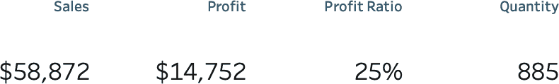

###### 图 5-2\. 匹配 KPI 标题和值的对齐方式

注意我们已将表格标题的对齐方式改为与 KPI 一致，并且可读性得到了改善？这是一个很大的进步，但我们可以做得更多。接下来，我们不再显示仪表板的表格标题，而是将标题添加到表格本身（参见图 5-3](#editing_the_text_of_a_kpi))。

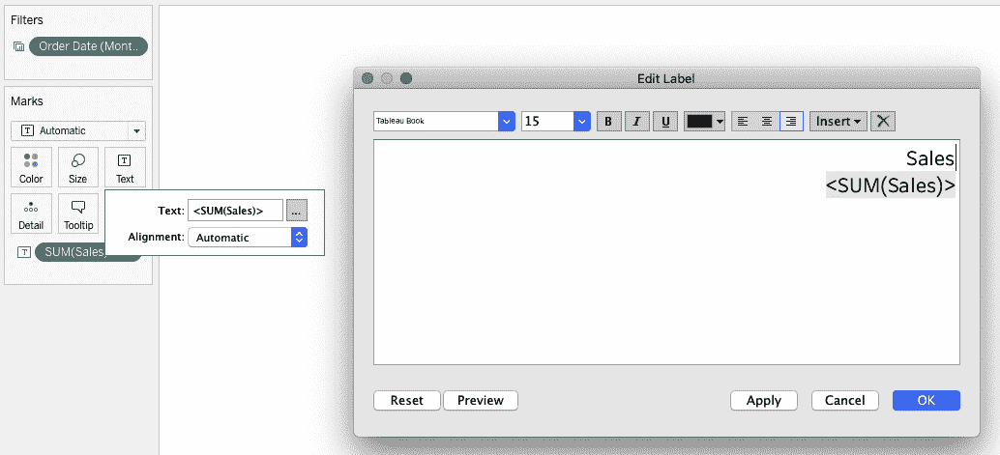

###### 图 5-3\. 编辑 KPI 的文本

下面是具体步骤：

1.  点击表格，点击 Marks 卡上的文本属性，然后点击文本框旁边的省略号。

1.  这将打开编辑标签对话框。在测量上方添加来自您表格名称的标题文本，然后点击确定。

1.  隐藏表格标题。

    结果是标题和 KPI 之间的空间明显减少（参见图 5-4](#kpis_with_titles_on_text_of_a_marks_card))。

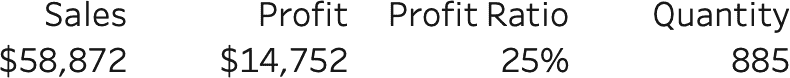

###### 图 5-4\. 带有 Marks 卡文本上 KPI 的标题

关于 KPI 的最后一个入门级提示：使标题比值小一些，但确保它仍然可读。在图 5-5](#formatted_no-frills_kpis))中，KPI 标题使用 10 点 Tableau Book 字体，而 KPI 值使用 20 点 Tableau Semibold 字体。我们通常保持颜色不变，但使标题比值淡一些。最终结果是一组看起来非常专业的简约 KPI。


###### 图 5-5\. 格式简约的 KPI

## 策略：创建单一表格的 KPI

在单独的表格上创建 KPI 的挑战之一是必须在多个表格之间切换，并逐个进行调整。另一个挑战是性能问题。尽管 KPI 非常直观，但是通过将所有 KPI 放在单个表格上，可以优化仪表板的性能。这可以通过第三章中讨论的`MIN(0.0)`技术来实现：

1.  双击列架上的列来创建一个即兴计算。这将打开一个提示框，让您编写一个计算。

1.  输入`**MIN(0.0)**`。

1.  再重复三次。这将创建五个 Marks 卡片，一个用于所有 Marks 卡片，另外四个用于每个`MIN(0.0)`计算。生成的可视化效果如图 5-6](#the_visualization_with_four_minleft_pare))所示。

    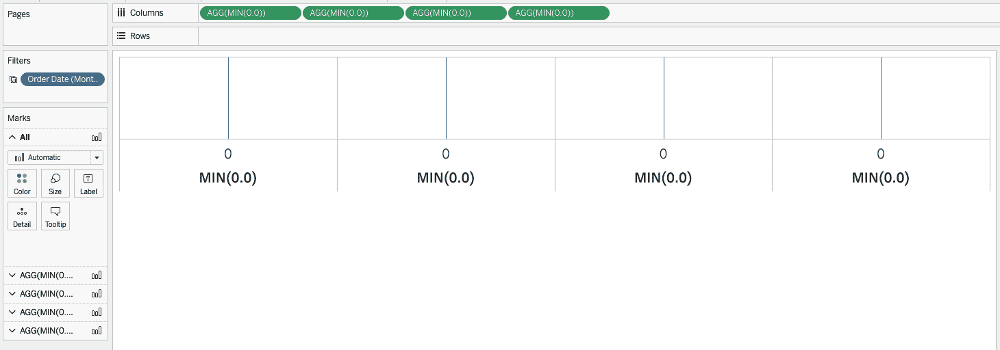

    ###### 图 5-6\. 带有四个`MIN(0.0)`测量的可视化效果

1.  编辑每个轴并将值设置为从-1 到 0.1。然后隐藏轴。

1.  将 SUM(Sales)添加到第一个 MIN(0.0)标记卡。对 SUM(Profit)、Profit Ratio 和 SUM(Quantity)重复此操作。完成后隐藏轴。

1.  将所有文本对齐到所有标记卡的左中部。

1.  将标记类型更改为形状。

1.  在 Tableau 之外，从[*https://tessellationtech.io/wp-content/uploads/2020/05/NULL.png*](https://tessellationtech.io/wp-content/uploads/2020/05/NULL.png)下载一个 1 × 1 的透明图像。

1.  在您的桌面上，转到 My Tableau Repository 中的 Shapes 文件夹，并将透明图像添加到 KPI 文件夹中。

1.  回到 Tableau Desktop，在所有标记卡上编辑形状，然后选择更多形状。单击重新加载形状按钮，然后从选择形状调色板下拉菜单中选择 KPI。接下来，选择透明图像。单击确定。如果尝试悬停在自定义形状上，它不会高亮显示，因为它是完全透明的形状。

1.  在表格格式设置中，删除所有线条和边框。

    这将生成一张包含所有相关关键绩效指标的单页（图 5-7）。

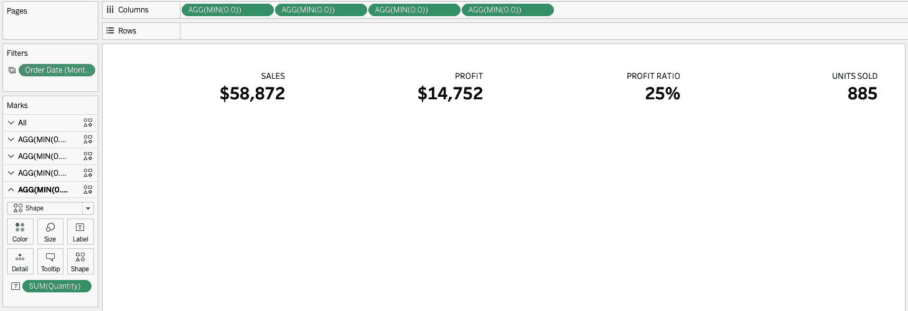

###### 图 5-7\. 单页上的关键绩效指标

将所有关键绩效指标添加到单页中显然比每个关键绩效指标各有一张表格需要更多步骤。但是现在花费时间会导致性能更快的仪表板，在将来更容易调整。在整章中，您将继续更新此表格，以改进我们的关键绩效指标。

您已经解决了图 5-1 中初学者关键绩效指标提供的问题，但是您的过滤器对于仪表板观众来说是看不见的。而不是在仪表板上使用过滤器，您需要构建一个自定义计算来为您过滤数据。

对于我们的示例数据，即 Sample – Superstore 数据集，我们可以访问每日提供的订单数据中的行项目（单个产品）。但是，对于共享关键绩效指标，仅应共享完全完成月份的值。对于您的下一个策略，您将构建一系列计算，当时机成熟时将自动更新 KPI。具体来说，您将创建自动化 KPI，显示最近完整月份数据的最新值。

这意味着如果现在是 2020 年 5 月中旬（即 2020 年 5 月 17 日），数据将仅显示 2020 年 4 月。如果日期是 2020 年 5 月 30 日，数据仍将显示为四月。但是一旦 2020 年 5 月 31 日的数据可用，KPI 将更新以显示现在已完成的五月 2020 年的值。

## 策略：自动化您的关键绩效指标

在此策略中，您将创建自动返回最新完整月份数据的关键绩效指标。这将在单张表上完成，而不是多张表：

1.  编辑您的数据源，将从 2020 年 3 月 15 日到 2020 年 5 月 17 日的数据筛选器中更改结束日期。

1.  创建一个名为`**[Max Date]**`的计算。此计算还将计算数据集中的最大日期：

    ```
      // Max Date
      {MAX([Order Date])}
    ```

    ###### 提示

    这是在处理时间时记住的最重要的单个 LOD 表达式。您正在找到数据集中的最大日期，这非常有用，并且在其他计算中提供了灵活性。

1.  计算上一个完整完成月的最后一天。将此计算命名为 `**[上一个完整月的最后一天]**`：

    ```
    // Last Day of Last Full Month
    DATETRUNC("month", [Max Date] + 1) - 1
    ```

1.  计算上一个完整月的起始日期。将此计算命名为 `**[上一个完整月的第一天]**`：

    ```
    // First Day of Last Full Month
    DATETRUNC("month", [Last Day of Last Full Month])
    ```

1.  现在创建另一个名为 `**[最近的月份]**` 的计算：

    ```
    // Most Recent Month
    [Order Date] >= [First Day of Last Full Month]
    AND
    [Order Date] <= [Last Day of Last Full Month]
    ```

    ###### 提示

    当我们处理关键绩效指标时，尽可能使用布尔计算。它们处理和处理速度非常快，而且非常容易调试。

1.  从这里开始，您可以开始建立一个用于上一个完整月销售额的动态计算，称为 `**[销售额 | 上个月]**`：

    ```
    // Sales | LM
    SUM(
      IF [Most Recent Month]
      THEN [Sales]
      END
    )
    ```

    对 `**[利润 | 上个月]**`、`**[利润比率 | 上个月]**` 和 `**[数量 | 上个月]**` 重复相同操作：

    ```
    // Profit | LM
    SUM(
      IF [Most Recent Month]
      THEN [Profit]
      END
    )

    // Profit Ratio | LM
    [Profit | LM]/[Sales | LM]

    // Quantity | LM
    SUM(
      IF [Most Recent Month]
      THEN [Quantity]
      END
    )
    ```

1.  将文本右对齐，并将所有行和边框设置为无。

1.  将这些计算放置在显示关键绩效指标的单表的其各自的标记卡上。最终结果，如 图 5-8，是一个没有任何过滤器上的度量或维度的表格。

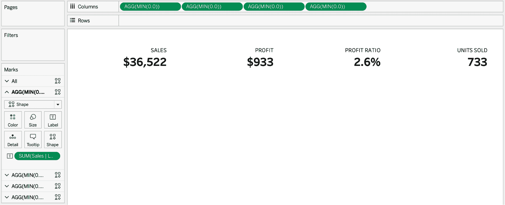

###### 图 5-8\. 自动化的单表关键绩效指标

通过这个策略，您已经开始自动化您的关键绩效指标。接下来的挑战是为这些关键绩效指标提供背景信息。

现在，唯一的结论是上个月的销售额为 $36,522。下面是高管们将要问的下一个问题：

+   这个指标的趋势如何？

+   它与上个月相比如何？

+   它与去年同期相比如何？

+   这段时间与上段相比增长了多少？

+   OE 有多接近达到其目标？

你的任务是预料到这些问题。不必为每一个关键绩效指标提供所有的背景模式，但至少提供*至少一个*额外的数据点是关键的。对于我们下一个策略，我们将详细讨论如何创建动态的年度对比计算。

## 策略：创建年度对比计算

在这里，您将构建计算，用于计算年度对比变化。这些将为您的关键绩效指标提供宝贵的背景信息：

1.  连接到样本—超级商店。

1.  设置一个提取过滤器，以包括所有日期，包括 2020 年 5 月 17 日之前的日期，从 [订单日期] 字段中。

1.  按照 “策略：自动化您的关键绩效指标” 中的步骤 1–6 进行操作。

1.  计算去年同期的上一个完整月的最后一天：

    ```
    // Last Day of Last Full Month Prior Year
    DATEADD("year", -1, [Last Day of Last Full Month] + 1) - 1
    ```

1.  计算上一个年度的上一个完整月的第一天：

    ```
    // First Day of Last Full Month Prior Year
    DATETRUNC("month", [Last Day of Last Full Month Prior Year])
    ```

1.  创建一个布尔计算，用于识别日期是否在数据的上一个年度的最后一个完整月内：

    ```
    // Most Recent Month Prior Year | TF
    [Order Date] <= [Last Day of Last Full Month Prior Year]
    AND
    [Order Date] >= [First Day of Last Full Month Prior Year]
    ```

1.  计算上一个完整月的销售额，但是对于上一个年度：

    ```
    // Sales | LMLY
    SUM(
      IF [Most Recent Month Prior Year | TF]
      THEN [Sales]
      END
    )
    ```

1.  计算上一个完整月的销售额与去年同期之间的差异：

    ```
    // Sales | Delta
    [Sales | LM] - [Sales | LMLY]
    ```

1.  计算两个时间段之间的百分比变化：

    ```
    // Sales | % Delta
    [Sales | Delta] / [Sales | LMLY]
    ```

1.  创建一个箭头，当变化为正时指向上方：

    ```
    // Sales | Delta | Arrow Up
    IF [Sales | Delta] > 0
    THEN "▲"
    END
    ```

1.  创建一个箭头，当变化为负数时会指向下方：

    ```
    // Sales | Delta | Arrow Down
    IF [Sales | Delta] < 0
    THEN "▼"
    END
    ```

1.  在现有的销售 KPI 上，将 [Sales | % Delta]、[Sales | Delta | Arrow Up] 和 [Sales | Delta | Arrow Down] 添加到您的带有 KPI 的工作表的 Sales MIN(0.0) Marks card 的文本中。 （[Sales | LM] 应已在文本上。）

1.  格式化你的 KPI。在我们格式化 KPI 时，我们更喜欢保持上下文信息的字体比指标本身小得多。我们通常还选择较浅的字体颜色。通过单独的箭头计算，我们还能为箭头选择两种颜色。这样，我们可以利用颜色作为观众注意指标变化的视觉指示器。结果显示在图 5-9 中。

    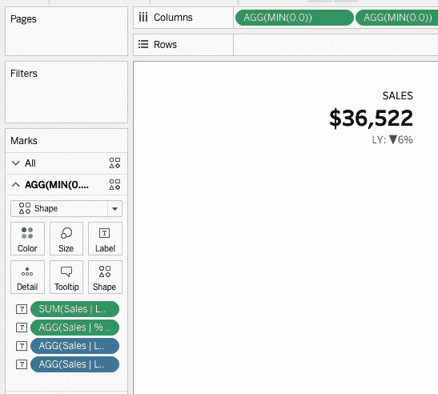

    ###### 图 5-9\. Tableau Desktop 的快照

1.  为每个打算创建的关键绩效指标（KPI）重复执行步骤 5–9。

最终结果是一个提供上下文的 KPI（图 5-10）。在这种情况下，36,522 美元的销售额实际上比去年下降了 6%。这就是为什么你在 KPI 中总是需要提供上下文。您的观众不知道静态值意味着什么。即使您每周或每月查看相同的信息，也很难跟踪上下文。这就是为什么您作为分析开发人员需要记住添加上下文至关重要的原因！

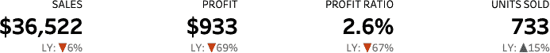

###### 图 5-10\. 一个完整的可视化截图

在这个例子中，您通过一个单一值为您的 KPI 提供了上下文，使您的观众开始准确理解每个 KPI 的含义。

# 火花线

如果您觉得您的观众希望不仅仅是一个单一值来证明 KPI 方向，我们强烈建议使用*火花线*。这些是非常小的线图，没有轴或坐标，强调数据的形状和趋势；它们首次由统计学家和教授爱德华·图夫特引入，并由微软 Excel 推广。它们提供了一种简单而紧凑的方法来显示数据。它们在小倍数中表现良好，但与 KPI 结合使用时也非常出色。

火花线长期以来都很受欢迎。即使今天，它们仍然可以在一些最大的数字媒体网站的首页上找到。例如，在*纽约时报*的网站上，火花线描述了美国 COVID-19 病例的趋势（图 5-11）。这些与新病例和新死亡的 KPI 相邻。

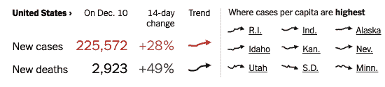

###### 图 5-11\. 2020 年 12 月 11 日 *纽约时报* 首页的*火花线*（Sparklines）

与单表格 KPI 不同，这些火花线需要在单独的工作表上创建。

# 火花线：办公室必备案例研究

作为您工作的一部分，您收到了提供 KPI 附加背景信息的反馈。经过几轮反馈后，决定您需要显示显示最近 13 个完整月份数据的小线图。

## 策略：创建小线图

按照以下步骤创建小线图：

1.  连接到 Sample – Superstore。

1.  设置抽取筛选器以包括所有截至 2020 年 5 月 17 日及之前的日期，从[订单日期]字段创建一个月级别的自定义日期值。

1.  右键单击[订单日期]创建自定义日期（图 5-12）。将此新计算称为[订单日期（月份）]添加到列中。

    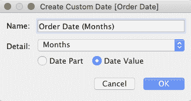

    ###### 图 5-12\. 创建一个月份日期值的自定义日期

1.  创建一个名为`**[完整月份]**`的新计算。此计算将用作帮助我们显示数据完整的月份的筛选器：

    ```
    // Full Months
    [Order Date] <= DATETRUNC("month", {MAX([Order Date])} + 1) -1
    ```

1.  将[完整月份]放置在筛选器架上，并将其设置为 True。

1.  创建一个名为`**[最后 13 个]**`的新计算。此计算将帮助我们显示最近 13 个月的数据：

    ```
    // Last 13
    LAST() <= 12
    ```

1.  将[最后 13 个]添加到筛选器架，并将其设置为 True。现在您应该显示最近 13 个月的数据，从四月到四月。

1.  接下来，您需要将关键指标添加到图表中。在本例中，它是[销售]。

1.  编辑[销售]轴并取消选择“包括零”（图 5-13）。我们将在策略结束时讨论为什么这样做。

    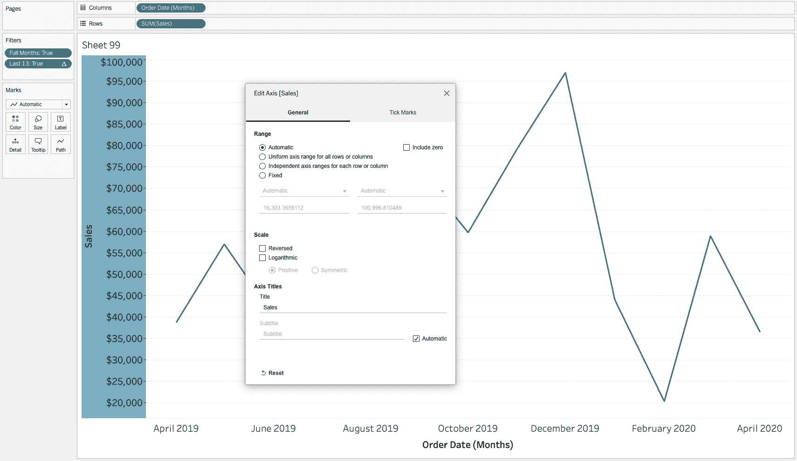

    ###### 图 5-13\. 最终将转换为小线图的折线图

1.  通过在标记卡上调整大小滑块来格式化图表到最低值。接下来隐藏轴线。最后，隐藏工作表上的所有线条和边框。

1.  对每个关键绩效指标（KPI）重复此操作。

1.  创建一个新的仪表板，并按顺序执行以下操作：

    1.  向您的仪表板添加一个垂直容器。

    1.  在该容器内部添加您的关键绩效指标（KPI）。

    1.  在垂直容器内部添加一个水平容器。

    1.  将每个小线图工作表添加到水平容器中。

    1.  隐藏所有工作表的标题，并确保它们占据整个视图。

    1.  调整左右填充，使小线图与您的 KPI 对齐。这将是一个手动过程，取决于容器的宽度和高度。

在这个例子中，容器宽度为 900 像素，高度为 140 像素。我们将左内边距设为 100 像素，右内边距设为 20 像素，用于我们的小线图。我们还将水平容器的高度固定为 25 像素。最终的可视化效果包括强调关键绩效指标的小线图，并附带重要信息（图 5-14）。

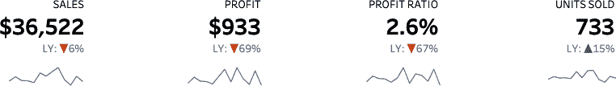

###### 图 5-14\. 创建每个小线图并添加到仪表板后的最终可视化效果

我们喜欢火花线的原因是它们能够在不占用太多空间的情况下为我们的数据产品增加背景信息。新手开发人员经常将火花线制作为占据仪表板重要空间的完整图表；如果我们可以以更简单、更易于理解的方式提供背景信息，那就没必要了。

创建火花线的其他方法可能也很有用。在图 5-14 中，我们展示了过去 13 个月的数据，但有时展示替代方案也是值得的。例如，您可能希望展示年度火花线与去年同期火花线的比较。有两种方法可以做到这一点。第一种方法是显示两条线：一条是最近的 12 个月，另一条是前一个 12 个月。另一种方法是显示一个单线图，按月份绘制，显示选定月份与前一年同月份之间的差异（我们称之为 *Delta 火花条*，因为它显示两个月份之间的差异，将是一个条形图）。

## 策略：创建年度火花线

年度走势火花线允许最终用户比较今年的趋势与去年的趋势。两条线的顺序使其易于解释，因为从左到右依次是一月到十二月，而不仅仅显示一个滚动的 12 个月：

1.  连接到样本 - 超级商店。

1.  设置一个提取过滤器，包括截止到 2020 年 5 月 17 日的所有日期，来自 [Order Date] 字段。创建一个月份级别详细信息的自定义日期值。

1.  将 [Order Date] 添加为列的连续月度日期部分。

1.  将 [Order Date] 添加为 Color 的离散年份。

1.  将 [Full Months] 计算（在前一个策略中找到）添加到过滤器，并选择 True。

1.  创建一个名为 `**[Last Two Years]**` 的计算。将其添加到过滤器，并选择 True：

    ```
    // Last Two Years
    DATETRUNC("month", [Order Date]) >= DATEADD("year", -1,
      DATETRUNC("year", {MAX([Order Date])}))
    ```

1.  将 [Sales] 添加到行。

1.  格式化颜色。通常我们使用更深、更显眼的颜色表示当前年份，使用较浅的灰色表示比较期间。

1.  对每个火花线重复操作。

    产品显示在图 5-15 中，是一组清晰的火花线，让观众可以在整年中跟踪进展。

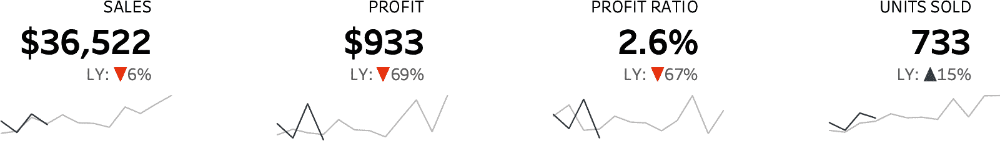

###### 图 5-15。年度比较火花线在 KPI 可视化中

## 策略：创建滚动 24 个月火花线

有时单个火花线是不够的。有时候需要每个指标两个火花线。该策略展示了一个滚动的 12 个月火花线，以及一个第二个火花线表示前一年，以比较火花线与其上一年的值：

1.  连接到样本 - 超级商店。

1.  设置一个提取过滤器，包括截止到 2020 年 5 月 17 日的所有日期，来自 [Order Date] 字段。创建一个月份级别详细信息的自定义日期值。

1.  在详细标记卡上，创建一个月份级别的自定义日期值，并将其添加到详细信息。

1.  为列创建一个即兴计算：

    ```
    (INDEX()-1) % 12
    ```

    编辑表格计算并选择订单日期（月份）。

1.  向 Marks 卡添加临时计算，然后将其设置为颜色：

    ```
    [Order Date (Months)] < DATEADD("year",
      -1, DATETRUNC("month", {MAX([Order Date])}+1)-1)
    ```

1.  将 [全月] 计算添加到筛选器中并选择 True。

1.  创建名为`**[Last 24]**`的计算。将其添加到筛选器中。编辑表格计算并选择订单日期（月份），然后选择 True：

    ```
    // Last 24
    LAST() < 24
    ```

1.  将 [销售额] 添加到行中。

1.  格式化行以匹配 图 5-16 中的设计。

1.  对每个 Sparkline 重复此过程，并将每个添加到水平分隔符中。

最终结果是具有相当多历史背景的 Sparklines（图 5-16）。当你思考我们作为仪表板开发者的工作时，我们的任务是为数字提供背景信息。通过这一更加历史性导向的 Sparklines 集合，我们能够提供这样的背景信息。

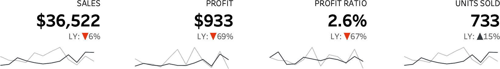

###### 图 5-16\. 具有滚动 24 个月 Sparklines 的最终可视化效果

## 策略：构建 Delta Spark 条形图

当我们与高管合作时，我们经常发现他们对看到最有价值的变化指标的 Spark 图表最感兴趣。他们特别想知道变化是否一致。其中一个最好的方法就是使用 *Spark Bar*，这是一种类似于 Sparklines 的功能，但是以条形图的形式呈现。这使您可以显示数值是高于还是低于零，为此情况提供更为细致的数据可视化：

1.  连接到 Sample – Superstore。

1.  设置提取筛选器以包括从订单日期字段到 2020 年 5 月 17 日的所有日期。在月份级别的详细信息中创建自定义日期值。

1.  在月份级别创建自定义日期值。将此自定义日期添加到列中。

1.  创建名为`**[Last 12]**`的计算。将其添加到筛选器中。编辑相应的表格计算并选择订单日期（月份）。更改过滤器以选择 True 的值：

    ```
    // Last 12
    LAST() < 12
    ```

1.  将 [全月] 计算添加到筛选器中并选择 True。

1.  创建名为`**[Sales | Delta 12]**`的计算，计算过去 12 个周期的百分比变化，并将计算添加到行中：

    ```
    // Sales | Delta 12
    (ZN(SUM([Sales])) - LOOKUP(ZN(SUM([Sales])), -12))
    /
    ABS(LOOKUP(ZN(SUM([Sales])), -12))
    ```

1.  格式化以匹配 图 5-17 中的条形图。

1.  对每个 Sparkline 重复此过程，并将每个添加到水平分隔符中。

结果是一系列柱状图，代表了过去 12 个月的时间变化（图 5-17）。

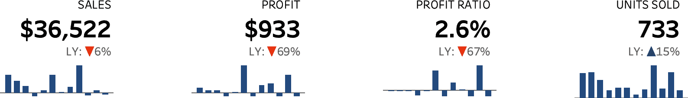

###### 图 5-17\. 显示每个关键业绩指标的逐月同比变化的 Spark 条形图

我们的高管可以轻松地扫描这一视觉效果，看到柱条是否在零线以上或以下。在许多情况下，由 Spark Bars 表示的值成为头等重要指标。

例如，让我们重新访问*纽约时报*中的 COVID-19 可视化（图 5-11）。虽然 KPI 可能是新病例（225,572），但更重要的值是过去 14 天的变化度量（+28%）。高管们通常不关心原始值，而是更关注变化。

想一想。高管们知道原始值意义不大，他们更关注变化度量作为真正的关键绩效指标，这是正确的。他们知道+28%比 225,572 更能帮助理解当前状态。在 COVID-19 的背景下，这两者一起糟糕透了！

## 策略：进展至目标

有时您会被要求追踪 KPI 的进展—特别是是否达到了阈值（预设目标或历史值）。在此策略中，我们将在 KPI 下方构建一个视觉效果，显示该进展（图 5-18）。

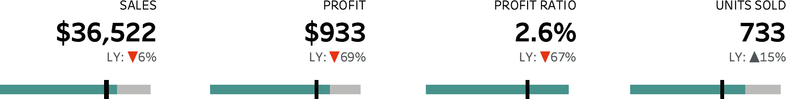

###### 图 5-18。显示 KPI 的百分比进展图表

以下是步骤：

1.  在列架上创建一个临时计算`**MIN(1.0)**`。

1.  将 MIN(1.0)轴设置为–0.1 到 1.1。

1.  将此条形图的颜色设置为浅灰色。

1.  创建一个名为`**[销售目标]**`的浮动参数。将值设置为 1.1。此值将用于设定销售目标为前一年的 110%。

1.  创建一个布尔计算称为`**[当前年份完整月份]**`，计算当前年份的完整月份：

    ```
    // Current Year Full Months
    [Order Date] < DATETRUNC("month", {MAX([Order Date])})
    AND
    [Order Date] >= DATETRUNC("year", {MAX([Order Date])})
    ```

1.  创建一个布尔计算称为`**[上一年度完整月份]**`，计算与当前年度相同的前一年度的完整月份：

    ```
    // Last Year Full Months
    [Order Date] < DATEADD('year', -1, DATETRUNC("month", {MAX([Order Date])}))
    AND
    [Order Date] >= DATEADD('year', -1, DATETRUNC("year", {MAX([Order Date])}))
    ```

1.  计算与前一年度相比的截至目前的销售百分比。将计算命名为`**[销售 | % 预期]**`：

    ```
    // Sales | % Expected
    SUM(
        IF [Last Year Full Months]
        THEN [Sales]
        END
    )/
    SUM(
        IF YEAR([Order Date]) = YEAR({MAX([Order Date])})
        THEN [Sales]
        END
    )
    ```

1.  计算与年度预期总额相比的销售百分比。将计算命名为`**[销售 | % 目标]**`：

    ```
    //Sales | % Target
    SUM(
        IF [Current Year Full Months]
        THEN [Sales]
        END
    )/
    SUM(
        IF YEAR([Order Date]) = YEAR({MAX([Order Date])})
        THEN [Sales] * [Sales Target]
        END
    )
    ```

1.  将整体总数设定上限，以防超过目标，创建名为`**[销售 | % 目标 | 上限]**`的计算：

    ```
    // Sales | % Target | Capped
    IF [Sales | % Target] < 1
    THEN [Sales | % Target]
    ELSE 1
    END
    ```

1.  将[销售 | % 目标 | 上限]添加到 MIN(1.0)右侧的列上。创建一个同步双轴。在两个标记卡的颜色上删除[度量名称]。

1.  创建一个计算，比较预期百分比与目标百分比。将计算命名为`**[销售 | % 预期 vs % 目标]**`：

    ```
    // Sales | % Expected vs % Target
    [Sales | % Expected] < [Sales | % Target]
    ```

    将其放在颜色上。将 True 颜色设置为青色，False 颜色设置为红色。

1.  将[销售 | % 预期]添加到[销售 | % 目标 | 上限]标记卡的详细信息中。

1.  右键单击[销售 | % 目标 | 上限]，添加一个参考线，使用[销售 | % 预期]。将线宽设置为最粗选项，颜色设置为黑色。

1.  对[利润]、[利润比率]和[总客户数]重复步骤 1 至 13。此步骤的结果显示在图 5-19 中。

    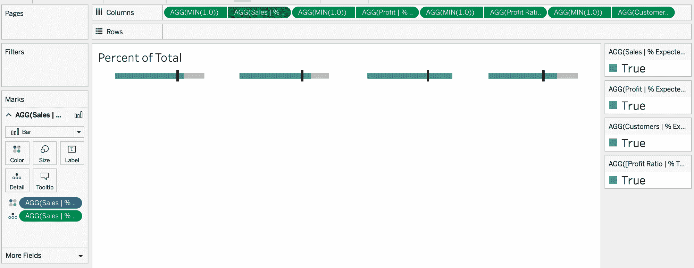

    ###### 图 5-19。完成第 14 步后显示的百分比进展图表

1.  将您的 KPI 表格和百分比进展表格放在同一个仪表板上并格式化它们以减少间距。结果将会是图 5-20。

    

    ###### 图 5-20\. 百分比进展图表与 KPI 并列的最终结果

# 多个 KPI 作为评分卡

有时一个独立的 KPI 作为度量标准是不够的。有时领导者使用一系列度量标准，我们称之为*评分卡*，必须全部一致，以衡量成功。这些 KPI 集合通常是成功的全面衡量标准。

聚合 KPI 或评分卡并不是一个新概念。成功本身很少被量化为二元值。在我们的工作中，奖金通常是基于是否达到一系列目标来计算的。在零售业中，您不仅仅被衡量总销售额，还包括订单数量和总销售数量。如果您达到所有目标，您将获得奖金。如果差一点，就会错失奖金！

这个概念适用于任何组织中需要同时跟踪多个 KPI 的单位。

# KPI 评分卡：办公必需品案例研究

在这个案例研究中，您的任务是跟踪样本–超级商店数据集中每个子类别的四个 KPI。您需要查看销售、总订单和总销售量在达到目标时的表现。然后，您需要计算一个聚合 KPI 评分卡来突出显示达到其目标的 KPI 的百分比。如果任何 KPI 未达到 100%的目标，您将需要通过一个指示器来指出（在本例中是一个红点）。

在这种情况下，知道 KPI 的价值并不那么重要，而更重要的是知道每个 KPI 是否达到其目标。下一个策略的结果显示在图 5-21 中。

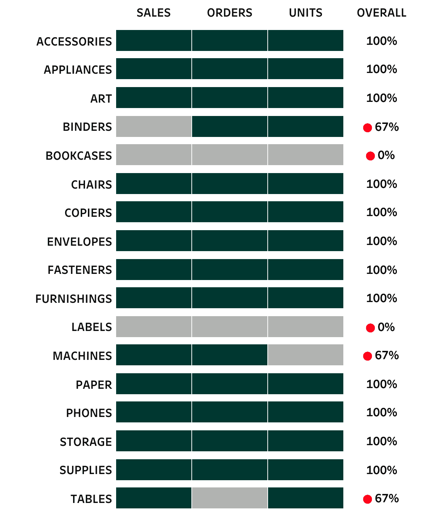

###### 图 5-21\. 显示多个 KPI 的评分卡及其结果作为聚合或总体评分的输出

## 策略：创建聚合 KPI

在这个策略中，您将构建 5-21 中显示的可视化效果：

1.  将[子类别]添加到行。

1.  在列上创建一个临时计算，并键入`**MIN(1)**`。通过按住 Ctrl 键并点击并拖动度量值到自身右侧来复制该度量。重复此步骤三次。

1.  编辑每个轴，范围从 0 到 1。

1.  在第一个 MIN(1) Marks 卡片上，将本章前面的[销售 | % Delta]计算添加到颜色中。编辑颜色：选择自定义的对比调色板。为左侧值选择灰色，为右侧值选择颜色。使用两步的阶梯颜色。将中心设置为 0。 (见图 5-22.)

    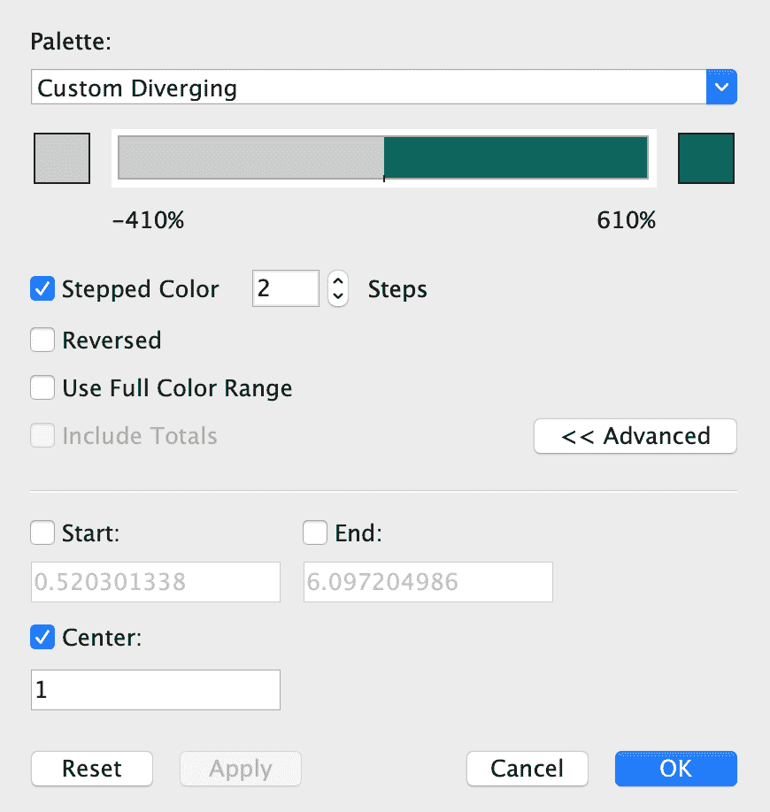

    ###### 图 5-22\. 编辑每个 KPI 的调色板

1.  使用在本章节前面创建的[利润 | % 变动]计算方法，为第二个 MIN(1)分数卡重复此步骤。重复第 4 步中的颜色处理过程。

1.  使用在本章节前面创建的[数量 | % 变动]计算方法，为第三个 MIN(1)分数卡重复此步骤。重复第 4 步中的颜色处理过程。

1.  创建名为`**[总百分比]**`的计算，并将其添加到第四个 MIN(1)分数卡的文本中：

    ```
    //  Total Percentage
    (
      IIF([Sales | % Delta] > 0, 1, 0) +
      IIF([Profit | % Delta] > 0, 1, 0) +
      IIF([Quantity | % Delta] > 0, 1, 0)
    )/3
    ```

1.  创建名为`**[警示点]**`的计算。还将此计算添加到第四个 MIN(1)分数卡的详细信息中：

    ```
    // Alert Dot
    IF [Total Percentage] < 1
    THEN '●'
    ELSE ''
    END
    ```

1.  将此分数卡上的颜色更改为白色。编辑文本。在同一行上的[总百分比]左侧放置[警示点]。将[警示点]的颜色更改为红色。

最终结果显示在图 5-23，这是一种可视化方式，可以看到每个子类别的表现。

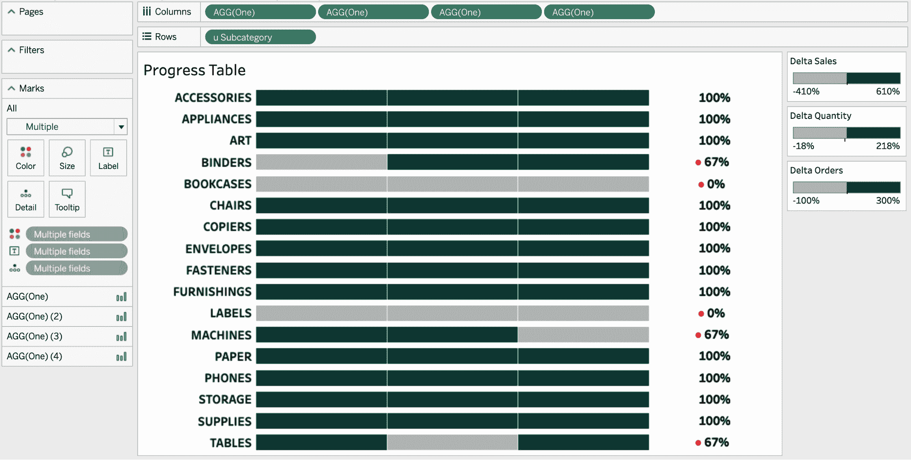

###### 图 5-23\. 在 Tableau Desktop 中显示的表视图，展示了如何创建聚合 KPI

# 跟踪每日变化：办公必需品案例研究

OE 的销售已经稳步增长。除了月度报告外，管理层现在还希望跟踪累计每日价值，以便每天早上了解业务表现。如何在上下文中表示这些每日价值？

对于本章节的最后一个策略，我们将构建可以跟踪每日累计值与前一时间段比较的关键绩效指标。在此可视化中，我们将显示一个 KPI 以及线条和区域图表。这种可视化系统适用于每日跟踪，而不是在几天内就单个值进行系统讨论。对于高管更频繁查看或需要更多视觉空间以获取上下文信息的情况非常有用。

这些图表显示了相对于去年同期价值的进展，以及当前年度进展的进度。常见用例可能包括跟踪销售数据、报告单位生产情况以及了解客户参与的数量。所有这些情况都依赖于与前一年的表现进行对比，以更好地了解业务的趋势是否符合预期。

添加这些月度行可为本月与去年同期的当前表现提供背景。当值优于去年同期时，行为绿色。当低于去年时，为红色。尽管这些在 Tableau 中看起来非常简单，但需要多个步骤来构建这些线条。

这个下一个案例研究将分为三个策略，但将合并为单个仪表板。在图 5-24 中显示的输出突出显示了按月销售绩效。

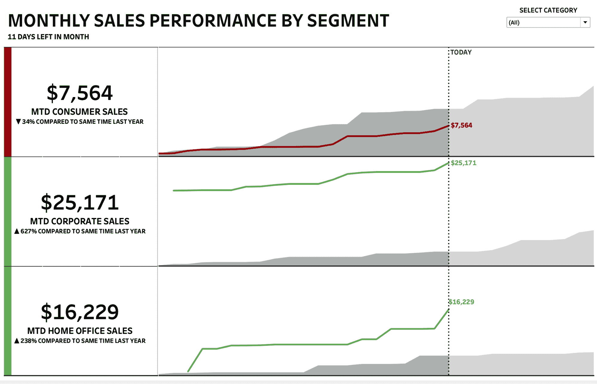

###### 图 5-24\. 下三种策略的输出结果

## 策略：创建月至今 Sparklines

此策略创建了图表和面积图，如图 5-24 所示：

1.  连接到样本 - 超级商店。

1.  设置一个提取过滤器，包括截止到 2020 年 9 月 17 日的所有日期，来自[订单日期]字段的自定义日期值。

1.  将订单日期的日添加到列中作为连续日期部分。

    接下来，您将构建一系列计算，以帮助您创建可视化效果。

1.  创建一个名为`**[今天]**`的计算。通常情况下，您会在计算中放置`TODAY()`函数，但为了示例，使用我们数据集中的最大日期——在应用了提取筛选器之后，这是 5 月 17 日：

    ```
    // Today
    {MAX([Order Date])}
    ```

1.  创建一个名为`**[CMCY | TF]**`的布尔计算，表示数据是否与[今天]处于同一个月份（CMCY = 当前月份，当前年份）：

    ```
    // CMCY | TF
    DATETRUNC('month' ,[Order Date]) = DATETRUNC('month', [Today])
    AND DATEPART('day', [Order Date]) <= DATEPART('day', [Today])
    ```

1.  创建一个名为`**[SDLY | TF]**`的布尔计算，表示数据是否与[今天]相同月的上一年同一天（SDLY = 同一天，去年）：

    ```
    // SDLY | TF
    DATETRUNC('month', [Order Date]) = DATETRUNC('month', DATEADD('year', -1,
      [Today]))
    AND DATEPART('day', [Order Date]) <= DATEPART('day',[Today])
    ```

1.  创建一个名为`**[SMLY | TF]**`的布尔计算，指示月份是否与[今天]的同一个月份相同，但是是前一年（SMLY = 同一个月份，去年）：

    ```
        // SMLY | TF
    DATETRUNC('month', [Order Date]) = DATETRUNC('month', DATEADD('year', -1,
      [Today]))
    ```

1.  为当前月份的[今天]创建一个名为`**[销售额 | CMCY]**`的计算：

    ```
    // Sales | CMCY
    IF [CMCY | TF]
    THEN [Sales]
    END
    ```

1.  创建一个名为`**[销售额 | SMLY]**`的计算，如果它们发生在与[今天]相同的上个月，但是去年：

    ```
    // Sales | SMLY
    IF [SMLY | TF]
    THEN [Sales]
    END
    ```

1.  创建一个名为`**[销售额 | SDLY]**`的计算，计算与[今天]相同日和月份的去年同一天的销售额：

    ```
    // Sales | SDLY
    IF [SDLY | TF]
    THEN [Sales]
    END
    ```

    现在，您已经为这个可视化创建了基本计算，我们可以开始把它们整合在一起。

1.  创建一个名为`**[销售额 | CMCY | 隐藏]**`的计算：

    ```
    // Sales | CMCY | Hidden
    IF MAX(DAY([Order Date])) > MAX(DAY([Today]))
    THEN NULL
    ELSE RUNNING_SUM(SUM([Sales | CMCY]))
    END
    ```

1.  将[销售额 | CMCY | 隐藏]添加到行中。将标记类型设置为线条。编辑表计算。选择特定维度，并仅选择订单日期的日。

1.  创建一个名为`**[销售额 | SDLY | 隐藏]**`的计算：

    ```
    // Sales | SDLY | Hidden
    IF MAX(DAY([Order Date])) > MAX(DAY([Today]))
    THEN NULL
    ELSE RUNNING_SUM(SUM([Sales | SDLY]))
    END
    ```

1.  将[Measure Values]添加到行中。在新的[Measure Values] Marks 卡中，确保只包括 SUM(销售额 | SMLY)和[销售额 | SDLY | 隐藏]。右键单击[Measure Values] Marks 卡上的 SUM(销售额 | SMLY)，添加一个累计总数表计算（图 5-25）。

    ![在[Measure Values] Marks 卡上右键单击度量，添加一个快速表计算来计算累计总数](Images/TAST_0525.png)

    ###### 图 5-25\. 在[Measure Values] Marks 卡上右键单击度量，添加一个快速表计算来计算累计总数。

1.  将[Measure Values]标记类型更改为面积。将[Measure Names]添加到颜色中，将 SUM(销售额 | SMLY)设置为浅灰色，将[销售额 | SDLY | 隐藏]设置为中灰色。

1.  您会注意到我们的两个面积图是堆叠的。你不想要这个。从顶部菜单中选择分析 → 堆叠标记 → 关闭（图 5-26）。

    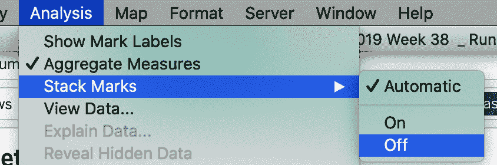

    ###### 图 5-26\. 从顶部菜单中关闭堆叠标记

1.  在行架上创建一个同步的双轴，位于[销售额 | CMCY | 隐藏]和[度量值]之间。然后，右键单击[销售额 | CMCY | 隐藏]轴并选择“将标记移至前面”。

1.  创建一个名为`**[今日参考线]**`的计算：

    ```
    // Today Reference Line
    DATEPART('day', [Today])
    ```

    将此计算拖动到[销售额 | CMCY | 隐藏]标记卡的详细信息中。将计算的聚合更改为最大值。右键单击[订单日期的日]轴并添加参考线。

    对于整个表格，使用[今日参考线]的最大值。不显示标签或工具提示。将线型更改为短划线。取消选中“显示突出显示或选定数据点的重新计算线”。图 5-27 显示了此时的图表。

    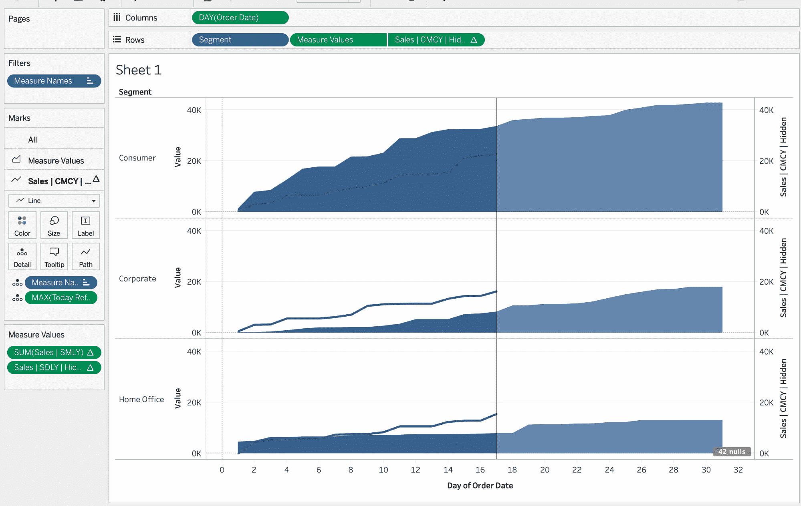

    ###### 图 5-27\. 百分比至目标区域和线图的进展

1.  创建一个名为`**[销售额 | MTD | % 变化]**`的计算。这将计算出与去年同期相比，从当天到当月底的销售额变化百分比：

    ```
    // Sales | MTD | % Delta
    (SUM([Sales | CMCY]) - SUM([Sales | SDLY]))
    /
    SUM([Sales | SDLY])
    ```

1.  创建一个名为`**[颜色线]**`的计算：

    ```
    // Color Line
    {EXCLUDE [Order Date]: SIGN([Sales | MTD | % Delta])}
    ```

    将[颜色线]添加到[销售额 | CMCY | 隐藏]标记卡的颜色中。将标记类型从连续更改为离散。编辑颜色，因此-1 为红色，1 为绿色。

1.  在[销售额 | CMCY | 隐藏]标记卡上，选择“显示标记标签”复选框。对于要标记的标记选项，请选择线末端并仅选择标签末端。最后，在字体下拉菜单中选择匹配标记颜色。图 5-28 显示了这些选项。

    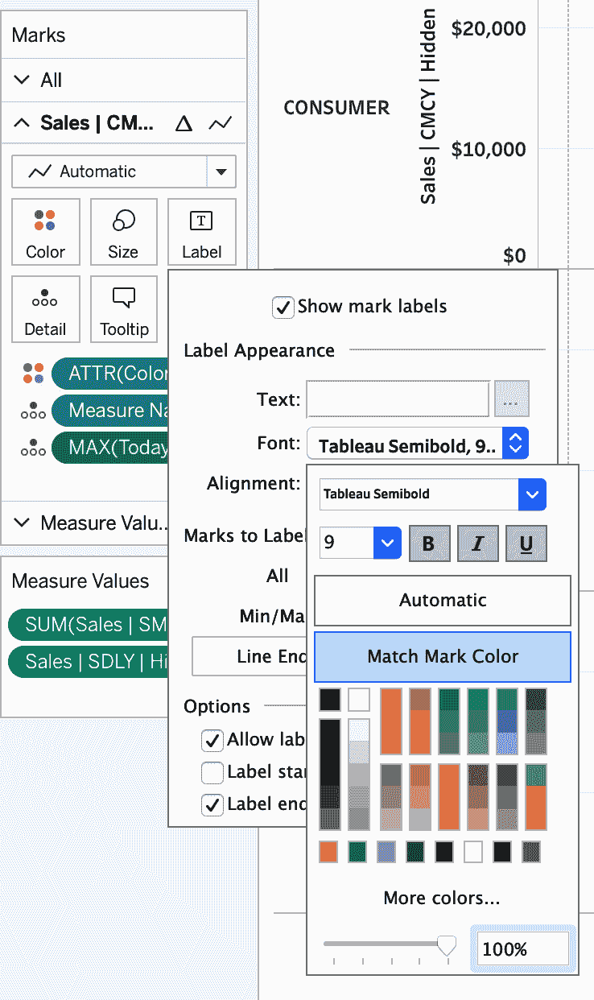

    ###### 图 5-28\. 使用“标签”上的“匹配标记颜色”选项来匹配标记颜色

1.  最后，您需要对可视化进行格式化。隐藏值轴、[销售额 | CMCY | 隐藏]轴和[订单日期的日]轴。然后删除虚线零线和列分隔线。在可视化的左上角，右键单击[分段]并选择隐藏行字段标签。

    结果显示在图 5-29 中，显示今年与去年区域图的美丽线条。当然，图表很有用，但您也希望将其与本月的关键绩效指标结合起来。

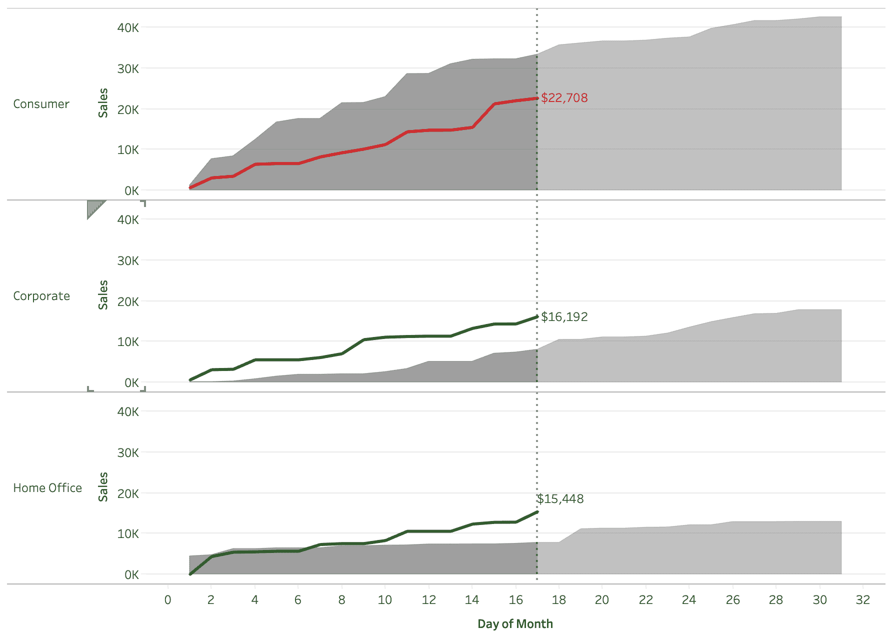

###### 图 5-29\. 最终产品

## 策略：创建月度关键绩效指标

在这种策略中，我们将详细介绍如何将之前的关键绩效指标与本月的绩效指标结合起来。幸运的是，我们在构建线条时已经建立了许多我们需要的计算，所以这次构建应该会更加直接。

1.  将[分段]添加到行中。

1.  在列上输入`**MIN(10)**`作为即席计算。将标记类型设置为文本。要进行格式化，请将网格线、零线、轴标尺和轴刻度设置为无。编辑轴并将范围固定在 0 到 20 之间。

1.  将 SUM(Sales | CMCY)、[Sales | MTD | % Delta]和[Segment]添加到标签中。按照图 5-30](#a_detailed_view_of_the_text_formatting)所示编辑文本。

    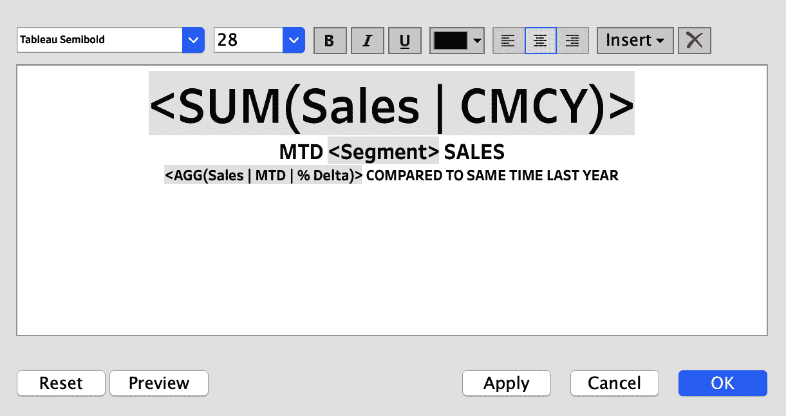

    ###### 图 5-30\. 文本格式的详细视图

1.  右键单击 Marks 卡上的[Sales | MTD | %Delta]，然后选择格式。在字体格式设置下，选择窗格（如果尚未选择）。单击数字下拉框。在默认部分，靠近格式的顶部，选择自定义，然后键入`**"▲ 0%;▼ 0%;▬"**`。这将在正百分比之前放置一个上箭头，在负百分比之前放置一个下箭头，并为零值放置一个大破折号。

1.  在 MIN(10)右侧的列上作为即席计算键入`**MIN(1)**`，然后创建同步双轴，然后隐藏轴线。还要删除在两个标记卡的颜色上自动添加的[Measure Names]值。

    将标记类型更改为条形。将条形类型设置为最大宽度。在颜色上，将边框设置为无。

    删除网格线和列分隔线。与运行线和面积图表上的行分隔线匹配格式。

1.  将[Color Lines]的计算添加到 MIN(1)标记卡的颜色中。这种颜色应该与您从“策略：创建月度累计火花线”中的线条颜色匹配。

    完成此步骤后，您已创建了您的 KPIs（见图 5-31](#kpis_and_a_success_indicator)）。

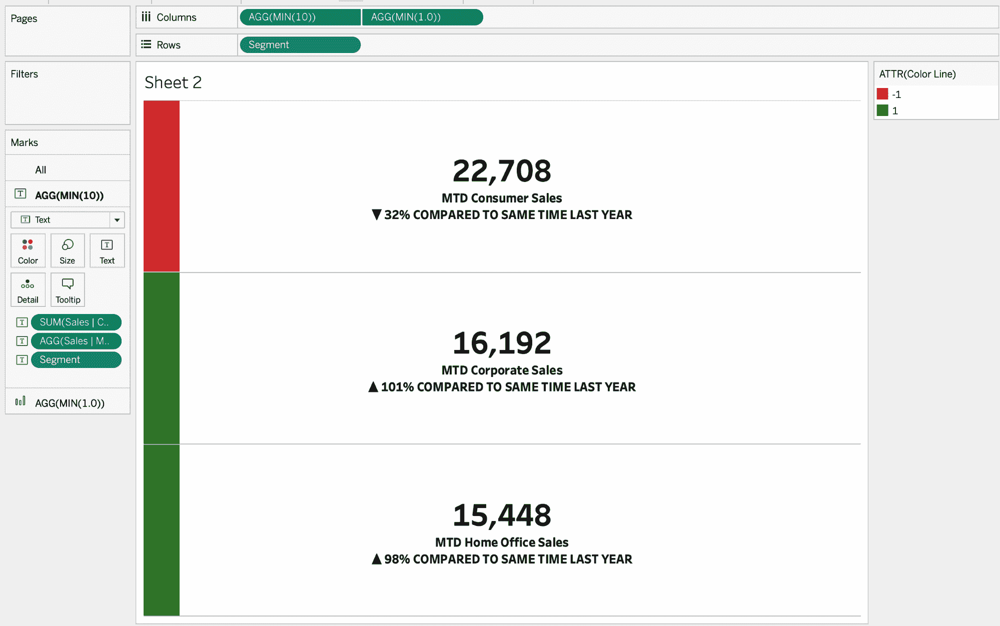

###### 图 5-31\. KPI 和成功指标

## 策略：在仪表板中合并 KPI 可视化

现在您已完成前两个策略中的 KPI 和微型图表，现在是时候将可视化效果集中在仪表板上了：

1.  在您的仪表板中添加一个水平容器。

1.  将 KPI 添加到水平容器中。将所有外部或内部填充设置为零。隐藏标题。选择使 KPI 适合整个视图的选项。

1.  在水平容器内 KPI 的右侧添加微型图表。隐藏右侧的段标题。将所有外部或内部填充设置为零，并隐藏标题。选择使 KPI 适合整个视图的选项。

1.  删除包含图例的容器。

1.  调整 KPI 表的大小以达到所需的宽度，并为线图腾出空间。

    结果是两个可视化效果，它们作为仪表板的单个组件出现（见图 5-32](#the_final_result_of_the_strategy)）。

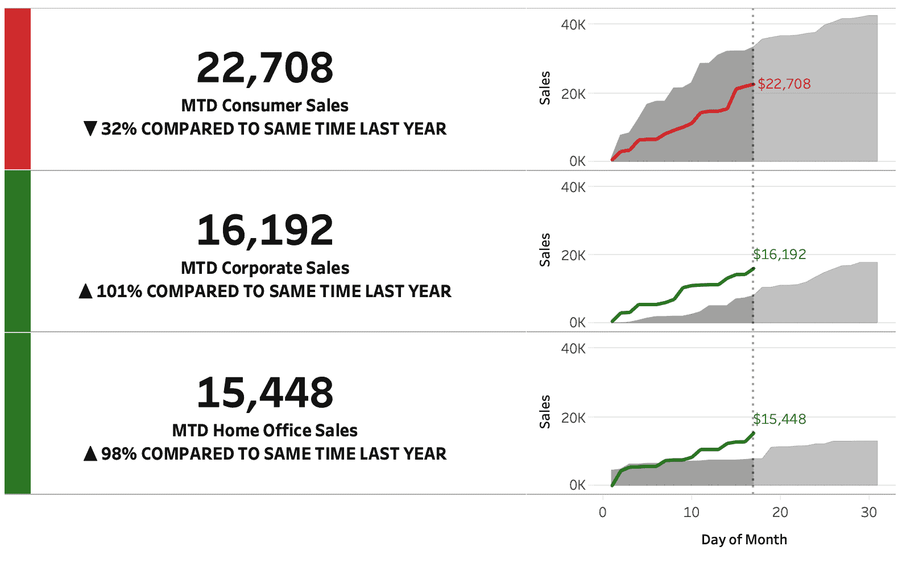

###### 图 5-32\. 策略的最终结果

# 结论

现在您有机会使用和扩展您的 KPIs 之后，让我们回顾一下。

我们开始本章讨论格式化 KPI 的重要性，以便您的受众能够轻松阅读。简单的功能，如文本大小、文本对齐和字体选择，都很重要。总体目标是增加可读性，使您的受众可以一眼看到数值并迅速获取所需信息。

我们展示了如何使用计算 MIN(0.0)作为占位符在单张表上构建多个 KPI。在单张表上开发您的 KPI 带来两个主要好处。首先，所有 KPI 都在一个位置，简化并加快了开发速度。现在您不需要从一张表跳到另一张表，只需快速切换到不同的 Marks 卡片进行编辑即可。这也简化了格式化过程。另一个更大的好处是因为从单张表工作而带来的性能提升。如果您能找到减少使用表数的方法，那就应该抓住这个机会。表数越少通常意味着性能越好。

在本章的大部分内容中，我们展示了如何为 KPI 添加上下文示例。计算年度（或月度）同比对于大多数商业情境至关重要。想象一下仅仅通过您汽车上的里程表来讲述一个故事。

仅在任何给定时点记下您的速度并没有太多的上下文：

+   如果您能说出速度是否高于或低于目标，比如限速，那该多好？

+   如果您能说出此时速度与以前同一路段的旅行速度相比如何？

+   如果您能在固定的时间间隔内展示快照——比如每 15 分钟一次？

这种上下文将提高理解。您可能能够判断自己是否超速，是否比平常行程快，或者在路途中的何处失去了时间。

所有这些都可以转化为本章的策略。我们向您展示了如何使用 LOD 计算来计算年度对比，这使您能够理解您的指标的方向。

我们还讨论了如何自动化您的 KPI。这是因为观众渴望最新的信息，并且认为在维护其数据产品时没有额外的努力。自动化的 KPI（和其他计算）是救命的。我们亲眼见证了这一点！我们可以亲自证明这一策略使人们的周末恢复了，从而提高了公司的员工保留率！这太疯狂了！通过精心设计的计算，您可以自动化您的 KPI（以及您的其他仪表板），不仅使您的最终用户获得最新信息，还使分析师节省了大量时间。

在本章介绍的策略中，我们展示了如何显示自动化的火花线图，展示了过去 13 个月的情况，并将本年度累计进展与去年进行了叠加，结合了展示滚动 24 个月火花线图的想法。每种火花线选项都增强了 KPI，并允许您的观众看到路径进展而不必过度分析数据。

我们还展示了一个火花柱状图，显示了一个指标的年度差异作为微图表的驱动值。同样重要的是，这种策略展示了一种替代方法——使用表计算来计算年度指标。

如果您正在追踪累积目标（这在销售中非常常见），那么进度条图表对您非常有用。虽然我们使用去年销售额的 110%作为我们的目标，但也可以使用其他方法设置目标。重要的是展示我们可以追踪进展！

尽管本章介绍的许多策略都侧重于月度指标，但也可以报告从第二个（每秒水量）到终身（客户生命周期价值）的任何时间段。在章节末尾，我们将焦点从月度转移到了日常。结果是每日销售总额的运行总计以及每日价值快照高于或低于指定目标。

KPIs 本身非常简单。每个指标表示您的受众讨论的单个值。虽然我们在整章中都提到过这一点，但我们要结束时说，作为开发者，您的工作是为这个值添加上下文，以便您的受众对齐。

在下一章中，我们将继续专注于基本内容，并讨论表格设计和分析。虽然大多数数据可视化专家避免谈论表格，但我们希望提供这些指导，因为每个开发者都会收到表格的请求。像 KPIs 一样，一个设计良好且具有适当背景的表格对您的受众可能非常有用。
