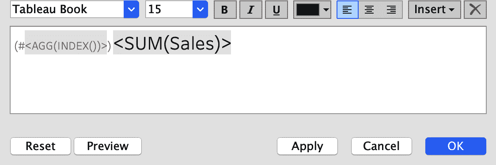

# 第六章：构建有影响力的表格

快速——不要想太多，回答以下问题：

+   当展示数据时，使用最多的图表类型是什么？

+   最难设计的图表类型是什么？

+   最不可定制的图表类型是什么？

+   数据从业者最讨厌的图表类型是什么？

所有这些问题的答案都是朴素的数据表格。本章讨论的是构建充满信息的表格，而不牺牲设计。

像图 6-1 中的视觉一样，大部分信息仍然以表格形式共享。但是当我们想传达数据中的特殊点时，很可能会在大量信息中丢失。

分析师和设计师抱怨表格，但实际上人们在决策时使用表格。看吧，这可能是你在尝试验证数据时的首选可视化方式。作为分析开发人员和数据可视化从业者，我们的工作是为用户提供工具，让他们能够完成工作。如果你的受众要求表格，这意味着要制作表格！


###### 图 6-1\. 带有一些颜色（但不是所有颜色）以突出一些关键值的表格

# 构建出色的表格

在开始制作表格之前，让我们看一些可以帮助设计更有用的表格的技巧。人们认为表格很简单，但它们是信息的复杂系统，必须非常小心地格式化，以最大化理解。

让我们从我们职业生涯中不可避免地制作的一种表格开始：小字体、信息密集的表格；参见图 6-2。


###### 图 6-2\. 小字体且没有间距的表格

制作这种表格时，你根本不考虑最终用户或如何设计表格以改善决策。你唯一的想法是，如何尽可能多地将信息塞进这个表格中，以便今后无需再思考？但是表格可以很有用。我们不应该担心空间，因为我们基本上可以使用任意多的空间；这是数字的，不是纸张，所以不要害怕好好利用像素。

那么，你可以做些什么简单的事情来最大化表格的可读性呢？

## 确保表格的明确目的

为任何受众提供数据表格是很容易的事情。确切地了解受众的需求，并定制表格的输出以突出受众的关键见解，并使用附加数据提供背景信息，则是完全另一回事。也许您想要传达的关键值是总客户数。也许是上个月客户数量的变化，或者与一年前相比的上个月总客户变化（这被称为*双重变化*）。每个这三个目标都需要不同类型的表格。

## 格式化您的表格以最大化可读性

有很多方法可以做到这一点，但我们建议采用以下技术：

使字体大小可读

您可能会因为想要通过减小字体大小而试图把太多内容塞进一个表格中。不要这样做！字号在 10 到 14 之间通常是合适的。

区分列标题和正文

使用粗体字体或更改标题文本的颜色以区分头部和正文。

在表格中为行添加间距和填充

行间填充应在文本上方和下方的字体大小的 0.5 至 1.0 倍之间。

选择适合表格的字体

在选择字体时要慎重。Luke 个人不喜欢衬线字体，而是选择无衬线或等宽字体；Ann 喜欢使用 Tableau 字体系列，因为它们在所有字体大小下都被最大化用于可读性和数据展示。总体而言，选择`数字值单调间隔的字体`是非常重要的，这样可以使列中的数字对齐。

限制您使用颜色的次数

颜色对表格设计很有用，但使用过多可能会分散注意力。通过一些定制，您可以谨慎使用颜色来突出表格的特定列。

我们的前两种策略介绍了创建适合任何受众的表格的基本原则。在本章的其余部分，您将通过应用这些原则来提高您的 Tableau 表格开发技能。

# 在表格中使用颜色：办公必备产品案例研究

让我们回到之前章节中您看到的办公用品店 OE。在这个例子中，数据团队被要求创建一个按客户显示指标细分的表格。这个表格将有很多行，这将使得收集见解变得困难。团队如何使用颜色来传达要点？

颜色是突出所需传达内容的好方法，但过多的颜色可能会让人感到不知所措。OE 数据团队如何突出一些值以传达见解？

在本节中，我们将讨论几种策略。首先，我们将带您创建一个表格，只需使用少量颜色来表达其观点。然后我们会尝试一种使用点来编码颜色的变体。

## 策略：使用有限的颜色创建表格

您将首先使用 Sample - Superstore 数据集构建一个基础表格：

1.  按以下方式创建基本表格，如图 6-3 所示：

    1.  将[客户名称]添加到行架上。

    1.  将[测量名称]添加到列中，将[测量值]添加到文本中。

    1.  在筛选架上，你会看到[测量名称]。通过选择[销售]、[订单]、[利润]和[利润率]来编辑它。

        如果你没有利润比率计算，请创建它。

        ```
        // Profit Ratio
        SUM([Profit])/SUM([Sales]))
        ```

    1.  将值从上到下重新排序：SUM(销售)，AGG(订单)，SUM(利润)和 AGG(利润率)。

        

    ###### 图 6-3\. Tableau 中的简单基本表格

1.  通过将表格的文本格式化为与行标题相同的字体样式、大小和颜色，应用可读性原则。你可以点击“文本”按钮，设置字体为 Tableau Book，大小为 15，并选择第一列黑色色调的倒数第二个阴影（图 6-4）。

    

    ###### 图 6-4\. 默认情况下，Tableau 在表格中不使用最佳实践的文本颜色和大小。确保更新文本和字体。

    通过右键单击客户名称并选择格式，使此样式与行标题匹配。图 6-5 显示了结果选项。

    

    ###### 图 6-5\. 除了更新文本外，确保更新标题

    确保顶部标题是粗体字体（它应该是）。最后，移除行间隔条纹，但为每一行添加行分隔符。格式化边框并将行分隔符设置为最低的详细级别，将滑块向右移动。这将使你得到图 6-6 中的表格。

    

    ###### 图 6-6\. 这个表格的微妙但重要的区别在于每行具有相同的字体和样式

1.  现在，你的表格相当基础。你只是列出数据，而不是展示 Tableau 的强大功能。因此，让我们添加一些颜色（图 6-7）。将[测量值]拖动到颜色中，然后将标记类型从自动更改为方块。

    ![通过在表格中使用[测量值]来进行颜色](Images/TAST_0607.png)

    ###### 图 6-7\. 通过在表格中使用[测量值]进行颜色

    这就是你经常在 Tableau 中看到的表格上的颜色使用方式：使用[Measure Values]为所有度量使用一种颜色。但是你有四个度量，它们都非常不同。[Sales]度量仅由从零到数万的正值组成。[Profit]可能是负值也可能是正值，并且可能达到数千。[Total Orders]表示为整数，但甚至不超过 20。而[Profit Ratio]是一个百分比，大多数值在-10%到 25%之间。单一颜色编码对所有四个度量都不适用。

    你可以通过右键点击[Measure Values]上的颜色并选择“使用单独图例”来解决这个问题（参见图 6-8）。

    ![如果你想要在[Measure Names]中为每个度量选择不同的颜色，请务必在右键点击[Measure Values]上的颜色后选择“使用单独图例”](Images/TAST_0608.png)

    ###### 图 6-8\. 如果你想要在[Measure Names]中为每个度量选择不同的颜色，请在右键点击[Measure Values]上的颜色后选择“使用单独图例”

    这将为你的表格中的每个度量（参见图 6-9）提供一个不同颜色的图例。


###### 图 6-9\. 选择“使用单独图例”后的默认颜色

现在你可以单独对每个度量进行编码，这真是太神奇了。不过要记住，限制颜色的使用非常重要，因为这样能帮助你的观众更轻松地从表格中获取见解。在这种情况下，最多只能对两个度量使用颜色。

你需要设计这个表格，使得颜色仅出现在[SUM(Sales)]和[AGG(Profit Ratio)]上。首先，编辑[SUM([Sales)]的颜色调色板，将调色板设置为绿金色。接下来，编辑[AGG(Profit Ratio)]并将颜色调色板设置为金紫色分散。

现在，要移除[SUM(Profit)]和[AGG(Total Orders)]的颜色。不幸的是，你不能从视图中删除这些颜色图例。编辑调色板，使其为白色（或者你在表格中使用的背景色）。你可以通过创建自定义的分散调色板，设置阶梯色为 2 步，然后将两个自定义颜色都改为白色（#FFFFFF），如图 6-10 所示。


###### 图 6-10\. 如果你不想显示图例，选择与仪表板背景颜色匹配的颜色

这使得表格看起来像图 6-11。


###### 图 6-11\. 使用单独图例突出显示两列的表格。注意，其他两个图例设置为全白。

最终产品是一个只在两列中使用颜色的表格。这使我们的观众能够更快地从数据中获取见解，特别是通过视觉指标准确识别销售额最高或利润率最高的客户。

## 策略：使用点来编码颜色

另一种策略是使用点来进行颜色编码。在跟随过程中，您需要确保点保持文本右对齐，并且圆圈不会与文本重叠（参见图 6-12）。


###### 图 6-12\. 当使用点来突出显示值时，请确保点不会重叠或分散注意力，否则您将得到一个混乱的可视化效果（右侧）

如果您只是将标记类型从方形更改为圆形，技术上您会得到相同的图表，但文本偶尔会与圆圈重叠，使其更难以阅读。让我们用正确的方法来做：

1.  将标记类型从方形更改为圆形。

1.  要适当地对齐圆圈和文本，您需要创建自定义措施，将值居中到您想要的表格中。首先创建一个特定的计算。在列架上，双击[Measure Names]右侧的空白处。这将打开一个提示，允许您编写自定义计算。键入`**MIN(0.2)**`。现在看起来像是将圆圈和文本居中到 0.2，但实际上完成后，只会将圆点居中到该值。这将创建图 6-13 中的表格。

    

    ###### 图 6-13\. 我们正在进行的工作，为视觉编码添加点和颜色

    ###### Tip

    当您使用`MIN(0.2)`时，您使用了一个固定的度量来创建数据源中的一列。使用最小函数可以确保该值直接放置在您指定的任何值上。如果您使用了`SUM()`，则该值将等于该维度成员的总记录数，乘以您在`MIN()`函数中放置的值。

    当您希望在数据集中创建多个列或将标记层叠在一起时，您将使用这种`MIN()`技术。

    ###### Tip

    这种技术有助于从数据中推导出额外的列。在此示例中，您使用了`MIN(0.2)`。然而，在几乎所有其他用例中，最好使用`MIN(0.0)`或`MIN(1.0)`；这些更自然的值可以用作占位符。

    如果您想要保持圆圈与文本右对齐，您只需隐藏标题并去除网格线，就可以了。但由于您试图将圆圈放在度量的左侧，并同时保持文本右对齐，因此还需要一些额外的步骤。

1.  双击 AGG(MIN(0.2))右侧，输入`**MIN(1.0)**`。这会在我们的视图上加倍标记，并创建第二个标记卡。结果是图 6-14。

    

    ###### 图 6-14。添加另一个虚拟数据列 MIN(1.0)会使标记加倍，但我们将更新可视化，以避免标记重复显示

1.  取 AGG(MIN(0.2))和 AGG(MIN(0.2))测量值，并在两者之间创建一个同步双轴。这将使你得到图 6-15 的图表。

    

    ###### 图 6-15。在同步轴后，您会注意到一个圆圈，一个圆圈在一列的文本左侧，另一个圆圈在另一列的文本右侧

1.  在 AGG(MIN(0.2))标记卡上，从文本中移除[Measure Values]。

1.  在 AGG(MIN(1.0))标记卡上，将标记类型更改为甘特条，从颜色中移除[Measure Values]，将颜色设置为白色，并完全确保它们不会与文本重叠或冲突，将不透明度更改为 0%。点击 Marks 卡上的 Label，并将水平对齐从自动更改为左对齐。图 6-16 显示了此阶段的可视化。

    

    ###### 图 6-16。调整 MIN(0.2)和 MIN(1.0)文本后，视觉指示器开始形成

1.  你已经快要完成了。要设置轴范围，请右键单击 MIN(0.2)轴，选择编辑轴。在编辑轴弹出窗口中，将范围设置为从 0 到 1。然后退出弹出窗口并隐藏两个轴。

1.  右键单击图表，选择格式。在格式化线条下，移除所有网格线和零线。这样你就得到了最终的图表（图 6-17），文本仍然右对齐，但你也有了编码颜色的圆圈。


###### 图 6-17。一旦格式化，视觉指示器会为数据的方向提供微妙的提示

# 超越度量名称和值：Office Essentials 案例研究

我们在 Office Essentials 数据团队的朋友面临另一个挑战。他们的经理阿里喜欢图 6-17 中的表格，但她认为他们可以做得更好——她有一个愿望清单！这是她要求的：

+   一种方法是将每年销售额的百分增长率与总销售指标一起显示

+   一个像图 6-17 的表格，但突出显示最有利可图和最不利可图的项目

+   一个销售表格，当某个特定周的数据完整一周时将自动更新，并显示自上周以来总订单是增加还是减少。

有时您希望构建表格，但您试图使用的计算需要除了度量名称和度量值之外的其他东西。阿里的所有请求都涉及为团队的表格提供更多上下文。有许多方法可以做到这一点，例如将维度添加到单元格中，或使用不同的标记类型对列数据进行编码。

查看图 6-18，显示在 Tableau 中创建的“表格”。为什么用引号？因为在 Tableau 中，真正的表格由单个工作表组成，而此示例不是。

这些可视化包括从左到右：

+   一列，由第二个度量提供额外上下文（在本例中，是从月到月的百分比变化）

+   一个具有特定阈值的列，其中颜色设置在$0 以下和$1,000 以上。

+   一个第三列，根据数值是小于或等于零还是大于零，有颜色编码变化。第三列还包括不同的标记类型。

此可视化显示了三种标记类型：甘特图、条形图和形状。


###### 图 6-18。使用占位符显示值的三种方法：添加上下文，为单个列添加颜色（而无需篡改！），以及添加自定义形状。

本例突出了我们（作者）将放入单个可视化中的一些基本原理，但并非我们会包含的所有特性。在下一个策略中，您应该专注于如何创建组件，而不是整个图表。

对于此示例，我们将使用`MIN(1.0)`来创建占位符列。使用此方法，我们为添加到行中的每个维度创建一个新的标记卡。这使您可以模仿度量名称和度量值，但根据个别指标定制表格时具有更大的灵活性。

## 策略：创建一个没有度量名称或度量值的表格主体。

在此策略中，您将创建表格主体，显示在图 6-18 中。此表格包括三种标记类型：

1.  首先将[子类别]添加到行架上。

1.  当您创建一个没有度量名称或度量值的表格时，您需要通过双击列架并输入`**MIN(1.0)**`来创建一个列占位符。这将创建一个带有高度为 1 单位的条形的列。将标记类型更改为甘特条。将颜色的不透明度设置为 0%。

    在此列中，您将显示最近一年的销售情况。您还将显示与上一年相比的销售差异。

1.  编写以下计算，称为`**[销售|当前年度]**`，以显示最近一年的销售情况：

    ```
    // Sales | Current Year
    IF DATEPART("year", {MAX([Order Date])}) = DATEPART("year", [Order Date])
    THEN [Sales]
    END
    ```

1.  编写`**[销售额 | 去年]**`来计算去年的销售额：

    ```
    // Sales | Prior Year
    IF (DATEPART("year", {MAX([Order Date])}) - 1)
      = DATEPART("year", [Order Date])
    THEN [Sales]
    END
    ```

    请注意，这两个计算之间唯一的区别是`IF`语句中布尔参数左侧的`-1`。这将返回比最大年份少一年的销售额。

1.  现在可以通过创建一个称为`**[销售额 | 当年与去年同期比较]**`的计算来计算这两个计算之间的差异——销售额的变化：

    ```
    // Sales | CY vs PY
    SUM([Sales | Current Year]) - SUM([Sales | Prior Year])
    ```

    创建完这三个计算后，请确保将数字的默认格式设置为带有没有小数位的货币格式。

1.  将[销售额 | 当年]和[销售额 | 当年与去年同期比较]计算添加到标记卡的文本上。将文本格式设置为左对齐（图 6-19 中的#be_sure_text_is_left-aligned_on_the_text）。

    

    ###### 图 6-19\. 确保文本在文本按钮上左对齐

1.  格式化标记类型如下：

    1.  点击省略号编辑文本。

    1.  将[销售额 | 当年]放在第一行，将[销售额 | 当年与去年同期比较]放在第二行。

    1.  将[销售额 | 当年与去年同期比较]的大小调整为[销售额 | 当年]字体大小的大约 33%。在图 6-20 中的#right-align_and_format_text_in_the_text 中，[销售额 | 当年]的字体大小为 15 像素，而[销售额 | 当年与去年同期比较]的高度为 10 像素。

    1.  还应将第二行的颜色设置为稍浅的色调。在文本编辑器中将该字体右对齐。

        

    ###### 图 6-20\. 右对齐并格式化文本编辑器中的文本

1.  右键单击并格式化线条，并删除网格线、零线、轴标尺和轴刻度。这将使您得到图 6-21 中的可视化效果，满足 Ali 愿望清单上第一项的要求。

    

    ###### 图 6-21\. 结果是一个给数据提供背景的列

    让我们再添加一列。这将让您突出显示最赚钱和最不赚钱的项目，这是 Ali 愿望清单上的第二个要求。

1.  添加一个看起来像突出显示表的列：

    1.  添加另一列。双击 AGG(MIN(1.0)右侧，并输入`**MIN(-1.0)**`。

    1.  将 MIN(-1.0)的标记类型更改为条形。编辑轴，范围从-1 到 0。

    1.  将颜色改回 100%不透明度。将大小改为略低于最大值。

    1.  创建最近一年总利润的计算，称为`**[利润 | 当年]**`：

        ```
        // Profit | Current Year
        IF DATEPART("year", [Order Date]) = DATEPART("year", {MAX([Order Date])})
        THEN [Profit]
        END
        ```

    接下来，格式化这个计算的数字，然后将该度量放置在 AGG(MIN(-1.0))标记卡的文本位置。

1.  通过这种技术创建列，您可以使用自定义计算设置离散颜色。例如，如果利润为负数，则创建一个名为 Bad 的类别；如果值大于$10,000，则将成员添加到名为 Good 的类别中。所有其他成员应分类为 Neutral：

    ```
    // Profit | Current Year | Color
    IF SUM([Profit | Current Year]) < 0
    THEN "Bad"
    ELSEIF SUM([Profit | Current Year]) > 10000
    THEN "Good"
    ELSE "Neutral"
    END
    ```

    将 `[利润 | 当年 | 颜色]` 添加到 AGG(MIN(-1.0)) 的标记卡的颜色。编辑颜色。设置颜色为 Bad 为红色 (#D81159)，Good 为绿色 (#75CF4A)，Neutral 为白色 (#FFFFFF)。将不透明度设置为 70%。

    现在您的表格应该看起来像 图 6-22。

    

    ###### 图 6-22。您可以在条形图中使用自定义颜色使列看起来像表格

1.  添加一列，显示总订单的变化情况。您将展示与前一年相比最近一年总订单的差异：

    1.  在 AGG(MIN(-1.0)) 的右侧，键入 `**MIN(1.0)**`。这将创建另一个标记卡。

    1.  将标记类型更改为形状，并将颜色的不透明度设置为 100%。

    1.  创建当年总订单的计算：

        ```
        // Total Orders | Current Year
        COUNTD(
          IF DATEPART("year", {MAX([Order Date])})
            = DATEPART("year", [Order Date])
          THEN [Order ID]
          END
        )
        ```

        并创建 `**[总订单 | 去年]**` 来计算前一年的订单：

        ```
        // Total Orders | Prior Year
        COUNTD(
          IF (DATEPART("year", {MAX([Order Date])}) - 1) = DATEPART("year", [Order Date])
          THEN [Order ID]
          END
        )
        ```

        然后计算两个总数之间的差异，称之为 `**[总订单 | 当年 vs 去年]**`：

        ```
        // Total Orders | CY vs PY
        [Total Orders | Current Year] - [Total Orders | Prior Year]
        ```

        在新的标记卡上的文本中添加 `[总订单 | 当年 vs 去年]`。将文本左对齐。

    1.  现在为形状和颜色创建一个计算：

        ```
        // Total Orders | CY vs PY > 0
        [Total Orders | CY vs PY] > 0
        ```

        将此计算添加到形状和颜色中。将 True 设置为一个填充的上箭头，将 False 设置为一个填充的下箭头。将 True 的颜色设置为步骤 10 中的绿色，将 False 的颜色设置为 Bad 类别的颜色（红色）。

        隐藏标题并移除列分隔线。右键单击标题上的 `[子类别]`，选择“隐藏行的字段标签”。结果显示在 图 6-23 中。


###### 图 6-23。第三列显示自定义形状，与完全不同设计的两列并排

其一缺点是这种技术创建了一个没有标题的表格，这意味着您无法依赖 Tableau 内置的列排序功能。我们可以创建标题，可以使用文本框或者工作表。如果您不需要动态排序，可以使用文本框；否则，可以使用工作表或参数来创建排序选项。

## 策略：创建没有度量名称或度量值的表头

除了表体外，还可以将可视化与表头结合起来。让我们在这里尝试一下：

1.  在仪表板上，添加一个垂直容器。将刚刚创建的表格放入该容器中。单击并拖动一个水平容器到垂直容器中，但将其放置在表格上方。

1.  在水平容器内，添加三个文本框，分别为 `**销售**`、`**利润**` 和 `**总订单**`。选择水平容器，选择“编辑高度”（图 6-24），将高度设置为 50 像素。

    

    ###### 图 6-24\. 在仪表板上，向水平容器添加文本并编辑容器的高度

1.  调整水平容器的左边距，使文本框与列对齐。Tableau 的指南会自动显示在容器内部，这样做更加容易（参见图 6-25）。

    

    ###### 图 6-25\. 如果你正确地格式化表格和文本框，结果将是一种类似表格的可视化效果。

1.  最后，将每个文本框的右边距从 4 调整为 14。这将使表头文本的右侧与表格中的文本对齐。


###### 图 6-26\. 这个“表”的最终版本

最终的产品，显示在图 6-26，是一个“表格”，不使用度量名称或度量值，并允许您使用不同的标记类型自定义每列，多个文本度量以及颜色。这是卢克构建表格的首选方法；安对此方法的依赖程度较低。然而，当需要时，我们都依赖这种技术。

## 策略：使用度量作为标题

有时，与其将聚合度量放置在 Marks 卡的文本中，您可能希望将该值作为维度包含在标题中（尽管它是聚合值）。当您希望共享一组维度的总体值或使用数据驱动的指标来突出显示一组值时，此策略非常合适。

我们的下一个策略解决了阿里愿望清单的第三项：一个表格，当特定周的数据完整时将自动更新（参见图 6-27）。在其中，您将创建一系列度量（既作为 LOD 计算又作为表计算），并将其用作标题。

您将继续使用 Superstore – Sample 数据集来编写两个 LOD 计算：一个计算每周的总销售额，另一个生成一个箭头以突出显示销售总额最高的周。您还将创建一个计算来对过去 13 周的销售进行排名。

然后，您将按类别拆分销售额，显示每个类别按周的销售排名，并突出显示最高和最低的周。


###### 图 6-27\. 有时您需要使用度量作为行标题，例如此示例中的排名和总销售额被转换为维度的度量

这里是步骤：

1.  创建一个名为`**[全周数 | TF]**`的新计算，用于确定最近一周是否完整。该计算创建一个布尔值，检查订单日期是否在最大日期加一天的周的开始之前：

    ```
    // Full Weeks | TF
    [Order Date] < DATETRUNC("week", {MAX([Order Date])} + 1)
    ```

    将此新计算添加到 Filters 架构中并选择 True。一旦应用了过滤器，右键单击 Filters 架构中的[Full Weeks | TF]并将其转换为上下文过滤器。

1.  由于 Ali 希望这个可视化只显示最近的 13 周，让我们创建另一个过滤器来实现这一点。

    创建一个名为`**[Last 13 Weeks]**`的新计算。它看起来与前一个计算类似，不同之处在于你会将不等号改为大于或等于。你还会将参数的右侧嵌套到 DATEADD()函数中，以便你可以回溯：

    ```
    // Last 13 Week
    [Order Date] >= DATEADD("week", -13, DATETRUNC("week",
      {MAX([Order Date])}))
    ```

    将此计算放置在 Filters 中。选择 True。然后将过滤器转换为上下文过滤器。

    现在你的过滤器已经完成，你可以开始构建可视化了。

1.  转到数据窗格上的[Order Date]。右键点击，选择创建 → 自定义日期。在创建自定义日期对话框中，设置名称为`**Order Date | Week**`。从详细列表中选择“周数”。选择日期值，然后点击确定。

    创建完成后，右键点击数据窗格上的字段并选择转换为离散值。这将使 Tableau 在视觉化时将计算视为离散值（这将节省未来的步骤）。

    现在简单地复制[Order Date | Week]字段。你可以将其重命名为`**[Order Date | Week 2]**`。

    ###### 提示

    为什么需要两个相同的字段？因为你将要隐藏其中一个维度的标题。如果你在 Rows 或 Columns 上有相同的计算两次，它将隐藏所有字段相同的标题！试一试：将[Order Date | Week 2]添加两次到 Columns，然后隐藏一个标题——它们都会消失。

    现在你要添加到现有的可视化中。如果你已经尝试过，请确保重新选择显示标题。你还需要从视图中删除[Order Date | Week 2]字段。

    将[Order Date | Week]添加到行架构中，并加上维度。对[Order Date | Week 2]执行相同操作，但将其放置在 Rows 的左侧。你应该会看到两个外观相同的列标题（参见图 6-28）。

    

    ###### 图 6-28\. 两个可见标题的重复字段

1.  从这里开始，你可以在视图中添加维度和度量。将 SUM(Sales)添加到 Marks 卡片上的 Text，并将[Category]添加到 Columns 架构中。确保你的文本对齐方式是右对齐以显示销售额值。

1.  你将会构建三个计算，如图 6-29 所示。第一个是特定周的总销售额。第二个是指向总销售额最高周的箭头。第三个按周总销售额排名。

    

    ###### 图 6-29\. 构建基础表

1.  创建一个名为 `**[总销售额]**` 的计算，使用 LOD。通过你的 [订单日期 | 周] 计算设置固定值，并将 SUM(Sales) 放在参数的右侧。这告诉 Tableau 计算每周的总销售额：

    ```
    // Total Sales
    {FIXED [Order Date | Week] : SUM([Sales])}
    ```

1.  创建一个名为 `**[最佳周]**` 的计算字段，使用刚刚编写的 [总销售额] 计算。这将计算出总销售额最好的周：

    ```
    // Best Week
    IF [Total Sales] = {MAX([Total Sales])}
    THEN "►"
    ELSE ""
    END
    ```

    这个计算将一个 LOD 计算嵌套到另一个 LOD 计算中，以获取顶部的整体值，即最大值。如果一周等于该顶部值，您希望它通过使用 ASCII 码返回一个右箭头。

    ###### 提示

    ASCII 编码使用数字代码来代替字符，如英语字母、数字和标点符号。（例如，大写字母 *S* 的 ASCII 代码为 83。）其他编码系统，如 Unicode，提供了更多的选项。通常情况下，你不会手动输入 ASCII 代码；你可以从网站（如 [Alt-Codes](https://www.alt-codes.net)）复制粘贴它们。

1.  对于每周的排名标签，我们不会使用排名函数（惊喜！）。相反，我们将使用 `INDEX()`。创建一个名为 `**[排名标签]**` 的计算，并写入以下内容：

    ```
    // Rank Label
    "(#" + STR(INDEX()) + ")"
    ```

    这将返回一个索引值加上格式化，以便任何值都在括号内。

    ###### 注意

    你是否注意到我们避免使用排名函数？我们不会在这里向你介绍技术细节，但重要的是要知道，有时在 Tableau Desktop 与 Tableau Server 上，排名值的顺序可能会有所不同。为了避免这个问题，我们使用 `INDEX()` 函数。这个更直接的函数简单地为你的分区中的行添加一个数值索引值。

1.  现在你已经编写了计算公式，可以将它们放到你的视图中并转换为标题：

    1.  从 [总销售额] 开始。从数据窗格中拖动这个值到行架上。在值显示在行架上后，右键单击并选择离散。再次右键单击并在格式窗口上选择格式。将值的格式更改为没有小数位数的货币形式。（确保你正在格式化标题而不是窗格。）你当前的视图应该像 图 6-30 一样。

        

        ###### 图 6-30\. 一个表，现在包括总销售额作为度量转为维度

    1.  将 [最佳周] 从 [订单日期 | 第 2 周] 拖动到 [订单日期 | 周] 之间的行上。你应该在视图中看到一个单独的右箭头。

    1.  重复上述步骤来创建 [排名标签]，将值放置在 [订单日期 | 周] 和 [总销售额] 之间。警告：视觉效果可能不会像你想象的那样。这是因为它是一个表计算，你需要编辑你的聚合方式。

    1.  在你的行架上右键单击编辑[排名标签]的表计算。选择具体维度并选择除了[类别]之外的所有值（因为我们希望分别在每个类别上完成此计算）。

        然后通过使用自定义排序在表计算窗口中编辑排序顺序。将排序设置为按销售总额降序排列。您的可视化效果应该类似于图 6-31。

        

    ###### 图 6-31\. 添加排名作为度量转化为维度

1.  现在，您只需右键单击[订单日期 | 第 2 周]并取消选中“显示标题”。这将使您的大多数可视化完成（参见图 6-32）。

    

    ###### 图 6-32\. 添加箭头指示顶级周数

1.  此可视化效果不错，但是对于 Ali 和她的团队来说，在视觉上区分排名是有些困难的。如果表格有一些颜色会更容易。我们试试看。

    1.  双击列并输入`**MIN(-1.0)**`。将标记类型设置为条形，并将度量的轴设置为从–1 到 0。将标记的大小设置为最大值。点击 Marks 卡上的标签属性并将对齐方式更改为左对齐（由于条的原点是负值，标签实际上将位于右侧）。隐藏轴。

    1.  要突出排名，您可以使用颜色来突出显示顶部值、接下来的两个顶部值、底部值和接下来的两个底部值。您可以通过使用`INDEX()`函数并在视图上排序来实现。创建名为`**[颜色]**`的以下计算：

        ```
        // Color
        IF INDEX() =  1
        THEN "TOP"
        ELSEIF INDEX() <= 3
        THEN "TOP 3"
        ELSEIF INDEX() = SIZE()
        THEN "BOTTOM"
        ELSEIF INDEX() >= SIZE() -2
        THEN "BOTTOM 3"
        ELSE "MIDDLE"
        END
        ```

        计算的输出是每种成员类型的标签。正如您在本章中所见，您可以使用`INDEX()`在 Tableau 中创建更可靠的排名计算。

        此计算将`INDEX()`与`SIZE()`配对。`SIZE()`函数非常适合自动确定视图（您的表）中的行数——在本例中是周数。

    1.  创建此计算后，将颜色值添加到 Marks 卡的 Color 属性中。添加值时，您还需要右键单击并编辑表计算。点击并拖动[类别]到四个维度列表的顶部。选择具体维度。在“在级别”列表中，确保选择最深层次，并在“每次重新启动”列表中选择类别（参见图 6-33）。

        

    ###### 图 6-33\. 编辑表计算以确保正确计算颜色

    这将更改颜色，以便每个类别中有一个顶级周，在底部有一个周，在前 3 个中还有两周，在后 3 个中还有两周。所有其他的将编码为 MIDDLE。

1.  调整表格计算后，您可以分配颜色了。表格 6-1 提供了我们在这一策略中使用的确切颜色的十六进制代码。

    表格 6-1\. 颜色和标签

    | **标签** | **颜色** |
    | --- | --- |
    | **TOP** | **#989CA3** |
    | **TOP3** | **#D3D3D3** |
    | **MIDDLE** | **#FFFFFF** |
    | **BOTTOM 3** | **#FCD8E5** |
    | **BOTTOM** | **#F690B5** |

    这将使您的表格看起来像图 6-34。

    

    ###### 图 6-34\. 添加了顶部、中部和底部值颜色后的表格视图

1.  使用`INDEX()`函数和临时计算创建您的排名，如下所示：

    1.  双击标记卡上 SUM(Sales)下方的空白处。这应该会创建一个临时计算。

    1.  键入`**INDEX()**`然后按 Enter。现在，在标记卡上应该有第二个计算：INDEX()。

    1.  点击 INDEX()左侧的小图标——这是一个迷你详细信息图标——将类型更改为文本。

    1.  根据视图中间隙的大小，您可能会看到####符号，表示文本空间不足。要修复此问题，请点击视图上的文本并进行编辑。

    1.  格式化文本，使 INDEX()计算略小于 SUM(Sales)；参见图 6-35。

    1.  同时将颜色设置为稍浅的色调。我们在颜色编辑器的黑色列中使用了倒数第二个颜色。

        

    ###### 图 6-35\. 工具提示的文本编辑器

1.  设置格式后，您会注意到通过`INDEX()`函数设置的“排名”未按正确顺序显示。请按以下方式进行修复：

    1.  编辑表格计算。

    1.  选择特定维度和所有列出的维度。

    1.  将 Category 拖动到维度列表的顶部。

    1.  在“在级别”列表中，确保选择了 Deepest。从“每次重新开始”列表中选择 Category。然后按销售总额降序完成自定义排序。

    您的结果应该看起来像图 6-26。

# 使用子集解决问题并隐藏可怕的 Abc：Office Essentials 案例研究

OE 拥有大量产品。事实上，在一个子类别中，可能有数百种产品。当然，了解畅销产品很重要，但 Ali 和数据团队需要更多细节：他们想要构建一个表格，显示每个子类别内的畅销产品。他们还希望将这些产品的销售数字与该类别中所有其他产品的销售数字进行比较。他们尝试使用一个集合，但效果不佳。他们该怎么办？

还有一个问题——他们的一些表格始终生成一个奇怪的列，每行都只读“Abc”。团队需要在展示结果之前摆脱这个“Abc”列，但它怎么也不肯走。问题出在哪？

是的，你的作者对这些问题都很了解。别担心，我们会解决这些表格排序问题。

## 策略：显示子类别内的顶级产品

让我们从这些子类别总数开始。OE 数据团队尝试使用集合，但没有成功。那是因为集合只适用于数据源的最高级别，他们希望按类别内的单个产品拆分数据。您不能在产品级别使用集合。请跟随我们的步骤来找到解决方法：

1.  要构建顶级子类别集，创建一个新的整数参数，称为 `**[前 N 个子类别]**`。将值设置为 4。

    现在创建一个名为 `**[子类别 | 利润]**` 的子类别为 Top N 集。使用 [Top N 子类别] 参数设置集合中的子类别数量，并选择 [利润] 的总和作为度量。

1.  创建一个顶级子类别计算：

    ```
    // Sub-Category Header
    IF [Sub-Category | Profit]
    THEN [Sub-Category]
    ELSE "All Others"
    END
    ```

    将 [子类别标题] 放置在行上。

1.  编写一个子类别排序计算：

    ```
    // Sub-Category Sort
    IF MIN([Sub-Category | Profit])
    THEN COUNTD([Order ID])
    ELSE 0
    END
    ```

    右键单击行上的 [子类别标题]，并按子类别排序（参见图 6-36）进行降序排序。

    ![行上的 [子类别标题] 计算](Images/TAST_0636.png)

    ###### 图 6-36\. 行上的 [子类别标题] 计算

1.  创建一个整数参数，用于显示要显示的产品数量。称其为 `**[前 N 个产品]**`。将整数设置为 5\. 此参数可用于动态更新显示详细信息的产品数量。

1.  创建一个名为 `**[产品索引]**` 的函数：

    ```
    // Product Index
    INDEX()
    ```

    此计算将作为每个产品在其子类别内的排名（稍后我们将更详细地讨论）。同时，您可以使用此计算来帮助构建其余的计算。

1.  创建一个计算，以帮助您将产品按我们的 Top N（在我们的示例中为 Top 5）分类到每个子类别中。如果某个产品落在 Top N 之外，它仍然会获得排名，只是在顶部之外：

    ```
    // Product Sort
    IF [Product Index] > [Top N Products]
    THEN [Top N Products] + 1
    ELSE [Product Index]
    END
    ```

    将 [产品排序] 放置在 [子类别标题] 的左侧行上（确保它是离散的）。将 [产品名称] 添加到 [子类别标题] 的右侧行上。编辑 [产品名称] 的排序顺序，按关键指标（在本例中为 [利润] 的总和）进行降序排序。

    现在右键单击以编辑 [产品排序] 的表格计算。选择特定维度，仅选择产品名称。您将看到类似于 图 6-37 的内容。

    

    ###### 图 6-37\. 在这个表格中，前 5 个产品与其余产品分开。

1.  创建一个名为 `**[产品行标签]**` 的计算。此计算将是您在行上看到的标签：

    ```
    // Product Row Labels
    IF [Product Index] <= [Top N Products]
    THEN ATTR([Product Name])
    ELSE "All Others"
    END
    ```

    ###### 提示

    您是否注意到我们在这里使用了属性函数`ATTR()`？由于索引计算是一个聚合，计算内部的维度也需要聚合。`ATTR()`评估维度的最小值和最大值，如果它们相同，则返回该值；如果它们不同，则返回星号（`*`）。

    将此维度添加到[产品名称]右侧的行架上。编辑行架上值的表计算，选择特定维度，并仅选择产品名称。

1.  创建顶级产品的行标题。首先创建一个名为**[产品标题]**的计算。您将使用此计算作为一个筛选器，以显示顶级产品和[其他产品]子类别中的第一个产品：

    ```
    // Product Header
    [Product Index] <= [Top N Products] + 1
    ```

    保存计算后，将此维度拖放到筛选器架上。单击确定（不必担心选择值）。编辑表计算；在内部选择特定维度，仅选择产品名称。然后编辑过滤器，并仅选择真实值。图 6-38 显示了应该看起来的样子。

    

    ###### 图 6-38。添加筛选器并创建产品行标签后的结果

1.  将[产品行标签]添加到行架后，您可以通过右键单击行架上的每个维度并取消选中显示标题来隐藏[产品排序]和[产品名称]。

1.  现在，您必须创建在视图上使用的所有度量。对于每个度量，您将使用相同的格式。对于超出前 N 名的值，您需要计算某些聚合的`TOTAL()`。如果值在前 N 名之内，则可以直接使用标准聚合。

    在这里，将`SUM(Profit)`放在`TOTAL()`函数内，但仅当它在前 5 名之外时。当[产品名称]位于前 5 名内时，采用标准的`SUM(Profit)`：

    ```
    // Profit | Top N Products
    IF [Product Index] > [Top N Products]
    THEN WINDOW_SUM(
      IF [Product Index] > [Top N Products]
      THEN SUM([Profit])
      END
    )
    ELSE SUM([Profit])
    END
    ```

    要包括其他聚合度量，您可以重复相同的步骤。以下是[销售]的计算：

    ```
    // Sales | Top N Products
    IF [Product Index] > [Top N Products]
    THEN WINDOW_SUM(
      IF [Product Index] > [Top N Products]
      THEN SUM([Sales])
      END
    )
    ELSE SUM([Sales])
    END
    ```

    这里还有[总订单]的计算：

    ```
    // Total Orders | Top N Products
    IF [Product Index] > [Top N Products]
    THEN WINDOW_SUM(
      IF [Product Index] > [Top N Products]
      THEN COUNTD([Order ID])
      END
    )
    ELSE COUNTD([Order ID])
    END
    ```

    当您将所有三个度量放在可视化中时，您需要编辑每个计算中的嵌套表计算。确保同时编辑。选择特定维度，并选择产品名称。

    因为显示在标题上的计算名称可能对您的观众来说不够直观，我们建议编辑它们的别名。对于度量，右键单击列架上的[度量名称]，选择编辑别名；然后重命名维度别名。对于行上的维度，您可以右键单击标题名称，并选择隐藏行标签。还要确保添加适当的表格格式。

    最终的可视化显示在图 6-39 中。


###### 图 6-39。最终可视化的完整视图

注意，底部产品总是显示为所有其他产品，并且是该类别中所有其他产品的总和。

## 策略：隐藏 Abc

有时，您只想创建一个表格来探索其维度，或将数据输出到*.csv*文件或其他格式。但如果您仅在行上使用维度而没有任何列上的度量或文本上的维度，那么您将得到视图上维度值中的“Abc”：字面上只显示字母“Abc”。您可以在图 6-40 中看到它，以及前面策略中的一些图像。


###### 图 6-40。恐惧的 Abc 列来自表格中没有文本值。

美观上，这个 Abc 列是一场噩梦。对您的最终用户也是一种干扰。您应该摆脱它。以下是如何做到这一点：

1.  使用 Sample - Superstore 数据集，并将[Order ID]、[Customer Name]、[Country/Region]、[State]、[City]和[Ship Mode]放在行上。

1.  双击 Marks 卡按钮下方的空白处，并键入`**""**`。这是*空引号* ——两个没有内容的引号。

1.  单击空引号左侧的图标并更改类型为文本。然后将空引号放置在文本上并移除 Abc。

1.  在您的键盘上，按 Ctrl 右箭头三次以使标签变宽。

1.  通过点击和拖动右边框调整列的大小，使其尽可能小到 Ship Mode 列。

1.  在您的键盘上按下 Ctrl 左箭头五次。

    ###### 提示

    步骤 6 调整表格的行宽。这也适用于行高：你可以使用上下箭头，而不是左右箭头。

    这将使您的表格具备导出准备就绪的状态，不再显示“Abc”（图 6-41）。


###### 图 6-41。已移除 Abc 的最终版表格

# 结论

对于仪表板开发人员来说，创建表格可能是一种难以接受的事情。我们有能力做更多！但表格并没有消失，对于某些观众来说，它们确实是理解和评估数据的最佳方式。我们的工作是利用我们的分析工具为他们提供能够使他们的工作更轻松、决策更快速的见解。有时，这意味着设计表格。

请记住，创建表格始终有一个目的。无论您的观众是试图理解单个路线和负载的供应链团队，还是试图理解支出的执行团队，如果您围绕他们的目的设计，您将能够帮助他们。

不要低估在改善表格的整体外观和感觉时所需的时间。通过遵循本章开头我们概述的简单步骤，您可以轻松清理表格的设计。

考虑添加一些色彩的点缀。通过间歇性和有思考的使用颜色，你可以突出表格中的关键信息，就像在仪表板中一样。我们向你展示了如何限制表格中颜色的使用量。我们还向你展示了如何将编码从高亮更改为点，这简化了观众与数据交互的方式。

另一种突出数据见解的方法是在每一列中使用不同的编码方式。例如，你可以使用箭头或额外的文字，而不仅仅是点或彩色单元格。我们已经向你展示了如何为不同列创建自定义表格，并且即使没有使用测量名称或测量值作为表头，也可以使用不同的标记类型。同时，当你构建仪表板时，我们还向你展示了如何重新创建这些表头。我们还向你展示了如何在表头中使用测量值。你还学习了在表格中为数值添加背景的多种方法，这是一个重要的主题，我们将在第十二章中再次讨论。

最后，我们解决了 Tableau 表格中两个常见问题。由于没有针对在数据的各个子集中突出显示顶级产品的开箱即用方法，我们向你展示了一种解决方法。你还学会了如何消除一些非常大的表格中出现的烦人的“Abc”列。

在下一章中，我们将转变视角，探讨另一种为数据提供背景的强大方式：使用地图。
