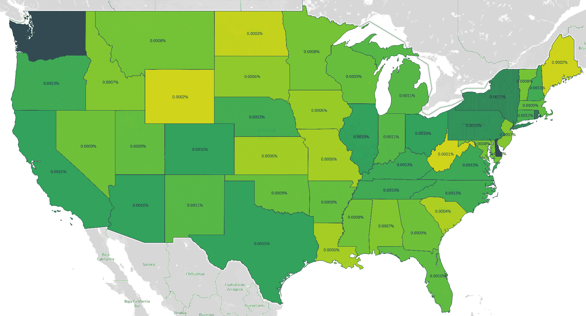
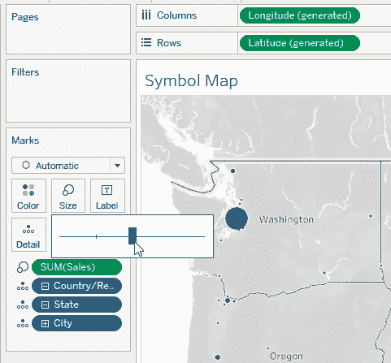
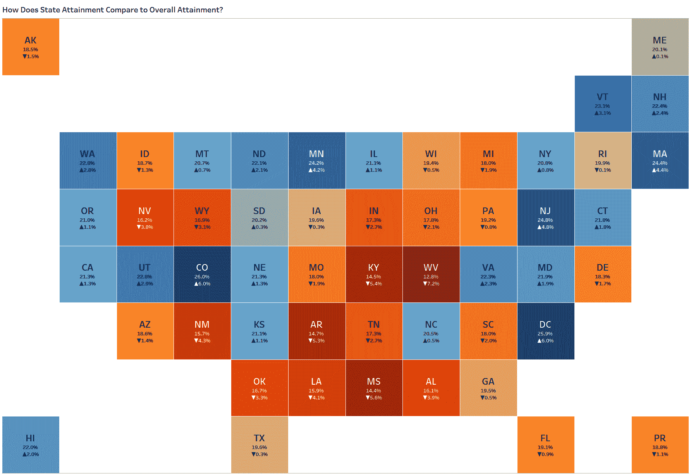

# 第七章：处理地理空间数据

您上次真正地看过地图是什么时候？我们指的是*真正地*看过地图？您有没有停下来赞赏和认识到它们所包含的大量数据和信息？

*地图*是最强大的可视化类型之一，也许是我们在生活中最早接触到的类型之一。试着回想一下你第一次理解如何阅读地图的时候——很难回想起来，对吧？许多人几乎本能地理解地图，这使它们成为传达数据的有用工具。

记住，地理邻近性和分布对任何地图分析至关重要。这实际上是在考虑制作地图时的关键区别因素。仅仅因为*能够*绘制某些内容，并不意味着*应该*这样做。

本章中，我们将向您展示在 Tableau 中创建地图的技术。我们还将帮助您了解何时适合创建地图，而不是像可靠的条形图那样简单的东西。

# 分区（填充）地图

Tableau 的一个关键差异化因素是其映射数据的能力。映射是最强大的数据职业之一——事实上，甚至还有一个专门领域称为地理信息系统（GIS）。尽管这种专业化水平带来了一些令人惊叹的工具，但这也意味着，直到最近，数据映射和商业智能数据可视化大多是分开进行的，用于创建地图的工具与用于仪表板和条形图的工具也不同。

Tableau 通过允许用户获取数据集中常见的地理数据元素（如邮政编码、城市、州/省、地区和国家）并自动将正确的纬度和经度坐标赋予它们来区别于其他软件。它还可以为它们分配适当的形状或地理多边形（空间对象）。这意味着您无需知道西雅图，华盛顿的坐标；Tableau 将通过其内置的地理数据库提供它们。同样，您无需创建多边形对象或坐标列表来构建华盛顿州；只需向 Tableau 提供州的名称即可让其识别并绘制多边形。*分区地图*将数值值作为地图上的颜色比例尺进行绘制。

# 用分区地图显示客户渗透：Office Essentials 案例研究

OE 正在评估人口统计数据，以更好地了解其核心客户。高管们想要回答一个看似简单的问题，“我们的客户来自哪里？”您会如何建立可视化以展示这一点？

首先，您将建立一个分区地图。（在 Tableau 中，这被称为*填充地图*；这些术语是同义的。您将根据居住在各州的购买客户数量对美国各州进行着色（图 7-1）。


###### 图 7-1。显示美国各州客户数量的基本分区地图

## 策略：创建简单的分区地图

让我们开始构建我们的地图：

1.  双击 Data pane 内的[State]字段。Tableau 将看到这是一个地理值，并自动创建地图。这是我们建议双击字段并让 Tableau 决定如何在可视化中呈现的少数情况之一。

1.  创建一个名为`**[# of Customers]**`的计算字段。这将是客户名称的唯一计数：

    ```
    //# of Customers
    COUNTD([Customer Name])
    ```

1.  将此新创建的度量拖放到 Marks 卡片上的 Color 字段。Tableau 会自动更改标记类型。

1.  单击 Marks 卡片上的 Label 并打开标签。

停下来检查图表。您能立即获得什么见解？与其他州相比，加利福尼亚州、德克萨斯州和纽约州拥有最多的客户。还有其他什么？老实说，很难区分中间排名的州。除了前几个州外，其他州看起来差不多。

您是否有一种隐隐的感觉，这张地图并未完全或准确地反映数据故事？如果是这样，我们与您想法一致。虽然这三个州确实拥有最多的客户，但它们也有最大的人口。因此，虽然说这些州拥有最多的客户是准确的，但这种说法忽略了我们理解每个州客户渗透水平所需的背景。

要改善此地图，我们建议对数据进行归一化处理。*归一化*意味着调整数字的比例，使其不再是每次读数都独立，而是在所有读数中保持一致。

对于这张地图，您需要将客户数量与每个州的人口进行归一化。用更合适的度量来表达我们的办公用品店可能具有更深的客户渗透度，将会使用*人均*（每人）的测量。这将把我们的客户数表示为每个州人口的百分比。也可以这样说：“我们每千名州公民拥有多少客户？”

## 策略：归一化分区地图

现在我们要引入一个新的数据集来归一化数据：

1.  通过包括每个州的人口数据来增强数据：

    1.  转到数据源并添加新的连接。

    1.  导航到包含美国各州人口普查和估计数据的文件。

1.  使用 Tableau 的逻辑数据建模，在人口普查数据和客户订单数据之间创建一个关系。这个关系将基于选择 State = 地理区域，如图 7-2 所示。我们将在第十章详细探讨数据建模。现在，知道 Tableau 通过州名关联这两个数据集就足够了。

    

    ###### 图 7-2\. 使用 Tableau 的逻辑数据建模创建关系

1.  构建一个计算字段，即`**[% of Customers per State]**`。分子将是`**[# of Customers]**`，分母将是`**[SUM(Census)]**`。将字段的默认格式设置为百分比，显示四位小数：

    ```
    //% of Customers per State
    [# of Customers]
    /
    SUM([Census])
    ```

    您认为在 图 7-3 中更新的地图如何？这是否改变了您对客户数据的理解？


###### 图 7-3\. 正常化后的等值区域地图

我们认为是这样。第一张地图让人觉得加利福尼亚州、德克萨斯州和纽约州是表现出色的地区。现在我们已经对数据进行了标准化，很明显我们的商店在华盛顿州和特拉华州有很强的存在感。总结性措施并不能完全讲述全部故事。

但我们仍然认为这张地图需要更清晰。下一个要解决的问题是色彩渐变。正如您在 第一章 中看到的，颜色编码并不是区分数据点最精确的方法。特别是在制图中，重要的是您花时间考虑如何最好地显示数据。

幸运的是，对颜色感知的研究导致了考虑可访问性问题的颜色调色板的开发，如感知的一致性、生动性和色盲。我们特别推荐四种渐变色调色板：Viridis、Magma、Plasma 和 Inferno。所有这四种色调最初在 R 中开发，并且在 Tableau 中使用起来很容易。

## 策略：添加自定义颜色调色板

您可以在 Tableau 的首选项中编码几种类型的颜色调色板。在本练习中，我们将使用有序顺序调色板，这意味着每种颜色都按顺序列出，并且在使用连续字段进行颜色设置时可用。

1.  选择 文件 → 仓库位置 以确定 Tableau 文件的默认保存位置。

1.  查找 *preferences.tps* 文件并在文本编辑器中打开它。

1.  转到 Tableau Public 上由 Jacob Olsufka 构建的 [颜色调色板仪表板](https://oreil.ly/Cfj8k)，复制并粘贴 Viridis 色调色板的十六进制代码。

1.  保存并关闭您的 Preferences 文件。重新启动 Tableau Desktop 以激活新的调色板。

    1.  单击 Marks 卡片上的 Color。

    1.  将调色板更改为 Viridis。

    这对可视化的轻微改进，在 图 7-4 中显示，显著提高了观众的理解。所有中央州，一度略有不同的蓝色调，现在更容易区分。现在您可以清楚地看到特拉华州在客户渗透率方面表现最好。



###### 图 7-4\. 使用 Viridis 色调色板的标准化区域地图

您可以通过在颜色上使用另一个派生度量值进一步简化此可视化。假设您的观众想要知道哪些州的客户渗透率最高。他们希望得到州名作为答案；数值百分比则次要。使用百分位数可以使图像更加清晰。

## 策略：创建分位数区域图

对于此策略，您将创建一个分位数地图。此地图中各州的颜色将指示数值的百分位，介于 0%到 100%之间。*分位数*是均匀分布的一定数量的比例片段。最常见的两种分位数是*四分位数*（将数据分为四个均匀分布区间：0 到 25%、25 到 50%、50%到 75%和 75%到 100%）和*分位数*（将数据均匀分布为十个部分）。在这里，您将制作一个分位数地图：

1.  右键单击[每州客户百分比]度量值上的颜色，选择快速表计算 → 百分位数（图 7-5）。现在数据将以百分位数表示，最小值为 0%，最大值为 100%。

    

    ###### 图 7-5\. 以百分位数表示数据

1.  点击颜色 → 编辑颜色，并选择阶梯颜色。将步数更改为 10。

1.  通过点击高级选项，勾选每个框并输入值，将调色板范围的开始和结束固定在 0 和 1 之间（图 7-6）。

    

    ###### 图 7-6\. 设置调色板范围

1.  通过从数据窗格将度量值拖动到标签上，将标签更改回[每州客户百分比]。

    调色板的好处显而易见：您可以轻松区分不同的颜色，并在心理上将状态映射到不同的分位数（图 7-7）。这让您可以告诉观众，客户渗透率前 10%的州分别是华盛顿州、宾夕法尼亚州、纽约州、特拉华州和罗得岛州。


###### 图 7-7\. 带 Viridis 色调的分位数区域图

我们从基本指标（客户数）开始，进一步到百分位数。可读性上的显著差异凸显了思考数据展示方式及向观众传达信息的重要性。这种简单的进步在创建引人入胜且有洞察力的可视化方面已经走了很长一段路。

# 符号地图

在 Tableau 中您可能要创建的第二种最常见的地图类型是*符号地图*。它将一个离散或连续字段编码到形状上。该形状可以在大小和颜色上进行额外的编码，以进一步区分它。

# 使用符号地图展示盈利能力和渠道分布：OE 案例研究

现在 OE 想知道哪个城市为公司带来的利润最多。使用相同的数据集，您将如何构建一个显示两个度量的地图：销售和利润比率？请记住，这个问题是多方面的：虽然利润比率是您的观众试图理解的主要指标，但它需要上下文，比如总销售额。销售经理更关心哪个：一个有百万美元销售额但利润率为 10%的城市，还是一个销售额为 500 美元但利润率为 90%的城市？

## 策略：创建一个符号地图

首先，在新工作表中，您将首先创建一个 Tableau 默认的符号地图，然后优化格式以便于您的观众：

1.  在数据窗格中双击[城市]，自动创建一个符号地图，显示数据集中每个城市的圆圈。

    ###### 小贴士

    根据您正在使用的数据集版本，您可能需要首先创建一个包含国家、地区、州、城市和邮政编码的层次结构。当您创建带有地理信息的层次结构时，Tableau 将自动将层次结构的更高级别添加到视图中。

1.  将[销售]拖动到大小。调整标记的大小为 Tableau 建议的最大值，如图 7-8 所示。

    

    ###### 图 7-8\. 调整标记大小以显示销售情况

1.  现在创建一个名为`**[利润比率]**`的计算字段：

    ```
    //Profit Ratio
    SUM([Profit])
    /
    SUM([Sales])
    ```

1.  将[利润比率]拖动到颜色。Tableau 自动创建一个以 0 为中心的发散颜色调色板，识别到这个度量既有正值也有负值。

1.  为了在视觉上区分重叠的标记，略微调整颜色不透明度，并添加边框（参见图 7-9）。


###### 图 7-9\. 调整不透明度并添加边框

如图 7-10 所示，经典的符号地图在数据分析中始终有其位置。但如果我们超越默认思维，利用符号地图创建一些独特和不同的内容呢？


###### 图 7-10\. 经典的符号地图

假设我们的办公用品执行官要求您为每个州的产品渠道的销售分布提供概述。（产品渠道在我们的数据段中。）为了回答这个问题，您需要展示一个度量按维度分离出来的情况。您可以通过堆积条形图来完成这项工作，但我们可以采用映射的方法。

## 策略：创建带甜甜圈图的地图

在这种策略中，您将在地图上方使用一个甜甜圈图来回答团队的疑问：

1.  双击[州]构建一个地图。

1.  将标记类型更改为饼图，并将[销售]拖动到角度。

1.  将[分段]拖动到颜色，并调整标记的大小为建议的最大大小。

1.  创建双轴以将饼图变成甜甜圈图：

    1.  将[纬度]拖动到行架上的副本。

    1.  右键单击该字段，选择双轴。

1.  点击复制[Latitude]以访问标记卡片；从颜色中删除[Segment]并将标记颜色更改为白色。将标记大小调整为较小，以便仍然可见分段的饼图。

1.  将[销售额]拖放到标签上，并将其格式化为以千元（K）为单位的单个小数货币。

    注意，图 7-11 中的地图提供了更深入的洞察力的两个信息层次。首先，它解决了主要的分析问题：“我们各州的销售额是多少？”然后，它提供了概述信息：每个州的总销售额。虽然您的观众可以看到销售额的视觉比例，但添加分母（每个州的总销售额）使他们能够进行心算，以确定他们所看到的视觉分布是否是需要记住的重要信息。


###### 图 7-11\. 使用带有甜甜圈图的地图显示按州的销售额

# 平铺地图（卡托图）

当需要理解地理位置与数据时，地图非常有用。但同样重要的是要认识到地理区域的大小可能会对观众产生偏见。较大的地理区域自然会主导任何可视化的空间。当添加颜色编码时，观众的眼睛自然会被大而丰富多彩的区域所吸引，这使得他们很容易忽略地图中的一些细微差别。

为了弥补这一点，我们可以使用*卡托图*或*平铺地图*。平铺地图将地理区域取出其复杂的实际形状，并用更均匀的形状替换。最常见的形状是正方形、六边形或其他可以镶嵌的形状。在*镶嵌*中，一种模式使用形状，这些形状可以在彼此之间没有任何间隙或空白的情况下相互贴合。卡托图还可以使用其他测量标准来构建形状；例如，世界地图上每个形状的面积表示总人口。

# 使用平铺地图显示教育水平：旅舍教育服务案例研究

在这个下一个用例中，旅舍教育服务公司，一个致力于提高美国成年人教育水平的组织，正在查看该国的教育人口统计数据。他们想知道每个州的成年人口中有多少百分比获得了学士学位，并展示最高和最低比率的位置。您将如何创建可视化来传达这一信息？

## 策略：构建方形平铺地图

您将连接到美国州属达成数据集，然后按照以下步骤来丰富数据并构建平铺地图：

1.  从数据集创建一个名为`**[% College Attainment]**`的计算字段。将默认数值格式设置为带有一位小数点的百分比：

    ```
    //% College Attainment
    SUM([Total Population with Bachelor’s Degree 25 Years and Over (Estimate)])
    /
    SUM([Total Population 25 Years and Over (Estimate)])
    ```

1.  通过添加将每个州映射到列或行的文件来丰富数据集（如图 7-12](#mapping_states_to_columns_and_rows) 所示）。更复杂的形状可能会将每个州映射到*x*，*y*坐标，但我们在这里保持简单。

    

    ###### 图 7-12\. 将状态映射到列和行

1.  将 [行] 拖动到行和 [列] 拖动到列；将标记类型更改为方形。（确保它们都是离散维度。）设置视图大小为整个视图。

    ###### 提示

    如果 [行] 和 [列] 是连续度量（绿色），则可以将它们拖动到数据窗格中的水平线上，以将每个变为离散维度。

1.  将 [% 学院成就] 拖动到颜色和标签中。将 [缩写] 拖动到标签中。您可能需要将标记类型更改回方形。与本章第一节相同，更改颜色板为自定义颜色板。(图 7-13 使用 Color Brewer Greens。) 还要添加白色边框。

1.  右键单击 [行] 和 [列] 并取消选中“显示标题”。


###### 图 7-13\. 显示在瓷质图中的教育成就率（上），以及在区域色阶图中显示的相同数据（下）

当您比较瓷质图和原始图时，关注点的变化是什么？尽管科罗拉多州仍然显著，但在瓷质图中更容易看到东南部较低成就的区域以及东海岸较高成就的区域。由于其大小，阿拉斯加不再主导可视化，而像夏威夷、哥伦比亚特区和波多黎各等较小地区则都得到了同等的空间。

看到您刚刚制作的瓷质图后，您的非营利组织利益相关者可能会问如何判断特定州的比率是高于还是低于国家平均水平。如何使此显示更具洞察力？通过使用除颜色直接测量外的其他方式。

## 策略：使用瓷质图比较整体与部分

从上一策略的图表开始，我们将添加格式、文本和颜色增强：

1.  创建一个名为 `**[总体美国学院成就]**` 的新计算字段。

    这将是一个 LOD 表达式，计算整个数据集（包括所有州）的学院成就百分比：

    ```
    //Total US College Attainment
    {FIXED : [% College Attainment]}
    ```

1.  使用这个新的计算字段，创建另一个名为 `**[与美国总体差值]**` 的计算字段。这将是该州率与美国总体率之间的百分点差异：

    ```
    //Delta from US Overall
    [% College Attainment] - MAX([Total US College Attainment])
    ```

    在这里，您正在重新聚合 LOD 表达式至最大值。LOD 通常是行级的。由于其他度量值是聚合的，因此[总体美国学院成就]也必须是聚合的。在计算字段的 LOD 聚合中，常规做法是使用最大、最小或平均值；在数学上，它们将返回相同的结果。

1.  将新的度量值拖动到颜色和标签中。

1.  对于高级格式设置，请使用符号 ▼▲▬ 更改 [与美国总体差值] 的默认数值格式，如 图 7-14 所示。


###### 图 7-14\. 更改默认数字格式

在可视化的最终版本（图 7-15）中，重点是与整体率的比较，并讲述了一个引人入胜的故事。每个南方州和中西部的一组州都低于平均水平。



###### 图 7-15\. 显示每个州大学完成率与全国平均水平相比较的图块地图

# 内置功能和功能

您现在已经看到了如何在 Tableau 中制作默认和非默认地图的许多示例。我们为您提供了基本示例，并为最大化地理位置数据的呈现提供了宝贵的选项。然而，这只是地理空间分析的一部分。在本节中，我们将向您展示一些 Tableau 内置功能和分析计算。

# 使用内置功能和功能处理营销数据：SAGE 数字营销案例研究

在此示例中，Savvy Actionable Gains Executed（SAGE）是一家数字营销机构，通过搜索结果中的付费广告为客户提供线索。该机构的客户是一家当地的园艺公司。对于客户来说，他们支付的线索越少，他们从每位转换的客户那里获得的利润越多，因此目标是尽可能给他们提供尽可能多且成本最低的一致线索。

客户在三个物理位置上，根据家庭地址将客户分为三个服务区域。您如何了解每个服务区域中广告的表现如何？可用数据显示了显示付费搜索广告的成本及任何给定邮政编码中点击广告的人数。

Tableau 允许您构建自定义地理区域，称为*自定义多边形*。对于第一种策略，您将使用他们提供的邮政编码数据设置客户的三个服务区域。与 Tableau 中的大多数事物一样，有多种方法可以做到这一点。我们将向您展示两种方法。

## 策略：使用组构建自定义多边形

虽然您的数据提供了邮政编码，但不知道确切地哪些邮政编码属于三个服务区域（如图 7-16 所示）。您可能只有这些区域大致位置的粗略估计。


###### 图 7-16\. 显示客户服务区域大致位置的地图

在 Tableau 中，您可以轻松创建组，以生成不同的区域：

1.  双击[ZIP]以创建显示数据集中邮政编码可用数据的地图。将标记类型更改为地图。

1.  通过在工具栏上选择地图，并在顶部选择地图图层来修改地图背景。将样式更改为街道。

1.  在地图图像的左上角悬停以查看工具栏；在底部图标（右箭头）上悬停以查看可以选择数据的各种方式。点击最右边的套索选项（图 7-17）。

    

    ###### 图 7-17\. 当你将鼠标悬停在工作表左上角时，地图工具栏会自动显示。

1.  选择套索选项，选择属于北服务区的邮政编码，如图 7-16 所示。如果错过了某个邮政编码，之后可以按住 Ctrl 键手动选择额外的邮政编码。选择不必精确。

1.  选择适当的邮政编码后，单击顶部工具栏上的组图标（图钉），然后单击单词 ZIP。Tableau 将自动构建一个包含您选择的邮政编码的组。新组自动放置在颜色上。

1.  重复此过程两次，直到您大致创建了三个与服务区域相似的区域（图 7-18）。您可以通过编辑刚创建的组来重命名它们。

    

    ###### 图 7-18\. 现在每个邮政编码都按服务区域着色

1.  从详细属性中删除[ZIP]。这是最重要的一步。现在您已创建了自定义多边形。使用这些信息，您可以看到按服务区域聚合的度量值。

1.  创建一个名为`**[每次点击费用]**`的计算字段。将其添加到标签中，以及服务区域名称：

    ```
    //Cost per Click
    SUM([Cost])
    /
    SUM([Clicks])
    ```

    图 7-19 显示了结果。


###### 图 7-19\. 通过临时组创建的每个服务区域的客户点击费用

以这种方式聚合地理数据的能力非常强大。原始数据没有提供所需的内容——每个区域的点击费用，但聚合数据提供了关键指标的清晰度。

在这种情况下，我们使用了一种临时技术来构建这些区域。如果您的数据已编码或映射到领土、区域或区域，则可以使用底层地理数据来计算相同的结果，而无需构建临时组。

## 策略：使用底层地理数据构建自定义多边形

在这个策略中，您将创建一个类似于之前练习的地图，但这次使用数据集中存在的数据字段：

1.  右键单击名为[Service Area]的字段，选择地理角色 → 从 → ZIP 创建。

    此功能将地理数据与数据集中的服务区域（领土）对齐。只要邮政编码和领土之间存在单向关系，您的数据就会合并到新的分组中。

    注意到出现了一个新的层次结构，显示了服务区和邮政编码之间的关系（图 7-20）。

    

    ###### 图 7-20\. 服务区/邮政编码层次结构

1.  双击 [服务区]。更改标记类型为填充地图。

1.  将 [每次点击成本] 添加到标签中，连同 [服务区]。将 [服务区] 添加到颜色中。您可能需要更改颜色以匹配先前的策略。

    图 7-21 展示了结果。


###### 图 7-21\. 客户的每次点击成本按服务区划分，使用底层地理数据创建

## 策略：使用距离函数显示邮政编码相对于中心位置的距离

现在你的园艺公司的客户想知道他们的营业地点与查看他们广告的人之间有多远。他们想要测试他们的理论，即广告观众距离商店越近（我们将其称为*服务区中心*），越有可能购买服务。您可以使用内置的空间函数来回答这个问题。

为此，我们将探索 Tableau 的四个与地理相关的内置函数：

`DISTANCE()`

使用地理空间字段（带有地球图标）作为输入来计算两个对象之间的距离。

`MAKELINE()`

创建两个对象之间的线。

`MAKEPOINT()`

当您提供坐标（纬度和经度或 *x*,*y* 坐标）时，Tableau 会识别它们表示的坐标或 GIS 系统，并发布*空间参考标识符* (*SRID*)。

`BUFFER()`

获取地理空间点对象并计算您可以指定的单位距离的半径。

按照以下步骤查找从邮政编码到服务区中心的距离：

1.  使用 `MAKEPOINT()` 函数与纬度和经度创建一个名为`**[邮政编码点]**`的点：

    ```
    //Zip Code Point
    MAKEPOINT([Latitude],[Longitude])
    ```

1.  重复此过程，使用 [服务区纬度] 和 [服务区经度] 构建一个名为`**[服务区点]**`的字段：

    ```
    //Service Area Point
    MAKEPOINT([Service Area Latitude], [Service Area Longitude])
    ```

1.  使用这两个计算字段构建一个名为`**[距离服务区中心的距离]**`的最终计算字段。在其中，将单位（第三个参数）设置为`**mi**`：

    ```
    //Distance from Service Area Center
    DISTANCE([Service Area Point], [Zip Code Point], "mi")
    ```

1.  右键单击 [距离服务区中心的距离] 并将默认聚合设置为平均值。这允许您显示邮政编码与服务区中心之间的距离，即使对于单个邮政编码有多行数据。您还可以使用此测量在更高层次的聚合（如 [服务区]）上计算距离。

1.  构建一个点图：

    1.  将 [服务区] 拖放到行架上。

    1.  将 [距离服务区中心的距离] 拖放到列架上。将标记类型更改为圆形。

    1.  将 [邮编] 拖放到标记卡的详细信息上。

1.  将 [转换] 拖放到大小上。将颜色不透明度调整为 60%。

    您能从图 7-22 的可视化中得出什么结论？


###### 图 7-22. 每个服务区内每个邮政编码距离中心点的距离，以及转化数量

首先，每个服务区的结果之间肯定存在一些区别：在北部，看起来更多的转化来自距离 30 到 35 英里的邮政编码。对于南部来说，这个距离略微紧一些，大多数在 25 英里内。而对于中部来说，显然中心点附近几乎没有多少邮政编码。

多亏了您的洞察力，您的园艺客户现在知道北部服务区的大多数转化来自哪里。他们决定调整策略，并仅针对每个中心点周围 25 英里内的客户。他们要求您进行影响分析：他们将保留哪些邮政编码，哪些将被删除？他们会损失多少？您可以通过使用`BUFFER()`函数来完成此任务。此过程将在您的可视化中创建第二个地图图层，如果您希望在一个地图上显示不同地理细节的图层，这将非常有用。

## 策略：使用缓冲功能以径向距离映射交易区域

使用与前一策略相同的数据集，您将构建一个新的地图图层，其半径已指定：

1.  创建一个名为`**[Service Area Trade Area]**`的计算字段：

    ```
    //Service Area Trade Area
    BUFFER([Service Area Point], 25, "mi")
    ```

1.  双击此新计算字段以在地图上绘制区域。将[服务区]添加到颜色和标签。将标记的不透明度更改为 20%，并添加黑色边框。

1.  将[ZIP]拖放到左上角的地图上；这将生成用于添加另一个地图图层的投放区域。

1.  在刚创建的次要标记卡上，添加[服务区]到详细信息。将点的不透明度降低到 60%，并将边框和光晕都设置为无。

    现在您的客户可以清楚地看到他们在修订的付费搜索工作中将要针对的哪些邮政编码，以及哪些邮政编码将被排除在外（图 7-23）。


###### 图 7-23. 显示围绕每个服务区中心构建的 25 英里半径内的交易区域地图，标有当前正在进行营销努力的邮政编码

在我们的最终可视化中，您将创建一张地图，向客户解释整个故事：哪些邮政编码属于每个服务区，每个邮政编码距离中心有多远，哪些落入了修订广告策略所针对的贸易区域，并且每个邮政编码关联的转化数量。您可以通过从服务区中心到每个邮政编码构建线条来完成这个任务。

## 策略：使用 MakePoint 和 MakeLine 创建起点到目的地之间的路径

在本章的最后一种策略中，您将把所有内容整合起来，并使用先前介绍的剩余两个空间函数：

1.  创建一个名为`**[Line from Zip to SA Center]**`的计算字段：

    ```
    //Line from Zip to SA Center
    MAKELINE([Service Area Point],[Zip Code Point])
    ```

1.  将此字段拖放到已经在您的 Zip Code 层标记卡上的[Zip Code Point]字段上方。*点应该会变成线*。

    ###### 提示

    当您在可视化中将一个字段拖放到另一个字段上方时，原始字段会立即被您拖放的字段替换。

1.  创建一个名为`**[In Service Area]**`的计算字段，用于标识邮政编码与服务区中心之间的距离是否小于或等于 25 英里：

    ```
    //In Service Area
    [Distance from Service Area Center]<=25
    ```

1.  将这个新字段拖放到[Zip Code]标记卡上。

    a. 点击字段左侧的图标，将其从详细信息更改为颜色。现在，在服务区内的每个邮政编码应该有两种不同的颜色，一种深一种浅。如有必要，使用 Tableau 20 调色板调整颜色。

    ###### 提示

    色彩图例可以代表多个维度，但只有在将每个维度手动分配到 Marks 卡的颜色属性上时才行。如果您将字段拖放到颜色上，它将自动替换先前的字段，并将其设置为详细信息。

1.  最后，在[Line from Zip to SA Center]标记卡上，将[Conversions]拖放到 Size 上。这将根据与邮政编码相关联的转化数量调整每条线的大小。

    这个在 Figure 7-24 中的可视化帮助您的客户看到整体画面。


###### 图 7-24。新的贸易区域以及每个贸易区域内外的邮政编码和转化

它还表明，虽然修订后的定位策略对北部和南部领土效果很好，但在中央服务区却并不成功。您可能建议您的客户移动中央区的中心或将服务区分成两个较小的部分。

# 结论

您已经看到了在 Tableau 中处理地图和地理数据的几种方式，从显示每个州 OE 的渗透率的基本等值地图开始。您还学会了如何对数据进行归一化，以向观众提供更准确的数值结果。

此外，在处理地图时，您已经看到了颜色编码的重要性。像 Viridis 这样的调色板故意在强度和色调上有显著差异，这有助于观众区分表示为颜色的数值。

您还通过瓷砖地图创建了一个等面积地图，其中每个州的地理区域被从地图中剥离，并替换为统一的正方形。这使得数据值更易于理解，并增加了对较小州的平等性。

你还使用空间函数对地理数据进行了额外分析，这不一定总是地图。首先，你使用内置功能构建了全新的空间多边形，然后基于数据中其他地理数据点构建了多边形。你还探索了内置的地理函数，学会了如何创建新的点、构建服务区域，并测量两点之间的距离。

在下一章中，你将专注于高级数学概念。你将学习如何处理高级数学函数和概念的方方面面，以及最佳实践，指示何时以及在何处对数据进行更高级的数学转换。
