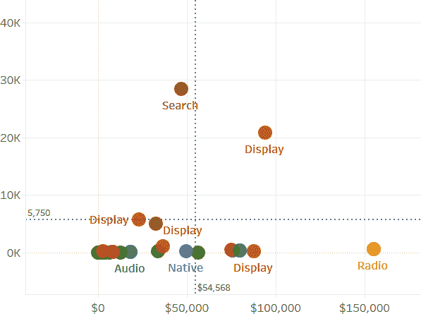

# 第八章：高级数学概念

本章的目的是探索您数据之间的关系。通常希望探索两个或更多数值指标之间的关系，使用您的时间限定数据来确定未来可能发生的事情，或者使用维度之间的重复关系进一步分类和分段。本章的目的是探索所有这些概念。

我们认为本章非常重要，专门为最有可能探索数据的个人设计——即寻找更深层次的洞见或揭示模式，这与我们探索的其他一些旨在呈现具有明显洞见的数据的概念不同。在本章中，您将构建的一些图表可能不会被大众看到，但将有助于更深入地理解您所处理的数据。

在第一个案例研究中，您将重温我们的呼叫中心，并使用 Tableau 来预测呼叫量，以帮助确定员工配备水平。

在第二个案例研究中，您将使用数字营销数据来帮助营销团队做出优化决策，确定哪些广告应该保留，哪些应该删除。您还将探索两个营销指标之间的关系，以确定是否可以估计结果或提供达到目标所需的最低要求。

在第三个案例研究中，您将探索替代轴并可视化 COVID-19 数据。您将看到如何使用不同的轴类型可以带来更好的数据故事。

最后，在本章的最后一节中，我们将讨论何时以及何时不使用其他分析插件来进一步扩展您的分析类型。我们将提供两个泛化案例研究，一个是关于 A/B 测试，另一个是文本分析，这些都可以轻松应用到您自己的用例中。

# 预测

*预测*是通过使用历史数据拟合模型以预测未来观察结果的过程。这也是时间限定数据最常见的用例之一。许多行业，如零售，依赖展示季节性的历史数据来预测或提供接下来几个月的方向。虽然这可能看起来不够复杂，但许多过程确实遵循季节性趋势，可以很好地预测。在零售业中，你知道每年在最后一个季度会有销售增长，这是由假日购物推动的。同样，在美国的医疗保健行业中，每当美国人的保险福利每年重置时，通常会出现大幅增加的使用量——这使他们能够避免自己支付超出医疗福利限额的费用。

尽管如此，预测并非万全之策，无法应对自然灾害、经济快速变化、社会动荡或全球大流行等无法预见的事件。COVID-19 大流行就是一个完美的例子：不存在任何预测模型能够准确预测导致的消费习惯剧烈变化。可以肯定，在全球大流行期间，零售、主要体育、食品服务、旅行和娱乐行业的任何预测模型都变得完全无效。

当您使用预测时，将其视为未来即将发生事情的指导，并特别考虑它在“业务如常”情况下的作用。如果您向受众和可视化实践中如此展示它，它可以成为规划未来结果的有用工具。

# 使用预测来预测人员需求：CaB 呼叫中心案例研究

一个需要关注未来事件的行业是*客户服务*。许多组织有保持客户满意的最低服务水平要求，商业到商业（B2B）世界通常有服务级别协议（SLA）。因此，在这些情况下，正确配置员工的数量至关重要。

汽车零部件制造商 CaB 的呼叫中心每月平均可以接待 3,000 通以上的呼叫。在定期订单交付和新产品发布期间，呼叫可能会急剧增加。公司希望能够更准确地预测其呼叫负荷，以管理员工工时，减少呼叫者等待时间，并提高客户满意度。如何利用大量的时间限制数据来预测各级别时间（月度、周度、日度）的未来呼叫量？

## 策略：创建月度预测

CaB 呼叫中心的经理想要知道未来每月的呼叫量会是多少。她希望利用这些信息来估计可能需要雇佣的额外员工数量，考虑到当前员工的流失情况。您将按如下步骤创建月度预测：

1.  创建一个趋势为按月呼叫的折线图。通过将`SUM([Calls])`拖放到行架上，并将 Month(Start Date Time) 拖放到列中来实现。

    ###### 小贴士

    我们选择将数据限制在 18 年 1 月 1 日至 20 年 3 月 31 日之间。这是为了保留完整的月份数据，并确保预测模型不受部分数据月份的错误影响。在进行预测时，始终选择最相关的时间段进行分析。

1.  在分析窗格中，将[预测]拖放到您的图表上（图 8-1）。您的图表中的数据应该延伸并显示未来的预测值（图 8-2）。

    

    ###### 图 8-1\. 将预测线拖放到折线图上

    

    ###### 图 8-2\. 显示按月呼叫量的图表，带有自动生成的预测

1.  通过从颜色标记卡中删除自动生成的预测指示器来去除实际数据和估计数据之间的断点。

1.  通过选择分析 → 预测 → 预测选项来定制预测。将长度更改为 24 个月。将预测区间调整为 99%。现在你的图表应该与图 8-3 相匹配。


###### 图 8-3\. 自定义预测月呼叫量，为期 24 个月，包括 99% 预测区间

1.  通过选择分析 → 预测 → 描述预测来查看预测输出的摘要，以打开描述预测对话框（图 8-4）。


###### 图 8-4\. 由 Tableau 生成的预测摘要描述

###### 提示

在 Tableau 中创建预测后，审查摘要非常关键。在这里，您将找到关键信息，包括模型的质量（评为好、中等或差）。掌握摘要和模型部分的内容将有助于您增强描述和使用生成的模型的信心。

在之前的策略中，我们只是初步涉及了 Tableau 中的预测。值得一提的是，您可以通过点击“了解更多关于预测摘要”的链接来访问详细文档，了解预测是如何生成的，以及如何解释所有输出的统计组件的详细信息。它还提供了有关自定义预测模型的指导。在向他人解释 Tableau 中预测的关键特性时，我们将注意力集中在以下关键功能：

+   使用指数平滑法，这是一种减少旧观测权重的方法。

+   使用趋势和季节性来生成预测，两者都可以根据您对数据的现有理解进行加法或乘法的定制化调整。

您可以访问 Tableau Desktop 的帮助文章，了解更多关于[描述预测输出](https://oreil.ly/c0Ngi)的信息。

# 两个数值之间的关系

另一种强大的分析类型是探索两个指标之间的关系。大多数数据点可能具有多个数值指标，因此自然希望探索这些属性，并查看这些指标在彼此之间是否存在任何关系或影响。

一个实际的例子是，比较一个国家人口的预期寿命与生活在贫困中的百分比（图 8-5）。您或您的观众可能自然地认为存在某种关系，但通过使用本章探讨的概念，您可以呈现研究结果及其统计学显著性。


###### 图 8-5\. 一个散点图，显示人口中生活在贫困中的百分比与平均预期寿命的比较

检查了 图 8-5 之后，可以肯定地说，在一般情况下，贫困率较低的国家寿命更长——但这项分析的下一个层次和本章的范围是通过数学方法来探索。这样可以消除对数据呈现给观众时的过度估计和基于直觉的推断。

值得注意的是，在探索两个度量之间的关系时，并不总是需要应用额外的统计处理。仅仅使用这些方法就足以深入了解数据及两个度量分布之间的关系。您还可以将这种类型的分析用作为观众提供数据点的一种可操作的方式。

# 使用散点图查看支出和转化之间的关系：SAGE 数字营销案例研究

在营销中，始终有优化的驱动力——例如，优化每个广告以获得最佳结果，通常以消费者购买的数量与投资金额的比例来衡量。实现这种优化可以通过改变广告的媒介或位置（如社交媒体或搜索结果）来实现。

要解决这个迫切的需求，一个实用的工具是散点图。一个*散点图*将一个度量指标放在 x 轴上，另一个放在 y 轴上。所绘制的点取决于您希望显示的数据级别，可以是个别记录（比如特定广告）或更为聚合的结果（如整个营销活动）。

在这个案例研究中，SAGE 数字营销希望快速确定在特定营销渠道中哪些营销活动最有效地推动消费者购买。您如何设计一个散点图来可视化这些数据？

## 策略：创建一个散点图

从一个新的工作表开始，您将构建一个散点图来比较两个度量：

1.  将 SUM(Spend) 拖到列架上，将 SUM(Conversions) 拖到行架上。

1.  将 [Channel] 拖到颜色和标签中。将 [Platform] 和 [Campaign] 拖到详细信息中。

1.  调整标记为圆圈，使大小更大，并将点的不透明度调整为 75%。

    到此为止，请花点时间回顾 图 8-6 中显示的情节。

总体而言，您可以得出什么结论？

+   OOH（户外广告，又称广告牌）非常昂贵，但转化率相对较低。

+   有一个付费搜索表现非常出色，几乎比其他倡议的转化率高出三倍。

+   剩余的数据点相对均匀地分布在图表的左下方区域——支出和转化率的结果相似。


###### Figure 8-6\. 散点图显示了营销数据中支出与转化率之间的关系

这个散点图本身就包含了观众可以描述的丰富洞察。但是，如果我们想把这个视图变得更具操作性呢？在下一个策略中，我们将探讨如何将您的散点图转化为一个分类每个数据点结果的图表。

## 策略：创建象限图

正如您刚刚看到的，在前一策略中构建的散点图讲述了两个关键指标的引人注目的故事。为了使这种洞察的对话对您的受众更加可见和可理解，您可以将散点图转化为象限图。*象限图* 是一种转换后的散点图，其中在 x 轴和 y 轴指标上使用了平均线来将数据分成四个部分或象限。一旦数据分成四个象限，您可以将它们标记为概括其表现的组。

对于我们的营销优化场景，我们希望最终得到四个类别：

+   低影响，高成本

+   高影响，低成本

+   低影响，低成本

+   高影响，高成本

负责在这些类别下进行优化的利益相关者面临一个更简单的流程，即决定哪些倡议应保留或进一步投资，哪些可能需要移除。此策略的步骤如下：

1.  从分析窗格中，单击并拖动 `SUM(Spend)` 和 `SUM([Conversions])` 的平均线，如图 8-7 所示。两者都应适用于表格。

    

    ###### Figure 8-7\. 拖放菜单，在将参考线拖动到视图时出现

    ###### 提示

    在添加参考线时，根据行和列的维度有三种处理数据的方式。*表格* 读取所有数据（从左到右思考）；*窗格* 将构建一个适用于由标头划分的数据子集的线；*单元格* 将为最内层标头或单个数据点构建线。

1.  右键单击每条平均线，选择“编辑”，并修改设置，使其成为一个虚线，并显示该平均值。取消选中“显示重新计算的高亮或选定数据点的线”。图 8-8 显示了结果。

    

    ###### 图 8-8\. 将散点图转换为象限图表的第一步；每个轴上已添加了平均线。

    接下来，您将完成两个项目：一个是计算字段，将数据点分类为我们提到的四个标签之一，另一个是注释图表以强调这些类别。

1.  创建一个名为`**[平均支出]**`和一个名为`**[平均转化率]**`的计算字段。这两个字段将与图表上的平均线值匹配：

    ```
    //Average Spend
     WINDOW_AVG(SUM([Spend]))
    //Average Conversions
    WINDOW_AVG(SUM([Conversions]))
    ```

    ###### 小贴士

    使用表格计算来构建与参考线相同的数值。同时使用参考线和表格计算是验证你的表格计算准确性的简便方法。

1.  创建一个名为`**[优化类别]**`的计算字段：

    ```
    //Optimization Category
    IF SUM([Spend])>=[Average Spend] AND
    SUM([Conversions]) >=[Average Conversions]
    THEN 'High Cost, High Impact'
    ELSEIF SUM([Spend])>=[Average Spend] AND
    SUM([Conversions])<[Average Conversions]
    THEN 'High Cost, Low Impact'
    ELSEIF SUM([Spend])<[Average Spend] AND
    SUM([Conversions])<[Average Conversions]
    THEN 'Low Cost, Low Impact'
    ELSEIF SUM([Spend])<[Average Spend] AND
    SUM([Conversions])>=[Average Conversions]
    THEN 'Low Cost, High Impact'
    END
    ```

1.  将[优化类别]拖动到颜色上，替换[渠道]。右键单击[优化类别]，确保在所有维度的最深层级上计算。

1.  右键单击象限的空白处，选择注释 → 区域。输入代表该象限的优化类别。按需调整格式。

1.  将数据筛选到 2020 年 8 月、2020 年 9 月和 2020 年 10 月——SAGE 的财政季度。图 8-9 显示了此阶段的图表。

现在你有了一个完成的象限图表，可以在仪表板上或向利益相关者展示。高管们现在可以从这个二维图表中获取洞察，这使得集中优化部分项目变得更加简单。

我们将在散点图中最后讨论的概念是趋势线。*趋势线*被添加到图表中以显示数据的一般方向或数字数据之间的关系。构建和包含趋势线在您明确想要展示变量之间的相关性或估计/预测变量时非常有用。

当您使用数据创建趋势线时，您正在生成一个数学方程，其中 x 轴度量或*自变量*，以及 y 轴度量或*因变量*。您生成的方程类型取决于数据之间的关系（最佳拟合线），类似地，在 Tableau 中您可以生成各种线条类型。最常见的趋势线类型是*线性趋势*，其遵循*y* = *mx* + *b*的模式，其中*m*是线的斜率或角度，*b*是 y 轴截距，即线与 y 轴交点。


###### 图 8-9\. 显示数据所属四个优化类别的象限图表

值得注意的是，您始终可以在图表上放置一个趋势线，选择最佳拟合线，但绘制/构建一条线并不保证您的指标之间存在统计或数学关系。您需要使用趋势线提供的输出来确定该线对于预测或解释是否值得信赖。

## 策略：向散点图添加趋势线

在这种策略中，您将继续使用营销数据，但改变被审视的两个指标。这一次，您将使用印象和转化，而不是按营销渠道和活动分析数据，而是按天拆分数据。这将有助于回答以下问题：“基于一则营销内容的印象数量，我们可以预期收到多少转化？”这项练习的相关性在于，如果您知道某事物将获得多少印象，可以预测并估计结果：

1.  将 SUM(Impressions) 拖放到列架上，将 SUM(Conversions) 拖放到行架上。

1.  右键单击并拖动日期到详细信息上，在连续日期值的选择上放置它。

1.  将数据筛选为仅包括搜索渠道（图 8-10）

    

    ###### 图 8-10\. 按天为付费搜索营销创建的印象与转化的散点图

    从您刚创作的可视化效果中，很可能已经显而易见这两个指标（变量）之间存在强关系。但接下来，您将添加一个趋势线来数学表达这种关系，并获得能够展示模型置信度的输出。

1.  从分析窗格中拖动趋势线，放置到线性上。

    ###### 小贴士

    Tableau 提供五个方程式来生成趋势线（图 8-11）

    +   *Linear* 遵循 *y* = *mx* + *b* 的格式。

    +   *Logarithmic* 生成一个在一端形成高原的曲线。

    +   *Exponential* 也创建一个曲线，通常用于快速增长或减少的情况。

    +   *Polynomial* 生成弯曲一次或多次的曲线。

    +   *Power* 创建一个带有以已知速率变化的斜率的曲线。

    由于选项很多，我们鼓励您探索它们并找到最合适的选项。


###### 图 8-11\. Tableau 内置的趋势线模型类型

现在您已经构建了趋势线（图 8-12），接下来就是评估模型的重要部分。

当 Tableau 生成趋势线时，会包括线性方程以及一个菜单，您可以通过右键单击该线并选择“描述趋势模型”来访问该菜单。这将打开 图 8-13 中显示的对话框。


###### 图 8-12\. 一个线性趋势线适合显示印象与转化的图表


###### 图 8-13\. 访问趋势线描述

当我们审查这些模型时，我们关注两个关键组成部分：p 值和 R-Squared 值。*p 值* 是输出由随机机会引起的概率。这个值越小，输出与统计上显著性相关的可能性就越大。换句话说，p 值越接近 0，两个变量之间存在统计关系的可能性就越大。*R-Squared* 值是一个介于 0 和 1 之间的数字，用于描述趋势线中的变异量。R-Squared 值越接近 1，说明该线对数据的拟合程度越好。

###### 小贴士

如果您得到非常小的 p 值，但 R-Squared 值不高，请尝试不同的模型类型，看看是否能获得更好的拟合线。

在 图 8-12 中生成的模型非常出色——p 值非常小，而 R-Squared 非常接近 1。如果您知道将要服务的印象次数，您可以自信地预测或估计转化次数。对于策略而言，具体的模型方程式是转化 = 0.0595388 × 印象 - 24.6459。更明确地说，任何给定的一天，您可能会在每 100 次印象中收到 19 次转化。

回到我们的市场营销案例研究，这意味着我们也可以相反地计算出需要展示的广告数量，以达到特定的转化值，从而产生收入。基本上，如果我们想销售 100,000 个产品单位，我们将需要生成约 1.68 百万次印象。

# 聚类分析

随着围绕数据存储和数据处理的技术爆炸，数据分析领域已扩展到包括更多处理数据的统计和数学方法。数据科学在商业世界中的普及越来越普遍。数据科学将高级数学和统计概念与机器学习结合，并应用于数据模型。数据科学中使用的算法主要依赖于某种形式的编程，因为它们的生成通常复杂，涉及多次迭代，或者具有递归元素。

在本章的最后部分，我们将探讨如何将两种数据科学应用集成到您的 Tableau 可视化中，但现在我们想从内置于 Tableau 中的一种分析开始：聚类分析。*聚类分析*是将相似的数据点聚集在一起的任务。与手动分组或分类不同，聚类分析使用算法确定数据点之间的相似性和差异。Tableau 使用 k 均值聚类算法生成聚类。

聚类分析在业务分析中有许多实际应用。它可以用于人群分割、客户画像的开发、欺诈和异常检测以及优化。它可以处理数值数据值、分类数据值或两者兼而有之。它之所以效果好，是因为在许多变量或字段上工作时，可能不太可行将四五个不同的数据点绘制在单个图表上，并评估它们的相似性。

就像预测一样，聚类分析并非处理数据分类的万灵药。相反，可以将其视为对数据进行分组、分类或细分的建议方式。由于它依赖于数学输出，应在输出结果中结合业务眼光和领域知识，以确定结果是否对您的组织和用例有用。

# 在 Banco de Tableau 案例研究中创建员工分割以评估流失差异

Tableau 银行正在考虑为其部分客服和 IT 人员提供远程就业机会。公司高管意识到技术进步对办公工作景观产生广泛影响，并希望了解员工接近办公室与员工流失率之间是否存在关联。特别是，他们希望了解是否由于担心长途通勤等问题而失去顶尖人才。

人力资源团队已将注意力集中在影响工作生活平衡和工作幸福感的三个关键因素上：任职时间、月收入和距办公室的距离。您将如何利用聚类分析将这三个变量分组？

## 策略：在散点图中添加聚类分析，并在另一个图表中使用分析

在开始之前，我们想指出，大多数情况下，当您看到聚类分析完成时，它通常从散点图开始。这不是巧合；因为您通常会处理三个或更多变量，所以从散点图开始探索变量之间的关系是很自然的。尽管如此，聚类分析并不要求使用散点图，特别是如果您想将一系列维度组合在一起而不是数值和分类数据。让我们开始吧：

1.  创建一个散点图，其中包含[在公司工作年限]与[月收入]按[员工编号]。

1.  将数据限制在销售部门。

1.  通过将[Distance from Home]添加到 Size 中，并将标记类型更改为 Circle，并将不透明度设置为 70%，包括第三个指标。图 8-14 显示了结果散点图。

    

    ###### 图 8-14\. 散点图，额外变量是离家距离，大小为 Size

    现在停下来，审查这个可视化结果。如果您必须分组类似的点，您会从哪里开始？不幸的是，对于大多数人类来说，一旦引入第三维度，完成任务就变得越来越困难。但这正是聚类分析发挥作用的地方。

    从分析面板中，将[Clusters]拖到工作表中。图 8-15 显示了结果。

    ###### 提示

    当您在 Tableau 中创建聚类时，可以控制分析使用的内容和聚类的数量。没有正确或错误的答案，因此，请使用您认为可能会产生影响的变量，并为您的用例优化聚类数量。请注意，Tableau 默认为自动或优化的聚类数量（意味着聚类之间的差异最大，而聚类内部的相似性最大）。

    

    ###### 图 8-15\. 将聚类分析结果添加到图 8-13

1.  右键单击标记卡上的[Clusters]字段，然后选择描述聚类。您将看到图 8-16 中详细信息的摘要。

    

    ###### 图 8-16\. 与 HR 数据相关的聚类分析摘要详情

    这一步很重要。这是您为生成的聚类提供语义描述和解释的地方。描述中显示的每个指标的值代表每个聚类的数学中心，不完全是平均值。相反，想象聚类为圆形或椭圆形，数据点位于中心。在本例中，我们有三个聚类，我们将其定义如下：

    聚类 1

    短途通勤，低收入，低任期

    聚类 2

    短途通勤，高收入，高任期

    聚类 3

    长途通勤，低收入，低任期

1.  现在按住 Ctrl 键，将[Clusters]字段拖到数据窗格中保存为字段。将其命名为`**[Employee Groupings]**`。

1.  右键单击并编辑组以重命名聚类，以匹配我们选择的描述。正如我们之前所说，这只是使用聚类分析的开始。当我们将这些新的分段应用于其他变量时，就会变得有趣。

1.  在新表中，制作一个条形图显示[Employment Status]的员工人数。

1.  将[员工分组]拖到颜色，并将度量单位更改为每个状态的总百分比。图 8-17 显示了完成的图表。


###### 图 8-17\. 堆叠条形图显示活跃和非活跃员工分布比较

现在你有了一些迷人的结果。显然，活跃员工和非活跃员工之间的比例有所不同。最引人注目的是，那些已经离开公司的员工中有更大比例的人，他们通勤时间长、收入低、任职时间短。更有用的是，你可以利用分析产生的中心作为指导，识别出哪些现有和未来的员工可能更有可能离开组织。

# Alternative Axis and Many Multiples

如果您曾经遇到过难以可视化的数据集，那么这一部分正是为您而设。有些数据集简单地不能符合传统的可视化方法。也许数据正在呈指数增长，使得难以随时间绘制，或者属性过多以至于无法进行有力的比较。

当我们遇到这些情况时，更重要的是退后一步，尝试找到合适的可视化方式来传达数据。由于数据集的特性较为复杂，借助可视化进行综合和传达可能更为重要。而在我们写这篇文章时，COVID-19 数据就是最好的例子。与您可能遇到的传统数据不同，它具有必须掌握的独特特性。根据给定的月份，阳性人数可能每天增加一倍或三倍。标题和主要见解恰好是这一点——清楚地展示病毒传播的迅速程度。

要处理快速变化的数值，特别是那些数值范围广泛的情况（比如从 1 到 100 万），我们建议使用对数刻度。*对数刻度* 是一种非线性刻度，其刻度标记的间距不是相同的量级。而是以倍数或基本刻度的因子间隔。对数刻度的美妙之处在于它能够紧凑地显示大范围的数据，并有助于提供图表叙述；可视数学的语言变成了“*x* 倍”或“*x* 倍更大”，而不是加法量。

# 全球 COVID-19 阳性病例追踪：物流案例研究

随着全球 COVID-19 大流行的到来，迫切需要了解和分析这种病毒。全球的组织、世界领导人、媒体、健康专家以及个人都在寻找了解情况和病毒可能带来影响的方式。

全球领导人在了解 COVID-19 严重性后的第一反应是开始评估某个国家的总阳性病例数与同行的比较。这对于确定最大需求和哪些预防措施有助于积极结果是非常有用的。您将如何设计一个对数比例尺来可视化每个国家的每日感染率？

## 策略：使用对数轴理解变化率

在这种策略中，您将使用对数轴来绘制全球八个国家的图表 — 阿根廷、中国、法国、意大利、韩国、西班牙、美国和赞比亚：

1.  创建一个趋势线，显示按日累计的“阳性病例总数”。*注意：此测量是累计总数。*

1.  将数据筛选为提到的八个国家，并将[国家简称]放置在颜色上。

1.  右键点击 y 轴，将比例尺修改为对数轴；保持设置为正数。您还可以隐藏右下角指示器，指示存在负值。图 8-18 显示了生成的可视化效果。

###### 提示

对数刻度通常仅适用于正数，但 Tableau 还允许用户选择对称轴，这样也可以显示对数化的负数。


###### 图 8-18\. 八个国家在线性轴上的图示

现在将结果与线性轴图表进行比较，如图 8-19。您的视觉解释和故事发生了怎样的变化？


###### 图 8-19\. 显示在对数尺度上的八个国家每日的总 COVID-19 病例

通过对数轴，观众立即可以清楚地看到这八个目标国家病例迅速激增的情况。它还很好地显示了各国之间的细微差别。例如，中国的累计总数达到约 75,000 后，然后变得完全平缓。与此相反，赞比亚自报告以来已经出现了两次或三次激增。而美国在线性图中的数据遥遥领先于其他国家，但在对数轴视图中更容易与同行进行比较。在撰写本文时，美国报告的总阳性病例几乎是法国的七倍。

虽然我们在这里关注的是 COVID-19，但对数轴在任何指数增长的度量标准中都很有用。通常以对数方式绘制的其他常见主题领域包括增长和采用（技术或产品）、货币利息和储蓄以及（无控制的）人口增长。

随着我们的进展，我们采用了一个额外的策略来帮助展示 COVID-19 数据——即标准化 x 轴，即时间。记住我们说过我们的利益相关者想知道各种缓解策略在各国的有效性吗？在当前视图中，要看到中国在二月份的全面封锁命令是否与美国的部分居家命令产生了相同的影响是困难的。但现在您已经是 Tableau 的专家，这应该是一个简单的解决方案！

## 策略：标准化日期轴

在这种策略中，我们将标准化报告日期，使得每一天都参照病毒在特定国家首次报告的时间：

1.  创建一个名为 `**[每个国家的第一次日期]**` 的 LOD 表达式；这个计算将是每个国家的首次报告日期：

    ```
    //First Date per Country
    {FIXED [Country Alpha 3 Code]: MIN(IF [People Positive Cases Count]>0
      THEN [Report Date] END)}
    ```

    ###### 提示

    此数据包含从 2019 年 12 月 31 日起每个国家的记录，无论是否报告了任何病例。添加 `IF` 语句要求确保正案例大于 0，以确保最小日期指示报告第一例病例的时间。

1.  创建另一个名为 `**[第一例病例后的天数]**` 的计算字段：

    ```
    //Days Since First Case
    DATEDIFF('day',[First Date per Country],[Report Date])
    ```

1.  在将 [第一例病例后的天数] 拖放到列上之前，请通过右键单击并选择转换为维度，然后再转换为连续，将其转换为连续维度。

    ###### 提示

    记住，您可以随时更改 Tableau 中字段的属性。当您将此字段设为维度时，您告诉 Tableau 在工作表中使用时不对其进行聚合。通过使其连续，您还告诉 Tableau 在绘制时要求一个无限数线或轴。

1.  将 [第一例病例后的天数] 拖放到 DAY(Report Date) 的上方以替换它。

当我们回顾这最终的转换（图 8-20）时，我们再次问，数据故事发生了什么变化？


###### 图 8-20\. COVID-19 数据在对数轴上，并通过标准化的报告日期

随着每个国家设置相同的时间轴，比较和对比行动如何影响结果变得更加容易。在首次报告病例后的 50 天内，韩国能够完全平稳地减少总病例数，而美国经历了两次初始大幅攀升，一次在第 40 天，另一次在第 90 天。这张图表还为阿根廷和赞比亚等落后于其他国家的国家提供了指导，可以全球寻找成功案例以及避免的陷阱。

在我们结束 COVID-19 的案例研究之前，我们还想解决如何处理众多成员（如国家、州和地区）的问题。在前两个策略中有八个成员，我们的折线图已经达到信息分享的极限，而不会变成混乱的程度。所以，我们要解决的最后一个问题是：如何在一个图表中动态显示多个维度。

在第 1 章中，我们在维度有五个成员时创建了小多图，但这种策略不总是适用，特别是当您有十个或更多成员时。相反，我们想引入一种方法，动态创建许多小多图，这是一种根据您可能可用的屏幕空间进行配置的策略。

## 策略：创建一个格子图

正如您从前几章中所了解的那样，*格子图*是描述小多图的一个花哨术语。想象一下支持藤蔓攀爬到墙壁一侧的格子图。这种结构描述了通过在一个图表中创建许多小多图而形成的轴线和网格模式。在这个策略中，您将为我们的 COVID-19 数据创建一个格子图：

1.  使用与前一策略相同的原则构建一个图表，该图表使用对数轴显示每个美国州和地区按报告日期的总 COVID-19 阳性病例数（图 8-21）。

    

    ###### 图 8-21\. 美国每个州和地区的总 COVID-19 病例

1.  创建一个名为`**[索引]**`的计算字段：

    ```
    //Index
    INDEX()
    ```

    ###### 小贴士

    索引是我们最喜欢的表计算，因为它非常实用。它允许您对数据进行编号，可以在您分配它的数据级别上完成此操作。

1.  创建一个名为`**[总列]**`的整数参数；将其设置为 8。

1.  创建另外两个计算字段，一个称为`**[列]**`，另一个称为`**[行]**`：

    ```
    //Column
    ([Index]-1)%[Total Columns]
    //Row
    (([Index]-1)-[Column])/[Total Columns]
    ```

    ###### 小贴士

    收藏这些计算！参数、列和行计算是您创建小多图所需的全部内容，您可以通过简单更改参数值动态调整其大小。

1.  将两个计算字段都转换为离散，然后将[行]和[列]拖到各自的架上。

1.  右键单击[列]，选择编辑表计算。设置计算使用选项为特定维度，并选择省/州名称。对[行]重复此操作。

    ###### 小贴士

    在这里，您正在设置 Tableau 如何对视图中的数据进行编号。通过指定省/州名称而不包括报告日期的日期，Tableau 将从 0 到*N*编号省/州名称，忽略日期。

1.  右键单击并隐藏列和行标题。添加格式，以便最新日期显示总病例数和州/地区的名称（图 8-22）。

    

    ###### 图 8-22\. 美国每个州和地区每日的 COVID-19 总病例

    作为最后一步，我们希望通过基于其总病例数对州/地区进行排序，为此图表增加一点点价值。

1.  创建一个名为`**[每个州的最大]**`的计算字段，返回每个州的最大总病例数：

    ```
    //Max Per State
    {FIXED [Province State Name], [Country Alpha 3 Code]: SUM({FIXED [County Fips Number],
      [Province State Name], [Country Alpha 3 Code]:
        MAX([People Positive Cases Count])})}
    ```

    ###### 小贴士

    我们在这里使用了嵌套的 LOD，因为数据是在县级报告的。因此，LOD 首先找到每个县的最大阳性病例数，然后在州级别上总结该值。

1.  在标记卡上右键单击[省州名称]，按最大州级最大值降序排序。图 8-23 显示了生成的图表。


###### 图 8-23。按照总病例数排序的每个美国州按日期排序的 COVID-19 总病例数

虽然话题很严峻，但生成的图表效果很好。您的观众现在可以看到 COVID-19 病毒在美国各地区的形状，并评估该病毒对每个地区社区的影响。

# 使用统计附加组件进行高级建模

在本章的最后一节中，我们将讨论更多扩展数据分析类型的方法。正如我们所提到的，数据科学正在分析师日常生活中变得越来越普遍。幸运的是，Tableau 使得集成两种最常见的高级统计和数学建模语言 Python 和 R 变得轻而易举。Tableau 将这些称为*分析扩展*。

在开始使用这些工具之前，了解何时使用它们非常重要。Tableau 认为这些工具的集成输出是表计算。这是一个关键概念，因为它意味着您将传递视图（工作表）中可用的数据进行处理，然后进一步输出。此外，由于 Tableau 的操作顺序，这一步将在所有其他操作之后立即发生，即在可视化渲染之前。

我们建议在以下情况下使用这些集成：

+   您或您的观众需要随时更改算法输出。一个很好的例子是在过滤其他字段后计算预测输出。如果您有许多过滤的组合，或者您不太确定哪种组合会产生最佳结果，即时计算预测输出是您的最佳选择。

+   您想进行高级统计显著性测试，如两个比例的检验，并需要显示 p 值。尽管您已经看到可以查看趋势线的 p 值，但无法在图表中可视化它；它只能作为工具提示保留。因此，如果您正在测试多种比例组合并希望生成 p 值表格，则最好让 Python 或 R 将它们呈现为计算字段。

+   您的数据将会变化或增长。如果您的模型将不断接收新的输入或使用新的数据，最好在 Tableau Desktop 中进行处理。由于 Tableau 将读取所有可用数据并通过，您可以使用相同的算法持续生成新的输出。

+   你正在进行超出普通 Tableau 功能范围的数据转换。因为 Python 和 R 都有许多库和函数，连接并使用其中一个包来转换数据可能会很容易。我们遇到过的一个实际用例是将 IPv4 IP 地址转换为 IPv6。有一种算法方法可以做到这一点，虽然步骤很多，但在 Python 中只需要一个函数。

相反，这里是一些不使用分析扩展的情景：

+   你想要处理数据以找到最佳算法。如果你试图找到最适合你数据的算法，考虑完全在 Python 或 R 中工作。找到最佳匹配后，使用 Tableau 来可视化你的输出。

+   你正在对数据集进行一次性处理步骤，例如情感分析。如果你依赖库或包进行文本分析或评分，没有必要在使用 Tableau 时即时处理数据。相反，预先处理所有数据，然后在 Tableau 中进行可视化。

+   你想要创建一个趋势线或预测，而对模型的特征变化要求最小。如果你可以通过使用内置的 Tableau 功能实现结果，那就节省一些时间，避免使用这些附加组件。正如在“策略：向散点图添加趋势线”中所看到的，我们创建了一条线性趋势线，并且具有出色的 R 方值。我们建议你首先在 Tableau 中测试这些统计工具，然后再投入额外的时间。

+   你正在使用机器学习来创建模型，并且有一个训练数据集。机器学习模型依赖于首先输入训练数据集，然后在你的实际数据集上应用算法。由于你将被限制使用视图中的数据，尝试在单个脚本计算字段中通过训练数据集和实际数据集可能会变得过于复杂。

+   你正在使用任何类型的递归或循环。如果你正在迭代处理可变长度的数据，这种预处理应该在 Tableau 之外完成。想象一下计算书中每个句子的字数。

+   你的可视化需要对最终用户非常快速。这可能听起来像一个愚蠢的原因，但如果你的观众不耐烦，考虑预处理你的数据。通过数据子集传递到另一个应用程序，让该应用程序处理数据，推回结果，最后呈现可视化结果可能会很昂贵，特别是如果是一个复杂的任务或在许多数据行上完成。

现在我们已经讨论了一些最佳实践，让我们更仔细地看看统计附加组件。

# 使用 Python 分析扩展进行网页 A/B 测试：Squeaks 宠物供应案例研究

*A/B 测试* 对于任何拥有网站的人来说都是一种常见的实践。这是一种测试内容的多个迭代版本、获取结果并确定哪个版本能够产生更多参与度的好方法。对于电子商务组织来说，它可以是一种无价的工具，用于找到能够引起顾客最终购买的内容的最佳匹配。也就是说，要评估 A/B 测试，必须使用假设检验来进行两个样本比例的测试，也称为 *t 检验*。

Squeaks Pet Supply 是一家宠物产品公司，计划在多个产品上推出几项 A/B 测试。它正在测试网站的两种布局，以确定是否有一种版本能增加顾客购买产品的可能性。公司高管希望在单个可视化中看到所有产品的结果。如何表示这些结果？注意，尽管内容格式在各自的版本中保持一致，内容团队仍希望了解个别产品与整体测试结果之间是否存在影响变化。

为了完成这项任务，我们转向使用 Python Analytics 扩展（TabPy）。在这种情况下，使用 TabPy 的高级工作流程如下：

1.  在您的机器上或独立服务器上安装 TabPy。您可以在其 [GitHub 仓库](https://github.com/tableau/TabPy) 中找到有关如何安装 TabPy 的文档。如果您使用默认设置安装，可以通过在浏览器中输入 `**localhost:9004**` 来检查其是否处于活动状态，如 图 8-24 所示。

    

    ###### 图 8-24\. 在本地 Windows 机器上安装 TabPy 后，可以通过 localhost 的 9004 端口访问

1.  安装完 TabPy 后，我们在 Tableau Desktop 中启用连接到 TabPy 服务器；参见图 8-25 和 8-26。

    

    ###### 图 8-25\. 访问 Analytics 扩展连接

    

    ###### 图 8-26\. 为本地 TabPy 实例添加连接信息

1.  脚本代码是在 Tableau Desktop 中编写并传递给 TabPy 服务器的。Python 代码和称为 *参数* 的字段都用于该函数：

    ```
    //p-value
    SCRIPT_REAL("import numpy as np
    from statsmodels.stats.proportion import proportions_ztest
    test_success  = _arg1[0]
    test_sample = _arg2[0]
    control_success = _arg3[0]
    control_sample = _arg4[0]
    success = np.array([test_success,control_success])
    sample = np.array([test_sample,control_sample])
    value = 0
    alternative = 'two-sided'
    stat, pval = proportions_ztest(success, sample, value, alternative)
    return(pval)", SUM([Test Success]), SUM([Test Sample]), SUM([Control Success]),
    SUM([Control Sample]))
    ```

    您可以通过修改引用常量整数字段的四个参数来测试此代码。

    ###### 提示

    在处理 Analytics 扩展时，您将将字段作为参数传递。您还将使用脚本函数从 Analytics 扩展返回值。有四个脚本函数：

    +   `SCRIPT_BOOL()` 返回布尔数据类型值。

    +   `SCRIPT_INT()` 返回整数数据类型值。

    +   `SCRIPT_REAL()` 返回实数（或浮点数）数据类型值。

    +   `SCRIPT_STR()` 返回一个字符串数据类型的值。

1.  最后，脚本的输出被返回并显示在 Tableau 的可视化中（参见图 8-27）。您需要为 `SCRIPT_REAL()` 函数的表计算指定计算使用选项。在此示例中，我们使用 Cell，因为成功和样本大小在可视化的每行中聚合。


###### 图 8-27\. 最右列显示基于输入的两个比例检验的 p 值

由于两个比例检验的输入相对较少，并且结果 p 值是从 Python 的单个函数输出的，这节省了我们团队成员宝贵的时间，并允许他们随着时间的推移积累数据，以查看测试结果是否随时间改变。他们还能够通过客户人口统计信息对数据进行切分和分析，以确定行为是否在所有客户中保持一致或者在某个子集中引起共鸣。

# 客户评论的情感分析：Amazing Products 案例研究

您是否曾经阅读过产品的客户评论？对于销售产品的公司来说，客户的认可或投诉可能是产品成功与失败的分水岭。但是随着互联网的普及，阅读、解释和分类大量评论可能非常困难。

Amazing Products 正考虑更新其数字流媒体设备 Amazing Fire TV。但是，公司高管首先想了解更多关于痛点及客户对现有版本感受的信息。他们要求分析在线评论，并希望看到这些数据量化。在您处理这项任务时，情感分析可以扮演什么角色呢？

*情感分析* 根据预设的知识词典对单词、短语或句子进行评分，提供积极或消极（情感）评分。在进行情感分析时，您可以选择默认词典或自定义词典。当我们在进行这项与 Amazing Products 相关的实践时（参见图 8-28），我们从一个基础库开始。由于输出是在 -1 到 1 之间的数字，我们通过 TabPy 处理了脚本并将结果绘制在抖动图中：

```
//Review Sentiment
SCRIPT_REAL("
import nltk
from nltk.sentiment import SentimentIntensityAnalyzer
reviews =_arg1
scores = []
sid = SentimentIntensityAnalyzer()

for text in reviews:
    ss = sid.polarity_scores(text)
    scores.append(ss['compound'])
return scores
",MAX([Review Text]))
```

您可以通过用引号括起来的句子替换 `Review Text` 来测试代码。


###### 图 8-28\. 展示个别产品评论及其情感的抖动图

# 结论

虽然本章探讨的主题比其他章节的数学内容更为深奥，但我们希望你已经看到了所呈现示例的优点。你学会了如何在处理时间序列等有合理可预测数据时创建预测和遵循预测最佳实践的技巧，这是一种技术。你还学会了如何创建散点图和象限图，这些工具对于评估两个数值变量之间的关系至关重要。特别是，通过象限图，你学会了如何进一步分段你的数据，以清晰地传达给观众。

你还学习了内置于 Tableau 中的更高级的数学分析技术：构建趋势线和通过 k-means 聚类创建集群。快速拖放趋势线是统计评估两个变量之间是否存在合理的统计关系的好方法。如果有的话，你还知道如何使用这些输出来进一步指导业务决策。而通过 k-means 聚类，你学会了处理三个或更多变量之间关系的方法，将数据分段。你使用集群分析来对组织中的员工进行分段，比较某些属性是否导致更高的离职可能性。

另外，我们解决了 COVID-19，这是一个复杂的数据主题，不符合正常的图表标准。你使用了替代轴来转换确诊病例总数和日期，以清晰展示数据故事。通过转换后的轴，你可以在世界各国之间进行艰难但清晰的比较。你还能够以紧凑动态的小区图表列举出美国每个州和地区的 COVID-19 病例。掌握了这一技术后，你可以快速调整小区脚手架的形状，以最佳方式适应可视化的空间。

最后，我们讨论了其他额外的统计概念以及使用分析扩展的最佳时机和不适合的时机。你已经了解了将统计语言与 Tableau 结合进行可视化的两种最流行方法，包括一种允许即时处理的用例。

此时，你也已经完成了旨在教授如何构建图表的章节的结论。现在你已经掌握了 Tableau Desktop 中设计的数据可视化最佳实践和分析技术的广泛基础，这些将帮助你共同创建动态分析，这也是下一章的重点。
