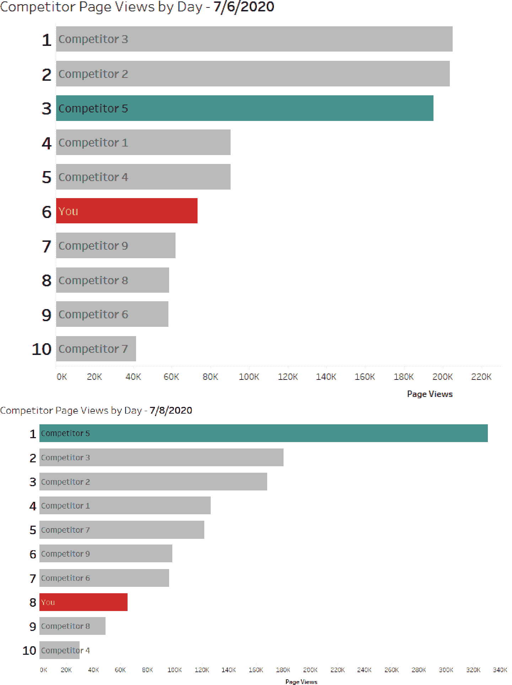

# 第九章：构建动态分析

直到这一点，我们一直专注于识别正确的可视化方式来回答关键问题。您已经学会了在何时使用饼图，如何制作有效和多样化的条形图，以及处理不同数据类型的多种方法。每一章都对您理解良好的数据可视化至关重要，并为您提供了构建正确图表所需的工具。但现在，通过引入动态元素，您将进一步扩展这些知识。

我们将本章命名为“构建动态分析”，因为您将使用 Tableau 中的各种功能来操作可视化，改变数据显示方式，提供用户输入，并创建根据观众兴趣定制的图表。与本书中的其他策略不同，本章讨论的每一点都将导致可视化的多种（有时是无限的）排列组合。我们将为您提供基础理念和动态元素的构建模块，供您将其整合到自己的数据项目中。我们希望您从本章中学会如何有效地为观众和使用情景增加交互性和定制性。

在第一个案例研究中，您将探索如何构建多种图表变体，以满足观众需求的参数。在第二个案例研究中，您将使用参数操作创建基于用户交互改变的动态图表。最后，您将使用集合操作来深入到各种日期级别，并创建可展开和折叠的表格。

# 参数

在本书中我们已经几次介绍了参数（特别是在第一章），当我们使用简单的参数将柱状图限制在商户类别的前 N（在我们的案例中为 10）个类别时。在我们深入讨论之前，让我们简单回顾一下。

*Tableau* 中的*参数* 是您可以在可视化中使用的动态输入字段。您可以将它们设置为以下字段类型：浮点数，整数，字符串，布尔值，日期和日期时间。它们允许您或您的观众选择存在于数据集之外的变量。这些变量可用于更改可视化方式显示的方式，设置字段值，或作为复杂的过滤器，仅举几例。

此外，您可以定义与它们相关的默认行为。您可以将它们设置为静态列表——可以是手动输入或从字段派生，也可以是值范围（适用于日期和数字），或允许它们自由输入相同数据类型的任何条目。在接下来的策略中，我们将探索利用参数的示例，无论是以明显的还是不明显的方式。

# 使用参数更改度量和维度：办公室必备案例研究

在 Tableau 中使用参数的最流行方法之一是将其用作观众定义希望查看的度量的一种方式，以及通过选择的维度显示图表。

作为一家办公用品商店，OE 正在管理数以万计的 SKU，涵盖多个人群，从在当地店铺购买的个人到具有固定订单的企业客户。因此，公司高管对跟踪许多关键指标感兴趣。如果您为每一个建立图表，您将会得到许多仪表板和报告。您如何避免报告泛滥呢？

让我们更详细地看看如何利用参数，以便您可以用相同类型的图表表示许多类型的分析。

## 策略：使用参数来改变柱状图中的度量。

进一步深入我们的场景，想象一下 OE 销售团队希望能够比较许多指标——即销售额、利润比率、订单数量和产品类型的不同子类别的数量。这个请求看起来可能是无害的，但请想象一下，这个请求应该放在一个销售仪表板上。如果每个度量标准的四个柱状图都放在一个仪表板上，几乎没有空间用于其他内容。当然，您可以将图表切换为表格，但正如我们讨论过的，表格不允许进行与柱状图所提供的相同视觉比较。因此，参数将作为观众选择要显示的度量的控制器。

###### 小贴士

基本参数可以在可视化中使用，而不需要成为计算字段的一部分，但是大多数参数，特别是在更复杂的技术中，将需要在一个或多个计算字段中使用。

1.  创建一个名为`**[选择一个度量]**`的参数，并将其数据类型设置为整数。将“允许的值”选项设置为列表。在列表中输入以下值：

    | **值** | **显示为** |
    | --- | --- |
    | `1` | `销售额` |
    | `2` | `利润比率` |
    | `3` | `# 订单` |
    | `4` | `数量` |

    ###### 小贴士

    我们建议将这些类型的参数创建为整数。这样做时，整数会作为参数控制器中的“显示为”选项别名，但计算将基于值进行评估。在计算中，整数比字符串处理更快，也会使您的计算字段更短，创建速度更快。

1.  创建一个名为`**[选择的度量]**`的计算字段。使用一个 case 语句，输入以下内容：

    ```
    //Selected Metric
    CASE [Select A Metric]
    WHEN 1 THEN SUM([Sales])
    WHEN 2 THEN SUM([Profit])/SUM([Sales])
    WHEN 3 THEN COUNTD([Order ID])
    WHEN 4 THEN SUM([Quantity])
    END
    ```

    ###### 小贴士

    记住，计算字段需要是行级或聚合的。因为[利润比率]和[# 订单]需要预先聚合，所以另外两个度量值[销售额]和[数量]被包括为聚合。

1.  将[选择的度量]拖放到列架上，并将[子类别]拖放到行架上。右键单击[子类别]，按降序排列[选择的度量]。

1.  双击标题编辑表格的标题，然后通过使用“插入”功能在编辑标题对话框中输入以下内容：

    ```
    <Parameters.Select A Metric> by Subcategory
    ```

1.  在左下角右键单击[选择一个度量]参数，并选择显示参数。使用参数控件，注意柱状图随度量变化而变化，并且子类别保持按降序排序（图 9-1）。


###### 图 9-1\. 使用参数更改度量的柱状图

通过使用参数和一个计算字段，您现在已经创建了四个柱状图。这种可能性使您的观众能够在他们浏览仪表板中共享的数据时选择最具影响力的图表。

###### 小贴士

当您使用参数在多个度量之间切换时，您会注意到数字格式会发生变化，但并非每个度量都完全一样。在 Tableau 中，每个字段只能有一种默认的数字类型，因此一个常见的解决方法是创建另一个计算字段，以匹配所需的数字格式。

## 策略：使用正则表达式函数动态格式化参数化度量

为了使您的可视化更加用户友好和直观，我们始终建议使数字匹配其表示的数据类型和格式。回想一下我们之前所说的，当观众阅读图表时，会有内部对话。为什么不在适当时包括一个美元符号或百分比呢？

创建匹配度量类型的格式化计算的一种方法是使用正则表达式（regex）。这些用于在文本字符串中查找并有时提取或替换模式。正则表达式函数在许多编程语言中很流行，在 Tableau 中也有几种。例如，我们将使用`REGEX_REPLACE()`以及`ROUND()`（四舍五入函数）和`STR()`（将数字转换为字符串的函数）来构建格式良好的数值标签：

1.  创建名为`**[Formatted Label]**`的计算字段：

    ```
    //Formatted Label
    CASE [Select A Metric]
    WHEN 1 THEN "$" +
    (REGEXP_REPLACE(STR(ROUND([Selected Metric],0)),"(\d)(?=(\d{3})+$)","$0,"))
    WHEN 2 THEN STR(ROUND(ROUND([Selected Metric],4)*100,2))+"%"
    WHEN 3 THEN REGEXP_REPLACE(STR(ROUND([Selected Metric],0)),
      "(\d)(?=(\d{3})+$)","$0,")
    WHEN 4 THEN REGEXP_REPLACE(STR(ROUND([Selected Metric],0)),
      "(\d)(?=(\d{3})+$)","$0,")
    END
    ```

    ###### 小贴士

    虽然我们没有时间详细讨论正则表达式，但足以描述在前面代码中显示的重复模式。`(\d)(?=(\d{3})+$)`查找连续三个数字的任何模式。`$0`在找到该模式后插入逗号。这是为了将转换为字符串的数字添加逗号分隔符而完成的。

1.  将计算字段拖到标签中，并使用参数控件更改度量。您的图表现在应与图 9-2 匹配。


###### 图 9-2\. 正则表达式已应用于柱状图标签，以根据选择的度量格式化数字

## 策略：使用参数改变柱状图的维度

如果你的观众也想要一种方法来将条形图从比较子类别转变为比较州、客户或地区，你可以应用类似的技术，使用参数创建一个动态维度：

1.  创建一个名为`**[切片方式]**`的整数参数，并创建一个名为`**[选择的维度]**`的计算字段：

    | **数值** | **显示为** |
    | --- | --- |
    | `1` | `子类别` |
    | `2` | `州` |
    | `3` | `客户` |
    | `4` | `地区` |

    ```
    //Selected Dimension
    CASE [Slice By]
    WHEN 1 THEN [Sub-Category]
    WHEN 2 THEN [State]
    WHEN 3 THEN [Customer Name]
    WHEN 4 THEN [Region]
    END
    ```

1.  双击行架上的 [子类别] 以编辑显示的字段。然后删除子类别并替换为 [选择的维度]，然后按 Enter 键。

    ###### 小贴士

    当你通过编辑可视化来更改使用的字段时，它将保留已放置在其上的任何格式和排序。在这里，我们正在使用这种技术来保留按所选度量排序的字段。

1.  双击标题，用 [切片方式] 替换 [子类别]。显示参数并在不同维度之间切换。你也可以使用这个新参数更新标题。你的最终可视化应与图 9-3 相匹配（#this_bar_chart_allows_the_user_to_change）。


###### 图 9-3\. 这个条形图允许用户更改指标和标题

恭喜！你现在已经通过使用两个参数和几个计算字段创建了可能达到 16 种不同的条形图。同时，你也为你的观众提供了多种选项来分析他们的数据。

# 使用参数在折线图中设置时间段和日期聚合：Office Essentials 案例研究

现在 OE 的高管们拥有了高度可定制的条形图，以更好地理解他们的销售情况，他们提出了额外的问题。他们想要随时间推移来看数据的趋势，但不太确定如何提出他们所寻找的内容，因为这取决于他们使用数据的目的。有时候，他们希望在双周报告中看到每周的数据，有时候在特定促销期间，他们希望每天看到数据，有时候他们想要看到每月的数据。

所有这些都是合理的场景和分析数据的方式，但每一种听起来都像是一个单独的图表。有简化的解决方案吗？通过参数，你可以再次将所有这些数据简化为一个图表，如图 9-4 所示，让观众选择他们想要用来分析数据的时间部分。


###### 图 9-4\. 这个折线图允许用户更改日期显示级别

## 策略：使用参数来更改折线图中的日期

在这个策略中，你将创建图 9-4 中的折线图：

1.  创建一个名为`**[显示方式]**`的整数参数：

    | **数值** | **显示为** |
    | --- | --- |
    | `1` | `每天` |
    | `2` | `每周` |
    | `3` | `每月` |

1.  创建三个自定义日期字段，从订单日期字段开始：[Days Date Value]、[Week Numbers Date Value] 和 [Months Date Value]。请记住，您可以通过右键单击[Order Date]字段，使用日期精度的下拉列表，并选择日期值来创建这些字段。

1.  创建一个名为`**[选择的日期]**`的计算字段：

    ```
    //Selected Date
    CASE [Display By]
    WHEN 1 THEN [Order Date (Days)]
    WHEN 2 THEN [Order Date (Week numbers)]
    WHEN 3 THEN [Order Date (Months)]
    END
    ```

1.  右键单击并拖动[选择的日期]到列架上，选择第一个选项，选定的日期（连续）。将`SUM([Sales])`拖到行中。显示[Display By]参数，并在不同的时间值之间切换。通过使用参数显示匹配的标题，如图 9-5 所示。

此时，您可能会质疑为什么我们不使用 Tableau 中的内置日期层次特性，以便观众可以通过各种日期级别进行下钻和上升。我们发现，这种体验通常不够直观，会导致过度钻取、过多选项，或者在截断数据并显示不够准确的情况下。 

实际上，在这个视图中，当我们切换到周视图时，2019 年 12 月 29 日这一周的数据似乎下降了很多，但这仅因为这一周的数据仅包含了三天。通常情况下，当我们构建这些图表时，我们还会添加隐藏的日期过滤器，以确保无论选择了哪个时间段，都能显示完整的时间。


###### 图 9-5. 此折线图包含根据所选时间部分更改的过滤器

## 策略：添加隐藏的日期过滤器以防止截断的时间部分

为了防止截断日期部分，您可以添加更多作为过滤器的计算字段。这些将适当地限制数据，确保观众查看完整的时间段。询问后，您已找到每个时间切片（日常、每周、每月）的最受欢迎的时间窗口。对于日常，大多数最终用户希望查看最多最近的 30 天。对于每周，他们希望回顾过去的 13 周，对于每月，他们查看过去的 12 个月。

按照前一战略的图表继续进行，现在您将实施这种动态过滤：

1.  创建一个计算字段，用于识别数据集中最新的日期：

    ```
    //Maximum Date
    {MAX([Order Date])}
    ```

    ###### 小贴士

    当编写固定的 LOD 表达式时，如果应用于整个数据集，则不必包括修饰符`fixed`。这是一个省时的方法，可以轻松地识别 LOD 正在计算的内容。

1.  创建一个名为`**[限制日期]**`的计算字段：

    ```
    //Limit Date
    CASE [Display By]
    WHEN 1 THEN [Order Date (Days)]>= DATEADD('day',-14,[Maximum Date])
      AND [Order Date]<=[Maximum Date]
    WHEN 2 THEN [Order Date (Week numbers)]
      >=DATEADD('week',-13,DATETRUNC('week',[Maximum Date]))
    AND [Order Date (Week Numbers)]
      <=DATEADD('week',-1,DATETRUNC('week',[Maximum Date]))
    WHEN 3 THEN [Order Date (Months)]
      >=DATEADD('month',-12,DATETRUNC('month',[Maximum Date]))
      AND [Order Date (Months)]
      <=DATEADD('month',-1,DATETRUNC('month',[Maximum Date]))
    END
    ```

    ###### 小贴士

    每当您构建限制日期的计算字段时，我们始终建议以编程方式识别最新的日期。LOD 是这样做的一种简便方式，但您也可以改变方式，使其成为用户输入（另一个参数）。

1.  将[限制日期]字段拖放到您的筛选架上，并选择 True。

1.  作为最后的修饰，构建一个计算字段，解释每个选择的时间部分显示多少数据。将其拖放到详细信息中，然后添加到您的标题中：

    ```
    //Time Period Description
    CASE [Display By]
    WHEN 1 THEN 'last 30 days'
    WHEN 2 THEN 'last 13 weeks'
    WHEN 3 THEN 'last 12 months'
    END
    ```

现在，您已经为观众提供了可以根据不同的时间部分和流行时间段定制的图表（如图 9-5 所示）。您还为观众建立了防护栏。他们不会发现自己在比较截断的数据周之间，当他们在以后回顾数据时，图表将随时间更新。

# 使用参数操作来更改趋势度量：SAGE 数字营销案例研究

SAGE 数字营销希望进一步发展允许最终用户灵活选择其指标的概念。现在，他们不仅仅允许用户从下拉列表中选择，还希望将该功能直接集成到可视化中。您如何构建一个可视化，使用户能够点击一个指标以自动显示更多信息？

要使此功能正常工作，您将依赖于*参数操作*。这些操作最早在 Tableau 2019.2 中引入，允许最终用户通过使用仪表板或工作表操作来注入（或设置）参数值。仪表板和工作表操作将在第十二章中更深入地描述，因此现在知道*操作*是指定条件的一种方式（如在图表中点击条形），并作为结果发生的事情足够了。最基本的操作是*过滤操作*：用户点击东部地区，仪表板中的周围图表将过滤到东部地区。通过包含参数操作，用户现在可以点击东部地区，并设置一个参数为东部地区。

## 策略：使用参数操作和度量名称动态更改度量

在这个策略中，我们将构建一个可视化，用户可以点击其中一个指标来显示信息：

1.  创建一个包含点击数、转化数、转化率、成本、每次点击成本、每次转化成本、收入、每次转化收入和广告支出回报率（ROAS）的 KPI 的单一工作表，使用[度量名称]和[度量值]。

    

    ###### 图 9-6\. 一组基本的 KPI

1.  现在创建一个名为`**[营销指标]**`的字符串参数。将“当前值”设置为 1，“允许值”设置为全部。

    ###### 小贴士

    尽管我们建议使用整数作为度量选择参数，但在使用度量名称和参数操作时，必须使用字符串数据类型。这是因为度量的名称（点击）设置为当前值。

1.  创建一个计算字段，显示选择了哪个营销指标：

    ```
    //Selected Marketing Metric
    CASE [Marketing Metric]
    WHEN 'Clicks' THEN SUM([Clicks])
    WHEN 'Conversions' THEN SUM([Conversions])
    WHEN 'Conversion Rate' THEN [Conversion Rate]
    WHEN 'Cost' THEN SUM([Cost])
    WHEN 'Revenue' THEN SUM([Revenue])
    WHEN 'Cost per Click' THEN [Cost per Click]
    WHEN 'ROAS' THEN [ROAS]
    WHEN 'Rev. per Conversion' THEN [Rev. per Conversion]
    END
    ```

1.  创建一个水平条形图，显示按服务区域划分的所选营销指标。将 KPI 工作表和条形图都添加到一个新的仪表板中。

1.  创建仪表板操作以通过选择仪表板→操作来更改参数。在操作对话框中，单击添加操作→更改参数。

1.  在编辑参数对话框中，如图 9-7 所示，设置功能，使得营销关键绩效指标成为源——即与之交互将导致变化的工作表。将营销度量设为目标参数，其值将发生变化。参数中将要放入的字段值是测量名称。

    

    ###### 图 9-7\. 参数操作配置屏幕

    现在，当用户希望基于任何这些指标查看柱状图时，他们可以直接点击指标，如图 9-8 所示。


###### 图 9-8\. 用户选择点击时的输出（顶部），以及用户选择转化率时的输出（底部）

# 使用参数操作查看每日和 7 天平均值：SAGE 数字营销案例研究

数字营销世界中有趣的一点是，每天都会发生大量数据波动。根据竞争对手的活动、潜在客户及其他外部因素，您的业务指标可能会显示一系列值。

为了帮助弥补这一点，SAGE 数字营销要求在其报告中添加一个移动平均线，以平滑数据。*移动平均*采用数据点及其之前一定数量的数据点来计算值。这样可以为数据添加平滑效果，因为过去*x*个数据点的高低值被平均。但是，SAGE 的高管们也想看到实际值。

如何同时表示实际值和移动平均值？

## 策略：计算动态更改的 7 天移动平均参考线，具体是通过日期选择

使用前一个策略中的相同数据集，您将引入参数操作以动态更改移动平均线：

1.  创建一张显示按天分组的收入线图。

1.  创建一个名为`**[选择的日期]**`的参数，并将其设为包含所有可允许值的日期字段：

1.  创建一个名为`**[时间窗口]**`的计算字段：

    ```
    //Time Window
    [Date]>=DATEADD('day',-7,[Selected Date])
    AND [Date]<=[Selected Date]
    ```

1.  创建另一个名为`**[时间窗口收入]**`的计算字段：

    ```
    //Time Window Revenue
    IF [Time Window]
    THEN [Revenue]
    END
    ```

1.  将[时间窗口收入]拖动到详细信息中作为总和。使用此字段创建一个参考线，显示平均值。将标签更改为自定义。取消选择“显示高亮或选定数据点的重新计算线”。

1.  创建另一个名为`**[时间窗口日期]**`的计算字段：

    ```
    //Time Window Date
    IF [Time Window]
    THEN [Date]
    END
    ```

1.  将[时间窗口日期]拖动到详细信息中作为最小值。

    ###### 提示

    在此，我们将日期作为聚合的方式拖拽，以避免线图上的线变成点。当试图向具有不希望干扰的表格计算的图表添加维度时，这种方法也可能会有所帮助。

1.  创建一个参考区间，从最小时间窗口日期到最大时间窗口日期，并将阴影设置为浅绿色。

1.  创建一个名为`**Change Date**`的工作表操作，当用户悬停在图表上时，将所选日期设置为 DAY([Date])。

    现在，您已经建立了一个图表，满足了观众的两个条件：每日报告和选择时间段的平滑平均值（图 9-9）。


###### 图 9-9\. 带有指定点七日移动平均参考线的线图

# 集合和集合操作

在书的早期，您对集合操作有了一些基本的第一手经验，但我们还没有花时间深入探讨。在本节中，我们将从解释“*集合*”开始。在 Tableau 中，它是一个基于维度（或多个维度）的计算字段，您可以根据条件定义成员。这些条件可以是手动选择，例如列表，也可以基于计算的条件或值，或者可以基于字段或公式进行顶部或底部分组。实际上，创建集合的选项与使用维度（蓝色字段）作为过滤器时可用的选项相匹配。集合还可以组合，这意味着您可以使用两个条件创建维度的子组。

一个结合两个集合及其结果的实际例子是构建一个按销售额前十名和按销量销售前十名的客户集合。这两组可以通过三种方式组合使用：

两组中的所有成员

如果客户既在销售额前十名中，又在销量前十名中，该客户将被包括在内。

两组中的共享成员

客户同时在前十名中。

除了共享成员

这从另一组中减去了一组。在这种情况下，如果按销售额排名前十的客户减去按销量排名前十的客户，您将得到那些销售额高但销量不高的客户。

作为行级计算，当您使用集合时，可以将其视为在幕后创建布尔值以对数据进行分类。在 Tableau 中，集合在显示方式上具有独特功能。首先，您可以将集合用作维度，这将构建一个“包含”和“不包含”头，并在相应组中表示成员。您还可以将集合用作筛选器，将数据筛选到整个“包含”或“不包含”组，或者筛选到“包含”组中的成员。这意味着您可以使用集合动态显示符合集合条件的维度值或整个集合本身。最后，您可以公开集合控件，并让最终用户将其用作选项列表。

现在，关于*集合操作*，这是在 Tableau 2018.3 中首次引入的。通过集合操作，您正在采取第一种类型的集合，从中手动从选项列表中选择成员，而不是作为一次性任务，根据用户的交互添加和减少成员。这具有强大的影响，因为您正在赋予最终用户创建数据的临时分组的能力。最终用户还可以动态定义是“包含”还是“不包含”集合的成员，这对于筛选非常有用。正如您在第一章中看到的，集合操作的常见用例之一是根据交互动态更改数据的粒度。

在接下来的两个策略中，我们将扩展使用集合操作进行数据钻取，并将其与筛选和自定义格式化结合，生成引人入胜且直观的用户体验。

# 使用集合操作进行数据下钻和筛选：数字营销案例研究

SAGE 在收到来自最终用户的有趣请求后，正在回顾其数字营销数据。高管们通常喜欢查看每周业绩，但有时，特别是如果某周在用户参与方面表现特别突出，他们会喜欢深入了解每日量，并分离出可能有助于业绩的任何内容。与我们之前讨论过的概念不同，在这种情况下，他们希望有灵活性，可以根据兴趣钻取数据，而不是仅显示所有每日数据或预筛选的子集。

这提出了一个有趣的问题。您会如何解决它呢？让我们更详细地看一下如何通过实施集合操作来解决这个问题，这允许用户选择一个数据点并查看该点内的更详细数据。

## 策略：在折线图中从周到日期进行钻取

从新工作表开始，按照以下步骤介绍下钻交互性：

1.  创建两个自定义日期字段，一个是日期在日级别上，另一个是日期在周级别上。将周级别的计算拖动到标记卡上。

1.  根据每周日期创建一个集合。单击“全部”按钮以选择所有数值，并命名该集合`**包含的日期集合**`。

1.  创建一个名为`**Drill Date**`的集合操作，当选择时运行，配置为“添加到集合中的值”，清除时“从集合中删除所有值”。

1.  创建一个基于集合的计算维度，并将其放置在[日期]字段上。

    ```
    //Date to Show
    IF [Included Dates Set]
    THEN [Date (Days)]
    ELSE [Date (Week numbers)]
    END
    ```

    到此为止，您建立的互动将导致周日期标记变更为每日标记。但是，这两者仍将在视图中可见。此策略的最后一部分是为日期添加一个过滤器，以确保您正在进行钻取并将其过滤到每日视图。

1.  创建一个名为`**[Filter Date]**`的计算字段：

    ```
    //Filter Dates
    IF {COUNTD(IF [Included Dates Set] THEN [Date (Days)] END)}>=1
    THEN [Included Dates Set]
    ELSE TRUE
    END
    ```

    ###### 提示

    此计算确定包含在集合中的日期数量。如果集合中有一个或多个日期，则计算将过滤以仅包括其中的日期。否则，如果集合中有 0 个或 NULL 成员，则整个折线图将显示。

1.  通过构建一个计算字段来为工作表添加一些最终格式化，以动态更改数据粒度时进行动态更改；这将使用与日期过滤器相同的逻辑。将其作为属性添加到详细信息中。

    ```
    // Title Date Part
    IF {COUNTD(IF [Included Dates Set] THEN [Date (Days)] END)}>=1
    THEN 'Day'
    ELSE 'Week'
    END
    ```

    ###### 提示

    将格式化字段作为属性添加将确保在从一个日期级别更改到另一个日期级别时，标记选择仍然保持高亮显示。否则，在选择标记后，该值将不再是其一部分，会导致标记取消选择。

    使用此逻辑，您现在部署了一个可以动态从周变为天的折线图，如图 9-10 所示。这种技术和互动遵循最终用户的分析流程。有人可以进来，检查每周的数据，然后迅速钻取到特定周，查看更细粒度的每日数据。


###### 图 9-10. 按周的折线图（左），选择周后，数据钻取到每日（右）

除了使用集合操作动态地深入研究时间部分外，它们也可以用于深入研究表格。有人曾对你说过：“我想看到这个区域的更多细节吗？”当他们这样做时，通常意味着您拥有分层数据，他们希望看到数据细分。他们希望拥有一张表格，在这张表格中，他们可以“展开”一个类别，以便根据需要查看其子成员。与 Tableau 内置的层次结构不同，集合操作使您能够让用户选择一个类别，从而提供更详细的信息，使他们能够在同一视图中查看较少关注的类别的聚合信息和特定类别的细分数据。

在我们的营销数据中，这个问题表现为用户希望深入研究感兴趣的服务区域，然后视觉审查与每个邮政编码相关的指标。他们不希望为那些兴趣较少的领土添加额外的邮政编码详细信息。

## 策略：展开数据表的一部分

在这个策略中，您将构建允许数据表通过集合操作展开和折叠的交互性：

1.  创建一个显示按服务区域分组的成本、点击次数、每点击成本、转化、转化率和每转化收入的数据表。

1.  创建一个名为`**[选定服务区域]**`的集合，基于[服务区域]，并包括集合中的所有值。

1.  创建一个名为`**[显示邮政编码]**`的计算字段，并将其放置在行架上的[服务区域]右侧：

    ```
    //Show Zip Code
    IF [Selected Service Area]
    THEN [ZIP]
    ELSE [Service Area]
    END
    ```

1.  基于新集合创建一个集合操作，并配置该操作在选择时运行。配置操作以“分配值到集合”，并在清除选择时“从集合中移除所有值”。

    现在，当用户点击服务区域时，表格将动态展开以显示该服务区域的邮政编码。为了完成，我们建议添加以下最后的触摸。

1.  创建一个名为`**[钻取符号]**`的计算字段：

    ```
    //Drill Symbol
    IF [Selected Service Area]
    THEN '▼'
    ELSE '►'
    END
    ```

1.  创建一个名为`**[邮政编码标头]**`的计算字段：

    ```
    //Zip Code Header
    IF [Selected Service Area]
    THEN [ZIP]
    ELSE 'Total'
    END
    ```

1.  将新的计算字段拖放到行架上，将[钻取符号]放置在[服务区域]后，将[显示邮政编码]放置在[钻取符号]后。右键单击[显示邮政编码]并隐藏标题。右键单击标题并选择隐藏字段标签行。根据需要调整行间隔和格式。现在您的可视化应该类似于图 9-11。


###### 图 9-11。按服务区域聚合的营销指标（上），以及单击扩展按钮以显示北部邮政编码的图表（下）

虽然添加额外的格式细节可能需要一些时间，但当我们说值得时，请相信我们。这些小设计决策累计起来形成良好的用户体验（我们将在第十二章中更详细地探讨）。并且您已经增加了更为熟悉于您的受众的功能。

集合操作带给可视化的功能和交互性是用户熟悉且喜欢的。实施这些类型的功能和功能最终将导致您的受众对您开发的内容做出更积极的响应。由于增加了这种交互性，他们也很可能更加投入其中。

# 动画

*动画* 是数据可视化方案中的一个较新概念。这种技术最初可以说是由汉斯·罗斯林的 Gapminder 首次流行化，展示了全球所有国家在过去 50 年间出生人数和预期寿命之间的关系如何变化。随着用于创建可视化的软件工具的演进，动画变得越来越普遍。

动画独特之处在于它们允许可视化开发者展示更复杂的主题，如随时间的变化、过渡、排名/顺序的变化或情感/叙述背景。通过直接“播放”数据，变化从观众身上卸载并直接放入视觉中。在这里需要注意的一点是：当使用动画时，我们强烈建议有人在场描述其展开的故事。因为动画通常需要讲述者，我们认为它最适合在演示的背景下而不是自助数据产品中使用。

Tableau 提供两种使用动画的方式。首先是通过页面架构。该功能允许用户“翻页”，或者根据架构上的维度构建不同的视图。想象一下，您有一本书，每一页代表一天。使用页面架构，您可以添加控制器以浏览每一页，甚至可以自动翻转它们。

Tableau 中使用动画的第二种方法是动画标记。当此功能打开时，如果由于过滤或交互而导致标记位置变化，则会自动进行动画显示过渡。这在用户进行选择时可以吸引注意力，或者可以识别数据本身已经被过滤的情况下非常有用。

# 竞争对手分析研究：使用动画比较排名表现

对于大多数品牌或产品来说，有竞争是很自然的。在任何一天，您的公司都在争取吸引消费者的最多关注度。衡量客户意识的一种流行方式是比较网页浏览等参与度指标。传统的分析方法可能是通过按天绘制页面浏览量，看看您的公司表现如何，然后再看看您的竞争对手。但是如果您想了解每天市场份额的动态变化，那么动画可以帮助展示同行之间的移动和变化，并讲述您的组织的表现故事。

在下一个策略中，我们将使用来自 SAGE 的另一个数据集。该数据集具有几个竞争对手和一个目标公司（您），根据页面浏览量定义其每日排名的指标。

## 策略：构建一个动画颠簸图

在第三章中，您学习了如何构建一个颠簸图，该图根据度量值排名的维度并绘制排名随时间变化的情况。在这个例子中，您将通过引入自定义的高亮和动画，进一步改进颠簸图：

1.  构建一个颠簸图，显示每个竞争对手的每日排名。

    ###### 提示

    记住，凸显图通常是双轴图表；第一个轴标记是圆圈，第二个轴标记是线条。如果您的度量是连续的，请反转轴，使 1 位于图表顶部。

1.  创建一个基于[Competitor]字段的参数`**[Comparison]**`，并从列表中删除 You。

1.  创建一个名为`**[Highlight Color]**`的计算字段，用不同颜色着色 You、Comparison Competitor 和所有 Others。将其放置在 Marks card 的颜色上：

    ```
    // Highlight Color
    IF [Competitor]='You'
    THEN 'You'
    ELSEIF [Comparison]=[Competitor]
    THEN 'Comparison'
    ELSE 'Other'
    END
    ```

1.  右键单击并将[日期]作为离散字段拖放到页面架上。配置控制器以显示所有标记的历史记录，包括轨迹和不透明标记。

    通过动画，您现在可以讲述品牌的故事，从第 6 名开始，途中取得一些进展，并在时间段的一半左右达到第 4 名的高峰，并最终在第 5 名结束。同样，您可以直观地看到竞争者 5 在时间段结束时向顶点发起强烈冲击（如图 9-12 所示）。

一个替代凸显图通常被称为*racing bar chart*。这种图表将指标的排名进行动画化，以便随时间查看位置变化，就像赛道上的赛车手一样争夺位置。


###### 图 9-12。初始排名与竞争对手（顶部）和其余数据（底部）的比较

## 策略：创建赛车条形图

使用相同的数据集，创建一个新的工作表，并执行以下操作：

1.  创建一个水平条形图，包括 Rank 和 Page Views。

1.  使用页面架逐日翻页。

1.  将先前策略中的[Highlight Color]计算字段放置在颜色上。

1.  不要启用页面架的历史记录。

    这种类型的动态图表利用时间内的位置变化，同时保持测量的幅度。图 9-13 显示，尽管您的品牌在页面浏览中排名第六，但所有竞争者都非常接近。然而，竞争者 5 后来主导了所有人，将您留在包尾。



###### 图 9-13。初始排名与竞争对手（顶部）和最终排名（底部）

# 结论

在本章中，您已经看到参数有多么强大。它们允许直接用户输入，并与计算字段结合使用，实现复杂的过滤和交互。它们非常有用，可以减少图表的繁殖，并在图表设计中提供灵活性（记得您是如何通过下拉菜单将线状图从月度数据更改为周度数据的）。*直接用户输入*意味着您的观众的行为可以定义可视化的输出——从而生成高度定制的最终可视化效果。

你也直接与集合进行了更多的工作，并看到它们带来的增强互动性。如果你的用户要求钻取功能，可以使用*钻取*作为一个关键词，考虑如何通过集合操作增强你的图表。最后，你已经看到动画如何将静态图表变得更有吸引力。通过运动和动作，数据故事更容易讲述，更令人兴奋。本章的技术组合将在提升你的数据产品分析能力和用户体验方面发挥重要作用。在 Tableau 中构建的精细数据产品可能会应用一个或多个这些工具以达到最大效果。

在下一章中，你将学习如何丰富你现有的数据集，填补日期和数值的空白，并构建复杂的可视化效果。
