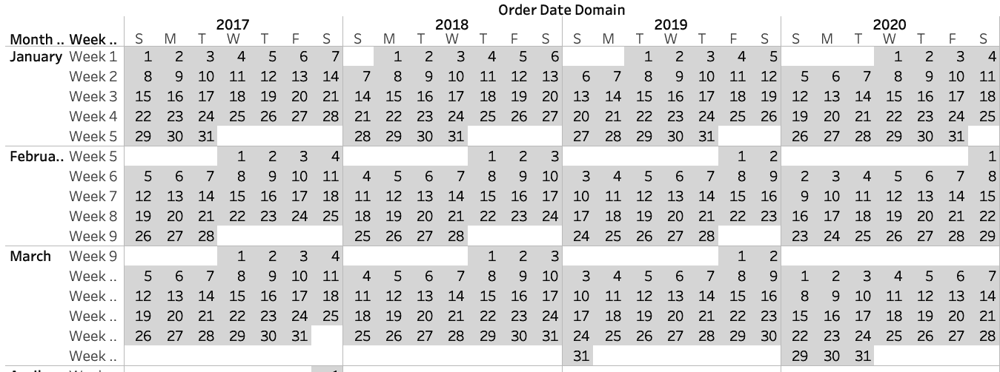
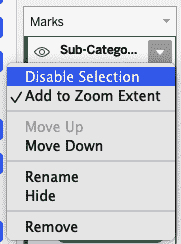

# 第十章：高级数据建模

有时候你想要制作一种图表类型，这在 Tableau 的默认功能中却难以实现。不要担心：只要有耐心和一些超越常规的思考，你可以在 Tableau 中制作任何类型的图表。

在本章中，你将探讨 Tableau Desktop 中数据建模的不同方法。当我们使用术语*数据建模*时，我们指的是包括可能不适用于标准可视化的额外数据。我们将讨论几种数据建模技术，包括使用表计算、混合、联合和连接。每种技术都有其适用的时机和场合。如果你对这些技术还不熟悉，不用担心；我们将在本章的案例中详细阐述这些差异。

在每种情况下，你都在权衡仪表板的性能和设计。有些权衡不会影响速度。其他情况下，特别是当你向可视化添加额外标记或向数据集添加行列时，可能会显著降低速度。

在你深入研究之前，我们将通过一些实际示例为你奠定理解的基础。

除了两种策略之外，其余都使用了 Tableau 的 Sample – Superstore 数据集。其他示例使用了销售管道数据和超市数据集的修改版本。本章不会为使用情况提供单一的线性故事。每种情况都是独立的。因此，我们将在每种策略中设定场景。

# 数据建模

数据建模可能是 Tableau 中最高级的概念。*数据建模*——有时也称为*数据密集化*（这是其中的一个子集）——是一种增加可视化中显示数据量的技术。

数据密集化最常用于创建曲线图，但数据建模还有许多其他实际用途。我们只会讨论其中几种可能性。最常见的数据建模类型是填充潜在缺失值（*域填充*）。这种方法如此常见，以至于你在第六章中已经使用过它！除了填充缺失值，你还可以在系列的开头或结尾添加更多数值（*域完成*）。域填充和域完成都不必复杂；实际上，在我们的第一个策略中，我们将向你展示如何同时进行这两种操作。

随着技能的提升，你会尝试开发超越 Tableau Desktop 基本功能的独特解决方案。记住，任何可视化本质上都只是点、线和多边形的组合。如果你无法在 Tableau 中制作基本图表，你可以使用数据建模重新定义你的可视化。

我们可以通过至少三种方式执行数据建模：联合数据源、连接数据源或进行分桶/范围密集化。对于大多数可视化，你可以使用其中任何一种方法。每种方法都有其权衡，但都会向现有数据源添加更多数据以创建你的可视化。

数据建模的最简单方法是*union*或附加数据源到其自身。这样可以复制你正在处理的所有数据，但将数据源附加到自身的过程是所有方法中最简单的。例如，如果你想要将数据加倍，并且正在使用 Sample – Superstore 数据集，你只需联合订单即可。这种方法的缺点是你至少需要再次加载所有数据进行联合。如果你处理大量数据（一百万条或更多记录），这可能不是最好的方法。

第二种方法是简单地将感兴趣的数据源与一个占位数据集连接起来。这个占位数据集通常很简单，通常是一个单列，行数从 1 开始，逐步增加，直到需要进行分析的整数为止。这种连接也会有效地使你的数据加倍。然而，通过使用提取功能，Tableau 只会对数据进行单次快照，而不会像联合操作那样复制数据。从性能上看，这种方法是三种方法中最高效的一种。

在这种情况下，如果你正在使用 Sample – Superstore 数据集，并希望将其复制五次，你首先需要创建一个新的占位数据集，如下所示：

| `placeholder` |
| --- |
| `1` |
| `2` |
| `3` |
| `4` |
| `5` |

然后，你可以通过使用自定义连接，其中 1 = 1（我们将在本章后面向你展示如何做到这一点），将数据集连接到 Sample – Superstore。如果你需要将数据复制 100 次，你只需有 101 行，每行从 1 开始以 1 的增量计数。在数据建模时，这是我们的方法。

最后一种方法需要你创建一个连接到一个补充数据源的连接，该数据源包含两行：第一行是第一个值，最后一个值是你希望在视图上复制的数据源的最大次数。然后，你可以使用分段和表格计算来填充缺失的值。从性能角度来看，这种方法通常效率最低，因为数据建模是通过表格计算完成的。这些类型的计算在可视化渲染时完成，通常返回速度最慢。

在这种情况下，与前述连接示例一样，如果你正在使用 Sample – Superstore 数据集，并希望将其复制五次，你首先需要创建新的占位数据。这次，占位数据要简单得多：

| `placeholder` |
| --- |
| `1` |
| `5` |

之后，你将像连接示例一样连接到数据。这是方法分歧的地方。从那里，你需要使用分段和一些我们不会讨论的其他步骤来填充值 2、3 和 4。如果你对这种技术感兴趣，可以阅读 Ken Flerlage 的一篇[优秀博客文章](https://oreil.ly/5miVm)。

正如前文所述，我们将在本章讨论联合和连接方法。 值得注意的是，bin/table 计算方法在 Tableau 社区中非常流行，并且仍然是许多人进行数据建模的方法。 我们主要放弃这种技术的原因是 Tableau 在创建数据提取方面有了显著改进，而原始方法允许通过绕过显著增加数据源的方法进行工作。 我们发现，与 bin/table 计算方法相比，使用简单的连接在复制数据超过 100 次时可以提高性能高达 20 倍。

## 策略：创建一个具有数据致密性的日历

您的经理希望看到一个热力图，显示每年每天的盈利能力。 为此，您决定将可视化呈现为一个日历形式。 唯一的挑战是：您没有全年每天的销售数据，导致日历中有很多空白。

通过这种策略，我们将向您展示如何创建一个四年盈利日历。 在此示例中，您将学习如何使用 Sample - Superstore 数据集执行基本数据致密化以填充缺失值。 让我们从查看 Tableau 默认生成的内容开始；请查看图 10-1。


###### 图 10-1. 没有数据建模的日历

您可以看到，Tableau 仅在存在数据的地方返回单元格。 例如，如果我们查看 2017 年 1 月 1 日或 2017 年中，它们不会显示出来。 这是因为我们的数据集中没有这些日期的数据。 我们通过这种策略的目标是填补这些缺失值，以便我们的可视化效果如预期般呈现：

1.  按以下步骤构建日历：

    1.  将[Order Date]的年份和[Order Date]的工作日添加到列中。

    1.  将[Order Date]的月份和[Order Date]的星期添加到行中。右键单击行上的 WEEK(Order Date)。

    1.  将[Order Date]的日期添加到文本和 SUM(Profit)添加到颜色，然后将标记类型更改为方形。 结果见图 10-2。

        

    ###### 图 10-2. 更详细查看列、行和标记卡

1.  这一步非常简单。 右键单击行或列架上的任何维度，并选择显示缺失值（见图 10-3）。 这将填充从最小到最大的所有值。

    

    ###### 图 10-3. 显示缺失值选项

    如您在图 10-4 中所见，从 2017 年 1 月 3 日到 2020 年 12 月 30 日的所有值均已填充。 但是，如果您想显示 2017 年 1 月 1 日、2017 年 1 月 2 日和 2020 年 12 月 31 日，您需要扩展我们的方法。 通过一些 Tableau 技巧，我们可以通过将图层叠加到彼此上来完成这一点。

    

    ###### 图 10-4\. 从最小值到最大值的填充日历

1.  要格式化现有的可视化图表，右键单击它，并将工作表的背景填充设置为无。同时将文本颜色更改为深灰色。

1.  构建背景表如下：

    1.  创建一个名为`**[Order Date Domain]**`的计算字段。如果数据集中的日期等于最早的日期，则返回最早日期的 1 月 1 日；如果日期等于最晚日期，则返回最晚日期所在年的 12 月 31 日：

        ```
        // Order Date Domain
        IF [Order Date] = {MIN([Order Date])}
        THEN DATETRUNC("year", [Order Date])
        ELSEIF [Order Date] = {MAX([Order Date])}
        THEN DATEADD("year", 1, DATETRUNC("year", [Order Date]))-1
        ELSE [Order Date]
        END
        ```

    1.  创建一个用于背景的新表。按照[Order Date Domain]日期字段的步骤 1 和 2 操作。显示缺失值后，您会注意到值现在从 2017 年 1 月 1 日到 2020 年 12 月 31 日。

    1.  通过选择自定义分歧调色板并设置颜色为#E1E1E1 来编辑颜色。然后将阶梯颜色设置为 2 个单位。这将创建一个全灰色的表格（图 10-5）。

        

    ###### 图 10-5\. 背景表

    使用计算完成了域填充，通过“添加”日期到您的数据集中。然后使用显示缺失值来执行域完成。

1.  对于这个日历，您将将两个可视化图层叠在一起：

    1.  如果您还没有仪表板，请创建一个新的仪表板并添加一个垂直容器。将背景表添加到容器中，并将表格适应整个容器。

    1.  在背景视图上添加一个浮动容器。将顶层添加到顶部容器中。隐藏所有标题，然后调整顶部容器的大小以匹配背景层。您可以通过匹配两个表格之间的左、顶部、宽度和高度来匹配大小。

    最终结果是两个看起来像一个完整日历的可视化图表（图 10-6）。


###### 图 10-6\. 最终结果：两层表格

使用此策略，您通过单一计算和显示缺失值应用了域填充和域完成。这是数据稠密化的最简单版本。在本章的其余部分，您将学习更复杂的数据建模版本。

## 策略：创建圆角柱状图

对于这个策略，您将创建一个按子类别销售总结的报表。起初，您可能会想：“这看起来很容易”，但是如果您的利益相关者希望看到一种非常特定类型的图表：圆角柱状图呢？您知道这对于解释并不理想，但同意这是一个摆脱通常得到的乏味柱状图的方法。


###### 图 10-7\. 圆角柱状图策略的最终输出

在这个策略中，您将学习如何制作圆形条形图，如图 10-7 所示，但更重要的是，您将开始学习数据建模的基础知识。通过数据建模，您可以向数据集添加更多数据，以构建出色的解决方案。正如前面提到的，这可以通过三种方式之一来完成：联合操作、连接和表计算。

对于这种圆形条形图策略，以及下一节参考第六章中学到的经验，我们将使用联合操作。再次强调，我们可以通过其他技术来完成这一操作，但我们将从我们认为最简单的选项开始：

1.  让我们从连接到 Sample – Superstore 数据集开始。而不是使用您拥有的任何快速连接，选择 Microsoft Excel 并找到 Sample – Superstore.xls。连接后，点击并拖动订单表到数据源。结果如图 10-8 所示。

    

    ###### 图 10-8\. 连接到数据集的订单选项卡

    您所做的事情非常典型。但我们还没有完成数据窗格的工作。

1.  让我们使用与连接窗格中选定的订单表相同的订单表，并将其与已添加到数据源窗口的订单数据联合，如图 10-9 所示。

    

    ###### 图 10-9\. 将订单与订单联合

    通过将订单数据与自身联合，我们实际上创建了第二层数据以便操作。这个重复的数据层不仅提供了在 Tableau 中工作的更大灵活性，同时也要求我们始终跟踪每一层。您不断需要问自己，第一层数据发生了什么？第二层数据又如何？如果您能同时追踪这两层，您就已经在成为 Tableau Desktop 的高级专业人士的道路上迈出了重要的一步。

    那么，如何跟踪这两层数据呢？当您将数据源联合在一起时，Tableau 会在数据集中创建两个新字段来帮助跟踪这些层：[Sheet] 和 [表名]。在构建数据时，您可以通过向右滚动屏幕看到 [Sheet] 和 [表名]（参见图 10-10）。

    ![联合后，[Sheet] 和 [表名] 维度被添加](Images/TAST_1010.png)

    ###### 图 10-10\. 联合后，[Sheet] 和 [表名] 维度被添加

    对于我们的策略，您将使用 [表名] 维度来跟踪每个层面的情况。

1.  单击 Sheet 1\. 在开始构建之前，将 [销售额] 添加到列和 [表名] 添加到行。您将看到我们有两个 [表名] 的成员：Orders（我们的第一层）和 Orders1（我们的第二层，Tableau 在名称末尾添加了 1）。您还会注意到销售额相等。这是因为我们的层是相同的。

    数据建模的一半是将数据整理好。另一半是跟踪数据在可视化中的位置。

1.  现在我们有两层数据，我们必须考虑我们的圆形条形图实际上是什么：它只是两条重叠的线。我们需要控制每条线的起始和结束。我们可以通过我们的两个数据层来做到这一点。让我们考虑图 10-6 中的最终产品。我们主要条形的起始点是零。我们需要一层数据等于零。另一层数据需要达到总销售额。

    让我们构建一个称为`**[Bars]**`的计算来完成这个任务：

    ```
    // Bars
    IF [Table Name] = "Orders"
    THEN 0
    ELSE [Sales]
    END
    ```

    您还有我们的背景条形，其整体长度等于每个[Sub-Category]的最大销售额。创建一个名为`**[Background]**`的计算：

    ```
    // Background
    IF MIN([Table Name]) = "Orders"
    THEN MIN(0)
    ELSE WINDOW_MAX(SUM([Sales]))
    END
    ```

1.  要构建可视化效果，请创建一个新工作表，并将视图从标准更改为整个视图。

    1.  将[Sub-Category]添加到行中。

    1.  将[Sales]总和添加到行中。将数据转换为离散值。然后将数字格式设置为货币并右对齐文本。图 10-11 显示了此步骤后的视图。

        

        ###### 图 10-11\. 格式化后的销售离散总和视图

    1.  将[Table Name]添加到标记卡的详细信息中。

    1.  将[Bars]计算添加到列中，将标记类型更改为线性，并调整大小为最大值的约 75%。图 10-12 显示了此步骤后的视图。

        

        ###### 图 10-12\. 将 Bars 计算添加到行后的视图

    1.  将[Background]计算添加到列中。确保标记类型设置为线性。在[Bars]和[Background]之间创建双轴。右键单击[Background]轴，选择“将标记移至后面”。（根据您使用的 Tableau 版本，可能需要将[Table Name]的标记类型更改为线性，而不是详细信息。）

    1.  从两个标记卡中删除[Measure Names]。编辑[Background]标记卡上颜色的不透明度为 25%。图 10-13 显示了此时的可视化效果。

        

        ###### 图 10-13\. 格式化背景标记卡颜色后的视图。

    1.  通过隐藏轴线、删除网格线、零线、轴标尺和列分隔线来格式化视图。格式化您的工具提示。

    完成这些步骤后，您已经创建了最终产品（图 10-14）。

###### 提示

需要知道并非所有数据源都能在 Tableau 中创建联合。有关完整列表，请参阅 Tableau 的[联合帮助文档](https://oreil.ly/t5N03)。


###### 图 10-14\. 一个格式化的圆形条形图

## 策略：创建手风琴表格

您构建了很多表格，因为您的受众要求快速获取数字。您使用层次结构允许用户通过数据上下钻取。但您经常听到的一个普遍抱怨是，当用户展开表格时，他们看到了太多信息，无法比较一个层次和下一个层次。

例如，假设用户想要查看图 10-15 中办公用品的利润率。用户需要向上钻取层次以获取数字。


###### 图 10-15\. Tableau 中的标准层次结构

减少认知复杂性的一种替代方法是*手风琴表格*。在高层次上，您只看到顶层信息。在图 10-16 中，这意味着仅查看类别级别的值。


###### 图 10-16\. 类别级别概览

然而，如果您的用户想要查看有关办公用品的详细信息，他们可以打开手风琴并在不泄露过多信息的情况下理解更低一级的细节，如图 10-17 所示。


###### 图 10-17\. 使用手风琴表格来钻取到办公用品类别并查看子类别的表现

当我们构建可钻取的表格时，通常会使用手风琴表格。那么这是如何完成的呢？

1.  对于这种策略，我们将使用与前一策略相同的 Samples – Superstore 数据源。如果您未连接到此数据源，请按照“策略：创建圆角条形图”的步骤 1 和 2 进行连接。

1.  不要选择标准或整体视图，而是将视图大小设置为适合宽度。构建可视化如下：

    1.  将[Category]添加到行中。

    1.  将[Category]添加到[Table Name]的右侧行。确保 Orders 成员出现在 Orders1 之前。

    1.  在数据窗格中右键单击[Category]并创建一个新集。将该集命名为`**[Category Set]**`。暂时不要选择任何值。

    1.  创建一个名为`**[Arrow]**`的箭头计算：

        ```
        // Arrow
        IF [Table Name] = "Orders"
        AND NOT [Category Set]
        THEN "►"
        ELSEIF [Table Name] = "Orders"
        AND [Category Set]
        THEN "▼"
        ELSE ""
        END
        ```

        当手风琴展开时显示向下箭头，当手风琴关闭时显示向右箭头。将[Arrows]放置在[Table Name]的右侧行。

    1.  创建一个名为`**[Level]**`的计算字段。此计算将根据我们处理的数据层次显示[Category]或[Sub-Category]：

        ```
        // Level
        IF [Table Name] = "Orders"
        THEN [Category]
        ELSE [Sub-Category]
        END
        ```

        将[Level]放置在[Arrow]的右侧行。

    1.  将[Measure Names]添加到列中，并将[Measure Values]添加到标记卡上的文本。仅包括您感兴趣的指标。例如，我们使用 SUM(Sales)、SUM(Profit)、[Profit Ratio]和 COUNTD(Orders)。

        如果[Profit Ratio]和 COUNTD(Order ID)不存在，您可以创建以下计算字段：

        ```
        // Profit Ratio
        SUM([Profit])/SUM([Sales])

        // Total Orders
        COUNTD([Order ID])
        ```

        您现在已经有一个完全建立的表格。

    1.  通过右键单击每个，并取消选择显示标题的方式，隐藏[类别]和[表名]维度。

    1.  通过删除行带、零线、轴标尺和网格线来格式化您的表格。添加行分隔线，使其与图 10-18 中的视图匹配。

        

    ###### 图 10-18\. 隐藏类别和表名标题及格式后的手风琴

1.  当您仅希望在选择时显示数据时。为此，您需要创建一个筛选器。创建一个名为`**[Filter]**`的计算：

    ```
    // Filter
    [Table Name] = "Orders"
    OR [Category Set]
    ```

    将筛选器添加到筛选架上并选择 True。图 10-19 显示了此阶段的可视化。

    

    ###### 图 10-19\. 添加筛选器计算后的手风琴

1.  在将可视化添加到仪表板后，从顶部菜单选择仪表板 → 操作 并添加一个操作。或者，您可以通过从顶部菜单选择工作表 → 操作 在工作表上添加操作。

    选择更改集合值以添加一个集合操作。在选择时，将一个值分配给类别集合，当选择被清除时，移除所有值。点击“确定”。然后再次点击“确定”。这些选项显示在图 10-20 中。

继续测试您的表格，选择家具。您会注意到，您的表格会展开，显示四个子类别的信息，如图 10-21 所示。现在，您将能够在不向观众展示过多信息的情况下深入了解和分析您的数据。


###### 图 10-20\. 将集合操作添加到类别集合计算中


###### 图 10-21\. 打开家具类别后的手风琴表格

## 策略：创建销售漏斗

数据为现代销售团队提供动力和销售激励，而他们最想看到的最常见的可视化是销售漏斗。*销售漏斗*显示了销售周期中从阶段到阶段的转化率。

在这种策略中，您将在图 10-22 中创建销售漏斗。您将使用包含 1,000 条销售机会记录、机会价值以及管道阶段的模拟销售数据。您的销售管道包括六个阶段，但这在不同组织之间可能有所不同。这些阶段分别是潜在客户、领导、合格、机会、谈判和关闭。每笔交易都必须经过每个阶段。


###### 图 10-22\. 销售漏斗

销售漏斗是一种非标准的数据可视化。虽然有一些方法可以在没有数据建模的情况下创建漏斗，但是这些技术的最大问题是漏斗各阶段的区域最终被误表示。此外，对销售漏斗的普遍反驳是，漏斗是一个可以用一系列条形图代替的隐喻。这是完全正确的。然而，当我们考虑我们的受众及其如何与数据互动时，有时销售漏斗的隐喻是他们理解管道转化的确切可视化工具。而且在 Tableau 中创建比例正确的具有正确区域的销售管道是不可能的，除非稍作数据建模。

这将是第一个使用连接的数据模型。我们将使用连接四次复制数据：每个销售多边形的每个角落一个。以下是步骤：

1.  在记事本或任何文本编辑器中，通过输入以下内容创建您的建模数据源：

    ```
    Model
    1
    2
    3
    4
    ```

    将文件保存为 *funnel_model.csv*。

1.  在建模数据时，您需要连接到两个数据源：销售数据源和建模数据。您还需要使用自定义连接将这两个源连接在一起：

    1.  连接到 *funnel_model.csv* 数据源。单击并拖动 *funnel_model.csv* 到这里拖动表格部分。

    1.  将另一个数据源连接到销售阶段数据。单击并拖动 *sales_stage_data* 到 *funnel_model.csv* 数据源。

    1.  要将两个数据源合并在一起，您需要编辑连接。为两个数据源创建自定义关系计算，并将每个值设置为 1（图 10-23）。

    

    ###### 图 10-23\. 为 *sales_stage_data.csv* 数据源创建自定义关系

    您的数据源连接将从红色警告标志变为橙色线条。此线表示两个数据源之间的关系。数据准备好进行分析。创建一个新表开始构建我们的销售漏斗。

1.  要确定并填写销售漏斗的值，我们需要编写漏斗部分的顺序代码。使用 case 语句按阶段名称创建一个名为 `**[排序]**` 的计算：

    ```
    // Sort
    CASE [Stage]
    WHEN "Prospect" THEN 1
    WHEN "Lead" THEN 2
    WHEN "Qualified" THEN 3
    WHEN "Opportunity" THEN 4
    WHEN "Negotiations" THEN 5
    WHEN "Closed" THEN 6
    END
    ```

    在这个例子中，我们的阶段按照潜在客户、领导、合格、机会、谈判、以及关闭的顺序排列。

1.  计算销售机会的总价值如下：

    1.  创建一个名为 `**[总价值]**` 的计算：

        ```
        // Total Value
        RUNNING_SUM(SUM([Value]))
        ```

        我们将使用这个计算来确定整个管道中机会的总价值。

    1.  在创建漏斗图表的过程中，您需要计算每个阶段的价值，但还需要计算下一个阶段的价值。创建一个名为 `**[下一个价值]**` 的计算：

        ```
        //Next Value
        IFNULL(LOOKUP([Total Value] ,1), [Total Value])
        ```

    1.  也许你不希望漏斗的各个阶段相互接触。你可以通过添加填充来解决这个问题。与其在阶段之间硬编码填充，不如创建一个名为`**[padding]**`的浮动参数。我们给我们的参数分配了一个值为 1.05。建议的值范围从 1（无填充）到 1.3（大量填充）。

    1.  创建一个名为`**[size]**`的计算，为你的数据模型分配值。这将有助于创建你漏斗的侧面：

        ```
        //size
        IF [Model] = 1
        OR [Model] = 2
        THEN 2
        ELSE 1
        END
        ```

1.  创建两个计算，一个用于*x*坐标，一个用于*y*坐标，如下所示：

    1.  对于*x*坐标，创建一个名为`**[x]**`的计算：

        ```
        //x
        CASE MIN([Model])

        WHEN 1 THEN [Total Value]
        WHEN 2 THEN -[Total Value]
        WHEN 3 THEN -[Next Value]
        WHEN 4 THEN [Next Value]
        END
        ```

    1.  对于*y*坐标，创建一个名为`**[y]**`的计算：

        ```
        //y

        FLOAT([size]) - ([Sort]*[padding])
        ```

        在这种情况下，`[size]`只是漏斗的总高度，而`[sort] * [padding]`将指定销售漏斗每个部分的起始位置。

1.  现在你已经有了创建漏斗的计算，你可以开始构建漏斗图表。最终你会创建一个双轴图表，因此这只是可视化的一部分，但如果你能够构建漏斗，那么最后的步骤将变得非常容易：

    1.  将标记类型更改为多边形。然后将[Stage]添加到颜色中，将[Model]作为路径的维度。

    1.  将[y]添加到行中。更改聚合为平均值。不要忘记平均聚合，这对后续步骤至关重要！

    1.  将[x]作为列的维度添加到表中。右键单击编辑表计算。因为你正在处理嵌套计算，你有两个表计算需要编辑。对于[Next Value]计算，设置“计算使用”选项为特定维度，然后仅选择阶段复选框。从“排序顺序”列表中，选择自定义排序，在你创建的[Sort]计算上执行升序排序，使用最小作为聚合类型。对于[Total Value]表计算，使用相同的设置，这在图 10-24 中显示。

        

        ###### 图 10-24\. 漏斗图表的 x 计算字段的表格计算

    1.  删除所有线条和分隔线，并隐藏标题。然后点击颜色并删除多边形周围的边框。编辑阶段的颜色。

        有三种选项可以为各个阶段着色：保持颜色不变，因为你已经利用漏斗的形状来编码变化；使用离散的颜色来强调每个阶段是独立的；使用自定义的顺序颜色调色板（如前所述，这将信息双重编码）。结果如图 10-25 所示。

        

    ###### 图 10-25\. 格式化的漏斗图表的前半部分

1.  通过添加文本和标签来为漏斗增加上下文。为此，你需要构建一个在图表上居中标签的计算：

    1.  创建一个名为`**[Center Label]**`的计算：

        ```
        //Center Label
        IF [Model] = 1 THEN 0 END
        ```

        因为您对数据进行了四次建模，所以只需为数据模型中的单个点计算总计。在这种情况下，您将计算模型维度等于 1 时的值。

        在列中添加[Center Label]。默认聚合是求和，您无需更新此项。使用[x]和[Center Label]的求和创建同步双轴；不要忘记从两个标记卡中删除[Measure Names]。完成轴设置后，将标记类型更改为文本。

        将[Stage]添加到标签中。

    1.  您将希望显示管道中每个阶段的值。请记住，无论机会处于哪个阶段，它都将通过每个前期阶段。这意味着我们需要将每个阶段的值回滚到上一个阶段，即使这些数据在我们的数据集中技术上并不存在。我们可以通过表格计算来实现这一点。

        创建一个名为`**[Stage Value Label]**`的计算：

        ```
        //Stage Value Label
        RUNNING_SUM(SUM(IF [Model] = 1 THEN [Value] END))
        ```

        这将为模型值添加标签，其值等于 1。

        由于您的值将分别为千元和百万元，因此无需显示到最接近的美元。您可能更喜欢在千位数和百万位数中显示*K*和*M*。您可以通过自定义计算来实现这一点：

        ```
        //Stage Value Suffix
        IF [Stage Value Label] > 1E6
        THEN "$" + LEFT(STR(ROUND([Stage Value Label]/1E6,2)),4) + "M"
        ELSEIF [Stage Value Label] > 1E3
        THEN "$" + LEFT(STR(ROUND([Stage Value Label]/1E3,0)),4) + "K"
        ELSE "$" + STR(ROUND([Stage Value Label]))
        END
        ```

        这个计算将四舍五入到低于十亿的值。

        在 Marks 卡上的文本中添加[Stage Value Suffix]。编辑表格计算，选择特定维度，然后选择阶段复选框。您还需要添加自定义排序。使用 Minimum 作为聚合的排序计算进行降序排序。此表格计算显示在图 10-26 中。

        这个表格计算的结果实际上是 Tableau 的一个伟大的隐藏技巧。我们正在对表格进行表格计算！Tableau 经常建议“表格（横向）”和“表格（纵向）”。但从来没有“表格（上）”选项。这证明你可以做到；你只需要使用自定义排序。

        

        ###### 图 10-26\. 漏斗计算中标签的表格计算和自定义排序

    1.  创建一个名为`**[% Closed]**`的计算，显示每个阶段关闭的机会百分比：

        ```
        //% Closed
        WINDOW_MIN([Stage Value Label])/[Stage Value Label]
        ```

        将[% Closed]添加到文本，然后编辑表格计算。将两个[% Closed]表格计算设置为与步骤 7b 中的表格计算匹配，并按最小降序排序。

    1.  格式化文本以匹配图 10-27，包括将[% Closed]更改为百分比显示。[Stage]应该比[Stage Value Suffix]字体小。将[% Closed]格式化为最小、最轻色的字体。


###### 图 10-27\. 漏斗标签的文本编辑器

图 10-28 展示了生成的漏斗图。它显示了从阶段到阶段的变化，同时保持了实际漏斗的外观和感觉。您在这个图表中投入了很多精力。您可能不需要在每个创建的图表中投入这种程度的努力，但在某些情况下，您的观众可能会希望得到更加精致、信息图表般的图表。在这些情况下，您可能需要使用数据建模。

除了学习如何应用数据建模原则，您还学会了执行一个表计算，该计算将会上升（而不是下降）到一个表格。记住，在建模数据时，您需要考虑每个层次发生的情况。在本例中，您需要考虑模型维度的所有四个成员将会发生什么。您已经为每个阶段的四个角建模了数据。您还通过使用`IF`语句控制标签显示位置。

此使用占位符数据来建模可视化的方法可以用于先前的策略。为此，您只需对两行数据进行建模。但有时我们的数据建模不涉及创建用于连接的占位数据集；有时我们只需将数据连接回我们现有的数据源即可。


###### 图 10-28\. 最终的漏斗图

# Market Basket Analysis

*Market basket analysis* 是零售商、餐厅和制造商用来发现产品之间关联的技术。市场篮子分析寻找在交易中经常一起出现的物品组合。通过理解交易，您可以了解客户的行为。

在 Tableau 中，篮子分析不是一个开箱即用的分析方法。要完成这种分析，我们需要使用数据建模。但是对于这个数据模型，我们将把数据源的一个实例与数据的一个副本版本相关联。当您将数据建模到自身时，您将会将数据指数增长。好消息是：Tableau 的逻辑层使关系变得简单，因此您的数据不会变得混乱。逻辑层是在 Tableau 中处理数据的两种方法之一。从 Tableau Desktop 2020.2 开始，Tableau 允许用户在逻辑层和物理层上构建交互。

使用 Tableau 称为*noodle relationships*的逻辑层，您可以将任何数据源拖放到画布上，并允许数据源根据工作表上的分析级别具有灵活的关系。您无需为关系指定连接类型，而是 Tableau 会根据字段和工作表上的分析类型自动选择适当的连接类型。在某些情况下，Tableau 可能会使用关系将数据类型连接在一起；其他时候可能不会使用这些关系。这完全取决于您工作簿中的分析。图 10-29 展示了一个逻辑表的示例。


###### 图 10-29\. 来自[Tableau](https://oreil.ly/hTOcx)，这是逻辑表的一个示例。

###### 提示

对于更详细的关系工作，请参阅这篇[Tableau 帮助文章](https://oreil.ly/n2sVV)。

将关系视为两个表之间的合同。当您使用这些表的字段构建可视化时，Tableau 使用该合同构建查询，并进行适当的连接，从表中引入数据。

与逻辑表不同，*物理表*在分析开始前使用连接将两个表中的数据合并到一个表中。与逻辑模型不同，合并表可能导致数据重复，来自一个或两个表的数据被过滤，或者数据中添加 NULL 行。连接可以让您更好地控制数据，但也需要您准确理解操作数据的方式及其可能产生的后果。在我们的许多示例中，我们将使用物理表。图 10-30 显示了一个示例。


###### 图 10-30\. 来自[Tableau](https://oreil.ly/DCVR7)，这是物理表的一个示例。

## 策略：篮子分析

在进行篮子分析时，您通常需要计算三个指标：支持度、置信度和提升度。这些指标彼此有一定的依赖关系。其中，提升度最重要。*提升度*是一个比率，表示两个项目在单个交易中出现的几率与两个项目在独立交易中出现的几率之比。

让我们来看一个例子。假设我们有一个包含 100 笔交易的数据集。在其中 25 笔交易中，顾客购买了活页夹；有 10 笔交易是购买紧固件；而有 5 笔交易同时包含了活页夹和紧固件。假设我们的假设是活页夹提升（增加）了紧固件的销售。

*支持度*通过计算同时购买两个项目的出现百分比来计算—在这种情况下为 5/100，即 5%。

*置信度*是包括两个项目的所有购买次数除以紧固件交易次数的比率—在这种情况下为 5/10，或者 0.5。置信度还可以通过支持百分比除以紧固件交易百分比来计算—在这种情况下为 5%/10%，即 50%。

最后，我们可以计算*提升度*，即置信度除以活页夹交易百分比—在这种情况下为 0.5/0.25，即 2.0。因此，对于活页夹对紧固件的提升度—或反之—我们的最终数字是 2.0。这意味着如果您知道客户正在购买活页夹，那么购买紧固件的概率是 2.0，即两倍。

提升值大于 1 表示项目彼此依赖。等于 1 的值表示没有关系。小于 1 的值表示两者之间存在负面影响，可能意味着两者是彼此的替代品。

对于这种策略，我们将使用逻辑表格 — 尽管对于物理表格，流程几乎相同。要完成购物篮分析，通常需要大量信息来比较产品。样本 – 超级商店数据集有 9,994 行数据，1,849 种产品和 5,009 个交易。这些信息并不足以在产品级别进行购物篮分析。对于 1,849 种产品，我们可能需要接近 100,000 个交易来进行有意义的分析。因此，我们可以将购物篮分析转移到更高级别：子类别级别。在我们的购物篮分析中，我们将确定哪些子类别对其他子类别提供了提升：

1.  打开 Tableau 并添加数据源。连接到样本 – 超级商店数据集，然后点击并拖动订单表到数据视图中（参见图 10-31）。

    

    ###### 图 10-31\. 连接到样本 – 超级商店中的订单表

    接下来，从连接面板的表格中选取同样的订单表，并将其拖放到数据面板上。这些数据源将尝试通过一根连接线连接，如图 10-32 所示。由于您使用了同一数据集两次，Tableau 将要求您选择用于连接的字段。让我们将[订单 ID]与 Orders 表上的 [订单 ID] 进行连接。同时，将 [子类别] 连接到 [子类别]，但更改等于符号为小于或等于符号。不多说了，这种符号变更将创建一个更清晰的最终可视化，仅显示矩阵分析的交叉部分，而不是整个矩阵。

    请记住，我们将在子类别级别进行购物篮分析。如果我们进行产品级别的分析，您将连接到产品。您无需进行其他连接，即使数据是相同的。

    

    ###### 图 10-32\. 编辑相同数据源之间的逻辑关系。请注意子类别上的小于或等于符号

    当您完成创建这些连接后，可以进入新的工作表。

1.  您会注意到，在此数据连接中，您的数据面板上的每个字段都重复出现 — 一个是初始订单数据集的，另一个是您加入的订单数据集的。Tableau 将加入的订单数据集重命名为 Orders1，以帮助澄清数据源。这也是您在字段名称中看到一半度量和维度带有 (Orders1) 后缀的原因。

    1.  将 [子类别] 添加到列中，将 [子类别 (Orders1)] 添加到行中。您会注意到 Abc 只显示在对角线上的一半字段上（参见图 10-33）。

        

        ###### 图 10-33。在行和列中添加维度后的市场篮分析

    1.  在市场篮分析中，*支持*是包含*x*和*y*的总交易数除以总交易数。创建一个名为`**[支持]**`的计算：

        ```
        // Support
        COUNTD([Order ID])/MIN({COUNTD([Order ID])})
        ```

        如果您在问自己应该使用哪个订单 ID：没关系。因为我们在[订单 ID]上加入了数据集，它们将是相同的。我们个人更喜欢较短的版本，因为这样更容易阅读我们的函数。

        请注意，我们使用 LOD 计算来返回整个数据集中的总订单数。在 Tableau 的一个特殊情况中，由于使用了`COUNTD()`函数，无法使用表计算来计算总订单数。

    1.  *置信度*通过计算包含*x*和*y*的总交易量并除以仅包含*x*的交易量来计算。有几种编写此计算的方法，但在此示例中，我们将使用[支持]计算来创建`**[置信度]**`计算：

        ```
        // Confidence
        [Support]/
        MIN(
            {FIXED [Sub-Category] : COUNTD([Order ID])}
            /
            {COUNTD([Order ID])}
        )
        ```

    1.  *Lift*通过将置信度计算除以包含*y*的订单比例来计算。创建一个名为`**[Lift]**`的计算：

        ```
        // Lift
        [Confidence]
        /
        (COUNTD([Order ID])/MIN({FIXED [Sub-Category (Orders1)]
          : COUNTD([Order ID])}))
        ```

        创建了[Lift]计算后。将[Lift]添加到标记卡上的文本。然后将标记类型更改为正方形，并将[Lift]也添加到颜色中。结果是图 10-34。

        ![在文本和颜色中添加[Lift]后的市场篮分析](Images/TAST_1034.png)

        ###### 图 10-34。在添加[Lift]到文本和颜色后的市场篮分析

        如果您仔细观察分析，您会注意到纸张和复印机之间存在非常高的关联性。这可能是有道理的！那么桌子和复印机呢？每个人都需要买一个桌子来配合复印机吗？也许是为了把复印机放在桌子上。或者也许我们没有足够的数据来做这种推断。也许有意义的是，我们在显示数据之前在每个单元格中有一个最小订单数。

1.  假设我们至少需要 10 个订单才能显示一个单元格。我们可以添加一个过滤器，但这只会使该单元格消失。如果单元格是不同的颜色并且文本被省略，会更好。我们可以通过参数和几种不同的颜色来做到这一点：

    1.  创建一个名为`**[最小订单]**`的整数参数，并将其值设置为 10。

    1.  创建一个名为`**[Lift | Color]**`的计算：

        ```
        // Lift | Color
        IF COUNTD([Order ID]) >= [Min Orders]
        THEN [Lift]
        ELSE -1
        END
        ```

        将[Lift | Color]拖动到替换 Lift。编辑颜色以将调色板更改为绿-蓝-白分散（或您喜欢的任何调色板）。点击应用。然后编辑蓝色以设置为#D3D3D3。选择使用全色范围和反转复选框。在高级设置下，将范围硬编码设置为从-1 到 5（这在实际生活中是很多的）。将中心固定为 0。图 10-35 展示了颜色设置。

        ![市场篮分析上的[Lift | Color]的颜色设置](Images/TAST_1035.png)

        ###### 图 10-35\. [Lift | Color]的市场篮分析的颜色设置

    1.  创建一个名为`**[提升 | 标签]**`的新标签计算：

        ```
        // Lift | Label
        IF COUNTD([Order ID]) >= [Min Orders]
        THEN [Lift]
        END
        ```

        点击并拖动[Lift | Label]以替换[Lift]。结果视觉效果如图 10-36 所示。

        

    ###### 图 10-36\. 调整后的市场篮分析，以显示每个单元格至少 10 个订单

    你已完成了市场篮分析，并且仅显示具有足够订单的单元格。现在你有足够的订单来说明纸张和复印机之间的提升非常高！（附注：虽然我们在示例中使用了仅为 10 的阈值，但在实际情况下，您可能希望将其接近 100 甚至 300——没有理由在任何关系上返回假阳性。）

    如果你想在这里完成你的分析，你可以。你可能想为每个单元格添加行和列分隔符。但我们不会停在这里。

1.  这个图表的一个令人沮丧的地方是标签在顶部！我们希望标签在左侧（右对齐）和底部（顶对齐）。我们该怎么做呢？好吧，我们必须稍微欺骗 Tableau：

    1.  双击行并输入`**MIN(0.0)**`来创建一个临时计算。这将显著改变我们的图表类型。不要惊慌！首先注意到我们的图表现在每个单元格都有方块；这与我们选择的标记类型 Square 相匹配！接下来，注意我们在[子类别]成员旁边添加了一个轴；参见图 10-37。

        

        ###### 图 10-37\. 如果你看到这个，请不要惊慌！这是你的图表在第 4a 步之后应该看起来的样子。

    1.  将标记类型从方块更改为甘特图。通过在 Marks 卡片上输入`**MIN(1.0)**`创建一个临时计算。然后将此计算添加到大小。这将改变条形的深度。通过将滑块调整到最大尺寸来编辑宽度。

    1.  编辑 MIN(0.0)轴，并将轴的范围设置为 0 到 1；然后隐藏轴。

    1.  点击文本按钮，然后将文本对齐到中心和中间。

    1.  删除所有网格线、轴线和轴标尺。

    1.  添加与背景匹配的行和列分隔符。稍微调整 Marks 卡片上的大小，以匹配行分隔符。

    1.  右对齐[子类别]成员。顶部对齐[子类别（订单 1）]成员。最后，隐藏行和列的标签字段，以获得图 10-38 中显示的视觉效果。


###### 图 10-38\. 使用样本-超级商店数据集的子类别的我们的市场篮分析

在这个策略中，您学习了如何将数据建模到自身。这使您能够进行市场篮分析。除了构建矩阵之外，您还能够计算每个子类别的提升。为此，您不能使用表计算，而必须使用 LOD 计算。您还学会了如何通过使用甘特图在可视化的底部放置类似网格的标签。

最终，我们的最终产品是一个非常干净的矩阵，显示了所有类别的提升。通过增加每个单元格之间的间距，我们的观众可以快速追踪他们正在比较的两个子类别，并确定总提升。

## 策略：构建多维瀑布图

在本章中，我们通过表计算、联合和连接解决了数据建模的问题。通过这些技术，您将能够解决 90%的问题。我们遇到的最后一个独特但一贯的问题是使用多个度量计算最终指标的财务报表。

例如，如果您正在创建损益表，收入减去商品成本就是毛利润。毛利润减去营业费用就是利息和税前利润（EBIT）。如果您考虑指标的流动性质，您几乎可以将它们视为瀑布。许多人也喜欢将这些可视化为瀑布图。瀑布图仅用于会计；它们用于分析从供应链到人力资本的所有内容。

对于这个策略，我们将使用 Sample – Superstore 的修改版本。这个修改后的数据源有几个额外的列，包括 MSRP（制造商建议零售价）、促销成本、制造成本、运输成本和管理成本。与大多数教程不同，在那里您使用单一度量和单一维度创建瀑布图，我们希望您使用多维度来可视化这个瀑布图。

使用多维度会使您的数据处于不理想的状态，不适合 Tableau。理想情况下，您应该通过使用 SQL、Tableau Prep、Alteryx、Python 或 R 等工具将所有测量数据旋转成一组维度和值。但由于数据源的原因，有时候您无法这样做。因此，我们想向您展示如何在使用多维度时创建瀑布图。不过，这种方法也有好消息：即使难以使用，您实际上可以构建更灵活的可视化。通过这种技术，您的瀑布图是完全可定制的：您可以在瀑布的任意点创建总计，将标签放置在特定的柱形图上，或者仅需很少的努力就可以更新标签。


###### 图 10-39\. 使用多维度的瀑布图

例如，如果您查看图 10-39，您会注意到，我们不仅为 MSRP 和利润的起始和结束值设置了完整的条形，还为销售总额包含了一个总数。在这个策略中，我们将重新创建这个示例，并为销售地区添加一个过滤器。请记住，我们将进行一些数据建模，因此您需要将您的文本编辑器方便地用于构建自定义数据集。

您需要创建一个占位符数据集的原因是，您的唯一可持续单表解决方案选项将是使用[测量名称]和[测量值]。根据我们目前的限制条件，您将不得不对[测量值]应用表计算。

在我们开始构建解决方案之前，让我们看看图 10-40，看看如果您仅使用[测量名称]和[测量值]且没有额外的计算，您能达到多远。

![一个无法使用[测量名称]和[测量值]解决的瀑布图解决方案](Images/TAST_1040.png)

###### 图 10-40. 一个无法使用[测量名称]和[测量值]解决的瀑布图解决方案

要创建带有多个措施的瀑布图，您需要创建一个非常简单的辅助数据源：

1.  查找并连接到样本 - 超级商店 - 修改后的数据源。没什么特别的。

1.  要构建我们的解决方案，我们将进行数据混合。但是我们并不需要一个特别有趣的数据集用于混合。

    ###### 注

    *混合* 允许您在同一张表上放置来自多个数据源的措施或维度。如果您想要阅读更多信息，建议从 Tableau 关于[混合](https://oreil.ly/jz9Bk)的帮助部分开始。

    对于我们的示例，我们正在处理七个单独的措施。我们需要建立一个新的数据源来支持这些措施。在您的文本编辑器中，输入以下内容：

    ```
    Values
    1
    2
    3
    4
    5
    6
    7
    ```

    然后将文件保存为*values.csv*。这七个值最终将分配给我们感兴趣的每一个措施。

1.  创建一个新的数据源连接，并连接到*values.csv*。您无需将数据源连接在一起。事实上，我们希望它们是两个完全不同的数据源。

1.  在我们开始构建计算之前，我们只想告诉您，我们将要做一些略显非正统的事情；我们将从我们修改后的超级商店数据中包含措施，并将它们添加到 Values 数据源的计算中。这在 Tableau 早期版本中非常常见，早在 LOD 计算或能够连接多个数据源之前。

    通过这个可视化，我们将创建一个甘特标记类型。在甘特图中，我们需要确定每个甘特条的起始点并指定条的长度。此外，我们将使用一条线连接所有的条。为此，我们需要三个单独的计算。除了专门用于甘特条的计算外，我们还将使用控制图表标签和条形颜色的计算 —— 从技术上讲，这种颜色可以适用于任何图表类型。

    1.  点击 Values 数据源。然后点击并将[Values]拖动到 Marks 卡片的详细信息上。确保[Values]设置为维度而不是聚合。更改标记类型为甘特。

    1.  使用 Values 数据源，而不是 Sample – Superstore — Modified 数据源，创建一个名为`**[标签]**`的新计算。键入并保存以下内容：

        ```
        // Labels
        CASE MIN([Values])
        WHEN 1 THEN "MSRP"
        WHEN 2 THEN "Promo Costs"
        WHEN 3 THEN "Sales"
        WHEN 4 THEN "Manufacturing Cost"
        WHEN 5 THEN "Transportation Cost"
        WHEN 6 THEN "Administrative Cost"
        WHEN 7 THEN "Profit"
        END
        ```

        因为我们将在数据源上完成混合，关键是我们使用聚合函数，因此在[Values]周围包装了`MIN()`函数。我们将围绕[Values]维度的每个成员构建一系列计算。

        点击并将[标签]添加到列。右键单击列架上的[标签]并编辑排序。选择手动并调整值以匹配[标签]中显示的顺序。

    1.  使用 Values 数据源，而不是 Sample – Superstore — Modified 数据源，创建一个名为`**[起始]**`的新计算。键入并保存以下内容：

        ```
        // Start
        CASE MIN([Values])
        WHEN 1 THEN 0
        WHEN 2 THEN SUM([Orders (Sample - Superstore - Modified)].[MSRP])
        WHEN 3 THEN 0
        WHEN 4 THEN SUM([Orders (Sample - Superstore - Modified)].[Sales])
        WHEN 5 THEN SUM([Orders (Sample - Superstore - Modified)].[Sales])
          + SUM([Orders (Sample - Superstore -
        Modified)].[Manufacturing cost])
        WHEN 6 THEN SUM([Orders (Sample - Superstore - Modified)].[Sales])
          + SUM([Orders (Sample - Superstore -
        Modified)].[Manufacturing cost]) + SUM([Orders (Sample - Superstore
          - Modified)].[Transportation Costs])
        WHEN 7 THEN 0
        END
        ```

        您应该注意到的第一件事是，我们有从 Orders（Sample – Superstore – Modified）开始的度量。

        对于[MSRP]、[Sales]和[Profit]，这些条只是总值。将这些值设为零。所有其他值都属于瀑布图。

        将此计算添加到行。您可能会收到一个错误提示，询问您应如何混合数据（您不需要担心混合），因为它是在全局级别进行的。此时，您的可视化将类似于图 10-41。

        

        ###### 图 10-41\. 我们的瀑布图添加 Start 到 Rows 货架后

    1.  使用 Values 数据源，创建一个名为`**[条形]**`的新计算，以确定甘特条的长度。键入并保存以下内容：

        ```
        // Bars
        CASE MIN([Values])
        WHEN 1 THEN SUM([Orders (Sample - Superstore
          - Modified)].[MSRP])
        WHEN 2 THEN SUM([Orders (Sample - Superstore
          - Modified)].[Promo Costs])
        WHEN 3 THEN SUM([Orders (Sample - Superstore
          - Modified)].[Sales])
        WHEN 4 THEN SUM([Orders (Sample - Superstore
          - Modified)].[Manufacturing cost])
        WHEN 5 THEN SUM([Orders (Sample - Superstore
          - Modified)].[Transportation Costs])
        WHEN 6 THEN SUM([Orders (Sample - Superstore
          - Modified)].[Admin Costs])
        WHEN 7 THEN SUM([Orders (Sample - Superstore
          - Modified)].[Profit])
        END
        ```

        将此计算添加到大小。图表将开始正确显示。

        将[条形]添加到 Marks 卡片的标签上。将文本对齐到中心和中间。

    1.  再次使用 Values 数据源，创建一个名为`**[颜色]**`的新计算。键入并保存以下内容：

        ```
        // Color
        CASE MIN([Values])
        WHEN 1 THEN SIGN(SUM([Orders (Sample - Superstore
          - Modified)].[MSRP]))
        WHEN 2 THEN SIGN(SUM([Orders (Sample - Superstore
          - Modified)].[Promo Costs]))
        WHEN 3 THEN SIGN(SUM([Orders (Sample - Superstore
          - Modified)].[Sales]))
        WHEN 4 THEN SIGN(SUM([Orders (Sample - Superstore
          - Modified)].[Manufacturing cost]))
        WHEN 5 THEN SIGN(SUM([Orders (Sample - Superstore
          - Modified)].[Transportation Costs]))
        WHEN 6 THEN SIGN(SUM([Orders (Sample - Superstore
          - Modified)].[Admin Costs]))
        WHEN 7 THEN SIGN(SUM([Orders (Sample - Superstore
          - Modified)].[Profit]))
        END
        ```

        使用颜色，我们将使用符号计算。如果值为正，返回 1；如果为负，返回–1；如果为 0，则返回 0。在我们的混合计算中，我们需要对每个值执行此操作，但结果将是一致的。

        将[颜色]添加到 Marks 卡片的颜色上。现在您的可视化看起来像图 10-42。

        

        ###### 图 10-42\. 在添加条长度和标签后的瀑布图表

        我们快要完成了：我们只需要添加一条线来帮助眼睛协调所有的值。

    1.  最后一次，使用值数据源，创建一个名为`**[Line]**`的新计算。输入并保存以下内容：

        ```
        // Line
        CASE MIN([Values])
        WHEN 1 THEN SUM([Orders (Sample - Superstore - Modified)].[MSRP])
        WHEN 2 THEN SUM([Orders (Sample - Superstore - Modified)].[MSRP])
          + SUM([Orders (Sample - Superstore -
        Modified)].[Promo Costs])
        WHEN 3 THEN SUM([Orders (Sample - Superstore - Modified)].[Sales])
        WHEN 4 THEN SUM([Orders (Sample - Superstore - Modified)].[Sales])
          + SUM([Orders (Sample - Superstore -
        Modified)].[Manufacturing cost])
        WHEN 5 THEN SUM([Orders (Sample - Superstore - Modified)].[Sales])
          + SUM([Orders (Sample - Superstore -
        Modified)].[Manufacturing cost]) + SUM([Orders (Sample - Superstore
          - Modified)].[Transportation Costs])
        WHEN 6 THEN SUM([Orders (Sample - Superstore - Modified)].[Sales])
          + SUM([Orders (Sample - Superstore -
        Modified)].[Manufacturing cost]) + SUM([Orders (Sample - Superstore
          - Modified)].[Transportation Costs])
        + SUM([Orders (Sample - Superstore - Modified)].[Admin Costs])
        WHEN 7 THEN SUM([Orders (Sample - Superstore - Modified)].[Profit])
        END
        ```

        您将使用这个计算来帮助您的观众跟踪瀑布图中的值。将此度量添加到起始柱的左侧。从这个[Lines] Marks 卡中移除[Color]和[Bars]。将大小更改为最大值的四分之一。点击路径并将标记类型更改为 Jump。

        右键单击起始轴并创建一个同步的双轴图表。这将使您到达图 10-43，但还有几个步骤要走。

        

        ###### 图 10-43\. 在添加一条线帮助您的观众跟踪其值后的瀑布图表

    1.  基本上就完成了。但清理细节可能是有道理的：

        +   隐藏右侧的起始轴。

        +   删除[Lines]轴标签。

        +   将行和列的分隔线设置为无。

        +   将零线设置为无。

        +   将列轴标尺和轴刻度设置为非常深灰色。

        +   隐藏行的字段标签。

        格式化的结果，显示在图 10-44 中，是一个光辉的瀑布图表，看起来好像来自单一的数据源。


###### 图 10-44\. 我们的瀑布图表

虽然这个可视化看起来很棒，您可能想知道我们是否可以过滤这个可视化。答案是肯定的。有两种解决方案可供考虑。我们可以使用标准过滤器，或者可以使用参数构建过滤器。

让我们来看看标准过滤器。转到 Orders（Sample – Superstore – Modified）数据集。点击并将[Region]拖动到过滤器中。选择 Central 然后显示过滤器。您将注意到在图 10-45 中显示了标准的四个区域，但还有一个 Null 值。由于我们的混合，这个 Null 值出现了。如果您的观众能处理 Null 选项，那么您的可视化就完成了！


###### 图 10-45\. 我们带有区域过滤器的瀑布图表

但是，如果您的观众不满意显示空值，我们可以使用参数作为过滤器。右键单击[Region]，选择创建 → 参数。命名参数为`**[Region Parameter]**`。在参数列表中添加一个名为 All 的额外选项，并将 All 成员放置在参数列表的第一个位置，如图 10-46 所示。

![在设置我们的[Region Parameter]时，它应该看起来像。](Images/TAST_1046.png)

###### 图 10-46\. 在设置我们的[Region Parameter]时，它应该看起来像。

创建一个名为`**[Region | TF]**`的新计算：

```
CASE [Region Parameter]
WHEN "All" THEN TRUE
ELSE [Region] = [Region Parameter]
END
```

添加[Region | TF]到过滤器并选择 True。然后显示[Region Parameter]。

恭喜您——您现在拥有了由参数驱动的过滤器，不包括空标签。

在这个策略中，您学会了如何使用简单的混合技术创建使用多个度量值的可视化。这种混合技术非常简单，但要求您使用一种不常用的方法。在我们的下一个策略中，我们将向您展示通过地图可能的新技巧。

## 策略：使用地图图层的分层标记但不制作地图

在 Tableau 2020.4 中，Tableau 引入了地图图层。使用地图图层有一些限制：例如，纬度的值需在–180 和 180 之间。但是，地图图层解锁了在同一工作表上分层超过两种标记类型的能力。

在这个策略中，我们将向您展示如何使用地图图层创建多层次可视化，如图 10-47 所示。这种可视化将涵盖您在本书中学到的许多概念。您将创建一个按子类别分组的小多个销售。您将使用文本图层提供摘要信息。您将使用区域图可视化去年销售，使用线条和两个圆形图层可视化今年销售。您将使用自定义形状创建坐标轴和标签。


###### 图 10-47\. 从 Tableau 2020.4 中使用地图图层的小多个区域和线条图

对于这种策略，您将首先构建一系列计算，然后从顶层向底层构建可视化。我们的许多计算将会重复，因为我们将为当前年销售和去年销售计算版本：

1.  按以下方式构建您的计算：

    1.  创建一个名为`**[Sales | CY]**`的计算，用于计算今年销售额：

        ```
        // Sales | CY
        IF YEAR([Order Date]) = {MAX(YEAR([Order Date]))}
        THEN [Sales]
        ELSE 0
        END
        ```

    1.  创建一个名为`**[Sales | PY]**`的计算，用于计算去年销售额：

        ```
        // Sales | PY
        IF YEAR([Order Date]) = {MAX(YEAR([Order Date])) - 1}
        THEN [Sales]
        ELSE 0
        END
        ```

    1.  创建一个名为`**[Sales | Delta]**`的计算，用于计算销售额的年度同比变化百分比。您将将其用作文本，提供上下文信息：

        ```
        // Sales | Delta
        (SUM([Sales | CY]) - SUM([Sales | PY])) / SUM([Sales | PY])
        ```

        将默认格式更改为百分比，且没有小数。当值为正时，箭头指向上。当值为负时，箭头指向下。

    1.  创建一个 LOD 计算称为`**[Sales | CY | Sub Mo]**`，用于按子类别和月份计算今年销售额：

        ```
        // Sales | CY | Sub Mo
        {
            FIXED [Sub-Category], MONTH([Order Date]):
            SUM([Sales | CY])
        }
        ```

    1.  创建一个 LOD 计算称为`**[Sales | CY | Sub Mo]**`，用于按子类别和月份计算去年销售：

        ```
        // Sales | PY | Sub Mo
        {
            FIXED [Sub-Category], MONTH([Order Date]):
            SUM([Sales | PY])
        }
        ```

    1.  因为销售值可能大于 180，因此不会在我们的“地图”上显示，我们需要对数值进行归一化处理。创建一个名为`**[Sales | CY | Sub Mo | Norm]**`的计算：

        ```
        // Sales | CY | Sub Mo | Norm
        [Sales | CY | Sub Mo]/
        {FIXED [Sub-Category] : MAX(MAX([Sales | CY | Sub Mo]),
          MAX([Sales | PY | Sub Mo]))}
        ```

    1.  对于去年销售，完成相同的归一化处理。创建一个名为`**[Sales | PY | Sub Mo | Norm]**`的计算：

        ```
        // Sales | PY | Sub Mo | Norm
        [Sales | PY | Sub Mo]/
        {FIXED [Sub-Category] : MAX(MAX([Sales | CY | Sub Mo]),
          MAX([Sales | PY | Sub Mo]))}
        ```

    1.  你将按子类别和月份绘制值。为了在地图上绘制这个图表，我们需要使用一个叫做 `MAKEPOINT()` 的函数。这个工作函数将任何值绘制到地图上。你需要在这个函数下指定两个值。通过创建一个名为 `**[Sales | CY | MP]**` 的新计算字段来创建地图层：

        ```
        // Sales | CY | MP
        MAKEPOINT(
                [Sales | CY | Sub Mo | Norm],
                MONTH([Order Date])
        )
        ```

    1.  通过创建一个名为 `**[Sales | PY | MP]**` 的新计算字段来复制前一年的值。

        ```
        // Sales | PY | MP
        MAKEPOINT(
                [Sales | PY | Sub Mo | Norm],
                MONTH([Order Date])
        )
        ```

    1.  为小多个计算标签的占位符。`MAKEPOINT()` 计算可以使用数据源中的值编码，或者你可以硬编码数据。你需要在 1.1（略高于图表之上）和 6.5（6 月和 7 月之间）处硬编码头部。创建一个名为 `**[Sub-Category | MP]**` 的计算字段：

        ```
        // Sub-Category | MP
        MAKEPOINT(1.1, 6.5)
        ```

    1.  为轴标签创建占位符。你可以在 `MAKEPOINT()` 函数中混合值。指定 -0.05 以便值显示在轴线下方。你还会交替标签，以便它们每隔一个月显示一次：

        ```
        // Month | MP
        MAKEPOINT(
                -.05,
                IF MONTH([Order Date]) % 2 = 0 THEN MONTH([Order Date]) END
        )
        ```

    1.  要匹配轴点，你需要标签，可以通过以下计算创建：

        ```
        // Month Labels
        LEFT(DATENAME('month', [Order Date]),1)
        ```

    1.  对于我们的最后两个计算，我们需要为小多个指定网格。你在 Chapter 4 中看到了这些计算：

        ```
        // Cols
        (INDEX() - 1) % 4
        // Rows
        ((INDEX() - 1) - [Cols])/4
        ```

        经过 14 次计算，我们准备好构建这个可视化图表了！

1.  按照以下方式构建我们的基础（以及我们的汇总标签）；许多计算将会重复，因为我们将计算当前年销售和前一年销售的版本：

    1.  [Sub-Category] 维度有 17 个成员。在这个可视化中，你只需要 16 个。将 [Sub-Category] 拖放到筛选架上，并排除复印机。由于策略中不想解决的一些缺失数据，你需要过滤复印机。

    1.  要添加第一个地图层，请将 [Sub-Category | MP] 拖放到标记卡的详细信息中。如果目前一切顺利，你会看到一个蓝点，位于圣多美和普林西比岛的北部。别担心，完成后这不会显示在你的“地图”上。

        将标记类型从自动更改为文本。

    1.  要添加标签，请在文本中添加 [Sub-Category]、[Sales | CY] 的总和、[Sales | PY] 的总和和 [Sales | Delta]。然后按以下格式排列：在第一行放置 [Sub-Category]，字体大小为 15，字体颜色默认。在第二行，放置 [Sales | CY] 的总和，字体大小为 11，字体颜色默认。在第三行，放置 [Sales | Delta] 和 [Sales | PY] 的总和，并在两个度量值之间输入 `**from**`（两侧有空格），如图 Figure 10-48 所示。

        

        ###### 图 10-48\. 子类别标签的文本格式化

        当你在文本编辑器中点击确认后，你会立即注意到一堆重叠的文本。

    1.  现在，您将开始构建网格。在**Columns shelf**中**[Longitude (generated)]**的右侧双击，并键入`**[Cols]**`计算。按 Enter 键。将**[Cols]**计算从连续更改为离散。

        编辑**[Cols]**表格计算。选择**特定维度**和**子类别**。然后按销售总和降序创建自定义排序顺序。

    1.  为了通过双击**[Rows]**在**Rows shelf**上重复相同的过程，请编辑表格计算并编辑行的两个嵌套表格计算，使用**特定维度**，选择**子类别**，然后按销售总和降序排序。请记住，你需要对行计算中的两个表格计算都执行此操作。

        结果如 Figure 10-49 所示，是地图上标签的网格。

        ![在 Rows shelf 上添加并格式化[Rows]计算后的小倍数进展](Images/TAST_1049.png)

        ###### Figure 10-49\. 在 Rows shelf 上添加并格式化[Rows]计算后的小倍数进展

        现在让我们展示一些神奇的东西。我们最终的可视化实际上不会是地图（尽管它在地图上）。您可以通过从顶部菜单选择**地图** → **背景地图** → **无** 来关闭地图，显示标准图表！

    1.  编辑**[Latitude (generated)]**轴并设置范围从–.5 到 1.5。编辑**[Longitude (generated)]**轴并设置范围从–1 到 14。现在，Figure 10-50 显示了我们可视化的潜力。

        

        ###### Figure 10-50\. 在关闭地图图层并编辑轴之后您的小倍数

        您已完成第一层，但现在是时候添加第二层了。这里的问题是：你不能在看不到地图视图的情况下添加额外的图层。这意味着我们需要重新打开地图图层。从顶部菜单选择**地图** → **背景地图** → **轻**。

1.  为当前年份的蓝色点添加一个图层：

    1.  在您重新打开地图图层后，单击并将**[Sales | CY | MP]**计算拖放到地图可视化中。在此过程中，将会出现添加标记层的选项。将您的字段放在标注上。这将向您的可视化添加另一地图层。默认情况下，您添加的任何图层都会添加到可视化顶部。您可以通过查看**Marks cards**来查看这一点，并看到新字段位于您的**[Sub-Category | MP]**层上方，如 Figure 10-51 所示。

        

        ###### Figure 10-51\. 在添加我们的第一层后我们的 Marks 卡片

        您可以通过单击标题并将值拖动到[Sub-Category | MP]层下方轻松更改图层。您还可以通过单击下拉菜单，选择**重命名**，并键入`**Blue Circles**`来重命名图层为**Blue Circles**。

        将标记类型从自动更改为圆圈。

    1.  将[子类别]添加到 Blue Circles 层的详细信息中。双击[Blue Circles]标记卡创建一个临时计算，并键入`**MONTH([订购日期])**`。

    1.  编辑点的大小，使其大约为最大值的 20%。图 10-52 显示了此时的可视化效果。

        

    ###### 图 10-52\. 我们第 3 步之后的可视化

1.  要在蓝色圆圈后面添加白色圆圈，通常需要按照步骤 3 创建圆圈的相同步骤。这一层将使蓝色点和灰色线条看起来不接触：

    1.  点击并拖动您的[Sales | CY | MP]计算到地图可视化中。将该层移动到底部。将该层的名称更改为`**White Circles**`。

    1.  将[子类别]和 MONTH([订购日期])添加到详细信息中。

    1.  将标记类型更改为圆圈。将圆圈的大小更改为最大值的约 25%。这应该是左侧标记的位置。将标记的颜色更改为白色，并设置不透明度为 85%。

1.  添加连接点的线条；这些步骤看起来与步骤 3 和 4 非常相似，但有一些小的变化：

    1.  最后一次，点击并拖动[Sales | CY | MP]添加一个标记层。将该层移动到底部并更改名称为`**Gray Lines**`。

    1.  将[子类别]和 MONTH([订购日期])添加到详细信息中。

    1.  将标记类型更改为线条。将线条的大小更改为最大值的约 10%。将标记的颜色更改为中灰色，并设置不透明度为 85%。

        将两个点和一条线图层叠在一起，形成一个单一的、连贯的线图效果，如图 10-53 所示。但是，正如你所知道的，它并不是。让我们通过一个区域图表为这条线图增加一些上下文。

    

    ###### 图 10-53\. 第 5 步之后的您的可视化—请注意，线条和点看起来像一个单一组件

1.  当我们创建图表时，我们喜欢展示尽可能多的上下文。可以通过添加一个显示去年销售额的层来实现：

    1.  这次，通过点击并拖动[Sales | PY | MP]并添加一个标记层，引入前一年的销售额。将该层移动到底部并更改名称为`**PY Area Chart**`。

    1.  像一张损坏的唱片，将[子类别]和 MONTH([订购日期])添加到详细信息中。

    1.  将标记类型更改为区域。将颜色更改为浅灰色。

1.  对于我们的最后一层，我们将创建一个看起来像定制轴的图层：

    1.  找到[Month | MP]并添加一个新的层。将该层移动到底部并更改名称为`**Axis**`。

    1.  将[子类别]和 MONTH(Order Date)添加到详细信息中。将我们的自定义计算，[Months Label]，添加到层上的文本中。

        将标记类型更改为形状。编辑形状，并在“细箭头”文件夹中选择指向上的箭头。将文本标签格式化为显示在底部中心。您现在已完成构建部分；Figure 10-54 显示了结果可视化。

    

    ###### 图 10-54\. 完成构建后的您的可视化

1.  要完成可视化，从顶部菜单中选择地图 → 背景地图 → 无。

1.  格式化可视化如下：

    +   隐藏所有标题。

    +   关闭网格线。

    +   删除列上的零线。

    +   将行上的零线设置为黑色实线。

    +   将行和列分隔线更改为最粗的白色线。

1.  禁用选择并格式化工具提示：

    1.  使用地图图层，您可以通过单击每个图层标题栏上的下拉菜单并选择禁用选择 (Figure 10-55) 来禁用可视化中任何值的选择。禁用所有图层的选择。

    1.  对于每个图层，您可以控制工具提示。我们建议关闭子类别 | MP 和轴图层的工具提示。对于蓝色圆圈、白色圆圈、灰线和 PY 区域图表图层，建议显示月份名称及其相关值。

        在格式化工具提示后，您的可视化应与 Figure 10-56 中的相匹配。



###### 图 10-55\. 禁用地图图层上的选择


###### 图 10-56\. 此策略的可视化结果

在这种策略中，您学会了如何通过使用地图图层构建可视化。您可以使用 `MAKEPOINT()` 在地图上指定值。您还学到，可以使用相同数据构建图层来构建自定义组件，例如带有点的折线图。您还了解到，使用地图图层可以在无需进行复杂数据建模的情况下使用多种标记类型。

# 结论

正如其标题所示，本章主要讨论了重塑数据以创建新颖可视化的方法。通过数据建模，您不一定要创建数据的聚合，而是在数据中填充数据。这种填充可以通过多种方式进行：通过表计算、连接或与同一数据源的混合。您还了解了在何种情况下可能希望将数据集连接到自身。最后，我们看了地图图层如何将可视化推向新的高度。

我们所有的示例仅仅触及到了每种数据建模类型的表面。每种数据建模类型都有更多可能性。我们并不打算展示每一种类型，而是为您提供了围绕数据建模概念的重要介绍。如果您能理解如何对数据进行建模，就能构建任何高级图表类型。

在下一章中，我们将借鉴这里和前几章节展示的一些概念，开始使用它们来构建一系列可视化，这些可视化组合在一起构建了交互式视觉系统。我们暂时不称其为仪表板甚至数据产品，因为我们将专注于用于仪表板构建的组件，而不一定是仪表板本身。

# 进一步阅读

+   阅读 Jeff Shaffer 在[域完成和域填充](https://oreil.ly/qNgjI)方面的博客文章。

+   阅读 Ken Flerlage 在[数据稠密化](https://oreil.ly/KiDdA)方面的博客文章。

+   从[Jeff Shaffer 的博客](https://oreil.ly/Drn2n)了解更多关于地图分层的信息。

+   如果你正在寻找挑战，请尝试由 Toan Hoang 制作的[径向堆叠条形图](https://oreil.ly/lgZzd)。

+   或者通过 Klaus Schulte 的步进区域图表，并在[Rosario Gauna 的博客形式](https://oreil.ly/TeoxI)中复制。

+   或者通过[Donna Coles](https://oreil.ly/4Sbof)的博客文章重新创建英格兰足球超级联赛积分榜。
