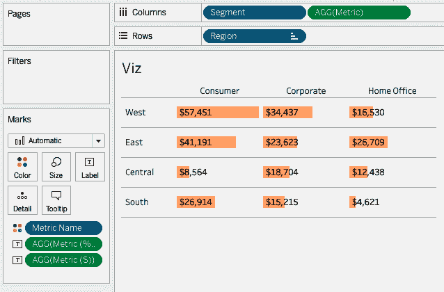
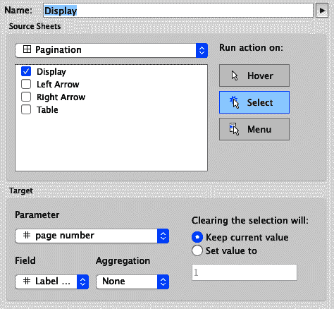
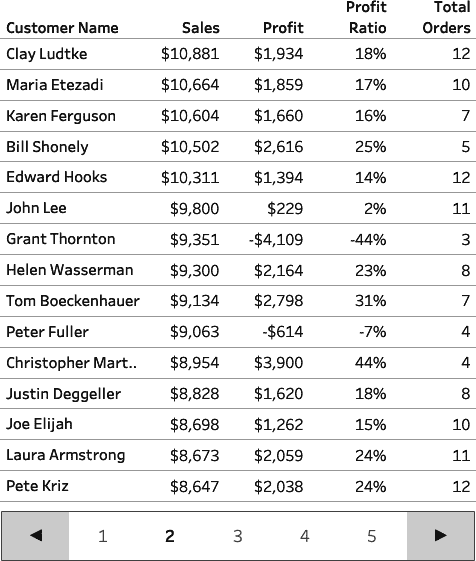

# 第十一章：高级交互

截至目前为止，在本书中，我们已经讨论了使用动作来构建动态可视化（第九章）以及使用数据建模来扩展我们的视觉宇宙（第十章）。动态可视化是我们的受众所期待的。当他们点击一个数值时，他们期望可视化有所反应。

然而，很多时候，我们并没有设计我们的可视化来响应这些动作。作为开发者，我们可以预见我们受众的行为并围绕他们的直觉进行设计。我们可以使用简单数据源的数据建模，以及交互来构建视觉系统。这些系统将看起来像按钮、动态图例甚至是表头。

在本章中，我们将通过向您展示如何构建增强受众使用数据方式的视觉系统，将 Tableau 带入另一个层次。本章不涉及特定行业用例，而是向您展示如何通过结合第九章和第十章的原则来构建高级交互类型。

# 使用参数和参数动作进行表格切换：超级商店案例研究

你再次与办公用品公司合作。你的最终用户希望能够看到三种图表类型：描述销售情况的一种，描述时间内利润率的一种，以及按产品类别显示利润的另一种。你的用户希望一次只看到一个图表。你决定使用参数和表格切换来解决这个问题。

在第九章的第一个策略中，你学会了如何使用参数来更新指标。你也可以使用同一个参数来改变显示的表格，通过在过滤器中使用参数。图 11-1 展示了使用列表参数显示三种图表类型中的一种的示例。


###### 图 11-1\. 使用参数进行表格切换。从左上角顺时针：从参数激活的销售表，从参数激活的利润表，参数中的选项，从参数激活的利润比例表

除了使用下拉选项更新参数（如第九章中讨论的），你还可以在表上使用参数动作来驱动仪表板的变化。图 11-2 展示了这个选项。


###### 图 11-2\. 销售和利润表，来自图 11-1，但使用按钮执行表格交换

如果仪表板空间紧张但仍想以某种方式容纳所有表格，则强烈建议使用表格交换，并使用指标按钮进行操作。

在前三个策略中，您将学习如何创建示例中显示的图 11-2。每个策略将使用“Sample – Superstore”数据集。对于第二个策略，您还需要一个文本编辑器来构建自定义数据集。

## 策略：使用基于参数的表格交换

在此策略中，您将使用参数创建一个表格交换。您将在后续策略中扩展输出：

1.  要构建表格交换的三个可视化效果，请连接到“Sample – Superstore”数据集，然后按照以下步骤操作：

    1.  要构建销售可视化（图 11-3），请将[Sales]的总和添加到行架上。在列架上添加[Order Date]的离散年份。将标记类型更改为条形图。通过将行轴尺规设置为无和列轴尺及刻度设置为黑色来格式化表格。

        

        ###### 图 11-3\. 用于表格交换的销售表

    1.  要构建利润可视化（图 11-4），创建一个新表。将[Profit]的总和添加到行架上。在列架上添加[Order Date]的离散年份。将标记类型更改为面积图。通过将行轴尺规设置为无和列轴尺及刻度设置为黑色来格式化表格。

        

        ###### 图 11-4\. 用于表格交换的利润表

    1.  要构建利润比例可视化（图 11-5），创建另一个新表。将[Profit Ratio]添加到列架上。如果没有此计算，可以创建它：

        ```
        // Profit Ratio
        SUM([Profit])/SUM([Sales])
        ```

        将[Category]添加到行架上。将标记类型更改为条形图。通过将列轴尺规设置为无和行轴尺及刻度设置为黑色来格式化表格。

        

    ###### 图 11-5\. 用于表格交换的利润比例可视化

1.  创建一个名为`**[Names Parameter]**`的字符串参数。创建一个包含三个值的列表：Sales，Profit 和 Profit Ratio，如图 11-6 所示。这些值与您刚创建的三个表格相对应。

    

    ###### 图 11-6\. 用于表格交换的名称参数

1.  将表格和参数放置在仪表板上：

    1.  如果尚未创建仪表板，请创建一个新的仪表板。

    1.  在仪表板上，添加一个垂直容器。

    1.  将名称参数添加到垂直容器中（分析 → 参数 → 名称参数）并隐藏标题。

    1.  在垂直容器内，在名称参数下方添加一个水平容器。

    1.  在水平容器内添加销售、利润和利润率表格。

    1.  隐藏所有表格的标题。如果不这样做，所有的标题将显示出来，技术将无法正常工作。

    不要调整表格的尺寸，因为这会固定任何一张表格的宽度，破坏我们的表格切换。同时，不要均匀分布这些表格在容器中。结果将类似于图 11-7。

    

    ###### 图 11-7\. 在我们的仪表板中，在添加任何筛选器之前进行的表格切换，注意所有的可视化都是活动的。

1.  为每个表格创建筛选计算，如下所示：

    1.  要创建销售参数筛选器，请创建一个名为`**[名称参数 | 销售]**`的计算，并键入以下内容：

        ```
        // Names Parameter | Sales
        [Names Parameter] = "Sales"
        ```

        转到销售表。将参数设置为销售。将[名称参数 | 销售]计算添加到筛选架，并将筛选器设置为 True。

    1.  要创建利润参数筛选器，请创建一个名为`**[名称参数 | 利润]**`的计算，并键入以下内容：

        ```
        // Names Parameter | Profit
        [Names Parameter] = "Profit"
        ```

        转到利润表。将参数设置为利润。将[名称参数 | 利润]计算添加到筛选架，并将筛选器设置为 True。

    1.  要创建利润率参数筛选器，请创建一个名为`**[名称参数 | 利润率]**`的计算，并键入以下内容：

        ```
        // Names Parameter | Profit Ratio
        [Names Parameter] = "Profit Ratio"
        ```

        转到利润率表。将参数设置为利润率。将[名称参数 | 利润率]计算添加到筛选架，并将筛选器设置为 True。

    当返回到你的仪表板时，你会注意到你的仪表板现在只显示单个表格 —— 由你的参数选择的表格（图 11-8）。


###### 图 11-8\. 由于参数设置为销售，销售可视化正在表格切换上显示。

在这个策略中，你学会了如何通过使用参数来进行表格切换。表格切换允许你通过隐藏当前不相关的表格与多个可视化进行交互。尽管这很好，但是我们的观众每次想要切换表格时都需要点击两次。而在一个重视速度和互动性的世界中，将其变成一次点击交互可能更好。

## 策略：使用参数动作表格切换

你将创建一个补充数据源，并使用它来驱动参数动作。然后，使用此数据源创建一个看起来像按钮的表格；这些显示在图 11-2 中。格式设置以及参数动作将使可视化感觉非常互动：

1.  打开你的文本编辑器并创建一个新的数据源：

    ```
    Values
    1
    2
    3
    4
    5
    6
    7
    8
    9
    10
    ```

    使用与第十章中数据建模相同的技术，创建一个具有 10 个数据点的单列称为 Values。技术上，您只需要三个点，但我们喜欢添加更多，以防将来需要更多更新——更好地未来保护。将此文件保存为*values.csv*。

1.  连接到您刚创建的新数据源*values.csv*。

1.  构建此可视化所需的三个计算：

    1.  使用 Values 数据源，创建一个名为`**[Names]**`的计算。这将把整数转换为名称：

        ```
        // Names
        CASE [Values]
        WHEN 1 THEN "Sales"
        WHEN 2 THEN "Profit"
        WHEN 3 THEN "Profit Ratio"
        END
        ```

        此计算将驱动所有我们的参数更新。

    1.  创建一个名为`**[Active Name]**`的计算。此计算将返回一个经过格式化的突出显示名称：

        ```
        // Active Name
        IF [Names] = [Names Parameter]
        THEN [Names]
        END
        ```

    1.  创建一个名为`**[Inactive Names]**`的计算。此计算将返回未被参数名称选中的名称。您还需要格式化此值：

        ```
        // Inactive Names
        IF [Names] != [Names Parameter]
        THEN [Names]
        END
        ```

1.  按以下方式构建可视化：

    1.  创建一个名为`**Name Swap**`的新表。

    1.  将标记类型更改为文本。

    1.  将[Inactive Names]和[Active Name]添加到文本中。

    1.  将[Values]添加为 Marks 卡片上[Inactive Names]和[Active Name]上方的一个维度。

    1.  将[Names]添加到 Marks 卡片上[Active Name]和[Inactive Names]下方。

    1.  编辑文本。将[Inactive Name]和[Active Name]放在同一行上。将[Inactive Names]度量值更改为浅灰色。将[Active Name]度量值字体更改为 Tableau Semibold。在文本后面，添加两个下划线值（`__`），并将下划线颜色设为与可视化背景相匹配的白色。请参见图 11-9 以获取视觉样式。

    1.  关闭工具提示。

        

        ###### 图 11-9。格式化名称交换表上的文本

    1.  将[Values]添加为 Filters 的一个维度，并将范围设置为 1 到 3。

        如果将[Names]参数更改为 Profit，结果是图 11-10。通常情况下，文本标记会非常靠近彼此，但我们使用了两个下划线来在文本之间添加间距。

        

    ###### 图 11-10。在添加格式化后的名称交换表

1.  使用我们在第一个策略中创建的仪表板，在名称参数上方的垂直容器中添加名称交换表。隐藏表的标题，然后从仪表板中删除 Names 参数。调整表的高度以便所有值都清晰可读——大约是 60 像素高。

1.  通过选择仪表板 → 操作，然后选择新操作 → 更改参数来添加新的参数操作。将参数命名为`**Names Update**`。在仪表板上，当您的观众点击名称交换表上的名称时，使用名称维度更新 Names 参数。当他们取消选择时，保留当前值。有关设置的详细信息，请参见图 11-11。

    图 11-12 显示了最终结果。


###### 图 11-11\. Names Parameter 的参数操作


###### 图 11-12\. 我们的参数操作表格交换的最终结果

在这个策略中，你学会了如何创建一个格式良好的工作表，看起来和感觉像一个参数，但—多亏了参数操作—也像一个参数一样工作。

## 策略：自动取消选择标记

最终结果是根据选择的值更新的表格交换。但是还有一个令人讨厌的挑战：每次选择一个值时，这些值会变成蓝色高亮显示。如果你的表格能自动关闭这个选择，那将会很好。通过在跨仪表板和工作表上使用筛选器操作，这可以通过一些 Tableau 的技巧来完成。

这个技巧是我们经常使用的东西。每当我们创建仪表板时，我们都使用这个技巧，因为它使我们的仪表板看起来更像应用程序，而不是商业智能仪表板：

1.  你需要在*values.csv*数据源中创建两个计算：

    1.  创建一个名为`**[TRUE]**`的计算，其值等于真布尔值：

        ```
        // TRUE
        TRUE
        ```

    1.  创建一个名为`**[FALSE]**`的计算，其值等于假布尔值：

        ```
        // FALSE
        FALSE
        ```

    对于这个策略，我们将使用你在“策略：使用参数-操作表格交换”中创建的名称交换表。将[TRUE]和[FALSE]计算添加到标记卡的详细信息中。

1.  转到包含你用于表格交换操作的名称交换表的仪表板。选择仪表板 → 操作。在对话框中，点击添加操作 → 筛选器。

    将你的筛选操作命名为`**Names Reset**`。从你的仪表板中选择名称交换表。在我们的示例中，显示在图 11-13 中，我们的仪表板称为仪表板操作。将“运行操作”设置为选择。

    从这里开始，你需要将目标表格从仪表板更改为表格本身。这是一个关键步骤。如果你在仪表板上运行操作，操作将不起作用。设置你的筛选器以在清除选择时显示所有值。

    在最后的“目标筛选器”部分，选择添加筛选器，然后将源字段设置为 TRUE，目标字段设置为 FALSE。点击确定，然后在操作菜单上也点击确定。


###### 图 11-13\. 名称交换表在来自名称交换表本身的仪表板上的筛选操作

最终结果是通过按钮驱动的表格交换。但是在按下按钮后，表格不再突出显示；参见图 11-14。


###### 图 11-14。没有筛选动作取消标记的参数动作（左）和自动取消标记的参数动作（右）

# 使用参数和参数动作创建多选参数：Superstore 案例研究

当我们使用参数和参数动作时，我们首先会认为它们只能用于从列表中选择一个值。但是参数也可以用作存储信息的输入。我们可以通过将参数与视图上的维度写回到同一个参数来实现这一点。

再次，您的观众希望看到更多的图表——这一次是按州的销售业绩分析。他们还希望您允许按段落进行分析。通常情况下，您可以使用多选过滤器，但他们表示希望有更多的交互性。在这个策略中，您将学习如何使用参数作为输入工具。

例如，考虑右侧的可视化效果在图 11-14 中。可视化效果包含[Category]作为一个维度。想象我们有一个值包含 Furniture 的参数，我们可以更新它，但我们希望更新后的值变成 Furniture, Office Supplies 或 Furniture, Technology。我们可以通过创建一个包含该类别参数的计算来实现。这个计算可能会是这样的：

```
// Hypothetical Calculation
[Parameter] + ", " + [Category]
```

我们可以利用这种假设性的计算反馈到同一个参数中去。这个过程可以在不丢失参数现有信息的情况下，向参数中添加信息。

Tableau 名人堂禅宗大师 Jonathan Drummey 在一篇详细的文章中详细介绍了这个过程，该文章链接在“Further Reading”中。

为什么需要多选参数？嗯，参数只允许单一输入，并且这些输入的格式非常固定。对于参数，您可以选择下拉菜单、开放字段、滑块或单选按钮选择器，如图 11-15 所示。但有时您需要更多。有时您的观众需要定制。


###### 图 11-15。Tableau Desktop 中现有的参数显示选项

## 策略：创建一个多选参数

在这个策略中，你的任务是创建一个允许多选的参数。在可视化效果中，你将有可用的开关值，这些开关将过滤你创建的另一个表格。虽然这是参数作为数据源的一个用例，但还有很多很多用例，我们在“Further Reading”中提供链接。

对于这个策略，您将使用 Sample – Superstore 数据集。想象一下，您是一个负责南部地区的分析师，任务是为销售代表团队提供动态表格，审查第一季度销售情况。不幸的是，这些销售代表对技术不是很精通，使用下拉菜单有困难。他们希望有一个快速的方法来切换多个值的开关。您的解决方案如图 11-16 所示。


###### 图 11-16\. 自动取消选择标记策略的最终解决方案

要构建此解决方案，您需要按照以下步骤进行操作：

1.  构建一个基础可视化(图 11-17)如下：

    1.  将[State]添加到行架上。

    1.  将[测量名称]添加到列中。

    1.  将[测量值]添加到过滤器中。选择[销售]总和，[利润]总和和[利润率]。

    1.  将标记类型更改为正方形。

    1.  将[测量值]添加到文本和颜色中。

    1.  右键单击用于颜色的[测量值]并选择使用单独的图例。

    1.  使用“策略：使用基于参数的表交换”中描述的过程将[销售]和[利润]的颜色设置为白色。

    1.  将[利润率]的颜色设置为金绿色。

    1.  为南部地区添加一个过滤器。

    1.  将[Order Date]添加到过滤器中，更改为季度作为日期部分，并过滤为 Q1。

    1.  按[Profit Ratio]对[State]进行降序排序。

        

    ###### 图 11-17\. 在添加任何基于参数的过滤器之前的基础可视化

1.  创建一个字符串参数，但称为`**[MultiParam]**`。删除“当前值”文本框中的任何值，并允许来自我们数据源的所有值(图 11-18)。通过保持参数为空，我们目前不会选择任何值。

    

    ###### 图 11-18\. 空的多选参数

1.  对于此示例，您将使用[Segment]维度来驱动参数操作。但是为了这样做，您需要构建一个可视化，如图 11-19 所示。首先创建一个名为`**选择段**`的新表。

    1.  将[Segment]添加到行架上。

    1.  双击列架并输入`**MIN(0.0)**`。再次双击并创建另一个 MIN(0.0)的临时计算。

    1.  将左侧 MIN(0.0) Marks 卡片上的标记类型更改为自定义形状。将自定义形状更改为开放圆圈。

    1.  将右侧 MIN(0.0) Marks 卡片上的标记类型更改为圆形。将不透明度更改为 40%。这将为图 11-19 中显示的开放气泡效果添加[Segment]维度到标记卡的标签。

        

        ###### 图 11-19\. 用于驱动参数更新的工作表。在此示例中，Consumer 和 Corporate 分段处于活动状态。

    1.  创建一个同步的双轴。编辑轴以从–1 到 10 的范围。然后隐藏轴线。

    1.  从颜色中移除[Measure Names]。隐藏[Segment]的标题。将行和列的分隔符设置为无。将零线、网格线和轴标尺设置为无。可能需要调整形状的大小。最后，关闭工具提示。

        图 11-20 展示了到目前为止的进展。

        

    ###### 图 11-20\. 第 3 步后的选择分段表

1.  创建如下计算，用于识别成员是否在参数中：

    1.  创建名为`**[On/Off]**`的计算。这个计算是一个布尔值，使用`CONTAINS()`函数查找[MultiParam] 参数中的[Segment] 成员——目前该参数为空！

        ```
        // On/Off
        CONTAINS([MultiParam], [Segment] + ", ")
        ```

    1.  将此计算添加到两个标记卡的颜色中。

    1.  展示[MultiParam]参数，并输入`**Consumer,**`（逗号后带有一个空格）。这将激活 Consumer 并更改颜色。然后添加到参数中`**Corporate,**`（逗号后也有一个空格）。这将激活 Consumer 和 Corporate。

    1.  编辑颜色，将 True 值设置为绿色，将 False 值设置为暖灰色。

1.  创建`**[Param Action]**`计算，用于驱动选择/取消选择操作。我们将此计算应用于参数操作：

    ```
    // Param Action
    IF CONTAINS([MultiParam], [Segment] + ", ")
    THEN REPLACE([MultiParam], [Segment] + ", ", "")
    ELSE [MultiParam] + [Segment] + ", "
    END
    ```

    如果[Segment]的成员在[MultiParam]参数中，则该计算将移除该值。如果不在参数中，则会将该值添加到 MultiParam 字符串中。

    将此计算添加到选择分段表的所有标记卡的详细信息中。

1.  根据“策略：自动取消选择标记”的第 1 步，创建[TRUE]和[FALSE]计算。将这些计算添加到标记卡的详细信息中。您的可视化现在应该与图 11-18 相匹配。

1.  将可视化内容和选择分段表添加到仪表板中。隐藏两个仪表板的标题。

1.  设置参数操作，以便在参数表上选择数值时，MultiParam 表会根据[Param Action] 计算进行更新；参见图 11-21。

    

    ###### 图 11-21\. MultiParam 参数的参数操作

1.  按照“策略：自动取消选择标记”的第 2 步进行操作，这样一点击，标记就会从选择分段表中取消选择；参见图 11-22。

    

    ###### 图 11-22\. 自动取消选择标记的过滤操作

    您的参数动作现在正常工作，但需要更新您的表格工作表以应用来自多参数的过滤器。在表可视化中添加开/关并选择 True。现在您已经构建了交互式的视觉系统（图 11-23）。

在这个策略中，您学会了可以将参数用作数据源，通过将参数应用回自身。存储和添加参数值可以使可视化具有严肃的交互性。


###### 图 11-23\. 多选参数策略的最终解决方案

# 使用参数动作交换指标：办公室必备案例研究

参数和参数动作非常强大。如前一策略所示，您可以使表格看起来像参数，并像参数一样操作。您还可以使表格看起来像按钮，具有比 Tableau 基本功能更强大的功能。

您的观众喜欢您展示的互动性。因此，他们现在希望通过使用按钮来滚动浏览各种指标。这次，您决定使用单独的表格看起来像按钮，并提供您的观众所需的互动性（图 11-24）。


###### 图 11-24\. 使用表格作为按钮

在这种情况下，假设您是一名用户体验设计师，致力于为客户构建先进的界面。您希望一次显示一个指标，但有四个指标要显示。您决定创建自己的选项旋转木马。

## 策略：使用表格作为按钮

在这个策略中，您将创建按钮，这些按钮将更改参数并更新度量：

1.  创建一个名为`**[Select Metric]**`的整数参数，并选择一个值列表。输入与指标数量相同的值。在本例中，我们交换四个指标：总销售额、总利润、利润率和每笔订单的总销售额。在值中，键入 1 到 4，如图 11-25 所示。更新显示为列表，显示这四个指标的名称。

    

    ###### 图 11-25\. 步骤一的整数参数

1.  创建以下基础可视化计算：

    1.  创建一个名为`**[Metric]**`的计算。我们将使用四个指标来匹配我们的四个参数值：

        ```
        // Metric
        CASE [Select Metric]
        WHEN 1 THEN SUM([Sales]) //Total Sales
        WHEN 2 THEN SUM([Profit]) //Total Profit
        WHEN 3 THEN SUM([Profit])/SUM([Sales]) //% Margin
        WHEN 4 THEN SUM([Sales])/COUNTD([Order ID]) // $ per order
        END
        ```

    1.  我们的可视化包含百分比和美元总额。因为无法更改格式，所以需要创建一个专门用于显示美元的维度。复制并编辑计算。将名称更改为`**[Metric ($)]**`，并更新计算：

        ```
        // Metric ($)
        CASE [Select Metric]
        WHEN 1 THEN SUM([Sales]) //Total Sales
        WHEN 2 THEN SUM([Profit]) //Total Profit
        WHEN 4 THEN SUM([Sales])/COUNTD([Order ID]) // $ per order
        END
        ```

        编辑 [Metric ($)] 的默认格式设置为美元，不带小数。

    1.  通过复制和编辑计算来构建百分比标签。将名称更改为`**[Metric (%)]**`，并按以下方式更新：

        ```
        // Metric
        CASE [Select Metric]
        WHEN 3 THEN SUM([Profit])/SUM([Sales]) //% Margin
        END
        ```

        编辑[Metric (%)]的默认格式，使其成为无小数的百分比。

    1.  通过创建一个名为`**[Metric Name]**`的计算来创建将指标与参数绑定的标签：

        ```
        // Metric Name
        CASE [Select Metric]
        WHEN 1 THEN "Total Sales"
        WHEN 2 THEN "Total Profit"
        WHEN 3 THEN "Percent of Margin"
        WHEN 4 THEN "Sales per Order"
        END
        ```

1.  构建您的基本可视化，显示在图 11-26 中：

    1.  创建一个名为`**Viz**`的表。

    1.  将[Segment]和[Metric]添加到列中。

    1.  将[Region]添加到行中。

    1.  将[Metric (%)]和[Metric ($)]放在文本上并左对齐文本。

    1.  格式化您的可视化，关闭行条纹但添加行分隔符。

    1.  增加行之间的间距，并将条形的大小更改为行高总大小的约 60%。

    1.  将[Metric Name]添加到颜色，并将不透明度设置为 40%。

    1.  关闭工具提示。

        

    ###### 图 11-26\. 我们将使用参数值更新的基本可视化

1.  创建一个名为`**Left**`的新左箭头表。

    1.  创建一个名为`**[Left]**`的计算来创建标签：

        ```
        // Left
        "◄"
        ```

        将计算添加为文本的维度。

    1.  创建一个名为`**[Subtract Value]**`的计算，以更新您的[Select Metric]参数：

        ```
        // Subtract Value
        IF [Select Metric] = 1
        THEN 4
        ELSE [Select Metric] - 1
        END
        ```

        将计算添加到详细信息中。

    1.  根据“策略：自动取消选择标记”中的步骤 1，将[TRUE]和[FALSE]添加到详细信息中。

    1.  从可视化中删除工具提示，将轴尺、网格线、零线和分隔线设置为无。

1.  创建一个名为`**Right**`的新右箭头表。

    1.  通过调用计算`[Right]`创建右箭头标签：

        ```
        // Right
        "►"
        ```

        将计算添加到文本中。

    1.  创建一个名为`**[Add Value]**`的计算以更新您的[Select Metric]参数：

        ```
        // Add Value
        IF [Select Metric] = 4
        THEN 1
        ELSE [Select Metric] + 1
        END
        ```

        将计算添加为详细信息的维度。

    1.  根据“策略：自动取消选择标记”的步骤 1，将[TRUE]和[FALSE]添加到详细信息中。

    1.  从可视化中删除工具提示，并将轴尺、网格线、零线和分隔线设置为无。

    左右表的结果显示在图 11-27 中。

    

    ###### 图 11-27\. 用于表分页策略的左右表

1.  如下所示创建文本显示表，显示在图 11-28 中：

    1.  创建一个名为`**[Metric Name]**`的表。

    1.  将[Metric Name]添加到文本，并对齐到中间中心。

    1.  将[Metric Name]添加到颜色中。

    1.  关闭工具提示。

    1.  格式化您的可视化，删除任何线条或分隔符。

    1.  更新颜色（可选）。

        

    ###### 图 11-28\. 添加到表之前的指标名称表

1.  构建您的仪表板：

    1.  创建一个新的仪表板；例如，我们使用的是 400 × 300。

    1.  在仪表板上添加垂直容器。

    1.  将 Viz 添加到垂直容器内的仪表板中。同时删除自动添加的任何图例或参数。

    1.  在垂直容器中，在 Viz 上方添加一个水平容器。在容器周围添加浅灰色边框。将容器的高度设置为 40 像素。

    1.  将左侧、度量名称和右侧表格添加到水平容器中。隐藏所有标题。适当排序并去除每个表格的填充。

    1.  将左侧和右侧表格的宽度固定为 40 像素。

    1.  将 [度量名称] 的背景格式设置为比背景略深的颜色。

1.  您需要为左侧和右侧箭头表格添加参数操作：

    1.  在左侧表格中，通过使用 [减去值] 来更新 [选择度量] 参数；参见 图 11-29。

        

        ###### 图 11-29\. 减去值参数操作

    1.  在右侧表格中，通过使用 [添加值] 计算来更新 [选择度量] 参数；参见 图 11-30。

        

    ###### 图 11-30\. 添加值参数操作

1.  对于左侧和右侧表格，按照 “策略：自动取消选择标记” 的第二步操作来关闭标记选择。

    图 11-31 展示了最终的可视化效果。


###### 图 11-31\. 表格作为按钮策略的最终可视化效果

在这个策略中，您学习了如何将表格转换为交互式组件，以帮助驱动仪表板上的变化。这是通过参数和参数操作完成的。当您增加标记取消选择功能时，仪表板从商业智能工具转变为全功能应用程序。

# 为表格添加分页和参数，参数操作：Superstore 案例研究

在先前的策略中，我们介绍了使用页面作为按钮的概念。虽然这可能是一个小事情，但我们认为这解锁了我们仪表板设计的许多惊人可能性。在下一个策略中，您将学习如何添加表格分页并构建适合分页的 UI。

毫无疑问，您通过增加到仪表板的惊人互动性赢得了观众的青睐。但现在，您被分配了迄今为止最困难的任务：CEO 要求您构建可以以她想要的速度运行的表格。挑战在于仪表板由于标记过多而渲染速度慢。解决方案是：创建一个带有任何网页开发者都会羡慕的 UI 的分页。

有时候我们在 Tableau 中的表格太长了，有时候我们想要将表格合并成一个单独的表格。我们可以通过分页来实现这一点！当你思考这个问题时，你会发现，我们在网页上与之交互的大多数表格都有分页；这是一个微妙的暗示，作为开发者，我们应该设计带有分页的表格。图 11-32 展示了一个示例。


###### 图 11-32\. 表格的分页示例及其他自定义功能的示例

在下一个策略中，您的任务是构建一个具有分页功能的表格。您将需要显示每位客户的总销售额、总利润、利润比率和总订单数。此外，您的团队已同意，在您的仪表板上唯一显示的滚动条应该是 Web 浏览器上的滚动条。因此，您的仪表板不应有任何滚动条。

您的任务是构建一个可视化界面，每次显示 15 位客户的详细信息，并提供导航箭头和交互式页面计数器。您将使用 Sample – Superstore 数据集完成这一任务。您将在图 11-33 中重新创建表格和可视化组件。


###### 图 11-33\. 表格分页策略的输出

## 策略：添加表格分页

这种策略需要四张表：一张用于表格，一张用于数字显示，一张用于左箭头，一张用于右箭头。您将从表格开始设置，然后转移到箭头，最后创建显示：

1.  连接到 Sample – Superstore 数据集。

1.  建立基础表格：

    1.  将[客户名称]添加到行中。

    1.  按照[客户名称]的销售总额降序排序。

    1.  如果没有，请创建一个名为`**[利润比率]**`的计算：

        ```
        // Profit Ratio
        SUM([Profit])/SUM([Sales])
        ```

    1.  创建一个名为`**[总订单数]**`的计算：

        ```
        // Total Orders
        COUNTD([Order ID])
        ```

    1.  将[度量名称]添加到列中。

    1.  将[度量值]添加到文本中。在[度量值]标记卡上放置 SUM(Sales)、SUM(Profit)、利润比率和总订单数。

    1.  删除行间隔和所有线条，只保留行分隔线。

    1.  格式化客户名称，使其与表格中的文本字体样式匹配。如图 11-34 所示，在这个阶段表格的样子。

    

    ###### 图 11-34\. 添加分页前的表格

1.  创建一系列参数，用于驱动表格的变化：

    1.  创建一个名为`**[显示行数]**`的整数参数，用于指示要显示的行数（参见图 11-35）。例如，你可以指定为 15，但稍后可以更改。

        

        ###### 图 11-35\. 设置显示行数参数

    1.  在此过程中，同时创建一个名为`**[页码]**`的第二个参数，用于指示页码。将参数中的整数设为 1，并确保允许所有值，如图 11-36 所示。

        

        ###### 图 11-36\. 设置页码参数

    1.  创建一个名为`**[Customer Name | Index]**`的计算。此函数只是应用`INDEX()`函数来对客户进行排序和排名：

        ```
        // Customer Name | Index
        INDEX()
        ```

        此计算对于构建其他计算非常方便。

        ###### 小贴士

        而不是在计算中硬编码值（如要显示的总行数），请使用参数。这将允许您快速更改数值，而无需打开计算。

    1.  您的下一个计算称为`**[Page | Customer Name | Index]**`。这将计算应显示在哪一页的行：

        ```
        // Page | Customer Name | Index
        ((([Customer Name | Index] - 1) - (([Customer Name | Index] - 1)
          % [rows to show]))/[rows to show]) +1
        ```

    1.  现在，您只需创建一个计算来显示应显示的页面。根据页面参数创建一个基于布尔值的计算，称为`**[Page Number | TF]**`：

        ```
        // Page Number | TF
        [Page | Customer Name | Index] = [page number]
        ```

    1.  将[Page Number | TF]添加到表格工作表的筛选器中，并选择 True。现在您将看到来自第 1 页的 15 行。这基于显示行和页码参数。这留下了您在图 11-37 中看到的可视化效果。

    

    ###### 图 11-37\. 添加页面号码筛选后的表格

    现在您的表格上的筛选器已经工作，您唯一需要做的是通过箭头或页面显示更新参数！

1.  首先创建名为`**Left Arrow**`的新表格：

    1.  创建一个特设计算，并将◄添加到文本中。将文本对齐到中心中间。将字体设置为 Arial，并将大小更改为 12。

    1.  创建一个名为`**[Page | -]**`的计算。此计算将从页面编号的值中减去一个值，除非您已达到最低编号：

        ```
        // Page | -
        IF [page number] = 1
        THEN 1
        ELSE [page number] - 1
        END
        ```

        将[Page | -]添加到标记卡的详细信息中。

    1.  从“策略：自动取消选择标记”的第 1 步开始，将[TRUE]和[FALSE]计算添加到详细信息中。

    1.  关闭左箭头工作表的工具提示。将任何行或行分隔线设置为无。

1.  通过创建名为`**Right Arrow**`的新表格来构建右箭头：

    1.  创建一个特设计算，并将►添加到文本中。将文本对齐到中心中间。将字体设置为 Arial，并将大小更改为 12。

    1.  创建一个名为`**[Page | +]**`的计算。此计算将在页面编号的值上加 1，除非您已达到最大页数：

        ```
        // Page | +
        IF [page number] = FLOOR({COUNTD([Customer Name])}/[rows to show]) +1
        THEN FLOOR({COUNTD([Customer Name])}/[rows to show]) + 1
        ELSE [page number] + 1
        END
        ```

        将[Page | +]添加到标记卡的详细信息中。

    1.  根据“策略：自动取消选择标记”的第 1 步骤，添加[TRUE]和[FALSE]计算到详细信息中。

    1.  关闭右箭头工作表的工具提示。将任何行或行分隔线设置为无。结果如图 11-38 所示。

        

    ###### 图 11-38\. 在完成步骤 4 和 5 后的左箭头和右箭头表格

1.  页面导航器是仪表板上最复杂的组件。您需要显示选定的页面、周围的页面，并使其交互。此外，选定的页面可能并不总是位于五个页面列表的中间，因此我们需要确保能在正确的时间突出显示正确的页面：

    1.  开始一个名为`**Display**`的新表。将[客户名称]添加到标记卡的详细信息中。按销售总额降序排序。

    1.  将[客户名称 | 索引]添加到列中。将测量值更改为离散。编辑表计算，选择特定维度，选择客户名称。使用自定义排序，并选择按销售总额降序排列。

        这意味着我们的分页将基于销售总额！每个索引值都是一个[客户名称]，按销售总额排序。

    1.  创建一个名为`**[Label Page Number Active]**`的计算：

        ```
        // Label Page Number Active
        IF [Page Number | TF]
        THEN [page number]
        END
        ```

        将此计算添加到标签中。确保计算是离散的。这将仅显示活动页面。最终我们将格式化此文本。编辑嵌套表计算的表计算；选择特定维度并选择客户名称。务必对这两个计算都执行此操作。

    1.  创建一个名为`**[Label Page Number Inactive]**`的计算：

        ```
        // Label Page Number Inactive
        IF NOT [Page Number | TF]
        THEN [Page | Customer Name | Index]
        END
        ```

        将此计算添加到文本中。如第 6c 步中那样，编辑嵌套表计算的表计算；选择特定维度并选择客户名称。务必对这两个计算都执行此操作。

    1.  单击以编辑文本。将两个尺寸放在同一行。对于[Label Page Number Not]，选择较浅的灰色，Tableau Book，大小 12\. 对于[Label Page Number]，选择黑色，Tableau Semibold，大小 12\. 文本应类似于图 11-39。

        格式化[Label Page Number Active]和[Label Page Number Inactive]以显示为整数。

        

        ###### 图 11-39\. 页面数字的文本

        这将留下您在图 11-40 中看到的结果。

        

        ###### 图 11-40\. 第 6e 步后的分页显示

    1.  从“策略：自动取消选中标记”的第 1 步，将[TRUE]和[FALSE]计算添加到详细信息中。

    1.  [客户名称 | 索引] 显示所有客户，但我们实际上不需要显示所有客户。我们只需要显示每页的第一个客户。因为最后一页可能只包含那一个单独的客户，这样做是最好的。

        编写名为`**[Page n | 0]**`的以下公式：

        ```
        // Page n | 0
        ([Customer Name | Index] % [rows to show]) - 1
        ```

        将[Page n | 0]转换为离散值并放置在筛选器上。编辑筛选器的表计算。选择特定维度和客户名称。编辑筛选器以从筛选器选项中选择 0。这将导致图 11-41 中的可视化效果。

        

        ###### 图 11-41\. 在添加筛选器仅显示每页第一个成员后的分页显示

    1.  最后这部分是最难的。您需要知道显示哪些页面。这是关于设置范围：一个下界和一个上界。您将通过两个计算来完成：

        创建`**[阈值 | bottom]**`计算：

        ```
        // threshold | bottom
        IF [page number] < 3
        THEN 1
        ELSEIF [page number] > FLOOR({COUNTD([Customer Name])}/[rows to show]) - 1
        THEN FLOOR({COUNTD([Customer Name])}/[rows to show]) - 3
        ELSE [page number] - 2
        END
        ```

        并创建一个`**[阈值 | top]**`计算：

        ```
        // threshold | top
        IF [page number] > FLOOR({COUNTD([Customer Name])}/[rows to show]) - 1
        THEN FLOOR({COUNTD([Customer Name])}/[rows to show]) + 1
        ELSEIF [page number] < 3
        THEN 5
        ELSE [page number] + 2
        END
        ```

        为了方便，建立一个单一计算来定义上下界，并称该计算为`**[阈值 | tf]**`：

        ```
        // threshold | tf
        [Page | Customer Name | Index] >= MIN([threshold | bottom])
        AND
        [Page | Customer Name | Index] <= MIN([threshold | top])
        ```

        将[阈值 | tf]添加到 Filters shelf。编辑表格计算，选择特定维度，并选择客户名称。然后编辑筛选器并选择 True。

    1.  现在您只需通过移除行分隔线和隐藏标题来格式化。将文本对齐到中间。关闭工具提示。您的可视化应该类似于图 11-42。

    

    ###### 图 11-42\. 完成第 6 步后我们的分页显示

1.  构建仪表板：

    1.  创建一个新的仪表板，并将大小设置为宽 400，高 500。

    1.  在仪表板中添加一个垂直容器。

    1.  将表格添加到容器中，并使表格适应整个视图。

    1.  在垂直容器中的表格下方添加一个水平容器。

    1.  将左箭头、显示和右箭头添加到容器中。将所有对象设置为适应整个视图。隐藏表格的标题。

    1.  移除与三个表格相关的所有内部和外部填充。

    1.  在容器周围设置边框。

    1.  固定容器的高度为 40。

    1.  固定左右箭头的宽度为 40。

    1.  为每个箭头添加背景颜色。您的仪表板应类似于图 11-43。

        

    ###### 图 11-43\. 第 7 步后的分页仪表板

1.  添加到左箭头、显示和右箭头的仪表板操作：

    1.  从您的仪表板中选择仪表板 → 操作 → 添加操作 → 更改参数。选择 Pagination 仪表板中的 Left Arrow 表，并使用[Page | -]计算，在选择时不进行聚合，如图 11-44 所示。

        

        ###### 图 11-44\. 表格分页的左箭头参数操作

    1.  从 Pagination 仪表板中选择 Right Arrow 表，并使用[Page | +]计算，在选择时不进行聚合，如图 11-45 所示。

        

        ###### 图 11-45\. 表格分页的右箭头参数操作

    1.  参数操作将用于显示。使用[标签页码未激活]在选择时无聚合地更新页码参数，如图 11-46 所示。

        

    ###### 图 11-46\. 表格分页的页面显示操作

1.  创建三个单独的筛选操作，分别用于每张表：左箭头、右箭头和页面显示。按照“策略：自动取消选择标记”的第 2 步为每张表应用筛选操作。最终结果显示在图 11-47 中。



###### 图 11-47\. 表格分页策略的第 2 页

在这种策略中，您学到了如何通过参数操作连接表格和参数。它帮助解锁了使用基本 Tableau 无法实现的增强型 UI。

这种用例的一个精彩扩展是将刚刚创建的相同计算应用于具有相同行维度但显示不同可视化的第二张表。使用相同的[页码 | TF]计算，您可以同步显示数值。事实上，稍作格式化，您可以使其看起来像是一个单一的，统一的可视化。

例如，在图 11-48 中，我们添加了按类别销售的柱状图。通过应用相同的排序和筛选条件，我们能够将这两张表放在一个容器中显示，看起来就像是一个统一的表。

这种方法有一些缺点：您必须保留固定的排序。只要您的用户知道这一点，这是可以接受的。这意味着您需要关闭我们的排序控件。您可以从顶部菜单逐张地选择工作表，然后取消选中“显示排序控件”。


###### 图 11-48\. 当您使用分页时，两张格式良好的表可以创建看起来像单个可视化的内容

这就是分页的威力。当您可以同步几张表时，您可以开始逐层添加多个形状像表格一样的视觉组件，但实际上是复杂的仪表板，提供简明和信息丰富的见解。

# 创建动态的、单击即可进行深入研究：超级商店案例研究

对于本章的大部分内容，我们使用参数和参数操作来驱动仪表板的变化。参数只是可用于构建交互式、动态视觉系统的几种仪表板操作中的一种。在本章的最终策略中，您将构建动态的钻取功能，允许您的受众同时进行过滤和导航。例如，在您的表格中 Figure 11-47，您的受众可能对 Clay Ludtke 订购的特定产品有疑问。

在本章中，您设计了一些令人惊叹的数据产品，但现在您的受众希望能够钻取到每个客户的订单详情。在这个策略中，我们将向您展示在处理表格时用于满足受众需求的技术。

典型的分析师可能会说：转到另一个仪表板，然后从单独的筛选器中选择 Clay Ludtke。但是您可以通过单击现有仪表板上的一个按钮来执行此操作，从而使您的受众保持无缝体验。Figure 11-49 展示了一个示例。


###### 图 11-49。顶级可视化（左）和点击 Clay Ludtke 客户后的产品级详细信息（右）

## 策略：构建钻取交互性

在这个策略中，您将构建两个仪表板：一个显示顶级客户信息，作为我们仪表板的顶层，另一个显示客户订单的详细信息。这两个仪表板都不会显示可见的筛选器，但我们将使用一系列操作，允许您的受众转移到并自动过滤产品级仪表板，然后只需两次点击返回主仪表板：

1.  连接到 Sample – Superstore 数据集。

1.  通过创建名为`**Table**`的新工作表来构建顶级可视化。

    1.  根据“策略：添加表格分页”第 2 步，创建[TRUE]和[FALSE]计算。

    1.  通过创建名为`**[Detail]**`的新计算来添加箭头：

        ```
        // Detail
        1
        ```

    1.  将[Detail]拖入[Measure Values]标记卡中。右键单击 SUM(Detail)并选择格式。在数字格式化下，选择自定义，然后键入“►”。这将使所有值变为右箭头。

    1.  根据“策略：自动选择标记”第 1 步，创建`**[TRUE]**`和`**[FALSE]**`计算。将这些计算添加到标记卡的详细信息中。

1.  通过创建一个名为`**Top Level**`的 700 × 800 仪表板来构建您的顶级仪表板。将表格添加到您的仪表板中。您的仪表板应如 Figure 11-49 中左侧的图像所示。

1.  构建您的详细级别可视化。创建两张表，一张称为`**Map**`，另一张称为`**Product**`：

    1.  对于详细视图中显示的地图表，如 图 11-50，执行以下操作：

        +   将 [城市] 和 [州] 添加到详细信息中。这应该生成纬度和经度，并创建地图。

        +   将 [销售额] 添加到标记卡上的大小和标签。

        +   将 [客户名称] 添加到标记卡的详细信息中。

        +   编辑地图表的标题，并替换为 [客户名称] 维度。

            

        ###### 图 11-50\. 我们详细视图的地图表

    1.  对于详细视图中显示的产品表，如 图 11-51，执行以下操作：

        +   将 [产品名称] 添加到行中。

        +   将 [测量名称] 添加到列中。

        +   将 [测量值] 添加到文本中。

        +   筛选 [测量名称] 以仅显示 SUM(Sales)、SUM(Profit) 和 Profit Ratio。

        +   编辑地图表的标题，并替换为 [客户名称] 维度。

            

    ###### 图 11-51\. 我们详细视图的产品表

1.  构建你的顶层仪表板：

    1.  创建一个 700 × 800 的仪表板，名为 `**详细级别**`。

    1.  添加一个垂直容器。

    1.  将你的地图和产品表添加到垂直容器中。

    1.  将地图的高度设置为 400。

    1.  在地图上方添加一个水平容器。

    1.  在水平容器中，添加一个文本框，键入 `**客户详细**`。将字体更改为 Tableau Bold，大小为 15。

    1.  在水平容器中，客户详细文本右侧添加一个导航对象。

    1.  编辑导航按钮。导航到你在步骤 3 中创建的顶层仪表板。将标题编辑为 `**返回**`。将文本颜色改为黑色，背景改为无。这样可以使你的观众回到顶层时具有互动性。

    1.  编辑水平容器的高度，并将其设置为 50\. 到此时，你的仪表板应该类似于 图 11-52。

        

    ###### 图 11-52\. 显示所有客户的详细仪表板

1.  目前你的详细仪表板上的两个可视化图表没有按客户进行筛选。你需要通过使用一个设置参数来添加这个功能：

    1.  前往地图表。在数据选项卡上，右键单击客户名称，选择创建 → 集合。命名集合为 `**客户名称集合**`，选择第一个客户，Aaron Bergman。然后点击确定。

    1.  转到地图工作表。将 [客户名称] 集合拖动到筛选架上。重复操作以添加到产品工作表。

1.  通过在工作表上添加三个操作（设置操作以筛选到特定客户，转到操作以进入详细工作表，以及筛选操作以自动取消选择标记），为你的顶层仪表板增加互动性。在顶部菜单中，选择仪表板 → 操作。

    1.  在“操作”菜单中，选择“添加动作” → “更改集合值”。根据图 11-53，从顶层仪表板选择“Table”表。选择后，更新客户名称集合。当您选择时，分配值给集合。清除时，将所有值添加到集合中。点击“确定”。

    

    ###### 图 11-53. 顶层仪表板上的客户名称设置动作

    1.  在“操作”菜单中，选择“添加动作” → “转至仪表板”。从顶层仪表板选择“Table”表。然后将详细仪表板选择为目标仪表板（参见图 11-54）。

        

    ###### 图 11-54. 顶层仪表板的转至仪表板动作

    最后，在“Table”表上添加一个过滤动作。请参照“策略：自动取消选定标记”的第 2 步，为每张表应用过滤动作。

    结果是三个动作同时发生。设置动作选择集合中的客户。这会过滤详细仪表板上的表格。转到仪表板动作让您的观众一键转至详细仪表板。而过滤动作则重置标记，这样当您的观众从详细仪表板返回顶层仪表板时，不会高亮显示任何标记。

    测试交互性，通过点击顶层仪表板上的箭头之一。这将直接将您导航至详细仪表板，显示关于特定客户的具体详情。查看完客户信息后，点击“返回”即可返回顶层仪表板。

    在此策略中，您在同一张表上应用了多个仪表板动作。通过这样做，您能够构建一个观众可以轻松导航的直观数据产品。

# 结论

在本章中，您以多种方式使用了参数。在第一种策略中，您使用参数和过滤器创建了一种称为表格交换的操作。

无论是展示一个微妙的技巧，将“按钮”与辅助数据源连接起来，从而驱动参数选择和表格交换，还是展示如何使用参数作为数据源并存储数值，本章突显了 Tableau 的一些最佳特性。

这一章，或许比其他任何章节都更集成了 Tableau 的几个关键功能。这些功能要求您使用多个工作表，并以一种使它们看起来像单一组件的方式进行格式化。虽然它们看起来很简单，但您会发现构建这些交互式系统需要时间。尽管花费了一些时间，但它们为您的受众提供了使用仪表板时更加流畅的体验。这非常重要；作为开发者，我们的工作是付出额外的努力，以便让我们的受众能够拥有高效的工作体验。我们能够让流程更加流畅，他们就能更快地获得关键的见解，与数据进行互动，并持续使用产品。

在下一章中，我们将继续通过探索仪表板设计来构建交互式组件。

# 进一步阅读

+   阅读[“参数操作：将参数用作数据源”](https://oreil.ly/4yhsu)，作者是乔纳森·德鲁米。

+   想要学习如何创建像图 11-47 中显示的示例表格，请阅读[卢克·斯坦克的汇编](https://oreil.ly/ynlWM)。

+   如果你想创建可搜索的参数和过滤器，请阅读[林赛·波尔特的文章](https://oreil.ly/DCp1X)。

+   要了解创建交互式图例的方法，请阅读[卢克·斯坦克的文章](https://oreil.ly/8oGtX)。

+   想要了解关于同步滚动的信息，请阅读[卢克·斯坦克的文章](https://oreil.ly/4qb6B)。
