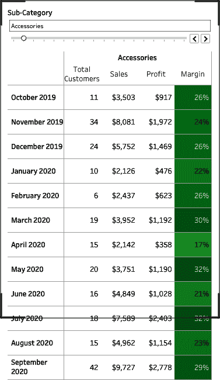

# 第十二章：构建仪表板和数据产品

在大部分的书中，我们专注于创建各种图表类型。在本章中，我们将把重点从创建图表类型转移到构建和开发对我们观众有用的仪表板。在本章中，你将学习如何将工作表和组件组合成视觉系统，并学习如何格式化它们，以给你的观众带来最佳的体验。

# 仪表板设计

良好的*仪表板设计*始于了解你的观众、他们使用数据的背景，以及决策带来的后果。对于初学者开发者来说，典型的仪表板创建过程从创建几个工作表开始，然后决定将这些工作表放在仪表板上。当开发者创建仪表板时，他们会添加一个新的仪表板，将工作表拖到仪表板上，进行一些手动调整大小，添加标题，显示一些筛选器，然后完成。

如果你无法理解这个过程，那么你可能已经开发数据产品很长时间，忘记了你刚开始时的感觉。那么，初学者开发者在仪表板创建过程中出了什么问题呢？

好吧，事情是这样的。那个初学者开发者做了以下的事情：

+   只考虑了他们的视角下的数据，因此每个工作表中的信息对开发者来说是直观的

+   使用了 1000 × 800 的仪表板默认大小，并未考虑这个产品是否被执行指导委员会或只有移动设备访问权限的销售人员使用

+   使用了默认的间距和格式，这使得他们的受众更难理解所提供的信息

+   未考虑信息应该呈现的顺序以及如何应用筛选器

如何避免这些错误？很简单：了解你的观众，并与他们一起迭代地工作和开发。不要忘记提醒自己和你的观众，这不仅仅是一个仪表板——它是一个不断演变的数据中心产品。

是的，你必须把你的仪表板看作一个产品。任何开发者的失败在于把仪表板视为“完成”。对我们来说，只有一种类型的完成仪表板，那就是已经不再使用并且可以丢弃的仪表板。我们不喜欢完成的仪表板，因为这意味着大量的努力被扔进了垃圾桶！

## 了解你的观众

那么，如何避免你的数据产品永远丢失？再次，了解你的观众。我们通过提问的方式来做到这一点。以下是我们向观众提问的样本问题：

### 以人为本

+   这个产品的观众群体有多大（以总人数计）？

+   告诉我他们在组织中的角色。

+   他们最经常讨论哪些见解？

+   用户在什么时候和何地访问这个产品？

+   用户会多频繁地与这个产品互动？

+   你的观众将使用什么类型的设备与产品互动？

+   使用这些数据后将做出什么类型的决策？

### 以指标为中心

+   您试图回答哪些关键问题？

+   您的观众关注哪些指标？

+   当您开始跨不同维度比较这些指标时，这些指标的行为/外观是否有所不同？

### 数据聚焦

+   指标最频繁以何种粒度查看？

    +   当前周期与上一个完整周期

    +   日、周、月、年

+   他们对数据有多深入？

    +   他们专注于顶层指标吗？

    +   他们是否深入到行级信息？

+   决策何时通常停留在数据上（并过渡到数据调查）？

### 注重安全

+   在数据产品中呈现的数据中，每个单一观众成员能看到多少？

    +   所有的仪表板？

    +   某些部分？

    +   是否定制给个人？

如果您能完全理解您的观众将如何与您的产品互动，那么它在更长时间内能够维持下去的可能性就会大大提高。

## 仪表板类型

当我们创建仪表板时，我们将每个仪表板所需的组件分为四类：静态、精选、探索和移动。一个仪表板不一定专属于一类。一个仪表板可能仅静态，因为它用于幻灯片供管理委员会使用。另一个仪表板可能依赖于静态的月度 KPIs，但用户可以深入到行级数据以探索和理解 KPIs 的构成。

### 静态

*静态可视化*的组成部分不需要额外的过滤或切片。这些视觉效果就是所见即所得。虽然 KPI 与静态组件最相关，但这些组件不仅限于 KPI。如果您每周或每月审查信息，并且这些审查使用相同的数据而没有交互性，则您拥有一个静态仪表板。图 12-1 和 12-2 展示了示例。


###### 图 12-1\. 在这个静态仪表板中，一个优秀的设计突出了销售团队的目标进展。没有过滤器，只有针对观众的指导性视图。 (仪表板由 Ludovic Tavernier 提供。)


###### 图 12-2\. 这个静态仪表板使用小多图快速突出关键指标及其模式，以便观众快速理解。 (仪表板由 Spencer Baucke 提供。)

在数据可视化领域，人们对使用静态仪表板有所抵触，因为它们本质上是报告。然而，我们与许多客户合作，他们利用 Tableau 创建定制的 PowerPoint 演示文稿或报告。我们应该接纳观众与数据互动的方式。我们的工作首先是满足观众的需求，然后慢慢改变他们的习惯。

创建静态数据产品确实有其好处。当您创建一个纯静态数据产品时，您的观众很可能已经信任所呈现的数据。无论是向财富 100 强公司的高级管理层呈现财务数据，还是向小型咨询公司呈现社交媒体博客文章的审核，静态都带来了隐含的信任。

### 探索性的

*探索性仪表板* 本质上是静态仪表板的完全相反。这些类型的数据产品通常包含最粒度化的数据报告，并包含大量过滤器。探索性仪表板的目的不是驱动洞察，而是驱动搜索。图 12-3 展示了一个示例。


###### 图 12-3\. 这个探索性仪表板使用多个过滤器和钻取来展示洞察

在大多数情况下，您的受众对交易信息感兴趣，比如，“Sean Miller 在 10 月 12 日订购了哪些产品？”谁会对这样一个详细的问题感兴趣？一个客户服务代表即将致电 Sean Miller 关于他刚提交的支持票据！

关于创建探索性仪表板最常见的抱怨是它们有太多的过滤器或速度太慢（因为它们显示大量信息）。您可以告诉观众这是获取数据粒度访问权的一种折衷，但有加速事物的解决方案！探索性信息通常显示在一个非常大的表格中。这意味着 Tableau 需要渲染大量的标记！为了加快速度，我们建议使用表格分页来构建在第十一章中介绍的钻取互动。

探索性仪表板的创建目的要么是提供交易信息，要么是帮助观众建立对任何静态或策划数据产品的信任。随着信任的建立，您会发现您的观众在仪表板的探索部分花费的时间越来越少。

还有一个原因使得用户可能会使用探索性仪表板：你没有为他们提供执行工作所需的相关洞察。通过了解您的受众并围绕其需求构建解决方案，可以避免这种最糟糕的情况。

### 策划的

如果我们必须排名仪表板类型，我们将把*策划的仪表板* 排在最重要的位置。策划的数据产品是互动的，允许任何用户——在一定程度上——探索和学习所呈现的信息。

策划好的仪表板（图 12-4）代表了当你将用户置于设计中心时所产生的输出。作为这个数据产品的开发者，你已经了解了用户如何与数据交互以及根据所呈现的信息做出的决策类型。因为你比你的观众更频繁地与数据交互，所以你知道数据中存在的故事，并以可视化形式分享这些故事。这也使你能够建立适当的保护措施。


###### 图 12-4\. 这个策划好的仪表板为观众提供了检查的见解，同时也引导用户浏览

一个设计精良的策划好的数据产品与精心策划的博物馆展览没有什么不同。我们是什么意思？想想你的经历；当你走进一个博物馆展览时，你会看每一个组成部分吗，读每一张卡片，观看每一个视频吗？不会！相反，你可能会进入一个展览并观察房间的整体主题；你可能会看七到十个视觉组件，并通过阅读两三个细节深入了解。其他人是否会沿着你走过的确切路径走？不会！但是其他人是否会以类似的理解离开展览？是的！

这就是你需要在你的策划好的仪表板中做的事情。你需要让数据说话，但是帮助引导观众通过数据，突出关键的故事，这是你的工作。如果你的观众中有人想深入了解，让他们去吧，但是通过限制他们与数据交互的特定粒度或限制他们可以互动的筛选器数量来提供保护措施。

如果你没有建立保护措施，个人将会*p-hack*。这个术语在统计学中很流行，简单来说就是错误使用数据来寻找可能看起来显著的模式，同时低估这些相关性实际上可能不存在于数据中。你可能在电视上见过一些这样的虚假相关性。例如，人均奶酪消费量与因被床单缠绕而死亡的人数之间存在显著关系。真的！看看图 12-5。


###### 图 12-5\. 一个虚假相关的例子来自 Tyler Vigen 的[虚假相关项目](https://tylervigen.com/spurious-correlations)，使用了美国农业部和疾病控制与预防中心的数据。

您的工作是确保与数据产品互动的每个人都能带走相同的故事。您最不希望看到的情况是有人在您的数据产品中搞破坏，并因洞察产生不必要的不和谐。

### 移动

我们最后一种仪表板类型是*移动仪表板*。正如我们从一开始提到的那样，这些仪表板类型并不是互斥的。但是当我们考虑移动仪表板和数据产品时，它们在设计上与所有其他媒体类型有根本不同。因此，在本讨论中，我们将它们单独分析，以便更深入地探讨以下部分。

# 移动仪表板设计

开发移动仪表板中最难的事情之一是要做对。我们面临的第一个挑战是我们的视口将非常窄。我们可以通过构建一个长形式的仪表板来满足部分受众的需求，这个仪表板可以通过滚动进行导航。在过去的十年里，我们从人类身上学到的一件事情就是，他们喜欢在手机上滚动和扫描。数十亿美元的社交媒体组织通过坚持简单的用户界面建立起来，使他们的受众能够永远地进行扫描和滚动。您应该在移动仪表板中采纳这种设计风格。

当然，让我们的用户使用移动仪表板意味着您不能同时显示三到五个关键绩效指标。您可以堆叠这些指标或包含一个水平滚动条。在您的表格中，这意味着只显示三到五列信息（可能更少）。

虽然这可能会限制您呈现的信息，但实际上它会使您的设计更加直接，并迫使用户告诉您他们确切需要看到什么。如果您问：“您真正需要看到什么？”您可能会听到：“嗯，我只对这一列感兴趣”，或者“我甚至不看所有这些内容。”

## 设计细节

当涉及到设计您的移动仪表板时，您需要牢记仪表板组件的间距。您希望将它们放置在可以利用扫描和滚动设计模型的位置上。如果您的视觉元素缺乏适当的间距，用户将很快失去兴趣。除了间距之外，我们建议使用简化的颜色调色板。这意味着使用四到五种离散的颜色和一个渐变色调色板。

与桌面版本相比，移动仪表板意味着丢失了许多细节。例如，如果您使用具有每个值标签的折线图，那么您可能无法获得这种空间。另一个上下文的丢失是工具提示。虽然您可以轻松使用鼠标悬停在值上，但在移动设备上并非如此。如果您使用散点图或折线图，获取您要查找的值可能需要几次点击。这并不是说您不能使用工具提示，但您当然不能依赖您的观众像在鼠标悬停时那样轻松地查找信息。事实上，如果您使用工具提示，可能值得添加文本，明确告知您的观众可以通过轻触获取工具提示信息。

在本节中，我们将为您提供三个构建移动仪表板的优秀示例。但首先，理解 Tableau 在何时渲染可用的移动仪表板而不是桌面或平板视图是非常重要的。如果为您的观众创建了移动视图，则屏幕尺寸为 500 像素或更小时，仪表板将渲染为移动视图。

设置移动仪表板非常简单。如果您正在使用最新版本的 Tableau Desktop，Tableau 会自动为您添加移动仪表板。这种移动视图的设计非常随意。如果您是一个初学者开发者，只是在视图上放置工作表，那么它运行得非常好。但如果您已经努力设计了一个桌面仪表板，它很可能无法完全符合您的期望。可以通过查看 Figure 12-6 中的简单但格式化的桌面仪表板自动转换为 Figure 12-7 的移动仪表板来体现这一点。


###### Figure 12-6\. 在桌面上显示四个关键绩效指标和一个表格的格式化仪表板

毫无疑问，如果您希望保留桌面版本中的任何格式，您将需要在重新格式化移动版本时付出相同的努力。一个简单的方法是堆叠我们的关键绩效指标，而不是将它们并排放置，如 Figure 12-8 中所示。如果您真的想节省空间，您可以使用按钮技术来滚动查看这四个关键绩效指标。


###### Figure 12-7\. 在这个自动生成的移动仪表板中，灰色轮廓框表示活动视口


###### Figure 12-8\. 这是一个完全定制的移动仪表板。灰色轮廓框表示活动视口。

如果你在使用表格—这很可能—你不可能将标准表格适合移动仪表板。回顾一下图 12-6 中的表格。对于你的移动观众，这种表格是无效的。实际上，你只有空间来显示三到五列的信息，这取决于这些列的复杂性和宽度。

一个简单的解决方案是交换你的列和行，然后将筛选器放置在你的新列值上。如果你在使用图 12-6 中的表格，这意味着日期移到行上，子类别移到列上，并且通过单独的子类别筛选你的数据。如果你将其用作筛选器，技术上你不需要将子类别放在列上，但我们（安和卢克）更喜欢这样做，因为它为显示的数据提供了一个标签（除了筛选器）。图 12-9 显示了结果。

虽然我们还没有提到，但你正在创建两个不同的表格，并且—根据设备类型—显示其中一个。这看起来很简单，但一个挑战是你的仪表板上所有工作表必须处于默认（桌面）仪表板视图。


###### 图 12-9。在此移动仪表板表格中，列的总数有限。

## 策略：在桌面和移动设备上显示不同的可视化效果

在这个策略中，你将学习如何在不同的设备上显示不同的表格。你将使用 Sample – Superstore 数据集来构建这种互动性：

### 第一部分：连接

1.  连接到 Sample – Superstore 数据集。

1.  使用[订单日期]添加一个提取过滤器。将范围设置为 2017 年 1 月 1 日至 2020 年 10 月 27 日。这将使我们能够模拟数据，就像今天是 10 月 27 日一样。

1.  如果计算不存在，请创建名为`**[边缘]**`的计算：

    ```
    // Margin
    SUM([Profit])/SUM([Sales])
    ```

1.  将边缘的默认数字格式更改为百分比，不显示小数。

1.  将默认颜色更改为红绿白三色调色板。使用完整的颜色范围，将起始设置为–0.25，结束设置为 0.40，中心设置为 0，如图 12-10 所示。

    

    ###### 图 12-10。边缘的默认颜色格式化

1.  如果计算不存在，请创建名为`**[总客户]**`的计算：

    ```
    // Total Customers
    COUNTD([Customer Name])
    ```

1.  将默认颜色设置为自定义的白色-白色分离调色板，步骤为两步。这将使所有值显示为白色。

1.  重复为[销售]和[利润]指标进行颜色格式化。

1.  创建名为`**[完整月份]**`的布尔计算。如果上报的最后日期是月末，则只返回最近的一个月：

    ```
    // Full Months
    [Order Date] < DATETRUNC("month", {MAX([Order Date]) + 1})
    ```

1.  创建名为`**[最近 12 个月]**`的布尔计算。这是一个我们将用来返回最近 12 个月数据的表格计算：

    ```
    // Last 12
    LAST() < 12
    ```

### 第二部分：创建桌面表格

1.  创建一个名为 `**桌面表格**` 的新工作表。

1.  从订单日期创建一个自定义日期。选择月/年作为详细级别。将名称保留为订单日期（月/年）。

1.  将订单日期（月/年）添加到列中。

1.  将 [子类别] 和 [Measure Names] 添加到行中。

1.  将标记类型更改为正方形

1.  将 [Measure Values] 添加到颜色和文本中。

1.  在 [Measure Values] 卡中包括总客户数、销售额、利润和利润率。

1.  右键单击分配给颜色的 [Measure Values] 并选择使用单独的图例。

1.  将 [Full Months] 计算添加到过滤器中，并选择 True。

1.  将 [Last] 添加到过滤器中。编辑表格计算。使用特定维度并选择订单日期（月/年）。编辑过滤器并选择 True。现在您应该只显示最近的 12 个月数据。

1.  隐藏列和行的字段标签。

### 第三部分：创建移动表格

1.  复制桌面表格工作表。将新工作表命名为 `**移动表格**`。

1.  交换行和列。

1.  右键单击列上的 [子类别] 并选择显示过滤器。

1.  将您的过滤器类型更改为单值滑块。

### 第四部分：创建桌面仪表板

1.  创建一个新的仪表板。这次保持默认的大小设置。

1.  将桌面表格工作表添加到仪表板中。调整工作表的宽度以适应仪表板。

1.  从仪表板中删除图例。

1.  将标题更改为 `**子类别详细信息**`。

    完成此步骤后，您的可视化效果将类似于 图 12-11。

    

    ###### 图 12-11\. 一个非常简单的带有表格的桌面仪表板

1.  由于您需要在桌面仪表板上某处包含移动表格以便在移动仪表板上呈现，您需要有创意。有两种流行的方法：

    +   浮动每个移动工作表到您的仪表板上（在本例中仅移动表格），并将 *x* 和 *y* 位置设置为 -1，高度和宽度设置为 1。尽管这有效，但很难控制仪表板。

    +   在仪表板上添加一个浮动垂直容器，如 图 12-12 所示。然后将所有仅用于移动的工作表添加到容器中（在本例中是移动表格工作表和子类别过滤器）。然后调整垂直容器，使其位于桌面视口之外，将 *x* 位置设置为 1200，*y* 位置设置为 0，宽度设置为 375，高度设置为 800。

    我们更喜欢第二种方法，因为它允许我们跟踪将添加到移动视图的工作表。当您添加工作表时，您无需在此容器中进行格式设置，因为大部分格式将被重置。


###### 图 12-12\. 在桌面仪表板上的浮动容器外面

### 第五部分：创建移动仪表板

1.  如果您的 Tableau 版本还没有添加移动仪表板，请添加一个手机设备。默认情况下，Tableau 已将桌面表格带入移动视图。

1.  单击“解锁”图标旁边的“手机”以编辑移动仪表板。

1.  从手机设备仪表板中移除桌面表格。

1.  调整“移动表格”工作表的大小并隐藏标题。您的仪表板现在将类似于图 12-13。



###### 图 12-13。一个简单仪表板的手机视图，带有表格。请注意，从移动到桌面，这两个仪表板是不同的。

在这种策略中，您学到有时需要为移动仪表板构建完全不同的视图。在构建这些视图时，所有工作表都需要放在默认仪表板上。否则，您将无法将它们添加到您的移动视图中。如果您想改进移动视图上滑块筛选器的交互性，您可以重新创建该操作。最后，请记住，任何必要的格式化必须在感兴趣的仪表板上完成。

如果非要用两个词来描述移动仪表板的关键，我们会选择“受众”和“简约”。首先，了解您的受众以及他们真正需要的信息。了解他们为什么以及如何使用数据！其次，保持您的移动仪表板简单。个人可以获取的信息有限。将焦点缩小到关键信息。如果保持界面简单，应该使受众能够轻松浏览和滚动获取见解。

# **可访问性**

良好的仪表板设计是可访问性设计。在本节中，我们讨论了初学者开发者面临的两个常见挑战：为包括视觉障碍（在本例中是色盲）和学习障碍（在本例中是失读症）的个体设计。

我们对失读症的挑战非常了解，因为本书的一位作者患有轻度失读症。我们在阅读和写作时试图保持积极，对错误也持轻松态度——但毫无疑问，失读症在沟通时非常令人沮丧。

尽管我们将本章节的部分归类为“可访问性”，但这里涵盖的许多概念是设计行业的标准。它们成为标准是因为所有用户的需求，但我们将详细解释这些标准，让您了解它们的来源。

## **失读症**

让我们从理解*失读症*开始。患有这种学习障碍的人在阅读时有解码字母和单词的困难。患有失读症的个体在识别词类时面临挑战。此外，大约[5%至 10%的人口患有失读症](https://oreil.ly/68s43)。

重要的是要记住，阅读困难并不是一种二元的学习障碍。它是一个连续谱。对于一些人来说，单词和字母处于不断变化的状态。对于较轻微的病例，单词或单词的部分会翻转。这可能表现为个体花费更多时间阅读或拼写困难，但也可能更极端，表现为发音困难或解决数学问题。

那么我们如何在我们的数据可视化中缓解阅读困难呢？让我们从字体开始。

### 字体类型

尽管阅读困难通常被刻板地认为是字母和单词混淆，但它也涵盖了在可视化中使用的任何符号，因此理解它不仅限于单词。但单词确实很重要，是为阅读困难者创建无障碍设计的一个很好的起点。

在创建仪表板时，我们有许多字体可供选择。这些字体通常分为五类：无衬线、衬线、展示、手写和等宽字体。

###### 注意

如果您正在寻找更多资源，请查看 Luz Rello 和 Ricardo Baeza-Yates 的[“适合阅读困难者的好字体”](https://oreil.ly/0thvy)以及[英国阅读困难协会网站](https://oreil.ly/7h98D)。

*衬线字体*在笔画末端有小装饰。当字体大小小于 12 时，衬线字体更适合普通读者使用。仪表板上最常见的衬线字体包括 Times New Roman、Garamond、Georgia、Palatino、Merriweather 和 Source Serif Pro，如图 12-14 所示。


###### 图 12-14\. 几种最常见的衬线字体

*无衬线字体*在笔画末端没有小装饰。研究表明，对于阅读困难者来说，与衬线字体相比，无衬线字体更易阅读。如图 12-15 所示，仪表板上最常见的无衬线字体包括 Arial、Verdana、Century Gothic、Trebuchet、Calibri、Open Sans、Helvetica 和 Tableau 字体。即便是 Comic Sans 也是可以接受的选择（没错，你没看错）。


###### 图 12-15\. 几种最常见的无衬线字体

*展示字体*，如图 12-16 所示，通常设计用于短格式用途，如标题、标志或标题。这些字体通常包含独特的装饰特征。展示字体可能包含衬线或无衬线元素。尽管这些字体通常具有图形特性，它们通常不适合阅读困难者，因此我们建议避免使用展示字体。


###### 图 12-16\. 几种装饰展示字体的示例

有趣的是，许多阅读困难者发现与*手写字体*类似的字体比衬线字体更易于阅读。如图 12-17 所示，这里是一些例子。


###### 图 12-17\. 手写字体示例

*等宽字体* 使用具有相同宽度的字符。等宽字体曾经在打字机上使用，因为每次打一个字符时，需要移动相同的距离。这些字体也曾用于早期的计算机，因为它们需要较少的图形内存。在垂直对齐数字时，等宽字体效果最佳（尽管大多数字体设置数字值为等宽）。一些最受欢迎的等宽字体包括 Courier New、Consolas、Fixed Sys、Menlo 和 Source Code Pro。

尽管许多字体都很简单直接，但许多显示字体使用等宽字体来增强其图形性质。如果您看看以下三种字体——Courier New、Arial 和 Times New Roman——只有等宽字体 Courier New 完美地垂直对齐字符。等宽字体的示例显示在图 12-18


###### 图 12-18\. 等宽字体示例

当为用户选择时，您应该选择无衬线字体而不是衬线字体，但有些事情可以使衬线字体更有效。

### 选择最佳字体

如果我们必须选择一个字体，基于包括眼动跟踪在内的研究，我们建议您为用户使用 Arial 字体。这是否意味着我们只使用这种字体？绝对不是。我们还有其他的格式化建议可以让您的字体对您的受众更友好。

无论您选择哪种字体，一些额外的建议可以帮助增强您的仪表板的可读性：确保您的字体足够大，并注意字体样式。

首先，使用至少 12 点的字体。如果您没有问题阅读大小为 8 点（或更小）的字体，请记住，您的受众并不像您一样体验文本。很多时候，我们在构建仪表板和数据产品之后才选择字体大小。您应该考虑相反的做法：在构建工作表时坚持使用较大的字体，然后围绕较大的文本开发您的设计。

其次，考虑字体样式。仅仅选择一个易于访问的字体并不意味着您已经制作了一个易于访问的可视化效果。您选择的字体样式也很重要。粗体字对于患有阅读障碍的读者可能很有用，但应避免使用斜体、下划线和全大写等其他格式。斜体和下划线使文本更难追踪，因为它们会使字符更加密集。全大写倾向于将字符简化为一个块状，从而增加阅读难度。

患有阅读障碍的读者更喜欢较暗的字体，但不是黑色。对比度使得文字更容易阅读。这也是我们在仪表板上使用的专业技巧之一：与其将所有字体都设为相同颜色，我们有时会将标题设置为基础文本的略暗版本。例如，我们的基础字体可能是十六进制码 #666666（RGB 102, 102, 102），实际上更接近中灰色调。而我们的标题则是 #494949（RGB 73, 73, 73），是略暗但不是非常深的灰色。

当你改变字体颜色时，另一个有趣的现象出现了，就像在 图 12-19 中看到的那样。使用较浅的色调会使你的字体看起来更细！


###### 图 12-19。改变颜色后，字体变得更轻

每一行使用 Chivo 字体，大小为 16。但是字体颜色是不同的。在很多情况下，你可以把顶部行作为标题，底部行作为标准文本。在你的字体层级中，用户会对它们进行不同的处理。

### 文本对齐

除了做出聪明的字体选择外，你还必须对齐文本。*左对齐文本*通常最易于阅读，尽管在水平条形图等图表中也有例外情况。我们将文本（无论是左对齐、右对齐还是居中对齐）对齐，以便轻松地扫描和找到我们寻找的见解。如果文本没有对齐，那么扫描和解析细节将变得更加困难。

另外，尽量保持文本的水平对齐，而不是垂直对齐。垂直方向的文本更难阅读。即使对于专业读者来说，有些人也需要扭头才能读标签！虽然你可能无法在每一个可视化中都做到这一点，但至少应该考虑一下。

让我们看看 图 12-20。在左上角，文本是左对齐的，你可以很快地读出子类别。但是从文本末尾到边框的距离有所不同。这没问题，除非某个值的空白过多。例如，艺术标签到边框的距离可能太大了，因为空白比实际文本占用的空间还多。

在右上方，你会看到文本是右对齐的。这也是一个不错的选择，因为文本和边框之间的间距是一致的。在开发时，一致性是目标！

然而，在左下方的图表使用的是居中对齐的文本。这其实是两种世界中最糟糕的结合。一开始就不一致，并且文本与边框之间的间距也不一致。应该避免这种样式。


###### 图 12-20\. 四个不同文本对齐方式的柱状图版本：左对齐（左上角）、右对齐（右上角）、居中对齐（左下角）和垂直对齐（右下角）

最后，在右下角，我们使用了垂直文本来标注子类别标签。这种文本比每个柱状图顶部的数值更难阅读。我们尽力使标题尽可能清晰易读。如果我们将它们水平旋转，它们将完全不可见。这也是为什么水平柱状图比垂直柱状图更有价值的一个原因。

接下来，让我们考虑间距。

### 单词之间的间距

通常来说，单词之间的间距（即单词之间的空间）应该是字母之间间距的至少 3.5 倍。虽然在 Tableau 中很少能够控制字距（即字符之间的距离），但可以在字母之间添加空格。

但是如果你选择这样做，你必须非常注意单词之间的间距。新手开发者通常在字母之间使用一个空格，在单词之间使用两个空格。这是不正确的。你应该在单词之间留下三到四个空格，根据字体的不同情况而定，特别是如果你选择用全大写书写标题时。

请考虑这个例子：

**第 1 行：The Best Stock Market in US History**

**第 2 行：THE BEST STOCK MARKET IN US HISTORY**

**第 3 行：T H E  B E S T  S T O C K  M A R K E T  I N  U S  H I S T O R Y**

**第 4 行：T H E   B E S T   S T O C K   M A R K E T   I N   U S   H I S T O R Y**

**第 5 行：T H E    B E S T    S T O C K    M A R K E T    I N    U S    H I S T O R Y**

第 1 行是用粗体 Arial 字体显示的，实际上对于患有阅读障碍的用户来说是最容易阅读的。第 2 行全部大写，并使用标准间距，可能是第二难读的字体。通过使用全大写，您的观众失去了（所有小的、不完美的空白）这些使单词更易于阅读的“齿缝”。

在第 3 行，我们在每个字母之间添加了一个空格，并在每个单词之间添加了两个空格。这可以说是最难阅读的一行。虽然我们通过全大写使字母之间的边缘变得更加明显，但每个单词之间的两个空格不足以区分单词。

这里有一个测试供你参考：重写第 2 行。计时看看添加每个单词之间额外空格需要多长时间。然后打出第 3 行，看看添加一个额外空格需要多长时间。比看起来更难！

行 4 和行 5 都是更好的选择。虽然两者都是每个单词之间使用一个空格，但分别在每个单词之间使用了三个和四个空格。如果我们重新审视这里的关键原则，单词之间的间距，很明显为什么我们应该使用 3.5 倍的字母之间间距：这样可以保持我们的文本对所有用户的可读性。

### 标题

对于你的标题，请使用比基础字体大至少 20%的字号。如果需要进一步强调文本，请使用粗体。

### 行长度

文本设计中一个极度被低估的特征是单行文本中应该包含的字符数。这一点对初学者开发者来说很容易被忽略。如果他们在仪表板上添加文本，并且文本横跨整个仪表板的长度，他们就会添加文本！不管仪表板的宽度是 300 像素还是 1400 像素。他们添加文本，然后点击确定！事实上，任何一行文本的长度都应该大约是 60 到 70 个字符。想想报纸吧——使用那些小字体——排版者并不会把文本包裹到整张纸的长度；他们添加栏目。

想想看。如果我们回到上一段的开头，那行文本长度应该不超过这个：

“文本设计中一个极度被低估的特征是字符数”

这是 69 个字符！

关于这个话题的我们的建议是：追踪单行文本中有多少字符是真的很难。一般来说，我们的指导是格式化，使得每行有八到十二个单词。在文本编辑器中，而不是按回车键，请使用左右填充。这将使文本换行比手工操作容易得多。如果您正在设计长篇执行仪表板，这尤其有用。

查看图 12-21 中的示例。您会注意到以下内容：

+   尽管使用全大写字体，我们在每个单词之间添加了三个空格。

+   所有显示的文本大约有 80 个字符宽。


###### 图 12-21。这个仪表板文本使用少于 80 个字符长的行

### 行间距

在 Tableau 中控制行间距是非常困难的。理想情况下，行与行之间的间距应为特定行高的 1.5 倍。目前在 Tableau 中唯一控制行间距的方法是为每一行添加回车换行，然后在下一行添加一个单字符（我们使用下划线），并将其颜色与背景匹配。将单字符的字体大小设置为标准文本行高的 50%。这非常繁琐，但可以得到非常好的效果。以下是创建 1.5 倍行间距的示例：

这行字体大小为十八号，而

_

下划线大小为九号。设置

_

下划线以匹配背景。

嘿，我们的建议并不都是省时的！有时候只是知道在 Tableau 中可以做什么和不能做什么是好的。

### 填充

正如我们之前提到的，阅读障碍并不仅仅影响文本。数字和符号也同样适用。这意味着您的可视化可能会影响到阅读障碍的观众。如果有一个功能在 Tableau 的所有用户中显著未被使用，那就是填充。正如您在之前的章节中看到的那样，删除填充可以使多个可视化看起来像一个单一的图表类型。但我们也可以利用填充在我们的视觉效果之间提供适当的间距，从而增加可读性。填充为您的可视化提供了必要的空间，让关键洞见脱颖而出。

布局选项卡上提供了填充选项，如在添加工作表到仪表板后显示的图 12-22，您可以选择同步内部和外部填充，或者单独更改顶部、左侧、右侧或底部填充。如果希望工作表独立显示，可以使用“所有边均等”选项更改填充。如果要格式化容器中的两个对象，可以取消选中“所有边均等”，并相应调整。还可以调整容器的填充。

外部填充增加了工作表边框外的空间，而内部填充则在工作表边框与工作表中详细信息之间增加空间。如果同时使用内部和外部填充并更改工作表的背景颜色，则内部填充将与所选颜色匹配，而外部填充将保持透明，并显示工作表后面的内容。

默认情况下，Tableau 在可视化中添加了 4 像素的外部填充。这是不够的。一般情况下，我们会在外部添加 10 或 20 像素的填充，内部添加 5 或 10 像素的填充（是的，这么多！）。我们的填充通常的规则是先添加过多的填充，然后再逐步减少。例如，您可能希望从 50 像素的填充开始。如果选择逐渐增加填充，请一直增加到感觉不适为止，然后再多加一点以确保安全。


###### 图 12-22\. 展示销售关键绩效指标的布局选项卡显示了外部和内部填充。注意，Tableau 使用默认的外部填充为 4。

在开发过程中，请务必将文本对齐与填充配对使用。这两者结合起来为增加仪表板的可读性提供了强大的工具。

让我们看看图 12-23，这个例子在每个可视化上保持了标准的 4 像素填充，但组件之间没有间距。我们已经很好地将关键绩效指标左对齐和数值右对齐，但仍然感觉有点局促。


###### 图 12-23\. 一个没有额外内部或外部填充的仪表板–只有默认设置。

让我们在这个可视化中添加一些外边距。这将有助于将 KPIs 与表格及彼此分开。此外，我们将背景颜色更改为浅灰色。 图 12-24 显示了这一操作的结果。


###### 图 12-24\. 具有额外的 10 像素外边距和背景颜色更改的仪表板

现在 KPIs 明显与它们的迷你图相关联。然而，每个 KPI 和表格的文本直接靠近其边框，这使得文本难以阅读。如果在 KPIs 和表格中各增加 10 像素的内边距，文本就会与边框分离，提高可读性。我们还会在 KPIs 和表格周围添加一个边框。这个边框的颜色只比背景色稍暗。结果是 图 12-25。


###### 图 12-25\. 具有额外的 10 像素外边距、10 像素内边距、背景颜色更改以及围绕 KPIs 和表格的轮廓线的仪表板

使用这些技术，我们已经为我们的仪表板添加了适当的间距以增强可读性。关于这个仪表板的最后一个值得注意的注意事项是：所有字体的颜色都是中灰色，#666666，具体来说。

### 背景颜色

我们已经讨论了如何格式化字体颜色，但同样重要的是考虑你在可视化中使用的背景颜色。最好避免白色背景以满足阅读障碍人群。相反，使用浅灰色背景。一般来说，你希望你的数据产品有对比度——只是不要像黑色文本在白色背景（或反之）那样极端对比度。

让我们将前面的例子进一步完善，将文本的背景颜色更改为浅灰色。 图 12-26 展示了这一变化。


###### 图 12-26\. 将背景颜色更改为浅灰色可以增强可读性

### 写作风格

如果你必须在你的仪表板上包含文本，只需记住以下几点：

+   在你的文本中保持简洁。

+   提供清晰的指导和叙述。

+   避免双重否定。

+   在产品中使用一致的语言。

如果你遵循本节讨论的保护栏，为阅读障碍用户设计的仪表板，你不是在为一组人设计可访问的仪表板，而是在提升产品对所有用户的可读性。

### 列表

关于字体样式的最后一条建议：当你犹豫不决时，为最终用户制作一个列表。列表非常有效，因为它使内容更易消化，因为你把它分成了块。想想看，如果我们把所有这些段落缩减成这么容易阅读的东西，理解起来会简单得多！

表 12-1\. 字体样式提示

| **要做** | **避免** |
| --- | --- |
| - 使用至少大小 12 号字体 | - 下划线 |
| - 深色但不是黑色的字体 | - 斜体 |
| - 粗体 | - 全大写 |
| - 制作列表 |   |

## [颜色与视觉障碍](https://oreil.ly/JZVC9)

在视觉人群中，90%至 95%具有正常的色觉。对于剩下的 5%至 10%，他们对颜色的看法有所不同。事实上，色盲源于 X 染色体上的隐性特征。由于男性只有一个 X 染色体，这种隐性特征的存在是显性的。结果是大约 8%的男性但只有约 0.64%的女性受到这种特征的影响。这对男性与女性的视力有深远影响。了解到大约 20 个用户中会有一个受到您仪表板上颜色选择的影响，更深入地了解颜色选择是值得的。

###### 注意

为了帮助那些阅读黑白打印格式内容的人，[接下来的几张图片在在线完整彩色](https://oreil.ly/JZVC9)。

最常见的色觉障碍类型是绿红色盲。这种障碍影响 6%的男性和 0.4%的女性。这种障碍的观众被认为是绿色弱者，这意味着与典型视觉相比，许多红色、橙色、黄色和绿色会变暗。

最常见的色盲形式是红绿色盲。受影响的人难以区分红色和绿色色调，因为缺乏或突变红色或绿色视网膜光感受器。红绿色盲影响 1%的男性和 0.01%的女性。这影响了个体在红-黄-绿色谱中区分颜色的能力。与红绿色盲类似，绿红色盲影响红-黄-绿色谱，但他们感知的平均颜色更接近青色。

还存在其他类型的色觉障碍，如图 12-27 所示，但大多数受影响的人都在于绿色。那么对开发者来说意味着什么？红-白-绿色和红-黄-绿色的分散配色方案最有可能被错误查看。这意味着我们从本章一开始分享的仪表板并不是最佳选择（当然，约 5%的人通过自己的经验知道这一点，还有另外 10%的人了解到这种色盲概念）。


###### 图 12-27\. 视觉类型分解及每个人群的预估百分比；来源：[维基百科](https://en.wikipedia.org/wiki/File:Color_blindness.png)

所以，你能做些什么来做出更好的颜色选择呢？这其实很简单：检查你的调色板和可视化是否易于辨别，如果不是的话，就将调色板更换为更易于识别的颜色。实际上，让我们看看图 12-28，看看我们的移动仪表板在四种视觉类型中的表现。

如果你视力正常，你会发现对于绿红色盲和红绿色盲，红色和绿色仍然很明显，但绿红色盲视角将红色和绿色结合起来，形成更像温暖粉红色和橄榄绿色调的视图。

正如我们之前所说，除了影响红绿色的其他色盲形式还存在。例如，蓝黄色盲和蓝黄色异常。这影响到不到 1% 的男性人口和不到 0.01% 的女性人口。图 12-29 展示了以这种方式看待我们移动仪表板的人们。


###### 图 12-28\. 顺时针从左上角开始：标准视觉、绿红色盲、红绿色盲和红绿色盲的移动仪表板视图


###### 图 12-29\. 我们移动仪表板在蓝黄色异常（左）和蓝黄色盲（右）视角下的显示

在您开发仪表板时，我们建议您使用像[Coblis](https://oreil.ly/hexEb)这样的工具来分析颜色选择，以模拟色盲效果！

由于许多公司喜欢使用交通灯的方式来制作调色板，那么有哪些替代方案呢？Tableau 的默认橙蓝色调色板几乎适用于所有类型的色盲，但大多数公司希望将红色用于负面指标。我们发现将红色转换为蓝色并保留绿色最为成功。

当我们创建自己的调色板时，我们对每种颜色进行了详细分析。当我们选择用于“Workout Wednesday”的调色板时，我们不仅选择了基础值，还考虑了使用浅色和深色的色调，增加透明度，并考虑了各种色觉缺陷的影响。图 12-30 展示了我们的分析。


###### 图 12-30\. 为“Workout Wednesday”创建的调色板，突出显示了如何使用颜色以及颜色在不同视觉类型下的显示方式

如果您经常使用相同的调色板，我们强烈建议创建类似图 12-30 的东西来辅助颜色分析。选择完美的调色板来消除所有颜色问题是不可能的。但是创建像这样的表格将允许开发人员从中选择大量调色板，并能快速分析颜色选择。

如果您开始开发自己的调色板，我们建议使用[*coolers.co*](https://coolors.co)或[Luke 为 Tableau public 开发的 Palette Creator 工具](https://oreil.ly/bYOP5)来创建和分析调色板。这个工具允许您选择颜色并查看它们在改变颜色值时的外观，因此您可以在选择值后避免错误。

# 格式一致性

在本章的最后一节，我们想谈谈一些小事情：在仪表板上正确处理这些细节是必要的。这个列表并不包括我们在创建仪表板时关注的所有细节，但强调了最重要的优先事项。

## 四舍五入数字

我们并不固守仪表板的默认格式，而是一直关注确保数字的格式正确和一致。一个轴所需的精度水平与工具提示所需的精度水平是不同的。考虑一下图 12-31 中的例子。

查看利润（%）轴，您将看到标签显示到小数点后第三位的精度。对于这个轴来说，这是一个非常精确的值。在 50.000%和 50%之间没有意义上的区别，两者表达的是同样的数值。此外，额外的数字是多余的信息，可能会分散您的最终用户的注意力，而不是集中在关键的洞察力上。

在创建任何数值标签时，请问自己一个问题：我的听众能清楚表达 0.001 和 0.002 之间的区别吗？如果答案是否定的，请更改精度水平，并问同样的问题。在这种情况下：我的听众能清楚表达 0.01 和 0.02 之间的区别吗？重复这个过程，直到找到适当的详细水平。

如果您发现自己在努力满足某些观众所需的看似不必要的精确度，并展示值以便您的观众快速发现洞察力，可以考虑将高度精确的值保留在工具提示中，而在视图本身上表达适当但更适合的详细水平。您可以在图 12-31 中看到这一点：折扣的详细水平在轴上是最接近的百分比，而在工具提示中是最接近的十分之一的百分比。


###### 图 12-31\. 超市数据集中按制造商分析的利润和折扣百分比的散点图，突出显示适当的轴标签

###### 提示

要在工具提示上显示更精确的数值，而不是视图本身，有时候你需要复制相同的度量并放置在详细信息中。

## 轴与标签

当您开发数据产品时，您的目标是减少*冗余*——即重复呈现的信息。我们在可视化中经常看到的一个冗余是标签（以及比例尺的编码）。

让我们考虑一个简单的条形图，显示子类别销售额（图 12-32）。该可视化为相同销售值提供了三个编码级别。


###### 图 12-32\. 带有条形标签、轴标签和颜色编码的条形图

首先，我们有我们的条长度——实际上非常有用。我们添加了一个轴来帮助提供条的比例。但我们随后添加了第二种编码，通过添加更精确的物理标签。在此之上，我们添加了第三种编码，使用颜色显示销售额。我们对相同值有太多编码（事实上可能会更糟——我们还可以将[Sales]放在大小上）。

我们的目标是减少冗余（尤其是与我们的比例有关）。为此，您首先应该从颜色中移除[Sales]。从这里开始，您有两种编码比例的方式：您可以选择使用轴，也可以选择使用标签。许多新手开发人员两者都使用，但您不需要两者，因为它们的作用是一样的：仅仅是为了显示条的长度！

我们个人建议在条形上放置标签，而不是轴，就像在图 12-33 中所示的那样，因为您的观众更有可能想要了解条形的实际值，而不是相对值。我们的意思是，您的观众更想知道手机和椅子的确切价值，而不是说两者都大约为 33 万美元，但椅子略低于手机。

如果您选择在条形上放置标签，您将不需要轴（以及伴随轴的标尺和网格线）。


###### 图 12-33\. 仅带有标签标记的条形图

如果您选择轴，则需要网格线；请参阅图 12-34。对于两者而言，您应该有一个定义明确的基准，展示条形的起点！


###### 图 12-34\. 仅带有轴标签的条形图

最后，你必须问问自己，你想展示什么：轴还是标签？这将帮助你减少图表中的冗余。

## 字体样式

在我们看来，最大的挑战之一是确保从一张表到另一张表，从一个仪表板到另一个仪表板的字体样式保持一致。我们一直在问自己：我的坐标轴上的字体是否相同？标题呢？还有那些标记标签？有太多的标签要检查了！

您的排印选择几乎是无限的，并且可能会让您感到不知所措。如果您曾涉足排印领域，您将知道在选择字体样式时可能需要考虑数十个因素。然而，目标不是深陷于仪表板的细枝末节中。相反，您应专注于能够帮助驱动字体类型选择的高级场景。

当我们选择字体时，我们将选择以下类别之一：

+   标题

+   字幕

+   标题

+   副标题

+   通用文本

+   坐标轴标签

+   坐标轴标题

+   关键业绩指标（KPI）

+   主要标记

+   次要标记

+   行标题和表格文本

+   列标题

对于这些选项的每一个，您都必须决定使用哪种字体，以及字号和颜色。一般来说，我们建议您坚持使用 Tableau 字体。您可以使用多种字体样式。如果您发现自己使用不同的字体集，请最多使用一到两种字体，并始终从您组织的现有品牌标准出发。

制作风格指南后，请尽量遵循，但请记住：这只是帮助你的指南。规则总有例外。

###### 提示

如果您需要使两张表格式完全相同，请右键单击已经格式化的选项卡，然后选择复制格式（图 12-35）。然后右键单击需要格式化的选项卡，选择粘贴格式。


###### 图 12-35\. 右键单击选项卡以复制格式

在整个本章中，我们的仪表板显示了一个显眼的问题。其中一些人立刻意识到，因为他们是色盲，能立即识别出糟糕的颜色选择。一些人意识到使用红色和绿色的挑战。对于其他人来说，您可能一直在不犹豫地进行。

# 结论

本章的目标不是提供构建仪表板时必须考虑的全面清单，而是让您开始思考构建数据产品（如仪表板）时必须考虑的一些组成部分。您不仅需要为受众创建可视化效果，还需要根据受众的背景构建它，以使其有意义。

在本章的第一部分中，您探讨了仪表板的类型。您创建的仪表板类型将取决于您的受众。您使用的视觉类型将由所需的仪表板类型决定。要确定您创建的仪表板类型，您应该首先通过提问来同情您的受众，看看他们当前如何使用将驱动您的数据产品的数据。

根据他们的需求，他们可能希望有静态、探索性、精选或移动仪表板。静态仪表板提供少量的互动性，并且通常专注于关键绩效指标。探索性仪表板通常装载有各种过滤器，但允许用户针对数据提出具体问题。精选仪表板允许用户与仪表板互动，但互动性由您作为作者控制。

移动仪表板与之前的仪表板选项并非互斥，但通常需要被视为一种独立类型，因为您的受众将完全不同于其他选项与它们互动。尽管移动仪表板呈现的信息较少于桌面仪表板，但它们很可能会与静态或精选仪表板类似。虽然您在移动仪表板上必须呈现较少的信息，但由于空间限制，您通常可以创作出最佳作品，因为这些限制迫使用户告诉您什么是最重要的。这使您能够创建一个专注于重要内容而非很少使用的花哨内容的仪表板！

此外，我们仅讨论了两个可访问性考虑因素：对于可能患有阅读障碍的人群的字体选择，以及对于与大多数人群不同的颜色感知的人群的颜色选择。尽管字体和颜色选择对于那些有阅读障碍或色觉障碍的人群非常有用，但使您的数据产品更具可访问性的原则实际上只是无障碍的通用实践，不受任何障碍的影响。

在本章的最后部分，我们讨论了专注于一些细节以改进您的仪表板的三个示例：在图表元素上显示适当的精度、减少标签的冗余以及保持文本格式的一致性。虽然这三种方法不能涵盖在格式化您的仪表板时需要考虑的所有设计元素，但它们是清理您设计的最关键的三个因素之一。

本章讨论了您可以立即在仪表板上执行的操作，而下一章则涵盖了关于仪表板开发未来趋势的内容。
