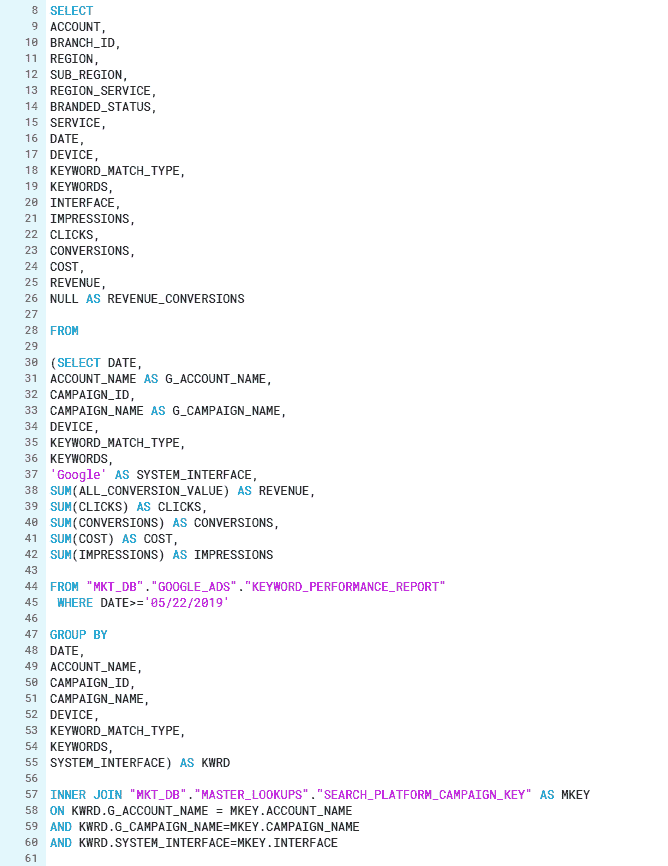
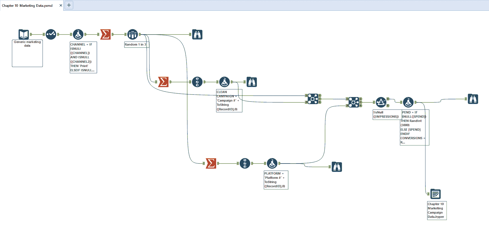
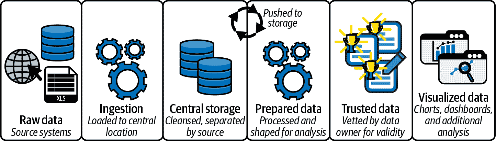
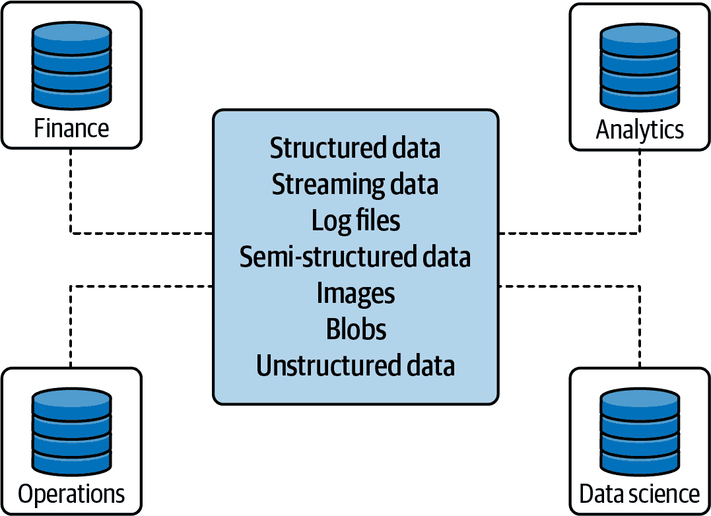
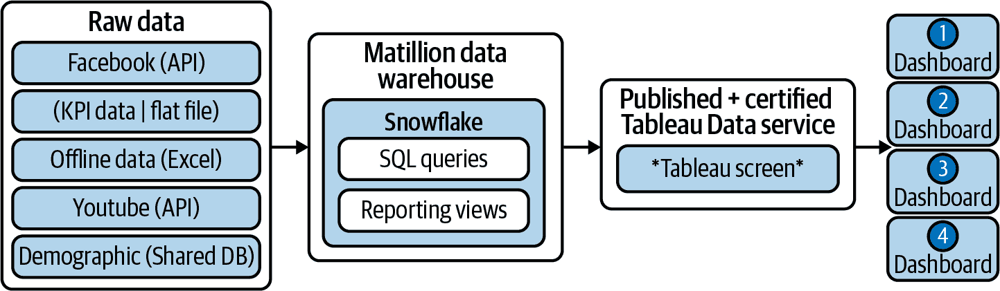

# 第十三章：更广泛的 Tableau 生态系统

本书到目前为止的大部分内容都集中在如何以及为什么创建各种图表和可视化上。我们已经提升了你的可视化技能，现在你知道如何处理各种数据和分析类型。你还学会了如何通过专注于最终用户体验和互动性来思考你的可视化产品。

本章内容有所不同。我们不再专注于案例研究和策略，而是希望你退后一步，更全面地考虑如何处理数据进行视觉分析。具体来说，我们将提供关于何时何地准备数据以及如何打造一流分析平台的指导。最后，我们将通过分享一些即将出现的趋势来结束本章。

# 数据准备：何时何地进行

在整本书中，你一直受到照顾。我们提供了相对清晰的数据集，其中已经包含了准备好进行分析的关键信息。虽然这是有意为之，为了给你提供学习机会，但这并不总是可行或现实的。分析师经常必须努力收集重要数据，清理数据使其可读，并为可视化重塑数据。在第十一章中，我们提供了在 Tableau Desktop 内保持这一工作流程的策略，但这并不总是可能的。

当数据清理的任务成为一项单独的工作时，知道何时转换到其他工具，以及如何转换，就变得很重要。以下是一些必要或推荐从 Tableau Desktop 中移除数据清理的示例：

+   将多个数据源与多个数据粒度结合。这种情况在市场分析中经常出现。分析师必须理顺来自不同平台的数据，这些平台具有不同的维度水平。对于处理这类数据的分析师来说，分别准备数据源，并识别一个共同的聚合级别，然后通过联合操作将它们组合起来至关重要。

+   生成行 ID 或排名。虽然可以使用 Tableau 生成排名和索引，但这只能通过表计算完成，并依赖于工作表内的数据。如果你需要在数据集的每一行上添加行 ID，或者创建多个排名，应在可视化之前完成此操作。

+   连接两个截然不同的来源系统，例如来自 API 的数据和来自电子表格的数据。虽然 Tableau Desktop 具有执行跨数据库连接的功能，但并非每种数据源都支持这种功能。一个很好的例子是来自 API 的数据，比如内置的 Google Analytics 连接器，其中包含有关网站流量的信息，以及来自 Excel 电子表格的数据，其中包含与流量目标相关联的目标。

+   复杂数据清洗或在你的数据上使用高级统计/数学分析。在第九章中，我们概述了何时在 Tableau Desktop 之外进行数学分析的示例。如果你的数据符合这种情况，你很可能可以将这些过程与接下来列出的准备工具结合起来。

## 电子表格：Microsoft Excel

在没有提及 Microsoft Excel 的业务分析书籍是不可能的。由于这个工具的广泛使用和健壮性，数据专业人员很可能在过去使用它来进行数据准备和/或数据存储。专业人员通常从 Excel 开始，然后通过数据生态系统转向像 Tableau 这样更强大的工具。电子表格适合分析师，因为它们提供对底层数据的完全控制。可以使用公式、宏或简单地手动进行清理。同样，分析师可以构建数据透视表来预先聚合他们的数据，或者从多个系统复制和粘贴数据到一个源中。

那么，什么时候应该将电子表格用作数据准备工具呢？有两种真实的情况可以使用 Excel：当这是你唯一拥有的工具时，或者当你正在进行超快速的单次分析时。如果 Excel 是您唯一可用的工具，我们强烈建议使用它来帮助塑造您的数据。它具有几个有用的功能和公式，可以在分析之前清理您的数据。我们发现它在特定的金融功能方面特别有用，在 Tableau Desktop 中没有涵盖，并且需要 Python 或 R 中的几行代码来构建。正如所述，您还可以将数据从多个源复制粘贴到单个电子表格中，因此如果没有其他组合方式，这变得成为一个明显的解决方案。我们也可以接受它以极端的即兴方式使用。如果您正在为静态分析构建子集表或知道您以后不需要参考数据清理的方式，这可能是一个很好的解决方案。大多数人都可以在 Excel 中运作，并且该工具的普及性使得相对容易搜索解决方案或教程来完成任务。

除了这两种用例之外，我们强烈建议并鼓励您尝试下面提到的其他工具。Excel 目前无法处理大型数据集（超过一百万条），并鼓励我们试图避免的行为——修改源数据。在 Excel 中，没有真正的方法来以程序方式重复数据清洗任务，因此通过 Excel 向大众部署经过清洗的数据集是不现实的。

## 传统数据准备：SQL

SQL（Structured Query Language，结构化查询语言）可以说是最流行的编程语言，当然也是最流行的查询语言，它是用来组合和查询关系数据库中数据的主要方式，如图 13-1 所示。事实上，Tableau 就是基于 SQL 构建的；它将您的拖放交互（Tableau 称之为*VizQL*）翻译成针对数据源的 SQL 查询。在我们的分析师生涯开始时，SQL 通常被认为是商业智能开发者和分析师在其角色中取得有效成果所必备的最关键和必要的技能之一。

精通 SQL 技能的从业者受益于能够创建推迟聚合和数据清理至源头的数据集。在许多大型企业中，它仍然是创建数据集（通常称为*报表表*）的主要工具。从与 Tableau 一起工作的角度来看，它可以将许多复杂的计算字段或纯净化任务抽象到“后端”，从而使分析师能够专注于在数据集上构建分析。

什么时候应该考虑使用 SQL？如果您的数据已存储在关系数据库中，并且您的组织已经采纳了建立数据仓库和/或报表数据库的想法，那么您应该使用 SQL。如果您的数据已存储在这些类型的数据库中，使用 SQL 将允许您创建新的数据对象（表或视图），以便 Tableau 可视化可以依赖这些数据对象。在这些环境中，通常将数据准备任务分为两个角色：可视化设计师和数据工程师。因此，具备 SQL 技能在很多情况下可以转交给数据工程师。

###### 图 13-1\. 用于从 Google 数据中添加维度的示例 SQL 查询

使用 SQL 准备数据的缺点是什么？最常见的问题通常是时间——无论是在收集需求还是开发正确的查询上都是如此。在那些将数据准备和分析分开的组织中，可视化设计师常常需要等待数据工程师构建数据集以供使用。这种瀑布式的方法还使得适应分析需求的变化变得僵化，并且减慢了迭代分析的过程，而在这个过程中，与数据工作可以实际上影响到识别分析中最重要的方面。编程或代码也会对您的过程产生黑匣子效应。解开构建的查询并向业务最终用户解释它们通常非常困难。我们发现，这个过程往往会导致缺乏信任的数据集。

## 现代数据准备：ELT 工具

准备数据的另一种方法是使用*ELT 工具*。*ELT*是数据工程的一个缩写，代表*提取、转换、加载*——从源系统提取数据，通过编程（SQL）进行转换，然后加载到用于分析的数据库或数据仓库中。ELT 将加载和转换步骤颠倒过来，利用现代计算机硬件将数据暂时加载到内存（RAM）中，然后利用该硬件将转换后的数据推送到其最终位置。此外，大多数 ELT 工具具有更友好的用户界面，更少依赖编码，更多依赖工具和小部件（如图 13-2 中所示）。Tableau 本身也有一个名为 Prep Builder 的 ELT 工具，这是 Tableau Desktop 用户在准备数据方面需求增加的结果。

使用 ELT 工具的最佳时间是什么时候？在处理数据时有两个引人注目的理由可以依赖 ELT 工具：缺乏集中式数据库和开发迭代速度。如果您无法访问数据库，ELT 工具可以作为临时解决方案或虚拟数据库，允许您混合、组合和重塑数据。在业务领域中我们可以看到两个极端的情况：一方面是依赖云应用和互操作性的中小型企业，另一方面是极大型组织，分析师与源应用程序或数据库分隔多个组织层次，必须依靠系统的平面文件导出。

###### 图 13-2\. Alteryx 中用于构建第十章数据的数据准备工作流程

ELT 工具也受益于更快的开发时间。因为用户可以拖放工具，测试它们的输出，然后重新设计，所以解决方案通常很快就能找到。ELT 工具通常还具有数据概要分析功能，一种用于总结和显示数据范围的方法，内置其中。因此，当与全新的数据源一起工作时，将数据引入其 ELT 工具的分析师可以获得牢固的理解，并在可视化之前进行初步探索。此外，原本复杂或长的 SQL 查询变成了分析师的一系列工具。而且由于数据经过预处理并依赖于商品硬件，不会对源系统造成性能负担或影响。这些工具还允许分析师在各个步骤上做注释，并最终呈现出流程图，更容易向最终业务用户沟通。最后，分析师还可以从中导出重复步骤，以供其他工作流程使用，消除了重复开发或编码的需求。

我们刚刚表扬了 ELT 工具的优点，但它们的缺点是什么呢？与其他数据工程和开发策略相比，这些工具的生命周期较短，目前缺乏版本控制和健壮的协作解决方案。通常一个人必须负责从头到尾的数据清洗过程，并负责维护最终的工作流程。在快速迭代的情况下，这可能会导致组织内部摩擦。对于专门的企业数据团队而言，使用 ELT 工具可能被视为“影子 IT”，或者绕过正式流程。这也可能与现有的更广泛的企业战略发生冲突。我们建议通过将 ELT 工具定位为优秀的原型使用来缓解可能带来的紧张局势。将这些工具定位为原型工具有很大的好处；业务用户可以得到他们需要的分析，数据工程团队也有了强大的需求。

## 回顾

我们列出的三个选项并不全面，但涵盖了清理和准备数据的最常见方法。由于每种策略都有其利弊，我们鼓励您探索可能最适合您环境的选项。同时，考虑这些策略可以相互配合——这是一种综合方法，将人们对数据访问的需求置于首位。

# 建设蓬勃发展的分析平台

如果我们还没有说得足够多，重申分析和可视化只是更大画面的一部分。尽管它们非常重要，因为这是利益相关者理解数据并做出决策的地方，但如果数据不普遍可用、准备好进行分析并且可扩展消费，那么这些决策是无法做出的。在其核心，Tableau Desktop 是一个数据阅读器；它消耗任何你输入的数据。它并不是在任何组织中实现良好分析的万能解决方案。

相反，要拥有一个蓬勃发展的分析平台，数据从业者，特别是数据领导者，需要意识到整个数据管道，并考虑在每个主要步骤中所需的互补技术。当我们考虑数据分析管道时，我们将其分为六个部分，以可视化作为最后一环（图 13-3）。

###### 图 13-3\. 数据分析管道，从原始数据到可视化

首先，重要的是考虑您的数据来自何处。 对于许多组织而言，这是许多不同的应用程序、数据库和外部数据源的混合。 所有相关信息很少完全驻留在一个记录系统中。 想想您自己的个人健康或财务记录：它们是否都存在于一个门户中？ 很可能不是，因为随着时间的推移，您可能会更改医疗提供者或银行。 组织也面临同样的问题：技术的变化、依赖第三方和组织无关的数据（如人口统计信息）意味着数据存在于不同的来源中。

要创建一个繁荣的分析文化，最常见的做法通常是将所有这些数据源集中到一个单一位置。 有两种竞争理论指示如何管理集中式数据：数据湖和数据仓库。 对于*数据湖*，目标是从源系统摄取尽可能多的数据，直接将其倾倒到数据湖中，并且在后续流程中担心清理和组织数据。 数据湖通常是一种非结构化数据存储形式，如 Apache Hadoop，它可以处理许多文件类型，并且不要求数据以行和列的形式存储。 在*数据仓库*中，数据被编目、组织，并经过初始清洗以便整齐存储和访问。 传统上，数据仓库中的数据以关系格式（行和列）存储，但最近的技术允许存储非结构化或半结构化数据（如 JSON 文件）。

取决于您选择数据湖还是数据仓库，接下来的步骤可能会类似。 在数据湖中，由于没有预先清洗，因此您的组织很可能会根据需要为分析和报告清洗数据，并且可能还有另一层数据存储（通常称为*数据仓库*）。 图 13-4 展示了数据湖的常见实践。

###### 图 13-4\. 带有数据仓库的示例数据湖，这些数据仓库从中央数据源中提取数据

在数据湖场景中，准备数据（第 4 步，如图 13-3 所示）由数据仓库的所有者管理。 数据会根据需要进行清洗和准备，以便进行分析。

如果您的组织有数据仓库，数据存储时很可能会经过基本的清理和合理化过程。大多数数据源符合架构，数据将被分离并归一化到相互关联的表中，数据字段将被分配类型（如数字、文本或布尔值）。在这里，需要更多的前期工作来摄取和存储数据，但回报是所有使用者都在使用相同质量的基础数据。此外，数据仓库可能会为报告和分析开发一些表，这些表可以包括将不同的数据源和数据表合并到高度非规范化的表中，专为查询和分析而设计。尽管如此，新型数据库技术（Snowflake 是一个很好的例子）正在模糊数据湖和数据仓库之间的界限，允许组织将数据倾入关系数据库，而无需进行大量的正式处理和组织。

无论您的组织选择如何集中其数据，下一步对两种情况都是功能上相同的。数据进一步清理、处理和精炼以供查询和分析。这是 SQL 和 ELT 工具发挥作用的地方。数据工程师添加业务逻辑，创建强大的数据集，并对数据进行重塑以进行视觉分析。最终，无论数据存储在何处，都接近完成并可用于视觉分析。

进入第 5 步，即创建可信数据。在此步骤中，不使用任何技术，而是将数据集交还给利益相关者和领域专家以验证准确性。在此步骤中，可能会生成数据字典来正式定义字段和计算。此步骤经常在过程中被忽视，因为每个人都渴望进入第 6 步，即可视化和分析，但我们在这里提醒您。这一步骤在避免数据源扩散和建立围绕信任的强大稳定数据平台方面至关重要。一个繁荣的数据分析平台包括这一步骤，确保经验丰富的分析师和设计师以及业务用户都可以信任数据，并真正采取行动。

在数据认证之后，我们来到了最后一步，即数据的可视化和分析。在这一步骤中，我们已经讨论了如何创建引人注目和有影响力的可视化，但并没有讨论如何分享它们。在这一步骤中，拥有某种平台来存储和目录它们至关重要（图 13-5）。在使用 Tableau 时，这意味着 Tableau Server 或 Tableau Online——一种允许存储 Tableau 可视化和数据源，并通过 Web 浏览器（或移动应用程序）访问的软件应用程序，包括用户权限和安全性。虽然我们没有深入探讨细节，但重要的是要注意，在建立这种类型的环境时，关键是确保它能够处理访问数据产品的内容和用户量。幸运的是，Tableau Server 是一个高度可扩展的环境，能够管理成千上万的用户和仪表板。

###### 图 13-5\. 一个市场机构的示例数据平台

正如你刚刚见证的，创建一个全面的和最佳实践的分析平台需要正确的技术、流程和心态的结合。如果你刚刚开始你的分析之旅，我们鼓励你审视自己的数据生态系统，找出改进或增加透明度的任何机会。虽然没有标准答案，但像前面提到的那些组成部分或概念会引领你走向成功之路。

# 未来趋势

我们希望通过探索可视化和分析中未来的趋势来结束本章。尽管可视化长期以来一直是支持数据分析的概念，在过去的 10 到 15 年里，与商业组织进行可视化的实践因商品硬件和数字化数据的普及而迅速流行起来。考虑到它相对年轻，前景充满了令人兴奋的机会。

## 数据新闻和数据叙事的兴起

首先是将叙事或叙述融入业务分析的理念。如果你超越了商业智能，你会发现*数据新闻*在数据可视化领域占据了重要位置。这里，视觉传达的重点不在于传达业务关键绩效指标，而在于使用图表支持引人入胜的叙述。记者们利用动画、注释文本和空白（滚动）来更好地强调和传达他们的主题。

这些技术未来有望渗透到商业世界中。随着观众变得更加数据精通（能够理解可视化和数据），设计师将能够进一步将叙事融入他们自己的可视化中。此外，随着机器学习和人工智能的进步，自动生成的叙事也在视野之内。

然而，我们并不认为该领域技术的进步会消除可视化设计师和/或熟练解读图表以供观众的需求。这些角色可能仍然是关键角色，但其转变是从手动开发或生成洞察力，转向更为程序化的方法。

而且，我们认为这些角色的普及将继续推动另一个最近的趋势：数据素养计划的开发和部署。这些计划旨在确保所有业务用户都具有基本的数据基础理解：图表类型和基本统计分析。在撰写本文时，Tableau 已经开始大力倡导这一概念，并向其客户提供免费信息。

在未来几年，数据和分析可能会在几乎每个角色中被充分认可，并扩展到包括更广泛的支持和培训计划。数据、业务智能和分析是“技术性”的，并属于组织的 IT 部门的观念将完全被剥离。

## 人类工作流中的分析

下一个即将到来的趋势是“*分析随处可及*”，特别是在操作流程中。对于销售经理、客户服务代表、产品负责人或项目经理等非技术角色，数据的需求日益增长。拥有数据和见解后，每一方可以做出更明智的决策，并通常更有利地为其利益相关者（内部或外部）服务。目前，我们看到大多数用户会前往单独指定的区域（如 Tableau Server）来获取他们所需的信息。未来，我们预见这些界限将变得模糊，使必要的分析存在于他们当前的工作流程中。

这种趋势的一个明显例子是 Salesforce 在 2019 年收购 Tableau 软件，Salesforce 是一家主要的软件组织，拥有丰富的基于云的客户关系管理（CRM）应用程序。Salesforce 的巨大收购表明，一个强大的分析和可视化平台，直接嵌入到客户账户信息存储的位置，对其日常支持的组织至关重要。与其 Einstein 产品的增长一样（专注于预测分析和机器学习），收购 Tableau 导致了高度分析和数据导向工具更进一步和更完整地融入到人类工作流中。

在未来几年，我们认为这一趋势将继续增长，并且业务智能中心或隔离存储所有报告和仪表板的库与日常运营应用程序之间的界限将进一步模糊。在不久的将来，各种类型的员工可能会开始利用交互式分析，在他们大部分时间所在的地方推动更好的决策制定和信息收集。

## 作为产品的分析

过去三年显示出显著增长的最终趋势是*以分析为产品*的理念。这是一种完全拥有和管理的产品，以各种行业的形式向客户销售，既可以作为现有企业的增值高级服务，也可以作为独立的产品。想象一下一个拥有电子健康记录（EHR）应用程序的医院。目前，这用于存储和访问患者的健康信息，但我们也看到它包含分析功能，以帮助医疗从业者——从提供操作洞察力，如容量和效率，到更全面的视角，比如对患者的全面关怀。

我们认为，衡量这些类型指标并进行这些类型分析的角色很快将被组织分开，并由支持该任务的软件重新捕获。我们可以肯定地说，这种转变已经开始发生。

除了增强为客户提供包括分析在内的服务外，视觉分析将（已经）成为一个独立的可以购买的产品。许多领域已经定期接受这种类型的处理，从零售营销趋势到大型社交媒体和技术公司如 Facebook 的广告洞察和消费者行为。

在同一思路下，还有作为服务提供的集成分析的理念。像 TrackMaven（用于营销分析）这样的组织承诺将所有相关数据源集成到一个统一平台，并构建报告和分析，被认为是各种渠道和目标中最佳的。这些组织还具有极大的优势——从各自客户的大量数据消费中，意味着它们还可以提供聚合的绩效见解，并构建各自领域的比较基准。这项任务是单个组织不太可能独自完成的，因为它需要竞争对手的合作和广泛的数据共享。相反，通过选择这些服务，这些组织获得了数据共享作为极大的好处。

# 结论

本章重点讨论了三个主要主题：何时何地准备数据，构建最佳数据平台以及分析未来的趋势。

您已经学会了三种准备数据的方法。我们为您提供了函数何时需要与可视化过程分离的示例。现在您应该对您手头的工具感到自信，并有能力表达选择每个工具的优缺点。最重要的是，我们希望您了解到并不是一种最佳方法。通常情况下，组织内会混合使用这三种方法，以帮助实现您希望达到的分析结果。

您还学习了最佳数据分析平台的各个层次——从原始数据开始，逐步向上工作直到可视化的点。您还了解到数据可以以两种主要方式之一存储，以帮助促进这种类型的平台——数据湖和数据仓库——以及与之相关的各种好处。

我们已经讨论了数据可视化和分析中的三个趋势：数据叙事、人类工作流内的分析，以及作为产品的分析。在您拓展和发展自己的可视化技能时，我们鼓励您看待数据新闻学作为创新和发展自己数据产品的一种方式。另外，我们挑战您深思仪表板和数据产品应该驻留的位置，并分享了这样一个结论性的想法：在未来（为了效率和最大化收益），我们认为它们应该与办公人员的日常操作驻留在同一应用程序中。

最后，我们说分析本身正在成为一种产品——这种产品正在从分析师和商业智能专业人员中分离出来，成为一个完全独立的产品。它可以被添加到现有的应用程序中，以增强它们的价值，或者作为来自数据聚合器的独立产品，允许组织进行必要的比较和与竞争对手的基准分析，进一步了解自己所在的行业。
