## 第一部分\. 准备和收集数据和知识

数据科学的过程始于准备阶段。你需要确定你所知道的，你所拥有的，你可以得到的，你目前的位置，以及你希望达到的位置。最后这一点至关重要；数据科学项目需要有一个目的和相应的目标。只有当你有明确的目标时，你才能开始调查可用的资源以及实现这些目标的所有可能性。

本书的第一部分从讨论我的以过程为导向的数据科学项目视角的章节开始。之后，我们继续进行一个重要且故意的步骤，即为项目设定良好的目标。接下来的三个章节涵盖了过程中最重要三个以数据为中心的步骤：探索、整理和评估。在这一部分的最后，你将熟悉你拥有的数据和你可以获取的相关数据。更重要的是，你会知道它是否以及如何帮助你实现项目的目标。

## 第一章\. 数据科学的哲学

*本章涵盖*

+   数据科学家的角色以及它与软件开发者的角色有何不同

+   数据科学家最大的资产是意识，尤其是在存在重大不确定性的情况下

+   阅读此书的前提：软件开发和统计学的基本知识

+   在考虑大局的同时为项目设定优先级

+   最佳实践：在项目期间可以使生活更轻松的技巧

在接下来的几页中，我将数据科学介绍为一套过程和概念，这些过程和概念作为在以数据为中心的项目中进行进步和决策的指南。这与将数据科学视为一套统计和软件工具以及使用它们的知识的观点形成对比，在我的经验中，这种观点在关于数据科学的对话和文本中更为普遍（参见图 1.1 以幽默的方式看待数据科学的观点）。我并不是说这两种观点相互矛盾；它们是互补的。但是忽视其中之一而偏爱另一个将是愚蠢的，因此在这本书中，我讨论了较少讨论的方面：实践和思想中的过程。

##### 图 1.1\. 对数据科学的某些典型观点

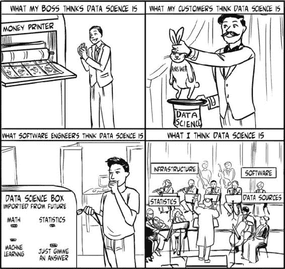

与木工相比，知道如何使用锤子、钻头和锯子并不等同于知道如何制作一把椅子。同样，如果你知道制作椅子的过程，这并不意味着你在使用过程中可能会用到的锤子、钻头和锯子方面有任何优势。要制作一把好椅子，你必须知道如何使用这些工具，以及具体如何一步步地使用它们。在这本书中，我试图充分讨论工具，以便建立对它们如何工作的理解，但我更关注它们何时应该使用，以及如何和为什么使用。我不断地提出并回答一个问题：接下来应该做什么？

在本章中，使用相对高级的描述和示例，我讨论了数据科学家的思维过程为什么可能比使用的具体工具更重要，以及某些概念几乎渗透到数据科学工作的所有方面。

### 1.1. 数据科学与本书

数据科学作为一个研究领域或职业追求的起源，介于统计学和软件开发之间。统计学可以被视为蓝图，而软件则被视为机器。数据通过这两者流动，无论是概念上还是实际上，也许只是在最近几年，从业者才开始将数据置于首位，尽管数据科学在很大程度上受益于任何将统计学和软件结合在一起的老牌领域，如运筹学、分析和决策科学。

除了统计学和软件之外，许多人说数据科学还有一个第三大组成部分，那就是类似专业知识或领域知识的东西。虽然在你尝试解决问题之前理解问题确实很重要，但一个好的数据科学家可以转换领域，并相对很快地开始做出贡献。就像一个好的会计可以快速学习新行业的财务细微差别，一个好的工程师可以掌握设计各种类型产品的具体细节一样，一个好的数据科学家可以转换到一个全新的领域，并在短时间内开始做出贡献。这并不是说领域知识没有价值，但与软件开发和统计学相比，特定领域的知识通常需要最短的时间来学习，以便足够好地帮助解决涉及数据的问题。它也是三个组成部分中可以互换的组成部分。如果你能做数据科学，你可以走进一个全新的以数据为中心的项目规划会议，房间里几乎每个人都会有你需要的领域知识，而几乎没有人会拥有编写良好分析软件的技能，这种软件能够工作。

在整本书中——也许你已经注意到了——我选择使用“以数据为中心”这个术语，而不是更流行的“以数据驱动”，来描述软件、项目和问题，因为我认为数据“驱动”任何这些概念是一个误导性的观点。只有当软件明确用于移动、存储或以其他方式处理数据时，数据才应该驱动软件。旨在解决项目或商业目标的软件不应该由数据驱动。那将是本末倒置。问题和目标独立于任何数据、软件或其他资源存在，但那些资源可以用来解决问题和实现目标。“以数据为中心”这个术语反映了数据是解决方案的一个组成部分，我相信使用它而不是“以数据驱动”承认了我们需要从目标和数据可以帮助我们解决的问题的角度来看待问题，而不是从数据的角度来看待问题。

在这本书中，关于正确视角的陈述很常见。在每一章中，我都试图让读者关注最重要的事情，在项目结果不确定的时候，我会尝试提供一些指导方针，帮助你决定哪些是最重要的事情。从某种意义上说，我认为定位并保持对项目最重要方面的关注是我在这几页中试图教授的最有价值的技能之一。数据科学家必须具备许多硬技能——其中就包括软件开发和统计学知识——但我发现，对于大多数我所知道的数据科学家来说，保持适当的视角和对任何以数据为中心的问题中众多变动部分的意识是一种非常困难但非常有价值的软技能。

有时数据质量成为一个重要问题；有时主要问题是数据量、处理速度、算法参数、结果的可解释性，或者问题的许多其他方面。在这些问题变得重要时忽视任何一点都可能损害或完全无效化后续结果。作为一名数据科学家，我的目标是确保项目的任何重要方面都不会被忽视而出现问题。当出现问题——这是不可避免的——我希望能够注意到它，以便我可以修复它。在整个章节和整本书中，我将继续强调保持对项目所有方面的意识的重要性，尤其是那些关于潜在结果不确定性的方面。

数据科学项目生命周期可以分为三个阶段，如图 1.2 图 1.2 所示。本书围绕这些阶段组织。第一部分涵盖准备阶段，强调在项目开始时花点时间和精力收集信息可以让你在以后避免大麻烦。第二部分涵盖为客户构建产品，从规划到执行，使用第一部分学到的知识以及统计学和软件可以提供的所有工具。第三部分和最后一部分涵盖完成项目：交付产品、获取反馈、进行修订、支持产品以及整洁地结束项目。在讨论每个阶段时，本书包括一些自我反思，即它经常要求你，作为读者，重新考虑你在之前步骤中做过的事情，如果看起来是个好主意，就有可能以某种其他方式重新做。到本书结束时，你可能会希望对这些思考过程和作为希望使用数据获得有价值结果的科学家在做出决策时的考虑有一个牢固的把握。

##### 图 1.2. 数据科学过程

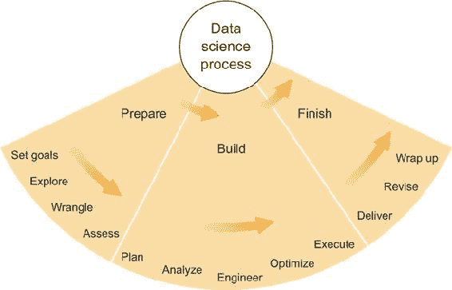

### 1.2. 意识到这一点很有价值

如果每次有软件开发者告诉我一个分析软件工具“不起作用”，我都会有一笔财富。这并不是说我认为所有的分析软件工具都工作得很好或根本不起作用——这绝对不是事实——但我认为这促使我们讨论数据科学家和所谓的“纯”软件开发者（通常不与原始或“未整理”的数据互动）之间最普遍的差异之一。

这种差异的一个很好的例子发生在一个初出茅庐的创业公司创始人向我提出一个问题时。任务是提取与即将到来的旅行相关的电子邮件中的姓名、地点、日期和其他关键信息，以便这些数据可以用于一个跟踪用户旅行计划的移动应用程序。创始人遇到的问题很常见：电子邮件和其他文档形式多样，大小不一，解析它们以获取有用信息是一个挑战。当来自不同航空公司、酒店、预订网站等的电子邮件格式不同时，提取这些特定的与旅行相关的数据就更加困难，更不用说这些格式经常发生变化。谷歌和其他公司似乎在自己的应用程序中提供了很好的提取此类数据的工具，但这些工具通常不会对外部开发者开放。

创始人和我都知道，通常有两大策略可以应对这个挑战：手动暴力破解和脚本编写。我们也可以将这两种方法结合起来使用。鉴于暴力破解需要为每种电子邮件格式创建一个模板，以及每次格式更改时都需要一个新的模板，我们都不想走这条路。一个能够解析任何电子邮件并提取相关信息脚本听起来很棒，但它听起来也非常复杂，几乎不可能编写。两种极端方法之间的折衷方案似乎是最好的，正如它通常所做的那样。

在与创始人和主要软件开发者交谈时，我建议他们在暴力破解和纯脚本编写之间找到一个折衷方案：为最常见的格式开发一些简单的模板，检查相似性和常见的结构模式，然后编写一个简单的脚本，该脚本可以匹配新电子邮件中熟悉的模板 HTML 或文本的块，并从这些块中提取已知位置的数据。我当时称之为*算法模板化*，不管好坏。这个建议显然不能完全解决问题，但它会在正确的方向上取得一些进展，更重要的是，它将揭示最常见的格式中的常见结构模式，并突出一些尚未知晓但可能容易解决的特定挑战。

软件开发人员提到，他已经开始使用一种流行的自然语言处理（NLP）工具构建解决方案，该工具能够识别和提取日期、姓名和地点。然后他说，他仍然认为 NLP 工具能够解决这个问题，并在完全实施后告诉我。我告诉他，自然语言解析和分析非常复杂，我对 NLP 工具的信心不如他那么高，但我希望他是正确的。

几周后，我又与创始人以及软件开发者进行了交谈，被告知自然语言处理（NLP）工具无法正常工作，并再次请求他们的帮助。该 NLP 工具能够识别大多数日期和地点，但，为了转述一个问题，"大多数情况下，在涉及航班预订的电子邮件中，预订日期通常出现在邮件的第一位，然后是出发日期，到达日期，然后可能是返程日期。但在某些 HTML 电子邮件格式中，预订日期出现在出发日期和到达日期之间。那么我们该怎么办呢？"

NLP 工具无法解决 100%的问题这一点是显而易见的。但它确实解决了某些中间问题，例如识别姓名和日期，即使它无法在旅行计划本身中精确地放置它们。我不想曲解开发者的原话或脱离上下文；这对数据科学家来说是一个难题，对其他人来说则是一个**非常**难题。第一次尝试未能解决问题几乎不能算作彻底失败。但在这个项目中，我们三个人尝试了几个星期，试图找到一个有足够时间来尝试帮助解决这个具体问题的经验丰富的数据科学家，这一部分工作因此停滞了几个星期。这样的延误对初创公司——或者任何公司来说——都是代价高昂的。

通过这样的经历，我学到的教训是，在处理涉及数据的问题时，意识极其宝贵。一个优秀的开发者使用优秀的工具来解决看似非常容易解决的问题，如果他们没有考虑到代码开始处理数据时可能发生的许多可能性，他们可能会遇到麻烦。

不确定性是冷静逻辑算法的对手，意识到这些算法在异常情况下可能会崩溃，可以加快在问题发生时解决问题的过程——它们会发生。数据科学家的主要责任是尝试想象所有可能性，解决那些重要的可能性，并在成功和失败发生时重新评估它们。这就是为什么——无论我写了多少代码——意识和对不确定性的熟悉是我作为数据科学家能提供的最有价值的东西。有些人可能会告诉你不要在工作时做白日梦，但如果你能利用它来为可能出错的事实做好准备，想象力可以成为数据科学家的最佳朋友。

### 1.3. 开发者与数据科学家

优秀的软件开发者（或工程师）和优秀的数据科学家有几个共同点。两者都擅长设计和构建由许多相互连接的部分组成的复杂系统；两者都熟悉构建这些系统所需的各种工具和框架；两者都擅长在系统实现之前预见潜在的问题。但一般来说，软件开发者设计由许多定义良好的组件组成的系统，而数据科学家则与至少一个组件在构建之前没有明确定义的系统打交道，而这个组件通常与数据处理或分析密切相关。

软件开发者和数据科学家的系统可以分别与数学概念中的逻辑和概率相对应。逻辑陈述“如果 A，则 B”可以很容易地用任何编程语言编码，从某种意义上说，每个计算机程序都包含大量这样的陈述，这些陈述在不同的上下文中。概率性陈述“如果 A，则*可能*B”则远非那么直接。任何好的以数据为中心的应用都包含许多这样的陈述——考虑一下谷歌搜索引擎（“这些*可能*是最相关的页面”），亚马逊网站上的产品推荐（“我们认为你*可能*会喜欢这些商品”），网站分析（“你的网站访客*可能*来自北美，每个访客大约查看*三个页面”）。

数据科学家专门从事创建依赖于关于数据和结果概率性陈述的系统。在之前提到的在电子邮件中查找旅行信息的系统案例中，我们可以做出如下陈述：“如果我们知道电子邮件包含出发日期，NLP 工具*可能*能够提取它。”对于一个优秀的 NLP 工具，经过一点调整，这个陈述很可能是正确的。但如果我们过于自信，在陈述中省略了*可能*这个词，那么这个新的陈述很可能是不正确的。它可能在某些时候是正确的，但肯定不会在所有时候都是正确的。这种将概率与确定性混淆的困惑正是大多数软件开发者在开始数据科学项目时必须克服的挑战。

当作为一个软件开发者，你从一个软件规范、文档齐全或开源代码库、产品特性要么工作要么不工作（“报告一个错误！”）的世界中来时，软件中的不确定性概念可能看起来很陌生。软件可以比作一辆汽车：粗略地说，如果你有所有正确的部件，并且以正确的方式将它们组合在一起，汽车就会工作，如果你按照手册操作，它就会带你到你想要去的地方。如果汽车不能正常工作，那么字面上来说，确实有什么东西坏了，可以修复。对我来说，这直接类似于纯软件开发。另一方面，建造一辆自动驾驶汽车在沙漠中自主赛车，则更像数据科学。我并不是说数据科学像自动驾驶沙漠赛车那样酷得离谱，而是你永远不能确定你的汽车能否到达终点线，或者任务是否可行。有如此多的未知和随机变量在起作用，以至于绝对无法保证汽车会停在何处，甚至无法保证*任何*汽车能够完成比赛——直到有一辆车做到了。

如果一辆自动驾驶汽车在完成 90%的路程时被暴雨冲进沟里，那么说这辆自动驾驶汽车不工作显然是不恰当的。同样，如果汽车没有真正越过终点线，而是绕过它继续行驶了 100 英里，这也是不恰当的。此外，将专为道路设计的自动驾驶轿车带入沙漠比赛，并在它卡在沙丘上时宣称汽车不工作，这也是不恰当的。这正是当有人将专为特定目的设计的以数据为中心的工具应用于不同目的时我的感受；他们得到的是不良结果，并宣称它不工作。

为了更具体的例子，假设一个网站所有者告诉你，“典型的用户在离开之前会访问我们网站的四个页面。” 假设你对网站使用的新数据集进行了分析，发现平均用户在离开之前会访问八个页面。这意味着有错误吗？当你应该使用中位数用户时，你却在使用平均值用户吗？这些新数据是否包括不同类型的用户或使用方式？这些问题通常是由数据科学家而不是软件开发者回答的，因为它们涉及数据探索和不确定性。基于这些问题及其答案实施软件解决方案当然可以受益于软件开发者的专业知识，但探索本身——必然涉及统计学——完全属于数据科学家的领域。在第五章中，我们将探讨数据评估和评估作为预防、诊断问题以及帮助避免看似完成的软件产品在某些方面失败的实用工具。

值得注意的是，尽管我似乎把数据科学家和软件开发者对立起来，但这种冲突（如果我可以称之为冲突的话）也可以存在于一个人身上。在从事数据科学项目时，我经常发现自己从数据科学家的帽子换成了软件开发者的帽子，尤其是在编写生产代码时。我把它们看作是两顶不同的帽子，是因为有时可能会有利益冲突，因为两个领域的优先级可能不同。像我在这本书中这样做，公开讨论这些冲突，可以帮助说明这些差异的解决，无论它们是发生在两个人或更多人之间，还是发生在可能戴这两顶帽子之一的个人身上。

### 1.4\. 我需要成为一名软件开发者吗？

之前，我讨论了数据科学家和软件开发者之间的区别，常常好像只有这两个选项。当然，并非如此。而且，你不需要成为其中任何一个才能从这本书中获得收益。

掌握统计软件工具的知识是进行实际数据科学工作的先决条件，但这可以简单到只是一个常见的电子表格程序（例如，虽然存在争议但几乎无处不在的微软 Excel）。从理论上讲，一个人可以不接触电脑或其他设备就成为一名数据科学家。理解问题、数据和相关的统计方法可能就足够了，只要有人能理解你的意图并编写代码。在实践中，这种情况并不常见。

或者，你可能是一个经常与数据科学家合作的人，你希望了解这个过程，而无需 necessarily 理解技术。在这种情况下，本书中也有适合你的内容。我的主要目标之一是列举在解决以数据为中心的问题时必须考虑的许多因素。在许多情况下，我将在这本书中针对我过去和现在的一些半虚构同事进行解释：生物学家、金融高管、产品所有者、经理或其他可能给我数据并问我一个简单问题的人：“你能为我分析这个吗？”对于最后一个案例，也许如果我在这里详细地写下来，并附上大量的例子，我就不必（再次）重复说这并不那么简单。分析需要一个问题，我将在这些页面上深入讨论这两个问题。

本书是关于思考和实践数据科学的过程，但显然软件不能被忽视。软件——作为一个行业及其产品——是数据科学家的工具箱。工艺的工具是超越人类心智和身体能力的工作的推动者。但在本书中，我将只涵盖必要的软件，以便探索现有软件工具的优势和局限性，并提供它们使用的具体例子以供说明。否则，我将尝试以抽象的方式撰写关于软件的内容——而不失实用性——以便尽可能多的人能够理解，无论是技术人员还是非技术人员，而且多年以后，这些解释可能仍然有价值，即使我们已经开始转向更新（和更好？）的软件语言和产品。

### 1.5\. 我需要了解统计学吗？

与软件一样，对统计学的专业知识当然有帮助，但并非必要。本质上，我是一个数学家和统计学家，因此我可能会在这些领域过于技术性地偏离主题。但我比大多数人更讨厌行话和假设知识，所以我将尽力包括对统计概念的易于理解的概念解释；希望这些解释对任何有想象力且坚持不懈的读者来说都是足够的。在我不足之处，我会尽力引导你到一些提供更详尽解释的资源。一如既往，我倡导使用网络搜索来查找你感兴趣主题的更多信息，但在某些情况下，在深入统计学网页的兔子洞之前，至少先跟我读几页可能更好。

同时，为了在概念上帮助你入门，请考虑统计学领域作为你每天遇到的数据生成过程的理论体现。一个匿名的网站用户是一个随机变量，他们可能会根据他们头脑中的情况点击任何数量的事物。社交媒体数据反映了公众的思想和担忧。消费品购买既取决于消费者的需求，也取决于商品的市场营销活动。在这些情况下，你必须理论化无形的思想、需求和反应最终如何转化为可测量的行动，从而创建数据。统计学为此理论化提供了一个框架。本书将花较少的时间在统计模型的复杂理论依据上，而更多地关注制定数据生成过程的心理模型，并将这些心理模型转化为统计术语、方程式，最终是代码。

### 1.6. 优先级：知识优先，技术其次，意见第三

这个章节标题是我的一个格言。我使用它来帮助解决数据科学项目中各种关注点之间永无止境的斗争——例如，软件与统计学、不断变化的企业需求与项目时间表、数据质量与结果准确性。随着项目的进展，每个关注点都会对其他关注点施加推拉，每当两个关注点在行动方案上意见不一致时，我们就被迫做出选择。我为此开发了一个简单的框架来帮助处理这些问题。

知识、技术和意见通常是任何项目开始时你所拥有的东西；它们是将数据转化为答案的三个要素。“知识”是你确信无疑知道的东西。“技术”是你可用的工具集。“意见”是你想要考虑为真的小事实，但还不完全确定。为你的思维过程建立层次结构很重要，这样不那么重要的事情就不会因为它们更容易或更受欢迎，或者因为有人有预感而压倒更重要的事情。

在实践中，层次结构看起来是这样的：

+   ***知识第一——*** 在做任何事情之前，了解你的问题、你的数据、你的方法和你的目标，并将这些放在首要位置。

+   ***技术第二——*** 软件是为你服务的工具。它既使你能够，也限制了你的能力。除非在特殊情况之下，它不应该规定你解决问题的方法。

+   ***观点第三——*** 意见、直觉和愿望都是作为指向可以证明正确的理论的指南来使用的，而不应该成为任何项目的焦点。

我并不是在提倡在每一个决策中知识都应该优先于技术——同样，技术也应该优先于观点——但如果要颠倒这个顺序，你应该是有意为之，并且有非常好的理由。例如，假设你拥有大量数据和一个你希望估计参数的统计模型。此外，你已经有一个工具可以将这些数据加载到执行一种称为*最大似然估计*（MLE）的统计参数优化的系统中。你知道你的数据和统计模型可能足够复杂，可以生成许多合理的参数值，因此使用 MLE 来找到一个最可能的参数值可能会产生不可预测的结果。存在更稳健的替代方案，但你目前还没有实现。你有两个选择：

1.  构建一个能够进行稳健参数估计的新工具。

1.  使用你已有的工具来进行最大似然估计（MLE）。

你的知识告诉你应该做 A，如果你有无限的时间和资源，但技术表明你应该做 B，因为 A 需要巨大的资源投入。务实的选择可能是 B，但这颠倒了顺序。如前所述，你可以这样做，但只能是有意为之，并且有非常好的理由。这个好理由可能是你在 A 和 B 上需要花费的时间和金钱的差异。通过*有意为之*，我的意思是说你不应该轻率地做出决定，也不应该忘记它。如果你选择 B，你应该将任何结果与你在质量上做出的牺牲（为了节省成本）的知识一起传递，并在文档和技术报告中注明这一点。你应该适当地加强质量控制，并执行专门检查 MLE 容易出现的优化错误/偏差的测试。做出决定然后忘记推理是导致令人失望或误导性结果的道路。

观点带来的挑战更加模糊。有时人们会被找到真正惊人结果的潜力所蒙蔽，忘记考虑如果这些结果在数据中不明显会发生什么。在大数据繁荣时期，无数软件初创公司试图利用社交媒体——尤其是 Twitter 及其“消防水龙”——来确定各个商业市场的趋势，他们常常遇到比预期更大的障碍。计算和数据的规模、在仅 140 个字符内解析自然语言，以及在混乱数据上推断随机变量都常常涉及其中。只有这些公司中的佼佼者才能从数据中提取有意义的、重要的知识并从中获利。其余的被迫放弃或改变他们的重点。每个这些初创公司，在某个时候，都必须决定他们是否愿意花费更多的时间和金钱去追逐一个主要基于希望而不是基于证据的目标。我相信他们中的许多人当他们决定放弃时，一定会后悔他们走了多远以及他们花了多少钱。

人们常常被他们认为可能的事情所蒙蔽，忘记考虑它可能不可能实现，或者它可能比预期的要昂贵得多。这些都是观点——猜测——而不是知识，它们不应当在数据分析产品开发中扮演主要角色。目标并不一定能够实现，但任何项目都需要目标，因此，不要理所当然地认为目标及其可实现性是必要的。你应该始终首先考虑当前的知识，并寻求逐步扩展这一知识，直到你实现目标或被迫放弃它。我曾提到这种可实现性的不确定性是软件开发和数据科学哲学之间一个特别鲜明的差异。在数据科学中，目标不太可能以原始形式实现。在一个充满软件开发人员或缺乏经验的数据科学家的房间里，特别要警惕那些没有证据就预设目标 100%可实现的人。

记住：先知识，再技术，最后是观点。这不是一个完美的框架，但我发现它很有帮助。

### 1.7. 最佳实践

在我作为应用数学家、博士研究生、生物信息学软件工程师、数据科学家或我所拥有的其他任何头衔的这些年里，我遇到了一些涉及我自身项目管理不善的问题。当我独自工作多年，我的研究项目无人触及或查看时，我经常设法将文档不充分的代码放置很长时间，以至于忘记了它是如何工作的。我也忘记了哪个版本的结果是最新的。我在离开那个职位后，几乎让任何人都无法接手我的项目。这一切都不是故意的；这主要是疏忽，也是对人们确保项目材料和代码能够在书架上或他人手中长期存活的通常方式的忽视。

当在一个团队中工作时——特别是经验丰富的软件开发团队——通常有人已经建立了一套关于文档和项目材料及代码保存的最佳实践。通常，确保团队中的每个人都遵守这些策略是很重要的，但在没有团队策略的情况下，或者如果你是独立工作，你可以做一些事情来使你的数据科学家生涯在长远来看更加轻松。以下小节涵盖了保持组织的一些建议。

#### 1.7.1\. 文档

你能想象如果你的同伴在你突然离开时接管你的项目，他们可能需要经历什么吗？接管你的项目会是一个糟糕的经历吗？如果你回答是，请为这些未来的同伴——以及你自己——行个方便，保持你的文档更新。以下是一些建议：

+   对你的代码进行注释，以便不熟悉你工作的人可以理解代码的功能。

+   对于一个完成的软件作品——即使是简单的脚本——写一个简短的说明，说明如何使用它，并将其放在与代码相同的地方（例如，相同的文件文件夹）。

+   确保所有东西——文件、文件夹、文档等——都有一个有意义的名称。

#### 1.7.2\. 代码仓库和版本控制

一些软件产品是专门为了包含和管理软件源代码而构建的。这些被称为*源代码仓库*（或*repos*），它们可以从多个方面极大地帮助你。

首先，大多数现代仓库都是基于版本控制系统的，这也是很好的。版本控制系统跟踪你在代码中做出的更改，允许你创建和比较代码的不同版本，一旦你习惯了，通常会使编写和修改代码的过程变得更加愉快。仓库和版本控制的缺点是它们需要时间来学习和融入你的正常工作流程。然而，两者都值得花费时间。在撰写本文时，[Bitbucket.org](http://Bitbucket.org) 和 [GitHub.com](http://GitHub.com) 都提供免费的代码仓库网络托管服务，尽管这两个网站都托管了公共和私有仓库，所以请确保你不会不小心将所有源代码公开。Git 是目前最受欢迎的版本控制系统，并且很好地融入了上述提到的仓库托管服务。你可以在托管者的网页上找到如何开始的教程。

我发现远程仓库托管服务几乎不可或缺的另一个原因是它充当备份的作用。即使我的电脑不小心被一辆自主沙漠赛车压碎（尽管这还没有发生在我身上），我的代码也会安全。我养成了几乎每天都将最新的代码更改*推送*（发送或上传）到远程主机的习惯，或者大约像在标准数据备份服务上安排自动备份那样频繁。

一些代码托管服务提供了查看代码历史、各种版本、开发状态等功能出色的网页界面，这已成为团队合作和大型项目的标准实践。对于个人和小型项目来说，这也很有帮助，尤其是在回到一个旧项目或试图弄清楚自上次特定时间以来你做了哪些更改时。

最后，远程仓库允许你从任何有网络访问的地方访问你的代码。你不需要一台装有适当编辑器和环境的电脑来浏览代码。不，你通常不能做很多除了浏览代码（也许还能进行简单的编辑）之外的事情，但最好的那些有良好的语言特定代码高亮和其他一些使浏览变得容易和有用的功能。

这里有一些关于仓库和版本控制的提示：

+   使用远程源代码仓库现在是大多数编写代码的团队的常规做法；使用一个！

+   学习 Git 或其他版本控制系统绝对值得付出努力；学习它！

+   经常将代码更改提交到仓库，可能是每天或每当完成一个特定任务时。将这些更改推送到远程仓库，以便它们得到备份并与团队中的其他人共享。

+   如果你的下一次代码更改会破坏某些东西，请在不会影响生产版本或其他团队成员开发的地方进行工作。例如，你可以在 Git 中创建一个新的分支。

+   使用版本控制、分支和分叉（互联网上有很多教程）而不是从一处复制粘贴代码到另一处，因此需要在多个地方维护/修改相同的代码。

+   大多数软件团队都有一个 Git 大师。每当你有关于最佳实践的问题时，就向他们请教；现在花在学习上的时间最终会得到回报。

#### 1.7.3\. 代码组织

许多书籍详细介绍了良好的编码实践，我并不打算在这里复制或取代它们。但一些指南可能非常有帮助，尤其是在你尝试共享或重用代码时。大多数有一定编程经验的人都会熟悉这些，但我发现许多人——尤其是在学术和其他没有太多编码协作的工作环境中——并不总是了解它们或遵守它们。

这里有一些指南：

+   尽量使用特定编程语言的常见编码模式。例如，Python、R 和 Java 在开发者通常组织代码的方式上都有显著差异。任何流行的语言资源都包含此类编码模式的示例和指南。

+   为变量和其他对象使用有意义的名称。这使得你的代码对新合作者和未来的你来说更容易理解。

+   使用大量的信息性注释，正如前面提到的理由。

+   不要复制粘贴代码。在两个地方都有相同的代码意味着当你想要更改它时，你需要做的工作量加倍。将这段代码封装在函数、方法、对象或库中，确保后续的修改只在一个地方发生。

+   尝试以具有特定功能的方式编写代码块。对于脚本，这意味着拥有注释良好的代码片段（可选地放在单独的文件或库中），每个片段都完成特定的任务。对于应用程序，这意味着拥有相对简单的函数、对象和方法，以便每个都能完成特定的事情。一个很好的通用规则是，如果你不能以某种方式命名你的代码片段、函数或方法，使得名称通常描述了代码块所完成的一切，那么你可能需要将代码块拆分成更小、更简单的代码块。

+   不要过早优化。这是程序员普遍遵循的一个常见格言。确保你的算法代码逻辑清晰、连贯，只有在你发现你的实现效率低下时，才尝试减少计算周期和内存字节。

+   假设将来会有人加入你的项目。问问自己，“他们能读懂我的代码并弄清楚它在做什么吗？”如果不能，那么尽早花点时间组织和注释，而不是拖到后来。

#### 1.7.4\. 提问

这可能听起来很显然或微不足道，但它如此重要，以至于我把它包括在这里。我已经讨论过，意识是优秀数据科学家最大的优势之一；同样，不愿意通过任何和所有方式获得意识可能是一个巨大的弱点。内向的学术人士因为害羞而不愿意寻求帮助的刻板印象你可能很熟悉，但你听说过那种自以为是的博士数据科学家，因为太骄傲而不承认自己不知道某些事情吗？我确实听说过。如今，骄傲可能比害羞是更大的陷阱，但你应该对两者都保持警惕。

软件工程师、商业策略师、销售主管、市场营销人员、研究人员以及其他数据科学家，他们对各自领域或项目了解的都比你要多，因为害羞、骄傲或其他任何原因而忽视他们所拥有的丰富知识，这将是件遗憾的事情。在一个几乎每个人都扮演着与你不同角色的商业环境中，你有很多机会了解公司和行业。这就是我之前提到的主题专业知识或领域知识。根据我的经验，非技术性的商业人士往往倾向于把你，数据科学家，看作是谈话中的智者，但不要忘记他们往往比你更了解项目目标和商业问题，这两个概念极其重要。不要犹豫与了解项目商业面和你在处理的问题的人进行长时间的讨论。我经常发现这样的对话以新的方式照亮了项目，有时导致策略的改变，但总是有助于我成功完成项目所需的领域知识。

#### 1.7.5\. 紧密关注数据

“紧密关注数据”意味着确保你应用到的数据方法和算法不会过于复杂以至于掩盖了数据本身。另一种表述方式可能是“不要使用比必需更复杂的方法，并且始终意识到出错的可能性。”

许多人会反对这条建议，我同意这些批评者，许多复杂的方法已经证明了自己的价值。机器学习领域就是这样一个方法来源的完美例子。在复杂方法（在某些情况下称为“黑盒”方法）能带来相当大的优势的情况下，接近数据的概念可以适应：确保复杂方法的一些结果可以通过接近数据的一些简单方法来验证、证明或支持。这可能包括一种夸张的抽查形式，你可以随机选择一些结果，提取与这些结果相关的原始数据，并使用逻辑和/或简单的统计方法来确保结果在直观上是有意义的。在没有安全线的情况下远离数据可能会让你陷入麻烦，因为这些问题是诊断起来最困难的。在整个书中，以及在每个例子中，我都会回到这个概念，并给出更具体的说明。

### 1.8\. 阅读这本书：我是如何讨论概念的

我的经验——一次又一次地——是，复杂的概念在你开始了解它们的时候看起来比后来理解它们的时候要复杂得多。这不仅是因为一旦你开始理解它们，所有概念看起来都变得不那么复杂，而且也因为人们，总的来说，他们可能正在向你解释一个概念或正在写关于它的内容，他们沉醉于他们所理解的复杂性，而对于那些不理解的人来说，他们往往缺乏耐心或同情。例如，大多数统计学教授很难向一个外行人解释一个简单的统计测试。我发现，这种无法用简单术语解释的能力在所有领域和行业中都存在。这个问题的部分原因在于，大多数人喜欢使用行话，并且喜欢证明他们对这些行话的了解。这可能也许是人类本性的一个缺陷。但从此我学会了在学习一个新、复杂的概念的初期忽略我的挫败感，并且不要在了解整个概念之前纠结于任何具体点。

在整本书中，我试图用简单的术语解释新概念，然后再深入具体细节。这是我偏好的学习方式和解释方式。尽管如此，你仍然会遇到一些难以理解的时刻。我恳请你不要气馁，坚持看到章节的结尾，然后整体回顾这个概念。在那个时刻，如果仍有不明白的地方，也许重新阅读有疑问的段落会有所帮助，如果还不行，请随时查阅其他资源。我使用概念性思维过程，并打算在分析部分之前先关注整体。提前了解这一点可能会在阅读时对你有所帮助。

在下一章以及更深入地探讨数据科学过程的具体步骤之前，我想指出，这本书旨在让数据科学、软件和统计学非专业人士也能轻松阅读。如果你不是初学者，你可能会偶尔发现一些涵盖你已经了解的内容的部分。我希望这本书的每一部分都能为读者提供有用的甚至新颖的视角，即使是对专家来说也是如此；但如果你时间紧迫，请随意跳到对你更有用的部分。另一方面，我建议在首次阅读这本书时不要跳过整个章节。每一章都描述了数据科学过程中的一个步骤，跳过任何一个都可能会打断过程的连续性和展示方式。与其跳过，不如至少阅读每一章的开头和结尾，并逐节浏览，以便为后续章节获得重要背景信息。

作为最后的声明，我在整本书中引用了许多来自我自己的经验实例。我的早期、形成性的数据科学项目主要集中在生物信息学领域，因此有时我会深入讨论遗传学、RNA 和其他生物学概念。这可能对一些人来说显得有些复杂，但没关系。只要你能理解数据导向的方面，如项目目标、数据来源和统计分析，就不需要了解生物学。这也适用于其他领域的例子，但我特别依赖生物信息学，因为我还能清楚地记得在我职业生涯早期遇到各种数据科学挑战时的感受。此外，我不会回避使用高度具体的例子，因为对于数据科学家来说，学习新领域的基础知识并尝试将经验和知识应用于其中是一个很好的实践。然而，我会尽量以任何人都能够理解的方式呈现所有例子。

### 摘要

+   意识力可能是优秀数据科学家的最大优势，尤其是在面对不确定性时。

+   应对不确定性通常是区分数据科学家角色和软件开发者角色的关键。

+   使用一个有助于确定优先级并平衡限制和要求的有用框架。

+   使用我建议的一些最佳实践可以让你以后避免头痛。

+   我是一个喜欢在深入实际例子之前先抽象地谈论事物的概念学习者兼教师，所以请记住这一点，贯穿整本书。

## 第二章：通过提出好问题来设定目标

*本章涵盖*

+   站在客户的立场上思考

+   向数据提出具体、有用的问题

+   理解数据在回答这些问题时的优势和局限性

+   将这些问题和答案与项目目标联系起来

+   从期望的目标逆向规划，而不是从数据和软件工具开始向前规划

图 2.1 展示了我们在数据科学过程中的位置：设定目标，这是准备阶段的第一步。在数据科学项目中，就像在许多其他领域一样，主要目标应该在项目开始时设定。在设定目标之后，你所做的一切工作都是利用数据、统计学和编程来朝着并实现这些目标。本章强调了这一初始阶段的重要性，并提供了一些关于如何以有用方式制定和陈述目标的指导。

##### 图 2.1. 数据科学过程准备阶段的第一步：设定目标

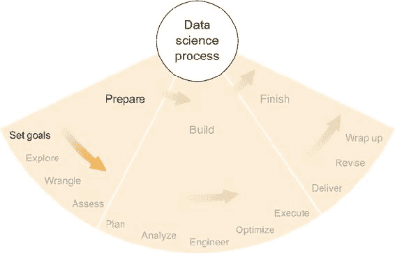

### 2.1. 倾听客户

数据科学中的每个项目都有一个客户。有时客户是支付你或你的公司进行项目的人——例如，客户或承包机构。在学术界，客户可能是一位要求你分析他们数据的实验室科学家。有时客户是你、你的老板或另一位同事。无论客户是谁，他们对你，即被分配项目的数据科学家，都有一些期望。通常，这些期望与以下内容相关：

+   需要回答的问题或需要解决的问题

+   一个有形的最终产品，例如报告或软件应用

+   前期研究或相关项目及产品的摘要

期望可以来自几乎任何地方。有些是希望和梦想，而另一些则是从经验或对类似项目的知识中汲取而来。但典型的期望讨论归结为两个方面：客户想要什么与数据科学家认为可能什么。这可以描述为愿望与实用主义，客户描述他们的愿望，而数据科学家根据明显的可行性予以批准、拒绝或限定每一个。另一方面，如果你愿意将自己视为数据科学家，一个愿望的授予者，那么你不会是唯一这样做的人！

#### 2.1.1. 解决愿望与实用主义

关于客户的愿望，它们可以从完全合理到完全荒谬，这是可以接受的。商业发展和硬科学的大部分内容都是由直觉驱动的。CEO、生物学家、营销人员和物理学家都使用他们的经验和知识来发展关于世界如何运作的理论。其中一些理论有可靠的数据和分析支持，但其他理论则更多地来自直觉，这是个人在广泛从事其领域工作时发展起来的概念框架。许多领域与数据科学的一个显著区别是，在数据科学中，如果客户有一个愿望，即使是经验丰富的数据科学家也可能不知道这是否可行。而软件工程师通常知道软件工具能够执行的任务，生物学家也大致知道实验室能够做什么，但尚未见过或处理过相关数据的数据科学家面临着大量的不确定性，主要关于具体可用的数据以及它能够提供多少证据来回答任何给定的问题。不确定性再次是数据科学过程中的一个主要因素，在谈论客户愿望时应该始终将其放在首位。

例如，在我与生物学家和基因表达数据共事的几年里，我开始形成自己关于 RNA 如何从 DNA 翻译以及 RNA 链如何在细胞中漂浮并与其他分子相互作用的观念。我是一个视觉型的人，所以我经常想象一条由数百或甚至数千个核苷酸组成的 RNA 链，每个核苷酸看起来像代表一种碱基化合物的四个字母之一（A、C、G 或 T；为了方便，我将用*T*代替*U*）并且整个链看起来像一条长而灵活的链，只有细胞内部的机器才能理解这个句子。由于 RNA 及其核苷酸的化学性质，互补序列倾向于相互结合；A 喜欢与 T 结合，C 喜欢与 G 结合。当两条 RNA 链含有近互补序列时，它们很可能粘在一起。如果一条 RNA 链足够灵活并且包含相互互补的序列，它也可能折叠并粘附在自己身上。我已经多次使用这个概念框架来猜测当许多 RNA 在细胞中漂浮时可能发生的事情。

当我开始处理 microRNA 数据时，对我来说，microRNA——大约由 20 个核苷酸组成的短序列——可能绑定到基因 mRNA 序列的一部分（这是直接从对应特定基因的 DNA 链（通常要长得多）翻译过来的 RNA），从而阻止其他分子与基因的 mRNA 相互作用，实际上使该基因序列变得无用。对我来说，一个 RNA 片段可以粘附到遗传 RNA 的一部分，并最终阻止另一个分子粘附到同一部分，这个概念在概念上是合理的。这一概念得到了科学期刊文章和硬数据的支持，这些数据表明，如果它们有互补序列，microRNA 可以抑制遗传 mRNA 的表达或功能。

我曾与一位生物学家教授合作，他有一个更加细腻的概念框架，描述了他如何看待基因、microRNA 和 mRNA 这个系统。特别是，他几十年来一直在研究小鼠的生物学——一种常见的小鼠——并能列出任何数量的显著基因、它们的功能、相关基因和物理系统，以及如果开始进行敲除这些基因的实验，会受到可测量的影响的特征。因为这位教授对小鼠遗传学的了解比我多得多，而且他不可能与我分享他所有的知识，所以在我们投入太多时间在项目的任何方面之前，讨论项目的目标和期望非常重要。没有他的意见，我就会猜测生物相关的目标是什么。如果我是错的，这很可能是，那么这项工作就会白费。例如，某些特定的 microRNA 已经被充分研究，并且已知它们在细胞内完成基本功能，而几乎没有其他功能。如果项目的目标之一是发现研究较少的 microRNA 的新功能，我们可能会希望排除某些 microRNA 家族的分析。如果我们不排除它们，它们很可能会增加细胞内已经非常嘈杂的遗传对话的噪音。这只是教授知道而我不知道的大量重要事情之一，因此在认真开始项目之前，进行关于目标、期望和警告的长时间讨论是必要的。

在某种意义上，这是一种非常普遍的看法，一个项目只有在客户对结果满意的情况下才能被认为是成功的。虽然有一些例外，但无论如何，在数据科学项目的每个步骤中始终牢记期望和目标是很重要的。不幸的是，根据我的经验，期望通常在项目一开始时并不清晰或明显，或者它们不容易简洁地表达。我已经形成了一些习惯，这些习惯帮助我确定合理的目标，这些目标可以指导我完成涉及数据科学项目的每个步骤。

#### 2.1.2\. 客户可能不是数据科学家

关于客户期望的一个有趣之处在于，它们可能并不合适。这并不总是——甚至通常不是——客户的错，因为数据科学所解决的问题本质上是复杂的，如果客户完全理解他们自己的问题，他们可能不需要数据科学家来帮助他们。这就是为什么当客户在语言或理解上不清楚时，我总是给他们一些宽容，并将设定期望和目标的过程视为一种类似冲突解决或关系治疗的联合练习。

你——数据科学家——和客户都对项目成功完成有着共同的兴趣，但你们两个可能有着不同的具体动机、不同的技能，最重要的是，不同的视角。即使你是客户，你也可以将自己视为有两个部分，一个（数据科学家）专注于获得结果，另一个（客户）专注于利用这些结果做些实际的事情，或者超出项目本身的事情。这样，数据科学项目就从寻找两个性格、两个视角之间的共识开始，即使它们并不冲突，至少也是不同的。

虽然严格来说，你和客户之间没有冲突，但有时在你们都朝着一些看似可实现（对数据科学家来说）且有益（对客户来说）的目标摸索的过程中，可能会感觉像是那样。而且，正如在冲突解决和关系治疗中一样，情感是存在的。这些情感可能是意识形态的，由个人经验、偏好或意见驱动，可能对另一方来说没有意义。一点耐心和理解，不要过多评判，对你们两个人，更重要的是对项目，都极为有益。

#### 2.1.3\. 提出具体问题以揭示事实，而非意见

当客户在描述你即将调查的系统中的理论或假设时，他们几乎肯定是在表达事实和观点的混合体，区分这两者可能很重要。例如，在关于小鼠癌症发展的研究中，生物教授告诉我，“众所周知哪些基因与癌症相关，这项研究只关注那些基因以及抑制它们的 microRNAs。”有人可能会倾向于直接接受这个陈述并仅分析与癌症相关基因的数据，但这可能是一个错误，因为陈述中存在一些模糊性。原则上，不清楚其他所谓的非癌症相关基因是否可以参与由实验引发的复杂反应的辅助角色，或者是否众所周知且已证明癌症相关基因的表达完全独立于其他基因。在前一种情况下，忽略与非癌症相关基因对应的数据可能不是一个好主意，而在后一种情况下，可能是一个好主意。如果不解决这个问题，就不知道哪种选择是合适的。因此，询问是很重要的。

同样重要的是，问题本身要以客户理解的方式提出。例如，问“我应该忽略非癌症相关基因的数据吗？”是不明智的。这是一个关于特定案例中数据科学实践的问题，属于你的领域，而不是生物学家。你更应该问类似的问题，比如，“你是否有任何证据表明癌症相关基因的表达通常独立于其他基因？”这是一个关于生物学的问题，希望生物教授能够理解。

在他的回答中，区分他认为的和已知的是很重要的。如果教授只是认为这些基因的表达与其他基因无关，那么在整个项目中保持这一点当然是有意义的，但你不应该基于此做出任何重要决定——例如忽略某些数据。另一方面，如果教授可以引用支持他主张的科学研究，那么建议使用这个事实来做出决定。

在任何项目中，您作为数据科学家，是统计学和软件工具的专家，但主要领域的专家通常不是您，就像涉及生物教授的案例一样。在向这个领域的专家学习时，您应该提出一些问题，这些问题能给您一些关于正在研究的系统如何工作的直观感觉，以及一些试图区分事实、观点和直觉的问题。基于事实做出实际决策总是好主意，但基于观点则可能很危险。这里适用的格言是“信任但核实”。如果我忽略了数据集中的任何基因，我可能真的会错过癌症实验中各种 RNA 之间复杂相互作用的关键方面。结果证明，癌症在遗传水平上以及医学水平上都是一个非常复杂的疾病。

#### 2.1.4\. 提出交付成果：猜测并检查

您的客户可能并不了解数据科学及其所能带来的功能。询问他们“您希望在最终报告中看到什么？”或者“这个分析应用应该做什么？”很可能会得到“我不知道”或者更糟糕的，一个不合理的建议。数据科学不是他们的专业领域，他们可能并不完全清楚软件和数据的可能性和局限性。通常最好通过一系列建议来提出关于最终产品的问题，然后记录客户的反应。

我最喜欢问客户的问题之一是：“您能给我一个例子，说明您希望在最终报告中看到的句子吗？”我可能会得到这样的回答：“我想看到类似这样的句子，比如‘MicroRNA-X 似乎显著抑制基因 Y’”，或者‘基因 Y 和基因 Z 似乎在所有测试样本中表达水平相同’。”这样的回答为构思最终产品的格式提供了一个很好的起点。如果客户能提供这样的种子想法，您就可以在此基础上提出最终产品的建议。然后您可能会问：“如果我给您一个表格，显示特定 miRNA 和遗传 mRNA 之间最强的相互作用，会怎样？”也许客户会认为这很有价值——也许不会。

然而，客户可能做出更不明确的陈述，例如：“我想知道哪些 miRNA 在癌症发展中很重要。”为了成功完成项目，您需要对此进行澄清。在生物学意义上，“重要”是什么意思？这种重要性如何在现有数据中体现？在继续之前，得到这些问题的答案至关重要；如果您不知道 miRNA 的重要性如何在数据中体现，您如何知道何时找到了它？

许多人和我偶尔犯的一个错误是将相关性等同于显著性。有些人谈论相关性混淆因果关系；以下是一个例子：戴头盔的自行车事故发生率高于不戴头盔的自行车。可能会诱使人们得出结论说头盔导致事故，但这可能是错误的。头盔和事故之间的相关性并不意味着头盔导致事故；也不意味着事故导致人们戴头盔（直接）。实际上，在更繁忙、更危险的路上骑行的自行车手更有可能戴头盔，也更有可能发生事故。在更危险的路上骑行这一行为同时导致了这两者。在头盔和事故的问题上，尽管存在相关性，但没有直接的因果关系。因果关系反过来又是一个相关性可能重要的例子。如果你正在进行关于头盔使用和事故率的调查，那么即使没有因果关系，这种相关性也可能很重要。我必须强调，我所说的*显著性*是由项目目标决定的。关于头盔-事故相关性的知识可能导致考虑（并模拟）每个道路的交通和危险水平作为项目的一部分。显著性也不一定由相关性保证。我相当确信更多的自行车事故发生在晴朗的日子里，但这是因为在晴朗的日子里路上有更多的自行车手，而不是因为任何其他显著的关系（除了雨天）。我并不清楚如何利用这些信息进一步实现我的目标，因此我不会花太多时间探索它。在这种情况下，相关性似乎没有任何意义。

在基因/RNA 表达实验中，仅在 10-20 个生物样本中就测量了成千上万的 RNA 序列。这种分析变量（每个 RNA 序列或基因的表达水平）远多于数据点（样本）的情况被称为*高维*或通常称为*欠确定*，因为变量太多，其中一些可能只是随机机会相关联，因此说它们在真实生物学意义上相关是错误的。如果你向生物学教授展示一系列与生物学相关的强相关性，他立刻会指出你报告的一些相关性并不重要，或者更糟糕的是，与既定研究相悖，你将不得不回去做更多分析。

#### 2.1.5\. 基于知识而非愿望迭代你的想法

在你获得的专业知识领域内，区分事实和观点很重要，同样重要的是避免过度乐观使你忽视障碍和困难。我长期以来认为，优秀数据科学家的一项宝贵技能是预见潜在困难并留出绕过它们的路径。

在当今软件行业，在分析功能仍在开发中时宣称其能力是很常见的。据我所知，这是一种销售策略，对于年轻的初创公司来说，在竞争激烈的市场中取得领先似乎是一种必要手段。当我与一家初创公司合作时，如果我的同事正在积极推销一款我声称可以构建但并不完全确定能否按计划工作的分析软件，这总是让我感到紧张，因为考虑到我所拥有的数据的某些限制。当我关于一个假设产品做出大胆声明时，我会尽可能地将其保持在几乎可以确定我能做到的事情的范围内。如果我不能做到，我会尝试制定一个不涉及原始计划中最复杂部分的备用计划。

假设你想开发一个总结新闻文章的应用程序。你需要创建一个算法，该算法可以解析文章中的句子和段落并提取主要观点。编写这样的算法是可能的，但尚不清楚其性能如何。总结可能在某些意义上对大多数文章都有效，但 51%的成功率和 99%的成功率之间有很大的差距，而且你只有在至少构建了一个版本之后才能知道你的特定算法在这个范围内处于什么位置。盲目地推销和狂热地开发这个算法可能看起来是最好的主意；辛勤的工作会得到回报，对吧？也许吧。这项任务很难。完全有可能，尽管你尽力了，但你永远无法超过 75%的成功率，而且从商业角度来看，这可能还不够好。那么你该怎么办？你是放弃并关闭店铺吗？你是在这次失败之后才开始寻找替代方案的吗？

良好的数据科学家在开始之前就知道一项任务有多难。句子和段落是复杂的、随机的变量，它们往往似乎专门设计来挫败你可能会向它们投掷的任何算法。在失败的情况下，我总是回到第一原理，从某种意义上说。我会问自己：我试图解决什么问题？除了总结之外，最终目标是什么？

如果目标是构建一个使阅读新闻更高效的产品，也许有另一种方法来解决效率低下的新闻读者的难题。也许更容易的做法是将类似的文章聚合在一起并一起呈现给读者。也许可以通过更友好的设计或通过整合社交媒体来设计一个更好的新闻阅读器。

没有人愿意宣布失败，但数据科学是一个充满风险的业务，假装失败从未发生本身就是一种失败。总有多种方法可以解决问题，制定一个承认可能遇到障碍和失败的计划，可以让你在实现主要目标之前，从微小的成功中获得价值。

一个更大的错误是忽视失败的可能性，以及测试和评估应用程序性能的需要。如果你假设产品几乎完美无缺，但实际上并非如此，将产品交付给客户可能是一个巨大的错误。你能想象如果你开始销售一个据说总结新闻文章但很快用户开始抱怨总结完全错误的应用程序吗？不仅应用程序会失败，你和你的公司可能会因为软件不工作而获得坏名声。

### 2.2. 提出好的问题——针对数据

初看起来，这个部分似乎可以与前一部分合并，我甚至提到了几种向客户提出好问题的方法。但在这个部分，我讨论的问题不仅是对客户知识的探究，也是对数据能力的探究。数据集所能告诉我们的不会超过我们向它提出的问题，而且即使如此，数据也可能无法回答问题。这是两个最危险的陷阱：

+   期望数据能够回答它无法回答的问题

+   对数据提出的问题不能解决原始问题

提出能够引导出有信息量答案并随后改善结果的问题是一个重要且复杂的问题，它值得比通常所得到的更多讨论。我在前几节中提到的良好或至少有帮助的问题在措辞和范围上相当具体，即使它们可以应用于许多类型的项目。在接下来的小节中，我试图定义并描述一个好问题，目的是提供一个框架或思维过程，用于为任意项目生成好问题。希望你能看到，通过提出一些问题，你可能会得到一些有用的、好的问题，你可以向数据提出这些问题。

#### 2.2.1. 好问题的假设是具体的

没有任何问题像基于错误假设的问题那样难以回答。但基于不明确假设的问题紧随其后。每个问题都有假设，如果这些假设不成立，可能会对你的项目造成灾难。考虑你问题的假设并决定这些假设是否安全是很重要的。而且为了你能判断假设是否安全，它们需要是*具体的*，这意味着定义明确且能够被测试。

简短地来说，我曾经在一家对冲基金工作过。我在量化研究部门，我们的主要目标是，就像任何对冲基金一样，寻找金融市场中可能被利用以获得货币收益的模式。我工作的交易算法的一个关键方面是模型选择的方法。模型选择对于数学建模来说，就像试穿裤子购物一样：我们尝试了很多，评判它们，然后选择一个或几个看起来对我们很有用的，希望它们在未来能为我们服务得很好。

在我开始在这家对冲基金工作几个月后，又聘请了一位刚从研究生院毕业的数学家。她开始直接参与算法中的模型选择方面。有一天，在去吃午饭的路上，她开始向我描述，许多商品市场的数学模型已经开始与它们长期平均成功率大相径庭。例如，假设模型 A 在过去三年中有 55%的时间正确预测了原油日价的涨跌。但在过去的四周里，模型 A 只有 32%的时间是正确的。我的同事告诉我，由于模型 A 的成功率已经低于其长期平均水平，它必然会在接下来的几周内恢复，我们应该赌模型 A 的预测。

实话实说，我对我的同事感到失望，但她的错误很容易犯。当一个特定的数量——在这个例子中是模型 A 的成功率——通常返回其长期均值时，这被称为*均值回归*，并且它是许多现实生活系统的著名争议假设之一，其中最不多的就是世界金融市场。

这个世界上无数的系统都不遵循均值回归。抛一枚标准硬币就是其中之一。如果你抛硬币 100 次，只看到 32 次正面，你认为在接下来的 100 次投掷中你会看到超过 50 次正面吗？我肯定不会，至少不会到愿意赌这个程度。一枚（公平的）硬币被抛掷的历史不会影响硬币的未来，商品市场通常也是这样。诚然，许多基金在金融市场中发现了可利用的模式，但这些只是例外而不是规则。

均值回归的假设是你在问数据时可能遇到的错误假设的一个很好的例子。在这种情况下，我的同事问的是“模型 A 的成功率会回到其长期平均水平吗？”基于均值回归的假设，答案将是肯定的：均值回归意味着当模型 A 最近连续出现错误时，它将更频繁地正确。但如果你在这个情况下不假设均值回归，答案将是“我不知道。”

承认你的假设——总是有假设——并且确保它们是真实的，或者至少确保如果假设被证明是错误的，你的结果不会被破坏，这一点非常重要。但这说起来容易做起来难。实现这一目标的一种方法是将你分析到结论之间的所有推理分解成具体的逻辑步骤，并确保所有差距都被填补。在我以前同事的例子中，原始的推理步骤如下：

1.  模型 A 的成功率最近相对较低。

1.  因此，模型 A 在近期内的成功率将相对较高。

数据告诉你 1，然后 2 是你得出的结论。如果这里缺失的逻辑步骤不明显，那么当你用可能随时间上升或下降的任意数量 X 替换模型 A 的成功率时，可能更容易看到它：

1.  X 最近已经下降。

1.  因此，X 将很快上升。

想想 X 可能是什么：股价、降雨量、学校的成绩、银行账户余额。对于这些中的哪一个，前面的逻辑是有意义的？是否有缺失的步骤？我会争辩说确实有一个缺失的步骤。逻辑应该是这样的：

1.  X 最近已经下降。

1.  因为 X 总是会纠正自己，朝着某个值 V，

1.  X 将很快上升，朝着 V 方向。

注意数据已经告诉了你 1，就像之前一样，你希望能够在 3 中得出结论，但 3 依赖于 2 是真实的。2 是真实的吗？再次，想想 X 可能是什么。显然，对于银行账户余额或降雨量来说，2 不是真实的，所以它不可能总是真实的。你必须问自己，对于你正在检查的特定数量来说，它是否是真实的：你有什么理由相信，在任意时间段内，模型 A 的预测应该有 55% 的时间是正确的？在这种情况下，你唯一能证明模型 A 有 55% 的时间是正确的证据是，模型 A 历史上有 55% 的时间是正确的。这就像循环推理一样，这不是足够的真实证据来证明假设。均值回归不应该被视为真理，而且模型 A 在近期内应该有 55% 或更多的时间是正确的这一结论是没有根据的。

作为一名数学家，我受过训练，将所有分析、论证和结论都分成逻辑步骤，这种经验在通过数据科学做出和证明现实生活中的结论和预测方面证明了自己是无价的。在大学数学课程工作中学到的技能中，形式推理可能是我最重视的。关于推理的一个重要事实是——再次强调我在本节中试图说明的观点——一个错误或不清晰的假设会让你从一个可疑的地方开始，你应该尽一切努力避免依赖这样的错误假设。

#### 2.2.2. 好的答案：可衡量的成功，成本不高

也许将重点转移到对好问题的答案上，可以更清楚地了解好问题包含的内容，以及帮助你决定何时你的答案足够。好问题的答案应该在某种程度上可衡量地改善项目的状况。关键是，你应该提出无论答案如何都能使你的工作变得更容易，并使你更接近实际结果的问题。

你如何知道回答一个问题是否会让你更接近有用的、实际的结果？让我们回到这样的想法：数据科学家最宝贵的特质之一是他们对可能发生的事情的意识以及他们为这种情况做准备的能力。如果你能想象所有（或至少大多数）可能的结果，那么你可以从它们中得出逻辑结论。如果你知道逻辑结论——你可以从新的结果中推断出的额外知识——那么你可以弄清楚它们是否会帮助你实现项目的目标。

可能会有广泛的结果，其中许多是有帮助的。尽管这不是一个详尽的列表，但如果你提出并回答导致正面或负面结果、消除可能的路径或结论或提高情境意识的问题，你就可以更接近你项目的目标。

正面和负面结果都可以是有帮助的。我所说的*正面*结果是指那些在你最初提问时你怀疑和/或希望得到的结果。这些结果显然是有帮助的，因为它们符合你对项目的思考过程，并且直接推动你朝着目标前进。毕竟，目标还是未实现的正面结果，如果得到证实，会给你的客户提供一些实际的好处。

*负面*结果是有帮助的，因为它们告诉你，你原本认为可能正确的事情实际上是不正确的。这些结果通常感觉像是挫折，但从实际的角度来看，它们是所有可能结果中最具信息量的。假设你发现尽管有所有相反的历史证据，太阳明天不会升起，这会是什么情况？这是一个极端的例子，但你能想象如果它被证实为真，会有多具信息量吗？这会改变一切，而且你很可能会是少数几个知道这一点的人之一，因为它是如此反直觉的。从这种意义上说，负面结果可能是最有帮助的，尽管它们通常需要你根据新的信息重新调整目标。至少，负面结果迫使你重新思考你的项目，以考虑这些结果，这个过程会导致更明智的选择和更现实的项目路径。

如我在第一章中提到的，数据科学充满了不确定性。通往解决方案的路径总是很多，通往失败的道路也很多，甚至通往成功与失败之间的灰色地带的路径更多。对于任何这些可能路径或结论的不可能性证据或直接排除，都可能有助于通知和聚焦项目的下一步。一条路径可以通过多种方式被排除或被认为是不可能的，这可能包括以下几种：

+   新信息使一条路径的可能性大大降低

+   新信息使其他路径的可能性大大增加

+   技术挑战使得探索某些路径非常困难或不可能

如果排除一条路径似乎没有帮助——也许它是唯一可能成功的路径之一——请记住，无论如何你的情况已经变得简单了，这可能是好事。或者，利用这个机会重新思考你的路径集合和项目知识。也许有更多数据、更多资源，或者你还没有想到的其他东西，这些都可能帮助你从新的角度看待挑战。

在数据科学中，提高情境意识总是好的。你不知道的东西可能会伤害你，因为一个未知量会悄悄地进入你项目的某个方面并破坏结果。如果一个问题有助于你深入了解一个系统是如何工作的，或者哪些外围事件正在发生，这些事件会影响数据集，那么这个问题就是好的。如果你在某些时候发现自己说“我想知道如果...”，或者如果同事也有同样的想法，问问自己这个想法是否与一个问题相关，这个问题可以帮助你为项目获得一些背景信息——如果不是回答一个更大、更直接的问题。以这种方式进行内省，为通常模糊的任务寻找好的结果带来了一些正式性和程序性。

### 2.3. 使用数据回答问题

你有很好的问题，现在你想要答案。毕竟，提供解决问题的答案是整个项目的目标。从数据科学项目中获得答案通常看起来像图 2.2 中的公式或食谱。尽管有时其中一个成分——好的问题、相关数据或深入的分析——比其他成分更容易获得，但三者对于获得有用的答案都是至关重要的。此外，我选择的四个形容词（每个成分中有一个：*好的*、*相关的*、*有洞察力的*）和结果中的一个（*有用的*）不应被忽视，因为没有它们，公式并不总是有效。任何旧问题、数据和分析的产物并不总是答案，更不用说有用的答案了。值得重申的是，你需要在项目的每个步骤中都深思熟虑，而这个公式的元素也不例外。例如，如果你有一个好的问题但数据不相关，找到答案将很困难。

##### 图 2.2. 数据科学项目中有用答案的食谱

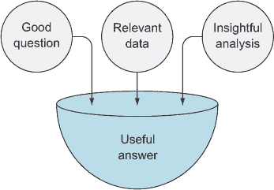

#### 2.3.1. 数据是否相关且足够？

并非总是容易判断数据是否相关。例如，假设你正在构建一个啤酒推荐算法。用户会选择一些他们喜欢的啤酒，算法将推荐他们可能喜欢的其他啤酒。你可能假设啤酒爱好者通常喜欢某些类型的啤酒而不喜欢其他类型的啤酒，因此他们的喜好倾向于聚集在他们最喜欢的啤酒类型中。这是一个好问题：啤酒爱好者是否对某些类型的啤酒比对其他类型的啤酒有显著偏好？你有一个来自流行的啤酒评分网站的数据集，由数千名网站用户的一到五星级评分组成。你希望使用这些数据来测试你的假设；这些数据是否相关？

很快你就会意识到数据集是一个只包含三个列的 CSV 文件：`USER_NAME`、`BEER_NAME`和`RATING`。（糟糕！没有啤酒类型。）之前看似极其相关的数据集现在对这个问题来说似乎不那么相关了。当然，对于一个关于啤酒类型的问题，你需要知道每款啤酒的类型。因此，为了回答这个问题，你必须找到匹配啤酒和啤酒类型的数据集，或者尝试从你已有的数据中推断啤酒类型，可能基于啤酒的名称。

无论哪种方式，都应该很明显，最初看起来能够完美回答问题的数据集需要一些额外的资源才能做到这一点。一个有远见和意识的数据科学家可以在这些问题耗费你或你的同事时间或金钱之前预见这些问题。第一步是具体说明数据将如何帮助你回答你的问题。在调查对啤酒类型的亲和力的情况下，这样的声明可能就足够了：

> 为了找出啤酒爱好者是否对某些类型的啤酒比对其他类型的啤酒有显著偏好，我们需要包含啤酒名称、啤酒类型、用户名以及他们对啤酒的个别评分的数据。有了这些数据，我们可以进行统计分析，例如方差分析（ANOVA），将每种啤酒类型作为一个变量，并检查啤酒类型是否对个别用户的评分有显著影响。

忽略统计测试描述中缺乏具体细节的问题（在这里并不重要，但我们在后面的章节中会回到这个问题），你这里有一个基本的大纲，说明如何使用你认为可用的数据来回答问题。可能有其他类似的方案也能同样好或更好地达到目的，但一个好的大纲会说明你需要哪些数据以及你将如何使用这些数据来回答问题。通过说明数据集应具有的具体属性，你或你合作的人可以快速检查数据集（或多个数据集）是否满足要求。

我（就像我认识的大多数人一样）有时会基于我认为拥有的数据而不是实际拥有的数据来创建算法。当我意识到我的错误时，我已经在毫无价值的代码上浪费了一些时间（幸运的是，不多）。通过简要概述你打算如何使用数据来回答问题，你就可以很容易地检查确保你打算使用的数据集包含了你列出的所有必要信息——在你开始编码之前。如果数据集缺少关键信息，你可以调整你的计划，要么在其他地方找到缺失的部分，要么制定另一个不需要它的计划/大纲。在数据科学项目的这个阶段进行规划可以节省你以后大量的时间和精力。在项目后期大量修改代码或完全废弃它通常不是有效利用时间的方式。

在以下小节中，我概述了一些你可以使用的步骤，以制定一个坚实而详细的计划来寻找和使用数据来回答特定的问题。在后面的章节中，我将详细讨论收集和使用数据，但在这里我想介绍在整个项目中需要注意和牢记的基本思想。你通常有很多选择，如果这些选择后来证明效率低下——或者完全错误——那么记录下你可以做出的其他选择会很有帮助。

#### 2.3.2\. 以前有人做过吗？

这应该是制定计划的第一个步骤：在网上搜索博客文章、科学文章、开源项目、大学的研究描述或任何你可以找到的与你要开始的项目相关的其他内容。如果其他人已经做了类似的事情，你可能会对尚未遇到的挑战和能力获得很多洞察。再次强调，意识是非常有帮助的。

关于其他人已经完成的项目，你可能会在你的项目中遇到类似的问题和类似的解决方案，因此最好尽可能多地了解你应该注意什么以及如何处理这些问题。

有时，一点搜索可能会带你找到你之前未见过的有用数据集，你可能没有考虑过的分析方法，或者最好的是，你可以用于你自己的项目的结果或结论。假设分析是严谨的——但总是最好进行验证——其他人可能已经为你做了很多工作。

#### 2.3.3\. 确定可以使用哪些数据和软件

现在你已经搜索了相关信息，包括先前的类似项目和相关的数据集，你应该盘点一下你有什么，你还需要什么。

##### 数据

如果你想象出一个可以极大地帮助你数据集，但这个数据集在任何地方都不存在，那么在将来你意识到可以做什么的时候，记下这一点通常很有帮助。例如，如果你在啤酒评分数据集中缺少啤酒类型标签，你可能会发现许多酿酒厂在他们的网站上列出了这些类型，或者在其他网页上。这为你提供了自己收集它们的机会，可能需要时间和精力。如果你记下这个需求和这个潜在解决方案，那么在未来的任何时候，你都可以重新评估成本和收益，并决定如何继续前进。由于与以数据为中心的项目相关的许多不确定性，可能选择的成本和收益几乎在任何时候都可能发生变化。

##### 软件

大多数数据科学家都有一个用于数据分析的 favorite 工具，但这个工具可能并不总是适合你打算做的事情。在尝试将这个概念与可以将概念转化为现实的软件相匹配之前，考虑你想要进行的分析的概念通常是一个好主意。你可能决定，如果数据支持，统计测试可以提供好的答案，机器学习可以找出你需要分类，或者简单的数据库查询可以回答问题。在任何这些情况下，你可能知道如何使用你喜欢的工具来执行分析，但首先你可能想要考虑你数据的格式，可能需要进行的任何数据转换，你拥有的数据量，将数据加载到分析工具中的方法，以及最后在工具中的分析方法。在执行这些步骤之前思考所有这些步骤，并考虑它们在实际中可能如何工作，当然可以导致软件工具选择的更好选择。

如果你不太熟悉许多软件工具和技术，你现在可以跳过这一步，继续阅读，因为我在后面的章节中会涵盖这些内容。但就目前而言，我只想强调在做出任何选择之前，有意识地思考各种选项的重要性。这个决定可能具有重大影响，不应轻率对待。

#### 2.3.4. 预期实现所有愿望的障碍

在项目的这个规划阶段，你可能想要问自己以下问题：

+   数据是否容易访问和提取？

+   你是否知道关于数据的一些可能重要的信息，但你可能不知道？

+   你是否有足够的数据？

+   你是否有太多的数据？处理这些数据是否会花费太多时间？

+   是否有缺失的数据？

+   如果你正在组合多个数据集，你是否确定一切都会正确集成？两个数据集中名称、ID 和代码是否相同？

+   如果你的统计测试或其他算法没有给出你预期的结果，会发生什么？

+   你有方法来检查你的结果吗？如果检查显示某处有错误怎么办？

其中一些可能看起来很明显，但我已经看到足够多的人——数据科学家、软件工程师以及其他一些人——忘记考虑这些事情，并且他们在后来的忽视中付出了代价。最好是在一开始就提醒你要持怀疑态度，这样任务的不可确定性就不会给你带来太多的损失。

### 2.4\. 设定目标

我在本章中多次提到了目标，但尚未直接讨论它们。尽管你可能已经带着一些目标开始了这个项目，但现在是一个很好的时机，在预期的疑问、数据和答案的背景下评估它们。

通常，初始目标是在考虑一些商业目的的情况下设定的。如果你不在商业领域——比如你在研究——那么目的通常是外部使用结果，比如在特定领域推进科学知识或为其他人提供分析工具。尽管目标起源于项目本身之外的环境，但每个目标都应该根据数据科学进行实用筛选。这个筛选包括提出以下问题：

+   什么是可能的？

+   什么是有价值的？

+   什么是高效的？

将这个筛选应用于所有潜在目标，考虑到好问题、可能的答案、可用数据和预见的障碍，可以帮助你确定一个坚实的目标集，这些目标既可能实现，又具有价值，并且是高效的。

#### 2.4.1\. 什么是可能的？

有时很明显什么是可能的，但有时并不明显。在接下来的章节中，我将描述一些看似简单的任务实际上并不简单。例如，找到合适的数据，处理数据，利用数据来获取答案，设计软件进行分析，以及面对任何其他障碍，如我在上一节中提到的那些，都可能影响你实现某个目标的能力。任务越复杂，你对任务事先了解得越少，任务实现的可能性就越小。例如，如果你认为某个数据集存在，但你还没有确认，那么实现任何需要该数据集的目标可能是不可能的。对于任何具有不确定性的目标，考虑实现目标可能是不可能的。

#### 2.4.2\. 什么是有价值的？

一些目标比其他目标带来更多的利益。如果资源稀缺，在其他条件相同的情况下，追求更有益的目标会更好。在商业领域，这可能意味着追求预期将带来最高利润增长的目标。在学术界，这可能意味着追求最具影响力的科学出版物。正式考虑实现目标预期的价值，正如我这里所建议的，为项目规划创造了一个有意识的背景和框架。

#### 2.4.3\. 什么是高效的？

在考虑了可能性和价值之后，你可以考虑实现每个目标可能需要的努力和资源。然后你可以通过以下方程式来近似效率：

> 效率 = 价值 / 努力 * 可能性

实现目标的整体效率是实现它的价值除以实现它所需的努力（每单位努力获得的价值）乘以可能性（实现它的概率）。效率随着目标价值的增加而提高，如果需要更多的努力，则效率会下降，如果目标看起来不太可能实现，则效率也会下降。这只是一个粗略的计算，它在概念上对我更有意义，但在实际应用中帮助不大，但我确实觉得它很有帮助。

### 2.5. 计划：保持灵活

考虑到你对项目的所有了解，你迄今为止所做的研究，以及你对自己可能使用的关于数据和软件工具的假设性问题，现在是制定计划的时候了。这不应该是一个包含事先假设结果的连续步骤的计划。数据和数据科学的不可确定性几乎保证了事情不会按照你预期的方向发展。考虑几种可能实现目标的不同方法是一个好的策略。甚至目标本身也可以是灵活的。

这些替代路径可能代表不同的总体策略，但在大多数情况下，计划中的两条路径会在预期存在不确定性的地方分叉，即两个最可能的情况表明两种不同的策略来应对不确定性的结果。从一开始就制定一个计划到第一个主要不确定性是非常明智的。如果你想在那里停下来，这可能会节省你一些计划时间，但最好还是规划出所有最可能的路径，特别是如果你与多个人合作。这样，每个人都可以看到项目将走向何方，并且从一开始就知道会有问题和绕路，但你还没有知道它们会是哪些。这就是数据科学家的生活！

最后，你在这里制定的计划将在整个项目（以及本书）中定期回顾，因此计划的早期阶段是最重要的。一个好的目标是为下一步制定计划，以便你在下次回顾计划和目标时能获得充分的信息。增加知识和减少不确定性总是好事。

### 练习

考虑以下场景：

你在一家为顾客整合个人财务数据的公司工作，这些顾客主要是个人消费者。让我们称这家公司为 Filthy Money, Inc，简称 FMI。通过 FMI 的主要产品，一个网络应用程序，客户可以在一个地方查看他们所有的数据，而不是需要分别登录他们每个财务账户的网站。典型的客户已经将他们的几个账户，如银行账户和信用卡，连接到了 FMI 应用程序。

FMI 的主要产品设计师要求你帮助构建一个名为“脏钱预测”的新产品组件，该组件旨在根据用户的消费和收入习惯，为 FMI 应用的用户提供其账户和整体财务状况的短期预测。产品设计师希望与你合作，找出可能性和一些可能的好产品特性：

> **1.**
> 
> 你会向产品设计师提出哪三个问题？
> 
> **2.**
> 
> 你可能会对数据提出哪三个好问题？
> 
> **3.**
> 
> 项目可能的三项目标是什么？

### 摘要

+   保持警觉：经验、领域专家和其他相关项目的知识有助于你在问题出现之前进行规划和预测。

+   注意客户的角度和可能缺乏数据科学知识。

+   确保项目专注于回答好问题。

+   花时间思考所有可能的路径来回答那些好问题。

+   使用客户想要、你已开发的问题以及获取答案的可能路径的实用视角来设定目标。

## 第三章. 我们周围的数据：虚拟荒野

*本章涵盖*

+   发现你可能需要的数据

+   在各种环境中与数据交互

+   结合不同的数据集

本章讨论数据科学家研究的主要物种：数据。拥有数据——即有用的数据——通常被视为理所当然，但通常不主张做这样的假设。与任何值得科学研究的主题一样，数据可能难以找到和捕捉，并且很少完全被理解。对你拥有的或希望拥有的数据集的任何错误观念都可能导致代价高昂的问题，因此在本章中，我讨论了将数据作为科学研究对象的处理方式。

### 3.1. 数据作为研究对象

近年来，关于数据科学领域是否仅仅是大数据时代一些较老领域（如运筹学、决策科学、分析、数据挖掘、数学建模或应用统计学等）的转世或分支的讨论似乎永无止境。与任何流行术语或话题一样，关于其定义和概念的讨论只有在术语的流行度下降后才会停止。我认为我无法比之前那些定义数据科学的人做得更好，所以这里引用维基百科（[`en.wikipedia.org/wiki/Data_science`](https://en.wikipedia.org/wiki/Data_science)）的定义，稍作改写，就足够了：

> 数据科学是从数据中提取知识。

虽然足够简单，但这个描述并没有区分数据*科学*与其他许多类似术语，除了可能声称*数据科学*是一个涵盖所有这些术语的总称。另一方面，这个数据科学时代有一个以前时代所不具备的特性，对我来说，这是一个相当有说服力的理由来为新术语命名，这些术语用于描述数据科学家所做的事情，而以前的应⽤统计学家和数据导向的软件工程师并没有做这些事情。这个理由帮助我强调了数据科学中经常被忽视但非常重要的一个方面，如图 3.1figure 3.1 所示。

##### 图 3.1. 数据科学过程准备阶段第二步：探索可用数据

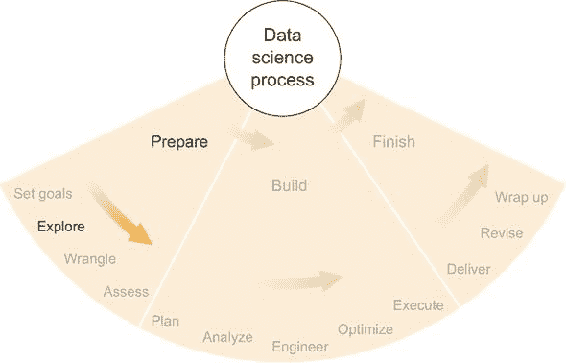

#### 3.1.1. 计算机和互联网的用户成为数据生成者

在最近的历史中，计算机在计算能力、存储能力和完成以前闻所未闻的任务的通用能力方面取得了惊人的进步。自近一个世纪前现代计算机发明以来，每一代计算机都见证了机器的体积不断缩小，其性能比上一代最强大的超级计算机高几个数量级。

包括二十世纪后半叶至二十一世纪初以及现在的这个时期，通常被称为信息时代。信息时代，以计算机和互联网的普及为特征，可以细分为几个更小的转变，这些转变与数据分析有关。

首先，早期的计算机主要用于进行以前需要不合理时间的计算。破解军事密码、船舶导航以及在应用物理学中进行模拟是早期计算机执行的计算密集型任务。

第二，人们开始使用计算机进行沟通，互联网在规模和容量上得到了发展。数据和信息可以轻松地发送到很远的距离。这使得数据分析师能够在一个地方收集更大、更多样化的数据集进行研究。在 20 世纪 90 年代，发达国家的普通人的互联网接入量大幅增加，使数十亿人能够访问发布的信息和数据。

第三，虽然早期互联网的使用主要由公众消费发布的内容和与他人沟通组成，但很快许多网站和应用的所有者意识到，他们的用户行为的聚合提供了对其自身产品成功以及有时是普遍人类行为的宝贵见解。这些网站开始收集用户数据，形式包括点击、输入文本、网站访问以及其他用户可能采取的任何行动。用户开始产生的数据比他们消费的数据更多。

第四，移动互联网和智能手机的出现，使得收集用户数据的数量和具体性有了巨大的进步。在任何时刻，您的移动设备都能够记录和传输其传感器所能收集的每一比特信息（位置、移动、摄像头图像和视频、声音等），以及您在使用设备时故意采取的每一个动作。如果您启用或允许其收集，这可能会是一大批信息。

第五——尽管这并不一定是个人移动设备出现之后的直接结果——是几乎在所有电子产品中包含数据收集和互联网连接。通常被称为物联网（IoT），这可以包括从您的汽车到您的手表，再到您办公楼顶部的气象传感器。当然，从设备收集和传输信息开始的时间远早于 21 世纪，但其普遍性相对较新，互联网上以各种形式（处理过的或原始的，免费或出售）可用的结果数据也是如此。

通过计算设备和互联网增长的这些阶段，网络世界不仅仅是一个消费信息的地方，本身也成为了一个数据收集工具。我在 1990 年代末的高中时期有一个朋友，他建立了一个网站，提供电子贺卡作为收集电子邮件地址的幌子。他以几十万美元的价格出售了由此产生的数百万个电子邮件地址列表。这是一个用户数据价值的原始例子，其用途与网站本身完全无关，也是我年轻时很遗憾错过的一个完美例子。到 2000 年代初，类似规模的电子邮件地址列表不再值这么多钱，但其他类型的用户数据变得非常受欢迎，同样可以卖出高价。

#### 3.1.2\. 数据本身的价值

当人们和企业意识到用户数据可以以相当大的金额出售时，他们开始不加区分地收集它。大量数据开始堆积在各个数据存储库中。在线零售商开始存储您购买的所有商品，以及您查看的每一项商品和点击的每一个链接。视频游戏存储了您的角色形象所走过的每一步以及它击败的每一个对手。各种社交网络存储了您和您的朋友所做的一切。

收集所有这些数据的初衷并不总是为了出售，尽管这种情况经常发生。因为几乎每个主要网站和应用都使用自己的数据来优化用户体验和效果，因此网站和应用发布者通常在数据的销售价值和使用内部价值之间犹豫不决。许多出版商害怕出售他们的数据，因为这可能会让其他人发现用它赚钱的方法。他们中的许多人将数据保留在自己手中，为未来储备，届时他们将有足够的时间榨取数据的全部价值。

互联网巨头 Facebook 和 Amazon 每天每分钟都在收集大量的数据，但据我估计，他们所拥有的数据大部分尚未得到充分利用。Facebook 专注于营销和广告收入，而他们拥有全球人类行为数据中最大的数据集之一。产品设计师、市场营销人员、社会工程师和社会学家如果能够访问 Facebook 的数据，很可能会在他们的学术和工业领域取得重大进展。反过来，如果 Amazon 的数据被学术机构利用，可能会颠覆许多受喜爱的经济原则，并创造几个新的原则。或者它可能能够改变整个行业中零售、制造和物流的工作方式。

这些互联网巨头知道他们的数据很有价值，并且他们自信没有其他人拥有如此规模或质量相似的数据集。无数的公司愿意为访问数据支付高价，但 Facebook 和 Amazon——我推测——有自己使用数据的最大潜力的抱负，因此不希望其他人抢走由此产生的利润。如果这些公司拥有无限资源，他们肯定会试图从每个字节的数据中榨取每一美元。但无论他们多么庞大和强大，他们仍然在资源上有限，并且被迫专注于那些最直接影响他们底线的数据用途，而排除了一些其他有价值的工作。

另一方面，一些公司已经选择提供对其数据的访问权限。Twitter 是一个显著的例子。通过付费，你可以访问 Twitter 平台上的完整数据流，并将其用于自己的项目。围绕数据销售的中介行业已经发展起来，以盈利为目的。这一领域的突出例子是来自各个主要证券交易所的数据市场，这些数据长期以来一直可供购买。

学术和非营利组织通常会将数据集免费公开提供，但可能对如何使用它们有所限制。由于即使在单个科学领域内数据集的差异，数据集的地理位置和格式的合并趋势已经出现。几个主要领域已经创建了组织，其唯一目的是维护包含尽可能多该领域数据集的数据库。通常，科学文章的作者在发表作品之前必须将这些数据提交给这些经典数据存储库之一。

不论以何种形式，数据现在无处不在，它已经不再仅仅是分析师用来得出结论的工具，而成为了一个目的本身。公司现在似乎收集数据作为一种目的，而不是手段，尽管他们中的许多人声称计划在未来使用这些数据。独立于信息时代的其他定义特征，数据已经获得了自己的角色、自己的组织和自己的价值。

#### 3.1.3\. 数据科学家作为探险家

在 21 世纪，数据以前所未有的速度被收集，在许多情况下，收集数据并不是为了特定的目的。无论是私人、公共、免费、出售、结构化、非结构化、大数据、常规大小、社交、科学、被动、主动，还是任何其他类型，数据集无处不在地积累。而几个世纪以来，数据分析师收集自己的数据或被分配一个数据集来工作，历史上第一次，许多来自多个行业的人首先收集数据，然后问，“我能用这个做什么？”还有其他人问，“有没有现成的数据可以解决我的问题？”

以这种方式，数据——无处不在的数据，作为一个假设的集合——已经成为一个值得研究和探索的实体。在过去，数据集通常是有意收集的，因此它们代表了现实世界的一些有意测量。但最近，互联网、无处不在的电子设备和对于错过数据中潜在价值的潜在恐惧，导致我们尽可能多地收集数据，通常基于一个松散的前提，即我们*可能*会在将来使用它。

图 3.2 展示了计算历史中四种主要创新类型的解释：计算能力本身、计算机之间的网络和通信、大数据的收集和使用，以及大数据的严格统计分析。我所说的“大数据”仅仅是指最近捕捉、组织和使用任何可能的数据的运动。每一种计算创新都是从需要解决的一个问题开始的，然后经历四个发展阶段，这个过程类似于卡洛塔·佩雷斯（Carlota Perez）的技术革命与金融资本（Technological Revolutions and Financial Capital，Edward Elgar Publishing，2002）的技术激增周期，但重点在于计算创新及其对计算机用户和公众的影响。

##### 图 3.2。我们目前处于大数据收集和使用的完善阶段，以及大数据统计分析的广泛应用阶段。

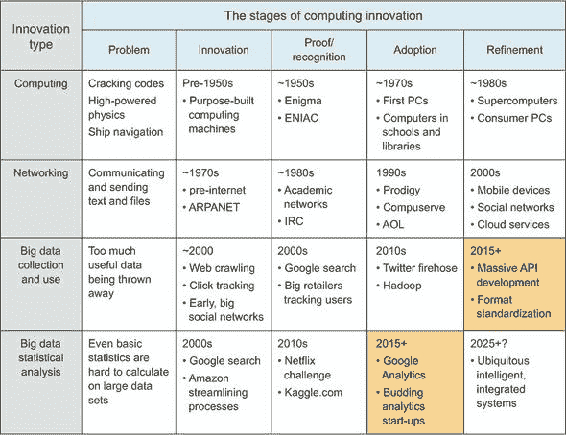

图中包含的每一项创新都包含五个阶段：

1.  ***问题——*** 存在着计算机可以以某种方式解决的问题。

1.  ***发明——*** 可以解决该问题的计算技术被创造出来。

1.  ***证明/认可——*** 有人在有意义的方面使用计算技术，其价值得到证明或至少被一些专家认可。

1.  ***采用——*** 新近证明的技术在工业中得到广泛应用。

1.  ***完善——*** 人们开发新的版本，更多功能，更高效率，与其他工具的集成等等。

由于我们目前处于大数据收集的完善阶段和该数据统计分析的广泛应用阶段，我们创造了一个完整的数据生态系统，其中提取的知识只是包含的总知识的一小部分。不仅许多知识尚未被提取，而且在许多情况下，数据集的全面范围和属性甚至没有人理解，除非是设置系统的少数软件工程师；可能只有那些可能太忙或过于专业而无法利用它的人才能理解数据中包含的内容。所有这些未充分利用或理解不佳的数据的聚合对我来说就像一个全新的大陆，上面有许多未发现的植物和动物物种，一些完全陌生的生物，以及可能是一些由久远文明留下的遗产结构。

这种描述有例外。谷歌、亚马逊、Facebook 和 Twitter 是走在曲线前面的公司的良好例子。在某些情况下，它们正在进行与创新后期阶段相匹配的行为。例如，通过允许访问其整个数据集（通常需要付费），Twitter 似乎正在大数据收集和使用的*完善*阶段运营。世界各地的人们都在试图从用户的推文中榨取每一丝知识。同样，谷歌似乎在以严谨的统计方式分析其数据方面做得很好。它在图像搜索、谷歌分析甚至其基本的文本搜索方面的工作都是大规模坚实统计的良例。然而，可以轻松地争论说，谷歌还有很长的路要走。如果今天的数据生态系统就像一个很大程度上未被探索的大陆，那么数据科学家就是其探险家。就像著名的早期欧洲美洲或太平洋岛屿的探险家一样，一个好的探险家擅长几件事情：

+   进入有趣领域

+   认识到新和有趣的事物

+   认识到可能有趣的事物即将出现的迹象

+   处理新、不熟悉或敏感的事物

+   评估新和不熟悉的事物

+   在熟悉的事物和陌生的事物之间建立联系

+   避免陷阱

一个在南美洲丛林中的探险家可能会用一把大刀砍开丛林灌木，偶然发现几块松散的石头，推断出一个千年古庙就在附近，找到古庙后，从废墟中了解到古代部落的宗教仪式。数据科学家可能会编写一个脚本，从公共 API 中提取一些社交网络数据，意识到少数人构成了主要的社会活动中心，发现这些人经常在他们社交网络上的帖子中提到一个新的照片分享应用，从照片分享应用的公共 API 中获取更多数据，然后通过一些统计分析将两个数据集结合起来，了解在线社区中网络影响者的行为。这两种情况都揭示了关于社会运作的先前未知信息。像探险家一样，现代数据科学家通常必须调查地形，仔细注意周围环境，四处走走，然后深入一些不熟悉的领域看看会发生什么。当他们发现有趣的东西时，他们必须检查它，弄清楚它能做什么，从中学习，并且能够将这种知识应用于未来。尽管数据分析不是一个新领域，但数据无处不在的存在——通常无论是否有人在使用它——使我们能够将科学方法应用于对现有数据世界的发现和分析。对我来说，这就是数据科学与所有其前辈之间的区别。数据如此之多，没有人可能全部理解，所以我们将其视为一个独立的世界，值得探索。

将数据视为一片荒野的想法，是使用“数据科学”这一术语而不是其任何对应术语的最有说服力的理由之一。要从数据中获得真实的事实和有用的答案，我们必须使用科学方法，或者在我们这个案例中，是“数据科学方法”：

1.  提出一个问题。

1.  对问题的答案提出一个假设。

1.  提出一个可测试的预测，如果正确，将提供支持假设的证据。

1.  通过涉及数据的实验来测试预测。

1.  通过对实验结果的分析得出适当的结论。

以这种方式，数据科学家只是在做科学家几个世纪以来一直在做的事情，尽管是在数字世界中。今天，我们的一些最伟大的探险家把时间花在虚拟世界中，我们可以在不离开电脑的情况下获得强大的知识。

### 3.2 数据可能存在的地方以及如何与之互动

在我们深入探讨当今数据状态的未知领域之前，我想讨论数据可能采取的形式，这些形式的意义，以及我们最初如何处理它们。平面文件、XML 和 JSON 是一些数据格式，每种格式都有其自身的特性和独特之处。有些比其他更简单，或者更适合某些用途。在本节中，我将讨论几种格式和存储方法，它们的一些优点和缺点，以及你如何利用它们。

尽管很多人可能会反对这一点，但我决定在本节中包含对数据库和 API 的讨论。将文件格式的讨论与数据存储的软件工具结合起来对我来说是有意义的，因为在数据科学项目的初期，这些格式或数据源中的任何一个都是对“数据现在在哪里？”这一问题的有效回答。文件、数据库或 API，数据科学家需要知道的是“我如何访问和提取我需要的数据？”这就是我在这里的目的。

图 3.3 展示了数据科学家可能访问数据的三种基本方式。这可能是一个文件系统上的文件，数据科学家可以将文件读入他们最喜欢的分析工具中。或者数据可能存储在数据库中，数据库也位于文件系统中，但为了访问数据，数据科学家必须使用数据库的接口，这是一个帮助存储和提取数据的软件层。最后，数据可能位于应用程序编程接口（API）之后，这是数据科学家和可能完全未知或陌生的系统之间的软件层。在这三种情况下，数据可以以本节中讨论的任何格式或任何其他格式存储和/或交付给数据科学家。在某些系统中，存储和交付数据紧密交织在一起，因此我选择将它们视为一个单一的概念：将数据放入你的分析工具中。

##### 图 3.3\. 数据科学家可能访问数据的三种方式：从文件系统、数据库或 API

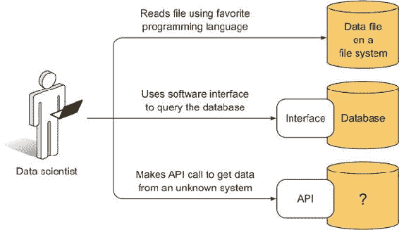

我并不声称涵盖所有可能的数据格式或系统，也不会列出所有技术细节。我的主要目标是提供描述，让读者感到舒适地讨论和接近每一个。我仍然记得，从传统数据库中提取数据对我来说曾经是令人畏惧的，通过本节，我希望让即使是初学者也能感到轻松。只有在你对这些基本的数据存储和访问形式相当熟悉的情况下，你才能继续前进到数据科学最重要的部分：数据能告诉你什么。

#### 3.2.1\. 平面文件

*平面文件* 是纯文本数据集，在没有人为努力去实现其他格式的情况下，大多数情况下的默认数据格式。平面文件是自包含的，你不需要任何特殊的程序来查看其中包含的数据。你可以使用通常称为文本编辑器的程序打开平面文件进行查看，并且每个主要操作系统都有许多文本编辑器可用。平面文件包含 ASCII（或 UTF-8）文本，每个文本字符使用（很可能）8 位（1 字节）的内存/存储。只包含单词 `DATA` 的文件大小将是 32 位。如果在 `DATA` 单词之后有一个行结束（EOL）字符，文件大小将是 40 位，因为需要一个 EOL 字符来表示一行已经结束。我的解释可能对许多人来说看起来很简单，但即使是一些这些基本概念，在我们讨论其他格式时也会变得很重要，所以我感觉最好概述一下平面文件的一些基本属性，这样我们就可以在以后比较其他数据格式。

平面文件主要有两种子类型：纯文本和分隔符。*纯文本* 是键盘上输入的单词。它可能看起来像这样：

```
This is what a plain text flat file looks like. It's just plain ASCII text. Lines don't really end unless there is an end-of-line character, but some text editors will wrap text around anyway, for convenience.
```

```
Usually, every character is a byte, and so there are only 256 possible characters, but there are a lot of caveats to that statement, so if you're really interested, consult a reference about ASCII and UTF-8.
```

这个文件将包含七行，或者技术上说是八行，如果文本最后一行的末尾有一个行结束字符。纯文本平面文件是一系列字符存储在两种（或更多）非常常见的格式之一中。这不同于存储在文字处理程序格式中的文本文档，例如 Microsoft Word 或 Open-Office Writer。（参见“常见错误格式”小节。）文字处理程序文件格式可能包含更多信息，包括如样式格式和有关文件格式本身的元数据等开销，以及可能被插入到文档中的图像和表格等对象。纯文本是包含单词和仅单词的最小文件格式——没有样式，没有花哨的图像。数字和一些特殊字符也可以。

但是如果你的数据包含大量条目，分隔符文件可能是一个更好的选择。*分隔符文件* 是纯文本，但有一个规定，即文件中每隔一段时间会出现一个分隔符，如果你正确地对齐分隔符，你可以制作出类似表格的东西，有行、列和标题。分隔符文件可能看起来像这样：

```
NAME      ID   COLOR     DONE
Alison    1    'blue'    FALSE
Brian     2    'red'     TRUE
Clara     3    'brown'   TRUE
```

让我们称这个表格为 `JOBS_2015`，因为它代表了一组虚构的 2015 年开始的房屋粉刷工作，包括客户姓名、ID、油漆颜色和完成状态。

这个表格恰好是制表符分隔的——或者说制表符分隔值（TSV）——这意味着列由制表符字符分隔。如果在一个文本编辑器中打开，这样的文件通常会像这里一样显示，但可能会选择性地显示文本`\t`，而制表符本应出现的位置。这是因为制表符，就像行尾字符一样，可以用单个 ASCII 字符表示，而这个字符通常用`\t`表示，除非以可变长度的空白字符渲染，以将字符对齐到表格格式。

如果`JOBS_2015`以逗号分隔值（CSV）格式存储，在标准文本编辑器中它将看起来像这样：

```
NAME,ID,COLOR,DONE
Alison,1,'blue',FALSE
Brian,2,'red',TRUE
Clara,3,'brown',TRUE
```

逗号取代了制表符字符，但数据仍然是相同的。在任何情况下，您都可以看到文件中的数据可以解释为一组行和列。行代表`Alison`、`Brian`和`Clara`的每个工作，而标题（第一）行上的列名是`NAME`、`ID`、`COLOR`和`DONE`，给出了表中包含的工作的详细信息类型。

大多数程序，包括电子表格和一些编程语言，要求每行（除可能的首行外）具有相同数量的定界符，以便在它们尝试读取文件时，列数保持一致，并且每行恰好向每列贡献一个条目。一些软件工具不需要这样做，并且它们各自有处理每行条目数量变化的具体方式。

我应该在这里指出，定界符分隔的文件通常被解释为表格，就像电子表格一样。此外，由于纯文本文件可以使用文字处理程序进行读取和存储，因此定界符分隔的文件通常可以加载到电子表格程序，如 Microsoft Excel 或 OpenOffice Calc 中。

任何用于操作文本或表格的常见程序都可以读取平面文件。所有流行的编程语言都包括可以读取此类文件的功能和方法。我最熟悉的两种语言，Python（`csv`包）和 R（`read.table`函数及其变体），都包含可以将 CSV 或 TSV 文件轻松加载到这些语言中最相关数据类型的方法。对于纯文本，Python（`readlines`）和 R（`readLines`）也有按行读取文件的方法，允许通过您认为合适的方法解析文本。这两种语言以及许多其他语言的包提供了加载相关类型文件的功能，我建议查看最近的语言和包文档，以了解是否有其他文件加载方法更适合您的需求。

不压缩文件时，平面文件几乎是文本或表格中最小和最简单的常见文件格式。其他文件格式包含有关文件格式或数据结构的特定信息。由于它们是最简单的文件格式，因此通常最容易阅读。但是，由于它们非常精简，除了显示数据外，它们不提供任何其他功能，因此对于较大的数据集，平面文件变得效率低下。使用 Python 这样的语言扫描包含数百万行文本的平面文件可能需要几分钟或几小时。在读取平面文件太慢的情况下，有设计用来快速解析大量数据的替代数据存储系统。这些被称为*数据库*，将在后面的章节中介绍。

#### 3.2.2\. HTML

*标记语言*是用标签或特别指定的指令标记的纯文本，这些指令说明了文本应该如何被解释。非常流行的超文本标记语言（HTML）在互联网上被广泛使用，一个片段可能看起来像这样：

```
<html>
    <body>
        <div class="column">
            <h1>Column One</h1>
            <p>This is a paragraph</p>
        </div>

        <div class="column">
            <h1>Column Two</h1>
            <p>This is another paragraph</p>
        </div>
    </body>
</html>
```

HTML 解释器知道，在`<html>`和`</html>`标签之间的所有内容都应该被视为 HTML 并读取。同样，在`<body>`和`</body>`标签之间的所有内容将被视为文档的主体，这在 HTML 渲染中具有特殊含义。大多数 HTML 标签的格式为`<TAGNAME>`以开始注释，`</TAGNAME>`以结束注释，其中 TAGNAME 是任意名称。现在，两个标签之间的所有内容都被视为由 TAGNAME 注释，解释器可以使用它来渲染文档。示例中的两个`<div>`标签展示了如何标记两块文本和其他内容，并且将一个名为`column`的类应用于`div`，允许解释器以特殊方式处理`column`实例。

HTML 主要用于创建网页，因此它通常看起来更像文档而不是数据集，具有标题、主体以及一些样式和格式化信息。HTML 通常不用于存储原始数据，但它当然能够做到这一点。实际上，*网络爬虫*的概念通常涉及编写能够抓取和读取网页、解释 HTML 并抓取 HTML 页面中感兴趣的具体部分的代码。

例如，假设我们感兴趣的是收集尽可能多的博客文章，并且一个特定的博客平台使用 `<div class="column">` 标签来表示博客文章中的列。我们可以编写一个脚本，系统地访问一个博客，解析 HTML，寻找 `<div class="column">` 标签，捕获它和相应的 `</div>` 标签之间的所有文本，然后丢弃其他所有内容，然后再去访问另一个博客做同样的事情。这是网络爬虫，如果所需数据不包含在其他更友好的格式中，这可能会很有用。网络爬虫有时被网站所有者禁止，因此最好小心行事，在爬虫之前检查网站的版权和服务条款。

#### 3.2.3\. XML

可扩展标记语言（XML）看起来很像 HTML，但通常更适合存储和传输文档和数据，而不仅仅是网页。前面的 HTML 片段可以是有效的 XML，尽管大多数 XML 文档都是以一个声明特定 XML 版本的标签开始的，如下所示：

```
<?xml version="1.0" encoding="UTF-8"?>
```

这个声明有助于确保 XML 解释器以适当的方式读取标签。否则，XML 的工作方式与 HTML 类似，但没有与网页相关的许多开销。XML 现在用作离线文档的标准格式，例如 OpenOffice 和 Microsoft Office 格式。由于 XML 规范旨在机器可读，它也可以用于数据传输，例如通过 API。例如，许多官方财务文件以可扩展商业报告语言（XBRL）的形式公开，而 XBRL 是基于 XML 的。

这是对表格 `JOBS_2015` 的前两行的 XML 表示：

```
<JOB>
     <NAME>Alison</NAME>
     <ID>1</ID>
     <COLOR>'blue'</COLOR>
     <DONE>FALSE</DONE>
</JOB>
<JOB>
     <NAME>Brian</NAME>
     <ID>2</ID>
     <COLOR>'red'</COLOR>
     <DONE>TRUE</DONE>
</JOB>
```

您可以看到，表格的每一行都由一个 `<JOB>` 标签表示，并且在每个 `JOB` 中，表格的列名已被用作标签来表示各种信息字段。显然，以这种格式存储数据比标准表格占用更多的磁盘空间，因为 XML 标签占用磁盘空间，但 XML 的灵活性要大得多，因为它不受行和列格式的限制。因此，它在需要这种灵活性的应用程序和文档中变得流行。

#### 3.2.4\. JSON

虽然不是标记语言，但 JavaScript 对象表示法（JSON）在功能上相似，至少在存储或传输数据时是这样。JSON 通常描述的更像是一种数据结构，例如在许多流行的编程语言中的列表、映射或字典。以下是表格 `JOBS_2015` 的前两行的 JSON 数据：

```
[
     {
          NAME: "Alison",
          ID: 1,
          COLOR: "blue",
          DONE: False
     },
     {
          NAME: "Brian",
          ID: 2,
          COLOR: "red",
          DONE: True
     }
]
```

在结构方面，这种 JSON 表示形式看起来与您已经看到的 XML 表示形式非常相似。但 JSON 表示形式在表达数据所需的字符数量上更为精简，因为 JSON 被设计用来表示数据对象，而不是作为文档标记语言。因此，在传输数据方面，JSON 已经变得非常流行。JSON 的一个巨大好处是它可以直接作为 JavaScript 代码读取，许多流行的编程语言，包括 Python 和 Java，都有对 JSON 作为原生数据对象的自然表示。对于编程语言之间的互操作性，JSON 几乎无与伦比，其易用性极高。

#### 3.2.5. 关系数据库

*数据库* 是一种数据存储系统，它被优化以在各种环境中尽可能高效地存储和检索数据。从理论上讲，关系数据库（最常见的数据库类型）包含的不仅仅是表格的集合，这些表格同样可以用已讨论的分隔文件来表示：行和列的名称以及每一行-列对的单一数据点。但数据库被设计为搜索——或者用常见的术语来说，*查询*——表格条目中的特定值或值范围。

例如，让我们回顾一下 `JOBS_2015` 表：

```
NAME      ID     COLOR     DONE
Alison    1     'blue'     FALSE
Brian     2     'red'      TRUE
Clara     3     'brown'    TRUE
```

但这次假设这个表格是存储在数据库中的许多表格之一。一个数据库查询可以用简单的英语表述如下：

```
From JOBS_2015, show me all NAME in rows where DONE=TRUE
```

这个查询应该返回以下内容：

```
Brian
Clara
```

这是一个基本的查询，尽管许多数据库都有自己的语言来表述这样的查询，尽管许多数据库共享相同的查询语言基础，最常见的是结构化查询语言（SQL）。

现在想象一下，如果表格包含数百万行，并且你想执行与刚才显示的类似的查询。通过一些软件工程的技巧，这里不会详细讨论，一个设计良好的数据库能够比扫描平面文件更快地检索出符合某些标准（查询）的表格行集。这意味着如果你正在编写一个需要经常搜索特定数据的应用程序，如果你使用数据库而不是平面文件，你可能会将检索速度提高几个数量级。

数据库擅长快速检索特定数据的主要原因在于数据库索引。一个 *数据库索引* 本身就是一个数据结构，它帮助数据库软件快速找到相关数据。它就像数据库内容的结构图，已经以巧妙的方式排序和存储，并且可能需要在数据库中的数据发生变化时更新。然而，数据库索引并非通用，这意味着数据库管理员需要选择哪些表格列应该被索引，如果默认设置不合适的话。被选为索引的列是查询将最有效的列，因此索引的选择对于使用该数据库的应用程序的效率来说是一个重要的选择。

除了查询之外，数据库通常擅长的另一个操作是连接表。查询和连接并不是数据库擅长的唯一两个操作，但它们是使用数据库而不是其他数据存储系统的最常见原因。在数据库术语中，“连接”意味着将两个数据表合并，以创建一个新的表，该表包含两个原始表的一些信息。

例如，假设你有一个名为 `CUST_ZIP_CODES` 的以下表格：

```
CUST_ID  ZIP_CODE
1        21230
2        45069
3        21230
4        98033
```

你想调查 2015 年中哪些油漆颜色被用于哪些 ZIP 代码。因为各种工作中的颜色在 `JOBS_2015` 表中，而客户的 ZIP 代码在 `CUST_ZIP_CODES` 表中，你需要连接这两个表以匹配颜色和 ZIP 代码。可以使用以下简单的英语描述内连接，匹配 `JOBS_2015` 表的 `ID` 和 `CUST_ZIP_CODES` 表的 `CUST_ID`：

```
JOIN tables JOBS_2015 and CUST_ZIP_CODES where ID equals CUST_ID, and
show me ZIP_CODE and COLOR.
```

你是在告诉数据库首先匹配两个表中的客户 ID 号码，然后只显示你关心的两列。请注意，两个表之间没有重复的列名，所以没有命名上的歧义。但在实践中，你通常需要使用类似 `CUST_ZIP_CODES.CUST_ID` 的表示法来表示 `CUST_ZIP_CODES` 表的 `CUST_ID` 列。这里我使用简短版本以节省篇幅。

连接的结果看起来可能如下所示：

```
ZIP_CODE    COLOR
21230       'blue'
45069       'red'
21230       'brown'
```

如果原始表很大，连接可能是一个非常庞大的操作。如果每个表都有数百万个不同的 ID，那么对所有这些 ID 进行排序和匹配可能需要很长时间。因此，如果你要连接表，你应该尽量减小这些表的大小（主要是行数），因为数据库软件将不得不根据连接标准对两个表的所有行进行重新排序，直到在新表中创建所有适当的行组合。连接应该谨慎且小心地进行。

如果你要进行查询和连接操作，一个好的通用规则是先查询数据，然后再进行连接。例如，如果你只关心 `ZIP_CODE 21230` 中的 `COLOR`，通常最好是先查询 `CUST_ZIP_CODES` 表中的 `ZIP_CODE=21230`，然后将结果与 `JOBS_2015` 表连接，而不是先连接然后查询。这样，可能需要匹配的记录会少得多，整体操作执行速度也会更快。关于优化数据库操作的信息和指导，你可以在市面上找到许多实用的数据库书籍。

你可以将数据库一般地看作是有良好组织的图书馆，它们的索引就像是优秀的图书管理员。图书管理员可以在几秒钟内找到你需要的那本书，而你可能需要花很长时间才能找到它。如果你有一个相对较大的数据集，并且发现你的代码或软件工具在任意时刻都在花费大量时间搜索所需数据，那么设置数据库绝对值得考虑。

#### 3.2.6. 非关系型数据库

即使你没有表格数据，你也可能仍然能够利用数据库索引的效率。一类名为 *NoSQL*（通常解释为“不仅限于 SQL”）的数据库允许在更传统的 SQL 风格的关系数据库之外使用数据库模式。图数据库和文档数据库通常被归类为 NoSQL 数据库。

许多 NoSQL 数据库以熟悉的格式返回查询结果。例如，Elasticsearch 和 MongoDB 返回的结果以 JSON 格式（在第 3.2.4 节中讨论）。Elasticsearch 尤其是一个面向文档的数据库，在索引文本内容方面非常出色。例如，如果你正在处理大量的博客文章或书籍，并且执行诸如计算每篇博客文章或书籍中单词出现次数的操作，那么如果正确索引，Elasticsearch 通常是一个不错的选择。

一些 NoSQL 数据库的另一个可能优势是，由于模式的高度灵活性，你可以几乎将任何东西放入 NoSQL 数据库而不会遇到太多麻烦。字符串？映射？列表？当然！为什么不呢？例如，MongoDB 非常容易设置和使用，但这样你可能就会失去通过设置更严格的索引和适用于你数据的模式所获得的一些性能。

总的来说，如果你正在处理大量非表格数据，那么很可能有人已经开发了一个擅长索引、查询和检索你这类数据的数据库。在网上快速查找一下，看看别人在类似情况下使用什么，这绝对值得。

#### 3.2.7\. API

一种 *应用程序编程接口* (API) 在其最常见的形式中是一套与软件进行通信的规则。在数据方面，可以将 API 视为一个网关，通过它你可以发出请求并接收数据，使用一组定义良好的术语。数据库有 API；它们定义了你在查询中必须使用的语言，例如，为了接收你想要的数据。

许多网站也有 API。例如，Tumblr 就有一个公开的 API，允许你请求并接收有关 Tumblr 某类内容的详细信息，以 JSON 格式。Tumblr 拥有包含其博客服务上托管的所有数十亿条帖子的巨大数据库。但它已经决定了作为公众成员的你可以在数据库中访问什么以及不能访问什么。访问方法和限制由 API 定义。

Tumblr 的 API 是一个可通过 HTTP 访问的 REST API。我从未发现 *REST API* 的技术定义很有帮助，但这是一个当人们讨论可通过 HTTP 访问的 API 时使用的术语——这意味着您通常可以从网页浏览器中访问它们，并且以熟悉的格式返回信息。例如，如果您在 Tumblr 上注册为开发者（免费），您可以得到一个 API 密钥。这个 API 密钥是一个只属于您的字符串，它告诉 Tumblr 每当您发起请求时，您正在使用 API。然后，在您的网页浏览器中，您可以粘贴 URL [`api.tumblr.com/v2/blog/good.tumblr.com/info?api_key=API_KEY`](http://api.tumblr.com/v2/blog/good.tumblr.com/info?api_key=API_KEY)，这将请求有关 Tumblr 上特定博客的信息（用您获得的 API 密钥替换 API_KEY）。按下 Enter 后，响应应该出现在您的浏览器窗口中，看起来像这样（经过一些重新格式化）：

```
{
    meta:
    {
        status: 200,
        msg: "OK"
    },
    response:
    {
        blog:
        {
            title: "",
            name: "good",
            posts: 2435,
            url: "http://good.tumblr.com/",
            updated: 1425428288,
            description: "<font size="6">
                        GOOD is a magazine for the global citizen.
                        </font>",
            likes: 429
        }
    }
}
```

这是在 `description` 字段中包含一些 HTML 的 JSON。它包含有关请求状态的元数据，然后是一个 `response` 字段，包含请求的数据。假设您知道如何解析 JSON 字符串（以及类似地 HTML），您可以使用它以编程方式。如果您对 Tumblr 博客的点赞数感兴趣，您可以使用此 API 请求有关任何数量博客的信息，并比较它们收到的点赞数。但是，您不应该从您的浏览器窗口中这样做，因为这会花费很长时间。

为了以编程方式捕获 Tumblr API 的响应，您需要在您喜欢的编程语言中使用 HTTP 或 URL 包。在 Python 中有 `urllib`，在 Java 中有 `HttpUrlConnection`，而 R 有 `url`，但每种语言都有许多执行类似任务的包。无论如何，您都需要组装请求 URL（作为一个字符串对象/变量），然后将该请求传递给适当的 URL 获取方法，该方法应返回一个类似于上一个响应的响应，可以捕获为另一个对象/变量。以下是一个 Python 中的示例：

```
import urllib

requestURL = \
    'http://api.tumblr.com/v2/blog/good.tumblr.com/info?api_key=API_KEY'

response = urllib.urlopen(requestURL)
```

运行这些代码后，变量 `response` 应该包含一个类似于之前显示的 JSON 字符串。

我记得我是从 Python 中学习如何使用这样的 API 的，一开始我有点困惑和不知所措。如果从各个部分（例如，基本 URL、参数、API 密钥等）以编程方式组装请求 URL，那么得到完全正确的请求 URL 可能有点棘手。但熟练使用这样的 API 可以成为数据收集中最强大的工具之一，因为通过这些网关可以获取到大量数据。

#### 3.2.8. 常见错误格式

我不是办公室软件套件的粉丝，这并不是什么秘密：文字处理程序、电子表格、邮件客户端。幸运的是，我很少需要使用它们。只要可能，我都会避免使用它们，尤其是在做数据科学时。这并不意味着我不会处理这些文件；相反，我不会放弃免费的数据。但我确保尽快摆脱任何不便的格式。除非我使用为它们专门构建的高度专业化的程序，否则通常没有很好的方法与它们交互。这些程序通常无法进行数据科学家通常需要的分析。我不记得上一次我是如何（或看到）在 Microsoft Excel 中做（或看到）一段扎实的科学数据；对我来说，Excel 的分析方法有限，界面对于查看表格以外的任何东西来说都不方便。但我知道我有偏见，所以如果你确信你可以在电子表格内进行严谨的分析，请不要介意我。OpenOffice Calc 和 Microsoft Excel 都允许您将电子表格中的单个工作表导出为 CSV 格式。如果 Microsoft Word 文档包含我想使用的文本，我会将其导出为纯文本、HTML 或 XML 格式。

PDF 也可能是一个棘手的东西。我已经从 PDF 中导出了很多文本（或复制粘贴）到纯文本文件中，然后我将这些文件读入 Python 程序。这是我最喜欢的数据整理例子之一，我将在整个章节中讨论这个话题，所以现在只需说，在可能的情况下，从 PDF（如果可能）导出或抓取文本通常是一个好主意，无论你想要分析该文本。

#### 3.2.9. 不寻常的格式

这是所有我不熟悉的数据格式和存储系统的总类别。各种格式都可用，我相信有人出于很好的理由开发了它们，但出于某种原因，它们对我来说并不熟悉。有时它们是过时的；也许它们被另一种格式取代了，但一些遗留数据集尚未更新。

有时格式非常专业。我曾经参与过一个项目，探索一个化合物的化学结构和它与化合物气味（其香气）的联系。`RDKit`包（[www.rdkit.org](http://www.rdkit.org)）提供了大量有用的功能，用于解析化学结构和子结构。但其中许多功能高度特定于化学结构和其符号。此外，该包对化学结构的某些方面的相当复杂的二进制表示进行了大量使用，这大大提高了算法的计算效率，但也使得它们极其难以理解。

当我遇到一个与我之前所见完全不同的数据存储系统时，我会这样做：

1.  在线搜索并搜索（再搜索）几个与我想要做的事情类似的人的例子。将这些例子适应我的需求可能会有多难？

1.  决定我有多想得到这些数据。这是否值得麻烦？有哪些替代方案？

1.  如果值得，我会尝试从找到的类似例子中归纳总结。有时，通过调整参数和方法，我可以逐渐从例子中扩展。我会尝试几件事情，看看会发生什么。

处理完全陌生的数据格式或存储系统可能是其自身的一种探索类型，但请放心，某处有人之前已经访问过这些数据。如果没有人访问过这些数据，那么在最初创建数据格式时，有人肯定犯了完全的错误。如有疑问，发送几封电子邮件，尝试找到能帮助你的人。

#### 3.2.10. 决定使用哪种格式

有时候你并没有选择。数据以某种格式传入，你必须处理它。但如果你发现这种格式效率低下、难以操作或不受欢迎，你通常可以自由地设置一个二级数据存储，这可能使事情变得更容易，但代价是设置二级数据存储所需的时间和精力。对于访问效率至关重要的应用，这种成本可能是值得的。对于较小的项目，可能就不一定了。当你到达那里时，你必须跨过那座桥。

我将以一些关于在可以选择的情况下以及特别是当你打算从编程语言访问数据时使用哪些数据格式的通用规则来结束本节。表 3.1 给出了与特定类型数据交互的最常见优秀格式。

##### 表 3.1. 一些常见的数据类型和适合存储它们的格式

| 数据类型 | 优秀的，常见的格式 |
| --- | --- |
| 表格数据，数量较少 | 分隔的平面文件 |
| 表格数据，大量且需要大量搜索/查询 | 关系型数据库 |
| 纯文本，数量较少 | 平面文件 |
| 纯文本，大量 | 具有文本搜索功能的关系型数据库 |
| 在组件之间传输数据 | JSON |
| 传输文档 | XML |

这里还有一些关于选择或转换数据格式的指南：

+   对于电子表格和其他办公文档，导出！

+   更常见的格式通常更适合你的数据类型和应用。

+   不要花太多时间从某种格式转换到你的首选格式；首先权衡成本和收益。

现在我已经涵盖了数据可能呈现给你的许多形式，希望你在关于数据格式、存储和 API 的高级对话中会感到有些舒适。一如既往，不要犹豫，向别人询问你之前没听过的术语或系统的详细信息。新的系统正在不断开发中，根据我的经验，最近了解过某个系统的人通常很乐意帮助他人了解它。

### 3.3. 数据侦察

上一节讨论了许多数据常见的格式，从文件格式到数据库再到 API。我的目的是使这些数据形式更容易接近，并提高您对寻找数据方式的意识。找到数据并不难，就像在特定气候中找到一棵树或一条河一样简单。但找到能帮助您解决问题数据则是另一回事。或者，也许您已经从内部系统中获得了数据。这些数据似乎可以回答您项目的重大问题，但您不应该想当然。也许某个数据集可以完美地补充您已经拥有的数据，并极大地提高结果。互联网和其他地方有如此多的数据；其中一部分应该能够帮助您。即使不能，快速搜索也绝对值得，即使是对可能性很小的搜索也是如此。

在本节中，我讨论了寻找可能帮助您项目的数据的行为。这正是我在本章开头所提到的探索。现在，您已经对上一节中常见的数据形式有所了解，您可以减少对格式的关注，更多地关注内容和它是否能够帮助您。

#### 3.3.1\. 第一步：谷歌搜索

这可能看起来很明显，但我仍然觉得有必要提一下：谷歌搜索并不完美。为了使它们尽可能有效，您必须知道要搜索什么以及您在搜索结果中寻找什么。鉴于上一节对数据格式的介绍，您现在在谷歌搜索中比以前有更多的“弹药”。

谷歌搜索“Tumblr 数据”和搜索“Tumblr API”的结果不同。鉴于我目前没有涉及 Tumblr 的具体项目，我不确定我更喜欢哪一个。前者返回涉及 Tumblr 帖子中使用的术语*数据*以及第三方销售历史 Tumblr 数据的结果。后者返回几乎完全与官方 Tumblr API 相关的结果，其中包含有关 Tumblr 帖子的最新信息。根据您的项目，一个可能比另一个更好。

但确实值得记住的是，诸如*数据*和*API*之类的术语在网页搜索中确实会产生影响。尝试搜索“社交网络”和“社交网络 API”。结果有明显的差异。

因此，在搜索与您的项目相关的数据时，务必包括如*历史*、*API*、*实时*等修饰词，因为它们确实会产生影响。同样，在搜索结果中也要注意它们。这可能看起来很明显，但它对您找到所需内容的能力有相当大的影响，因此值得重复。

#### 3.3.2\. 版权和许可

我已经讨论了搜索、访问和使用数据，但还有一个非常重要的关注点：您*是否允许*使用它？

就像软件许可证一样，数据可能存在许可、版权或其他限制，这可能会使得在特定目的下使用数据成为非法行为。例如，如果数据来自学术来源（如大学、研究机构等），那么通常会有一个限制，即数据不能用于盈利。像 Tumblr 或 Twitter 这样的专有数据，通常带有限制，即你不能使用数据来复制平台本身提供的功能。你可能无法制作一个与标准 Tumblr 平台做同样事情的 Tumblr 客户端，但如果你提供平台不包括的其他功能，可能就不会有限制。这样的限制很棘手，最好阅读数据提供者提供的任何法律文件。此外，通常好的做法是搜索其他人或公司以类似方式使用数据的例子，看看是否有任何关于法律问题的参考。先例并不能保证特定数据的使用在法律上是合理的，但它可能在你是否使用数据的决定上提供指导。

总而言之，你应该敏锐地意识到，大多数不属于你或你所在组织的数据集都带有使用限制。如果不确认你的使用案例是合法的，你仍然面临失去数据访问权或更糟糕的是，面临诉讼的风险。

#### 3.3.3. 你拥有的数据：是否足够？

假设你已经找到了数据，并确认你可以为你的项目使用它。你应该继续寻找更多数据，还是应该立即处理你拥有的数据？这个问题的答案——就像数据科学中的几乎所有事情一样——很棘手。在这种情况下，答案之所以棘手，是因为数据集并不总是像它们看起来或你希望它们看起来的那样，或者你希望它们成为的那样。以 Uber 为例，这是一家出租车服务应用发布商。我最近读到，Uber（在败诉后）被迫（在上诉失败后）向纽约市的出租车和豪华轿车委员会（TLC）提交行程数据。假设你是 TLC 的员工，你希望比较 Uber 与传统出租车服务在许多特定路线上的乘客行程数量。鉴于你拥有 Uber 和传统出租车服务的数据，似乎很容易比较两种汽车服务之间相似路线的行程数量。但一旦你开始分析，你就会意识到 Uber 提供的是以 ZIP 代码为单位的接送地点，而这恰好是 TLC 所要求的最低具体性。ZIP 代码可以覆盖很大的区域，尽管在纽约市可能不如其他地方那么大。从数据分析的角度来看，地址或至少城市街区会更好，但要求这样的具体性会带来关于出租车服务用户个人隐私的法律问题，因此这是可以理解的。

那么，你应该怎么做呢？在最初的失望情绪消退之后，你可能需要检查你的数据是否足够，或者你是否需要补充这些数据以及/或者修改你的项目计划。通常，有一种简单的方法可以完成这个任务：你能通过几个你打算分析的特定例子来运行一下，看看是否会产生显著的影响吗？

在这个出租车与优步的例子中，你想要找出 ZIP 代码的相对非特异性是否仍然可以为你想要评估的许多路线提供一个有用的近似值。选择一个特定的路线，比如说从时代广场（ZIP 代码：10036）到布鲁克林音乐学院（ZIP 代码：11217）。如果一辆车在 10036 和 11217 之间行驶，那么乘客可能还乘坐了哪些其他特定的路线？在这种情况下，那些相同的 ZIP 代码也可能描述从无畏号海、空与太空博物馆到格兰德军营广场的行程，或者同样是从地狱厨房的一家餐厅到帕克斜坡的一套公寓的行程。这些可能对纽约市以外的人来说意义不大，但就我们的目的而言，可以说这些其他地点距离所选路线的起点和终点最多一公里，这个距离大约是十分钟的步行路程，按照纽约的标准，并不是很短。决定这些在同一 ZIP 代码中的其他地点是否足够接近或太远于它们的目标，这取决于你，作为数据科学家。这个决定反过来应该基于项目的目标和（来自第二章）你希望回答的精确问题。

#### 3.3.4. 合并数据源

如果你发现你的数据集不足以回答你的问题，而且你找不到足够的数据集，那么仍然有可能通过合并数据集来找到答案。这看似是一个显而易见但值得提及的观点，因为它的重要性，以及可能出现的几个棘手问题。

将两个（或更多）数据集合并可能就像拼拼图一样。如果这个拼图在比喻意义上是你希望拥有的完整数据集，那么拼图的每一块——即数据集——都需要精确地覆盖其他拼图块所没有的部分。当然，与拼图块不同，数据集在某种程度上可以重叠，但所有现有拼图块组合后留下的任何间隙都是一个需要克服或绕过的障碍，无论是通过改变计划还是通过重新评估你将如何回答你的问题。

你的多个数据集可能以多种格式到来。如果你擅长操作这些格式中的每一个，这通常不会造成问题，但如果它们以截然不同的形式存在，那么理解数据集之间如何相互关联可能会很困难。对我来说，数据库表和 CSV 文件很相似——它们都有行和列——所以我通常可以想象它们可能如何结合在一起，就像本章前面提到的数据库示例中，一个数据集（一个表）提供客户的颜色选择，另一个数据集（另一个表）提供客户的 ZIP 代码。这两个可以很容易地结合起来，因为这两个数据集都是基于相同的客户 ID 集。如果你能想象如何将两个数据集中的客户 ID 匹配起来，然后结合相关信息——在数据库术语中称为“连接”——那么你可以想象如何有用地结合这两个数据集。

另一方面，合并数据集可能并不那么简单。在我担任巴尔的摩一家分析软件公司首席数据科学家期间，我参与了一个项目，我们的团队在法律调查中分析电子邮件数据集。这些电子邮件以几十个 PST 格式的文件形式交付给我们，这是微软 Outlook 的存档格式。我之前见过这种格式，因为我之前曾与现在公开且广泛研究的安然电子邮件数据集合作过。每个存档文件包含一个人的电脑上的电子邮件，由于被调查的人经常互相发送电子邮件，数据集存在重叠。除了已删除的电子邮件外，每封电子邮件都存在于发送者和接收者的存档中。人们可能会觉得将所有电子邮件存档合并成一个文件很容易——我选择了一个简单的大型 CSV 文件作为目标格式，然后分析这个文件。但事实并非如此。

从每个存档中提取单个电子邮件并将它们转换为 CSV 文件的一行相对容易。我很快意识到，困难的部分是确保我能清楚地记录所有发送者和接收者。实际上，电子邮件发送者和接收者字段中列出的名称并不标准化——当你发送电子邮件时，`SENDER`字段中显示的内容并不总是与某人给你发送电子邮件时`RECIPIENT`字段中显示的内容相同。事实上，即使在每个这些字段中，名称也不一致。如果尼古拉·特斯拉给托马斯·爱迪生（为保护无辜者，姓名已更改）发送电子邮件，`SENDER`和`RECIPIENT`字段可能是以下任何一种：

```
SENDER                             RECIPIENT
Nikola Tesla <nikola@ac.org>       Thomas Edison, CEO <thomas@coned.com>
Nikola <nikola.tesla@ac.org>       thomas.edison@dc.com
ntesla@gmail.com                   tommyed@comcast.com
nikola@tesla.me                    Tom <t@coned.com>
wirelesspower@@tesla.me            litebulbz@hotmail.com
```

其中一些可能被识别为特斯拉或爱迪生，即使在没有上下文的情况下也是如此，但其他一些则不然。为了确保每封电子邮件都归因于正确的人，你还需要一个与正确姓名匹配的电子邮件地址列表。我没有那个列表，所以我尽我所能，做出了一些假设，并使用了一些模糊字符串匹配和抽查（在下一章关于数据整理中讨论）来尽可能多地匹配电子邮件与适当的姓名。我认为多个电子邮件数据集可以很好地合并在一起，但很快我就发现情况并非如此。

数据集可以以任何数量的方式不同；格式、命名法、范围（地理、时间等）只是其中的一些。正如第 3.3.3 节中提到的，在花费太多时间处理多个数据集或进行深入分析之前，了解你的数据是否足够，通常是非常有帮助和有信息的，可以在小规模上检查几个数据点并尝试快速分析。在电子邮件示例中快速查看几个 PST 文件让我意识到文件和字段之间不同的命名方案，并使我能够在项目中计划额外的时间和不可避免的匹配错误。

现在想象一下，将这个电子邮件数据集与内部聊天消息（可能包含不同的用户名）以及专有日历格式的活动/预约结合起来——将它们组装成一个具有明确用户名的单一时间线并不是一个简单的任务，但通过小心谨慎和意识到潜在的风险，这可能是有可能的。

#### 3.3.5. 网络爬虫

有时候，你可以在互联网上找到你需要的信息，但这并不是传统意义上的数据集。社交媒体资料，如 Facebook 或 LinkedIn 上的资料，是互联网上可查看但不易以标准数据格式获取的数据的好例子。因此，有些人选择从网络上爬取这些数据。

我必须明确指出，网络爬虫在很多网站的条款服务中都是被禁止的。有些网站设置了防护措施，一旦检测到爬虫，就会关闭你的访问权限。有时他们能检测到你，因为你访问网页的速度比人类快得多，比如几分钟内访问几千页，甚至几小时。无论如何，人们已经使用爬虫技术收集了他们原本无法获得的有用数据，在某些情况下，通过调整爬虫的行为使其更像人类来绕过任何防护措施。

一个网络爬虫必须做好的两件重要事情是程序化地访问大量 URL 并从页面中捕获正确的信息。如果你想知道你在 Facebook 上的朋友网络，理论上你可以编写一个脚本，访问你所有朋友的 Facebook 个人资料，保存个人资料页面，然后解析页面以获取他们朋友的列表，访问他们朋友的个人资料，等等。这仅适用于允许你查看他们个人资料和好友列表的人，而对于私人资料则不起作用。

2014 年初流行的一个网络爬虫的例子是数学家克里斯·麦金莱（Chris McKinlay）的例子，他使用网络爬虫从流行的约会网站 OKCupid 上的数千个个人资料中捕获数据。他使用收集到的信息——主要是女性对该网站上多项选择题的回答——将女性分为几种类型，并随后为每种他认为有吸引力的类型优化了自己的个人资料。因为他为每种女性集群/类型优化了个人资料，所以该集群中的女性与相应个人资料有很高的匹配分数（根据 OKCupid 自己的算法），因此更有可能与他交谈，并最终与他出去约会。这似乎对他很有帮助，在他遇到想要开始一夫一妻关系的那位女性之前，他已经有数十次约会了。

关于构建网络爬虫的实用性，请参阅您喜欢的编程语言的 HTTP 和 HTML 相关实用程序的文档，以及任何数量的在线指南，特别是关于数据格式第 3.2 节的讨论，尤其是关于 HTML 的讨论。

#### 3.3.6\. 自己测量或收集事物

与我在本章中展示数据的主要方式相反——这是一种想要数据本身的文化产物，无论某人是否打算使用它——你有时有机会以传统方式收集数据。方法可能简单到亲自数一数在特定人行横道处穿越的人数，或者也许给一群感兴趣的人发送调查问卷。当你开始一个新项目时，如果你曾问自己，“我需要的数据存在吗？”并且发现答案是“不存在”或“存在，但我无法获取它”，那么也许问一问“*数据*可以存在吗？”会有所帮助。

“数据可以存在吗？”这个问题旨在引起人们对你可以采取的简单措施的关注，这些措施可以创建你想要的数据集。以下是一些包括在内的措施：

+   **现实生活中测量事物——**使用卷尺、计数、亲自提问等方法可能看起来过时，但它们通常被低估。

+   ***在线测量事物—*** 在互联网上四处点击，计算相关网页、相关谷歌搜索结果的数量以及某些维基百科页面上某些术语的出现次数等，都可以对你的项目有所帮助。

+   ***脚本和网页抓取—*** 在一定时间内重复 API 调用或抓取某些页面可能是有用的，当 API 或网页中的某些元素不断变化，但你无法访问历史记录时。

+   ***数据收集设备—*** 今天的物联网概念在很大程度上得益于其从物理设备中创建数据的价值，其中一些设备能够记录物理世界——例如，摄像头、温度计和陀螺仪。你有没有一个设备（比如你的手机）能帮助你？你能买一个吗？

+   ***日志文件或存档—*** 日志文件有时被俗称为“数字足迹”或“残骸”，它们是由许多软件应用程序留下的（或可以留下的）。它们通常在非常特殊的情况下才会被投入使用（崩溃！错误！）！你能在你的项目中将它们用于良好的用途吗？

对于最后一个要点，与网络爬虫类似，主要任务是手动识别日志文件中是否以及在哪里包含有助于你的数据，并学习如何从包含大量你永远不会需要的数据的日志文件集中程序化地提取这些有用的数据。这可能就是数据荒野的前沿：使用为完全不同的目的而存在的其他数据创建概念上全新的数据集。我相信有人提出了“数据炼金术”作为这种现象的可能名称，但我会让你自己判断你自己的数据提取和转换是否值得这样一个神秘的称号。

### 3.4. 示例：miRNA 和基因表达

当我还是一名博士生时，我的大部分研究都与基因表达的定量建模相关。我之前提到过我在遗传学方面的工作，但直到现在我才深入探讨。我发现这是一个极其有趣的领域。

*遗传学*是研究构成所有生物的代码的科学。这个代码存在于每个生物体的基因组中，由 DNA 或 RNA 组成，并且在每个细胞中都存在其副本。如果一个生物体的基因组已经被测序，那么它的基因组已经被解析成基因和其他类型的非基因序列。在这里，我只关注基因及其表达。生物学家对*基因表达*的概念涉及生物样本中已知基因的活动，我们使用任何可以测量与这些基因直接相关的特定 RNA 序列片段的*拷贝数*或浓度的工具来测量基因表达。如果一个 RNA 片段包含一个已知与某个基因匹配但与其他基因不匹配的序列，那么这个序列可以用作该基因表达的指标。如果这个 RNA 序列在生物样本中非常频繁地出现（高拷贝数或浓度），那么相应基因的表达就被认为是高的，而出现频率低的序列则表明其相关的基因表达水平低。

两种称为*微阵列*和*测序*的技术是测量生物样本中 RNA 序列浓度或拷贝数的常用方法，以测量基因表达。现在测序通常更受欢迎，但在我的博士研究时期，我正在分析微阵列的数据。这些数据是由马里兰大学医学院的一位合作者提供的，他一直在研究*Mus musculus*（一种常见的老鼠）在各个发育阶段的干细胞。在最早阶段，干细胞被知为一种可以随后发展成为多种*分化*或特殊细胞类型的通用类型。细胞通过这些未分化阶段和随后特定分化干细胞类型的进展并不完全理解，但我的合作者和其他人已经假设，一类称为微 RNA 的特殊 RNA 序列可能参与其中。

*微 RNA*（或 miRs）是一类短的 RNA 序列（大约 20 个碱基对，远短于大多数基因），已知几乎存在于所有生物体中。为了确定 miRs 是否有助于调节干细胞的发育和分化，我的合作者使用微阵列测量了基因和 miRs 在干细胞发育早期阶段的表达。

数据集包括七个干细胞类型中每个基因和 miR 的微阵列数据。单个微阵列可以测量几千个基因，或者，也可以测量几百个 miR。对于每种干细胞类型，有两个到三个重复，这意味着每个生物样本都使用两个到三个基因导向的微阵列和两个到三个 miR 导向的微阵列进行分析。重复有助于分析样本之间的差异以及识别异常值。考虑到有 7 种干细胞类型，每种类型基因和 miR 各有 2 到 3 个重复，我总共有了 33 个微阵列。

因为 miR 被认为主要是抑制基因的表达——它们显然与遗传 RNA 的互补部分结合并阻止该 RNA 被复制——我对数据集的主要问题是“我能否找到任何特定 miR 抑制特定基因表达的证据？”当特定 miR 的表达量高时，任何特定基因的表达是否通常都很低？此外，我还想知道任何 miR 的表达和抑制活性是否可以与干细胞发育和分化的特定阶段高度相关。

虽然没有人之前研究过这个具体主题——miR 在小鼠干细胞发育中的影响——但已经在相关主题上做了相当多的工作。特别值得注意的是，一类统计算法试图仅根据序列信息来描述一个特定的 miR 是否会靶向（抑制）遗传 RNA 的特定部分。如果一个 miR 的碱基序列看起来像这样

> ACATGTAACCTGTAGATAGAT

(再次，为了方便，我用 *T* 代替 *U*），那么一个完美的互补遗传 RNA 序列会是

> TGTACATTGGACATCTATCTA

因为，在 RNA 序列中，核苷酸 A 与 T 互补，C 与 G 互补。由于这些 miR 在细胞的细胞质中漂浮，就像遗传 RNA 序列一样，因此即使是一个完美的匹配也不能保证会结合并抑制基因表达。在完美的条件下，这些互补序列会结合，但生物学中没有什么是完美的。据说是这样，一个 miR 和它的完美匹配就像两艘在夜幕下错过的船一样漂浮过去。此外，RNA 序列的一个有趣的特性是，有时它们会弯曲得太多而粘附在自己身上——对于 miR 来说，结果是被称为*发夹*，因为这种形状很容易想象。无论如何，完美互补序列的结合并不是必然的；同样，不完美的匹配也不会结合。许多研究人员已经探索了这个问题，并开发了基于序列互补性和其他特征的算法，为 miR-基因对分配匹配分数。这些通常被称为*目标预测*算法，我在我的工作中使用了两个这样的算法：一个叫做 TargetScan ([www.targetscan.org](http://www.targetscan.org))，另一个叫做 miRanda ([www.microrna.org](http://www.microrna.org))).

TargetScan 和 miRanda 都被广泛视为坚实科学研究的产物，这两个算法及其预测结果都可以在互联网上免费获取。对于我的微阵列数据集中的任何 miR-基因对，我至少有两个目标预测分数，表明 miR 是否可能抑制基因的表达。我从 TargetScan 获得的数据文件看起来像这样（为了清晰起见，删除了一些列）：

```
Gene ID    miRNA         context+ score    percentile
71667      xtr-miR-9b    -0.259            89
71667      xtr-miR-9     -0.248            88
71667      xtr-miR-9a    -0.248            88
```

如您所见，对于每个基因和 miR/miRNA，TargetScan 都给出一个分数，表示 miR 靶向遗传 RNA 的可能性。miRanda 提供了类似的文件。这些分数被认为是并不完美，但它们是有信息的，所以我决定将它们包括作为 miR 抑制基因表达的证据，但不是确凿的证据。

我的主要数据集仍然是我从合作者的实验室获得的微阵列数据集，从这些数据中我可以分析所有基因和 miR 的表达值，并确定它们之间的正负相关性。此外，我还可以将目标预测作为支持某些 miR-基因靶对进一步的证据。在贝叶斯统计框架内——在第八章中讨论得更多——目标预测可以被视为先验知识，我可以根据我收集的新数据调整这种知识——即我从合作者那里收到的新的微阵列数据。这样，预测和噪声数据集都不被视为真理，但它们都为最终估计哪些 miR-基因对最可能是真正的靶向相互作用提供了信息。

到目前为止，在本节中，我谈到了将基因表达数据与 microRNA 数据相结合，以搜索它们之间的靶向相互作用，并分析 miRs 对干细胞发育的影响。此外，我还包括了两个靶标预测数据集作为进一步证据，表明某些 miRs 靶向某些基因。在我基于这些数据集完成分析后，我需要能够表明我的模型指示与干细胞发育相关的 miRs 和基因在某种程度上是有意义的。我可能会以两种方式来做这件事：要求我的生物学家合作者在实验室中测试我的部分结果以确认它们是正确的，或者在网上找到一些已经验证并支持我的结果的数据集。

如果我没有与这类数据工作的经验，我可能会在谷歌上搜索“已验证的 microRNA 靶向”或“干细胞发育基因注释”，但由于我知道从过去的项目中，一个名为基因本体（GO）术语的大规模公共基因注释集是可用的，以及一个已报道在科学出版物中的已验证的 miR-基因靶向相互作用数据库，所以我无需搜索太多。GO 术语注释可以通过几个基于网络的工具（[geneontology.org](http://geneontology.org)）以及 R 语言的包等访问。我之前曾使用这些注释来分析基因组，看看它们是否有共同之处。在这个项目中，如果任何在干细胞发育方面具有显著性的基因组在我的模型中也有与干细胞和干细胞发育相关的显著数量的 GO 注释，这将有助于证实我的结果。

此外，我显然更倾向于认为，我模型发现的任何具有显著性的 miR-基因靶标对，已经通过其他可靠的方式进行过验证。这就是[www.microrna.org](http://www.microrna.org)上*已验证*的靶向相互作用数据集的作用所在。这当然是一个有用的数据集，但其中一点重要之处在于，尽管一些 miR-基因靶标对已经得到确认，但这并不意味着那些尚未得到确认的对就不是真正的靶标对。如果我的模型发现某个特定的靶标对具有显著性，但尚未经过验证，这并不表明模型是错误的。另一方面，如果一个已验证的靶标对根据我的模型没有显示出显著性，那么这就有一些值得关注的理由。总的来说，在我的项目验证步骤中，我希望所有或大多数已验证的靶标对根据模型显示出显著性，但我不一定需要看到我最重要的结果都有验证。

最后，我的合作者对哪些 miRNA 家族（具有部分匹配序列的 miRs 组）对干细胞发育的哪些阶段做出了贡献很感兴趣。结果发现，TargetScan 提供了一个很好地匹配 miRs 及其家族的格式化文件。除了基因表达微阵列、miRNA 表达微阵列、两个目标预测算法的结果、一组基因注释和一些已验证的 miR-gene 目标对之外，我还添加了一个 miR 家族数据集。

不言而喻，这个项目中有很多环节。此外，在学术界，这种情况相当常见，最终的科学论文无法包含每一项分析。有一篇论文描述了模型及其在公共数据集上的应用（“通过部分有序样本的配对表达数据和外源性预测算法推断 mRNA 的 miRNA 调控”，PloS ONE，2012 年）和另一篇论文描述了其在小鼠数据集上的应用（“小鼠造血干细胞和祖细胞亚群的 miR-mRNA 表达相关特征预测‘干性’和‘髓性’相互作用网络”，PLoS ONE，2014 年）。

我不会在这里详细描述所有结果，但我对这个项目非常满意。在将 miRs 及其各自的表达数据集中的预测目标对与 TargetScan 和 miRanda 的预测目标对匹配后，我通过一个包含所有这些数据的贝叶斯模型分析了它们，并使用 GO 注释和已知的目标对验证来验证它，还附加了一些 miR 家族分析。结果并不完美；生物信息学非常复杂，数据质量也不完美。但大多数已验证的目标对都是显著的，一些相关的 GO 注释在显著的基因组中过度表示。在后面的章节中，我将更深入地探讨统计模型、其重要性以及从结果中得出结论，但现在我想把这个例子作为一个例子，其中各种数据集以使新的分析成为可能的方式被结合在一起。

### 练习

继续上一章练习中的 Filthy Money Forecasting 个人财务应用场景，尝试以下练习：

> **1\.**
> 
> 列出三个你预期对这个项目有益的潜在数据来源。对于每个来源，也列出你预期如何访问数据（例如，数据库、API 等）。
> 
> **2\.**
> 
> 考虑到上一章练习 3 中列出的三个项目目标。为了实现这些目标，你需要哪些数据？

### 摘要

+   数据科学将*数据*视为可能独立于任何特定目的存在的东西。就像自然本身，以及其中存在的所有已发现或未发现的生物和物种一样，数据领域值得探索和研究。

+   数据可以存在于许多地方，其可访问性、复杂性和可靠性各不相同。

+   最好先熟悉数据可能采取的一些形式，以及如何查看和操作这些形式。

+   在假设数据集包含你想要的内容之前，最好评估数据的范围和质量。

+   找到和识别对项目有用的数据集并不总是直接的，但一些初步调查可能会有所帮助。

## 第四章\. 数据整理：从捕获到驯化

“本章涵盖”

+   整理数据的方法

+   有用的工具和技术

+   一些常见的陷阱

对“整理”的一个定义是“长期且复杂的争论。”听起来很贴切。

“数据整理”是将数据和信息从困难、非结构化或任意格式中提取出来，并转换为传统软件可以使用的过程。像数据科学的其他许多方面一样，它与其说是一个过程，不如说是一系列策略和技术，这些策略和技术可以在整体项目策略的背景下应用。整理不是一个可以事先精确规定的步骤任务。每个案例都不同，需要一些问题解决技巧才能取得好结果。在我讨论数据整理的具体技术和策略之前，如图 4.1 所示，我将介绍一个案例研究，我将使用这个案例研究来展示本章中提到的那些技术和策略。

##### 图 4.1\. 数据科学过程准备阶段第三步：数据整理


### 4.1\. 案例研究：田径运动史上最佳表现

当我在研究生院学习时，牙买加短跑运动员尤塞恩·博尔特开始以 100 米和 200 米赛跑中惊人的表现震惊世界。在北京 2008 年奥运会上，博尔特在 100 米赛跑中跑出了 9.69 秒的世界纪录，尽管他在冲过终点线之前就伸展开双臂庆祝胜利。几天后，博尔特在 200 米决赛中的 19.30 秒打破了迈克尔·约翰逊的世界纪录，这个纪录被广泛认为是整个田径运动中最好的成绩之一。尤塞恩·博尔特已经确立了自己作为历史上最伟大的短跑运动员的地位，但他仍在不断进步。

在 2009 年柏林世界锦标赛上，尤塞恩·博尔特打破了自身的两项世界纪录。他在 100 米比赛中跑出了 9.58 秒，在 200 米比赛中跑出了 19.19 秒，使得所有竞争对手，世界上最快的人，看起来都变得平庸。具体来说，在 100 米比赛中，美国运动员泰森·盖伊打破了国家纪录——而美国传统上擅长短跑——但在终点线落后博尔特数米。我对博尔特的表现印象深刻，关于“尤塞恩·博尔特的成绩与其他世界纪录相比如何？”和“没有其他运动员像博尔特那样统治过”的讨论无处不在，因此我决定量化博尔特所做的事情的不可能性。我想为所有那些坐在家里对田径充满热情的人解决这个账目，他们大多数只是猜测，使用轶事和启发式方法来展示某个特定表现是多么罕见。

#### 4.1.1\. 常见启发式比较

坐在家里的田径爱好者倾向于通过世界纪录的年龄或其他人接近打破它们的程度来比较不同项目的世界纪录。迈克尔·约翰逊的 200 米世界纪录在尤塞恩·博尔特打破它时已经 12 年了，而 100 米世界纪录在博尔特在 2008 年初第一次打破它时不到一年，之后又在 2008 年奥运会和 2009 年世界锦标赛上再次打破。世界纪录的年龄可能确实表明了记录的一些强度，但这绝对不是完美的衡量标准。博尔特的 200 米 19.19 秒的成绩比他的 19.30 秒成绩差，仅仅是因为之前的记录更年轻吗？当然不是。

有时候人们会引用一个分数相对于第二高分分数的百分比提升作为它是好的证据。捷克运动员扬·泽利兹尼的世界纪录标枪投掷成绩为 98.48 米，比他的第二高分投掷远了 2.9%，比任何其他人的最高成绩远了 5.8%。牙买加运动员尤塞恩·博尔特目前保持的世界纪录 9.58 秒，比他的第二快成绩快了 1.1%，比另一位运动员的最好成绩快了 1.3%，而这位运动员恰好是同一比赛中的第二名，他就是泰森·盖伊。再次强调，这确实是良好表现的合理指标，但由于这些第二高分表现的高变异性，它远非完美。如果，出于某种原因，第二高分表现从未发生过，百分比可能会发生剧烈变化。

#### 4.1.2\. 国际田联评分表

在我 2009 年开始这个项目的时候，存在更复杂的方法，但它们也有其不足之处。教练、粉丝以及许多人普遍接受的方法是，在田径项目中比较不同项目表现的是一套称为国际田联田径评分表的点数表。通常每几年，国际田联就会发布一套更新的点数表。国际田联还发布了用于多学科赛事（如男子十项全能和女子七项全能）的*综合项目*点数表，在这些赛事中，选手在每个项目中的表现都会得到分数，而获胜者是总分最高的运动员。在综合项目中，点数表是比赛本身的基础。个人项目的评分表对比赛的影响很小，除了某些基于表格颁发奖品的田径会议。

2008 年的评分表，在尤塞恩·博尔特以 9.58 秒完成 100 米赛跑时，当时最新的表格，给世界纪录表现评分为 1374 分（表格中列出的最高分数是 1400 分）。在评分表的下一轮更新中，2011 年，尤塞恩·博尔特 2009 年的表现得到了 1356 分的评分。这种评分的巨大变化在大多数项目中都没有发生。为了参考，根据 2008 年的表格，9.58 秒的 100 米成绩相当于 42.09 秒的 400 米赛跑，而根据 2011 年的表格，它相当于 42.37 秒的 400 米。在奥运会的 400 米决赛中，0.28 秒的差距很容易就是金牌和没有奖牌的区别。根据评分表，尤塞恩·博尔特的世界纪录正在变差。

这是有原因的。国际田联的综合评分表众所周知是基于每个项目相对较小的一组最佳成绩。这组小数据可能包括前 10 名或前 25 名，但我只是猜测，因为方法并没有完全公开。如果表格高度依赖于一小组顶尖表现，那么这一组的变化将对下一次更新表格的分数产生显著影响。2008 年和 2009 年的田径赛季产生了一些令人难以置信的 100 米成绩，即使没有尤塞恩·博尔特。这些成绩影响了 2011 年发布的下一组分数。从某种意义上说，通过评分表，尤塞恩·博尔特的世界纪录表现以及他对手的强劲表现最终变得不那么令人印象深刻。

通过回顾这一切，我的意思是只想展示基于太少数据构建模型如何会显著扭曲结果和结论。在评分表中，过去两三年内的一些出色表现极大地改变了我们对这些表现有多好的印象。我的目标是使用我能找到的所有数据来生成一种评分方法，这种方法不仅对最佳表现的改变不太敏感，而且还能很好地预测未来表现水平，这代表了一组良好的外样本数据。

#### 4.1.3\. 使用所有可用数据比较表现

我开始时的最大疑问：我能找到多少数据？各种互联网搜索和询问朋友让我得出结论，[alltime-athletics.com](http://alltime-athletics.com) 提供了最完整的精英田径表现数据集。该网站提供了所有奥运田径项目的最佳表现列表；对于某些项目，列表中包含数千次表现。我觉得，如果我能使用所有这些数据和一点统计知识，我就能提高 IAAF 评分表的鲁棒性和预测能力。

第一步是整理数据。最佳表现列表在网站上，但不是以 CSV 等方便的格式提供，所以我必须通过某种方式进行网络抓取。此外，我还需要将我的分数和结果与我的主要竞争对手 IAAF 评分表进行比较，这些评分表仅以 PDF 格式提供。网页和 PDF 都不是程序解析的理想选择，考虑到网页中的 HTML 结构和 PDF 中的页眉、页脚和数字，两者都可能变得相当杂乱。简单来说，这将需要一些整理。

在接下来的几节中，我将继续提到这个田径项目中的两个整理任务：

+   从网站 [alltime-athletics.com](http://alltime-athletics.com) 整理最佳表现列表

+   从包含它们的 PDF 中整理 IAAF 评分表

### 4.2\. 准备开始整理数据

有些人喜欢立即跳进去，开始随意处理数据，但那不是我的风格。我更倾向于谨慎行事。我喜欢在编写任何代码或尝试任何策略之前先四处看看。我会做一些事情来收集一些关于数据的良好信息，这有助于我更有效地整理数据。

在本节中，首先我会向你展示整理前可能遇到的杂乱数据的样子。然后我会列出一些在你开始整理之前可以采取的步骤，这些步骤有助于你弄清楚你有什么，你应该做什么，以及你可能遇到多少麻烦。

#### 4.2.1\. 一些杂乱数据类型

关于杂乱的数据集，每个数据集都有其独特的方式。如果所有杂乱的数据看起来都一样，我们就会找到一种方法来解析它并快速高效地使用它。尽管我无法一一列举数据杂乱和需要整理的每一种方式，但我可以描述几种方式，并希望这能帮助你了解在深入研究新数据集时可能会出现的问题，以及你如何为此做好准备。

如果你已经在数据科学领域工作了几年，我敢肯定你一定见过这样的案例——或者更糟。截至 2016 年，我们还没有进入“干净数据时代”，我开始怀疑我们是否能够实现。

##### 需要爬取的数据

我在第三章中提到了网络爬虫，但你也可以从 PDF 和其他非传统来源中爬取数据。“爬取”是指从未设计为程序访问的来源中程序性地提取选定元素的过程。要爬取的数据通常结构不佳。但如果你编写一个复杂的爬虫，数据最终可能会变得整洁有序。

##### 损坏的资料

有时候你会发现数据不仅格式不佳，而且直接损坏。这通常意味着文件的一些方面要么缺失，要么由于磁盘错误或其他低级问题而被隐藏。这可以像丢失制作模型飞机的说明或意外混淆应该按顺序排列的一叠索引卡一样。常见的损坏文件格式是 PST，一种电子邮件存档。但幸运的是，我们有许多工具可以从这样的损坏文件中恢复大部分数据。（这是文件格式经常损坏的少数好处之一：有人开发了一个反损坏工具！）

##### 设计不良的数据库

数据库也有成长的烦恼，有时这意味着原本不打算一起使用的两个数据库现在成为了你获取信息的最佳来源。错误来源包括数据库值或键不匹配以及范围、深度、API 或模式的不一致。

#### 4.2.2. 假装你是一个算法

我已经讨论了一般性的网络爬虫，鉴于我为我田径项目所需的数据在网站上可用，爬虫似乎是一个不错的选择。在 Google Chrome 浏览器中，我使用了“查看页面源代码”选项来查看构成列出史上所有男子 100 米短跑最佳成绩页面原始 HTML。这就是程序化爬虫将要读取的内容。

有时候解析 HTML 以提取所需元素很容易，但有时候需要一点想象力。我倾向于角色扮演；假装我是一个整理脚本——一段将杂乱数据程序性地转换为整洁数据的代码——这有助于我思考如何编写脚本，并给我一个很好的想法，了解这项任务可能有多难以及我可能会遇到什么问题。

整理的第一步，以及假装成脚本，是查看原始数据（例如，使用网页上的“查看页面源代码”或使用文本编辑器查看 HTML）。你编写的任何代码都将看到这些，所以在考虑如何处理它时，你应该查看这些内容。页面顶部的某些标题行和其他材料，以及包含男子 100 米冲刺数据的页面部分，看起来是这样的：

```
...
<A HREF="#7">faulty wind gauge - possibly wind assisted</a><br></FONT>
<center><p>
<A name="1"><H1>All-time men's best 100m </H1></a><P>
<PRE>
1    9.58    Usain Bolt    JAM    Berlin      16.08.2009
2    9.63    Usain Bolt    JAM    London      05.08.2012
3    9.69    Usain Bolt    JAM    Beijing     16.08.2008
3    9.69    Tyson Gay     USA    Shanghai    20.09.2009
3    9.69    Yohan Blake   JAM    Lausanne    23.08.2012
6    9.71    Tyson Gay     USA    Berlin      16.08.2009
...
```

这是页面中开始列出最佳男子 100 米成绩的部分。因为我是在 2016 年写这篇文档的，所以现在列表中有一些在 2011 年我首次分析这些数据时并不存在的成绩。但格式是一样的。

当我扮演一个整理脚本的角色时，我会想象如果我遇到这一块 HTML 会怎么做。这个部分之前的内容对我没有用，所以主要目标是从此处开始捕捉最高分。我认出包含尤塞恩·博尔特 9.58 秒世界纪录的那一行，这是我要捕捉的数据的开始，但脚本将如何识别它呢？

识别运动员成绩的一种方法是对文件的每一行进行测试，看它是否看起来像这样：

```
[INTEGER]    [NUMBER]    [NAME]    [COUNTRY]    [CITY]    [DATE]
```

任何试图匹配此 HTML 每一行的方法都必须能够识别整数、数字、名称、国家等等。这项任务可能比最初看起来要复杂得多。例如，你将如何测试第三列中的名称？你会测试首字母大写的单词吗？由空格分隔的两个单词？`Joshua J. Johnson`是否符合你的标准？又比如`Leonard Miles-Mills`或者城市`Kuala Lumpur`？所有这些都在列表中。这个过程看起来并不简单，所以我通常在求助于模式识别之前尝试不同的策略。

文档结构，尤其是在 HTML 或 XML 中，可以为整理脚本提供关于有价值数据开始位置的良好线索。数据之前是什么？在这种情况下，数据是由一个`<PRE>`标签 precedes。不管这个标签代表什么，都值得检查它是否经常出现在页面上，或者是否只在数据集开始之前出现。调查这个，我发现在这个页面上，`<PRE>`标签第一次出现是在数据之前。而且，幸运的是，这一点对所有田径项目的页面都是适用的，所以我可以安全地使用`<PRE>`标签来表示每个事件数据集的开始。

将自己想象成一个整理脚本，我会逐行读取 HTML，并寻找`<PRE>`标签。当我找到一个`<PRE>`标签时，我知道下一行将是特定表格格式中的数据行，其中第二列是测量的性能，第三列是姓名，第四列是国家，等等。你喜欢的脚本语言中的文本解析器可以读取这一行，使用制表符或多个连续空格将列分离成字段，并将每个文本字段存储在变量或数据结构中。

#### 4.2.3. 持续想象：可能遇到的障碍和不确定性有哪些？

现在你已经知道每个 HTML 页面中宝贵数据开始的位置以及如何开始捕获数据行，你仍然需要在心里继续扮演整理脚本的角色，因为它会逐行通过文件。

当我向下滚动查看男子 100 米表现的原始 HTML 时，大多数行看起来都应该是这样的：性能、姓名、国家等，都在它们适当的位置。但时不时地会出现一些奇怪的字符序列。有时在城市列中，我看到一些字母之间有文本`&uuml;`或`&eacute;`。这些条目看起来很奇怪，我担心脚本（等等，那是我！）可能不知道该怎么办。我查找渲染 HTML（网页本身）中的相应位置，并意识到这些字符序列分别是ü和é的 HTML 表示。我也可以进行网络搜索来弄清楚这些字符序列的含义。

苏黎世和圣何塞在顶级表现地点列表中出现的频率相当高，所以很明显我需要担心 HTML 中表示特殊字符序列的字符。还有我没有见过的其他字符吗？每当任何字段中出现&符号时，我应该小心吗？对这些问题的答案可能是肯定的，但我想要强调的是*我还没有弄清楚*。

这是在数据整理中的一个重要观点：可能会发生很多你预料不到的事情。因此，如果有一个整理原则，那就是：

> *双重检查一切*。

建议进行第二次手动检查，但如果小心操作，程序性检查也可以工作。如果我没有大量的数据，作为第二次检查，我喜欢浏览经过整理后的、理论上干净的数据文件。有时候快速浏览就能发现一些明显的错误，这些错误可能需要一小时的软件调试才能发现。如果数据列移动了位置怎么办？一个额外的制表符字符可能会搞乱很多解析算法，包括一些标准的 R 包和偶尔的 Excel 导入等。

在尝试以编程方式整理数据时，还可能发生什么问题？文件（们）中有什么看起来有点奇怪的地方？在整理之后，你可以进行哪些检查，可能会发现整理过程中的一些重要错误？每个案例都是不同的，但每个案例都值得仔细和深思熟虑地考虑任何可能的解析错误。再次强调，意识是数据科学家在这个阶段最重要的东西。

#### 4.2.4\. 查看数据末尾和文件

如果我假装自己是一个整理脚本，我会从文件的开始处开始，到文件的末尾结束。在中间可能会发生许多意外的事情，所以我无法保证我会以预期的状态到达文件的末尾。我可能在城市的位置整理了人们的名字，在原产国的位置整理了日期。谁知道呢，除非我有写出一个无错误的脚本的惊人运气，而这个数据集没有不规则性？这样的脚本或这样的数据集存在吗？假设情况并非如此——并且假设我在当前对整理脚本的构想中至少犯了一个错误——我可能应该检查整理后的数据文件（们）的开始、末尾以及至少中间的一些地方。

要找到不属于数据集的第一行 HTML，需要浏览男子 100 米成绩列表的末尾。在我意识到页面的底部有额外的、非标准的最佳成绩列表之前，我花了令人尴尬的长的时间。对于男子 100 米页面，除了主列表之后，还有起跑和手动计时的列表。这些列表看起来与主列表相同，但通过几个 HTML 标签与主列表分开。从主列表到第一个辅助列表的过渡看起来是这样的：

```
...
2132  10.09    Richard Thompson    TTO    Glasgow      11.07.2014
2132  10.09    Kemarley Brown      JAM    Sundsvall    20.07.2014
2132  10.09    Keston Bledman      TTO    Stockholm    21.08.2014
</pre></center>
2401 total
<p><center>
<A name="2"><H3>rolling start</H3></A><P>
<PRE>
1     9.91    Dennis Mitchell      USA    Tokyo        25.08.1991
2     9.94    Maurice Greene       USA    Berlin       01.09.1998
3     9.98    Donovan Bailey       CAN    Luzern       27.06.2000
...
```

表示所需数据开始的 HTML 标签`<PRE>`在主列表的末尾用`</pre>`标签关闭。（注意，HTML 标签通常不区分大小写。）这将是一个结束数据集解析的好方法。作为一个整理脚本，我会这样做，除非我想同时捕获辅助列表。我这样做吗？在这种情况下，不，我不这样做。我只想要完全合法的标记，这些标记遵守所有世界纪录资格规则，因为我想要比较世界纪录以及所有接近世界纪录的表现。考虑在非标准且本质上与合法表现核心集不同的条件下进行的表现可能并不有用。

如果我的整理脚本忽略了有用数据集的末尾，在这个例子中是`</pre>`标签的闭合，并假设数据一直持续到文件末尾，那么脚本可能会收集页面底部的非标准结果。或者，当数据不再符合已建立的适当列格式时，脚本可能不知道该怎么做。在这种情况下和许多其他情况下，查看整理后的数据文件末尾对于确定数据整理是否成功至关重要。这取决于你，作为数据科学家，决定整理的哪些方面最重要，并确保这些方面得到适当完成。但几乎总是很重要，要扫描文件到末尾，至少要确保在脚本完成之前没有发生任何奇怪的事情。

#### 4.2.5\. 制定计划

现在我已经讨论了想象自己是一个整理脚本的流程，解析原始数据并提取所需的部分，下一步是考虑你迄今为止收集到的所有信息，并制定整理计划。

根据你在田径数据中看到的内容，一个不错的选择是下载包含所有奥运田径赛事的所有网页，并像我们讨论的那样解析它们，适当使用 HTML 结构，并仔细检查每一项。我还没有提到的这个问题的复杂性之一是——如果你打算使用纯网页抓取策略——你需要一个包含所有单个赛事网页的网址列表，以便程序化地下载所有这些网页。有时生成这样的网址列表很容易，但每个 48 个单独的页面（每个奥运项目男女各 24 项）都有一个唯一的地址需要手动复制或输入。因此，你可能需要手动创建一个包含 48 个需要抓取的网页地址的列表，此外，你还需要编写解析 HTML 的脚本，正如已经讨论的那样。这是可能整理所需数据的计划之一。但是，由于每个页面地址都需要手动复制或输入，与手动下载每个页面相比，我认为通过程序化访问手动输入的每个页面地址并不会节省多少时间。那两个都是不错的选择，但它们并不是整理所需数据的唯一方法。

最后，我决定不采用网络爬虫的方式。正如你所见，解析 HTML 结构并不会特别困难，但我意识到还有另一种方法。在[alltime-athletics.com](http://alltime-athletics.com)上的页面并没有大量使用 HTML。网页上作为渲染 HTML 显示的 HTML 和文本并没有太大的区别。页面上没有太多样式，尤其是在包含所需数据的页面部分。在两种情况下，最佳表现都以空格分隔的表格形式给出，每行一个表现。因此，原始 HTML 和渲染 HTML 之间几乎没有区别。然而，正如我已经提到的，一些个别字符在原始 HTML 中的显示方式与在渲染 HTML 中的显示方式不同。例如，在原始 HTML 中，一个城市可能显示为`Z&uuml;rich`，但在渲染 HTML 中则显示为`Zürich`。

我决定采用已经渲染好的网页版本，这样我就不必担心字符渲染或其他 HTML 解析问题。我需要从 48 个页面中获取数据，而不是编写（或假装是）一个脚本，该脚本将下载每个页面并解析每个奥运项目的 HTML，我决定亲自从每个网页上复制文本。

我会用 Chrome 浏览器访问这 48 个网页，按下 Ctrl-A 选择每个页面的所有文本，按下 Ctrl-C 复制文本，然后按下 Ctrl-V 将每个事件页面的文本粘贴到一个单独的平面文件中。复制页面是一项手动工作，但我不必担心翻译 HTML 或编写下载页面的脚本。这就是我最终确定计划：跳过 HTML 解析，手动复制所有页面，然后编写一个简单的脚本，将田径表现数据拉入可用的格式。这可能不是每个项目的最佳计划，但在这个场景中确实很好。

通常情况下，数据清洗计划的选取应主要依赖于你在初步调查数据时发现的所有信息。如果你能想象以某种假设的方式解析数据或访问它——我试图扮演一个清洗脚本的角色——那么你可以编写一个执行相同操作的脚本。假装你是一个清洗脚本，想象一下你的数据可能会发生什么，然后稍后编写脚本。数据清洗是一个如此不确定的过程，因此最好先探索一番，并根据你所看到的情况制定一个清洗计划。

### 4.3. 技术和工具

数据整理是一个极其抽象的过程，几乎在每一步都有不确定的结果。没有一种方法或一种工具可以完成使杂乱数据变得干净的目标。如果有人告诉你他们有一个可以整理任何数据的工具，那么这个工具要么是编程语言，要么他们在撒谎。许多工具适合做很多事情，但没有一种工具可以整理任意数据。坦白说，我认为这永远也不可能实现，尽管我们可以不断制造出更好的工具。数据以如此多种形式和如此多目的存在，以至于可能没有一种应用程序能够读取具有任意目的的任意数据。简单来说，数据整理是一项不确定的事情，需要根据特定情况使用特定的工具来完成工作。

#### 4.3.1\. 文件格式转换器

在 HTML、CSV、PDF、TXT 以及其他可能使用的任何常见文件格式中，了解是否可以直接从一种文件格式转换为另一种文件格式是有帮助的。

国际田联（IAAF）的评分表以 PDF 格式发布，这种格式不利于数据分析。但有一些文件格式转换器可以将 PDF 转换为其他文件格式，例如文本文件和 HTML。Unix 应用程序`pdf2txt`可以从 PDF 中提取文本并将其保存到文本文件中。`pdf2html`是另一个有用的格式转换器，可能对大多数数据科学家都有用。

许多文件格式转换器可供使用——其中许多是免费或开源的——当然值得进行一次谷歌搜索，以确定您拥有的格式是否可以轻松转换为所需的格式。

#### 4.3.2\. 专有数据整理器

到 2016 年，愿意为您整理数据的公司并不短缺——而且往往是要收费的。从某种意义上说，许多软件产品声称能够做到这一点，而我知道从个人经验来看，其中许多产品功能严重受限，这让人感到不安。另一方面，其中一些产品效果很好。

如果您能找到可以将您拥有的数据转换为所需数据的专有产品，那么它们值得考虑。如果您的项目可以提前完成，那么在这些专有工具上花费一点钱可能是值得的，但这个行业很年轻，变化太快，我无法在这里提供任何有意义的调查。

#### 4.3.3\. 脚本：使用计划，然后猜测并检查

在本章前面，我谈到了假装我是一个整理脚本，并描述了在这个角色中我会做什么。这正是编写真实数据整理脚本的依据。

当您想象自己是一个脚本，阅读文件，识别有用数据的开始和结束，以及如何解析这些数据时，您应该对任务的复杂性和主要功能有一个概念。对于更简单的任务，简单的工具通常很有用。例如，Unix 命令行对于这些任务很有帮助：

+   从包含特定单词的文件中提取所有行（`grep`就是这样的工具之一）

+   将某个单词或字符的出现转换为另一个（`tr`、`sed`、`awk`）

+   将文件切割成更小的块（`split`）

这些只是一些，但如果你的清洗计划包括几个这样的简单步骤，命令行可能就是最佳选择。

但如果你有一系列更复杂的操作要执行，而且上述文件格式转换器或专有清洗工具都不符合要求，那么脚本语言通常是你的最佳选择。Python 和 R 都是编写清洗脚本的常见语言，通常最好选择你最熟悉的语言，因为你可能会在短时间内尝试几种不同的技术。

编写数据清洗脚本，至少是第一版，通常不是一个精心安排的过程。实际上，它与当前对“黑客”一词的使用非常契合，即尝试许多事情直到找到几个能完成任务的方法。能够快速加载、操作、编写和转换数据是你选择脚本语言或工具时应追求的最重要能力。

因为你已经想象自己是一个脚本并解析数据，你应该对最终脚本将做什么有一个很好的总体概念，但我肯定一些细节仍然不清楚。你可以就如何最好地进行清洗做出一些明智的决定，或者你可以猜测并检查，如果这样做似乎更节省时间。现在也是重新审视手动与自动问题的好时机：你能否在比编写脚本更短的时间内手动清洗？你还会重用脚本吗？继续选择似乎能带来最大回报、成本最低的时间和精力的路径。

在编写数据清洗脚本时，保持警觉性非常重要。这包括关注数据、脚本、结果的状态，明确目标，以及了解每个可能的大量清洗步骤和工具能为你带来什么。

### 4.4. 常见陷阱

在处理杂乱的数据时，任何仅基于查看数据的一部分而构思的数据清洗脚本肯定会有遗漏重要内容的情况。即使你在考虑所有可能性时非常警觉和彻底，仍然存在出错的风险。在本节中，我概述了一些这些陷阱，并给出了一些明显的症状，表明你的数据清洗脚本可能已经陷入其中。

#### 4.4.1. 注意 Windows/Mac/Linux 问题

当我在 2005 年左右开始处理数据时，最流行的操作系统之间的大数据不兼容性问题是我认为在 2016 年仍然存在的一个问题。但三大操作系统仍然没有就文本文件中行结束的表示达成一致。任何一天，所有文本文件的规范可能都会神奇地跨操作系统统一，但在此之前，从一种操作系统的文件转换到另一种操作系统将会有问题。

从古至今（自 20 世纪 70 年代以来），Unix 以及后来的 Linux 通过继承，都使用换行符（LF）来表示新行，而版本在 9.0 之前的 Mac OS 使用回车符（CR）来表示新行。自 1999 年以来，Mac OS 已经与其他 Unix 衍生版本一起使用换行符来表示换行，但 Microsoft Windows 仍然继续使用混合的 CR+LF 行结束符。

我不会尝试在这里解决任何具体问题；它们可能各不相同，且复杂多变。但我应该强调的是，它们可能会突然出现在你面前。不正确地解析行结束符可能会导致各种问题，因此要小心处理解析的输出。除了这一点和其他操作系统复杂性之外，每种编程语言都有自己读取不同类型文件的能力。根据你选择的包或本地方法来读取文件，确保你注意它如何解析文本、行结束符和其他特殊字符。这些信息应该包含在语言文档中。

当查看你整理好的新数据时，以下是一些可能表明你遇到了操作系统文件格式问题的迹象：

+   你似乎有比你认为的更多的文本行。

+   你似乎有太多的文本行。

+   文件中穿插着一些看起来奇怪的字符。

#### 4.4.2\. 转义字符

在处理文本时，一些字符具有特殊含义。例如，在最常见的 Unix（或 Linux）shell（命令行解释器）中，字符`*`是一个通配符，代表当前目录中的所有文件。但如果你在它前面加上常见的转义字符`\`，如`\*`，那么特殊含义就会消失，只代表简单的星号字符。该行

```
rm *
```

删除当前目录中的所有文件，而

```
rm \*
```

如果存在，则删除名为`*`的文件。在这种情况下，反斜杠字符被说成是*转义*通配符。

这样的转义字符可能出现在编程语言中的文本文件和文本/字符串变量中。例如，假设你想要在一个文本编辑器中读取一个看起来像这样的文本文件：

```
this is line 1
this is line 2
A    B    C    D
```

这是三行文本，后面跟着一个没有任何字符的行。第三行包含字母之间的制表符。

许多常见的编程语言，包括 Python 和 R，在用最简单的文件读取器（或文件流）读取此文件时，会看到以下内容：

```
this is line 1\nthis is line 2\nA\tB\tC\tD\n
```

注意，行断点已被`\n`替换，制表符已被`\t`替换。这包含与之前相同的信息，但它被编码在一个单独的字符串中，只需使用 ASCII 字符（`n`和`t`）和转义字符（反斜杠）来表示空白元素，如换行符和制表符。

另一个复杂的问题是：在 Python 或 R 等语言中创建字符串变量时，需要使用引号，而引号可能会以各种方式影响转义。让我们将之前的字符串放在双引号中，将其分配给 Python 中的一个变量（`>>>` 代表 Python 解释器提示符），然后检查变量的内容，首先只输入变量名本身，然后使用 `print` 命令：

```
>>> s = "this is line 1\nthis is line 2\nA\tB\tC\tD\n"

>>> s
'this is line 1\nthis is line 2\nA\tB\tC\tD\n'

>>> print s
this is line 1
this is line 2
A    B    C    D
```

注意，对变量内容的两次检查确认了它是一个字符串（最初以单引号显示）并且当使用 `print` 命令时，这个字符串会以原始文件中的方式渲染，其中转义字符被转换为适当的换行符和制表符字符。这样，一个单独的字符串变量可以表示整个文件的数据，每行由转义换行符分隔。

当在引号内使用转义字符或在引号内使用引号时，乐趣就开始了。假设你有一个第二个文件，在文本编辑器中看起来像这样：

```
I call this "line 1"
I call this "line 2"
There are tabs in this quote: "A    B    C"
```

将此文件存储在单个 Python 变量中，然后检查其内容看起来像这样：

```
>>> t = "I call this \"line 1\"\nI call this \"line 2\"\nThere are Tabs in this quote: \"A\tB\tC\""

>>> t
'I call this "line 1"\nI call this "line 2"\nThere are Tabs in this quote: "A\tB\tC"'

>>> print t
I call this "line 1"
I call this "line 2"
There are Tabs in this quote: "A    B    C"
```

这显然比之前的例子复杂一些。因为文本本身包含引号，所以这些引号需要在字符串变量中进行转义。

作为转义字符的最终示例，让我们假设你有一个包含一些电子邮件的数据集。人们可以在电子邮件中写下任何他们想写的内容，包括引号、制表符或其他任何内容。由于某种未指定原因，你想要将电子邮件数据存储在文本文件中，每行一个电子邮件。一个电子邮件的内容如下：

```
Dear Edison,

I dislike "escaped characters" .

-N
```

这封电子邮件可以编码为以下字符串：

```
Dear Edison,\n\nI dislike "escaped characters".\n\n-N\n
```

它可以像这样存储在 Python 中的字符串变量中，转义内部引号：

```
>>> s = "Dear Edison,\n\nI dislike \"escaped characters\".\n\n-N\n"
```

现在你想要将这封电子邮件写入文件的一行，因此你检查变量的内容，然后打印/渲染它们（`print` 命令在终端中复制的将是要写入文件的内容）：

```
>>> s
'Dear Edison,\n\nI dislike "escaped characters".\n\n-N\n'

>>> print s
Tesla,Edison,Dear Edison,

I dislike "escaped characters".

-N
```

这不是你想要的结果。`print` 过程正在渲染换行符，这些数据不再位于单行上。看起来你不得不再次转义换行符，如下所示：

```
>>> s = "Dear Edison,\\n\\nI dislike \"escaped characters\".\\n\\n-N\\n"
>>> print a
Dear Edison,\n\nI dislike "escaped characters".\n\n-N\n
```

现在它按预期打印在单行上，因为使用了双反斜杠。记住，在变量 `s` 中，序列 `\\n` 代表一个字面上的反斜杠（只有一个——成对中的第一个是转义的那个）和字符 `n`。有时这可能会令人困惑，因此处理复杂的转义时最好小心。

不必只限于两个反斜杠。反斜杠是一个常见的转义字符，如果你使用的是智能文件读取器和写入器，你可能不必太担心它，但如果你使用了很多嵌套引号和新行，转义可能会成为问题。有一次在 R 中，我因为一些细微的转义而连续使用了五个或六个反斜杠。我意识到我必须使用`\\\\\\n`来完成我的任务，这对我来说相当令人惊讶，因为文件读取器的所有参数似乎都没有正确处理一切。

你在转义时可能遇到的问题的迹象可能包括以下内容：

+   一些行或字符串过长或过短。

+   你试图逐行读取文件，但最终得到的是一行很长的文本。

+   你在引号内发现了一些不属于那里的文本。

+   在读取或写入文件时遇到错误。

#### 4.4.3\. 异常值

有时候，一个数据点从逻辑角度来看可能包含一个完全有效的值，但从主题专家的角度来看，这个值并不现实。在我们的田径例子中，在 100 米短跑最佳时间列表中，某个时刻可能出现了 8.9 这个数字。现在，从统计角度来看，8.9 是一个完全合理的数字，但任何了解田径的人都知道，没有人曾在 100 米短跑中跑出 8.9 秒。可能是因为 8.9 在某个地方出现了打字错误，或者可能是因为某一行格式不正确，或者任何其他可能导致数据点出现在错误位置的可想象原因。但关键是，有时错误的数据可能会悄无声息地进入你的项目，而不会引起错误或使其明显。这就是总结统计和探索性图表可以发挥作用的地方。

在这种情况下，仅仅检查值的范围——从最小值到最大值——就可能捕捉到错误。在这个项目中，我绘制了所有数据的直方图，不仅是为了检查错误，也是为了对数据集的外观有一些了解。虽然直方图可能会突出这种数据错误，但通常花点时间生成一些总结——无论是统计的还是视觉的——即使它们看起来并不必要。它们可以防止错误并提高意识。我在第五章中涵盖了数据评估，包括基本描述性统计、总结和诊断，其中一些技术也可以在这里使用，以确保数据整理成功。

#### 4.4.4\. 在整理者营火旁的恐怖故事

任何经验丰富的数据科学家都有几个故事可以讲述：困扰数据科学家多年的数据幽灵故事，那个“溜走的故事”，灾难即将发生时，通过最后一刻发现“虫子”而避免的险情，以及“数据太糟糕了...（糟糕到什么程度？）”的那个时刻。在这里我没有什么更多要说的；你将在本书中了解到我的大部分故事，但不要害怕向你的当地资深数据科学家询问他们的故事。这些故事可能很“书呆子”，但嘿，我们难道不都是吗？

### 练习

在先于第二章中首次描述的 Filthy Money Forecasting 个人理财应用场景的基础上继续，并与前几章的练习相关，想象以下场景：

> **1**.
> 
> 你即将开始从 FMI 的内部数据库中提取数据，这是一个关系型数据库。列出你在访问和使用数据时应该警惕的三个潜在问题。
> 
> **2**.
> 
> 在内部数据库中，对于每个你找到的金融交易，一个名为 `description` 的字段似乎包含一些有用的信息，该字段包含一个字符串（纯文本）。但这个字符串似乎没有从一条记录到另一条记录的固定格式，而且你交谈过的任何人也无法告诉你该字段是如何生成的或更多关于它的信息。你将如何制定从该字段中提取信息的策略？

### 摘要

+   数据处理是在一些不良条件下捕获原始和杂乱无章数据的有用部分的过程。

+   想象自己是一个计算机程序，以便创建一个良好的数据处理脚本。

+   熟悉一些典型工具和策略以及一些常见的处理陷阱会有所帮助。

+   良好的处理取决于在处理之前进行扎实的规划和一些猜测与检查，以查看哪些方法有效。

+   在数据处理上花点额外的时间可以让你以后少受很多痛苦。

## 第五章. 数据评估：探索和检查

*本章涵盖*

+   描述性统计和其他了解数据的技术

+   检查你对数据和其内容的假设

+   在你的数据中筛选出你想要找到的事物

+   在花费大量时间进行软件或产品开发之前进行快速、粗略的分析以获得洞察

图 5.1 展示了我们在数据科学流程中的位置：评估可用的数据和到目前为止的进展。在前几章中，我们搜索、捕获和处理了数据。你很可能在这个过程中学到了很多，但你仍然没有准备好将数据扔给问题并希望问题得到解答。首先，你必须尽可能多地了解你所拥有的：其内容、范围和限制，以及其他特征。

##### 图 5.1\. 数据科学流程准备阶段的第四步和最后一步：评估现有数据和到目前为止的进展

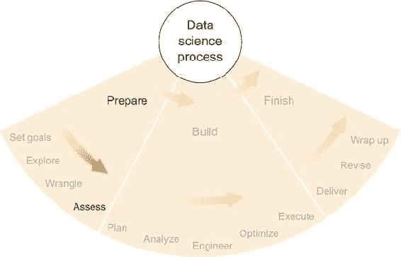

很容易一上来就尽快开发以数据为中心的产品或复杂的统计方法，但了解数据的益处完全值得牺牲一点时间和精力。如果你对你的数据了解得更多——如果你保持对其以及你如何分析它的意识——你将在数据科学项目的每个步骤中做出更明智的决定，并在以后收获好处。

### 5.1. 示例：恩隆电子邮件数据集

在我的第一份软件公司工作——在多年的以研究为导向的学术数据科学之后——我正在帮助构建分析大型、高度监管的组织员工沟通模式的软件，以检测异常或问题行为。我的雇主，一家巴尔的摩初创公司，开发了帮助理解大量员工数据的软件，在许多情况下，根据现行法律，这些数据必须存档多年，并且常常包含可以用于调查已知违规行为以及检测未知违规行为的证据。两个潜在的顾客例子是大金融机构的合规官员和政府机构的安保部门。这两者都有明确的责任防止任何人泄露或不当处理机密或秘密信息。监管机构通常要求或强烈建议监控员工对内部网络的的使用。不用说，我们需要对员工沟通和其他活动进行彻底的统计分析，同时还要在伦理和隐私方面极为小心。

但对于我们最初用于演示目的的第一个数据集来说，隐私并不是一个很大的问题。2000 年代初恩隆丑闻后，调查人员收集的电子邮件集合现在是公开记录的一部分，并且已经被研究人员广泛记录和研究([www.cs.cmu.edu/~./enron](http://www.cs.cmu.edu/~./enron))。因为它是最全面和相关的公共数据集之一，我们想使用恩隆电子邮件来测试和展示我们软件的功能。

可用的恩隆数据集版本有几个，包括 CSV 格式的文本版本以及原始的专有格式 PST，后者可以通过 Microsoft Outlook 生成。第四章介绍了数据整理的基础知识，其中描述的所有问题和警告在这里当然也适用。根据我们从哪个版本的数据集开始，可能已经为我们完成了各种预处理和整理步骤。大多数情况下，这是一件好事，但我们始终必须警惕在数据到达我们之前可能已经做出的错误或非标准选择。

因此，以及无数其他原因，我们需要将我们的数据集视为一个不熟悉的生物。就像一个新发现的动物物种一样，我们以为的可能是我们并没有的。我们的初始假设可能并不正确，即使它们是正确的，在（比喻的）物种内部，个体之间可能存在巨大的差异。同样，即使你自信你的数据集包含你所认为的内容，数据本身肯定是从一个数据点到另一个数据点的变化。没有初步评估，你可能会遇到异常值、偏差、精度、特异性或其他数据固有的众多方面的问题。为了揭示这些并更好地了解数据，数据整理后的数据分析的第一步是计算一些描述性统计。

### 5.2\. 描述性统计

描述性统计可能正如你所想：

+   数据集的描述

+   数据集的摘要

+   最大值

+   最小值

+   平均值

+   可能值的列表

+   数据集覆盖的时间范围

+   以及更多

这些是例子；对于定义，让我们看看维基百科上的一个例子：

> *描述性统计是定量描述信息集合的主要特征或定量描述本身的学科。*

描述性统计既是一套技术，也是使用这些技术生成的数据集的描述。

讨论描述性统计时，往往难以不提及推断性统计。*推断性统计*是使用你拥有的数据来推断——或者推断——你没有直接测量或数据的知识或数量。例如，在政治选举中对 1000 名选民进行调查，然后试图预测整个选民群体的结果（可能远大于 1000 人）就使用了推断性统计。描述性统计只关注你拥有的数据，即 1000 份调查回应。在这个例子中，从样本到总体的推广步骤将这两个概念分开。

关于数据集，你可以这样说：

+   描述性统计问的是，“我有什么？”

+   推断性统计问的是，“我能得出什么结论？”

虽然描述性统计和推断性统计可以被视为两种不同的技术，但它们之间的界限通常是模糊的。在选举调查的情况下，就像在许多其他情况下一样，你必须对 1000 个数据点进行描述性统计，以便推断出关于未调查的其余投票人群的任何信息，而且并不总是清楚描述在哪里结束，推断在哪里开始。

我认为大多数统计学家和商人都同意，要得出大多数有趣的结论需要推断统计：世界人口何时达到顶峰然后开始下降，病毒流行病将如何快速传播，股市何时会上涨，Twitter 上的人们对某个话题是否普遍持有积极或消极的观点，等等。但描述性统计在使这些结论成为可能方面发挥着极其重要的作用。了解你拥有的数据和它能为你做什么是有益的。

#### 5.2.1\. 保持接近数据

我在第一章中也提到了保持*接近数据*，但这当然值得重复，也许在这里提到更为重要。在数据科学项目的这个阶段计算描述性统计的目的，是为了了解你的数据集，以便你了解其能力和局限性；在这个阶段尝试做任何除了了解数据之外的事情都是错误的。像机器学习、预测分析和概率建模等复杂的统计技术，目前完全不适合。

有些人可能会和我争论，说直接跳入并应用一些机器学习（例如）到你的数据中是可以的，因为你在进行的过程中会逐渐了解数据，如果你足够敏锐，你会在问题出现时识别并纠正它们。我完全不同意。像今天大多数机器学习中使用的复杂方法一样，这些方法并不容易分解，甚至难以理解。随机森林、神经网络和支持向量机等，虽然在理论上可以理解，但每个这些方法都有许多动态部分，一个人（或一个团队）不可能完全理解获得单个结果所涉及的特定部分和值。因此，当你注意到一个错误的结果，即使是一个极其错误的结果时，从复杂的模型中直接提取出导致这种严重错误的特定部分并不简单。更重要的是，涉及一些随机性（再次强调，大多数机器学习技术）的复杂模型可能不会在重新运行算法时重现特定的错误。这种在复杂统计方法中的不可预测性也表明，在允许任何随机过程或黑盒为你得出结论之前，你应该先了解自己的数据。

我对“接近数据”的定义是这样的：

> *如果你正在计算可以手动验证或可以使用另一个统计工具完全复制的统计量，那么你就接近数据了.*

在这个项目阶段，你应该计算可以通过其他方式轻松验证的描述性统计，在某些情况下，你应该进行验证以确保正确性。因此，因为你正在进行简单的计算并双重检查，你可以几乎 100%地确信结果是正确的，而你积累的接近数据的描述性统计数据集成为了一种关于你的数据集的知识不可侵犯的规范，这在以后将非常有用。如果你遇到的结果与这些结果相矛盾或似乎与这些结果不太可能相关，那么你可以几乎肯定你在产生这些结果的过程中某个时候犯了一个重大错误。此外，哪些规范内的结果被矛盾可以极大地有助于诊断错误。

保持接近数据确保你可以非常确信这些初步结果，并在整个项目中保持一组良好的描述性统计数据，这为你提供了一个容易参考的参考，可以与随后的更相关但更抽象的结果进行比较，这些结果是你的项目真正的焦点。

#### 5.2.2. 常见的描述性统计

有用的和有信息量的描述性统计方法包括但不限于平均值、方差、中位数、总和、直方图、散点图、表格摘要、分位数、最大值、最小值和累积分布。这些中的任何一个或所有都可能在你下一个项目中有所帮助，而决定你可能会计算哪些以实现你的目标，在很大程度上是偏好和相关性的问题。

在安然电子邮件数据集中，以下是我想到的第一个统计问题：

1.  有多少人？

1.  有多少条消息？

1.  个人写了多少条消息？

一篇简短的论文，名为“介绍安然语料库”（2004），由 Brian Klimt 和 Yiming Yang 撰写，对这些问题给出了很好的总结。

在安然电子邮件语料库中，有来自 158 名员工账户的 619,446 条消息。但通过移除大量电子邮件和在多个账户中出现的重复电子邮件，Klimt 和 Yang 将数据集减少到 200,399 条干净的电子邮件。在干净的版本中，平均用户发送了 757 封电子邮件。这些是有用的信息。如果没有这些信息，后来如果某个统计模型表明大多数人每天发送几十封电子邮件，可能不会很明显地发现问题。因为这个数据集跨越了两年，粗略地说（另一个描述性统计！），我们知道每天两到三封电子邮件要典型得多。

说到时间范围，在 Enron 数据集和其他数据集中，我见过日期报告错误的情况。由于日期的格式方式，一个损坏的文件可以轻易地将日期报告为 1900 年、1970 年或其他年份，这显然是错误的。Enron 直到很久以后才存在，同样，我们所知道的电子邮件也是。如果你想在后续分析中将时间作为一个重要变量，那么在其余电子邮件一个世纪之前的几封电子邮件可能是一个大问题。在整理数据时，如第四章所述，识别这些问题会有所帮助，但这些问题可能被忽视，一些描述性统计可以帮助你现在捕捉到它。

例如，假设你对分析每年发送的电子邮件数量感兴趣，但你跳过了描述性统计，直接编写了一个从最早电子邮件年份（约 1900 年）开始，到最新年份（约 2003 年）结束的统计应用程序。你的结果会受到该范围内中间多年没有消息的严重影响。你可能会在早期发现这个错误，并且在这个过程中不会浪费太多时间，但对于更大、更复杂的分析，你可能不会这么幸运。在事先比较实际日期范围和假设的日期范围之前，可能会更快地发现错误的日期。在今天的海量数据世界中，有人编写一个分析数十亿封电子邮件随时间发送量的应用程序并不罕见——这可能需要使用计算集群，并且每次运行可能需要花费数百或数千美元。在这种情况下，不做作业——描述性统计——可能会代价高昂。

#### 5.2.3. 选择要计算的特定统计数据

在描述 Enron 语料库的论文中，Klimt 和 Yang 明确指出，他们主要关注将电子邮件分类到主题或其他组别。在他们的情况下，日期和时间不如主题、词频和电子邮件线程重要。他们选择的描述性统计反映了这一点。

我们主要关注用户随时间的行为，因此我们计算了如下描述性统计：

+   每月发送的电子邮件总数

+   最活跃的电子邮件发送者及其发送的电子邮件数量

+   最活跃发送者每月发送的电子邮件数量

+   最活跃的电子邮件接收者及其接收的电子邮件数量

+   最活跃的发件人和收件人配对以及他们交换的电子邮件数量

并非总是明显知道哪些统计数据最适合你的特定项目，但你可以问自己几个问题，这些问题将帮助你做出有用的选择：

1.  有多少数据，其中有多少是相关的？

1.  与项目相关的数据中，最相关的一两个方面是什么？

1.  考虑最相关的方面，典型的数据点是什么样的？

1.  考虑到最相关的方面，最极端的数据点看起来是什么样的？

问题 1 通常很容易回答。对于安然数据集，你将找到电子邮件的总数或电子邮件账户的总数，这两点我之前已经提到。或者，如果项目只关注数据的一个子集——例如，涉及肯·莱（Ken Lay）的电子邮件，他是后来因多项欺诈指控而被定罪的 CEO，或者可能只是 2001 年发送的电子邮件——那么你也应该找到该子集的总数。你是否有足够的相关数据来完成项目目标？始终要警惕，之前的数据整理可能并不完美，因此获取精确的子集可能不像看起来那么容易。姓名或日期格式错误等问题可能会引起问题。

问题 2 关注项目的重点。如果你在研究安然作为一个组织的兴衰，那么时间就是数据的一个相关方面。如果你主要关注电子邮件分类，就像 Klimt 和 Yang 所做的那样，那么电子邮件文件夹、电子邮件的主题和正文文本都很重要。在这个阶段，单词计数或其他语言特征可能是有信息的。想想你的项目，看看几个个别数据点，然后问自己，“我最关心的是哪个部分？”

对于问题 3，将问题 2 的答案用于计算与那些方面相对应的值的某些汇总统计。如果你认为时间变量很重要，那么计算数据集中所有电子邮件时间戳的平均值、中位数以及一些分位数（别忘了将时间戳转换为数值——例如，Unix 时间——然后再转换回来进行合理性检查）。你也可以计算每周、每月或每年发送的电子邮件数量。如果你认为电子邮件分类很重要，那么将每个文件夹中出现的电子邮件数量加起来，并找出包含最多电子邮件的文件夹。或者看看不同的人在不同文件夹中电子邮件的数量和百分比有何不同。这些结果中有任何让你感到惊讶的吗？根据你的项目目标，你能预见分析过程中可能出现的任何问题吗？

问题 4 与问题 3 类似，但不是查看典型值，而是查看极端值，如最大值和最小值。最早和最晚的时间戳，以及一些极端分位数，如 0.01 和 0.99，可能很有用。对于电子邮件分类，你应该查看包含最多电子邮件的文件夹以及可能包含少量电子邮件的文件夹——很可能许多文件夹只包含一个或几个电子邮件，并且可能对分析大部分无用。也许在项目的后期阶段，你会考虑排除这些文件夹。在查看极端值时，是否存在某些过高或过低的值没有意义？有多少值超出了合理范围？对于分类或其他非数值数据，最常见的和最不常见的类别是什么？所有这些对后续分析都有意义且有用吗？

#### 5.2.4. 在适当的情况下制作表格或图表

除了计算这些统计量的原始值之外，你可能还会发现将一些数据格式化为表格很有价值，例如，对于最多产的各类别的电子邮件数量，或者作为图表，例如发送和接收的电子邮件每月数量的时间线。

表格和图表有时比纯文本更全面、更快地传达信息。在整个项目中制作表格和图表并保留它们以供参考是个好主意。

图 5.2 展示了从 Klimt 和 Yang 的论文中摘录的两个图表。它们是描述性统计的图形表示。第一个显示了用户在数据集中发送的消息数量与累积分布的关系。第二个则显示了 Enron 员工收件箱中的消息数量与这些电子邮件账户中存在的文件夹数量之间的关系。如果你对各种员工发送的电子邮件数量或员工如何使用文件夹感兴趣，保留这些图表并与所有后续结果进行比较可能是个好主意。它们可能会帮助你验证你的结果是合理的，或者表明你的结果不合理，并帮助你诊断问题。

##### 图 5.2. 从 Klimt 和 Yang 的《The Enron Corpus：用于电子邮件分类研究的新数据集》（由 Springer 在*Machine Learning: ECML 2004*出版）中重新绘制的两个图表。

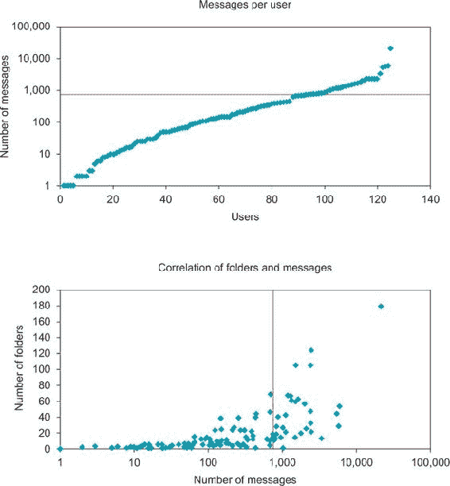

适合你项目的描述性图表或表格的类型可能与这些不同，但它们同样应该解决与你的目标和希望回答的问题相关的数据方面。

### 5.3. 检查关于数据的基本假设

无论我们是否愿意承认，我们都会对数据集做出假设。正如前文所暗示的，我们可能会假设我们的数据包含在特定的某个时间段内。或者我们可能会假设包含电子邮件的文件夹名称是这些电子邮件主题或分类的适当描述符。这些关于数据的假设可能是期望或希望，有意识的或无意识的。

#### 5.3.1\. 关于数据内容的假设

让我们考虑安然数据中的时间元素。当我开始查看数据时，我确实假设电子邮件会跨越 20 世纪 90 年代末电子邮件出现和 21 世纪初公司倒闭之间的几年。我会犯错误，因为已经提到的日期格式潜在的错误或损坏。实际上，我看到了远超出我假设的范围的日期，以及一些可疑的日期。我对日期范围的假设当然需要检查。

如果你想要使用电子邮件账户中的文件夹名称来告知你电子邮件的内容，那么就隐含了一个假设，即这些文件夹名称确实是有信息的。你肯定希望检查这一点，这可能会涉及到相当多的手动工作，比如阅读大量的电子邮件，并使用你最好的判断来决定文件夹名称是否描述了电子邮件的内容。

需要特别注意的一个具体问题是缺失数据或占位符值。大多数人往往会假设——至少是希望——数据中的所有字段都包含可用的值。但通常电子邮件没有主题，或者发件人字段中没有姓名，或者在 CSV 数据中可能有`NA`、`NaN`或空白空间，本应填写数字的地方。始终检查这类占位符值是否频繁出现到足以引起问题的程度是个好主意。

#### 5.3.2\. 关于数据分布的假设

除了数据和范围的内容之外，你可能会对其分布有进一步的假设。坦白说，我知道许多统计学家会对本节标题感到兴奋，但对其内容感到失望。统计学家*喜欢*检查分布假设的适当性。尝试在谷歌上搜索“正态性检验”或直接访问维基百科页面，你就会明白我的意思。似乎有数百万种方法来测试你的数据是否呈正态分布，而这只是统计分布中的一种。

我可能因为写这篇文章而被所有未来的统计学会议禁止参加，但我的通常标准并不那么严格。通常，使用直方图或散点图绘制数据可以告诉你你想要做出的假设是否合理。例如，图 5.3 是我从我的研究论文中摘取的一张图表，其中我分析了田径运动的表现。图中展示的是所有时间以来最佳男子 400 米成绩的直方图（在取对数后），并且在其上叠加的是正态分布曲线。顶级表现符合正态分布的尾部是我研究的关键假设之一，因此我需要证明这个假设。我没有使用任何用于检验正态性的统计测试，部分原因是我处理的是分布的尾部——只有最佳表现，而不是历史上的所有表现——但同时也因为我打算使用正态分布，除非显然不适用于数据。对我来说，将直方图与正态分布图进行视觉比较就足以作为假设的验证。对于我的目的来说，直方图与钟形曲线足够相似。

##### 图 5.3\. 所有时间以来最佳男子 400 米成绩的对数似乎符合正态分布的尾部。

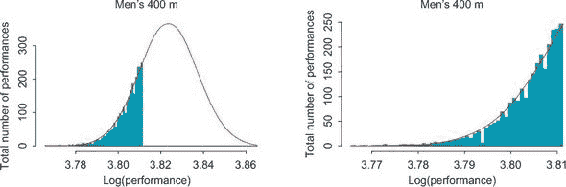

尽管我在处理田径数据分布时可能不够统计严谨，但我并不想轻视检查数据分布的价值。如果你假设数据是正态分布的，而实际上不是，那么会发生不好的事情。假设正态分布的统计模型处理异常值不佳，而绝大多数流行的统计模型都做出了某种正态性的假设。这包括最常见的线性回归类型，以及 t 检验。当你的数据根本不符合正态分布时，假设正态性可能会让你的结果看起来具有显著性，而实际上它们可能是无关紧要的或完全错误的。

这最后一点适用于任何统计分布，而不仅仅是正态分布。你可能有一些你认为均匀分布的类别数据，而实际上某些类别出现的频率远高于其他类别。例如，从安然数据集中计算出的社交网络统计数据——一天发送的电子邮件数量、一天联系的人数等等——都是非正态的。它们通常是指数分布或几何分布，这两种分布你都应该在假设它们之前对数据进行检查。

总的来说，虽然可能可以跳过检查数据是否符合特定分布的统计测试，但一定要小心，并确保你的数据至少大致符合任何假设的分布。跳过这一步可能会对结果造成灾难性影响。

#### 5.3.3\. 一个揭示你假设的实用技巧

如果你觉得自己没有假设，或者你不确定你的假设是什么，甚至如果你认为你知道所有的假设，尝试这样做：向朋友描述你的数据和项目——数据集中有什么，你打算用它做什么——并写下你的描述。然后，剖析你的描述，寻找假设。

例如，我可能这样描述我的原始项目，涉及安然数据：“我的数据集是一堆电子邮件，我打算使用社会网络分析技术来建立整个网络的人员行为模式。我想得出关于员工响应性以及向上层级的沟通，包括老板在内的结论。”

在剖析这个描述时，你应该首先识别短语，然后思考可能隐藏在它们背后的假设，如下所示：

+   ***我的数据集是一堆电子邮件—*** 这可能是真的，但检查一下是否可能存在其他非电子邮件数据类型，比如聊天消息或通话记录。

+   ***组织范围—*** 组织是什么？你认为它是明确界定的，还是存在模糊的边界？运行一些关于组织边界的描述性统计可能有所帮助，比如拥有特定电子邮件地址域的人或写了超过一定数量信息的人。

+   ***行为模式—*** 你对构成行为模式有哪些假设？是否每个人都需要进行相同的行为才能被宣布为模式，还是你有一套模式，你正在寻找符合这些模式的个别例子？

+   ***人员网络—*** 网络中的每个人都需要连接吗？是否可以有不连接的人？你计划从社会网络分析文献中假设某种统计模型吗？这需要某些假设吗？

+   ***响应性—*** 你认为这个术语意味着什么？你能用统计数据来定义它，并通过使用基本定义和一些描述性统计来验证数据支持这样的定义吗？

+   ***层级结构—*** 你是否假设你对组织的层级结构有完整的了解？你认为它是僵化的，还是它会变化？

通过剖析你的项目描述并提出这样的问题，意识到你在做出假设，可以帮助你避免许多后续问题。你不想在完成分析、发现奇怪的结果后，再回去调查时发现一个关键假设是错误的。更重要的是，你不想一个关键假设是错误的，却从未注意到。

### 5.4\. 寻找特定内容

数据科学项目有多种目标。一个常见的目标是能够在你的数据集中找到与某种概念描述相匹配的实体。在这里，我使用术语*实体*来表示你数据集中表示的任何独特个体。实体可能是一个特定的人、地点、日期、IP 地址、遗传序列或其他独特项目。

如果你从事在线零售，你可能将客户视为主要实体，并可能希望识别那些可能购买新视频游戏系统或特定作者的新书的人。如果你从事广告，你可能正在寻找最有可能对特定广告做出反应的人。如果你从事金融，你可能正在寻找即将价格上涨的股票市场股票。如果能够对这些描述进行简单的搜索，工作就会变得容易，你就不需要数据科学或统计学。但尽管这些描述不是数据固有的（你能想象一个告诉你即将上涨的股票吗？），当你看到它们时，你通常可以识别出来，至少在事后。这类数据科学项目的主要挑战是及时找到这些有趣的实体。

在安然电子邮件数据集中，我们正在寻找可能与我们现在知道在公司发生的非法活动有关的可疑行为。尽管电子邮件数据集中的可疑行为可以采取多种形式，我们可以列举一些：一般来说，员工讨论非法活动，试图掩盖某些事情，与可疑人物交谈，或以其他异常方式沟通。

我们已经有了跨社会/组织网络的通信统计模型，我们希望将其应用于安然数据集，但我们有无数种方式可以配置模型及其参数，以找到各种形式的可疑行为。我们无法保证我们会找到我们正在寻找的那种，也无法保证我们会找到任何可疑行为。我们可能找不到任何可疑行为的一个原因可能是实际上根本不存在可疑行为。

#### 5.4.1\. 寻找一些示例

如果你正在寻找相当具体的东西，你数据中的某些有趣的东西，试着找到一些。手动浏览数据或使用一些简单的搜索或基本统计来定位这些有趣事物的示例。你应该靠近数据，并能够验证这些示例确实有趣。如果你有大量数据——即使浏览都很困难——可以取数据的一个子集，并在那里寻找一些好的示例。

如果你找不到任何有趣的示例，你可能遇到麻烦了。有时，有趣的事情很少见或者根本不存在于你认为它们存在的那种形式。事实上，根据公布的情况，安然数据不包含任何线索或任何类型的烟幕弹。深入挖掘、改变你的搜索方式、以不同的方式思考数据和你要找的东西，或者以其他方式穷尽所有可能找到数据中好例子、有趣例子的方法，通常是有帮助的。

有时候暴力搜索是有效的。理论上，一个由几个人组成的小组可以在几天内阅读完所有的安然邮件。这不会很有趣——我相信不止几个律师做过这件事——但它是有可能的，并且将是找到你想要的东西的最彻底的方法。我相当有信心地说，在我与安然数据一起工作的几个月里，我阅读了该数据集中大部分的邮件。如果项目的目标没有远远超出安然数据集，这将是一个数据科学项目出错的特征。我们正在开发软件，其整个目的就是使阅读所有邮件变得不必要。我们想使用安然数据来描述可疑通信的样子，以便我们可以使用这些描述在其他数据集中找到这样的通信。这就是为什么在当时对我们来说暴力搜索是有意义的。根据你的数据，手动查看所有数据可能对你来说也是有意义的。

你也可能在你的数据子集上使用暴力搜索。可以这样想：如果 1000 个实体（数据点、人、天、消息，等等）中有 1 个是有趣的，那么如果你手动查看由一百万个实体组成的数据集的超过 0.1%，你应该能找到它。

你可能需要查看更多的数据以确保你没有运气不好，但如果你已经覆盖了 1%的数据而你还没有找到任何，你就知道有趣的实体比你想的更稀少或者根本不存在。你可以调整这些百分比以适应更稀少或更常见的实体。

如果最终你无法通过任何方式找到任何有趣的实体，唯一的选择是寻找另一种有趣的事物，遵循你项目中的另一个目标，或者回到所有数据源并找到另一个包含你感兴趣的事物痕迹的数据集。这样做并不有趣，但在实践中这是一个真实可能性，并不罕见。不过，让我们保持乐观，假设你在数据集中成功找到了一些有趣的实体。

#### 5.4.2. 描述示例：它们有什么不同？

一旦你找到了一些有趣事物的例子，仔细观察它们在你的数据中的表示方式。在这个步骤中的目标是找出哪些数据特征和属性可以帮助你实现找到更多这类有趣事物的目标。通常，你可能会通过简单的检查识别出有趣例子共享的一些模式或值，这些数据点的某些方面可以用来识别它们并将它们与其他数据集区分开来。

对于电子邮件数据，是有趣内容的电子邮件文本，还是发送电子邮件的时间？或者，可能是发送者和接收者本身很有趣？对于其他数据类型，查看各种字段和值，并注意那些似乎在不同程度上区分有趣事物与其他事物的值。毕竟，这是大多数统计（特别是机器学习）项目的基础：区分两个（或更多）事物组。如果你能大致了解如何手动完成这项工作，那么创建统计模型并在代码中实现它来帮助你找到更多这样的例子就简单多了，这些内容我在后面的章节中会介绍。

通常，一个显著或容易与典型数据点区分开的数据点并没有什么量化特征，但仍然很有趣。以安德鲁·费斯托（Andrew Fastow）为例，他是安然公司在其最后几年中的首席财务官，也是后来使他和其他人入狱的欺诈活动的主要肇事者之一。在数据集中，费斯托的邮件中没有任何欺诈或秘密的迹象，但有趣的是，在整个语料库中只有他九封邮件。作为首席财务官，人们可能会认为他的角色应该包括与其他人更频繁的沟通，而不仅仅是每隔几个月一次。因此，他要么避免使用电子邮件，要么他很好地删除了所有服务器和其他人的个人收件箱和存档中的邮件。无论如何，费斯托的邮件可能之所以引人注目，并不是因为任何固有的信息，而仅仅是因为它的罕见性。

以类似的方式，你数据中的有趣事物可能可以通过它们的上下文或我可能称之为它们的邻域来描述。"邻域"这个术语是从拓扑学中借用的，拓扑学是数学的一个分支：

> *一个数据点的* 邻域，从广义上讲，是一组与所讨论的点相似或位于该点附近的其他点。

相似性和位置可以有多种含义。对于安然数据，我们可以定义一个特定邮件的一个邻域类型为“由这个邮件的发送者发送的邮件集合。”或者我们可以定义一个邻域为“在同一周内发送的邮件集合。”这两种定义都包含相似性或邻近性的概念。根据第一种定义，安德鲁·费斯托夫发送的邮件确实有一个很小的邻域：只有八封其他邮件。根据邻域的第二种定义，邻域要大得多，通常在给定的一周内有几百封邮件。

除了数据点的本身属性外，你还可以使用其邻域来帮助描述它。如果你对安德鲁·费斯托夫的邮件感兴趣，也许所有很少写邮件的人发送的邮件都很有趣。在这种情况下，对“有趣”的一个定量描述使用相同的发送者定义的邻域，可以表述如下：

> *如果邮件是由很少发邮件的人发送的，那么这封邮件可能很有趣。*

你可以将这个陈述纳入统计模型中。它是定量的（稀少性可以量化）并且可以通过你拥有的数据集中的信息来确定。

同样，你可以使用基于时间的邻域来创建对“有趣”的另一种描述。也许，假设你在搜索过程中发现了一封在半夜发送的邮件，从工作账户发送到私人电子邮件地址，要求在一个通宵餐厅见面。在安然数据集中不存在这样的邮件，但我喜欢想象这个情况比实际情况要戏剧化得多——可能是数据科学版的神秘和间谍活动。

这种关于半夜或奇怪时间点的概念可以通过几种方式来量化。一种方式是选择代表半夜的时段。另一种方式是将奇怪时间点定义为几乎没有人发邮件的时段。你可以使用几个小时的时段来描述一些有趣的邮件，例如：

> *如果问题邮件前后两小时内发送的其他邮件很少，那么这封邮件可能很有趣。*

这种描述，就像之前的一个，既是定量的（“少”可以通过经验来量化）又是在你拥有的数据集中可回答的。

一个有趣的实体或数据点的良好描述是它既定量，又存在于或可从你的数据中计算出来，并且在某种程度上有助于将其与正常数据区分开来，即使只是略微不同。我们将在后续的初步分析和选择统计模型部分中使用这些描述，并进一步讨论。

#### 5.4.3. 数据挖掘（或不是）

有些人可能会把在数据中四处窥探、找到你感兴趣的东西的例子，然后调整后续分析以适应这些例子称为*数据调查*。有些人可能会说，这会不公平地偏差结果，使它们看起来比实际情况更好。例如，如果你正在寻找你所在社区中蓝色皮卡车的数量，你碰巧知道通常有几辆蓝色皮卡车停在你家附近几条街外，你可能会朝那个方向走去，沿途数着卡车，而你已经知道的那辆卡车可能会略微偏向上调你的结果。或者，在最坏的情况下，你会随机走动，但如果你家附近并且在你典型的路线上，你更有可能经过它。

你希望避免结果中的重大偏差，所以你需要注意不要让我建议的初步描述影响这一点。数据调查可能是一个问题，而且敏锐的批评家正确地指出，有时你应该避免它。但是，只有在你评估结果的准确性或质量时，调查才是一个问题。特别是，如果你已经知道你的方法试图再次发现的一些事情，你可能会在这些情况下取得成功，你的结果将是不公平地好。

但你还没有到达评估阶段。现在，当你试图在数据集中找到和描述有趣且罕见的数据点、实体和其他事物时，你应该尽一切努力取得成功，因为这是一项艰巨的任务。然而，稍后，所有这些有用的调查可能会使结果评估复杂化，所以我现在提出这一点，让你注意潜在的复杂性和解决可能批评你不应该在数据中四处窥探的人。

### 5.5. 粗略的统计分析

在本章中，我已经讨论了基本描述性统计、验证假设以及描述你正在寻找的一些有趣事物的类型。现在，从统计复杂性来看，是时候将分析提升一个层次，但不是两个。我在第七章（第七章）中涵盖了完整的统计建模和分析，但在你达到那个阶段之前，最好只朝那个方向迈出一小步，看看结果如何。

大多数复杂的统计算法需要一段时间来实现；有时它们运行或计算所有数据需要花费一些时间。正如我之前提到的，其中许多在理解它们如何以及为什么给出特定结果，以及是否正确时相当脆弱或困难。这就是为什么我更喜欢缓慢且谨慎地处理这种复杂的分析，尤其是在处理新的或不熟悉的数据集时。

如果本节中的一些统计概念对你来说不熟悉，现在可以随意跳过，并在你完成本书的其余部分——或者至少第七章之后回到这一节。如果你已经熟悉大多数复杂的统计方法，本节可以帮助你决定你计划的统计方法是否是一个好选择。或者如果你还不知道你可能会使用什么方法，本节可以帮助你弄清楚。

#### 5.5.1. 简化

大多数统计方法都可以翻译成简化的版本，与完整方法相比，可以在更短的时间内实现和测试。在你开始全面实施和分析之前，尝试其中的一些方法，可以为你提供关于哪些统计方法对你有用的巨大洞察，以及如何使用它们。

如果你最终的分析只是进行线性回归或 t 检验，那就直接进行吧。本节主要关注那些可能包括某种形式的分类、聚类、推断、建模或其他具有多个参数（固定或变量）的统计方法的那些项目。

##### 分类

如果你计划在分析中做一些分类，有许多统计模型是为这项任务设计的，从随机森林到支持向量机再到梯度提升。但分类中最简单的方法之一是逻辑回归。

分类任务在其最简单形式上，是根据你选择并从数据中计算出的实体特征集，将两个类别标签之一分配给实体。通常，标签是 0 和 1，其中 1 代表有趣，与之前我使用的意义相同，而 0 是正常。你可以有更多类别和更复杂的分类，但我将留到以后再讲。

分类中最复杂的方法有很多可变部分，因此它们有可能比逻辑回归表现得更好。但正如我之前提到的，它们理解和调试起来要困难得多。逻辑回归是一种相对简单的方法，它的工作方式类似于线性回归，只不过输出值（对新数据的预测）介于 0 和 1 之间。

与机器学习的分类方法相比，逻辑回归的计算速度要快得多，几乎不需要你调整的参数。另一方面，它包含一些假设——例如某种类型的正态性——所以如果你有严重偏斜或其他奇怪的数据值，它可能不是最佳选择。

如果你有一个你认为可以帮助分类未知实体的实体特征，尝试将其作为逻辑回归模型中唯一的特征/参数。你的软件工具可以告诉你该特征是否确实有帮助，然后你可以尝试另一个特征，无论是单独尝试还是与第一个特征一起尝试。从简单开始通常是最佳选择，然后增加复杂性，并检查它是否有所帮助。

在 Enron 数据集中寻找可疑电子邮件的有用特征的一个良好候选是发送电子邮件的时间。深夜发送的电子邮件可能证明是可疑的。另一个特征可能是电子邮件的收件人数。

另一种更通用的方法来调查特征对分类的有用性是查看两个类别（0 或 1）中每个类别的特征值分布。通过几个图表，你可以看到两个类别的特征值之间是否似乎存在显著差异。图 5.4 是三个类别（由形状指定）的数据点的二维图。x 轴和 y 轴代表数据点的两个特征值。如果你的目标是开发出一种可以找到正方形数据点的统计软件——而不需要知道其真实形状——你可能做得很好；正方形数据点具有高的 x 和 y 值。找到正确识别正方形数据点的统计模型可能很容易。困难的部分可能在于找到当绘制时能给出这样整齐分组类别的特征。创建图表可以帮助你通过给你一个关于类别在所有数据点空间中的位置的感觉来找到那些好的、有用的特征，并帮助你弄清楚如何开发或调整特征以使其更好。

##### 图 5.4。由形状给出的三个类别的二维图^([1])

> ¹
> 
> 来自 [`en.wikipedia.org/wiki/Cluster_analysis`](https://en.wikipedia.org/wiki/Cluster_analysis) (公有领域)

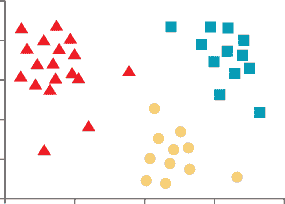

最后，如果你熟悉并理解你喜欢的统计分类方法，并且知道如何在统计软件中调整其参数以使其简单易懂，那么这也是进行快速粗略分类的好方法。例如，你可能使用一个有 10 棵树的随机森林，最大深度为 2。或者，如果你了解其背后的理论，具有线性核函数的支持向量机可能也相对容易理解。如果你熟悉这些技术的工作方式，这两个都可能是不错的选择。如果你选择这条路线，重要的是你要理解如何评估你方法的结果，检查各种特征的贡献，并确保该方法按预期工作。

##### 聚类

*聚类*在概念上与分类有很多相似之处——存在具有特征值的实体，这些特征值旨在落入不同的组中——但是没有明确的、已知的标签。聚类过程通常被称为*无监督学习*，因为结果是相似实体的组——但是由于没有标签，可能一开始并不清楚每个组或聚类代表什么。通常需要手动检查或描述性统计来弄清楚每个聚类中包含哪些类型的实体。

作为聚类的粗略版本，我喜欢绘制与实体相关的各种值，并使用直观的视觉检查来确定实体是否倾向于形成聚类。对于具有许多方面和值的数据和实体，可能需要花费一些时间来直观检查一个或两个维度/变量的图。但是，如果你认为一些关键特征应该区分不同实体组，你应该能在二维图中看到这一点。如果你看不到，你可能需要重新审视你做出的某些假设。仅仅因为两个实体落入同一个聚类就盲目地假设它们相似，可能会在以后导致问题。例如，即使没有标签/颜色，图 5.4 中的数据点似乎很好地聚成了三个组。如果你知道有三个聚类，聚类算法应该能够找到它们。另一方面，如果你的数据没有很好地分组，聚类可能会给出较差的结果。

除了直观检查之外，最简单的聚类版本包含的变量和聚类很少（大多数情况下，你必须事先设置聚类数量）。如果你可以选择，比如选择三个或四个你最喜欢的实体特征，并且它们使用最简单的聚类算法（如 k-means）很好地聚类，那么你就已经迈出了良好的第一步，可以继续使用更复杂的聚类方法或配置。在你的软件工具中绘制聚类算法的结果也可能有所帮助，以确保一切看起来都有意义。

##### 推断

*统计推断*是对你没有直接观察到的定量值的估计。例如，在我提到的安然项目中，我们曾经想要估计每个员工向他们的老板发送电子邮件的概率，而不是向任何其他潜在收件人的概率。我们打算将这个概率作为一个潜在变量包含在通信的统计模型中，这是一个复杂的模型，其最优参数值只能通过复杂的优化技术找到。对于大量数据，这可能很慢。

但我们可以通过计算每个员工向老板发送电子邮件的次数以及他们没有发送的次数来近似这个特定潜在参数值的推断。这是一个粗略的近似，但后来，如果完整模型的最佳参数被发现与相当不同，我们会知道可能出了问题。如果这两个值不同，并不意味着肯定出了问题，但如果我们不能理解和无法找出它们不同的原因，这确实表明我们不知道模型是如何在我们数据上工作的。

我们可以用同样的方式处理统计模型中的其他潜在变量：找到一种方法来获得粗略的近似，并为此做笔记，以便稍后与完整模型中的估计值进行比较。这不仅是一个检查可能错误的好方法，而且它还告诉我们关于我们的数据的事情，这些事情在我们之前讨论的计算描述性统计时可能没有学到——而且，更好的是，这些新的信息是针对我们项目目标的。

##### 其他统计方法

我当然没有涵盖如何对每种统计方法进行粗略近似的细节，但希望前面的例子给你提供了思路。与数据科学中的几乎所有事情一样，没有一种解决方案；也没有 10 种或 100 种。有无数种方法可以处理过程的每一步。

你在设计和应用快速简便的方法时必须富有创意，因为每个项目都是不同的，并且有不同的目标。主要观点是，在确保它们合理适用于你的项目目标和数据，并且你正确使用它们之前，你不应该应用复杂的统计方法。首先应用统计分析的简单版本，这会让你对方法如何与你的数据互动以及它是否合适有一个感觉。第七章详细讨论了几种统计方法，从中你应该能够为你的分析收集更多想法。

#### 5.5.2. 取数据的一个子集

通常你拥有太多的数据，以至于无法及时进行简单的分析。在这个阶段进行许多粗略的初步分析时，使用数据子集来测试简单统计方法的适用性可能是可以的。

如果你确实将粗略的统计方法应用于整个数据集的子集，请注意以下一些陷阱：

+   确保你有足够的数据和实体，以便统计方法可以给出有意义的成果。方法越复杂，你需要的数据就越多。

+   如果子集不能代表整个数据集，你的结果可能会大相径庭。对这个子集计算描述性统计，并将它们与整个数据集的相关描述性统计进行比较。如果它们在重要的方面相似——记住你的项目目标——那么你处于良好的状态。

+   如果你只尝试一个子集，你可能会无意中选择了高度专业或具有偏见的子集，即使你运行了一些描述性统计。但如果你取三个不同的子集，对它们进行快速分析，并得到相似的结果，你可以合理地确信这些结果可以推广到整个数据集。

+   如果你尝试不同的子集并得到不同的结果，这不一定是个坏事情。试着找出原因。数据本质上具有变异性，不同的数据可能会给出不同的结果，无论是轻微还是显著。使用描述性统计和这些简单统计方法的诊断来确保你理解正在发生的事情。

#### 5.5.3\. 提高复杂性：它是否改善了结果？

如果你无法从一种简单的统计方法中获得至少中等或令人期待的结果，那么继续使用更复杂的方法是危险的。提高你方法的专业性应该能改善结果，但前提是你必须走在正确的道路上。如果该方法简单版本不适合你的数据或项目，或者算法配置不当，那么提高复杂性可能不会有所帮助。此外，更复杂方法的配置更难修复，所以如果你从一个简单方法的错误配置开始，那么更复杂版本的配置可能同样不正确，甚至更难修复。

我喜欢确保我有一个稳固、简单的方法，我理解它，并且它清楚地给出了一些有用的结果（即使不是理想的结果），然后我在提高方法复杂性的过程中检查结果。如果每一步的结果都在改善，我知道我在做正确的事情。如果结果没有改善，我知道我可能做错了什么，或者我已经达到了数据或项目目标可以处理的复杂性的极限。

应用过于复杂的数据或设定无法处理的目标通常被称为*过度拟合*。具体来说，这意味着方法有太多的可变部分，并且所有这些可变部分在你的数据上工作得完美无缺，但当你给方法提供新数据时，结果的准确性却远不如之前。我在第七章中更详细地讨论了过度拟合，但就目前而言，可以说，专业性应该导致更好的结果——直到某个程度——如果你没有体验到这一点，那么可能某个地方存在问题。

### 练习

继续使用在第二章中首先描述的 Filthy Money Forecasting 个人理财应用场景，并关联到之前章节的练习，尝试以下练习：

> **1\.**
> 
> 考虑到该应用的主要目标是提供准确的预测，描述三种你希望在数据上执行以更好地理解数据的描述性统计类型。
> 
> **2\.**
> 
> 假设你强烈考虑尝试使用统计模型来分类重复和一次性金融交易。关于这两种类别中的交易，你可能会有哪些假设？

### 摘要

+   在数据科学的探索阶段，不要直接跳入复杂的统计分析，要故意谨慎，因为大多数问题可以通过知识和意识避免或快速解决。

+   在分析数据之前，明确你对数据的先验假设，并检查它们是否合适。

+   在假设你的麦秆堆里有针之前，手动筛选数据，找到一些好的例子，这些例子是你希望在项目期间找到更多类似事物的类型。

+   对数据的子集进行粗略的统计分析，以确保在投入大量时间进行完整软件实现之前，你处于正确的轨道上。

+   将任何探索性结果记录在方便的地方；它们可能在后续决策时有用。
