## 第二部分\. 使用软件和统计学构建产品

任何数据科学项目的核心目标是产生有助于解决问题和实现目标的东西。这可能以软件产品、报告或一组见解或对重要问题的答案的形式出现。生产这些任何一种的关键工具集是软件和统计学。

第二部分 的本书从一篇关于基于在第一部分（part 1 中涵盖的探索和评估所学的制定目标计划的章节开始。然后第七章 转向统计学领域，介绍了一系列重要的概念、工具和方法，重点关注它们的主体能力和如何帮助实现项目目标。第八章 以同样的方式介绍了统计软件；本章旨在为你提供足够的知识，以便为你的项目做出明智的软件选择。第九章 然后对一些流行的非统计软件工具进行了高级概述，这些工具可能使构建和使用你的产品更容易或更有效率。最后，第十章 通过考虑在统计学和软件方面的先前偏离所获得的知识以及处理数据、统计和软件的许多陷阱，将所有这些章节汇集在一起。

## 第六章\. 制定计划

*本章涵盖*

+   评估在项目初步阶段学到的内容

+   根据新信息修订项目目标

+   认识到何时应该重做先前工作

+   向客户传达新信息并获得反馈

+   制定执行阶段的计划

图 6.1 展示了我们在数据科学流程中的位置：通过正式规划开始构建阶段。在本书中，我一直强调不确定性是数据科学工作的主要特征之一。如果没有任何不确定性，数据科学家就不需要探索、假设、评估、发现或以其他方式应用科学方法来解决问题。同样，数据科学家也不需要在只有绝对确定性构成的项目中应用统计学——一个建立在不确定性基础上的领域。正因为如此，每个数据科学项目都包含一系列开放性问题，这些问题随后通过科学过程部分或全部得到解答。

##### 图 6.1\. 数据科学流程构建阶段的第一步：规划

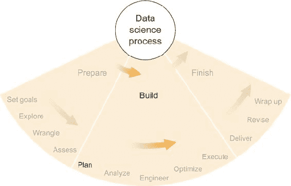

在这些新答案出现时不考虑它们将是一个错误。这就像在你被告知前方道路关闭，最佳绕行路线需要你转弯后，仍然继续沿着这条特定的道路行驶。在过去的十年里，互联网连接的导航设备，通常是智能手机，已经变得无处不在。这些设备不断更新新的信息，特别是交通和事故信息，并使用这些信息来尝试优化提供给驾驶员的路线。这也是数据科学家在不确定性消失或减少时需要做的事情。

我喜欢在项目过程中定期停下来，总结我所学到的所有内容，并在更大的目标背景下考虑它们，就像我在第二章中描述的如何制定好的问题和目标一样。但每次我这样做时，都会出现新的信息，这些信息可能会影响决策。可能没有必要故意暂停项目并正式考虑所有新的信息，但通常是有用的，因为许多人倾向于继续按照之前可能不再是最佳计划的计划前进。这与意识的概念有关，我强调每个数据科学家都应该保持这种意识，正式的定期审查新知识可以帮助在团队中分享这种意识。即使你独自工作，稍微正式的审查对于组织以及向客户或其他项目利益相关者传达进度也是有帮助的。

本章中描述的进度评估和规划类型也可以持续进行或定期进行，而不是一次性完成，在某些情况下这是首选。但绝对应该在项目的前期阶段（我在前几章中已经介绍过）和我所称的*执行阶段*之间进行，我将在下一章开始讨论这个阶段，它包括典型项目的大部分正式统计建模和软件开发时间和精力。因为执行阶段劳动密集，你想要确保计划是好的，并且将解决项目的重大目标。你不想不得不重新执行执行阶段。

### 6.1. 你学到了什么？

在第二章中提出一些问题和设定一些目标后，你在第三章中调查了数据的世界，在第四章中整理了一些具体的数据，并在第五章中了解了这些数据。在每一步中，你都学到了一些东西，现在你可能已经能够回答你在项目开始时提出的一些问题。

例如，在搜索数据时，你是否找到了你需要的一切，或者是否还有关键数据块缺失？在评估数据后，它是否包含了你预期的所有内容？你计算出的描述性统计结果是否如预期，或者有任何意外？

#### 6.1.1. 例子

由于每个问题的答案都将极大地取决于项目的具体细节，因此对我来说很难将提问和回答的过程形式化。相反，我将考虑在这本书中已经展示的例子，并描述我在这些项目这一阶段的某些经验。在本章的后面部分，我将回到这些例子，并讨论我是如何利用新信息来对项目做出后续决定的。

##### 啤酒推荐算法

在第二章（kindle_split_011_split_000.xhtml#ch02）中，我简要描述了一个假设的项目，其目标是根据用户为其他啤酒提供的评分来向啤酒网站的用户推荐啤酒。因为这个项目是一个我从未承担过的假设项目（尽管很多人都有），我可以从项目的初步阶段回答“我学到了什么？”这个问题，但我认为它仍然具有说明性。

尤其是提到，我们最初开始的数据集，一个包含用户啤酒评分的 CSV 文件，并没有将啤酒的具体类型作为其中一列。这是一个问题，因为啤酒的类型或风格通常在确定一个人是否会喜欢它时很有信息量。知道类型缺失后，我的初步计划是要么找到一个包含数据类型的数据集，要么从啤酒的名称中推断类型。如果这两者都不可能，我就不得不在没有类型的情况下完成项目。因此，有三种不同的路径来分析和推荐啤酒，确定最佳路径需要一些初步的数据科学。

在审视数据世界时，就像在第二章（kindle_split_011_split_000.xhtml#ch02）中描述的那样，我可能找到了一个与啤酒类型匹配的啤酒列表。如果找到了，那么这个特定的不确定性就会变成确定性（如果我相信它），我会在我的推荐算法中使用给定的啤酒类型。如果没有找到那个啤酒类型的列表，那么，正如我在第四章（kindle_split_013_split_000.xhtml#ch04）中描述的那样评估我的数据时，我可能编写了一个脚本，希望它能快速地解析每个啤酒的名称并确定它的风格。如果它看起来工作得很好，我会制定一个计划来尽可能改进它，并且那条特定的路径就会实现。

如果我找不到包含啤酒类型的数据库，而且我也无法编写一个成功推断啤酒类型的脚本，那么只剩下一条可能的路径：我不得不放弃。不知道啤酒类型，统计挑战将大大增加，但并非不可能，因此我必须制定一个考虑到这一点的计划。

在描述的所有三种情况下，我从搜索数据、处理数据和评估数据的过程中获得了新的知识。这种新知识影响了继续进行项目的最佳计划。

##### 生物信息学和基因表达

在第三章中，我介绍了我作为博士研究的一部分所参与的一个项目，该项目涉及分析特定 miRNA 的表达与单个基因之间的关系。

在寻找更多可能有助于公共生物信息学数据仓库和出版物中的数据和信息的搜索过程中，我发现了一些包含预期调节某些基因表达的 miRNA（miRs）的算法预测的数据库。我还发现了一些其他分析工具，它们以与我追求的不同方式实现了我追求的一些相同目标。

对于每个基于 RNA 序列的算法预测数据集，我必须决定它们是否对我的项目有帮助，以及这种帮助是否足以证明利用这些数据所需的工作。每个新的数据集都需要一定程度的努力来获取、解析并将数据转换成有用的形式。在两种情况下，我决定投入工作来利用这些预测，以指导我尚未构建的统计模型。

但是，在处理和评估数据的过程中，我意识到 miR 和基因的名称与我的主要数据集（微阵列表达数据）中的名称不完全匹配。不同的科学组织根据特定需求为基因开发了不同的命名方案，并且尚未统一，但存在名称转换工具。如果我希望利用这些预测数据集，我必须在计划中包括将一个方案中的名称转换为另一个方案的内容，以便我可以将预测与微阵列数据中的特定值相匹配，这些值在某种程度上是预测结果的实现。

除了关于命名方案的新知识外，在评估数据时，我还了解了一些关于微阵列表达数据分布的情况。因为我使用了大多数生物样本的重复微阵列——我把相同的生物 RNA 样本放在多个微阵列上——我可以计算出所谓的“技术方差”。技术方差是由技术（微阵列）引起的方差，与生物过程无关。我发现，在 10,000 个左右的基因中，技术方差大于生物方差。这意味着在这些情况下，基因的测量表达水平与测量微观化学物质的随机性比与生物效应更多。我必须决定是否要在我的分析中包括这些高技术方差（或低生物方差）的基因，或者忽略它们。一些统计方法处理方差不好，而另一些则可以，所以我必须明智地选择。

##### 田径和田径的顶级表现

在第四章中，我讨论了我如何分析田径历史上最佳表现列表，以评分和比较男女各项目的成绩。特别是，我想比较所有项目的世界纪录，找出哪一个是最好的。

在这个项目中，我必须做出的第一个选择是，我是否想要使用可用的最佳免费数据集，在[www.alltime-athletics.com](http://www.alltime-athletics.com)，还是为另一个网站上声称的更完整的数据集付费。我是一个开放获取数据的粉丝，所以我选择了免费数据集，但如果我后来意识到我没有足够的数据来告知我的统计模型，我就不得不重新考虑我的选择。

在检查我的数据集时，我检查了每个表现列表的长度，发现有些项目，如女子一英里赛跑，只包含几百次表现，而其他项目，如女子障碍赛，长度达到 10,000 条记录。这种表现列表长度的巨大差异是否会导致问题并不立即明朗，但这是我在规划时必须考虑的新信息。

另一个我没有预料到的情况是，一些事件，如跳高、撑杆跳和 100 米和 200 米短跑，产生的性能值是离散值而不是连续值。在跳高和撑杆跳中，横杆逐渐升高，运动员要么跳过这个高度，要么跳不过，这意味着在每一天，许多运动员都有相同的成绩。在最佳跳高成绩列表中，超过 10 人的成绩是 2.40 米，超过 30 人的成绩是 2.37 米，在更低的高度上，数字更大。观察成绩分布，如直方图或类似的东西，可以很好地论证，连续分布，如对数正态分布，可能不是最佳选择。在规划时，我必须决定是否以及如何将这些事件与其他事件进行比较，例如长跑项目，这些项目的成绩显然是连续的，因为几乎没有人能在最佳历史记录名单上与其他人并列。

##### 安然电子邮件分析

在第五章中，我谈到了已经公开的安然电子邮件集合，以及我以及当时在同事是如何使用社交网络分析技术来尝试检测可疑行为的。

这是一个开放性的项目。我们知道在安然公司发生了一些不好的、犯罪的事情，但我们不知道这些事情会在数据中如何体现，如果确实存在的话。我们知道我们希望将电子邮件数据视为一个社交网络中的通信集合，因此分析的第一步就是从数据中构建一个社交网络。

第一个令人惊讶和失望的发现之一是，在包含电子邮件的 100 多个 PST 文件中，同一个电子邮件发送者（或接收者）可以用许多不同的方式表示。例如，数据集中最活跃的电子邮件发送者之一，Jeff Dasovich，可能在电子邮件的“发送者”字段中显示为 Jeff Dasovich、Jeffrey Dasovich、*jeff.dasovich@enron.com*，甚至 DASOVICH，而这些只是众多可能性中的一小部分。乍一看，这似乎不是一个大问题，但实际上却是。Dasovich 本人并不难识别，但还有多个名叫 Davis、Thomas 等的人并不容易区分。

作为数据处理过程的一部分，我最终编写了一个脚本，该脚本会尝试解析出现的任何名称，并确定该名称是否已经被遇到，优先考虑格式良好的名称和电子邮件地址，但这个脚本远非完美。在某些情况下，我们在构建的社会网络中有两个人或更多人实际上是同一个人，但我们未能将他们合并，因为脚本没有识别出这些名称彼此匹配。我们手动检查了最活跃的发送者和接收者，但在前 100 或 200 人之后，我们无法保证脚本正确地匹配了名称。在规划中，我们必须考虑到电子邮件与命名发送者和接收者匹配的不确定性。

不言而喻，在项目开始时，我们并不知道将名称相互匹配将是我们面临的最大挑战之一。如果我记得正确的话，编写一个相当成功的脚本的任务消耗了我比项目其他任何方面更多的精力。任务的不可确定性和对问题复杂性的认识对于项目的执行阶段的评估和规划至关重要。

在我们找到了解决名称匹配问题的合理方案之后，我们对安然数据集进行了一些描述性统计分析。出人意料还是不出所料，我们很快意识到某些人，比如 Jeff Dasovich，在几年时间里发送了几千封电子邮件，而像 Ken Lay 这样的关键高管几乎一封都没有发送。显然，个人行为，至少就电子邮件而言，必须在我们的统计模型中予以考虑。我们隐含地假设安然的所有重要员工都写了足够的电子邮件，以便我们能够模拟他们的行为，但显然这并不正确。我们后来进行的任何分析都必须允许存在极大的行为差异，同时仍然能够检测到某些在某种犯罪意义上的异常行为。这并非小问题，而且在规划过程中还要考虑的另一件事。

#### 6.1.2\. 评估你所学的

我已经提供了例子，但关于你在特定项目中可能学到的具体指导很少。具体的指导很难找到，因为每个项目都是不同的，而且似乎也不可能将项目分组为将产生相同类型教训和新信息的类型。这个评估阶段体现了数据科学项目的不可确定性，并强调了数据科学家为什么需要首先始终保持警觉，成为技术驱动的解决问题者。对于数据科学中的实际问题，没有现成的解决方案。唯一的解决方案是在应用工具（无论是现成的还是定制的）时保持警觉和创造力，以及智能地解释结果。在数据科学项目的初步阶段，你会学到一些东西，你应该像对待任何其他信息一样认真对待这些信息，尤其是因为它们在项目的主要执行阶段之前，并且因为它们是你拥有的最具体的项目信息。由于这一新信息的可能重要性，执行本章中描述的评估阶段可能会有所帮助。

这个评估阶段是项目的一个回顾阶段。如果你是一个喜欢做大量笔记的人，记住你所做的工作和结果不会是问题，但如果你像我一样，很少对自己的工作做笔记，那么记住的任务可能会更困难。我开始倾向于使用那些能自动记录我工作技术的工具。Git，在它未被明确设计用于的另一个用途中，提供了一些可以帮助我记住项目近期历史的功能。如果我的提交信息是有信息的，有时我可以从它们中重建项目历史，但这显然不是理想的。电子邮件记录也可以作为记忆辅助。因此，我现在也更倾向于使用更冗长的电子邮件和 Git 提交信息；我永远不知道我什么时候需要记住某件事，以及哪些具体细节会有帮助。

无论如何，如果你能收集和总结自项目开始以来所学到的内容，你就处于良好的状态。人们常常带着不切实际的期望开始项目，并根据自己的期望来设定目标，但随后他们等待太久，没有根据新的信息调整自己的期望，而这些新信息证明他们的期望是不合理的。这就是本节的意义所在：每个数据科学家都应该时不时地停下来，考虑是否有任何新的信息改变了在项目具体信息较少时制定的目标和假设的基本期望和假设。根据这一新信息重新考虑目标和期望是下一节的主题。

### 6.2. 重新考虑期望和目标

根据上一节收集的新信息总结可能很大、无关紧要、不出所料、具有变革性、不好、好，或者任何你可能会想到的描述。但直到你拥有这些信息，你才知道如何描述它们。然而，主要的是，新信息具有某种特质，这种特质会改变你对项目、其进展、其有用性等方面的看法，即使这种特质是确认你之前认为正确的事情。正如我在第五章中讨论的那样，假设的确认很重要，对于项目的期望也是如此。如果你做了大量工作，但期望没有改变，可能会觉得进展很小，但实际上，在消除不确定性方面已经取得了进展。消除不确定性是加强项目基础的一种形式，其他更深思熟虑的进步都是在此基础上建立的。

另一方面，如果你的期望没有通过项目的新信息得到满足，那么你完全处于不同的境地。有些人因为他们的期望得到确认而变得自信，而有些人则相反——他们喜欢挑战自己的期望，因为这意味着他们在学习和发现新事物。在你项目的期望受到挑战，甚至完全被推翻的情况下，这是一个同时运用各种数据科学技能的机会。

#### 6.2.1. 意外的新的信息

在数据科学项目的初步阶段发现新事物并不罕见，你可能会想，“当然！有了新信息，我显然会从容应对，并从那时起充分利用它。”但事情往往并不那么简单。

有时候，人们如此渴望某件事是真的，以至于即使它已经被证明是假的，他们仍然继续相信它。我发现生物信息学领域有许多这样的乐观者（这并不意味着整个领域有问题）。这一定与两种不同类型的尖端技术的交汇有关——能够在细胞水平上提取和测量分子生物活性的机器，以及现存的最复杂的统计方法——这使得一些人相信，一种可以拯救另一种。

在我的工作中，不止一次遇到了由实验室实验产生的数据集，这些实验的准备可能需要几天甚至几周的时间。在分析过程中，我意识到数据质量很低。在生物信息学中，这种情况有时会发生；即使是微小的污染或手部失误也可能破坏整个实验基础的溶解 RNA 滴。然而，考虑到创建某些数据集所涉及的实验室工作量大，生物学家们往往不愿意丢弃这些数据。在一个案例中，我发现一个微阵列数据集的技术差异远大于生物差异，这意味着测量结果更接近随机数生成器，而不是有意义的基因表达值。在另一个案例中，我们使用了一种耗时且被认为是测量单个基因表达的金标准的过程，但得到的数据集自相矛盾。在这两个案例中，据我所知，数据几乎毫无价值，实验需要重新进行（在生物信息学中这种情况经常发生，这就是为什么检查数据质量很重要的原因）。但在两种情况下，与项目有关的人员都无法承认这一事实，他们花费了一周或更长时间试图找出如何挽救数据或以巧妙的方式分析数据，以便缺点不会产生影响。对我来说，这是不理性的。这在科学上等同于财务会计术语中的沉没成本：实验已经完成，最终成为了一个坏的投资。研究人员不应该担心浪费的钱、时间和精力，而应该找到一种方法，最大限度地提高以后获得好结果的机会。这并不是说在失败中没有可以吸取的教训——弄清楚为什么会发生通常是有所帮助的——但主要目标是优化未来，而不是为过去辩护。

在新信息与预期相矛盾的情况下，尽管不确定性有所减少，但它并不是以预期的那种方式减少的，因此可能会感觉不确定性增加了，因为相关人员可能还没有充分考虑所有的影响。考虑一下选举中一场激烈的战斗，其中一位巨大的落后者最近才进入广泛关注。如果落后者获胜，一旦结果公布，所有的不确定性都会消除。但由于这个结果并不被预期，它感觉比预期候选人获胜的情况更不确定，因为大多数人已经为这位热门候选人的预期胜利及其许多影响做好了心理准备。

这可能看起来不像数据科学，但这种思维方式确实在我的工作中发挥了作用。当我处理期望——以及它们被证明是正确、错误或介于两者之间时——情感往往会介入。情感不是数据科学，但如果情感影响我对新信息的反应，它们就变得相关。尽管处理不确定性是数据科学家的主要技能之一，但人类在不确定性以及正确或错误面前产生情感反应是正常的。毕竟，数据科学家也是人。

如果有解决方案的话，解决所有这些问题的方法就是尽可能地将所有情感从决策过程中排除出去。这比说起来容易做起来难，对我来说也是如此，以及我几乎与所有人合作过。每个人都喜欢正确，而很少有数据科学家或软件工程师喜欢在中途改变计划，尤其是对于大型项目。以下是一些消除数据科学决策中情感的方法：

+   ***正式性—*** 制作列表、创建流程图或编写逻辑的 if-then 语句，直接展示新信息对未来结果的影响。最重要的任务是把这些写下来，以便你有一个永久记录，说明你基于这些新信息选择特定新路径的原因。

+   ***咨询同事—*** 一个对项目没有投入的同事可能最好，但肯定也要咨询项目中的其他人。讨论新信息通常有帮助，但有一个善于倾听的外部人士思考你的新信息和处理它的计划可能非常有价值。

+   ***搜索互联网—*** 在某些情况下，这可能不适用，但世界各地的数据科学家和统计学家已经看到了很多意外结果。如果你擅长使用搜索引擎，并且能够将你的结果和待决决策简化为某些通用术语，互联网可以提供很大帮助。

一旦你将问题简化为其核心事实，包括你拥有的所有新信息和迄今为止所做的一切工作，基于新信息制定任何新目标或调整任何旧目标是一个理性的过程，这个过程没有因放弃最终无用的前期工作而产生的情感惩罚。

#### 6.2.2\. 调整目标

无论你的期望是否得到满足，或者你是否完全被初步结果所震惊，评估并可能调整你的项目目标通常都是值得的。第二章描述了一个收集初始信息、提出好问题以及规划一些回答这些问题的方法，这些方法有助于实现项目目标。你现在需要回顾这个过程，结合项目早期探索阶段获得的新信息，再次回答以下问题：

+   什么是可能的？

+   什么是有价值的？

+   什么是高效的？

“可能实现什么？”的实践限制是面向商业的空想家的问题“什么是有价值的？”的平衡，两者都是界定实用探究“什么是有效的？”的极端，最终可能成为前两个的重要混合体。

##### 什么是可能的？

在问自己在这个项目阶段可能实现什么时，你应该考虑你在项目开始时考虑过的同样的事情：数据、软件、障碍等等。但是因为你现在比当时知道得更多，一些之前看似不可能的事情现在可能看起来可行，而一些你认为可能实现的事情现在可能看起来正好相反。

通常在这个时候，是数据集使得事情看起来不太可能。在深入挖掘和探索之前，人们往往对数据和内容的能力和内容过于乐观。现在你已经知道得更多，可以得出更多关于可能性的更明智的结论。

##### 什么是有价值的？

很可能，项目的目标价值并没有太大变化，但再次考虑它们作为参考通常是值得的。另一方面，在一些快速发展的行业中，各种目标的价值估计确实可能发生了变化。在这些情况下，最好与客户一起审查目标列表，看看有什么变化以及如何变化。

##### 什么是有效的？

尤其是数据和软件的细节可能使得某些路径和目标看起来更容易或更难，资源消耗更多或更少，或者与之前有所不同。再次从概念上运行这些数字可以帮助你重新优化计划，以从你拥有的资源中获得最大利益。

#### 6.2.3\. 考虑更多探索性工作

有时在这个评估阶段，很明显，你没有从早期的探索阶段学到你希望学到的那么多。但你可能对哪些具体的探索会带来更多和更好的知识有更明智的想法。

例如，考虑一下我之前讨论过的啤酒推荐算法项目。也许在探索阶段，你编写了一个尝试从啤酒名称中推断啤酒类型的脚本，这是我在本章前面讨论过的一种可能的策略。这个脚本看起来工作得相当不错，但有人问你，“它有多好？”而你意识到你没有明确评估脚本的性能。在这种情况下，以客观的方式衡量性能会很好，这样你就可以有理由相信它工作得很好。衡量性能的一个不错的策略是抽查脚本推断出的几种啤酒类型。随机挑选 20、50 甚至 100 种啤酒，并将推断出的类型与，比如说，酿酒商的网页进行对比，这将是获得统计数据的可靠方法——可能是一个正确推断类型的百分比，这会告诉你你的脚本表现如何。一个好的统计数据可以给你的工作增添很多可信度，而一个差的统计数据意味着你可能需要改进脚本。

类似地，在这个评估和规划阶段出现的问题和担忧往往可以表明你尚未进行的其他探索性工作的有用性。如果觉得这样做会有益，回头去做更多的探索是完全可以的——有时甚至是有益的。

### 6.3\. 规划

正如第二章中所述，评估和设定目标紧接着创建计划。有些人可能喜欢同时进行这两项工作，但我喜欢将它们分开，至少在概念上是如此，因为规划涉及许多细节——例如时间、资源、人员、日程安排、货币成本的具体细节——这些通常与设定目标没有直接关系。哪个团队成员将在何时负责项目的哪个方面不应该在设定项目主要目标时扮演重要角色。但在规划中，这确实有作用。

正如早期规划阶段一样，不确定性和灵活的路径应该放在你的脑海中。你现在对你的项目了解更多，所以之前存在的一些不确定性已经不再存在，但某些新的不确定性已经出现。

将你的计划想象成穿过一个城市，街道一直在施工的试探性路线。你知道你想去哪里，以及一些到达那里的方法，但在每个路口，可能会有道路关闭、交通拥堵或路面坑洼破碎。你将在到达这些障碍时做出决定，但现在有一个备用计划或两个就足够了。

#### 6.3.1\. 示例

之前，我讨论了四个项目，以及我在它们之前的探索阶段学到的一些具体事情。现在，我想在设定目标和规划的大背景下再次讨论它们。与学到的经验教训一样，设定目标和规划的过程是项目特定的，并且不适合具体的如果-那么陈述，因此例子可以说明问题，并且非常有价值。

##### 啤酒推荐算法

啤酒推荐算法的目标可能很单一：提供好的啤酒推荐。但你可能希望更加具体。你是想为每个用户制作一个啤酒的前十名列表，还是希望在推荐类似用户可能会喜欢的啤酒之前，让用户先选择一种啤酒或风格？这是一个数据科学家的工作可能会涉及到产品设计师典型职责的案例。回想一下第二章中关于倾听和理解客户的讨论：客户将如何使用你项目的产品？让我们假设——经过深思熟虑，并咨询了项目团队和一些潜在用户——目标应该是为每个用户制作一个他们应该尝试的啤酒前十名列表。

让我们回到我提出的设定目标过滤器：可能、有价值、有效。制作这样一个前十名列表是可能的；根据所采用的统计方法的质量，列表可能从好到坏不等，但无论如何，制作列表肯定是可能的。从某种意义上说，这个列表也是有价值的；项目基于这样一个事实，即某个地方有人想要发现一些他们可能会喜欢的啤酒，所以让我们假设它是有价值的；否则，项目本身就没有价值。目标看起来很有效；它似乎 100%可能，而且很难想到一个相关目标，它以更少的努力提供更多的价值。在可能性、价值和效率方面，这个目标很简单：可以考虑替代方案，但很少有反对前十名列表的论点。

那么，主要目标就是：一个用户尝试后可能会喜欢的啤酒列表。关于计划呢？我之前提到过，计划是一系列与一系列不确定性交织在一起的应急措施。构建啤酒推荐算法的不确定性主要在于统计方法以及数据集支持这些方法的能力。即使是最优秀的统计方法，当数据集太小或不可靠时，也不会给出好的结果。因此，项目中的最大不确定性就是算法输出的质量。你不知道算法用户喜欢推荐啤酒的概率。

一个好的计划应该考虑到算法可能不会像你希望的那样好。如果你有一个完美的算法，所有用户都会喜欢推荐的啤酒，但如果算法推荐错了其中一些，你应该怎么办？作为一个统计学家，我首先建议你诊断一些不良推荐并修改算法以考虑这些因素。这样几次迭代可能解决问题，也可能不会。

另一个替代方案是开发一个对错误友好的产品。根据用户如何与算法互动，他们可能期望得到完美的啤酒推荐，或者他们可能完全理解错误是可能发生的。评分系统是一个可能的解决方案，它更多地来自产品设计角度而不是分析角度。如果算法出错，但它给出了一个推荐分数，表明推荐的可靠性（并且这个分数本身是可靠的），那么用户可能会容忍一些错误的推荐，以寻找好啤酒的风险。

有这两个替代方案，一个好的计划正在形成。如果算法产生可靠的结果，那么你可以信任前 10 名列表，并且可以向用户展示列表时感到自信。但如果列表并不那么可靠，你应该要么修订统计方法使列表更可靠，要么生成一个推荐可靠性分数，向用户传达并非每个推荐都能保证被喜欢。因此，未来有两种可能的路径和选择。但你怎么做出选择？做出选择的过程也应该包含在计划中，只要可能的话。

在这种情况下，未来选择这两条路径取决于算法生成的推荐的可靠性，因此你需要一种方法来评估推荐的可靠性，并且你需要将这一点纳入计划。我将在后面的章节中更详细地讨论这些统计方法，但检查统计算法预测准确性的一个好方法是，在算法训练或学习时保留部分数据集，然后通过检查它是否正确预测这些数据来测试算法。在这个项目中，你可能会在训练统计方法时为每个用户保留一些啤酒推荐，然后检查在训练期间被保留但用户高度评价的啤酒是否确实被算法推荐。同样，你可以检查低评价的啤酒是否被排除在推荐列表之外。无论如何，算法的推荐应该与被保留的用户评分相印证；如果不一致，那么算法并不好，你需要选择前面提到的补救措施之一。

总体来说，这是一个好的基本计划。图 6.2 以流程图的形式展示了该计划。请注意，这个计划包括一系列需要遵循的步骤，但同时也存在一个关于算法性能的主要不确定性。根据性能评估的结果，可以采取不同的路径。在规划阶段提前承认这种不确定性及其在决定下一步发生什么方面发挥的主要作用，对于你作为数据科学家以及依赖你的客户来说，都是非常有信息的。我将在下一节讨论如何向客户传达修订后的目标和计划，在我介绍完其他示例之后。

##### 图 6.2\. 一个展示开发啤酒推荐应用可能计划的流程图

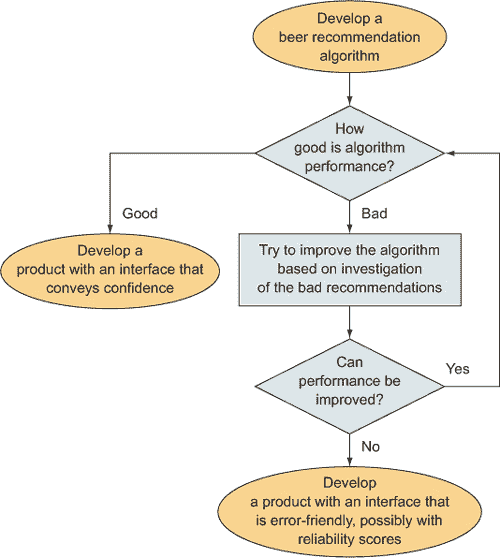

##### 生物信息学和基因表达

这个项目的目的，总的来说，是弄清楚 miR 是否影响了基因的表达水平，具体是在小鼠干细胞发育的背景下。可能的目标包括以下内容：

1.  发现最有可能相互作用的 miR-基因对

1.  发现调控干细胞发育的 miR

1.  发现影响干细胞发育和调控的 miR 和基因之间的途径（原因和效果序列）

目标 1 包括对 miR 和基因在时间序列数据中的特定相关性进行统计分析。无法保证结果有多可靠，但分析肯定是可能的。同样，目标 2 需要分析 miR 在整个干细胞发育阶段的表达水平。这同样是完全可能的，尽管在功能生物学方面，统计方法的结果是否正确并不确定。目标 3 要复杂一些。途径涉及不止两个 miR 或基因，因此发现单一途径需要证明三个以上组成部分之间的多个相关性，以及证明这些多个相关性不仅仅是通过巧合连接起来的额外工作。生物科学期刊在发表我关于发现途径的文章之前，会期望有大量关于各个部分之间联系的证据。尽管目标 3 是可能的，但它比其他两个可能的目标要复杂得多，也难以证明。此外，分析途径所需的统计工作比简单的 miR-基因相互作用要多。

这些目标中每一个的价值都有些不确定。毫无疑问，发现新的 miR-基因相互作用、调控干细胞发育的 miR 或干细胞通路都是很有价值的，但每个目标的价值将取决于涉及的基因以及我能够多么有力地证明结果。如果我发现了一个可以令人信服地与流行生物学现象（如遗传疾病或性别分化）相关的新相互作用或通路，那么我在高影响力期刊上发表这项研究的机会就会大得多。但所有三个目标实现这样有价值结果的可能性大致相同，因此我认为每个目标的价值是相等的。

在评估目标效率时，很明显，目标 3 由于更加复杂，将需要比其他目标多得多的工作。目标 1 和 2 需要大致相同的工作量，并且实现有意义结果的机会也大致相等。这两个目标之间的唯一决定性因素是，确定与特定基因相互作用的特定 miR 似乎比发现只能与干细胞发育一般相关联的干细胞对科学界来说更有趣。

因此，由于目标 1 比目标 2 稍微更有价值和效率，我选择了目标 1 作为我的主要目标，目标 2 紧随其后，目标 3 则排在第三位，只有在完成前两个目标后有大量额外时间时才会进行。

考虑到这些目标，计划必然包括开发旨在发现目标 1 的 miR-基因对的统计方法，同时可能考虑到目标 2 中的调控 miR。在尝试实现这两个目标的过程中发现的关联可以组装起来，以构建类似于目标 3 的合理通路。

描述我的计划的流程图出现在图 6.3 中。正如您所看到的，这个计划相当直接。科学研究往往趋向于这种结构：你致力于改进方法和结果，直到你有一个科学界会欣赏的结果，然后你写一篇关于你的研究的文章，然后提交给期刊发表。这与典型的商业项目形成对比，在商业项目中，通常对时间有更严格的限制，这在某种程度上要求数据科学家为了满足截止日期而妥协结果的质量。另一方面，尽管学术研究人员通常没有强烈的时间限制，除了会议申请截止日期外，他们通常被要求比工业界更高的统计严谨性和发现的重要性标准。一个学术数据科学家的计划可能看起来与一个在可比私营行业中的数据科学家的计划不同，这也是确定特定项目具体计划的因素之一。

##### 图 6.3. 显示我的基因相互作用项目基本计划的流程图

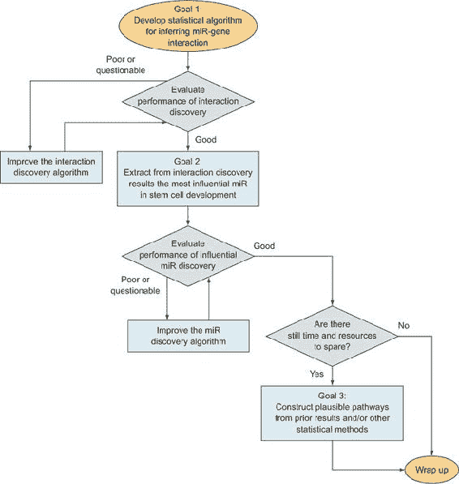

##### 田径和田径的顶尖表现

在第四章中，我讨论了我的一个项目，该项目分析了田径各种项目的最佳表现列表。正如我在本章前面提到的，该项目中剩余的两个主要不确定性涉及数据的质和完整性，以及我应用于它们的统计方法的有效性。

第一个不确定性可以这样表述：是否有足够的数据？因为我只有精英运动员的最佳表现列表，而没有所有表现的完整列表，所以我只能查看统计分布尾部的数据，这使得估计参数变得更加困难。为了确定是否有足够的数据——这一点我将在后面的章节中更深入地讨论——我会检查估计参数的估计方差是否足够小，同时也会检查模型生成的预测的估计方差，以确保它不会因为输入的微小变化而做出剧烈变化的预测。最重要的是，直到我编写将统计模型应用于数据并生成估计值的代码，我才知道是否有足够的数据。如果没有足够的数据，我可能需要考虑从另一个网站购买更多数据（尽管我不确定它会有多少数据，如果有）或者，可能的话，简化模型以便它需要更少的数据。

第二个主要不确定性涉及我将使用的统计分布。我想在统计模型中使用对数正态分布，但在编写统计代码之前，我无法确定这种分布是否合适。在第五章中描述的探索阶段，我确实生成了一些数据的直方图，这些直方图似乎遵循类似于正态曲线的钟形曲线的尾部，但直到我后来编写了估计此类曲线最佳参数的代码并将其与数据比较，这个不确定性才得到解决。因此，在本节的目的上，这个不确定性仍然存在。

最后，还有统计挑战中始终存在的确定性：结果是否足够好？几乎从未有保证你会得到好的结果，这个项目也不例外。出于学术目的——这是一个我打算在科学期刊上发表的学术项目——“足够好”通常意味着“比其他人更好”。我的主要竞争对手是国际田联的田径评分表。我选择比较他们评分表所隐含的预测和我的评分表，看看哪个预测得更准确。如果我未能达到预期，那么我几乎没有什么可以发表的。我必须改进模型和预测，或者——记住，这是阴暗的、无耻的、邪恶的统计学家做法——我改变比较两个评分系统的方式，使其对我有利。我提到第二种非常、非常糟糕的改进结果的方法，并不是因为我建议这样做，而是因为人们确实会这样做，任何阅读统计方法比较的人都应该记住这一点！

考虑到这三个不确定性，我制定了图 6.4 中出现的计划。有两个检查点——数据是否符合分布以及预测的质量——如果我没有遇到问题就到达了检查点，我针对每个检查点有一到两个可能的解决方案。在分布检查点，如果看起来有问题，我会找到一个更好的分布，而在预测质量检查点，我可以选择获取更多数据或改进模型，这取决于当时我认为哪个更合理。如果我想写一个更详尽的计划，我可以包括一些具体的标准，这些标准将使我决定选择数据路线而不是模型质量路线，或者反之亦然。

##### 图 6.4\. 展示我的项目基本计划的流程图，该项目涉及对田径表现的分析

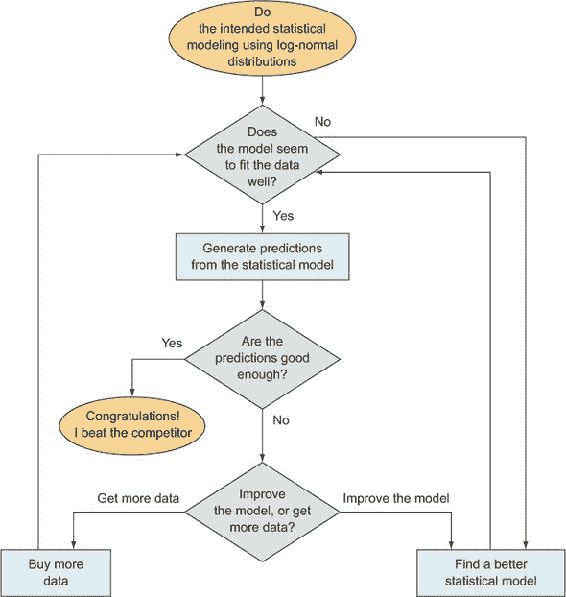

到目前为止，你可能已经注意到，不确定性的主要来源与数据和统计学密切相关。这通常是真的，对我而言也是如此，因为我更倾向于统计学家而非软件开发者，只要有统计模型存在，不确定性就不可避免。

##### 安然电子邮件分析

在第五章中，我介绍了一个旨在寻找和分析公共恩隆电子邮件集中犯罪、可疑或疏忽行为的计划，并应用来自社会网络分析领域的概念来描述它们。关于这个项目的几乎所有事情都充满了不确定性。我们不仅面临我在本章开头提到的数据挑战，而且我们也不知道数据集中有任何具体的犯罪或可疑行为例子。我们大多数情况下假设它们确实存在——在恩隆发生了很多坏事——但是面对超过 10 万封电子邮件，找到它们将非常困难。

由于我们有很多关于恩隆丑闻的新闻报道和研究，并且我们有几位在商业欺诈领域的专家，我们认为开发一些粗略的统计分析来过滤数据可能是一个合理的想法，之后我们可以阅读得分最高的 100 封左右的电子邮件，寻找可疑行为的良好例子。如果我们这样做几次，可能比试图阅读所有电子邮件直到找到可疑的邮件更有效率。

另一个建议是构建一个完整的社会网络行为统计模型，并尝试用它来寻找可疑行为。对我来说，这似乎是本末倒置。或者至少，如果我们偶然发现了一些有趣的电子邮件，这会让我们容易受到一些严重的确认偏差的影响——方法是有效的，还是我们偶然找到了我们寻找的结果？

由于这个项目几乎没有什么具体或保证的事情，我们的计划将更多地关注时间和资源管理，而不是具体的步骤。鉴于我们有截止日期，即使它是一个模糊的截止日期，我们必须记住，我们需要在项目结束时产生*一些*结果。我们不能使用学术策略，即一直工作直到有好的结果然后提交，所以我们使用了一些人称之为*时间盒*的策略。它并不像听起来那么令人兴奋——抱歉。这是对一个开放性任务设定一个相对随意的截止时间，以提醒自己你必须继续前进。

对于 10 天的项目时间表，我们松散的计划看起来就像图 6.5 中出现的流程图。这确实是一个模糊的计划，但至少它是一个起点，并确保整个团队知道你期望时间表如何运作，即使它不会完全按照这种方式运作。即使计划本身也可能随着新信息或其他对目标、优先级或情况其他方面的变化而改变。与其他例子相比，这个例子最显著的特点是它展示了即使在几乎绝对的未知、开放的目标和截止日期的情况下，如何创建一个时间表。

##### 图 6.5. 展示 Enron 项目基本计划的流程图

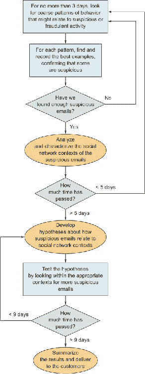

### 6.4. 传达新的目标

计划和目标可能会在任何时候因新的信息、新的限制或其他任何原因而改变。你必须向所有参与项目的人传达重大变化，包括客户。显然，项目的客户对项目的最终产品有直接利益——否则项目就不会存在——因此客户应该了解任何目标的变化。由于大多数客户喜欢保持知情，因此通常建议你通知他们你如何实现这些目标的计划，无论是新的还是旧的。客户也可能对进度报告感兴趣，包括迄今为止的初步结果以及你是如何得到它们的，但这些是最低优先级的。

我在这里提到优先级，因为对数据科学家来说有趣或重要的事情，对非数据科学家的客户来说可能并不有趣或不重要。例如，我参加过许多生物会议上的演讲，演讲者似乎更感兴趣于讲述他们如何得到结果的故事，而不是展示结果本身及其影响。对数据科学家来说，项目的整个故事——通常包括每一个转折、曲折和障碍——代表了已完成工作的吸引力、难度和最终胜利。但非数据科学家最感兴趣的是你是否得到了好的结果，以及他们是否可以信任你的好结果不是偶然的。例如，解释数据整理花了整整一周时间，这仅仅是为了说，“我的工作有时可能很艰难”，并且可能为错过截止日期提供理由，但除此之外几乎没有其他作用。

专注于客户关心的问题：已经取得的进展，以及当前预期可实现的 X、Y 和 Z 目标。他们可能会有问题，这很好，他们可能对了解你项目的各个方面感兴趣，但根据我的经验，大多数人并不感兴趣。在这个阶段与客户会面时，我唯一必须得出的结论是，我清楚地传达了新的目标，并且他们批准了这些目标。其他一切都是可选的。

你可以考虑向客户传达你的基本计划，尤其是如果你在完成项目时使用了他们的任何资源。他们可能会有建议、建议或其他领域知识，这些你还没有经历过。如果他们的资源涉及其中，例如数据库、计算机、其他员工，那么他们当然会对了解你将如何以及将如何充分利用它们感兴趣。

最后，正如我提到的，初步结果以及你是如何得到它们的故事是最低优先级的。根据我的经验，分享这些信息可能会有所帮助，但只有出于以下原因：

+   为了增强客户对有希望初步结果的信心

+   通过展示你的方法是可靠的来赢得客户的信任

+   在一个好的故事中，让客户感觉像团队中的数据科学家，这个故事客户能够理解

所有这些在某种情况下可能是可取的，但在与客户的沟通中，最好确保你不失去你项目角色和他们的主要交叉点：目标。

### 练习

继续使用在第二章中首次描述的 Filthy Money Forecasting 个人理财应用场景，并关联到前几章的练习，尝试以下内容：

> **1**.
> 
> 假设你从上一章的初步分析和描述性统计中得出结论，认为你可能为拥有大量交易的财务账户的活跃用户生成一些可靠的预测，但你认为对于交易相对较少的用户和账户则不能做到同样的事情。将这一发现转化为“可能做什么？什么是宝贵的？什么是有效的？”的调整目标框架。
> 
> **2**.
> 
> 根据你对上一个问题的回答，描述一个在应用内生成预测的一般计划。

### 摘要

+   如我建议的明确和正式的评估阶段可以帮助你组织你的进度、目标、计划和项目知识。

+   在继续之前，问自己，“我学到了什么？”

+   根据初步发现调整期望和目标。

+   根据任何新的信息和新的目标制定计划，同时考虑到不可避免的不确定性。

+   向客户传达新的目标、计划和进度。

## 第七章. 统计与建模：概念与基础

*本章涵盖*

+   统计建模作为数据科学的核心概念

+   数学作为统计的基础

+   其他有用的统计方法，如聚类和机器学习

图 7.1 展示了我们在数据科学过程中的位置：数据统计分析。统计方法通常被认为几乎占了一半，或者至少占三分之一的数据科学所需技能和知识。另一大部分是软件开发和/或应用，剩下的小部分是主题或领域专业知识。统计理论和方法是数据科学中极其重要的，但我在本书中至今对此说的相对较少。在本章中，我试图提供一个全面的概述。

##### 图 7.1. 数据科学过程构建阶段的一个重要方面：统计数据分析

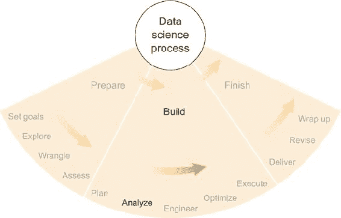

统计学是一个庞大的领域。我不敢奢望在一本书中涵盖所有的统计学，更不用说在一章中。关于这个主题已经写了几百本教科书，几千篇期刊文章，甚至更多的网页。所以如果你有具体问题，你会找到很多参考资料。然而，我尚未在其他书面作品中看到对统计学及其最重要的概念的概述，为那些没有正式统计学培训或教育背景的数据科学爱好者提供了一个坚实的理论基础。在本章中，我将介绍统计学领域作为一个相关工具的集合，每个工具都有其优缺点，以实现数据科学的目标。这种介绍的目的是让你开始考虑在项目中可能应用的统计方法的范围，直到你能够感到舒适地从更详细、更技术性的参考资料中寻求更具体的信息。

### 7.1\. 我对统计学的思考

你可能已经对描述如何应用其复杂技术的统计学和技术参考感到很自在，在这种情况下，这一章可能看起来是不必要的。但除非你接受过大量的正式统计学教育，否则你很可能还有许多尚未见过的领域。或者你可能不熟悉各个统计学领域之间是如何相互关联的。我确实认为，即使是经验丰富的数据科学家，从整体上思考统计学领域，了解其组成部分之间的关系，以及统计学方法与执行它们的软件以及它们所使用的数据之间的区别，也能从中受益。我不打算提供任何这些概念的最终描述，但我确实打算开始对这些概念、它们之间的关系以及每个概念的重要性进行讨论。

在本章中，我将继续强调方法、软件和数据之间的独特性。使用机器学习库并不等同于将一种机器学习类型应用于你的数据集。一个是工具；另一个是行动。同样，数据库并不等同于其中包含的数据，无论它们可能多么交织在一起。因此，因为我想要在本章中专注于统计学方法，所以我通常会抽象地提及软件和数据，尽管在适当的时候我会引用具体的例子。

最后，在我们深入探讨之前，我想说的是，我认为并从概念上思考统计方法的世界。我设想了一些场景，其中我用手抓取数据，将其塞入某种方式能够学习这些数据的机器的管道中，我的工作是调整管道和机器的旋钮，以便从另一端输出好的、有用的信息。或者，在分类数据点的情况下，我想象自己用粉笔画一条线，最好地将红色点与蓝色点分开，然后考虑如何画另一条线来纠正一些落在蓝色一侧的红色点，反之亦然。我就是这样思考的，我在这里提醒你，以防你期待的是一本充满微分方程和相关性系数的章节。相反，这将是一个宏观的章节，充满了许多概念性和富有想象力的段落。我喜欢思考这些事情，所以我希望我能以一种对你来说也很有趣的方式呈现它们。

### 7.2\. 统计学：与数据科学相关的领域

*《牛津统计学词汇词典》*（OUP，2006 年）将统计学描述为“对数据的收集、分析、解释、展示和组织的研究。”在本章的目的上，我们将跳过收集、展示和组织，而专注于分析和解释。我假设你已经根据前几章的描述收集并组织好了你的数据，我将在稍后的章节中讨论展示。

从我的角度来看，分析和解释是统计学的科学方面。它们关注从数据中提取知识，并识别是否有足够的证据来支持一个给定假设或推论。面对许多不确定性——这在数据科学中高度统计的项目中总是如此——良好的分析和解释非常重要，因此我愿意在本章的大部分内容中讨论一些统计学帮助实现这些目标的方法。

#### 7.2.1\. 统计学是什么

统计学位于数学理论领域和可观察数据现实之间。出人意料的是，对大多数人来说，数学与数据几乎没有关系。尽管如此，它与数据科学有着密切的联系。数据科学家需要数学来进行有意义的统计分析，因此，如果我不开始讨论数据科学中的统计学，我将感到疏忽。在下一节中，我将撰写关于数学的内容，它所依赖的主要概念，以及它在现实世界中的应用中的有用性。

统计学的一边是数学，另一边是数据。数学——尤其是*应用数学*——为统计学提供了一套工具，这些工具使得分析和解释成为本章的主要焦点。除了数学之外，统计学还拥有自己的一套以数据为中心的技术。

描述性统计，如第五章第五章中所述，是一种通常直观或简单的统计方法，可以在不过度复杂或难以理解的情况下提供数据的良好概述。在某种意义上，描述性统计通常紧贴数据。

推断统计本质上与数据有一或多个步骤的距离。*推断*是根据可测量的、相关的数量估计未知数量的过程。通常，推断统计涉及一个统计模型，该模型定义了数量，包括可测量和不可测量的，以及它们之间的关系。推断统计的方法可以从非常简单到极其复杂，其精确度、抽象性和可解释性也各不相同。

*统计建模*是使用统计结构描述系统的一般实践，然后使用该模型来帮助分析和解释与系统相关的数据。描述性和推断性统计都依赖于统计模型，但在某些情况下，对模型本身的明确构建和解释起着次要作用。在统计建模中，主要关注的是理解模型及其所描述的底层系统。数学建模是一个相关的概念，它更强调模型构建和解释，而不是它与数据的关系。统计建模侧重于模型与数据的关系。

最远离原始数据的是一套通常被称为（无论好坏）黑盒方法的统计技术。*黑盒*这一术语指的是某些统计方法具有许多相互之间关系复杂的移动部件，以至于在特定数据、特定背景下应用该方法时，几乎不可能剖析该方法本身。许多来自机器学习和人工智能的方法都符合这一描述。如果你试图将数据集中出现的个体分类到几个类别之一，并且应用了随机森林或神经网络等机器学习技术，那么在事后往往很难解释为什么某个个体被以某种方式分类。数据进入黑盒，输出一个分类，而你通常不确定中间到底发生了什么。我将在本章后面更详细地讨论这一概念。

在接下来的几节中，我将更详细地介绍统计学中的各种概念。我通常会倾向于使用高级描述而不是具体应用，以便在许多情况下具有广泛的适用性，但当我认为有帮助时，我会使用说明性示例。有许多优秀的资源可以提供关于每个特定主题的更多细节，我会尽量提供足够的细节，包括关键词和常见方法名称，以便您能够快速找到互联网或其他地方的相关资源。

#### 7.2.2\. 统计学不是什么

关于我作为数据科学家所做的工作最常见的误解通常出现在我与其他公司或机构的招聘人员或招聘代理交谈时。有时，这种误解在我已经接受工作并正在进行项目中途出现。这种误解是，作为数据科学家，我可以以各种方式为大量人群设置、加载和管理多个数据存储。我已多次向许多人解释，数据科学不是数据管理，也绝对不是数据库管理。这两个角色没有任何问题——事实上，当我有机会与一个高度胜任的数据库管理员（DBA）合作时，我永远都会感到感激——但这些角色与科学正好相反。

科学是探索未知的事业。移动数据并提高可靠性和查询速度是一项极其重要的工作，但这与发现未知无关。我不确定为什么，确切地说，有些人会混淆这两个以数据为导向的工作，但这已经发生在我身上不止一次了。当有人要求我为一个大组织设置数据库时，这尤其让我觉得好笑，因为，在所有最常见的数据科学任务中，数据库管理可能是我最不擅长的一项。我可以设置一个对我很有用的数据库，但我肯定不会依赖自己为一个大组织构建数据管理解决方案。

也许是因为我是一个数学家，但我认为数据管理是我有用的技能之一，但它是次要任务。我想进行数据分析。任何能够促进良好数据分析的东西无疑是好的，但在我感到需要为了最佳性能而控制它及其所有管理难题之前，我会忍受可接受的数据库性能很长时间。然而，我专注于统计学，无论它们需要多长时间。

数据管理对于统计学，就像食品供应商对于厨师一样：统计学是一门深深依赖可靠数据管理的艺术，正如以熏肉包裹的鲑鱼闻名的餐厅，严重依赖于来自当地猪场和鲑鱼养殖场的及时、高质量的原料。（向我的素食读者和野生鲑鱼爱好者致歉。）对我来说，统计学**就是**我的工作；其他的一切只是辅助。餐厅顾客首先想要的是用优质原料做的美食；其次，他们可能还想知道他们食物的来源是可靠且快速的。统计分析的消费者——数据科学项目的客户——希望知道他们以某种方式获得了可靠的信息。然后，只有那时，他们才会关心使用这些数据的存储、软件和工作流程是否可靠且快速。统计分析是产品，数据管理是这个过程的一个必要部分。

统计学在数据科学中的作用不是处理数据的次要、外围功能。统计学是提供洞察力的数据科学的一部分。数据科学家所做的所有软件开发和数据库管理都促进了他们进行统计分析的能力。网站开发和用户界面设计——这两项可能要求数据科学家完成的任务——有助于将统计分析交付给客户。作为一个数学家和统计学家，我可能有所偏见，但我认为统计学是数据科学家工作中最具智力挑战性的部分。

另一方面，我在数据科学中处理的一些最大挑战涉及让各种软件组件相互友好地协作，所以我可能低估了软件工程。这都取决于你站在哪里，我想。下一章将涵盖软件的基础知识，所以我将推迟对它的进一步讨论，直到那时。

### 7.3. 数学

尽管数学的确切边界存在争议，但这个领域完全基于逻辑。具体来说，每个数学概念都可以分解成一系列的“如果-那么”陈述加上一组假设。是的，即使是长除法和求圆周长也可以简化为纯粹逻辑步骤，这些步骤遵循假设。碰巧的是，人们已经做了这么长时间的数学，有无数逻辑步骤和假设已经长期普遍使用，以至于我们常常认为其中一些是理所当然的。

#### 7.3.1. 示例：长除法

长除法——或者说是你小学时学到的普通除法——是一种两个数之间的运算，它伴随着许多假设。对于阅读这本书的每个人来说，很可能都是以一系列步骤学习如何进行长除法，这是一种算法，它接受两个数作为输入，被除数和除数，并给出一个称为商的结果。长除法在日常生活中的确很有用（在没有计算器或电脑的情况下更有用），例如，当你想要将餐厅账单平均分给几个人或者与朋友们分享几十个纸杯蛋糕时。

许多人认为数学领域由许多这样的适度有用的计算算法组成，这些人并不完全错误。但比数学算法更重要的是那些可以组装成证明某事物为真或为假的假设和逻辑步骤。事实上，每个数学算法都是由一系列逻辑陈述构成的，这些陈述最终可以证明算法在给定必要的假设下确实做了它应该做的事情。

以三个逻辑陈述 X、Y 和 Z 为例，每个陈述在各种情况下都可能为真或为假，以及以下陈述：

+   如果 X 是真的，那么 Y 必须是假的。

+   如果 Y 是假的，那么 Z 就是真的。

这显然是一组任意的陈述，可能直接来自逻辑学教材，但这样的陈述是数学的核心。

基于这些陈述，假设你发现 X 是真的。那么 Y 就是假的，同时 Z 也是真的。这就是逻辑，看起来并不激动人心。但如果我们给 X、Y 和 Z 赋予现实生活中的意义，在一个包括零售网站访客或潜在顾客的例子中：

+   ***陈述 X—*** 潜在的顾客将超过两个商品放入他们的在线购物车中。

+   ***陈述 Y—*** 顾客只是在浏览。

+   ***陈述 Z—*** 潜在的顾客将会购买某物。

这些陈述对在线零售商来说都是有意义的。你知道，对于任何试图赚钱的零售商来说，“Z 是真的”这个陈述都是令人兴奋的，所以前面展示的逻辑陈述意味着“X 是真的”这个陈述也应该让零售商感到兴奋。更实际地说，这可能意味着如果零售商能够让潜在顾客将超过两个商品放入购物车，那么他们就会做成一笔交易。这可能是在网站上实施的一种可行的营销策略，如果其他做成交易的方法更困难的话。显然，现实生活中很少如此纯粹地逻辑化，但如果你将所有陈述都变得模糊一些，使得“是真的”变成“可能是真的”，同样地，“是假的”也是如此，那么这种场景确实可能是一个数据科学家可以帮助零售商增加销售额的现实场景。这种模糊的陈述通常最好使用概率陈述来处理，我将在本章后面介绍。

回到长除法的例子：即使是基本算术的算法（你可能在学校学过）也是基于假设和逻辑陈述的。在深入探讨这些之前，为了避免用我如何进行长除法的描述让你感到无聊，让我们假设你有一种你喜欢的正确使用铅笔和纸进行长除法的方式——我们将这种方式称为“算法”在此例中。算法必须是给出小数结果的那种，而不是给出一个几乎正确答案加上余数的长除法。（你将在几分钟内理解原因。）此外，让我们假设这个算法最初是由一位数学家开发的，并且这位数学家已经证明，在适当的条件下，算法会得到正确答案。现在让我们探讨一下数学家要求你正确使用算法的一些条件。

首先，你必须假设被除数、除数和商是称为实数集的集合的元素。实数集包括你习惯的所有小数和整数，但不包括其他数字，例如，如果你尝试对负数开平方可能会得到的虚数。还有各种其他非实数集以及不包含数字的集合，但我将把那留给数学教科书去讨论。

除了假设你处理的是实数集之外，你还假设这个特定的实数集也是一个称为域的特殊类型的集合。域是抽象代数中的一个中心概念，它是由一系列性质定义的集合，其中包含两种常见的运算，即加法和乘法，在抽象意义上并不保证以它们在普通算术中工作的方式工作。你知道，在域中，这两种运算总是以某种特定方式作用于域的两个元素，但加法和乘法以这种方式工作的事实，是你进行长除法时必须做出的另一个假设。有关域的更多信息，请参考抽象代数的参考资料。

你假设你有一个由实数组成的域，并且你拥有加法和乘法这两种运算，它们以你在学校学到的方式工作。作为一个域的定义的一部分，这两种运算都必须有**逆运算**。你可能已经猜到了，你通常把加法的逆运算称为**减法**，乘法的逆运算称为**除法**。任何运算的逆运算都必须撤销该运算所做的操作。一个数 *A 乘以 B* 得到一个结果 *C*，使得 *C 除以 B* 再次得到数 *A*。除法定义为已知乘法的逆运算。这不仅仅是一个假设；它是由其他假设和域的定义推导出来的。

总结一下，以下是关于长除法的假设：

+   假设：

    1.  你拥有实数集。

    1.  你有一个在实数集上的域。

    1.  场运算加法和乘法与算术中的运算方式相同。

+   陈述：

    1.  如果你有一个域，那么加法和乘法有逆元：分别是减法和除法。

    1.  如果域运算加法和乘法与算术中的运算方式相同，那么减法和除法也以算术中的方式工作。

    1.  如果除法与算术中的运算方式相同，那么该算法将给出正确答案。

将这些假设与这些陈述结合起来，得到以下结论：

+   假设 1 和 2 与陈述 1 一起意味着减法和除法运算存在。

+   假设 3 和陈述 2 意味着减法和除法与算术中的运算方式相同。

+   前两个陈述与陈述 3 一起意味着该算法将给出正确答案。

那个例子可能看起来很 trivial，从某些方面来看确实如此，但我认为它说明了我们对世界的认识，特别是在定量问题上，是基于数学结构的特定实例构建的。如果由于某种原因实数系统不适用，那么带有小数结果的长期除法将无法工作。如果你使用的是整数集或整数，那么可能需要不同的长除法算法，可能是一个结果为某种商加上余数的算法。长除法不能在整数或整数上以与实数相同的方式工作，原因在于这两个集合——整数或整数——都不构成域。对基础数学的了解，例如当你有一个域或没有域时，是确定算法何时适用以及何时不适用的唯一确定方法。扩展这个想法，数学知识在为数据科学项目选择分析方法以及在诊断这些方法及其结果可能存在的问题时非常有用。

#### 7.3.2\. 数学模型

一个 *模型* 是对系统及其工作方式的描述。一个数学模型使用方程、变量、常数以及来自数学的其他概念来描述系统。如果你试图描述存在于现实世界中的系统，那么你就是在进入 *应用数学* 的领域，这个短语通常意味着所做的工作可以应用于数学之外的事物，例如物理学、语言学或数据科学。应用数学当然通常与统计学紧密相关，我不会尝试在这两者之间做出明确的区分。但是，一般来说，应用数学侧重于改进模型和技术，可能根本不需要任何数据，而统计学则侧重于使用数学模型和技术从数据中学习。数学建模和应用数学这两个领域同样没有明确的界限；前者侧重于模型，而后者侧重于某种现实世界的应用，但两者都不是专门如此。数学模型的概念和使用并不对每个人都直观，所以我会在这里简要地讨论它们。

最简单且最常用的数学模型之一是线性模型。一个 *线性模型* 只是一个直线，由线性方程描述，旨在表示两个或更多变量之间的关系。当这种关系是线性的，它等同于说变量是直接成比例的，这种术语在某些领域中更为常用。描述二维（两个变量）线性模型的线性方程可以写成斜截式（记得从学校学过的！）：

> y = Mx + B

其中 M 是斜率，B 是 y 轴截距。

线性模型在许多应用中被使用，因为它们易于处理，也因为许多自然量可以合理地预期彼此之间大约呈线性关系。汽车行驶的距离与使用的汽油量之间的关系是一个很好的例子。你行驶得越远，消耗的汽油就越多。使用的确切汽油量还取决于其他因素，例如汽车类型、你的驾驶速度以及交通和天气条件。因此，尽管你可以合理地假设距离和汽油消耗量大约呈线性关系，但其他一些随机变量会导致每次旅行中汽油消耗量的变化。

模型通常用于做出预测。如果你有一个基于行驶距离的汽油消耗的线性模型，你可以通过将旅行的距离放入描述你模型的线性方程中来预测你下一次旅行将使用的汽油量。如果你使用了线性模型

> y = 0.032x + 0.0027

其中 y 是需要汽油的量（以升为单位），x 是行驶的距离（以公里为单位），那么线的斜率 0.032 意味着你的数据集中的行程平均每公里需要 0.032 升汽油。除此之外，似乎每次行程都会额外使用 0.0027 升汽油，无论行驶的距离如何。这可能会解释启动汽车和开始行程前几分钟怠速所需的能量。无论如何，使用这个模型，你可以通过设置 x = 100 并计算 y 来预测即将到来的 100 公里行程的汽油使用量。根据模型的预测，y 将是 3.2027 升。这是一个线性模型如何用于预测的基本例子。

图 7.2 展示了一个没有轴标签或其他上下文的线性模型的图形表示。我包含了这个图表而没有上下文，因为我希望专注于模型的纯粹概念方面和数学，而上下文有时可能会分散对这些方面的注意力。在图中，线代表模型，点代表模型试图模拟的数据。y 轴截距似乎约为 5.0，斜率约为 0.25，线似乎合理地遵循数据。但请注意数据点围绕线的分散情况。例如，如果你想要从一个给定的 x 值预测一个 y 值，模型可能不会给出完美的预测，并且会有一些误差。根据点，y 值的预测似乎在线性模型的三到四个单位之内，这可能是好是坏，取决于项目的目标。我将在统计建模部分讨论如何将模型拟合到数据。这里的主要思想是模型与数据之间的概念关系。在建模数据时，在脑海中保留这样的图像——以及它带来的概念理解——可以增加意识并提高分析过程中的决策能力。

##### 图 7.2。一个线性模型（线）和模型试图描述的一些数据（点）的表示。线是一个数学模型，其最佳参数——斜率和截距——可以使用统计建模技术找到。^([1)]

> ¹
> 
> 来自 [`en.wikipedia.org/wiki/Linear_regression`](https://en.wikipedia.org/wiki/Linear_regression)，公有领域。

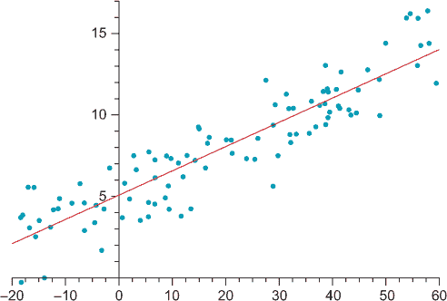

强调数学模型是人为构建的事物，它们与现实生活中的系统没有固有的联系是很重要的。模型是对你认为那些系统中发生的事情的描述，并且不能保证它们有效。找到适合项目目的并且正确应用的模型是数据科学家（或数学家或统计学家）的责任。

|  |
| --- |

**数学模型的例子**

爱因斯坦的引力模型，正如他在广义相对论中所描述的那样，著名地取代了牛顿的引力模型。牛顿的模型是一个简单的方程，它能够相当准确地描述在正常质量和距离下的引力作用力，但爱因斯坦的模型，它使用基于度规张量（一种描述线性关系的更高阶对象）的数学模型，在极端尺度上要准确得多。

现今的粒子物理标准模型，在 20 世纪 70 年代最终确定，是一个基于量子场论的数学模型，该模型理论化了物理力和亚原子粒子的行为。它已经经受了几次对其适用性作为模型的实验测试，最近是在确认希格斯玻色子存在的过程中。希格斯玻色子是标准模型预测的一种基本粒子，在 2012 年之前，关于其存在几乎没有实验证据。从那时起，在 CERN 的大型强子对撞机上的实验已经确认了一个与希格斯玻色子一致的粒子的存在。像任何优秀的科学家一样，CERN 的研究人员不会肯定地说他们只发现了希格斯玻色子，因为该粒子的某些性质仍然未知，但他们确实肯定地说，标准模型中的任何内容至今尚未被实验证据所反驳。

从我自己的经验来看，数学模型的一些更有趣的应用发生在社交网络分析中。社交网络由个体及其之间的连接组成，这使得图论成为寻找适用模型的一个极好的数学领域。连通性、中心性和介于两者之间的理论，以及其他理论，可以几乎直接应用于现实生活中人们以各种方式互动的实际情况。图论还有许多其他应用，而且坦白地说，它还有一些相当有趣的纯粹数学（非应用）问题，但互联网上社交网络的最近出现为建模提供了丰富的新的现象以及支持它的数据。

线性模型的几何等价物是欧几里得几何的概念，这是三维空间正常运作的概念——长度、高度、宽度，所有线条都可以无限延伸而不相交——扩展到任意多个维度。但存在其他几何，这些几何在建模某些系统时可能是有用的。球面几何是存在于球面上的几何。如果你站在地球（一个球体，大约）上，沿着直线行走，忽略水体，你会在一段时间后回到起点。在欧几里得几何中不会发生这种情况——你会走进无限——这是一个在建模某些过程时可能很有用的属性。当然，任何飞机交通模型都可以从球面几何中受益，我相信还有更多用途，例如在制造工程中，精确铣削球节或其他曲面可能需要一个球面几何模型来得到完全正确的形状。

数学模型在每一个定量领域都被使用，无论是明确还是隐含地。就像我们在日常算术中必须做出的某些逻辑陈述和假设一样，一些数学模型在特定目的上被频繁使用，以至于它们被视为理所当然。例如，调查、民主选举民意调查和医学测试都利用变量之间的相关性来得出有信息量的结论。常见的相关性概念——特别是皮尔逊相关系数——假设线性模型，但这一事实往往被视为理所当然，或者至少不是众所周知。下次你阅读即将到来的选举的预测时，要知道预测以及误差范围都是基于线性模型的。

| |
| --- |

#### 7.3.3\. 数学与统计学

真正的数学由假设和逻辑陈述组成，并且仅在特定情况下才涉及数值量。因此，在美国高中数学课程中教授的所有主题中，几何——包括三角形全等和直线平行的证明——最接近数学的核心。但日常生活显然经常涉及数值量，所以我们往往关注处理数量的数学分支。数据科学经常这样做，但它也已被知会渗透到不那么数量化的，或纯，的数学分支，如群论、非欧几里得几何和拓扑学，如果它们看起来有用的话。因此，对某些纯数学主题的了解可能对数据科学家是有用的。

无论如何，数学通常并不涉及现实世界。完全基于逻辑，并且始终——始终——从一个假设集合开始，数学必须首先假设一个可以描述的世界，然后才开始描述它。每个数学陈述都可以用“如果”（如果假设是真实的）来表述，而这个“如果”将陈述及其结论提升到抽象层面。这并不是说数学在现实世界中没有用处；恰恰相反。数学与其说是一门科学，不如说是一种我们可以用其描述事物的词汇。其中一些事物可能存在于现实世界中。就像词汇和它们包含的单词一样，很少有一个描述是完全正确的。目标是尽可能地接近正确。数学家和统计学家乔治·博克斯（George Box）曾著名地写道：“本质上，所有模型都是错误的，但有些是有用的。”确实，如果一个模型与正确性相当接近，那么它是有用的。

统计学领域对模型的正确性也有这些担忧，但统计学并非是一种词汇和逻辑体系，而是一扇观察世界的窗口。统计学从数据开始，尽管统计模型在大多数情况下与数学模型难以区分，但其意图却大相径庭。统计模型不是从内部描述系统，而是通过汇总和操作相关可观察数据，从外部观察系统。

然而，数学确实为统计学提供了大量的重型机械。统计分布通常由具有实际、科学意义的根的复杂方程描述。拟合统计模型通常使用数学优化技术。即使是一个项目数据假设所在的空间也必须用数学来描述，即使这个描述仅仅是“N 维欧几里得空间”。尽管边界有些模糊，但我喜欢说数学结束和统计学开始的地方是真实数据进入方程的地方。

### 7.4. 统计建模与推断

在第五章中，我提到了在数据评估建议的粗略统计分析背景下统计推断。*推断*是估计无法直接测量的量值的任务。因为你没有直接测量这个量值，所以有必要构建一个模型，至少描述你想要的量和已有的测量之间的关系。由于推断中存在模型，我在本节中将统计建模和推断合并在一起。

统计模型与数学模型并没有太大的不同，我在本章中已经介绍过。正如我写的，区别主要在于焦点：数学建模侧重于模型及其固有属性，而统计建模侧重于模型与数据的关系。在两种情况下，模型都是一组变量，其关系由方程和其他数学关系描述。我已经介绍过的 x 和 y 之间的线性模型可能看起来像

> y = Mx + B

而指数模型可能看起来像

> y = Ae^x

其中 e 是指数常数，也称为欧拉数。模型参数值 M、B 和 A 可能直到通过某种统计推断技术估计之前都是未知的。

这两个模型中的每一个都是描述 x 和 y 之间可能存在的关系。在第一种情况下，线性模型，假设当 x 增加一定量时，y 也会增加（或减少，取决于 M 的值）相同的量，无论 x 有多大。在第二种情况下，指数模型，如果 x 增加一定量，那么 y 的增加量将取决于 x 的大小；如果 x 更大，那么 x 的增加将导致 y 增加的量比 x 更小时要大。简而言之，如果 x 变大，那么第二次移动将导致 y 比第一次移动增加得更多。

指数增长的常见例子是不受限制的人口增长。如果资源不稀缺，那么人口——细菌、植物、动物，甚至人类——有时会呈指数增长。增长率可能是 5%，20%或更大，但“指数”这个词意味着百分比（或比例），而不是标量数字，描述了增长。例如，如果一个人口有 100 个个体，并且每年以 20%的速度增长，那么一年后人口将包含 120 个个体。两年后，你预计比 120 多 20%，这将增加 24 个个体，总数达到 144。正如你所看到的，增长速度随着人口的增加而增长。这是指数增长模型的一个特征。

这两个模型，线性模型和指数模型，都可以用一个单一方程来描述。如果你在一个项目中使用这些模型，挑战就是找到代表数据的参数 M、B 和/或 A 的估计值，这些估计值可以提供对所建模系统的洞察。但模型可以远远超出一个单一方程。

现在你已经看到了几个简单的例子，让我们来看看统计模型在一般情况下是什么。

#### 7.4.1. 定义统计模型

一个 *统计模型* 是对系统中涉及的量或变量的描述，也是对这些量之间的数学关系的描述。到目前为止，你已经看到了一个线性模型以及一个指数模型，这两个模型都只涉及两个变量 x 和 y，无论这些量是什么。模型可以更加复杂，包括许多维度的变量以及需要许多不同类型的方程。

除了线性方程和指数方程之外，在统计建模中使用了各种函数类型：多项式、分段多项式（样条）、微分方程、各种类型的非线性方程等等。某些方程或函数类型比其他类型有更多的变量（运动部分），这影响了模型描述的复杂性和估计所有模型参数的难度。

除了这些模型的数学描述之外，统计模型应该与被建模系统的相关数据有某种明确的关系。通常这意味着，存在数据的值被明确地包括在模型中的变量。例如，如果你考虑上一节中的人口增长示例，并且你的数据集包括随时间变化的人口规模的几个测量值，那么你将希望在你的模型中包括人口规模以及一个时间变量。在这种情况下，这可以很简单，例如使用模型方程

> P = P[0]e^(rt)

其中 P 表示时间 t 的人口数量，P[0] 表示初始时刻的人口数量——你可以选择时间零的具体时刻，然后所有其他时间都是相对于这个 t = 0 点的——r 是增长率参数（e 仍然是指数常数）。

假设，建模这些数据的一个目标是你希望能够预测未来某个时间点的人口数量。你所拥有的数据集，即随时间变化的人口规模集合，是 P 和 t 的值对的集合。那么任务就是使用这些过去的值来找到好的模型参数，帮助你对未来的人口做出良好的预测。在这个模型中，P[0] 被定义为 t = 0 时刻的人口数量，因此唯一剩下的未知模型参数是 r。在这个假设项目中，估计 r 的一个良好值是统计建模的主要任务之一。

一旦你对模型参数 r 有了一个良好的估计，并且由于 P[0] 的值是由数据以及选择的时间变量 t 的定义所确定的，那么你将拥有一个可用的模型来描述你所研究的人口增长。然后你可以用它来对过去、现在和未来的人口状态做出结论和预测。这就是统计模型的目的：基于该系统的模型和某些数据，对该系统做出有意义的结论。

为了通过统计模型对系统得出有意义的结论，模型必须良好，数据必须良好，它们之间的关系也必须良好。这说起来容易做起来难。复杂系统——大多数现实生活中的系统都非常复杂——需要特别注意，以确保模型及其与数据的关系足够好，以便得出你所寻求的有意义的结论。你通常必须考虑系统中的许多未知因素和变动部分。一些未知因素可以明确地包含在模型中，例如指数人口模型中的增长率。这些被称为*潜在变量*，将在下一节中描述。

#### 7.4.2\. 潜在变量

当你创建一个系统的模型时，有些量是可以测量的，有些则不能。即使在可测量的量中，也有一些你在数据中已经有了测量值，而另一些则没有。在指数增长模型中，很明显，增长率是一个存在的量，无论你是否能测量它。即使你想使用不同的模型，比如线性模型，可能仍然至少有一个变量或参数代表人口的增长率。在任何情况下，这个增长参数可能不是可测量的。可能会有一些罕见的情况，你可以追踪人口的新成员，在这种情况下，你可能能够直接测量人口增长率，但这似乎不太可能。让我们假设增长率不是直接可测量的，或者至少你在数据中没有直接的测量值。每次当你知道一个变量或参数存在但你没有测量值时，你就可以称之为潜在变量。

*潜在变量*，例如指数人口增长模型中的增长率参数，通常基于对系统如何工作的直观概念。如果你知道人口在增长，你就知道必须有一个增长率，因此为那个增长率创建一个变量是一种直观的做法，这有助于解释你的系统以及其他变量之间的关系。此外，如果你可以对该增长率得出结论，那么这可能对你的项目目标有所帮助。这是在统计模型中包含潜在变量的两个最常见原因：

+   该变量在系统如何工作方面起着直观的作用。

+   你希望对这个特定变量得出统计结论。

在任何情况下，潜在变量代表的是你希望知道其值但无法测量或由于某种原因尚未测量的变量或数量。为了使用它们，你必须从你对其他相关变量的了解中推断它们。

在指数人口增长模型中，如果你知道在多个时间点的种群大小 P，那么了解该种群的变化率相对容易。一种方法就是计算连续时间点之间种群的变化/差异，这几乎等同于直接测量，但并不完全准确。那么问题是，这些绝对差异是否随时间保持恒定，这意味着线性增长，或者它们随着种群的增长而增长，这意味着指数增长或类似情况。如果种群似乎在每个时间段内以恒定的数量增长（例如，每年、每月、每天），那么线性模型似乎更合适，但如果种群似乎在每个时间段内以一定的百分比增长，那么指数模型可能更适合该系统。

我将在本章后面讨论模型比较——找到一个好的统计模型很重要——但现在我将专注于这样一个事实：一个看似直观的数量的性质——例如，我们例子中的种群增长率——在很大程度上取决于模型的选择。人们可能会认为种群增长率是可以直接测量的，但事实上，即使可以测量，你仍然至少需要决定种群是每次以绝对数量增长还是以百分比增长。此外，还有许多其他模型也是可能的；线性（绝对）和指数（百分比）只是用于人口增长的两种最常用的模型。模型的选择及其潜在变量的性质密切相关。两者都高度受到系统如何工作的直观影响，以及系统与数据的关系。

#### 7.4.3. 量化不确定性：随机性、方差和误差项

如果无法直接测量潜在变量，那么对潜在变量的估计值总是存在不确定性，即使可以测量也是如此。获取潜在变量和模型参数的近似精确值是困难的，因此通常在模型中明确包含一些方差和误差项是有用的，这些项通常由值的概率分布的概念来表示。

##### 在统计模型中使用概率分布

如果你模型描述的量有一个期望值——通过某种统计方法估计——那么该量的方差描述了该量的单个实例可能偏离期望值的程度。例如，如果你正在建模人类的身高，你可能会发现男性的平均身高为 179.0 厘米。但每个个体都会以某种程度偏离这个期望值；每个男人可能比这个高度高几厘米或矮几厘米，有些男人几乎正好是 179.0 厘米高，然后是那些极高和极矮的人，他们可能比这个高度高 20 或 30 厘米，或者矮 20 或 30 厘米。围绕期望值的价值分散的概念自然地唤起了人们熟悉的钟形曲线或正态分布的想法。

概率分布通常精确地描述了从随机过程中获取的随机值的分散情况，这些随机值跨越了一组可能值。如果你观察到了由随机过程生成的值，该过程的概率分布会告诉你期望看到某些值的频率。大多数人知道正态分布的形状，他们可能能够说出由正态分布的随机过程生成的值中有多少百分比会高于或低于某些标记。尽管正态分布是最受欢迎的概率分布，但存在各种形状的分布，包括连续和离散的分布，每个分布都附带一组假设。特别是，正态分布处理异常值的能力不强，因此在存在异常值的情况下，更稳健的分布或方法可能更好。每个特定的分布都有其自身的优点和注意事项，选择一个合适的分布对你的结果可能具有重大影响。所有随机性并不相等，因此在确定特定的分布之前进行一些调查是最好的。为此目的，存在大量的统计学文献。

正态分布是一种具有两个参数的概率分布：均值和方差。在建模单个量，例如人类身高的情况下，正态分布可以描述整个模型。在这种情况下，你正在建模的系统在某种意义上是一个产生各种身高的人的系统。均值参数代表系统在制造每个人类时追求的身高，而方差参数代表系统通常偏离该平均身高的程度。

试图达到一个值，但以某种数量错过它，是统计模型中误差项的核心思想。在这个意义上，“误差”是指数量（或测量）的实例（或测量）偏离目标有多远。从概念上讲，这意味着每个男人都应该身高 179.0 厘米，但由于系统中的一些误差，一些男人更高，一些更矮。在统计模型中，这些误差通常被视为不可解释的噪声，主要关注的是确保所有测量中的误差都是正态分布的。

##### 建立具有不确定性的统计模型

涉及误差项的人类身高模型的一个可能版本是以下方程

> h[i] = h[p] + ε[i]

其中 h[p] 是人类生产系统的期望身高，h[i] 是标签为 *i* 的个体的身高。误差项由变量 ε[i] 表示，这些变量被假定为具有均值为零且相互独立的高斯分布。希腊字母 epsilon 是表示误差和其他任意小量的首选符号。请注意，下标 *i* 表示每个个体都有一个不同的误差。如果你对 h[p] 有一个好的估计，并且对 ε[i] 的方差有了解，那么你就有了男性人类身高的可靠模型。这并不是建模男性人类身高的唯一方法。

因为根据经验，你了解到人类男性的身高在个体之间存在差异，你可能会考虑人类群体中期望身高与个体身高之间的概念差异。个体可以被视为相同数量或数量集的不同实例。存在两个概念上的原因，使得相同数量的不同实例可能会发生变化：

+   系统或测量过程是嘈杂的。

+   数量本身可能从一个实例变化到另一个实例。

注意这两个原因之间的微妙差异。第一个原因体现在误差项的概念中。第二个对应于随机变量的概念。

随机变量具有它们自己的固有随机性，这通常不会被考虑为噪声。在人类身高示例中，你与其称系统是嘈杂的，不如假设系统本身随机选择一个身高，然后生产一个几乎正好是这个身高的个体。这种概念上的区分确实有好处，尤其是在更复杂的模型中。这个模型版本可能被描述为

> h[i] ~ N( h[p] , σ² )
> 
> m[i] = h[i] + ε[i]

其中第一个陈述表明，个体 *i* 的身高 h[i] 是通过使用均值为 h[p] 和方差 σ² 的正态分布的随机过程生成的。第二个陈述表明，h[i] 的测量是一个嘈杂的过程，导致测量值为 m[i]。在这种情况下，误差项 ε[i] 仅对应于现实生活中的测量过程，因此可能只有几厘米。

在同一模型描述中将概率分布符号与误差项符号混合可能是不恰当的，因为它们实际上描述的是同一个随机过程，但我认为这可以说明模型中内在随机变量（对模型很重要）和假设未解释的误差项之间的概念差异。

如果你要将你的关于男性人类身高的模型推广到也包括女性，那么一个内在随机变量不是误差项的好例子就会出现。全世界男性普遍比当地女性高，所以在人类身高的模型中将男性和女性合并可能是错误的。假设建模任务的一个目标是有能力生成关于随机选择的人类身高的预测，无论他们是男性、女性还是其他性别。你可以构建一个与之前相同的男性模型，以及相应的女性模型。但如果你要生成一个关于随机选择的人类身高的预测，你将无法确定哪个模型更适用，因此你应该包括一个表示个体性别的随机变量。这可能是一个二进制变量，你假设在从适合该性别的正态分布身高模型中进行预测之前首先选择。这个模型可能可以用以下方程描述

> s[i] ~ B( 1, p )
> 
> h[i] ~ N( hp, σ²(s[i]) )

其中 s[i] 表示个体的性别，根据第一条陈述，性别是从伯努利分布（一个具有两种可能结果的常见分布）中随机选择的，假设选择女性的概率为 p（对于两种性别，男性的概率假设为 1–p）。给定个体的性别 s[i]，术语 hp 的目的是表示与性别 s[i] 匹配的人群的平均身高，σ²(s[i]) 是与性别 s[i] 匹配的人的方差。第二条陈述概括地描述了如何从由个体的性别（该性别是从伯努利分布中随机选择的）确定的参数的正态分布中生成预测身高。

##### 从涉及不确定性的模型中得出结论

假设你已经找到了这个模型中参数的一些良好估计，你可以预测随机选择个体的身高。这种预测在分析小样本量时很有用；例如，如果你随机选择了一组 10 个人，并且他们平均身高为 161 厘米，你可能想知道你是否没有获得一个代表整个群体的样本。通过从你的模型中生成身高预测，以 10 人为一组，你可以看到你得到如此小的平均身高的频率。如果这种情况很少发生，那么这将是你的样本不代表整个群体的证据，你可能需要采取某种措施来改善你的样本。

随机变量在统计建模中有许多用途，其中最不重要的是许多现实生活中的系统包含随机性。在用模型描述这样一个系统时，重要的是永远不要混淆模型的期望与模型所依赖的分布。例如，尽管人类男性身高的模型期望个体身高为 179.0 厘米，但这并不意味着每个男性都是 179.0 厘米。这看起来可能很明显，但我见过许多学术论文混淆了这两者，并采取统计捷径，因为假设每个人都具有平均身高会方便得多。有时这可能无关紧要，但有时可能很重要，弄清楚你处于哪种情况是有益的。如果你是建筑师或建筑工人，你当然不希望建造 180 厘米高的门廊；可能 40%或更多的民众需要低头才能通过，尽管平均身高的人不需要。如果你要根据你项目的结论做出重要决策，通常最好在各个阶段承认不确定性，包括在统计模型中。

我希望关于随机变量、方差和误差项的讨论能够说明不确定性——这在整个数据科学中无处不在——是如何在统计模型中体现的。这可能是一种低估；事实上，我认为减少不确定性是统计学的首要任务。但有时为了以你想要的方式减少不确定性，你必须承认模型各个部分中存在不确定性。将不确定性——随机性、方差或误差——视为确定性可能会导致你得出过于自信的结果，甚至得出错误的结论。这两种情况本身也是不确定性，但是不良的不确定性——那种你不能以严谨和有用的方式解释的不确定性。因此，我倾向于首先将每个量视为一个随机变量，只有在严格说服自己这样做是适当的情况下，才将其替换为确定的、固定的值。

#### 7.4.4\. 拟合模型

到目前为止，我主要是在抽象的意义上讨论模型，没有过多地谈论模型与数据之间的关系。这是故意的，因为我相信在尝试将模型应用于数据之前，考虑我打算建模的系统并决定我认为模型应该如何工作是有益的。*拟合*模型到数据集是这样一个过程：你设计了一个模型，然后找到描述数据的最佳参数值。短语“拟合模型”与估计模型参数的值同义。

模型拟合是在所有可能的参数值组合中，对拟合优度函数进行优化。*拟合优度*可以以多种方式定义。如果你的模型旨在进行预测，那么它的预测应该接近最终结果，因此你可以定义一个预测接近度函数。如果模型旨在代表一个总体，例如在本章前面讨论的人类身高模型，那么你可能希望从模型中抽取的随机样本与你要模拟的总体相似。想象你的模型接近代表你所拥有的数据的方式可能有多种。

由于定义拟合优度的可能方式有很多，决定哪种最适合你的目的可能会令人困惑。但有一些常见的函数适用于大量应用。其中最常见的一种被称为*似然性*，实际上这种类型的函数非常常见且研究得很好，我建议将其作为你的拟合优度函数，除非你有充分的理由不这样做。这样的充分理由之一是，似然函数仅适用于由概率分布指定的模型，所以如果你的模型不是基于概率的，你就不能使用似然性。在这种情况下，最好查阅一些关于模型拟合的统计文献，以找到更适合你模型的拟合优度函数。

##### 似然函数

在英语中，“似然性”这个词被广泛使用，但在统计学中它有特殊的意义。它类似于概率，但方向相反。

当你有一个具有已知参数值的模型时，你可以任意选择一个可能的输出结果并计算该结果的概率（或概率密度）。这就是评估概率密度函数。如果你有数据和模型，但不知道模型的参数值，你可以以相反的方式做同样的事情：使用相同的概率函数并计算数据集中所有点的联合概率（或概率密度），但这样做是在模型参数值的一定范围内。似然函数的输入是一组参数值，输出是一个单一数值，即似然性，这也可以（不完全正确地）称为数据的*联合概率*。当你移动输入参数值时，你会得到数据似然性的不同值。

概率是基于已知参数的输出结果的函数，而似然性是参数值函数，它基于数据集中已知的输出结果。

##### 最大似然估计

对于数据集而言，模型的*最大似然性*解正是其名称所暗示的：产生似然函数最高值的模型参数集。*最大似然估计*（MLE）的任务是找到这个最优参数集。

对于具有正态分布误差项的线性模型，MLE 有一个快速且简单的数学解决方案。但并非所有模型都如此。对于大型和复杂的参数空间，优化是出了名的困难。MLE 和其他依赖于优化的方法正在寻找复杂、多维表面上最高点。我总是把它想象成一次登山探险，寻找一个大型区域中最高峰，而这个区域没有人探索过。如果没有人去过这个区域，也没有空中照片可用，那么找到最高峰就很困难。从地面上看，你可能只能看到最近的峰值，但看不到更远的地方，如果你走向看起来最高的那个，你通常会看到从你所在位置看起来更高的一个。更糟糕的是，优化通常更像是无视野的登山。在试图优化的数学表面上，通常无法看到超出直接周围的环境。通常你知道自己有多高，也许知道地面倾斜的方向，但你无法看得足够远以找到更高的点。

许多优化算法可以帮助改善这种情况。最简单的策略就是一直向上走；这被称为贪婪算法，除非你能保证该区域只有一个峰值，否则它通常效果不佳。其他策略则结合了一些随机性，并使用一些智能策略，在尝试一个方向后，如果结果不如预期，就会重新调整方向。

在任何情况下，MLE 试图在所有可能的参数值空间中找到最高的峰值。如果你知道最高的峰值是你想要的，那就太好了。但在某些情况下，找到有几个非常高的峰值的最高高原可能更好，或者在你做出决定之前，你可能想对整个区域有一个大致的了解。你可以使用其他模型拟合方法来完成这个任务。

##### 最大后验估计

最大似然估计在所有可能的模型参数值表面上寻找最高的峰值。这可能并不适合你项目的目的。有时你可能更感兴趣的是找到最高的峰值集合，而不是寻找绝对最高的一个。

以前几章详细讨论的安然电子邮件数据为例，以及基于社会网络分析建模安然员工行为的项目。由于社会网络分析基于一系列人类行为，这些行为至多是对人们以某种方式与其他人互动的趋势的模糊描述，因此我在做出对项目有意义的结论时，往往不会过于依赖任何单一的行为。我更愿意基于行为集合得出结论，其中任何一个都可以解释我所观察到的任何现象。正因为如此，我对那些看似是社交网络中发生事件的最佳解释的奇特行为解释持怀疑态度，实际上，如果解释中的任何方面哪怕只有一点不真实，那么整个解释和结论就会崩溃。找到一系列相当不错的解释，比找到一个看似非常好但可能脆弱的解释要好。

如果你想要找到一系列高峰值，而不仅仅是最高整体峰值，那么*最大后验概率*（MAP）方法可以帮助你。MAP 方法与 MLE 方法相关，但通过利用贝叶斯统计（本章后面将讨论）的一些值，特别是对感兴趣变量的先验分布的概念，MAP 方法可以帮助找到模型参数空间中的一个位置，该位置被拟合数据的点包围，尽管不如单个最高峰值拟合得那么好。选择取决于你的目标和假设。

##### 预期最大化与变分贝叶斯

与 MLE 和 MAP 方法都导致参数值的点估计不同，*预期最大化*（EM）和*变分贝叶斯*（VB）方法找到这些参数值的最佳分布。我相当倾向于贝叶斯统计，而不是频率统计（本章后面将讨论，如果你不熟悉的话），因此 EM 和 VB 这样的方法对我有吸引力。类似于我喜欢将每个量都视为随机变量，直到我确信否则，我也喜欢在建模的所有步骤中携带方差和不确定性，包括估计的参数和最终结果，如果可能的话。

两者 EM 和 VB 都是基于分布的，因为它们试图为模型中的每个随机变量找到最佳概率分布，以描述数据。如果 MLE 找到最高的峰值，而 MAP 找到一个被许多高区域包围的点，那么 EM 和 VB 各自找到一个你可以从每个方向探索的区域，并且始终处于一个相对较高的海拔区域。除此之外，EM 和 VB 还可以告诉你，在你进入一个低得多区域之前，你可以走多远。从某种意义上说，它们是 MAP 的随机变量版本——但它们并非免费提供。它们可能计算密集，且在数学上难以表达。

EM 和 VB 之间的具体区别主要在于优化模型中潜在变量分布所使用的算法。当优化一个变量的分布时，EM 对模型中其他变量的假设进行了更多的简化，因此，在涉及到的数学和计算需求方面，EM 有时可能比 VB 更简单。VB 始终考虑所有随机变量的完整估计分布，在这个领域没有走捷径，但它也做出了 EM 也做出的某些假设，例如大多数变量之间的独立性。

与 MLE 和 MAP 类似，EM 和 VB 都专注于在参数空间中寻找具有高似然性的区域。它们的主要区别在于对变化的敏感性。MLE 可能会走到悬崖边，而 MAP 可能不会，但它不能对单个位置之外的很多情况做出保证。EM 理解周围区域，而且除此之外，VB 还会稍微更多地关注向一个方向行进如何影响其他方向的地形。这就是一些常见参数优化方法的层次结构的精髓。

##### 马尔可夫链蒙特卡洛

虽然 MLE、MAP、EM 和 VB 都是优化方法，它们都专注于在参数空间中找到一个或一个区域来很好地解释数据，但*马尔可夫链蒙特卡洛*（MCMC）方法旨在以巧妙的方式探索和记录所有可能的参数值的空间，这样你就可以得到整个空间的地形图，并可以根据这张地图得出结论或进一步探索。

不深入细节——你可以找到大量关于其行为和特性的文献——单个 MCMC 采样器从参数空间的一个特定点开始。然后它随机选择一个方向和距离来移动。通常，步长应该足够小，以至于采样器不会跨越重要的轮廓，例如整个峰值，并且步长应该足够大，以至于采样器理论上可以穿越（通常最多几百万步）包含合理参数值的整个参数空间区域。MCMC 采样器很聪明，它们倾向于进入似然性更高的区域，但并不总是这样做。在选择一个暂定的步点后，它们根据当前位置和新的暂定位置的似然性做出随机决策。由于它们很聪明，如果参数空间的一个特定区域比另一个区域的似然性高约两倍，那么 MCMC 采样器在继续穿越空间时，位于该区域的频率大约是另一个区域的两倍。因此，调整良好的 MCMC 采样器发现自己位于参数空间的每个区域中的频率大约与似然函数预测的频率相同。这意味着步长位置（样本）集合是对模型参数最优概率分布的良好经验表示。

为了确保样本集能够很好地代表分布，通常最好在参数空间的不同位置启动几个 MCMC 采样器——理想情况下是很多个——然后观察它们在经过一定步骤后是否都会给出基于它们步骤位置的相同景观图。如果所有采样器都倾向于反复在相同区域以相同比例混合，那么这些 MCMC 采样器就被说成是*收敛了*。已经开发了一些启发式收敛诊断方法，专门用于判断是否在有意义的意义上发生了收敛。

一方面，MCMC 通常比其他方法需要的软件开发工作要少，因为你只需要一个拟合优度函数和一个实现了 MCMC 的统计软件包（这样的软件包有很多）。我提到的其他模型拟合算法通常需要操作拟合优度函数和各种其他特定于模型的优化函数，以便找到它们的解，但 MCMC 不需要。只要指定了数学模型并有一个数据集可以操作，MCMC 就可以立即开始运行。

在缺点方面，MCMC 通常需要比其他方法多得多的计算能力，因为它随机地探索模型参数空间——尽管是巧妙地——并在它落下的每一个点上评估高度。它倾向于停留在更高的山峰周围，但并不总是停留在这里，并且通常会足够远地漫游以找到另一个好的山峰。MCMC 的另一个缺点是，它是否巧妙地探索空间通常是由算法本身的调整参数集决定的。如果调整参数设置不正确，你可能会得到较差的结果，因此 MCMC 需要一些监护。然而，从另一个角度来看，一些好的评估启发式方法已经集成到常见的软件包中，这些方法可以快速让你了解你的调整参数是否设置得当。

通常，MCMC 是一种非常适合拟合没有其他明显更好的选择来拟合的模型的优秀技术。一方面，MCMC 应该能够拟合几乎任何模型，代价是增加的计算时间以及监护和评估启发式方法的检查。公平地说，其他模型拟合方法也要求一些监护和评估启发式方法，但可能没有 MCMC 那么多。

##### 过度拟合

过度拟合不是拟合模型的方法，但它与之相关；这是在拟合模型时可能意外发生的一些不好的事情。“过度拟合”是最常用来指代这样一个观点：一个模型可能看起来很好地拟合数据，但如果你得到一些应该与旧数据一致的新数据，模型根本不适合那些数据。

例如，在股票市场建模中，这是一个常见的现象。似乎就在有人发现股票价格模式的时候，那个模式就消失了。股票市场是一个复杂的环境，产生了大量的数据，所以如果你检查一千或一百万个特定的价格模式，看看它们是否与数据相符，至少有一个看起来是相符的。这尤其适用于你调整模式参数（例如，“这种股票价格通常上涨四天，然后下跌两天”）以最好地解释过去的数据。这是过度拟合。模式和模型可能适合你有的数据，但它们可能不适合接下来进入的数据。

当然，模型应该很好地拟合数据，但这不是最重要的。最重要的是，模型应该服务于项目的目的和目标。为此，我在开始将模型应用于数据之前，喜欢对模型的外观有一个大致的了解，以及它哪些方面对我的项目是不可或缺的。使用先前的探索性数据评估来指导模型设计是一个好主意，但让数据为你设计模型可能不是。

过拟合可能由几个原因引起。如果你的模型中有太多参数，那么在模型参数值已经解释了你的数据中的真实现象之后，它们将开始解释不存在于数据集中的虚假现象，例如数据集中的异常。当你的数据有一些严重的异常，而这些异常在你可以预期在未来收到的数据中大部分都不存在时，也可能发生过拟合。如果你正在模拟书面语言，那么一个充满安然电子邮件或儿童书籍的语料库将导致模型很好地拟合你的数据集，但并不很好地拟合整个书面英语语言。

在检查模型过拟合方面，两种有价值的技术是训练-测试分离和交叉验证。在*训练-测试分离*中，你根据你的一些数据，即训练数据，来训练（拟合）你的模型，然后你在剩下的数据，即测试数据上测试你的模型。如果你过度拟合了训练数据，那么当你对测试数据进行预测时，你应该很明显地发现你偏离得很远。

同样，*交叉验证*指的是基于数据的不同（通常是随机）分区进行重复的训练-测试分离评估的过程。如果基于训练数据做出的预测在交叉验证的几个重复中与测试数据的输出相匹配，你可以合理地确信你的模型将泛化到类似的数据。另一方面，新数据可能不同于旧数据的原因有很多，如果你只在旧数据上进行了交叉验证，你就无法保证新数据也会适合模型。这就是股市等系统中的诅咒，只能通过仔细应用和测试模型以及理解数据来规避。

#### 7.4.5. 贝叶斯统计与频率统计

虽然两者至少自 18 世纪以来就存在，但在 20 世纪的大部分时间里，频率统计比贝叶斯统计更受欢迎。在过去的几十年里，关于两者优缺点的争论一直存在——我甚至不敢说成是*纷争*——但我不会煽动这场争论的火焰。我不想加剧争论，但这两派统计学在对话和文献中经常被提及，因此了解它们的内容是有帮助的。

两者之间的主要区别是一个理论上的解释性区别，这确实对某些统计模型的工作方式有影响。在*频率统计*中，结果置信度的概念是衡量你重复实验和分析多次时预期得到相同结果的频率。95%的置信度表示在实验的 95%重复中，你会得出相同的结论。*频率统计*这个术语来源于这样一个观点，即统计结论是基于许多重复中某个事件发生的预期频率得出的。

*贝叶斯*统计学更紧密地遵循概率的概念。贝叶斯统计推断的结果，而不是具有频率主义的置信度，通常使用概率分布来描述。此外，贝叶斯概率可以直观地描述为对随机事件将要发生的信念程度。这与频率主义概率形成对比，频率主义概率描述概率为在无限系列的事件中某些随机事件发生的相对频率。

老实说，对于许多统计任务来说，你使用频率主义还是贝叶斯方法并没有太大区别。常见的线性回归就是其中之一。如果你以最常见的方式应用它们，两种方法都会给出相同的结果。但两种方法之间有一些差异，这些差异导致了实际上的差异，我将在下面讨论。

声明：我主要是一个贝叶斯主义者，但我不至于偏颇到说频率主义方法不好或低劣。主要我觉得决定采用哪种方法最重要的因素是理解它们各自隐含的假设。只要你能理解这些假设并觉得它们是合适的，两种方法都可以是有用的。

##### 先验分布

贝叶斯统计学和推断要求你对模型参数的值持有先验信念。从技术上讲，你应该在开始分析主要数据集之前制定这种先验信念。但基于你的数据来建立先验信念是称为*经验贝叶斯*的技术的一部分，这可能是有用的，但在某些圈子中不受欢迎。

先验信念可能很简单，比如“我认为这个参数接近于零，上下浮动一两个单位”，这可以正式地转化为正态分布或其他适当的分布。在大多数情况下，可以创建非信息性（或*平坦*）的先验，这些先验被设计用来告诉你的统计模型“我不知道”，在严谨的意义上。无论如何，先验信念必须被编码成一个概率分布，成为统计模型的一部分。在本章前面提到的微阵列协议比较示例中，我描述的超参数是某些模型参数的先验分布的参数。

一些频率统计学家反对制定这样的先验分布的必要性。显然他们认为，如果你在看到数据之前对模型的参数值一无所知，你不需要制定先验信念。我倾向于同意他们的观点，但在大多数情况下，非信息先验分布的存在使得贝叶斯统计学家可以通过使其无关紧要来规避先验分布的要求。此外，如果你试图形式化频率统计学的无先验信念概念，它将非常类似于贝叶斯统计学中的非信息先验。你可能会得出结论，频率统计方法通常有一个隐含的先验分布，而这个先验分布并没有明确表示。我并不是说频率统计学家是错误的，贝叶斯方法是更好的；相反，我旨在说明这两种方法可以非常相似，并驳斥先验信念要求的必要性是一种劣势的观点。

##### 使用新数据更新

我已经解释了贝叶斯统计中先验分布的存在并不是一个缺点，因为大多数情况下你可以使用非信息先验。现在我将解释先验不仅不是坏事，而且是好事。

最常引用的频率统计和贝叶斯统计之间的差异之一，除了“你必须有一个先验”之外，还有“你可以用新数据更新你的模型，而无需包括旧数据。”在贝叶斯框架中实现这一点非常简单。

假设你之前有一个统计模型，并且收到了第一批数据。你使用非信息先验进行了贝叶斯统计分析，并拟合了你的模型。拟合贝叶斯模型的结果是一组参数分布，称为*后验分布*，因为它们是在数据被纳入模型之后形成的。先验分布代表你在让模型查看数据之前所相信的，而后验分布是基于你的先验信念以及模型所看到的数据形成的新信念。

现在你正在获取更多数据。你不需要挖掘旧数据，一次性将模型拟合到所有数据上，使用旧的非信息先验，你可以根据第一批数据取后验分布，并将其作为拟合第二批数据的先验分布。如果你的数据集大小或计算能力是一个问题，那么这种贝叶斯更新技术可以节省相当多的时间和精力。

现在，随着许多实时分析服务的开发，贝叶斯更新提供了一种方法，可以在不重新检查所有过去数据的情况下，即时分析大量数据。

##### 传播不确定性

在频率统计和贝叶斯统计之间的所有差异中，我最喜欢这个，尽管我很少听到有人提到它。简而言之，因为贝叶斯统计紧紧抓住概率这一概念——它从先验概率分布开始，以后验概率分布结束——它允许不确定性在模型中的数量中传播，从旧数据集传播到新数据集，并从数据集一直传播到结论。

在这本书中，我多次提到我是一个承认存在不确定性并跟踪它的忠实粉丝。通过将概率分布提升为第一类公民，正如贝叶斯统计所做的那样，模型的每一部分都可以携带自己的不确定性，如果你继续正确地使用它，你就不会发现自己对结果过于自信，从而得出错误的结论。

我在生物信息学领域发表的几篇学术论文中，我最喜欢的就是强调这个确切的概念。那篇论文的主要发现，称为“通过综合贝叶斯聚类和时间序列表达数据的动态建模改进基因调控网络推断”（PloS ONE，2013）——标题听起来怎么样？——展示了基因表达测量中的高技术差异是如何从数据传播到贝叶斯模型，再传播到结果中，从而更准确地描述了哪些基因与哪些其他基因相互作用。在相同主题的先前工作中，大多数研究完全忽略了技术差异，并假设每个基因的表达水平仅仅是技术重复值平均的结果。坦白说，我觉得这很荒谬，所以我着手纠正它。正如论文引用次数如此之少所暗示的，我可能并没有完全达到那个目标，但我认为这是一个完美的、现实生活中的例子，说明了在统计分析中承认和传播不确定性如何导致更好的结果。此外，我在论文中提出的算法命名为*BAyesian Clustering Over Networks*，也称为 BACON，所以我有这个优势。

#### 7.4.6. 从模型中得出结论

在所有关于设计模型、构建模型和拟合模型的讨论中，我感觉我几乎失去了统计建模的真正目的：了解你正在研究的系统。

一个好的统计模型应包含你感兴趣的系统中所有变量和数量。如果你对全球女性的平均身高感兴趣，那么这应该成为你模型中的一个变量。如果你对雄性和雌性果蝇的基因表达差异感兴趣，那么这也应该包含在你的模型中。如果你和你项目的重要部分是了解恩隆员工对收到的电子邮件的反应性，那么你应该有一个代表反应性的变量在你的模型中。然后，使用你选择的方法拟合模型的过程，将产生这些变量的估计值。在潜在模型参数的情况下，拟合模型直接产生参数估计。在预测建模的情况下，其中预测是未来的一个潜在变量（从未来？），拟合的模型可以生成估计值或预测。

基于你的拟合模型得出结论的形式有很多种。首先，你必须弄清楚你想向它提出哪些问题。参考你在项目规划阶段生成的列表，这些列表在本书的前几章中讨论过。模型能帮助回答哪些问题？为了你的项目目的，一个设计良好的模型应该能够回答关于所讨论系统的许多问题，如果不是所有问题。如果它做不到，你可能需要创建一个新的模型。重建模型虽然令人遗憾，但比使用一个糟糕或无用的模型要好。你可以通过始终保持对项目目标的意识来避免这种情况，特别是这个统计模型旨在解决的项目方面。

假设项目规划阶段提出的问题中涉及许多变量和数量，这些变量和数量在你的模型中都有所表示。对于这些变量中的每一个，模型拟合过程都产生了价值估计或概率分布。你可以对这些估计提出两种主要类型的问题：

+   这个变量的值大约是多少？

+   这个变量是否大于/小于 X？

我将在各自的子节中介绍解决这些问题的技术。

##### 值是多少？估计值、标准误差和置信区间

我之前描述的所有模型拟合方法都产生了模型中变量和参数的最佳猜测，称为*点估计*。大多数但并非所有这些方法也给出了一些关于该值不确定性的度量。根据你使用的特定算法，最大似然估计（MLE）可能不会自动产生这种不确定性的度量，所以如果你需要它，你可能需要找到一个产生这种度量的算法。所有其他模型拟合方法都将不确定性作为模型拟合过程的固有输出。

如果你只需要一个点估计值，那么你就可以继续了。但如果你通常想要某种保证，即该值大约是你所认为的那样，那么你需要一个概率分布或标准误差。参数估计的标准误差是频率派标准差（方差的平方根）的概率分布的等价物。简而言之，你可以有 95%的信心认为参数在其点估计值的两倍标准误差内，或者有 99.7%的信心认为它在三倍标准误差内。这些都是**置信区间**，如果标准误差相对较小，那么置信区间将较窄，你可以合理地（无论你选择多少百分比）确信真实值落在区间内。

标准误差和置信区间的贝叶斯等价物分别是**方差**和**可信区间**。它们几乎以完全相同的方式工作，但正如通常那样，它们在哲学基础上有所不同。鉴于贝叶斯参数估计是一个概率分布，你可以自然地提取方差并创建可信区间，对于正态分布，真实值在均值两倍标准差内的概率是 95%，在均值三倍标准差内的概率是 99.7%。

有时报告一个值或一个区间可以解决你项目的一个目标。但有时你可能想了解更多——例如，变量是否具有特定的属性，比如是否大于或小于某个特定数量。为此，你需要假设检验。

##### 这个变量 _______？ 假设检验

通常，你需要了解一个变量比仅仅是一个点估计值或可能包含真实值的值域更多。有时，了解变量是否具有某些属性很重要，比如这些：

+   变量 X 是否大于 10？

+   变量 X 是否小于 5？

+   变量 X 是否为零？

+   变量 X 是否与另一个变量 Y 有显著差异？

这些问题中的每一个都可以通过假设检验来回答。一个**假设检验**包括一个零假设，一个备择假设，然后是一个适合这两个假设的统计检验。

**零假设**就像是现状。如果这个假设是真的，那就会显得有些无聊。备择假设是一种假设，如果它是真的，那就会令人兴奋。例如，假设你认为变量 X 大于 10，如果这是真的，那么它将对项目产生一些有趣的影响（比如 X 可能是下周预期下载的百万级歌曲数量）。“X 大于 10”是一个好的备择假设。零假设则是其对立面：“X 不大于 10。”现在，因为你希望备择假设是真的，所以你需要证明零假设不是真的，并且要有合理的怀疑。在统计学中，你通常不是证明某事是真的，而是证明另一种可能性，即零假设，几乎肯定不是真的。在语言上这是一个细微的差别，但在数学上却有着相当大的影响。

为了测试零假设和备择假设，并拒绝零假设，正如他们所说，你需要证明 X 的值几乎肯定不会低于 10。假设基于你的模型，X 的后验概率分布是正态分布，均值为 16，标准差为 1.5。重要的是要注意，这是一个单侧假设检验，因为你只关心 X 是否太低（低于 10），而不关心它是否太高。选择正确的检验版本（单侧或双侧）可能会影响你结果的显著性。

你需要检查 10 是否超出了 X 可能有多低的合理阈值。让我们选择 99%的显著性水平，因为你想要确保 X 不会低于 10。参考单侧检验的参考数据，99%的阈值是 2.33 个标准差。你会注意到 16 的估计值比 10 高 4.0 个标准差，这意味着你可以几乎肯定，并且肯定超过 99%的把握，X 的值是高于 10 的。

我几乎不能不提到 p 值就谈论假设检验。你可以在其他地方找到更详尽的解释，但**p 值**是置信度的倒数（1 减去置信度，或 99%的置信度对应于 p<0.01），它代表了频率主义中假设检验最终给出错误答案的概率。在频率主义统计学中，不要将 p 值视为贝叶斯统计学中的概率。p 值应该用于假设检验结果的阈值，而不应该用于其他目的。

另一个概念和潜在陷阱发生在你对相同的数据或相同的模型运行许多假设检验时。运行几个可能没问题，但如果你运行了数百或更多的假设检验，那么你肯定能找到至少一个通过的检验。例如，如果你做了 100 个假设检验，所有都在 99%的显著性水平上，即使没有一个应该通过（零假设被拒绝），你仍然期望至少有一个检验通过。如果你必须执行许多假设检验，最好是进行*多重检验校正*，其中结果的显著性被调整以补偿这样的事实：否则，一些真正的零假设将被随机机会拒绝。有多重检验校正的几种不同方法，它们之间的差异太微妙，无法在此详细讨论，所以我会跳过它们。再次提醒，如果你对此感兴趣，请查阅良好的统计参考书籍！

### 7.5. 杂项统计方法

统计建模是一个明确的尝试，使用数学和统计概念来描述一个系统，目的是理解系统内部和外部是如何工作的。这是一个整体过程，我认为无论你是否最终在严格意义上实现统计模型，理解系统整体——以及项目的数据到目标过程——都是重要的。许多其他统计技术至少部分地超出了我对统计模型的定义，这些可以帮助你了解系统，甚至可能被用来代替正式模型。

我已经讨论了描述性统计、推断以及其他可能被称为*原子统计*的技术——通过这个，我的意思是它们构成了统计学的一些核心概念和构建块。如果你沿着复杂性的阶梯向上移动，你会发现一些统计方法和算法不能说是原子的——它们有太多的移动部件，但它们如此受欢迎，并且通常非常有用，因此在任何统计分析技术概述中都应提及。在接下来的小节中，我将简要描述一些这样的高复杂度技术，它们何时可能有效，以及使用它们时应注意什么。

#### 7.5.1. 聚类

有时候你有一堆数据点，你知道其中有一些模式，但你不确定它们的确切位置，因此你可以将数据点分组为一般相似的数据点集群，以获得数据中发生的事情的大致轮廓。这样，*聚类*，如果它通常没有那么多难以分解和诊断的移动部件，可以成为描述性统计的一个很好的技术。

聚类也可以是统计模型的一个组成部分。我之前提到的基因相互作用模型（我将其命名为 BACON）的主要方面就是聚类。在 BACON 中，“C”代表聚类。全称是 BAyesian Clustering Over Networks。在这个模型中，我假设某些基因的表达是一起移动的，因为它们参与了某些相同的高级过程。大量的科学文献支持这个概念。我没有事先指定哪些基因的表达会一起移动（文献通常在这个问题上并不具有结论性），而是将一个聚类算法纳入我的模型中，允许具有相似表达移动的基因在模型拟合过程中自行聚集。鉴于有数千个基因，聚类有助于减少移动部件的数量（称为*降维*），这本身可以是一个目标，但在这种特定情况下，学术文献为这种做法提供了一些依据，更重要的是，我发现聚类模型比未聚类模型有更好的预测能力。

##### 它是如何工作的

有许多不同的聚类算法——k-means、高斯混合模型、层次聚类等——但它们都遍历数据点的空间（所有连续的数值），并将以某种方式彼此接近的数据点分组到同一个聚类中。

k-means 和高斯混合模型都是*基于质心*的聚类算法，这意味着每个聚类都有一个类似于中心的点，通常代表该聚类的成员。在这些算法中的每一个，数据点距离哪个聚类质心更近，粗略地说，这个聚类就可以说包含了该数据点。聚类可以是模糊的或概率性的，这意味着一个数据点可以部分属于一个聚类，部分属于其他聚类。通常在运行算法之前，你必须定义一个固定的聚类数量，但也有一些替代方案。

*层次*聚类略有不同。它关注单个数据点及其彼此之间的接近程度。简单来说，层次聚类寻找最接近的两个数据点并将它们合并成一个聚类。然后它寻找包括新聚类在内的两个最接近的尚未合并的数据点，并将这两个点合并。这个过程一直持续到所有数据点都合并成一个单一的大聚类。结果是树状图（大多数统计软件包都会乐意为你绘制这样的图），在树的分支结构上，接近的数据点彼此靠近。这有助于看到哪些数据点接近哪些其他数据点。如果你想要多个聚类而不是一个大（树状）聚类，你可以在树的一定深度处切割，以得到你想要的（分支）聚类数量——在这个意义上切割树意味着在某个高度上，将树干和最大的树枝与较小的树枝分开，每个较小的树枝都会保持为一个统一的聚类。

##### 何时使用它

如果你想要将你的数据点（或其他变量）出于任何原因分组，考虑聚类。如果你想能够描述每个组的特性以及典型的聚类成员看起来像什么，尝试使用基于质心的算法，如 k-means 或高斯混合模型。如果你想要了解你的数据点中哪一个最接近哪一个，而你并不太关心这个接近程度——如果接近在绝对意义上比接近更重要——那么层次聚类可能是一个不错的选择。

##### 注意事项

在聚类算法中，通常有很多参数可以调整。你通常不能保证每个聚类中指定的所有成员都很好地由每个聚类代表，或者重要的聚类甚至存在。如果你的数据点的维度（方面、领域）高度相关，那可能会成问题。为了帮助解决所有这些问题，大多数软件工具都有许多诊断工具来检查聚类算法的性能如何。请谨慎使用它们，以及聚类算法。

#### 7.5.2. 组件分析

理解具有许多维度的数据可能很困难。聚类将数据点组合成相似性组，以减少需要审查或分析的对象数量。*成分分析*的方法——其中*主成分分析*（PCA）和*独立成分分析*（ICA）是最受欢迎的——做的是类似的事情，但它们将数据的维度而不是数据点组合在一起，并且按照它们解释数据方差的大小对分组进行排序。从某种意义上说，成分分析直接减少了数据的维度性，通过排序和评估由旧维度构建的新维度，你可能能够仅用少数几个维度来解释每个数据点。

例如，假设你正在分析汽车旅行中的汽油使用情况。在每一个数据点中，字段包括行驶距离、行程时长、车型、车龄以及其他一些信息，还包括旅行中使用的汽油量。如果你试图用所有其他变量来解释汽油使用情况，那么行驶距离和行程时长很可能有助于解释使用了多少汽油。它们都不是完美的预测因子，但它们都可以在很大程度上做出贡献，实际上它们高度相关。在面临高度相关的情况下，构建一个同时使用这两个变量的汽油使用预测模型时，你必须非常小心；许多模型会将这些高度相关的变量相互混淆。成分分析通过操纵维度——混合、组合和排序它们——来最小化相关性，从广义上讲。一个基于成分分析生成的维度来预测汽油使用的模型通常不会混淆任何维度。

行驶距离和行程时长高度相关的观点可能很明显，但想象一下你正在处理一个不太熟悉的研究系统，并且你有数十、数百甚至数千个数据维度。你知道一些维度可能是相关的，但你不知道具体是哪些，你也知道以巧妙的方式减少维度总数通常是有益的。这正是成分分析擅长的地方。

##### 它是如何工作的

成分分析通常将数据集视为一个在多个维度上的数据云，然后找到数据云长度最长的成分或角度。这里的“成分”或“角度”是指维度的组合，因此所选的维度与原始维度相比可能是对角线。选择第一个成分后，这个维度以一种巧妙的方式被折叠或忽略，然后选择第二个成分，目标是找到与第一个成分没有任何共同点的最长或最宽的成分。这个过程会继续进行，按照重要性顺序找到你想要的那么多成分。

##### 何时使用它

如果你数据中有许多维度，而你又想减少维度数量，成分分析可能是减少维度数量的最佳方法，而且结果维度通常具有一些良好的特性。但如果你需要维度具有可解释性，你必须小心行事。

##### 需要留意的事项

主成分分析（PCA），这种最流行的成分分析方法，对数据集中各个维度的值相对尺度很敏感。如果你对数据中的某个特定字段进行缩放——比如说，你从千米换算成英里——那么这将对 PCA 生成的成分产生重大影响。问题不仅在于缩放可能成为问题，原始（或任何）变量的尺度也可能成为问题。每个维度都应该进行缩放，使得其中任何一个维度的相同大小变化在某种程度上都是同样显著的。在尝试任何成分分析的特技之前，最好先咨询一下好的参考资料。

#### 7.5.3. 机器学习和黑盒方法

在分析软件开发的世界里，机器学习如今正风靡一时。并不是说它之前没有流行过，但最近几年，我看到了一些最初的产品进入市场，声称要“将机器学习带给大众”，或者类似的说法。这在某种程度上听起来很棒，但在另一个层面上，它听起来像是在自找麻烦。我认为大多数人并不了解机器学习是如何工作的，或者如何察觉它是否出了问题。如果你是机器学习的新手，我想强调的是，在大多数形式中，机器学习是一个棘手的工具，不应该被视为任何问题的魔法解决方案。为什么需要花费数年或数十年的学术研究来开发一种全新的机器学习技术，原因就在于此，同样也是为什么大多数人还不懂得如何操作它：机器学习极其复杂。

“机器学习”这个术语在许多语境中使用，并且具有某种流动的含义。有些人用它来指代任何可以从数据中得出结论的统计方法，但那并不是我使用的含义。我使用“机器学习”这个术语来指代那些可以从数据中得出结论但模型（如果你愿意这样称呼它们）难以剖析和理解的算法类别。从这个意义上说，只有机器本身才能以某种方式理解其模型。当然，对于大多数机器学习方法，你可以深入了解机器生成的模型内部，了解哪些变量最重要以及它们是如何相互关联的，但以这种方式，机器的模型开始感觉像是一个数据集——如果没有相当复杂的统计分析，很难把握机器模型的工作方式。这就是为什么许多机器学习工具被称为黑盒方法。

使用一个接收数据并产生正确答案的黑盒并没有什么不妥。但是，制作这样一个盒子并确认其答案持续正确可能会很具挑战性，而且在调试完成后几乎不可能查看盒子的内部。机器学习很棒，但可能比其他任何统计方法类别都需要更加小心地使用才能成功。

我不会详细解释机器学习概念，因为互联网和印刷品上都有无数优秀的参考资料。然而，我会简要解释一些关键概念，以便将其置于适当的背景中。

*特征提取*是一个将你的数据点转换为更信息丰富的版本的过程。为了获得最佳结果，每次进行机器学习时提取良好的特征至关重要——除非是进行深度学习。数据点的每个特征都应该向机器学习算法展示其最佳的一面，如果它希望在将来被正确分类或预测。例如，在信用卡欺诈检测中，可以添加到信用卡交易中的一个可能特征是交易金额超出卡正常交易金额的程度；或者，该特征可以是交易规模在所有最近交易中的百分位数。同样，好的特征是那些常识会告诉你可能有助于区分好与坏或任何两个类别之间的特征。还有一些不常见的特征可能没有常识，但你总是必须小心判断这些特征是否真正有价值，或者它们是否是训练数据集的副产品。

这里有一些最流行的机器学习算法，你将把它们应用到从数据点中提取的特征值上：

+   ***Random forest—*** 这是一个有趣的名字，对应一个有用的方法。决策树是一系列以决策结束的 yes/no 问题。随机森林是一系列随机生成的决策树，它倾向于那些能够正确分类数据点的树和分支。当我知道我想要机器学习，但没有充分的理由选择其他方法时，这是我的首选机器学习方法。它非常灵活，而且不容易诊断问题。

+   ***Support vector machine (SVM)—*** 几年前这相当流行，现在它已经进入了一个特别有用的领域，随着下一个机器学习潮流的到来，它已经稳定下来。支持向量机（SVM）被设计用来将数据点分类到两个类别之一。它们操作数据空间，将其扭曲和变形，以便在两个已知属于不同分类的数据点之间打入楔子。SVM 专注于两个类别之间的边界，所以如果你有两个数据点类别，每个类别在数据空间中倾向于聚集在一起，而你正在寻找一种方法来以最大分离度（如果可能的话）划分这两个类别，那么 SVM 就是为你准备的。

+   ***Boosting—*** 这一点解释起来有些棘手，我的有限经验也无法提供所有可能需要的洞察。但我知道，提升（Boosting）在特定类型的机器学习中是一个重大的进步。如果你有一堆平庸的机器学习模型（*弱学习器*），提升可能能够智能地组合它们，从而得到一个优秀的机器学习模型（*强学习器*）。因为提升结合了其他机器学习方法的输出，所以它通常被称为*元算法*。这可不是一件容易的事情。

+   ***Neural network—*** 神经网络的全盛时期似乎是在 20 世纪最后几十年，直到深度学习的出现。在其早期的流行版本中，*人工神经网络*（更正式的名字）可能是最黑的黑盒子。它们似乎是为了不被理解而设计的。但它们在某些情况下工作得很好。神经网络由一层又一层的单向阀门（或神经元）组成，每个神经元都以某种任意的方式转换输入。这些神经元在一个大网络中相互连接，从输入数据到输出预测或分类，所有的计算工作都涉及以巧妙的方式对每个神经元进行加权和重新加权，以优化结果。

+   **深度学习——** 这是本世纪的一项新进展。粗略地说，深度学习指的是你可能不必太担心特征提取的想法，因为有了足够的计算能力，算法可能能够找到它自己的良好特征，然后使用它们来学习。更具体地说，深度学习技术是分层机器学习方法，在低层次上执行与其他方法相同的学习类型，但在高层次上，它们生成可以普遍应用于识别许多形式中重要模式的抽象。今天，最流行的深度学习方法基于神经网络，导致后者的一种复兴。

+   **人工智能——** 我包括这个术语，因为它经常与机器学习混淆，这是有道理的。机器学习和人工智能之间没有根本的区别，但人工智能带来了这样的含义，即机器正在接近人类的智力水平。在某些情况下，计算机已经在特定任务上超越了人类——例如著名的国际象棋或*危险边缘！*——但他们远远达不到普通人类在广泛日常任务中的普遍智力水平。

##### 它是如何工作的

每个特定的机器学习算法都是不同的。数据输入，答案输出；你必须做很多工作来确认你没有犯任何错误，你没有过度拟合，数据已经被正确地分为训练集和测试集，以及当全新的数据到来时，你的预测、分类或其他结论仍然有效。

##### 何时使用

机器学习通常可以做到其他统计方法做不到的事情。我更喜欢首先尝试统计模型，以便了解系统和其与数据的关系，但如果模型在结果方面不足，那么我开始考虑应用机器学习技术的方法，同时不放弃太多与统计模型相关的意识。我不会说我最后的选择是机器学习，但通常我更喜欢一个良好形成的统计模型的直观性和洞察力，直到我发现它不足。如果你知道自己在做什么，并且有一个复杂的问题，它远远不是线性的、二次的或统计模型中其他常见的变量关系，那么直接转向机器学习。

##### 注意事项

在你用测试-训练分离以及一些你和你机器之前从未见过的完全新的数据完全独立地验证它们之前，不要相信机器的模型或其结果——与机器学习实现完全无关。*数据挖掘*——在正式分析数据之前查看数据，并使用你所看到的内容来偏袒你的分析——如果你在挖掘之前没有进行测试-训练分离，可能会成为一个问题。

### 练习

继续使用在第二章中首先描述的“脏钱预测”个人财务应用场景，并关联到之前章节的练习，尝试以下内容：

> **1**.
> 
> 描述两种你可能用来预测个人财务账户的统计模型。对于每种模型，至少给出一个潜在的弱点或劣势。
> 
> **2**.
> 
> 假设你已经成功创建了一个可以将交易准确分类到“常规”、“一次性”和其他你想到的任何合理分类的分类器。描述一个利用这些分类来提高预测准确性的统计模型。

### 摘要

+   在开始软件构建或全面分析阶段之前，从理论上考虑一个项目和问题是有价值的。通过停下来思考问题一段时间，可以在数据科学和其他领域学到很多东西。

+   数学是一种描述系统如何工作的词汇和框架。

+   统计建模是一个描述系统并将其与数据连接的过程。

+   可用的分析方法和实现它们的软件范围很广；从中选择可能会令人感到畏惧，但不应感到压倒。

+   机器学习和其他复杂的统计方法可以作为实现其他情况下不可能实现的目标的好工具，但只有在你小心使用它们的情况下。

## 第八章. 软件：统计学的实践

*本章涵盖*

+   一些统计软件应用的基本知识

+   介绍一些有用的编程语言

+   选择合适的软件使用或构建

+   如何考虑将统计学融入你的软件中

图 8.1 显示了我们在数据科学过程中的位置：构建统计软件。在上一个章节中，我将统计学作为数据科学两个核心概念之一进行了介绍。软件开发和应用知识是另一个核心。在少数情况下，数据科学家在项目过程中可能不需要软件，但我想，当数据集非常小的时候，这是可能的。

##### 图 8.1. 数据科学过程构建阶段的一个重要方面：统计软件和工程

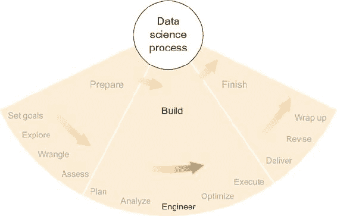

除了不使用之外，数据科学家必须为任何项目做出许多软件选择。如果你有一个喜欢的程序，那通常是一个不错的选择，至少是因为你对它的熟悉。但选择其他东西也可能有很好的理由。或者如果你是数据科学或统计软件的新手，可能很难找到一个起点。因此，在本章中，我在提供一些选择指南之前，给出了数据科学中可能使用的不同类型软件的广泛概述。正如第七章中所述，我打算只提供相关概念的高级描述和一些示例。

经验丰富的软件开发者可能不会太喜欢这一章，但如果你是统计学家或软件新手，我认为这些高级描述是一个不错的开始方式。关于任何特定主题的更多信息，互联网和印刷品中都有许多深入的参考资料。

### 8.1\. 电子表格和基于 GUI 的应用程序

对于那些在 Microsoft Excel 或其他电子表格应用程序上花费了大量时间的人来说，这通常是进行任何类型数据分析的首选。特别是如果数据以表格形式存在，如 CSV，并且数据量不是很大，那么在电子表格中开始分析可以很容易。此外，如果你需要的计算不是太复杂，电子表格甚至可能覆盖项目所需的全部软件需求。

#### 8.1.1\. 电子表格

对于少数可能不太了解的人来说，**电子表格**是一种软件，它以行和列的表格格式表示数据。它通常允许通过一系列函数（如平均值、中位数、总和）来分析这些数据，这些函数可以对数据进行操作并回答一些问题。Microsoft Excel、OpenOffice 和 LibreOffice Calc 以及 Google Sheets 是流行的电子表格应用程序的例子。

当电子表格包含多个工作表、交叉引用、表格查找和函数/公式时，它们可以相当复杂。我制作的最复杂的电子表格是为一个关于房地产的大学财务课程。作为课程的一部分，我们参与了一个模拟房地产市场的活动，其中每个学生都拥有一座公寓楼，这需要关于融资和保险等方面的决策。在模拟过程中，会有随机事件，如灾害，可能会对建筑物造成损害，以及运营成本、空置和利率波动。模拟的目标是在五年后出售建筑物后，从为公寓楼支付的初始现金中获得最高的回报率。

到目前为止，最重要的决定是具体选择哪种抵押贷款来为购买建筑提供资金。我们被提供了八种不同的抵押贷款结构选择，这些结构在期限/持续时间、固定或浮动利率以及它们的利差、购买时支付的点数和临时促销利率方面有所不同。公寓楼有一个明确的购买价格，但就像现实生活中一样，我们有权选择我们想要为购买借多少钱。我们没有通过抵押贷款借到的金额是我们将用来计算回报率的现金支出，这个回报率衡量了我们的成功。

在模拟中包含了所有变量，无论是随机选择还是人为选择，很明显，在做出决策时进行一些计算将非常有帮助，尤其是在融资方面。当时，我只在我的图形计算器上编写程序，而且没有一个程序分析数据。除了学习另一种工具之外，使用微软 Excel 成了我唯一的选择。虽然我和许多人一样对 Excel 有些轻微的厌恶，但它完成了工作。

对于 8 种抵押贷款结构和 12 种不同的借款可能金额，我计算了模拟的 5 年期间每年的现金流量，并从这些现金流量中计算了预期的回报率。我使用了 Excel 的几个公式，包括标准的`SUM`公式用于加法，`PMT`公式用于计算抵押贷款还款，以及`IRR`公式用于计算现金流量的内部回报率。到那时，我可以看到在预期条件下所有可能性的回报率。然而，正如我提到的，模拟的每年都会有随机事件发生，因此预期的结果几乎肯定不会是观察到的结果。为了解决这个问题，我在电子表格中添加了一些代表模拟灾难、利率波动和空置率等值的数值。然后，我能够输入一些可能的随机结果，并查看它们如何影响回报率和最佳选择。

最终，我的电子表格包含了两张工作表，一张用于进行繁重的计算，另一张用于总结结果（如图 8.2 所示 figure 8.2），随机变量及其波动，以及需要做出的决策。进行繁重计算的工作表包含了 96 种不同的现金流陈述，每种陈述对应于 12 种不同借款金额的 8 种不同抵押类型。每个现金流陈述都使用总结工作表中的随机变量值来计算基于特定抵押参数的几种收入和支出的五年现金流。每个现金流计算的结果产生了一个回报率数字，总结工作表随后引用这个数字。当我查看所有 96 个回报率——使用 Excel 的条件格式选项突出显示其中最高的一个——以及如果随机变量结果不同，每个回报率如何变化时，我对选择一个不仅预期回报率最高的抵押贷款，而且在发生灾难时风险也不会太大的抵押贷款感到自信。

##### 图 8.2\. 我在大学金融课程中用来模拟管理公寓楼的工作表的第一页

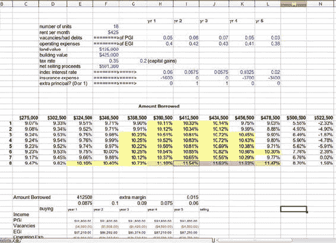

我认为我的同学们并没有花像我一样多的时间分析选择。我不相信他们中的任何一个人创建了电子表格。我最终以超过一个百分点的优势赢得了比赛，这在有金融倾向的人看来是一个相当大的胜利。如果我记得正确的话，我的初始投资回报率超过了 9%，而其他人则不到 8%——如果这笔钱是真的，这个数字将相当于几千美元。我还从比赛中赢得了真正的钱：作为一等奖的 200 美元现金，尽管这比我在虚构的公寓楼中赚到的几千美元要少，但对于我这样一个大学生来说，这笔钱也不是小数目。

我可能在那次单独的金融项目中学到了比整个一生中更多的关于电子表格的知识。电子表格的一个优点，尤其是 Excel，变得很明显：内置公式的数量是天文数字的。对于你可能在电子表格中应用到的几乎任何静态计算，都有一个公式或其组合可以为你完成这项任务。在这里，我用“静态”一词来指代一步完成的计算，没有迭代或值之间的复杂相互依赖。

电子表格的一个主要缺点是，即使是中等复杂的公式也可能看起来像这样：

```
=-((-PMT((F15)/12,$B20*12,F$14,1))*12-(F$14-((1-((1+(F15)/12)¹²-1)/((1+(F15)/12)^($B20*12)-1))*F$14)))
```

或者更糟。我从我的房地产模拟电子表格中直接取了那个例子，尽管即使对我来说也不太清楚这个公式最初是如何打算用来计算现金流量表中某项抵押贷款一年内利息支出的。不用说，这个公式难以阅读和理解——而且它远非我所见或编写过的最糟糕的公式——主要是因为整个公式都在一行上，所有的变量都通过无用的字母和数字组合来引用。更别提括号了。这种计算的易读性可能是一个严重的问题。坦白说，我并不惊讶 Excel 公式错误被卷入许多大型银行机构的失误中，比如 2013 年摩根大通“伦敦鲸”案件，其中显然一个 Excel 公式错误导致了对特定投资组合风险的严重低估，最终导致 60 亿美元的损失。这是一个代价高昂的错误，也是使用具有可读计算说明的统计工具的充分理由。

电子表格不仅限于行、列和公式。Excel 中另一个值得注意的功能是求解器，这是一个可以帮助你找到复杂方程的优化解或优化参数以实现某些目标的功能的工具。要使用它，你必须告诉求解器哪些值可以改变，你还得告诉它哪个值是要最大化或最小化的目标值；然后求解器使用优化技术来找到最佳解。例如，我在另一个大学项目中使用了求解器，当时我试图在繁忙的一天内最大化一组电梯将乘客运送至他们希望到达的楼层的人数。我找到的优化解涉及限制每部电梯访问的楼层；例如，一部电梯负责 1-10 层，另一部负责 10-15 层。通过让 Excel 的求解器改变每部电梯可能访问的楼层，它找到了一个最大化总运输人数的解决方案。

大多数电子表格应用的一个显著特点是宏。*宏*，在像 Excel 这样的应用中，是用户可以自己编写的迷你程序。在 Excel 中，宏是用 Visual Basic for Applications (VBA)编写的，通常可以完成 Excel 中可以完成的所有事情。你不必通过点击和指向来执行某个操作，理论上你可以编写一个执行相同操作的宏。如果你经常做同样的事情，这可能会很有帮助。运行一个宏可能比手动执行一系列步骤要快得多，也容易得多，这取决于这些步骤的复杂性。我为我的房地产电子表格创建了一个宏，这个宏将我已更改的第一个现金流量表中的更改复制到所有其他 95 个现金流量表中。值得注意的是，我没有用 VBA 编写宏，而是 Excel 能够记录我执行复制和粘贴的手动步骤，然后将这个记录转换成我可以使用的宏。如果你经常做特定的事情，你想为它创建一个宏，但又不想在 VBA 中编写代码，这是一个 Excel 的便捷功能。

#### 8.1.2. 其他基于 GUI 的统计应用

我认为像 Excel 这样的电子表格应用是数据分析的第一级软件；即使是初学者也不害怕打开电子表格随意探索一下。第十级是从零开始编写自己完美无缺的软件；这对胆小的人来说不是一件容易的事情。介于两者之间的级别被各种软件应用所占据，这些应用具有不同的易用性和多功能性，如电子表格和编程。如果你觉得你最喜欢的电子表格应用在复杂性方面有所欠缺，但你又不想一头扎进编程语言，那么一些中间解决方案可能适合你。

最近我参加了一个大型统计学会议，并对提供中级统计应用软件的供应商数量感到惊讶。我看到了 SPSS、Stata、SAS（及其 JMP 产品）和 Minitab 等展位。这些应用软件在某个圈子里都很受欢迎，我在生命中的某个阶段使用过其中的三个。我决定玩一个小游戏，在展位不忙的时候去参观，并请每个公司的代表向我解释为什么他们的软件产品比其他产品更好。这是一个诚实的问题，更多的是一种幽默，因为我觉得直接问这些代表，他们大多是统计学家，贬低竞争对手很有趣。一位代表很友好地立刻承认，这些公司都在生产大致相当的产品。这并不是说它们是相等的，只是说没有一个比其他产品明显或绝对更好。对某一产品或另一产品的偏好是一个具体用途和个人喜好的问题。

各家公司核心产品的共同之处在于进行统计分析时具有相似的用户体验。在我看来，每个应用的图形用户界面（GUI）都是基于电子表格的。如果你将典型的电子表格应用屏幕分成几个面板，其中一个面板显示数据，一个显示某些图表或数据的可视化，另一个描述回归分析或成分分析的结果，这就是这些中级统计应用的基本体验。我知道我的描述听起来有些轻视，所以请不要误解，我认为这些应用没有价值——恰恰相反。事实上，我所知道的一切都告诉我，它们非常有用。但软件公司，作为公司，有时会使用夸张的言辞让你认为他们的产品比竞争对手的产品高出一头，并且能迅速解决你的数据问题。尽管我承认我们在当前十年比过去几十年做得好得多，但这几乎从未成真。有一点是真实的：要成功使用统计应用，你必须至少对统计学有所了解。这些应用中没有一个会教你统计学，所以用冷静的头脑和敏锐的眼光去接近它们。通常，如果你想要选择一个，最好的选择就是你的朋友使用的那个，因为如果你遇到问题，他们可以帮你。跟随大众在这里可以是一件好事。

这些中级统计应用的功能远不止于看起来像带有面板的电子表格。它们执行多种不同统计分析的能力通常远超过 Excel 或其他任何电子表格程序。我的印象是，这些软件工具是专门为了实现具有高级复杂度的点选数据分析而构建的，这是电子表格所无法比拟的。如果你想要使用在 Excel 菜单中找不到的统计技术，那么你可能需要升级到上述提到的某个应用。回归分析、优化、成分分析、因子分析、方差分析（ANOVA）以及其他众多统计方法，在中级工具中通常比在电子表格中做得更好，如果后者甚至能实现的话。

除了点击式统计方法之外，这些中级工具通过其关联的编程语言提供了更大的多功能性。我提到的每个专有工具都有自己的语言来进行统计分析，这可以在灵活性和可重复性方面优于点击式操作。有了编程语言，你可以做更多的事情，你还可以保存代码以供将来使用，这样你就可以确切地知道你做了什么，并且可以根据需要重复或修改它。一个包含可运行命令序列的文件通常被称为*脚本*，这是编程中的一个常见概念。并非所有语言都能做到这一点。脚本语言在数据科学中特别有用，因为数据科学是一个由*步骤*组成的过程，是对数据进行操作和执行的动作。

学习这些中级工具之一的编程语言，如果这是你的目标，那么这可以是一个很好的步骤，朝着学习真正的编程语言迈进。这些语言本身就可以非常实用。特别是 SAS，在统计行业中拥有广泛的追随者，学习其语言本身就是一个合理的目标。

#### 8.1.3\. 适用于大众的数据科学

近年来，关于将数据科学带到*分析师*那里的话题引起了很大的关注，分析师是能够直接使用从数据科学本身获得智能的人。我完全支持让每个人都能从数据中获得洞察力，但我仍然不认为没有受过统计学训练的人应该应用它们。或许这是统计学家自我偏见的体现，但在面对不确定性的情况下——正如数据科学中始终如此——认识到分析中存在问题需要培训和经验。

话虽如此，在这个信息、数据和软件创业公司盛行的时代，似乎总有人声称他们使数据科学和分析对每个人来说都变得简单，甚至对初学者也是如此，因此你可能不需要雇佣数据科学家。对我来说，这就像说一个包含医学信息的网络汇编可以取代所有医疗专业人员一样。当然，在许多情况下，网络汇编或新的数据科学产品可以提供与专业人员相当甚至更好的结果，但只有专业人员才有知识和经验来检查必要条件，并在特定策略出错时识别出来。我在这本书中强调，面对不确定性时的可能性意识是数据科学的关键方面，我认为这一点永远不会改变。当风险很大时，经验至关重要。

很有诱惑力，想要列举一些新增加的统计应用来展示我的意思。但是，我不确定其中大部分在几年后是否仍然存在，而且除此之外，名字并不重要。在过去十年中，数据科学已经成为一个大生意，并且是一项非常受欢迎的技能。每当一项技能成为新闻，并且有人花钱去获取它时，总会有公司声称能够使它变得容易，成功率各不相同。我挑战你，作为一个数据科学家，去挑战那些声称简化我们工作的软件产品行业的新手。我在写作时试图超越自己的自我：他们是否认为他们可以用软件完成我们可能只能通过仔细考虑手头项目的需求和愿望，再加上软件和统计才能完成的事情？

我虽然跑题了，但确实想分享我对分析软件行业的（我认为是健康的）怀疑态度。如果有人声称有一个针对严重挑战任务的神奇药丸，请保持怀疑态度。现在有许多好的统计软件应用；一个新应用获得巨大优势的可能性极低，但嘿，我之前已经被证明是错的。新产品几乎总是旧主题或目的性很强的工具的变体，它们在某一件事上非常出色。两者都可以是有用的，但确定新事物的真正适用范围可能需要一些努力。

### 8.2. 编程

当现成的软件工具无法或不能胜任时，你需要自己动手制作。我在上一节提到，最受欢迎的中级统计应用都有自己的编程语言，可以用来任意扩展功能。除了 SAS 及其工具集之外，这些编程语言通常不被视为与其母应用程序无关的语言——这种语言的存在是因为并且与该应用程序并行。

同时也存在相反的情况——为某些独立编程语言构建了基于 GUI 的统计应用。Python 的 iPython 和 R 的 RStudio 都是流行的例子。统计应用的市场可能会有些混乱；我经常看到互联网论坛帖子询问，例如，SPSS 或 R 哪个更好学习。我可以理解，也许 RStudio 的 GUI 和 SPSS 的 GUI 看起来大致相同，但这两个工具的实际功能却大相径庭。两者之间的选择——或者任何中级统计工具和编程语言之间的选择——归结为你是否想要学习和使用编程语言。如果你不想编写任何代码，不要基于 R 或其他编程语言选择任何工具。

编程语言比中级统计应用要灵活得多。任何流行语言的代码都有可能做任何事情。这些语言可以在任何机器上执行任何数量的指令，可以通过 API 与其他软件服务交互，并且可以包含在脚本和其他软件组件中。与父应用程序绑定的语言在这些能力上受到严重限制。

如果你被代码吓到了，编程并没有你想象的那么困难。除了我在高中图形计算器上写的几个简短程序外，我在大学期间的暑期实习之前没有写过任何代码，直到研究生阶段才开始认真编程。我有时希望我早点开始，但事实是，如果你勤奋，掌握一些编程技能并不难。

#### 8.2.1. 编程入门

我在高中的时候就在图形计算器上编写了我的第一个程序，但它们并不复杂。我在大学里唯一上的编程课程叫做面向对象编程；我在这门课程中表现不错，但不知何故，直到在国防部的一个暑期实习期间，我使用 MATLAB 分析了一些图像数据之前，我几乎没有编程。在那之后到研究生期间，我在生物信息学应用中使用 R 和 MATLAB，我逐渐了解了这些语言和编程。我的生活中并没有一个决定学习编程的时刻，而是随着各种项目需要，我学习了编程的各个方面。

我并不一定推荐这种方法来学习。事实上，有很多时候，我缺乏正规训练导致我不得不重新发明轮子，正如人们所说。在开始之前了解可用的语言、工具、规范和资源当然有帮助。但可供选择的东西太多了，如果你对软件工程知之甚少，可能会很难知道从哪里开始。

直到研究生毕业后，我开始在一家软件公司工作，才获得了宝贵的 Java、面向对象编程、几种不同类型的数据库、REST API 以及大多数软件开发者可能已经知道且我发现有用的各种有用的编码规范和良好实践的经验。所有这些都是所谓的现实生活中的数据科学，因此对我学习来说非常有帮助。对于那些几年前像我一样，没有太多纯软件开发经验的人，我会分享我在起步时希望知道的事情。希望这一部分能帮助初学者了解编程的某些方面如何与其他方面相关联，并使他们在使用、讨论和搜索更多相关信息时感到更加自在。

##### 脚本

一个程序可以简单到只是一系列按顺序执行的命令。这样的一组命令通常被称为*脚本*，编写它的行为*脚本编写*。在 MATLAB（或开源克隆 GNU Octave）中，一个脚本可以像这样简单：

```
filename = "timeseries.tsv";
dataMatrix = dlmread(filename);
dataMatrix(2,3)
```

此脚本中的行将一个名为`filename`的变量设置为`"timeseries.tsv"`的值，将包含在`filename`中的文件加载到名为`data-Matrix`的变量中，然后在屏幕上打印`dataMatrix`的第二行和第三列的值。安装 MATLAB 或 Octave 后，初学者编写这样一个简单的脚本几乎没有障碍。timeseries.tsv 文件需要以特定的格式存在——在这种情况下，为制表符分隔值（TSV），以便内置函数`dlmread`能够正确读取它。您还需要了解`dlmread`以及语言语法的一些知识，但很容易在网上和其他地方找到好的例子。

我展示这个极其简单的例子的主要观点是，开始编程并不那么困难。如果您有一个电子表格，您可以将其数值表导出为 TSV 或 CSV 格式，并像我展示的那样加载数据，然后您可以通过这样的脚本立即与数据交互，添加或删除命令以完成您想要的工作。

需要注意的一个重要事项是，此类脚本的命令既可以在交互式语言壳中运行，也可以在操作系统的壳中运行。这意味着您可以选择编写一个脚本，然后告诉您的操作系统（具体方法取决于您的操作系统）运行整个脚本，或者打开交互式语言壳，并在该壳中直接输入命令。运行脚本的操作方法通常更便携，而交互式壳的优势在于允许在执行其他命令、编辑和检查时逐行执行，这可能对您有所帮助。例如，假设您忘记了文件 timeseries.tsv 的内容。在交互式壳中（要进入交互式壳，请打开 MATLAB，壳提示立即出现在屏幕上），您可以运行前两条命令来加载文件，然后您可以在提示符下输入`dataMatrix`并按 Enter 键显示该变量的内容，这些内容是从 timeseries.tsv 加载的。对于小文件，这可能会很方便。另一种选择是在 Excel 中打开文件并查看那里的值，这对某些人来说至少同样吸引人。但假设您想查看包含在 CSV 中的表格的第二百万行。Excel 可能很难加载该文件；截至本文撰写时，没有任何版本的 Excel 可以处理包含两百万行的文件。但 MATLAB 不会有任何问题。要检查第二百万行，请按照前面所示加载文件，然后在交互式壳提示符下输入`dataMatrix(2000000,:)`。

我的大部分早期编程岁月都花在了 MATLAB 和 R 的交互式壳上。我的典型工作流程是这样的：

1.  将一些数据加载到交互式环境中的一个变量中。

1.  在数据上玩弄，检查并计算一些结果。

1.  将步骤 2 中有用的命令复制到文件（脚本）中，以便以后重用。

随着我的命令变得越来越复杂，脚本文件也变得越来越长和复杂。大多数日子里，当我分析数据，尤其是在探索阶段，我最终会得到一个脚本，其中包含恰好能够让我回到当时状态的命令，这样我就可以在以后的日期继续我的工作了。这个脚本会加载到交互式环境中我需要的任何数据集，进行数据转换或计算，并生成图表和结果。

多年来，这就是我编写程序的方式：几乎作为在交互式壳环境中摆弄数据的副作用而创建的脚本。这种随意的编写软件方式并不理想——我将在本节的后面部分回到一些好的编码约定。但我仍然鼓励初学者使用它，至少一开始是这样，因为这种方式很容易开始，而且你可以通过尝试交互式壳中的各种命令来学习很多关于一种语言的知识。

我仍然经常使用脚本，但它们有其局限性和缺点。如果你发现自己无法阅读和理解自己的脚本，因为它们太长或太复杂，那么可能需要使用其他风格或约定。同样，如果你正在将脚本的一部分复制粘贴到另一个脚本中，你可能应该寻找替代方案——当你改变一个脚本中复制部分的某个部分时，但忘记改变同一部分的其他脚本会发生什么？如果一个脚本或一组脚本看起来很复杂或难以管理，那么可能是时候考虑在你的代码中使用函数或对象了；我将在本节的后面部分讨论这些。

##### 从电子表格切换到脚本

Excel 和其他电子表格最常见的功能可以通过使用内置命令如`sum`和`sort`（这些命令的版本在每个语言中都有）以及使用涉及`if`和`else`的逻辑结构来检查数据是否符合某些条件来在脚本语言中复制。除此之外，每种语言都有数千个函数（就像在 Excel 中一样），你可以在你的命令中使用这些函数。这是一个找出哪个函数能做什么以及它是如何工作的过程。

编程语言处理得很好，而电子表格处理得不好的基本命令类型之一是迭代。*迭代*是一组步骤的重复，每次可能使用不同的值。假设 timeseries.tsv 是一个数值表，其中每一行代表商店购买的一些物品。第一列给出了项目编号，范围从 1 到某个数字 *n*，它唯一地标识了购买的是哪个项目。第二列给出了购买物品的数量，第三列给出了支付的总金额。文件可能看起来像这样：

```
3    1    8.00
12   3    15.00
7    2    12.50
```

但如果商店经营成功，可能更长。

假设您想获取项目 12 的总销售数量，而文件有数千行。在 Excel 中，您可以按项目编号排序，滚动到项目 12 的行，然后使用 `SUM` 公式将数量相加。这可能是最快的方法，但需要相当多的手动工作（排序、滚动和求和），尤其是如果您还预计要对项目 12 之后的其它项目也这样做。在 Excel 中还有另一种选择，即创建一个新的第四列，并在该列的每个单元格中使用 `IF` 公式来测试第一列是否等于 12，结果为 1 或 0（对于真或假），然后逐行乘以第二列和第四列，最后将所有行乘积相加。这也是一个相当快速的选择，但如果您还想查看其他项目的总和，您必须巧妙地使用公式，并确保将项目编号放在一个单独的单元格中——并在第四列的每个公式中引用它——这样您就只需在一个地方更改项目编号，以获取其总数量。

如果您只想获取一个或几个项目的数量，那么上述任何一种 Excel 解决方案都可以工作，但如果您需要所有项目编号的总数量呢？排序策略会变得相当繁琐，创建额外列也是如此，无论您是创建了一个额外的列然后更改项目编号，还是为每个项目编号创建了一个新列。在 Excel 中，可能有一个更好的解决方案，涉及条件查找或搜索值，但我一时想不出来。如果您对 Excel 非常熟悉，您可能比我更清楚如何解决这个问题。我试图说明的是，这种类型的问题在大多数编程语言中都很容易解决。例如，在 MATLAB 中，在将文件读取到前面显示的变量 `dataMatrix` 之后，您只需编写以下代码：

```
[ nrows, ncolumns ] = size(dataMatrix);
totalQuantities = zeros(1,1000)
for i in 1:nrows
  totalQuantities( dataMatrix(i,1) ) += dataMatrix(i,2);
end
```

此代码首先找到`dataMatrix`中的行数`nrows`，然后初始化一个包含 1000 个值的向量`totalQuantities`，从零开始，将数量添加到这个向量中。通过命令`total-Quantities(k)`访问`totalQuantities`中的第 k 个条目，将给出第 k 个商品的总销售量。如果商品编号超过 1000，你需要使这个向量更长。`for`循环，通常称为`for`和`end`之间的代码结构类型，遍历`dataMatrix`的行（在每次迭代中，当前行由变量`i`给出），将`dataMatrix`中第 i 行第 2 列的值添加到`totalQuantities`中适当的位置，该位置由`dataMatrix`中第 i 行第 1 列的值给出。

对于那些之前没有编写过代码的人来说，这个例子可能比使用 Excel 或其他他们所知道的工具要复杂。但我认为应该很清楚，几乎任何人都可以通过脚本语言和交互式 shell 开始，并且只需要一点知识就能产生结果。

##### 函数

我之前提到过，脚本有时可能会变得很长、复杂，难以管理。你也可能拥有多个包含一些共同步骤或命令的脚本——例如，如果不同的脚本需要以相同的方式加载数据，或者不同的脚本加载数据但以相同的方式处理数据集。如果你发现自己正在从一个文件复制粘贴代码到另一个文件，并且打算继续使用这两个文件，那么是时候考虑创建一个函数了。

假设你需要将之前的数据文件 timeseries.tsv 用于多个脚本。你可以在 MATLAB 中通过创建一个名为 loadData.m 的文件并包含以下内容来创建一个函数：

```
function [data] = loadData()
  filename = "timeseries.tsv";
  data = dlmread(filename);
end
```

然后你可以在脚本中包含以下行

```
dataMatrix = loadData()
```

为了将数据从 timeseries.tsv 加载到变量`dataMatrix`中，就像之前一样。在我的脚本中，我只是将两行替换为一行，但如果你更改文件名或其位置等其他事情，现在你只需要在函数中做，而不是在多个脚本中做。当你有超过两行代码需要在脚本之间共享时，这也变得更有用。

函数，按照设计，就像数学函数一样，可以接受输入并给出输出。在前面的例子中，没有输入，但有一个输出，变量`data`；它在函数文件的第一行指定为输出。在脚本内部，函数也不会改变任何变量，除了函数输出分配到的变量之外——在这个例子中是`dataMatrix`。因此，使用函数是隔离代码以在脚本之间重用的一种好方法。

函数对于理解代码的功能也是很好的。在你的脚本中，当你大多数时间并不关心数据是如何被加载的，只要它能正确工作，阅读和理解函数调用`loadData()`就很容易。如果加载数据包含许多步骤，将这些步骤推入函数将大大提高脚本该部分的可读性。如果你脚本中有许多块代码协同工作以实现单一目的，比如加载数据，那么你可能希望将每个块推入它自己的函数，并将你的脚本转换为一串命名良好的函数调用。这样做通常对眼睛来说更容易。

为了参考，函数式编程是一种相对流行的编程范式——与面向对象编程相对——其中函数是一等公民；函数式程序强调函数的创建和操作，甚至包括匿名函数和将函数视为变量的处理。关于函数式编程，你需要知道的主要一点是，在严格的范式下，函数没有副作用。如果你调用一个函数，有输入和输出，并且不会影响调用环境的其他变量。就像函数的内部工作发生在某个完全独立的环境中一样，直到函数返回其输出。

无论你是否关心函数式范式的具体细节及其理论影响，函数本身对于封装通常连贯的代码块是有用的。

##### 面向对象编程

函数和函数式编程可以说关注的是*动作*，而面向对象编程可以说关注的是*事物*，但这些事物也可以执行动作。在面向对象编程中，*对象*是可能包含数据和自身类似函数的指令，即*方法*的实体。一个对象通常有一个连贯的目的，就像函数一样，但它的行为却不同。

例如，你可以创建一个名为`DataLoader`的对象类，并使用它来加载数据。我在 MATLAB 中并没有使用很多面向对象的功能，所以在这里我将切换到 Python；本章后面会详细介绍 Python。在 Python 中，名为 dataLoader.py 的类文件可能看起来像这样：

```
import csv

class DataLoader:

  def __init__(self,filename):
    self.filename = filename

  def load(self):
    self.data = []
    with open(self.filename,'rb') as file:
      for row in csv.reader(file,delimiter='\t'):
        self.data.append(row)

  def getData(self):
    return self.data
```

第一行导入了用于从文件加载数据的`csv`包。之后，你看到单词`class`和类的名称`DataLoader`。在类内部，缩进处有三个方法定义。

每个方法的第一个输入是变量`self`，它代表`DataLoader`对象本身的这个实例。方法需要能够引用对象本身，因为方法能够设置和改变对象的属性，或*状态*，这是面向对象编程的一个重要方面，我将举例说明。

定义的第一个方法 `__init__` 是在创建对象或实例化时被调用的方法。任何对于对象存在和功能至关重要的属性都应该在这里设置。在 `DataLoader` 的情况下，`__init__` 方法接受一个名为 `filename` 的参数，这是对象将从其中加载数据的文件名。当在脚本中通过命令如

```
dl = DataLoader('timeseries.tsv')
```

单个输入参数被传递给 `__init__` 方法供对象使用。`__init__` 的定义显示 `__init__` 将这个输入参数分配给对象属性 `self.filename`。在 Python 中，就是这样设置和访问对象属性的。通过 `__init__` 方法实例化对象后，现在在脚本中被称为 `dl` 的对象（或在交互式外壳环境中），其 `self.filename` 属性被设置为 timeseries.tsv，但对象中不包含任何数据。

要从命名的文件中加载数据到对象中，你必须使用 `load` 方法通过命令

```
dl.load()
```

根据方法定义，这将为数据创建一个空列表属性 `self.data`，打开名为 self.filename 的文件，然后将数据逐行加载到 `self.data` 中。在此方法执行后，现在所有数据都已加载到名为 `dl` 的 `DataLoader` 对象的 `self.data` 属性中。

如果你想访问并处理数据，可以使用定义的第三个方法 `getData`，它使用 `return` 语句将数据作为输出传递给调用脚本，就像一个函数一样。

根据对象类定义，一个加载并获取数据以供使用的脚本可能看起来如下：

```
from dataLoader import DataLoader

dl = DataLoader('timeseries.tsv')
dl.load()
dataList = dl.getData()
```

尽管这实现了与我在 MATLAB 或使用函数的原脚本相同的功能，但在这个脚本中，使用对象实现的方式在本质上是有区别的。在导入类定义之后发生的第一件事是创建一个名为 `dl` 的 `DataLoader` 对象。在 `dl` 中有一个独立的环境，其中保存了对象的属性，从概念上讲，这些属性在主脚本之外。函数没有属性，因此是无状态的，而对象的属性——其状态——可以在方法调用期间被用来影响方法的结果或输出。对象及其方法可以有副作用。

副作用和保留状态属性可能具有很大的优势，但如果不小心，也可能很危险。严格来说，函数不应该改变输入变量的值，但对象及其方法可以这样做。在某些情况下，我构建了具有以某种方便计算方法输出的方式操作输入变量的方法的对象。在我学会更加小心之前，我多次没有意识到，在方法内部操作输入值时，我实际上也在影响方法或对象之外，在调用脚本或环境中的值。数学家和其他具有函数性思维的人并不总是首先考虑那种意外的副作用。

使用对象的一个重大优势是，对象提供了一种很好的方式，将大量紧密相关的数据和函数聚集到一个单一的自包含实体中。在加载数据的情况下，主脚本可能并不关心数据来自哪里或如何加载。在这种情况下，当某些变量或值组之间从未直接交互时，根据面向对象范式，它们可能应该以某种方式相互隔离，并将它们包含在自己的对象中可能是一个实现这一目标的良好选择。同样，任何几乎仅与这样一组变量打交道的函数可能都应该转换为包含这些变量的对象中的对象方法。

将程序数据、属性、函数和方法有意地分离成目的性统一的对象的主要优势主要在于可读性、可扩展性和可维护性。就像编写良好的函数一样，构建良好的对象使得代码更容易理解，更容易扩展或修改，也更容易调试。

在函数式编程和面向对象编程之间，没有一个绝对优于另一个。每个都有其优点和缺点，你通常可以从这两个范式中学到东西，以编写最适合你目的的代码。然而，重要的是要小心处理对象的状态，因为如果你混合了函数和对象，可能会很容易将对象方法当作函数来处理，而它具有副作用。

我想要指出的一点是：在本节中，我谈论调用脚本或主脚本时，好像总有一个主脚本在使用一组函数和对象。这并不总是情况。我这样写是为了初学者的清晰，但在实践中，函数可以调用函数并使用对象，对象可以调用函数并使用对象，甚至可能根本不存在脚本，这是下一节的主题。

##### 应用

在这个背景下，我使用术语*应用程序*与*脚本*相对。正如我之前讨论的，*脚本*是一系列要执行的命令。我使用“应用程序”一词来表示当启动或打开时，可以准备就绪并执行某些任务或动作以供用户使用的东西。从这种意义上说，应用程序在概念上与编程中的对象相似，因为对象可以被创建，然后由创建它的任何东西以各种方式使用。另一方面，脚本更类似于函数，因为它只是以直接的方式完成一系列动作。

电子表格是应用程序，网站和移动设备上的应用程序也是如此。它们都是我之前描述的那种应用程序，因为当它们启动时，它们会初始化，但可能不会做很多事情，直到用户与之交互。应用程序的主要用途在于与用户的这种交互，与脚本不同，脚本通常会产生一个有形的结果，提供一些实用性。

在这里提供足够的信息以帮助您开始应用程序开发可能会有点困难。它比脚本编写稍微复杂一些，所以我将指出一些可能对数据科学家有用的概念。更多信息，您可以在互联网上找到大量的参考资料和示例。

应用程序开发对数据科学家变得有用的主要原因有时向客户交付静态报告是不够的。我经常向客户交付我认为相当详尽的报告，但客户却要求在某些点上提供更多细节。当然，我可以向客户提供特定领域的更多细节，也许在额外的报告中，但必须在我自己回到数据中提取这些细节之后。我可能做得更好，提供一段软件，让客户能够深入探究他们感兴趣的每个报告方面。我可能通过设置数据库和 Web 应用程序来实现这一点，允许客户通过标准 Web 浏览器点击浏览结果和数据的良好表示。这正是大多数分析软件公司今天交付产品的方式。所有分析都在幕后进行，而 Web 应用程序以比报告更友好、更有用的方式交付结果。

数据科学家还创建应用程序，这些应用程序可以实时或以其他方式交互式地消耗和分析数据。Google、Twitter、Facebook 以及许多其他网站使用相当复杂的方法进行数据分析，这些方法通过应用程序持续地发送到网络上。热门话题、头条新闻和搜索结果都是数据科学密集型应用程序的产物。

但是，正如我所说的，创建一个应用程序并不像编写脚本那样简单，所以我会节省空间，在这里跳过细节，并建议你查阅比我更有信息的人写的参考资料。但是，如果你对此感兴趣并且已经有一些编程语言的经验，可以查看这些在数据友好型语言中构建 Web 应用程序的开源框架：

+   Flask for Python

+   Shiny for R

+   Node.js for JavaScript，加上 D3.js 用于惊人的数据驱动图形

#### 8.2.2\. 语言

现在我将介绍三种我用于数据科学和相关编程任务的脚本语言，以便比较和对比它们，而不是详细描述它们。这些语言是 GNU Octave（MATLAB 的开源克隆）、R 和 Python。对于这些语言，我给出示例代码，每个案例都使用 8.2.1 节 中的商品销售数量示例以及我描述的相同格式的 timeseries.tsv 数据文件。我定义了一个用于加载数据的函数，然后脚本统计所有商品（最多 1000 件）的销售数量，并将商品 12 的总销售数量打印到屏幕上。

在讨论了三种脚本语言之后，我简要地谈到了一种不是脚本语言的语言（因此不可能提供一个示例脚本），但它在软件开发和数据分析方面都足够重要，我认为我应该提到它。这种语言是 Java。

##### MATLAB 和 Octave

MATLAB 是一种专有软件环境和编程语言，擅长处理矩阵运算。根据本文写作时的价格，MATLAB 的成本相当高——单软件许可证就超过 2000 美元——但对于学生和其他大学相关人士有显著的折扣。有些人决定在一个名为 Octave 的开源项目中复制它。随着 Octave 的成熟，它在可用功能和能力上越来越接近 MATLAB。除了使用附加包（即工具箱）的代码外，大多数用 MATLAB 编写的代码在 Octave 中也能运行，反之亦然，这对于那些拥有 MATLAB 代码但没有许可证的人来说是个好消息。根据我的经验，你可能需要更改一些函数调用以实现兼容性，但不必很多。我曾经在我的 MATLAB 代码中找到大约 10 行存在不兼容性的代码后，让几百行代码在 Octave 中运行。

当不使用附加包时，几乎完全兼容性非常好，但 Octave 在性能方面有所不足。从我在互联网上收集的信息来看，MATLAB 在数值运算方面可能比 Octave 快两到三倍，这从我自己的经验来看似乎是合理的，尽管我没有进行过直接比较。因为 MATLAB 和 Octave 都是为了矩阵和向量运算而设计的，所以如果你想充分利用语言的效率，你必须编写向量化的代码。显然，如果你有应该向量化但未向量化的代码，例如使用`for`循环来乘矩阵，MATLAB 在识别正在发生的事情并编译代码方面做得更好，这样代码的执行速度几乎与显式向量化一样快。Octave 可能还做不到这一点。无论如何，利用向量化代码的效率来处理向量和矩阵始终会使你的代码更快，有时甚至非常显著。这在 MATLAB、Octave、R 和 Python 等其他语言中都是如此。

在 MATLAB 和 Octave 中编写向量化的代码对于熟悉矩阵运算的人来说非常容易，因为代码看起来与等价的数学表达式完全一样。这在其他我讨论的语言中并不成立。例如，如果你有两个兼容维度的矩阵`A`和`B`，按照标准方式（非逐元素）相乘可以通过编写以下代码来完成

```
A * B
```

而对于维度相同的矩阵`A`和`B`的逐元素乘积是通过以下方式实现的

```
A .* B
```

这两个操作都是向量化的。请注意，如果数学表达式需要转置矩阵或向量，你同样需要在代码中转置它，否则可能会得到错误或错误的结果。转置运算符是矩阵后面的单个引号，如`A'`。

作为参考，这些非向量化的等价操作，矩阵乘法可能至少涉及两个嵌套的`for`循环，遍历矩阵的行和列。向量化的版本既容易编写，执行速度也更快，因此尽可能进行向量化是最佳选择。R 和 Python 也可以使用向量化，但那些语言中矩阵乘法的默认方式是逐元素版本，尽管提供了标准矩阵乘法的替代方案。

作为对 MATLAB 和 Octave 语法的稍作介绍，你可以通过创建一个名为 loadData.m 的文件并编写以下行来实现项目销售数量的示例：

```
function [data] = loadData()
  data = dlmread("timeseries.tsv");
end
```

在同一目录下，创建一个名为 itemSalesScript.m 的脚本文件，包含以下行：

```
dataMatrix = loadData();
[ nrows, ncolumns ] = size(dataMatrix);
totalQuantities = zeros(1,1000);
for i = 1:nrows
  totalQuantities( dataMatrix(i,1) ) += dataMatrix(i,2);
end

totalQuantities(12)
```

你可以通过以下命令在 Unix/Linux/Mac OS 命令行中从 Octave 运行此脚本

```
user$ octave itemSalesScript.m
```

输出到命令行的结果应该是你数据文件中出现的项目 12 的总销售量。要在 MATLAB 或 Octave 提示符下运行相同的代码，请将 itemSalesScript.m 文件的内容复制并粘贴到提示符中，然后按 Enter 键。

在以下情况下，我会使用 MATLAB 或 Octave：

+   如果我在处理大型矩阵或大量矩阵。

+   如果我知道某个特定的附加包，特别是在 MATLAB 中，将会非常有用。

+   如果我有 MATLAB 许可证并且喜欢矩阵友好的语法。

在以下情况下，我不会使用 MATLAB 或 Octave：

+   如果我的数据不适合用表格或矩阵表示。

+   如果我想让我的代码与其他软件集成；由于 MATLAB 的应用范围相对较窄，这可能会很困难且复杂，尽管许多类型的集成都是可能的。

+   如果我想将我的代码包含在要出售的软件产品中。特别是 MATLAB 的许可证可能会在法律上使这变得困难。

总体来说，MATLAB 和 Octave 对于工程师（尤其是电气工程师）来说非常出色，他们需要在信号处理、通信、图像处理和优化等领域处理大型矩阵。

要查看我几年前的一些 Octave 代码（曾经从 MATLAB 转移过来），请参阅我在 GitHub 上的生物信息学项目，关于基因互作的项目[`github.com/briangodsey/bacon-for-gene-networks`](https://github.com/briangodsey/bacon-for-gene-networks)。代码相当杂乱，但请不要因为过去的错误而责怪我。从某种意义上说，那段代码以及我的其他生物信息学项目代表了我当时混合脚本和函数编码风格的一种快照。

##### R

我对 R 的第一个笔记：如果你想在网上搜索帮助，在搜索框中输入字母 *R* 可能会带你到一些有趣的地方，尽管搜索引擎每天都在变得更聪明。如果你难以获得良好的搜索结果，试着在框中也输入缩写 *CRAN*；CRAN 是综合 R 存档网络，可以帮助 Google（和其他搜索引擎）将你引导到适当的网站。

R 基于在贝尔实验室创建的 S 编程语言。它是开源的，但其许可证比 Python 和 Java 等一些其他流行语言更为严格，尤其是如果你正在构建商业软件产品的话。

R 与我介绍的其它语言有一些独特之处和差异。它通常使用符号 `<-` 来给变量赋值，尽管后来添加了等号 `=` 作为替代，以方便那些更喜欢它的用户。与 MATLAB 相比，R 使用方括号而不是圆括号来索引列表或矩阵，但 MATLAB 在这里是个例外；大多数语言使用方括号进行索引。而 MATLAB 和 Python 都允许创建以方括号开始的列表、向量或矩阵等对象，但 R 不允许这样做。例如，在 MATLAB 和 Python 中，你可以使用赋值 `A = [ 2 3 ]` 来创建包含数字 2 和 3 的向量/列表，但在 R 中，你需要使用 `A <- c(2,3)` 来完成类似的事情。这不是一个很大的差异，但如果我有一段时间没有使用 R，我可能会忘记这一点。

与 MATLAB 相比，在 R 中加载和处理不同类型的数据更容易。MATLAB 擅长处理表格数据，但一般来说，R 在处理带有标题的表格、混合列类型（整数、小数、字符串等）、JSON 和数据库查询方面表现更佳。我并不是说 MATLAB 不能处理这些，但它在实现上通常更为有限或困难。此外，在读取表格数据时，R 通常会默认返回一个数据框对象。*数据框*是包含列数据的灵活对象，其中每一列可以具有不同的数据类型——例如，数值、字符串，甚至是矩阵——但每一列中的所有条目必须是相同的。一开始使用数据框可能会感到困惑，但它们的灵活性和强大功能在一段时间后就会变得明显。

R 作为开源软件的一个优点是，开发者可以在他们认为合适的地方更容易地贡献于语言和包的开发。这些开源贡献极大地帮助了 R 的成长并扩展了它与其它软件工具的兼容性。CRAN 网站上提供了数千个 R 包。我认为这是 R 语言最伟大的单一优势；你很可能找到一个包来帮助你执行你想要进行的分析，这样一些工作就已经为你完成了。MATLAB 也有包，但数量远不及 R，尽管它们通常非常好。R 有好的也有不好的，以及介于两者之间的。你还会在公共仓库中找到大量的 R 代码，这些代码可能尚未成为官方包，但它们是免费可用的。

在我多年的生物信息学研究生涯中，R 是我同事以及我们所在其他机构的同行最常用的语言。大多数开发新生物信息学统计方法的科研团队都会创建一个 R 包，或者至少将他们的代码放在某个地方，就像我在我的一个项目 PEACOAT 中做的那样，该项目在 GitHub 上[`github.com/briangodsey/peacoat`](https://github.com/briangodsey/peacoat)。

你可以通过创建包含以下代码的文件 itemSalesScript.R 在 R 中实现商品销售数量示例：

```
loadData <- function() {
  data <- read.delim('timeseries.tsv',header=FALSE)
  return(data)
}

data <- loadData()
nrows <- nrow(data)
totalQuantities <- rep(0,1000)
for( i in 1:nrows ) {
  totalQuantities[data[i,1]] <- totalQuantities[data[i,1]] + data[i,2]
}

totalQuantities[12]
```

你可以通过以下命令在 Unix/Linux/Mac OS 命令行中运行此脚本：

```
user$ Rscript itemSalesScript.R
```

或者，从 R 环境的 shell 提示符中，将 itemSalesScript.R 的内容复制并粘贴到 shell 中，然后按 Enter 键。

除了 MATLAB 和 R 之间的语法和函数名变化之外，你可能会注意到它们的基本结构是相同的。R 使用花括号`{}`来定义函数和`for`循环，而 MATLAB 则使用`end`命令来表示代码块的结束。函数还使用显式的`return`语句，这在 MATLAB 中是不存在的。

我会在以下情况下使用 R：

+   如果我在一个有很多 R 包的领域工作。

+   如果我在学术界工作，尤其是生物信息学或社会科学领域。

+   如果我想快速加载、解析和处理各种数据集。

在这些情况下，我不会使用 R：

+   如果我在创建生产软件。

+   如果我在创建要出售的软件。GPL 许可证有影响。

+   如果我想将我的代码集成到其他语言的软件中。

+   如果我想使用面向对象架构。在 R 中这并不出色。

总体而言，R 是统计学家和其他那些更倾向于进行数据密集型、探索性工作而不是构建生产软件（例如，在分析软件行业中）的人的好选择。

##### Python

首先也是最重要的，Python 是这三种脚本语言中唯一一个不是旨在主要作为统计语言的。在这方面，它更自然地适用于非统计任务，如与其他软件服务的集成、创建 API 和网络服务以及构建应用程序。Python 也是这三种语言中唯一一个我会认真考虑用于创建生产软件的语言，尽管在这方面 Python 仍然不及 Java，我将在下一部分讨论这一点。

Python，像任何语言一样，有其独特之处。最明显的一点是它没有大括号来表示代码块，甚至没有像 MATLAB 中的 `end` 命令来表示 `for` 循环或函数定义何时结束。Python 使用缩进来表示这样的代码块，这对许多程序员来说是一种永恒的痛苦。通常，这样的代码块会缩进，但 Python 是唯一一个强制你这样做，并且在其中它是最受欢迎的。简而言之，如果你想结束这样的代码块，而不是像在 MATLAB 中那样输入 `end`，或者像 R、Java 和许多其他语言那样使用闭合大括号 `}`，你只需停止缩进你的代码。同样，你必须立即在 `for` 命令或包含 `def` 的函数定义行之后缩进你的代码。否则，在执行过程中你会得到错误。

很可能是因为 Python 最初是一种通用编程语言，它拥有一个强大的面向对象设计的框架。相比之下，R 和 MATLAB 的面向对象特性似乎是一种事后补充。我已经开始喜欢面向对象设计，即使是对于简单的任务，因此我经常使用这个特性，因为 Python 在过去几年中已经成为我的主要编程语言。

虽然 Python 最初并不是一个旨在高度统计的语言，但已经为 Python 开发了几个包，使其能够与 R 和 MATLAB 竞争。在处理向量、数组和矩阵时，`numpy` 包对于数值方法来说是必不可少的。`scipy` 和 `scikit-learn` 包在优化、积分、聚类、回归、分类和机器学习等其他技术中增加了功能。有了这三个包，Python 在核心功能上与 R 和 MATLAB 相当，在某些领域，如机器学习，Python 似乎在数据科学家中更为流行。

对于数据处理，`pandas` 包已经变得极其流行。它在某种程度上受到了 R 中的数据框概念的影响，但在功能上已经超越了它。诚然，我在第一次尝试 `pandas` 时有些困难，但经过一些练习，它变得非常方便。我的印象是，`pandas` 数据框作为内存中、Python 优化的数据存储。如果你的数据集足够大以至于会减慢计算速度，但足够小以至于可以适应你的计算机内存，那么 `pandas` 可能适合你。

然而，在数据科学中最著名的 Python 包之一是自然语言工具包（`NLTK`）。它无疑是自然语言处理（NLP）中最受欢迎和最健壮的工具。如今，如果有人从 Twitter、新闻源、Enron 邮件语料库或其他地方解析和分析文本，他们很可能会使用 `NLTK` 来这样做。它利用其他 NLP 工具，如 WordNet 和各种标记化和词干提取方法，提供了一站式解决方案，集成了最全面的 NLP 功能。

对于核心功能，一个名为 itemSalesScript.py 的文件中用 Python 编写的商品销售数量示例可能看起来像这样：

```
import csv

def loadData():
  data = []
  with open('timeseries.tsv','rb') as file:
    for row in csv.reader(file,delimiter='\t'):
      data.append(row)
  return data

dataList = loadData()
nrows = len(dataList)
totalQuantities = [0] * 1000
for i in range(nrows):
  totalQuantities[ int(dataList[i][0]) ] += int(dataList[i][1])

print totalQuantities[12]
```

您可以通过 Unix/Linux/Mac OS 命令行中的命令运行此脚本

```
user$ python itemSalesScript.py
```

或者将文件内容复制粘贴到 Python 提示符中并按 Enter 键。

注意缩进是如何用来表示函数定义和 `for` 循环的结束。还要注意，像 R 一样，Python 使用方括号从列表/向量中选择项目，但 Python 使用基于零的索引系统。要在 Python 中获取名为 `dataList` 的列表中的第一个项目，您将使用 `dataList[0]` 而不是在 R 或 MATLAB 中使用的 `dataList[1]` 或 `dataList(1)`。这在我学习 Python 时让我困惑了好几次，所以请注意这一点。然而，大多数软件开发人员已经习惯了 Java 和 C 等语言中的基于零的索引，所以他们更有可能被 R 和 MATLAB 而不是 Python 搅乱。

关于代码示例的最后一句话：在两个地方我不得不使用 `int` 函数将给定的字符串值强制转换为整数。这是因为 `csv` 包默认将所有值视为字符串，除非告知否则。当然，肯定有比我在这里使用的方法更好的处理方式，其中之一就是使用 `numpy` 包将数据转换为数组，如果我在更深入地处理数据时，我通常会这样做，但为了示例的清晰性，我将其省略了。

我会在以下情况下使用 Python：

+   如果我在创建分析软件应用、原型或可能的生产软件。

+   如果我在做机器学习或自然语言处理（NLP）。

+   如果我要与其他软件服务或应用集成。

+   如果我在做大量的非统计编程。

在这些情况下，我不会使用 Python：

+   如果我在一个大多数人使用其他语言并共享其代码的领域工作。

+   如果我的领域中的 Python 包不如其他语言，如 R。

+   如果我想快速轻松地生成图表和绘图。R 的绘图包要好得多。

我提到过，Python 现在我的首选语言，这是在我几年前从 R 转换过来之后。我做出这个转换是因为我一直在编写生产专有软件，这涉及到大量的非统计代码，对于这些代码，我发现 Python 非常出色。Python 的许可证允许自由销售软件，无需提供源代码。总的来说，我推荐 Python 给那些想要进行一些数据科学以及一些其他纯非统计软件开发的人。它是唯一我知道的既流行又健壮的语言，可以很好地完成这两项任务。

##### Java

虽然 Java 不是脚本语言，因此不适合探索性数据分析，但它是最突出的软件开发语言之一，因此它经常用于分析应用程序开发。使 Java 对探索性数据分析不利的许多原因也使其适用于应用程序开发。

首先，Java 具有强大的静态变量类型，这意味着在创建变量时你必须声明该变量的类型，并且它永远不能改变。Java 对象也有许多不同类型的方法——公共的、私有的、静态的、最终的等等——选择适当类型可以确保方法被正确且仅在合适的时间使用。变量作用域和对象继承规则也非常严格，至少与 Python 和 R 相比是这样。所有这些严格的规则使得编写代码的速度变慢，但结果的应用程序通常更加健壮，并且远少出错。我有时希望我能对我的 Python 代码施加一些这些限制，因为每隔一段时间，一个特别棘手的错误就可以追溯到我所做的一个愚蠢的事情，而这本可以通过 Java 的严格规则来预防。

Java 对于探索性数据分析来说并不出色，但它可以非常适合基于数据科学的大规模或生产代码。Java 拥有众多统计库，可以用于从优化到机器学习的各种操作。其中许多都是由 Apache 软件基金会提供和支持的。

在以下情况下，我会使用 Java：

+   如果我正在创建一个需要非常健壮和可移植的应用程序。

+   如果我已经熟悉 Java，并且知道它具有我需要的功能。

+   如果我正在一个主要使用 Java 的团队中工作，使用其他语言会对整体开发工作造成困难。

在以下情况下，我不会使用 Java：

+   如果我正在做大量的探索性数据分析。

+   如果我对 Java 不太了解。

+   如果我不需要一个真正健壮且可移植的应用程序。

虽然我没有提供很多关于 Java 的细节，但我确实想传达这种语言在数据科学相关应用中的流行度，并且可以说，对于我所知道的绝大多数经验丰富的开发者来说，它将是他们尝试构建一个坚不可摧的分析软件的首选。

表 8.1 总结了我在数据科学项目中使用每种编程语言的情况。

##### 表 8.1. 总结了我在数据科学项目中使用每种编程语言的情况

| 语言 | 我会使用它的时候 | 我不会使用它的时候 |
| --- | --- | --- |
| MATLAB/Octave | 如果我在处理大型矩阵或大量矩阵时。如果我知道某个特定的附加包，尤其是在 MATLAB 中，将非常有用。如果我有 MATLAB 许可证，并且我喜欢矩阵友好的语法。 | 如果我的数据不适合用表格或矩阵表示。如果我想让我的代码与其他软件集成；这可能很困难且复杂，尽管有各种选项。如果我想将我的代码包含在要出售的软件产品中。MATLAB 的许可证在法律上可能会使这变得困难。 |
| R | 如果我在一个有很多 R 包的领域工作。如果我在学术界工作，尤其是生物信息学或社会科学。如果我想快速加载、解析和操作各种数据集。 | 如果我在创建生产软件。如果我在创建要出售的软件。GPL 许可证有影响。如果我想将我的代码集成到其他语言的软件中。如果我想使用面向对象架构。在 R 中并不出色。 |
| Python | 如果我在创建一个分析软件应用程序、原型或可能的生产软件时。如果我在进行机器学习或 NLP。如果我要与其他软件服务或应用程序集成。如果我在进行大量的非统计编程。 | 如果我在一个大多数人使用另一种语言并共享他们的代码的领域工作。如果 Python 在我的领域中的包不如 R 等其他语言中的包。如果我想快速轻松地生成图表和绘图。R 的绘图包要好得多。 |
| Java | 如果我在创建一个需要非常健壮和可移植的应用程序时。如果我已经熟悉 Java，我知道它具有我需要的功能。如果我在一个主要使用 Java 的团队中工作，使用另一种语言会对整体开发工作造成困难。 | 如果我在进行大量的探索性数据科学。如果我对 Java 不太了解。如果我不需要一个真正健壮、可移植的应用程序。 |

### 8.3. 选择统计软件工具

到目前为止，在本章中，我已经讨论了一些统计应用和编程的基础知识，并希望我已经给你一个关于可用于实现上一章所讨论的统计方法的工具范围的清晰概念。如果那一章达到了其目的，你将你的项目和你的数据与一些适当的数学或统计方法或模型相关联。如果是这样，你可以将这些方法或模型与可用于实现它们的软件选项进行比较，从而得出一个或两个好的选择。在选择软件工具时，有许多事情需要考虑，以及一些一般规则需要遵循。我将在下面概述这些内容。

#### 8.3.1. 工具是否有这些方法的实现？

当然，你可以自己编写这些方法，但如果你使用的是一个相当常见的方法，那么许多工具可能已经实现了这些方法，使用其中之一可能更好。已经被许多人使用过的代码通常比你在一天内编写的只使用一次或两次的代码相对较少错误。

根据你编程的能力以及你对各种统计工具的熟悉程度，你可能在你的一个喜欢的工具中已经有一个现成的实现，可以快速投入使用。如果 Excel 有，那么其他大多数工具也可能有。如果 Excel 没有，那么可能是中级工具有，如果没有，那么你可能需要编写一个程序。否则，唯一剩下的选择是选择不同的统计方法。

如果你决定使用编程语言，请记住，并非所有包或库都是平等的，所以请确保你打算使用的编程语言和包可以做到你想要的一切。阅读文档或一些与你想要进行的分析相对相似的示例可能会有所帮助。

#### 8.3.2. 灵活性是好的。

除了能够执行你想要的主要统计分析之外，如果统计工具能够执行一些相关方法，这通常是有帮助的。通常你会发现，你选择的方法并不像你希望的那样有效，你在过程中学到的知识让你相信另一种方法可能效果更好。如果你的软件工具没有其他替代方案，那么你可能只能坚持第一个选择，或者你必须切换到另一个工具。

例如，如果你有一个统计模型并且想要找到最优的参数值，你将使用似然函数和优化技术。在第七章中，我概述了几种从似然函数中寻找最优参数的方法，包括最大似然（ML）、最大后验（MAP）、期望最大化（EM）和变分贝叶斯（VB）。尽管 Excel 有一些不同的特定优化算法，但它们都是 ML 方法，所以如果你认为你可以用 ML 解决问题但又不确定，你可能想要升级到一个更复杂的统计工具，它有更多的优化选项。

在回归、聚类、成分分析、机器学习等多种类型中，有些工具可能提供其中一种或多种方法。我倾向于偏好那些提供每个方法类别中几种统计工具的工具，以防我需要切换或尝试另一种。

#### 8.3.3\. 信息丰富是好的

我强调，面对不确定性时的意识是数据科学的一个主要方面；这一点也体现在统计软件工具的选择上。有些工具可能给出好的结果，但并不提供关于如何以及为什么得到这些结果的认识。一方面，能够分解方法和模型以便更好地理解模型和系统是很好的。另一方面，如果你的方法在某些方面犯了错误，而你发现自己面对一个奇怪、意外的结果，那么关于方法和其在你数据中的应用的更多信息可以帮助你诊断具体问题。

一些统计工具，尤其是像统计编程语言这样的高级工具，提供了查看几乎所有统计方法和结果的能力，甚至包括像机器学习这样的黑盒方法。这些内部信息并不总是用户友好的，但至少是可用的。我的经验是，像 Excel 这样的电子表格软件并不提供对其方法的太多洞察，因此很难分解或诊断比线性回归更复杂的统计模型的问题。

#### 8.3.4\. 常见是好的

在生活中，许多事物——如音乐、电视、电影、新闻文章——的流行并不总是意味着质量，实际上往往相反。在软件领域，使用软件的人数越多，意味着尝试过它的人越多，得到了结果，检查了结果，并且可能报告了他们遇到的问题（如果有的话）。以这种方式，软件，尤其是开源软件，有一个反馈循环，可以合理及时地修复错误和问题。参与这个反馈循环的人越多，软件相对无错误和稳健的可能性就越大。

这并不是说现在最受欢迎的东西就是最好的。软件就像其他一切一样，会经历趋势和时尚。我倾向于查看过去几年与我处于相似情况的人的使用流行度。在统计工具的一般流行度竞赛中，Excel 显然会获胜。但如果你只考虑数据科学家，也许只考虑特定领域的数据科学家——排除会计、金融专业人士和其他半统计用户——你可能会看到它的流行度在更严肃的统计工具面前减弱。

如果我要使用一个工具，它必须满足以下标准：

+   工具至少要有几年的历史。

+   工具必须由一个信誉良好的组织维护。

+   论坛、博客和文献必须表明很多人已经使用这个工具很长时间，并且最近没有遇到很多重大问题。

#### 8.3.5\. 文档详尽是好事

除了普遍使用外，一个统计软件工具应该有全面且有帮助的文档。当我试图使用某个软件时，如果遇到一个我觉得应该有直接答案的问题，但找不到答案，这非常令人沮丧。

如果你找不到一些重要问题的答案，比如如何配置输入进行线性回归或如何格式化特征以进行机器学习，那么这可不是什么好兆头。如果重要问题的答案不在文档中，那么你以后遇到更具体的问题时找到答案将会更加困难。

文档通常是软件的年龄和流行度的函数。工具的官方文档应该放在维护组织的网页上，并且应该包含用通俗易懂的语言编写的说明和规范。对我来说，很多软件组织在文档中不使用通俗易懂的语言或使示例过于复杂，这很有趣。也许是我对不必要的术语的反感，但我避开使用那些文档我不容易理解的软件。

除了确定工具是否足够普遍外，我还检查论坛和博客帖子，以确定是否有足够的示例和有答案的问题来支持官方文档。不管文档有多好，它几乎肯定存在某些空白和模糊不清的地方，因此拥有非正式文档作为备份是很有帮助的。

#### 8.3.6\. 定制开发是好事

一些软件工具或它们的包是为了特定目的而构建的，后来又添加了其他功能。例如，MATLAB 和 R 中的矩阵代数例程在构建这些语言时是首要关注的问题，因此可以安全地假设它们是全面且稳健的。相比之下，矩阵代数在 Python 和 Java 的初始版本中并不是首要关注的问题，因此这些功能是以包和库的形式后来添加的。这并不一定不好；Python 和 Java 现在恰好拥有稳健的矩阵功能，但并非每个声称能够高效处理矩阵的语言都如此。

在我想要使用的统计方法是一个包、库或是我想要使用的软件工具的附加组件的情况下，我对这个包的审查与对工具本身的审查相同：它是否灵活、信息丰富、常用、文档齐全，以及在其他方面是否稳健？

#### 8.3.7. 兼容性是好的

兼容性是针对特定目的构建的一种逆过程，但它们并不是相互排斥的。一些软件工具与其他工具配合良好，在这些工具中，你可以期待能够集成功能、导入数据以及以通常接受的格式导出结果。这在使用其他软件进行相关任务的项目中很有帮助。

如果你正在与数据库一起工作，使用一个可以直接与数据库交互的工具可能会有所帮助。如果你打算基于你的结果构建一个 Web 应用程序，你可能想要选择一个支持 Web 框架的工具——或者至少一个能够以 JSON 或其他 Web 友好格式导出数据的工具。或者，如果你将在各种类型的计算机上使用你的统计工具，那么你希望软件能够在各种操作系统上运行。将统计软件方法集成到完全不同的语言或工具中并不罕见。如果这种情况发生，那么检查你是否可以调用 Python 函数从 Java 中（经过一些努力，你可以做到）是一个好主意。

R 是为了统计而专门构建的，兼容性只是事后考虑的事情，尽管有一个庞大的生态系统支持与其他软件的集成。Python 被构建为一个通用编程语言，统计只是事后考虑的，但正如我所说，Python 的统计包是其中最好的。在它们和其他工具之间进行选择是一个审查你打算使用的所有语言、应用程序和包的问题。

#### 8.3.8. 开放式许可协议是好的

大多数软件都有一个许可，无论是明确的还是隐含的，它声明了软件使用的限制或权限。专有软件许可通常很明显，但开源许可通常并不那么清晰。

如果你使用商业软件进行商业用途，使用学术或学生许可证这样做在法律上可能存在风险。如果没有确认许可证不禁止这样做，将修改后的商业软件或未修改的商业软件卖给他人也可能很危险。

当我使用开源工具进行数据科学时，我主要的问题是能否使用这个工具创建软件并将其卖给某人而不泄露源代码？一些开源许可证允许这样做，而一些则不允许。据我所知（尽管我不是律师），我不能在没有提供源代码的情况下将我编写的 R 应用程序卖给某人；在 Python 和 Java 中，这样做通常是允许的，这也是为什么生产应用程序通常不是在 R 和具有类似许可证的语言中构建的原因。通常有法律途径可以解决这个问题，例如自己托管 R 代码，并将其功能作为网络服务或类似的服务提供。无论如何，最好检查许可证，并在怀疑可能违反软件许可证的情况下咨询法律专家。

#### 8.3.9\. 知识和熟悉度是好的

尽管我怀疑包括我在内的大多数人首先考虑的是这一点，但我还是把这个一般规则放在最后。我必须承认：我倾向于使用我所知道的。只要它能够合理地与之前的规则一起工作，使用你最擅长的工具可能并没有什么问题。例如，Python 和 R 在数据科学中的几乎所有事情上都做得很好，如果你对其中一个比另一个更熟悉，那么当然可以使用它。

另一方面，许多工具并不是完成这项工作的正确工具。例如，尝试使用 Excel 进行机器学习通常并不是最好的主意，尽管我听说随着微软扩展其产品，这种情况正在改变。在这种情况下，如果你*可能*能够使用你熟悉的工具应付，那么考虑学习一个更适合你项目的工具绝对是值得的。

最后，这是一个权衡使用你熟悉的工具节省的时间与使用不合适的工具所损失的时间和结果质量的问题。你的项目的时间和需求通常是这里的决定因素。

### 8.4\. 将统计学转化为软件

将数学融入你的代码并非易事。许多人似乎认为在数据上做数学运算就像导入一个统计库然后点击运行一样简单。也许如果他们运气好，它可能会工作，但直到不确定性悄悄地降临到他们身上，他们对统计方法和代码中发生的事情缺乏意识，未能防止某种类型的问题。我知道这是一个人为的场景，但我故意构建这样一个卑鄙的稻草人来强调理解你所选择的统计方法以及它们与你正在使用或创建的软件之间关系的重要性。

#### 8.4.1\. 使用内置方法

任何中级统计工具都应该有适当的说明，说明如何将它们的各种统计方法应用于你的数据。尽管我没有多少最近的经验，但我预计应用程序内的指导或在线可用的文档应该足以让任何人了解如何应用标准统计方法。

编程语言通常要复杂一些，我发现找到关于如何实现和执行甚至最简单的统计分析的基本指令和示例往往相当困难。我的印象是，大多数文档都假设对语言有一定的了解，这可能会让初学者感到困惑。因此，我将在这里提供两个示例，说明如何应用线性回归，一个在 R 中，一个在 Python 中。

##### R 中的线性回归

R 通常使用函数式风格，就像这个例子一样：

```
data = data.frame(X1 = c( 1.01, 1.99, 2.99, 4.01 ),
                  X2 = c( 0.0, -2.0, 2.0, -1.0 ),
                  y  = c( 3.0, 5.0, 7.0, 9.0 ))

linearModel <- lm(y ~ X1 + X2, data)
summary(linearModel)

predict(linearModel,data)
```

首先，这个脚本创建了一个包含三个变量`X1`、`X2`和`y`的数据框对象。数据框是一个对象，但在这里它是通过一个名为`data.frame`的函数构建的，该函数返回一个存储在变量`data`中的数据框对象。

在这里假设的任务是，你想要执行线性回归，使得`X1`和`X2`是输入，而`y`是输出。你希望能够使用`X1`和`X2`来预测`y`，并且你想要找到一个好的线性模型来完成这个任务。脚本中的第二个命令指定了你想通过`lm`函数创建一个线性模型，其参数首先是公式，`y ~ X1 + X2`，其次是包含数据的`data`数据框。公式是 R 中一种奇特但有用的结构，我在其他地方几乎没见过。它们旨在表示变量之间的一种数学关系。正如你可能猜到的，这个公式告诉`lm`函数，你想使用`X1`和`X2`来预测`y`。截距（所有输入变量为零时的 y 值）也会自动添加，除非你明确地移除它。你可以在公式中添加更多的输入变量，或者添加变量的组合，例如两个变量的乘积、一个变量的平方等。在 R 中构建公式的可能性有很多，而且可能会变得相当复杂，所以我建议在编写自己的公式之前先查阅文档。

公式中命名的变量必须与传递给`lm`的数据框中包含的一些变量匹配。`lm`函数本身执行回归，并返回一个拟合的线性模型，该模型存储在变量`linearModel`中。重要的是要注意，我在这个例子中创建的数据是为了给出预期的回归结果。每个四个数据点都有`X1`、`X2`和`y`的值。数据框数据看起来像这样（`>`是 R 的提示符）：

```
> data
  X1  X2  y
1 1.01  0  3
2 1.99  -2  5
3 2.99  2  7
4 4.01  -1  9
```

如果你仔细研究这些数字，可能会注意到，在每一行中，y 值都相当接近`2*X1+1`的对应结果，而`X2`的值对`y`的值的信息贡献不大。你说`X1`可以预测`y`，但`X2`不能，所以你预期你的回归结果几乎是这样。你预期线性回归的结果会表明这一点。

命令`summary(linearModel)`将输出打印到屏幕上，提供了有关拟合数据的线性模型的信息，如下所示：

```
> summary(linearModel)

Call:
lm(formula = y ~ X1 + X2, data = data)

Residuals:
       1        2        3        4
-0.02115  0.02384  0.01500 -0.01769

Coefficients:
            Estimate Std. Error t value Pr(>|t|)
(Intercept) 1.001542   0.048723  20.556  0.03095 *
X1          1.999614   0.017675 113.134  0.00563 **
X2          0.002307   0.013361   0.173  0.89114
---
Signif. codes:  0 '***' 0.001 '**' 0.01 '*' 0.05 '.' 0.1 ' ' 1

Residual standard error: 0.03942 on 1 degrees of freedom
Multiple R-squared:  0.9999,       Adjusted R-squared:  0.9998
```

你可以从这个输出中看到，`X1`的系数估计值非常接近 2，`X2`的几乎为零，截距的值在 1 以上，所以结果符合你的预期。

其余的输出——标准误差、p 值、R 平方等——给出了拟合优度、系数的显著性以及其他关于模型的统计信息，这些信息表明它是一个好模型还是不好。

脚本的最后一行预测了输入数据框中提供的数据点的 y 值，在这种情况下，它与训练模型的数据相同。`predict`函数接受`data`中的变量`X1`和`X2`，并根据`linearModel`中的模型输出 y 值。以下是打印的输出：

```
> predict(linearModel,data)
    1    2    3    4
3.021152 4.976159 6.985002 9.017687
```

这四个值中的每一个都是模型对`data`中每个数据点（行）的预测。正如你所看到的，这些值与模型训练时的 y 值非常接近。

##### Python 中的线性回归

Python 有多个提供线性回归方法的软件包，它提供了一个很好的例子，说明了在之前概述的选择软件的一般规则之间需要权衡。据我所知，`sklearn`包中的`LinearRegression`对象可能是最受欢迎的，但拟合模型的总结并不像 R 中使用的函数输出那样信息丰富。但`statsmodels`包中的`linear_model`对象可以轻松提供信息丰富的输出，所以我在这里使用它。

以下代码使用面向对象风格，创建了两个主要对象：线性模型，我在脚本中将其称为`linearModel`，以及一个结果对象，我将其称为`results`。调用这些对象的方法来创建模型、拟合模型、总结结果，以及做出与 R 脚本中相同的预测。如果你不熟悉面向对象编程，一开始可能会觉得有点奇怪：

```
import statsmodels.regression.linear_model as lm

X = [ [ 1.01,  0.0, 1 ],
      [ 1.99, -2.0, 1 ],
      [ 2.99,  2.0, 1 ],
      [ 4.01, -1.0, 1 ] ]
y = [ 3.0, 5.0, 7.0, 9.0 ]

linearModel = lm.OLS(y,X)
results = linearModel.fit()
results.summary()

results.predict(X)
```

注意我是如何创建变量`X`和`y`的。它们是值的列表，在拟合模型时，被强制转换为适当的数组/矩阵形式。`pandas`包的数据框也可以使用，但我选择在这里不使用它们。我还向`X`数据右侧添加了一个 1 列，因为模型不会自动添加截距值。还有其他更优雅的方法来添加截距，但我没有使用它们，以保持清晰。

创建数据对象后，脚本执行与 R 脚本相同的步骤：创建模型，使用`statsmodels`包中的`OLS`类；拟合模型，使用对象方法调用`linearModel.fit()`；打印结果摘要；并从原始`X`值预测`y`值。

方法调用`results.summary()`的打印输出如下所示：

```
OLS Regression Results
===========================================================================
Dep. Variable:                      y   R-squared:                       1.000
Model:                            OLS   Adj. R-squared:                  1.000
Method:                 Least Squares   F-statistic:                     6436.
Date:                Sun, 03 Jan 2016   Prob (F-statistic):            0.00881
Time:                        13:45:54   Log-Likelihood:                 10.031
No. Observations:                   4   AIC:                            -14.06
Df Residuals:                       1   BIC:                            -15.90
Df Model:                           2
Covariance Type:            nonrobust
===========================================================================
                 coef    std err          t      P>|t|      [95.0% Conf. Int.]
---------------------------------------------------------------------------
```

它显示了与 R 中总结相同的许多统计数据，还有一些其他的。更重要的是，它给出了相同的结果。

#### 8.4.2. 编写自己的方法

作为一名学术研究者，我主要开发了用于分析生物信息学领域各种系统和数据的算法。因为它们是新的，所以我无法享受在软件包中应用方法的奢侈，尽管在某些情况下，我使用了一些可用的方法来帮助进行优化和模型拟合。

创建新的统计方法可能耗时，除非你清楚自己在做什么或者这是你的工作职责，否则我不建议这么做。但如果你必须这么做，了解从哪里开始是很重要的。一般来说，我会从统计模型的数学规范开始，这可能看起来像我在上一章中描述的模型，其中包含了对模型参数概率分布的几个规范，例如：

> x[n,g] ~ N( μ[g] , 1/λ )

如果模型及其所有参数和变量都像那样被指定，那么你需要将这些规范转换成一个似然函数，你可以使用它来找到最优的参数值或分布。

要得到似然函数，这是一个基于数据值的参数值的函数，你需要使用每个单独数据点的概率分布函数的数学规范并将它们相乘。或者因为概率密度通常很小，相乘只会得到一个非常小的数，所以通常更好的做法是取每个数据点的似然函数的对数并将它们相加。因为函数的对数在其本身的最大值处达到最大，最大化对数似然的总和等同于最大化似然率的乘积。实际上，大多数用于处理概率和似然率的软件和算法都利用了对数取值的优势。

一旦有了联合似然和联合对数似然的数学规范，你就可以直接使用该语言提供的任何数学库将它们转换为软件。编写一个软件函数应该很简单，该函数接受参数值作为输入，并根据数据给出对数似然作为输出。这个函数应该在软件中执行与数学中对数似然函数相同的功能。

现在你已经有了联合似然函数的软件版本，你需要使用第七章中讨论的算法之一来找到最优的参数值或分布：最大似然估计（MLE）、最大后验（MAP）、期望最大化（EM）、变分贝叶斯（VB）或马尔可夫链蒙特卡洛（MCMC）。大多数统计软件都有 MLE 的方法，这涉及到使用优化程序来最大化你的联合似然函数。对于简单模型来说这可能很容易，但对于复杂模型来说可能很棘手。

使用 MAP 方法意味着你将不得不回到你的模型方程，并从数学上计算参数似然的后验分布的指定。然后你可以像对 MLE 那样最大化这个后验分布。制定后验分布并不简单，所以在尝试之前你可能想查阅有关贝叶斯模型的参考资料。

EM、VB 和 MCMC 通常也依赖于与 MAP 相同的后验分布。许多软件工具都有 MCMC 的实现，所以你可能能够直接应用这些工具来估计参数后验分布，但对于 EM 和 VB，你通常必须自己编写模型拟合算法，尽管已经有人努力创建简化这一过程的软件。开发像 EM 和 VB 这样的算法的难度可能是 MCMC 如此受欢迎的主要原因之一。让 MCMC 工作可能很棘手，但一旦它工作起来，它就让原始的计算能力取代了其他两种算法所需的人类编程。

### 练习

在第二章中首先描述的 Filthy Money Forecasting 个人财务应用场景的基础上，并关联到前几章的练习，尝试以下内容：

> **1\.**
> 
> 你在这个项目中执行预测计算时，最常选择的两种软件是什么？为什么？这些软件的缺点是什么？
> 
> **2\.**
> 
> 在问题 1 中提到的两个选择是否具有内置的线性回归或其他时间序列预测方法？它们是什么？

### 摘要

+   统计软件是理论统计模型的实现；了解两者之间的关系对于了解你的项目很重要。

+   可用于进行数据科学的软件范围很广，从电子表格到中级统计工具，再到统计编程语言和库。

+   有时，即使是电子表格对数据科学家来说也可能很有用，用于简单的任务。

+   市面上有几种很好的中级统计工具，每种都有其优势和局限性。

+   编程并不那么难，但学习它需要一些时间，并且它为你进行数据统计提供了最大的灵活性。

## 第九章. 补充软件：更大、更快、更高效

*本章涵盖*

+   可以帮助你更高效地进行统计的非统计软件

+   与分析软件相关的流行且普遍的软件概念

+   使用补充软件的基本指南

图 9.1 显示了我们在数据科学流程中的位置：使用补充软件优化产品。第八章中涵盖的软件工具非常灵活，但我在那里主要关注了每个软件的统计特性。软件可以做的不仅仅是统计。特别是，有许多工具被设计用来高效地存储、管理和移动数据。一些工具可以使几乎每个计算和分析的方面都更快、更容易管理。在本章中，我将介绍一些最受欢迎且最有益的软件，这些软件可以使数据科学家的生活和工作更加轻松。

##### 图 9.1. 数据科学流程构建阶段的一个重要方面：使用补充软件优化产品

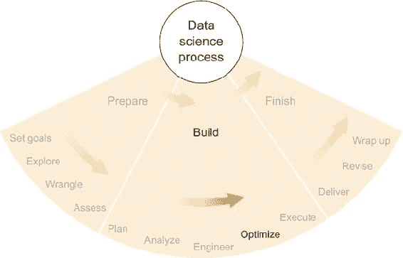

### 9.1. 数据库

我在第三章中讨论了数据库的概念，将其视为一种数据源的形式。数据库很常见，你在项目中进行时遇到数据库的机会相当高，尤其是如果你经常使用他人使用的数据。但与其仅仅顺其自然地遇到一个数据库，不如自己建立一个数据库来帮助你完成项目。

#### 9.1.1. 数据库类型

存在许多类型的数据库，每种数据库都设计用来以自己的方式存储数据并提供访问。但所有数据库都旨在比标准基于文件存储更高效，至少对于某些应用来说是这样。

存在更多类型（和子类型），但今天最常见的两种数据库类型是*关系型*和*文档型*。尽管我当然不是数据库模型和理论的专家，但我将尝试从通常从概念上思考它们以及如何与之交互的角度来描述这两种类型。

##### 关系型

*关系型*数据库全都是关于表格的。关系型数据库中的一个*表格*通常可以想象成类似于电子表格中的二维表格：该表格包含行和列，单元格中包含数据元素。

关系型数据库的强大之处在于它们可以存储许多表格，并且可以在幕后以巧妙的方式将表格相互关联。这样，即使是来自多个表格和数据类型的复杂查询也可以以最佳方式执行，与原始的扫描表格方法相比，通常可以节省大量时间。

在流行了几十年的关系型数据库中，一种主导语言已经出现，用于制定查询：*结构化查询语言*（SQL，通常发音为“sequel”）。SQL 实际上无处不在，尽管关系型数据库还有其他查询语言。简而言之，你可以使用 SQL 查询许多不同种类/品牌/子类型的数据库；所以如果你熟悉 SQL，你就可以开始使用一个不熟悉的数据库，而无需学习新的查询语法。另一方面，并非所有基于 SQL 的数据库都使用完全相同的语法，因此可能需要对特定查询进行一些相对较小的调整，以便它在新的数据库上工作。

##### 文档型

在某种意义上，文档型数据库是关系型数据库的对立面。关系型数据库有表，而文档型数据库有，嗯，文档。这并不奇怪。

在这个例子中，“文档”可以是一组所谓的*非结构化*数据，如电子邮件的文本，以及一组结构化标识信息，例如电子邮件的发送者和发送时间。它与数据存储的*键值*概念密切相关，其中数据根据一组少量键进行存储和编目，以便于检索。*键*通常选择为数据点的字段，通过这些字段在查询时可以找到它——例如，ID、姓名、地址、日期等等。数据点的*值*可以被视为与键一起存储的某种有效载荷，但在查询中通常不用于查找数据点。如果你愿意，它可能是一堆混乱的数据，因为你通常不会使用值来查询数据（对于明显的例外，请继续阅读）。

原始文本、未知长度的列表、JSON 对象或其他似乎不适合放入表格中的数据通常可以轻松地适应文档型数据库。为了高效查询，每一条非结构化数据（一个可能的值）理想情况下都应与少量结构化标识信息（潜在的键）相匹配，因为几乎无一例外，数据库在处理结构化数据方面比非结构化数据要高效得多。

由于文档型数据库是关系型数据库和表格的对立面，因此术语*NoSQL*经常被应用于它们。你将发现其他类型的 NoSQL 数据库，但文档型是最大的子类。

除了通常比关系数据库更灵活且可能效率更低之外，面向文档的数据库还可以有自己的优势。这种优势的一个例子可以在流行的 Elasticsearch 数据存储中看到。Elasticsearch 是一个基于（也是开源的）Apache Lucene 文本搜索引擎的开源面向文档的数据库。Lucene 和 Elasticsearch 都擅长解析文本、查找特定的单词和单词组合，并生成这些单词出现次数的统计数据。因此，如果你正在处理大量文本文档，并且将研究单词和短语的出现情况，那么几乎没有（如果有的话）数据库（无论是关系型还是非关系型）会比 Elasticsearch 更有效率。

通过原始文本查询 Elasticsearch（或类似）数据库是通常规则的一个显著例外，即你应该通过键而不是值进行查询。由于 Lucene 在索引文本方面做得很好，因此通过文本中的术语进行查询的行为在大多数其他数据库中更像是通过键进行搜索。

##### 其他数据库类型

如果你正在处理一种无法轻易表示为一系列表格或文档的数据类型，那么它可能不适合关系型或面向文档的数据库，在这种情况下，寻找适合该数据类型的数据库可能是有价值的。例如，我在社交网络分析项目中使用的图数据通常可以从图数据库的效率中受益。Neo4j 是一个流行的 *图数据库*，它以使存储、查询和分析图数据更简单的方式表示事物（如社交网络中的人）之间的连接。有许多其他数据库的例子，它们针对非常具体的数据类型，但在这里我不会尝试对这些数据库进行概述。快速在线搜索应该能引导你找到正确的方向。

#### 9.1.2\. 数据库的优点

与存储在计算机文件系统上的数据相比，数据库和其他相关类型的数据存储可以具有许多优势。主要的是，数据库可以通过查询提供对数据的任意访问，比文件系统更快，并且它们还可以以方便的方式扩展到大型规模，具有冗余性，这可以优于文件系统的扩展。在这里，我简要描述了数据库可以提供的一些主要优点。

##### 索引

数据库 *索引* 是一系列软件技巧，它们生成所有数据的某种映射，以便任何内容都可以快速轻松地找到。*索引* 是构建此类映射的过程。通常，索引会有效地利用硬件（磁盘和内存）来提高整体效率。

拥有索引（与没有索引相比）的代价是占用一些磁盘和内存空间，因为索引本身需要占用空间。通常，你可以选择创建一个非常高效的索引，它占用更多空间，或者创建一个效率较低的索引，它占用较少空间。最佳选择取决于你试图实现的目标。

##### 缓存

在广义上，*缓存*是指将某些经常访问的数据保留在一边，目的是为了提高整体效率，因为经常使用的数据在特殊位置可以快速获取。当某些数据被频繁访问时，你可以在某种程度上将经常使用的数据放在手边，从而减少整体平均访问时间（系统架构的各个方面使得这一点成为可能）。如果经常使用的数据访问时间非常短，偶尔很少访问的数据查找时间稍长一些并不重要。数据库通常会尝试识别最常用的数据并将其保留在附近，而不是将其放回其他数据中。与索引一样，缓存会占用空间，但你通常可以选择你希望分配给缓存的空间量，这反过来又决定了其有效性。

##### 规模化

当今存在的许多类型的数据库可以分布到许多机器上。显然，这并不是将你的数据存储在磁盘上的文件上的直接优势，因为如果你可以访问许多机器，你就可以访问许多磁盘。那么，分布式数据库相对于分布式文件系统的优势在于协调。

如果你拥有许多机器上的多个磁盘上的数据，你必须跟踪你将数据保存在哪里。分布式数据库旨在自动执行此操作。分布式数据库通常由*分片*组成，即每个分片的数据都存在于单个位置。一个中央服务器（或多个服务器）管理分片之间的访问和传输。可以根据选择的数据库配置使用额外的分片来增加数据库的潜在大小或复制其他地方存在的数据。

##### 并发

如果两个不同的计算机进程试图同时更改相同的数据点，这些更改被称为*并发*，而找到适当最终状态的问题通常被称为*并发问题*。数据库通常比文件系统更好地处理这个问题。具体来说，如果两个不同的进程试图同时创建或编辑相同的文件，可能会发生任何数量的错误，或者根本不会发生错误，这有时可能是一个更大的问题。一般来说，你希望在文件系统上不惜一切代价避免并发，但某些类型的数据库提供了方便的解决方案来解决任何冲突。

##### 聚合

数据库的索引可以应用于除了查找与查询匹配的数据之外的任务。通常，数据库提供执行匹配查询或所有数据的*聚合*功能。数据库可能能够比你的代码更快地累加、乘法或汇总数据，因此将这种汇总推送到数据库并提高整体效率可能是有帮助的。

例如，Elasticsearch 使得在数据库中计算特定搜索词的频率变得容易。如果 Elasticsearch 没有提供这项功能，你就必须查询该词的所有出现，计算出现次数，然后除以总文档数。这看起来可能不是问题，但如果你这样做成千上万次，让数据库以优化、高效的方式计算频率可以节省大量时间。

##### 抽象查询语言

查询数据库以获取特定数据涉及使用数据库理解的查询语言，例如 SQL。虽然学习一种新的查询语言以适应新的数据库可能会让人感到烦恼，但这些语言提供了对查询背后搜索算法的抽象。如果你的数据存储在文件系统上的文件中，并且你没有使用数据库，那么每次你想搜索满足某些标准的数据点时，你都必须编写一个算法，遍历所有文件——所有数据点——并检查它们是否满足你的标准。使用数据库时，你不必担心特定的搜索算法，因为数据库会处理它。查询语言提供了关于你正在寻找内容的简洁、通常可读的描述，并且数据库会为你找到它。

#### 9.1.3\. 如何使用数据库

大多数软件工具，包括 Excel，都可以与数据库接口，但有些做得比其他更好。所有最流行的编程语言都有访问所有最流行数据库的库或包。了解如何操作只需查看文档即可。一般来说，你需要知道以下内容：

+   创建数据库。

+   将你的数据加载到数据库中。

+   配置和索引数据库。

+   从你的统计软件工具查询数据。

每个数据库都有一些不同，但一旦你习惯了其中几个，你就会看到相似之处，并快速学会更多。似乎现在每类数据库都有相应的书籍出版，所以这是一个找到它并投入使用的问题。对于 NoSQL 数据库，提供的选项尤其广泛、多样且令人眼花缭乱，因此像《理解 NoSQL》（McCreary 和 Kelly，Manning，2013）这样的书籍可以帮助你梳理所有功能和选项。

#### 9.1.4\. 何时使用数据库

如果你从文件系统访问数据既慢又麻烦，那么可能是时候尝试使用数据库了。这也可能取决于你如何访问数据。

如果你的代码经常搜索特定数据——数千或数百万次——数据库可以大大加快访问时间和代码的整体执行时间。有时，代码在从文件系统存储切换到数据库后可以快几个数量级。我的一个项目在第一次切换时速度提高了 1000 倍。

如果你文件系统中的数据你通常是从上到下处理，或者如果你不经常搜索，那么数据库可能对你帮助不大。数据库最适合查找符合特定标准的需求数据，因此如果你不需要查询、搜索或跳转数据，文件系统可能是最佳选择。

我有时抵制使用数据库的一个原因是因为它给软件和项目增加了一些复杂性。拥有一个实时运行的数据库至少会给所有你需要关注的事物增加一个动态部分。如果你需要将数据传输到多台机器或多个位置，或者如果你担心你没有时间配置、管理和调试另一件软件，那么创建数据库可能不是最好的主意。这肯定需要至少一点维护工作。

### 9.2. 高性能计算

*高性能计算*（HPC）是一般术语，用于描述有很多计算要做，并且你希望尽可能快地完成的情况。在某些情况下，你需要一台快速的计算机，而在其他情况下，你可以将工作拆分，使用多台计算机来处理多个单独的任务。这两种方法之间也存在某种中间地带。

#### 9.2.1. HPC 类型

无论是拥有一台还是多台计算机，你可能还会考虑使用擅长特定任务的计算机，或者配置和组织得特别有用的计算集群。我在这里描述了一些选项。

##### 超级计算机

*超级计算机*是一台非常快的计算机。全球范围内存在一场关于最快超级计算机的竞争，这个头衔比其他任何东西都更有声望。但是，获得这个头衔的技术挑战并不小，结果也是如此。

新型超级计算机比标准个人计算机快数百万倍——它可能比你的 PC 快数百万倍来计算结果。如果你能访问到——而且不是很多人有这样的访问权限——那么考虑它可能是有价值的。

大多数大学和拥有 IT 部门的大型、数据导向的组织可能没有超级计算机，但它们某处有一台功能强大的计算机。如果你向正确的人请求访问权限，计算结果可能比标准个人计算机快 100 倍或 1000 倍。

##### 计算机集群

*计算机集群*是一组相互连接的计算机，通常通过本地网络连接，配置得可以很好地协同完成计算任务。与超级计算机相比，计算任务可能需要显式并行化或以其他方式拆分成单独的任务，以便集群中的每台计算机都能完成部分工作。

根据集群的不同，各种计算机及其执行的任务可能能够高效地相互通信，也可能不能。一些类型的通用计算机集群（例如，HTCondor 是一个流行的软件框架，用于统一它们）更少关注优化单个机器，而是更多地关注最大化集群可以完成的总工作量。其他类型的集群高度优化性能，总体上类似于超级计算机。

与超级计算机相比，集群的一个缺点通常是可用的内存。在超级计算机中，通常有一个巨大的可用内存池，因此可以存储极其庞大和复杂的结构——这比尝试将结构存储在磁盘或数据库中要快得多。在集群中，每台计算机只有自己的可用内存，因此它可能一次只能加载复杂结构的一小部分。写入和读取磁盘可能会花费时间并影响整体性能，但这取决于正在进行的特定计算。高度并行的计算更适合集群。

##### GPU

*图形处理单元*（GPU）是设计用于在计算机屏幕上处理和操纵视频图像的电路。每个带有屏幕的计算设备上的显卡都有一个 GPU。

视频处理的特点导致了 GPU 设计非常适合执行高度可并行化的计算。事实上，一些 GPU 在特定类型的计算上非常出色，以至于它们被优先考虑于标准 CPU。几年前，研究人员购买并构建了由视频游戏系统（如索尼 PlayStation）组成的集群，因为这些系统 GPU 的计算能力超过了价格相似的其它计算机。

#### 9.2.2\. HPC 的好处

高性能计算（HPC）的唯一好处非常简单明了：速度。HPC 可以比标准计算（也称为低性能计算）更快地完成计算。如果你有访问权限——这是一个很大的“如果”——那么 HPC 是等待你的 PC 计算所有需要计算的事情的一个好选择。我将在本章后面讨论的*云计算*使 HPC 对每个人开放——但需要付费。在决定加入之前，必须权衡使用云 HPC 服务的好处——一些非常强大的机器可供选择——以及其货币成本。

#### 9.2.3\. 如何使用 HPC

使用超级计算机、计算机集群或 GPU 与使用你自己的个人计算机相当相似，前提是你知道如何利用你机器的多核。你使用的统计软件工具和语言通常有使用个人计算机多核的方法，并且这些方法通常很好地转移到高性能计算（HPC）上。

在 R 语言中，我过去使用`multicore`包来并行化我的代码并使用多个核心。在 Python 中，我使用`multiprocessing`包来达到同样的目的。在这些包中，我可以指定我想要使用的核心数量，每个包都有一些在各个核心上运行的过程之间共享对象和信息的方法。在进程之间共享对象和信息可能很棘手，所以，尤其是作为一个初学者，你应该避免这样做。如果你能够以这种方式实现你的算法，纯并行对代码和大脑来说都更容易一些。

在我的经验中，将我的代码提交到计算机集群与在我的机器上运行它类似。我向我在工作的大学里的同事们询问了提交作业到集群队列的基本命令，然后我调整了我的代码以符合要求。我可以指定我想要的计算机核心数量以及内存量，这两者都会影响我在队列中的状态。这个特定大学的集群，就像大多数集群一样，需求很高，排队既是必需的，也像是一种游戏。

有时，尤其是与 GPU 一起使用时，有必要修改你的代码以明确使用特殊硬件功能。通常最好是咨询专家或查阅文档。

#### 9.2.4\. 何时使用 HPC

由于 HPC 比替代方案更快，规则是：如果你有权限使用，就使用它。如果没有成本，而且你不需要对代码进行太多修改就能利用它，那么这个问题就一目了然。但事情并不总是那么简单。如果我有使用某些 HPC 解决方案的选择，我会首先考虑为了使用 HPC 我必须进行的代码更改和其他准备工作，然后我会将这个与我会节省的计算时间进行比较。有时，如果你不急于求成，HPC 可能不值得。其他时候，它可以在一小时内给你结果，而这在其他情况下可能需要一周或更长时间。

### 9.3\. 云服务

*云服务*几年前非常流行。它们仍然非常受欢迎，但它们正在变得更加成熟，不再是新颖的技术。然而，可以肯定的是，它们会留下来。简而言之，云服务按小时出租，提供你通常只能通过购买和管理自己的服务器才能获得的性能。

云服务的主要提供商大多是大型科技公司，它们的主营业务是其他事情。像亚马逊、谷歌和微软这样的公司，在向公众开放之前，就已经拥有大量的计算和存储资源。但它们并不总是充分利用这些资源，因此它们决定既出租多余的容量，也扩大总容量，这最终证明是一系列有利可图的商业决策。

#### 9.3.1\. 云服务的类型

提供的服务通常大致相当于个人计算机、计算机集群或本地网络的功能。所有这些都在全球的地理区域内可用，通过在线连接和标准连接协议以及通常的网页浏览器界面访问。

##### 存储

所有主要的云服务提供商都提供文件存储服务，通常按每月每千兆字节付费。通常还有各种存储层，如果你想要更快的读取或写入文件，你可能需要支付更多费用。

##### 计算机

这可能是云服务中最直接的一种：你可以按小时支付访问具有特定规格的计算机的费用。你可以选择核心数量、机器内存量和硬盘大小。你可以租用一个大的，启动它，并将其作为你的超级计算机使用一天或一周。当然，更好的计算机价格更高，但价格每年都在下降。

##### 数据库

作为云服务提供商提供的存储的扩展，还有云原生数据库服务。这意味着你可以创建和配置数据库，而无需知道数据库运行在哪些计算机或磁盘上。

这种机器无关性在维护数据库时可以节省一些麻烦，因为你不必担心配置和维护硬件。此外，数据库可以几乎无限扩展；云服务提供商需要担心的是涉及多少机器和多少分片。代价，字面上的代价，是你将经常为每次访问数据库——读取和写入——以及存储的数据量付费。

##### 网络托管

网络托管就像租用一台计算机并在其上部署一个网络服务器，但它附带了一些额外的功能。如果你想部署一个网站或其他网络服务器，云服务可以帮助你这样做，而不必过多担心单个计算机和机器配置。它们通常提供平台，在这些平台上，如果你符合它们的要求和标准，你的网络服务器将运行并随着使用量扩展，而不会遇到太多麻烦。例如，亚马逊网络服务提供了使用 Python 的 Django 框架以及 Node.js 框架部署网络服务器的平台。

#### 9.3.2\. 云服务的好处

与使用自己的资源相比，使用云服务有两个主要好处，尤其是如果你需要购买本地资源。首先，云资源不需要任何承诺。你只需为使用的量付费，如果你还不确定你需要多少容量，这可以节省大量资金。其次，云服务的容量远远大于你可能会购买的东西，除非你是财富 500 强公司。如果你还不确定项目的规模，云服务可以在存储和计算能力等方面为你提供极大的灵活性，你可以在任何时候立即访问。

#### 9.3.3. 如何使用云服务

随着云服务的种类繁多，你可以几乎无限地组合使用它们的方式。第一步始终是创建一个服务提供商的账户，然后尝试使用服务的基本级别，这通常免费提供。如果你觉得它有用，那么扩大规模就是更多地使用它并支付账单的问题。请注意，在深入之前，通常值得比较类似的服务。

#### 9.3.4. 何时使用云服务

如果你没有足够的资源来充分满足你的数据科学需求，考虑使用云服务是值得的。如果你在与拥有自身资源的组织合作，在支付云服务费用之前耗尽本地选项可能更便宜。另一方面，即使你在本地拥有相当多的资源，云服务肯定有更多；如果你不断遇到本地资源限制，请记住云服务提供了几乎无限的容量。

### 9.4. 大数据技术

如果在过去 10 年中，在分析软件行业中，比*云计算*更常说的短语是*大数据*。遗憾的是，这个短语及其描述的技术被理解得远不如这个短语被说的那么频繁。

在谈论大数据时，我将采取一些自由度，因为我感觉它从未拥有过任何类似的具体定义。软件行业的每个人，从开发人员到销售人员，都使用这个短语来夸大他们正在构建或推销的软件的印象，而且并不是所有的用法都相互一致。在这里，我将描述的不是我认为每个人在说*大数据*时都意味着什么，而是我说这个词时我意味着什么。我认为我的个人意义很重要，因为我试图将这个概念提炼到核心思想和技术上，这些思想和技术在 2005 年中期上市时具有一定的革命性。

我不使用*大数据*来表示“大量数据”。这种用法注定会变得过时，而且会很快，因为我们争论“大量”意味着什么。根据我的个人经验，10 年前 100 吉字节是大量数据；现在 100 太字节是常规的。重点是，单词*大*总是相对的，因此我为*大数据*制定的任何定义也必须是相对的。

因此，我对自己个人对*大数据*的定义是基于技术，而不是数据集的大小：*大数据*是一套软件工具和技术，旨在解决数据传输是计算任务限制因素的情况。每当数据集太大而无法移动时，在某种程度上，并使用特殊软件来避免这种数据移动的必要性，就可以适用*大数据*这个术语。

也许一个例子可以最好地说明这个概念。谷歌可以说是大数据技术背后的第一批力量之一，它定期处理大量的数据，以支持其主营业务：一个旨在找到互联网上任何东西的搜索引擎，这显然是一个广阔的地方，以及将广告智能地放置在网页上的系统。保持最佳搜索结果需要分析来自互联网上所有页面到所有其他页面的链接数量和强度。我不知道现在这个数据有多大，但我知道它不是小数据。当然，数据分布在许多服务器上，可能位于许多不同的地理位置。为了生成互联网搜索结果的基础，分析所有这些数据是一项涉及所有数据服务器和数据中心的复杂协调任务，涉及大量的数据传输。

Google，作为一个聪明的公司，意识到数据传输是一个严重的问题，它极大地减缓了其计算速度。它认为最小化这种传输可能是个好主意。然而，如何最小化它却是一个不同的问题。以下关于谷歌所做之事以及之前描述的大多数内容，是我从多年前谷歌发布的关于其 MapReduce 技术和它所启发的其他技术（如 Hadoop）的信息中推断出来的。我不知道谷歌发生了什么，也无法声称我已经阅读了所有关于这个主题发表的论文和文章，但我确实认为以下假设性的解释对于任何想知道大数据技术是如何工作的人来说都是启发性的。对于几年前的我来说，这肯定是有启发性的。

回顾起来，如果我在谷歌意识到数据传输正在扼杀分析效率的时候在那里工作，我会设计一个三阶段算法，目标是尽量减少数据传输，同时仍然执行我想执行的所有计算。

算法的第一步是在每个数据库本地服务器上的每个数据点上执行初步计算。这种本地计算产生了许多结果，其中包括一个属性，该属性指示这个特定的数据点属于哪个数据点组。在在线搜索术语中，这个属性对应于这个数据点（可能是一个网页）可能被找到的互联网角落。网页往往链接到同一角落内的其他页面，而不是互联网其他角落的页面。对于每个数据点，一旦确定了指定互联网角落的属性，谷歌的算法就会进入第二步。在 MapReduce 框架中，这是*映射*步骤。

第二步调查了数据点的新的属性，并最小化了从一个地理位置到另一个地理位置的数据传输。如果 Corner X 的大部分数据都在 Server Y 上，第二步将发送所有 Corner X 数据到 Server Y，因此只需要传输 Corner X 数据的一小部分；大部分数据已经在那里。这一步骤通常被称为*洗牌*步骤，如果做得巧妙，将提供使用最流行的大数据技术的最大优势之一。

第三个步骤，然后，就是将具有共同属性的所有数据点一次性分析，生成一些共同的结果和/或考虑其他具有相同属性的数据的个别结果。这一步骤分析了 Corner X 中的所有网页，不仅给出了关于 Corner X 的结果，还给出了 Corner X 中所有页面及其相互关系的结果。这被称为*减少*步骤。

三步的一般总结是这样的：在每个数据点上本地执行一些计算，并将数据映射到属性上；对于每个属性，收集所有数据点，同时尽量减少数据传输/洗牌；最后，将每个属性的所有数据点减少到一组有用的结果。从概念上讲，MapReduce 范式是许多其他大数据技术的基础，但当然并不包括所有这些技术。

#### 9.4.1\. 大数据技术类型

Hadoop 是 MapReduce 范式的开源实现。它曾经非常流行，但似乎在最近几年失去了势头。Hadoop 最初是一个批处理工具，自从成熟以来，其他声称是实时的大数据软件工具已经开始取代它。它们都有一个共同的观点，即过多的数据传输对过程有害，因此应尽可能优先考虑本地数据计算。

一些大数据概念导致了数据库的发展，这些数据库明确使用了 MapReduce 范式及其实现，如 Hadoop。Apache 软件基金会的开源项目 HBase 和 Hive 等，明确依赖于 Hadoop 来驱动设计用于在极大规模上良好运行的数据库，无论这对你在阅读此内容的任何一年意味着什么。

#### 9.4.2\. 大数据技术的益处

大数据技术的设计目的是尽量减少数据移动。当数据集规模非常大时，这可以节省时间和金钱。

#### 9.4.3\. 如何使用大数据技术

这在很大程度上取决于技术。但它们通常模仿非大数据版本，至少在小规模上是这样。你可以像使用标准数据库一样开始使用大数据数据库，但可能需要更多的配置。

其他技术，特别是包括 Hadoop 在内，需要付出更多的努力。Hadoop 和其他 MapReduce 的实现需要在第一步指定 mapper，在第二步指定 reducer。经验丰富的软件开发者不会在编写这些基本版本时遇到问题，但实现和配置中的一些棘手特性可能会引起问题，所以需要小心。

#### 9.4.4\. 何时使用大数据技术

当计算任务受数据传输限制时，大数据可以提高你的效率。但比本章中描述的其他技术，大数据软件在运行时需要更多的努力。只有当你有时间和资源去调整软件及其配置，并且你几乎可以确定你会从中获得相当大的好处时，你才应该采取这一步。

### 9.5\. 任何作为服务的

这显然不是一件真实的事情，但我经常觉得它是。有时候很难阅读软件描述而不遇到“软件即服务”（SaaS）、“平台即服务”（PaaS）、“基础设施即服务”（IaaS）或其他任何“某物即服务”的短语。虽然我对此进行嘲笑，但许多事物以服务的形式提供对软件行业来说是非常有益的。雇佣服务的目的是替代我们自己会做的事情，我们希望提供的服务比我们自己做的更好或更有效率。

我非常喜欢让别人做我不愿意亲自做的任何标准任务，无论是在现实生活中还是在软件中。在当今的互联网经济中，越来越多的这类任务可以作为服务提供，我看不出有任何理由预期这种趋势会很快放缓。虽然我不会在本节讨论任何具体的技术，但我强调，通过外包一些更常见的方面，你可能会极大地简化你的软件开发和维护任务。需要注意的是，你应该信任你雇佣的人能够做好工作，而建立这种信任可能需要一些努力。简单的在线搜索可以提供一些值得考虑的候选人，以分担你的一些工作。

### 练习

继续使用在第二章中首先描述的“脏钱预测”个人理财应用场景，并关联到前几章的练习，尝试以下内容：

> **1\.**
> 
> 在这个项目中，可能会使用哪些三个补充的（不是严格意义上的统计）软件产品，以及为什么？
> 
> **2\.**
> 
> 假设 FMI 的内部关系数据库托管在单个服务器上，每晚都会备份到异地的一个服务器。给出这可能是良好架构的一个原因以及它可能不好的一个原因。

### 摘要

+   有些技术不属于统计软件类别，但它们在使统计软件更快、可扩展和更高效方面很有用。

+   配置良好的数据库、高性能计算、云服务和大数据技术，在分析软件行业中都有其位置，并且每种技术都有其优势和劣势。

+   在决定是否开始使用这些辅助技术中的任何一种时，通常最好问自己：我的当前软件技术中是否存在明显的低效或限制？

+   迁移到新技术需要时间和努力，但如果你有充分的理由，这可能值得。

+   云服务和大数据技术围绕了很多炒作；它们可以非常有用，但并非每个项目都需要。

## 第十章. 计划执行：整合一切

*本章涵盖*

+   将你的统计（第七章）和软件（第八章–第九章）付诸实践的技巧

+   何时修改计划（如第六章中所述）

+   理解结果的重要性及其与实际用途的关系

图 10.1 展示了我们在数据科学流程中的位置：执行产品的构建计划。在前三章中，我介绍了统计学、统计软件和一些补充软件。这些章节提供了数据科学家在其项目过程中可用的技术选项的概述，但它们并没有从上一章继续沿着数据科学流程。正因为如此，在这一章中，我通过说明如何从计划的制定（第六章）到应用统计学（第七章）和软件（第八章和第九章）以实现良好结果的过程，将你带回到那个流程中。我还指出了一些有用的策略和一些潜在的陷阱，并讨论了良好结果可能意味着什么。最后，我给出了一份关于我职业生涯早期一个项目的详细案例研究，重点关注应用本章以及前几章中的想法。

##### 图 10.1. 数据科学流程构建阶段的最后一步：高效且细致地执行计划

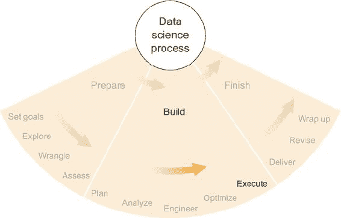

### 10.1. 执行计划的技巧

在第八章和第九章中，我讨论了与统计应用相关的各种软件，何时何地使用不同类型的软件最合适，以及如何思考软件与你要进行的统计之间的关联。但构建该软件的过程又是另一回事。即使你确切知道你想要构建什么以及你想要的结果是什么，创建它的过程可能会充满障碍和挫折，尤其是当你试图构建的工具越复杂时。

大多数软件工程师可能都熟悉构建复杂软件的艰辛和挑战，但他们可能不熟悉构建处理质量可疑数据的软件的困难。另一方面，统计学家知道脏数据是什么样的，但在构建更高品质的软件方面可能经验不足。同样，与项目相关的不同角色的人，每个人可能都有各种经验和培训，他们会期待并准备不同的事情。作为我在本书中强调的项目意识的一部分，我将简要考虑不同人可能遇到的经验和困难，以及一些可以预防问题的方法。我不敢断定其他人都在想什么，但根据我的经验，背景相似的人往往会犯类似的错误，我将在这里描述这些错误，希望对你们有所帮助。

#### 10.1.1\. 如果你是一名统计学家

如果你是一名统计学家，你就知道脏数据，也知道关于偏差和过度强调结果显著性的问题。这些对你来说都很熟悉，所以你天生就会警惕它们。另一方面，你可能没有太多为商业软件构建软件的经验，尤其是*生产*软件——我的意思是直接由客户使用来深入了解其数据的软件。生产软件可能会出现很多问题。

##### 咨询一名软件工程师

统计学家是聪明人；他们可以在短时间内学习和应用大量知识。对于每一个聪明人来说，在学习新技术时按需学习并相信自己的能力能够正确使用它是很有吸引力的。如果你正在创建自己会使用或主要是原型的东西，这很好。但在错误和错误会对你的项目和团队产生重大负面影响的情况下，最好至少在构建分析软件工具之前、期间和之后咨询软件工程师。如果没有其他的话，软件工程师会给你点赞，并告诉你你的设计或软件很棒。更有可能的是——如果工程师在关注的话——他们能够指出一些你可以改进的地方，以使你的软件工具更加健壮，并减少因未知原因而失败的可能性。如果你不是软件工程师，自己构建一个生产软件就像你在没有木工或建筑培训的情况下为你的房子建造露台一样。理论上，你可以从书籍和其他参考资料中学习你需要知道的大部分知识，但将木材、钉子和接缝组合在一起可能会有些混乱。向有实际经验的人求助可能会有很大帮助。

##### 让某人彻底测试你的软件

如果你打算将软件交给客户并让他们直接使用，你可以肯定他们会找到 dozen 种方法来破坏它。完全消除所有错误并优雅地处理所有可能的边缘情况是很困难的，但如果你将软件交给同事——理想情况下是背景与客户相似的人——并告诉他们使用工具的所有方面，尝试破坏它，那么你可以找到最明显的错误和问题。更好的做法是将软件分发给几个人，让他们都使用并尝试破坏它。这通常被称为*虫子大战*，但它可以扩展到用户体验领域以及工具的通用实用性。这里的反馈不应被轻视，因为如果你的同事几个小时就能找到错误，我几乎可以保证客户会更快地找到它，这可能会让你损失时间、金钱和声誉。

##### 客户需要花费很多时间

如果你以前从未向客户交付过软件，可能会惊讶地发现，大量客户在没有显著提示的情况下不会使用你的软件——而那些*确实*使用你的软件的客户会向你提出大量问题、问题和暗示，认为你做错了所有事情。

假设你希望人们使用你的软件，花时间与客户交流，确保他们使用软件感到舒适，并且使用正确，这可能值得。这意味着你可能需要发送一些电子邮件，打电话，或者根据你的情况亲自出现。数据科学项目通常依赖于成功使用这一新软件，在常见的情况下，客户可能不完全理解你新的以数据为中心的解决方案对未来影响，你可能需要引导他们走上正确的道路。

客户不断向你施压是一个好兆头。这意味着他们已经参与其中，并且非常希望软件能够正常工作。但不利的一面是，要么软件存在很多问题，要么他们不知道如何正确使用它。这两者都可以假设通过你或你团队的其他人得到解决。提前意识到客户可能需要的维护至少和软件本身一样多。

#### 10.1.2\. 如果你是一名软件工程师

如果你是一名软件工程师，你知道软件开发的生命周期是什么样的，也知道如何在部署和交付之前测试软件。但你可能不知道数据以及它如何破坏你精心设计的编程机器。正如我之前提到的，不确定性是软件工程师的绝对敌人，但在数据科学中，不确定性是不可避免的。无论你在软件设计和开发方面多么出色，数据最终都会以你从未想到的方式破坏你的应用程序。这要求在构建软件时采用新的思维模式，并提高对错误和缺陷的容忍度，因为它们会频繁发生。

##### 咨询统计学家

软件工程师是聪明的人；他们可以跟随逻辑和信息在复杂结构中的流动。然而，数据和统计学引入了一种不确定性，这是逻辑和刚性结构天生处理不好的。统计学家在预见和处理问题数据方面经验丰富，如异常值、缺失值和损坏值。与统计学家进行一次对话可能会有所帮助，关注数据的来源以及你打算如何使用它。统计学家可能能够提供一些见解，了解一旦你的软件上线可能会出现的各种问题和边缘情况。如果没有咨询统计学家或以统计为导向的数据科学家，你可能会忽视一个可能非常重要的特殊情况，这可能会破坏你的软件或给它带来其他问题。

##### 数据可以破坏你的软件

软件工程师擅长连接不同的系统并使它们协同工作。使两个软件系统协同工作的关键部分是两个系统之间的协议或合同，它规定了它们如何相互通信。如果其中一个系统是统计系统，其输出或状态通常无法保证符合特定的合同指南。特殊和边缘的数据值可能会使统计系统做出奇怪的行为，当软件组件被要求做出奇怪的行为时，它们通常会崩溃。在处理数据和统计时，最好提前原谅它们。考虑最广泛的可能结果或状态集，并为此做好准备。如果你特别慷慨，你可能希望将统计声明放在 try-catch 块（或类似结构）中，这样在严格意义上就不会有任何东西崩溃，并且可以处理、记录、报告或引发异常，无论什么看起来都合适。

##### 检查最终结果

对于你们大多数人来说，这可能是显而易见的，但在时间紧迫的情况下，这一步骤被跳过的频率令人难以置信。我建议统计学家让一些人尝试破坏他们的软件，并且我强烈建议软件工程师运行他们正在分析的数据的几个完整示例，并确保结果是 100%正确的。（真的，每个人都应该这样做，但我希望统计学家已经足够训练有素，能够默认这样做。）从少量原始数据开始，一直追踪到结果，可能是一个繁琐的过程，但如果不进行端到端正确性测试，就无法保证你的软件正在做它应该做的事情。即使进行一些这样的测试也不能保证软件完美，但至少你知道你得到了*一些*正确的答案。如果你想将测试提升到下一个水平，将你的端到端测试转换为正式的集成测试，这样如果你将来对软件进行更改，你将立即知道你是否犯了一个错误，因为集成测试将失败。

#### 10.1.3\. 如果你是一个初学者

如果你刚开始从事数据科学，在统计学或软件工程方面没有太多经验，首先，恭喜你！这是进入一个广阔领域的一大步，你需要有足够的勇气去迈出这一步。其次，要小心。如果你没有意识到我在这本书中强调的意识，你可能会犯很多错误。好消息是，周围有很多可以帮助你的人；如果他们不在你的公司，你可以在其他类似的公司、当地的技术组织或互联网上的任何地方找到他们。出于某种原因，软件行业的人喜欢帮助他人。如果你能向他们解释你的项目和目标，任何有经验的人都可以给你一些切实的建议。不过，更具体地说，最好遵循我在本章为统计学家和软件工程师提供的建议。作为一个初学者，在这个过程的这个阶段，你需要承担双重责任来弥补经验的不足。

#### 10.1.4. 如果你是一个团队成员

如果你只是这个项目的一个团队成员，那么沟通和协调至关重要。你不需要了解团队内部的所有情况，但目标和期望必须明确，并且必须有人负责整个团队的管理。

##### 确保有人负责管理

我见过一些奇怪的情况，其中团队没有经理或领导者。在特例团队中，这可能行得通。有时每个人都理解问题，处理自己的部分，并完成工作。这种情况很少见。但即使在这些罕见的情况下，如果团队中的每个人都跟踪每个人的工作，通常效率很低。通常最好有一个人跟踪所有发生的事情，这个人可以回答来自团队内部或外部（例如，客户）的任何关于项目状态的问题。这不是必需的，但通常建议指定一个团队成员负责跟踪与项目状态相关的所有事情。这个角色可能只是简单地做笔记，也可能是一个复杂的正式经理，他举行正式会议并设定最后期限。作为团队成员，你应该知道这个人是谁以及他们的管理职责范围。如果管理方面存在某些不足，你可能想向自己的老板或其他有权威的人提出。

##### 确保有一个计划

大多数做过几个工作的人可能都遇到过一些工作做得不好的上司。有些上司可能很好但不够有效，有些则相反。在第六章（kindle_split_016_split_000.xhtml#ch06）中，我讨论了如何为你的项目制定计划；如果你在一个团队中工作，你可能没有自己制定计划，但你可能参与了关于应该做什么、什么时候做以及由谁做的讨论。这应该导致某种计划，你应该知道谁在跟踪这个计划。如果不是这样，可能存在问题。可能小组领导或经理有一个计划，这个人应该能够随时描述或概述它；如果这个计划不存在、不连贯或不好，你可能需要与团队领导进行严肃且可能困难的对话。管理计划可能不是你的个人责任，但确保有人以合理的方式处理它对整个团队都有好处。

##### 明确期望

人员问题暂且不谈，但在团队工作中，没有明确的工作方向儿乎是最糟糕的事情之一。如果你不知道自己应该做什么，以及对你结果的期望是什么，那么做好工作会很困难。另一方面，只要每个人都清楚这一点，有一些开放式目标是可以接受的。无论如何，如果你的项目部分对你来说并不清晰，确保询问某人（或所有人），以便解决问题。

#### 10.1.5. 如果你在领导一个团队

如果，像上一节中提到的，你是一个承担数据科学项目的团队的一员，那么这些建议仍然适用。但如果你除了这个角色之外还有领导职位，还有一些额外的建议需要补充。

##### 确保你知道每个人在做什么

如果一个团队不知道自己在做什么，那么它就什么也不是，不能团结一致。并不是每个人都必须知道所有的事情，但至少应该有一个人几乎知道所有正在发生的事情，如果你是团队领导，那个人应该是你。我并不是建议你成为一个微观管理者，但我确实建议你对每个项目部分的状态保持积极关注。这种积极关注应该使你对团队和项目状态有足够的了解，以至于你可以在不咨询任何人的情况下回答关于项目状态的大部分一般性问题。如果你无法回答关于项目时间表和你是否认为会错过某些截止日期的问题，那么你对团队活动的兴趣可能还不够积极。对于更具体的问题，例如实施细节，询问相关团队成员可能是可以的。如果你是团队领导和经理，那么在非团队成员面前代表团队是你的工作的一部分，比如客户。

##### 成为计划的守护者

在第六章中，我讨论了为你的项目制定计划的过程，包括针对不同中间结果的多种路径和替代方案。如果你有一个相当复杂的项目，你可能已经制定了一个需要花费一些时间才能理解的计划。如果团队中的每个人都必须做出决定时都花费时间去咨询和理解这个计划，那么这可能会效率低下。作为团队领导，负责计划并在整个项目过程中处理所有与计划相关的问题是一个好主意。这并不是说计划只属于你一个人；恰恰相反。计划应该是整个团队参与制定的，并且计划的某些方面可能仍然属于最合适的团队成员。但可能是一个好主意，即作为团队领导，你是唯一一个对整个计划以及团队在其中的地位都了如指掌的人。如果一个客户问：“你们在开发过程中处于什么位置？”你应该能够向他们解释计划摘要，然后说明团队在计划框架内的位置。

##### 智慧地委派任务

除了拥有一个计划之外，承担数据科学项目的团队需要以一种方式合作，使得工作相对均匀地分配给最适合给定任务的人。软件工程师应该处理更多编程和架构方面的内容，数据科学家应该更多地关注数据和统计学，领域专家应该处理与项目领域直接相关的内容，而任何拥有一定技能的人应该处理与这些技能最相关的任务。我不建议任何人仅仅基于他们擅长什么就被归类，但每个团队成员的专业知识和局限性都与任务的分配相关。我在一些团队中工作过，其中少数数据科学家被当作许多软件工程师对待，结果并不理想。考虑团队成员与要完成的任务之间的关系应该足够了。

### 10.2. 在进行中修改计划

在第六章中，我讨论了制定完成数据科学项目计划的方法。该计划应包含多个路径和选项，所有这些都取决于项目的结果、目标和截止日期。不管计划有多好，在项目进展过程中，它总是有可能需要修改。即使你认为考虑到了所有不确定性并且对每个可能的后果都有所了解，计划范围之外的事情也可能发生变化。计划需要修改的最常见原因是新信息出现，这些信息来自项目外部，导致计划的一条或多条路径发生变化，或者目标本身发生变化。我将在下面简要讨论这些可能性。

#### 10.2.1\. 有时目标会发生变化

当项目目标发生变化时，它可能会对计划产生重大影响。通常目标变化是因为客户对某些事情改变了主意，或者出于某种原因，他们传达了之前未提及的信息。这是一个常见的现象——在第二章中讨论过——客户可能不知道哪些信息对你这个数据科学家来说很重要，因此信息收集和目标设定可能更像是一种启发式方法而不是商业行为。如果你在过程中已经很好地询问了客户正确的问题，那么你可能已经接近一个良好、有用的目标集合。但是，如果出现了新的信息，改变计划可能是必要的。

由于你已经在原始计划中走了一半的路，你可能已经有所成果：初步结果、一些软件组件等等。如果目标变化很大，这些成果可能不再像以前那样有用，而且可能很难说服自己放弃它们。但是，之前为构建某事物所付出的成本在做出未来决策时不应被视为内在因素；在金融行业中，这被称为*沉没成本*，这是一种无法收回的成本；它永远失去了，无法退款。因为金钱和时间已经花费，任何新的计划（针对未来）都不应考虑它们。但是，你已经生产出来的任何东西肯定是有用的，因此在制定新计划时，这肯定应该被考虑进去。例如，如果你已经构建了一个用于加载和格式化你打算使用的原始数据的系统，那么无论新的目标是什么，这个系统都可能是有用的。另一方面，如果你构建了一个针对原始目标但不是新目标的特定问题的统计模型，你可能想要丢弃该模型并重新开始。

当目标发生变化时，主要关注的是再次经历制定计划的过程，就像在第六章中那样，但这次你有一些额外的资源——原始计划已完成部分所产生的一切——你必须非常小心，不要让沉没成本和其他惯性阻止你做出正确的选择。再次正式运行规划过程通常是有价值的，并确保项目的每个持续方面都符合目标和制定的新计划的最佳利益。

#### 10.2.2\. 某些事情可能比你想象的更难

这对我来说经常发生。我记得 2008 年我计划在亚马逊网络服务（AWS）上使用 MapReduce 来计算我使用 R 编写的生物信息学算法的结果。当时，AWS 的文档、教程和简单工具相当稀少，R 中与 MapReduce 相关的包也是如此。我必须承认，我那时相当天真。简而言之，经过许多小时后，我既不知道如何在 AWS 上设置集群，也不知道如何使用 R 来操作它。不用说，我改变了我的计划。

当你计划中的一个你认为会相对简单的步骤变成了噩梦时，这是一个改变计划的好理由。这通常对整体计划的影响不如目标变化那么大，但它仍然可能很重要。有时你可能能够用一个更容易的事情来替换困难的事情。例如，如果你不知道如何使用 MapReduce，你可能会获得访问一个计算集群并在那里进行分析。或者如果某个分析软件过于复杂，你可能会用更简单的一个来替换它。

如果困难的事情不容易避免——例如，当没有可比较的软件工具来替换难以使用的工具时——你可能必须完全根据特定步骤必须被省略或改变的事实来改变计划。做出这个决定的关键是及早并且正确地认识到，弄清楚如何做困难的事情的成本要比做其他事情的成本高得多。

#### 10.2.3\. 有时你会意识到你做出了错误的选择

我也经常这样做。有许多原因说明，当你制定计划时，看起来不错的计划在你取得一些进展后可能会开始显得不那么好了。例如，你可能没有意识到某些软件工具或统计方法，后来你意识到那些是更好的选择。或者在你开始使用某个工具后，你意识到它有一个你之前没有意识到的限制。另一种可能性是，你有一些错误的假设，或者得到了关于使用哪些工具的糟糕建议。

在任何情况下，如果你开始意识到之前的某个选择以及将其纳入计划是一个糟糕的想法，那么重新评估情况并基于最新的信息重新制定计划永远不会太晚。建议考虑到目前为止的所有进展，忽略纯粹沉没成本。

### 10.3\. 结果：知道何时足够好

随着项目的进展，你通常会看到越来越多的结果累积，这给了你一个机会来确保它们符合你的预期。一般来说，在涉及统计学的数据科学项目中，预期要么基于统计显著性的概念，要么基于这些结果的实际有用性或适用性的其他概念，或者两者兼而有之。统计显著性和实际有用性通常密切相关，并且肯定不是相互排斥的。我将简要讨论每个概念的优点以及它们之间的关系。

注意，在本节中，我使用“**统计显著性**”这一术语较为宽松，指的是准确度或精度的总体水平，从 p 值的概念到贝叶斯概率，再到机器学习方法的样本外准确性。

#### 10.3.1. 统计显著性

我在第七章中提到了统计显著性，但提供了相对较少的关于选择特定显著性水平的指导。这是因为适当的显著性水平在很大程度上取决于项目的目的。例如，在社会学和生物研究中，95%或 99%的显著性水平很常见。然而，在粒子物理学中，研究人员通常在将结果视为显著之前需要 5 个标准差的显著性水平；为了参考，5 个标准差（即平均值的五个标准差）大约是 99.99997%的显著性。

根据你使用的统计模型和统计方法，存在不同的显著性正式概念，从**置信度**到**可信度**再到**概率**。我不想在这里讨论每个概念的细微差别，但我要强调的是，显著性可以采取多种形式，尽管所有这些形式都表明，如果你重复分析或收集更多类似的数据，你将看到相同的结果，其确定性水平与显著性水平相匹配。如果你使用 95%的显著性水平，预计有 19 个 20 个可比较的分析会给出相同的结果。这种解释并不正式地符合每种类型的统计分析，但对于这里的讨论来说已经足够接近了。

假设你正在进行一个基因组学项目，并且你正在尝试找到与代谢相关的基因。给定你为这个项目开发的良好统计模型，并使用之前提到的 95%显著性水平的重复分析概念，你预计任何达到这个显著性水平的基因在 20 次重复实验中的 19 次也会达到这个显著性水平。这显然留下了一次实验，其中它不会达到显著性水平。假设这个基因确实与代谢有关，这个非显著的结果将被视为一个**假阴性**，这意味着结果是负面的（不显著），但它本不应该如此。如果你分析了成千上万的基因数据，你预计会看到许多假阴性。

另一方面，因为你只对每个基因进行了一次实验和随后的分析，所以肯定有一些基因不参与代谢，但达到了 95%的显著性水平。从理论上讲，这些基因大多数时候不应该给出显著结果，但你足够幸运，进行了一次罕见实验，其数据使它们变得显著。这些被称为*假阳性*。

在实践中，选择显著性水平意味着在假阴性和假阳性之间选择正确的平衡。如果你绝对需要几乎所有的阳性结果都是真实的，那么你需要一个非常高的显著性水平。如果你更关心捕捉你正集中精力捕捉的所有真实事物（例如，所有真实的代谢相关基因），那么较低的显著性水平更为合适。这就是统计显著性的本质。

#### 10.3.2\. 实用性

我所说的*实用性*与我所描述的统计显著性非常相似，但更侧重于你打算如何使用结果，而不是纯粹的统计置信度。你计划如何使用结果应该在决定你需要它们有多重要中扮演重要角色。

在代谢相关基因的例子中，可能的下一步是选取一组显著基因，并对每个基因进行特定的实验，以在更高的精度水平上验证它们是否真正与代谢有关。如果这些实验在时间和/或金钱上成本高昂，那么你可能希望在分析中使用较高的显著性水平，这样你就可以相对较少地进行这些后续实验，只针对你确信的基因。

在某些情况下，甚至可能是这个例子，具体的显著性水平几乎无关紧要，因为你知道你想要取一些固定数量的最显著结果。例如，你可以选择 10 个最显著的基因，并对它们进行后续实验。如果你本来就不打算超过 10 个，那么你将 99%或 99.9%作为截止点可能并不重要。然而，显著性水平低于 95%可能不太可取，如果没有 10 个基因达到那个水平，可能最好只关注那些有统计证据支持、至少达到最低显著性水平的基因。

你可以通过首先问自己一个问题来开始决定显著性水平：我将如何使用这些显著结果？考虑到你打算对一组显著结果采取的具体行动，回答这些问题：

+   你想要或需要多少个显著结果？

+   你能处理多少个显著结果？

+   你对假阴性的容忍度是多少？

+   你对假阳性的容忍度是多少？

通过回答这些问题，并将答案与你的统计显著性知识相结合，你应该能够从你的分析中选择出一组显著结果，这些结果将服务于你的项目目的。

#### 10.3.3. 重新评估你的原始准确性和显著性目标

作为你项目计划的一部分，你可能包括了一个目标，即在你的统计分析结果中实现一定的准确度或显著性。达到这些目标将被视为项目的成功。鉴于上一节关于统计显著性和实际有用性的讨论，在处理过程的这个阶段，重新考虑结果的期望显著性水平是值得的，以下是我概述的几个原因。

##### 你现在拥有更多信息

当你开始项目时，你拥有的信息没有现在这么多。所需的准确度或显著性可能是由客户规定的，或者你可能自己选择了它。但在任何情况下，现在你到了项目的尾声，并且有一些实际的结果，你到达了一个更好的位置，可以更好地确定那个显著性水平是否是最有效的。

现在你已经有一些结果了，你可以问自己这些问题：

+   如果我向客户展示一些结果样本，他们看起来是否满意或兴奋？

+   这些结果是否回答了项目开始时提出的重要问题？

+   我或者客户能否根据这些结果采取行动？

如果你对这些问题的回答都是肯定的，那么你处于良好状态；可能你不需要调整你的显著性水平。如果你不能肯定回答，那么重新考虑你的阈值和其他选择重要结果的方式将是有帮助的。

##### 结果的数量可能不是你想要的

无论你之前如何选择显著性水平，你可能会得到比你能够处理更多的显著结果，或者结果太少以至于没有用处。对于结果过多的情况，解决方案是提高显著性阈值，而对于结果过少的情况，解决方案可能是降低阈值。但你应该注意以下几点。

提高或降低阈值，因为你希望得到更多或更少的结果，只要这不会违反你项目的任何假设或目标，这可能是一个好主意。例如，如果你正在从事一个涉及将文件分类为与法律案件相关或不相关的项目，那么你拥有很少的误判是重要的。将一份重要文件错误地分类为不相关可能会造成大问题。如果你偶然发现你的分类算法遗漏了一份或两份重要文件，降低算法的重要性阈值以包含这些文件确实会减少误判的数量。但这也可能增加误判的数量，这反过来又需要更多的时间来手动审查所有阳性结果。在这里，直接降低显著性水平直接增加了后来需要执行的手动工作数量，这在法律环境中可能是昂贵的。与其仅仅改变阈值，不如回到算法和模型，看看你是否可以针对当前任务使它们变得更好。

主要观点是，为了减少或增加任意数量的显著性结果，提高或降低显著性阈值可能是一个好主意，但前提是不影响项目的其他假设和目标。思考阈值变化的全部可能影响是好的，这样你可以避免问题。

##### 结果可能并不完全符合你的预期

有时候，尽管你尽了一切努力，在考虑了所有不确定性之后，你得到的结果似乎并不是你所期待的。你可能有一组重要的结果，从一般意义上讲，似乎并不是你想要寻找的。这显然是一个问题。

一个潜在的解决方案是提高显著性阈值，并确保最显著的结果，即最顶尖的结果，确实符合你的预期。如果它们看起来不错，那么只要变化不会对项目中的其他方面产生不利影响，你就可以使用新的阈值。如果它们看起来不好，那么你可能面临的问题比显著性更大。你可能需要回到统计模型，并尝试诊断问题。

一般而言，随着显著性水平的阈值提高，你的结果集应该更符合你的预期。例如，在法律案例中，文件应该更有相关性；在基因组学案例中，基因应该更明显地与代谢相关，等等。如果情况并非如此，那么最好调查原因。

### 10.4. 案例研究：基因活动测量的协议

我将通过深入解释我职业生涯早期的一个项目来阐述本章节和前几章节的概念。在获得硕士学位和两年工作经验后，我决定回到学校攻读博士学位。我很快加入了一个在维也纳的研究小组，该小组专注于开发有效的统计方法，用于生物信息学的应用。

我之前没有在生物信息学领域工作过，但我对生物学的原始语言——DNA 序列——一直很感兴趣，所以我期待着这个挑战。我必须学习生物信息学以及相关的生物学知识，以及一些软件和编程工具，因为我的先前编程经验主要是由 MATLAB 和一点 C 组成。但我有两个导师和一个小团队的支持，他们在生物信息学、统计学和编程方面都有不同的经验。

在我的新办公桌安顿下来不久后，我的一个导师带着一个潜在的首个项目来找我，并让我看一下。大致的想法是以严格统计的方式比较微阵列的实验室方案。我的导师已经考虑了实验设置以及可以应用于结果数据的可能数学模型，所以第一步已经完成，这对作为初学者的我来说可能是个好事。作为项目的成果，我们想要知道哪个实验室方案是最好的，我们打算在科学期刊上发表结果，不仅因为实验室的意义，也因为统计学的意义。

在我着手这个项目的过程中，我学到了很多关于生物信息学、数学、统计学和软件的知识，所有这些知识综合起来，正好符合我们现在所知道的数据科学领域。在本节的剩余部分，我将使用本书前几章的概念来描述这个项目，希望这个案例研究能够阐明它们在实际中的应用。

#### 10.4.1\. 项目

该项目的目标是评估和比较几种实验室协议在测量基因表达方面的可靠性和准确性。每种协议都是一种化学过程，通过这个过程可以从生物样本中提取的 RNA 被制备用于微阵列的应用。微阵列技术，在过去十年中已被高通量基因测序大量取代，可以测量 RNA 样本中成千上万个基因的表达水平（或活性水平）。为微阵列制备 RNA 的协议在复杂性和每个微阵列所需的 RNA 输入量方面有所不同。根据协议的开发者，这些开发者通常是私营公司，他们可能有一些理由误导研究人员关于其协议的可靠性，以便销售更多的所需套件。尽管如此，能够使用每个微阵列更少的 RNA 将是有益的，因为维护和提取生物样本可能很昂贵。我们希望将协议在实验室中的使用进行面对面竞争，以查看是否任何承诺都得到了兑现，并为了从我们有限的实验室预算中获得最大效益。

我们总共有四种协议，其中一种非常可靠，因此可以说是我们拥有的最接近黄金标准的协议。对于每一种协议，我们会运行四个微阵列，其假定的实验目标是比较雄性和雌性果蝇的基因表达——*黑腹果蝇*，这是一种比大多数生物更易于理解的常见模式生物。在某些基因中，雄性和雌性果蝇的表达存在一些较大差异，尤其是那些已知与性发育和功能相关的基因，而在其他基因中则不应有太大差异。每组四个微阵列将以*染色交换*配置运行，这意味着雄性 RNA 在两个阵列上用绿色放射性染料染色，而在另外两个阵列上用红色放射性染料染色；雌性 RNA 在每个阵列上以相反的颜色染色。最终，每个微阵列，对于大约 10,000 个基因中的每一个，都会给出雄性基因表达与雌性基因表达比率的测量值。

因为我们使用其中一种协议作为某种黄金标准，所以我们使用它运行了两套四个微阵列。除了有两套可靠的协议可用于与其他协议进行比较之外，我们还可以比较这两套协议，以了解这种协议的可靠性。如果这两套协议给出了广泛不同的结果，那么这将证明即使是这种黄金标准协议也不是可靠的。

此外，在四个实验方案中，我们使用了比方案通常要求的更少的 RNA，这样我们就可以在一种公平竞争的场景下将这些方案与其他通常需要较少 RNA 的方案进行比较。一套微阵列，每个方案一套，四个方案，加上一套金标准微阵列和两套用于两个低 RNA 版本的微阵列，总共 28 套微阵列。这是我们将会使用的整个数据集。

#### 10.4.2\. 我所知道的内容

在开始这个项目时，我知道数学和统计学——至少是硕士水平——以及相当多的 MATLAB 知识。我知道 DNA 和 RNA 转录的基础知识以及基因如何在细胞内翻译和表达的一般原则。在相对较短的时间内，我还学习了关于项目描述的基础知识，包括微阵列的工作原理和实验配置的通用原则。

#### 10.4.3\. 我需要学习的内容

我在生物信息学方面有很多东西要学，但奇怪的是，这并不是我需要学习的主要内容。似乎我在相对较短的时间内就学会了关于基因和微阵列的相关知识，但有一些数学和统计学的特定方面是我之前没有见过的，而且我还不知道 R 语言，这是实验室首选的编程语言，因为它在生物信息学方面有特定的优势。

在数学方面，尽管我对概率和统计学非常熟悉，但我从未对数据进行过数学模型的构建和应用。我是一个倾向于贝叶斯理论的数学家，拥有一个完全贝叶斯理论的导师，因此我需要承诺学习构建和应用贝叶斯模型的所有相关含义。

在编程方面，我对 R 语言一无所知，但在导师的建议下，我将使用这种语言。用于加载微阵列数据的 R 库非常好，统计库也非常全面，因此我需要学习大量的 R 语言知识才能在这个项目中使用它。

#### 10.4.4\. 资源

除了我的两位导师外，我还拥有几位在生物信息学、数学和 R 语言编程方面经验丰富的同事。我确实处于一个很好的环境中学习 R。当我遇到问题或奇怪的错误时，我不得不大声问，“以前有人遇到过这个问题吗？”通常有人会给出有用的评论，甚至解决我的问题。我的同事们确实很有帮助。当我发现一些他们认为可能之前没见过的编程技巧时，我试图通过告诉小组的其他成员来偿还我的知识债务。

除了人力资源之外，我们还有一些技术资源。最重要的是，我的小组有一个能够从头到尾进行微阵列实验的实验室。尽管微阵列并不便宜，但如果我们认为这样做是谨慎的，我们可以为分析创建我们想要的任何数量的数据。

在计算方面，我有权访问两个大学拥有的服务器，每个服务器都有许多计算核心，因此可以比我在本地机器上快几倍地计算结果。我在编写代码时考虑到这一点，并确保我做的所有事情都可以在多个核心上并行运行。

#### 10.4.5\. 统计模型

在这个项目中，可能会有很多变量发挥作用。其中最重要的是真实的基因表达。项目的主要目标是评估每个协议的测量值与真实基因表达水平之间的匹配程度。我们希望在模型中有一个代表真实基因表达的变量。我们没有这个变量的完美测量值——我们最好的是金标准协议，我们知道它并不完美——因此，这个真实基因表达变量必须是一个潜在变量。除了真实基因表达之外，我们还需要代表协议产生的测量值的变量。这些显然是测量量，因为我们有它们的数据，并且可能存在一个相关的误差项，因为基因水平的测量通常很嘈杂。

除了真实基因表达值及其各种测量值之外，还涉及几种类型的方差。通常，我们会查看来自各种个体的 RNA 样本，并且个体之间会有基于他们自身遗传组成的方差。但在这个案例中，我们将雌性果蝇的所有样本混合在一起，同样对于雄性也是如此，因此个体之间不会有生物方差。微阵列臭名昭著的是，每次用相同的生物样本运行时都不会产生相同的结果。这就是为什么我们为每个协议运行四个微阵列的原因：为了估计每个协议产生的技术方差。较低的技术方差通常更好，因为它意味着对同一事物的多次测量将给出接近的结果。另一方面，较低的技术方差并不总是更好的；一个完全失败并总是为每个基因报告零测量值的协议将具有完美的零技术方差，但将完全无用。我们希望在模型中有一个关于技术方差的概念。

我们最终确定的模型假设，每个协议报告的微阵列测量值是基于真实基因表达值的正态分布随机变量。具体来说，对于每个基因 *g*，测量值 x[n,g] 表示微阵列 *n* 从金标准协议报告的基因表达值，而 y[m,g] 代表微阵列 *m* 从另一个协议报告的表达值。公式如下：

> x[n,g] ~ N( μ[g] , 1/λ )
> 
> y[m,g] ~ N( μ[g] + β, 1/(αλ) )

在这里，μ[g]是基因 g 的真实基因表达值，λ是金标准协议的技术精度（逆方差）。变量β和α代表协议与金标准之间的固有差异。β允许对表达值进行可能的缩放；如果某个协议在所有基因中倾向于具有较低或较高的值，我们希望允许这一点（而不是惩罚），因为这并不直接意味着缩放后的数字是错误的。最后，α代表协议相对于金标准的技术方差。α值越高，表示该协议的技术方差越低。

我提到我喜欢将每一个变量都视为随机变量，直到我确信自己可以固定这些变量的值。因此，上述概率分布中的参数也需要指定它们的分布，如下所示：

> μ[g] ~ N( 0, 1/(γλ) )
> 
> β ~ N( 0, 1/(νλ) )
> 
> λ ~ Gamma( φ, κ )

高斯分布与正态分布相关联，这种关联使得它在作为正态分布的方差参数时既有用又方便。方程中出现的其余尚未讨论的模型参数——γ、ν、φ和κ——我没有将它们视为随机变量，但我对此非常小心。

这些模型参数至少与数据有两步之遥——这里的含义是，它们中的任何一个都没有直接出现在描述观测数据 x[n,g]或 y[m,g]的方程中。由于这种移除，这些参数通常被称为超参数。此外，这些参数可以以非信息性方式使用——这意味着它们的值可以被选择，以便不会对模型的其他部分产生过多的影响。我试图使超参数几乎与模型的其他部分无关，但我检查以确保这一点。在找到最佳参数值（见本章关于模型拟合的部分）之后，检查以确保超参数的值几乎与模型和涉及的结果无关，进行了一种敏感性分析，其中我大幅改变了参数的值，并观察结果是否有所变化。在这种情况下，即使我将超参数乘以 10 或 1000，它们对结论的影响也不显著。

我已经用几段文字和方程式描述了一个相当复杂的模型，但我是一个视觉型的人，所以我喜欢制作模型的图表。数学或统计模型的良好视觉表示形式是*有向无环图*（DAG）。图 10.2 展示了多协议测量基因表达模型的 DAG。在 DAG 中，你可以看到我讨论的所有变量和参数，每个都在自己的圆圈中。灰色阴影的圆圈是观测变量，而未阴影的圆圈是潜在变量。从一个变量到另一个变量的箭头表示起源/第一个变量作为参数出现在目标/第二个变量的分布中。背景中的矩形或纸张表示存在多个基因*g*和微阵列重复*n*和*m*，每个都拥有纸张中包含的每个变量的不同实例。例如，对于每个基因*g*，都有一个不同的真实基因表达值μ[g]，以及一组金标准测量值 x[n,g]和另一组测量值 y[m,g]。这种视觉表示帮助我理清所有变量。

##### 图 10.2. 表示基于不同实验室技术比较基因表达测量值的模型的有向无环图（DAG）

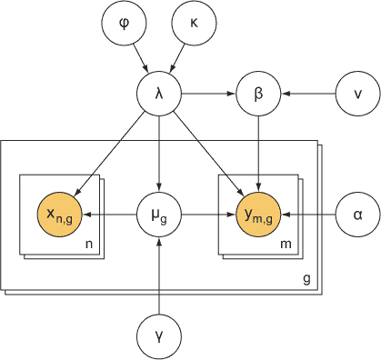

#### 10.4.6. 软件

我在完成这个项目的同时学习并使用 R 语言。R 有一系列优秀的生物信息学包，但我只使用了`limma`包，它非常适合加载和操作微阵列数据等。作为一个 R 语言的初学者，我决定只使用它来将数据转换成熟悉的格式：一个包含基因表达值的制表符分隔文件。

在用 R 处理和格式化原始数据后，我编写了在 MATLAB 中拟合统计模型的代码，MATLAB 是我更熟悉的一种语言，而且非常适合对大型矩阵进行操作，这是我的代码的一个重要计算方面。

我有一段 R 代码，用于处理和重新格式化微阵列数据，使其成为熟悉的格式，然后我还有相当多的 MATLAB 代码，用于加载处理后的数据并将统计模型应用于数据。在我职业生涯的这个阶段，这是我编写过的最复杂的软件。

#### 10.4.7. 计划

学术时间线通常相当缓慢。这个项目没有真正的截止日期，除了我可能申请发表演讲的即将到来的会议。会议申请截止日期还有几个月，所以我有很多时间确保一切就绪后再提交。

这个项目的主要目标，就像大多数学术项目一样，是将论文发表在一家好的科学期刊上。为了使论文被接受，研究必须是原创的，这意味着它包含了一些以前没有人做过的事情，并且它必须是严谨的，这意味着论文表明作者没有犯任何错误或谬误。

因此，我的首要目标是确保主要科学结果是坚如磐石的。下一个目标是编制额外的统计数据和辅助证据，证明项目中使用的方法与生物信息学的常识和方法一致。最后，我会基于研究写一篇引人入胜的科学论文，并将其提交给会议和/或一家好的科学期刊。

因此，我的计划相对简单。考虑到我当时的知识水平，计划大致如下：

1.  学习 R 语言，并使用它来将数据转换成熟悉的格式。

1.  在 MATLAB 中编写统计方法，并使用大学的高性能计算服务器之一将其应用于数据。

1.  编制一套衡量微阵列数据质量的已知统计数据，并将它们与主要统计模型的结果进行比较。如有必要，解决任何差异。

1.  写一篇引人入胜的论文。

1.  向我的导师展示论文，并反复编辑和改进它。某些迭代可能需要额外的分析。

1.  一旦论文足够好，就提交给会议和/或期刊。

1.  如果被拒绝，根据期刊审稿人的反馈编辑论文并再次提交。

这是一个相当直接的计划，没有太多相互竞争的利益或潜在的障碍。大部分时间都花在了开发复杂的统计模型、构建软件以及迭代检查和改进分析的各个方面。

在这个项目的进行过程中，我们确实遇到了一个问题，那就是其中一个微阵列协议的数据质量似乎非常差。经过几周的调查，我们的实验室研究人员发现，该协议中使用的其中一种化学试剂的保质期比预期的要短得多。它只在几个月后就变得无效了，而我们没有意识到这一点——可能是因为我们没有使用原始包装，并且与附近的实验室共享试剂。一旦我们弄清楚这一点，我们就订购了一些新的试剂，并重新进行了受影响的微阵列实验，结果更好。

除了试剂问题之外，没有出现重大问题，一切按计划进行。开始时最大的不确定性在于结果会好到什么程度。一旦我计算了它们，并将它们与已知的微阵列数据质量统计数据进行了比较，这个障碍就基本克服了。另一方面，我的导师和我之间就什么构成了好的结果以及是否需要做额外的工作进行了相当多的讨论。

#### 10.4.8. 结果

本项目的目的是客观比较实验室中几个微阵列协议的忠实度，并决定需要哪些协议以及多少 RNA 才能产生可靠的结果。主要结果来自前面描述的统计模型，但正如大多数生物信息学分析一样，除非能够证明它不与已知的适用模型相矛盾，否则没有人会信任一个新颖的统计模型。我计算了四个其他统计量，这些统计量测量了我们打算用主要统计模型测量的忠实度的不同方面。如果这些其他统计量通常支持主要统计模型，其他研究人员可能会被说服这个模型是好的。

从科学论文草案中摘录的结果表可以在图 10.3 中看到。其他统计学的描述在原始的剪裁标题中给出，但具体细节在这里并不重要。重要的是，在四个其他统计学的组合中——技术变异性（TV）、相关系数（CC）、基因列表重叠（GLO）和显著基因数量（Sig. Genes）——有充分的证据表明，我们统计模型的对数边际似然（log ML）是协议忠实度的可靠度量。这些补充统计和分析就像描述性统计一样——它们与数据更接近——提供了易于解释的结果，难以质疑。而且因为它们通常支持统计模型的结果，所以我确信其他人也会看到同时考虑所有这些忠实度宝贵方面的统计模型的价值。

##### 图 10.3. 从提交给科学期刊的草案中剪裁出的微阵列协议比较项目的主要结果表

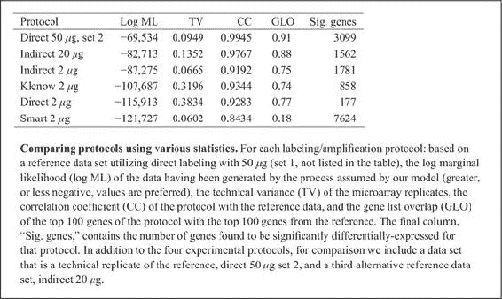

#### 10.4.9. 提交出版和反馈

在科学研究，以及在工业中的数据科学中，你通过严格的研究证明为真的知识可能不会被整个社区接受。大多数人需要一些时间才能将新知识纳入他们的教条，因此，经历一些来自你认为应该知道得更好的人的阻力并不罕见。

在将我的研究论文版本提交给生物信息学会议几周后，我收到了一封电子邮件通知我，它没有被接受作为会议演讲的主题。我感到失望——但并不太失望——因为众所周知，这个特定会议的接受率远低于 50%，而且作为一名一年级博士生，可能处于明显的劣势。

拒绝信中只有少数几位阅读了我的论文并评判其价值的科学家的反馈。据我所知，没有人质疑论文的严谨性，但他们认为它很无聊。激动人心的科学确实会得到更多的关注和媒体报道，但有人确实需要做那些无聊的事情，我完全承认我就是在做这些事情。

在被拒绝后，我回到了计划中的后续步骤，专注于在再次将论文提交给科学期刊之前，如何使论文更具吸引力（如果可能的话，还要更激动人心）。

#### 10.4.10\. 它是如何结束的

并非每个数据科学项目都能有一个好的结局。会议最初的拒绝是我们重新定义将重新提交给科学期刊的论文确切目标的一个长期阶段的开始。从最初提交的前不久到项目结束（一年多以后），项目的一些目标和论文的目标一直在变动。因此，这种学术经历在很大程度上类似于我在后来的软件公司的工作经历。在这两种情况下，目标在整个项目过程中很少保持不变。在软件和数据科学中，商业领导和客户经常出于商业原因修改目标。在我的微阵列协议项目中，目标变动是因为我们对良好结果可能对潜在的论文审稿人意味着什么的印象。

由于项目的最终目标是让论文在科学期刊上发表，我们需要意识到期刊审稿人可能会说什么。在每一步中，我们都寻找我们自己论点的漏洞和我们所提供证据中的空白。除此之外，我们还需要考虑那些未参与我们项目的其他研究者的反馈，因为这些研究者是最终将成为我们审稿人的同侪。

目标不断变动可能会让人感到沮丧。幸运的是，没有出现大的目标变动，但确实有数十个小变动。由于目标变动，项目进展中充满了小的计划调整，我花了数个月的时间在可能对我们被好期刊接受的机会产生最大影响的变动之间权衡和优先排序。

最终，基于这项研究没有任何论文被发表。项目领导非常反复无常，无法就单一的目标集达成一致，无论他们或我做了多少修改，他们对研究和论文的状态始终不满意。我在与研究团队合作和发表学术论文方面也相当缺乏经验，无论我多么努力推动，如果没有所有作者的批准，论文通常根本无法发表。

这当然不是一个永远幸福的童话故事，但我认为整个项目提供了在数据科学项目中可能发生的好与坏的事例。事情在项目后期进行得相当顺利——我认为项目的分析和结果是好的——但是当我处于困境中时，被迫做出一些艰难的决定，计划在多次修改后被彻底放弃。数据科学并非像媒体有时似乎相信的那样总是阳光明媚，但它可以帮助解决许多问题。不要让失败的可能性阻止你做好工作，但要注意计划项目和项目可能偏离轨道的迹象；及早发现可以给你纠正问题的机会。

### 练习

在第二章中首先描述的 Filthy Money Forecasting 个人财务应用场景继续进行，并关联到前几章的练习，尝试以下操作：

> **1**.
> 
> 列出三个（按角色或专长）在 FMI 与你执行项目计划时最可能交谈的人，并简要说明你为什么可能这么频繁地与他们交谈。
> 
> **2**.
> 
> 假设产品设计师已经与管理团队交谈过，他们一致认为你的统计应用必须为所有用户账户生成预测，包括那些数据极其稀疏的账户。优先级已经从确保预测是好的转变为确保每个预测都存在。你会如何解决这个问题？

### 摘要

+   项目计划可以以多种方式展开；在结果发生时保持对结果的意识可以减轻风险和问题。

+   如果你是一名软件工程师，小心使用统计学。

+   如果你是一名统计学家，小心使用软件。

+   如果你是一名团队成员，尽你的一份力来制定计划并跟踪其进展。

+   在新的外部信息可用时，修改正在进行中的计划是一个选项，但应谨慎且故意地进行修改。

+   优秀的项目结果之所以好，是因为它们在某种程度上是有用的，统计显著性可能就是其中一部分。
