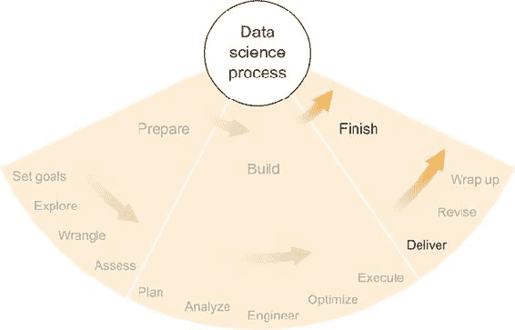
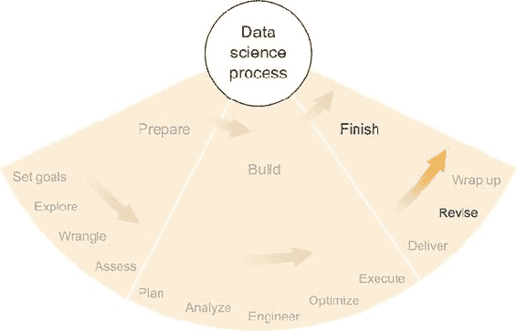
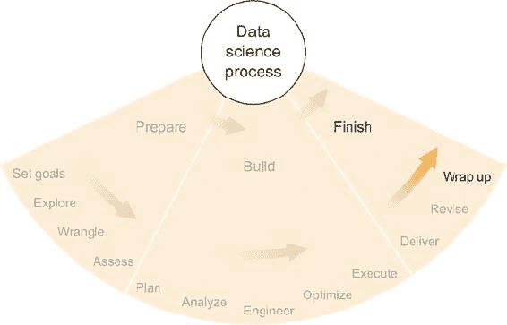

## 第三部分\. 完成产品并总结

一旦产品构建完成，就像第二部分中提到的，你还有一些事情要做，以使项目更加成功，并使你的未来生活更加轻松。前面的章节更多地关注了我可能称之为原始结果，或者说是从统计意义上讲是好的结果，但可能不够精致，不适合向客户展示。

第三部分首先探讨了通过明确目的来精炼和整理产品形式和内容的优势，即简洁地向客户传达最有效地解决问题和实现项目目标的结果。这些内容以及产品交付的一些其他方面在第十一章第十一章中有详细讨论。第十二章讨论了产品交付后可能发生的一些事情，包括发现错误、客户对产品的低效使用以及需要改进或修改产品的需求。第十三章以一些建议结束本书，这些建议包括干净地存储项目并从项目中吸取教训，以提高你在未来项目中的成功机会。

## 第十一章\. 产品交付

*本章涵盖*

+   理解客户希望在结果中看到什么

+   结果可以采取的各种形式，从简单的报告到分析应用

+   为什么某些内容应该或不应该包含在结果产品中

图 11.1 展示了我们在数据科学过程中的位置：产品交付。本书的前几章讨论了设定项目目标、提出好问题以及通过严格的数据分析来回答这些问题。所有这些工作完成后，如果你是首席数据科学家，你很可能比任何人都更了解项目的各个方面，你处于一个可以回答关于项目各种问题的位置，从使用的方法和工具到结果的含义和影响。但通常不是一个好主意永远保持这个位置，让自己成为项目及其结果的唯一信息来源。这不仅会使你成为单一故障点（如果你因某种原因无法提供信息，会发生什么？），而且你还会为自己创造永无止境的工作，每当有问题出现时。由于这些可能性，通常最好创建一些总结或编目你的结果的东西，这样客户和其他人就可以在没有涉及你的情况下回答他们的问题——至少是最常见的问题。

##### 图 11.1\. 数据科学过程完成阶段的第一步：产品交付

为了创建一个可以交付给客户的有效产品，首先你必须理解客户的观点。其次，你需要为项目为客户选择最佳的媒体。最后，你必须选择在产品中包含哪些信息和结果，以及要排除哪些内容。在整个产品创建和交付过程中做出良好的选择可以大大提高项目成功的可能性。

### 11.1. 理解你的客户

在第二章中，我讨论了倾听客户并询问可以帮助你理解他们问题的提问，以及提供与他们问题相关的信息。希望我提出的某些策略在数据收集、探索、统计方法的设计和实施以及整体结果方面取得了良好的效果。我将再次探讨理解客户这一想法，重点是创建一个能够最有效地将良好结果提供给客户的产品。

#### 11.1.1. 结果的完整受众是谁？

你现在可能非常了解客户，但可能还有其他人也对结果感兴趣。如果客户是一个团体或组织的领导者，该团体或组织的其他成员也可能成为你结果的目标受众。如果客户是一个组织，该组织内的某些部门或个人可能属于目标受众，但其他人可能不是。如果客户是个人或部门，结果可能会向上级传递，到老板或高管那里，以便做出决策。在任何情况下，最好不要假设你经常打交道的那位客户是你生成结果唯一的受众。考虑围绕客户的个人网络，并判断他们是否是受众的一部分。如果你不确定，可以向客户询问：“你认为谁会希望看到这些结果，为什么？”希望你能对受众有一个良好的了解。

#### 11.1.2. 将如何使用这些结果？

一旦你知道了结果的目标受众，你就想弄清楚他们将如何使用这些结果。这通常比你想象的要困难。

在第二章中，我简要地介绍了你如何与客户讨论交付成果，因此你可能已经对客户希望在结果中看到哪些类型的事物以及他们可能如何使用这些事物有了很好的了解。例如，在生物信息学领域，客户可能打算从你的结果中选取前 10 个候选基因，并对它们进行广泛的实验。如果你构建了一个啤酒推荐算法，客户可能希望他们的朋友使用这个算法，然后品尝推荐的啤酒。可能性有很多。

在一个涉及组织行为的项目中，您使用了社会网络分析的一些技术，客户可能对探索每个个体的联系以及这些联系与个体相似或不同感兴趣。这个例子更多的是一种兴趣，而不是行动。如果客户以“我们想……”开始一句话，

+   “我们对此感兴趣……”

+   “我们想看到……”

+   “我们想知道……”

或者类似的情况，务必进一步追究这个问题，并找出他们打算如何具体采取行动来利用这一新知识。他们打算采取的行动比他们感兴趣的内容更重要。

例如，如果客户打算根据他们发现的内容做出商业决策，那么您可能需要弄清楚他们对错误的容忍度，并将其纳入您向他们展示的定制结果中。误解预期的行动及其后果可能会在以后造成更大的问题。本章末尾的例子给出了一种情况，即在交付产品时可能由于沟通不畅而造成问题。

客户可能会以无数种方式对您提供的结果做出反应，因此在最终确定结果及其格式之前，最好花些时间尝试明确这些反应。您可能尝试让客户通过一个涉及各种适合项目的结果的假设场景，或者甚至想访问他们的工作场所，观察他们的工作流程，并亲自见证他们如何做出决策。与多个人交谈也是一个好主意，尤其是如果您的受众由具有不同经验、知识和对结果感兴趣的个人组成。总的来说，您希望尽可能彻底地了解客户和受众的视角，以及他们对您将提供的结果的期望和意图。这种理解可以帮助您创建和提供帮助客户实现目标的产品。

### 11.2. 交付媒介

您为顾客创建和交付的产品——可以是多种形式。在数据科学中，产品最重要的一个方面是客户是否被动地从产品中获取信息，或者客户是否积极与产品互动，并能够使用产品来回答无数可能的问题中的任何一个。最常见的被动产品例子是报告或白皮书；客户只能在这份文档的文本、表格和图表中找到答案。最常见的主动产品例子是允许客户与数据和数据分析互动以回答自己问题的应用程序。各种类型的产品可以在被动和主动之间沿任何光谱位置。每种类型都有其优势和劣势，我将在以下章节中讨论。

#### 11.2.1. 报告或白皮书

可能是将结果传达给客户的最简单选项之一，报告或白皮书包括文本、表格、图表和其他信息，这些信息回答了项目旨在回答的一些或所有问题。报告和白皮书可能打印在纸上或以 PDF 或其他电子格式提供。由于报告是一种被动产品，客户在交付时可以阅读它，并在需要时查阅报告，但报告永远无法提供在编写时未包含的新答案——这是报告与更活跃的产品类型之间的重要区别。另一方面，报告和白皮书是一些最简单且最容易消化的产品类型。

##### 优点

报告或白皮书的一些优点包括：

+   在纸上或电子形式下，报告和白皮书是便携的，并且使用它们不需要任何特殊的技术或知识，除了对报告主题的一般领域知识。

+   报告和白皮书可以提供客户找到答案的最简单和最快的方式，如果所需的答案存在，且报告简洁且组织良好。对于大多数人来说，在页面上找到和阅读答案比例如打开应用程序或解释电子表格中的数据要容易。

+   报告还提供了构建有助于有效传达答案、信息、警告和影响的叙述的能力。某些产品类型提供的数据和答案没有上下文，但叙述可以建立有助于报告读者更好地利用其中结果的上下文。例如，由机器学习算法生成的分类，如果客户理解该算法的准确性和适用范围的限制，将更有用。叙述可以在陈述结果之前提供上下文，以防止对结果的误解和误用。

##### 局限性

报告或白皮书的一些局限性包括：

+   报告和白皮书最大的局限性是它们完全被动。在撰写报告之前，你需要知道客户想要回答哪些问题，并且你需要以易于理解的方式回答这些问题。如果你没有成功地写出一份好的报告，客户会带着问题回来，或者更糟糕的是，将项目视为失败，对你和/或你的团队失去信心，即使结果本身相当不错。

+   在涵盖所有主要观点并回答最重要的问题的同时，避免分散重要观点的细节，这可能是一项艰巨的任务。

+   报告和论文只能在当前时间回答问题，可能不适用于未来的时间或当前数据集之外的其他数据集。如果客户将来可能希望重新审视项目的问题或使用另一个数据集，报告可能不是最佳选择。

+   有些人不喜欢阅读报告。具有各种学习和领导风格的人可能更喜欢以不同的格式查看结果，如果这些人固执且处于权威地位，撰写报告将是浪费时间。

##### 何时使用

当

+   你的项目涉及一些关键问题，这些问题可以通过包含表格、图形或其他图表的书面报告完整且简洁地回答。

+   你的项目的主要目标涉及一次性回答一些问题，而这些答案本身就有用，无需持续更新或扩展答案。

+   客户希望得到一份书面报告，而你并不觉得这是一个不适当的要求。

#### 11.2.2\. 分析工具

在某些数据科学项目中，数据集的分析和结果也可以应用于项目原始范围之外的数据，这可能包括在原始数据之后生成的数据（未来），来自不同来源的类似数据，或由于某种原因尚未分析的其他数据。在这些情况下，如果你能为他们创建一个工具，可以对这些新数据集进行这些分析并生成结果，这可能对客户有所帮助。如果客户能够有效地使用这个分析工具，他们可能能够生成任何数量的结果，并继续在未来以及各种（但类似）的数据集上很好地回答他们的问题。

这样一个分析工具的一个简单例子是一个基于公司及其行业当前财务状况和预期的电子表格，它做出预测。理论上，客户可以将一系列值输入这样的电子表格，并查看如果公司的财务状况发生变化，预测会如何变化。如果电子表格包含复杂的公式和统计方法，客户可能无法自己创建它，但如果它们符合普遍接受的财务建模原则，他们可以理解意图和结果的意义。

你可能作为数据科学项目的成果交付的分析工具可能也是一个软件脚本，它接受一个数据集并对其进行分析，生成客户可以以特定且有用的方式使用的成果。它也可能是一个高度专业化的数据库查询，解决项目的一些问题。作为产品的分析工具可以采取多种形式，但它需要满足一些标准：

+   分析工具需要在它旨在处理的数据集类型的范围内生成可靠的结果。

+   应用的数据集集合必须明确指定。

+   客户必须能够正确使用分析工具。

如果这三个标准都满足，那么您可能有一个良好的产品可以交付。工具的有用性还取决于它能够回答多少项目的问题以及这些问题对项目目标和客户的重要性。

##### 优点

分析工具的一些优点包括：

+   分析工具允许客户快速回答他们的一些问题，而无需涉及您。这为所有相关人员节省了时间和精力。

+   在可回答问题的预期范围内，分析工具比报告更灵活。即使在狭窄的范围内，分析工具通常可以提供无限数量的结果，因为输入和数据集会变化。在报告中提供这样的无限结果是不可能的。

##### 局限性

分析工具的一些局限性包括：

+   建立一个能够可靠且简洁地回答客户重要问题的分析工具通常很困难。如果工具在某个时刻遇到边缘情况并给出错误或误导性的结果，客户可能不会意识到这一点。

+   客户需要能够理解工具的基本工作原理，以便了解其局限性并正确解释结果。

+   客户需要能够正确使用工具，否则他们可能会得到错误的结果。如果您无法协助他们，您需要有一定的保证，确保他们不会搞砸任何事情。

+   如果工具存在错误或其他问题，客户可能需要您的支持。即使分析是好的，数据格式、计算机兼容性以及客户邀请的第三方共享工具等都可能导致意外问题，需要您的关注并减慢客户的进度。

+   由于创建一个万无一失的分析工具非常困难，这样的工具通常只能复制项目分析中最清晰的部分。准确性、重要性和影响都必须很高，因此分析工具的范围必须缩小到仅限于满足这些严格标准的分析和结果。

##### 何时使用

当以下条件满足时，分析工具可以是一个良好的交付产品：

+   在您的项目中完成的分析有利于转化为这样的工具，特别是它可以相对容易地使用，并且其结果可以预期是可靠的。

+   预计客户能够理解工具到一定程度，以便正确使用并正确解释结果。

+   被动产品，如报告，不足以满足客户的需求，例如客户打算为新数据集复制项目的分析。

#### 11.2.3. 交互式图形应用

如果你想要提供一个比分析工具更偏向于主动的产品，你可能需要构建某种类型的全功能应用。尽管可以争论像脚本和电子表格这样的分析工具也是应用，但在这里，我将在基于命令行的、数字输入数字输出的分析工具和基于图形用户界面（GUI）的点按式应用之间划一个模糊的界限。这些不是定义良好的类别，但我认为这里的概念描述足够了，因为你可以以任何数量的方式组合这两种类型，并将这里列出的优势局限视为适当。前者（命令行风格）我认为属于上一节中讨论的分析工具类别。在本节中，我主要考虑基于 GUI 的应用。

目前，基于 GUI 的应用通常建立在本书前面讨论过的 Web 框架之上。它们不必是 Web 应用，但目前这种类型最为常见。你可能提供给客户的这种交互式图形应用可能包括以下内容：

+   图表、表格

+   允许进行不同分析的下拉菜单

+   交互式图形，例如可移动端点的时间线

+   导入或选择不同数据集的能力

+   一个搜索栏

+   可以过滤和/或排序的结果

这些都不是必需的，但每个都能使用户（客户）在空闲时回答更多与项目相关的问题。

如果你考虑提供交互式图形应用，需要记住的最重要的事情是，你必须设计、构建和部署它。通常，这些都不是小任务。如果你想使应用具有许多功能和灵活性，设计和构建它将变得更加困难。软件设计、用户体验和软件工程在软件公司中都是全职工作，所以如果你在提供应用方面经验不足，最好咨询有经验的人，并在开始之前仔细考虑所需的时间、努力和知识。

交互式图形应用的优势和局限性包括上一节中讨论的分析工具的优势，但我将在此添加更多具体的内容。

##### 优势

交互式图形应用的一些优势包括以下内容：

+   如果设计得当，一个交互式图形应用可以成为你向客户提供的最强大的工具，因为它能够传达信息和答案。

+   一个设计良好且部署良好的交互式图形应用易于访问和使用。在应用内部可以清楚地说明如何正确有效地使用应用。

+   如果使用常见的框架构建和部署，交互式图形应用程序可以变得便携和可扩展。如果你预计用户数量会增加，或者你认为其他客户也想使用它，这可能很有用。

##### 局限性

交互式图形应用程序的一些局限性包括：

+   交互式图形应用程序的设计、构建和部署都很困难。不仅任务困难，而且可能需要很多时间。

+   交互式图形应用程序通常需要持续的支持。随着软件和部署平台的复杂性增加，潜在的错误和问题也会增加，支持应用程序和修复错误可能需要相当多的时间和资源。

+   客户可能不会正确使用应用程序。如果正确使用不明确，或者用户不够小心，可能会得出误导性的结论。

##### 何时使用

当以下情况发生时，交互式图形应用程序可以是一个很好的交付产品：

+   上一节中关于何时使用分析工具的指南同样适用。

+   点击式图形用户界面（GUI）在分析工具中更受欢迎，无论是出于易用性还是结果交付的有效性。

+   你有时间和资源来设计、构建、部署和支持这样的应用程序。

#### 11.2.4. 重新进行分析的操作指南

无论你是否已经决定创建和交付我讨论过的产品之一，记录你为执行项目的最终分析所采取的步骤，并将其打包成客户使用或甚至你自己的操作手册，这可能是一个好主意。

如果你正在处理一个聪明且能干的客户，甚至可能是一位数据科学家，如果提供指令，他们可能能够复制你的分析。如果他们想要分析新的数据或其他类似数据，这可能对他们有所帮助。与构建分析工具一样，目标是让客户能够提出并回答他们自己的问题，而不需要花费你太多时间。提供详细的指令可以实现这一点，而不需要你创建和交付一个高质量、相对无错误的软件应用程序。如果你给他们任何代码，仍然有可能遇到错误，但在这个情况下，有合理的预期，即如果客户需要，他们可以自己阅读、编辑和修复代码。你可能仍然需要提供支持，但这种安排将大部分支持负担从你身上转移出去，前提是客户有能力这样做。

另一方面，如果客户不熟悉某些步骤或对您使用的工具没有太多经验，向他们提供指令集可能会产生各种问题。

##### 优点

一套指令的优点包括：

+   通常很容易写下你所做的一切，将其与你的代码或其他工具捆绑在一起，并交付给客户。

+   如果您将来再次回到这个项目并需要以类似的方式分析数据，一套指令对您来说可能非常有用。

##### 局限性

交付一系列指令的一些局限性包括：

+   客户需要理解您交付的每一件事，并且他们需要能够复制它，可能是在数据集或其他方面有所变化，而不会遇到许多他们无法解决的问题。

+   交付指令需要客户投入大量的时间和精力，因为他们将不得不阅读和理解一些复杂的分析和工具。

+   不明确的指令或混乱的代码可能会使可靠地复制分析变得几乎不可能。您需要小心避免这种可能性。

##### 何时使用它

当进行以下分析时，一套指令可以是一个很好的交付产品：

+   探索性工作是具有挑战性的部分，而应用统计方法对客户来说相对容易。

+   客户聪明且有能力，在使用您交付的指令、工具和/或代码时不应遇到太多问题。

+   您认为将来有可能回到这个项目——保留这些指令以备自己使用。

#### 11.2.5\. 其他类型的产品

有许多其他产品也可能非常适合您的项目和客户。以下是一些：

+   **一个基于网络的 API，当以某种方式查询时，返回与查询相关的答案和信息——** 当客户希望能够将您的分析集成到现有的软件中时，这可能很有用。

+   **一个直接集成到客户软件中的软件组件——** 这比基于网络的 API 需要更多的协调，因为您必须了解现有软件的架构，但根据软件的使用和部署方式，这仍然是一个好主意。

+   **一个扩展的开发项目，您与客户的软件工程师合作构建一个他们自己将维护的软件组件——** 如果您现在有时间，让其他人根据您的分析构建和维护软件可以节省您以后的大量时间。

+   **一个填充了最有用数据以及/或某些分析结果的数据库——** 对于经常与数据库打交道的客户来说，如果您能想出一种高效且相对可靠的数据库结构方法，使其有用并得到正确使用，那么给他们一个数据库有时可能比 API 或其他组件更方便。

每个都有其自身的一套优势和局限性，其中许多与我在之前列出的其他产品的局限性相对应。如果您正在考虑一个不属于我详细描述的任何类别的产品，那么以与我相同的方式进行思考可能会引导您得出自己的结论。特别是，考虑一个特定产品是更被动的还是更主动的，以及您在近期和长期内（如果您需要提供支持）可能需要的时间要求是很重要的。除此之外，每个项目和每个具体潜在的产品都将有其独特的细微差别，如果您发现自己对后果甚至有一点点不确定，那么咨询有经验的人并征求他们的意见将非常有帮助。如果您能够区分好坏，互联网也可以是一个很好的指导来源。

### 11.3\. 内容

除了决定交付结果的方式之外，您还必须决定它将包含哪些结果。一旦您选择了一个产品，您就必须弄清楚您将用来填充它的内容。

一些结果和内容可能是明显的包含选择，但其他信息的选择可能并不那么明显。通常，您希望包含尽可能多的有用信息和尽可能多的结果，但您希望避免任何客户可能会误解或误用您选择包含的结果的可能性。这在许多情况下可能是一个微妙的平衡，并且很大程度上取决于具体项目以及客户和结果的其他观众的知识和经验。在本节中，我提供了一些关于如何做出包含和排除决定的指导，我还讨论了用户体验如何使产品更有效或更无效。

#### 11.3.1\. 使重要的、明确的成果突出

如果您的项目旨在回答一些关键问题，并且您现在对这些问题的答案已经明确，那么这些答案应该突出显示在您的产品中。如果您提交的是一份报告，这些重要、明确的成果的摘要应出现在第一部分或第一页上，而方法及其影响的更深入讨论应在论文的后面进行。如果您提交的是一个交互式图形应用程序，这些结果应出现在分析结果的主页上，或者它们应该通过几次点击、搜索或查询非常容易地访问。

通常，在您交付的任何产品中，最好将最重要的、明确的、不容置疑的、直接和有用的结果放在最前面，以便客户和其余的观众能够轻松找到它们，而无需寻找，并立即理解这些结果及其影响。

#### 11.3.2\. 不要包含几乎无法得出结论的结果

向客户报告所有计划的分析中那些没有成功的，可能会很有诱惑力。在研究环境中，这可能是好主意，因为失败的实验有时可以揭示系统是如何工作的，以及为什么其他积极的结果以这种方式出现。但在非学术数据科学中，包括在报告中，那些尝试但未成功的事情可能会分散报告中的重要、可操作信息。

大多数人不需要工作上的干扰；他们可以自己找到。如果某条信息不支持可以直接用于做出商业决策或帮助实现项目声明的任何目标的宝贵情报，通常最好将其省略。然而，你可以自由地记录任何有趣的片段以供自己参考或作为补充报告，这不是客户的主要产品；有时这些信息在项目方向改变或开始新的相关项目时可能会很有用。

#### 11.3.3\. 包含对不那么显著结果明显的免责声明

你可能有一些结果介于*结论性*和*非结论性*之间。决定如何处理这些结果可能很困难，包括和排除它们的原因可能有很多。然而，可以肯定的是，你不想让客户混淆那些绝对结论性的结果和那些只有部分结论性的结果。因此，为了保护自己的声誉，并确保客户理解如何最好地使用你提供的信息，我强烈建议在每个不到 99.9%统计显著或不是完全结论性的结果旁边包含免责声明和注意事项。

例如，假设你正在尝试检测欺诈性信用卡交易，并且客户会立即拒绝你的软件标记为欺诈的交易。如果你的软件准确率达到 99.9%，客户可能不会对那 0.1%被错误拒绝的情况提出投诉。但如果你软件的误报率为 10%，客户可能会非常强烈地投诉。在类似的情况下，如果你确实有 10%的误报率，在你向客户交付结果并让他们采取行动之前，最好将这个比率及其潜在影响告知客户。如果存在任何误解，并且他们在完全理解其影响和限制之前就采取了你的结果，那可能对客户、项目，甚至可能对你自己都是不利的。

如果你想要提供一些不是结论性的但可能仍然有帮助和信息的成果，确保你包含一个免责声明，明确说明这些结果的重要性，局限性，以及如果客户以某种方式使用这些结果可能产生的正面和负面影响。总的来说，客户需要完全理解你对这些结果并不完全确定，并且采取行动可能会有意想不到的后果。如果你能有效地传达这一点，客户将能够基于你的结果做出良好的决策，而你也将处于成功项目的位置。

#### 11.3.4\. 用户体验

大多数使用“用户体验”这个短语的人是指一个人如何与软件进行交互的方式。在软件行业，用户体验（UX）设计师已经变成了一种有利可图的职业，这是理所当然的。理解人们如何与软件进行交互并不是一件容易的事情，许多情境已经证明，人们与软件的交互方式对软件最终是否有效有着重大影响。用户体验是有效使用的优秀分析软件与大多数人无法理解如何使用的优秀分析软件之间的区别。

用户体验也可以指报告、分析工具或你可能提供给客户的任何其他产品。客户或受众与你的产品之间的体验就是用户体验，主要目标是确保这些用户能够正确地使用产品，从中得出正确的结论并做出良好的商业决策。如果客户没有正确使用产品，你可能需要重新考虑用户体验。目标是使客户和受众能够并且鼓励他们做正确的事情。

##### 新闻学的倒金字塔

如 图 11.2 所示的流行的倒金字塔概念，展示了新闻故事如何被表示以对读者最为有效。隐含的假设是读者可能不会阅读整篇文章，或者至少读者可能不会全神贯注地阅读整篇文章。基于这个假设，最重要的信息，即 *导语*（或引言），应该位于文章的开头，接着是支持导语的主体，最后是补充其他内容但不是故事完整性的必要部分的结尾。

##### 图 11.2\. 新闻学的倒金字塔^([1])

> ¹
> 
> 来自 [`zh.wikipedia.org/wiki/倒金字塔结构`](https://zh.wikipedia.org/wiki/倒金字塔结构)，公有领域图片

对于数据科学项目的报告来说，这意味着可能最有效的方法是遵循相同的模式向客户交付结果：首先用清晰的语言提供最重要的、最有影响力的结果，然后包括直接支持这些结果的细节，最后包括其他有用但不必要的辅助结果。

对于分析工具和交互式图形应用程序（以及其他产品），在设计构建时考虑倒金字塔的概念可能会有所帮助。最重要的结果和信息应该在用户开始使用应用程序时就出现在他们面前。支持性细节可能需要一点额外的努力，但不要太多，然后用户可能需要四处看看，才能找到不那么重要但有用的额外信息。

虽然这当然不应该是数据科学项目的硬性规则，但遵循新闻中的倒金字塔结构在撰写报告或设计将最重要的信息首先提供给客户的应用程序时可能会有所帮助。

##### 没有术语的平实语言

术语对于不从事该领域的人来说可能会令人困惑。你不应该在报告、申请或任何产品中使用术语。如果你确实使用了术语，你应该向客户、听众或产品使用者清楚地解释这些术语的定义。

术语“术语”很难定义。就我们的目的而言，“术语”是一套对特定培训、经验或知识背景的人熟悉的术语或表达方式，但对在实质上不同领域工作的人来说则不熟悉。由于你很少能保证你正在与之交谈的人有与你相似的背景，因此通常最好假设他们不了解你的术语。

我承认我完全反对使用术语，但我同时也看到了在高度专业化的对话和写作中使用术语的价值。术语使得人们能够在自己的领域内，或者至少在那些术语有效的子领域中高效地沟通。在这些情况下，我完全支持使用术语，但在任何可能使人们不理解专业术语的情况下，最好避免使用它们。

当涉及到展示你的工作时，如果你必须与人们交谈或在人们面前讲话，比你认为需要说得更加直白，并且说得更加缓慢也是有益的。使用你听众中很大一部分人都不理解的术语很少是有利的。

当你为应用程序编写报告或文本时，同样规则适用：文本应该被大多数受众理解，即使他们没有某些相关领域的经验。最重要的是，在语言和理解方面，使用术语并不能证明某人知道他们在说什么。根据我的经验，这通常相反。用普通语言解释复杂概念的能力是一种罕见的天赋，在我看来，这是一种比使用术语解释任何事物都更有价值的技能。

##### 可视化

与用户体验设计领域一样，数据可视化可以极大地改善你的应用程序或其他产品，但它通常不是该产品的主要焦点。数据可视化也得到了很好的研究，通常最好遵循那些研究并深入思考数据可视化的人的警告和最佳实践。

爱德华·图菲的《定量信息的视觉展示》是那些想要将他们的数据可视化做到极致的人必读的一本书。关于这个主题还有其他一些很好的参考资料，但图菲通常是最佳起点。你不仅会了解到何时最好使用条形图或折线图，你还会发现一些适用于任何可视化——如地图、时间线、散点图等——的关键原则，例如“鼓励眼睛比较不同的数据点”和“与数据集的统计和文字描述紧密结合。”图菲的书中充满了这样的原则和大量示例，这些示例确切地展示了他的意思。

数据和结果的可视化在报告和应用中可能很有帮助，但如果它们设计得不好，可能会损害产品的意图。花些时间研究和考虑你试图创建的任何可视化的假设和含义通常是值得的。咨询一些数据可视化参考资料，如图菲的书，或具有经验的人，可以在可视化继续作为清晰、简洁的有用信息传达者时带来巨大的好处。

##### 用户体验背后的科学

用户体验的研究是一门科学，尽管有些人并不把它当作科学来对待。直到几年前，当我亲眼目睹了用户体验研究和评估的实际操作时，我才意识到它可能比艺术更具科学性。有许多经过深入研究的原则，关于什么使得一个应用程序易于使用、强大或有效，如果你正在构建一个复杂的应用程序，运用这些原则可以在你项目的成功中产生巨大的差异。如果你正在构建一个应用程序，我鼓励你咨询一位经验丰富的用户体验设计师。有时候，甚至与一位用户体验设计师简短的交谈也能显著提高你应用程序的可用性。

### 11.4. 示例：分析视频游戏玩法

在与 Panopticon Laboratories 合作的过程中，这是一家以在多人在线游戏环境中描述和检测可疑游戏行为为目标的分析软件公司，我们向一位客户（游戏发行商）提交了一份初步报告，其中包括了对他们游戏社区状况的调查以及一些可疑玩家的名单。为此，就像我们对待所有客户一样，我们将专有的统计模型拟合到他们的数据上；这个模型为每位玩家分配了分数，表示玩家在各个类别中看起来有多可疑或欺诈。我们非常确信得分最高的玩家确实是欺诈玩家，但随着我们向下查看最可疑玩家名单，我们的信心就越来越小。我们合同上有义务向客户提供可疑玩家的名单，我们也知道我们必须与这份名单一起传达某种不确定性。

我们与的客户的安全部门没有雇佣任何数据科学家，因此我们必须小心不要在统计显著性或不确定性上含糊其辞。我们主要需要决定在名单上包含多少可疑玩家。如果我们提供了一个相对较短的名单，我们可能会遗漏一些非常可疑的玩家，这些玩家会继续给游戏发行商造成损失。如果我们把太多的玩家包含在报告中，我们可能会指责无辜的玩家（误报率并不小），并可能误导游戏发行商认为问题比实际情况更大，并可能还导致他们采取行动针对那些无辜的玩家，比如禁止他们在游戏中游玩。

为了解决这个决策问题，我们与客户合作确定，他们确实打算禁止那些高度可疑的玩家，并且他们愿意接受低于 5%的误报率。为了建立误报率，客户计划从我们最初的可疑玩家名单中随机抽样，并逐一手动检查。然后我们可以利用反馈来强化统计模型，并随后生成一份更准确的新报告。通常进行两到三轮这样的操作就足够获得高精度。

当我们使用第一轮反馈生成另一份报告，但在我们完全准备好宣布行为模型 100%完成之前，客户表示他们准备开始根据我们的名单禁止可疑玩家进入游戏。幸运的是，在他们采取行动之前，我们有机会与他们讨论最新的报告仍然不一定具有可操作性，并且他们对这份报告的反馈对于从下一阶段的报告（满足<5%误报率要求）和随后的软件部署中获得必要的可操作情报至关重要。这是一个典型的不知道客户会如何使用我们交付的产品的情况。我不确定他们是否会在事先承认他们的意图（也许他们甚至没有意识到这一点），因此任何询问都可能毫无意义，但尝试和保持警惕是值得的。最糟糕的事情莫过于交付了完全无效的东西，其次是交付了有效但随后被错误使用、造成很大损害的东西。

在下一轮反馈之后，我们提交了一份报告，我们预计其误报率将远低于 5%（以给自己留出余地），并且我们确保客户明白这份名单仍然不完美，并且他们可以预期名单上的一小部分玩家并非坏人。如果他们对所有这些玩家采取行动，他们应该预期会有一些不利影响。

在交付最终报告后，我们开始将他们的数据源连接到我们的实时分析引擎，该引擎为交互式图形网页应用提供动力，该应用提供与报告相同的信息，以及与玩家及其行为互动和学习更多信息的功能。该应用允许客户查看相同的可疑玩家精选名单，并允许他们点击玩家姓名以获取更多关于他们的信息——特别是更多关于他们为何被视为可疑的信息。在许多方面，由于可用信息的增加、结果可以查看的多种方式和格式，以及应用交互性让用户在需要时找到他们需要的答案，该应用在信息量、结果的可视化方式和应用的交互性方面优于报告。此外，该应用具有信息图表和精心设计的用户体验，这使得与数据和结果交互既容易又直观。支持客户部署实时应用是一项相当大的工作量，但该应用似乎比报告对客户更有用。

### 练习

在第二章中首先描述的 Filthy Money Forecasting 个人理财应用场景中继续进行，并与前几章的练习相关，尝试以下练习：

> **1\.**
> 
> 假设你的老板或其他管理层人物要求你提交一份总结你预测工作结果的报告。你会在报告中包括什么内容？
> 
> **2**.
> 
> 假设 FMF 网络应用的主要产品设计师要求你为应用用户写一段话，解释你的应用程序生成的预测，特别是关于可靠性和准确性。你会写什么？

### 摘要

+   在某种意义上，产品是你整个项目期间一直努力实现的目标；确保格式和内容正确是非常重要的。

+   尽可能地，产品的格式和媒介应满足客户现在的需求以及可预见的未来的需求。

+   产品内容应侧重于重要的、结论性的结果，而不是用不确定的结果或其他琐事分散客户的注意力。

+   最好花些时间正式思考用户体验（UX）设计，以便使产品尽可能有效。

+   提前考虑产品是否需要持续支持，并据此制定计划。

## 第十二章。产品交付后：问题和修订

*本章涵盖*

+   在产品交付给客户后诊断产品问题

+   寻找产品问题的解决方案

+   获取和使用客户反馈

+   根据已知问题和反馈修订产品

图 12.1 展示了我们在数据科学过程中的位置：在初步反馈后修订产品。上一章涵盖了将产品交付给客户的过程。一旦客户开始使用产品，就可能出现一系列全新的问题和问题。在这一章中，我将讨论一些这些问题类型以及如何处理它们，并讨论客户反馈以及根据遇到的问题和收到的反馈修订产品。

##### 图 12.1。数据科学过程完成阶段的第二步：在初步交付给客户后修订产品

### 12.1. 产品及其使用中的问题

尽管你尽了最大努力，你可能没有预料到客户使用（或尝试使用）你的产品的各个方面。即使产品做了它应该做的事情，客户和用户可能并没有做那些事情，也没有高效地做。在本节中，我将讨论一些导致产品效果不如预期的一些原因，并给出一些识别和解决这些问题的建议。

#### 12.1.1\. 客户未正确使用产品

客户倾向于以除预期方式之外的所有方式使用新产品。有时他们可能不理解在哪里输入哪种文本以及要按哪个按钮，这可能是因为他们没有投入很多精力去弄清楚正确的方法，或者因为很难弄清楚。有时客户试图使用产品来做它本不应该做的事情，通常是因为他们认为产品应该做那件事，或者因为他们试图聪明地扭曲产品的功能来做一些它不应该做的事情。

在任何情况下，以及在其他情况下，客户没有以预期方式使用产品都是问题，因为它可能导致错误或误导性的结果，或者完全没有结果。误导性的结果可能更糟，因为客户可能会对结果产生错误的信心并据此采取行动，这可能导致糟糕的商业决策。

如果客户根本无法获得任何结果，那么他们可能会回来向你寻求帮助，这比他们放弃并完全停止使用产品的替代方案要好得多。

##### 如何识别它

如果你向客户交付了一个产品然后就把这件事忘了，你就永远不知道它对他们的效果如何。也许它很棒；也许它并不好。因此，识别你产品不当使用的第一步是与客户谈论这件事。你在产品交付时与客户交谈了，并且假设你提供了使用说明，但是，就像产品本身一样，说明可能被错误地、部分地或不正确地使用。至少应该有一次后续跟进。

在你用问题打扰他们之前，通常最好给客户一些时间来尝试产品，但在那之前，如果你需要的话，你可以再次确认你在这里帮助他们。当你进行后续跟进并提问时，你应该问一些像这样的问题：

+   你是否从产品中获得了预期的结果？

+   你是否能够使用产品来解决预期的商业需求？

+   产品在哪些方面有所不足？

+   产品被多少人以及多频繁地使用？

+   你能描述一下产品的典型使用方式吗？

如果他们描述了任何问题、不良结果或意外情况，那么进一步探索这些问题并试图找出问题所在是很好的。

除了了解客户是否遇到问题外，注意如果客户无法回答你的任何问题，这也是很重要的。这可能表明你正在与之交谈的客户不是主要使用产品的人，或者他们没有从使用产品的人那里得到完整的信息，或者没有人使用产品。作为数据科学家，你的角色可能不是强迫客户使用你的产品，但通常你的工作是帮助他们正确使用它。如果他们因为无法理解而无法正确使用，一点鼓励可能是有益的。

有时候与客户交谈是不够的。如果你想了解他们如何使用产品，你可能需要在客户工作时花一些时间与他们在一起。当他们使用产品时，观察可能就足够了——你当然不希望干扰他们正常使用产品的方式——但在他们进行的过程中询问他们可能是有益的。尤其是如果他们做了意料之外的事情，你可能想知道他们为什么执行那个动作，但重要的是不要指导他们或以其他方式向他们展示如何做任何事情，直到你完全理解他们为什么执行了那个动作。有了理解，你可能能够修复误用的根本原因，而不是症状。

例如，如果客户在产品中点击了错误的按钮，而不是说，“我想你点击了错误的按钮”，更好的做法是问，“你为什么点击那个按钮？”并试图理解他们的推理。假设客户点击一个标记为 SUBMIT 的按钮，是为了在数据库中更改一个姓名-地址对，而你认为他们应该点击一个标记为 UPDATE 的按钮。如果你问他们为什么点击 SUBMIT 而不是 UPDATE，他们可能会说他们认为 UPDATE 是在他们只想更改现有条目的地址而保持姓名不变的特殊情况下使用的。

你设计了应用程序，使得 SUBMIT 添加一个新条目，而 UPDATE 则更改现有条目。因为客户想要更改现有条目，所以他们应该点击 UPDATE 而不是 SUBMIT。如果你指示他们点击另一个按钮，你将学到的很少，但现在你知道了他们行为的推理。你可能会解释说 SUBMIT 用于创建新的姓名-地址条目，而 UPDATE 用于修改现有条目，无论他们想更改条目的哪个部分。通过点击 SUBMIT，他们创建了一个新的、正确的条目，但旧的、错误的条目仍然存在。更重要的是，你了解到*SUBMIT*和*UPDATE*这两个词对客户来说不够清晰，因此可能值得更改它们或进一步教育客户了解这两个按钮之间的区别。

##### 如何纠正

一旦你识别并诊断出产品不当使用的根本原因，有两种方法可以纠正它们：

+   教育并鼓励客户正确使用产品。

+   修改产品，使其更清晰地显示哪些操作是正确的。

进一步教育客户可能包括编写新的文档并将其交付给他们。也可能包括举办研讨会、工作坊或一对一会议，在这些会议中，你亲自引导他们了解产品使用的正确协议。哪种方式更有效将高度取决于具体情况。

修改产品以鼓励正确使用是用户体验（UX）的问题，我将在下一部分进行讨论。用户体验问题可能导致了产品的不当使用，但在“用户体验不佳”和“用户使用错误”之间总有一个灰色地带。最终的目标是使产品有效，因此能够实现这一目标的 UX 变化可能是一个好主意，即使它们在其他方面看起来可能不正确。如有疑问，请咨询 UX 专家。

#### 12.1.2. UX 问题

除了客户以某种方式错误使用产品的情况之外，他们可能在使用产品时效率低下。他们可以使用产品来完成他们需要做的事情，并且可以使用它来解决他们的问题，但它需要更多的时间或精力。直接解决用户体验问题可以帮助提高效率。

产品可能以几种方式效率低下。其中一种方式是在工作流程中存在不必要的步骤。假设您的客户通常在产品中进行查询，然后总是以特定方式对结果进行排序。如果默认情况下结果不是以这种方式排序，那么客户除了查询之外还需要执行排序步骤。如果客户每天进行查询数十次或数百次，额外的时间和精力可能会累积起来。更改默认排序方法可以使产品更高效。

如果产品设计用于做很多事情，但客户经常只使用其中的一两件，那么在某种程度上，产品也可能效率低下。例如，也许您对果蝇从胚胎到成虫的几个阶段进行了复杂的遗传分析，并向客户提交了一份报告以及包含每个阶段结果的电子表格。然后您发现 95%的时间客户都在查找成年数据中的特定条目，并将其与其他发展阶段进行交叉引用。在设计电子表格之前，您并没有意识到客户会花这么多时间在成年阶段，但现在很明显，您可以通过添加一个包含客户通常进行的所有交叉引用的额外页面来为客户节省时间。添加更多页面进行更多交叉引用也可能是有意义的，但前提是客户可能会使用它们，并且数量足够少，以保持电子表格的大小可管理。

产品及其界面的外观或布局也可能导致效率低下。这些是用户体验和 UI 设计中一些最直接的问题：

+   文本是否易于阅读且格式良好？

+   按钮和文本框是否放置在便于使用的地方？

+   常见操作是否有快捷键可用？

+   是否一切都能轻松找到且易于使用？

用户体验和 UI 设计在范围和细节上都远远超出了这些问题，尽管最后一个问题在寻找 UX 问题时是一个万能的范畴。在最明显的情况之外，通常最好咨询 UX 专家。

##### 如何识别它们

容易错过一些用户体验问题，尤其是如果你自己设计和构建了该产品。在你意识到界面存在重大缺陷之前，你可能需要将产品交给其他人。

一种策略是通过客户来诊断用户体验（UX）缺陷。你可能需要问他们以下问题：

+   你觉得产品容易使用吗？

+   产品中有什么是你觉得难以操作的？

+   你发现自己最常做什么任务？

+   你多久使用产品中的每个部分？

如果你收到的答案仍然让你怀疑可能存在一些用户体验问题，那么花些时间与客户一起观察他们是如何工作的，就像我之前描述的那样，可能是个好主意。

为了更彻底地处理用户体验和客户的操作流程，你可以聘请用户体验（UX）专业人士。他们的教育和经验位于技术、设计和心理学等领域，他们很可能会直接与客户合作，了解产品使用和工作流程的各个方面，然后再提出关于什么好、什么不好以及可能进行哪些改进的建议。

##### 如何解决它们

就像大多数与产品相关的问题一样，你可以处理用户体验问题或更改产品。假设问题不会使产品无法使用，教育客户如何绕过问题是一个可行的选择，或者他们可能能够自己解决这个问题。另一种选择，更改产品，可能需要更多的时间进行重新设计和开发，而选择补救措施需要权衡更改产品的时间成本与客户通过绕过问题节省的时间成本。关于这个过程涉及的内容，请参阅本章后面的第 12.3 节。

#### 12.1.3. 软件缺陷

缺陷是软件中存在的问题。这与用户体验问题形成对比，用户体验问题使产品不直观，但不一定是错误的。以下是一些例子：

+   计算结果中的错误数值

+   软件中的错误信息或崩溃

+   显示不正确的文本、表格、图像等

+   按钮或其他基于动作的对象没有任何作用

这显然不是一个详尽的列表，但对于那些处理软件错误经验不多的人来说，应该是有启发性的。

##### 如何识别它们

许多软件开发团队在向客户交付软件之前，会进行一次“虫子大搜查”（bug bash），以寻找并修复软件中的错误。在“虫子大搜查”中，几名人员——可能是整个开发团队加上一些非团队中的产品导向人员——花上一小时（或一些固定的时间）来对软件进行测试，试图使其崩溃。虫子大搜查者可能会点击软件中的每一个按钮，在文本框中输入疯狂的数据（负数、荒谬的大数、应该输入数字的地方输入单词等），看看他们能否使软件崩溃、显示不想要的错误信息，或者做它不应该做的事情。每次他们成功找到错误时，他们会记录下详细信息，以便在软件发布给客户之前进行修复。

如果你和你的同事没有自己发现错误，你的客户可能会为你做这件事。他们很擅长这个。我的意思是，因为他们没有从设计到开发参与产品，所以他们比你拥有更少的偏见和符合规范的行为。因此，他们会尝试用软件做你未曾预见的事情，从而扩大可能发现错误的活动范围。

##### 如何解决它们

由于错误，按照定义，是软件中的错误，你通常别无选择，只能修复它们。另一方面，如果一个错误难以修复，并且客户很少遇到它，你可能会证明不修复它是合理的。这比我想承认的更常见。如果你有一款广泛使用的软件，它有一个公开的错误报告系统（Ubuntu 和 Bitbucket 是很好的例子），你可以找到一些已经存在多年的错误示例，因为它们相对难以修复，并且影响很少的用户。尽管错误通常比用户体验缺陷更受重视，但是否修复错误的决策取决于比较修复错误所需的时间和精力与客户留下错误的成本。

#### 12.1.4. 产品没有解决实际问题

这可能是产品最糟糕的结果之一：你花费时间设计和开发了一个产品，该产品满足了客户对功能、需求和问题的所有描述，但出于某种原因，你制作的产品并没有帮助客户实现他们的目标。这种情况发生并不令人愉快。假设产品与目标之间的不匹配不是由使用不当、用户体验问题或软件错误引起的，那么产品在更深层次上可能存在不足。

例如，在我为一家初创公司工作，分析受 SEC 监管的金融公司内部通信时，我的团队开发了检测风险行为的统计方法，并将它们纳入了软件产品中。我们的客户希望找到可能涉及非法交易机密信息的坏员工或可疑员工，无论是内部还是外部，例如可能用于证券内部交易的机密信息。我们为合规官员可能在潜在违法者身上寻找的可疑活动的组合建立了行为档案框架。这些档案可以转化为统计模型可以检测到的风险行为，并为每个行为档案生成了一份最可疑员工名单。

我们认为这可以回答金融监管合规部门的大部分问题，并且到目前为止所有潜在客户的反馈似乎都支持这一假设。但是当最初的合规官员接触到它时，他们对行为分析和风险行为的检测感到失望。他们中的许多人继续使用他们旧的合规工具，这些工具主要是由扫描内部通信的随机样本来寻找可疑的词语和短语组成。用户体验似乎没有明显的缺陷，也没有任何重大错误，但客户并没有感觉到产品回答了他们主要的问题。

回顾过去，我确信该产品已经接近了客户想要的答案，但在合规官员的心中却未能达到令人满意的程度。他们似乎想要以下两种东西之一：

+   统计方法可以让他们毫无疑虑地知道谁是坏人

+   一种更好的搜索和过滤通信和员工的方法

不幸的是，我们的统计方法还不够好，无法满足第一个要求，而拥有复杂的统计方法来更好地过滤，如第二个要求，似乎在信任这些统计方法和期望在搜索和过滤中的确定性行为之间产生了认知失调。换句话说，如果客户不能完全信任统计方法，他们宁愿使用他们完全理解的方法，例如简单的搜索和过滤。在产品构建和交付之后，这一点对项目中的任何人来说都不是显而易见的。

好消息——如果可以称之为好消息的话——是我们通过交付产品并从客户那里获得反馈中学到了很多。这些反馈，以及不止一位客户有相同的反应，让我们比之前与客户的所有互动都更多地了解了我们的客户和我们所销售的行业。

并非一切都已失去；软件产品的大部分功能即使没有行为分析也能使用，特别是那些管理、存储和查询数据的部分。但在产品界面上，开发团队必须进行一次著名的转型，这是初创公司如此著名的原因之一。围绕行为分析构建的 UI 必须重新设计成客户感兴趣使用的样子。幸运的是，我们比几个月前对客户了解得多得多，这主要归功于产品的交付和随后的拒绝。

每个这样的案例，即产品未能实现其主要目标，都可能与其他案例大不相同。许多变量都会发挥作用。有时，通过教育客户并说服他们——就像我的例子一样——统计模型对于过滤和排序是可信的，你可以弥合这个差距。有时，你必须对产品进行重大改变。但假设客户已经开始使用产品，认识到存在问题并不困难。

##### 如何识别它

这一点很简单：当客户开始使用产品时，如果存在问题，他们要么会抱怨，要么会停止使用产品。一旦你与客户交谈足够长的时间，排除了不当使用、用户体验和重大错误，你很快就会意识到你的产品是否达到了目标。

##### 如何纠正它

这一点很棘手。每个案例都不同，但你可以利用对客户需求的深入了解来做出最明智的产品决策。选项通常包括进一步教育客户、改变产品、开发新产品以及为现有产品寻找不同类型的客户。根据你的情况，这些选项中的一些可能比其他选项更有意义，但有一点是确定的：在做出决定之前，你应该充分考虑所有选项。

### 12.2\. 反馈

获取反馈是困难的，这里的困难有两层含义。一方面，通常很难从客户、用户或其他人那里获得建设性的反馈。另一方面，如果不将其视为对你投入大量时间和精力构建的产品的一种攻击或误解，就很难听取反馈和批评。在本节中，我讨论了除了极少数情况外，任何反馈都是好事，并分享了一些关于如何充分利用你所获得的反馈的建议。

#### 12.2.1\. 反馈意味着有人在使用你的产品

如果你正在对产品获得反馈，这意味着有人在使用产品，这是好事。令人惊讶的是，在我的生活中，我见过多少次有人开发了一个没有人使用的产品。它没有被使用的理由多种多样，但包括以下内容：

+   客户没有时间学习如何使用产品。

+   提出产品需求的人不是一个用户，用户们抵制将产品整合到他们的工作流程中，或者对它不满意。

+   该产品针对的是一个不断变化的目标，到它开发完成时，目标已经移动得太远，以至于产品变得不再有用。

无论顾客可能不使用产品的理由是什么，如果你从某人那里收到反馈，这些理由都不适用，这是好事。

#### 12.2.2. 反馈不是反对

除非一个人是不建设性的或直接无礼的，否则他们的反馈不应被视为对你或你的产品的侮辱。地球上大多数人都喜欢提出建议，让其他人做得更好；根据我的经验，这一点尤其适用于工程师，无论是软件还是其他。他们没有恶意，他们的一些建议可能是有用的。

这可能更多地与商业礼仪有关，而不是数据科学，但如果你能不带个人感情地倾听反馈，你可以学到很多有用的信息。然而，花费数月时间构建某物，然后在使用了 10 分钟后听到有人将其拆解，这是困难的，我见过不止一个开发人员或数据科学家激烈地捍卫一个产品，反对最小的建议；这就是为什么我要在这里提到这一点。在这些情况下，我坚持“冷静的头脑占上风”的原则。

你不必把每个评论和每个建议都放在心上，但通常值得倾听。之后，你可能会考虑这个人的知识和专长，在决定是否认真对待他们的反馈之前。除非他们有统计学学位，否则我可能不会接受 CEO 关于统计方法的建议，同样，除非他们在商业事务上有一些相关经验，否则我也不会接受统计学家在商业事务上的建议。任何人和每个人都可能有一些可以改进产品的建议，而能够冷静倾听并考虑的人，比那些不能的人更有可能实现产品卓越。

#### 12.2.3. 隐含之意

当你忙于倾听任何人和每个人的反馈时，你可以使用一种后处理步骤来获取更多信息。这并不完全精确，但它可以归结为几个应该一起考虑的概念：

+   人们说的话并不总是精确地表达他们的意思。

+   人们说的话反映了他们的身份和他们所经历的经验。

+   人们对一个情况的看法是基于他们自己的感知，而不一定是基于现实。

我知道这些是模糊的陈述，并且它们并不严格适用于数据科学，但它们值得考虑。每次你考虑采纳某人的建议来改变产品时，在投入时间和精力进行改变之前，考虑他们的身份和来源可能是有价值的。我在以下小节中解释这三个观点。

##### 他们所意味着的

如果有人使用你的网络应用程序，并且他们说，“你应该添加一个名为搜索的标签页，它应该搜索所有可用的数据”，直接采纳他们的建议可能不是最好的主意。他们可能真正想说的是，“我希望能够搜索所有数据”，但他们可能并不关心搜索功能是以标签页、页面或页面标题的形式出现。不考虑建议中哪些部分是重要的，就字面意思采纳某人的建议可能是错误的。他们可能没有在提出额外标签页的建议之前考虑所有潜在的 UX 解决方案，即使搜索功能是一个好的建议。

类似地，当我在这章前面提到的初创公司工作，开发分析金融机构内部组织沟通的产品时，我们经常听到这样的建议：用户不应该需要为要查找的可疑类型定义行为档案。用户定义这些档案的需求是产品使用的障碍，我们收到了要求一套无需用户输入即可使用的通用档案的请求。不久之后，我们意识到，尽管产品的典型用户对我们所寻找的可疑类型了解得比我们作为数据科学家和软件开发者要多得多，但构建档案对用户来说仍然是一项过于繁重的工作。我们开始将“你应该包含一套通用行为档案”理解为“我们不希望投入时间和精力去开发行为档案。”后者更为明确和直接，以这种方式理解它阻止了我们开发所请求的通用档案，而我们知道这些档案不会足够具体，无法提供可接受的结果。

这更像是一门艺术而不是科学，但能够区分客户说的是什么和他们的真正意图可以节省在产品修订上的大量时间和精力。

##### 他们是谁

很明显，一个人的身份和经验会影响他们所说的话。在软件相关行业，我注意到某些角色的人思考方式存在一些模式。当然，并不是每个人都符合这些描述，但无论出于什么原因——共同的教育基础、经验、目标等等——以下角色的人通常倾向于共享一些观点和偏见：

+   *销售人员和企业开发者*希望一切都能更简单、更清晰。他们的反馈可能看似将统计数据和软件工程简化，以便更容易理解。他们希望产品能够直接一步解决客户的问题（这很少可能实现）。

+   *软件工程师*希望使一切更加高效，并希望添加每个功能。他们的反馈可能包括像“如果你能让它更快的话……”，“如果你只是 __________，它也可以做……”，“它做 __________ 吗？为什么不做？”这样的短语。他们希望产品能够处理每个潜在用户的边缘情况，并处理 EB 级的数据。

+   *其他数据科学家*希望使分析更智能，使数据驱动的图形信息量达到不可能的程度。他们的反馈可能包括“你使用了哪些统计方法？哦。”和“你可能会通过……来可视化它。”他们希望产品为每个用例提供学术质量的结果，并具有足够的灵活性来进行强大的统计分析。

+   *领域专家*主要希望他们的问题得到解决；他们对软件或数据科学经验不多，但愿意学习他们需要的知识，在一定范围内。他们的反馈通常谨慎且好奇，例如“我能做 __________ 吗？”和“我该如何 __________？”因为他们希望问题得到解决，所以他们几乎对任何策略或方法都持开放态度，除非他们意识到产品无法解决他们的问题。

我希望这些是你可以用来考虑来自各种商业角色的人的反馈的有用视角，尽管它们显然并不完美。所有反馈都可能很重要，但是否采取行动取决于你的目标是否与反馈者一致。

##### 他们的看法

在他们给出反馈之前，考虑他们对产品及其可解决的问题的观察是很重要的。

在最近与一家初创公司合作时，一位顾问建议，对于我构建的复杂分析组件，我们应该停止使用文件系统进行中间存储，而是将中间和最终结果放入数据库。我理解他的想法：显然，数据库在除了最简单的读写之外的所有情况下都比文件系统快，所以转向数据库是一个明显的改进，无论哪种类型。此外，我们正在处理许多 TB 的数据，这在 2015 年是个很大的数字。这并不是我第一次收到这样的建议，所以我处理了双方论点的经验。鉴于我的经验，我没有被诱惑去遵循它。我当时不遵循这些建议的原因是：

+   数据库是一个必须在每个环境中配置和管理的软件组件，无论是测试期间还是实际客户部署期间。这是一项相当大的工作和维护任务。

+   我是这个分析软件组件的开发或维护的唯一一个人，我在数据库的多重部署方面没有太多经验。

+   文件系统存储运行得相当高效。

+   我进行了一些代码分析，发现大部分时间都花在计算上，而不是存储上。切换到数据库最多只能带来不到 2 倍的效率提升。

那位建议我们切换到数据库（任何数据库）的初创公司顾问并不知道这些事实。作为数据科学家和开发者，我了解这些事实，我知道他不知道，所以我能够根据他所知道的和不知道的来考虑他的评论。我知道如果我们切换到数据库，每次部署都会给我带来更多的工作，而我们没有钱雇佣其他人，所以不使用数据库更可持续。许多软件工程师可能不同意我的观点，但我专注于从软件中获得正确的结果，而不是关心它是否比预期多花 1.5 倍的时间。

要描述每个人的感知如何与你的感知不同是非常困难的，但我想要强调的是，每个人的感知至少在某种程度上与你的感知不同。他们的反馈应该通过他们对产品和情况的了解来审视。

#### 12.2.4. 如果必须，请寻求反馈

一些数据科学家交付产品后就忘记了它们。一些数据科学家交付产品后等待客户给出反馈。一些数据科学家交付产品后不断骚扰客户。我不想暗示最后一类是最好的，但经常跟进客户以确保你交付的产品解决了它旨在解决的问题是个好主意。你可能会想这样做有两个主要原因。

##### 声誉

你可能想要跟进客户的首要原因可能是，你的项目成功以及客户满意对你、你的团队和雇主（如果有）的声誉都是有益的。当然，花几周或几个月时间建造一些无用的东西并不有趣，这是件遗憾的事。但更重要的是，这个项目是你工作的关键部分，应该反映出你一般的工作质量以及客户未来可以期待的质量。跟进客户可以让你解决任何问题——特别是那些容易解决的问题——并大大提高客户满意度。

##### 学习机会

在向客户寻求反馈——玩长线游戏——的过程中，你可以提升自己在数据科学方面的技能。在向客户交付产品时，没有多少方法可以让你在不与客户交谈的情况下了解你做错了什么以及你做对了什么。询问他们事情进展得如何——就像本章所描述的那样彻底——为你提供了唯一洞察你设计和构建的产品成功或失败的机会。

### 12.3. 产品修订

每个产品开发者都希望他们能够将产品交付给客户，产品能够解决客户的所有问题，然后大家都能幸福地生活下去。这种情况很少发生。就像数据科学过程中的每一步一样，产品使用的初始阶段也面临着不确定性。通常会有问题。有时，如本章前面所讨论的，这些问题可以通过与客户合作，帮助他们更有效地使用产品来解决或缓解。但在其他情况下，问题可能很难或无法通过培训客户来绕过它们来解决。这时，对产品进行修订或以某种方式改变它就变成了最好的——或者唯一的选择。

在本章前面，我讨论了产品可能出现的不同类型的问题以及如何解决这些问题。在某些情况下，我建议可以通过改变或修订产品本身来解决这些问题。进行产品修订可能会很棘手，找到合适的解决方案和实施策略取决于你所遇到的问题类型以及你需要改变什么来修复它。在本节中，我讨论了产品修订作为项目某些方面先前不确定性的直接结果，设计修订的过程，以及为了最大化项目成功的可能性，决定进行哪些产品修订。

#### 12.3.1\. 不确定性可能使修订成为必要

在整个项目过程中，如果你对不确定性以及每一步中可能出现的众多结果都保持着警觉，那么你现在发现自己面对的结局与之前预期的不同，这也许并不令人惊讶。但同样的警觉性几乎可以保证你至少接近一个可行的解决方案。从实际的角度来看，这意味着你从未期望第一次就能做到 100%正确，所以当然会有问题。但如果你一直很勤奋，问题就会很小，修复起来相对容易。

可能的情况是，你知道这些具体问题可能会出现，甚至可能已经为这种可能的结果做了计划。如果是这样，那么在整个项目过程中，你必须保持着难以置信的警觉性，现在你处于一个极佳的位置，可以找到并实施可行的解决方案来解决问题。如果你没有预见这些问题，那么你属于绝大多数人；知道存在不确定性并不等同于知道哪些结果可能会发生。但现在，你知道在产品交付后哪些问题出现了（以及哪些成功），你比以往任何时候都处于一个更好的、更了解的位置，可以达成项目的主要目标。然而，这将需要你进一步的努力来设计和构建必要的产品修订。

#### 12.3.2\. 设计修订

通过**设计修订**，我指的是确定哪些产品修订是必要的以及它们应采取何种形式的过程。设计过程从概念上识别并想象产品变化，而不实际进行这些变化。

设计修订在很大程度上与最初设计产品相同，只是已经存在一个产品，希望大部分内容你仍然可以使用。但尽管你可能能够继续使用现有产品的大部分，但可能最好不这样做。借用金融术语，你投入在已经建成的事物上的时间和精力是**沉没成本**，因此，在做出未来决策时，不应考虑构建现有产品的成本。在做出这些决策时，你可以将现有产品视为可利用的资产。

在本章前面，我谈到了识别和寻找解决产品各种类型问题的补救措施。此时，你应该大致了解问题是什么以及如何修复它，但我没有给出关于补救措施本身的很多具体信息。在这里，我将更多地讨论设计这些补救措施，即针对三种类型问题的产品修订。

##### 缺陷

从设计角度来看，修复缺陷是微不足道的。在某个特定上下文中，软件在显然应该做其他事情时却做了某事。修订的设计是让软件停止做前者并做后者。然而，修订的工程可能并不那么简单。

##### UX 问题

UX 问题都与设计有关。棘手的问题可能需要 UX 专家的帮助。鉴于产品的第一个版本包含一个 UX 问题，除非问题及其具体解决方案现在非常明显（有时确实如此），否则再次尝试 UX 设计很可能也会出现问题。对于非平凡问题，可能值得在 UX 重新设计中投入比原始设计更多的努力，这通常需要具有 UX 经验的人的帮助。至少，花些时间与用户交流，了解他们如何使用产品以及问题是如何出现的，这是值得的。

##### 功能性问题

关于分析软件应用，我使用**功能**一词来表示在幕后发生的任何操作——数据收集、数据流、计算、存储等，以及应用向用户交付信息和结果的一般能力。因此，功能问题可以是，例如，应用花费过多时间向 UI 交付结果，使用了不正确的统计模型，或者关键数据没有被正确使用。

对产品功能进行修订通常需要架构变更，这可能会对应用程序的许多其他方面产生后果。这样的修订不应被轻视。通常最好与参与产品设计和工程的所有人员进行讨论，以便运行考虑中的修订可能带来的影响。对于更复杂的分析应用，任何修订可能有多么剧烈和深远可能并不完全清楚，可能需要一些调查才能找到答案。

当设计功能上的重大修订时，我通常召集所有对产品及其架构有关键知识的人员，并遵循以下步骤：

1.  明确陈述一个最佳修订，针对用户最终结果而言。

1.  从所有在场人员那里获取关于应用程序中影响的反馈。

1.  考虑是否可以实现最佳修订，或者修订的某些方面是否不可行。

1.  获取所需时间和努力以实现所需变化的估计。

这些步骤可以重复进行，以处理任何数量的建议修订。然后可以根据所需的时间和努力、修订达到最佳效果的接近程度以及整体对产品和项目成功的影响来比较这些修订。

#### 12.3.3. 工程修订

通过**工程修订**，我指的是将修订设计纳入产品的过程。对于分析应用来说，这意味着编写代码或整合新工具。

就像产品设计一样，产品架构可能具有相当大的惯性，但它应被视为既定的成本和资产。产品架构的许多部分可能仍然有用，但其中一些可能不是。决定何时丢弃大量代码可能是一个艰难的决定，但有时这是正确的事情。

另一方面，可能有一些巧妙的方法可以利用当前的架构来满足修订设计的需要。使用这些巧妙解决方案时请自行承担风险。它们可能现在能节省您的时间，但如果您需要进一步修订或添加产品，可能会花费您大量的时间和精力。如果您发现自己正在考虑一个巧妙解决方案——一个以非原始意图的方式组合现有软件组件的解决方案——那么向自己和团队提出以下问题可能是有益的：

+   如果我重新构建整个产品，我会这样构建吗？

+   为什么不呢？

+   不适用的原因是否适用于当前情况，并指出我通过工程这个巧妙解决方案而承担了不必要的风险？

在这里有一点预见性可以走很长的路。一次巧妙的修订通常是可以的，但在巧妙的修订之上进行第二轮修订几乎可以保证会有更多、更巧妙的修订，修订的周期可以继续到整个代码库都变得如此巧妙，以至于没有人知道如何修复或修订任何事情，而不至于像一团线球一样解开应用程序。

尽管有巧妙的解决方案，但我还想根据几种类型的问题多说一点关于工程修订的内容。

##### 缺陷

软件缺陷的生命周期是发现它、诊断它和修复它。发现它通常是容易的。诊断缺陷的根本原因可能容易也可能困难，这取决于缺陷与应用程序的深度和相互关联程度。修复缺陷也可能容易或困难，这种难度水平可能独立于缺陷是否难以诊断。有些缺陷容易诊断，但它们的修复却非常困难，反之亦然。

在大多数情况下，制作包含缺陷修复的产品修订版是直接的。你诊断并修复缺陷。涉及的设计很少，几乎不存在关于如何或是否修复缺陷的问题。但在一些不幸的情况下，缺陷的诊断或修复可能极其复杂，以至于无法在合理的时间内完成，甚至根本无法完成。在这些情况下，你必须就缺陷的影响以及你是否可以以某种有用的方式绕过它做出重要决定。容忍缺陷从来都不是一件有趣的事情，但有些缺陷固执到足以让你不得不让它们存在一段时间——或者永远存在——如果不是因为业务压力要求项目必须完成的话。在这种情况下，最小化缺陷的影响就成为修订的目标。

##### 用户体验问题

旨在修复用户体验问题的修订通常设计密集。确定要做什么通常比实际进行修订本身要困难得多。当然，一些用户体验方面确实需要复杂的工程，但大多数不需要。存在许多 UI 框架，它们能够实现各种标准行为，而现有的大量软件应用程序使得很可能有人已经构建了一个与您类似的用户体验。在将修订版交付给客户之前，务必确保您的用户体验设计师彻底检查您的修订。

##### 功能性问题

解决功能问题的修订可能对您的应用程序产生深远的影响。我在第 12.3.2 节中对这类修订的评论也适用于此处。最好召集团队，讨论各种期望修订的所有后果和影响。

除了已知或预见到的后果之外，还可能出现其他意外的影响。改变软件中的某个对象以使其具有新的功能可能会改变该对象在代码中使用的每个地方的应用程序行为。面向对象编程因其依赖于副作用来完成工作而臭名昭著（但也备受喜爱），其中一些副作用在首次阅读代码时可能并不明显。对于复杂的应用程序，软件开发者依赖于单元测试和集成测试（以及其他类型的测试）来帮助确保软件更改不会引入新的错误。如果你担心在修订过程中引入错误（即使你不担心），在代码中包含测试可能是一个好主意。

许多软件工程师认为（我也同意他们的观点）这是开始正式测试应用程序代码的较晚时间。理想情况下，你会在编写任何代码时就编写测试，并且始终为你的应用程序提供 100%的测试覆盖率。但作为一个数据科学家而不是软件开发者，我很少在第一次编写代码时就编写测试。我通常将实验或研究代码调整为应用程序代码，测试只是事后考虑。只有在意识到我将进行一系列修订，并担心在这个过程中会破坏某些内容时，我才开始编写测试。这可能不是理想的流程，但这是我倾向于做的事情。无论如何，编写测试比完全不写要好，如果在过程中还没有包含测试，这个阶段是一个很好的时机。你可以向经验丰富的软件工程师咨询或查阅任何流行的软件测试参考书籍，以获取更多关于如何使用测试来帮助防止在开发或修订产品过程中引入错误的信息。

#### 12.3.4. 决定要修订哪些内容

一旦你认识到产品中的问题并想出如何修复它，剩下的决定就是是否修复它。有些人最初的倾向是每个问题都需要修复；这并不一定正确。你可能不想进行修订以修复产品中的问题，就像你可能想修复它们一样，这里有一些例子。

这里有一些支持进行修订的可能原因：

+   你将拥有更好的产品，更满意的客户，以及更成功的项目。

+   你有合同义务进行某些类型的修复或改进。

+   未来的项目、产品或修订依赖于这个，现在进行修订将提高这些项目的质量。

+   客户愿意为修订支付更多费用。

+   客户要求进行修订，满足这一请求将有助于你维护或改善与客户的关系。

而以下是一些反对进行修订的可能原因：

+   修订并没有显著提高产品。

+   修订困难或耗时。

+   你的合同义务已经履行，你感觉产品，正如人们所说，是“足够好，可以用于政府工作。”

+   你怀疑客户不会注意到这个问题，或者它不会对客户产生重大影响。

这里有一些你应该一般考虑的变量：

+   进行修订所需的时间和精力

+   修订对产品及其有效性的实际影响

+   合同义务

+   其他可能的修订及其影响、时间和精力

+   开发团队之间的冲突义务

最终的决定，就像许多决定一样，归结为权衡每一方的利弊，然后做出决定。在我的软件开发和数据科学经验中，重要的是要停下来考虑选项，而不是盲目修复发现的每个问题，这可能会花费大量时间和精力。

### 练习

在第二章中首先描述的 Filthy Money Forecasting 个人理财应用场景继续进行，并关联到前几章的练习，尝试以下操作：

> **1\.**
> 
> 假设你已经完成了你的统计软件，将其与网络应用集成，并且应用中出现的多数预测似乎都是不正确的。列出三个好的地方来尝试诊断问题。
> 
> **2\.**
> 
> 在部署应用后，产品团队通知你，他们即将向选定的用户发送关于应用的调查。你可以在调查中提交三个开放式问题。你会提交什么？

### 摘要

+   客户往往会找到完全新的方法来破坏你的产品。

+   在产品中识别、诊断和解决问题的过程应该是故意和仔细进行的。

+   获取反馈是有帮助的，但不应该被当作理所当然。

+   产品修订应该以与设计并构建产品本身时相同（或更高）的谨慎程度进行设计和工程。

+   并非每个问题都需要修复。

## 第十三章. 结束：将项目收尾

*本章涵盖*

+   清理、记录和存储项目材料

+   确保你或其他人可以在以后找到并重新启动项目

+   项目总结反思和教训

+   数据科学经验的项目及其作为工具的产品

图 13.1 显示了我们在数据科学过程中的位置：结束项目。当数据科学项目结束时，可能会感觉所有的工作都已经完成，剩下的只是修复任何剩余的错误或其他问题，然后你就可以完全停止考虑项目，并继续下一个（尽管继续产品支持和改进）。但在宣布项目完成之前，你可以做一些事情来增加未来成功的可能性，无论是扩展这个项目还是完全不同的项目。

##### 图 13.1\. 完成阶段的最后一步和整个数据科学流程的最后一步：整洁地结束项目

现在采取行动可以增加你在未来成功的机会。一种方式是确保你可以在未来的任何时刻轻松地重新开始这个项目，重新做它，扩展它或修改它。通过这样做，你将增加后续项目成功的几率，与几个月或几年后挖掘出你的项目材料和代码，发现你完全不记得你做了什么或如何做的情形相比。增加未来项目成功机会的另一种方式是从这个项目中尽可能多地学习，并将这些知识带入每一个未来的项目。本章重点讨论这两件事：整洁且可重用地存放项目，以及尽可能多地从整个项目中学习。

### 13.1\. 整洁地存放项目

在你的待办事项清单完成，没有更多任务在眼前时，可能会让人想要将项目抛诸脑后。你通常还有其他项目等待处理，你更愿意将时间用于推进这些项目，而不是纠结于已经完成的项目。但除了其他情况之外，以下三种未来情景，如果你现在花时间确保项目材料组织有序且安全存放，你会更加快乐：

+   有人在项目、数据、方法或结果方面有问题。

+   你可以基于这个项目开始一个扩展或新的项目。

+   同事基于这个项目开始一个扩展或新的项目。

如果这些问题在相关项目完成后立即出现，这些情况并不令人畏惧。但如果时间过去了一段时间——几个月或几年——记住细节变得越来越困难。如果你无法记住它们，你需要查阅项目材料来找到答案。你需要花费多少时间和精力来做这件事，完全取决于你在结束项目时组织得有多好。

在本节中，我将讨论提前考虑这些未来情景，但首先我会介绍两个与整洁存放项目最相关的实用概念：文档和存储。为了在未来的情景中节省时间和精力，你应该确保你的项目材料易于找到（存储）和易于理解（文档）。

#### 13.1.1\. 文档

项目文档可以根据可能使用它的人以及理解它所需的技术专长分为三个级别。客户或用户看到的是顶级文档，而只有构建产品的软件工程师通常能看到最低级别的文档，中间是针对需要了解软件工作方式但不需要修改它的人的技术文档。与设计和构建产品类似，了解你的受众有助于创建文档。

##### 用户文档

顶级文档，*用户文档*，是客户在产品或产品附带材料中看到的内容。这包括任何报告、结果摘要以及您构建和交付的任何应用程序中的文本和描述。用户文档应包含某人按您期望的方式使用产品所需的所有信息。它是驾驶汽车所需信息的概念等价物，没有任何关于汽车维护或如何建造汽车的参考。

用户文档可能包括以下内容：

+   如何使用产品

+   产品的主要功能和限制

+   可能有助于用户的任何不明显的信息

+   警告不要以已知会导致问题的方式使用产品

通常，用户文档出现在产品本身或产品附带材料中。以下是一些常见的用户文档形式：

+   网络应用内的帮助页面

+   一份书面文档，向所有用户解释如何使用产品

+   为用户提供的一个维基或其他资源

通常，用户文档的范围不会超出用户界面或任何其他未明确设计供客户和用户查看的内容。关于产品幕后工作方式的信息应保留在较低级别的文档中。

##### 开发者文档

中级水平的*开发者文档*包括软件开发者如果打算集成或以编程方式使用产品，或者如果他们打算自己构建类似的东西时，希望了解的信息。开发者文档应描述架构和接口，而不应过多深入到具体的软件实现。它是一个完整的表面级描述加上概念性的内部描述，其性质类似于进行汽车换油或更换刹车时所需的信息，而不太关注汽车是如何建造的。在更换机油时，了解汽车内部有发动机，发动机与油箱相连可能是有帮助的，但这些具体构造——包括正时皮带、活塞、阀门等——与这项任务在很大程度上是无关的。

开发者文档可能包括以下内容：

+   对 API 和其他集成点的详细描述

+   实施的具体统计方法

+   软件架构或对象结构的概述描述

+   数据输入和输出，包括内容和格式描述

开发者文档通常不会出现在产品本身中，除非产品的用户是软件开发者。以下是一些常见的开发者文档形式：

+   一个维基、Javadoc、pydoc 生成的文档或其他描述 API 的文档

+   代码仓库中的 README 文件

+   软件架构或对象模型的图表或其他描述

+   描述所使用统计方法的报告

+   数据源和格式的书面或图形描述

+   集成或程序化使用软件产品的代码示例

通常，我这里所说的开发者文档描述了软件产品的内部工作原理或方法，而不一定涉及产品代码和详细结构。

##### 代码文档

最低级别的文档，*代码文档*，向产品开发或维护团队中的软件开发者说明代码在最低层面的工作原理，以便他们可以修复错误、进行改进或扩展产品的功能。在我的早期汽车比较中，代码文档的对应物解释了如何修复、拆解、重新组装和调整汽车的任何部分，无论是内部还是外部。这个比较的一个有趣但恰当的方面是，这种低级文档没有说明如何驾驶汽车。驾驶汽车和修复汽车需要几乎完全不同的知识体系，尽管必须承认它们相互辅助。对于代码文档和用户文档来说，也是如此。可能会有一些重叠，但一般来说，它们将是不同的。

代码文档可能包括以下内容：

+   对象、方法、函数、继承、用法等的描述

+   对象结构和架构的高度详细描述

+   解释为何做出某些实现选择的说明

代码文档通常与代码本身一起或在其附近。一些常见的代码文档形式包括：

+   与其描述的内容并排的代码注释

+   代码仓库中的 README 或其他文档

+   软件架构图

+   使用 Javadoc、pydoc 或其他类似应用程序自动生成的文档

通常，代码文档应该提供足够的信息，使产品团队中的任何开发人员都能以合理高效的方式导航、理解和处理代码库。没有良好的代码文档，这样的开发人员将不得不通过艰难的方式了解代码的工作原理：通过阅读代码本身。对于足够复杂的软件产品或本身不易读的代码来说，这是一个没有人愿意陷入的兔子洞。

#### 13.1.2. 存储

通过“存储”，我指的是你可能会存储所有材料——代码、文档、数据、结果等——的方式。更方便、更易于导航的位置使得找到后来出现的答案或必要时完全恢复项目变得更加容易。此外，更安全、更可靠的位置有助于确保材料在未来很长时间内继续存在。

在本节中，我考虑了材料存储的位置以及它们存储的格式。因为我正在混合这两个概念，所以列出的替代方案可能不是彼此的直接替代品，但通常很难将位置与格式分开——例如，远程 Git 仓库——所以我概述了每个方案的能力，以便清楚地了解哪些替代方案可以用于什么目的。

##### 本地驱动器

通常，存储你的代码、数据和其它文件最简单的地方是你的本地电脑，对于不那么重要的项目来说，这是一个合理的选择。但是，当你只使用一台机器并且没有在其他地方备份文件时，会存在严重的风险和限制。参见表 13.1 以了解何时以及为什么使用本地驱动器。

##### 表 13.1\. 使用本地驱动器进行存储的利弊

| 优点 | 缺点 | 适合 |
| --- | --- | --- |
| 易于方便，可以存储任何文件格式，你拥有完全的控制权。 | 磁盘空间有限，如果电脑损坏或丢失，可能会出现单点故障或数据丢失。没有你的允许，其他人无法访问它。 | 容易重做的个人项目，无论何时你都有其他地方的备份 |

##### 网络驱动器

工作场所的共享网络驱动器通常比你的本地电脑驱动器大，IT 部门可能还会定期将其备份到另一个位置。通常，你可以通过登录系统或使用已明确连接到网络和驱动器的电脑来连接这样的驱动器。参见表 13.2 以了解何时以及为什么使用网络驱动器。

##### 表 13.2\. 使用网络驱动器进行存储的利弊

| 优点 | 缺点 | 适合 |
| --- | --- | --- |
| 可以存储任何文件格式，由内部管理，例如 IT 部门管理，通常空间充足。如果你选择，其他人可以访问你的文件。 | 访问有限，如果没有在其他地方备份，可能会出现单点故障。如果许多人使用它，可能会变得杂乱无章。 | 人们在之间共享的项目，无需额外工作即可将所有文件存储在一个地方 |

##### 代码仓库

我在这本书中之前提到过源代码存储库，与 Git 等版本控制工具一起使用。对于除了最简单的编码项目之外的所有项目，强烈建议将代码提交到存储库并将它推送到远程位置。你可以或你的组织可以管理自己的存储库服务器，或者你可以使用像 Bitbucket 或 GitHub 这样的流行基于网络的远程存储库提供商。这不仅为你的代码提供了一个重复的、管理的存储位置，而且还提供了一个查看和共享代码的中心位置。参见表 13.3 以了解何时以及为什么使用代码存储库。

##### 表 13.3\. 使用代码存储库的利弊

| 优点 | 缺点 | 适用于 |
| --- | --- | --- |
| 适用于共享代码和共同工作的远程服务器既充当版本控制也充当备份副本。 | 不适用于除了代码和其他基于纯文本的文件格式之外的其他任何东西。Git 等存储库软件可能需要一些时间来学习。 | 所有代码 基于纯文本的文件 当变更历史可能很重要时 |

##### READMEs

虽然从技术上讲它不是一个位置或格式，但 README 是一个基于文本的文件，通常与一个应用程序或代码一起存在，通常位于同一文件夹中。其格式通常是某种标记语言，可以直接在任何文本编辑器中读取，或者由标记语言的解释器读取。可以有多个 README，每个文件夹中都有一个，每个都描述了该文件夹中的内容。它们也可以提交到代码存储库中，Bitbucket 和 GitHub 都提供了方便的设施，可以直接在网页浏览器中以特定格式（例如 Markdown 标记语言等）查看 README。我强烈建议在代码中提供 README，包括重要的开发人员和代码级别的文档。参见表 13.4 以了解何时以及为什么使用 README。

##### 表 13.4\. 使用 README 的利弊

| 优点 | 缺点 | 适用于 |
| --- | --- | --- |
| 轻量级格式 与代码位于同一位置 存储在代码的所有相同位置 标记语言允许合理的格式化。 | 文本格式不如 Wiki 和其他更复杂的文档类型灵活。它是代码库的一部分，如果不包括代码，则不太容易共享。 | 不在代码本身内但应始终与代码一起伴随的文档 |

##### Wiki 系统

Wiki 是基于网络的系统，旨在设计用于多个、共享、相互关联的文档，这些文档可能被反复更新和扩展。维基百科是大型 Wiki 系统的典范。文档可以通过链接相互关联，好的 Wiki 系统会在文档位置更改时更新所有相关链接，如果你尝试使用不那么复杂的文档系统，你必须手动完成这项工作。参见表 13.5，了解何时以及为什么使用 Wiki 系统。

##### 表 13.5\. 使用 Wiki 系统进行文档和存储的利弊

| 优点 | 缺点 | 适用于 |
| --- | --- | --- |
| 比其他媒体 Wiki 标记语言更好地处理文档间的链接和引用 | 允许相当复杂的格式化和页面结构 | 设置和管理可能很繁琐。很少有好用的 Wiki 产品是免费使用的。没有积极的维护，Wiki 可能会变得杂乱无章。 | 广泛的非代码文档，包含许多文档间的链接和引用 | 需要更多格式或结构比纯文本的文档通常提供 |

##### 基于网络的文档托管

Google（Drive/Docs）和 Microsoft（Office 365）等公司提供在线文档和文件托管。这些可以帮助组织文件和文档，并提供一个基于浏览器的文档编辑器，可以从任何计算机访问。托管文档通常是几种熟悉的格式：文档处理风格的文档、电子表格、图表、图形等。你可能也能上传其他文件类型，但无法通过浏览器处理它们。这样，它们可以充当由托管公司管理的普通远程备份服务器。参见表 13.6，了解何时以及为什么使用基于网络的文档托管。

##### 表 13.6\. 使用基于网络的文档托管进行存储的利弊

| 优点 | 缺点 | 适用于 |
| --- | --- | --- |
| 复杂的文档处理和电子表格处理 处理多种文件类型 协作编辑 主要公司提供近乎完美的可靠性。 | 不适合存储代码 没有组织努力可能会变得杂乱无章 这些系统有一些怪癖，例如，在文件到网页版本和相反方向的转换中。 | 你可能想要打印或转换为 PDF 的文档 电子表格、图表、图形和一些其他专业文件类型 可打印的用户文档 |

#### 13.1.3\. 预先考虑未来场景

现在我已经讨论了一些可用的文档和存储类型，我将回到本节开头提到的三个未来场景，并讨论每个场景对项目结束时可能做出的选择的含义。

##### 有关项目的问题有人提出

如果你很久以前完成了一个项目，有人带着关于数据、方法或结果的问题来找你，而你又不知道答案，你将不得不翻找旧材料。你需要依次问自己这些问题：

1.  你是否将相关材料保存在某个地方了？

1.  如果可以，你现在能找到那些材料吗？

1.  如果你找到了材料，你能在其中找到问题的答案吗？

对于第一个问题，让我们希望答案是肯定的。如果你没有保存材料，那么回答问题的希望就很小了。这里的教训是，无论将来是否有需要，都应该始终将项目材料保存在安全的地方。

第二个问题涉及到你找到回答问题的所有必要信息的能力。除了你确实保存了材料之外，希望你也保存了能让你记住（或能找到）并且相对方便访问的地方。如果不是这样，那下次完成项目时就要考虑这个问题了。考虑选择我之前提到的一种存储选项或另一种具有可靠性和便利性的选项，以便将你的项目材料安全保存多年。

你材料的组织和文档是第三个问题的关键。如果你在项目文件夹中只有一堆文件，而没有描述它们的文档，你可能会很难找到你想要的东西。下次可以考虑使用适合你拥有的材料类型的位置和格式。此外，良好的用户和开发者文档对于导航项目材料和找到关于项目细节的明确答案至关重要。没有这样的文档，项目的一些细节很可能会被遗忘。其中一些可能可以从代码和相关细节中推断出来，但也有一些不能。为了避免知识的重要损失，最好在项目结束时将你能捕获的所有知识都记录到文档中。这不仅可能节省你的时间和精力，还可能确保如果客户或其他人在以后提出问题时，不会对你失去信心。

##### 你基于这个项目开始一个扩展或新的项目

就像之前的场景一样，当有人问你关于已完成项目的某个问题时，这个场景要求你能找到并整理你所有的旧材料。但在这里，你需要能够更深入地理解这些材料。你需要足够了解代码或其他统计软件的方面，以便对其进行修改或与之集成。这比弄清楚做了什么以及结果如何要困难得多。

具体来说，了解代码“做什么”和了解代码“如何做”是两回事。如果你将要与现有代码一起工作，你需要了解代码是如何工作的——至少是代码的一部分是如何工作的。用户和开发者文档帮助不大，但代码文档会很有帮助。如果没有良好的代码文档或可靠的代码工作记忆，你将不得不阅读代码并自行解读。

当完成一个项目时，设想一下一年或两年后你自己的困惑，问自己：“代码和软件功能中哪些部分我可能会觉得困惑？”在回答时要慷慨。现在看似明显的事情，在你离开项目一段时间后可能就不会那么明显了。

至少，你应该遍历代码的每个主要部分，并记录下那些可能在未来变得令人困惑的第一印象。关于如何使用产品的详细说明以及整体软件架构的描述也可能非常有用。

##### 同事基于这个项目开始扩展或新的项目

如果你能够想象在不久的将来某个时刻恢复你的项目会是什么样子，那么想想别人在没有你的情况下做同样的事情会是什么样子——会发生什么？根据我的经验，他们会在你可能会失败的同一点上失败，还会更多，因为他们第一次没有参与这个项目。

设身处地为他们着想。他们需要了解哪些信息才能跟随你的脚步？你可以检查你的代码，找到任何可能令人困惑的代码示例，并写上注释说明你为什么这样做。这是 brute-force 方法，除非你的代码非常难以阅读或者你有大量时间，否则不建议使用。更有效且可能更有帮助的是，思考软件中哪些部分是新颖的，对于一个完全陌生的人来说可能会显得困惑。你是否做了任何非常规的事情，比如编码风格、复杂的统计方法或任何以非明显方式提高性能的算法技巧？如果是这样，你应该记录下来。

为他人记录工作比为自己记录要详尽得多。你必须超越自己的惯例和视角去思考。可能是一位被指派接管项目的新的同事。也许他们对项目的历史几乎一无所知，他们突然需要理解所有内容并从中获得一些用途。

就像在软件的用户体验上工作一样，编写文档是一项同理心的练习。如果你能想象到有人可能不理解项目或代码的哪些方面，通过帮助他们理解，你可以在所有层面上写出更好的文档。想象一下你当前雇主中的任何软件开发者——无论是资深还是初级，在你之后可能加入的数据科学家，或者坐在你旁边的人；这些人有无数的理由不理解你的项目、文档或代码。但如果你能站在他们的立场上，你就可以开始看到他们可能不理解你工作的哪些部分，然后你可以创建针对这些问题的文档。编写文档——用户、开发者和代码——就好像你永远不会回到这个项目一样，但其他人会。创建他们需要的文档，以便在没有你的输入的情况下继续进行。如果有人可以在你的帮助下接管项目，基于你的文档，你就成功了。

#### 13.1.4\. 最佳实践

在编写和存储项目材料时，我会采取以下步骤：

1.  快速浏览代码，编辑以改善组织和可读性，并为未来的自己和其他可能需要阅读它的人添加注释。

1.  为代码的每个主要组件编写高级 README，解释基本功能和用法；将这些内容与代码一起包含。

1.  将代码提交到 Git 仓库，并将其推送到远程主机，如 Bitbucket。

1.  收集所有项目结果、报告和其他非代码材料，并将它们放置在共享且可靠的存储位置；如果数据不是太大，也要包括原始数据。

1.  留下线索以帮助再次找到所有这些部分；例如，主要的 README 可以包含指向所有材料位置的链接。或者我有时会给自己发送所有信息，这样所有链接都在一个地方。

1.  如果我在一个团队中工作，我会将所有材料的位置记录在团队的主要文档系统中，例如共享的维基，这样每个人都可以轻松找到。

本章的大部分内容都是假设文档和存储是在项目结束时处理的。从项目开始的第一天就关注这两者更好、更容易（从长远来看）。特别是，如果你从一开始就记录文档，文档可能会好得多。以下是我贯穿每个项目所做的一些事情，以改善项目结束时的文档和存储状态：

+   一旦代码变得非平凡，我就提交所有代码并将其推送到远程主机。

+   我不会编写用户或开发者文档，直到我相当确信在不久的将来它们不需要完全重写（文档有一个令人讨厌的习惯，就是变得过时）。

+   当我相当确信用户和开发者体验稳定时，我会为他们编写快速且粗糙的文档。

+   每次我阅读我的代码时，如果我发现一个让我困惑的部分，即使只是一点点，我也会写一个注释来解释这个困惑的部分给自己看。

+   我将用户和开发者文档放入 README 或维基百科中，这取决于它们的复杂性和其他具体情况。

遵循这些一般性指南，每次我不得不回到旧项目时，都节省了我很多时间和精力。

### 13.2\. 从项目中学习

我介绍了一些方法，如果你在未来某个时刻需要重新审视那个项目，这些方法可以帮助你提高成功的几率。显然，从项目中获得的知识如果重新审视那个项目会有所帮助。但同样的知识也可以帮助你在其他数据科学项目中。为此，正式考虑从项目中学习到的所有东西，然后从中提取一些新的知识，这些知识不仅适用于这个项目。

这样的知识可能涉及你使用的技术。你使用的软件是否比预期的更好或更差？你是否使用了最终导致你问题的基础设施？新的知识也可能与你可能在数据中发现的意外有关。你的初步分析和描述性统计是否足够彻底？你的软件是否因为数据中的意外值而崩溃？无论如何，你学到了一些东西，也许如果你再次开始这个项目，你会做一些不同的事情。其中一些是特定于项目的，而另一些则可以被视为适用于未来项目的教训。通过进行项目复盘，你可以希望从中学到有用的教训。

#### 13.2.1\. 项目复盘

*项目复盘*是在项目结束后对项目过程中发生的一切进行正式考虑，目的是学习一些有助于未来项目的知识。

关于记忆的一个有趣的现象是，如果你现在知道某个特定的事实，那么你可能很难记住在知道这个事实之前的情况。弄清楚从项目开始以来你学到了什么并不总是容易的。如果你一直在做笔记，那么这项任务会容易得多。特别是，你很久以前在第六章中设定的目标和制定的计划，现在可以为你提供很多关于你当时知道什么以及你认为你知道什么的见解。第二章提出了一些问题，这些问题的答案将满足项目的一些基本目标；这些也是很有帮助的。

##### 回顾旧目标

你在第二章或第六章中提出的目标是基于你当时所拥有的知识；你当时别无选择。如果你当时记不起你不知道的东西，那么你那时的目标可能会暴露你的无知。

让我们回顾一下第二章和第六章中的啤酒推荐算法项目章节 2 和章节 6。主要目标是能够推荐用户可能会喜欢的啤酒，为此，你必须预测应用用户对特定尝试的啤酒给出的评分。假设你设定了达到 90%推荐准确率和 10%评分预测标准误差的具体目标，但你都没有实现。

为什么你未能实现那些目标？一个可能的原因是数据集不够大或过于稀疏，无法支持如此高的准确性。也许有数百种啤酒和数百名用户，但典型用户平均只评价了 10-20 种啤酒。预测那些很少人评价的啤酒的评分将很困难。另一个可能的原因是人类的口味和偏好有很大的差异，并且本质上无法预测到所声称的程度。研究在一定程度上支持这一理论——未记录的因素，如人在尝试啤酒时的背景、他们事先吃了什么或喝了什么，都可能影响评分，超过你努力追求的 10%误差率。

在任何情况下，每个未能实现的目标都有一些主要嫌疑人导致其失败。锁定其中的一些可以显示出你之前不知道的东西，以及自从你设定目标以来你学到了什么。你所学到的知识能否应用于未来的数据科学项目？在数据过于稀疏的情况下，你未来可能会对数据集的承诺更加谨慎，并且在对结果的准确性持乐观态度之前，你可能会更加悲观。在你意识到人类偏好是反复无常的情况下，你了解到一些因素可能无法或不愿意被衡量，以至于你可以利用它们，这些因素可能会限制你的准确性和成功率。在未来的项目中，你可能不会那么雄心勃勃，或者至少承认内在的、无法克服的差异可能会阻止你实现目标。

##### 回顾旧计划

就像旧目标一样，旧计划可以告诉你很多关于你在制定它时所知道的和所思考的事情。再次查看它可以帮助你过滤掉自那时以来你所学到的知识，再次考虑你所学到的知识是否构成了一项你可以带入未来项目的教训。

考虑出现在第六章的图 6.2 中的啤酒推荐算法项目的计划。这个计划有两个结果：要么达到了准确性目标，要么没有达到，用户界面将取决于这个结果。这个计划的一个现在看起来有点天真的方面是，它似乎暗示算法的准确性是应用程序中最重要的东西。整个产品设计都依赖于算法实现的准确性。这种观点本身并没有什么错误，但它严重依赖于数据和数学。好的算法并不能保证用户会出现在应用程序中，也许还有其他选项可以使应用程序成功，而无需高准确性的预测。

如果项目的核心目标是制作一个能够吸引用户并让他们不断回访的应用程序，那么算法几乎完美的准确性可能并非完全必要。也许还有其他方式可以吸引用户，这可能在发布应用程序后变得明显，但在发布前并不明显。一个更灵活的计划，其中包括重新设计应用程序的选项，可能是一个更好的选择。市场调研并未包含在计划中，但也许它应该被考虑；你可以将这个教训应用到未来的项目中。

##### 审查你的技术选择

除了项目早期设定的目标和计划中的偏差之外，你可能对所选择使用的技术有了新的认识。你所使用的编程语言是否在某个时刻造成了问题？你是否选择了数据库，它带来的问题比其价值还要大？统计方法和所需的软件工具是否是正确的选择，或者现在是否已经清楚你应该选择其他的东西？

有时候软件工具能够实现你所期望的功能，但有时它们却未能达到预期。也许你尝试使用 Perl 语言进行一些文本解析，但后来发现将结果与用 Java 编写的其余应用程序集成非常困难。你放弃了 Perl，转而尝试 Python，发现 Python 在文本解析方面并不那么容易使用，但它与 Java 应用程序的集成更为容易。你对每种语言的体验完全取决于你对它们的了解和专业知识，但在这种情况下，你了解到了这两种语言的优缺点。

同样，你可能已经在原始实现中包含了像 Hadoop 或 Spark 这样的大数据软件，但你真的需要它们吗？对于专家来说，在应用程序中包含这些技术没有问题，但对于其他人来说，使用这些专业工具在应用程序中是一个额外的负担。在开发和维护上的额外努力是否值得？

每当你在一个项目中包含新的或有些不熟悉的技术时，你都会学到关于这些技术的一些东西。在未来项目中，无论你学到什么，都可以用来更好地决定使用哪些工具来完成哪些任务以及为什么。现在问自己，“我是否做出了好的技术选择，或者我现在意识到我可以做得更好？”可能会有所帮助。

##### 下次做得不同

除非你完美无缺，否则在项目进行中你可能会意识到自己本应该以不同的方式行事。意识到另一个选择可能更好，这可以成为一种学习经验，但在许多情况下，这种认识是基于你在做决定时没有的知识。如果你能将这种认识推广到未来的项目中，可能会很有帮助。

将特定项目的教训推广到所有未来项目的集合中是一个困难的过程。如果教训涉及你使用的软件或其他工具，你当然可以将这些知识应用到未来的项目中；例如，如果一个软件工具最终证明不如你想象的那么好，你下次在类似情况下可能就不应该使用它。但如果教训涉及项目更具体的事情，比如数据或目标，那么在将来可能不容易应用它。

例如，可能无法预知人们的偏好太无常，无法支持 90%的啤酒推荐准确性，但未来项目中可以推广这一教训，认识到某些准确性基准是无法达到的。假设更好的统计分析将给出更好的结果，到一个任意精确的程度，这是一种谬误。最好是从这样的教训中尽早学习，并谨慎（但雄心勃勃）地进入未来的项目，仅仅是对可能发生相同类型结果的认识就可以帮助你规划和执行。

无论你能否将具体的教训应用到未来的项目中，或者是一个有助于你意识到可能出现的意外结果的普遍教训，在项目回顾中思考项目可以帮助你发现有用的知识，这将使你下次能够以不同的方式——并且希望是更好的方式——行事。

### 13.3. 展望未来

项目已经结束，所有材料都已记录并保存在安全的地方，项目回顾揭示了一些你可以带入即将到来的项目的教训。无论项目有多成功——让我们希望它是一个巨大的成功——有一点是肯定的：你在数据科学领域有了更多的经验。

这显然是一个不言而喻的真理：你做的数据科学越多，你的经验就越多。这并不能保证你过去或将来做过好的工作。但更多的经验确实直接意味着你有更多的项目可以从中学习。做好数据科学很大程度上取决于你已有的经验和从中学到的东西。这在所有科学领域都是正确的。你可以知道关于统计学和软件开发的所有知识，但如果没有经验，很难预测数据科学中影响每个项目的无数不确定性。如果你能利用你过去所有的经验来培养对某个项目中可能出错的所有事物的认识，那么你在该项目中成功的几率将大大增加。你可以制定一整套替代方案，并降低风险。

另一方面，无论你学了多少，你都无法预见到一切。数据是不可预测的，或者也许可以说，数据总是提供着出现意外情况的可能性。即使你能在 10 次中有 9 次或 100 次中有 99 次做出准确的预测——事情可能会改变。基础系统可能开始以不同的方式运行，或者数据源可能变得不那么可靠。在两种情况下，你的经验可能帮助你弄清楚问题是什么，尤其是如果你能将当前情况与你的任何过去项目联系起来，并据此制定策略。

在数据科学的种种不确定性中，有一个确定性是软件和其他工具将继续变化。每年，实际上每个月，市场上都会出现新的和改进的软件工具。其中一些很棒；有些则不然。我是一个喜欢使用经过验证的工具来完成手头任务的人；这样不确定性更少，当出现问题时有更多的人可以提供帮助。新工具可能能够做其他任何工具都无法做到的事情，但只有在特殊情况下，特殊工具才是必要的。然而，如果你能跟上新发展的步伐，并充分利用你的经验，你可能会认识到你需要完全新和专业的工具的时刻。这种情况并不常见，但它确实会发生，并且当它发生时，它可能导致分析技术的重大突破。但这只是例外，而不是规则。

在许多新软件工具的兴奋氛围中，更大的挑战往往是抵制使用它们，直到它们建立起可靠的记录。通常，使用最新、最令人兴奋的软件是酷的事情，但除非你能预见几年后的行业状况，否则你可能想在确信某个特定工具可靠且耐用之前，将其用于你的项目。与可以证明正确或错误的统计方法不同，软件的好坏只能通过使用来证明。最好根据你所知来选择软件，而不是根据你希望是真实的来选择。在统计和软件方面，你都必须小心选择，因为它们都对项目结果有重大影响。新进展可能会影响你的选择，但重要的是要记住数据科学两个主要方面之间的基本区别：软件一直在变化，但统计学是永恒的。

如果你从每个项目中只学到一个教训，那可能就是与你经历的最大惊喜相关。不确定性可能会渗透到你工作的各个方面，记住过去给你带来问题的所有不确定性，希望可以防止类似的问题再次发生。从数据到分析再到项目目标，几乎所有事情都可能随时改变。保持对所有可能性的警觉不仅是一个困难的挑战，而且几乎是不可实现的。优秀的数据科学家和杰出数据科学家的区别在于预见可能出错的事情并为此做好准备的能力。

### 练习

反思你的过去和当前项目，并尝试以下练习：

> **1**.
> 
> 想想你在过去（最好是超过一年前）参与过的项目。与该项目相关的材料和资源在哪里？如果有人要求你今天重复、重启或继续该项目，你能够做到吗？你当时能做些什么来使今天的工作更容易？
> 
> **2**.
> 
> 考虑你的当前工作和就业地点。共享资源存放在哪里？你能轻松找到你想要的东西吗？如果让你制定一个详细的项目存档计划和政策，你会包括哪些内容？

### 摘要

+   组织项目材料并将它们存放在可靠的地方，如果因任何原因需要重新启动项目，这可以让你避免后续的麻烦。

+   记录软件和方法很重要，这样你和你的同事才能理解项目的各个方面，并在未来与之合作。

+   文档化是一种同理心的练习；你必须想象你和你自己或他人未来可能不理解的内容，并据此编写解释。

+   进行正式的项目总结可以揭示许多在其他情况下可能不明显的问题。

+   每个项目都提供了许多可以学习的经验教训，其中许多可以概括并应用于几乎任何未来的数据科学项目。

+   数据科学主要关于识别可能发生意外情况的时候，对这种不确定性的认识可以在未来的项目中区分成功与失败。
