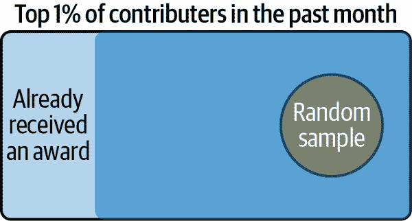
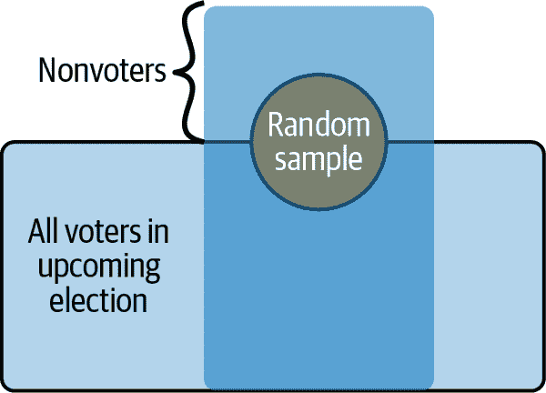
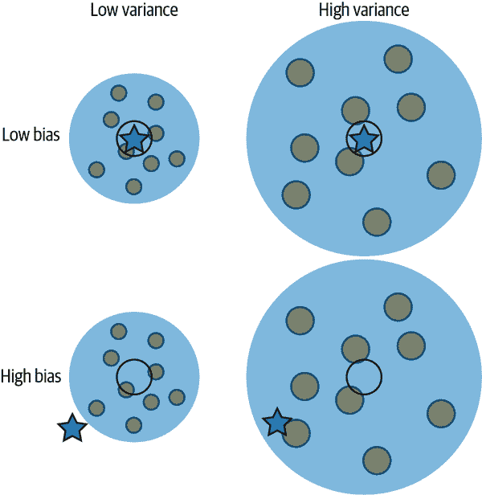

# 第二章：问题与数据范围

作为数据科学家，我们使用数据来回答问题，数据收集过程的质量可以显著影响数据的有效性和准确性，我们从分析中得出的结论的强度以及我们做出的决策。在本章中，我们描述了理解数据收集和评估数据在解决感兴趣问题的有用性方面的一般方法。理想情况下，我们希望数据能够代表我们研究的现象，无论该现象是人群特征、物理模型还是某种社会行为。通常情况下，我们的数据并不包含完整信息（范围在某种程度上受限），但我们希望使用数据准确描述人口、估算科学数量、推断特征之间的关系形式或预测未来结果。在所有这些情况下，如果我们的数据不能代表我们研究对象，那么我们的结论可能会受到限制，可能具有误导性，甚至是错误的。

为了激励对这些问题的思考，我们首先以大数据的力量和可能出现的问题为例子。然后，我们提供一个框架，可以帮助您将研究目标（您的问题）与数据收集过程联系起来。我们称之为*数据范围*¹，并提供术语来帮助描述数据范围，以及来自调查、政府数据、科学仪器和在线资源的示例。在本章后期，我们考虑数据准确性的含义。在那里，我们介绍不同形式的偏差和变异，并描述可能发生这些情况的情形。整个过程中，例子涵盖了您作为数据科学家可能使用的数据种类的光谱；这些例子来自科学、政治、公共卫生和在线社区。

# 大数据和新机遇

公开可用数据的巨大增加为数据科学创造了新的角色和机会。例如，数据记者在数据中寻找有趣的故事，就像传统报道记者寻找新闻故事一样。数据记者的生命周期始于寻找可能有趣故事的现有数据，而不是从研究问题开始，然后找出如何收集新数据或使用现有数据来解决问题。

公民科学项目是另一个例子。它们吸引许多人（和仪器）参与数据收集。这些数据集体上供研究人员组织项目使用，并且通常在公共存储库中供大众进一步调查使用。

行政和组织数据的可用性创造了其他机会。研究人员可以将从科学研究中收集的数据与例如医疗数据进行链接；这些行政数据之所以收集，并不是因为直接源于感兴趣的问题，但它们在其他情境中可能很有用。这种链接可以帮助数据科学家扩展其分析的可能性，并交叉检查其数据的质量。此外，找到的数据可以包括数字痕迹，例如您的网络浏览活动、社交媒体上的发布以及您的在线朋友和熟人网络，它们可能非常复杂。

当我们拥有大量的行政数据或广泛的数字痕迹时，很容易将它们视为比传统的小型研究更具决定性的数据。我们甚至可能认为这些大型数据集可以取代科学研究，本质上是人口普查。这种过度自信被称为[“大数据傲慢”](https://doi.org/10.1126/science.1248506)。具有广泛范围的数据并不意味着我们可以忽略数据代表性的基础问题，也不能忽略测量、依赖性和可靠性问题。（甚至很容易仅仅因为巧合而发现毫无意义或荒谬的关系。）一个众所周知的例子就是谷歌流感趋势追踪系统。

## 示例：谷歌流感趋势

[数字流行病学](https://oreil.ly/i2PVM)是流行病学的一个新分支，利用公共卫生系统之外产生的数据来研究人群中的疾病模式和健康动态。谷歌流感趋势（Google Flu Trends，GFT）追踪系统是数字流行病学的早期示例之一。2007 年，研究人员发现，统计人们搜索与流感相关术语的次数可以准确估计流感病例数。这一明显的成功引起了轰动，许多研究人员对大数据的可能性感到兴奋。然而，GFT 未能达到预期，并在 2015 年被放弃。

发生了什么问题？毕竟，GFT 利用了来自在线查询的数百万数字痕迹来预测流感活动。尽管最初取得了成功，在 2011-2012 年流感季节中，谷歌的数据科学家们发现，GFT 并不能替代由美国疾病控制与预防中心（CDC）从全国各地实验室收集的三周前统计数据。相比之下，GFT 高估了 CDC 的数据，有 108 周中的 100 周。周复一周，尽管基于大数据，GFT 对流感病例的估计仍然过高：

在这幅图中，从第 412 周到第 519 周，GFT（实线）高估了实际的 CDC 报告（虚线）100 倍。还在此处绘制了基于三周前 CDC 数据和季节性趋势的模型预测（点线），这比 GFT 更接近实际情况。

数据科学家发现，一个简单的模型，基于过去的 CDC 报告，使用三周前的 CDC 数据和季节性趋势，比 GFT 在预测流感流行方面做得更好。GFT 忽视了可以通过基本统计方法提取的大量信息。这并不意味着从在线活动中获取的大数据是无用的。事实上，研究人员已经表明，GFT 数据与 CDC 数据的结合可以显著改善 GFT 预测和基于 CDC 的模型。通常情况下，结合不同的方法会比单一方法带来改进。

GFT 的例子告诉我们，即使我们拥有大量信息，数据与提出问题之间的关联至关重要。理解这一框架可以帮助我们避免回答错误的问题，将不适当的方法应用于数据，并夸大我们的发现。

###### 注意

在大数据时代，我们往往会被诱惑收集更多数据来精确回答问题。毕竟，人口普查给了我们完美的信息，那么大数据不应该几乎是完美的吗？不幸的是，这通常并非如此，特别是在管理数据和数字痕迹方面。你想研究的人群的一小部分无法接触（参见第三章中的 2016 年选举反转）或者测量过程本身（就像这个 GFT 的例子）可能会导致预测不准确。重要的是考虑数据的范围，因为它与正在调查的问题相关联。

需要牢记的一个关键因素是数据的范围。范围包括考虑我们想要研究的人群，如何获取有关该人群的信息，以及我们实际测量的内容。深思熟虑这些要点可以帮助我们发现方法上的潜在漏洞。我们将在下一节中详细探讨这一点。

# 目标人群、访问框架和样本

在数据生命周期的重要初始步骤是将感兴趣的问题表达在主题领域的背景下，并考虑问题与收集的数据之间的联系。在甚至考虑分析或建模步骤之前这样做是一个很好的做法，因为它可能会揭示问题和数据之间的不一致。作为将数据收集过程与调查主题联系起来的一部分，我们识别人群、访问人群的手段、测量工具和收集过程中使用的附加协议。这些概念——目标人群、访问框架和样本——帮助我们理解数据的范围，无论我们的目标是获取关于人群、科学数量、物理模型、社会行为或其他内容的知识。

目标人群

*目标人群*包括构成你最终意图描述和得出结论的人群的元素集合。元素可以是人群中的一个人，选民中的一名选民，一系列推文中的一条推文，或者一个州中的一个县。我们有时将一个元素称为*单位*或*原子*。

访问框架

*访问框架*是可供测量和观察的元素集合。这些单位是你可以研究目标人群的对象。理想情况下，访问框架和人群完全对齐，意味着它们由完全相同的元素组成。然而，访问框架中的单位可能只是目标人群的一个子集；此外，框架可能包括不属于人群的单位。例如，为了了解选民在选举中的投票意向，你可能会通过电话联系人们。你打电话的人可能不是选民，因此他们在你的框架中但不在人群中。另一方面，从未接听未知号码的选民无法联系到，因此他们在人群中但不在你的框架中。

样本

*样本*是从访问框架中取出的单位子集，用于观察和测量。样本为你提供了分析数据，从而进行关于感兴趣人群的预测或概括的基础。当资源被用于跟进非响应者和追踪难以找到的单位时，一个小样本比一个大样本或试图对被忽视人群子集进行人口普查更为有效。

访问框架的内容与目标人群相比，以及从框架中选择单位到样本中的方法，是确定数据是否可以被视为目标人群代表性的重要因素。如果访问框架不代表目标人群，那么样本数据很可能也不具有代表性。如果单位的抽样方式存在偏差，也会引发代表性问题。

你还需要考虑数据范围中的时间和地点。例如，在某个疾病流行的地区测试药物试验的有效性可能与在感染率较低的世界其他地区进行的试验不相称（见 第三章）。此外，为了研究随时间变化的数据收集，如大气中二氧化碳（CO[2]）的月度测量（见 第九章）和预测流感趋势的谷歌搜索的每周报告，具有*时间*结构，我们在检查数据时需要注意。在其他时候，数据可能存在*空间*模式。例如，本节稍后描述的环境健康数据是针对加利福尼亚州每个人口普查区报告的，我们可能会制作地图以寻找空间相关性。

如果你没有收集数据，你需要考虑是谁收集了数据以及出于什么目的。现在更多的数据是被动收集而不是出于特定目的而收集的，这一点尤为重要。仔细审视发现的数据，并问自己这些数据是否可以用来解决你的问题，可以避免进行无效的分析或得出不恰当的结论。

对于以下小节中的示例，我们从一个一般性问题开始，将其缩小为可以用数据回答的问题，并在此过程中确定目标人群、访问框架和样本。这些概念在图表中用圆圈和矩形表示，这些形状的重叠配置有助于揭示范围的关键方面。在每个示例中，我们还描述了数据范围的相关时间和空间特征。

## 例如：什么使在线社区的成员活跃？

Wikipedia 上的内容是由属于 Wikipedia 社区的志愿者编写和编辑的。这个在线社区对 Wikipedia 的成功和活力至关重要。为了理解如何激励在线社区的成员，[研究人员](https://oreil.ly/j74rl)进行了一项关于 Wikipedia 贡献者的实验。一个更具体的问题是：奖励是否会增加 Wikipedia 贡献者的活跃度？在这个实验中，目标人群是前一个月内对 Wikipedia 贡献最活跃的顶尖贡献者——即前 1% 的最活跃贡献者。接入框架排除了那些在该月已经接受过奖励（奖励）的人群。接入框架故意排除了人群中的一些贡献者，因为研究人员想要衡量奖励的影响，而那些已经接受了一种奖励的人可能会有不同的行为（见 图 2-1）。

###### 图 2-1\. Wikipedia 实验中范围的表现

样本是从框架中随机选择的 200 名贡献者。观察了这些贡献者 90 天，并收集了他们在 Wikipedia 上的数字活动迹象。请注意，贡献者群体并非静态；有定期的更替。在研究开始前的一个月内，超过 144,000 名志愿者为 Wikipedia 创作内容。从这群顶尖贡献者中选择限制了研究结果的普遍性，但鉴于顶尖贡献者群体的规模，如果能通过非正式奖励影响他们以维持或增加其贡献，这仍然是一个有价值的发现。

在许多实验和研究中，我们无法包括所有的人口单位在框架内。通常情况下，接入框架包括愿意参与研究/实验的志愿者。

## 例子：谁会赢得选举？

2016 年美国总统选举的结果让许多人和许多民意调查员感到意外。大多数选举前的民意调查预测希拉里·克林顿会击败唐纳德·特朗普。政治民意调查是一种试图在选举之前衡量人们会投票给谁的公众意见调查。由于意见随时间变化，焦点缩小到了一个“赛马”问题，即受访者被问及如果明天举行选举，他们会投票给哪位候选人：候选人 A 还是候选人 B。

民意调查定期在总统竞选期间进行，随着选举日的临近，我们预计民意调查会更好地预测结果，因为偏好会稳定下来。民意调查通常也会在州内进行，然后再结合起来预测总体赢家。因此，民意调查的时间和地点都很重要。[民意调查机构也很重要](https://oreil.ly/iHApH)，有些机构一直比其他机构更准确。

在这些选举前调查中，目标人群包括将在选举中投票的人，例如此例中的 2016 年美国总统选举。然而，调查员只能猜测某人是否会在选举中投票，因此访问框架包括那些被认为可能是选民的人（通常基于过去的投票记录，但也可能使用其他因素）。由于人们通过电话联系，因此访问框架仅限于拥有座机或移动电话的人群。样本由框架中按随机拨号方案选择的人组成（见 图 2-2）。

###### 图 2-2\. 2016 年总统选举调查中范围的表示

在 第三章 中，我们讨论了人们不愿接听电话或参与民意调查对选举预测的影响。

## 示例：环境危害如何影响个体健康？

为了解决这个问题，加利福尼亚环境保护局（CalEPA）、加利福尼亚州环境健康危害评估办公室（OEHHA）和公众共同开发了 [CalEnviroScreen](https://oreil.ly/qeVD0) 项目。该项目利用从美国人口普查的人口统计数据、加利福尼亚州卫生保健访问和信息部门的健康统计数据，以及加利福尼亚州空气资源局维护的空气监测站收集的污染测量数据，研究加利福尼亚社区中人口健康与环境污染的关系。

理想情况下，我们希望研究加利福尼亚州的人群，并评估这些环境危害对个体健康的影响。然而，在这种情况下，数据只能在人口普查区一级别获取。访问框架由居住在同一人口普查区的群体组成。因此，框架中的单位是人口普查区，样本是一个普查，即州内所有普查区，因为提供了所有普查区的数据（见 图 2-3）。

###### 图 2-3\. CalEnviroScreen 项目的范围；访问框架中的网格代表人口普查区

不幸的是，我们无法分解一个普查区内的信息以研究个人。这种聚合影响了我们可以探讨的问题以及我们可以得出的结论。例如，我们可以询问加利福尼亚社区因哮喘住院率与空气质量之间的关系。但是我们无法回答最初提出的有关个体健康的问题。

这些示例展示了目标、访问框架和样本的可能配置。当一个框架无法覆盖所有人时，我们应考虑这些缺失信息可能如何影响我们的发现。同样地，我们要思考当一个框架包括非人口中的成员时可能会发生什么。此外，抽样技术可以影响样本对总体的代表性。当你考虑推广你的数据发现时，你还需要考虑收集数据所用仪器和程序的质量。如果你的样本是一次完全符合目标的普查，但信息收集不当，那么你的发现将毫无价值。这是下一节的主题。

# 仪器和协议

当我们考虑数据的范围时，也要考虑用于进行测量和测量过程的仪器和协议，我们称之为*协议*。对于调查而言，仪器通常是样本中的个体填写的问卷。调查的协议包括如何选择样本，如何跟进非回应者，访谈者培训，保护机密性等。

良好的仪器和协议对所有类型的数据收集都很重要。如果我们想测量自然现象，如大气中的二氧化碳，我们需要量化仪器的准确性。校准仪器和进行测量的协议对于获取准确的测量结果至关重要。仪器可能会失校，测量结果可能随时间漂移，导致测量极不准确。

在实验中，协议也至关重要。理想情况下，任何可能影响实验结果的因素都应受到控制。例如，温度、时间、医疗记录的机密性，甚至测量顺序都需要保持一致，以排除这些因素可能带来的影响。

随着数字痕迹的增加，支持在线活动的算法是动态的，并不断进行重新设计。例如，谷歌的搜索算法不断调整以提高用户服务和广告收入。搜索算法的变化可以影响从搜索中生成的数据，进而影响基于这些数据构建的系统，例如谷歌流感趋势跟踪系统。这种变化环境可能使得维护数据收集协议变得不可行，并且难以复制研究结果。

许多数据科学项目涉及将来自多个来源的数据进行关联。每个来源应通过这种数据范围构建来检查，考虑到各个来源的差异。此外，用于合并多个来源数据的匹配算法需要被清楚理解，以便比较来源的人口和框架。

用于研究自然现象的仪器测得的测量可以在目标、访问框架和样本的范围图中进行描述。这种方法有助于理解仪器的准确性。

# 测量自然现象

引入的用于观察目标群体的范围图可以扩展到我们想要测量数量的情况，比如空气中的粒子计数、化石的年龄或光速。在这些情况下，我们将要测量的数量视为一个未知的确切值。（这个未知值通常被称为*参数*。）我们可以根据这种情况调整我们的范围图：我们将目标缩小到代表未知的一个点；仪器的准确性作为访问框架；样本由仪器测得的测量组成。你可以把框架想象成一个飞镖靶，仪器是扔飞镖的人，而飞镖落在靶心周围。飞镖的散布对应仪器测量的结果。目标点不被飞镖投手看到，但理想情况下它与靶心重合。

为了说明测量误差及其与抽样误差的关系，我们考虑测量空气中 CO[2] 浓度的问题。

## 例子：空气中 CO[2] 的水平是多少？

CO[2] 是全球变暖的重要信号，因为它在地球大气中捕获热量。没有 CO[2]，地球将会异常寒冷，但这是一个微妙的平衡。CO[2] 浓度的增加推动全球变暖，并威胁到我们地球的气候。为了解决这个问题，自 1958 年以来在[毛纳罗亚观测站](https://oreil.ly/HpqFr)对 CO[2] 浓度进行了监测。这些数据为理解全球变暖的威胁提供了关键的基准。

在考虑数据的范围时，我们要考虑数据收集的地点和时间。科学家选择在毛纳罗亚火山测量 CO[2]，因为他们希望在空气中测量 CO[2] 的背景水平。毛纳罗亚位于太平洋中，远离污染源，观测站位于一个被裸露的火山岩石包围的山顶上，远离可以从空气中去除 CO[2] 的植物。

测量 CO[2] 的仪器尽可能准确非常重要。[严格的协议](https://oreil.ly/r_Da9)被制定用来保持仪器处于最佳状态。例如，毛纳罗亚定期使用不同类型的设备对空气样本进行测量，并将其他样本送往实验室进行更精确的测量。这些测量有助于确定仪器的准确性。此外，每小时对一个参考气体进行 5 分钟的测量，每天对另外两个参考气体进行 15 分钟的测量。这些参考气体具有已知的 CO[2] 浓度。将测量浓度与已知值进行比较有助于识别仪器中的偏差。

尽管毛纳洛亚岛上背景空气中的二氧化碳相对稳定，但在任何小时内测量的五分钟平均浓度与小时平均值会有偏差。这些偏差反映了仪器的精确度和气流的变化。

数据收集的范围可以总结如下：在毛纳洛亚岛上空的特定位置，在特定的一个小时内，存在真实的二氧化碳浓度背景；这是我们的目标（参见图 2-4）。仪器进行测量并报告五分钟平均值。这些读数构成一个样本，包含在访问帧中，即飞镖板。如果仪器工作正常，飞镖靶心与目标（一小时平均二氧化碳浓度）重合，测量值集中在靶心周围，偏差约为 0.30 百万分之一（ppm）。二氧化碳的测量是每百万份干燥空气中二氧化碳分子的数量，因此测量单位是 ppm。

###### 图 2-4\. 访问帧代表仪器的精确度；星星代表感兴趣的真实值

我们在下一节继续使用飞镖板的类比，介绍偏差和变异的概念，描述样本可能不代表总体的常见方式，并将精度与协议联系起来。

# 精确度

在人口普查中，访问帧与人口匹配，样本捕捉整个人口。在这种情况下，如果我们进行了设计良好的问卷调查，那么我们对人口有完整准确的信息，范围是完美的。类似地，在测量大气中的二氧化碳浓度时，如果我们的仪器具有完美的精确度并正确使用，那么我们可以测量二氧化碳浓度的确切值（忽略空气波动）。这些情况是罕见的，如果不是不可能的话。在大多数情况下，我们需要量化测量的准确度，以便将我们的发现推广到未被观察到的领域。例如，我们经常使用样本来估计人群的平均值，从测量中推断科学未知值的值，或预测新个体的行为。在每种情况下，我们还希望有一个可量化的精度度量。我们想知道我们的估计、推断和预测与真实情况有多接近。

早些时候引入的飞镖投掷到飞镖板的类比在理解精度方面很有帮助。我们将*精度*分为两个基本部分：*偏差*和*精确度*（也称为*变异性*）。我们的目标是让飞镖击中飞镖板上的靶心，并使靶心与看不见的目标对齐。飞镖在板上的分布代表我们测量中的精度，从靶心到我们正在瞄准的未知值的差距则代表偏差。

图 2-5 显示了低偏差和高偏差以及精度的组合。在这些图中，点代表采取的测量，星代表真实的、未知的参数值。点在访问框架内形成一个散射，在这个散射中，点代表采取的测量，星代表真实的、未知的参数值。当访问框架的靶心大致位于星星上方时（顶行），测量点在感兴趣的值周围散布，偏差较小。较大的飞镖板（右侧）表示测量中的更广泛的分布（较低的精度）。

###### 图 2-5\. 低和高测量偏差和精度的组合

代表性数据将我们置于图表的顶行，其中偏差小，意味着未知的目标与靶心对齐。理想情况下，我们的仪器和协议将我们置于图表的左上部，那里的变化也很小。底行中点的模式系统地错过了目标值。增加样本量不会纠正这种偏差。

## 偏差类型

偏差有多种形式。我们在这里描述了一些经典类型，并将它们与我们的目标-访问-样本框架联系起来：

覆盖偏差

当访问框架不包括目标人群中的所有人时发生。例如，基于电话调查的调查无法接触到没有电话的人。在这种情况下，不能接触到的人可能在重要方面与访问框架中的人不同。

选择偏差

当用于选择样本单位的机制倾向于选择某些单位的频率超过它们应该被选择的频率时，就会出现覆盖偏差。例如，方便采样选择最容易获得的单位。当那些容易接触到的人与那些难以接触到的人在重要方面有所不同时，问题就会出现。另一个例子是，观察研究和实验通常依赖于志愿者（选择参与的人），而这种自我选择可能会导致偏差，如果志愿者与目标人群在重要方面不同。

非响应偏差

有两种形式：单位和项目。当被选样本中的某人不愿意参与时发生单位无响应（他们可能永远不会接听来自陌生人的电话）。当某人接听电话但拒绝回答特定的调查问题时发生项目无响应。如果选择不回答的人与选择回答的人有系统性差异，那么非响应可能会导致偏差。

测量偏差

当一个仪器系统地错过了一个方向的目标时发生。例如，低湿度可能会导致我们对空气污染的测量错误地偏高。此外，测量设备随时间变化可能变得不稳定并漂移，从而产生系统误差。在调查中，当问题措辞不清或引导性，或者受访者可能不愿诚实回答时，可能会出现测量偏差。

这些偏见中的每一种都可能导致数据未集中在未知的目标值上。通常情况下，我们无法评估偏见的潜在幅度，因为关于那些不在访问范围之外、不太可能被选中作为样本或不愿意回应的人几乎没有信息可用。协议是减少这些偏见来源的关键。从框架中选择样本或将单位分配给实验条件的机会性机制可以消除选择偏见。非响应跟进协议可以鼓励参与，从而减少非响应偏见。试点调查可以改善问题措辞，从而减少测量偏见。校准仪器的程序和随机顺序进行测量的协议可以减少测量偏见。

在 2016 年美国总统选举中，非响应偏见和测量偏见是预测胜者不准确的关键因素。几乎所有选民在选举前预测希拉里将击败特朗普。特朗普意外获胜令人惊讶。选举后，许多民意调查专家试图诊断民意调查中的问题所在。[美国公共舆论研究协会](https://oreil.ly/uPDlR)发现预测有两个关键原因出现了偏差：

+   大学受教育选民被过度代表。[大学受教育选民比受教育较少的人更有可能参与调查](https://oreil.ly/K4BvY)，并且在 2016 年，他们更有可能支持希拉里。更高的受教育选民的响应率使样本存在偏见，并且高估了对希拉里的支持。

+   选民在选举前几天临时决定或改变他们的偏好。由于民意调查是静态的，只能直接测量当前的信仰，它无法反映态度的变化。

很难弄清楚人们是忍住了他们的偏好还是改变了他们的偏好，以及这种偏见有多大。然而，选后民调帮助民意调查专家了解事后发生了什么。它们表明，在密集竞争的州（例如密歇根州），许多选民在竞选的最后一周作出了选择，而且这群人大多支持特朗普。

并非在所有情况下都需要避免偏见。如果仪器精度高（低方差）且偏见小，则该仪器可能优于另一种具有更高方差但无偏见的仪器。例如，偏倚研究可能对试点调查仪器或捕获大型研究设计中的有用信息有用。许多时候，我们最多只能招募研究志愿者。鉴于这种限制，仍然有可能将这些志愿者纳入研究，并使用随机分配将其分为治疗组。这就是随机对照实验背后的理念。

无论是否存在偏差，数据通常也表现出变异。可以通过使用偶然机制选择样本来有意引入变异，也可以通过仪器的精确性自然发生。在下一节中，我们将识别三种常见的变异来源。

## 变异类型

以下类型的变异由偶然机制产生，并具有可量化的优势：

抽样变异

使用偶然选择样本的结果。在这种情况下，原则上我们可以计算特定元素集被选为样本的机会。

分配变异

在控制实验中发生，当我们将单位随机分配到处理组时。在这种情况下，如果我们以不同方式分割单位，那么我们可以从实验中获得不同的结果。这种分配过程使我们能够计算特定组分配的机会。

测量误差

测量过程的结果。如果用于测量的仪器没有漂移或偏差，并且具有可靠的误差分布，那么当我们对同一对象进行多次测量时，我们会得到围绕真实值中心的随机测量变化。

*瓮模型* 是一个简单的抽象，对理解变异很有帮助。这个模型建立了一个容器（一个瓮，类似于花瓶或桶），里面装满了标记过的相同弹珠，我们使用从瓮中抽取弹珠的简单动作来推理取样方案、随机对照实验和测量误差。对于这些变异类型，瓮模型帮助我们使用概率或模拟估计变异的大小（参见第三章）。选择维基百科贡献者接受非正式奖励的例子提供了瓮模型的两个示例。

回顾维基百科实验，从 1440 位顶级贡献者中随机选择了 200 位贡献者。然后，这 200 位贡献者再次随机分成两组，每组 100 人。一组获得非正式奖励，另一组没有。我们使用瓮模型来描述这个选择和分组过程：

1.  想象一个装满 1440 颗相同形状和大小的弹珠的瓮，每颗弹珠上写着 1440 个 Wikipedia 用户名之一。（这是访问框架。）

1.  仔细将弹珠在瓮中混合，选择一个弹珠并将其放在一边。

1.  重复混合并选择弹珠以获得 200 个弹珠。

从样本中抽取的弹珠。接下来，为了确定哪 200 位贡献者将获得奖励，我们使用另一个瓮：

1.  在第二个瓮中，放入前述样本中的 200 个弹珠。

1.  仔细混合这些弹珠，选择一个弹珠并将其放在一边。

1.  重复，选择 100 个弹珠。也就是说，一次选择一个弹珠，在中间混合，并将选择的弹珠放在一边。

从 100 颗抽取的弹珠被分配到治疗组，并对应于获奖的贡献者。留在瓮中的 100 颗弹珠形成对照组，他们不会获得奖励。

无论是样本选择还是奖励接受者的选择都使用了机会机制。如果我们再次重复第一次取样活动，将所有 1,440 颗弹珠放回原来的瓮中，那么我们很可能会得到一个不同的样本。这种变化是*抽样变异*的来源。同样地，如果我们再次重复随机分配过程（保持 200 个样本不变），那么我们会得到一个不同的治疗组。*分配变异*是由这第二个机会过程引起的。

维基百科实验提供了抽样和分配变异的例子。在这两种情况下，研究人员对数据收集过程施加了机会机制。测量误差有时也可以被视为遵循瓮模型的机会过程。例如，我们可以用这种方式表征马瓦努阿洛阿的 CO[2]监测仪的测量误差。

如果我们可以在数据的变化和瓮模型之间进行准确的类比，瓮模型为我们提供了估算变化规模的工具（见第三章）。这是非常理想的，因为我们可以为数据的变化提供具体的值。然而，确认瓮模型是否合理地描述了变化来源至关重要。否则，我们的准确性声明可能存在严重缺陷。我们需要尽可能了解数据范围的所有内容，包括数据收集中使用的仪器、协议和机会机制，以应用这些瓮模型。

# 总结

无论您处理的数据类型是什么，在进行清理、探索和分析之前，请花点时间了解数据的来源。如果您没有收集数据，请问自己：

+   谁收集了数据？

+   为什么要收集数据？

这些问题的答案可以帮助确定这些找到的数据是否可以用来解决您感兴趣的问题。

考虑数据的范围。关于数据收集的时间和空间方面的问题可以提供宝贵的见解：

+   数据是何时收集的？

+   数据是在哪里收集的？

这些问题的答案帮助您确定您的发现是否与您感兴趣的情况相关，或者您的情况可能与其他地方和时间不可比较。

对于范围概念的核心是回答以下问题：

+   目标人群是什么（或未知参数值是什么）？

+   目标是如何访问的？

+   选择样本/进行测量的方法是什么？

+   使用了哪些仪器，它们是如何校准的？

尽可能回答这些问题可以为您提供宝贵的见解，了解您对发现的信任程度以及是否可以从中进行概括。

本章为您提供了术语和思考并回答这些问题的框架。该章节还概述了如何识别可能影响您发现准确性的偏差和方差的方法。为了帮助您理解偏差和方差，我们介绍了以下图表和概念：

+   范围图示，显示目标人群、访问框架和样本之间的重叠。

+   飞镖板，描述仪器的偏差和方差。

+   在使用概率机制从访问框架中选择样本、将群体分为实验处理组或从良好校准的仪器中进行测量时，使用乌尔恩模型。

这些图表和模型试图概括理解如何识别数据限制并评估数据在回答问题中的有用性所需的关键概念。第三章继续发展乌尔恩模型，更正式地量化准确性并设计模拟研究。

¹ “范围”概念改编自约瑟夫·赫勒斯坦（Joseph Hellerstein）的[课程笔记](https://oreil.ly/VrByF)，涉及范围、时间性和忠实度。
