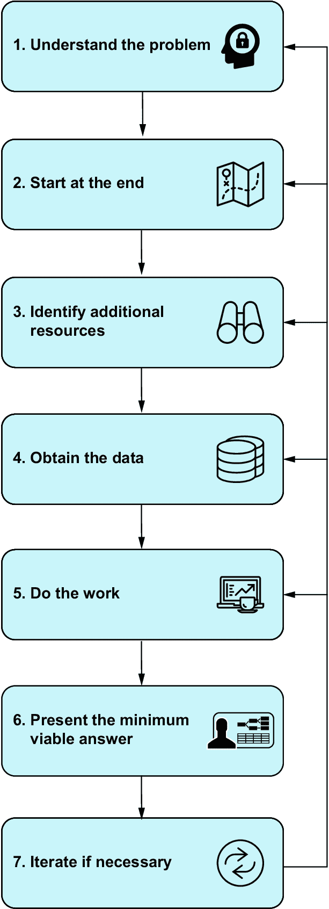

# 第一章：1 桥接数据科学培训与现实世界之间的差距

### 本章涵盖

+   使用以结果为导向的过程进行数据分析

+   使用真实生活项目的重要数据科学概念

+   在分析数据和学习新技能时关注实用解决方案

以下场景听起来熟悉吗？你刚刚从组织中的某个部门收到了一个数据请求，你不知道如何处理它，或者甚至不知道确切的任务是什么。在初始培训的结构化经验之外，现实世界是混乱和不确定的。你可能想知道

+   你如何使用你现有的技能来完成对要求较高的利益相关者的项目？

+   结构化培训环境不再存在时，你如何保持学习？

+   你如何将你的通用技能应用于特定领域任务？

+   你接下来需要学习什么？

任何资深数据科学家都会告诉你，所有这些问题的答案都是“经验”。通过完成本书中的八个项目，你将加速获得作为数据分析师成功所需的经验的过程。

通过完成与你在现实世界中可能遇到的类似项目，你将磨练现有的技能并学习新的技能。在这个过程中，你将完成大部分工作，但会提供一些想法来帮助你开始。为了增强特定技能，我还概述了一种方法，通过关注实际结果来让你成为一个更好的分析师。在这个过程中，你将遵循一个流程，使其更容易高效地学习新技能，并从每个新挑战中获得最大价值。

## 1.1 数据分析师的工具箱

分析师在开始他们的旅程时学习并带入其角色的某些基本技能。这些是能够

+   从各种来源读取（加载）数据集

+   将数据集合并在一起

+   通过创建、删除、重命名和转换来操作列

+   执行基本统计分析，例如计算平均值

+   使用条形图、折线图或散点图等可视化方式探索你的数据

+   通过创建适当的可视化或设计仪表板来展示你的发现

你觉得哪种工具使用起来更舒适，对于这些任务并不重要。适当的工具包括

+   微软 Excel（或等效软件）

+   商业智能（BI）工具，例如 Tableau 或 Power BI

+   数据库查询语言，如 SQL，尽管这些通常没有可视化功能

+   具备数据分析能力的编程语言，例如 Python 或 R

项目示例解决方案提供的是 Python，但重点将放在问题解决上，而不是 Python 编程语言的细节上。

通过完成项目，你将基于你的基础技能集，增加针对现实世界用例的特定技能，包括数据建模、处理分类数据、从非传统来源提取数据以及快速原型设计。在每种情况下，我都会强调解决该问题所需的精确功能类型，以便你可以找到使用你首选工具完成该任务的方法。一些项目使用了机器学习模型，但关于机器学习的深入讨论超出了我们项目的范围。

这些项目还将让你磨练更多的“元技能”，这些技能对于任何数据分析项目都是至关重要的。这些技能包括：

+   将一个人类问题，一个模糊且不包含技术术语的问题，转换为一个可以用数据回答的问题

+   评估现有数据，并确定它是否适合回答这个问题

+   了解如何调整你的分析并改变你的分析问题，如果现有数据无法回答这个问题

+   向对技术细节一无所知，甚至没有兴趣的人传达你的结果

备注：实践项目侧重于构建技术和解决问题的技能，但成为一名优秀的数据分析师还需要其他专业技能。如果你想要深入了解这些技能，我推荐 Robinson 和 Nolis 的《建立数据科学职业生涯》（Manning, 2020）。

数据分析的未来也包括人工智能（AI）工具，如 ChatGPT 和类似的大型语言模型。AI 工具不能取代你批判性思考、与利益相关者沟通或在商业环境限制下工作的能力；然而，AI 工具可以通过帮助你自动化项目中的更机械方面来加速你的工作。我会强调这种工具如何帮助解决你问题的一部分。例如，如果你不知道如何从 PDF 文件中读取数据，一个 AI 模型将能够告诉你如何在你的首选工具中访问这个功能，并给你代码片段来使用。这意味着你可以更快地解决这个特定的子问题，这将使你更有效率。

##### 关于术语的说明

我将“数据科学”和“数据分析”这两个术语互换使用。首先，数据科学家需要成为优秀的分析师，因此我更倾向于使用“分析”这个词来描述这个学科，以及用“分析师”这个词来描述从业者。当我使用“数据科学”这个词时，我的意思仅仅是“分析数据的过程”。

我也经常提到“现实世界”。这样做的原因是为了强调在课堂上学习的内容与分析师实际工作之间的脱节。这种脱节并不意味着课堂不好；只是有多个障碍需要克服，这些障碍在课堂上无法教授。我的重点是通过对初级分析师进行培训，教他们所有在正式培训中无法学到的东西。当我说“现实世界”时，我的意思是“在学习环境之外”。

类似地，单词“利益相关者”也是一个有争议的术语。我将用它来指代你的老板、内部客户或外部客户。他们是产生你工作的请求的发起者。利益相关者是分析的目标受众，他们的工作将直接受到影响。

## 1.2 结果驱动型方法

在工作中，你的成功更多地取决于你交付的结果，而不是你为任务带来的技能和知识。以结果为导向意味着你的焦点始终在解决问题。你应该尽快提出一个初步解决方案——我喜欢称之为*最小可行答案*。这是你向利益相关者展示的内容，也是未来迭代的依据。应用这种思维方式可以简化你的工作并立即产生价值。你花时间学习一些可以立即应用的东西，从而获得更高的投资回报。这种以结果为导向的方法意味着通过实践学习，并以结果为导向地工作。

让我们通过一个来自行业的经典例子来审视这种方法。假设你为一家汽车经销商工作，需要为你经理回答一个看似简单的问题，“我们昨天卖出了多少辆车？”在理想的世界里，这是一个简单的商业智能问题，只需要过滤销售表，只显示昨天卖出的车辆，并提供答案。现实是，我们需要更深入地思考这个问题，从定义术语开始。

解决此类问题的结果驱动型分析方法如下：

1.  *理解* *问题*—这包括对个别单词/概念的定义。

1.  *从结果开始*—一个能够激发进一步对话的最小可行答案是什么？

1.  *识别* *额外资源*—这些可以是数据、人员或你需要获取这个最小可行答案的访问权限。

1.  *获取* *你需要获取最小可行答案的数据*—这些数据甚至存在吗？

1.  *完成* *获取最小可行答案的工作*—理想情况下，这一步骤不应超过几天，这样你就可以快速迭代。

1.  *呈现* 对利益相关者的**最小可行答案**—这可能是任何从闲聊到向观众做展示的内容。

1.  *如有必要，进行迭代*—如果这项工作有价值，利益相关者会要求你进一步推进。

图 1.1 是此过程的视觉表示。注意从步骤 7 返回的箭头：它们突出了过程的非线性。根据步骤 6 的进展情况，你可能需要回到早期步骤，甚至是最初的步骤。 

##### 图 1.1 驱动结果的流程可视化

图 1.1 中的图标将在全书讨论如何将此方法应用于特定项目时使用。要将此流程应用于我们的汽车示例，我们从步骤 1，“理解问题”开始。

### 1.2.1 理解问题

我们所说的“汽车”是什么意思？当我从事汽车行业工作时，每当有关车辆的问题出现，我们都需要明确是否包括货车或其他不太像汽车的车辆。有时货车是相关的，有时则不然。那么，“昨天”又是什么意思呢？通常，几个日期可能与销售事件相关：客户在商店购买商品的日期，我们为客户开具商品发票的日期，客户付款的日期，甚至解决与销售相关的争议的日期。因此，当我们询问“昨天”时，我们需要知道使用哪个日期列。即使是“销售”这个词也可能含糊不清。如果客户后来退货怎么办？这意味着这个问题的答案会随时间而改变吗？我们可能会明确决定过去发生的事情不是固定的，这将使我们的分析更加复杂。顺便提一下，我们应该将这些问题的答案进行编码，并记录在业务特定的数据模型中。关于这一点，在第三章中将有更多介绍。

此步骤的输出应该是

+   可以通过分析解决的问题

+   明确的范围（例如，汽车的分析是否也扩展到货车？）

+   明确定义并由相关人员达成一致的术语

这些项目应作为项目的一部分进行记录，以提高透明度和可重复性。一旦我们理解了需求，我们就应该转向设想解决方案。

### 1.2.2 从最后一步开始

假设我们已经就术语达成一致，我们可以从最后一步开始，决定最小可行答案的样子。这取决于请求的性质以及我们的利益相关者想用这些信息做什么。如果他们需要一个快速的粗略估计，我们可以绕过一些关于车辆类型和日期的困难问题，除非我们有良好的数据模型可以从中提取。了解利益相关者期望的答案水平对于决定这项请求需要多少努力至关重要。

此步骤的输出是一个清晰的解决方案样貌。是文档、演示文稿，甚至是一个工作原型？一旦理解了这一点，下一步就是确定所需的数据。

### 1.2.3 确定额外资源

即使对于简单的请求，也要立即询问“我们需要哪些数据来回答这个问题？”紧接着问“我们是否有这些数据？”在承诺任何工作之前，建议研究可用的数据，因为有些情况下我们根本没有任何直接记录我们感兴趣的概念的数据集。例如，在一个在线拍卖市场中，销售交易可能不会直接记录，因为它们可能发生在系统之外。如果在拍卖结束后通过电话达成销售协议，我们需要知道记录在哪里。

输出应该是一个列表，列出适当的数据可能看起来像什么，以回答这个问题。这应该包括组织已经可用的可能数据集和需要获取的外部数据集。

### 1.2.4 获取数据

现在，我们需要获取相关数据，要么通过从某处提取它，要么通过创建它。如果我们的在线拍卖市场仅用于发布和竞标，我们可能只能通过查看何时停止发布来推断何时售出。这是一个我们需要从原始发布数据中创建的数据集。在这种情况下，我们不得不停在步骤 3，重新分组，以确定创建这样的推断销售数据集是否值得努力。这取决于我们在步骤 2 中定义的最小可行答案。

输出应该是一个可触摸的数据集或提取，我们可以用它来得到我们的最小可行答案。如果数据只是一个提取，它应该代表更大的数据。

### 1.2.5 执行工作

你会注意到步骤 5 只是说“执行工作。”这是故意宽泛和模糊的。步骤 5 可能包括你遇到的其他所有数据分析工作流程。步骤 1-4 确保执行部分将有一个更高的投资回报率。到这一点，你已经对问题进行了足够的思考，你不会只是盲目地跳入编写代码，这在你技能新鲜且渴望交付时确实是一个诱惑。我鼓励你在步骤 1-4 上花时间，也许甚至比你本能地愿意花的时间还要多。

在汽车示例中，在这个阶段，你可能会发现一辆车的销售日期会随着时间的推移而改变，这可能是由于客户等待财务协议通过，或者之前未公开的故障随后被发现，客户提出了投诉。作为分析师，你不应该单独做出决定，关于哪个可能的日期构成实际的销售日期。在这里，你应该回到步骤 1，在与你的利益相关者进行对话后再继续你的分析。

无论分析中发生什么，记录你的具体选择和假设对于透明度和可重复性至关重要。在为每个项目提供的示例解决方案中，我已经记录了我所做的具体选择，以及如果另一位分析师做出了不同的决定，他们的路径可能会如何分歧。

这里的输出是在步骤 2“从终点开始”中决定的。这个工件应作为项目的一部分进行记录，并能够被其他分析师重复。第十二章和第十三章介绍了一个我们就是这样做的项目。

### 1.2.6 展示最小可行答案

结果驱动方法的一个关键组成部分是在我们可能倾向于的时间之前展示结果。我们正在寻找一个令人满意的解决方案，因此我们应该尽早讨论初步结果，以便进行迭代。数据团队过去曾失败，因为他们将自己孤立于业务的其他部分，几个月后才出现的工作没有人需要，也没有任何实际业务价值。

##### 有人在使用你的工作吗？

我曾在一次有趣的会议上听过一个数据科学团队构建复杂销售预测模型的演示。演示纯粹是技术性的，讲述了他们如何到达他们的层次贝叶斯方法。

在问答环节，我提出了一个棘手的问题：“有人使用你的预测吗？如果是，用途是什么？”数据科学家们尴尬地承认，他们仍在努力说服业务部门他们的预测是有价值的。我怀疑如果他们早点进行那次对话，可以避免很多不必要的劳动。

这一步的输出是与我们的利益相关者进行的会议记录或演示文稿的分钟记录。这些成果也应作为项目的一部分进行记录。是否需要进一步的工作？如果是，那是什么？

### 1.2.7 如有必要，进行迭代

最后，你几乎总是需要对你的第一个答案进行迭代。在任何数据分析框架中包含这一步骤是很重要的，因为它突出了这项工作的固有不确定性。你永远不会一开始就拥有所有答案，包括对“这项分析需要多长时间？”这个问题的答案，这也是正常的。接受一个初稿是达到满意解决方案的必要步骤，而且越早完成初稿越好。这种迭代方法的额外好处是，你将变得更好于估计你的工作需要多长时间，因为你只需要估计一次迭代而不是整个项目。

使用以结果为导向的方法，你将培养出如何做出分析决策的直觉，这些决策帮助你专注于提供实用的解决方案，而不是一开始就提供不必要的深入答案。当然，你将在过程中学习新工具。有时，这些工具可能只用于你面前的分析。下一次分析可能需要不同的工具。这是可以的——工具来来去去，但你学到的知识和概念将保持不变，这些才是优秀分析师的标志。

重要的是要注意，这种方法并不是在必要时深入研究的替代品。我并不是鼓励任何人学习走捷径。然而，分析的关键技能是识别时间投资回报率最高的方法，这通常意味着采用广度优先而非深度优先的方法。

## 1.3 项目结构

这些项目旨在代表行业分析师面临的常见问题。每个项目都旨在使用基本分析师技能易于接近，且不会花费太多时间。有许多因素在起作用：你对工具的经验水平、你对当前主题的熟悉程度、你学习新概念的速度等等，但一般来说，每个项目的解决方案的第一轮迭代应该花费大约 2 小时到两天的时间。这是一个很大的范围，但即使是两天的“冲刺”来交付可以与利益相关者讨论的东西，也会被视为快速周转时间。

这些项目不仅反映了常见的行业问题，而且旨在弥合初始培训与现实世界之间特定的技能差距。表 1.1 概述了这些项目。

##### 表 1.1 书中八个项目的总结

| 项目 | 数据分析技能 | 章节 |
| --- | --- | --- |
| 分析不同地理区域的客户零售支出 | 从自由文本中提取结构化数据 | 2 |
| 从电子商务交易中提取独特的客户记录 | 数据建模 | 3 |
| 在电子商务商店中定义和寻找最佳表现产品 | 定义指标 | 4 |
| 分析冠状病毒大流行对电影行业的影响 | 从 PDF 中提取数据 | 5 |
| 通过调查调查开发者对 AI 工具的态度 | 处理分类数据 | 6, 7 |
| 识别对自行车基础设施的潜在改进 | 处理时间序列数据 | 8, 9 |
| 探索威尔士房地产市场概念的证明应用 | 快速原型设计 | 10, 11 |
| 继续另一位分析师的工作，并使用手机活动创建客户细分 | 在他人工作上进行迭代 客户细分、聚类 | 12, 13 |

每个项目都按照以下方式构建：

+   这一切从高级描述和数据开始。除此之外，你将独立完成。如果你更愿意根据一个相对模糊的分析问题制定行动计划，或者想明确练习这项技能，这一部分就足够阅读了。

+   接下来是对你如何尝试解决方案的更详细的分步分解。这里不会有代码片段，但如果高级描述让你不知道从哪里开始，这一部分应该能帮助你启动解决方案尝试。

+   最后，我总会包括一个示例解决方案。关于如何尝试解决问题、你必须做出的假设、在数据限制下你可能会如何改变你的分析问题，以及一个可接受的结果将是什么样的，都会有讨论。在示例解决方案中，我会做出一些可能与你不同的具体假设和决策。这是可以预见的。目标不是让你达到我的解决方案——我的解决方案不会是*唯一*的解决方案。事实上，我会指出分析可能出现的分歧。目标是练习从问题定义到最小可行答案的过程。

将这一系列现实分析项目视为实践伴侣，帮助你习惯在没有事先了解答案甚至所需工具的情况下深入探索。在学习通过实践项目的过程中，你将

+   有一个明确的目标，并朝着这个目标努力。

+   学习必要的技能来获得答案，而不是学习没有实际目标导向的技能。

+   广度优先学习，而不是深度优先。

使用以结果为导向的方法来处理项目，将使你准备好将这些方法应用于任何项目。这些项目应该激发你继续分析数据，并使用“解决问题”框架进行学习，同时积累新技能并构建一个便于向潜在雇主展示的实用组合。

让我们开始吧！下一步是承担你的第一个项目，为一家假设的英国零售商分析一些客户人口统计数据。我希望你享受这段旅程！

## 摘要

+   预期你的正式数据科学培训与现实世界之间存在差距。

+   实用主义和以结果为导向有助于应对数据分析中固有的不确定性。

+   通过现实世界的示例练习这种以结果为导向的方法将帮助你

    +   专注于问题解决

    +   提高识别额外考虑因素的能力

    +   培养如何做出分析决策的直觉，以便更快地为利益相关者提供实用解决方案

    +   创建一个真实世界的项目组合，让自己在候选人中脱颖而出
