# 第九章：9 时间序列数据：分析

### 本章涵盖

+   分析时间序列数据以回答研究问题

+   揭示看似简单的时间序列中的隐藏深度

+   评估时间序列数据集是否适合进行预测

+   检查时间序列的组成部分

+   建立预测模型

在本章中，我们继续探讨时间序列数据的价值。在第八章中，我们探讨了原始时间序列数据，并在进一步分析时间序列之前决定保留哪些记录。本章是关于流程的第二部分：分析时间序列数据以寻找模式，以及分解和预测。我们首先回顾上一章的项目概述，并总结到目前为止已完成的工作，然后再继续分析。

## 9.1 项目 6 回顾：分析时间序列以改善自行车基础设施

我们已经准备好了数据，它已准备好进行分析。但在我们开始分析之前，让我们回顾一下上一章的问题陈述和数据字典。数据可在[`davidasboth.com/book-code`](https://davidasboth.com/book-code)上供您尝试项目使用。您将找到可用于项目的文件，以及以 Jupyter 笔记本形式的示例解决方案。本章的笔记本从第八章结束的地方继续。

### 9.1.1 问题陈述

您被雇佣参与一项新的政府倡议，Bikes4Britain，该倡议旨在改善英国的自行车基础设施。项目的第一阶段目标是确定全国最适合改善自行车基础设施的地方。具体来说，您的利益相关者正在寻找既有或正在增加自行车交通流量的地方的建议。他们希望从公开数据源开始，并已将交通部（主页为[`roadtraffic.dft.gov.uk`](https://roadtraffic.dft.gov.uk)）的公路交通统计数据作为衡量全国自行车交通量的方式。

注意：我们将在本项目中用于寻找模式和提出建议的数据集最初来源于[`roadtraffic.dft.gov.uk/downloads`](https://roadtraffic.dft.gov.uk/downloads)。感谢交通部在开放政府许可下提供这些数据。

我们从交通部统计数据中使用的数据是原始计数数据。这是记录在不同时间通过特定计数位置的车辆原始计数。一些数据集过于高级，例如区域层面的年度汇总，而另一些则是估计值，例如估计的年度平均每日流量数据（AADFs）。原始计数数据集包含最细粒度的数据，如果需要，我们总是可以将其聚合到更高的层次（例如年度值）。

### 9.1.2 数据字典

数据字典文档，最初从[`mng.bz/4ajw`](https://mng.bz/4ajw)获取，包含在项目文件中，表 9.1 详细显示了列。

##### 表 9.1 数据字典，显示所有列定义

| 列名称 | 定义 |
| --- | --- |
| `Count_point_id`  | 将 AADFs 与道路网络连接的唯一参考 |
| `Direction_of_travel`  | 行驶方向 |
| `Year`  | 从 2000 年开始的每年计数 |
| `Count_date`  | 实际计数发生的日期 |
| `Hour`  | 计数发生的时间，其中 7 代表早上 7 点到 8 点，17 代表下午 5 点到 6 点 |
| `Region_id`  | 网站区域标识符 |
| `Region_name`  | CP 所在的区域名称 |
| `Region_ons_code`  | 该区域的国家统计局代码标识符 |
| `Local_authority_id`  | 网站地方当局标识符 |
| `Local_authority_name`  | CP 所在的当地当局 |
| `Local_authority_code`  | 国家统计局的地方当局代码标识符 |
| `Road_name`  | 路名（例如，M25 或 A3） |
| `Road_category`  | 路类型的分类（请参阅数据定义以获取完整列表） |
| `Road_type`  | 路是“主要”还是“次要”道路 |
| `Start_junction_road_name`  | 链接的起点交汇处的道路名称 |
| `End_junction_road_name`  | 链接的终点交汇处的道路名称 |
| `Easting`  | CP 位置的东经坐标 |
| `Northing`  | CP 位置的北纬坐标 |
| `Latitude`  | CP 位置的纬度 |
| `Longitude`  | CP 位置的经度 |
| `Link_length_km`  | 该 CP 的网络道路链接总长度（以公里为单位） |
| `Link_length_miles`  | 该 CP 的网络道路链接总长度（以英里为单位） |
| `Pedal_cycles`  | 自行车的计数 |
| `Two_wheeled_motor_vehicles`  | 两轮机动车辆的计数 |
| `Cars_and_taxis`  | 汽车和出租车的计数 |
| `Buses_and_coaches`  | 公共汽车和长途汽车的计数 |
| `LGVs`  | LGVs 的计数 |
| `HGVs_2_rigid_axle`  | 两轴刚性轴重货车计数 |
| `HGVs_3_rigid_axle`  | 三轴刚性轴重货车的计数 |
| `HGVs_4_or_more_rigid_axle`  | 四轴或更多刚性轴重货车的计数 |
| `HGVs_3_or_4_articulated_axle`  | 三轴或四轴铰接轴重货车的计数 |
| `HGVs_5_articulated_axle`  | 五轴铰接轴重货车的计数 |
| `HGVs_6_articulated_axle`  | 六轴铰接轴重货车的计数 |
| `All_HGVs`  | 所有 HGVs 的计数 |
| `All_motor_vehicles`  | 所有机动车辆的计数 |

在示例解决方案中，我们将使用一个较小的、清洗过的和过滤过的原始数据版本作为起点，这是我们在第八章中创建的。它具有与原始数据相同的结构，因此表 9.1 中的数据字典仍然适用。

### 9.1.3 预期成果

项目的输出是对哪些区域或哪些区域应集中初始努力的推荐。这些可能是已经有大量高自行车交通的区域，或者可能是自行车正在兴起或预计未来将有高自行车需求的区域。我们的建议可能包含建议纳入额外的数据集以继续分析。在开始任何基础设施工作之前，我们可能还想了解这些区域更多的情况，我们应该向利益相关者概述这项额外的工作。

第八章示例解决方案的输出是一个中间数据集，该数据集经过清理和过滤以供分析。本章涵盖的分析部分的输出将是我们所提出的结论和建议。

## 9.2 应该将自行车基础设施改进的重点放在哪里？

在我们开始分析时间序列数据之前，让我们回顾一下上一章中为准备数据以供分析所做的工作。图 9.1 显示了到目前为止所做的工作的流程图，突出显示了可能做出的替代决策。

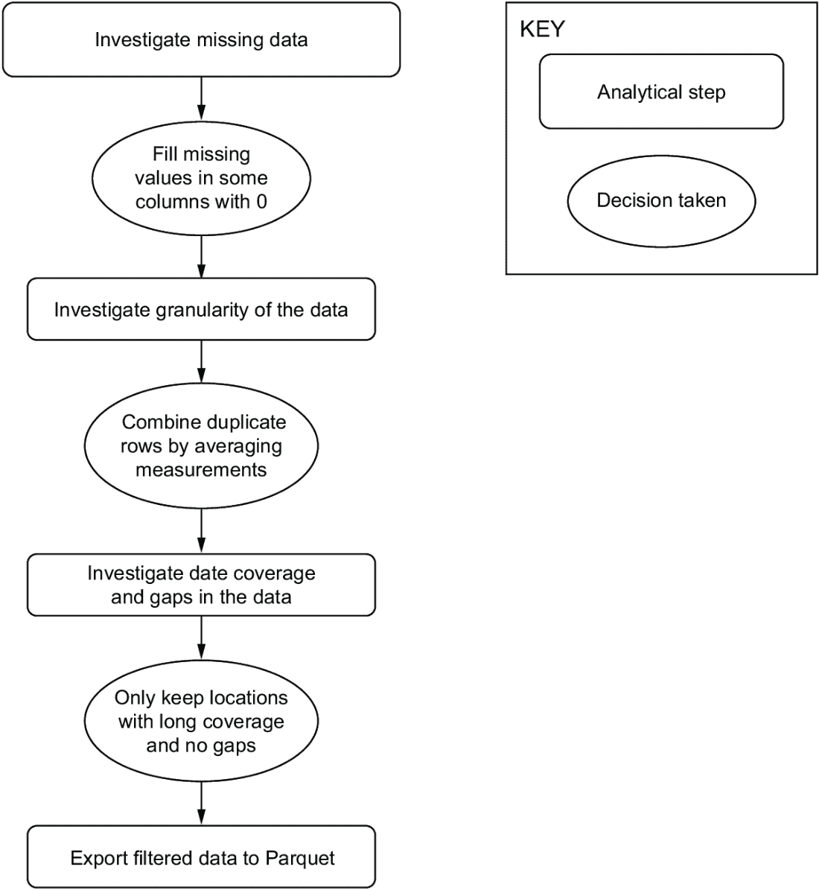

##### 图 9.1 准备时间序列数据以供分析的流程图

现在，是时候查看项目分析部分的示例流程了。一如既往，我强烈建议您首先尝试自己完成项目。如果您有自己的分析来与之比较，示例解决方案将更加相关。需要重申的是，解决方案不是唯一的解决方案，而是一系列可能的决策和结论，您可以在过程中做出和达到。利用它来产生更多想法，并从不同的角度看待您如何处理相同的项目概述。

### 9.2.1 时间序列数据分析

到目前为止，我们已经清理了原始交通数据，并对其进行过滤，以便我们有一个长而完整的时间序列交通计数。现在，通过具体查看自行车情况，是时候将我们的努力集中在手头的问题上了。

#### 计算时间序列数据中的分布

在第八章结束时，我们将数据导出为 Parquet 文件，以将数据清理与分析分离。因此，本节从再次读取相同导出数据开始。

我们知道在数据中，每年只有一个日历日进行了测量。我们想查看长期趋势，因此按小时粒度引入的噪声是我们想通过按年度汇总数据来移除的。让我们从这里开始。以下代码执行此操作，输出样本如图 9.2 所示：

```py
import pandas as pd
import numpy as np
import matplotlib.pyplot as plt
traffic = pd.read_parquet("./data/time_series.parquet.gz")

cycling = (
    traffic
    .groupby(["Count_point_id", "Year"])
    ["Pedal_cycles"]
    .sum()
    .reset_index()
)

cycling.head()
```

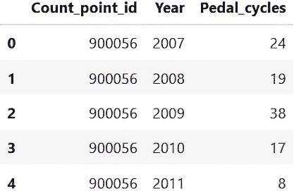

##### 图 9.2 每个位置的年度自行车计数快照

现在的数据是每个日历年度每个位置 ID 一行。图 9.2 显示了一个有自行车交通的位置，但可能存在一个问题；许多位置 ID 可能几乎没有自行车交通。为了检查这一点，我们将查看所有年份中每个位置 ID 看到的自行车总数分布。首先，我们将再次聚合数据以删除年度值，并留下每个位置 ID 一行。这些数据是通过以下代码创建的，并显示在图 9.3 中：

```py
cycling_totals = (
    cycling
    .groupby("Count_point_id")
    ["Pedal_cycles"]
    .sum()
)

cycling_totals.head()
```

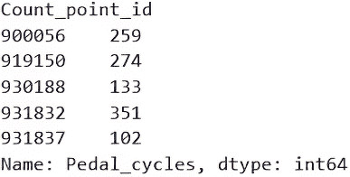

##### 图 9.3 每个位置 ID 看到的自行车总数

现在，我们可以调查这些值的分布，以了解有多少位置有少量或没有自行车交通。我们预计数据将严重右偏，这意味着大多数值可能都接近零，而高值有一个长长的尾巴。为了解决这个问题，我们将向直方图添加更多区间，以希望更好地理解数据的分布。以下代码创建了图 9.4 中显示的直方图：

```py
fig, axis = plt.subplots()

cycling_totals.hist(bins=50, ax=axis)

axis.set(
    xlabel="Frequency",
    ylabel="Total cycling traffic",
    title="Distribution of total cycling traffic by location ID"
)

plt.show()
```

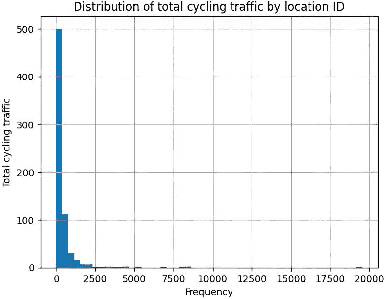

##### 图 9.4 总自行车交通量的分布

如预期的那样，许多位置记录的自行车交通量几乎为零。让我们关注那些总自行车交通量超过一定数量的位置。我们如何知道应该使用什么值作为截止点（即，只考虑在一段时间内看到超过 X 辆自行车的位置）？我们应该了解这些值的四分位数，以了解构成数据前 25%或 50%的截止值。以下代码执行了此操作，输出结果如图 9.5 所示：

```py
cycling_totals.describe()
```


##### 图 9.5 总自行车交通值的描述性统计

这告诉我们，一半的位置记录的总自行车数量为 216 辆或更多。由于我们专注于至少有 10 年覆盖范围的位置，这相当于平均每个测量日期有 10 到 20 辆自行车。这是否足以证明需要进行调查和提出建议，将取决于业务，因此对于这个问题，我们将假设一个足够高的交通水平，以便我们能够关注。

在我们开始削减这些数据之前，让我们更深入地了解它。例如，哪里是自行车交通最繁忙的地方？以下代码生成图 9.6 中的输出，并显示了按自行车交通量排名前 10 的位置 ID：

```py
cycling_totals.sort_values(ascending=False).head(10)
```

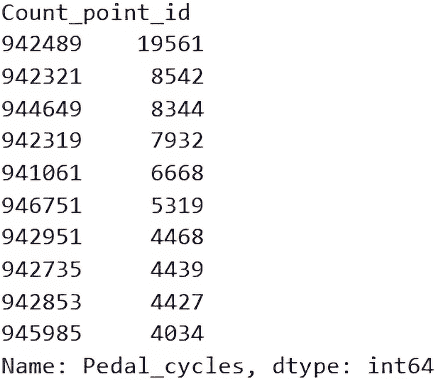

##### 图 9.6 总自行车交通量最高的前 10 个位置 ID

我们有一个记录超过 19,000 辆自行车的位置，还有更多位置记录了数千辆。我个人喜欢在表格周围添加更多上下文，所以让我们来检查这个表格顶部的具体位置 ID。

#### 调查单个数据点以获取更多上下文

由于我们的数据包含许多列，我们可以使用转置的技巧将其显示为单列。以下代码实现了这一点，我们可以像图 9.7 所示那样，将单行数据作为垂直表格来查看。由于空间原因，图中的某些最终列被省略了，但它们存在于解决方案笔记本中：

```py
(
    traffic[traffic["Count_point_id"] == 942489]
    .head(1)
    .transpose()
)
```

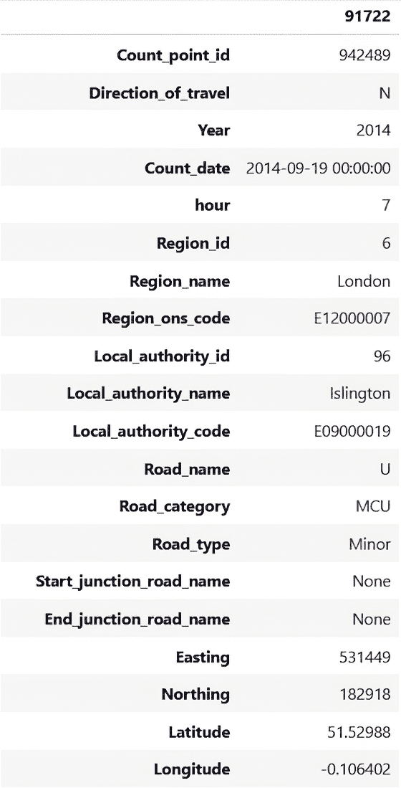

##### 图 9.7 具有最高骑行交通量的位置 ID（数据表中一整行数据转置为列的一部分）

这是一条位于北伦敦伊兹灵顿的某种次要道路，伊兹灵顿是伦敦的一个区。具体是哪条道路没有提及。有`Road_name`和`Road_category`列应该能告诉我们更多信息，但在这里它们并不提供信息。让我们查看数据字典来了解这些特定值的意义。作为提醒，数据字典包含在该章节的材料中，作为 PDF 文件。表 9.2 显示了`Road_category`列中我们可以预期的值。

##### 表 9.2 `Road_category`列的数据字典

| 类别 | 类别描述 |
| --- | --- |
| PM  | M 或 A 级主要公路  |
| PA  | A 级主要道路  |
| TM  | M 或 A 级干线公路  |
| TA  | A 级干线道路  |
| M  | 次要道路  |
| MB  | B 级道路  |
| MCU  | C 级或未分类道路  |

从这里，我们可以得出结论，最热门的骑行地点是一条非常次要或未分类的道路。数据字典中的一条注释说，“未分类道路（在数据集中称为‘U’）包括城市和农村地区的住宅道路，”因此这很可能是条住宅道路，因为伊兹灵顿不是一个农村地区。这些就是作为分析师你所拥有的额外背景信息，如果你有相关的领域知识的话。如果有疑问，请咨询领域专家。

如果我们真的想了解数据中的特定位置，我们可以使用纬度和经度坐标。这个位置的值是`(51.52988,` `-0.106402)`，当输入到地图中时，显示图 9.8 中显示的地图点。


##### 图 9.8 具有最高骑行交通量的 OpenStreetMap 位置

##### 活动内容：让你的数据生动起来

在这个项目中，无论何时你想了解更多关于位置 ID 的信息，你都可以在带有其坐标的地图上找到它。我鼓励你寻找这样的机会，甚至可以用谷歌街景等工具查看它们。作为分析师，我们很少有机会给我们的数据点添加这么多背景信息，所以我们应该充分利用这一点！

在不了解这个特定位置更多情况的情况下，我们只能猜测为什么它在数据中具有最高的骑行交通量。一些想法包括

+   这可能仅仅是因为地图上可见的自行车店“交响乐自行车店”就在这条街上。

+   这个区域可能特别适合骑行者，但也许这条住宅街道并没有什么特别之处，任何周围的街道都可能产生类似的结果。

+   这可能是寻求避免周围较大道路交通的骑行者的一个流行捷径。

+   在最初选择计数点时可能存在一些偏差。也许这个位置是因为其高自行车交通而被选择的*原因*。

无论原因如何，这提出了许多有趣的问题，其中之一是，所有的自行车交通都在次要道路上，还是数据中存在有意义的重大道路？为了回答这个问题，我们将总自行车数据重新与原始数据连接，并找到总自行车量至少为 X 的位置，其中 X 是我们设定的值。让我们看看是否有任何看到总共有超过 1000 辆自行车的重大道路。以下代码执行此操作，并在图 9.9 中产生结果：

```py
(
  traffic
  .merge(
    cycling_totals
      .reset_index()     #1
      .rename(columns={
        "Pedal_cycles": "Total_cycles"
      }),
    on="Count_point_id"
  )
  .query("Total_cycles > 1000 and Road_type=='Major'")
)
```

#1 在与原始交通数据连接之前将自行车总数转换为 DataFrame


##### 图 9.9 查找看到总共有超过 1000 辆自行车的重大道路时没有返回任何行

这告诉我们，没有看到超过 1000 辆自行车的重大道路实例。如果我们把那个阈值降低到 100 呢？这意味着在给定的一天平均只看到 5-10 辆自行车的重大道路。以下代码执行此操作，并在图 9.10 中产生结果：

```py
bikes_100_plus = (
    traffic
    .merge(
        cycling_totals
            .reset_index()
            .rename(columns={"Pedal_cycles": "Total_cycles"}),
        on="Count_point_id"
    )
    .query("Total_cycles > 100 and Road_type=='Major'")
)

bikes_100_plus
```

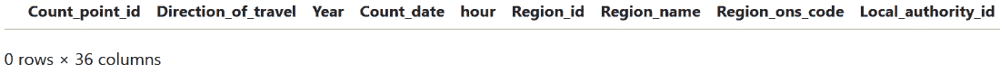

##### 图 9.10 看到总共有超过 100 辆自行车的重大道路上的交通数据

即使当我们只考虑总共 100 辆自行车时，似乎在主要道路上没有看到自行车交通，至少在我们使用的简化版数据中是这样。因此，在这个分析中，我们可能不会专注于建议改善主要道路上的自行车基础设施。然而，自行车交通的缺失本身可能是一个有趣的发现——我们可以与我们的利益相关者讨论，因为对自行车如何绕行主要道路的更深入调查可能对他们来说很有趣。

让我们将对自行车交通分布的调查添加到我们的分析图中，其最新版本如图 9.11 所示。

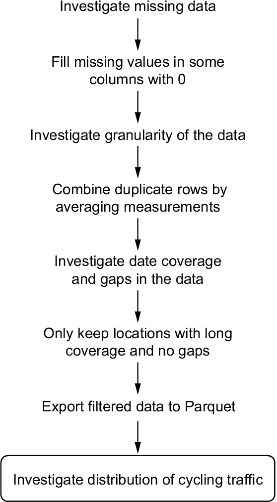

##### 图 9.11 到目前为止的分析，直到调查自行车交通的分布

专注于手头的资料，现在让我们开始根据它们的自行车交通模式查看感兴趣的位置，从数据首次捕获以来自行车量增加的位置开始。

#### 寻找包含上升趋势的时间序列

我们的第一步是定义我们所说的“上升”。我们是否希望看到某个地点的自行车年复一年持续增长才能符合条件？由于我们每年只有一天的数据，所以会有噪声，因此这个标准可能过于严格。让我们寻找最新测量值高于第一个值的地点。这是“自行车增加”的粗略代理，但我们可以将数据过滤到增长最大的地点。

为了实现这一点，我们需要分别对每个位置 ID 的行进行处理，确保它们按时间顺序排列，然后计算第一行和最后一行之间的差异。我们应该计算绝对变化和百分比变化以验证我们的结果。在计算百分比变化时，还需要考虑除以零的错误。以下代码计算了每个位置的第一行和最后一行之间的绝对变化和百分比变化，最终得到如图 9.12 所示的数据库：

```py
def cycling_diff(group):     #1
    return group.values[-1] - group.values[0]

def cycling_diff_pct(group):     #2
    if group.values[0] == 0:     #3
        return np.inf
    diff = group.values[-1] - group.values[0]
    return diff / group.values[0]

cycling_diffs = (
    cycling
    .sort_values(["Count_point_id", "Year"])
    .groupby("Count_point_id")
    .agg(     #4
        diff=("Pedal_cycles",cycling_diff),
        diff_pct=("Pedal_cycles",cycling_diff_pct)
    )
)

cycling_diffs
```

#1 定义一个函数来计算组中遇到的第一行和最后一行之间的差异

#2 定义一个函数来计算百分比变化

#3 考虑除以零的错误

#4 将这两个函数应用于每个位置 ID 组

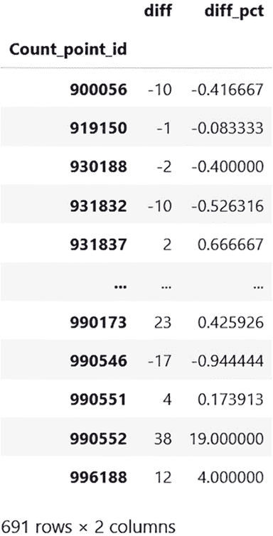

##### 图 9.12 每个位置自行车总数的绝对和百分比差异

在这里，我们有各种结果。当第一个测量日期没有自行车时，将会有无限大的值，以及随着时间的推移出现正负变化的情况。在进一步调查这个表格之前，验证我们的计算是一个好主意。让我们看看其中一个位置，看看原始数据是否支持我们计算的变化值。以下代码执行此操作，生成如图 9.13 所示的结果：

```py
cycling[cycling["Count_point_id"] == 900056]
```

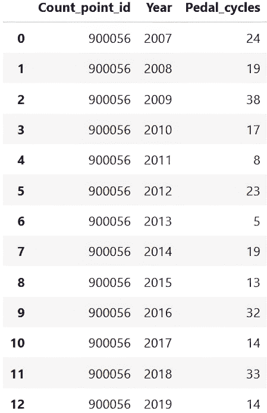

##### 图 9.13 位置 900056 的原始年度自行车数据

我们发现，在 2007 年，遇到了 24 辆自行车，而在 2019 年只有 14 辆，减少了 42%，如图 9.12 所示。我们可以检查更多示例，以使我们确信我们的计算是正确的。然后，我们可以查看一些百分比变化最大的自行车流量增加情况。以下代码执行此操作，并生成如图 9.14 所示的表格：


##### 图 9.14 自行车百分比变化最高的位置

```py
biggest_diffs = (
    cycling_diffs
    [np.isinf(cycling_diffs["diff_pct"]) == False]     #1
    .sort_values("diff_pct", ascending=False)
    .head(10)
)

biggest_diffs
```

#1 从考虑中移除无穷大值

警告  当遇到除以零的情况时，请确保您了解您选择的工具如何表示无穷大。在`pandas`中，我们使用`np.inf`，这是`numpy`库中的一个特定值。在排序时，它被认为大于所有其他整数，因此在这种情况下，我们确保在排序之前从考虑中移除这些行。

我们有一些有趣的情况需要调查。是时候绘制这些时间序列图，而不是依赖数值计算来确定有趣的模式了。以下代码生成了如图 9.15 所示的图表。为了清晰起见，我只包括了一些时间序列：

```py
fig, axis = plt.subplots(figsize=(10, 6))

biggest_diff_ids = biggest_diffs.index

ids_to_plot = [943399, 931883, 946565, 990552]

diffs_to_plot = (
    cycling
    .query("Count_point_id in @ids_to_plot")
)

markers = ["o", "s", "P", "^"]

for i, point_id in enumerate(diffs_to_plot["Count_point_id"].unique()):
    point_series = cycling[cycling["Count_point_id"] == point_id]
    (
        point_series
        .set_index("Year")
        ["Pedal_cycles"]
        .plot(ax=axis,
              label=point_id,
              marker=markers[i],
              alpha=0.8)
    )

axis.set(
    xlabel="Year",
    ylabel="Pedal cycles encountered",
    title="Cycling traffic for locations with the highest increase"
)

axis.legend()

plt.show()
```

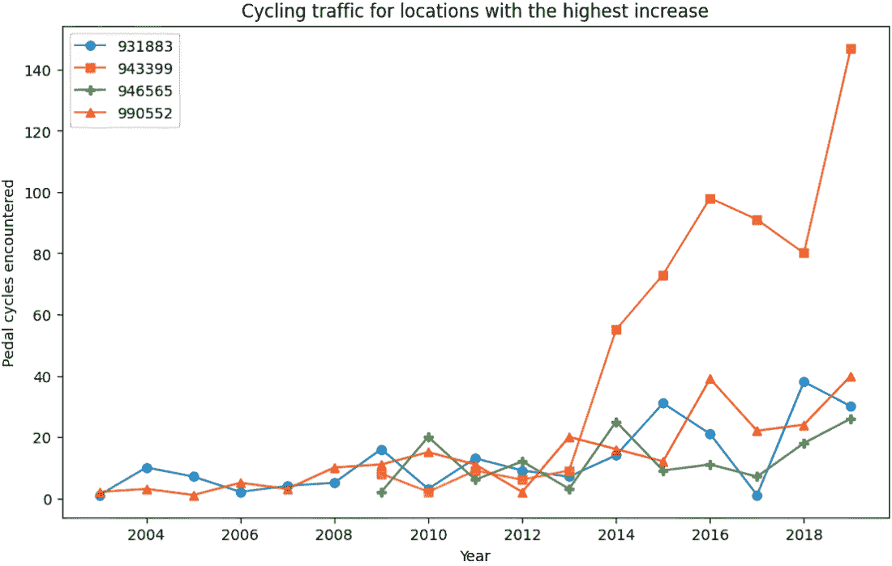

##### 图 9.15 自行车流量增加最多的几个位置

这表明在各个地点确实有自行车交通量的真实增长。然而，我们应该从不同的角度来审视这个问题，因为我们的数据性质——每年只在某一天计数车辆的事实——意味着所有数值都存在偏差。可能有特殊事件，如道路关闭、公共假日，或者只是工作日之间的不同模式，这些都可以解释这些增长。让我们将这一最新步骤添加到我们不断增长的分析图中，如图 9.16 所示。

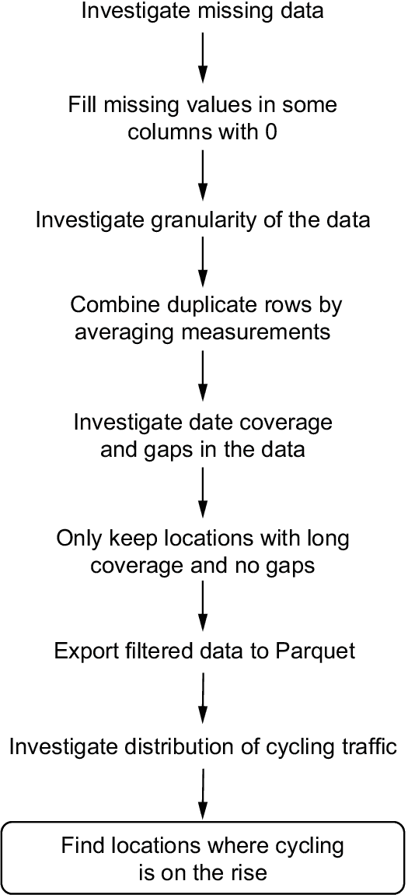

##### 图 9.16 显示了分析过程，包括最新步骤，即寻找自行车交通量上升的地点

另一个我们可以考虑的角度是寻找自行车在总体交通中占较大比例的地点。

#### 识别具有特定特征的时间序列

让我们看看如何计算自行车在总体交通中的百分比。我们一直在使用`Pedal_cycles`列来计数骑自行车的人，以及`All_motor_vehicles`来计数所有交通。然而，“机动车”这个短语暗示可能自行车不包括在内。在计算任何东西之前，我们需要验证这一点。表 8.1 中的数据字典没有回答这个问题，因为它只是说该列测量“所有机动车的计数。”幸运的是，PDF 版本包含了更多信息。第 10 页包含一个名为“车辆类型”的部分，其中包含以下内容：“所有机动车：除自行车外的所有车辆。”图 9.17 显示了文档的相关部分。

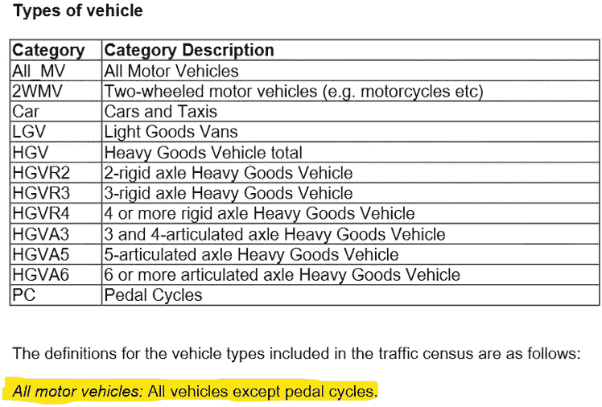

##### 图 9.17 显示数据字典中关于“所有机动车”含义的部分的截图

如预期的那样，为了得到包括自行车在内的总车辆数，我们需要将这些列相加。我们还想对近期观察结果进行加权，因此我们只取每个位置点的最后日期。在某些情况下，这可能是在几年前，但至少会给我们提供最新的数据。以下代码中的步骤如下：

1.  将交通数据过滤到每个位置 ID 的*最后观察日期*。

1.  通过将相关列相加来*计算总交通量*。

1.  按位置 ID*分组数据*以减少粒度，使每个位置只有一行。

1.  将总交通列和自行车列的数值*求和*。

1.  为每个位置*计算自行车百分比*。

接下来是用于此目的的 Python 代码，以及结果数据集的快照，如图 9.18 所示：

```py
annual_bike_traffic = (
    traffic
    [traffic['Count_date']
 == traffic.groupby('Count_point_id')['Count_date'].transform('max')]
    .assign(
        all_traffic=lambda x: x["Pedal_cycles"] + x["All_motor_vehicles"]
    )
    .groupby(["Count_point_id", "Year"])
    [["Pedal_cycles", "all_traffic"]]
    .sum()
    .assign(
        pct_cycles = lambda x: x["Pedal_cycles"] / x["all_traffic"]
    )
    .sort_values("pct_cycles", ascending=False)
)

annual_bike_traffic.head()
```

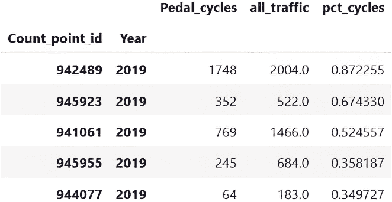

##### 图 9.18 显示了每个位置的绝对值和百分比总交通量和自行车交通量

图 9.18 显示了每个地点的 ID、我们拥有的最新数据年份以及交通计算，包括归因于骑行的交通百分比。我们已经开始注意到一些骑行交通百分比高的地点。让我们更详细地研究其中的一个例子。我们将放大图 9.18 中的第一行并确定其位置。输出显示在图 9.19 中。

```py
(
  traffic[(traffic["Count_point_id"] == 942489)
↪  & (traffic["Year"] == 2019)]
  .head(1)
  .transpose()
)
```

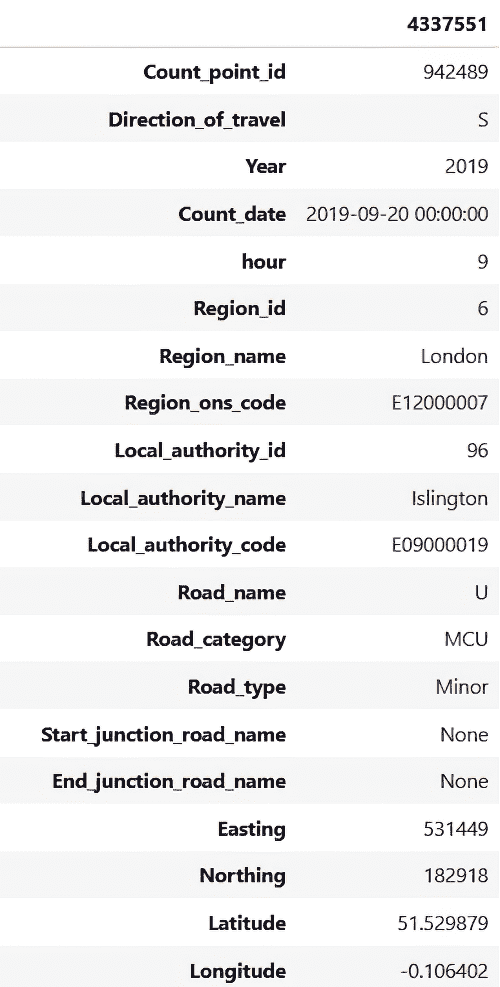

##### 图 9.19 骑行交通百分比高的特定地点

如果我们在地图上查看这个点，我们会找到与图 9.7 中看到相同的地点。这实际上是位于伦敦北部的伊兹灵顿的同一条郊区街道，其绝对骑行交通量最高。看到从不同角度验证的相同结果是有用的。

注意：花一分钟时间查看图 9.6 中产生的表格中出现的其他一些骑行交通量高的地点。你注意到任何模式吗？

观察一些这些地点，我们发现它们似乎都是小型的郊区街道，可能被用作通勤捷径。图 9.20 显示了到目前为止的过程，突出了我们正在进行一些并行调查，结果将在最后汇总。

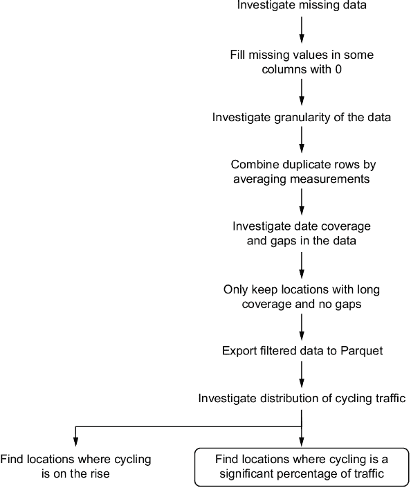

##### 图 9.20 分析的当前状态

在思考这些热门地点的过程中，通勤路径似乎是一个值得进一步探索的有用途径，因此让我们将焦点转移到那里。

#### 在时间序列中识别时间模式

为了调查通勤模式，我们将做两件事：

+   查看每个地点骑行最繁忙的时间。换句话说，人们一天中什么时候骑行最多？

+   一旦我们理解了这一点，我们将确定在通勤高峰时段骑行交通量最高的地点。

第一项要求我们计算每小时平均的骑行交通量。我们可以决定是否将结果平均到所有年份的数据中，或者只关注最新的数据。这两种方法都有其优缺点。在整个数据上平均可能会否定人们通勤方式在 10-20 年内可能发生的变化。仅使用最近的数据意味着我们放大了那一年可能发生的任何特定偏差（例如，原本不存在的道路封闭）。我们仍然希望偏向近期，因此我们将选择后者。一个更复杂的方法可能是对时间进行加权平均，将最近的数据赋予更高的权重。

这个特定的计算过程看起来是什么样子？我们将执行以下步骤：

1.  *将骑行数据过滤到每个地点最近的一年*—这将给我们一个关于骑行模式的最新视角。

1.  *计算每天每小时发生的自行车交通量的百分比—*使用百分比意味着无论位置的热门程度如何，结果都是可比较的。

1.  *通过小时可视化这些百分比值的分布—*使用我们的“从结果开始”方法，我们想象最终的可视化。在这种情况下，它将是一系列箱线图，每个代表一天中的某个小时，而单独的点代表该小时某个位置的自行车交通量的百分比。

从技术角度来看，这里的难点在于第一步。我们需要同时计算每个位置的交通总量，并比较每小时值与每日总量的值。这要求我们同时拥有每小时和每日的值。如果您是 SQL 用户，这将通过使用带有`PARTITION BY`关键字的`窗口函数`来实现。在`pandas`中，我们需要做一些稍微不同的事情，实际上，我们可以求助于我们最喜欢的 LLM。

我询问 ChatGPT 如何实现这一点，它的第一个结果建议分别计算每小时和每日的总数，然后通过位置 ID 将两个表连接起来。这是一个非常好的方法，但我特别询问了使用类似窗口函数的方法。图 9.21 显示了我在引导 ChatGPT 到达我想要的结果的部分对话。

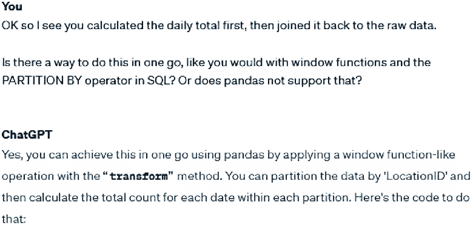

##### 图 9.21：关于`pandas`中窗口函数与 ChatGPT 对话的片段

因此，我们可以使用`transform`方法来实现所需的结果，即在原始数据旁边创建一个列，以捕捉每个位置 ID 的每日自行车交通总量。让我们首先过滤我们的交通数据，仅包括每个位置的最近日期：

```py
traffic_max_dates = (
    traffic[
        traffic['Count_date']
        == traffic.groupby('Count_point_id')['Count_date'].transform('max')
    ]
    .copy()
)
```

现在，我们将`traffic_max_dates` DataFrame 聚合为每小时的每位置一行。以下代码执行此操作，并在图 9.22 中产生输出：

```py
cycling_daily_hourly = (
    traffic_max_dates.groupby(
        ["Count_point_id", "Count_date", "hour"]
    )
    ["Pedal_cycles"]
    .sum()
    .reset_index()
)

cycling_daily_hourly.head()
```

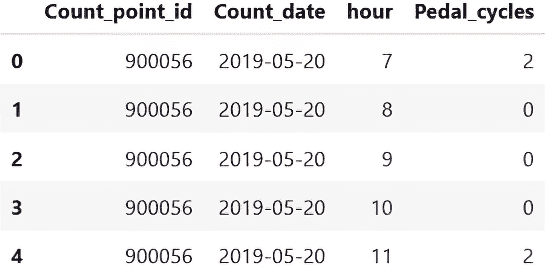

##### 图 9.22：仅针对每个位置的最新日期的每小时自行车交通量

现在，我们需要创建一个列来测量与这些数据并行的总自行车交通量，以便能够计算每个位置每天每个小时的自行车交通量的百分比。这就是我们使用 ChatGPT 向我们展示的技巧的地方。以下代码添加了这个列并计算了每小时的交通百分比，结果如图 9.23 所示：

```py
cycling_daily_hourly['TotalDailyCount'] = (
    cycling_daily_hourly
    .groupby(['Count_point_id', 'Count_date'])
    ['Pedal_cycles']
    .transform('sum')     #1
)

cycling_daily_hourly['hourly_pct'] = (
    cycling_daily_hourly['Pedal_cycles']
    / cycling_daily_hourly['TotalDailyCount']
)

cycling_daily_hourly
```

#1 Transform 计算每个位置 ID 的交通总量，因此我们可以将其作为额外列添加，而无需额外的连接。

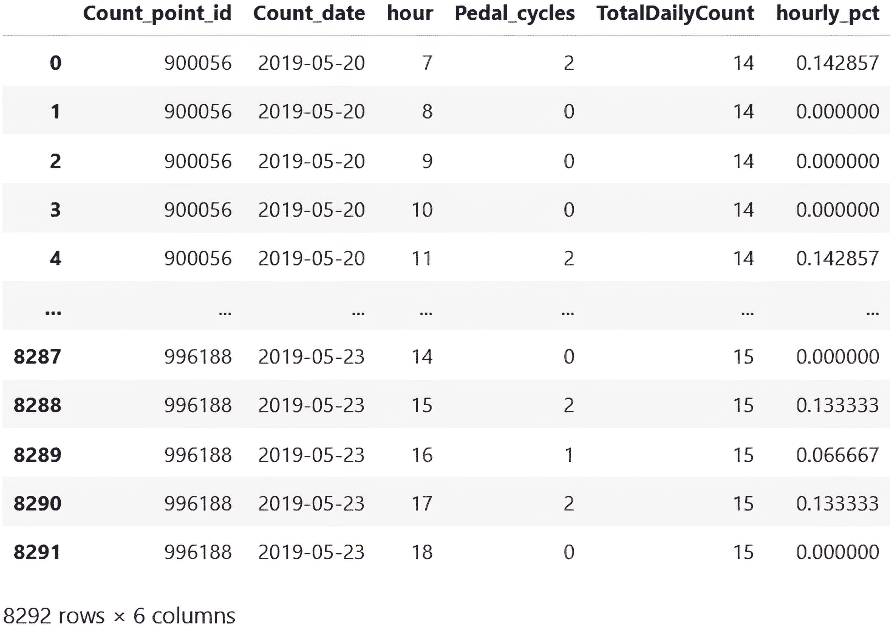

##### 图 9.23：附加了额外百分比计算的每小时数据

这是一个我们需要在继续之前验证那些每日计数和百分比值的例子。让我们先看看第一个例子，位置 900056。首先，我们从原始数据中计算该位置的最新日期，以确保我们有正确的数据：

```py
traffic_max_dates.loc[
↪ traffic_max_dates["Count_point_id"] == 900056, "Count_date"].max()
```

输出结果是`2019-05-20`，这与图 9.23 中的表格相符。现在，我们想查看该位置 ID 和日期的所有原始数据，以查看总自行车计数是否真的是 14，因此百分比是否也是正确的。以下代码找到了原始数据，如图 9.24 所示：

```py
(
    cycling_daily_hourly
    [
        (cycling_daily_hourly["Count_point_id"] == 900056)
        & (cycling_daily_hourly["Count_date"] == "2019-05-20")
    ]
)
```

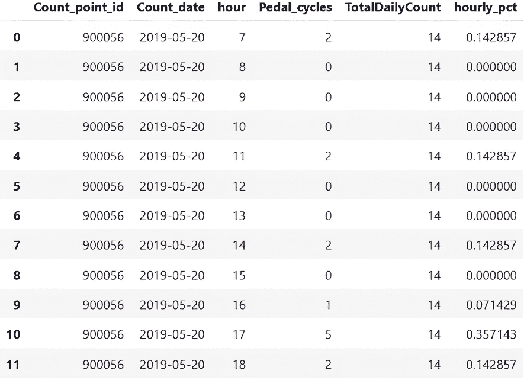

##### 图 9.24 用于验证每小时自行车交通百分比计算的原始数据

从这些原始数据中，我们可以注意到将`Pedal_cycles`列相加的总数与总数相符，而`hourly_pct`列中的百分比也是正确的。总结一下，我们发现在这个地点，大约三分之一的自行车交通出现在下午 5 点到 6 点之间，其余的则分散在一天中的其他时间。我们可以使用这些数据覆盖所有位置 ID，以确定在一天中的不同时段内，我们想象中的箱线图中看到的自行车交通流量的百分比。以下代码创建了图 9.25 所示的箱线图：

```py
fig, axis = plt.subplots()

cycling_daily_hourly.boxplot(
    column="hourly_pct",
    by="hour",
    ax=axis)

axis.set(
    xlabel="Hour",
    ylabel= "% of cycling traffic in an hour",
    title="What times of the day does most cycling traffic occur?"
)
plt.suptitle(None)

plt.show()
```

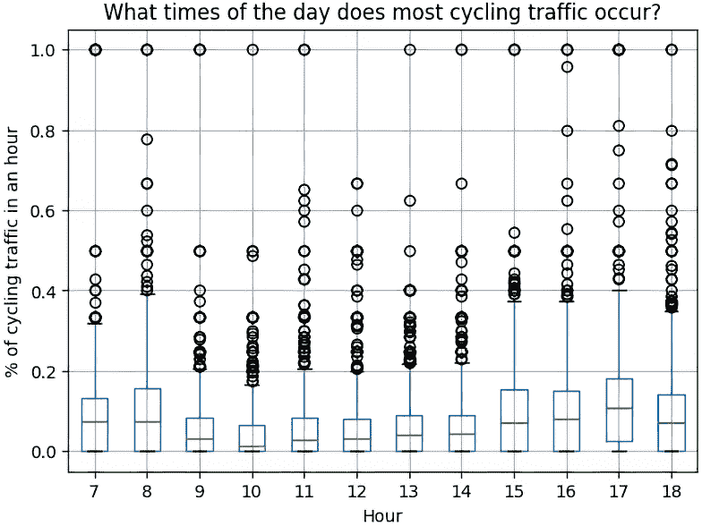

##### 图 9.25 箱线图显示一天中自行车交通的分布情况

这些箱线图中有很多噪声和异常值，但如果我们关注中位数线，即箱子的中间，我们会注意到交通量在下午 5 点附近有所上升，以及上午 8 点的峰值随后急剧下降。这告诉我们数据中存在通勤模式，因为上午 8 点到 9 点以及下午 5 点到 6 点之间的自行车交通量百分比更高。下午 3 点到 6 点之间中位数之间的接近性也表明，尽管人们通常在相同的时间通勤去工作，但人们通勤下班的时间差异更大。

拥有了这些知识，我们现在可以找到通勤时段中自行车交通流量最高的地点。我们可以将这些地点视为“通勤热点”——在这些区域，自行车交通流量中有很大一部分是由通勤引起的。我们已经有按小时汇总的数据，如图 9.23 所示，因此我们可以从中找到每个自行车地点的最高自行车交通流量时段。有几个边缘情况需要首先做出决策：

+   如果所有自行车交通量都是零会发生什么？我们可能需要输出一个缺失值来表示这个特定操作对该位置没有意义。

+   如果有多个小时的自行车交通量相同，我们可以选择第一个或最后一个遇到最大值的小时，或者以某种方式平均结果。平均一天中的两个不同小时似乎没有意义，因此我们将决定使用遇到最大值的第一个小时。也就是说，如果最高的自行车交通量出现在上午 8 点和下午 1 点，我们将输出上午 8 点。

以下代码定义了一个函数来计算给定组的最高小时，即单个地点 ID，然后使用它创建一个包含每个地点 ID 在最后记录的测量年中自行车交通最高的小时的数据集。这个聚合数据的快照如图 9.26 所示：

```py
def get_highest_hour(rows):
    if rows["Pedal_cycles"].min() == rows["Pedal_cycles"].max():
        return np.nan

    return (
        rows
        .sort_values(by=["Pedal_cycles", "hour"], ascending=[False, True])
        .head(1)
        ["hour"]
        .values[0]
    )

highest_hours = (
    cycling_daily_hourly
    .groupby("Count_point_id")
    .apply(get_highest_hour)
)

highest_hours.head()
```

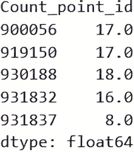

##### 图 9.26 每个地点 ID 的自行车交通最高小时

我们可能会发现一些缺失值的情况，其中最低和最高的自行车交通量相同，包括整个周期都是零的情况。然而，在图 9.26 中，我们看到实际最高小时被输出的例子。我们需要考虑的一个场景是，当最高自行车交通量发生在多个小时时，我们需要解决平局的情况。以下代码检索了这样一个示例的原始数据，如图 9.27 所示：

```py
cycling_daily_hourly[cycling_daily_hourly["Count_point_id"] == 941463]
```

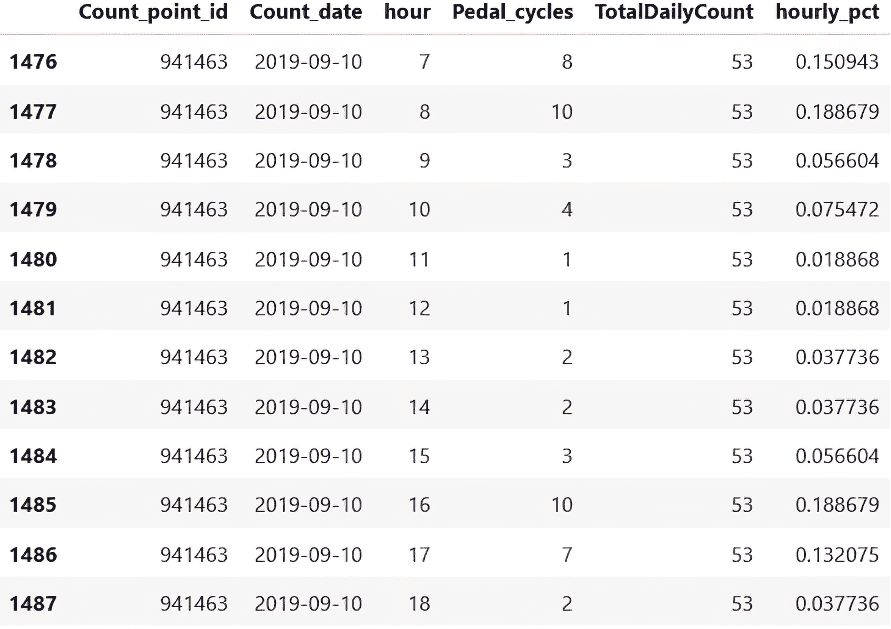

##### 图 9.27 展示了地点 941463 的小时数据，其中 8 点和 16 点的小时值都有最高的自行车交通量

因为在我们的函数内部，我们是按照自行车交通量的升序以及小时的升序来排序数据的，并且返回了遇到最高交通量的最早实例。我们可能选择明确地处理这个问题，或者接受在计算哪个小时是某个地点最繁忙时可能存在对早期时间的轻微偏差。在这个例子中，我们将选择后者，因为发生平局的可能性不太常见。

如果我们观察最繁忙时段的分布，我们就能看到大多数地方自行车交通高峰出现在什么时间。以下代码创建了图 9.28 所示的直方图：

```py
fig, axis = plt.subplots()

highest_hours.hist(bins=20, ax=axis)

axis.set(
    xlabel="Hour of peak cycling traffic",
    ylabel="Frequency",
    title="Distribution of peak cycling traffic hours across locations"
)

plt.show()
```

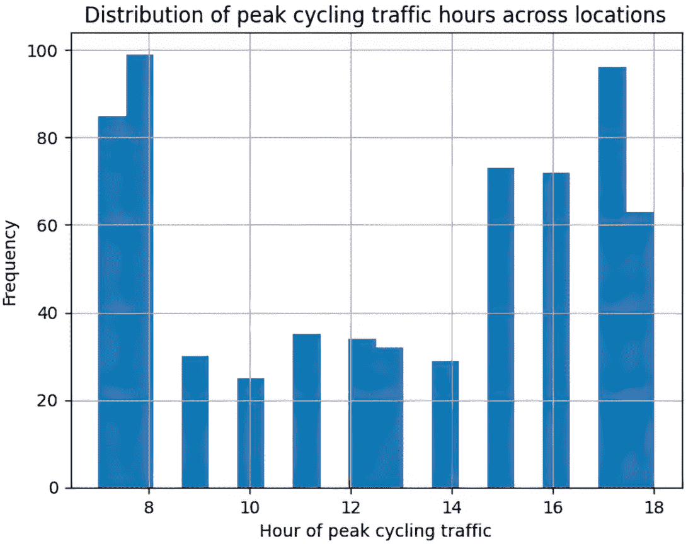

##### 图 9.28 各地点自行车高峰时段的分布

这个图表加强了这样一个观点：大多数地点的自行车交通高峰发生在通勤时段。让我们总结一下到目前为止关于自行车模式学到的东西：

+   自行车趋势存在变化，但最重要的是，随着时间的推移，有多个地点的自行车交通量有所增加。

+   在自行车交通的百分比上也有变化，但关键的是，有一些地方自行车交通是主要交通方式。

+   人们骑自行车的时间也有变化，但有一些地方的自行车交通通勤模式。

+   在此基础上，还有一些地方的通勤时段是自行车交通最繁忙的时段。

这些标准中的每一个都可以用来找到与自行车相关的兴趣点。我们如何决定哪个标准是有意义的？

注意：如果你对“决定什么最好”是主要目标的例子感兴趣，请参阅第四章，该章节全部关于选择正确的指标。

我们需要使用领域知识并与利益相关者交谈，以获得对这个问题的真正理解，但到目前为止，似乎没有不使用所有这些标准的良好理由。因为我们试图将我们的地点过滤到最感兴趣的几个，所以让我们尝试找到符合所有这些标准的地点，特别是，

+   骑自行车交通百分比高的地点，即至少 X%，其中我们必须定义 X

+   骑自行车交通有所增加的地点，即至少增加 Y%，其中我们必须定义 Y

+   骑自行车用于通勤的地点，即高峰骑自行车交通是在早上 8 点到 9 点或下午 5 点到 6 点之间

如果应用所有这些标准导致结果过少，我们总是可以通过寻找下午 4 点到 7 点之间的通勤时间来扩大范围，例如。在我们将结果组合起来寻找感兴趣的骑自行车地点之前，让我们回顾一下这个过程。图 9.29 显示了分析的最新状态。

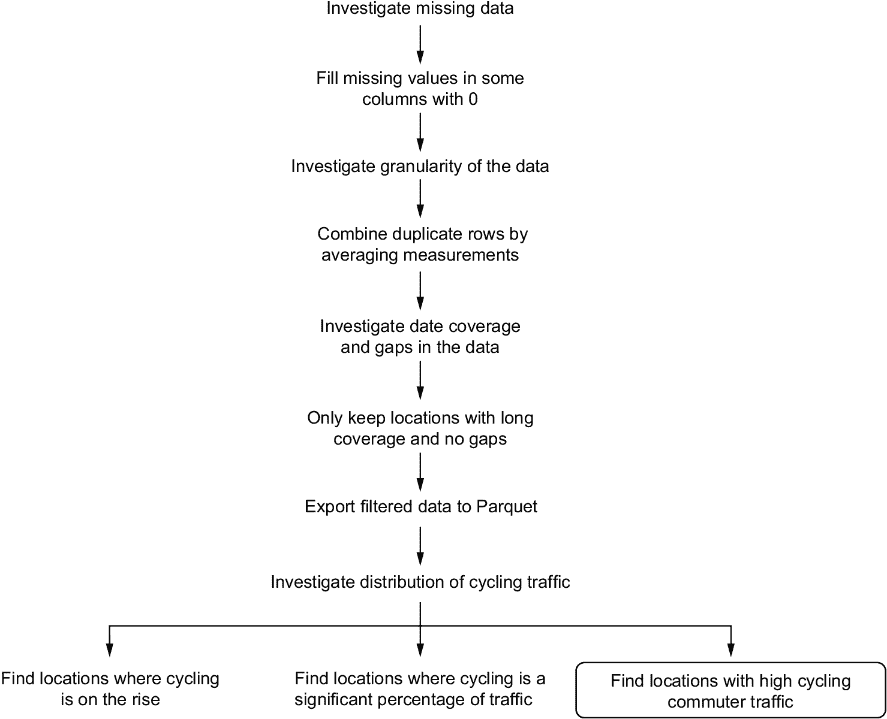

##### 图 9.29 在我们将结果组合成最终建议之前的分析过程

让我们应用我们确定将用于选择地点的不同标准，看看我们是否能找到什么。

#### 结合标准以识别感兴趣的时序

要找到符合多个标准的地点，我们可以执行一个包含多个过滤器的单一、大型查询，或者为每个标准创建过滤版本并在最后将它们组合起来。我们更倾向于后者，因为它允许我们单独调查每个子集。如果我们什么都没有找到，想要调查哪个标准过于严格导致没有结果，这可能是有用的。

让我们先过滤地点，只保留那些有相当比例的交通是骑自行车的。我们如何知道使用什么百分比作为截止点？我们实际上还没有查看这个百分比的分布，所以我们将从这里开始，生成的直方图将显示数据的大多数所在位置。以下代码创建了图 9.30 中的直方图，我们将用它来做这个决定。我们将使用我们已创建的 DataFrame，我们称之为`annual_bike_traffic`，它包含最新年份中分配给骑自行车的交通百分比：

```py
fig, axis = plt.subplots()

annual_bike_traffic["pct_cycles"].hist(bins=10, ax=axis)

axis.set(
    xlabel="Percentage of traffic that is cycling",
    ylabel="Frequency",
    title="Distribution of cycling traffic percentages"
)

plt.show()
```

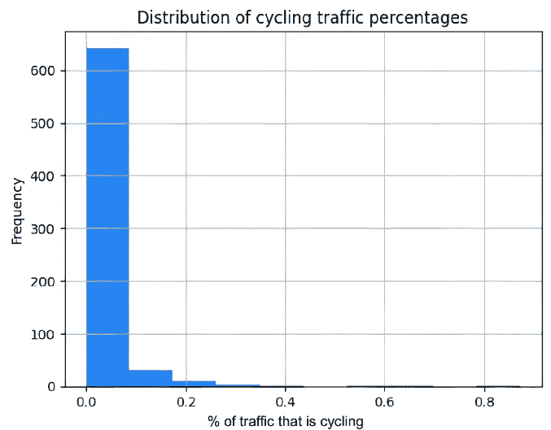

##### 图 9.30 每个地点因骑自行车而产生的交通百分比分布

这个直方图显示，大多数地点的交通中骑自行车的比例不到 10%。这感觉像是一个很好的截止点来区分有显著骑自行车交通的区域。以下代码实现了这个过滤器并创建了一个过滤后的地点 ID 列表，其中一部分在图 9.31 中显示：

```py
BIKE_PERCENTAGE_CUTOFF = 0.1

highest_cycling = (
    annual_bike_traffic
    [annual_bike_traffic["pct_cycles"] >= BIKE_PERCENTAGE_CUTOFF]
    .reset_index()
    ["Count_point_id"]
    .to_list()
)

print(len(highest_cycling))

highest_cycling[:10]
```

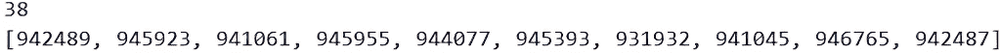

##### 图 9.31 有显著骑自行车交通的地点 ID

这表明有 38 个位置至少有 10%的交通是由于骑自行车造成的。现在，我们想要创建一个类似的位置列表，但这次是那些在第一个和最后一个测量日期之间至少有 Y%自行车增长的位置。Y 的值将有些任意，如果我们想返回更多位置，我们可能会决定调整它。我们将从 50%开始，看看能得到什么。以下代码创建了这个过滤后的列表，它产生了一个类似于图 9.31 所示的数字列表。同样，我们已经从之前的 DataFrame `cycling_diffs`中计算出了底层值：

```py
DIFF_CUTOFF = 0.5

biggest_increases = (
    cycling_diffs
    [(cycling_diffs["diff_pct"] >= DIFF_CUTOFF)
     & (np.isinf(cycling_diffs["diff_pct"]) == False)]     #1
    .index
    .to_list()
)

print(len(biggest_increases))

print(biggest_increases[:10])
```

#1 我们需要排除无穷大值，以免它们出现在计算中。

这段代码的结果告诉我们有 230 个这样的位置。最后，我们将创建第三个位置列表，这将是在最高上下班时间要么是上午 8 点到 9 点，要么是下午 5 点到 6 点的位置。以下代码使用之前创建的`highest_hours` DataFrame 来完成这项工作：

```py
highest_commuting = (
    highest_hours
    .loc[lambda x: x.isin([8, 17])]
    .index
    .to_list()
)

print(len(highest_commuting))

print(highest_commuting[:10])
```

输出是一个包含 195 个位置的列表。我们现在有三个位置列表需要合并。我们想知道哪些位置 ID 出现在所有三个列表中。在 Python 中，我们可以通过集合理论非常容易地做到这一点。在这种情况下，一个*集合*是包含唯一元素的特定数学概念。

提示：如果您是 Python 用户，每当您遇到唯一值问题时，考虑是否使用集合是合适的。它们通常是快速简单获得复杂结果的方法，例如找到出现在两个或更多集合中的值。

通过将我们的列表转换为集合，我们可以计算集合的*交集*，即同时出现在两个集合中的元素。您可以将其视为找到三个圆的维恩图中心，如图 9.32 所示。

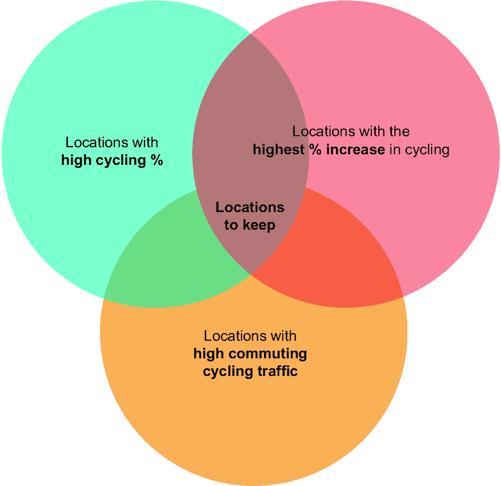

##### 图 9.32 使用集合理论识别具有多个标准的位置的说明

以下代码将我们的列表转换为集合，并执行所有三个集合的交集，以发现是否有任何重叠。结果如图 9.33 所示：

```py
top_cycling_locations = (
    set(highest_cycling)     #1
    .intersection(set(biggest_increases))     #2
    .intersection(set(highest_commuting))     #3
)

print(len(top_cycling_locations))

print(top_cycling_locations)
```

#1 将第一个列表转换为集合

#2 在两个集合之间找到交集

#3 在这个结果和第三个集合之间找到交集

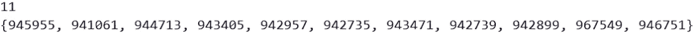

##### 图 9.33 最终感兴趣的位置列表

看起来我们的标准并不太严格，我们有一些结果——确切地说，是 11 个。这些位置都有由于骑自行车造成的显著百分比交通，自行车数量在时间上至少增加了 50%，并且在上下班高峰时段有峰值。是时候深入研究这些结果并了解它们与哪些位置相关了。让我们在原始交通数据中查找这些位置 ID，提取仅位置信息，并将每个位置限制为单行。我们还将按地区和地方当局对结果进行排序，以便更好地看到这些顶级位置在地理上的分布。以下代码执行所有这些操作，并产生了图 9.34 中的表格：

```py
LOCATION_COLUMNS = ['Count_point_id', 'Region_name',
                    'Region_ons_code', 'Local_authority_id',
                    'Local_authority_name', 'Local_authority_code',
                    'Road_name', 'Road_category', 'Road_type']

(
    traffic[traffic["Count_point_id"].isin(top_cycling_locations)]
    .drop_duplicates(subset=["Count_point_id"])
    [LOCATION_COLUMNS]
    .sort_values(["Region_name", "Local_authority_name"])
)
```

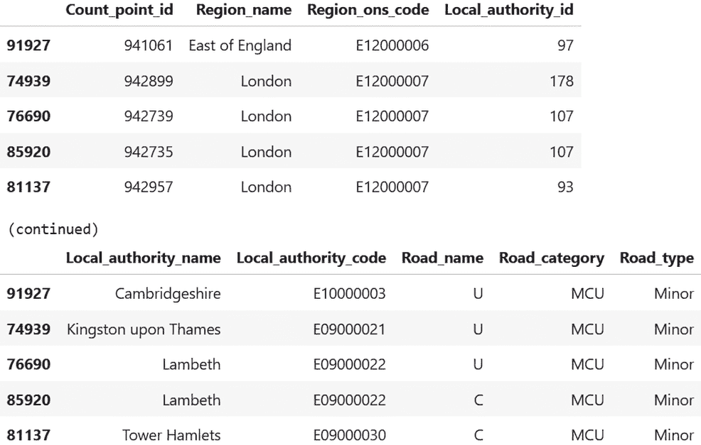

##### 图 9.34 顶级自行车地点信息

这些地点遍布全国。不出所料，伦敦有很多，但结果从西南部的布里斯托尔一直延伸到苏格兰北部的爱丁堡。一旦我们逐一验证这些地点，确保它们都不是数据中的伪象，我们就可以向我们的利益相关者展示我们的初步发现。然而，在我们总结我们的发现之前，让我们先了解一下预测，因为这是时间序列数据可以发挥强大作用的方式之一。

#### 时间序列预测

我们有足够的资料向利益相关者展示并开始考虑进一步的工作，但鉴于这是一个时间序列问题，我们应该考虑我们如何根据可用数据预测自行车趋势。这将帮助我们确定我们预计自行车将很快显著增加的地点，以及开辟其他机会，例如主动交通管理。

要成功预测一个时间序列，我们通常需要它遵循一些属性：

+   *时间序列应保持一致的时间间隔。* 我们已经通过创建年度时间序列并移除特定的日期成分来实现这一点，因为每年的测量通常不在同一天进行。

+   *时间序列应无间断。* 我们已经过滤了我们的时间序列，以确保这一点。

+   *数据应尽可能包含尽可能多的完整周期。* 在年度数据的情况下，我们不一定有周期，所以在这种情况下，这意味着我们拥有的数据越多，越好。

+   *还有一些其他属性，例如平稳性，某些模型要求时间序列展示出来。* 虽然这不是详尽的，因为其他模型可以自动处理这一点。

为了检验我们的时间序列是否可以成功预测，让我们更详细地考察其中之一。让我们选择一个表现出趋势的时间序列，即我们“最大增长”列表中具有最大可能覆盖范围的时间序列。以下代码计算了这些时间序列的覆盖范围，并生成了图 9.35 中的表格，我们将从中选择我们的样本：

```py
(
    traffic
    .query("Count_point_id in @biggest_increases")
    .groupby("Count_point_id")
    ["Year"]
    .agg(["min", "max"])
    .assign(diff=lambda df_: df_["max"] - df_["min"])
    .sort_values("diff", ascending=False)
    .head()
)
```

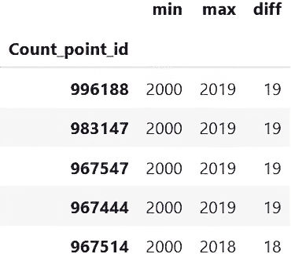

##### 图 9.35 自行车增长最大的地点及其覆盖范围计算

这些地点中有些有长达 19 年的数据，我们将从中选择一个进行调查研究。我们将随意使用该列表中的第一个地点来测试我们预测这些地点级时间序列的能力。以下代码为该地点提取原始数据，并为我们创建了一个单一年度自行车量的时间序列。该时间序列如图 9.36 所示：

```py
cycling_ts = (
    traffic[traffic["Count_point_id"] == 996188]
    .groupby("Year")
    ["Pedal_cycles"]
    .sum()
)

cycling_ts
```

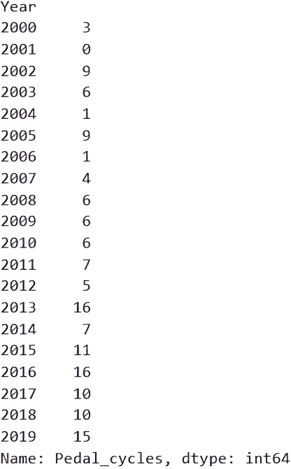

##### 图 9.36 地点 996188 的自行车时间序列

需要注意的一个 Python 特定方面是，序列的索引是一个整数，而为了使时间序列操作更容易，它应该是一个日期。以下代码解决了这个问题，并允许我们绘制时间序列，如图 9.37 所示：

```py
cycling_ts.index = pd.to_datetime(cycling_ts.index, format='%Y')

fig, axis = plt.subplots()

cycling_ts.plot(ax=axis)

axis.set(
    xlabel="Time",
    ylabel="Number of bicycles observed",
    title="Cycling traffic over time at location 996188"
)

plt.show()
```

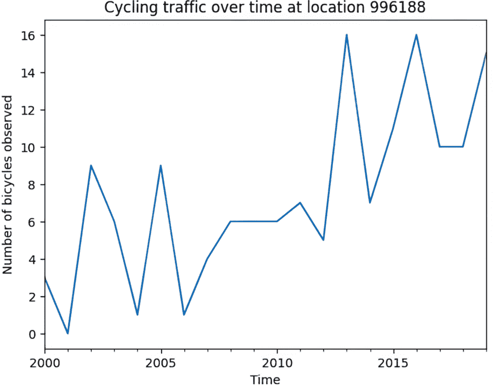

##### 图 9.37 特定位置的骑行交通时间序列

我们有一组 19 年的年度值时间序列，呈现上升趋势。我们经常想要查看时间序列是否存在季节性，即沿时间序列在相同点重复出现的模式，但在年度值的背景下这不太有意义。

为了理解时间序列的各个组成部分，我们可以将序列分解为趋势、季节和残差成分。趋势告诉我们平均值是否有长期变化，也就是说，值是否向特定方向移动。季节性是依赖于我们在时间序列中的位置的定期运动。残差是在考虑了趋势和季节性之后剩下的部分。意外的高残差意味着在这一点上时间序列有某些异常，这不能仅由其基本趋势和季节性模式来解释。

在 Python 中，`statsmodels`模块有各种时间序列方法，包括分解，我们将将其应用于我们的时间序列。我们将实现 STL（使用 LOESS 进行季节和趋势分解[局部估计散点图平滑]），并尝试提取时间序列的趋势、季节和残差成分。在许多这些方法中，我们需要选择一些将改变结果的参数值。在 STL 的情况下，我们需要选择周期、对趋势应用多少平滑以及构成季节的观测数。

在我们的案例中，我们拥有没有明显、规律季节性模式的年度数据。由于年度时间序列是这些方法中的一些特殊案例，我们可以求助于我们的 AI 工具以获得进一步指导。我们使用的库的文档也可能包含有关如何选择参数值的提示。在这种情况下，我要求 ChatGPT 就选择一个没有真实季节性的年度时间序列的这些值提供建议。其部分响应如图 9.38 所示。

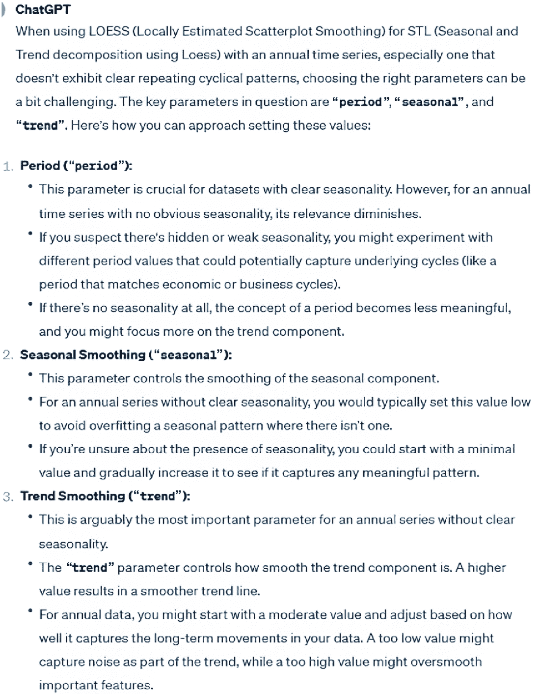

##### 图 9.38 ChatGPT 关于 STL 分解方法参数的响应

这个答案建议，在没有明显季节性的情况下，选择参数值将取决于最适合问题的方案。它建议季节性参数选择一个低值，并在可能的情况下优先考虑默认值。我们将周期设置为`2`，季节性设置为`3`，并检查输出。代码如下，并生成如图 9.39 所示的分解图：

```py
from statsmodels.tsa.seasonal import STL

stl = STL(cycling_ts, period=2, seasonal=3)
result = stl.fit()

result.plot();
```

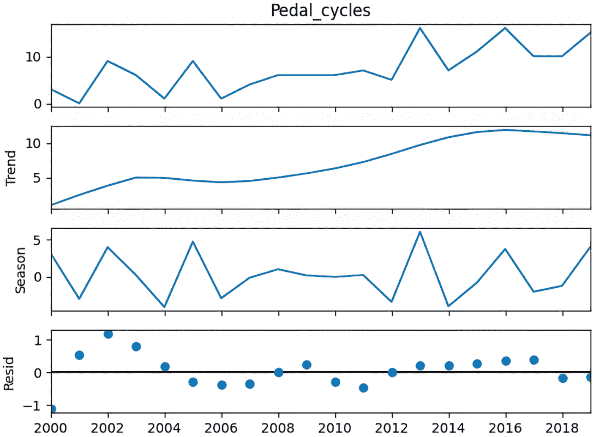

##### 图 9.39 单个时间序列的季节分解

这个图示从上到下展示了原始数据、趋势成分、季节性模式和残差。在趋势成分中，我们发现时间序列的一个平滑版本，看起来整体呈稳步上升，可能到结尾时趋于平稳。因为我们设置了较低的平滑值，季节性成分模仿了原始数据中的峰值。这是为了强化这样一个观点：可能不存在重复的季节性变化，但有明显的峰值需要调查。残差在开始时较大，之后似乎始终围绕零值中心。我们在 2002 年左右遇到的峰值，如果我们仅仅使用趋势和季节性变化来建模这个序列，将会是出乎意料的，这告诉我们存在外部因素使得这个序列的开始部分更难以预测。

总的来说，我们了解到时间序列似乎大部分是可以预测的，除了可能在 2002 年左右。我们的下一步是构建一个预测模型。如果我们有领域专业知识，我们可以调查 2002 年左右残差较高的可能原因，并将这些原因作为额外的变量构建进去。目前，我们将使用标准的预测方法 ARIMA 来预测未来几年的自行车交通流量。

自回归积分移动平均，或 ARIMA，是另一种需要用户选择某些参数的方法。理想情况下，这是基于哪种参数组合产生最准确模型而自动完成的。如果你是 R 用户，你可能已经使用过 R 的`auto.arima`方法。在 Python 中也有等效的方法，例如`pmdarima`模块中的方法，我们在这里将使用它。以下代码在可用数据上计算最佳 ARIMA 模型，然后将其预测值与观察值进行对比绘图。该图示在图 9.40 中展示：

```py
import pmdarima as pm

model = pm.auto_arima(cycling_ts, seasonal=False)     #1

training_predictions = model.predict_in_sample()     #2
forecast = model.predict(3)     #3

predictions = pd.concat(     #4
    [training_predictions,
     forecast]
)

fig, axis = plt.subplots()

axis.plot(cycling_ts, label="Observed")
axis.plot(predictions,
          label="Predicted",
          marker="^",
          color="orange",
          alpha=0.8)

axis.set(
    xlabel="Time",
    ylabel="Number of bicycles observed",
    title="Actual vs. predicted cycling traffic"
)

axis.legend()

plt.show()
```

#1 自动找到最佳的 ARIMA 模型

#2 在训练数据上计算预测值

#3 预测三个时间点的前瞻值

#4 将预测值和预测值合并为单一时间序列进行绘图

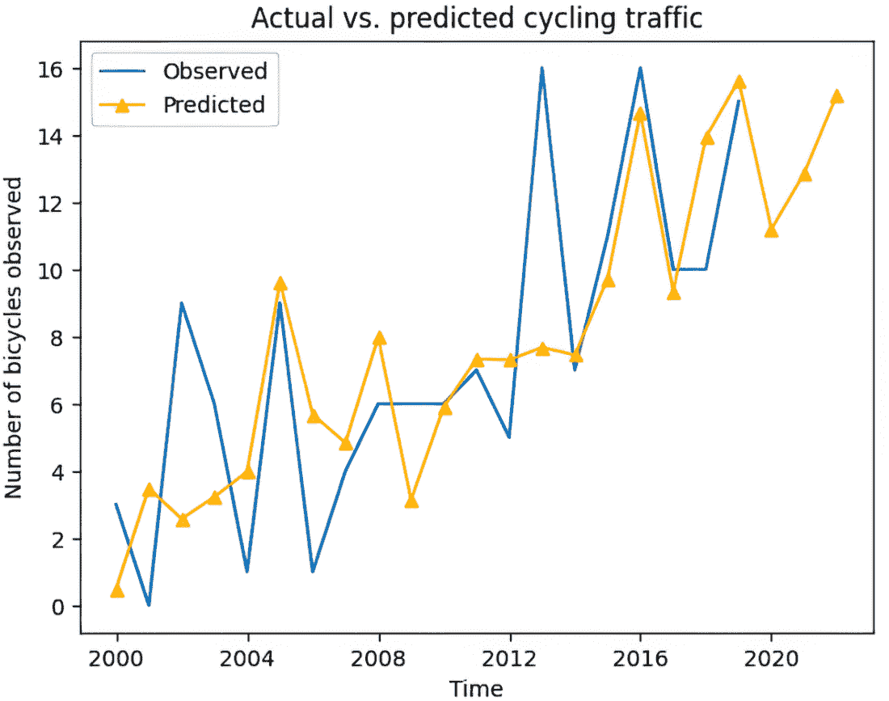

##### 图 9.40 某特定位置时间序列的实际值与预测值对比

这个图示告诉我们什么？

+   ARIMA 模型错过了一些峰值并试图纠正它们，这在 2002 年左右尤为明显。

+   由于 ARIMA 模型具有一定的自我纠正能力，它试图匹配观察到的数据的形状。

+   2008 年至 2012 年之间的意外平稳线也令 ARIMA 模型感到惊讶，2013 年的后续峰值也是如此。

+   最终，由于缺乏足够的前瞻性信息，ARIMA 模型会回归到通过预测下降然后达到峰值来预测未来的平均行为。

这是一个特别困难的预测问题，因为我们没有很多数据，而且除了略微上升的趋势外，没有很多模式可以利用。我们每年只从单一天进行测量的事实增加了难度。ARIMA 能为我们做的最好的事情是根据最近的数据点预测平均行为。为了改善这个预测，理想情况下，我们会有更多的历史数据和额外的变量，这些变量可以帮助预测自行车交通的变化。

话虽如此，我们仍然可以在所有自行车时间序列上运行这个预测代码，对于那些有最新数据的，我们可以查看下一个时间点的预测。如果这些预测与之前的值相比仍然很高，我们可以利用这一点来识别具有上升趋势的时间序列。这可能是一种更复杂的方法来找到自行车交通增加的地方，因为那些在系列中期达到峰值后自行车交通量下降的地方可能会被更成功地过滤掉。然而，就目前来看，我们似乎不会从我们的建议中获得太多，所以现在是时候得出一些结论并考虑下一步了。

在得出结论之前，让我们看一下记录分析的最终图。我们对如何缩小数据到感兴趣的位置进行了三项并行调查。每一项都伴随着关于截止点的决定（例如，我们将多少百分比的增加视为有意义的）。这些决策点在图上合并为一个，因为我们是在最终阶段一起做出的，但它们代表了我们需要做出的三个单独的决定。图 9.41 显示了我们在分析过程中采取的最终路径。

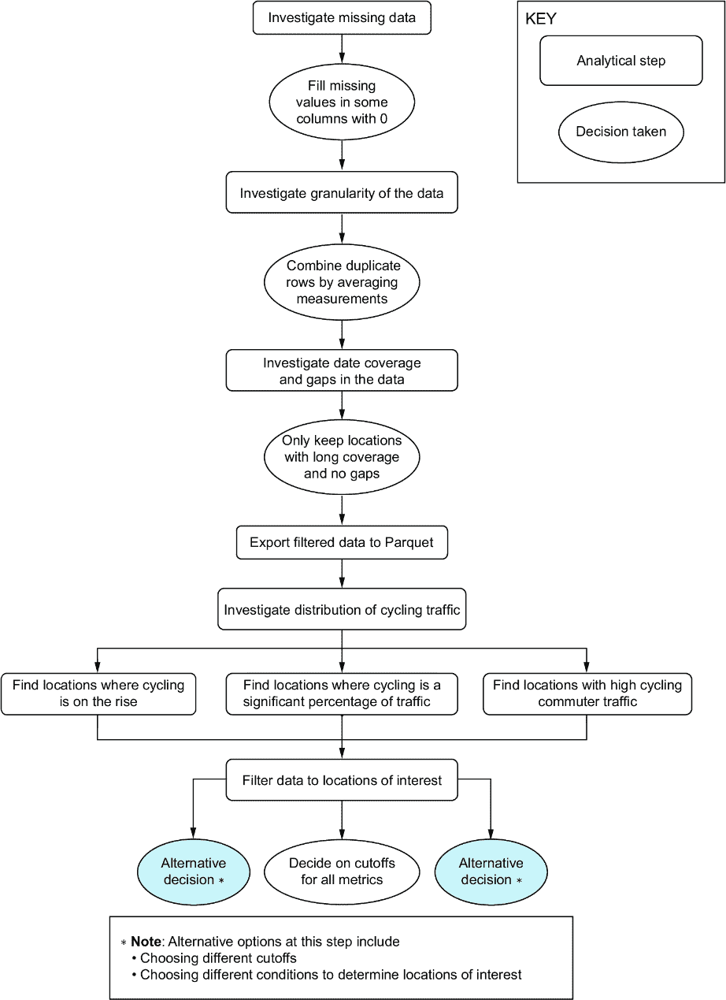

##### 图 9.41 最终分析图

现在我们将我们的发现总结成结论和建议。

### 9.2.2 项目结论和建议

让我们回顾一下我们的初始目标。我们支持的项目第一阶段是确定全国范围内最适合改善自行车基础设施的地方。这意味着要找到已经具有显著或正在增加的自行车交通流量的地方。让我们也回顾一下我们最终做了什么，以及我们在过程中做出的决定。

我们分析的结果是确定了 11 个符合多个标准、与我们目标相关的地方。我们可以将这些地点以列表形式呈现，甚至作为地图上的点。实际上，地图可视化将是一个使数据故事生动起来的好方法。重要的是要与我们的领域专家讨论这些发现。

至于进一步的工作，这将由我们的利益相关者对话来指导，但我们可以从这里出发的方向包括

+   *回顾我们的选择和假设*——我们做出的一个决定是移除覆盖范围不足的时间序列。然而，我们最终没有使用预测，所以如果我们放宽这个覆盖范围标准，允许更短的时间序列，我们可能会发现更多感兴趣的位置。

+   *在分析中包含额外的数据集*——将我们的发现与关于特殊事件、道路关闭或甚至天气的数据进行交叉引用，将为我们提供有关有机增长自行车交通的位置以及哪些位置的增长可能是由于外部因素造成的更清晰的画面。

+   *地理数据可视化*——这也有助于确定在近距离内有多个感兴趣位置的地方。例如，我们推荐的三个感兴趣的位置都在兰贝思区。如果将这些位置绘制在地图上，这种洞察力将更容易得出。

##### 活动：使用这些数据的进一步项目想法

考虑一些其他的研究问题，你可以用这些数据回答，这些问题与本章的项目无关。以下是一些帮助你开始的想法：

+   当你比较不同地理级别的交通模式时，会发生什么，比如地区或地方当局级别？

+   不同类型的车辆的交通模式有何不同？例如，汽车、公交车和重型货车（HGVs）的热点在哪里？

+   根据可用数据，哪个国家的哪个部分最需要额外的道路基础设施？

+   如果你曾经对地理空间数据分析感兴趣，这是一个实验它的机会。交通部网站包含形状文件，其中包含主要道路网络的位置，可用于地理空间分析和可视化。您可以在[`roadtraffic.dft.gov.uk/downloads`](https://roadtraffic.dft.gov.uk/downloads)找到它们。

## 9.3 收尾思考：时间序列

如果你想了解更多关于时间序列数据的信息，你可以针对两个方面的数据。第一个是熟悉你选择的工具箱中的时间序列工具。在 Python 中，这可能意味着理解`pandas`库中的各种日期和时间相关数据类型，或者探索`statsmodels`中的某些统计方法。了解你的工具箱中日期和时间的表示方式对于成功操作这类数据至关重要。例如，你会在某个时候遇到跨越多个时区的时间数据。这是处理时间数据的一个复杂且令人沮丧的方面，而且提前做好准备是很有用的。

另一个你可以采取的深入学习角度是深入研究预测。现在有许多复杂的算法可以进行准确的预测，但我的建议通常是先从简单开始。时间序列预测的方法在计量经济学等领域已经存在了几十年，甚至在“数据科学”这个短语出现之前。为此，我通常推荐 Hyndman 和 Athanasopoulos（2021）所著的《预测：原理与实践》一书，可在[`otexts.com/fpp3`](https://otexts.com/fpp3)免费获取。这是一本优秀的资源，可以引导你了解预测的基础知识，其中包含 R 语言的代码示例。Python 的翻译版本也可用，例如[`github.com/zgana/fpp3-python-readalong`](https://github.com/zgana/fpp3-python-readalong)。

只有在了解了这类入门材料之后，我才推荐深入研究更复杂、更深入的工具，例如 Facebook 的 Prophet 库([`facebook.github.io/prophet`](https://facebook.github.io/prophet))。最终，这是在实践中尝试预测时间序列时你会转向的工具，但了解基础知识会使你更容易根据具体问题调整你的方法，并理解为什么你的预测有时会出错。

### 9.3.1 适用于任何项目的时间序列数据处理技能

让我们回顾探索、操作和分析时间序列数据所需的能力。这些能力适用于任何时间序列数据项目，包括

+   调查时间序列数据以检查完整性（例如，时间序列是在不同位置测量的，还是所有位置都有相同数量的数据？）

+   确定时间序列的粒度（即，它是按小时、每日还是每周？数据中实际上是否存在多个时间序列，例如，在不同的位置？）

+   理解数据的覆盖范围（即，数据覆盖了哪个时间段？）

+   调查时间序列是否存在缺失值

+   调整时间序列数据以具有不同的粒度级别（例如，将每小时数据汇总到每日级别）

+   使用适当的图表（即，通常是折线图）可视化时间序列

+   计算重复测量的分布（例如，“每小时看到的自行车数量”，典型的每小时计数是多少？）

+   深入到单个数据点级别以调查异常

+   将时间序列分解以确定它是否有趋势或季节性

+   在时间序列中识别时间模式（例如，早上交通流量高的循环位置）

+   根据多个标准查找感兴趣的时间序列

+   将时间序列预测到未来以预测未来趋势

## 摘要

+   时间序列分析可以揭示时间模式，例如活动高峰时间或增长区域。

+   时间序列可以分解以分别研究趋势和季节性行为。

+   预测时间序列依赖于有足够的历史数据点且没有缺失值。

+   您可以通过构建和评估一个预测模型来确定一个时间序列是否可以被成功预测。
