# 第十一章：11 快速原型设计：创建概念验证

### 本章涵盖

+   识别创建概念验证的工具

+   制作一个概念验证来展示想法在实际操作中的现实性

在本章中，我们将使用我们在上一章中探索和导出的数据构建一个概念验证。在第十章中，我们确定了威尔士的物业交易，并将需要以交互式应用程序的形式呈现给最终用户。

数据可在[`davidasboth.com/book-code`](https://davidasboth.com/book-code)处供您尝试。您将找到可用于项目的文件，以及以 Jupyter 笔记本和 Python 脚本形式提供的示例解决方案。

我们已经探索了可用的数据，纠正了问题，并确定了将纳入概念验证的可视化。在本章中，我们将构建概念验证本身。首先，让我们回顾一下项目概述。

## 11.1 项目 7 回顾：构建一个概念验证来调查威尔士的物业价格

您正在为 CymruHomes Connect 工作，这是一家专注于威尔士房屋的物业公司。他们希望通过数据来扩大业务；他们希望以新应用程序的形式向客户提供关于威尔士物业市场的见解。该应用程序将使用历史物业销售数据，使用户能够探索他们感兴趣地区的物业价格。利益相关者有一些想法希望融入：

+   他们特别关注物业类型的分析，也就是说，一栋房子是联排还是独立式，因为他们坚信这会强烈影响客户在选择物业时的决策。

+   他们还认为用户会对在最低粒度级别比较物业感兴趣，因此查看街级数据的能力很重要。

让我们回顾一下我们正在处理的数据以及到目前为止所做的工作。

### 11.1.1 数据字典

我们的利益相关者发现，英国政府的土地登记处有一个名为“成交价格”的数据集，其中包含公开的历史销售数据。他们提取并提供了几年的这些数据。表 11.1 显示了数据字典，不是原始数据，而是我们在上一章末导出的数据集，这是我们概念验证将使用的数据。

注意：原始数据来自[`mng.bz/yWvB`](https://mng.bz/yWvB)。它包含 HM 土地登记处的数据©皇家版权和数据库权利 2021。此数据根据开放政府许可 v3.0 许可。感谢土地登记处和英国皇家邮政分别允许使用房价和地址数据。

##### 表 11.1 修改后的威尔士物业交易数据的数据字典

| 列 | 定义 |
| --- | --- |
| `transaction_id`  | 自动生成的参考编号，记录每次发布的销售。该编号是唯一的，每次记录销售时都会更改。  |
| `sale_price`  | 转让文件上声明的销售价格。  |
| `sale_date`  | 销售完成日期，如转让文件上所述。  |
| `postcode`  | 地址的邮政编码。  |
| `property_type`  | D = 独立式，S = 半独立式，T = 连排式，F = 公寓/联排别墅，O = 其他  |
| `old_new`  | 表示房产的年龄，并适用于所有已支付价格交易，包括住宅和非住宅。Y = 新建房产，N = 已建立的住宅建筑 |
| `duration`  | 与租期相关：F = 永久产权，L = 出租产权  |
| `house_number_name`  | 通常为房屋号码/名称（例如，42 或“橡树小屋”）。  |

|

```py
second_addressable_
object_name
```

| 如果存在子建筑，例如，建筑物被划分为公寓，将会有一个 SAON。  |
| --- |
| `street`  | 地址的街道部分。  |
| `locality`  | 关于位置的额外详细信息（例如，城市中的区域）。  |
| `town_city`  | 地址的城镇/城市部分。  |
| `district`  | 地址的区部分。  |
| `county`  | 地址的县部分。  |

| `category_type`  | 表示已支付价格交易的类型。A = 标准已支付价格条目；包括以全市场价值出售的单个住宅物业。

B = 额外已支付价格条目；包括在出售权/收回权下的转让、出租购房（如果可以通过抵押贷款识别）以及转让给非私人个人。

|

| `record_status`  | 仅与月度文件相关。表示记录的增加、更改和删除。年度文件包含所有记录的最新版本。 |
| --- | --- |
| `country`  | 交易的所在国家。可以是英格兰或威尔士，但导出的数据子集将全部为威尔士。 |
| `year`  | 交易的年份。  |

### 11.1.2 预期成果

我们的利益相关者最初希望我们提供关于我们可以在潜在应用程序中包含哪些分析的建议。关于要纳入的额外数据源的建议也将很有用。最后，我们决定构建一个概念验证，部分是为了向利益相关者展示他们潜在应用程序可能的样子，同时也是为了测试数据是否足以构建一个有用的产品。

在继续之前，让我们回顾一下上一章的进展。

### 11.1.3 到目前为止的项目总结

在上一章中，我们

+   合并了多年的房地产销售数据

+   调查了数据的质量，包括缺失值和异常值

+   确定了感兴趣的地域数据

+   调查了销售价格列的分布和异常值

+   使用外部政府数据增强了我们的地理数据，以区分英格兰和威尔士的房地产交易

+   确定了适合我们概念验证的适当可视化，包括岭图

+   导出了相关的、清洗过的威尔士房地产交易数据，这些数据将用于我们的概念验证。

图 11.1 显示了到目前为止的分析过程。

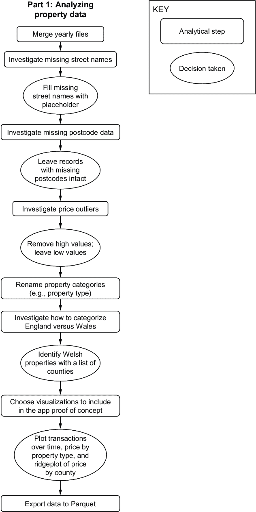

##### 图 11.1 到目前为止的项目进度

我们现在可以使用威尔士房地产交易的数据集来构建本章的概念验证。

## 11.2 构建概念验证

到目前为止，我们已经调查了可用的数据，提取了相关部分，并对其进行了探索，以了解需要在我们的概念验证中包含哪些方面。我们构建概念验证的行动计划如下：

1.  *选择一个快速原型工具*—这个选择将取决于我们熟悉什么，以及在我们通常的工具包中有什么可用。

1.  *设计应用程序布局*—在我们开始编写代码之前，我们需要计划应用程序的外观和它的工作方式。关注最终结果意味着我们最小化了在构建概念验证时需要进行的实验数量。

1.  *编写辅助函数以提取和过滤我们的数据*—将数据从应用程序的交互部分抽象出来，将使得在需要时更改应用程序的前端更容易，而无需重写数据访问部分。

1.  *构建概念验证*—到这一点，我们将拥有读取和过滤数据的功能，以及应用程序外观的计划。最后一步是使用我们在第一步中决定的工具构建概念验证。

前三个步骤是为构建概念验证的最后一步做准备。

### 11.2.1 准备构建概念验证

让我们解决第一步，即选择一个原型工具。如果您之前没有构建过可工作的概念验证或原型，这是探索您现有工具包中一些选项的好时机。

#### 选择一个快速原型工具

例如，如果您是 R 用户，您可能会探索 Shiny 的功能。作为 Python 用户，您也有许多选项可供选择。这是利用大型语言模型来帮助您调查该领域的好机会。在这种情况下，我使用了 Anthropic 的 Claude 3 Sonnet 来展示不同的选项，而不仅仅是 ChatGPT。以下是我给它提供的提示：

*我想用 Python 构建一个数据驱动的应用程序的交互式概念验证。请建议一些可以帮助我构建具有以下功能的基于 Web 的交互式概念验证的库：*

+   +   *能够显示可视化，理想情况下使用生成 matplotlib 图表的现有代码。*

    +   *交互性，即下拉菜单来过滤数据，然后刷新页面及其所有可视化。*

    +   *应用程序需要基于 Web，这样用户就不需要安装任何软件来使其工作。*

*我将使用 pandas 库进行数据处理，并使用 matplotlib 创建图表，但理想情况下，所有其他功能都应该由一个额外的库来覆盖。请提供一个可能的选项列表，并解释每个选项的 1-2 句话。*

Claude 列出了几个选项作为响应，如图 11.2 所示。

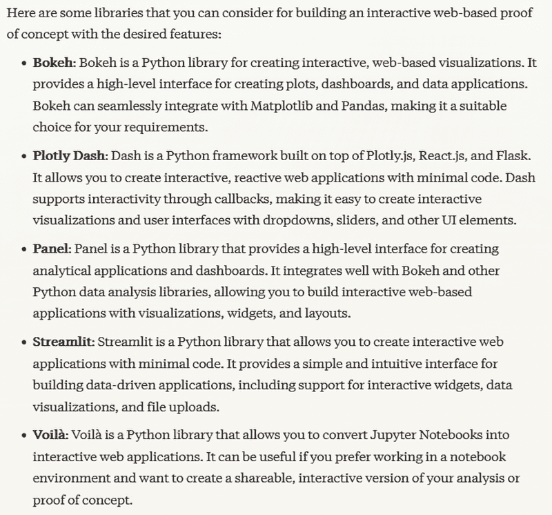

##### 图 11.2 Claude 3 Sonnet 对 Python 快速原型工具的建议

这些都是在 Python 生态系统中的可靠选项，并且所有这些都适合我们的概念验证。我选择`streamlit`主要是因为我已经熟悉它。否则，我会花一些时间阅读每个库的文档，并评估示例代码片段，以确定哪个库能让我最快地构建概念验证。

让我们开始跟踪这个项目部分的进度。图 11.3 显示了我们刚刚采取的第一步。

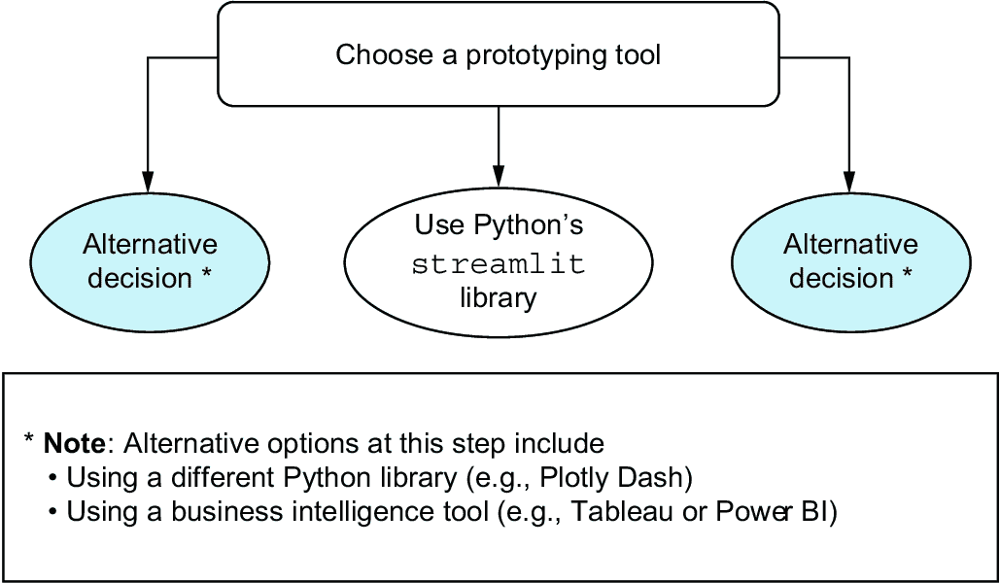

##### 图 11.3 构建概念验证的第一步

现在我们已经选择了工具，让我们考虑应用程序的布局。如果我们确切知道我们想要添加哪些元素以及它们的位置，那么我们可以以结果驱动的方式进行工作。我们只会阅读工具文档的必要部分，并且只使用我们实际将要使用的元素。

#### 设计应用程序布局

在这部分，我们需要做两件事：决定页面上将放置哪些元素以及它们将放置在哪里。我们或多或少已经决定了这一点，所以让我们回顾一下：

+   将会展示一个按县划分的价格分布脊图，用于 2023 年。

+   将会有用户筛选功能，包括县、镇和街道。

+   我们将展示随时间推移的交易折线图。

+   将会展示两个条形图，分别显示按物业类型划分的频率和销售中位数。

+   根据目标受众，我们可能还希望展示驱动各种图表和计算的基础数据。对于内部工具，我会始终考虑这样做，原因有两个：一是建立计算的准确性信任，二是允许利益相关者将底层数据导出到 Excel，他们不可避免地会想要这样做。对于面向客户的工具，这可能不是必要的，但鉴于这是一个将由内部用户评估的概念验证，我们将显示原始数据。

+   我们还可能决定显示用户所选物业子集的一些摘要指标。

这些元素的确切位置主要是个人的选择，但我们应该至少从上到下逻辑地排列它们。首先，用户应该看到他们无法更改的组件，例如脊图。然后，任何后续元素将取决于用户输入，因此页面下方的下一个项目应该是县、镇和街道下拉菜单。之后，我们将显示摘要指标和图表，最后以底部的原始数据表结束。除了一些解释性文本外，这就是我们概念验证所需的所有内容。图 11.4 显示了我们要构建的基本线框原型。

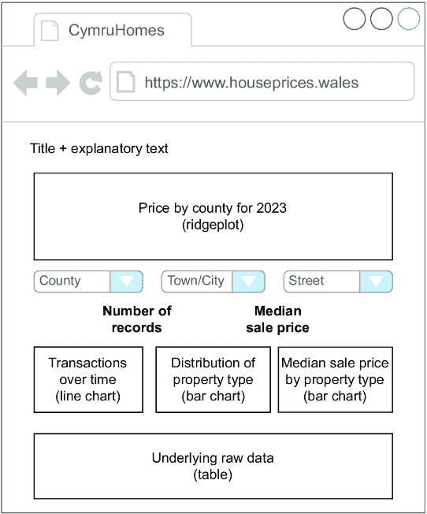

##### 图 11.4 可能的应用程序布局原型

由于这个原型包括我们做出的某些具体决策，让我们将其添加到这个项目部分的图表中。最新版本如图 11.5 所示。

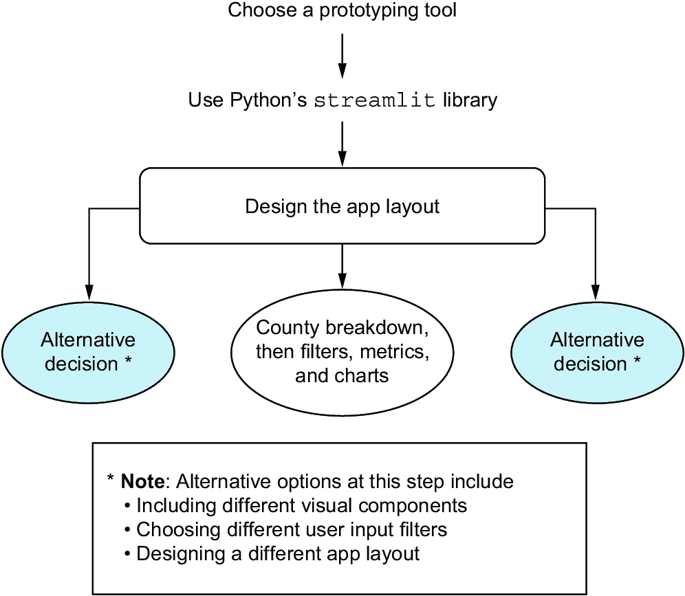

##### 图 11.5 项目第二部分的最新进度

现在我们有了我们的工具和布局的想法，让我们编写代码的数据访问部分。这是应用将用来读取我们的数据并根据用户输入获取其过滤版本的代码。

#### 编写可重用的辅助函数

在软件开发中，通常将数据访问组件与表示层分离是一个好主意。即使是简单的概念验证，这也是一个好的实践，因为如果它们发展成为原型和实际应用，我们将有一个可重用的数据访问层，可以在所有阶段使用。

##### 分析师所需的软件开发技能

如果你与代码打交道，你会从学习软件最佳实践中受益。分析师不需要成为软件开发人员，但编写良好软件的某些元素与数据专业人员相关。

良好的软件开发实践意味着可读性和可重用性，首先是可读性。一旦你养成了编写干净、可重用代码的习惯，这种代码在需求不可避免地发生变化时易于更改，你会发现生产力有显著提高。

如果你想了解更多关于数据人员的软件技能，一个极好的资源是 Laszlo Sragner 的《数据科学代码质量》，这是一个 Discord 社区，致力于教授所有数据科学家（无论技能水平如何）编写更好的代码，可在[`cq4ds.com`](https://cq4ds.com)找到。

在我们的特定应用中，我们将需要以下函数：

+   将我们的属性数据作为 DataFrame 读取。

+   获取县、镇和街道名称的列表，以填充用户将从中进行选择的下拉菜单。这些下拉菜单也应该相互依赖，这意味着例如，当用户选择一个县时，镇/城市下拉菜单应该更新以反映该县内的城镇。

+   根据数据的过滤版本创建所有必要的可视化。这些函数将返回实际图表对象，供应用显示。

让我们逐一查看示例解决方案中的每个函数，这些函数可以在名为`helpers.py`的文件中找到。首先，这是一个简单的函数，用于读取我们之前准备和导出的数据：

```py
import pandas as pd
import matplotlib.pyplot as plt
import seaborn as sns

from ridgeplot import ridgeplot

def load_price_data():
    return pd.read_parquet("./data/wales.parquet")
```

这就是应用首次启动时将运行的内容。然后，我们需要函数来填充每个下拉菜单。以下是一个返回数据中所有可能县份的函数：

```py
def get_counties(df):
    return sorted(df["county"].unique())
```

注意这个函数并没有直接引用威尔士的属性；它只是返回任何 DataFrame 中所有的县值。这是因为应用的不同组件不应依赖于其他组件的具体实现。例如，返回县列表的功能不需要知道底层数据来自哪里。以下是根据给定县列出城镇的列表：

```py
def get_towns(df, county, null_value):
    if (not county) or (county == null_value):
        return []

    return (
        [null_value]
        + sorted(
            df.loc[df["county"] == county, "town_city"]
            .unique()
        )
    )
```

这个函数接受一个空值作为附加参数，这是一个特殊值，用于当下拉菜单未选择时。如果一个用户已经选择了一个县和一个镇，但想回到查看整个县的数据，他们可以在镇的下拉菜单中选择这个空值来清除它。这个空值将显示为“未选择城镇”，因此用户可以清楚地知道他们已经清除了城镇下拉菜单。

最后一个下拉菜单将是一个街道名称列表，这取决于县和镇/市：

```py
def get_streets(df, county, town, null_value):
    if (not (county and town)) or (town == null_value):
        return []

    return (
        [null_value] +
        sorted(
            df.loc[(df["county"] == county)
                   & (df["town_city"] == town),
            "street"]
            .unique()
        )
    )
```

现在我们需要一些函数来绘制我们的图表。首先，这是每年的交易数量，它将与图 10.25 中的图表类似：

```py
def transactions_per_year(df):
    fig, axis = plt.subplots()

    (
        df
        .set_index("sale_date")
        .resample("YS")      #1
        .size()
        .plot(ax=axis, color="gray", marker="x")
    )

    axis.set(
        ylabel="# of transactions"
    )

    return fig
```

#1 计算每年记录数，其中“YS”表示“年初”

接下来，我们想展示物业类型的细分。我们想展示物业类型的分布以及按物业类型的平均价格。我们可以通过将交易数量表示为条形图中的条形长度，将平均价格表示为颜色值来将此信息合并到单个图表中。然而，我们希望应用程序尽可能易于理解，因此我们将此信息分为两个条形图，以下两个函数如下：

```py
def distribution_of_property_type(df):    
    fig, axis = plt.subplots()

    (
        df["property_type"]
        .value_counts()
        .sort_values()
        .plot
        .barh(ax=axis, color="gray")
    )

    axis.set(
        xlabel="# of transactions"
    )

    return fig

def median_price_by_property_type(df):
    fig, axis = plt.subplots()

    (
        df
        .groupby("property_type")
        ["sale_price"]
        .median()
        .sort_values()
        .plot
        .barh(ax=axis, color="gray")
    )
    axis.set(
        xlabel="Median price (£)",
        ylabel=None
    )

    return fig
```

最后，我们将包括上一章中创建的岭图，因此我们需要一个辅助函数来创建它。正如我们所发现的，岭图需要特定格式的数据，因此我们需要一个函数来创建这些数据，另一个函数来创建图表：

```py
def get_county_ridgeplot_data(df, counties):
    sales_by_county = []

    for county in counties:
        prices = (
            df
            .loc[(df["county"] == county)
                 & (df["sale_price"] < 500_000)
                 & (df["year"] == 2023),
            "sale_price"]
        )
        sales_by_county.append([prices])

    return sales_by_county

def county_ridgeplot(sales_by_county, counties):
    fig = ridgeplot(sales_by_county,
                    labels=counties,
                    colorscale="gray",
                    coloralpha=0.9,
                    colormode="mean-minmax",
                    spacing=0.7)

    fig.update_layout(
        title="Distribution of house sale prices in Wales in 2023, by county",
        height=650,
        width=950,
        font_size=12,
        plot_bgcolor="rgb(245, 245, 245)",
        xaxis_gridcolor="white",
        yaxis_gridcolor="white",
        xaxis_gridwidth=2,
        yaxis_title="County",
        xaxis_title="Sale price (£)",
        showlegend=False
    )

    return fig
```

这些函数将被导入到应用程序中，应用程序可以使用它们来过滤我们的数据，填充下拉菜单，并根据用户输入显示正确的可视化。让我们将辅助函数的创建添加到我们的图中，以记录我们的进度。这如图 11.6 所示。

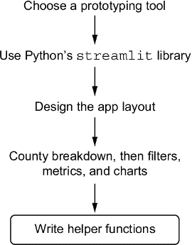

##### 图 11.6 构建概念验证的最新进展

现在，终于到了构建应用程序本身的时候了，使用我们选择的工具以及我们之前创建的应用程序布局和辅助函数。

### 11.2.2 使用 streamlit 构建概念验证

我们有我们选择的好工具 `streamlit`，一个期望的布局，以及管理数据访问、过滤和图表的辅助函数，这样我们就可以非常针对性地构建我们的概念验证。我们需要弄清楚 `streamlit` 的基础知识以及如何显示文本、下拉菜单、图表和表格。这意味着我们不会迷失在教程和代码示例的海洋中——我们只会取我们需要的。

现在，我们将逐一介绍最终应用程序的各个组件，其代码可以在名为 `house_price_app.py` 的文件中找到。要查看示例解决方案的最终应用程序的实际运行情况，请打开终端或命令提示符，使用 `poetry shell` 命令激活 poetry 环境，然后运行 `streamlit run house_price_app.py` 命令，该命令应类似于图 11.7 中的示例。有关设置 Python 环境以重现示例解决方案的更多信息，请参阅附录。

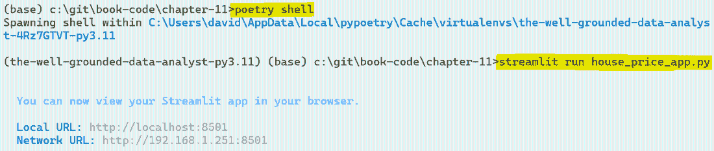

##### 图 11.7 展示了如何在示例解决方案中运行应用程序的命令提示符窗口

要构建应用程序，我们首先设置一些 `streamlit` 选项并读取我们的数据。

#### 将数据读入 `streamlit`

首先，我们将导入必要的库并设置一些 `streamlit` 选项，即我们希望页面为全宽，这不是默认选项：

```py
import streamlit as st
import pandas as pd
import helpers      #1

st.set_page_config(layout="wide")
```

#1 在此上下文中，helper 是我们之前在 helpers.py 中编写的代码。

接下来，我们读取属性数据以及将填充县下拉菜单的数据，因为这些数据不会动态变化。我们还可以读取将提供脊图的数据，因为同样，这些数据也不会变化。可选地，我们还可以让 `streamlit` 缓存这些数据集，这意味着它们在用户执行某些操作（如更改下拉菜单）时不会重新加载。我们通过将辅助函数包装在小函数中并用 `st.cache_data` 装饰器注释它们来实现这一点。以下代码负责加载数据和缓存数据：

```py
@st.cache_data
def get_price_data():
    return helpers.load_price_data()

wales = get_price_data()

@st.cache_data
def get_counties(wales):
    return helpers.get_counties()

counties = get_counties(wales)

@st.cache_data
def get_county_data(wales, counties):
    return helpers.get_county_ridgeplot_data(wales, counties)

sales_by_county = get_county_data(wales, counties)
```

接下来，我们定义应用程序的布局。

#### 在 `streamlit` 中定义应用程序布局

应用程序将简单地是按照从上到下的顺序定义的 `streamlit` 元素——首先，标题，简要说明，以及脊图。以下代码构建了这些元素，并且最终应用程序的相关部分如图 11.8 所示。由于篇幅原因，完整的解释省略了代码片段，但可以在图中看到：

```py
st.title("House price explorer - Wales")
st.markdown("""This tool lets you explore...""")

st.plotly_chart(helpers.county_ridgeplot(sales_by_county, counties))
```

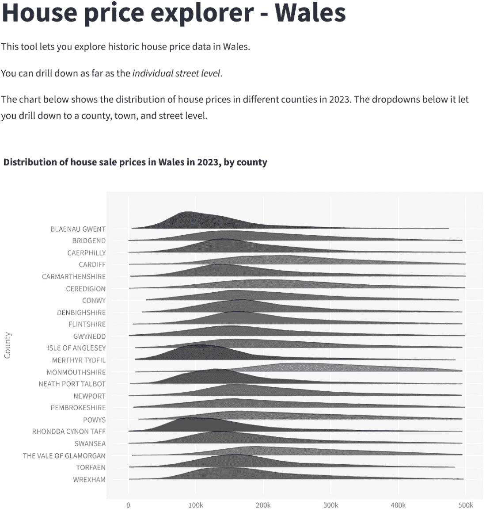

##### 图 11.8 房价应用程序概念证明的第一元素

接下来，我们将添加交互性，包括三个下拉菜单，它们可以深入特定地理区域。默认情况下，将元素添加到 `streamlit` 将将其添加到上一个元素下方。由于我们希望下拉菜单在同一行，我们可以创建一些列并将下拉菜单添加到它们中，以避免这种情况。每个下拉菜单都将是一个 `streamlit` `selectbox`，它将使用我们的辅助函数进行填充。依赖于其他下拉菜单的下拉菜单将引用其他下拉菜单的值。也就是说，选择城镇列表将取决于县下拉菜单中选择的值，该值将传递给 `get_towns` 辅助函数。以下代码以三列格式创建了三个下拉菜单，并且应用程序的相关部分如图 11.9 所示：

```py
st.header("Explore house prices at different levels")

select_col1, select_col2, select_col3 = st.columns(3)

with select_col1:
    county_select = st.selectbox(
        'Select a county:',
        helpers.get_counties(wales),
        index=None,
        placeholder="-- Select a county --"
    )

TOWN_NULL_VALUE = "-- No town selected --"    #1

with select_col2:
    town_select = st.selectbox(
        'Select a town:',
        helpers.get_towns(
            wales,
            county_select,     #2
            null_value=TOWN_NULL_VALUE),
        index=None,
        placeholder=TOWN_NULL_VALUE
    )

STREET_NULL_VALUE = "-- No street selected --"

with select_col3:
    street_select = st.selectbox(
        'Select a street:',
        helpers.get_streets(
            wales,
            county_select,
            town_select,
            null_value=STREET_NULL_VALUE),
        index=None,
        placeholder=STREET_NULL_VALUE
    )
```

#1 如果用户想要清除下拉菜单，可以选择的值示例

#2 当前选中的县将被传递给 get_towns 函数。


##### 图 11.9 地域下拉菜单的初始状态

图 11.9 显示了下拉菜单的初始状态。城镇和街道是浅灰色，这意味着它们目前处于禁用状态，直到用户选择一个县。图 11.10 显示了当一些值被选中时下拉菜单的状态，以及街道的选项。

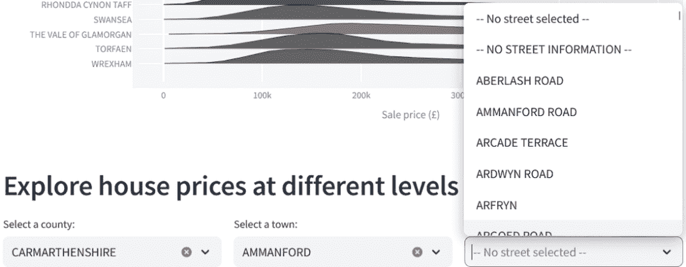

##### **图 11.10 地域下拉菜单中选中了一些值，并显示了街道的可用值**

接下来，我们需要一些代码，它将根据用户的选择将原始数据过滤到正确的地域级别。

#### 在 streamlit 中交互式过滤数据

根据你的工具，这看起来可能会有所不同，但在这里，我们将利用`pandas`中的`query`方法，它允许我们以单个字符串的形式指定应用于我们数据的过滤器。我们可以根据有多少下拉菜单有选中的值来构建这个查询字符串。用户使用的下拉菜单越多，查询字符串越长，查询越具体，我们检索的数据就越少。以下代码构建了这个查询字符串并将其应用于数据。我们还构建了一个将反映用户选择的短信：

```py
house_filter_query = "county == @county_select"
filter_message = f"Results for {county_select}"

if town_select and town_select != TOWN_NULL_VALUE:
    house_filter_query += " and town_city == @town_select"
    filter_message += f", {town_select}"

if street_select and street_select != STREET_NULL_VALUE:
    house_filter_query += " and street == @street_select"
    filter_message += f", {street_select}"

selected_data = wales.query(house_filter_query)
```

接下来，基于这些过滤后的数据，我们可以开始计算汇总指标，并创建如图 11.4 所示的线框图中的图表。为了计算汇总指标，我们需要计算出过滤数据中的中位数售价，以及记录的数量。以下代码完成了这项工作，并且只有当用户至少选择了一个县时才会执行。之前构建的消息示例以及汇总指标如图 11.11 所示：

```py
median_price = selected_data["sale_price"].median()

if county_select:   #1
    st.header(filter_message)

    metric_col1, metric_col2 = st.columns(2)
    metric_col1.metric("Number of records", f"{len(selected_data):,.0f}")
    metric_col2.metric("Median sale price", f"£{median_price:,.0f}")
```

#1 选择一个县就足以触发小部件。


##### 图 11.11 显示用户应用的地域过滤器和相关汇总指标的消息

现在，我们可以使用我们的辅助方法来创建相关的图表。

#### 在 streamlit 中创建图表

图表将并排显示，因此它们需要再次放在`streamlit`列中。最后，我们在页面底部显示过滤后的数据作为表格。以下代码完成了我们的应用。因为整个底部部分依赖于用户至少选择了一个县，所以我包括了包含之前看到的汇总指标的整个代码块：

```py
if county_select:
    st.header(filter_message)

    metric_col1, metric_col2 = st.columns(2)
    metric_col1.metric("Number of records", f"{len(selected_data):,.0f}")
    metric_col2.metric("Median sale price", f"£{median_price:,.0f}")

    chart_col1, chart_col2, chart_col3 = st.columns(3)

    with chart_col1:
        st.subheader("Transactions over time")
        st.pyplot(helpers.transactions_per_year(selected_data))

    with chart_col2:
        st.subheader("Distribution of property type")
        st.pyplot(helpers.distribution_of_property_type(selected_data))

    with chart_col3:
        st.subheader("Median sale price by property type")
        st.pyplot(helpers.median_price_by_property_type(selected_data))

    st.header("Raw data")
    st.write(selected_data)
```

最后，让我们看看应用的最后一部分，它包含汇总指标、图表和基础数据。原始数据在图中被截断，但在应用中完整显示。这如图 11.12 所示。

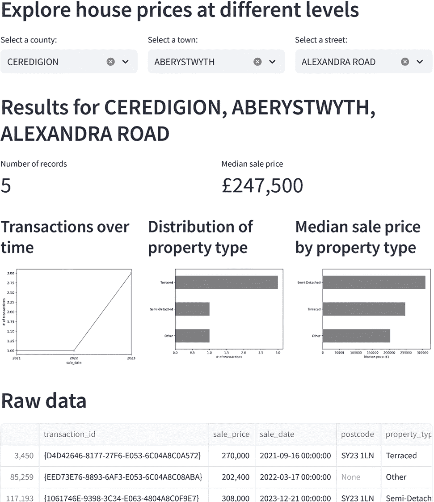

##### 图 11.12 完成概念验证应用的底部部分，其中原始数据表被截断

在我们传达我们的结论之前，让我们回顾一下在这个项目中我们所做的一切。图 11.13 显示了探索和清理数据的过程，以及概念验证应用程序的设计和开发。

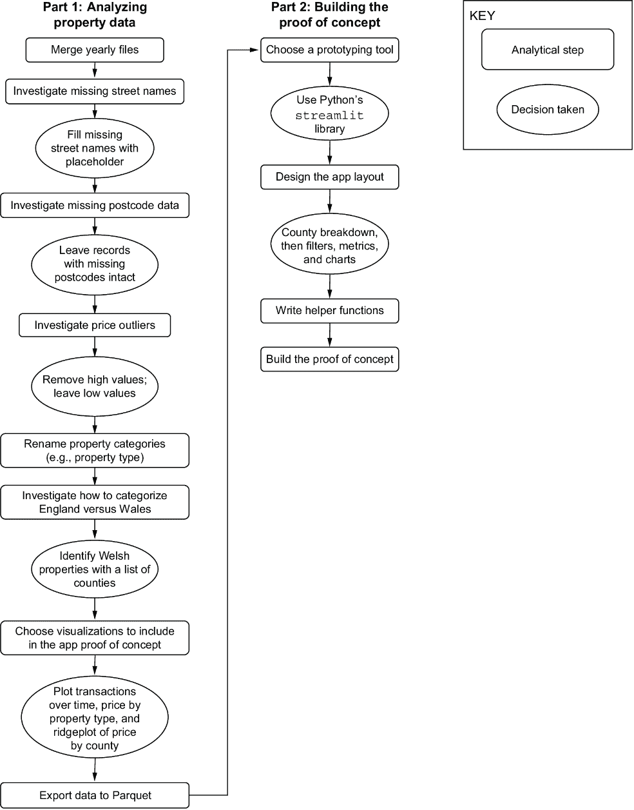

##### 图 11.13 从探索和分析到构建概念验证的整个过程

我们已经成功交付了我们的最小可行答案。现在是时候反思我们所发现的内容以及下一步该做什么了。

### 11.2.3 项目成果和下一步计划

我们通过调查物业类型来满足简报要求，我们发现不同物业类型的售价之间存在差异，并通过调查街道级数据。我们可以自信地向我们的利益相关者保证，这些数据适合查看这两个方面。然后，我们通过构建一个概念验证来展示他们计划中的应用程序可能的样子，以及是否可以使用现有数据进行构建，从而超越了简报的要求。

关于我们的概念验证，有几个要点需要解决：

+   首先，相关地址字段中存在缺失值。为了启动并可能为此类应用程序收费，数据需要完整。为此，我们需要清理数据并填写缺失的地址细节，可能使用第三方地理编码服务，如谷歌地图 API。

+   其次，即使只有少量可用记录，应用程序也会显示与用户选择相关的图表，如图 11.12 所示。根据我们认为用户将如何使用总结性指标和图表，如果返回的属性样本量太小，我们可能希望在应用程序中发布免责声明。

+   最后，如果我们能解决一些这些问题，并且概念验证达到了原型阶段，我们就需要用户测试以确保用户能够找到相关的地址。在这种情况下，这意味着确保县、镇和街道的值被正确分类。

当向我们的利益相关者展示这个应用程序时，我们可能还希望提出对最终版本的改进建议。以下是一些想法：

+   用户可能会在看到物业列表网站上的物业后进行调查，例如 Rightmove 或 Zoopla。在这些网站和我们的应用程序之间建立链接可能很有用。例如，用户可能将 Rightmove 上的物业链接粘贴到我们的应用程序中，然后应用程序可以根据该物业的地址自动过滤数据。

+   自动过滤结果的另一种选项可能是简单地输入地址或在交互式地图上选择它。这将节省用户时间并使他们的体验更加流畅。

+   我们可以通过添加可能影响物业价格的地方信息来增强我们的地址数据，例如犯罪率或公共设施的可用性。

无论我们接下来选择做什么，它都将从一个向我们的利益相关者展示的演示开始，并讨论是否将此项目进一步推进到原型阶段。

##### 活动：使用这些数据进一步的项目想法

想想你可以用这个房价数据集进行哪些其他分析。特别是，你可能想练习不同的构建概念验证的方法，以发展你在这一领域的技能。以下是一些你可能希望探索的方向：

+   这样的地理数据非常适合基于地图的视觉展示。你可以创建一个应用程序来识别交易热点，即国家中“周转”率很高的地区。

+   房产销售中是否存在任何季节性模式？这些模式在不同地理区域之间是否有所不同？

+   通过增强数据中的人口统计信息（例如，人口数据），你可以查看在全国范围内是否有比该地区典型规模更多的房产销售。

## 11.3 关于快速原型化想法的结语

正如我们在本项目中看到的，通过从可用数据构建概念验证来扩展分析是有用的。对于构建预测模型来说也是如此；而不是展示准确度指标，如果我们可以展示它们在实际中的工作方式，这些模型就会变得生动起来。拥有概念验证和原型还可以让我们识别出会影响构建完整工作产品的数据问题。

要特别提高在这个领域的技能，有几种方法：

+   显而易见的一个方法是熟悉快速原型化工具。这可能包括使用 BI 工具（如 Power BI 或 Tableau）构建仪表板，或者学习你编程语言的库，例如 R 的 Shiny 或 Python 的`streamlit`。或者，你可以学习关于“无代码”平台的知识，在那里你可以不明确编写代码就制作出工作应用程序。

+   另一项可能有助于此的技能，尤其是如果你想要构建工作原型的话，就是学习关于网络构建的知识。具体来说，学习一点 HTML、CSS 和 JavaScript 对于制作定制的基于网络的程序很有帮助。例如，Web 设计游乐场([`www.manning.com/books/web-design-playground-second-edition`](https://www.manning.com/books/web-design-playground-second-edition))是一个学习基础知识的绝佳平台。

+   如果你将在工作中构建概念验证和原型，学习设计原则也是有用的。了解 UI 和 UX 设计原则、用户流程和故事板的基础知识将帮助你构建更好的原型。

当然，学习这项技能的最佳方式是通过实践。寻找机会构建小型交互式应用程序来补充你的分析。这将对你和展示给利益相关者的你都是有益的学习经历。

### 11.3.1 任何项目快速原型化的技能

要基于可用数据构建交互式概念验证，关键技能包括，这些技能可以应用于任何类似项目：

+   在探索可用数据时，关注原型的功能

+   验证我们数据的质量，因为它将暴露给外部客户

+   从信誉良好的来源增强数据（例如，使用官方城市名称）

+   探索我们数据中的有趣变化，以确定在概念验证中应关注什么

+   确定适合原型和目标受众的视觉化方法

+   选择合适的快速原型工具来构建概念验证

+   在编写任何代码之前，将应用布局设计为线框图

+   编写应用程序可以使用但与应用程序代码紧密耦合的帮助函数

+   设置快速原型工具，如`streamlit`

+   在原型工具中实现所需的布局

+   在您的原型工具中显示数据和图表

+   为用户与展示的数据和可视化提供交互

## 摘要

+   从想法到工作产品的旅程应包括概念验证和原型的创建，这两个领域都是分析师可以参与的地方，并且是分析师工具箱的有用补充。

+   概念验证和原型是使分析对利益相关者生动起来的有效方式。

+   选择用于创建概念验证的工具应取决于现有工具，目标受众如何与最终产品互动，以及使用所选工具创建概念验证的速度。

+   快速原型设计也需要以结果为导向的方法，以确保仅在初始版本中构建必要的功能。
