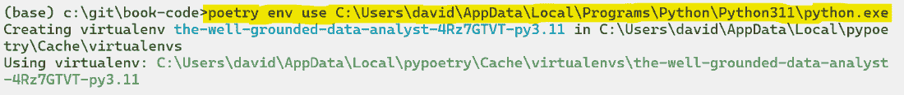
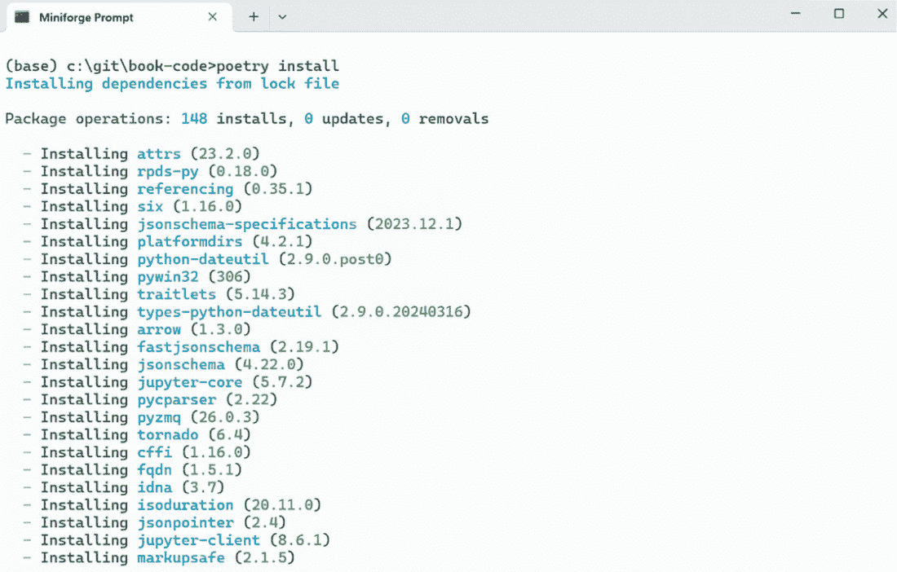
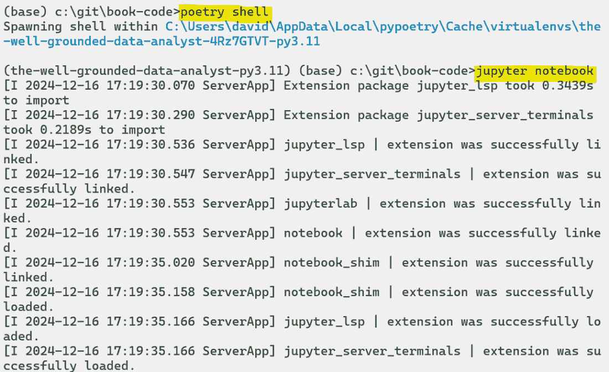

# 附录 Python 安装说明

书中的项目对技术没有特定要求，示例解决方案主要关于过程，而不是 Python 的具体细节，Python 是我的首选技术。然而，如果你像我一样是 Python 用户，你可能想在你的机器上重新创建我的结果，并将我的示例解决方案作为起点。本附录解释了如何安装 Python 并设置它，以便模仿示例解决方案的设置。

通常，项目所需的 Python 库列在配套的 Jupyter 笔记本中，可以从`import`语句中推断出来。也就是说，如果解决方案中的代码导入了`pandas`，你需要安装`pandas`库。但是，为了精确地重新创建我的示例，你需要每个库的相同版本，因为功能在不同版本之间有所变化。确保你的 Python 环境设置与我相同的方法有很多，但通常这是通过虚拟环境来完成的。

注意：为了在书中重新创建解决方案，并不需要完全相同的设置。你很可能可以使用更新的 Python 版本和更新的库版本，如`pandas`，并获得相同的结果。然而，虚拟环境明确地锁定到较旧的 Python 版本和必要的库版本，以确保它们之间的兼容性。例如，第三章中使用的`recordlinkage`库在撰写本文时与`pandas`版本 2.0 不兼容。

虚拟环境允许你在同一台机器上拥有多个 Python 库的组合，甚至可以是不同版本的 Python，通常每个项目一个。我建议创建一个虚拟环境，在其中你可以运行配套的代码示例，并确保你的库与我的版本相同。再次强调，设置虚拟环境的方法有很多。你可能已经有了自己偏好的方法，或者你可能之前从未遇到过虚拟环境。在这本书中，我使用了`poetry`库，接下来的章节将包括如何重新创建我的环境的说明。

## A.1 安装 Python

具体来说，书中的项目使用 Python 3.11，但这只在你想要精确地重新创建示例解决方案时是必需的。如果你已经安装了不同版本的 Python，但想重新创建我的环境，你可以安装 Python 3.11，因为它将与其他 Python 安装分开。

您可以直接从 Python.org 安装 Python ([`www.python.org/downloads/`](https://www.python.org/downloads/))，或者通过捆绑版本，例如 Anaconda ([`www.anaconda.com/download`](https://www.anaconda.com/download))。您还可以通过 Anaconda 的最小版本，如 Miniconda ([`docs.conda.io/en/latest/miniconda.xhtml`](https://docs.conda.io/en/latest/miniconda.xhtml)) 或 Miniforge ([`github.com/conda-forge/miniforge`](https://github.com/conda-forge/miniforge)) 来安装 Python。

我个人使用 Miniforge，但只要您在机器上安装了 Python 3.11，它从哪里来并不重要。

## A.2 安装 poetry

`poetry` 是我选择的用于管理虚拟环境的包和依赖管理工具。您可以使用您拥有的任何内置包管理器（通常是 `pip` 或 `conda`）与您的 Python 安装一起安装它。一个示例命令，应在终端或命令提示符中运行，是 `pip install poetry`。

注意：如果您使用不同的虚拟环境管理方法，例如 `virtualenv`，我还包括了一个 `requirements.txt` 文件，它包含与 `poetry` 文件相同的信息，但它是这些其他工具所需的格式。这仍然需要您使用 Python 3.11。

关于 `poetry` 的更多信息可在 [`python-poetry.org/`](https://python-poetry.org/) 找到。

## A.3 创建您的虚拟环境

在本书的材料中，我提供了两个文件，`poetry.lock` 和 `pyproject .toml`，您需要使用所有必要库的相同版本来重新创建我的虚拟环境。在撰写本文时，您只需在您下载本书代码的根目录中拥有这两个文件即可。

首先，导航到包含这些文件的代码文件夹，并运行以下命令以确保 `poetry` 使用 Python 3.11，无论您的机器上存在其他版本。图 A.1 展示了一个命令提示符的示例：

```py
poetry env use /path/to/your/python3.11/python.exe
```



##### 图 A.1 显示了告诉 `poetry` Python 3.11 安装位置的命令

接下来，运行命令 `poetry install` 以创建您的虚拟环境。将安装必要的库的正确版本。图 A.2 展示了输出可能的样子。



##### 图 A.2 安装 `poetry` 环境及其相关库

到此为止，您已经设置了一个与我的设置相同的虚拟环境。您可以通过运行命令 `poetry shell` 来激活它。

这将激活环境，并且任何后续的 Python 命令都将在此环境中运行而不是在基本环境中。从这里，您可以使用命令 `jupyter notebook` 启动 Jupyter。这将启动 Jupyter，您可以使用正确版本的 Python 和其库与代码进行交互。图 A.3 展示了启动 Jupyter 之前的最终 `poetry` 命令。



##### 图 A.3 从`poetry`环境启动 Jupyter
