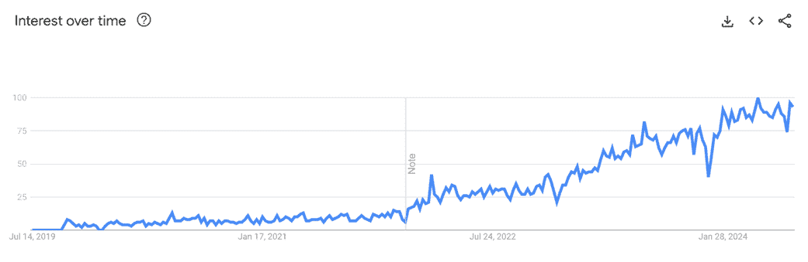
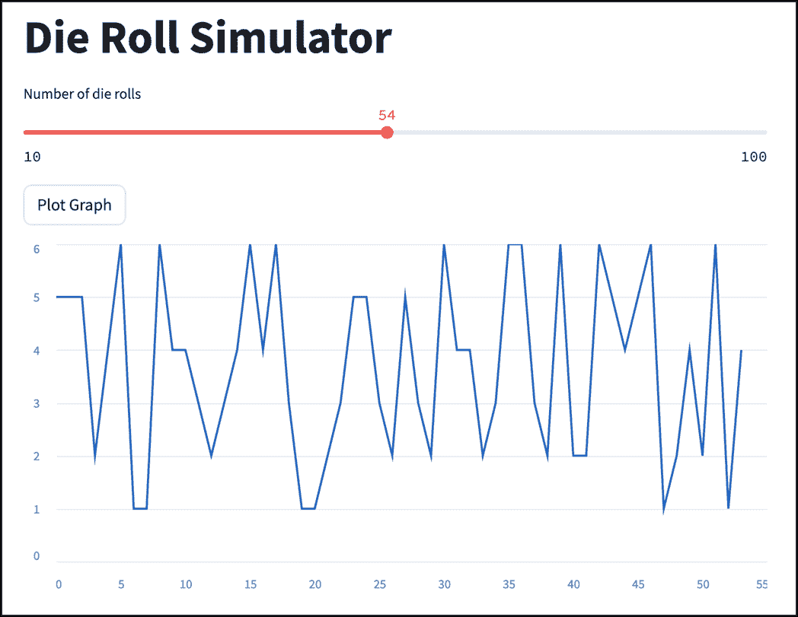

# 1 Streamlit 简介

### 本章节涵盖了

+   为什么你想构建 Web 应用

+   Streamlit 究竟是什么，以及为什么它如此受欢迎

+   Streamlit 的易用性、对 LLM 的友好性以及其他因素使其变得流行

+   Streamlit 与其他类似技术的不同之处

+   你可以用（和不能用）Streamlit 构建什么

欢迎来到激动人心的 Streamlit 领域！通过拿起这本书，你已经加入了在过去几年中发现 Streamlit 的数千名开发者的行列。这些开发者已经着迷于 Streamlit 所能实现的事情：只需几分钟就能用 Python 编写的完整 Web 应用！

请花点时间思考一下你为什么会被这本书吸引。也许你脑海中有一个想法，这个应用将为你同事节省数小时枯燥的、容易自动化的任务，你希望最快地将它变为现实。也许你正在瞄准科技行业的工作，并希望通过添加前端开发来填补你的技能缺口。也许你是一位数据分析师或科学家，希望以交互式仪表板的形式向高层展示你的发现。或者你可能是一位需要快速原型化应用程序的软件工程师。也许你只是听说了 Streamlit 和 AI 的热潮，感到好奇。

无论你的故事如何，Streamlit 都能快速轻松地将你的想法变为现实。这本书将是你向导，带你一步步通过创建强大、交互式 Web 应用程序的过程。你将学习如何利用 Python 的简洁和优雅来构建和部署能够震撼你的观众、解决实际问题并推动你职业发展的应用程序。

经验是最好的老师，所以你将通过实际项目来学习 Streamlit。到这本书结束时，你将构建一个多功能的投资组合，从交互式抵押贷款计算器到由生成式 AI 驱动的聊天机器人，所有这些都在创纪录的时间内完成！

虽然每一章都会让你更深入地了解 Streamlit 的功能，但你也会学习到开发应用程序的整体流程，包括如何考虑 UI 设计以及如何组织代码以实现可维护性。

无论你是经验丰富的行业老手还是完全的初学者，我都确信你会发现这本书的价值。

你渴望深入探索吗？那么，让我们从基础知识开始。

## 1.1 构建 Web 应用

在我们深入探讨 Streamlit 本身之前，让我们先谈谈 Web 应用以及为什么你想构建一个，这正是 Streamlit 的目的所在。

一个*图形应用*是一个具有*图形用户界面（GUI）*的应用程序，你可以通过点击鼠标或触摸屏幕控件与之交互。这与*命令行应用*形成对比，后者有一个*命令行用户界面*，你在终端中输入文本输入并从同一终端获得结果。你很可能已经使用 Python 编写了一些这样的应用程序。

*Web 应用*（或*Web 应用*）是一种通过网页浏览器访问的图形化应用，例如您使用 Google Chrome 浏览器访问 Gmail 或 Netflix 时，与*桌面应用*相对，桌面应用是直接在您的计算机上运行（例如，Photoshop 或 Notepad 在您的 PC 上运行），或者*原生移动应用*，它直接在您的手机上运行（例如，Uber 或通过 iPhone 的 Gmail 应用访问 Gmail）。

Streamlit 帮助您构建 Web 应用，而不是命令行、桌面或原生移动应用。但为什么您想要这样做呢？

### 1.1.1 最初为什么要构建图形化应用？

如果您已经学习了 Python，那么您可能对创建命令行程序感到很自在。这些是最容易创建的应用类型，Python 为它们提供了原生支持。

问题在于，除了技术人员之外，没有人喜欢使用命令行程序进行任何重要的事情。图形化应用不那么令人畏惧，并为用户提供更直观的体验。

这通常是真的，但在工作场所也是如此。如果您想为非技术受众自动化工作场所中的某些事情，并期望人们真正使用您所构建的应用，您将需要为它创建一个图形界面。您可能已经为解决一个真实问题创造了完美的解决方案，这减少了完成某项任务所需的时间从数小时到数分钟，但当你告诉人们他们需要打开终端并输入命令时，您就会失去他们。

### 1.1.2 为什么要为 Web 构建应用？

图形化应用提供了明显的易用性优势，但为什么构建 Web 应用而不是桌面应用或原生移动应用呢？

在过去的二十年里，由于各种原因，Web 应用变得越来越受欢迎。这里只列举几个原因：

+   Web 应用几乎可以在任何拥有网页浏览器的设备上运行。这意味着您只需编写一次代码，用户就可以在他们的电脑、平板或手机上运行您的程序，无需额外努力。

+   用户无需手动安装或更新 Web 应用；通过访问正确的网址，他们始终使用最新版本。

Web 应用在公司中特别受欢迎。如今，大多数公司都有一个*内部网络*，这是一个仅对员工开放的网页内部网络。由于所有员工都习惯于访问内部网络，因此对于公司来说，将他们的内部程序托管在这个内部网络上作为 Web 应用，而不是让人们费心安装桌面或移动应用，通常是有很多道理的。

当然，构建桌面或移动应用肯定有合理的理由，例如当性能或离线访问至关重要时。然而，对于许多用例来说，Web 应用的优点使它们成为开发者和用户的首选选择。

### 1.1.3 构建 Web 应用需要什么？

希望您已经足够认同创建 Web 应用的想法，以至于转向下一个问题：如何？

一般而言（并且稍微简化一下），一个 Web 应用有两个主要部分：一个*前端*和一个*后端*。前端包含人们与之交互的屏幕上的元素，例如按钮、文本框、菜单等等。后端包含实现应用目的的实际逻辑，例如处理数字或在数据库中查找信息。

创建后端所需的技术和语言与前端所需的技术和语言相当不同。你可以用 Python（本书假设你熟悉）编写你的后端逻辑，主要关注使你的业务逻辑工作。

相反，编写前端需要关注用户体验，其中“正确”的答案较少。而且重要的是，它传统上需要熟悉不同的语言集。学习这些语言至少需要与从头开始学习 Python 一样多的努力，甚至可能更多。

这个问题困扰了许多忙碌的 Python 开发者，他们没有时间投入学习全新的技能集，从而阻止了他们构建完整的 Web 应用。幸运的是，今天我们有一个解决方案：Streamlit。

## 1.2 什么是 Streamlit？

Streamlit 是一个纯 Python 前端开发库，它允许你快速轻松地创建名为*Streamlit 应用*的 Web 应用。

正如我们所见，Python 开发中的一个传统挑战是，你需要使用命令行来执行你的脚本，或者如果你是为 Web 创建的，需要编写非 Python 代码来创建可视化界面。Streamlit 通过允许你用 Python 编写基于 Web 的 UI 来颠覆了这一点。

实际上，我向那些对 Streamlit 不熟悉的人描述 Streamlit 应用的最喜欢的方式是：“把它们想象成你可以点击按钮和执行操作的 Python 脚本。”

Streamlit 最初于 2019 年推出，在过去的几年里，其流行度和使用量急剧增长，这得益于——我们将在稍后探讨的其他因素——其易于理解的语法、在数据科学中的价值以及其对基于 LLM 的聊天机器人的支持。如此之甚，以至于在 2022 年，它被 Snowflake Inc.以 8 亿美元的价格收购。

为了让你对 Streamlit 的兴起有一个概念，图 1.1 显示了 Google Trends 图表：



##### 图 1.1 一个显示 Streamlit 随时间流行趋势的 Google Trends 图表（注意：2023 年底的下降是在圣诞节和新年之间的那一周，当时我假设在美国相对较少的人在工作）

## 1.3 Streamlit 为何如此受欢迎的 10 个原因

如图 1.1 所示，Streamlit 的流行度稳步上升，特别是在 2022 年开始。除了其充满活力的个人用户社区外，使用 Streamlit 作为内部工具的公司名单中还包括 Netflix、Airbnb、Stripe 和 Square 等知名公司。

Streamlit 之所以受到如此多的接受，有很多原因，其中最重要的是其纯 Python 本质，以及它在数据科学和 AI 应用中的易用性。在本节中，我们将探讨这十个原因之一。

### 1.3.1 Streamlit 是纯 Python

你用 Streamlit 编写的任何代码都是 Python 代码。

传统上，创建基于网络的界面需要开发者编写 HTML、CSS 和 JavaScript，这是网络的三种支柱语言。*超文本标记语言*（HTML）用于页面结构，*层叠样式表*（CSS）用于外观和布局，而 *JavaScript* 用于功能。

问题在于，如果你想要创建相对复杂的东西，这些语言（尤其是 CSS 和 JavaScript）可能很难掌握。在这些语言之上构建的框架可以帮助，但往往也有学习曲线。无论如何，你仍然需要了解 HTML、CSS 和 JavaScript 才能有效地使用它们。

由于其易用性和丰富的数据处理和分析库生态系统，Python 在数据科学家、爱好者甚至那些为了帮助日常工作（以及因为其乐趣）而学习它的人中很受欢迎。这些群体在图 1.2 中展示。他们的技能可能不涉及三种网络语言，或者他们可能只是对它们有肤浅的了解——通常不足以创建复杂的应用程序。


##### 图 1.2 Streamlit 为任何了解 Python 的人解锁了网络应用程序开发，并帮助全栈开发者更快地进行原型设计和构建

对于这些人来说，Streamlit 是一大福音，因为它降低了他们的一大障碍；它让他们能够在不首先投入时间学习另一套语言的情况下创建丰富的网络应用程序。

### 1.3.2 Streamlit 让你几分钟内从想法到应用程序

当你开始使用 Streamlit 时，我可以保证你会对创建一个工作应用程序所需的时间之短感到印象深刻。

由于其直观性和它为大多数事情提供合理的默认值（这意味着你不需要手动自定义或配置它们以看起来和工作得很好），在 Streamlit 中创建的应用程序开发速度非常快。

事实上，从想法到完全工作的应用程序所需的时间往往可以以分钟来衡量，而不是小时或天。

### 1.3.3 Streamlit 制作美观的应用程序

即使你确实知道我之前提到的某些基于网络的编程语言，*了解*它们与*熟练使用*它们来创建外观良好的网页是非常不同的。

在 Streamlit 中，你创建的应用程序和页面默认就是美观的。这是因为 Streamlit 为你创建的元素（应用程序的各个部分，如按钮、复选框或标签页）已经预先设计得很好看。你所要做的就是将它们组合起来。

任何手动使用 CSS 为网页添加样式（或者至少尝试过）的人都会告诉你，要在按钮的边缘和文本之间得到你想要的间距，或者实现你梦想中的独特阴影效果，可能会非常困难。而且，即使你通过意志力实现了你心中的想法，也不一定保证它会看起来漂亮，因为 UI 设计既是艺术也是科学。

Streamlit 并不一定为你解决所有这些问题，但它确实使得你必须费尽周折才能创建出看起来不美观的东西。

### 1.3.4 Streamlit 让你专注于你的应用，而不是 UI 细节

给你预设计的元素，然后你可以将它们组合起来创建应用，这还有一个优点；它释放了你的时间，让你可以专注于你最擅长的部分：你的应用逻辑。

Streamlit 有意限制了你可以做出的 UI 选择，因为它为你做出了选择。

例如，以列表 1.1 中显示的代码片段为例

##### 列表 1.1 在 Streamlit 中使用标签

```py
import streamlit as st

tab1, tab2, tab3 = st.tabs(["Mission", "About us", "Careers"])
with tab1:
    st.header("Our Mission")
    st.write("Our mission is to teach people to make web apps in Python.")

with tab2:
    st.header("About Us")
    st.write("We are a group of Python enthusiasts.")

with tab3:
    st.header("Careers")
    st.write("We are hiring! Apply today!")

```

你现在不需要知道它是如何工作的，但它会产生如图 1.3 所示的带标签的页面。


##### 图 1.3 Streamlit 中的标签，展示了 Streamlit 如何为你做出 UI 选择

将你的注意力转向顶部的标签栏。注意我们当前所在的标签下的橙色线条以及我们悬停的标签被突出显示的方式。尽管在截图上看不到，但从一个标签切换到另一个标签时，会有一个小动画，橙色线条会移动到新的标签下。

生成标签栏的行如下：

```py
tab1, tab2, tab3 = st.tabs(["Mission", "About us", "Careers"])
```

注意，这一行并没有提到我们刚才讨论的任何关于样式的内容。我们本质上只是说了“标签”，而 Streamlit 为我们处理了细节。

这是因为 Streamlit 正确地认识到，大多数开发者不想设计这些与 UI 相关的细节，他们更愿意花时间实现他们的业务逻辑。

结果是，Streamlit 应用开发者非常高效，能够快速生成合理的界面，这些界面补充而不是削弱了它们的功能。

话虽如此，这里在无障碍 UI 开发和细粒度控制之间有一个权衡。如果你关心前者，Streamlit 对你来说是个不错的选择，但如果你想要对界面的细微方面有更多的控制，Streamlit 可能不是适合你的工具。

例如，截至写作时，如果你想在一个当前标签周围放置一个阴影框而不是下方的线条，你无法轻松地做到这一点，除非你了解 HTML 和 CSS。

### 1.3.5 Streamlit 的语法简单、简洁且直观

我一直很欣赏 Streamlit 的一个特点就是它的语法可读性。就像 Python 本身一样，Streamlit 的代码是自文档化的，你经常会发现它的功能很明显。

例如，假设你想模拟掷骰子的过程，并在图表中展示结果。考虑列表 1.2 中展示的四个代码片段，它就是用来实现这一功能的。

##### 列表 1.2 Streamlit 中的骰子模拟器

```py
 import streamlit as st
import random

st.title("Die Roll Simulator")
num_rolls = st.slider('Number of die rolls', min_value=10, max_value=100)
if st.button('Plot Graph'):
    die_rolls = [random.randint(1, 6) for _ in range(num_rolls)]
    st.line_chart(data=die_rolls)

```

你可以在图 1.4 中看到输出。



##### 图 1.4 Streamlit 中骰子模拟器的输出

注意，你很可能在阅读列表 1.2 中的代码时就能理解它的含义，即使你之前从未见过任何一行 Streamlit 代码：我们展示了一个标题，显示一个滑块供用户选择要绘制的骰子投掷次数（在 10 到 100 之间），显示一个“绘制图表”按钮，当点击该按钮时，我们生成骰子投掷（1 到 6 之间的随机数）并在折线图中绘制它们。

与其他语言或库（如定义一个处理程序来监听按钮点击事件或定义一系列滑块的属性）相比，这里没有“设置”代码。它既简短又简单。

### 1.3.6 Streamlit 非常适合 LLMs

无论好坏，2022 年，随着 OpenAI 的生成式 AI 聊天机器人 ChatGPT 的推出及其随后的反响，技术经历了一个分水岭时刻。

要了解生成式 AI 的兴起如何导致 Streamlit 的流行爆炸，请考虑以下内容：

+   AI 已经吸引了全世界的想象力。

+   Python 是 AI 开发中最流行的语言，因为它在行业中的广泛应用以及其丰富的 AI 相关库生态系统，如 TensorFlow、PyTorch、scikit-learn 和 LangChain。

+   Streamlit 是编写 Python 中视觉应用最快的方式。

这些事实的交汇意味着各种类型的开发者都纷纷涌向 Streamlit 来开发 AI 应用。

Streamlit 本身迅速利用了大型语言模型（LLMs）如 GPT 的突然流行。

例如，Streamlit 通过引入聊天元素，使得编写对话式聊天机器人变得轻而易举。

列表 1.3 展示了使用 Streamlit 聊天元素在不到 30 行代码内构建的*完整*工作 AI 聊天机器人：

##### 列表 1.3 在不到 30 行代码内实现的 AI 聊天机器人

```py
import os
import streamlit as st
from openai import OpenAI

os.environ["OPENAI_API_KEY"] = "sk-..." # Replace with your own API key
openai = OpenAI()

human_message = lambda m: {"role": "user", "content": m}
ai_message = lambda m: {"role": "assistant", "content": m}

def talk_to_ai(question, history):
    return openai.chat.completions.create(
        model="gpt-3.5-turbo",
        messages=history + [human_message(question)],
    ).choices[0].message.content

st.session_state.history = st.session_state.get("history", [])
history = st.session_state.history

for message in history:
    st.chat_message(message["role"]).markdown(message["content"])

if prompt := st.chat_input("Chat with me!"):
    st.chat_message("human").markdown(prompt)
    response = talk_to_ai(prompt, history)
    history.extend([human_message(prompt), ai_message(response)])
    st.chat_message("ai").markdown(response)

```

##### 注意

要使这生效，你需要创建一个 OpenAI 账户，生成一个 API 密钥并将其插入到`os.environ["OPENAI_API_KEY"] = "sk-..."`这一行。重要的是，上述代码仅用于演示目的。在实际操作中，你永远不应该在任何你分发或共享的代码中包含 API 密钥。本书后面我们将探讨如何解决这个问题。

图 1.5 展示了我们代码的输出。你目前不需要理解代码，但希望你能看到 Streamlit 为我们创建了一个完整的聊天界面，包括可爱的小机器人和使用者头像。


##### 图 1.5 Streamlit 中的完整 AI 聊天机器人

时间将证明围绕生成式 AI 的炒作是否是合理的。与此同时，如果你正在考虑编写 AI 应用，Streamlit 为你提供了支持。

### 1.3.7 你可以在创纪录的时间内免费分享你的 Streamlit 应用程序

建立一个网络应用程序是一回事，但使其对人们可用则是另一回事。对于一个不使用 Streamlit 的面向公众的网络应用程序，通常这涉及到找到一种托管方式（例如使用云服务提供商如 AWS 或甚至获取和管理你自己的服务器）。

所有这些对于时间紧迫的数据科学家或业余爱好者来说可能看起来令人畏惧（更不用说昂贵的了），尤其是如果他们试图分发的应用程序相对简单，不需要迎合成千上万的用户。

进入 Streamlit 社区云，这是一种完全免费且快速的方式，可以部署无限数量的面向公众的 Streamlit 应用程序，其设计理念与 Streamlit 本身一样简单。使用它就像将你的 GitHub 仓库（一种分享代码和管理不同版本的方式）链接到它一样简单。

事实上，本书中使用的许多项目和示例，除了在 GitHub 上可用外，还已在 Streamlit 社区云上发布，你可以访问并与之互动。

社区云确实有限制，所以它可能不是适合每个人，但它是一种方便的、无烦恼的方式，可以分享你的创作。

我们在第五章中详细讨论了部署到社区云，如果社区云不能满足你的特定需求，第十二章中还有其他选项。

### 1.3.8 Streamlit 拥有一个庞大而友好的社区

Streamlit 的用户基础每天都在增长，而且增长得越多，人们提出的问题就越多。幸运的是，Streamlit 的论坛很友好，成员（包括 Streamlit 背后的团队）反应相当迅速。

例如，在研究这本书时，我需要了解更多关于 Streamlit 内部工作原理的信息。一位 Streamlit 工程师在论坛上的评论帮助我确定了在源代码中检查的正确位置。

如果你已经用尽了你的 Google 技巧，但仍有一个让你困惑的问题，那么帮助就在手边。

### 1.3.9 Streamlit 对数据科学和可视化有出色的支持

Streamlit 的原始设计优先考虑数据科学家，因此你可能会惊讶地了解到它对各种数据可视化有着强大的支持，这得益于 Python 已经丰富的可视化库集。

这意味着你可以使用你喜欢的可视化库来创建图表（Matplotlib、Plotly、Altair 等）、图形（GraphViz）或 3D 渲染（PyDeck），并在 Streamlit 中显示它们。

图 1.6 显示了使用 Matplotlib 库在 Streamlit 中渲染的直方图。


##### 图 1.6 使用流行的 Matplotlib 库在 Streamlit 中创建的直方图

Streamlit 还与 Pandas 非常兼容，Pandas 是一个非常受欢迎的库，它通过其中心概念数据框使处理表格数据变得容易。

数据框是一种基于表格的数据结构，使开发者能够以各种方式摄取、整理和分析数据。如果你是数据科学家，那么你很可能在工作中经常使用它。

Streamlit 对数据框提供了一级支持，能够直接显示它们，甚至可以直观地编辑它们。

图 1.7 展示了这一示例，其中我们允许用户在 Streamlit 应用程序中实时编辑 Pandas 数据框。


##### 图 1.7 在 Streamlit 中显示的可编辑的 Pandas 数据框

我们将在后面的章节中更详细地探讨 Pandas 和数据框。

### 1.3.10 您可以使用第三方组件扩展 Streamlit 或构建自己的组件

如我们之前所见，Streamlit 通过提供预构建的 UI 元素并限制您对这些元素可进行的自定义程度来节省您的时间。

大多数时候，这实际上是一件好事，因为它给您留出了空间来专注于您的逻辑。有时，它可能会感觉有些限制，因为您心中所想的特定体验可能难以使用 Streamlit 的构建块直接构建。

在这种情况下，Streamlit 提供了 Streamlit 组件的形式作为出路，这些组件是第三方开发者可以创建以扩展其功能的模块。Streamlit 组件的范围可以从填补 Streamlit 原生可用元素中感知到的空白的东西，如带有自动完成的搜索框，到可以嵌入到您的应用程序中的完整迷你应用程序（例如音频录音机）。

Streamlit 在其网站上发布了一个组件库，您可以在其中查看它们的外观和工作方式。安装组件就像安装任何其他 Python 库一样简单。

如果您有一些前端开发经验，您甚至可以创建自己的组件。这确实需要我们之前提到的网络语言（HTML、CSS 和 JavaScript）的知识，但可以使您能够微调为您的用户创建的体验。我们将在第十五章中探讨如何创建我们自己的 Streamlit 组件。

## 1.4 您可以用 Streamlit 构建什么？

Streamlit 提供了一个灵活的平台，用于创建各种交互式应用。在本节中，我们将探讨使用 Streamlit 可以构建的多种项目，展示其适应性和实用性。

### 1.4.1 数据应用

Streamlit 最初是为数据科学家设计的，它在创建数据应用方面的实用性仍然是其最大的卖点之一。

您可以用 Streamlit 创建的数据相关应用包括但不限于：

+   显示公司决策者关心的指标的仪表板

+   数据探索应用，使您能够深入了解并感受数据集

+   用户可以与之交互以更好地理解数据的可视化

+   允许用户上传输入以获取预测的机器学习模型部署

### 1.4.2 工作场所内部工具

数据应用可能是 Streamlit 最知名的使用案例，但在我看来，它同样适合于开发您公司员工的内部工具。

这可能包括以下应用程序：

+   项目管理仪表板

+   时间跟踪应用

+   轮班调度工具

+   库存管理系统

+   文件转换工具等。

几个因素使这些工具成为 Streamlit 应用程序的理想候选者：

+   它们通常只需要服务于有限数量的并发用户

+   它们本质上是灵活的，可能需要在短时间内完成

+   大多数公司没有足够的预算来雇佣全职工程师来构建它们

Streamlit 足够简单，即使是那些对 Python 只有基本了解的半技术人士也能非常有效地使用它来构建他们所需的内容。

### 1.4.3 使用类似 LLM 的生成式 AI 的应用程序

编写生成式 AI 应用程序通常涉及在调用生成式 AI 服务（如 OpenAI 的 GPT 或 Anthropic 的 Claude）的 API 上添加一层薄薄的业务逻辑。

Streamlit 对于这些工具来说工作得相当不错，它允许你通过内置对常见 AI 形式（如聊天机器人）的支持，在短时间内推出带有 UI 的 AI 功能。

此外，Python 用于与生成式 AI 交互的库（例如 LangChain）无与伦比，Streamlit 完美地处于利用这些库的位置。


##### 图 1.8 Streamlit 应用程序库中的 AI 面试聊天机器人（[`aiinterviewer.streamlit.app/`](https://aiinterviewer.streamlit.app/))

### 1.4.4 大型应用程序的原型

即使是负责构建大型、雄心勃勃应用程序的专用软件工程团队，Streamlit 也可能很有用。这类项目在开发时间和精力上往往成本高昂，工作可能持续数月或数年。即使采用迭代开发方法，通常也需要很长时间才能看到任何结果，到那时，许多错误且难以修复的假设可能已经形成。

早期设计草图有助于解决这个问题，但原型甚至更好。使用 Streamlit，你可以快速生成轻量级的原型，模仿大型应用程序的功能。这有助于利益相关者了解预期，并在流程早期验证关于功能的基本假设。

如果你是一名软件工程师，进行这项练习不仅可以从长远角度为公司节省时间和金钱；它还能在合作伙伴中激起兴奋，并建立对你工作的支持，因为人们更欣赏那些他们可以亲身体验的东西，而不是设计文档和草图。

### 1.4.5 你能想到的其他任何东西

在本章早期，我把 Streamlit 应用程序描述为“你可以点击按钮的 Python 脚本”。这归结为你的 Streamlit 应用程序几乎可以做 Python 能做的任何事情。

你不必以人们熟悉的方式使用 Streamlit。你可以找到新的、富有创意的事情来编写成应用程序。以下是一些不寻常的应用程序想法以供参考：

+   一个个人 AI 习惯培养伙伴，让你记录你的活动并提供建议和鼓励

+   一个生成有趣谜题的迷宫生成器（见图 1.9）

+   一个追踪衣物何时需要洗涤的洗衣追踪器

重点是，你应该自由地尝试！通常，学习一项技术会激发关于其新潜在应用的灵感，这些灵感可能只有你自己能想到！


##### 图 1.9 地牢，一个使用 Streamlit 创建的游戏 ([`dungeon.streamlit.app/`](https://dungeon.streamlit.app/))

## 1.5 不要使用 Streamlit 的场景

就像任何其他技术一样，Streamlit 也有其权衡之处。让我们通过查看一些你不能（或可能不应该）使用 Streamlit 来开发的事情来解决这个问题。

### 1.5.1 复杂、大规模应用

Streamlit 应用的理想用户规模可能以数百或数千用户计算，而不是数百万。

当涉及到并发用户（同时访问你的应用的用户）时，根据你创建的应用类型及其为单个用户提供服务所需的资源需求，一旦超过阈值，你的应用可能难以扩展。

正如我们将在后面的章节中看到的，Streamlit 通过每次应用屏幕上需要更改时从头到尾运行整个 Python 脚本来实现工作。这可能会对性能产生影响，特别是如果你的脚本执行了大量的计算。Streamlit 的缓存功能通常可以缓解这个问题，但你可能会偶尔遇到无法使用缓存的情况。

虽然 Streamlit 可能不适合大型生产级应用，但你通常可以通过使用第三方组件来克服这些限制。例如，Streamlit 没有内置的认证功能，但其他人创建的 Streamlit 组件可以添加这一功能（例如，`streamlit-authenticator`）。

随着你的应用复杂性的增加，你可能会发现自己越来越偏离常规路径。虽然 Streamlit 论坛对于识别 Streamlit 缺少的功能的解决方案非常有价值，但一旦你的应用达到一定程度的复杂性，迁移到不同、更灵活的框架（如 Flask、Django 或我们之前探索的其他选项）并增强其功能可能是合理的。

### 1.5.2 需要高度 UI 定制的应用

Streamlit 旨在简化将大多数常见 UI 元素添加到你的应用中，但有时你可能会遇到想要精细控制界面某部分工作方式的情况。Streamlit 有限的定制性可能会在这里带来挑战。

尽管 Streamlit 确实提供了一些缓解措施，例如主题化以进行颜色定制或编写自己的组件（或包含他人共享的组件）以增强其原生功能，但更大的问题仍然存在。

如果你需要精确控制应用程序的外观或如果你正在尝试实现特定的视觉效果，Streamlit 可能不适合你。考虑其他替代方案，如 React，这是一个以其灵活性和广泛的定制能力而闻名的框架（将在下一节中探讨），或者甚至使用传统的 HTML 和 CSS 进行手动页面设计。

### 1.5.3 原生桌面或移动应用程序

Streamlit 是一个网络框架，这意味着它产生的应用程序是在网络浏览器中运行的。如果你试图在浏览器外开发桌面或移动应用程序，请选择原生应用程序框架，如 PyQt 或 React Native。

值得注意的是，你仍然可以在移动设备上访问 Streamlit 应用程序；这里的重点是 Streamlit 不会产生独立于浏览器的独立运行的 Android 或 iOS 应用程序。

## 1.6 Streamlit 与其他技术有何不同？

如果你过去考虑过或研究过创建交互式应用程序的方法，那么你很可能之前遇到过或可能使用过与 Streamlit 类似或相关的技术。本节旨在通过比较 Streamlit 与这些技术来澄清你的理解。

### 1.6.1 Jupyter 笔记本

Jupyter 笔记本是一个用于数据探索和与代码及可视化一起工作的交互式环境。概念相当简单：你在“单元格”中编写 Python 代码（或者甚至只是文本或 Markdown），执行它，并直接在下面看到输出（可以是文本、某种可视化甚至交互式内容）。每个单元格的输出都会保留，这样你就可以看到它之前的内容。

对于解释你的思维过程、玩弄数据以及与同事分享你的工作等用途来说，Jupyter 笔记本已经成为数据科学社区的一个主流工具。

在几个方面，Jupyter 与 Streamlit 相似：它们都是基于 Python 的，都支持表格和图形数据，都集成了像 pandas 这样的流行库，并且在数据科学领域都很受欢迎。

然而，也存在一些重要的差异：

+   Jupyter 用于创建交互式文档，而不是实际的应用程序；它最好用于与协作者共享你的代码和解释，而不是让实际最终用户执行该代码。正如我们所见，Streamlit 用于创建面向最终用户的应用程序。

+   Jupyter 对版本控制等工程实践的支持比较薄弱；这没关系，因为它是为了探索性分析而设计的，而不是用于发布生产仪表板。另一方面，Streamlit 很好地融入了常规的工程工作流程。

+   Jupyter 笔记本的目标受众是技术人员，而不是普通大众。Streamlit 不要求你的应用程序用户能够阅读或理解代码。

总的来说，Jupyter 笔记本是实验代码、数据和图表的绝佳初始工具。Streamlit 是一个惊人的工具，用于构建和共享你希望用户拥有的最终按钮化的交互式体验，通常使用你在 Jupyter 笔记本中精炼的代码、数据和图表。

### 1.6.2 HTML、CSS 和 JavaScript

如我们之前讨论的，HTML、CSS 和 JavaScript 是网络三大互补语言。

HTML，或超文本标记语言，用于提供网页的结构和内容，并通过“标签”树定义元素，如标题、列表、分区和链接，这些标签可以包含其他标签。

CSS，或称层叠样式表，允许网络开发者在一个中心位置管理许多不同网页的外观、布局和格式。CSS 提供了设置颜色、间距、字体、边框等选项。

JavaScript 是一种主要用于定义网页动态行为的编程语言。它可以用来创建动画、验证表单、连接到其他网页，以及几乎任何你希望网站完成的任务。

一起，这些强大的语言使你能够构建任何你想要的网络体验。虽然它们本身并不难学，但有效地使用它们来创建复杂的应用程序是一个费力的过程，以至于“前端”开发在软件工程中成为了一个独立的学科。

Streamlit 将使用这些语言的原始形式的复杂性抽象化，并允许你使用更简单、更简洁的语法来编写网页，在后台生成浏览器可以理解的等效代码。

### 1.6.3 React

React 是一个流行的 JavaScript 框架，它可以帮助你创建快速、响应式的网页。和 Streamlit 一样，它是一个使用原始 HTML、JavaScript 和 CSS 创建网络应用的替代方案。

React 采用可重用组件化设计，你使用较小的部分构建网页的各个部分，然后将这些部分组合起来构建更大的部分，一直构建到完整的应用程序。你创建的每个这样的部分称为组件，可以在你的应用程序中使用，甚至可以与其他人共享，以便他们在自己的应用程序中使用它。

React 采用声明式编程方法，你描述你想要的 UI，React 负责更新 DOM（位于你网页下的 HTML 元素树），以匹配你的描述。

虽然 React 非常强大，被前端开发者用来创建复杂的 UI，但其架构和方法可能难以理解。它也不是基于 Python 的。

尽管 Streamlit 实际上在底层使用 React，但从程序员的视角来看，Streamlit 以更简单的语义、预构建元素（具有一些可定制性）和使用 Python 编写网页的能力为代价，牺牲了一些 React 的强大和灵活性。

### 1.6.4 Flask 和 Django

Flask 和 Django 都是 Python 基础的网络框架。

Flask 轻量级且简约。它旨在易于使用，并且相当灵活，允许开发者选择他们偏好的各种库和工具，而不是强制性的。Flask 提供了创建 Web 应用所需的基本功能，例如处理路由和 HTTP 请求的能力，而将大部分设计选择留给了开发者。它深受希望采用模块化方法或拥有高度控制的 Web 开发者的喜爱。

Django 另一方面，功能丰富且复杂。它比 Flask 更具意见性，遵循特定的设计模式，如 MVT（“模型-视图-模板”）架构。它还包含许多内置模块，用于常见任务，例如一个管理面板来管理您的数据模型。Django 是运行强大企业级应用的流行选择。

虽然 Flask 和 Django 与 Streamlit 相似，因为它们都可以用来构建 Web 应用，但一个关键的区别是 Flask 和 Django 主要是*后端*框架，用于与你的*前端*一起使用，其中前端仍然包括你必须编写或嵌入到 Python 代码中的 HTML/CSS/JavaScript。Streamlit 则不同，它允许你使用纯 Python 编写前端代码。

### 1.6.5 Tkinter 和 PyQt

Tkinter 和 PyQt（发音为“pie-cute”）是用于创建图形用户界面（GUI）的 Python 库。

Tkinter 与 Python 捆绑在一起，提供了一套你可以用来创建桌面应用的控件。它深受初学者喜爱，适合创建简单的应用。

PyQt 与之类似，但比 Tkinter 更强大、更成熟（也更复杂）。它实际上是一个围绕 C++ Qt 应用框架的包装器。PyQt 让你能够创建相当复杂的 GUI，并具有广泛的功能。

如你所猜，Tkinter/PyQt 与 Streamlit 之间的关键区别在于后者用于创建 Web 应用，而不是桌面应用。在过去的几十年里，用户越来越习惯于无需安装或更新的基于 Web 的软件，这使得 Streamlit 在大多数用例中可能比其他两个更有用。

## 1.7 通过项目学习

既然我们已经知道了 Streamlit 能做什么和不能做什么，那么让我们谈谈在阅读本书的剩余部分时，你将面临什么。我坚信，学习一项技术的最佳方式是通过使用它来获得经验。

本书旨在通过构建需要你思考实际问题和解决方法的真实项目来给你这种体验。实际上，通过这些项目，我们将不仅学习 Streamlit 本身，还会学习：

+   大型语言模型（LLMs）如 OpenAI 的 GPT，以及如何创建由 LLM 驱动的应用

+   关于用户体验（UX）和用户界面（UI）设计的最佳实践

+   关于代码组织和结构的最佳实践

这里是一些我们将一起构建的内容的预览：

### 1.7.1 交互式指标仪表板

在这个项目中，我们将研究一位 CEO 对公司做出重要决策的需求，并设计一个他们每天都会查看的交互式仪表板，以了解业务状况。

在旅途中，我们将探索 Streamlit 的图表和可视化能力，以及如何与 Pandas 数据框一起工作。

### 1.7.2 租房与购房计算器

在我们的第二个真实世界应用中，我们将评估拥有房屋与租房的利弊，并设计一个帮助人们做出决定的计算器。

在这里，我们将尝试 Streamlit 的布局选项和用户提供输入的不同方式。我们还将深入了解 Streamlit 如何维护状态。

### 1.7.3 CRUD 应用

我们的下一步是一个*创建-读取-更新-删除*（CRUD）应用，您需要超越孤立的应用，并建立与数据库的连接以实现持久存储。

我们将看到这如何解锁构建各种类型事物时的强大可能性。我们还将探索数据表和主题。 

### 1.7.4 人工智能知识问答应用

在掌握三个探索 Streamlit 关键特性的真实应用后，现在是时候将注意力转向令人兴奋的生成式 AI 世界了。为了体验这个领域您可以做什么，我们将设计一个可以使用 OpenAI 的 GPT 回答知识问答的应用。

### 1.7.5 聊天机器人

在这个项目中，您将使用 LangChain 库扩展您的 LLM 能力，并构建您自己的定制聊天机器人。我们将学习 Streamlit 的聊天元素如何使这变得简单易行。

### 1.7.6 自定义知识库

想要一个第二大脑？在我们的第三个 LLM 项目中，这正是我们正在构建的。我们将学习如何将各种信息来源整合到一个可查询的知识库中，并在 Streamlit 应用中展示它。

### 1.7.7 您自己的 Streamlit 组件

这一项相当高级，所以请系好安全带！我们首先将确定一些我们想要的功能，这些功能是 Streamlit 预构建元素无法直接提供的。然后我们将使用 React 框架创建这些功能，并将其集成到应用中。

## 1.8 摘要

+   Streamlit 是一个框架，允许您使用纯 Python 构建 Web 应用，无需 HTML、CSS 或 JavaScript。

+   由于其简单性、开发速度、对 LLMs 的支持、强大的可视化以及与数据科学库的集成等功能，Streamlit 的受欢迎程度正在迅速增长。

+   您可以使用 Streamlit 创建许多类型的应用程序：数据应用、工作场所的内部工具、LLM 应用、大型应用的原型，等等。

+   您不应使用 Streamlit 构建面向数百万用户的规模化应用，或需要高度 UI 定制的应用。
