# 第三章：3 从概念到代码的应用

### 本章涵盖

+   定义应用程序的范围

+   设计用户界面

+   组织应用程序的代码

+   Streamlit 的工作马输入组件

在我作为软件工程师的初期，我经常惊讶于我花在编写代码以外的活动上的时间有多少。我会花上好几天甚至几周的时间仅仅理解我试图解决的问题，在设计上花费的时间更多，所有这些都是在敲打第一行代码之前。

当时，我感到焦虑，因为我感觉**不 productive**。潦草的会议笔记和设计文档并没有**做**任何事情。随着时间的推移，我意识到那些日子和星期实际上并没有浪费；由于我对我要做的事情进行了深入的思考，这些日子和星期让最终产品变得更好。

同样，这本书不仅仅是为了教你编写 Streamlit 代码。它是关于帮助你学习在现实世界中开发应用程序。规划和设计是这个过程中的不可避免的部分。

尽管我们没有时间来深入探讨这些主题，但本章将给你一个开发应用的端到端体验的尝鲜。

我们将从应用的概念开始，将其转化为一系列需求。然后，我们将设计满足这些需求的设计方案，从用户体验出发，逆向工作，同时也要考虑代码的组织结构。

最后，我们将审查我们的代码和逻辑，在介绍过程中介绍一些 Streamlit 最常用的组件。有很多事情要做，所以让我们开始吧！

## 3.1 从概念到代码：六个步骤的过程

一旦你超越了最初的灵感火花，编写软件可能是一项令人压倒性的任务。有很多事情需要考虑！你从哪里开始？你将开发哪些功能以及需要多长时间？用户将如何与你的应用互动？你应该立即开始编码并在过程中弄清楚吗？

引用德斯蒙德·图图的话：“吃大象的唯一方法：一口一口吃。”

在创建 Streamlit 应用时，就像在消费大型陆地哺乳动物一样，最佳的方法是将它分解成更小的块。图 3.1 显示了一个简单的、逻辑的六个步骤的过程，你可以在开发应用时遵循，或者实际上在开发任何软件时都可以遵循：

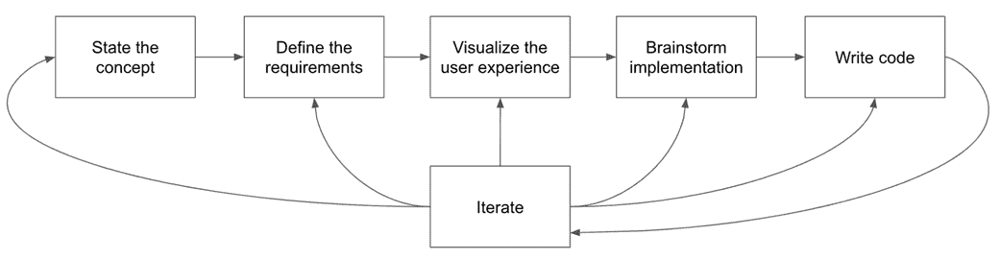

##### 图 3.1 六阶段应用开发流程

1.  **阐述概念**：为了解决问题——或者向他人描述它——你首先需要能够以高度概括的方式简洁地表述它。

1.  **定义需求**：这是你细化概念并将其分解为冷冰冰的需求的地方。这包括定义你的应用将做什么——也许更重要的是——**不会**做什么。

1.  **可视化用户体验**：绘制你设想的使用者在使用你的应用时的体验的图表和原型。

1.  **头脑风暴实现**：你的解决方案将包含哪些组件，它们将如何相互集成，你将面临哪些权衡？

1.  **编写代码**：实际实现你的应用。

1.  **迭代**：检查你的输出并根据需要调整步骤 1 至 5。

这可能听起来很多，你可能会想：“这一切真的有必要吗？我并不是在大型团队中构建企业级软件，我只是在为少数用户制作一个相当小的应用程序。”

以上步骤的美丽之处在于，你可以根据项目的需求调整它们。如果你在处理一个大型项目，上述每个步骤可能都需要很长时间，因为可能有很多需要就整体方法达成一致的人。

但如果你在构建一个小型项目，你可以将每个步骤缩小到更合理的大小。例如，你可以快速列出需求，可能只需要五分钟就能完成，你的用户体验可视化可以是一个简单的草图。

在本章的剩余部分，我们将以一个示例应用程序的上下文来逐一介绍这些步骤。

##### 注意

在本章的大部分内容中，我们的注意力将集中在端到端的应用程序开发流程上；我们将在讨论前端实现时才介绍各种 Streamlit 元素。这是有意为之，以反映现实世界，在开发图形应用程序时，你的主要关注点将是应用程序本身，而不是 Streamlit。这也解释了 Streamlit 的成功：它*不会妨碍你*，这样你就可以开发应用程序而无需过多担心如何实现 UI。

所以尽管在本书的早期部分你不会看到很多关于 Streamlit 本身的讨论，但请耐心等待！我们会自然而然地找到最合适的位置来介绍它！

## 3.2 提出我们的概念：一个单位转换器

不论是在学习物理学、根据食谱烹饪一顿饭，还是在国际旅行中，我相信你一定遇到过需要在不同测量单位之间转换的情况，比如将杯转换为盎司，码转换为米等等。你可能不得不在网上查找转换系数，然后使用计算器进行实际转换。

在本章中，我们将要工作的应用程序将使这项任务更容易、更流畅。

正如我们在上一节中讨论的，开发过程的第一步是“提出概念”，即简洁地表达我们要解决的问题，最好是单句或一行。

这是我们的概念：

##### 概念

一个 Streamlit 应用程序，允许用户轻松地在不同的测量单位之间转换，如距离、质量和时间。

提出概念揭示了你要做的核心内容，并集中你的思考，防止你偏离数十个方向。

在开发应用程序的过程中，你可能会遇到各种新的可能性以及要整合的潜在功能。提出的概念作为一个参考点，确保你考虑的任何变化仍然满足其中阐述的核心思想。

例如，你可能会想，“也许我应该制作一个单位概述页面，解释单位的历史以及它是以什么命名的。”如果你将它与我们的单行概念进行比较，你会发现这样的页面实际上并不帮助我们实现让用户轻松转换单位的目标，所以可能明智地将其删除。

当然，这并不意味着你阐述的概念是固定不变的。如果你遇到一个可以显著丰富你为用户提供体验的想法，但它与概念不太吻合，你可以自由地重新阐述概念。

最后，阐述概念的好处是给你提供一个可以与他人分享的一行描述，以帮助他们理解你的工作。这在你获取用户或寻找合作伙伴时特别有价值。

## 3.3 定义需求

你的概念作为你应用的一种使命宣言效果很好，但它对细节的描述有些模糊。接下来的步骤是将概念分解成具体的*需求*，你可以朝着这些需求去构建。

将这些视为你的利益相关者（你的用户、你合作的团队等）希望应用执行的具体事项列表。

需求应：

+   表达应用应具备的能力

+   避免使用“实现”语言，例如，不应提及任何技术

对于你在现实生活中构建的应用程序，制定需求列表可能需要通过采访人们来了解他们的需求。

为了我们的示例，以下是我们要围绕应用中心化的需求列表：

#### 需求：

+   用户应能够输入一个数值数量及其单位（“源单位”）。

+   用户应能够选择要转换到的单位（“目标单位”），该单位必须测量与“源单位”相同类型的事物。例如，不能从磅转换为码。

+   应用应显示转换后的输出值。

+   应用应能够处理英制或公制系统内的转换（例如，英尺到英寸或米到厘米），以及跨公制系统的转换（例如，英尺到米）。

+   向应用中添加新的单位或数量应该是直接的。

注意到上述要点比我们最初的构想要具体得多。同时，请注意需求不仅仅来自用户；它们也可以来自其他人。

为了详细说明，上述列出的前四个需求是用户想要的东西，而最后一个是为了让开发者或维护者生活更轻松，因为你希望尽量减少在响应常见请求（如向应用添加另一个测量单位）上花费的时间。

在组织环境中，你也可以想象来自其他利益相关者的需求，例如分析团队（“我们应该能够监控和跟踪应用的用量”）或货币化团队（“应用应允许用户以月费订阅”）。

你可能已经意识到，需求没有提到实现它们的*技术*。例如，它们没有说“应用应该显示一个用户可以点击以执行转换的 Streamlit 按钮”。

这是故意的；需求是关于利益相关者实际需要的内容。如何实现它们取决于你，开发者。

### 3.3.1 定义应用不会做什么

虽然列出需求是一个重要的步骤，它为完成目标提供了清晰的指导，但有时可能会感觉你只是在重复显而易见的事情。在实践中，即使如此，做这件事也是有价值的，因为对你来说显而易见的事情可能对你的用户或合作伙伴来说并不明显。人们常常会在脑海中形成一个关于你所承诺的内容的图像，这与现实毫不相干。

因此，定义不在应用范围内的内容同样至关重要——可能更有启发性。

对于本章中的单位转换应用，我们希望尽可能保持简单，因为我们不希望在这上面花费太多时间；我们主要构建它是为了熟悉 Streamlit。

任何与单位转换目标无直接关系的辅助功能都应立即排除。我们不希望构建任何使用跟踪或复杂的可视化。

我们还应该尝试保持我们的转换逻辑简单。从英镑转换成千克很容易，因为你可以将转换因子嵌入到你的应用中，但比如说货币呢？

从美元转换成欧元很难，因为汇率每天甚至每小时都在变化。为了包含这一点，你需要从某处读取汇率，比如在线 API。我们将在本书后面的项目中从 API 读取，但就目前而言，最好避免额外的复杂性。所以货币被排除在外。

正式来说：

#### 范围之外的内容

+   使用跟踪、日志记录、可视化等，这些与单位转换无直接关系

+   之间没有简单、恒定的转换因子，如货币之间的转换

这可以是一个有用的工具，用于优先级排序和分阶段实施。即使你现在将某些内容排除在范围之外，你也可能希望在以后构建它们。

明确需求和范围让你可以表达你认为优先考虑的功能，以及你可能希望推迟到未来版本的功能。

如果你还有其他利益相关者，将这些内容写下来是征求反馈和开始关于优先级对话的好方法。

## 3.4 可视化用户体验

到目前为止，我们已经花了不少时间思考我们想要解决的问题；我们已经概念化了我们将要构建的内容，细化了我们对我们应用需要做什么的理解，甚至明确了我们*不会*做什么。

我们还没有开始设计解决方案。这正是我们接下来要做的。

当你开始实际开发应用程序的过程时，你可能发现自己想知道先做什么。你是简单地从上到下编写你的 Python 应用程序代码，边做边设计吗？或者你试图弄清楚应用程序的基本组件以及它们如何组合在一起？或者你可能专注于你认为将是问题中最困难的部分，以便将其排除在外？

这些都是有效的方法，并且可以为每种方法提出论据。我一直认为一种方法非常有价值，我们将在本章中采用这种方法，那就是*从用户体验开始倒推*。

从用户体验开始是一个确保最终产品质量的好方法，因为它将用户置于首位，直接满足他们的需求和偏好。它还有助于在早期过程中识别和解决潜在的可用性问题。

### 3.4.1 创建模拟

那么，我们希望我们的应用程序用户有什么样的体验？为了回答这个问题，让我们创建一个模拟或草图，看看 UI 可能看起来像什么。

回顾我们在 3.3 节中列出的需求，其核心是，应用程序需要提供一种方式，让用户输入数值量以及要转换的单位和目标单位。

图 3.2 显示了一个快速的初步草图。

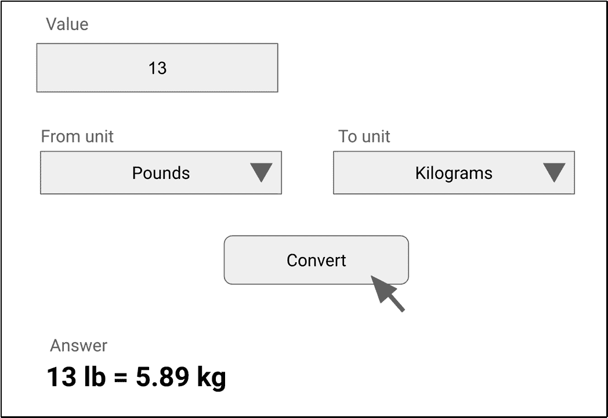

##### 图 3.2 单位转换应用程序的初步模拟

图 3.2 显示了 UI 设计的第一次尝试。它相当简单：有一个框，你可以输入要转换的值，你可以从选择框中选择“从”单位和“到”单位。完成之后，你点击“转换”按钮，答案就会出现在下面。

你可以用笔和纸、记号笔和白板，或者你喜欢的任何图形程序制作这样的图表。它实际上不需要太复杂，甚至不需要特别整洁。重要的是它应该显示你试图创建的最终结果，迫使你从用户的角度思考你的应用程序。

### 3.4.2 确保用户体验正确

让我们更仔细地看看我们的模拟。这里有一些选择框来选择一个“从”单位和“到”单位，但如果这些单位不兼容怎么办？如果用户选择“磅”（质量单位）作为“从”单位，而选择“英尺”（测量长度）作为“到”单位，并尝试在它们之间进行转换（见图 3.3）？

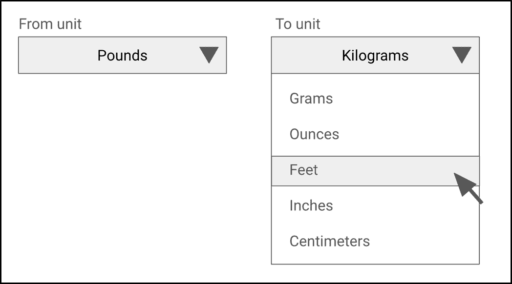

##### 图 3.3 我们最初的 UI 允许用户选择不兼容的单位，如“磅”到“英尺”

当然，你可以显示一个错误消息。这会起作用，但这对用户来说可能不是一次很好的体验。用户通常希望他们的体验尽可能无摩擦，他们*讨厌*收到错误。更好的 UI 将使最初犯错误变得不可能。

例如，当用户选择“磅”时，我们可以将“到”单位的下拉菜单中的选项缩小到仅与磅兼容的单位（见图 3.4）。

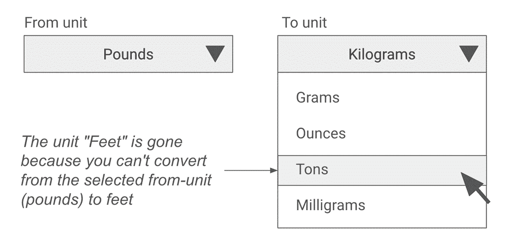

##### 图 3.4 我们可以将目标单位下拉菜单更新为只显示与所选源单位兼容的单位

这样就解决了不兼容单位的问题，但可能会引入另一个问题。如果用户想要首先选择目标单位怎么办？我们可以潜在地应用反向逻辑，并更新源单位列表，使其只包含与所选目标单位兼容的单位。本质上，无论先选择哪个单位，另一个下拉菜单都限制为与该单位兼容的单位，如图 3.5 所示。

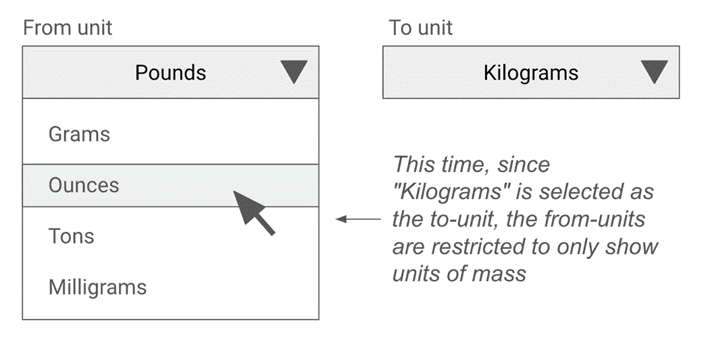

##### 图 3.5 双向限制：当选择一个单位时，另一个下拉菜单更新为只显示兼容的单位

但如果用户现在想要在完全不同的量单位之间进行转换，比如从英尺到英寸的长度转换呢？

当他们尝试在源单位列表中选择“英尺”时，他们会发现它不再列表中，因为源单位被目标单位下拉菜单中的选择人为地限制为只有质量单位，该下拉菜单显示“千克”（见图 3.6）。

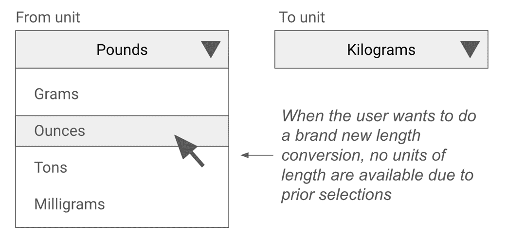

##### 图 3.6 前面的选择会创建一个令人困惑的体验，因为用户现在无法从其他量中选择单位

有多种方法可以解决这个问题。

我们可以强制执行一条规则，即用户必须首先选择源单位。但这感觉有点人为的限制，并不是业务问题的固有属性。

我们可以引入一个重置按钮，用户可以在想要开始新的转换时点击，重置两个下拉菜单。这可以工作，而且并不算太糟糕，但似乎对用户来说工作量很大。

处理这个问题最直观的方法是简单地为用户想要转换的量类型添加另一个输入。例如，如果用户在这个新的下拉菜单中选择“质量”，那么源单位和目标单位将只显示质量单位，如图 3.7 所示。因此，我们不是根据下拉菜单之间的相互关系来限制它们，而是根据第三个外部选择来限制它们。

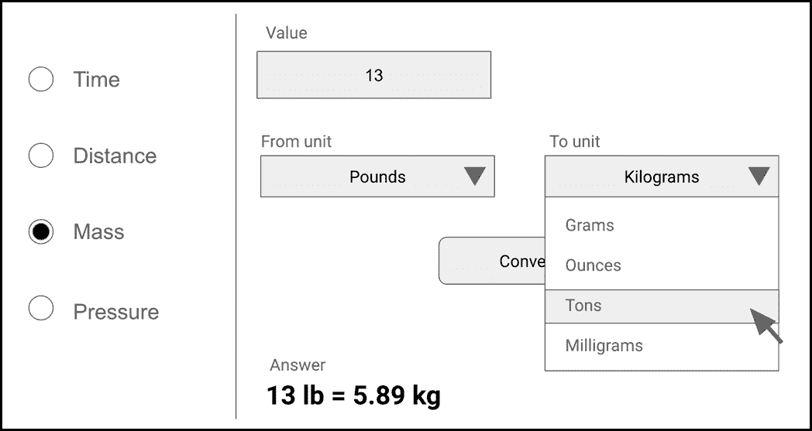

##### 图 3.7 添加量类型选择器使应用程序更直观

这以一种非常优雅的方式解决了问题，同时用户界面也非常直观。用户需要做什么一目了然：选择一个量，输入一个值，选择源单位和目标单位，然后点击“转换”。

注意，虽然图 3.7 显示了量类型的选择按钮，我们也可以使用下拉菜单。选择按钮稍微改变了事情，并且比下拉菜单少一个点击，但使用下拉菜单的体验并不明显更差。无论如何，当您实际使用 Streamlit 进行实现时，您可能会发现如何呈现输入的新可能性。

我希望这能让你了解如何开始设计 UI 以及其中的一些权衡。当然，我们总会关心更多因素——例如，用户是否关心英制和公制系统单位，我们的 UI 是否应该以某种方式区分它们？——但这已经是一个我们可以感到舒适的坚实基础。

我们已经对我们的 UI 进行了相当多的细化，但你仍然不应该觉得它一定是最终的。随着我们深入实施，你可能会发现更多你想做的优化。实际上，我们将在接下来的章节中遇到一些这些优化，并对我们的设计进行迭代。

##### 注意

由于你将使用 Streamlit 来实现你的 UI 设计，在可视化用户体验时可能会出现的一个自然问题是，你是否应该考虑 Streamlit 中可用的各种元素，这样你就不会设计出无法实际构建的东西。

在我看来，这是本末倒置。在理想的世界里，你想要弄清楚用户最佳体验，然后使用 Streamlit*实现*它。你不希望让 Streamlit 限制你对理想用户体验的想法。

当然，这也存在一些风险；在罕见的情况下，你可能会发现 Streamlit 没有你设计中所期望的精确元素，需要调整你的实现。但实际上，这会通过使 Streamlit 的不足更加明显来丰富你的学习之旅。它还将确保用户体验不会受到你对 Streamlit 功能集预设的约束，而 Streamlit 的功能集一直在不断扩展。

## 3.5 实施方案构思

我们现在大致知道了我们应用中最终用户的体验将是什么样的。让我们把注意力转向让这种体验成为现实。

在这个过程的这一步，我们将列举我们解决方案的各个部分，讨论它们如何配合，并绘制逻辑流程图。

几乎任何应用程序都有两个主要部分：前端和后端。前端处理用户如何与你的应用交互，即我们如何收集输入并显示输出。后端是应用的“大脑”，它从前端接收输入，处理它们，并将输出交给前端以显示给用户。

根据上一节，我们已经对应用的前端有了相当的了解；我们只需要将 UI 翻译成 Streamlit 中相应的元素，我们将在代码讲解中完成这一步。

因此，我们将把注意力转向后端，从实际的单位转换开始。

### 3.5.1 执行实际的单位转换

假设我们想要将 5 磅（lbs）转换为盎司（oz）。通过在线搜索（我是在公制系统中长大的），1 磅等于 16 盎司。

因此，要将 5 磅转换为盎司，我们需要将 16 乘以 5 得到 80 盎司。

我们将把数字 16 称为*磅到盎司转换系数*。

每一对单位都有一个类似的转换系数。例如，1 码等于 3 英尺，因此码到英尺的转换系数是 3。以英制到公制的例子来说，1 英里等于 1.609344 公里，因此英里到公里的转换系数是 1.609344。

为了一般性地说明，对于任何一对单位 X 和 Y，要将用 X 表示的给定值转换为 Y，

单位 Y 中的值 = 单位 X 中的值 * X 到 Y 的转换系数

要进行反向转换（例如，盎司到磅），你可以使用计算为原始转换系数倒数的转换系数。

所以，

1 码 = 3 英尺；1 英尺 = ⅓码；英尺到码的转换系数 = ⅓1 英里 = 1.609344 公里；1 公里 = 1/1.609344 = 0.621372 英里；公里到英里的转换系数 = 0.621372

根据这些信息，似乎我们只需要收集一个数量类型中所有可能单位对之间的转换系数，并应用上述公式。

但这里有一个问题：我们可能会遇到很多需要跟踪的转换系数。

假设我们想让用户能够在 3 个单位之间进行转换：磅、千克和盎司

有 3 x (3-1) = 3 x 2 = 6 种可能的转换类型可以进行：磅到千克，千克到磅，磅到盎司，盎司到磅，盎司到千克，以及千克到盎司。

这意味着我们需要跟踪 6 个转换系数。从我们上面的讨论中，我们已经看到，如果我们知道 X 到 Y 的转换系数，那么 Y 到 X 的转换系数就是 X 到 Y 转换系数的倒数。利用这一点，我们可以将需要跟踪的转换系数数量从 6 个减少到 6 / 2 = 3 个。

通常情况下，如果你有 n 个单位，为了能够在任意一对单位之间进行转换，我们需要 n (n-1) / 2 个转换系数。

我们上面的例子看起来并不太糟糕。但如果我们有超过 3 个单位的特定数量类型怎么办？如果我们有 20 个呢？

在这种情况下，我们需要跟踪 20 * (20-1) / 2 = 20 * 19 / 2 = 190 个转换系数。哇！这需要跟踪的数字太多了。

但对于单一数量类型的 20 个单位来说，这有点极端吗？其实并不。以距离或长度为例。如果你计算表示量级的公制系统前缀，以及在天文学或导航中使用的单位，你会得到以下列表：

千米、米、分米、厘米、毫米、微米、纳米、埃、英寸、英尺、码、英里、英里、天文单位、秒差距、光年、海里、英寻、里、肘、皮米、分米、百米…你懂的。

显然，跟踪每一对单位的转换系数是不可持续的。

相反，我们想要做的是为每个数量指定一个单位作为该数量的*标准单位*，并且只跟踪从所有其他单位到该单位的转换系数。

例如，如果我们将米作为距离的标准单位，我们只需跟踪每个单位到米的转换系数，即“在这个单位中 1 的值是多少米？”

然后，要从单位 X 转换为单位 Y，我们可以先从单位 X 转换为米，然后再从米转换为单位 Y。

所以，如果我们想将 5 码转换为厘米：

+   码到米转换系数 = 0.9144

+   厘米到米转换系数 = 0.01

然后，我们可以遵循两步转换过程（见图 3.8）：

1.  5 码 = 5 x 0.9144 米 = 4.572 米

1.  4.572 米 = 4.572 x 1 / 0.01 厘米 = 457.2 厘米

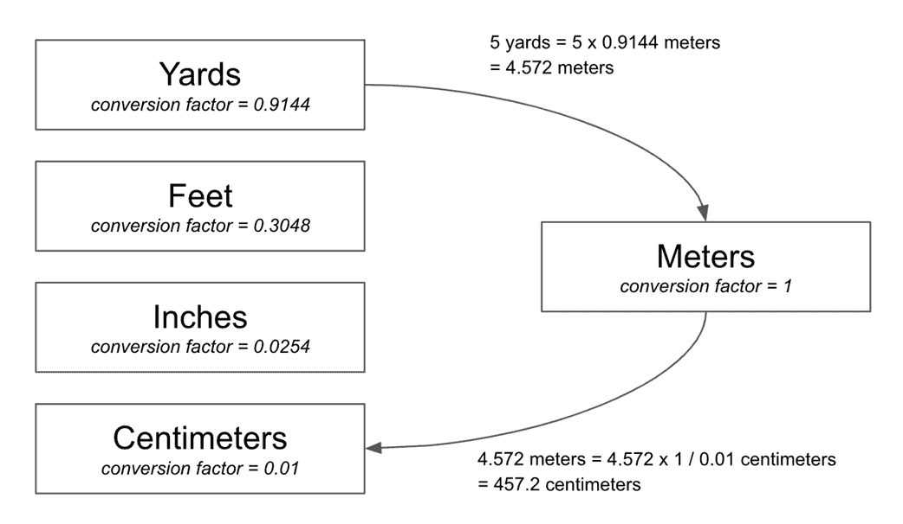

##### 图 3.8 使用米作为标准中间单位将码转换为厘米

注意，由于我们总是存储单位到米的转换系数，在步骤 2 中，我们必须除以系数以获得反向转换系数，即米到厘米。

更普遍地说，给定一对单位 X 和 Y 以及一个标准单位 S，要将用 X 表示的值转换为 Y，

单位 S 中的值 = 单位 X 中的值 * X 到 S 转换系数单位 Y 中的值 = 单位 S 中的值 * 1 / Y 到 S 转换系数

我们现在拥有一个更易于管理的转换系数数量：因为我们只关心给定单位有多少标准单位，所以我们只需为每个单位存储一个系数。

### 3.5.2 跟踪单位和转换系数

回想一下，我们最初的要求之一是向应用程序添加新单位必须简单明了。

当我们提到“添加新单位”时，我们是指我们更新应用程序以包括更多的转换单位进行转换，而不是用户能够动态地添加单位。

这是一个**非用户需求**的例子。我们的用户可能并不关心我们添加新单位有多容易；他们关心的是单位是否可供他们进行转换。那么，谁**会**关心呢？开发者会。**我们**会。

作为一名开发者，一旦你发布了软件，你通常永远不会完成它。如果你的应用程序被足够多的人使用，你可以期待持续不断的反馈、报告的 bug 和请求的功能源源不断地到来，并消耗你原本计划用于其他项目的时光。或者更糟糕的是，有人**其他**人将负责维护你的代码，而他们将不知道它的工作原理。

在这种情况下，如果你没有为应用程序的实现设计易于维护，那么有人将不得不花费大量时间挖掘你的代码，以找出正确的更改位置并确保没有副作用。即使你对其他开发者并不特别慷慨，也总是有可能那个人**就是**你。从个人经验来说，你会惊讶于你甚至一个月前写的代码你记得有多少。

回到我们的单位转换器，你可能需要执行的最常见的维护任务之一是添加新单位，我们希望使其尽可能简单。理想情况下，代码中应该只有一个地方需要添加单位及其转换系数，并且它应该是最明显的地方。

实现这一点的有效方法是将所有量、单位和转换系数的列表保存在一个单独的配置文件中。该文件应具有明显的格式，添加新单位应像在文件中追加几行一样简单。

关键的是，这个配置文件应该是*唯一*引用任何特定量的文件。这意味着应用中的其他地方不应引用特定的量或单位，如米或磅。这是因为如果它们这样做，添加新量或单位将需要更新代码的这一部分，这违反了我们要求代码易于更新的要求。

这有一个有趣的含义：我们任何时候都不能在我们的 UI 代码中硬编码量或单位。与特定量或单位相关的所有内容都需要从配置文件中提取。我们的其余代码需要与它们独立。

我们将在本章后面的代码演练中看到如何做到这一点。

### 3.5.3 逻辑流程映射

我们现在对应用的所有单个部分都有了很好的理解：前端、转换逻辑和配置。

在我们编写代码之前，有一个如何将它们组合在一起的心理模型是有用的。图 3.9 展示了我们应用的整体设计。

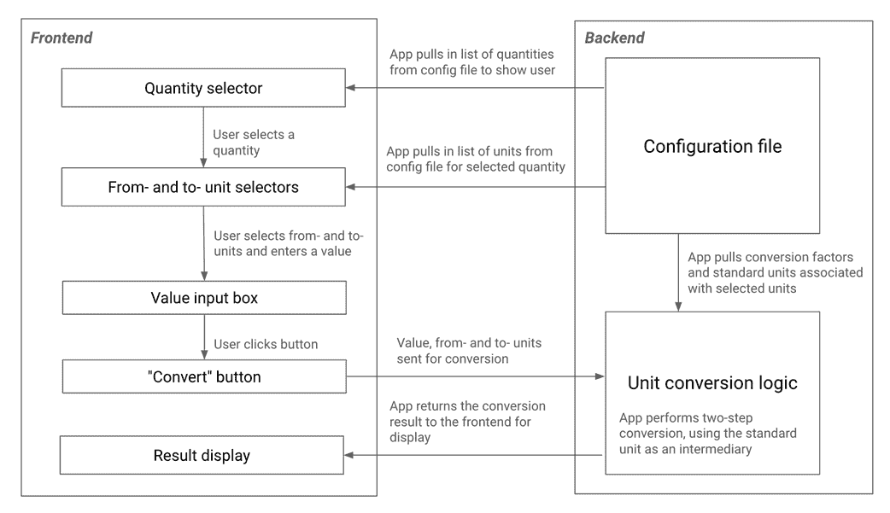

##### 图 3.9 我们单位转换应用的整体设计和逻辑流程

我们在上一节中讨论的配置文件为从我们之前可视化的 UI（图 3.10）中的量选择单选按钮提供动力。

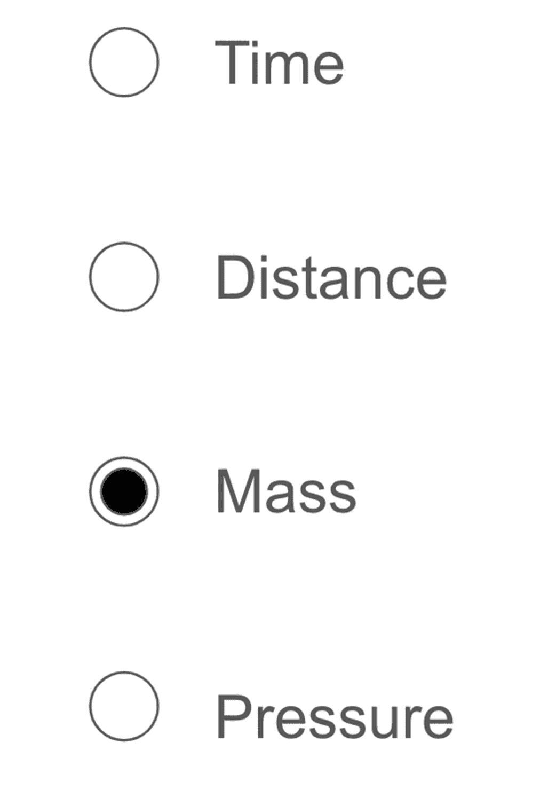

##### 图 3.10 来自我们模拟的量选择单选按钮

一旦用户选择了量，从单位和到单位下拉列表将根据所选量更新（同样由配置文件提供动力）。

当用户选择了从单位和到单位并点击“转换”按钮后，所有条目都会发送到后端，在那里使用配置中的转换系数执行第 3.5.1 节中概述的两步转换。

转换后的值随后返回到前端，用户可以查看它。

### 3.5.4 后端 API

在软件开发中有一个关键概念叫做*关注点分离*。本质上，这意味着软件中的每个构建块都应该关注整体系统功能的一个方面，并且应该独立于其他构建块。当一个块与另一个块交互时，它应该按照由*契约*定义的严格受控的方式进行交互。

为了更好地理解这一点，考虑一下一家快餐店的运作方式。前面有一个人在接顾客的订单，厨房根据菜单准备食物。接单的人不在乎厨房使用什么食材，只要它能做出菜单上的菜肴即可，厨房也不在乎接单的人对顾客说什么语言，只要订单上的菜肴来自菜单即可。

如果厨房想要雇佣新厨师或使用不同的食材，它可以这样做，只要准备的菜肴与菜单相符。如果我们想用电话接单的人替换现场接单的人，我们也可以这样做，而不会影响厨房。

使这一切成为可能的是菜单，这是一个共同的共享*合同*，通过这个合同，接单人和厨房进行交互。

在开发应用程序时，将组件分离并让它们通过称为*应用程序编程接口*（简称 API）的合同进行独家交互是一个好主意。在我们的应用程序的上下文中，我们应该在前后端之间保持这种分离。

这意味着我们的前端应该只与后端交互，请求它执行一系列特定的操作。

这些操作究竟是什么呢？让我们回顾一下图 3.11 中的逻辑流程图。前端和后端之间有四条箭头：

+   这是一个前端从后端拉取数量以向用户展示的场景，

+   这是一个它拉入用户选择的数量对应的单位的情况，

+   这是一个前端提供要转换的值的情况，

+   这是一个后端返回转换值的情况

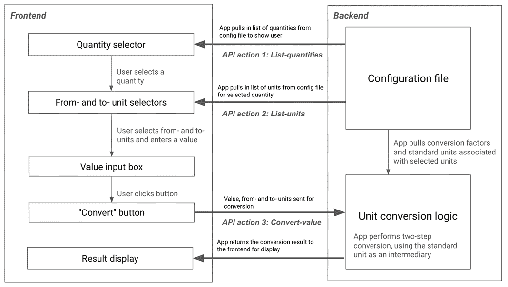

##### 图 3.11 展示了我们的应用程序的流程图，其中 API 操作被突出显示

这些可以归结为前端与后端之间的三种交互（最后两条箭头实际上是同一交互的两个部分）：

+   **列出数量**：前端请求后端提供它支持的数量的列表。

+   **列出单位**：前端给后端一个数量，并请求它列出它知道如何在该数量之间转换的单位。

+   **转换值**：前端给后端提供要转换的值和用户选择的单位，并请求它进行转换。

上述操作构成了我们后端的菜单或 API。正如在我们的快餐示例中，只要后端能够履行这些职责，它就可以自由地以任何方式实现它们。也许在某个时候，我们会找到一种更有效的方法来执行转换。或者可能想要将后端连接到外部服务以执行转换。在两种情况下，我们都可以在不触及前端代码的情况下更改后端实现。

或者，也许在某个时候，我们希望在我们的图形用户界面之外，为我们的转换应用程序启用命令行界面。在这种情况下，我们可以简单地添加它，而无需对现有的前端代码进行任何更改。

如您所见，将前端和后端之间的关注点分离给我们带来了很多灵活性。我们的应用程序足够简单，其好处可能并不明显，但这是一个好习惯，因为它将在您开发更复杂的应用程序并需要轻松更换组件时在现实世界中帮助您。

我们很快就会看到如何实际实现这种 API 方法。

## 3.6 编写代码

到目前为止，我们已经花了很多时间思考我们应用程序的设计，现在我们准备好编写一些代码了。

在本节中，我们将遍历我们的应用程序代码，从我们的配置文件开始，它在我们的设计中扮演着核心角色。我们将定义前端和后端之间的*契约*或*API*，然后让后端履行该契约。

最后，我们将编写我们的前端，在这样做的同时了解使我们的用户界面成为可能的 Streamlit 元素，并通过我们定义的契约对后端进行调用，以完成循环。

### 3.6.1 创建配置文件

我们的配置文件是我们应用程序理解的单位和数量的信息存储处。

从我们的设计来看，我们知道应用程序需要查找给定数量的单位。此外，给定一个单位，它需要能够查找相对于该数量的标准单位的转换系数。

Python 字典听起来像是完成这项任务的理想选择。这个字典中的每个键都是一个数量，相关值是一个单位列表，或者更好的是，*另一个*字典，其中键是单位，值是对应的转换系数。

写作这种代码的一种可能方式可能是以下内容：

```py
unit_config = {
    "Mass": {
        "Kilograms": 1, # Standard unit
        "Grams": 0.001,
        "Pounds": 0.453592,
        # ...
    },
    "Length": {
        "Meters": 1,  # Standard unit
        "Centimeters": 0.01,
        # ...
    },
}
```

这当然有效，但如果我们也能显示单位的缩写（例如，'oz'代表盎司或'kg'代表千克），并且我们可能还应该将数量的标准单位存储起来，那就更好了。

我们已经到达了一个阶段，单位与数量被明确定义为具有自身属性的“事物”（一个单位有一个缩写和一个转换系数，一个数量有一系列单位以及一个被指定为标准单位的一个单位）。我们*可以*通过扩展我们的字典以拥有更多的“层”来表示这种复杂性，但定义*类*来表示单位和数量会是一个更好的实践。

因此，启动您的代码编辑器并创建一个名为`unit.py`的文件（见列表 3.1），以定义单位类。在这里，我们将使用一个*数据类*，这是 Python 中的一种特殊类型类，通过`dataclasses`模块启用，它是 Python 标准库的一部分。

##### 列表 3.1 unit.py

```py
from dataclasses import dataclass

@dataclass
class Unit:
    abbrev: str
    value_in_std_units: float
```

数据类是创建具有一些标准基本功能类的简单方法。例如，使用数据类，你不需要像使用普通类那样指定`__init__`方法，一旦你有一个数据类的对象，你可以使用点符号访问其属性，就像这样：

```py
gram = Unit(abbrev="g", value_in_std_units=0.001)
print(gram.abbrev) # Prints 'g'
```

要使用普通类实现相同的功能，你将不得不编写：

```py
class Unit:
    def __init__(self, abbrev, value_in_std_units):
        self.abbrev: str = abbrev
        self.value_in_std_units: float = value_in_std_units
```

使用数据类，你可以通过在类定义上方包含`@dataclass`装饰器来使用列表 3.1 中的更简洁的语法。

转到类的内容，你可以看到它们相当简单；有一个`abbrev`字符串字段，用于存储单位的缩写，还有一个`value_in_std_units`，它是一个表示我们在 3.5.1 节中讨论的转换系数的浮点数。

列表 3.1 中的`: str`和`: float`被称为*类型注解*。它们用于指定字段的类型。类型注解不是强制性的，但这是一个好习惯，因为（在其他方面）它们使你的代码更容易理解，并允许你的代码编辑器或 IDE 在早期捕获并突出显示错误。

你可能已经注意到，我们没有在`Unit`类中包含一个`name`字段。当我们到达配置文件时，我们将讨论为什么。

让我们也在一个新文件`quantity.py`中定义一个`Quantity`类。

##### 列表 3.2 quantity.py

```py
from dataclasses import dataclass
from typing import Dict

from unit import Unit

@dataclass
class Quantity:
    std_unit: str
    units: Dict[str, Unit]

```

列表 3.2 显示了`Quantity`类。它包含两个字段：`units`和`std_unit`。

`std_unit`在这里是该量的标准单位名称。

注意我们为`units`字段使用的更复杂的类型注解。`Dict[str, Unit]`表示`units`是一个字典，其中每个键是一个字符串（单位的名称），相应的值是`Unit`类的对象。对于一些更高级的类型，需要从`typing`模块导入注解。

在完成这些之后，我们现在可以创建我们的最终配置文件（见列表 3.3）。

##### 列表 3.3 unit_config.py

```py
from typing import Dict

from quantity import Quantity
from unit import Unit

unit_config: Dict[str, Quantity] = {
    "Mass": Quantity(
        std_unit="Kilograms",
        units={
            "Kilograms": Unit(abbrev="kg", value_in_std_units=1),
            "Grams": Unit(abbrev="g", value_in_std_units=0.001),
            "Pounds": Unit(abbrev="lb", value_in_std_units=0.453592),
            "Ounces": Unit(abbrev="oz", value_in_std_units=0.0283495),
            # Add more units here
        }
    ),
    "Length": Quantity(
        std_unit="Meters",
        units={
            "Meters": Unit(abbrev="m", value_in_std_units=1),
            "Centimeters": Unit(abbrev="cm", value_in_std_units=0.01),
            "Inches": Unit(abbrev="in", value_in_std_units=0.0254),
            "Feet": Unit(abbrev="ft", value_in_std_units=0.3048),
        }
    ),
    "Time": Quantity(
        std_unit="Seconds",
        units={
            "Seconds": Unit(abbrev="s", value_in_std_units=1),
            "Minutes": Unit(abbrev="min", value_in_std_units=60),
            "Hours": Unit(abbrev="hr", value_in_std_units=3600),
            "Days": Unit(abbrev="d", value_in_std_units=86400),
        }
    ),
    # Add more quantities here
}
```

我们配置仍然是字典的形式，但现在每个字典值现在是一个`Quantity`类的对象。我们的文件包括三个量：质量、长度和时间。

让我们检查其中一个：

```py
"Mass": Quantity(
        std_unit="Kilograms",
        units={
            "Kilograms": Unit(abbrev="kg", value_in_std_units=1),
            "Grams": Unit(abbrev="g", value_in_std_units=0.001),
            "Pounds": Unit(abbrev="lb", value_in_std_units=0.453592),
            "Ounces": Unit(abbrev="oz", value_in_std_units=0.0283495),
            # Add more units here
        }
    )

```

如你所见，这是相当易读的。我们正在配置一个名为“质量”的量，作为一个具有标准单位“千克”的`Quantity`对象。`units`字典有四个条目，每个单位一个，其中值是一个具有缩写和转换系数的`Unit`对象。

由于“千克”是标准单位，其`value_in_std_units`值为 1。

你现在可能也意识到了为什么`Unit`和`Quantity`类都没有`name`字段。因为单位和数量名称已经包含在`unit_config.py`中的字典键中，所以在类中再包含它是不必要的，这会使配置文件更长且更难以阅读。

添加更多单位很容易；你只需在`Quantity`中的`units`字典中添加新的条目。同样，添加新的量只需在`unit_config`字典中追加，遵循前一条目的格式。

### 3.6.2 实现 API

在本章的早期（3.5.4 节），我们列举了后端能够执行的操作：

+   列表-量

+   列表-单位

+   转换值

现在让我们实际实现这些。

我们希望上述每个动作都是后端的一个函数。对于每个动作，我们首先将给出函数签名，然后实现它。

**列表-量**非常简单；它要求后端列出它所知道的所有量。不需要任何参数，输出可能是一个字符串列表。因此：

```py
def list_quantities() -> List[str]
```

我们如何实现这个？嗯，我们需要的是`unit_config.py`（列表 3.3）中配置对象的键。因此，我们可以简单地写出：

```py
def list_quantities() -> List[str]:
    return list(unit_config.keys())
```

**列表-单位**确实需要一个参数（要列出单位的量），它将再次返回一个字符串列表。因此我们得到：

```py
def list_units(quantity_name) -> List[str]
```

实现这一点也很直接。我们需要列表是由`Quantity`对象中`unit_config`的`quantity_name`键对应的`units`字典的键组成的。

```py
def list_units(quantity_name) -> List[str]:
    return list(unit_config[quantity_name].units.keys())
```

##### 注意

你可能会意识到我们没有处理提供的`quantity_name`在`unit_config`中不存在的情况。在现实世界中，我们绝对应该这样做，但在这个章节中，我排除了错误处理以保持代码相对简洁。我们将在未来的章节中处理错误处理。

**转换值**需要四个参数：量名、源单位和目标单位，以及要转换的值。我们在这里包含量名是因为不同的量可能有相同的单位名称（尽管我们的示例配置没有这种情况）。

至于返回类型，我们**可以**简单地返回转换后的值，这将是一个浮点数，不再需要其他内容。

然而，记住我们的配置也为每个单位提供了缩写。如果在转换时，我们也能给前端提供适当的缩写，以便它可以显示类似“15 ft = 5 yd”的内容，那就太好了。

另一方面，我们不想对前端如何实际显示结果做出规定；这是前端的事务——记得*关注点分离*？如果前端只想显示转换后的数字而不带缩写，那也是完全可以的。

一种方法是将前端可能需要的任何元数据包装在一个专门的`Result`类中，并让前端决定如何处理它。

让我们在一个名为`result.py`的新文件中定义`Result`类（列表 3.4）。

##### 列表 3.4 result.py

```py
from dataclasses import dataclass
from unit import Unit

@dataclass
class Result:
    from_unit: Unit
    to_unit: Unit
    from_value: float
    to_value: float

```

注意，我们不是只将每个单位的缩写放在结果中，而是包括整个`Unit`。如果我们决定稍后修改`Unit`类并添加更多属性，这段代码就不需要更改。

有了这些，我们就准备好定义**Convert-value**的签名：

```py
def convert_value(
        quantity_name: str,
        from_unit_name: str,
        to_unit_name: str,
        value: float) -> Result
```

我们已经讨论了如何实现转换，但这里以代码形式呈现：

```py
def convert_value(
        quantity_name: str,
        from_unit_name: str,
        to_unit_name: str,
        value: float) -> Result:
    quantity = unit_config[quantity_name]
    from_unit = quantity.units[from_unit_name]
    to_unit = quantity.units[to_unit_name]

    # Two-step conversion: from-unit to standard unit, then to to-unit
    value_in_to_units = (value *
                         from_unit.value_in_std_units /
                         to_unit.value_in_std_units)

    return Result(from_unit, to_unit, value, value_in_to_units)

```

注意我们之前讨论的两个步骤转换。`value * from_unit.value_in_std_units`给出了标准单位中的值，而`/ to_unit.value_in_std_units`将其转换为目标单位。

列表 3.5 将所有这些内容整合到一个单独的`backend.py`文件中。

##### 列表 3.5 backend.py

```py
from unit_config import unit_config
from result import Result
from typing import List

def list_quantities() -> List[str]:
    return list(unit_config.keys())

def list_units(quantity_name) -> List[str]:
    return list(unit_config[quantity_name].units.keys())

def convert_value(
        quantity_name: str,
        from_unit_name: str,
        to_unit_name: str,
        value: float) -> Result:
    quantity = unit_config[quantity_name]
    from_unit = quantity.units[from_unit_name]
    to_unit = quantity.units[to_unit_name]

    # Two-step conversion: from-unit to standard unit, then to to-unit
    value_in_to_units = (value *
                         from_unit.value_in_std_units /
                         to_unit.value_in_std_units)

    return Result(from_unit, to_unit, value, value_in_to_units)

```

### 3.6.3 实现前端

我们终于到了本章的这部分，你将实际使用 Streamlit！

首先，我们将探索我们将要使用的 Streamlit 的每个功能，参考我们之前的 UI 设计（如图 3.12 所示），然后我们将使用它们来创建我们的前端。


##### 图 3.12 我们单位转换应用程序的 UI 可视化，供参考

我们将逐步构建我们的用户界面。首先，创建一个名为`frontend.py`的新 Python 文件，并添加我们需要的导入（即 Streamlit 本身和定义的后端 API 函数）。

```py
import streamlit as st
from backend import convert_value, list_quantities, list_units

```

保存你的文件，并在终端中运行以下命令：

```py
streamlit run frontend.py

```

或者如果你的工作目录不包含`frontend.py`，可以使用`streamlit run <path to frontend.py>`。

这将打开一个浏览器窗口，显示你的应用程序（目前只是一个空白屏幕）。每次你进行更改时，切换回浏览器窗口并点击“重新运行”或“始终重新运行”以查看结果。

#### st.radio

我们将关注的 UI 的第一个组件是数量选择器，它是一组设置在左侧面板中的单选按钮。

单选按钮是一个 UI 元素，允许用户从给定列表中选择一个项目。

例如，如果你将以下内容添加到刚刚创建的`frontend.py`文件中：

```py
quantity = st.radio("Select a quantity", ["Mass", "Force", "Pressure"])
```

Streamlit 将显示问题“选择一个量”以及一个带有“质量”、“力”和“压力”选项的单选按钮列表。一旦用户选择了一个选项，变量`quantity`将包含用户选择的选项（即字符串“质量”、“力”或“压力”）。

在我们的情况下，我们的选项列表将来自后端，回想一下我们有一个名为`list_quantities`（列表 3.5）的函数。因此，我们将会写：

```py
quantity = st.radio("Select a quantity", list_quantities())
```

这给我们展示了图 3.13 中的输出。现在我们得到了“质量”、“长度”和“时间”作为选项，因为`list_quantities`获取`unit_config`（来自我们的配置文件）的键，并将它们作为列表返回，这个列表是`st.radio`的第二个参数。


##### 图 3.13 st.radio 的一个示例输出

`quantity`变量将包含用户当前选择的项（例如，图 3.8 中的“质量”）。

Streamlit 为`st.radio`提供了大量的自定义选项。你可以设置水平选项而不是垂直选项，为每个选项添加标题，完全禁用它们，等等。

您可以在 Streamlit 文档的[`docs.streamlit.io/develop/api-reference/widgets/st.radio`](https://docs.streamlit.io/develop/api-reference/widgets/st.radio)中找到完整的自定义选项列表。

#### st.sidebar

我们已经创建了单选按钮，但现在我们需要将它们放在如图 3.12 所示的左侧面板中。

在 Streamlit 术语中，这种面板被称为*侧边栏*。当您想要创建一组链接，这些链接可以引导到应用中的不同页面，提供一些关于您应用的元信息等时，侧边栏非常有用。

要使用 `st.sidebar`，您需要在其中放置一些内容。有两种方法可以做到这一点：

您可以使用上下文管理器（即 Python `with` 语句）如下所示：

```py
with st.sidebar:
    quantity = st.radio("Select a quantity", list_quantities())
```

您可以将任何 Streamlit 元素放置在 `with` 语句内部，它将在侧边栏中显示。

您还可以使用点符号并引用您想要放置在侧边栏中的元素，将其作为侧边栏的成员，如下所示：

```py
quantity = st.sidebar.radio("Select a quantity", list_quantities())
```

将上述任何一个添加到 `frontend.py` 中都会产生如图 3.14 所示的输出。

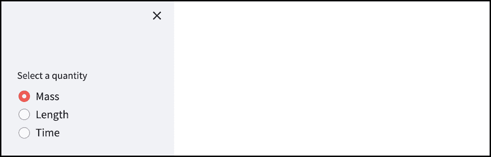

##### 图 3.14 st.sidebar 在使用一组单选按钮时的效果

侧边栏显示一个“X”图标，用于折叠它，或者一个“>”图标，用于展开折叠的侧边栏。

#### st.title

在设置好侧边栏后，让我们将注意力转向应用的主要区域。用户需要了解应用是什么以及它做什么，因此我们将添加一个标题：

```py
st.title("Unit Converter")
```

这应该相当直观，但为了明确说明，`st.title` 将传递给它的任何字符串作为标题写入，即以大号粗体字体。

#### st.text_input

接下来，我们需要用户输入他们想要转换的值。让我们为此使用文本输入框。

`st.text_input` 是 Streamlit 允许用户输入单行值的方式。我们可以这样写：

```py
input_num = st.text_input("Value to convert", value="0")
```

显示一个带有标题“要转换的值”和初始值“0.”的文本输入框。请注意，`st.text_input` 返回一个字符串，因此 `input_num` 有字符串“0.”。

我们希望将其保持为数字，因此我们还将值转换为浮点数：

```py
input_num = float(st.text_input("Value to convert", value="0"))
```

在添加标题和文本输入框后，我们的应用应该看起来像图 3.15。

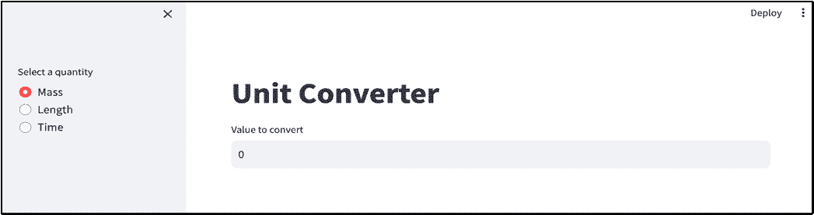

##### 图 3.15 添加标题和文本输入框后的单位转换器应用

`st.text_input` 有许多自定义选项，例如在未输入值时显示的占位文本，可选的工具提示，以及输入密码的能力（我们在第二章的密码检查器应用中遇到过这种情况）。

再次强调，docs.streamlit.io 上有更多关于可用功能的详细信息。

#### st.selectbox

我们需要下拉菜单，让用户选择从和到单位，因此让我们创建这些下拉菜单。

`st.selectbox` 是我们在这里要找的。它显示一个带有标签和一组选项的基本选择小部件。

参数类似于您传递给 `st.radio` 的参数。例如，我们可以这样写：

```py
country = st.selectbox("Pick a country", ["United States", "Canada", "India"])
```

显示一个包含变量 `country` 的国家下拉菜单，其中包含所选选项。当下拉菜单首次渲染时，默认选中第一个选项（在本例中为“美国”）。

对于我们的用例，我们首先需要收集要显示的选项列表。我们可以从后端调用`list_units`来获取用户所选数量的可用单位：

```py
units = list_units(quantity)
```

我们可以使用这个列表来填充我们的“从”和“到”单位下拉菜单中的选项：

```py
from_unit = st.selectbox("From", units)
to_unit = st.selectbox("To", units, index=1)
```

我们在第二个下拉菜单中包含的`index`参数用于设置默认选中的选项。值为'1'表示在第一次渲染时将选中第二个选项。

我们这样做是因为我们不希望“从”和“到”下拉菜单有相同的默认选中值，因为这几乎永远不会有用（用户不会想从千克转换成千克）。

此时，我们的应用看起来像图 3.16。


##### 添加“从”和“到”单位下拉菜单后的 3.16 单位转换器应用

这*是好的*，但我们的设计是将“从”和“到”下拉菜单并排放置，这似乎更自然。

#### st.columns

默认情况下，Streamlit 按代码中遇到的顺序从上到下显示 UI 元素。

自然地，你并不总是想要这样；有时你想要东西并排排列。我们看到了如何使用`st.sidebar`来做这件事，但一个应用只能有一个侧边栏，它出现在整体 UI 的左侧；它不能是内联的。

`st.columns`就是答案。要使用它，你首先需要创建一个列的列表，指定你想要的列数：

```py
from_unit_col, to_unit_col = st.columns(2)
```

在这里，调用`st.columns(2)`返回一个包含两个列的列表。我们在这里使用的语法称为*列表解包*，它将列表的各个项分配给不同的变量。正如你可能想象的那样，在这里`from_unit_col`将包含第一个列，而`to_unit_col`将包含第二个。

就像在`st.sidebar`的情况下，有两种方法可以将某物放入列中：使用`with`上下文管理器或点符号表示法。因此，我们可以写：

```py
with from_unit_col:
    from_unit = st.selectbox("From", units)
with to_unit_col:
    to_unit = st.selectbox("To", units, index=1)
```

或者更简洁地，

```py
from_unit = from_unit_col.selectbox("From", units)
to_unit = to_unit_col.selectbox("To", units, index=1)
```

一般而言，当你需要在容器（无论是侧边栏、列还是其他东西）内显示多个元素时，`with`上下文管理器更有意义，而当您只有一个项目或想要显示顺序不规则的元素时，点符号表示法效果更好。在整个书中，我们将看到许多这些情况的示例。

图 3.17 展示了此时我们的应用：

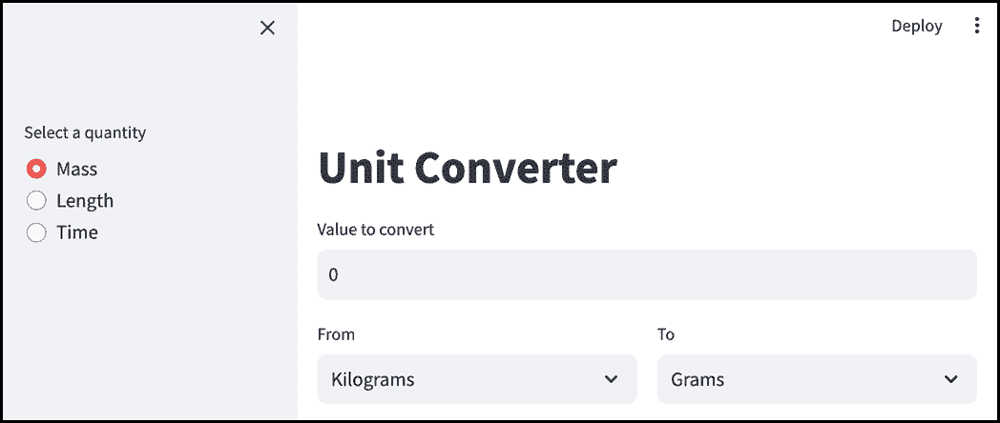

##### 图 3.17 带有并排“从”和“到”单位下拉菜单的单位转换器应用

#### st.button

在捕获所有输入后，我们准备添加我们的“转换”按钮。

我希望你能记得第二章中的`st.button`，Streamlit 的老忠实元素，用于让某事发生。

要添加我们的按钮，我们会写：

```py
if st.button("Convert"):
    # Statements to execute
```

这应该很容易理解。它说，“显示一个写着'转换'的按钮，如果/当用户点击它时，执行一些语句。”

一旦我们写出了我们想要按钮执行的操作，这将渲染一个带有我们定义的功能的裸骨 Streamlit 红白按钮。

那么，我们实际上希望我们的按钮做什么呢？我们的后端有一个`convert_value`函数，它执行单位转换，所以让我们先调用它：

```py
if st.button("Convert"):
    result = convert_value(quantity, from_unit, to_unit, input_num)
```

在这里，我们正在将用户选择的数量、源单位和要转换的值传递给`convert_value`。回想一下，`convert_value`返回一个`Result`类的对象（在`result.py`中定义）

因此，变量`result`包含了我们的转换结果，包括源值、目标值和缩写。剩下要做的就是将其显示在屏幕上。进入…

#### st.metric

我们本可以将结果显示为普通的段落文本，但这是我们应用的大结局，是我们谈论的重点。我们想要一些更有力的东西。

`st.metric`是一个在仪表板上常用的小部件，用于显示重要的数字——比如公司的收入——以及它们与前期相比的趋势。

一个单独的`st.metric`元素旨在表示用户感兴趣的度量，它由三个部分组成：一个文本标签，以大字体显示的数字本身，以及一个“增量指示器”，它显示数字与前期相比增加了多少或减少了多少。

我们将使用`st.metric`来显示源值和目标值以及单位的缩写，所以让我们首先准备这些：

```py
from_display = f"{result.from_value} {result.from_unit.abbrev}"
to_display = f"{result.to_value} {result.to_unit.abbrev}"
```

由于结果是一个`Result`对象，我们通过连接其`from_value`或`to_value`字段并从`from_unit`或`to_unit`获取缩写来形成显示文本，`from_unit`或`to_unit`本身是一个`Unit`实例。

要实际使用`st.metric`，我们编写：

```py
st.metric("From", from_display, delta=None)
st.metric("To", to_display, delta=None)
```

`st.metric`中的增量指示器对我们来说没有意义，所以我们将其设置为`None`以隐藏它。

上述内容将垂直显示源值和目标值，但我们需要它们并排显示，所以让我们再次使用`st.columns`：

```py
from_value_col, to_value_col = st.columns(2)
from_value_col.metric("From", from_display, delta=None)
to_value_col.metric("To", to_display, delta=None)
```

图 3.18 显示了我们的完成的应用程序。

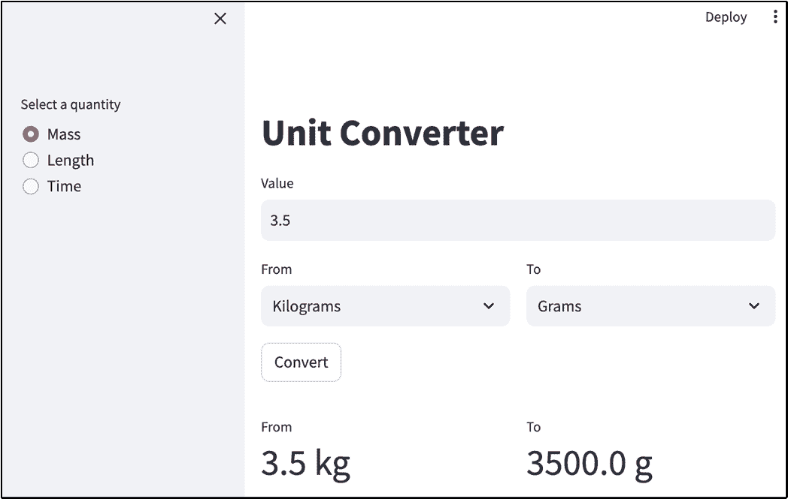

##### 图 3.18 我们的完成的单位转换应用程序

列表 3.6 显示了如果你一直跟随着，你应该结束的`frontend.py`文件。

##### 列表 3.6 frontend.py

```py
import streamlit as st
from backend import convert_value, list_quantities, list_units

quantity = st.sidebar.radio("Select a quantity", list_quantities())

st.title("Unit Converter")
input_num = float(st.text_input("Value to convert", value="0"))

units = list_units(quantity)
from_unit_col, to_unit_col = st.columns(2)
from_unit = from_unit_col.selectbox("From", units)
to_unit = to_unit_col.selectbox("To", units, index=1)

if st.button("Convert"):
    result = convert_value(quantity, from_unit, to_unit, input_num)
    from_display = f"{result.from_value} {result.from_unit.abbrev}"
    to_display = f"{result.to_value} {result.to_unit.abbrev}"

    from_value_col, to_value_col = st.columns(2)
    from_value_col.metric("From", from_display, delta=None)
    to_value_col.metric("To", to_display, delta=None)
```

## 3.7 对我们的应用程序进行迭代

呼呼！我们做到了！我们现在手里有一个完全功能的应用程序。在现实世界中，这仅仅是你的旅程的开始，你现在将启动你的应用程序并向用户展示。

用户经常会对你为他们构建的体验提出非常主观的反馈，这可以帮助你发现你在测试中可能没有遇到的可用性问题盲点。

在本节中，我们将通过使用应用程序本身来模拟此过程，并确定我们可以做出的潜在改进。

### 3.7.1 四舍五入我们的转换结果

让我们试驾我们的完成的应用程序。图 3.18 显示了将千克转换为克的示例结果。

这看起来大部分都很好，但现在让我们尝试一个公制到英制的转换。比如说，我们想把 4000 千克转换成磅。我们启动我们的应用程序，选择“质量”，输入我们的输入并点击“转换”来查看图 3.19。

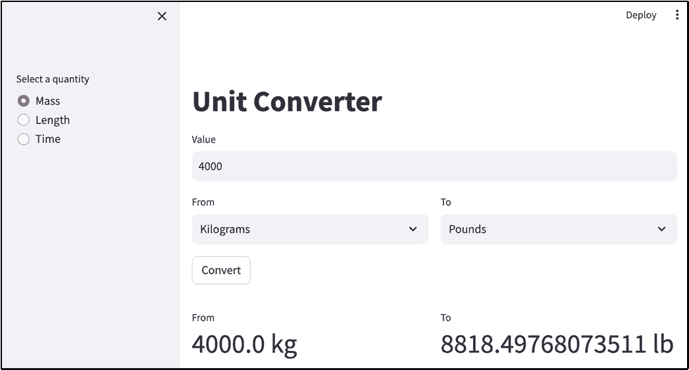

##### 图 3.19 一个公制到英制的转换，展示了为什么我们应该进行四舍五入

我们得到的答案似乎是正确的，但十进制位数却非常多。大多数人可能不需要这种程度的精度；事实上，它可能减少了他们的体验，因为他们需要一秒钟的时间来弄清楚为什么显示的数字这么长。

如果用户可以选择将结果四舍五入到他们真正需要的精度，那将很理想。而且，如果我们考虑到更大的数字，理想情况下应该用逗号分隔千位。

为了实现这一点，让我们首先创建一个名为 `format_value` 的函数，该函数将以我们想要的方式格式化数字，即用逗号分隔千位，并且可选地四舍五入到一定的小数位数。

`format_value` 函数接受三个参数：要格式化的值、缩写，以及一个可选的 `decimal_places` 数量，用于将值四舍五入到。如果我们不传递后者（即 `is_rounded` 为假），则函数不会进行任何四舍五入。

```py
def format_value(
        value: float,
        unit_abbrev: str,
        decimal_places: int = None) -> str:
    is_rounded = decimal_places is not None
    rounded = round(value, decimal_places) if is_rounded else value
    formatted = format(rounded, ",")
    return f"{formatted} {unit_abbrev}"
```

如果我们需要，我们可以使用 `round` 函数进行实际的四舍五入，并使用 Python 内置的 `format` 函数添加逗号，使用 "," 作为 *格式说明符*。

我们可以直接硬编码要四舍五入到的十进制位数，但理想情况下我们应该让用户来决定，这意味着添加一个新的输入小部件。

#### st.number_input

`st.number_input` 是 Streamlit 的数字输入小部件。它与 `st.text_input` 非常相似，但它有一些额外的功能，例如可以指定最小和最大值，以及一个步进按钮，允许您通过点击来增加或减少输入的值。

我们可以通过在 `frontend.py` 中添加以下行来使用它来收集用户首选的十进制位数，就在从单位和到单位下拉菜单之后：

```py
places = st.number_input("Decimal places to round to", value=2, min_value=0)
```

我们指定默认值为 2，最小值为 0，因为我们不能有负数的十进制位数（尝试输入更小的值会显示错误。`places` 将保留输入的数字。

这应该会给我们展示在图 3.20 中的小部件。

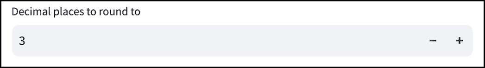

##### 图 3.20 st.number_input

注意 '-' 和 '+' 按钮，它们允许您通过点击增加或减少值 1。您可以通过在 `st.number_input` 中指定 `step` 参数来调整步进间隔。

您可能想知道为什么我们费心使用 `st.text_input` 来收集要转换的值并将其转换为浮点数，当 `st.number_input` 可用时。这是因为在我们写作的时候，似乎没有简单的方法来去除 `st.number_input` 中的 '-' 和 '+' 按钮。当我们收集十进制位数时，这些按钮是有意义的，因为十进制位数是一个非常紧密范围内的整数，但要转换的值几乎是无限的，并且没有预定义的步进间隔是有意义的。

好的，现在我们已经收集了小数位数，我们准备在显示结果时应用我们的格式化。我们可以通过更改`from_display`和`to_display`变量，使它们使用我们之前定义的`format_value`函数来实现：

```py
from_display = format_value(input_num, result.from_unit.abbrev)
to_display = format_value(result.to_value, result.to_unit.abbrev, places)
```

我们传递`places`（我们从用户那里收集）来四舍五入`to_display`变量。我们也可以为`from_display`做同样的事情，但用户可能已经输入了他们想要在源值中看到的精度，所以我们不想去修改它。

这给了我们图 3.21。


##### 图 3.21 单位转换器应用，带有小数位数输入

##### 注意

这不会在目标值后面填充额外的尾随零。例如，如果目标值是一个整数，比如说 600，它将显示为“600.0”，只有一个尾随零。

格式化后的结果看起来更美观，但我们还增加了一个额外的数字输入，这稍微增加了用户的认知负荷。也许我们只应该在用户要求时引入小数位数输入。

#### st.checkbox

`st.checkbox`是 Streamlit 复选框，即你可以勾选的框。请尽量控制你的惊讶，我们有一个可以发布的应用。

如同`st.button`，`st.checkbox`是一个*条件*元素；你可以使用 if 语句根据它是否被勾选来分支你的逻辑。

我们的用例是让用户决定他们是否想要四舍五入转换结果，我们可以通过修改获取`places`变量值的方式来实现：

```py
places = None
if st.checkbox("Round result?", value=False):
    places = st.number_input(
        "Decimal places to round to", value=2, min_value=0)
```

复选框默认未勾选，因为我们向值参数传递了 False。

注意，我们在`st.checkbox`代码上方包含了`places = None`这一行。这是因为，在下面，我们正在引用`places`，它超出了`if st.checkbox`块的作用域，所以我们需要传递一个初始值给它，以防用户未勾选该框。

现在我们的应用应该看起来像图 3.22。

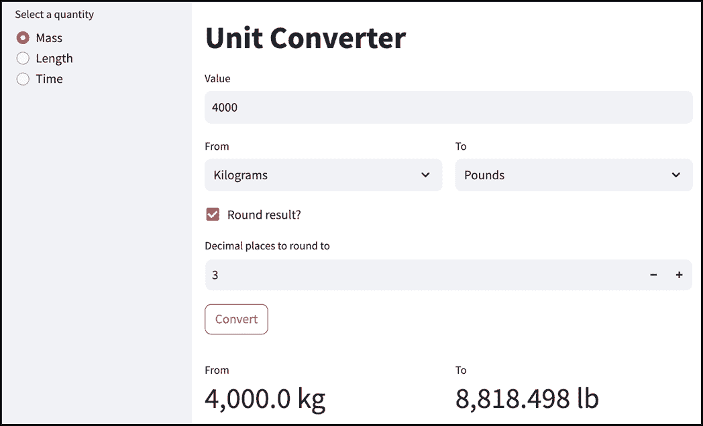

##### 图 3.22 单位转换器应用，启用四舍五入

或者，如果用户未勾选“四舍五入结果？”，我们将得到图 3.23 中的全精度处理。

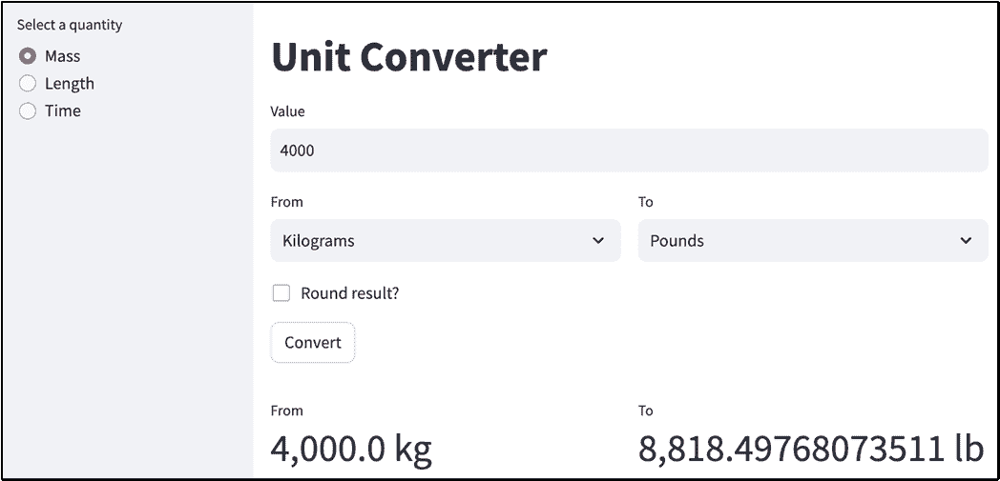

##### 图 3.23 单位转换器应用，禁用四舍五入

### 3.7.2 移除按钮

我们的应用现在工作得很好；它显示四舍五入的输出，但只有在我们想要的时候。我们添加了一个点击和一个数字输入来启用这个功能，然而。

也许有办法简化这个体验？让我们把注意力转向“转换”按钮。我们真的需要它吗？

它所做的只是触发转换。但我们真的不需要一个明确的触发器。为什么不让应用始终根据输入显示结果呢？所以如果用户更改了值，他们会立即看到转换结果，而无需再次点击按钮。

这确实看起来是一个更直观的体验，让我们来实现它。

实际上，这很容易做到。只需删除`if st.button("Convert"):`这一行，并将该块中的所有内容移动到外面。

列表 3.7 展示了`frontend.py`的最终版本。

##### 列表 3.7 `frontend.py`的最终版本

```py
import streamlit as st
from backend import convert_value, list_quantities, list_units

def format_value(
        value: float,
        unit_abbrev: str,
        decimal_places: int = None) -> str:
    is_rounded = decimal_places is not None
    rounded = round(value, decimal_places) if is_rounded else value
    formatted = format(rounded, ",")
    return f"{formatted} {unit_abbrev}"

quantity = st.sidebar.radio("Select a quantity", list_quantities())

st.title("Unit Converter")
input_num = float(st.text_input("Value", value="0"))

units = list_units(quantity)
from_unit_col, to_unit_col = st.columns(2)
from_unit = from_unit_col.selectbox("From", units)
to_unit = to_unit_col.selectbox("To", units, index=1)

places = None
if st.checkbox("Round result?", value=False):
    places = st.number_input(
        "Decimal places to round to", value=2, min_value=0)

result = convert_value(quantity, from_unit, to_unit, input_num)
from_display = format_value(input_num, result.from_unit.abbrev)
to_display = format_value(
    result.to_value, result.to_unit.abbrev, places)

from_result_col, to_result_col = st.columns(2)
from_value_col, to_value_col = st.columns(2)
from_value_col.metric("From", from_display, delta=None)
to_value_col.metric("To", to_display, delta=None)

```

图 3.24 展示了我们应用程序的最终截图。

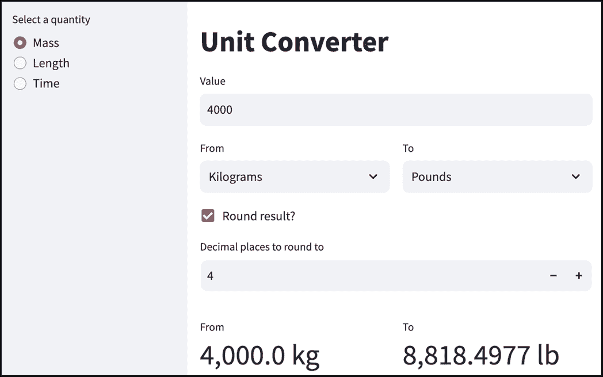

##### 图 3.24 移除了“转换”按钮的单位转换器应用程序

你会发现移除按钮会使应用程序的*流程*变得更好。例如，如果你更改小数位数或值，你会立即看到结果。

我希望这一章对你来说非常有趣！我们从一个简单的概念开始，将其分解为具体的需求，设计了用户界面，深入思考了实施方法，编写代码将我们的想法转化为一个可工作的应用程序，并对其进行了优化以获得更好的用户体验。

本章的目的是让你对在现实世界中与真实利益相关者一起开发 Streamlit 应用程序的感觉有一个了解。正如你可能已经学到的，这个过程远不止编写代码；像确定需求以及设计（和优化）用户体验这样的事情同样重要。

## 3.8 摘要

+   从一个概念构建应用程序远不止编写代码。

+   在现实世界中创建 Streamlit 应用程序涉及以下六个步骤：阐述概念、定义需求、可视化用户体验、头脑风暴实施、编写代码和迭代。

+   需求可能来自你的用户或非用户利益相关者。

+   在开始时通过绘制原型来可视化用户体验是个好主意，这样你就有了一个努力的方向。

+   实施头脑风暴涉及分析权衡并绘制逻辑流程图。

+   将你的前端和后端代码分离，并为两者定义一个 API 以进行交互是组织应用程序的绝佳方式。

+   `st.text_input`和`st.number_input`允许用户输入文本和数值。

+   `st.radio`和`st.selectbox`允许用户从列表中选择一个值。

+   `st.sidebar`和`st.columns`是布局元素，允许你打破 Streamlit 渲染 UI 元素的自然从上到下的方式。

+   `st.button`和`st.checkbox`都是条件元素。
