# 第四章：4 Streamlit 的执行模型

### 本章涵盖

+   创建需要在页面更新之间维护状态的应用程序

+   有效解决你的应用程序问题

+   非常重要的`st.session_state`和`st.rerun`

+   Streamlit 的执行模型

在上一章的最后两章中，你已经通过构建两个功能齐全的应用程序（密码检查器和单位转换器）开始了 Streamlit 的实践。你已经学习了 Streamlit 的语法基础以及如何创建交互元素。但是当你运行一个 Streamlit 应用时，幕后发生了什么？理解这一点对于构建更复杂的应用程序至关重要。

本章深入探讨了 Streamlit 的执行模型的核心，我们将探讨如何管理应用程序的状态。

本章也采取了与前几章略有不同的方法。虽然我们仍然会构建一个实用的应用程序——每日待办事项应用——但主要重点是让你具备解决问题的技能。我们将故意在应用程序中引入一些错误来模拟现实世界中的情况，在这些情况下事情可能不会按计划进行。通过跟随并修复这些问题，你将更深入地了解 Streamlit 的内部工作原理以及如何有效地调试自己的应用程序。

## 4.1 更复杂的应用：每日待办事项

是否曾经在工作时同时处理多个截止日期，同时在心理上为家人计划假期，同时*也*试图记得在回家的路上买面包？无论你的具体情况如何，现代生活的狂潮总有一种方式让你陷入其中，把你拉入无尽的活动中和需求中。希望这一章的 Streamlit 应用能帮助你管理混乱，即使它实际上不能把面包送到你家门口。

我们将制作一个待办事项应用，让用户跟踪他们在一天内需要完成的各项事务。

由于本章的主要目的是让你熟悉 Streamlit 的执行模型，我们不会像上一章那样详细地介绍整个六步开发过程。

相反，我们将快速浏览概念、要求和模拟设计，然后直接跳到实现阶段。

### 4.1.1 陈述概念

如你希望从上一章中记住的，概念是对我们的应用的一个简洁陈述。以下是我们的应用：

##### 概念

一个 Streamlit 应用，让用户能够将任务添加到每日待办事项列表中并跟踪其状态。

这听起来非常清晰明了，那么让我们深入详细的要求。

### 4.1.2 定义要求

回顾第三章，虽然概念提供了你对应用的一般想法，但正是你的要求使其具体化，阐述了用户需要从它那里得到什么。

我们正在构建的待办事项应用的要求如下：

#### 要求：

用户应该能够：

+   查看他们的每日待办事项列表，由任务组成

+   将任务添加到他们的待办事项列表中

+   从他们的列表中删除任务

+   在他们的列表中标记任务为完成

+   取消标记任务为完成

+   查看他们的整体任务完成状态，即他们的总任务数和已完成的任务数

同样重要，甚至可能更重要，的是明确我们的应用*不会*做什么，所以让我们也明确这一点：

#### 范围之外的内容

+   当用户刷新或重新打开页面时检索待办事项列表

+   将待办事项列表导出到外部文件或格式

+   保存添加或完成的待办事项的历史记录

上面的两个列表应该让你对我们的本章要构建的内容有一个概念：这是一个相当基本的每日待办事项列表，完全存在于单个浏览器会话中。

实际上，我们期望用户与我们的应用交互的方式是在每天开始时在一个浏览器窗口中打开它，添加他们的任务，并在他们的一天进展中标记为完成/未完成，*保持窗口打开直到一天结束，并且不要刷新它*。第二天重复同样的步骤。

我们不会构建在浏览器会话之外*持久化*（或保存）任何任务的能力。如果你刷新页面，你会丢失你的数据。

*“这不会限制应用的一些有用性吗？”你可能会问。当然。只是我们不想现在就引入外部存储的复杂性。我们将在本书的后面部分探讨这一点，特别是在第二部分中。

然而，有人也可能认为，在每天开始时给用户提供一张白纸会使他们*更*有效率。所以你看，无法保存你的任务是*功能*，而不是错误！

这主要是关于复杂性的事情。尽管如此，你应该知道，将你产品的局限性转化为积极因素在行业中几乎是一种生存技能！我敢打赌你的其他前端技术手册也不会给你提供免费的生活建议。

### 4.1.3 可视化用户体验

现在我们相当精确地知道我们的应用需要能够做什么，因此考虑到这一点，并遵循我们在上一章中介绍的原则，即把用户体验放在首位，让我们将注意力转向图 4.1 所示的模拟 UI 设计。

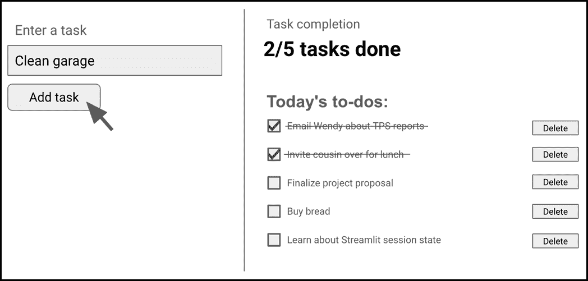

##### 图 4.1 我们每日待办事项应用的模拟 UI 设计

我们的设计有两个部分：一个侧边栏，您可以在其中输入新任务，以及一个“主要”区域，您可以在其中查看您添加的任务并更新它们的状态。

一旦你通过输入任务文本并点击左侧的按钮添加任务，它就会出现在右侧。每个任务都以复选框的形式呈现。你通过勾选框标记任务为“完成”，这也会满意地划掉任务。你可以通过点击右侧的按钮完全删除一个任务。

顶部还有一个跟踪器，告诉你你完成了多少任务，总共是多少。

### 4.1.4 实施方案头脑风暴

你可能已经意识到，我们的待办事项应用比第二章中构建的密码检查器或第三章中的单位转换应用要复杂得多。在这两种情况下，用户最终只能执行一个主要操作——在前一种情况下，评估输入的密码；在后一种情况下，执行转换。

我们的任务列表有*四个*不同的用户可以执行的操作：

+   添加任务

+   标记为完成

+   标记为未完成

+   删除它

让我们花点时间来头脑风暴一下我们如何实现这一点。

我们实现的核心是*任务*的概念，以及由此扩展的*任务列表*。在我们的应用中，一个任务是一个具有两个属性的实体：一个名称和一个状态，状态可以是“完成”或“未完成”。任务列表仅仅是任务的有序列表。

上文提到的四个用户操作只是修改任务列表的不同方式；添加任务会将项目添加到列表中，标记为完成/未完成会更新列表中项目的状态，删除任务会将其从列表中移除。

在每个点上，应用都应该向用户展示任务列表的最新状态。

因此，我们可以将我们的应用分为三个部分：

+   任务列表

+   动作，这些动作连接到按钮和复选框，并修改任务列表

+   显示逻辑，它在屏幕上渲染任务列表

每当执行一个操作时，任务列表都会被修改，并且显示逻辑会自动更新屏幕上显示的内容。

图 4.2 显示了添加新任务时会发生什么；任务被附加到任务列表中，显示逻辑再次遍历所有任务，并根据诸如“完成则划掉”等规则在屏幕上渲染它们。

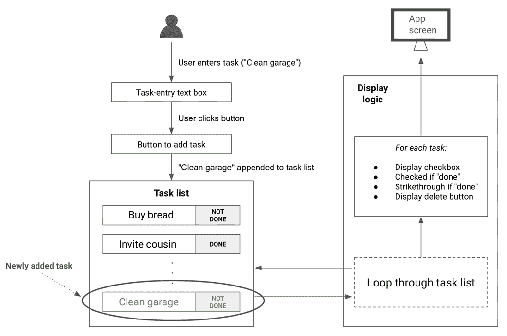

##### 图 4.2 添加任务会将项目附加到任务列表中，并且显示逻辑会再次遍历所有任务，并根据诸如“完成则划掉”等规则在屏幕上渲染它们

当任务被勾选时，会发生非常类似的情况，如图 4.3 所示。这次，任务的状态在任务列表中被更新。其他一切照旧；显示逻辑再次遍历每个任务。根据“如果完成则勾选”和“如果完成则划掉”的规则，给完成的“购买面包”任务赋予我们想要的样式。

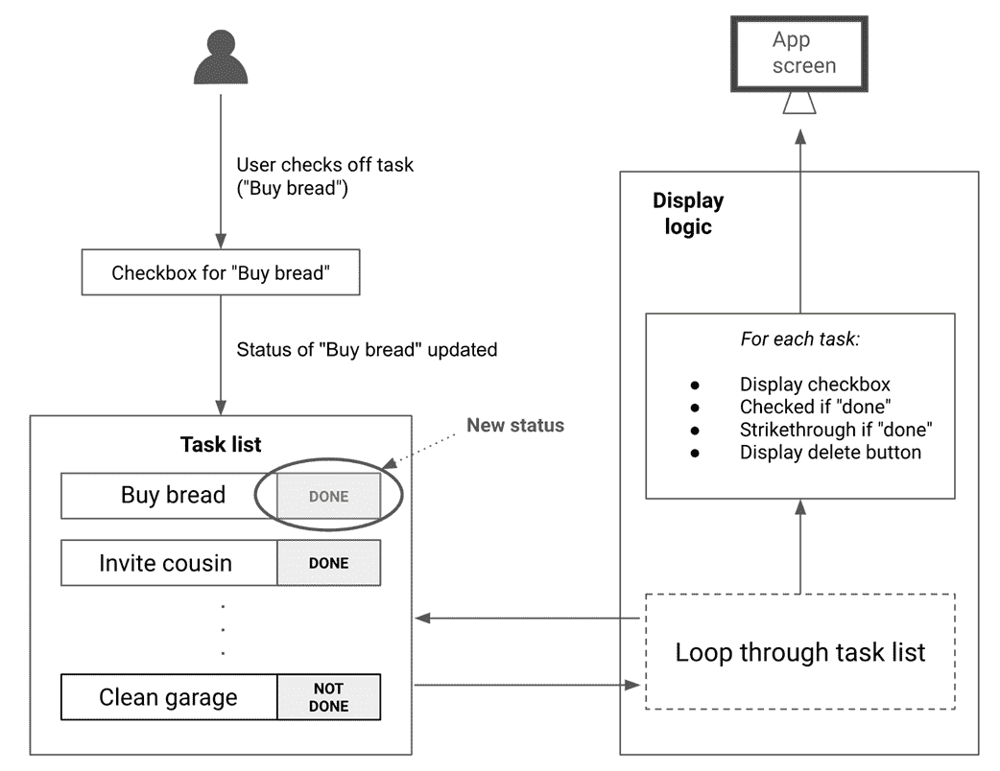

##### 图 4.3 标记任务会更新任务列表中项目的状态，并且相同的显示逻辑会重新渲染更新后的任务列表

删除任务或取消勾选操作基本上是以相同的方式进行；存储在内存中的任务列表被更新，并由显示逻辑重新渲染。

到目前为止，我们已经确定了如何在应用中表示关键实体，以及每个用户操作会产生什么效果。现在是时候实现我们的逻辑了。

## 4.2 实现和调试我们的应用

当我们在第三章构建单位转换应用时，我们走了一条风景优美的路线，详细地走过了应用开发过程的每一步。然而，在这个过程中，我们并没有真正深入探讨的一个部分是：当事情出错时会发生什么，以及如何调试问题。这是一段相当顺利的旅程。

这次，我们将走一条更崎岖的道路，你会发现这更符合现实世界。在我们实现待办事项应用的过程中，我们会遇到各种问题和错误。就像在现实世界中一样，这些错误会促使我们更深入地了解 Streamit。我们将利用我们的深入理解来克服并解决问题。

##### 注意

由于本章的重点是让你在调试应用问题方面获得经验，我们将放弃在第三章中学到的一些最佳实践（例如，在前后端之间保持严格的分离，或定义清晰的 API），以便编写更简洁的代码。

首先，在你的代码编辑器中创建一个新的文件，并将其命名为`todo_list.py`。

### 4.2.1 显示任务列表

虽然我们在一开始就一次性完成了规划，但在编写实际代码时，我们将像第三章中那样迭代地构建我们的应用，一部分一部分地构建，并在 Streamlit 中查看结果。

那么，我们从哪里开始？第一次迭代是什么？

如前所述，任务列表的概念是我们应用实现的核心。我们应用显示逻辑组件始终需要显示任务列表的最新状态。

我们的第一步可以简单到只是创建任务列表的标题。

#### st.header

Streamlit 有几种不同的文本元素，它们以各种大小和格式简单地显示文本。我们之前已经使用`st.title`来渲染大标题。

`st.header`非常相似，但它显示的文本比`st.title`小一些。

通过将列表 4.1 中的代码放入`todo_list.py`来使用它。

##### 列表 4.1 todo_list.py 仅包含标题

```py
import streamlit as st

st.header("Today's to-dos:", divider="gray")

```

注意到我们包括了分隔线参数，它只是在你的标题下方显示一条灰色线条。不错吧？

和往常一样，为了看到你的工作效果，保存你的文件并运行`streamlit run todo_list.py`，或者如果你在另一个工作目录中，运行`streamlit run <path to frontend.py>`。

当你的浏览器窗口打开时，你应该会看到类似于图 4.4 的内容。


##### 图 4.4 st.header 带分隔线

如果你在你的应用中恰好有多个标题，你甚至可以通过将`divider`设置为`True`而不是特定颜色来循环切换分隔线颜色。

#### 创建任务列表

接下来，让我们转向任务的概念。如前所述，任务有一个名称和完成/未完成状态。

因此，我们可以使用数据类来表示具有恰好这两个字段的任务：一个字符串`name`和一个布尔值`is_done`来表示任务状态。列表 4.2 显示了`Task`类。请将其保存到一个名为`task.py`的新文件中，与`todo_list.py`位于同一目录下。

##### 列表 4.2 task.py

```py
from dataclasses import dataclass

@dataclass
class Task:
    name: str
    is_done: bool = False
```

注意到`is_done: bool = False`这一行。在这里，我们默认将`is_done`设置为`False`，以防在创建`Task`实例时未指定。这很快就会派上用场。

现在我们有了任务，我们的任务列表实际上是一个包含`Task`对象的 Python 列表。您可以在`todo_list.py`中使用几个虚拟任务来测试它，如下所示：

```py
task_list = [Task("Buy milk"), Task("Walk the dog")]
```

由于我们已经为`is_done`指定了默认值`False`，因此不需要为`Task`的每个实例指定它。

不要忘记在文件顶部导入您的`Task`类：

```py
from task import Task
```

#### 任务复选框

开始时，我们的显示逻辑可以很简单：只需为每个任务显示一个复选框。我们知道如何使用字符串标签创建静态复选框；回想一下，我们在第三章中使用`st.checkbox`来创建一个将单位转换结果四舍五入的复选框。

但在这里，我们事先不知道每个复选框的标签。相反，我们必须从`task_list`中推断它们。我们如何做到这一点？

答案当然是循环。当一个 Streamlit 元素放置在循环中时，每次循环运行时都会渲染一个新的元素。我们实际上在第二章的初始密码检查器示例中已经遇到过这种情况，我们在循环中使用`st.success`和`st.error`来显示表示每个条件通过/失败状态的绿色和红色框。

我们可以从任务列表中创建复选框，如下所示：

```py
for task in task_list:
    st.checkbox(task.name, task.is_done)
```

回想一下，传递给`st.checkbox`的第一个参数是标签（在这种情况下是任务的名称），第二个是一个布尔值，表示复选框是否应该渲染为选中状态。我们希望如果任务已完成，则每个复选框都被选中，因此直接传递任务的`is_done`字段是有意义的。

列表 4.3 显示了此时`todo_list.py`应该看起来像什么。

##### 列表 4.3 task.py 带有每个任务的复选框

```py
import streamlit as st
from task import Task

task_list = [Task("Buy milk"), Task("Walk the dog")]

st.header("Today's to-dos:", divider="gray")
for task in task_list:
    st.checkbox(task.name, task.is_done)

```

保存并运行以获取图 4.5 所示的输出

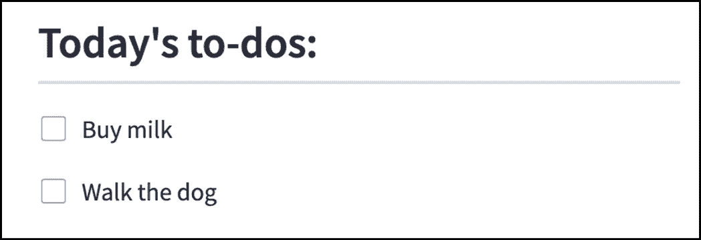

##### 图 4.5 在循环中使用 st.checkbox 显示每个任务

我们的复选框目前实际上并没有做什么。我们稍后会解决这个问题，但首先让我们为每个任务添加一个“删除”按钮。

#### 添加删除按钮

我们想要一个按钮来删除列表中的每个任务，位于其右侧。类似于我们为复选框所做的那样，我们将动态生成这些按钮，因此它们应该放入我们之前编写的循环中。

但如果我们简单地将按钮附加到循环中，Streamlit 会将它放在任务的*下方*，而不是*右侧*，因为 Streamlit 默认按垂直方式渲染元素，正如我们在第三章中看到的。

和之前一样，我们将使用`st.columns`来解决这个问题。在这里，我们将创建两列——一列用于复选框和任务文本，另一列用于按钮。将你现有的`for task in task_list`循环替换为以下内容：

```py
for task in task_list:
    task_col, delete_col = st.columns([0.8, 0.2])
    task_col.checkbox(task.name, task.is_done)
    if delete_col.button("Delete"):
        pass
```

注意，我们调用`st.columns`的方式与上一章有所不同：`st.columns([0.8, 0.2])`。我们不是传递列数，而是传递一个数字列表。这个列表包含了每列的相对宽度。我们表示，带有任务的列应该占据 80%的水平空间，而带有按钮的列应该占据 20%。如果我们只是传递列数，即`st.columns(2)`，Streamlit 会使得两列宽度相等，这没有意义，因为任务文本可以任意长，而按钮不能。

我们目前还没有让按钮做任何事情，所以我们只是写了`pass`，这是 Python 中的一个关键字，意味着“什么都不做”。

#### 小部件键

让我们再次运行我们的应用，看看它的样子如何。图 4.6 展示了你可能会看到的内容。

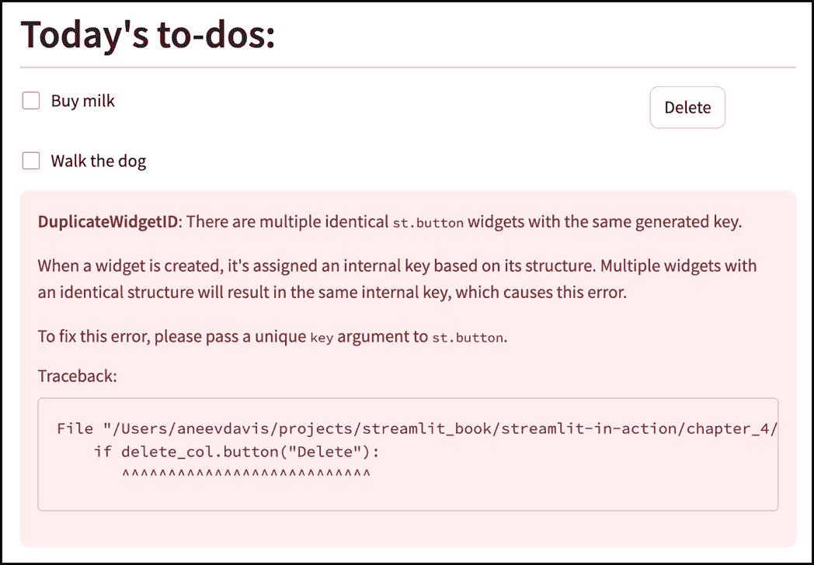

##### 图 4.6 当存在多个相同的小部件时，Streamlit 会抛出错误

在第一个任务右侧有一个按钮，但在第二个任务中没有。最重要的是，下面有一个大红色的错误信息框；Streamlit 在抱怨我们尝试创建多个具有相同*键*的`st.button`小部件。

键是 Streamlit 用来识别*小部件*的一段文本——本质上就是我们所说的 Streamlit 元素，如`st.button`、`st.checkbox`等。小部件键需要是唯一的，这样 Streamlit 才能区分任何两个小部件。

在大多数情况下，你不需要手动指定小部件的键，因为 Streamlit 会根据其特性内部指定一个。对于一个按钮，Streamlit 的内部键基于其文本。所以当你有两个按钮都写着“删除”时，它们的键是相同的，这违反了唯一性约束。

这个问题的解决方案，正如错误提示所建议的，是为我们创建的每个按钮手动指定一个唯一的键。

由于我们需要为列表中的每个任务创建一个唯一的删除按钮键，确保唯一键的一种方法是在键中包含任务的列表索引。例如，第一个任务的删除按钮键可以是`delete_0`，第二个的可以是`delete_1`，依此类推：

```py
for idx, task in enumerate(task_list):
    task_col, delete_col = st.columns([0.8, 0.2])
    task_col.checkbox(task.name, task.is_done)
    if delete_col.button("Delete", key=f"delete_{idx}"):
        pass
```

由于我们需要任务索引和任务本身，我们已经将 for 循环的标题更改为`for idx, task in enumerate(task_list)`。

##### 注意

`enumerate`，如你所知，是 Python 中的一个实用的小函数，它允许你以优雅的方式遍历列表，一次获得索引和元素。不那么优雅的替代方案是编写：

```py
for idx in range(len(task_list)):
    task = task_list[idx]
    ...

```

正如我们讨论的，我们使用每个按钮的索引来形成其唯一的键：`key=f"delete_{idx}"`。如果你现在运行你的代码，你应该会看到错误消失，如图 4.7 所示

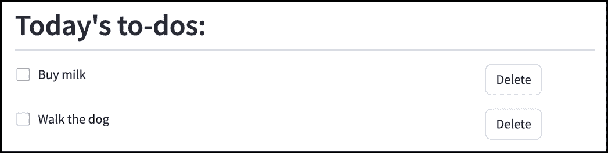

##### 图 4.7 向每个按钮传递一个唯一的键允许 Streamlit 区分其他方面相同的按钮

你现在可能想知道，“为什么我们当时不需要向复选框传递一个键？”

嗯，因为复选框已经有了唯一的内部键，因为它们的标签（任务名称）是不同的。如果我们尝试在我们的列表中放入两个相同的任务，我们实际上会面临相同的问题。例如，如果我们将我们的任务列表更改为 `task_list = [Task("Buy milk"), Task("Buy milk")]`，我们将看到类似于我们之前为按钮看到的错误。

如果用户想要重复输入相同的任务，这可能是一个好主意，所以让我们通过向每个复选框传递一个唯一的键来解决这个问题：

```py
task_col.checkbox(task.name, task.is_done, key=f"task_{idx}")
```

这样做可以让我们在不出现问题的前提下拥有两个具有相同名称的任务。

### 4.2.2 启用操作

到目前为止，我们已经设置了我们的应用，以大致的方式显示我们想要的任务，使用虚拟任务来测试它。我们实际上并没有提供用户与任务交互或修改任务的方法。

我们将在本节中这样做。我们首先定义更新我们的任务列表的函数，然后将它们连接到 Streamlit UI 元素。

#### 添加任务

要将任务添加到我们的任务列表中，我们需要一个任务名称。一旦我们有了这个名称，添加它就像创建一个 `Task` 对象并将其追加到我们的列表中一样简单。

我们可以在 `todo_list.py` 中的简单 `add_task` 函数中写出这个功能：

```py
def add_task(task_name: str):
    task_list.append(Task(task_name))
```

#### 标记任务完成或未完成

一个任务的完成状态由 `Task` 实例的 `is_done` 字段表示。因此，标记为完成或未完成涉及更新这个字段。让我们为此创建两个函数：

```py
def mark_done(task: Task):
    task.is_done = True

def mark_not_done(task: Task):
    task.is_done = False
```

注意，这些函数的参数是 `Task` 实例本身，而不是任务名称字符串。

#### 删除任务

删除任务也是直接的。对于这个函数，我们需要任务在我们列表中的索引，以便我们可以删除它。

```py
def delete_task(idx: int):
    del task_list[idx]
```

#### 启用用户添加任务

由于我们现在有了 `add_task` 函数，我们不再需要用虚拟任务初始化我们的任务列表。让我们将行 `task_list = [Task("Buy milk"), Task("Walk the dog")]` 替换为空列表：

```py
task_list = []
```

接下来，我们将添加 Streamlit 元素，以便用户可以调用我们的 `add_task` 函数。我们需要一个 `st.text_input` 让用户输入任务名称，以及一个 `st.button` 来触发添加操作。我们将这两个元素都包裹在 `st.sidebar` 中，这样它们就会出现在我们应用左侧的面板中。再次提醒，如果这些内容听起来不熟悉，你应该回顾第三章。

```py
with st.sidebar:
    task = st.text_input("Enter a task")
    if st.button("Add task", type="primary"):
        add_task(task)
```

注意 `st.button` 中的 `type="primary"`。`type` 参数允许你通过表示它链接到“主要操作”来给按钮添加强调（以不同颜色形式）。在 UI 设计中，让用户的注意力集中在他们通常会执行的操作上是一个好主意。在这里，添加任务是我们期望用户会经常执行的操作，所以使用主要按钮是有意义的。如果你没有指定这个参数（我们一直做到现在），它默认为“secondary”，在撰写本文时，这会导致按钮为白色。

注意，我们并没有给按钮添加一个 widget key，因为我们只有一个“添加任务”按钮，Streamlit 不需要任何额外的帮助来区分它和其他按钮。

在这个阶段，你的 `todo_list.py` 文件应该看起来像列表 4.4 中所示的那样。

##### 列表 4.4 到目前为止的 todo_list.py

```py
import streamlit as st
from task import Task

task_list = []

def add_task(task_name: str):
    task_list.append(Task(task_name))

def delete_task(idx: int):
    del task_list[idx]

def mark_done(task: Task):
    task.is_done = True

def mark_not_done(task: Task):
    task.is_done = False

with st.sidebar:
    task = st.text_input("Enter a task")
    if st.button("Add task", type="primary"):
        add_task(task)

st.header("Today's to-dos:", divider="gray")
for idx, task in enumerate(task_list):
    task_col, delete_col = st.columns([0.8, 0.2])
    task_col.checkbox(task.name, task.is_done, key=f"task_{idx}")
    if delete_col.button("Delete", key=f"delete_{idx}"):
        pass

```

保存并运行你的代码。为了检查结果（见图 4.8），输入一个名为“清理车库”的新任务并点击“添加任务”。

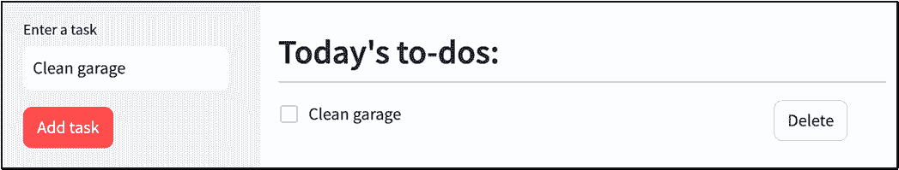

##### 图 4.8 添加了一个待办事项的待办事项应用

到目前为止一切顺利，但当我们尝试添加另一个任务，比如“完成项目提案”时，我们看到了图 4.9 中显示的问题输出。

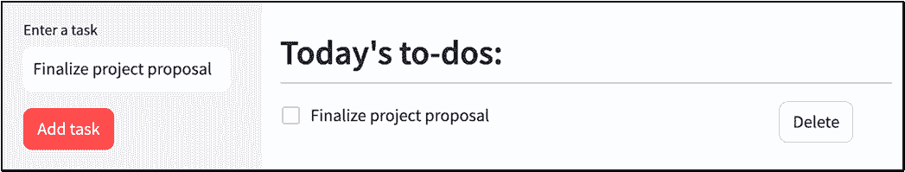

##### 图 4.9 当添加新任务时，旧的任务消失

我们可以看到我们的新任务，但旧的任务“清理车库”不见了。似乎有些不对劲，但我们没有看到像 widget key 问题那样的错误。

奇怪的是，点击“删除”会删除剩余的任务（见图 4.10），即使我们没有将其连接到任何东西；回想一下，我们使用了 `pass` 来使按钮不执行任何操作——这通常被称为 *no-op*。

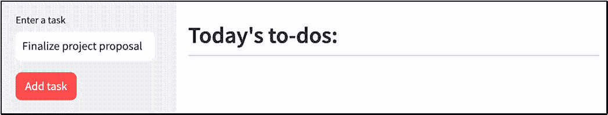

##### 图 4.10 点击“删除”删除了任务，尽管我们没有将其连接到任何东西。

如果你再次添加一个任务并点击复选框，也会发生同样的事情：任务就会消失。你也可以随意尝试一下。

#### 发生了什么问题？

显然，我们的应用并没有按照我们的预期工作。Streamlit 不会显示错误，所以我们必须找出发生了什么。我们的显示逻辑是否只显示了最后添加的任务？或者任务列表本身有什么问题？

让我们找出问题所在。调试代码最重要的部分之一是在程序运行时检查变量的值。在一个正常的 Python 脚本中（即你会在命令行中运行的脚本，而不是使用 Streamlit），你可能会包含 `print` 语句来显示变量的值。你也可以使用你的 IDE 的调试器或 `pdb` 模块，但让我们保持简单。

`print` 语句不会出现在你的 Streamlit 应用程序的浏览器窗口中。相反，让我们使用一个合适的 Streamlit 元素。我们感兴趣的是 `task_list` 变量，所以请在 `st.header("Today's to-dos:", divider="gray")` 行的下面写下以下内容，在我们的显示逻辑循环之前。

```py
st.info(f"task_list: {task_list}")
```

`st.info` 是一个显示一些文本的彩色框的元素。它是我们在第二章中已经看到过的元素家族的一部分：`st.success`、`st.error` 和 `st.warning`，这些元素也以彩色框显示文本。对于 `st.info`，框是蓝色的。

当你保存并运行（或刷新页面）时，你会看到一个带有文本 task_list: [] 的框，因为没有任务。添加一个任务，就像之前一样，你会在图 4.11 中看到输出。

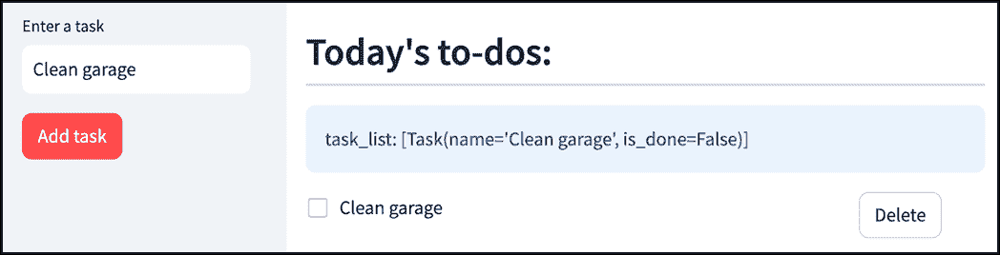

##### 图 4.11 task_list 包含一个 Task 实例

如你所见，`task_list` 现在包含一个 `Task` 实例的单个实例，对应于“清理车库”。当我们添加第二个任务时，我们的 `task_list` 变量只有新的任务。这表明问题不在于我们的显示逻辑有误；`task_list` 变量本身已经丢失了“清理车库”任务。

当我们尝试勾选任务旁边的复选框或按下“删除”按钮时，`task_list` 现在又变空了，这就是为什么没有显示任何任务的原因。

好的，所以这是我们所知道的：添加任务似乎正确地将任务添加到了 `task_list` 中，但无论之后你做什么，无论是添加另一个任务还是点击复选框或“删除”按钮，它都会从 `task_list` 中移除之前添加的任务。

在我们能够解决这个问题之前，我们需要了解为什么会发生这种情况。为此，让我们回顾一下 Streamlit 应用实际上是如何工作的。

## 4.3 Streamlit 如何执行应用程序

在前两章中，我们学习了如何使用 Streamlit，甚至用它开发了一些非平凡的程序。然而，我们主要关注的是语法和对应用程序工作原理的表面理解。

要成功编写更复杂的 Streamlit 应用程序，我们需要比这更深入地了解。为了更进一步，我们需要讨论 Streamlit 的一个相当基础的概念：它的执行模型。

### 4.3.1 前端和服务器

Streamlit 应用实际上有两个部分：一个后端 *Streamlit 服务器* 和一个 *前端*。

对于我们的目的来说，服务器是在你的电脑上运行的软件程序，等待接收发送给它的请求。从技术角度来说，我们说服务器是在一个 *端口* 上 *监听*。

端口是一个虚拟标识符，用于识别特定的通信通道，就像大型办公室中的分机号一样。正如分机可以帮助你联系公司内的特定人员，端口允许网络通信到达你电脑上运行的特定程序。

当你在终端中输入 `streamlit run <filename.py>` 时，你可能已经注意到了类似以下输出的内容：

```py
Local URL: http://localhost:8502
```

实际上发生的情况是，一个 Streamlit 服务器启动并开始监听端口 8502（端口号可能因你而异）上的请求。

当你现在打开浏览器并导航到给定的地址（即 `http://localhost:8502`）或等待服务器自动为你完成此操作时，浏览器会向端口 8502 上的 Streamlit 服务器发送请求。

作为回应，Streamlit 服务器从顶部到底部执行您的 Python 脚本，并向浏览器发送一个消息，告诉它显示什么，即前端。

因此，前端是用户可以看到并与之交互的应用程序的前端部分，它运行在您的网页浏览器上。它由浏览器理解的 HTML、CSS 和 JavaScript 代码组成。

### 4.3.2 应用程序重新运行

现在，这里是重要的部分：Streamlit 服务器每次页面需要更改时都会运行您的 Python 脚本，这包括每次用户与您的应用程序中的小部件交互时。

例如，图 4.12 详细说明了当用户在您的应用程序中点击按钮时会发生什么。

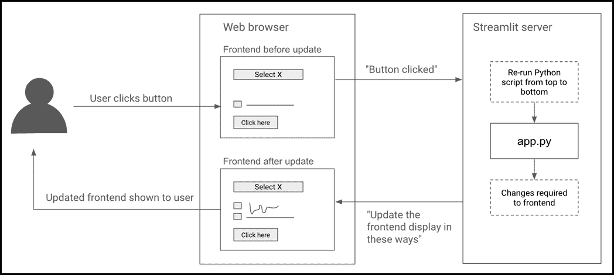

##### 图 4.12 每次用户与应用程序交互时，Python 脚本都会重新运行

一旦前端检测到按钮点击，它会向服务器发送一个消息，告知服务器点击信息。服务器通过重新运行 Python 代码并对按钮进行评估来响应此信息，将其设置为 `True`。

完成后，服务器向前端发送一个包含需要更改的显示的消息。前端随后进行这些更改，用户看到更新后的显示。

注意，这并不仅限于按钮点击；它适用于 *任何* 交互或 Streamlit 确定显示需要更改的 *任何* 时间。这意味着每次用户点击按钮、从下拉菜单中选择不同的项目或移动滑块时，循环都会重复，服务器会重新运行您的整个 Python 脚本。

### 4.3.3 将此应用于我们的应用程序

让我们看看我们能否利用应用程序重新运行的知识来了解我们的待办事项应用程序中发生了什么。

列表 4.5 显示了当前存在的代码。

##### 列表 4.5 todo_list.py

```py
import streamlit as st
from task import Task

task_list = []

def add_task(task_name: str):
    task_list.append(Task(task_name))

def delete_task(idx: int):
    del task_list[idx]

def mark_done(task: Task):
    task.is_done = True

def mark_not_done(task: Task):
    task.is_done = False

with st.sidebar:
    task = st.text_input("Enter a task")
    if st.button("Add task", type="primary"):
        add_task(task)

st.header("Today's to-dos:", divider="gray")
st.info(f"task_list: {task_list}")
for idx, task in enumerate(task_list):
    task_col, delete_col = st.columns([0.8, 0.2])
    task_col.checkbox(task.name, task.is_done, key=f"task_{idx}")
    if delete_col.button("Delete", key=f"delete_{idx}"):
        pass
```

我们现在将逐步讲解这段代码在应用程序使用过程中的各个执行点。

#### 首次运行

第一次运行我们的应用程序时，即当用户首次加载它时，`task_list` 被设置为空列表。

现在考虑 `st.sidebar` 管理器内的这一行：

```py
if st.button("Add task", type="primary")
```

这是一个 `if` 语句，因此其下的行，即 `add_task(task)`，只有在 `st.button` 表达式评估为 `True` 时才会执行。

到目前为止，按钮尚未被点击，因此它评估为 `False`，`add_task` 不会被调用。因此，`task_list` 仍然是一个空列表。

然后，代码继续执行到 `st.info` 框和显示逻辑，但由于没有任务，`st.info` 显示一个空列表，循环从未执行，因此没有复选框。

#### 用户添加任务

现在假设用户已经输入了一个任务，“清理车库”，并点击了“添加任务”按钮。如前所述，这会触发整个 Python 代码的重新运行。

##### 注意

技术上，重新运行可能已经在这个点发生，甚至在用户点击按钮之前。当用户完成输入“清洁车库”后，如果他们通过点击文本框外部将焦点移出文本框，这将被视为一个交互（因为文本框中的值已更改）并触发代码的重新运行。但这不会导致任何有趣的变化，所以我们现在忽略它。

再次从脚本顶部开始，`task_list` 被设置为空列表。由于行 `task = st.text_input("Enter a task")`，变量 `task` 现在持有字符串“清洁车库”，因为这是文本框中的内容。

由于按钮刚刚被点击，`st.button` 评估为 `True`，因此触发 `if` 语句并调用 `add_task`。

`add_task` 为“清洁车库”创建一个 `Task` 实例并将其追加到 `task_list` 中，使其不再为空。这就是 `st.info` 显示的内容。

因此，显示逻辑循环运行一次，并继续渲染复选框和删除按钮。这完成了重新运行，产生了图 4.13 中所示的结果。


##### 图 4.13 当用户点击“添加任务”时，st.button 评估为 True，并且 task_list 有一个任务

#### 用户点击任务复选框

到目前为止一切顺利。一切似乎都在正常工作。但当用户点击“清洁车库”的复选框时，会触发另一个重新运行。

再次从头开始，我们有行 `task_list = []`，它再次将其设置为空列表，丢弃了之前存在的“清洁车库”任务！

但让我们假设文本框尚未清除，仍然显示“清洁车库。”这意味着一旦执行了行 `task = st.text_input("Enter a task")`，变量 `task` 仍然包含字符串“清洁车库。”

当我们到达 `st.button` 行时会发生什么？按钮之前已经被点击，那么这意味着它会被评估为 `True` 吗？如果是这样，那么 `add_task` 将再次被触发，将“清洁车库”追加到 `task_list` 中，恢复其早期状态，一切都会正常。

但 `st.button` 的工作方式并非如此。实际上，`st.button` 只在点击后立即发生的重新运行中评估为 `True`。在所有后续的重新运行中，它将恢复到其原始的 `False` 值。在这种情况下，点击复选框触发了一个全新的重新运行，因此 `st.button` 现在评估为 `False`。

这意味着 `add_task` 从未被调用，`task_list` 也从未更新。它保持为空列表，因此循环从未执行，没有显示任何任务。

#### 用户添加另一个任务而不是点击任务复选框

为了结束这次讨论，让我们考虑这样一个场景：用户没有点击任务复选框，而是尝试添加另一个任务（通过在任务输入文本框中输入“完成项目提案”并点击“添加任务”）。

在这种情况下，执行过程类似。`st_task` 在顶部被设置为空列表，因此我们失去了之前的“清理车库”任务。

由于我们输入了一个新任务，文本框现在包含“最终化项目提案”，因此这就是 `task` 变量所持有的内容。

这次，由于我们最新的按钮点击，我们的 `st.button` 通过了评估，并且 `add_task` 被调用，传递的参数值为“最终化项目提案”。这将在我们原本为空的列表中添加新的 `Task`。

到此为止，`task_list` 只包含一个元素：“最终化项目提案”，这正是 `st.info` 和我们的显示逻辑循环所显示的内容，如图 4.14 所示。

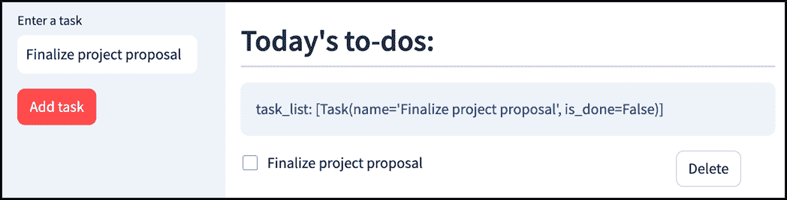

##### 图 4.14 当用户添加不同的任务时，st.button 再次评估为 True，并将“最终化项目提案”添加到最初为空的 task_list 中。

我们终于可以解释我们看到的奇怪结果了。问题归结为，由于我们的脚本每次都会重新运行，`task_list` 不断被重置。

## 4.4 在多次运行间持久化变量

在上一节中，我们能够通过审查 Streamlit 的执行模型并在各个阶段逐步执行我们的应用程序来解释我们得到的不预期的输出。在本节中，我们将尝试确定一个实际解决问题的方法。

回顾一下，我们面临的困境是我们编写的应用程序表现得像金鱼：它对任何之前的运行中发生的事情都没有记忆。由于 Streamlit 每次都有机会重新运行我们的全部代码，我们的应用程序的内存就会反复被清除，重置我们用来保存用户任务的 `task_list` 变量。

### 4.4.1 st.session_state

事实上，Streamlit 有一个解决方案，那就是 `st.session_state`。简而言之，`st.session_state` 是一个容器，用于存储将在多次运行间持久化的变量。

这里的 *Session* 指的是应用程序会话，你可以将其大致理解为从打开应用程序到刷新页面或关闭应用程序之间的时间。

当你需要记住一个值时，你只需将其保存到 `st.session_state`，然后在下一次运行中检索该值，如图 4.15 所示。

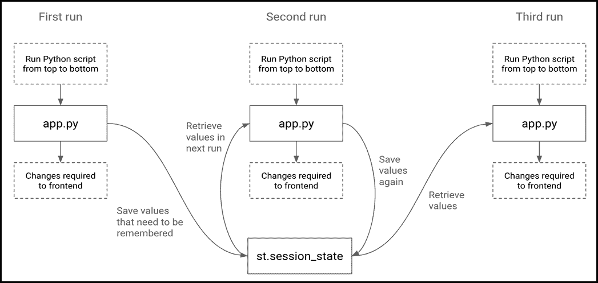

##### 图 4.15 使用 st.session_state 在多次运行间保存和检索值

因此，`st.session_state` 是变化海洋中的一块岩石。或者，如果你想有一个更技术的比喻，它是一个存储你想要在多次运行间持久化的变量的仓库。

那么，我们实际上如何利用它呢？嗯，`st.session_state` 在技术上虽然不是，但几乎完全像是一个 Python 字典。就像在字典的情况下，你可以向其中添加键值对，检查是否存在特定的键，查找其值，或者完全删除它。甚至大部分使用的语法都与字典相同。

例如，如果你想在`st.session_state`中存储一个值为 5 的变量`x`，你会写`st.session_state["x"] = 5`，然后使用`st.session_state["x"]`检索该值。

要检查`x`是否存在于会话状态中，你会写`if "x" in st.session_state`。你甚至可以使用`for key, value in st.session_state.items()`遍历`st.session_state`中的项，并使用`del st.session_state`删除一个键。

与字典不同，你还可以使用点符号来引用键`x`的值，如下所示：`st.session_state.x.`。

列表 4.6 显示了一个使用`st.session_state`的玩具 Streamlit 应用，其任务是简单地跟踪和增加一个数字：

##### 列表 4.6 一个简单的数字增加应用

```py
import streamlit as st

if "number" not in st.session_state:
    st.session_state.number = 0

if st.button("Increment"):
    st.session_state.number += 1

st.info(f"Number: {st.session_state.number}")

```

我们首先检查会话状态中是否存在键`"number"`，如果不存在，则将其添加，值为零。

然后我们有一个按钮，每次点击都会增加“number”的值，还有一个`st.info`框来检索并显示 number 的值。

图 4.16 显示了按下“增加”按钮五次后的输出。

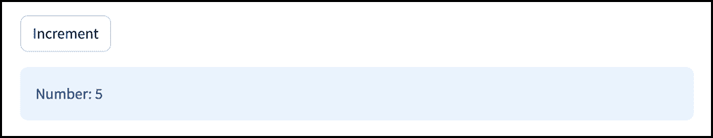

##### 图 4.16 使用 st.session_state 跟踪和增加数字的玩具 Streamlit 应用

如果我们没有在这里使用`st.session_state`，而是简单地将`number`存储在其自己的变量中（或在一个常规字典中），那么它将不会工作，因为每次应用重新运行时，值（或字典本身）都会被重置。`st.session_state`是唯一能够在应用重新运行之间保留其状态的东西。

为什么我们需要在添加之前检查“number”是否已经存在于会话状态中？嗯，如果没有这个检查，我们会遇到之前的问题。每次应用运行时，它都会将`st.session_state.number`设置为零，覆盖之前运行中增加到的任何值，我们永远不会看到数字实际上发生变化。

通过检查`"number"`是否存在，我们确保只有一次执行`st.session_state.number = 0`这一行——在第一次运行时，`"number"`尚未添加。

## 4.5 完成我们的应用

现在我们知道如何给我们的应用一个“记忆。”当你开始为你自己的目的编写 Streamlit 应用时，你会很快意识到这个知识是绝对关键的——到了没有它你甚至无法编写除了最简单的应用之外的应用的程度。

借助强大的`st.session_state`，我们准备好再次尝试让我们的待办事项列表应用工作！

### 4.5.1 添加会话状态

在我们上次运行我们的应用时，我们面临的主要问题是`task_list`变量，它包含所有我们的任务，每次重新运行都会被重置。

让我们通过将`task_list`添加到`st.session_state`来解决这个问题。将你之前代码中的`task_list = []`行替换为以下内容：

```py
if "task_list" not in st.session_state:
    st.session_state.task_list = []
```

这与我们在上一节中讨论的玩具示例相似。唯一的区别是我们将`task_list`存储在`st.session_state`中，而不是一个单独的数字。

我们现在可以修改我们代码的其余部分，使其在当前引用 `task_list` 的所有地方都引用 `st.session_state.task_list`，但这似乎很繁琐，而且相当笨拙。相反，让我们只是将变量 `task_list` 指向 `st.session_state` 中的版本，如下所示：

```py
task_list = st.session_state.task_list
```

现在其余的代码应该可以正常工作，因为它们都引用了 `task_list`。

列表 4.7 显示了我们的代码现在应该包含的内容。

##### 列表 4.7 todo_list.py 与 st.session_state

```py
import streamlit as st
from task import Task

if "task_list" not in st.session_state:
    st.session_state.task_list = []
task_list = st.session_state.task_list

def add_task(task_name: str):
    task_list.append(Task(task_name))

def delete_task(idx: int):
    del task_list[idx]

def mark_done(task: Task):
    task.is_done = True

def mark_not_done(task: Task):
    task.is_done = False

with st.sidebar:
    task = st.text_input("Enter a task")
    if st.button("Add task", type="primary"):
        add_task(task)

st.header("Today's to-dos:", divider="gray")
st.info(f"task_list: {task_list}")
for idx, task in enumerate(task_list):
    task_col, delete_col = st.columns([0.8, 0.2])
    task_col.checkbox(task.name, task.is_done, key=f"task_{idx}")
    if delete_col.button("Delete", key=f"delete_{idx}"):
        pass
```

保存、重新运行，并尝试添加多个任务。图 4.17 显示了你这样做会得到的结果。

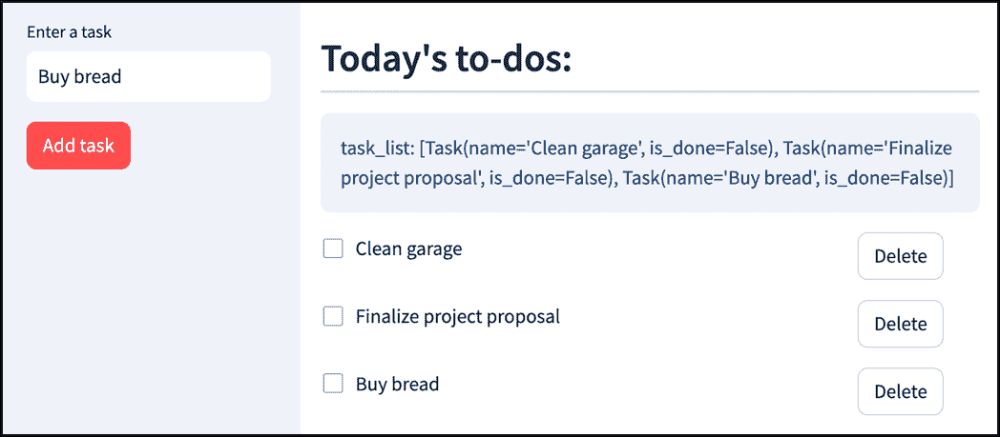

##### 图 4.17 使用 st.session_state，Streamlit 记住了我们的旧任务

哇！`task_list` 终于可以更新为包含多个任务了，我们的显示逻辑也显示了所有内容。

### 4.5.2 连接“删除”按钮

在此基础上，让我们让我们的“删除”按钮开始工作。回想一下，我们之前通过在显示循环中的按钮代码下写 `pass` 来设置它们什么也不做。

```py
if delete_col.button("Delete", key=f"delete_{idx}"):
    pass
```

从那时起，我们创建了一个 `delete_task` 函数，所以让我们在这里调用它：

```py
if delete_col.button("Delete", key=f"delete_{idx}"):
    delete_task(idx)
```

如果我们现在在保存和重新运行（如果你刷新了页面，请按顺序重新添加三个任务）后点击“删除”旁边的“买面包”，我们会看到...没有变化！但是，如果你第二次点击按钮，任务就会消失。但似乎仍然有问题。

我不会用截图详细说明所有内容，但如果你现在在这个阶段玩一下这个应用，你会注意到更多奇怪的行为。当你第一次点击列表中最后一个任务的“删除”按钮时，它没有任何反应。但是，如果你紧接着点击一个复选框（*任何*复选框），任务就会消失。

或者，如果你从列表中间删除一个任务，下一个任务会消失，而不是你删除的那个！但是，如果你*然后*做些其他事情，比如点击一个复选框或添加另一个任务，那个任务就会回来，而你实际删除的那个任务会正确地被移除，一切都会恢复正常。

总体来说，似乎在实际上点击“删除”按钮和任务被删除之间存在一定的*延迟*。你似乎需要在点击按钮后做些其他事情（任何其他事情，比如点击一个复选框，或者编辑任务输入框中的文本并点击外部），才能显示正确的结果。

### 4.5.3 背后发生的事情

为了理解发生了什么，我们需要再次深入挖掘我们的应用执行。让我们假设我们处于应用的一个阶段，用户已经按顺序输入了三个任务：“清理车库。”、“最终确定项目提案。”和“买面包。”

到目前为止，`task_list` 已经被填充了这三个任务。

#### 步骤遍历应用执行

假设用户尝试删除第三个任务。图 4.18 以图解方式显示了应用中发生的情况。删除按钮由分配给它们的 Streamlit 小部件键标识，即 `delete_0`、`delete_1` 等。

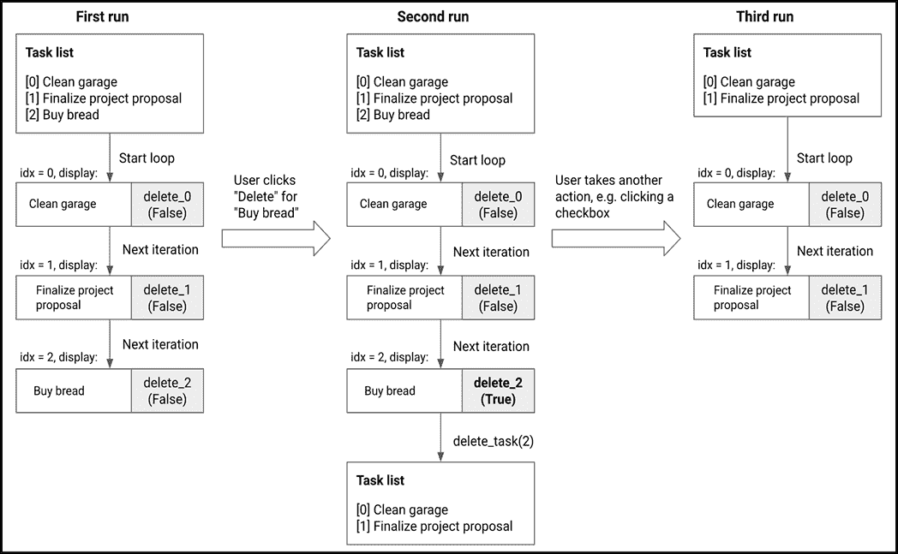

##### 图 4.18 步骤分解应用执行：在第二次运行中，删除按钮评估为 True，但任务和按钮在调用`delete_task`之前就已经显示

第一次运行是在点击按钮之前发生的。Streamlit 简单地遍历我们的任务列表，显示每个任务及其复选框和删除按钮。正如我们在本章前面讨论的那样，每个`st.button`都评估为`False`，因为它们还没有被按下。

当用户点击“买面包”的删除按钮时，它触发了应用的重新运行。一切保持不变，直到我们显示第三个任务的`st.button`。这次，由于它刚刚被点击，这个按钮评估为`True`。由于条件为真，应用进入嵌套在`st.button`下的代码，调用`delete_task(idx)`。由于在这个循环迭代中`idx`是 2，所以调用`delete_task(2)`，从`task_list`中移除“买面包”。执行在此处停止。

看到问题了吗？所有三个按钮在执行`delete_task`之前就已经显示，更新了`task_list`。由于没有其他用户操作，没有更多的重新运行被触发。所以`task_list`确实被更新了，但显示逻辑已经在旧的`task_list`版本上执行了。这就是为什么我们点击“删除”后仍然看到三个任务。

但在这个时候，如果用户执行其他操作，比如点击复选框或者再次点击“删除”按钮，就会触发另一个重新运行。这次，显示逻辑运行在`task_list`的最新版本上，所以我们最终看到了第三个任务及其复选框和删除按钮被移除。

##### 注意

以这种方式逐步执行也可以解释我们注意到的其他奇怪行为，例如当你点击列表中间任务的删除按钮时，下一个任务消失。这是因为当调用`delete_task`时，列表索引都会向上移动一个位置，下一个显示循环迭代最终跳过一个任务，因为它的索引已经改变。

### 4.5.4 自动触发重新运行

如我们所见，尽管我们的删除按钮最初没有正确工作，但 Streamlit 最终确实得到了正确的结果，前提是用户采取额外的行动，触发重新运行。

我们可以利用这个知识来发挥我们的优势。我们需要的只是一个通过代码触发应用重新运行的方法，而不是通过用户操作。Streamlit 通过`st.rerun`提供这个功能，并且可以在任何时候不带任何参数调用它，如下所示：

```py
st.rerun()
```

当你调用`st.rerun`时，你实际上是在告诉 Streamlit，“退出当前运行并从头开始。”

在我们的情况下，一旦任务被删除，我们应该触发一次重新运行：

```py
if delete_col.button("Delete", key=f"delete_{idx}"):
    delete_task(idx)
    st.rerun()
```

如果你做出这个更改，重新运行并像以前一样重新创建任务，然后再次尝试删除“买面包”，你将看到图 4.19 中的输出。

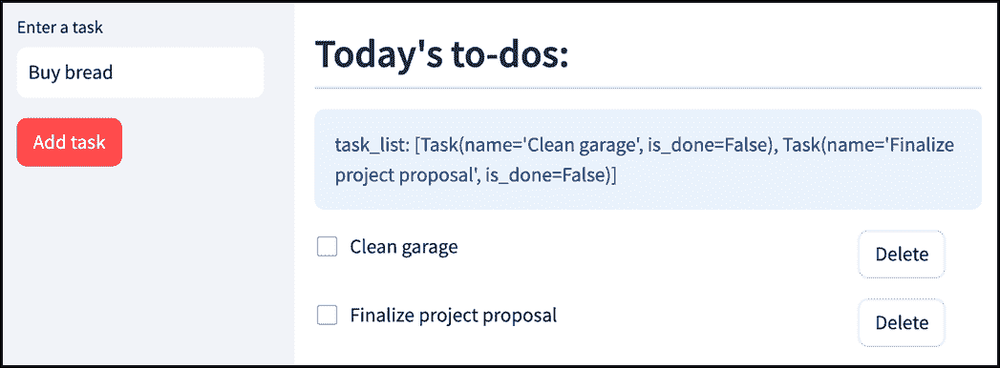

##### 图 4.19 使用 st.rerun 时按下“删除”按钮按预期工作

它成功了！“买面包”不再存在，你也可以从截图中的`st.info`框中看到它已从`task_list`中消失。

### 4.5.5 连接复选框

让我们继续到我们应用的下一个部分：复选框。我们已经将它们添加到显示中，你可以勾选它们，但它们实际上并没有做任何事情。因此，我们的下一步是将它们连接到我们为更改任务状态定义的功能。

我们当前的复选框代码是一行：

```py
task_col.checkbox(task.name, task.is_done, key=f"task_{idx}")
```

当用户勾选任务复选框时，我们想要实现两个目标：

+   标记任务为完成，并

+   删除线

我们还希望如果用户取消勾选框，则撤销上述更改。

要更改任务的状态，我们可以使用我们之前为该目的创建的函数，`mark_done`和`mark_not_done`。

我们如何实现删除线？为了这种格式化效果（以及其他几种效果），Streamlit 支持一种叫做*markdown*的语言。

Markdown 是一种特殊的基于文本的标记语言，用于添加各种类型的格式。它有显示文本加粗或斜体、创建链接、列表、标题等功能。我们将在后面的章节中遇到这些功能，但就目前而言，让我们专注于删除线效果。

在 markdown 中，要删除一段文本，你可以用两个波浪号将其包围，如下所示：

```py
~~Text to be struck through~~
```

这通过标签参数连接到我们的复选框，该参数支持 markdown。我们将定义一个变量，如果任务未完成，则包含任务名称本身，如果已完成，则包含带有 markdown 删除线的名称：

```py
label = f"~~{task.name}~~" if task.is_done else task.name
```

然后，我们可以将其输入到我们的复选框中：

```py
task_col.checkbox(label, task.is_done, key=f"task_{idx}")
```

最后，让我们也将我们的复选框连接到我们的`mark_*`函数。如果我们勾选了复选框，则调用`mark_done`，否则调用`mark_not_done`。我们的整体代码现在应如列表 4.8 所示。

##### 连接任务复选框后的 4.8 todo_list.py

```py
import streamlit as st
from task import Task

if "task_list" not in st.session_state:
    st.session_state.task_list = []
task_list = st.session_state.task_list

def add_task(task_name: str):
    task_list.append(Task(task_name))

def delete_task(idx: int):
    del task_list[idx]

def mark_done(task: Task):
    task.is_done = True

def mark_not_done(task: Task):
    task.is_done = False

with st.sidebar:
    task = st.text_input("Enter a task")
    if st.button("Add task", type="primary"):
        add_task(task)

st.header("Today's to-dos:", divider="gray")
st.info(f"task_list: {task_list}")
for idx, task in enumerate(task_list):
    task_col, delete_col = st.columns([0.8, 0.2])
    label = f"~~{task.name}~~" if task.is_done else task.name #A
 if task_col.checkbox(label, task.is_done, key=f"task_{idx}"):
 mark_done(task) #B
 else:
 mark_not_done(task) #C
    if delete_col.button("Delete", key=f"delete_{idx}"):
        delete_task(idx)
        st.rerun()
```

#A 如果任务已完成，则在标签上添加删除线效果

#B 如果复选框被勾选并因此评估为 True，则调用 mark_done

#C 如果复选框未勾选，则调用 mark_not_done

保存，重新运行，并添加你的任务，然后勾选一项任务以获得类似于图 4.20 所示的结果。

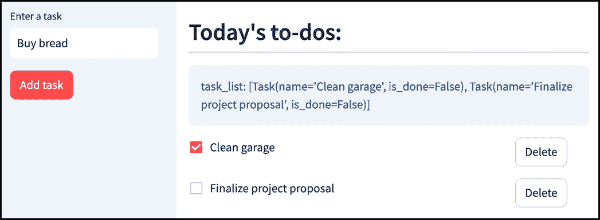

##### 图 4.20 勾选任务并不立即按预期工作

再次强调，我们没有得到预期的结果。“清理车库”仍然没有删除线，我们的信息框显示`task_list`没有变化。在你把电脑扔出窗外并致力于余生放牧羊群之前，试着勾选另一个任务。

你会看到现在我们勾选的原任务有了删除线，并且根据我们的`st.info`框，其`is_done`字段为`True`。

听起来熟悉吗？看起来在我们点击复选框和该动作的结果显示之间有一个用户动作的延迟。

这里发生的情况与我们在删除按钮的情况中看到的情况非常相似。点击复选框确实触发了我们的函数并将 `is_done` 设置为 `True`，但到那时，任务及其标签已经显示。只有在 *下一次* 重运行中，*实际显示* 才会更新，而这个重运行只有在用户采取进一步行动时才会触发。

解决方案与之前相同：我们可以在每次我们的 `mark_*` 函数运行时触发一个手动重运行：

```py
if task_col.checkbox(label, task.is_done, key=f"task_{idx}"):
    mark_done(task)
    st.rerun()
else:
    mark_not_done(task)
    st.rerun()
```

保存输出，刷新页面，然后再次尝试。图 4.21 展示了输出。

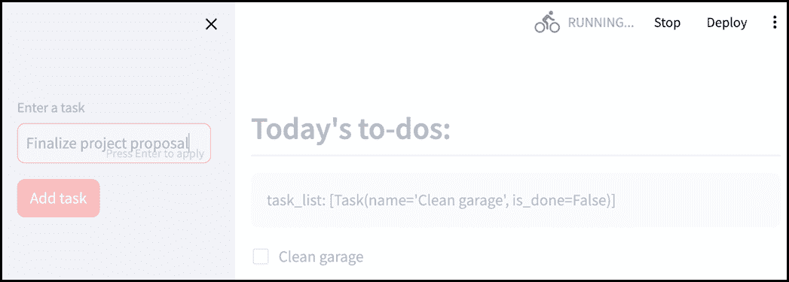

##### 图 4.21 我们的应用挂起并且永远不会停止加载

这里出了大问题。一旦我们添加了第一个任务，我们的应用似乎就完全停止响应了。屏幕变灰，顶部出现“正在运行…”的指示符。

### 4.5.6 无限重运行循环

你刚刚遇到了你的第一个 Streamlit 无限重运行循环。让我们通过再次逐步执行来尝试理解出了什么问题。图 4.22 以图表形式展示了这一点。

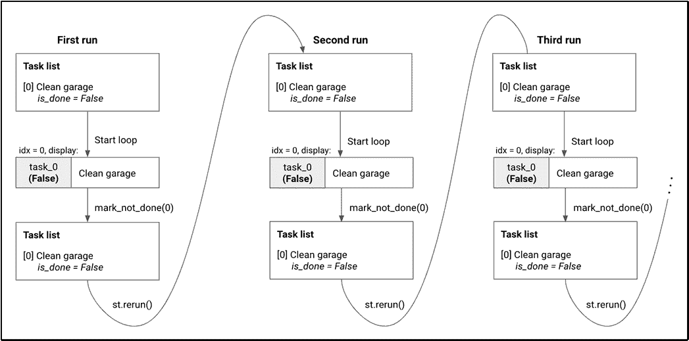

##### 图 4.22 步骤分解应用执行：一系列的 `st.rerun()` 导致无限循环

一旦我们添加了“清理车库”任务，`task_list` 包含一个单独的 `Task` 实例，其 `is_done` 字段被设置为 `False`。

由于 `task_list` 不为空，我们进入了显示循环，并显示了“清理车库”的复选框。

现在我们的任务有了分支逻辑：

```py
if task_col.checkbox(label, task.is_done, key=f"task_{idx}"):
    mark_done(task)
    st.rerun()
else:
    mark_not_done(task)
    st.rerun()
```

复选框评估结果为 `False`，因为它没有被勾选，这意味着应用进入了 `else` 子句。

调用了 `mark_not_done`，将 `is_done` 设置为 `False`（尽管它已经是 `False`），然后 `st.rerun()` 强制 Streamit 停止当前运行并从头开始。

再次，在第二次运行中，我们进入了循环。复选框仍然没有被勾选，所以 `mark_not_done` 再次被调用，然后调用 `st.rerun()`，这开始第三次运行，以此类推。

由于这永远不会停止，Streamlit 会卡住并停止响应。

### 4.5.7 防止无限重运行

这里的问题是 `mark_done` 即使在没有必要的情况下也会被调用。回顾我们刚才看到的执行步骤，你会注意到“清理车库”任务的 `is_done` 字段已经被设置为 `False`，因此实际上没有必要再次调用 `mark_not_done`。

我们目前的代码设置中，一旦我们进入显示循环，就无法退出。如果我们的复选框评估结果为 `True`，则在 `mark_done` 函数之后调用 `st.rerun()`。如果评估结果为 `False`，则在 `mark_not_done` 函数之后调用 `st.rerun()`。

我们需要确保这只有在绝对需要时才会发生。`mark_done`（以及相关的 `st.rerun`）只有在复选框被勾选且任务尚未标记为“完成”时才应被调用。同样，`mark_not_done` 和其 `st.rerun` 应只有在复选框未被勾选且任务当前标记为“完成”时才被调用。

我们可以通过像这样编辑我们的代码来实现这一点：

```py
checked = task_col.checkbox(label, task.is_done, key=f"task_{idx}")    #A
if checked and not task.is_done:    #B
    mark_done(task)
    st.rerun()
elif not checked and task.is_done:    #C
    mark_not_done(task)
    st.rerun()
```

#A 将复选框的值保存在一个名为 checked 的新变量中，以提高可读性。

#B 只有当复选框被勾选且任务尚未标记为完成时，才调用 mark_done。

#C 只有当复选框未勾选且任务仍然标记为完成时，才调用 mark_not_done。

这样，当复选框被勾选时，任务的状态设置为 `is_done`，但在下一次重新运行中，if 和 elif 子句都评估为 `False`，并且 `st.rerun` 永远不会执行。

尝试一下。现在我们的复选框应该可以正常工作，如图 4.23 所示。

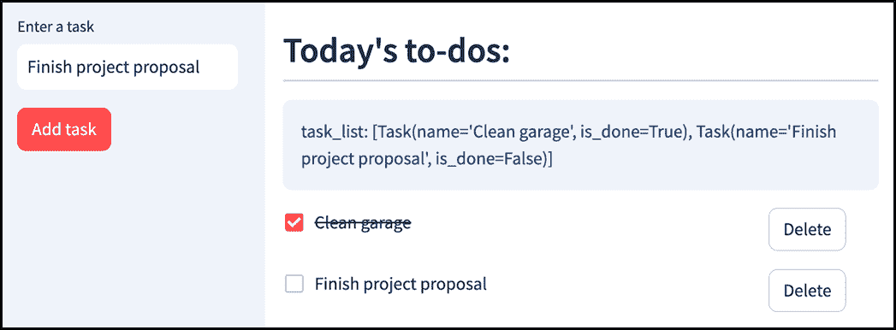

##### 图 4.23 我们复选框现在按预期工作

### 4.5.8 添加完成进度指示器

我们几乎完成了我们的应用程序。从我们早期的模拟设计中剩下的唯一事情是为用户提供额外的成就感感，添加一个进度指示器。

这相当直接。我们希望指示器既大又漂亮，所以我们在第三章中首次遇到的 `st.metric` 看起来很理想。

我们需要展示两个东西：任务总数和已完成任务数，这两个都可以从 `task_list` 获取。我们的 `st.metric` 代码可能看起来像这样：

```py
total_tasks = len(task_list)
completed_tasks = sum(1 for task in task_list if task.is_done)
metric_display = f"{completed_tasks}/{total_tasks} done"
st.metric("Task completion", metric_display, delta=None)
```

要获取 `completed_tasks`，我们使用列表推导（当它被函数如 sum 包裹时，可以省略方括号）以实现简洁。

哦，我们可能可以去掉我们的信息框（`st.info`），因为我们不再处于故障排除模式。

我们最终的代码应该看起来像列表 4.9 中所示的那样。

##### 列表 4.9 todo_list.py 的最终版本

```py
import streamlit as st
from task import Task

if "task_list" not in st.session_state:
    st.session_state.task_list = []
task_list = st.session_state.task_list

def add_task(task_name: str):
    task_list.append(Task(task_name))

def delete_task(idx: int):
    del task_list[idx]

def mark_done(task: Task):
    task.is_done = True

def mark_not_done(task: Task):
    task.is_done = False

with st.sidebar:
    task = st.text_input("Enter a task")
    if st.button("Add task", type="primary"):
        add_task(task)

total_tasks = len(task_list)
completed_tasks = sum(1 for task in task_list if task.is_done)
metric_display = f"{completed_tasks}/{total_tasks} done"
st.metric("Task completion", metric_display, delta=None)

st.header("Today's to-dos:", divider="gray")
for idx, task in enumerate(task_list):
    task_col, delete_col = st.columns([0.8, 0.2])
    label = f"~~{task.name}~~" if task.is_done else task.name
    checked = task_col.checkbox(label, task.is_done, key=f"task_{idx}")
    if checked and not task.is_done:
        mark_done(task)
        st.rerun()
    elif not checked and task.is_done:
        mark_not_done(task)
        st.rerun()
    if delete_col.button("Delete", key=f"delete_{idx}"):
        delete_task(idx)
        st.rerun()

```

图 4.24 提供了对我们应用程序的最终审视。

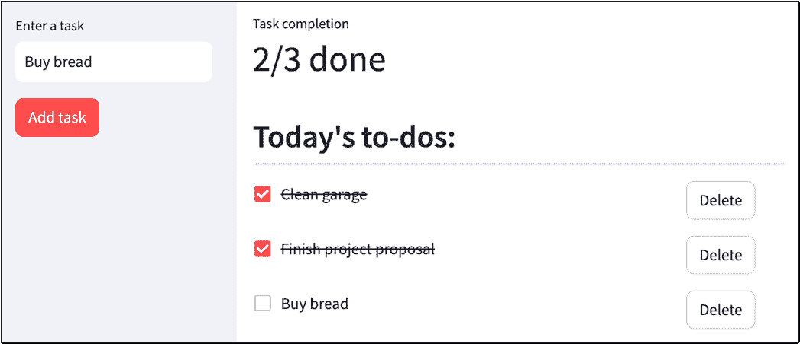

##### 图 4.24 最终待办事项列表应用程序

这样，你就有了一个完整的应用程序在你的掌握之中，也许甚至是一个你可以每天使用的工具来保持高效！你现在已经处于可以使用 Streamlit 在自己的项目中开始使用的位置。在下一章中，我们将看到如何将它们发布供其他人使用。

## 4.6 总结

+   在现实世界中，开发过程并不顺利；你大部分的时间将花在解决那些不符合预期的事情上。

+   `st.header` 用于以大字体显示标题。

+   Streamlit 使用基于其特性的唯一小部件键来识别 UI 小部件。

+   当两个小部件在各个方面都相同的时候，你必须手动指定小部件键，以便 Streamlit 能够区分它们。

+   在应用执行过程中跟踪变量值的一个好方法是使用 `st.info` 在应用屏幕上显示它们。

+   每当页面需要更改时，Streamlit 服务器都会从头到尾重新运行你的 Python 代码。

+   重新运行将重置应用程序中所有常规变量。

+   `st.session_state` 用于存储你希望 Streamlit 在重新运行之间记住的变量。

+   当你看到意外结果时，逐步执行应用程序的执行是一个好主意。

+   你可以使用 `st.rerun` 触发应用程序的重新运行。

+   当使用 `st.rerun` 时，如果你的脚本没有提供退出路径，你的应用可能会陷入无限重跑循环。
