# 7 CEO 反击：提升我们的仪表板

### 本章涵盖

+   评估应用并解决用户反馈

+   为 Streamlit 可视化添加灵活性

+   通过使常用功能易于访问来提高可用性

+   在 Streamlit 中创建模态对话框

+   使用查询参数在 Streamlit 应用中启用深链接

当 Python 首次发布时，它缺少了我们今天依赖的许多功能。我们熟悉并喜爱的 Python 已经经过多年的精心打磨——这个过程仍在继续。这个演变的一个很大部分来自于积极使用该语言的开发者的反馈。

事实上，没有任何软件在发布时是完美的。相反，它需要随着时间的推移不断改进，这里修复一个错误，那里添加一个新功能。本书中构建的项目也不例外。

在上一章中，我们为一家名为 Note n' Nib 的公司创建了一个指标仪表板。在这一章中，我们将跳过一段时间，看看用户是如何反应的。我们将使用他们的意见和评论，以批判性的眼光重新审视我们的应用程序，并对其进行改进。在这个过程中，我们将了解更多关于 Streamlit 可视化的知识，介绍模态对话框和查询参数，并了解如何编写高级、灵活的仪表板。

如果第六章是关于根据用户需求**发布**仪表板，那么第七章是关于**着陆**它，解决用户的问题，并对应用程序进行迭代以确保质量和满意度。

## 7.1 仪表板的反馈

你在上一章中构建的仪表板在 Note n' Nib 公司引起了轰动。第一次，公司的管理层可以查找更新的销售数据，比较产品之间的性能，并自行分析趋势，而无需寻求工程部门的帮助。

CEO 要求所有员工会议都以回顾关键销售指标开始，这意味着高层现在对您的仪表板非常熟悉。当然，有了这样的关注，自然会带来更多的审查，所以在发布后的几周的一个周一下午，你在收件箱里收到 CEO 的电子邮件，你并不完全感到惊讶。

这封电子邮件包含了高层对您的仪表板反馈的汇总——基本上是一个您要实现的新功能愿望清单。

嗯，你的这个星期就这样过去了。尽管如此，你对这项工作还是很兴奋的，因为你又能多玩一会儿 Streamlit！在本章的整个过程中，我们将检查并解决每一项反馈。

## 7.2 时间序列图表的粒度

电子邮件中的第一点写道：“时间图表在回顾几天数据时很有用，但对于更长时间的数据则难以理解”。

记得我们的仪表板有一个折线图，显示了选定指标随时间的变化。对于较短的日期范围（大约一个月左右），它工作得相当不错（见图 7.1 的左侧），但对于较长的日期范围（比如说一年或更长时间），它看起来就像图 7.1 的右侧。

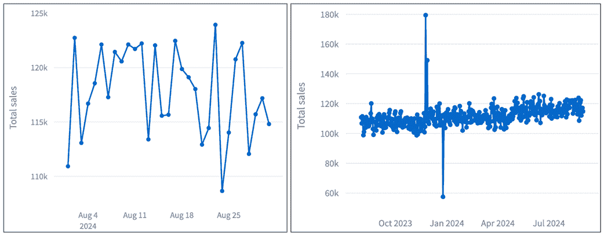

##### 图 7.1 现有时间图表中的日粒度适用于像一个月这样的小时间框架（左），但不适用于更长的时间框架（右）。

所有数据都在那里，但数据量如此之大以至于令人不知所措。当考虑 *多年* 的数据时，我们不需要在日期范围内的每一天都绘制一个点。

你可以看到这样做是如何增加图表中单个标记的数量；如果我们观察的是两年的日期范围，那么就是 365 x 2 = 730 个点——太多以至于难以解释。

那么，我们如何解决这个问题呢？在较长的时间范围内，单日粒度太多，但如果我们的日期范围较短，比如一周或一个月，这是合理的。对于更长的范围，我们可能希望有一个表示一周、一个月甚至一年的标记。

最简单的解决方案是允许用户选择他们想要的粒度。现在让我们来解决这个问题。

### 7.2.1 启用不同的时间粒度

要启用周、月和年粒度，我们首先必须确保我们的数据 *具有* 这些字段，目前它还没有。一旦我们做到了，我们就能将每个指标聚合到正确的粒度。

回想一下，我们应用中的数据流始于 `data_loader.py` 中的 `load_data` 函数，该函数从外部源获取数据，目前是一个 CSV 文件。

这在 `data_wrangling.py` 中的 `prep_data` 后续进行，我们重命名列并添加 `Day` 字段。这也是我们需要进行更改以包含我们想要的其它粒度的地方。

现在就去编辑 `prep_data`，使其看起来像这样：

```py
@st.cache_data(show_spinner="Reading sales data...", ttl="1d")
def prep_data() -> pd.DataFrame:
  df = clean_column_names(load_data())
  df['Day'] = pd.to_datetime(df['Date'])
  df['Week'] = df['Day'].dt.to_period('W').dt.to_timestamp()
 df['Month'] = df['Day'].dt.to_period('M').dt.to_timestamp()
 df['Year'] = df['Day'].dt.to_period('Y').dt.to_timestamp()
  return df
```

我们正在向 Pandas 数据框中添加三个新列：`Week`、`Month` 和 `Year`。为了获取每个字段，我们首先从 `Day` 列 (`df['Day']`) 开始，将其转换为周期，然后将结果转换为时间戳。考虑以下这样的语句：

```py
 df['Month'] = df['Day'].dt.to_period('M').dt.to_timestamp()
```

在这里，`.dt` 用于以元素方式访问列的日期/时间相关属性。`to_period('M')` 将 `Day` 列转换为 Pandas 内部的月度“周期”类型，代表整个月而不是特定的时间点。

然后，我们使用第二个 `.dt` 访问器来获取转换列的日期/时间属性，最后使用 `.to_timestamp()` 将每个月度周期转换为表示月份开始的日期。

例如，如果我们正在操作 `df['Day']` 中的某个元素，而这个元素是日期 `2024-07-12`，我们最终得到的是日期 `2024-07-01`，即对应月份的开始。

创建 `Week` 和 `Year` 列的其他两个语句是类似的，分别添加表示周开始和年开始的日期。

在代码的其他地方——特别是在 `data_wrangling.py` 和 `time_series_chart.py` 中的（其他）函数内——我们一直将 `Day` 视为一个硬编码的列名。一旦我们有了这些其他列，我们只需要在后台引入一个变量来表示粒度即可。

因此，`data_wrangling.py` 中的 `get_metric_time_series` 函数现在看起来是这样的：

```py
def get_metric_time_series(df, metric, grain):
  grouped = df.groupby(grain)
  data = grouped.apply(metric.func, include_groups=False).reset_index()
  data.columns = [grain, 'Value']
  return data
```

并且 `get_time_series_chart`（在 `time_series_chart.py` 中）变为：

```py
def get_time_series_chart(df, metric, grain):
  data = get_metric_time_series(df, metric, grain)
  fig = go.Figure()
  fig.add_trace(
    go.Scatter(x=data[grain], y=data['Value'], mode='lines+markers')
  )

  fig.update_layout(
    title=f"{metric.title}",
    xaxis_title=grain,
    yaxis_title=metric.title
  )
  return fig
```

在这两种情况下，我们都在做同样的更改：在函数中添加 `grain` 作为新的参数，并将 `'Day'` 替换为 `grain`。

### 7.2.2 创建时间粒度选择器

现在我们已经将生成时间序列图的函数连接起来，以处理作为变量的 `grain`，我们需要提供一个让用户选择他们想要的时间粒度的方式。

#### st.select_slider

让我们使用一个新的 Streamlit 小部件来完成这个任务：`st.select_slider`，另一个选择元素。`st.select_slider` 是 `st.selectbox` 和 `st.slider` 的结合，`st.selectbox` 允许你从下拉列表中选择单个值，而 `st.slider` 允许你选择数值。

当你有用户可以选择的文本选项列表，但还想对它们施加一些顺序时，你会使用它。例如，当你创建调查选项时，“强烈同意”、“同意”、“中立”、“不同意”和“强烈不同意”是字符串，但它们有特定的顺序——从最同意到最不同意。

在我们的案例中，我们希望用户看到的时间粒度选项——“日”、“周”、“月”和“年”——也有一个顺序，从最小的时间单位到最大的时间单位。

为了我们的目的，我们可以在 `time_series_chart.py` 中的 `time_series_chart` 函数内这样使用 `st.select_slider`：

```py
def time_series_chart(df):
  with st.container(border=True):
    grain_options = ["Day", "Week", "Month", "Year"]
 grain = st.select_slider("Time grain", grain_options)
    chart_tabs = st.tabs(display_metrics)
    for idx, met in enumerate(display_metrics):
      with chart_tabs[idx]:
        chart = get_time_series_chart(df, metrics[met], grain)
        st.plotly_chart(chart, use_container_width=True)
```

`grain_options` 这里持有有序的选项列表，并将其提供给 `st.select_slider` 的第二个参数，第一个是显示的标签。你会发现这些参数与 `st.selectbox` 和 `st.radio` 的参数非常相似。`st.select_slider` 返回用户选择的选项，我们将其存储在 `grain` 中，并将其作为新添加到 `get_time_series_chart` 中的参数传递。

使用 `streamlit run <path to dashboard.py>` 命令保存并运行你的应用程序以获取图 7.2

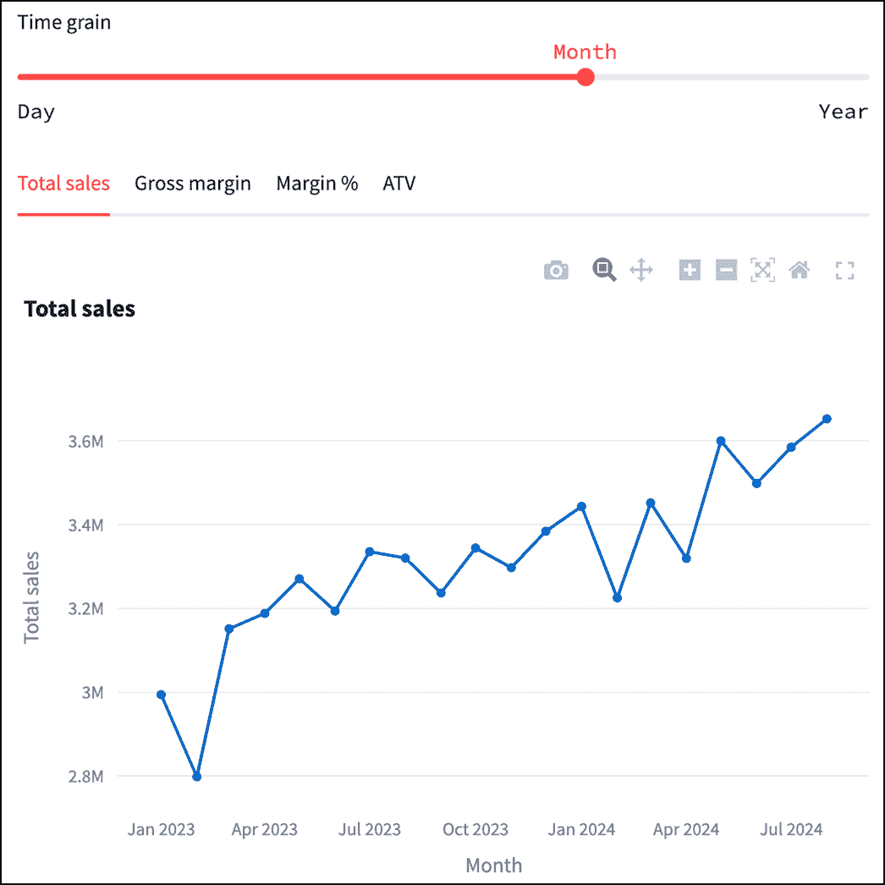

##### 图 7.2 线形图现在有了一个时间粒度选择器（有关完整代码，请参阅 GitHub 仓库中的 chapter_7/in_progress_01）

尝试使用时间粒度选择器。使用月粒度在查看跨越多年多个日期范围的长时间范围内会使图表更加易于接受。

## 7.3 依赖性过滤器

“如果我已经选择了‘书写工具’类别，为什么它仍然问我是否想查看订书机和日历？”邮件中的一条直接引语问道，据报道这是来自首席财务官，他是仪表板更热情的用户之一。

你承认这是一个有效的问题。她指的是图 7.3 中的过滤器栏，在显示过滤器下拉列表中的选项时没有考虑现有的选择，导致出现诸如“书写工具”与“回形针”这样的荒谬组合。

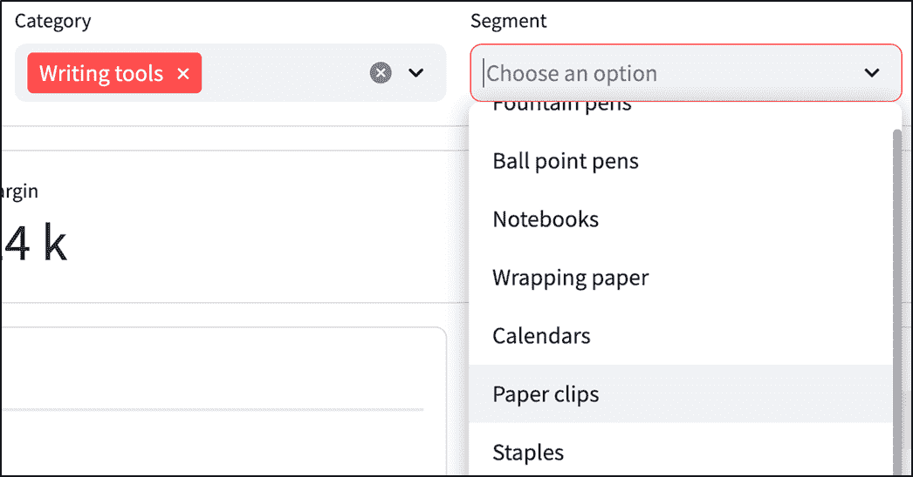

##### 图 7.3 过滤器栏选项可能存在不匹配的组合

过滤栏并不是“智能”的。在产品类别上过滤不会更新段和产品名称过滤器中用户可用的选项，即使那些段和产品不属于所选类别。

如果用户过滤“写作工具”的数据，仍然在段下拉列表中看到所有其他产品线（如“回形针”）会有些恼人。我们一直在使用的示例数据总共只有十个产品，所以这本身并不是一个决定性的问题，但考虑一下有数百个产品的情况。到那时，使用产品层次结构中的较高级别（如“类别”）来从其他下拉列表中过滤掉不相关的产品成为一个必要的功能，而不仅仅是一个锦上添花的功能。

让我们考虑如何解决这个问题。

一种可能性是记录维度之间的相互依赖关系，然后在获取每个字段的唯一值时查找和解决这些依赖关系。例如，由于“产品名称”应该依赖于“类别”和“段”的选择，我们可能会在某个地方记录这种依赖关系。

这需要我们维护一个新的配置，逻辑可能会相当复杂。

有一个更简单的方法：而不是首先获取所有唯一的过滤值，然后过滤数据框（图 7.4），我们可以先获取第一个过滤器的唯一值，应用过滤器以获取新的数据框，然后获取第二个过滤器的唯一值，再应用它，依此类推。

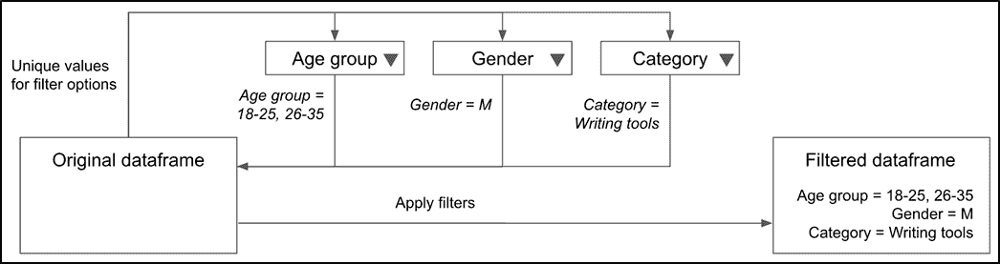

##### 图 7.4 旧的过滤方法：首先获取所有过滤器的唯一值，然后根据选择进行过滤

在新的方法（图 7.5）中，由于我们在获取下一个过滤器的唯一值之前过滤数据框，我们保证只显示可用的值。

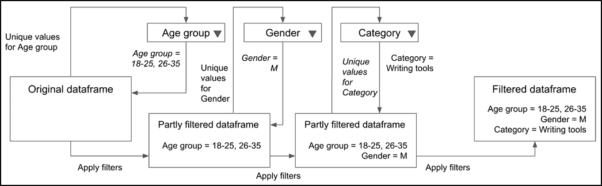

##### 图 7.5 新的过滤方法：获取每个过滤器的唯一值，根据选择应用过滤器，然后对其他过滤器重复此操作

因此，当用户选择“写作工具”类别时，数据框会被过滤，只包含那些行，并且段过滤器的唯一值从这个新集合中抽取，这个新集合不会包括订书机之类的物品。

要实现这一点，修改`filter_panel.py`：

```py
import streamlit as st
from data_wrangling import get_unique_values, apply_filters

filter_dims = ["Age group", "Gender", "Category", "Segment",
               "Product name", "State"]

def filter_panel(df):
  filters = {}
  with st.expander("Filters"):
    filter_cols = st.columns(len(filter_dims))
    effective_df = df
    for idx, dim in enumerate(filter_dims):
      with filter_cols[idx]:
        effective_df = apply_filters(effective_df, filters)
        unique_vals = get_unique_values(effective_df, dim)
        filters[dim] = st.multiselect(dim, unique_vals)
  return filters
```

变化并不复杂。在遍历过滤字段时，我们不是直接将`df`传递给`get_unique_values`以获取要显示的下拉选项集，而是引入一个名为`effective_df`的变量并将它传递。

按照我们对方法的解释，`effective_df`在每个循环迭代中通过应用我们迄今为止的过滤器被重新计算（我们在此目的上在顶部导入`apply_filters`）。

放手去重新运行你的应用！图 7.6 展示了当你仅选择“写作工具”作为你感兴趣的唯一类别时会发生什么。

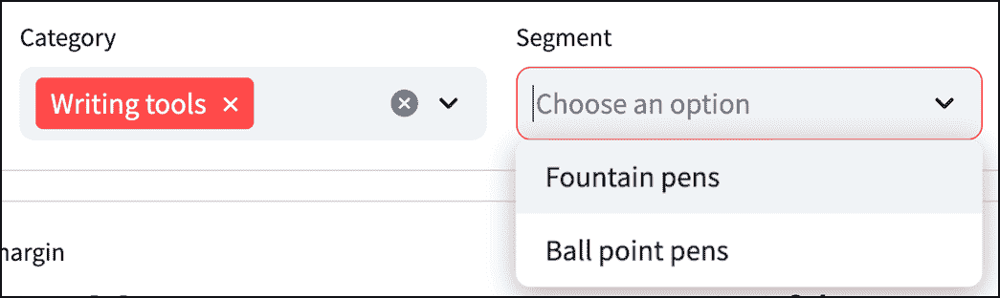

##### 图 7.6 过滤栏仅显示有效的选项组合（有关完整代码，请参阅 GitHub 仓库中的 chapter_7/in_progress_02）

如预期的那样，`Segment`过滤器现在只显示书写工具。

##### 注意

过滤器的*顺序*现在是有意义的。如果类别过滤器被放置在*分段*之后，选择一个类别对分段没有影响，因为分段的唯一值已经在评估所选类别值之前已经计算出来了。

## 7.4 日期范围比较

来自产品线主管之一的反馈也很有帮助，她发布了一张截图（图 7.7）来说明她的观点：“我可以看到 RoyalQuill7 月份的销售额为 132 万美元。但这好还是不好？去年我们做得怎么样？”

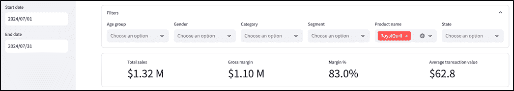

##### 图 7.7 RoyalQuill 的销售额为 132 万美元，但没有迹象表明这是否是好的，或者之前可比期间的销售额是多少

分析数据时，困难的部分往往不是获取或转换数据，而是*情境化*数据。一个指标本身并没有多少意义。为了使其有用，你必须能够*比较*它。如果我们知道某个产品的年销售额为 100 万美元，那么如果我们知道去年的销售额是 1000 万美元，我们做出的决策将与我们知道去年的销售额仅为 10 万美元时做出的决策大不相同。

我们的控制板目前没有提供一种简单的方式来做出这种比较。

理想情况下，当我们看到某个特定时间段的指标时，我们也应该能够知道它与过去相比是如何*变化*的。在本节中，我们将更深入地探讨这一要求，并将其纳入我们的控制板。

### 7.4.1 添加另一个日期范围选择器

将指标与其过去值进行比较究竟意味着什么？我们使用什么开始日期和结束日期来表示“过去”？让我们考虑一些用户可能感兴趣的常用比较。

例如，如果用户正在查看 2024 年 8 月 1 日至 8 月 15 日的总销售额，那么他们很可能想看看这与上个月相同日期（即 2024 年 7 月 1 日至 7 月 15 日）相比如何。这被称为“月环比”比较，通常缩写为“MoM”。

用户可能想要进行的其他类似比较包括 QoQ（“季度环比”）和 YoY（“年度环比”），它们都与 MoM 相似。QoQ 意味着与上一个季度相同日期的比较。例如，8 月 1 日至 8 月 15 日代表第三季度第二个月的头 15 天，因此 QoQ 将比较这些日期与第二季度第二个月的头 15 天，即正好三个月前：5 月 1 日至 5 月 15 日。

YoY 应该是显而易见的——这是正好一年前的日期范围，所以以我们的例子来说，就是 2023 年 8 月 1 日至 8 月 15 日。

高管可能想要进行的另一种比较是对立即之前的 X 天进行比较，其中 X 是当前选定主要日期范围的天数。

因此，如果主要范围是 8 月 1 日至 8 月 15 日，则“上一个期间”将是 8 月 1 日之前的 15 天，即 7 月 17 日至 7 月 31 日。

现在我们来实现这些常用的比较功能。我们首先更新 `date_range_panel.py` 中的 `date_range_panel` 函数，以便包含一个比较选择器，并向调用者（稍后我们将编辑的 `dashboard.py`）返回两个额外的日期：

```py
...
def date_range_panel():
  start = st.date_input("Start date", value=THIRTY_DAYS_AGO)
  end = st.date_input("End date", value=LATEST_DATE)
  comparison = st.selectbox(
 "Compare to", ["MoM", "QoQ", "YoY", "Previous period"])
  compare_start, compare_end = get_compare_range(start, end, comparison)
  st.info(f"Comparing with:  \n{compare_start} - {compare_end}")
  return start, end, compare_start, compare_end
```

由于比较选项是离散值，我们使用 `st.selectbox` 为用户提供选择，并调用尚未定义的函数 `get_compare_range` 来获取比较范围的起始和结束日期。

我们还通过 `st.info` 框向用户公开这些比较日期，这样用户就不必自己进行日历计算来获取这些信息。

让我们定义上面提到的 `get_compare_range` 函数（在同一文件 `date_range_panel.py` 中）：

```py
def get_compare_range(start, end, comparison):
  offsets = {
    "MoM": pd.DateOffset(months=1),
    "QoQ": pd.DateOffset(months=3),
    "YoY": pd.DateOffset(years=1),
    "Previous period": pd.DateOffset((end - start).days + 1)
  }
  offset = offsets[comparison]
  return (start - offset).date(), (end - offset).date()
```

此函数接受三个参数：主日期范围的起始和结束日期，以及 `comparison`，一个字符串，包含我们想要执行的比较类型——如上所述，这可以是 `MoM`、`QoQ`、`YoY` 或 `Previous period`。

计算比较日期范围归结为从起始和结束日期中减去正确的 *偏移量*。例如，对于 MoM 比较，我们需要从两个日期中减去一个月。对于 QoQ，我们减去 3 个月，对于 YoY，我们减去一年。

对于 `Previous period` 比较来说，我们首先使用 `(end - start).days + 1` 计算主日期范围内的天数，并将其用作偏移量。

我们将这些偏移量存储在一个字典中（如上述代码中所示，称为 `offsets`），比较名称作为键，Pandas `DateOffset` 对象作为值。然后我们可以通过从每个日期中减去偏移量来获得新的起始和结束日期：

```py
return (start - offset).date(), (end - offset).date()
```

##### 注意

为什么这里需要 `.date()`？好吧，如果您特别关注，您可能会意识到 `start` 和 `end` 是 `datetime.date` 对象，而不是 Pandas 时间戳对象。Pandas 确保与 `datetime.date` 兼容的 `pd.DateOffset`，并且前者可以从后者中减去，但结果是 Pandas 时间戳对象。由于我们一直在尝试将日期范围保持为 `datetime.date` 对象，我们使用 Pandas 时间戳类的 `.date()` 方法将 `start - offset` 和 `end - offset` 转换为 `datetime.dates`，从而确保一致性。

由于 `date_range_panel` 函数现在返回四个值（`start`、`end`、`compare_start` 和 `compare_end`），而不是两个，我们需要更新调用它的代码以反映这一点。

这段代码恰好位于 `dashboard.py` 文件中的侧边栏部分。将其修改为：

```py
with st.sidebar:
  start, end = date_range_panel()

to:

with st.sidebar:
  start, end, compare_start, compare_end = date_range_panel()
```

您的应用程序侧边栏现在应该看起来像图 7.8 所示。

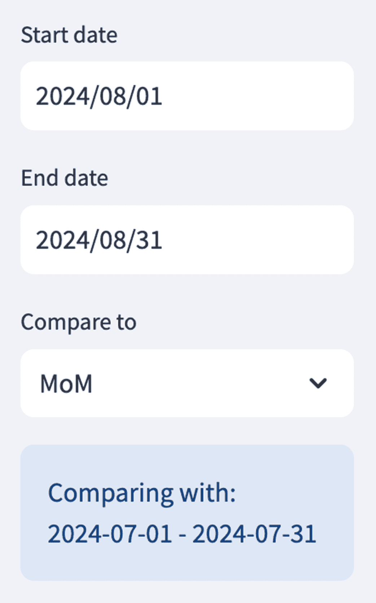

##### 图 7.8 展示了主日期范围的起始/结束日期选择器以及“比较到”输入（请参阅 GitHub 仓库中的 chapter_7/in_progress_03 以获取完整代码）

虽然我们实际上并没有对比较日期范围做任何事情，但您可以看到新的选择器。

### 7.4.2 在指标栏中显示比较

现在我们已经收集了要与主要日期范围比较的日期范围，我们如何使用它来解决我们收到的反馈？

让我们通过一个例子来考虑这个问题。假设我们有两个日期范围：2024 年 8 月 1 日至 8 月 31 日（“主要”日期范围）和 2024 年 7 月 1 日至 7 月 31 日（比较日期范围）。如果我们比较这两个日期范围之间的总销售额，我们需要分别计算这两个日期范围的变化，然后显示它们之间的 *delta*（差异）。

如果八月份的销售额为 500 万美元，而七月份的销售额为 400 万美元，我们将显示 100 万美元的变化。一般来说，将差异表示为过去数值的百分比更有用，因此变化为 20%（400 万美元 / 500 万美元 x 100）。我们将显示这个数字与八月份的销售额一起，以提供完整的画面：八月份的销售额为 500 万美元，比上一期增长 20%。

这种方法要求我们做两件事：

+   分别为比较日期范围计算指标，同时保持其他一切（主要是过滤器值）不变。

+   计算百分比变化并将其与主要指标一起显示。

对于第一部分，让我们修改 `dashboard.py`：

```py
import streamlit as st
...

with st.sidebar:
  start, end, compare_start, compare_end = date_range_panel()

...
main_df = get_filtered_data_within_date_range(data, start, end, filters)
if main_df.empty:
  st.warning("No data to display")
else:
  compare_df = get_filtered_data_within_date_range(
 data, compare_start, compare_end, filters)
  metric_bar(main_df, compare_df)
  ...
```

在这里，我们以类似获取 `main_df` 的方式获取一个新的 Pandas 数据框 `compare_df`——通过将原始准备好的数据传递给 `get_filtered_data_within_date_range`，并带有适当的起始和结束日期以及过滤器。

过滤器与创建 `main_df` 时使用的过滤器相同。这很重要，因为如果用户过滤了特定的类别和/或性别，他们想要的比较就是与相同的类别和/或性别，只是不同的日期范围。

我们还将 `compare_df` 作为 `metric_bar` 的第二个参数传递，它目前还不支持，但完成时将支持。

要计算和显示百分比变化，我们需要在 `metric_bar.py` 中进行以下更改。

让我们先修改 `metric_bar` 以接受我们传递的额外参数：

```py
def metric_bar(main_df, compare_df):
  with st.container(border=True):
    metric_cols = st.columns(len(display_metrics))
    for idx, metric_name in enumerate(display_metrics):
      metric = metrics[metric_name]
      with metric_cols[idx]:
        value = get_metric(main_df, metric)
        formatted_value = format_metric(value, metric.type)
        formatted_delta = get_formatted_delta(value, compare_df, metric)
        c1, c2, c3 = st.columns([1, 3, 1])
        with c2:
          st.metric(
            metric.title, formatted_value, formatted_delta, "normal")
```

在此之前，对于每个需要显示的指标，我们会使用 `format_metric` 获取格式化的值，并将其与标题一起传递给 `st.metric` 以进行显示，如下所示：

```py
st.metric(metric.title, formatted_value)
```

然而，`st.metric` 也支持显示变化，通过其第三个和第四个参数（内部命名为 `delta` 和 `delta_color`）。

第三个参数是要显示的变化（在这种情况下，百分比差异）的格式化数字，而第四个参数 `delta_color` 指示显示变化时使用的颜色方案。

`delta_color` 可以取 `"normal"`、`"inverse"` 或 `"off"` 的值。如果设置为 `"normal"`，则正变化以绿色显示，负变化以红色显示。如果设置为 `"inverse"`，则相反：增加以红色显示，减少以绿色显示（这对于值越低越好的指标来说很合适，比如成本）。如果设置为 `"off"`，Streamlit 只会以灰色显示所有内容。

在这种情况下，我们调用 `st.metric` 的方式如下：

```py
st.metric(metric.title, formatted_value, formatted_delta, "normal")
```

“正常”适用于我们所有的度量，因为更高的值对它们来说都更好（你希望有更高的销售额、更高的毛利率、更高的利润百分比和更高的平均交易价值）。对于第三个参数，我们传递`formatted_delta`，这是我们通过调用尚未定义的函数获得的：

```py
formatted_delta = get_formatted_delta(value, compare_df, metric)
```

让我们继续创建`get_formatted_delta`以及任何相关的函数：

```py
def get_delta(value, compare_df, metric):
  delta = None
  if compare_df is not None:
    compare_value = get_metric(compare_df, metric)
    if compare_value != 0:
      delta = (value - compare_value) / compare_value
  return delta

def get_formatted_delta(value, compare_df, metric):
  delta = get_delta(value, compare_df, metric)
  formatted_delta = None
  if delta is not None:
    formatted_delta = format_metric(delta, "percent")
  return formatted_delta
```

我们定义了两个函数：`get_delta`计算实际增量，而`get_formatted_delta`调用它并格式化结果。

`get_delta`接受主要度量的值，`compare_df`——我们在`dashboard.py`中计算的比较数据框——以及`metric`，它是一个`Metric`对象，代表我们试图展示其变化的度量。

`get_delta`的主体并不复杂。我们使用`compare_df`上的`get_metric`函数来计算比较日期范围的度量，并按以下方式获取百分比增量：

```py
delta = (value - compare_value) / compare_value
```

在任何时刻，如果我们意识到一个增量无法显示（要么是因为`compare_df`没有数据，要么是因为尝试计算它会导致除以零错误，因为比较值是零），我们将返回`None`。

在`get_formatted_delta`中，我们获取这个返回值，并通过调用`format_metric`来获取其格式化版本：

```py
formatted_delta = format_metric(delta, "percent")
```

回想一下第六章的内容，`format_metric`（在`formatting.py`文件中定义）将数值转换为用户友好的字符串，具体取决于其类型。在这种情况下，度量类型是“百分比”，因此`format_metric`将在末尾添加一个“%”符号。

如果没有增量需要格式化（当`get_delta`返回`None`时发生），`get_formatted_delta`也会返回`None`。

当这个值最终传递给`st.metric`时，Streamlit 会正确地处理`None`值，根本不显示任何内容。

你现在可以重新运行仪表板来查看更新的度量条（记得选择我们有数据的比较日期范围），如图 7.9 所示。

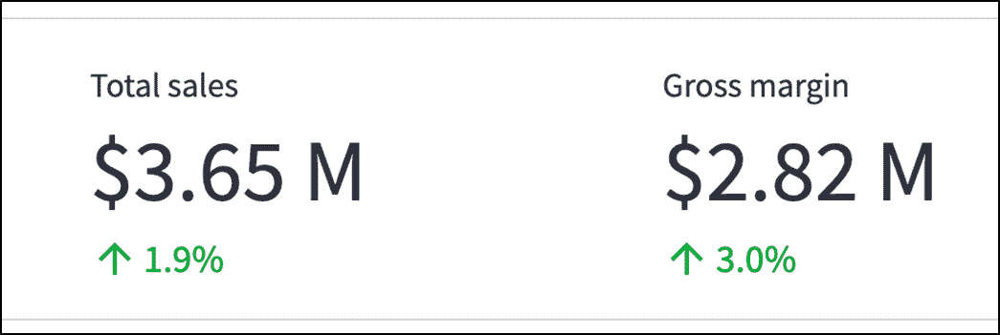

##### 图 7.9 展示了每个度量如何从比较日期范围变化的度量条（GitHub 仓库中的 chapter_7/in_progress_04 章节有完整代码）

如您所见，度量条现在显示了每个度量与比较日期范围中的值相比的变化情况。

嘣！我们解决了另一个关键反馈点，并且正在朝着仪表板的 2.0 版本稳步前进！让我们看看邮件中还有什么要说的。

## 7.5 深入查看

注意，N' Nib 的 CEO 以自己是“细节控”而自豪，所以当他看到仪表板上的数字时，他想知道*为什么*。例如，如果他发现圆珠笔的平均交易价值低于钢笔，他希望深入挖掘数据，了解是否有一些特定的群体在推动 ATV 下降。

我们的仪表板没有暴露比度量栏、折线图和饼图更多的数据，但显然人们希望有一个更灵活和详细的视图，也许甚至可以显示源数据中的单个行。

到目前为止，在我们的仪表板设计中，我们尽可能地屏蔽了复杂性。我们依靠可视化使数据易于理解，并使用清晰、友好的度量栏来显示关键汇总数字。抽象复杂性的质量通常是值得赞扬的，对于大多数用户来说也是如此。然而，有时你可能会遇到一个想要深入了解并更高级地与你的软件交互的强大用户。

在我们的案例中，Note n' Nib 的 CEO 符合这一描述——他对数据很熟悉，并表达了对无法钻取以获取更详细见解的挫败感。解决这一反馈可能是本章最复杂的任务，因为我们需要创建一个全新的视图，而不仅仅是改进现有功能。

### 7.5.1 插入模态对话框

在考虑钻取视图可能包含的内容之前，让我们思考一下将此功能放在哪里。由于我们将其归类为“高级”功能，我们可能不应该将其放在仪表板的主窗口中。普通用户应该能够忽略这个新的、更详细视图，而高级用户应该能够轻松找到它。

让我们利用这个机会讨论一个新的用户界面结构：模态对话框。模态对话框本质上是在主内容之上显示的覆盖层，在它被取消之前暂时阻止与底层界面的交互。这个覆盖层将专注于特定任务，这使得它非常适合展示像钻取这样的高级功能。

#### st.dialog

Streamlit 通过`st.dialog`提供了开箱即用的模态对话框。现在让我们看看它是如何工作的。

在我们对钻取视图的第一轮迭代中，为了保持简单，当用户想要钻取数据时，我们只需向他们展示整个 Pandas 数据框。当然，由于用户可能还希望深入了解我们最近添加的比较日期范围，我们需要展示主数据和比较数据框。

列表 7.1 展示了新文件`drilldown.py`，该文件已设置以实现这一点。

##### 列表 7.1 drilldown.py

```py
import streamlit as st

@st.dialog("Drilldown", width="large")
def drilldown(main_df, compare_df):
  main_tab, compare_tab = st.tabs(["Main", "Compare"])
  with main_tab:
    st.dataframe(main_df, use_container_width=True)
  with compare_tab:
    st.dataframe(compare_df, use_container_width=True)
```

了解到`st.dialog`的结构与`st.columns`、`st.tabs`或`st.container`不同，即它不是一个包含其他小部件的小部件，可能会让你感到惊讶。

相反，它与第六章中的`st.cache_data`类似，它是一个装饰器。用`st.dialog`装饰的函数运行时，其内容将在弹出对话框中渲染。

```py
@st.dialog("Drilldown", width="large")
```

宽度参数简单地设置了对话框的大小，可以是`"small"`（500 像素宽）或`"large"`（750 像素宽）。

被装饰的函数称为 `drilldown`，它接受来自 `dashboard.py` 的 `main_df` 和 `compare_df` 作为参数。该函数渲染两个标签页，分别命名为“主”和“比较”，并使用一个新的小部件 `st.dataframe` 在各自的标签页中显示传递的 Pandas 数据框。

使用 `st.dataframe` 如此简单地在屏幕上显示数据框，就像第六章中 `st.write` 所做的那样。我们稍后也会遇到它。

要看到对话框，我们需要 *触发* 它，所以让我们专注于这一点。

#### 使用 st.container 来显示 UI 元素顺序

如前所述，钻取视图应该对普通用户不显眼，但对高级用户来说相当明显。实现这一目标的一种方法是在侧边栏中添加一个标签为“钻取”的按钮，并在点击时触发对话框。

让我们检查 `dashboard.py` 中的现有代码：

```py
...
with st.sidebar:
  start, end, compare_start, compare_end = date_range_panel()

...
main_df = get_filtered_data_within_date_range(data, start, end, filters)
if main_df.empty:
  st.warning("No data to display")
else:
  compare_df = get_filtered_data_within_date_range(
                  data, compare_start, compare_end, filters)
  ...
```

侧边栏已经包含了日期范围面板，其中包含四个小部件（两个用于主要范围的日期输入、一个比较选择框和一个显示比较范围的说明框），所有这些都垂直排列。由于我们希望钻取触发器易于可见，我们可能不希望它位于日期范围面板 *下方*。好，所以我们把它放在面板上方，对吧？

除了这一点，这里还有一点排序问题。为了触发钻取视图，我们需要调用我们刚刚用 `st.dialog` 装饰的 `drilldown` 函数。这个函数的参数是 `main_df` 和 `compare_df`。

如果你再次检查 `dashboard.py` 代码，你会意识到获取 `main_df` 和 `compare_df` 需要我们已经有 `start`、`end`、`compare_start` 和 `compare_end` 的值，这样我们才能像这样（对于 `main_df`）传递它们：

```py
main_df = get_filtered_data_within_date_range(data, start, end, filters)
```

但这些值从何而来？当然是在侧边栏中！

```py
with st.sidebar:
  start, end, compare_start, compare_end = date_range_panel()
```

你看到我们的困境了吗？为了将钻取按钮放置在日期范围面板上方，我们需要在这一点之前编写其代码，但该代码需要只有在这之后才能获得的值！

这正是我在第六章中顺便提到的事情的完美阐述：显示元素顺序的能力。我们需要一种方法来区分 Streamlit 在屏幕上渲染小部件的顺序和这些小部件计算的顺序。

我们将使用 `st.container` 来实现这一点。在第六章中，我们使用它来显示指标栏和可视化内容的边框。这次，我们将利用不同的属性——`st.container` 可以在屏幕上放置一个 *占位符* 小部件，当我们能够填充其他小部件时。

对于我们的用例，占位符将位于日期范围面板上方——在侧边栏内——并且我们只有在代码中稍后获得 `main_df` 和 `compare_df` 后才会填充实际的钻取按钮。

让我们在 `dashboard.py` 中安排这个布局：

```py
...
from drilldown import drilldown

...
with st.sidebar:
  dd_button_container = st.container() #A
  start, end, compare_start, compare_end = date_range_panel()

...
main_df = get_filtered_data_within_date_range(data, start, end, filters)
if main_df.empty:
  st.warning("No data to display")
else:
  compare_df = get_filtered_data_within_date_range(
                  data, compare_start, compare_end, filters)
  if dd_button_container.button("Drilldown", use_container_width=True):
 drilldown(main_df, compare_df)
  ...
```

#A 这是在 st.sidebar 中定义的占位符

正如承诺的那样，我们在日期范围面板上方使用 `st.container` 放置一个占位符，并通过名称 `dd_button_container` 来引用它。

然后，一旦我们有了 `main_df` 和 `compare_df`，我们创建了一个按钮，当点击时调用钻取函数。注意，我们使用的是 `dd_button_container.button` 语法，而不是 `with`/`st.button` 结构，就像我们可以在列或选项卡中使用的那样。

现在是时候看到我们的对话框生动起来！重新运行 `dashboard.py` 并点击钻取按钮以获取图 7.10。

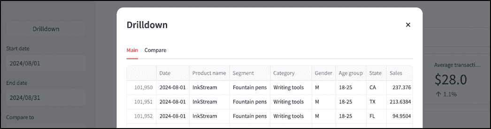

##### 图 7.10 使用 st.dialog 在对话框中渲染的基本原始数据框视图（完整代码请见 GitHub 仓库中的 chapter_7/in_progress_05）

你可能已经注意到，在点击之前，钻取按钮出现需要一秒钟。正如你可能猜到的，那是因为我们推迟了它的渲染，直到处理完其他一堆东西。

### 7.5.2 设计钻取内容

把你的注意力转到图 7.10 中的对话框上。我们目前只是以原样显示 `main_df` 和 `compare_df`。它相当难看，水平 *和* 垂直滚动条表明我们只看到了数据的一小部分。更重要的是，我们无法轻松使用这种视图来查找特定的数据点或查看特定数据子集。如果老板必须使用这个，他不会高兴的。

不，我们需要仔细思考才能获得正确的体验。

#### 用户需要从钻取视图中得到什么？

很明显，钻取页面的内容需要改变，但如何改变？我们的用户需要从这个视图中得到什么？好吧，还有什么比与用户交谈更好的方式来理解呢？

因此，你在 CEO 的日程上预订了一个时间段——他愿意接受，这表明他对仪表板的热情。在你与他面试时，他阐述了他提供关于钻取视图反馈的原始动机。

注意，Note n' Nib 在其畅销钢笔系列中有两个独立的产品：InkStream 和 RoyalQuill。InkStream 被视为对钢笔的现代时尚诠释，而 RoyalQuill，让人联想到经典复古笔的优雅，针对的是老年客户。

最近，公司为 RoyalQuill 运行了一项广告活动，特别针对 46-55 岁和 56 岁以上的女性。CEO 希望了解这次活动的假设和结果数据。具体来说，他想知道按年龄 *和* 性别划分的 InkStream 和 RoyalQuill 的销售额如何。

我们当前的仪表板向用户展示了按年龄 *或* 性别划分的指标细分，但不是两者兼而有之，因此他无法轻松访问这些信息。

你可能会看到这种反馈可以推广到 *任何* 数据维度的组合，而不仅仅是年龄组/性别。此外，在连贯且可重复的可视化中呈现这类细节可能会很棘手。

那么，我们需要的是一个高度灵活的表格形式来显示数据，类似于你可能从像 Microsoft Excel 这样的电子表格程序中熟悉的交叉表。这个表格应该：

+   使我们能够查看我们选择的任何维度的组合的数字

+   只让我们关注我们关心的字段，隐藏无关的行和/或列

+   显示汇总数字，以便我们可以看到完整的分解

根据这些要求创建的模拟用户界面如图 7.11 所示。

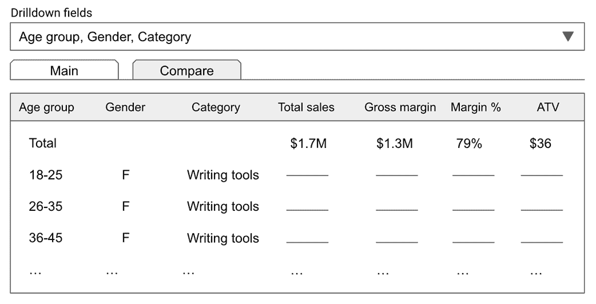

##### 图 7.11 钻取视图的模拟用户界面

模拟显示了一个相当灵活的表格，相当类似于交叉表。`钻取字段`框是一个多选框，允许我们选择我们关心的维度。下面是一个只显示我们已选择的维度的表格。它在这些维度上*聚合*数据，显示所选维度的每个组合的指标。还有一个总行，将所有内容加起来。

我们还保留了主/比较标签，以便用户可以在它们之间切换，查看指标的过去/现在视图。这种格式非常灵活，符合我们的要求，因此是时候构建它了！

### 7.5.3 实现钻取视图

图 7.11 中的钻取视图相当复杂，所以我们将逐步组装它，从钻取字段选择器开始，以一些格式化和样式结束。

#### 按几个选定的维度聚合

构建维度选择器（图 7.11 顶部的控件）只是将可能的维度选项传递给`st.multiselect`的问题。向`drilldown.py`添加一个新函数来完成此操作，并返回用户的选定列表：

```py
def drilldown_dimensions():
  return st.multiselect(
    "Drilldown fields",
    ["Age group", "Gender", "Category", "Segment", "Product name", "State"]
  )
```

如图 7.11 中的模拟所示，我们希望同时显示所有关键指标。让我们在`drilldown.py`中添加另一个函数（也在此文件中），它接受一个数据框（或其切片），通过聚合计算所有指标，并返回结果。记得导入我们需要的所有模块！

```py
import pandas as pd
import streamlit as st
from metric_config import metrics

...
def get_metric_cols(df):
 metrics_dict = {met: metric.func(df) for met, metric in metrics.items()}
 return pd.Series(metrics_dict)

...
```

表达式 `{met: metric.func(df) for met, metric in metrics.items()}` 是一种 *字典推导式*，它通过迭代某个东西来创建字典的简写形式。这里的意思是“迭代`metrics`字典（来自`metric_config.py`），并返回一个新的字典，其中每个键是指标的名称，对应的值是应用指标函数`metric.func`在`df`上的结果，即该指标的价值”。

我们在这里使用 Pandas 系列，因为，正如您很快就会看到的，它是一种多功能的数据类型，可以无缝集成到各种数据框操作中。

为了准备给定数据框和维度列表的聚合表，我们在同一文件中引入了一个名为`get_aggregate_metrics`的新函数：

```py
def get_aggregate_metrics(df, dimensions):
  if dimensions:
    grouped = df.groupby(dimensions)
    return grouped.apply(get_metric_cols).reset_index()
  metric_cols = get_metric_cols(df)
  return pd.DataFrame(metric_cols).T
```

如果`dimensions`不是一个空列表，即如果用户确实选择了某些钻取维度，`get_aggregate_metrics`将`df`按这些字段分组，并对每个组应用`get_metric_cols`（使用您在第六章中应该熟悉的`grouped.apply`），从而为每个组获得指标值。

如果没有选择维度，那么我们直接在 `df` 上调用 `get_metric_cols` 来获取一个包含整个数据框聚合度量的 Pandas 系列对象。最后，我们将这个系列转换为数据框并返回其 **转置**：

```py
return pd.DataFrame(metric_cols).T
```

数据框的转置（使用 Pandas 数据框的 `.T` 属性引用）是另一个数据框，其行和列已互换。在这种情况下，`metric_cols` 是一个 `pd.Series` 对象，对其调用 `pd.Dataframe` 将返回一个单列数据框，其中每个度量值都是一个行。

`.T` 是必需的，以便将其转换为只有一个-**行**的数据框，其中每个度量值都是一个列，这种格式更方便。

接下来，我们编写一个函数来返回我们的完整钻取表格。目前它相当单薄，因为我们只进行了一些聚合：

```py
def get_drilldown_table(df, dimensions):
  aggregated = get_aggregate_metrics(df, dimensions)
  return aggregated
```

我们将在稍后向 `get_drilldown_table` 添加更多逻辑。

总结来说，我们还需要一个函数来显示钻取表格（目前是一个 Pandas 数据框）：

```py
def display_drilldown_table(df):
  if df is None:
    st.warning("No data available for selected filters and date range")
  else:
    st.dataframe(df, use_container_width=True, hide_index=True)
```

这应该很简单；如果没有数据，我们显示警告，或者使用 `st.dataframe` 来显示聚合的表格。注意使用 `hide_index=True`。默认情况下，Streamlit 会显示索引字段（如您可能从第六章中回忆起，它是行的唯一标识符，默认为简单的序列号）并排显示在每个行旁边。您可以在图 7.10 中看到这一点（它们是数据框中极左边的数字）。我们不希望向用户显示索引，所以将其隐藏。

在做出这些更改后，我们还可以更新 `drilldown` 函数：

```py
@st.dialog("Drilldown", width="large")
def drilldown(main_df, compare_df):
  dimensions = drilldown_dimensions()
 main_data = get_drilldown_table(main_df, dimensions)
 compare_data = get_drilldown_table(compare_df, dimensions)

  main_tab, compare_tab = st.tabs(["Main", "Compare"])
  with main_tab:
    display_drilldown_table(main_data)
  with compare_tab:
    display_drilldown_table(compare_data)
```

操作顺序是逻辑的：首先我们从用户那里获取钻取维度（`dimensions = drilldown_dimensions()`），然后使用 `get_drilldown_table` 计算聚合的数据框（对于 `main_df` 和 `compare_df`），最后使用 `display_drilldown_table` 在单独的标签页中显示它们。

如果您现在重新运行仪表板，您应该会看到一个更加令人满意的钻取视图版本，如图 7.12 所示。

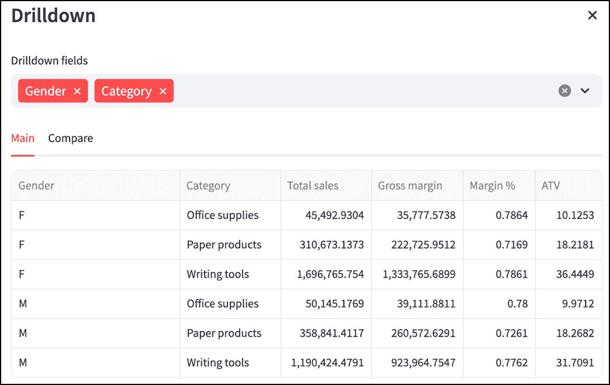

##### 图 7.12 带有维度选择器和按选定维度聚合的钻取视图（请参阅 GitHub 仓库中的 chapter_7/in_progress_06 以获取完整代码）

用户现在可以挑选他们想要的任何维度，并查看这些维度的每个组合的度量值。这实际上让用户能够钻取到所需的数据细节级别，但也许添加一个汇总“总计”行来理解这里正在分解的整体是有益的。

#### 添加“总计”行

在钻取表格中添加一个汇总行相对复杂，原因有几个：

+   Pandas 数据框没有原生的方式来指定一行作为其他所有行的汇总。当我们需要总和时，我们必须使用各种操作将它们整理在一起。

+   维度值在总计行中是没有意义的，应该留空。

以一个例子来说明，假设我们有以下钻取数据框（在过滤和聚合之后）：

```py
+--------+----------------+--------------+-------------+--------------+----------+-------+
| Gender |    Segment     | Product name | Total sales | Gross margin | Margin % | ATV   |
+--------+----------------+--------------+-------------+--------------+----------+-------+
|   M    | Fountain pens  | InkStream    |   $100,000  |   $60,000    |   60%    | $10   |
|   M    | Fountain pens  | RoyalQuill   |   $200,000  |  $150,000    |   75%    | $40   |
+--------+----------------+--------------+-------------+--------------+----------+-------+
```

在顶部添加总计行后，我们将得到一个看起来像这样的 dataframe：

```py
+--------+----------------+--------------+-------------+--------------+----------+-------+
| Gender |    Segment     | Product name | Total sales | Gross margin | Margin % | ATV   |
+--------+----------------+--------------+-------------+--------------+----------+-------+
| Total  |                |              |   $300,000  |  $210,000    |   70%    | $20   |
|   M    | Fountain pens  | InkStream    |   $100,000  |   $60,000    |   60%    | $10   |
|   M    | Fountain pens  | RoyalQuill   |   $200,000  |  $150,000    |   75%    | $40   |
+--------+----------------+--------------+-------------+--------------+----------+-------+
```

让我们在`drilldown.py`中使用一个新的函数`add_total_row`来实现这一点：

```py
def add_total_row(df, all_df, dimensions):
  total_metrics = get_metric_cols(all_df)
  if dimensions:
    dim_vals = {dim: '' for dim in dimensions}
    dim_vals[dimensions[0]] = 'Total'
    total_row = pd.DataFrame({**dim_vals, **total_metrics}, index=[0])
    return pd.concat([total_row, df], ignore_index=True)
  total_row = pd.DataFrame({'': 'Total', **total_metrics}, index=[0])
  return total_row
```

`add_total_rows`函数接受三个参数：`df`、`all_df`和`dimensions`（我们一直在传递的相同维度名称列表）。`df`是我们到目前为止的钻取 dataframe（例如上面的第一个表格），而`all_df`是在聚合之前的原始细粒度列的 dataframe。

为什么这里需要同时使用`df`和`all_df`？回想一下，我们有一个`get_metric_cols`函数，它可以计算给定 dataframe 所需的所有指标——换句话说，就是我们要构建的“总计”行的数值。`get_metric_cols`期望一个原始的非聚合 dataframe，而不是聚合版本。这意味着我们需要传递`all_df`而不是`df`。

那确实是函数中的第一个语句所做的事情，将结果存储在`total_metrics`中。

下一部分在维度列表非空（`if dimensions:`）的情况下构建总计行，即如果用户选择了某些钻取维度。

以下两行与填充维度值相关：

```py
dim_vals = {dim: '' for dim in dimensions}
dim_vals[dimensions[0]] = 'Total'
```

第一行是另一个字典推导式，为`dimensions`中的每个维度键都有一个空值。然后我们将第一个维度的值设置为`"Total"`。这实际上创建了我们上面示例中看到的总计行的文本显示值——第一个字段是`"Total"`，其余所有字段都是空白。

我们在`dim_vals`（一个字典）中有总计行的维度值，在`total_metrics`（一个`pd.Series`）中有指标值。我们只需要将它们放在一起！这就是下一行所做的事情：

```py
total_row = pd.DataFrame({**dim_vals, **total_metrics}, index=[0])
```

这里有一些有趣的语法，让我们来分解一下。

这里的字符序列`**`被称为*字典解包运算符*。它将字典中的项解包，以便它们可以与其他项结合形成新的字典，甚至可以作为函数参数传递。

前者是这里发生的情况。例如，如果`dim_vals`类似于`{'Gender': 'Total', 'Segment': '', ...}`，而`total_metrics`是`{'Total sales': 300000, …}`，则`{**dim_vals, **total_metrics}`会给你一个*合并*的字典`{'Gender': 'Total', 'Segment': '', ..., 'Total sales': 300000, ...}`。`index=[0]`将这个单行 dataframe 的唯一行的索引设置为 0。

你可能会注意到这个问题：我们刚才不是说过`total_metrics`是一个`pd.Series`而不是字典吗？好吧，虽然这是真的，但 Pandas 系列实际上具有许多常规 Python 字典的特性——其中包括对`**`运算符的支持。

下一行将这个总计行连接到其他钻取 dataframe 的剩余部分，并返回它：

```py
return pd.concat([total_row, df], ignore_index=True)
```

现在，如果用户没有选择任何维度并且 `dimensions` 为空，获取带有总行的数据框变得更容易；我们只需向 `total_metrics` 添加一个表示 `'Total'` 的空白列，就没有必要连接行了——数据框只包含总行：

```py
total_row = pd.DataFrame({'': 'Total', **total_metrics}, index=[0])
```

我们现在可以将获取总行的操作添加到 `get_drilldown_table` 中的转换，如下所示：

```py
def get_drilldown_table(df, dimensions):
  aggregated = get_aggregate_metrics(df, dimensions)
  with_total = add_total_row(aggregated, df, dimensions)
 return with_total
```

重新运行仪表板以查看总行看起来如何（见图 7.13）：

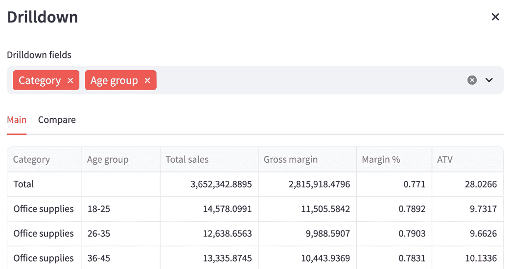

##### 图 7.13 显示了带有总行的钻取数据框视图（在 GitHub 仓库的 chapter_7/in_progress_07 中查看完整代码）

这几乎是完美的，但如果总行被突出显示或着色，以区别于其他行，那岂不是更好？

#### 格式化和样式钻取表格

虽然我们已经准备好了我们的钻取表格内容，但展示方式还有一些不足之处：

+   如图 7.17 所示，表中的数字是用户不友好的原始数字，几乎没有格式化。理想情况下，我们希望它们以与指标栏相同的方式显示（例如，“$1.2m”而不是“1200000”）。

+   没有阴影区分总行和其他表格行。

让我们先解决前者。在表格中格式化数字应该是相当直接的，因为我们已经在第六章的 `formatting.py` 文件中定义了实际的格式化规则。

我们需要的只是一个函数，可以将格式应用到整个 Pandas 数据框，而不是指标栏中显示的单独数字。

在 `formatting.py` 中为这个新功能启动一个新的函数：

```py
import humanize

def format_metric(value, metric_type):
  ...

def format_dataframe(df, metrics):
 cols = df.columns
 for col in cols:
 if col in metrics:
 df[col] = df[col].apply(format_metric, metric_type=metrics[col].type)
 return df
```

`format_dataframe` 函数应该很容易理解。在接收两个参数（`df`，要格式化的数据框，以及来自 `metrics.py` 的 `metrics` 字典）后，我们只需遍历 `df` 中的列，并将 `format_metric`（我们在第六章中编写的函数）逐元素应用到每一列。

注意我们是如何将 `metric_type` 传递给 `.apply()` 函数作为 *另一个* 参数的！

实质上以下表达式：

```py
df[col] = df[col].apply(format_metric, metric_type=metrics[col].type)
```

表示的是：为 `df[col]` 中的每个元素发出函数调用 `format_metric(element, metric_type=metrics[col].type)`，并保存结果，这应该是我们的格式化数据框。

让我们接下来解决着色问题：假设我们想要给总行一个灰色背景，使其从表格的其他部分中脱颖而出。

这的关键在于 Pandas 数据框的 `style` 属性，它使我们能够应用 *条件格式化*（即基于某些规则的格式化）到数据框。

为了实现这一点，我们将使用 `style` 属性的 `.apply` 方法，以及一个自定义函数，该函数定义了要应用的条件样式。

让我们在 `drilldown.py` 中创建一个新的函数来实现这个逻辑：

```py
def style_total_row(df):
  def get_style(row):
    first_col = row.index[0]
    return [
      'background-color: #d9d9d9' if row[first_col] == 'Total' else ''
      for _ in row
    ]
  return df.style.apply(get_style, axis=1)
```

`style_total_row`函数接受钻取数据框`df`，并应用所需的阴影。为了实现这一点，它在其体内定义了另一个名为`get_style`的函数！

在 Python 中，定义在另一个函数中的函数称为*嵌套函数*或*内部函数*。Python 认为嵌套函数是封装函数作用域内的局部变量。换句话说，`style_total_row`之外的所有代码都不能调用`get_style`。

接下来，我们来看`get_style`函数的逻辑，它操作 Pandas 数据框的单行，因此将行作为参数传入。

然后，它使用`first_col = row.index[0]`确定数据框的第一列名称。数据框行的`index`属性是一个类似列表的对象，包含其列的名称，因此`index[0]`给出第一列的名称。

下一行定义（并返回）了我们想要应用的真正条件样式：

```py
return [
  'background-color: lightgray' if row[first_col] == 'Total' else ''
  for _ in row
]
```

我们返回的表达式是一个*列表推导式*，通过迭代某个东西（类似于我们之前看到的如何构建新的字典）来构建一个新的列表。

在这种情况下，我们正在通过`for _ in row`遍历数据框行的字段。实际上我们不需要引用字段本身，这就是为什么我们在这里使用`_`——一个完全有效的 Python 标识符——作为循环索引。

对于每个字段，如果传入的行是总行（我们通过检查第一列的值是否为`"Total"`来验证），我们在我们构建的列表中添加一个特殊的字符串，`'background-color: lightgray'`。

这种表示法来自 CSS，这是用于样式化网页的语言。我知道我承诺过你不需要学习 CSS 就能阅读这本书，但这个特定的部分应该足够明显：我们正在告诉 Pandas 给总行中的每个字段一个浅灰色背景。

我们现在已经定义了我们想要应用的条件样式，但我们仍然需要应用它。`style_total_row`中的最后一行执行此操作：

```py
return df.style.apply(get_style, axis=1)
```

`.apply`在这里期望一个接受数据框行的函数，因此它可以在每一行上调用它（正如我们之前看到的）。

要完成我们的钻取视图，我们还需要添加`get_drilldown_table`的格式化和样式：

```py
...
from formatting import format_dataframe

...
def get_drilldown_table(df, dimensions):
  aggregated = get_aggregate_metrics(df, dimensions)
  with_total = add_total_row(aggregated, df, dimensions)
  formatted = format_dataframe(with_total, metrics)
 styled = style_total_row(formatted)
 return styled
```

就这样！我们的钻取视图现在已经完全形成。在图 7.14 中查看。

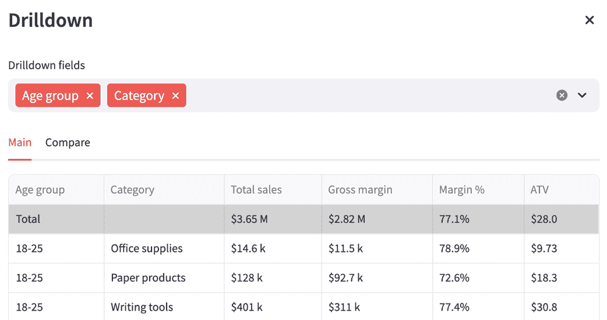

##### 图 7.14 完成的钻取视图，带有阴影的总行和格式化值（完整代码请见 GitHub 仓库中的 chapter_7/in_progress_08）

呼吁！这真是做了很多工作！然而，在我们完成之前，我们还有更多功能请求要处理。

##### st.dialog 的片段式行为

如果你特别关注了第四章中我们学习的 Streamlit 执行模型，那么我们实现钻取视图的一个方面可能会让你感到困惑。

要显示对话框，我们将其嵌套在一个按钮下面，如下所示（在`dashboard.py`中）：

```py
if dd_button_container.button("Drilldown", use_container_width=True):
  drilldown(main_df, compare_df)
```

`drilldown`是一个用`st.dialog`装饰的函数。在钻入中，我们可以执行许多交互，例如选择一个维度或设置一个过滤器。

但在之前的项目中，我们发现`st.button`的“点击”状态只持续一次重运行，而且每次我们与按钮下嵌套的任何东西交互时，应用都会再次运行，并且按钮点击会被清除。实际上，我们不得不在第四章跳过一系列的障碍，使用`st.session_state`来获得我们想要的行为。

但在这种情况下，我们不需要做任何这些。交互钻入不应该导致按钮点击重置并且钻入消失吗？

这并不是因为`st.dialog`表现出某种特殊行为。当用户与`st.dialog`装饰的函数内的小部件交互时，只有装饰的函数会重新运行，而不是整个应用！

在上述情况下，当有人选择一个钻入维度时，只有钻入功能会重新运行，按钮保持在“点击”状态。`st.dialog`从更通用的装饰器`st.fragment`中获取这种行为。

## 7.6 启用 deeplinks

下一个反馈列表上的问题是关于无法与其他人共享仪表板视图的投诉。自然地，CEO 经常在应用了各种过滤器和选择后，通过电子邮件向他的报告发送他在仪表板上看到的数据。

当收到这样的反馈时，下属会花很多时间尝试重新创建他的老板在仪表板上看到的内容，有时会通过试错来获取正确的过滤器和日期范围。“这，”CEO 写道，“相当于一种协作税。”

通过数据做出决策不是一项孤立的活动，或者在任何企业中都不应该是。你通常至少希望有其他几对人眼来验证你打算做出的决策。这对我们仪表板的当前用户来说是一个真正的问题。

使用仪表板，他们可能识别出对公司正在评估的决策至关重要的趋势或数据点。然而，如果他们要与别人分享，他们有两个选择：要么截图应用，要么给分享者提供如何重新创建视图的说明。

这两种方法都不是理想的。截图阻止了其他人进一步与应用交互，而另一种方法显然是低技术的（想象一下用户告诉某人，“你做错了。你需要应用去年的日期范围，过滤 18-25 岁的年龄组，并选择月度粒度！”）。

如果用户可以直接将他们正在查看的 URL 复制粘贴到聊天中，而接收者可以访问该 URL 并看到第一个用户看到的确切内容，那岂不是很好？毕竟，这对许多其他网站都有效。例如，当你使用像 Google 或 DuckDuckGo 这样的搜索引擎时，你可以通过发送你的搜索 URL 直接将某人带到搜索结果页面。

这种功能被称为*深度链接*，即在您的网站上链接某人“深入”。

深度链接是如何工作的？让我们以搜索引擎 DuckDuckGo 的一个例子来说明。如果您在 duckduckgo.com 上搜索`"streamlit"`，搜索结果页面的 URL 将类似于：

```py
https://duckduckgo.com/?t=h_&q=streamlit&ia=web
```

将此 URL 复制并粘贴到您的浏览器中，它将直接带您到查询“streamlit”的搜索结果页面。URL 中显示 `q=streamlit` 的部分使得这一点成为可能。该 URL 包含了第一个用户输入的信息，DuckDuckGo 使用这些信息将第二个用户引导到正确的页面。

如果我们将这种逻辑应用到我们的应用中，实现深度链接需要两个东西：

+   一种在应用 URL 中嵌入用户输入的方法

+   给定这样的 URL，一种在应用中自动重新填充这些输入的方法

### 7.6.1 使用 st.query_params

URL 中包含实际地址之后“额外”信息的那部分被称为*查询字符串*。它通过问号（`?`）字符与 URL 的其余部分分开。查询字符串由几个称为*查询参数*的键值对组成，这些键值对依次通过 ampersand（`&`）字符分隔。

例如，在上文中我们讨论的 URL 中，即 `https://duckduckgo.com/?t=h_&q=streamlit&ia=web`：

+   查询字符串是 `t=h_&q=streamlit&ia=web`

+   查询参数是：`t=h_`（键 `t` 和值 `h_`），`q=streamlit`（键 `q` 和值 `streamlit`），以及 `ia=web`（键 `ia` 和值 `web`）。

如果我们的应用有查询参数，它们会是什么样子？嗯，由于查询字符串需要捕获用户输入的信息，它可能看起来像以下这样：

```py
start_date=2024-08-01&end_date=2024-08-31&product_name=RoyalQuill
```

实质上，用户的选项需要成为查询字符串的一部分（因此，也是 URL 的一部分）。

Streamlit 允许您通过 `st.query_params` 管理查询参数，这是一个类似于 `st.session_state` 的字典样式的对象。

在任何时刻，`st.query_params` 包含您应用 URL 查询字符串中的所有键值对。您也可以通过修改 `st.query_params` 来修改浏览器地址栏中的查询字符串。

在 `st.query_params` 中获取和设置参数的语法与使用字典相同。例如，代码 `st.query_params["pie_chart_dimension"] = "Gender"` 会设置 `pie_chart_dimension` 参数，更新 URL 以包含 `pie_chart_dimension=Gender`。

您也可以这样读取参数的值：

```py
dimension = st.query_params["pie_chart_dimension"]
```

因此，我们的解决方案将涉及类似于图 7.15 的内容。

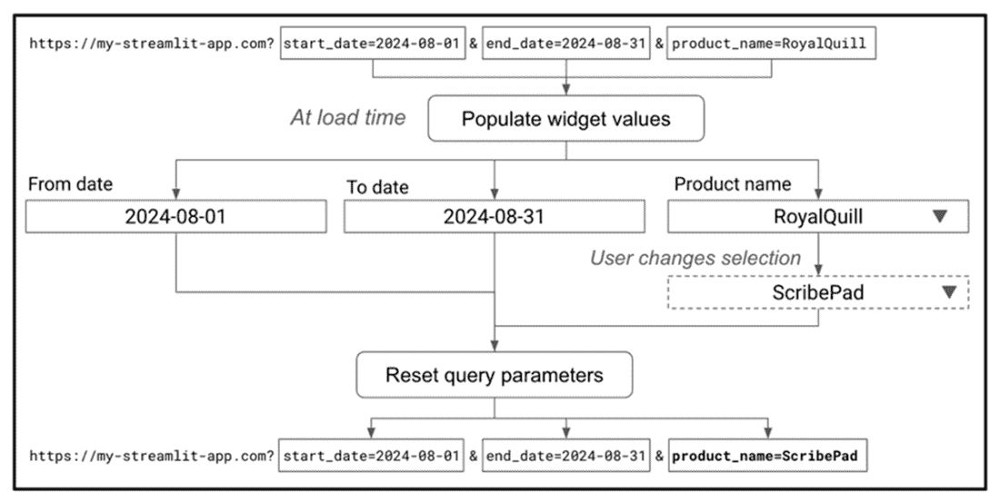

##### 图 7.15 实现深度链接的方法

当某人第一次导航到我们的应用时，如果 URL 中有查询参数，我们应该从 URL 中提取它们。

然后，我们根据这些参数设置小部件的值。例如，如果我们有一个 `start_date=2024-08-01` 作为查询参数之一，我们将在日期范围选择器小部件中将开始日期设置为 2024-08-01。如果没有查询参数，或者没有为特定小部件指定值，我们不会设置小部件的值；相反，我们让默认行为接管。

然后，当有人在小部件中更改选择时，我们会 *更新* 查询参数以反映该更改，从而也更改地址栏中的 URL。这样，如果用户复制 URL，它总是包含他们在应用程序中做出的最新选择！

### 7.6.2 通过 st.session_state 设置小部件默认值

我们方案中有一个部分在之前的任何章节中都没有涉及。我们如何通过编程设置输入小部件的值？

回想第四章，Streamlit 中的每个小部件（或 UI 元素）都有一个唯一的标识符，称为小部件键。键通常由 Streamlit 自动创建，但如果您有两个相同的小部件，您必须手动为每个小部件提供一个键，以便 Streamlit 可以区分它们。我之前没有提到的一个巧妙之处是，每次您为小部件提供一个键时，其值就会在 `st.session_state` 中变得可访问。

因此，如果您有一个如下编码的下拉输入：

```py
st.selectbox("Pick a field", ["Gender", "Product name"], key="select_dim")
```

您可以使用 `st.session_state["select_dim"]` 来访问其值

对我们来说非常重要的一点是，我们还可以 *设置* 其值，模拟用户选择，如下所示：

```py
st.session_state["select_dim"] = "Product name"
```

一个需要注意的问题是，我们只能在 *运行小部件代码之前* 做这件事。换句话说，我们可以在 `st.session_state` 中设置小部件键的值 *首先*，然后在小部件渲染时采用该值，但您不能先渲染带有键的小部件，然后通过在 `st.session_state` 中设置键的值来 *覆盖* 其值。

### 7.6.3 实现 deeplinks

我们现在拥有了构建 deeplink 功能所需的所有信息。创建一个名为 `query_params.py` 的新文件，其内容如列表 7.2 所示。

##### 列表 7.2 query_params.py

```py
import streamlit as st

def get_param(key):
  return st.query_params.get(key, None)

def set_widget_defaults():
  for key in st.query_params:
    if key.startswith('w:') and key not in st.session_state:
      st.session_state[key] = get_param(key)

def set_params():
  query_params_dict = {}
  for key in st.session_state:
    if key.startswith('w:'):
      value = st.session_state[key]
      query_params_dict[key] = value
  st.query_params.from_dict(query_params_dict)
```

`get_param` 函数通过使用 `st.query_params` 的 `.get()` 方法获取特定查询参数的值。它这样做的方式与常规字典相同，如果键不存在，则返回默认值 `None`。

`set_widget_defaults` 通过迭代它们并设置 `st.session_state` 中每个小部件键的值，从查询参数中填充应用程序中各种小部件的值。

为什么我们有以下条件？：

```py
if key.startswith('w:') and key not in st.session_state:
```

我们不一定希望 `st.session_state` 中存储的 *所有* 键都出现在 URL 中，只是那些代表小部件的键。为了确保这一点，稍后我们将为查询参数中想要包含的每个小部件键添加前缀 `'w:'`。这使我们能够在需要时使用 `st.session_state` 来实现其他目的，同时仍然能够使用它来自动填充小部件的值。

我们也不希望 Streamlit 在每次重新运行应用程序时尝试从 `st.query_params` 中设置小部件值，因为这样用户就无法更改值了。相反，我们只想在应用程序第一次从参数嵌入的 URL 加载时设置每个小部件值一次。这就是为什么我们有子条件 `key not in st.session_state`。

`set_widget_defaults` 完成了我们需要的深链接的第一部分——从 URL 中填充小部件输入的能力。然而，我们仍然需要在用户做出选择时更改查询参数。

这就是 `set_params` 函数所做的事情。它遍历 `st.session_state`，获取每个小部件键的值并将它们存储在一个字典中，即 `query_params_dict`。然后，它使用 `from_dict` 方法直接从这个字典中填充所有的 `st.query_params`。正如我之前所展示的，我们也可以在 `st.query_params` 中设置每个值，但我还想展示这种方法。

当然，为了使这可行，我们想要包含在查询参数中的所有小部件都必须有键定义，以 `'w:'` 开头。因此，我们需要遍历我们所有的代码，并为每个小部件添加小部件键。这恐怕不是一件很有趣的事情，但这是必须完成的。

如果你正在跟随，以下是我们需要进行的修改：

#### 对 `date_range_panel.py` 的修改

在 `date_range_panel.py` 文件中，我们向用户展示了三个日期选择小部件。我们需要为它们每个都添加键。这些键将变成：

```py
start = st.date_input("Start date", value=THIRTY_DAYS_AGO, key="w:start")
end = st.date_input("End date", value=LATEST_DATE, key="w:end")
comparison = st.selectbox(
    "Compare to", ["MoM", "QoQ", "YoY", "Previous period"], key="w:compare")
```

只要键以 `w:` 开头，键的确切名称并不重要。不过这里有一个额外的复杂性。

注意，我们目前通过 `st.date_input` 中的 `value` 参数将默认值 `THIRTY_DAYS_AGO` 和 `TODAY` 分别分配给开始和结束日期选择器。

当我们使用 `st.session_state` 来设置小部件值——就像我们在之前创建的 `set_widget_defaults` 函数中所做的那样——如果我们也尝试使用 `value` 参数来设置值，Streamlit 将会抛出一个错误。我们不能同时使用这两种方法，我们必须选择其中一种。

```py
if 'w:start' not in st.session_state:
 st.session_state['w:start'] = THIRTY_DAYS_AGO
if 'w:end' not in st.session_state:
 st.session_state['w:end'] = LATEST_DATE
start = st.date_input("Start date", key="w:start")
end = st.date_input("End date", key="w:end")
```

在这里，我们已经从两个小部件中移除了 `value` 参数，并在定义小部件之前添加了一些逻辑来使用 `st.session_state` 设置相同的值。这些行必须在定义小部件之前。

作为参考，整体的 `date_range_panel` 函数现在如下所示：

```py
...
def date_range_panel():
  if 'w:start' not in st.session_state:
 st.session_state['w:start'] = THIRTY_DAYS_AGO
 if 'w:end' not in st.session_state:
 st.session_state['w:end'] = LATEST_DATE
  start = st.date_input("Start date", key="w:start")
  end = st.date_input("End date", key="w:end")
  comparison = st.selectbox(
    "Compare to", ["MoM", "QoQ", "YoY", "Previous period"], key="w:compare")
  compare_start, compare_end = get_compare_range(start, end, comparison)
  st.info(f"Comparing with:  \n{compare_start} - {compare_end}")
  return start, end, compare_start, compare_end
```

#### 对 `filter_panel.py` 的修改

`filter_panel.py` 中有我们需要添加键的多选框：

```py
...
def filter_panel(df):
  ...
  with st.expander("Filters"):
    ...
    for idx, dim in enumerate(filter_dims):
      with filter_cols[idx]:
        ...
        filters[dim] = st.multiselect(
            dim, unique_vals, key=f'w:filter|{dim}')
  return filters
```

在这种情况下，由于多个小部件通过循环填充，我们使用 f-string `f'w:filter|{dim}'` 作为键，使用维度名称 `dim` 来区分键。

#### 对 `pie_chart.py` 和 `time_series_chart.py` 的修改

在 `pie_chart.py` 中，向分配给 `split_dimension` 的 `st.selectbox` 添加一个键：

```py
...
    split_dimension = st.selectbox(
      "Group by", pie_chart_dims, key="w:pie_split")
```

类似地，在 `time_series_chart.py` 中，向 `time_series_chart` 函数中的 `grain` 和 `split_dimension` 添加键：

```py
...
def time_series_chart(df):
  with st.container(border=True):
    ...
    grain = grain_col.select_slider(
          "Time grain", grain_options, key="w:ts_grain")
    split_dimension = split_col.selectbox(
      "Group by", ["None"] + time_chart_dims, key="w:ts_split")
    ………
```

在小部件键就位后，我们现在可以从 `dashboard.py` 中调用之前在 `query_params.py` 中定义的相关功能：

```py
...
from query_params import set_widget_defaults, set_params

st.set_page_config(layout='wide')
set_widget_defaults()

...

set_params()
```

注意我们放置 `set_widget_defaults` 和 `set_params` 调用的确切位置。如前所述，我们只能在创建任何小部件之前使用 `st.session_state` 来设置小部件键值，因此 `set_widget_defaults()` 调用需要放在最上面（紧随 `st.set_page_config(layout='wide')` 之后，这需要是第一条命令）。

另一方面，查询参数需要捕获用户更改的任何小部件的变化，因此 `set_params` 调用必须放在 `dashboard.py` 的末尾，在所有小部件创建之后。

让我们测试一下我们的 deeplinks！保存一切并重新运行应用程序。然后在应用程序中尝试进行以下选择：

+   将 "开始日期" 设置为 2024/07/01，并将 "比较" 设置为 YoY。

+   将折线图中的 "时间粒度" 滑块设置为周。

如果你现在检查浏览器地址栏中的 URL，它应该看起来像：

```py
http://localhost:8501/?w%3Ats_grain=Week&w%3Acompare=YoY&w%3Aend=2024-08-31&w%3Astart=2024-07-01&w%3Apie_split=Age+group
```

当一个网页 URL 包含某些特殊字符，例如冒号（`:`）或空格时，它会被转换为*百分编码*字符以确保浏览器和 Web 服务器能够正确解释它们。每个特殊字符通常会被一个 `%` 符号后跟两个十六进制数字代码所替换，该代码代表 ASCII 标准中的原始字符。一个例外是空格字符，当它在 URL 的查询参数部分出现时，会被编码为 `+` 符号。

在我们的情况下，以下替换已经发生：

+   冒号字符已变为 `%3A`，因此 `w:ts_grain` 变为 `w%3Ats_grain`

+   空格字符已变为 `+`，因此 `Age group` 变为 `Age+group`

反向替换这些值，URL 变为：

这基本上是我们预期的——我们做出的选择反映在 URL 中（以及饼图维度选择框的值，它默认获得一个非空值——`Age group`，这会自动捕获到 URL 中）。

##### 注意

由于我们目前正在本地开发，URL 以 http://localhost: 开头。当我们部署我们的应用程序时，localhost 部分将被应用程序的地址所替换。例如，如果我们部署到 Streamlit Community Cloud 下的 [`ceo-dashboard.streamlit.app`](https://ceo-dashboard.streamlit.app)，我们的带有查询参数的 URL 将类似于 https://ceo-dashboard.streamlit.app?query_param1=value1&query_param2=...

接下来，将您复制的原始 URL 粘贴到另一个浏览器标签中并导航到它。不幸的是，应用程序抛出了一个错误（请参阅图 7.16）。

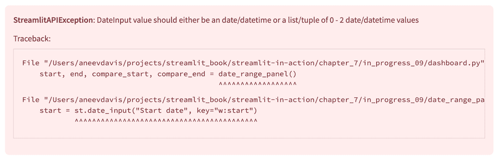

##### 图 7.16 当我们无意中向 st.date_input 传递字符串时，我们会得到一个错误（有关完整代码，请参阅 GitHub 仓库中的 chapter_7/in_progress_09）。

错误信息声称我们试图向一个 "DateInput" 传递了错误类型的值，可能是 "开始日期" 和/或 "结束日期" 小部件。

这里的问题是，在上面的（解析后的）URL 中，分配给开始日期小部件（键为 `w:start`）的值是字符串 `"2024-07-01"`：

```py
w:start=2024-07-01
```

当 Streamlit 试图将此值分配给最终定义的日期输入小部件时，它会导致错误，因为`st.date_input`期望一个日期对象，而不是字符串。

我们过滤器输入也存在类似的问题：这些小部件期望列表（因为您可以选择多个值），但我们传递的是字符串。

当要设置的值不是字符串而是日期或列表时，我们需要一些特殊的处理逻辑。

首先，当在`st.query_params`中设置此类小部件的值时，让我们添加一个前缀来表示我们放置的值是一个列表或日期——比如说，对于列表使用`L#`，对于日期使用`D#`。以下是经过修改的`query_params.py`中的`set_params`函数：

```py
import streamlit as st
from datetime import date

...
def set_params():
  query_params_dict = {}
  for key in st.session_state:
    if key.startswith('w:'):
      value = st.session_state[key]
      if value:
 if isinstance(value, list):
 value = f'L#{','.join(value)}'
 elif isinstance(value, date):
 value = f'D#{value.isoformat()}'
        query_params_dict[key] = value
  st.query_params.from_dict(query_params_dict)
```

在这里，在将值添加到`query_params_dict`之前，我们使用`isinstance`检查其类型。如果是列表，我们将其转换为特定格式的字符串（例如，`['M', 'F']`变为`L#M,F`）。如果是日期，我们将其转换为不同的格式（例如，`2024-08-01`变为`D#2024-08-01`）。

我们还需要反向逻辑来解码这些字符串格式，并将它们转换回原始值。这部分代码位于`get_param`函数中，我们将完全重写它：

```py
def get_param(key):
  if key not in st.query_params:
    return None
  value = st.query_params[key]
  if value.startswith('L#'):
    return value[2:].split(',')
  if value.startswith('D#'):
    return date.fromisoformat(value[2:])
  return value
```

如您所见，对于特定的键，如果值是一个以我们的特殊前缀之一开头的字符串——无论是`L#`还是`D#`——我们进行反向转换，将字符串转换为原始列表或日期。

当我们在`set_widget_defaults`中使用这个返回值时，它将因此处于预期的类型，与用户最初设置的值相同，从而消除了错误。

您可以通过重试前面的步骤亲自查看。现在您应该可以看到图 7.17，展示了您现在可以复制并粘贴仪表板的当前 URL，以向他人展示您所看到的确切内容。

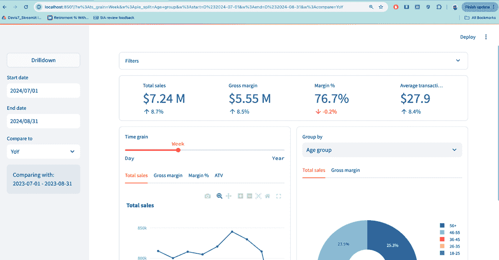

##### 图 7.17 仪表板中的小部件是根据 URL 值填充的（有关完整代码，请参阅 GitHub 仓库中的 chapter_7/in_progress_10）

再探索一下 deeplinks。注意，Nib 的执行人员现在可以花更少的时间摆弄仪表板，有更多时间做出对公司有利的决策！

## 7.7 从数据仓库中获取数据

我们已经解决了所有关于仪表板的用户反馈，但还有一个明显的实际问题我们尚未讨论：仪表板中显示的数据来自静态 CSV 文件。

我选择这种方法是因为我想让我们主要关注我们一旦拥有数据后如何处理数据。在我们的应用中，读取静态 CSV 文件可能是摄入数据的最简单方式。然而，这种方法存在多个问题：

+   当处理少量数据时，CSV 文件是可管理的，但当处理大量数据集时，它很快就会变得低效。

+   我们无法在源处灵活查询数据，而必须将其加载到内存中执行过滤、聚合和连接等操作。

在现实世界中，我们通常会把这个数据存储在 *数据仓库* 中，这是一个专门为管理大量结构化数据而设计的系统。在本节中，我们将用数据仓库中的表替换我们的 CSV 文件——具体来说就是 Google BigQuery。

### 7.7.1 将数据导入 BigQuery

Google BigQuery 是 Google Cloud Platform (GCP) 的一部分，是一个基于云的数据仓库服务。它允许您使用名为 *结构化查询语言* (SQL) 的语言高效地存储和分析大量数据集，无需管理基础设施或担心扩展问题。

要开始，您需要设置一个 GCP 账户，您可以在 cloud.google.com 上完成此操作。您可能需要输入支付方式详情，例如信用卡，但由于我们只是要使用此练习中的免费资源，您不会收到任何费用。

当您创建新账户时，Google 也会为您创建一个 *GCP 项目*。在 GCP 术语中，项目是组织和管理您的 Google Cloud 资源的一个容器。您需要有一个项目来使用 BigQuery；您可以自由使用为您创建的默认项目或创建一个新的项目。项目有一个唯一的 ID；您可以在创建项目时选择这个 ID，但默认 ID 是随机生成的字符串。例如，我的默认项目 ID 是 `dauntless-brace-436702-q0`。

接下来，让我们转到 BigQuery 本身。Google Cloud 非常庞大，提供的产品和服务众多，其 UI 可能会让初学者感到 intimidating。最可靠的方法可能是将搜索字符串 "bigquery" 输入顶部的搜索框中（如图 7.18）。

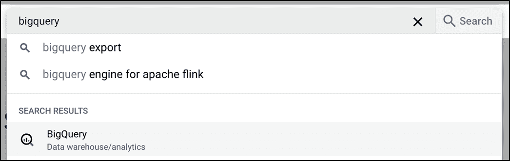

##### 图 7.18 在 GCP 中找到某物的最可靠方法是使用搜索栏。

一旦进入 BigQuery 页面，您应该能够在左侧的探索器侧面板中看到您的 BigQuery 资源，这些资源按您的 GCP 项目分类。"资源" 这里指的是 "查询"、"笔记本"、"工作流" 等等，所有这些都可能被忽略。

我们试图通过上传我们的 CSV 文件来创建一个 BigQuery 表。在我们能够这样做之前，我们需要创建一个数据集。BigQuery 数据集只是您在项目内组织表的一种方式。

通过在探索器面板中点击项目 ID 旁边的三个点，然后选择 "创建数据集"（如图 7.19），来创建您的第一个数据集。

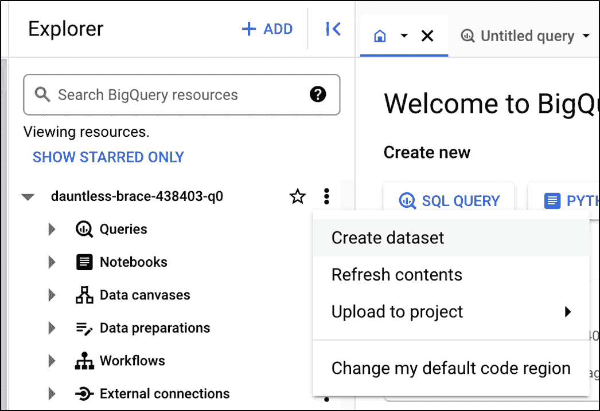

##### 图 7.19 BigQuery 中的探索器面板

这将打开一个屏幕，您可以配置数据集。您需要输入的只是名称（我选择了 `sia_ceo_dashboard`）；其余选项可以使用默认设置。

创建后，您的数据集应该会出现在探索器面板中。点击它旁边的三个点，然后选择 "创建表"，以进入创建表的屏幕，在那里我们可以上传我们的文件。

在“从创建表”选项下选择“上传”，并将文件格式选为“CSV”。然后您可以从本地磁盘选择`sales_data.csv`文件。您需要为表格选择一个名称（`sales_data`是一个不错的选择）。其余选项应该是直截了当的，并且很可能会自动填充：您的项目 ID 和您刚刚创建的数据集名称。图 7.20 显示了屏幕的外观。

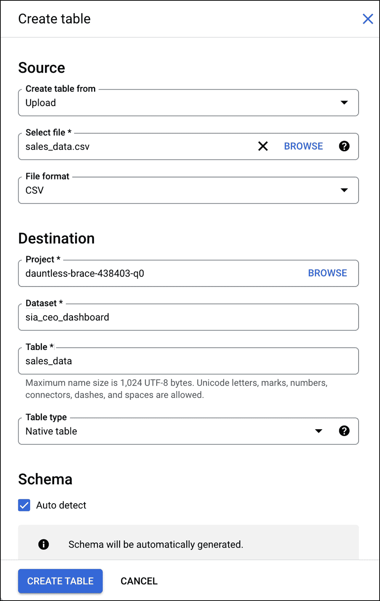

##### 图 7.20 BigQuery 中的表创建屏幕

在“模式”下勾选“自动检测”框，这样您就不必手动输入。然后点击底部的按钮来实际创建您的表格。

到这一步，您数据已经在 BigQuery 中，表格应该出现在资源管理器中您的数据集下。如果您愿意，可以点击进入并转到“预览”标签来查看数据。

### 7.7.2 设置 Python-BigQuery 连接

我们现在可以通过 BigQuery 界面访问我们的数据，但我们还需要能够从我们的 Python 代码中连接到它。

#### 启用 BigQuery 和 BigQuery 存储 API

首先，我们需要在我们的 GCP 项目中启用一些与 BigQuery 相关的 API：BigQuery 和 BigQuery 存储 API。BigQuery API 使我们能够首先连接到 BigQuery，而存储 API 使得将数据快速导入 Pandas 数据框变得更快。

在每种情况下，相应的结果都应引导您到一个页面，您可以在该页面启用 API。

#### 创建服务账户

由于我们的应用将通过编程方式连接到 BigQuery，我们需要一个*GCP 服务账户*来处理身份验证。服务账户是一种特殊类型的账户，属于您的应用程序而不是个人用户。它使您的应用能够进行身份验证并与 Google Cloud 服务（包括 BigQuery）交互。

要创建服务账户，首先在 Google Cloud 导航菜单中找到“IAM & Admin”，然后找到“服务账户”（或者更好的是，搜索“服务账户”并点击第一个结果）。

在“服务账户”页面中，点击创建账户的选项。此屏幕将要求您输入服务账户名称（我使用了`sia_service_account`）和描述。一旦创建账户，您还需要在同一屏幕上授予它对您项目的访问权限。创建时选择“查看者”角色。

您的服务账户现在应该显示在服务账户页面中。

#### 创建服务账户密钥

我们有一个可以访问我们的 BigQuery 资源的服务账户，但我们仍然需要获取让我们的 Streamlit 应用能够以服务账户身份操作的凭证。为此，我们需要一个服务账户密钥。

在服务账户页面中找到您刚刚创建的账户，点击它旁边“操作”下的三个点，然后点击“管理密钥”。

点击 "添加密钥" > "创建新密钥" 并选择 "JSON" 作为密钥类型。当你点击 "创建" 时，你的计算机应该会自动下载一个 JSON 文件。使用文本编辑器检查此文件。它应该包含你从应用程序访问 BigQuery 所需的凭证，以及一些额外的详细信息，如你的项目 ID。

#### 生成 secrets.toml

我们刚刚获得的凭证必须保密，因为它们允许任何拥有它们的人读取你的 BigQuery 数据。回想一下第五章，在 Streamlit 中维护机密信息的最佳方式是使用 `secrets.toml` 文件结合 `st.secrets`。

不幸的是，我们拥有的凭证文件是 JSON 格式的，因此我们需要将其转换为 TOML。你可以手动完成此操作，但让我们使用 Python 来完成。

首先创建一个 `.streamlit` 文件夹来存放你的 `secrets.toml` 文件。

将你的 JSON 文件重命名为 `sia-service-account.json`，然后从同一文件夹打开 Python 命令行，并输入以下命令：

```py
>>> import json
>>> import toml
>>> with open('sia-service-account.json') as json_file:
...     config = json.load(json_file)
...
>>> obj_to_write = {'bigquery': config}
>>> with open('.streamlit/secrets.toml', 'a') as toml_file:
...     toml.dump(obj_to_write, toml_file)
...
'[bigquery]\ntype = "service_account"\nproject_id = "dauntless-...'
<Rest excluded for brevity>
```

##### 注意

你可能首先需要运行 "pip install toml" 来使这生效。

我们在这里所做的只是打开我们从 GCP 获得的 JSON 文件，将其读取到一个 Python 字典中，并将其写回到 `secrets.toml` 中的 "bigquery" 键下。如果你现在打开 `secrets.toml`，你应该能够看到以 TOML 格式显示的凭证。

```py
[bigquery]
type = "service_account"
project_id = "dauntless-brace-436702-q0"
private_key_id = ...
...
```

### 7.7.3 更新仪表板以从 BigQuery 加载数据

是时候更新我们的代码，从 BigQuery 而不是静态 CSV 文件中获取数据源了。我们需要安装三个新的 Python 模块来实现这一点，所以请继续在终端窗口中输入以下命令：

```py
pip install google-cloud-bigquery
pip install google-cloud-bigquery-storage
pip install db-dtypes
```

前两个是访问 BigQuery 和 BigQuery Storage API 所必需的。`db-dtypes` 是必需的，以便将 BigQuery 返回的数据转换为 Pandas 数据框。

由于我们以模块化的方式编写了代码，我们唯一需要更改的是 `data_loader.py` 中 `load_data` 函数的实现，而我们的应用程序的其他部分应该像以前一样工作。这是我们在第三章中讨论的“关注点分离”原则的优势。

列表 7.3 显示了新的 `data_loader.py`，其中 `load_data` 已重新实现以使用 BigQuery。

##### 列表 7.3 重新实现了 `data_loader.py` 以使用 BigQuery

```py
import streamlit as st
from google.cloud import bigquery, bigquery_storage

DATASET = "sia_ceo_dashboard"
TABLE = "sales_data"

def load_data():
  service_account_info = st.secrets["bigquery"]
  client = bigquery.Client.from_service_account_info(service_account_info)
  creds = client._credentials
  storage_client = bigquery_storage.BigQueryReadClient(credentials=creds)
  project_id = service_account_info["project_id"]
  query = f"SELECT * from `{project_id}.{DATASET}.{TABLE}`"
  query_job = client.query(query)
  result = query_job.result()
  return result.to_dataframe(bqstorage_client=storage_client)
```

我们在顶部保留了一些常量（`DATASET` 和 `TABLE`），以保存我们在 BigQuery 中创建的数据集和表的名称。

在 `load_data` 中，我们首先将 `st.secrets` 中 `bigquery` 键的凭证保存到 `service_account_info`。然后我们将这些凭证传递进去创建一个 BigQuery 客户端（本质上是一个包含与 BigQuery 交互所需的方法和抽象的对象）：

```py
client = bigquery.Client.from_service_account_info(service_account_info)
```

我们希望在 BigQuery Storage API 客户端中也使用相同的凭证，因此我们从 BigQuery 客户端提取凭证，并使用它们来初始化 `storage_client`：

```py
creds = client._credentials
storage_client = bigquery_storage.BigQueryReadClient(credentials=creds)
```

我们现在已建立连接。

在 BigQuery 中，表是通过项目 ID、数据集名称和表名称的点分隔组合来引用的。例如，我创建的表将被引用为：

```py
dauntless-brace-436702-q0.sia_ceo_dashboard.sales_data
```

我们从凭证中获取项目 ID (`project_id = service_account_info["project_id"]`)，以及从上面创建的常量中获取数据集和表名。

我们使用表引用来构建这样的 SQL 查询：

```py
query = f"SELECT * from `{project_id}.{DATASET}.{TABLE}`"
```

在第八章中，我们将遇到更多的 SQL，但就目前而言，你需要理解的是，“`SELECT * from <table>`”意味着“从 `<table>` 获取所有列”。本质上，我们是在告诉 BigQuery 返回表中的所有数据。

虽然我们在这里没有这样做，但我们本可以使用不同的 SQL 查询来获取数据的某些 *子集*；如果我们还在使用 CSV 文件，我们就无法这样做。

接下来的两行执行查询本身，等待其完成，并将结果保存到 result：

```py
query_job = client.query(query)
result = query_job.result()
```

最后，我们使用 BigQuery 存储客户端来优化性能，将结果转换为 Pandas 数据框，并返回数据框。

如果你再次执行 `streamlit run dashboard.py`（由于我们使用了 `st.cache_data`，你无法在浏览器中重新运行应用程序，因为这会返回之前缓存的版本），应用程序现在将从 BigQuery 中拉取数据！

### 7.7.4 Streamlit 社区云部署注意事项

在第五章中，我们探讨了如何将我们的应用程序部署到 Streamlit 社区云。为此所做的过程对我们指标仪表板来说仍然相同，但我想要强调几点。

第一部分与数据存储位置有关。在部署时，如果你使用静态 CSV 方法来获取数据，你需要将 CSV 文件提交到 git 中，本质上是在你的 GitHub 仓库中存储它。

如果你使用的是 BigQuery，显然不需要 CSV，你也不必将其检入你的仓库。然而，你确实需要在 Streamlit 社区云中使用我们在第五章中使用的过程来配置你的 GCP 凭证。

你还需要创建一个包含我们使用和需要的所有模块的 `requirements.txt` 文件，并让社区云进行安装。如第五章所述，你可以使用 `pip freeze` 命令来识别我们使用的库的具体版本。

列表 7.4 提供了仪表板的示例 `requirements.txt`。

##### 列表 7.4 requirements.txt

```py
humanize>=4.10.0
streamlit>=1.38.0
plotly>=5.23.0
google-cloud-bigquery==3.25.0
google-cloud-bigquery-storage==2.26.0
db-dtypes==1.3.0
```

我们终于准备好发布仪表板的 2.0 版本了！毫无疑问，之后会有更多的反馈，每一次迭代都会进一步改进我们的仪表板。

然而，现在是我们告别 Note n' Nib 及其数据需求的时候了。在下一章中，我们将从数据洞察转向交互式工具，因为我们深入到一个用于创建、存储和共享俳句的 Web 应用程序。

## 7.8 概述

+   *启动* 应用程序只是使其成功的第一步。你还需要 *着陆* 它，确保它满足用户的需求。为此，直接听取用户的反馈至关重要。

+   `st.select_slider` 是 `st.selectbox` 和 `st.slider` 的结合，用于当你想要在选项之间施加逻辑顺序时使用。

+   `st.metric` 可以显示与指标相关的增量，即一个值随时间的变化情况。

+   `st.dialog` 是一个装饰器，允许你创建一个模态对话框，一个覆盖层，它会阻止与应用程序其余部分的交互。

+   你可以使用 `st.container` 在你的应用程序中创建占位符，只有当内容可用时才会渲染你想要显示的内容。

+   Pandas 数据帧有一个样式属性，可以用来设置条件规则，以修改它们在屏幕上的显示方式。

+   `st.query_params` 是一个类似于字典的对象，允许你读取和更新 URL 查询参数——这可以用来在应用程序中启用深链接。

+   数据仓库是一个专门设计的系统，用于存储和检索大量数据。

+   Google BigQuery——GCP 的一部分——是数据仓库的一个例子。要使应用程序能够连接到它，你需要创建一个带有密钥的服务帐户，并将凭据记录在 `st.secrets` 中。
