# 第九章：9 一个 AI 驱动的益智游戏

### 本章涵盖

+   将您的应用程序连接到大型语言模型 (LLM)

+   工程化 LLM 提示以实现您期望的结果

+   使用结构化输出以自定义可解析格式获取 LLM 响应

+   在顺序 Streamlit 应用中管理状态

+   使用 st.data_editor 创建可编辑的表格

创建软件与几年前相比有显著不同。这种差异源于人工智能（Artificial Intelligence）领域的重大发展，除非你一直住在山洞里，否则你可能已经听说过。

我当然是在谈论 LLM 或大型语言模型的突破，以及它们带来的令人兴奋的可能性。通过处理和生成自然语言，LLM 可以理解上下文，回答复杂问题，甚至可以自己编写软件——所有这些都能以惊人的流畅度完成。曾经需要特定领域专业知识或费尽心思编程的任务，现在只需几个精心设计的“提示”就能完成。

在本章中，我们将深入了解如何在您的应用程序中利用 LLM 的力量，依靠 AI 提示和响应来实现五年前需要高度先进技术的产品功能。在这个过程中，我们还将讨论如何调整您的 LLM 交互以获得您想要的结果，以及如何在不烧穿您的口袋的情况下做到这一点。

##### 注意

本书 GitHub 仓库为 [`github.com/aneevdavis/streamlit-in-action`](https://github.com/aneevdavis/streamlit-in-action)。chapter_09 文件夹包含本章的代码和一个 requirements.txt 文件，其中包含所有必需 Python 库的确切版本。

## 9.1 事实狂热：一个 AI 益智游戏

如果你小时候看过游戏节目 *Jeopardy!* ——或者无论如何作为一个成年人——你一定会喜欢这一章。由于我在美国以外长大，我在三十多岁时才看了这个节目的第一集，但在我小时候，我并不缺少痴迷的益智游戏——*Mastermind*、*Bournvita Quiz Contest* 和 *Kaun Banega Crorepati?*（这是对原始英国节目 *Who Wants to Be a Millionaire?* 的印度版本）都是我青春期的常客。

十五岁的我如果在这本书中不包括至少一个益智应用，成年后的我绝不会原谅自己。幸运的是，益智游戏非常适合我们的第一个 AI 驱动的 Streamlit 应用，该应用将生成问题、评估答案，甚至以各种问答主持风格进行混合，所有这些都将使用人工智能完成。

### 9.1.1 陈述概念和需求

我们将要采取的第一步是陈述我们想要构建的应用程序的概念。

##### 概念

事实狂热，一款询问用户一系列知识问答并使用 AI 评估其答案的益智游戏

就像本书中我们多次做的那样，需求将进一步阐述这个简单想法。

#### 需求

事实狂热将：

+   使用 AI 模型生成知识问答

+   向玩家提出这些问题

+   允许用户对每个问题输入自由文本响应

+   使用 AI 评估答案是否正确，并提供正确答案

+   跟踪玩家的分数

+   允许玩家为问题设置难度级别

+   提供多种问答主持人说话风格

虽然*我们通常*希望我们的需求不包含“实现”语言（如第三章所述），但在这个案例中，我们应用程序的整个目的就是展示 AI 的使用——因此我们肯定需要使用 AI 模型来执行其功能。

我们还增加了一个有趣元素，即问答主持人的说话风格——换句话说，在提问时模仿各种人的风格，这是我们只能通过 AI 才能实现的事情。

#### 范围之外的内容

我们省略了什么？虽然一个专业的知识竞赛游戏可以非常复杂，但在构建“事实狂热”时，我们希望创建一个最小化的应用程序，以便亲身体验我们之前未曾接触过的主题。因此，我们不会关注以下任何一项：

+   持久存储和检索问题、答案和分数

+   创建和管理用户

+   允许用户选择特定的问题类别

将上述项目排除在范围之外将使我们能够专注于诸如与大型语言模型（LLMs）交互、状态管理以及当然，新的 Streamlit 元素等问题。

### 9.1.2 可视化用户体验

为了让我们对“事实狂热”有一个具体的了解，请查看我们提出的 UI 草图，如图 9.1 所示。

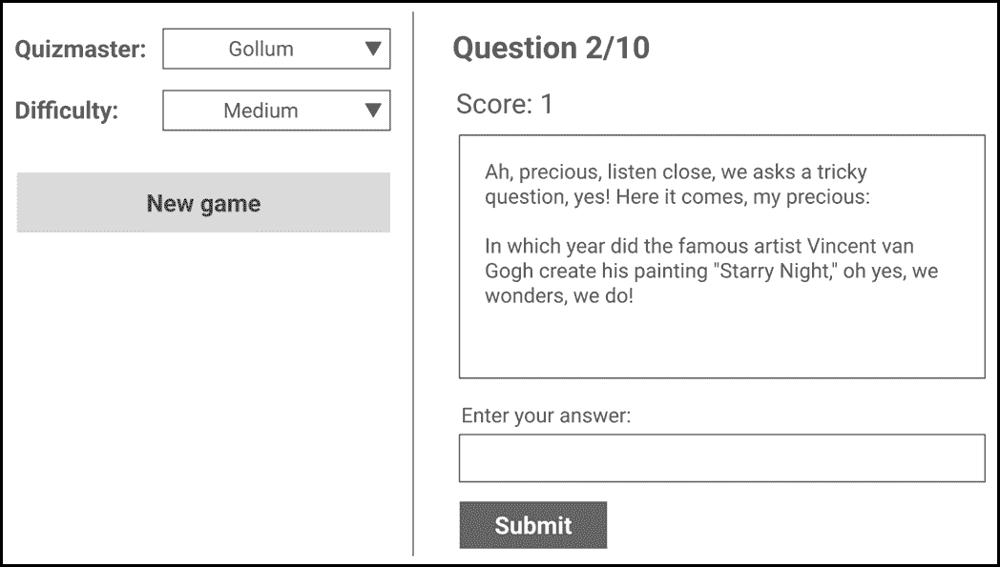

##### 图 9.1 “事实狂热”的 UI 草图

图表中显示的游戏窗口具有两列布局。左侧列有一个“新游戏”按钮，以及一些设置：问答主持人和难度。

参考上一节中确定的最后一个需求，问答主持人设置应该使用 AI 来模仿各种角色的说话风格。如图 9.1 所示，选定的值是“Gollum”，《指环王》中的一个角色，他使用独特的嘶嘶声说话，使用诸如“我的宝贝”之类的短语。

右侧的列显示了用 Gollum 的声音“说出”的 AI 生成问题，以及玩家的分数和一个输入答案的框。

除了花招之外，这是一个相当标准的问答知识竞赛游戏，允许玩家输入自由文本来回答。

### 9.1.3 实施头脑风暴

尽管我们将“外包”我们逻辑的大部分部分给 LLM，但我们仍然需要拥有整体的游戏流程。图 9.2 显示了我们在本章其余部分将努力实现的设计。

与我们编写的一些其他应用程序不同，用户可以在任何时刻执行各种操作，而“事实狂热”则相当线性。如图所示，基本逻辑在一个循环中运行——使用大型语言模型（LLM）检索一个知识问题，将其提出给玩家，让 LLM 评估答案，声明提供的答案是否正确，然后对下一个问题重复整个过程，直到游戏结束。


##### 图 9.2 基于 AI 的知识问答游戏的逻辑流程

在以后，我们将添加一些功能，如允许玩家设置难度级别和问答大师，但图 9.2 很好地代表了核心流程。

## 9.2 使用 AI 生成知识问答问题

在“知识狂潮”的核心是一个 AI 模型，它为知识问答体验提供动力。该模型生成问题、评估玩家回答，甚至为问答大师增添个性。为了实现所有这些，我们使用大型语言模型（LLM）——这是一种强大的 AI 系统，旨在处理和生成类似人类的文本。

LLM 是在大量文本数据上训练的，这使得它们具有极大的灵活性。它们可以执行从回答事实问题到创作诗歌、编写代码，以及对我们来说更重要的是——扮演问答大师等多种任务。流行的 LLM 例子包括 OpenAI 的 GPT 系列、Anthropic 的 Claude 和 Google 的 Gemini——所有这些都利用了尖端的机器学习技术来生成连贯、上下文适当的文本。

### 9.2.1 为什么在“知识狂潮”中使用 LLM？

什么使 LLM 适合用于我们的知识问答游戏？为了回答这个问题，让我们花一分钟时间考虑这种游戏的一些可能组成部分以及 LLM 如何支持构建每一个部分：

#### 一个巨大的问题列表

没有 LLM，我们需要维护一套足够大且多样化的知识问答题库，以保持我们的应用具有吸引力。由于今天的主要 LLM 都是基于历史、文化、地理、天文学以及你能想到的任何其他知识问答类别的大量文本和数据进行训练，因此它们能够即时生成问题。

#### 评估答案的能力

如果我们走传统的非 LLM 路线，我们实际上只能提出多项选择题，因为我们需要准确地将玩家给出的答案与实际答案匹配。另一方面，LLM 可以解释和响应自由文本用户输入。这使得我们能够提出开放式知识问答问题，同时仍然正确评估玩家的回答。

#### 娱乐价值

除了能够处理事实信息外，LLM 还可以发挥创意，提供幽默来吸引参与。在章节的后面，我们将要求它们模仿各种角色的风格，作为问答大师，从而给游戏赋予个性。

因此，在“知识狂潮”中，LLM 将扮演问题生成者、答案评估者和喜剧提供者的三重角色。在下一节中，我们将与顶级 LLM 提供商 OpenAI 建立账户，使我们能够首次开始与 LLM 互动。

##### 备注

虽然 LLM（大型语言模型）无疑非常强大，但它们并非全知全能。它们依赖于训练数据中的模式来生成回答，并且有时可能会犯错，尤其是在评估高度细微或模糊的回答时。然而，对于我们的 Trivia（知识问答）应用来说，这些模型在智能、多样性和娱乐性之间达到了完美的平衡。

### 9.2.2 设置 OpenAI API 密钥

对于本章，我们将使用 OpenAI 提供的 LLM，可能是最近在科技新闻中占据主导地位的新兴 AI 公司中最知名的一个。

正如我们在本书中多次做的那样，我们需要在第三方服务中开设账户，并将我们的 Python 代码与之连接。

如果你还没有 OpenAI 账户（你的 ChatGPT 账户也算），请访问[`platform.openai.com/`](https://platform.openai.com/)并注册一个账户。

##### 注意

如果你最近创建了 OpenAI 账户或者现在才创建，你的账户可能已经应用了一些免费信用额度。然而，免费层目前有相对严格的限制，例如每分钟只能调用某些模型三次。虽然技术上你可以使用免费层来完成本章（假设你的账户最初就有免费信用额度），如果你计划进行任何数量的严肃 AI 开发，我建议升级到付费层。正如你将看到的，你可以以相当低的价格获得大量的 LLM 使用量。虽然你可能需要购买 5 美元的使用信用额度才能达到最低付费层，但你在这章中不需要花费太多。为了参考，我在开发这个课程时进行的所有测试中，花费的信用额度不到 15 美分。你可以在名为“成本考虑”的侧边栏中了解更多关于成本优化的信息。

登录后，转到设置页面——在撰写本文时，你可以通过点击页面右上角的齿轮图标来完成此操作——然后点击左侧面板中的“API 密钥”。

创建一个新的密钥并将其记录下来。你可以保留所有默认设置不变（见图 9.3）。

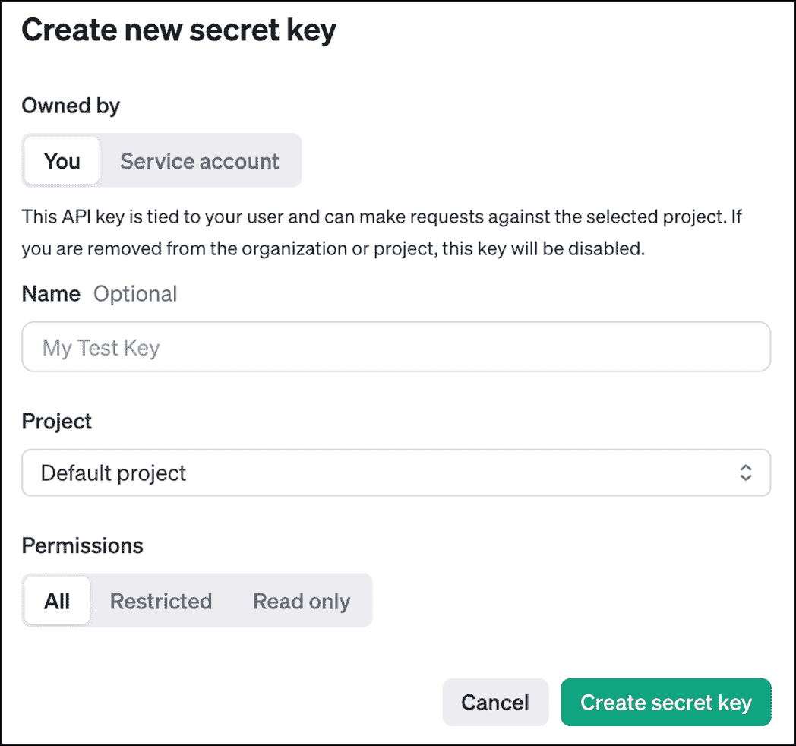

##### 图 9.3 在你的 OpenAI 账户中创建密钥

你只能看到一次你的密钥，所以将其复制并粘贴到某个地方。不用说，但请确保安全！

### 9.2.3 在 Python 中调用 OpenAI API

在我们开始开发应用程序之前，让我们确保可以在 Python 中无任何问题地调用 OpenAI API。

首先，使用`pip install openai`安装 OpenAI 的 Python 库。技术上，你可以使用`requests`模块通过 HTTP 调用调用 API（正如我们在第五章中所做的那样），但这个库更方便使用。

完成后，打开 Python shell 并导入`OpenAI`类：

```py
>>> from openai import OpenAI
```

`OpenAI`类允许你使用 API 密钥实例化一个客户端，以便调用 OpenAI API：

```py
>>> client = OpenAI(api_key='sk-proj-...')
```

将`sk-proj-...`替换为上一步中复制的实际 API 密钥。创建了一个`client`对象后，让我们准备发送给 LLM 的指令：

```py
>>> messages = [
...     {'role': 'system', 'content': 'You are a helpful programming assistant'},
...     {'role': 'user', 'content': 'Explain what Streamlit is in 10 words or fewer'}
... ]

```

你发送给 LLM 的每个请求都称为*prompt*。prompt——至少是我们在这里将使用的类型——由*消息*组成。在上面的代码中，我们将这些消息组装成一个列表。每个消息都采用字典的形式，包含两个键：`role`和`content`。

`role` 可以是 `user`、`system` 或 `assistant` 之一。我们将在稍后探索更多示例，但 `role` 的值表示对话中说话者的视角：

+   `system` 代表对模型的指令或上下文设置，例如它应该如何行为的规则。

+   `user` 代表与模型交互的人（您）。

+   `assistant` 代表模型的响应——我们将在下一章讨论这一点。

我们在这里创建的提示告诉 LLM（在系统消息中）它应该表现得像一个有帮助的编程助手。我们希望 LLM 响应的实际指令在用户消息中：`用 10 个词或更少解释 Streamlit`。

我们现在可以向 API 发出实际请求：

```py
completion = client.chat.completions.create(model='gpt-4o-mini', messages=messages)
```

OpenAI API 有几个不同的端点——一个用于将音频转换为文本，一个用于创建图像，等等。我们将使用的是 *chat completions* 端点，它用于文本生成。

给定一个对话中的消息列表，此端点应返回接下来会发生什么——因此有 *completion* 这个术语。OpenAI 有许多我们可以使用的模型，但我们在这里选择了 `gpt-4o-mini`，它在智能、速度和成本之间提供了良好的平衡。

##### 注意

虽然 gpt-4o-mini 目前是 OpenAI 为我们用例提供的最合适的模型，鉴于人工智能领域的快速发展，到这本书印刷的时候，我们可能会有更智能且更便宜的更新模型。请密切关注 OpenAI 的定价页面 [`openai.com/api/pricing/`](https://openai.com/api/pricing/)，以确保您使用的是最适合的模型。

上述语句需要几秒钟才能执行，并将返回一个 `ChatCompletion` 对象。如果您愿意，可以通过在壳中仅输入 `completion` 来检查此对象，但您可以通过以下方式访问我们想要的实际文本响应：

```py
>>> completion.choices[0].message.content
'Streamlit is a framework for building interactive web applications easily.'
```

我无法用更好的方式来表达！这标志着我们与 LLM 的第一次程序性交互。接下来，让我们将其构建到我们的问答游戏代码中。

### 9.2.4 编写 LLM 类

在第八章中，我们创建了一个 `Database` 类，它封装了我们的应用程序可以与外部数据库交互的交互。在这一章中，我们将采用相同的模式，使用一个 `Llm` 类来处理与外部 LLM 的所有通信。这使我们能够将 LLM 的通信逻辑与我们的应用程序的其他部分分开，使其更容易维护、测试，甚至完全替换，而无需触及剩余的代码。

我们在前一节中已经介绍了调用 LLM 的基础知识，所以剩下的只是将逻辑放入一个类中。

创建一个新文件，`llm.py`，内容如列表 9.1 所示。

##### 列表 9.1 llm.py

```py
from openai import OpenAI

class Llm:
  def __init__(self, api_key):
    self.client = OpenAI(api_key=api_key)

  @staticmethod
  def construct_messages(user_msg, sys_msg=None):
    messages = []
    if sys_msg:
      messages.append({"role": "system", "content": sys_msg})
    messages.append({"role": "user", "content": user_msg})
    return messages

  def ask(self, user_msg, sys_msg=None):
    messages = self.construct_messages(user_msg, sys_msg)
    completion = self.client.chat.completions.create(
      model="gpt-4o-mini",
      messages=messages
    )
    return completion.choices[0].message.content
```

（GitHub 仓库中的 `chapter_09/in_progress_01/llm.py`）

`Llm` 类的 `__init__` 方法只是使用传递给它的 API 密钥创建一个新的 OpenAI 客户端对象，并将其分配给 `self.client`。

`ask` 方法是类外部的逻辑与之交互的部分，它返回 LLM 对我们提示的响应。其代码基本上与我们之前在 Python 命令行中运行的是相同的，除了我们现在将 `user_msg` 和 `sys_msg` 作为参数传入，并将创建 `messages` 列表的操作放在一个名为 `construct_messages` 的独立方法中。

由于我们**不必**传递系统角色消息——LLM 无论如何都会尽力帮助——我们给 `sys_msg` 设置了一个默认值 None。`construct_messages` 方法在生成 `messages` 列表时考虑到这一点。由于这是一个不依赖于对象中其他任何内容的实用函数，我们通过使用 `@staticmethod` 装饰器将其设为静态方法。

我们将在本章的后面进一步细化 `Llm` 类，但现在是时候继续编写调用它的代码了。

### 9.2.5 `Game` 类

与第八章一样，我们将有一个单独的类——命名为 `Game` 的类——它包含所有应用程序前端将直接调用的后端逻辑。这与第八章中的 `Hub` 类有些类似，尽管我们将 `Game` 的结构设计得不同。

目前我们将保持代码相当简单，因为它的主要功能只是将一个提示传递给我们的 `Llm` 类。我们将放置在 `game.py` 中的 `Game` 类的初始版本在列表 9.2 中展示。

##### 列表 9.2 game.py

```py
from llm import Llm

class Game:
  def __init__(self, llm_api_key):
    self.llm = Llm(llm_api_key)

  def ask_llm_for_question(self):
    return self.llm.ask(
      'Ask a trivia question. Do not provide choices or the answer.',
      'You are a quizmaster.'
    )
```

(`chapter_09/in_progress_01/game.py` 在 GitHub 仓库中)

`Game` 实例的初始化（通过 `__init__`）涉及通过传递 API 密钥创建一个 `Llm` 对象，我们预计将从调用代码中获取这个 API 密钥。

`ask_llm_for_question` 方法传递一个简单的提示，要求 LLM 生成一个知识问答问题。注意，系统消息现在告诉 LLM 要表现得像一位问答大师。

用户消息指示 LLM 提出一个问题，并警告它不要提供任何选项或泄露答案。

### 9.2.6 在我们的应用程序中调用 `Game` 类

我们现在可以编写一个前端代码的最小版本来测试我们所做的一切。像往常一样，我们的 API 密钥需要保密并安全存放，所以我们将它放在一个新创建的 `.streamlit` 目录下的 `secrets.toml` 文件中，如列表 9.3 所示。

##### 列表 9.3 .streamlit/secrets.toml

```py
llm_api_key = "sk-proj-..."    #A
```

#A 将 sk-proj-... 替换为你的实际 API 密钥。

我们这次将 `secrets.toml` 保持得相当简单，采用非嵌套结构——注意 `[config]` 类似的部分缺失。毕竟，TOML 中的 O 也代表“明显”。

现在就创建 `main.py`（如列表 9.4 所示）吧。

##### 列表 9.4 main.py

```py
import streamlit as st
from game import Game

game = Game(st.secrets['llm_api_key'])

question = game.ask_llm_for_question()
st.container(border=True).write(question)
```

(`chapter_09/in_progress_01/main.py` 在 GitHub 仓库中)

目前这里还没有什么特别之处；我们只是创建了一个名为 `game` 的 `Game` 实例，调用它的 `ask_llm_for_question` 方法来生成一个知识问答问题，并将其写入屏幕。

注意我们如何将 `st.container` 与边框和 `st.write` 结合成一个单独的语句：

```py
st.container(border=True).write(question)
```

简洁而美观，就像 Streamlit 本身一样。使用`streamlit run main.py`运行你的应用程序（如前几章所述，请确保首先`cd`到包含`main.py`的目录，以便 Streamlit 可以找到`.streamlit`目录）以查看类似图 9.4 的内容。

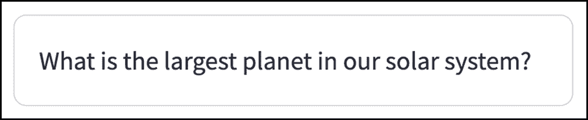

##### 图 9.4 应用程序现在可以成功调用 OpenAI API 以获取一个知识问题（有关完整代码，请参阅 GitHub 仓库中的 chapter_09/in_progress_01）

太好了——我们的 AI 测验大师现在可以向玩家提问了！接下来我们将评估玩家的答案。

## 9.3 使用 AI 评估答案

我们提供给 GPT-4o mini 的提示非常简单。至关重要的是，我们不需要对输出进行任何特别复杂的处理——只需将其原样显示在屏幕上即可。因此，我们并不真正关心 LLM 响应的*格式*。

然而，评估答案提出了一个稍微不同的挑战。当玩家在应用程序中输入答案时，我们需要 LLM 告诉我们两件事：

+   答案是否正确

+   如果不是，那么正确答案实际上是什么

如果你之前与 AI 助手互动过，这听起来完全在其能力范围内。但让我们考察一个实际挑战：如何可靠地解析 LLM 的响应？

例如，假设我们告诉 LLM：“嘿，你问了这个问题：<question>，玩家说答案是<answer>。告诉我这是否正确，如果不是，告诉我正确答案是什么”。

LLM 执行其操作并响应：

“不正确，正确答案是<correct answer>”。

我们该如何处理这个回复？当然，我们可以在屏幕上显示它，但我们可能还需要执行其他操作，比如决定是否增加玩家的分数。这意味着我们需要*解析*回复来理解答案是否正确。

我们该如何做？一个简单的方法是查找响应中的“incorrect”一词，并根据情况标记答案是否正确。

但如果 LLM 的回答实际上是“不，那不对，正确答案是<correct answer>”或者甚至“哈哈！如果他们说的是<correct answer>，那就会是正确的。但他们没有，所以很遗憾。”

问题是，LLM 有无数种创造性的回答方式，虽然我们作为人类能够理解它们，但我们仍然需要一个简单的方法来确定它们在机器友好的方式下的含义。

我们可以在提示中要求 LLM 包含“正确”或“不正确”等词语，但仍然可能会偶尔出错。幸运的是，有一个更好的方法。

### 9.3.1 结构化输出

能够可靠地解析 LLM 的输出是开发者的一个自然关注点，因此 OpenAI 为此提供了一个名为*结构化输出*的解决方案。

结构化输出是一个确保模型将生成一个遵循你提供的模式的响应的功能，这使得程序化解析变得简单。

对于我们的用例，这意味着我们可以请求 LLM 在其响应中提供两个结构化字段：一个表示提供的答案是否正确的布尔字段，以及实际的正确答案。

让我们创建这个模式作为一个名为 `AnswerEvaluation` 的类（列表 9.5）。我们需要第三方 `pydantic` 模块来使这工作，所以首先使用 `pip install pydantic` 安装它。

##### 列表 9.5 answer_evaluation.py

```py
from pydantic import BaseModel

class AnswerEvaluation(BaseModel):
  is_correct: bool
  correct_answer: str
```

（GitHub 仓库中的 `chapter_09/in_progress_02/answer_evaluation.py`）

`pydantic` 是一个使用类型提示来确保数据符合指定类型的验证库。

我们从 `pydantic` 导入的 `BaseModel` 是一个允许你定义模式并执行数据验证的类。它与 OpenAI 的结构化输出配合得很好。

我们定义的类 `AnswerEvaluation` 是 `BaseModel` 的一个 *子类*。*子类* 和 *超类* 与面向对象编程中的 *继承* 概念相关。详细解释继承超出了本书的范围，但只需知道子类可以 *继承* 其超类中的功能属性，允许你重用代码并在现有功能的基础上构建，而不需要从头开始。

在这种情况下，`AnswerEvaluation`（子类）继承了 `BaseModel`（超类）的功能，如数据验证、序列化和类型检查，这使得定义和操作结构化数据变得容易。

`AnswerEvaluation` 的主体与如果你将其视为数据类时可能期望的相同。确实，数据类与 `pydantic` 的 `BaseModel` 类似，但数据类不提供 `BaseModel` 所提供的复杂验证和相关功能。

幸运的是，我们实际上并不需要担心这个工作原理的内部细节——只需注意 `AnswerEvaluation` 有我们之前提到的两个字段：一个布尔字段 `is_correct` 和一个字符串 `correct_answer`。

接下来，让我们修改 `Llm` 类中的 `ask` 函数（`llm.py`）以支持结构化输出：

```py
from openai import OpenAI

class Llm:
  ...
  def ask(self, user_message, sys_message=None, schema=None):
    messages = self.construct_messages(user_message, sys_message)

    if schema:
 completion = self.client.beta.chat.completions.parse(
 model="gpt-4o-mini",
 messages=messages,
 response_format=schema
 )
 return completion.choices[0].message.parsed
    else:
      completion = self.client.chat.completions.create(
        model="gpt-4o-mini",
        messages=messages
      )
      return completion.choices[0].message.content
```

（GitHub 仓库中的 `chapter_09/in_progress_02/llm.py`）

在这里，我们添加了一个默认值为 `None` 的名为 `schema` 的参数。如果提供了值（`if schema`），我们将调用我们 OpenAI 客户端中的不同方法（与之前的 `chat.completions.create` 相比，现在是 `beta.chat.completions.parse`）。

我们传递给这个新方法的第一个和第二个参数与之前相同，但我们增加了一个第三个参数：`response_format`，我们将 `schema` 的值传递给它。

我们返回的最终值也有所不同：`completion.choices[0].message.parsed` 而不是 `completion.choices[0].message.content`。

如果没有提供 `schema`，我们将默认回退到之前的行为，从而确保 `ask` 方法可以处理结构化输出和常规文本。

我们需要传递给 `schema` 的值是一个 *类*——不是类的 *实例*，而是类 *本身*。然后返回的值将是一个该类的 *实例*，因此将遵循架构。正如你可能已经猜到的，对于我们的用例，我们将传递 `AnswerEvaluation` 类给 `schema`。

我们将在稍后创建这个调用代码，但首先让我们创建一个新的 LLM 提示，要求模型评估玩家的答案。

在开发过程中，你应该预计需要多次调整你的提示以获得更好的结果——事实上，近年来出现了一个名为 *提示工程* 的整个领域。

由于我们的提示与代码有实质性不同，所以让我们将它们放在不同的文件中，这样我们就可以在不触及其余代码的情况下编辑它们。我们将命名为 `prompts.py` 并在列表 9.6 中给出其内容。

##### 列表 9.6 prompts.py

```py
QUESTION_PROMPT = {
  'system': 'You are a quizmaster.',
  'user': 'Ask a trivia question. Do not provide choices or the answer.'
}

ANSWER_PROMPT = {
  'system': 'You are an expert quizmaster.',
  'user': '''
    You have asked the following question: {question}
    The player answered the following: {answer}

    Evaluate if the answer provided by the player is close enough
    to be correct.

    Also, provide the correct answer.
  '''
}
```

（GitHub 仓库中的 `chapter_09/in_progress_02/prompts.py`）

每个提示都结构化为一个字典，其中 `system` 和 `user` 键对应于系统和用户消息。

`QUESTION_PROMPT` 是我们之前的提示，而 `ANSWER_PROMPT` 是新的。请注意，其用户消息（如果你想知道语法，它是一个由 `'''` 包围的 Python *多行字符串*）包含以下这些行：

```py
You have asked the following question: {question}
The player answered the following: {answer}
```

我们在这里将 `{question}` 和 `{answer}` 视为变量，当我们稍后向 LLM 发送提示时，可以用真实值替换它们。

还要注意这条消息的最后两行，我们在这里告诉 LLM 评估答案的正确性，并且 *还要* 提供正确答案。这个模型足够智能，可以解释这个指令，并以我们的 `AnswerEvaluation` 架构提供结果。

说到这个，让我们实际编写代码，将这个架构连同提示一起传递，以满足我们的答案评估用例。我们将通过修改 `game.py` 来做这件事：

```py
from llm import Llm
from prompts import QUESTION_PROMPT, ANSWER_PROMPT
from answer_evaluation import AnswerEvaluation

class Game:
  def __init__(self, llm_api_key):
    self.llm = Llm(llm_api_key)

 def ask_llm_for_question(self):
 usr_msg, sys_msg = QUESTION_PROMPT['user'], QUESTION_PROMPT['system']
 return self.llm.ask(usr_msg, sys_msg)

  def ask_llm_to_evaluate_answer(self, question, answer):
 sys_msg = ANSWER_PROMPT['system']
 user_msg = (
 ANSWER_PROMPT['user']
 .replace('{question}', question)
 .replace('{answer}', answer)
 )
 return self.llm.ask(user_msg, sys_msg, AnswerEvaluation)
```

（GitHub 仓库中的 `chapter_09/in_progress_02/game.py`）

我们已经重构了 `ask_llms_for_question` 方法，以使用我们新的 `prompts.py` 模块。

但这里的主要变化是新的函数，`ask_llm_to_evaluate_answer`，它接受最初提出的 `question` 和用户提供的 `answer`，将这些值插入我们之前讨论的用户消息中的 `{question}` 和 `{answer}` 插槽。

这次，我们将 `AnswerEvaluation`（从 `answer_evaluation.py` 导入）作为第三个参数传递给 `self.llm` 的 ask 方法——`schema`，如你希望回忆的那样。这个有趣的一个方面是我们在这里传递的是 `AnswerEvaluation` *本身*，而不是 `AnswerEvaluation` 的 *实例*，而是类。在 Python 中，你代码中的大多数结构都是 *对象*，你可以像这样传递它们，包括类——这是使强大的灵活编程模式成为可能的东西。

但我跑题了。让我们回到使我们的游戏能够接受和评估玩家答案的步骤。最后一步是对 `main.py` 中的前端进行必要的更改：

```py
import streamlit as st
from game import Game

game = Game(st.secrets['llm_api_key'])

question = game.ask_llm_for_question()
st.container(border=True).write(question)

answer = st.text_input("Enter your answer")
if st.button("Submit"):
 evaluation = game.ask_llm_to_evaluate_answer(question, answer)
 if evaluation.is_correct:
 st.success("That's correct!")
 else:
 st.error("Sorry, that's incorrect.")
 st.info(f"The correct answer was: {evaluation.correct_answer}")
```

（GitHub 仓库中的 `chapter_09/in_progress_02/game.py`）

你应该能够很容易地理解我们在这里所做的事情。一旦我们向玩家提出了这个趣味问题，我们就会显示一个文本输入框供他们输入答案，以及一个“提交”按钮，当点击这个按钮时，会触发`game.py`中的`ask_llm_to_evaluate_answer`方法。

结果值——存储在`evaluation`中——是`AnswerEvaluation`类的一个实例。我们使用它的`is_correct`属性来显示适当的正确/错误信息，以及`evaluation.correct_answer`来显示正确答案。

现在尝试重新运行你的应用程序，并为趣味问题提供一个答案。图 9.5 显示了我是如何做到的。

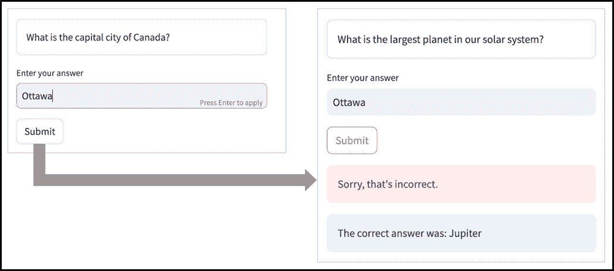

##### 图 9.5 由于会话状态的问题，我们的答案与错误的问题匹配（有关完整代码，请参阅 GitHub 仓库中的 chapter_09/in_progress_02）

哎呀！这里有些鬼鬼祟祟的事情！我在图 9.5 的左侧部分回答“Ottawa”的问题时，答案是“加拿大的首都是什么？”。但是当我按下“提交”按钮时，应用程序显示了一个不同的问题——“我们太阳系中最大的行星是什么？”——然后竟然厚颜无耻地告诉我，“Ottawa”实际上**不是**那个问题的正确答案。

你会在测试中注意到类似的诱饵和替换。发生了什么事？我们的 AI 统治者是在玩弄我们吗？

事实上，LLM 对这种所谓的恶作剧完全无辜。问题——正如我们在本书中多次看到的那样——与会话状态和 Streamlit 应用程序的重运行有关。在这个特定的情况下，点击“提交”按钮会从“顶部”触发重运行，这意味着在`if st.button("Submit"):`下的代码运行之前，`game.ask_llm_for_question()`会被再次调用，从而产生一个新的问题，这个新问题作为`ask_llm_to_evaluate_answer`的第一个参数传递，同时从文本输入中提取“Ottawa”作为第二个参数。

嗯，至少，我们代码中的结构化输出部分似乎是在正常工作，因为木星确实是太阳系中最大的行星，而 Ottawa 是不正确的。

然而，为了使 Fact Frenzy 表现出我们预期的行为，我们将在下一节中仔细思考状态管理。

## 9.4 游戏状态之间的移动

在前面的章节中，Streamlit 的重运行整个应用程序的模型意味着我们必须广泛使用`st.session_state`来让应用程序记住值。这一点在这里同样适用。

然而，Fact Frenzy 在某种意义上是**顺序的**，而我们的先前的应用程序并不是。你可以把我们的游戏期望的行为看作是在各种**状态**之间移动，在每个状态中采取不同的动作并显示不同的小部件。图 9.6 说明了这一点。


##### 图 9.6 我们的游戏由四个连续的状态组成

该图确定了游戏可能处于的四个状态：

+   GET_QUESTION，其中我们从 LLM 检索一个问题

+   ASK_QUESTION，其中我们向玩家提出这个问题

+   `EVALUATE_ANSWER`，涉及调用 LLM 来评估答案

+   `STATE_RESULT`，在这里我们告诉玩家他们是否正确

这些操作应该在游戏处于对应状态时才发生。此外，我们还需要确保我们对每个 LLM 请求只进行一次——因为否则会搞乱我们的逻辑，并且会花费金钱。

在此类顺序应用程序（如本例以及你未来可能编写的其他应用程序）中，我们将发现一个有用的模式是，在应用程序的中心类（在我们的例子中是 `Game`）中正式保留一个状态/状态属性，并配合修改它的方法，并在前端使用基于此属性的逻辑条件来显示屏幕上的正确元素。图 9.7 应该会使我所说的更清晰。

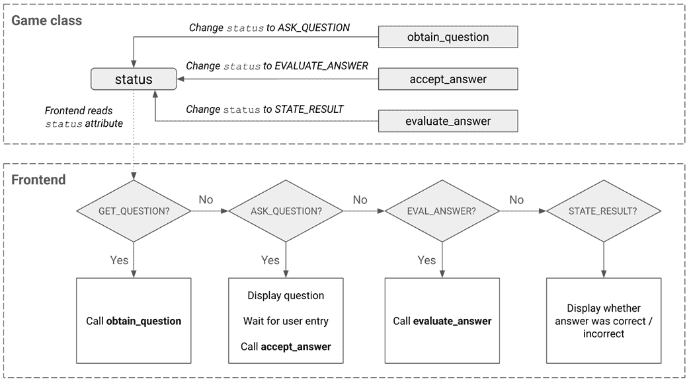

##### 图 9.7 前端基于游戏状态的分支

正如你在图 9.7 中看到我们提出的逻辑，`Game` 类将有一个 `status` 属性，表示游戏所处的状态。我们将在前端读取这个状态，在各个显示元素之间进行分支——无论是 `ASK_QUESTION` 状态中的答案文本输入，还是 `GET_QUESTION` 和 `EVALUATE_ANSWER` 状态期间的等待 LLM 请求的状态元素。

`Game` 类也有改变其 `status` 属性的方法，控制所有这些。`obtain_question` 方法可能会从 LLM 获取问题，并在完成后将状态更改为 `ASK_QUESTION`。`accept_answer` 方法将接受玩家的答案，并将状态切换到 `EVALUATE_ANSWER`，而 `evaluate_answer` 方法除了让 LLM 给我们结果外，还会将状态切换到 `STATE_RESULT`。

让我们把这些都付诸实践，从 `Game` 类开始：

##### 列表 9.7 game.py（已修改）

```py
from llm import Llm
from prompts import QUESTION_PROMPT, ANSWER_PROMPT
from answer_evaluation import AnswerEvaluation

class Game:
  def __init__(self, llm_api_key):
    self.llm = Llm(llm_api_key)
    self.status = 'GET_QUESTION'

 self.curr_question = None
 self.curr_answer = None
 self.curr_eval = None

  def ask_llm_for_question(self):
    usr_msg, sys_msg = QUESTION_PROMPT['user'], QUESTION_PROMPT['system']
    return self.llm.ask(usr_msg, sys_msg)

  def ask_llm_to_evaluate_answer(self):
    sys_msg = ANSWER_PROMPT['system']
    user_msg = (
      ANSWER_PROMPT['user']
      .replace('{question}', self.curr_question)
      .replace('{answer}', self.curr_answer)
    )
    reply = self.llm.ask(user_msg, sys_msg, AnswerEvaluation)
    return reply

  def obtain_question(self):
 self.curr_question = self.ask_llm_for_question()
 self.status = 'ASK_QUESTION'
 return self.curr_question

 def accept_answer(self, answer):
 self.curr_answer = answer
 self.status = 'EVALUATE_ANSWER'

 def evaluate_answer(self):
 self.curr_eval = self.ask_llm_to_evaluate_answer()
 self.status = 'STATE_RESULT'
```

（GitHub 仓库中的 `chapter_09/in_progress_03/game.py`）

正如之前讨论的那样，这里第一个大的变化是引入了 `self.status` 属性，它正式表示游戏的状态。我们将其初始化为 `GET_QUESTION`，因为这是我们想要的第一种顺序状态。

你会注意到我们还有三个其他属性——`curr_question`、`curr_answer` 和 `curr_eval`——用于在 `Game` 实例中保存当前问题、答案和评估。这与 `game.py` 的早期版本不同，那时我们将 `question` 和 `answer` 作为类外部的变量来处理。在类内部跟踪这些内容更适合我们新的 *状态化* 方法。

你会在 `ask_llm_to_evaluate_answer` 方法中看到这一点，在那里我们放弃了 `question` 和 `answer` 参数，转而使用 `self.curr_question` 和 `self.curr_answer` 属性。

此外，我们引入了三种新的方法（之前也讨论过）——`obtain_question`、`accept_answer`和`evaluate_answer`。`obtain_question`和`evaluate_answer`分别是`ask_llm_for_question`和`ask_llm_to_evaluate_answer`的包装器，每个只是将结果分配给其关联的属性——`self.curr_question`或`self.curr_answer`——然后在代码中添加一行以将`self.status`移动到其下一个值。

`accept_answer`甚至更简单；它只是将`self.answer`设置为玩家可能提供的答案。

我们需要实现的用于实现我们设想的状态管理方法的更改集的第二部分在于`main.py`：

```py
import streamlit as st
from game import Game

if 'game' not in st.session_state:
 st.session_state.game = Game(st.secrets['llm_api_key'])
game = st.session_state.game

if game.status == 'GET_QUESTION':
 with st.spinner('Obtaining question...') as status:
 question = game.obtain_question()
 st.rerun()

elif game.status == 'ASK_QUESTION':
  st.container(border=True).write(game.curr_question)
  answer = st.text_input("Enter your answer")
  if st.button("Submit", type='primary'):
    game.accept_answer(answer)
 st.rerun()

elif game.status == 'EVALUATE_ANSWER':
 with st.spinner('Evaluating answer...') as status:
 game.evaluate_answer()
 st.rerun()

elif game.status == 'STATE_RESULT':
  if game.curr_eval.is_correct:
    st.success("That's correct!")
  else:
    st.error("Sorry, that's incorrect.")
    st.info(f"The correct answer was: {game.curr_eval.correct_answer}")
```

（GitHub 仓库中的`chapter_09/in_progress_03/main.py`）

我们首先将我们的`Game`实例放置在`st.session_state`中，确保我们在重试时将处理相同的实例：

```py
if 'game' not in st.session_state:
  st.session_state.game = Game(st.secrets['llm_api_key'])
game = st.session_state.game
```

这里的最后一行是为了方便，使我们能够简单地用`game`来引用我们的`Game`实例，而不是每次都写出`st.session_state.game`。

剩余的代码基于`game`的`status`属性构建条件分支。让我们简要考虑每个这样的条件：

```py
if game.status == 'GET_QUESTION':
  with st.spinner('Obtaining question...') as status:
    question = game.obtain_question()
    st.rerun()
```

第一个分支处理`GET_QUESTION`状态。应用无需用户交互即可处理此状态，因为它只是从 LLM 获取问题。然而，这可能需要一定的时间，因此我们显示所谓的*状态元素*。

状态元素只是一个小部件，它在后台进行长时间运行的操作时向用户提供一些指示。Streamlit 有几种不同的状态元素——`st.spinner`、`st.status`、`st.toast`、`st.progress`——每个都有略微不同的特性。

我们在这里使用的`st.spinner`简单地显示一个旋转的圆形动画（我们在第六章中看到过，当时我们将`show_spinner`参数应用于`@st.cache_data`），直到后台操作完成。

注意我们在调用`game.obtain_question()`之后调用的`st.rerun()`。这是因为一旦`obtain_question`（来自`game.py`）将状态更改为`ASK_QUESTION`，我们需要代码再次运行，以便进入由`elif game.status == 'ASK_QUESTION':`给出的*下一个*条件分支。

剩余的分支相当相似。在每种情况下，都存在某种触发器导致应用移动到下一个状态，随后进行重试。在`ASK_QUESTION`状态中，点击“提交”会调用`game.accept_answer(answer)`，这将设置`game`的`curr_answer`属性并将状态更改为`EVALUATE_ANSWER`。

在`EVALUATE_ANSWER`中，我们调用`game.evaluate_answer()`并在等待它返回时显示另一个`st.spinner`，最终将状态更改为`STATE_RESULT`。

重试后，我们只需根据`game.curr_eval`，我们的`AnswerEvaluation`对象，显示适当的消息。

现在通过重试应用查看结果（图 9.8）

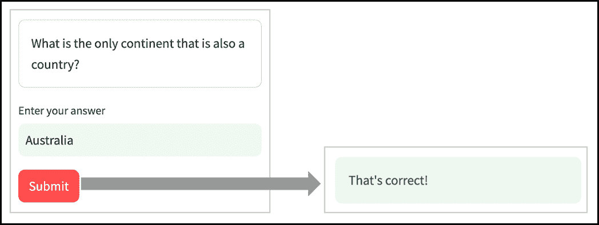

##### 图 9.8 问题-答案不匹配的问题已解决（完整代码请见 GitHub 仓库中的 chapter_09/in_progress_03）

这次你会看到应用程序正确匹配问题和答案，解决了我们之前看到的问题。

## 9.5 游戏机制：计分、新游戏按钮和游戏结束

目前，Fact Frenzy 只做了我们需要的最基本的事情：向玩家提问，评估答案，全部使用 AI。但这并不是一个真正的*游戏*；没有得分，也没有游戏开始和结束的概念。让我们逐一解决这些问题。

#### 计分

我们希望 Fact Frenzy 易于上手，所以我们将保持我们的计分机制简单；每个正确答案加一分。

这应该相当简单就可以集成到`Game`类中：

```py
...
class Game:
  def __init__(self, llm_api_key):
    self.llm = Llm(llm_api_key)
    ...

    self.score = 0

  ...
  def evaluate_answer(self):
    self.curr_eval = self.ask_llm_to_evaluate_answer()
    if self.curr_eval.is_correct:
 self.score += 1
    self.status = 'STATE_RESULT'
```

（GitHub 仓库中的`chapter_09/in_progress_04/game.py`）

我们只需在`__init__`中将`Game`实例的`score`属性添加为新的属性，并将其设置为 0 以开始。

在`evaluate_answer`方法中，如果 LLM 确定答案正确，我们将这个分数加 1。

#### 游戏结束

我们的应用程序还没有结束游戏的任何概念，所以让我们定义这个。同样，我们将保持逻辑简单：我们将询问一个预定义的问题数量，当所有这些问题都被问过并回答后，游戏结束。

这涉及到再次修改`Game`类：

```py
...
class Game:
  def __init__(self, llm_api_key):
    ...
    self.score = 0
    self.num_questions_completed = 0
 self.max_questions = 1

...
  def evaluate_answer(self):
    self.curr_eval = self.ask_llm_to_evaluate_answer()
    self.num_questions_completed += 1
    if self.curr_eval.is_correct:
      self.score += 1
    self.status = 'STATE_RESULT'

  def is_over(self):
 return self.num_questions_completed >= self.max_questions
```

（GitHub 仓库中的`chapter_09/in_progress_04/game.py`）

再次强调，这应该很容易理解。我们在`__init__`中向实例添加了两个额外的属性：`num_question_completed`和`max_questions`（目前设置为 1，因为我们实际上还不支持多个问题——这将在下一节中介绍）。

在`evaluate_answer`中，我们将`num_questions_completed`加 1，并添加一个名为`is_over`的新方法，如果完成的问题数量与`self.max_questions`匹配或超过，则返回`True`。

#### 新游戏按钮

目前，Fact Frenzy 在页面加载后立即直接向 LLM 请求问题。一个“新游戏”按钮将允许用户在参与 LLM 之前触发游戏的开始或执行我们可能希望添加的任何其他操作。

这将主要影响我们的前端代码，所以让我们更新`main.py`：

```py
import streamlit as st
from game import Game

def start_new_game():
 st.session_state.game = Game(st.secrets['llm_api_key'])
 st.rerun()

def new_game_button(game):
 if game and not game.is_over():
 button_text, button_type = "Restart game", "secondary"
 else:
 button_text, button_type = "Start new game", "primary"
 if st.button(button_text, use_container_width=True, type=button_type):
 start_new_game()

game = st.session_state.game if 'game' in st.session_state else None
side_col, main_col = st.columns([2, 3])
with side_col:
 st.header("⚡ Fact Frenzy", divider='gray')
 new_game_button(game)

with main_col:
 if game:
 st.header("Question", divider='gray')
    if game.status == 'GET_QUESTION':
      ...

    ...
    elif game.status == 'STATE_RESULT':
      if game.curr_eval.is_correct:
        st.success("That's correct!")
      else:
        st.error("Sorry, that's incorrect.")
        st.info(f"The correct answer was: {game.curr_eval.correct_answer}")

      if game.is_over():
 with st.container(border=True):
 st.markdown(f"Game over! Your final score is: **{game.score}**")
```

（GitHub 仓库中的`chapter_09/in_progress_04/main.py`）

这里有几个变化需要强调。首先，有两个新的函数：`start_new_game`和`new_game_button`，我们将在下一部分中探讨。

由于现在游戏可能还没有开始——在点击“新游戏”按钮之前，如果它还没有被添加到`st.session_state`中，我们允许游戏为`None`：

```py
game = st.session_state.game if 'game' in st.session_state else None
```

我们还改变了应用程序的布局，使其有两列：一个侧边栏（`side_col`）和一个主要列（`main_col`）：

```py
side_col, main_col = st.columns([2, 3])
```

这个侧边栏本可以简单地是一个`st.sidebar`，但在后面的章节中，我们会发现我们需要这个列比默认的`st.sidebar`提供更高的宽度。

无论如何，`side_col` 包含一个介绍疯狂事实的标题，以及一个对 `new_game_button` 的调用：

```py
with side_col:
  st.header("⚡ Fact Frenzy", divider='gray')
  new_game_button(game)
```

在第八章，我们使用了 Material 库来显示图标。在这里，我们使用不同的方法为疯狂事实添加了一个闪电图标：通过将表情符号粘贴到我们的代码中。我们能够这样做是因为表情符号是 *Unicode* 标准的一部分，该标准定义了在不同系统和平台间表示文本和符号的一致方式。每次你想添加表情符号时，你都可以在像 `emojipedia.org` 这样的网站上搜索它并复制它。

`new_game_button` 函数定义如下：

```py
def new_game_button(game):
  if game and not game.is_over():
    button_text, button_type = "Restart game", "secondary"
  else:
    button_text, button_type = "Start new game", "primary"
  if st.button(button_text, use_container_width=True, type=button_type):
    start_new_game()
```

从本质上讲，我们正在检查游戏是否已经在进行中——`if game and not game.is_over()` 确定变量 `game` 不为 `None`，并且其 `is_over` 方法返回 `False`——并根据结果显示不同的按钮。

我们改变了按钮的两个特性——其文本和其类型。如果游戏正在进行中，文本显示为“重新开始游戏”，如果没有进行，则显示为“开始新游戏”。

那按钮的 `type` 参数呢？我们可能在之前的章节中给它赋过值，但现在让我们更彻底地检查它。`type` 可以取的三个值是 `primary`、`secondary` 和 `tertiary`——每个值都表示按钮应该有多突出。类型为 `primary` 的按钮具有实色（通常是橙色）和白色文本，`secondary` 按钮如果没有指定类型则是白色和实色文本，而 `tertiary` 按钮则更为微妙，看起来像普通文本而没有边框。

在 UI 设计中，引导用户在任意时刻采取“正确”或最可能想要采取的操作是一个好的实践——这会使设计更加直观。如果游戏尚未开始，最合理的选项是点击“开始新游戏”按钮，因此我们将其类型设置为 `primary`。如果游戏正在进行，默认操作应该是回答问题，而不是重新开始游戏。因此，虽然我们提供了这种可能性，但我们并没有过分强调它。

然而，按钮中的这些差异主要是外观上的。在两种情况下，点击都会发出对 `start_new_game` 的调用，该调用具有以下代码：

```py
def start_new_game():
  st.session_state.game = Game(st.secrets['llm_api_key'])
  st.rerun()
```

如前所述，我们创建了一个 `Game` 实例并将其分配给 `st.session_state.game`。由于 `game` 在 `st.session_state` 中的存在会改变屏幕上应该显示的内容，我们也发出了一个 `st.rerun()`。

通过将此逻辑封装在函数中，我们防止它默认执行，而是要求实际点击新游戏按钮。

游戏的主要列——`main_col`——当然是内容应该显示的地方。在本轮 `main.py` 的迭代中，我们只是将之前拥有的小部件移动到了 `main_col`。尽管如此，还有一些值得强调的添加。

如果`game`是`None`——这意味着还没有开始游戏——我们希望主列完全为空，以便玩家的注意力集中在`side_col`上。这也解释了为什么在`main_col`下的代码以`if game`开始的原因：

```py
with main_col:
  if game:
    st.header("Question", divider='gray')
    if game.status == 'GET_QUESTION':
      ...
```

我们还添加了一个标题，上面只写着“问题。”稍后我们会更新它以显示问题编号。

最后，我们在`STATE_RESULT`状态下添加了一些逻辑来处理游戏结束的情况：

```py
elif game.status == 'STATE_RESULT':
      ...
      if game.is_over():
        with st.container(border=True):
          st.markdown(f"Game over! Your final score is: **{game.score}**")
```

这应该相当清晰。我们使用之前定义的`is_over`方法来检查游戏是否结束，如果游戏结束，则显示相应的消息和最终得分（`game.score`）。

这就结束了我们代码的另一个迭代。请重新运行您的应用程序以获取图 9.9。

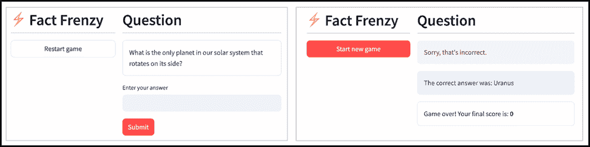

##### 图 9.9 记分、新游戏按钮和游戏结束（完整代码请见 GitHub 仓库中的 chapter_09/in_progress_04）

太棒了！Fact Frenzy 开始看起来相当漂亮。下一个任务是添加对多个问题的支持！

## 9.6 包含多个问题

在上一节中，我们向我们的应用程序引入了关键的游戏机制——添加得分系统和定义游戏的开始和结束，使其更像一个真正的游戏。

尽管如此，Fact Frenzy 仍然只问一个问题，所以它现在还不是很多。是时候改变这一点了。但在我们这样做之前，让我们探索我们将面临的一个与 LLM 相关的挑战。

### 9.6.1 响应变异性，或缺乏变异性

在许多方面，一个大型语言模型（LLM）就像一个黑盒。与倾向于确定性（即相同的输入总是产生相同的输出）的“常规”代码不同，LLMs 是**概率性的**，这意味着根据一组概率，你可能对相同的输入（或类似的输入）得到不同的响应。

根据你试图实现的目标，这种变异性可能是一件好事或坏事。例如，如果你试图让 LLM 生成诗歌，你可能希望响应中有相当高的创造性和变异性，而如果你在评估一个数学方程式，你希望更少。

类似于 OpenAI 这样的供应商通常只公开一些用于这种变异性的控制，这使得管理起来更容易，但通常我们需要设计提示来从模型中提取我们想要的行为。

对于我们生成问题的用例，我们希望有相对较高的变异性。如果你已经玩了一段时间我们的当前应用程序，你可能已经注意到我们从 LLM 得到的问题经常重复。例如，在我的测试中，该模型特别偏爱询问太阳系中唯一一个侧向旋转的行星。

这对我们来说不起作用。首先，如果一个游戏包含多个问题，所有这些问题*必须*是唯一的。其次，即使同一个问题在同一个游戏中没有重复，我们也不想它在不同的游戏中重复得太频繁。

让我们看看我们可以控制 LLM 答案变异性的一些方法。

##### 注意

LLMs 基于概率模式（而不是事实理解）生成文本的事实的一个后果是我们所说的“幻觉”——即模型产生看似合理但实际上错误或完全虚构的输出。这些幻觉的产生是因为 LLMs 依赖于其训练数据中的统计关系，这有时会导致自信但误导性的回应。存在一些策略可以减少幻觉的可能性，例如使 LLMs 能够连接到外部信息源，但无法保证它们绝对不会发生。处理幻觉超出了本章的范围——我们将在下一章中解决使用我们自己的来源补充 LLM 知识库的问题。只需注意，我们的应用程序可能会偶尔产生一个非事实性的问题或答案。幸运的是，根据我的测试，这些情况通常很少发生。

#### 变化温度和 top_p

我们发送给大型语言模型的提示和从它那里得到的响应都由*标记*组成。一个标记可能是一个单词，也可能是一个单词的一部分。

在本质上，LLM 按步骤或更确切地说按标记逐步构建对提示的响应。在每一步中，它考虑将包括在其响应中的下一个标记的广泛可能性，并为每个标记选项分配一个*概率*（从高中数学，一个介于 0 和 1 之间的数字）。

这些标记形成了一个所谓的*概率分布*——将其想象为一个曲线，表示每个标记成为下一个标记的可能性，其中更可能的标记在曲线上的位置高于不太可能的标记。

OpenAI 提供了两个参数——`temperature`和`top_p`——可以调整此曲线的组成。图 9.10 说明了这些参数变化的影响


##### 图 9.10 温度和 top_p 如何影响 LLM 输出的创造性和可预测性

`temperature`可以取 0 到 2 之间的值，较高的值会使曲线更平坦，而较低的值会使曲线更明显。因此，较高的温度倾向于“平衡”曲线，增加选择不太可能的标记选项的概率，这使得 LLM 承担更多的“风险”，并增加了其响应的整体创造性。

`top_p`可以从 0 到 1。它代表了模型将选择的标记的累积概率的截止值。以一个例子来说明，LLM 可能确定其响应中五个最有可能的下一个标记及其相应的概率是：“但是”：0.6，“然后”：0.2，“一个”：0.1，“这个”：0.06，和“那个”：0.02——所有其他标记的概率都低得多。

`top_p`为 0.8 意味着模型应该只选择具有至少 0.8 组合概率的最可能标记。在这种情况下，由于“but”和“then”一起覆盖了 0.6 + 0.2 >= 0.8 的概率，模型将丢弃其他所有内容。

另一方面，`top_p`为 0.95 将要求模型也考虑“a”和“this”以覆盖所需的累积概率（0.6 + 0.2 + 0.1 + 0.06 >= 0.95）。

因此，更高的`top_p`意味着 LLM 将考虑更多的标记选项，这可能会降低响应的可预测性和连贯性，但会增加其多样性。

回到我们最初的目标，即生成各种问题，我们可能需要一个适度的`temperature`——比如说 0.7 到 0.8，以及相对较高的`top_p`，比如说 0.9。

#### 在提示词中包含先前的问题

正如之前讨论的，虽然理想情况下问题不应在不同游戏中重复，但我们实际上必须**保证**在单个游戏中不会重复提出相同的问题。

幸运的是，这很容易实现——通过明确告诉 LLM 游戏中已经提出的问题，这样它就知道要避开这些问题。

为了加强这一点，我们甚至可以告诉 LLM 确保永远不要提出相同的问题两次。

#### 注入随机性

获取更广泛的问题种类的一种方法是在提示词中注入一些结构化的随机性。你可能听说过一个叫做“Mad Libs”的单词游戏，玩家被提供了一个故事，其中各种词性被空白代替。然后每个玩家用他们选择的单词填充一个空白，完成的故事常常非常有趣。

我们在这里也可以做类似的事情。我们可以将提示词改为类似于“在类别 ______ 和该类别内的主题 ______ 中生成一个独特的趣味问题。问题应参考一个名字以字母 ______ 开头的人或事物”。

在我们的代码中，我们可以维护类别、主题和字母的列表，随机从每个列表中选取一个来填充空白，在将提示发送给 LLM 之前。如果我们有 10 个类别，每个类别中有 10 个主题，那么我们就会有 26（字母表中的字母）x 10 x 10 = 2600 种独特的组合，再加上 LLM 本身提供的可变性。

或者为了省去维护这些列表的麻烦，为什么不先让 LLM 选择一个类别和主题呢？有趣的是，这样做似乎增加了生成的响应的多样性。

另一种注入随机性的方法是在提示词中明确提供一个随机**种子**。在编程中，随机种子是一个值（通常是一个整数），用于初始化随机数生成器。虽然不清楚将一个添加到提示词的文本中实际上是否会导致 LLM 生成随机数，但在我的测试中，这样做确实增加了响应的变异性。

##### 注意

这里需要注意的是，修改你的提示以获得你想要的结果并不是纯粹的科学；通常你需要尝试各种技术和提示来识别最佳的方法。你也可能会看到令人惊讶的结果——例如，AI 研究人员发现，让 LLM 逐步思考解决问题的方法往往可以提高其完成任务的表现。

### 9.6.2 实现多个问题

现在我们已经回顾了在 LLMs 中变异性是如何工作的以及确保每次都能得到不同问题的可能方法，让我们修改“事实狂热”游戏，使其在游戏中向用户提出多个问题。

#### 修改 LLM 提示

让我们先对我们的提示进行必要的更改，以便将我们所学的内容付诸实践。

在我们这样做之前——我们的`Llm`类目前还没有提供更改`temperature`和`top_p`的方法，因此我们应该修改其代码（在`llm.py`中）如下：

```py
from openai import OpenAI

class Llm:
  ...

  def ask(self, user_message, sys_message=None, schema=None,
          temperature=None, top_p=None):
    messages = self.construct_messages(user_message, sys_message)

    llm_args = {'model': 'gpt-4o-mini', 'messages': messages}
 if temperature:
 llm_args['temperature'] = temperature
 if top_p:
 llm_args['top_p'] = top_p

 if schema:
 completion = self.client.beta.chat.completions.parse(
 response_format=schema,
 **llm_args
 )
      return completion.choices[0].message.parsed
    else:
      completion = self.client.chat.completions.create(**llm_args)
      return completion.choices[0].message.content
```

（GitHub 仓库中的`chapter_09/in_progress_05/llm.py`）

如上图所示，我们对`Llm`类中的`ask`方法进行了相当大的重构。首先，它接受`temperature`和`top_p`作为新的参数，两者默认为`None`。

而不是重复将`model`、`messages`、`temperature`和`top_p`参数传递给 OpenAI 客户端的`beta.chat.completions.parse`或`chat.completions.create`，我们构建一个`llm_args`字典，根据每个参数是否提供来保存正确的参数及其值。

然后，我们使用`**`字典解包操作符（我们在第七章中遇到过的）将参数传递给 OpenAI 方法。请注意，我们可以将此与传递参数的正常方式结合起来：

```py
completion = self.client.beta.chat.completions.parse(
  response_format=schema,
  **llm_args
)
```

在这里，我们以常规方式传递`reponse_format`，但对于剩余的参数，我们解包`llm_args`。

接下来，在`prompts.py`中，编辑我们的问题生成提示，使其现在读取：

```py
QUESTION_PROMPT = {
  'system': 'You are a quizmaster who never asks the same question twice.',
  'user': '''
 First think of a unique category for a trivia question.
 Then think of a topic within that category.

 Finally, ask a unique trivia question, generated using the random seed
 {seed}, without revealing the category or topic.

 Do not provide choices, or reveal the answer.

 The following questions have already been asked:
 {already_asked}
 '''
}

ANSWER_PROMPT = {
  ...
```

（GitHub 仓库中的`chapter_09/in_progress_05/prompts.py`）

你会看到我们已经结合了上一节中讨论的几种技术：

+   系统提示要求 LLM 表现得像一个从未重复提问的问答大师。

+   我们要求 LLM 想一个独特的类别及其内的一个主题。

+   我们添加了一个“种子”变量，并要求 LLM 使用该种子生成问题。

+   在提示的最后，为了参考，我们提供了已经提出的问题，这样 LLM 就可以避免这些问题。

我们需要在`Game`类中伴随这些更改进行额外的更改。除了 LLM 相关的内容外，为了在游戏中提出多个问题，我们需要能够多次重复从第一个游戏状态到最后一个状态的运动。实际上，我们的状态图现在变成了一个*循环*，而不是一条线，如图 9.11 所示。

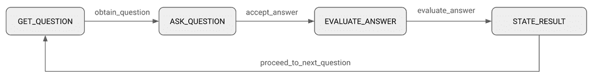

##### 图 9.11 为了实现多个问题，我们现在循环遍历游戏状态

这意味着我们还需要另一个方法来从`STATE_RESULT`状态回到`GET_QUESTION`状态。现在让我们添加这个方法以及`game.py`中的其他更改：

```py
import time

from llm import Llm
...

class Game:
  def __init__(self, llm_api_key):
    ...
    self.max_questions = 5
    self.questions = []

  def ask_llm_for_question(self):
    seed = int(time.time())
    sys_msg = QUESTION_PROMPT['system']
 usr_msg = (
 QUESTION_PROMPT['user']
 .replace('{already_asked}', '\n'.join(self.questions))
 .replace('{seed}', str(seed))
 )
    return self.llm.ask(usr_msg, sys_msg, temperature=0.7, top_p=0.9)

  ...
  def obtain_question(self):
    self.curr_question = self.ask_llm_for_question()
    self.questions.append(self.curr_question)
    self.status = 'ASK_QUESTION'
    return self.curr_question

  ...
  def proceed_to_next_question(self):
 self.status = 'GET_QUESTION'

...
```

（GitHub 仓库中的`chapter_09/in_progress_05/game.py`）

你会看到我们在`__init__`中添加了一个新的属性`self.questions`，并将其初始化为空列表。正如你可能猜到的，这将保存我们从 LLM 获取的所有问题。我们通过在`obtain_questions`方法中的这个添加来实现：

```py
self.questions.append(self.curr_question)
```

此外，由于我们最终将有多于一个问题要问，我们将`self.max_questions`的值更改为 5。你可以随意将其更改为你喜欢的任何数字。

我们完全重写了`ask_llm_for_question`方法，因为我们的用户消息现在有几个变量我们需要提供值。`{already_asked}`可以简单地替换为`self.questions`（列表项之间用换行符分隔）。

对于随机种子，我们简单地使用当前时间戳转换为整数：

```py
seed = int(time.time())
```

由于时间戳总是按定义增加，所以当前时间戳保证是 LLM 之前从未从我们这里得到过的。

我们现在还向`self.llm.ask`传递`temperature`和`top_p`值，以符合我们对这些参数的探索。

为了启用多个问题，新添加的`proceed_to_next_question`将游戏状态重置为`GET_QUESTION`，完成图 9.11 中的状态循环。

对前端所需的更改相对简单。编辑`main.py`如下：

```py
import streamlit as st
from game import Game

...
with main_col:
  if game:
    st.header(
 f"Question {len(game.questions)} / {game.max_questions}",
 divider='gray'
 )
    st.subheader(f"Score: {game.score}")

    if game.status == 'GET_QUESTION':
      ...

    ...
    elif game.status == 'STATE_RESULT':
      ...
      if game.is_over():
        with st.container(border=True):
          st.markdown(f"Game over! Your final score is: **{game.score}**")
      else:
 st.button(
 "Next question",
 type='primary',
 on_click=lambda: game.proceed_to_next_question()
 )
```

（GitHub 仓库中的`chapter_09/in_progress_05/main.py`）

首先，我们修改了主列的标题，以提供问题编号（`len(game.questions)`）和总问题数（`game.max_questions`）：

```py
st.header(
  f"Question {len(game.questions)} / {game.max_questions}",
  divider='gray'
)
```

我们还添加了一个子标题来显示分数：

```py
st.subheader(f"Score: {game.score}")
```

为了便于从`STATE_RESULT`状态切换到`GET_QUESTION`状态，我们添加了一个`else`子句，如果游戏没有结束，则会显示一个“下一个问题”按钮，点击该按钮会触发`game`对象的`proceed_to_next_question()`方法。

注意我们编写`st.button`小部件的不寻常方式：

```py
st.button(
  "Next question",
  type='primary',
  on_click=lambda: game.proceed_to_next_question()
)
```

`st.button`的`on_click`参数允许你指定在按钮被点击时执行的功能。我们**也可以**像我们在本书中迄今为止所做的那样编写这个，即：

```py
if st.button("Next question", type='primary'):
  game.proceed_to_next_question()
  st.rerun()
```

差异在于触发函数实际执行的时间。具体来说：

+   当我们使用`if st.button`表示法时，按钮点击首先会触发页面的重新运行，导致按钮上方的内容再次重新渲染，然后在`if`代码执行之前——由`st.button`在重新运行中评估为`True`的事实触发。在这段代码执行后，我们可能需要手动再次触发上述的重新运行——就像我们在整本书中一直做的那样——以查看它引起的页面上的任何变化。

+   使用 `on_click` 注记，按钮点击会导致在 `on_click` 下列出的函数（顺便提一下，被称为回调函数）在页面重新运行和按钮上方的内容重新渲染之前执行。在这种情况下，我们不需要手动调用 `st.rerun()`，因为由按钮点击触发的重新运行已经考虑了回调函数执行后所做的更改。

那么为什么我们一直没在使用这种方法呢？嗯，对于简单的应用来说，`if st.button` 结构通常更容易理解。此外，回调函数还有一些限制——例如，你无法在回调函数中触发应用的重新运行。

在任何情况下，你现在应该能够重新运行你的应用来尝试一个工作中的多问题游戏（图 9.12）。

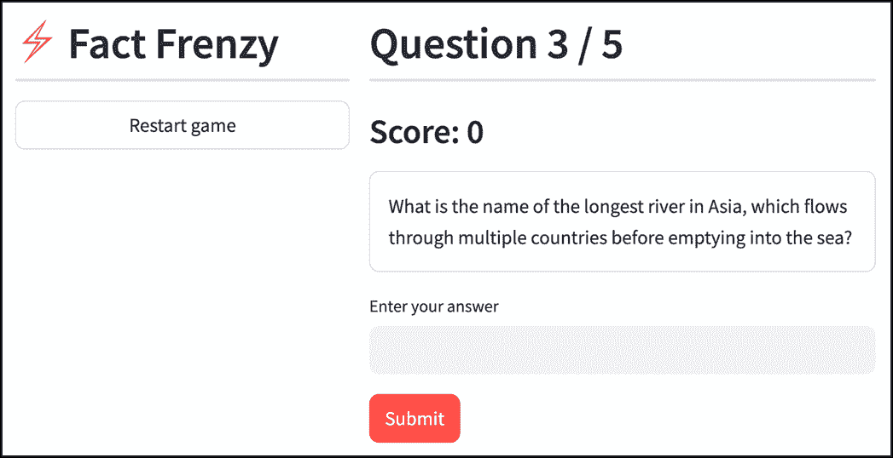

##### 图 9.12 一个工作中的多问题知识竞赛游戏（完整代码请见 GitHub 仓库中的 chapter_09/in_progress_05）

我们的知识竞赛游戏在技术上现在已经完成了，但让我们看看在下一节中我们能否让它更加吸引人。

##### 成本考虑

LLMs 是一个令人难以置信的通用工具，但重要的是要意识到，在你的应用中使用它们——尤其是在可能被数百名用户访问的生产环境中——并不是免费的。你最不希望的就是意外地产生一大笔费用。

**成本计算方式**

当使用 LLM 时，成本通常基于处理的标记数量计算。如第 9.5.1 节所述，“标记”代表模型读取（输入）或生成（输出）的文本块——一个单词或单词的一部分。

OpenAI 根据处理过的输入和输出标记的总和来收费。这意味着输入提示的大小和输出文本的大小都会影响成本。定价也因模型而异。在撰写本文时，我们在这章中使用的模型——gpt-4o-mini——处理每 100 万个标记的费用为 15 美分。

你可以使用像 [`platform.openai.com/tokenizer`](https://platform.openai.com/tokenizer) 这样的工具来计算文本中的标记数量并确定成本。

**成本优化策略**

在与 LLM 一起工作时，有几种方法可以优化成本。以下是一些想法：

+   保持你的输入提示简短而直接，以减少与输入标记相关的成本。

+   通过指示 LLM 保持其响应简短，或通过显式地将处理的标记数量限制在最大值（例如，通过在调用 OpenAI 端点时传递 `max_tokens` 参数的值）来减小输出文本的大小。

+   将多个请求批量处理，以减少发送给 LLM 的总提示数。例如，在我们需要新的问题时，不是每次都提供一个之前提出的问题列表——就像我们在这里做的那样——我们只需简单地让 LLM 一次性生成我们想要的全部问题数量。

+   对于一些提示，使用能力较低但更便宜的模式。在我们的案例中，我们使用 gpt-4o-mini，它在成本和智能之间取得了相当好的平衡，但根据您的应用程序，对于更简单的任务，可能可以使用甚至更便宜的模型。熟悉 OpenAI 的定价页面。

+   通过让用户提供他们自己的 LLM API 密钥，完全避免 LLM 成本。对于我们的游戏来说，这会严重影响用户体验，因为它要求玩家在玩游戏之前创建一个 OpenAI 账户，但你保证在 LLM 相关的成本上不会花一分钱。

## 9.7 添加 AI 个性

作为一款信息类知识问答游戏，事实狂热现在运行得非常顺畅。从开始新游戏到循环提问并计分，直到游戏结束的端到端流程已经建立。

然而，它仍然缺少某种“我不知道是什么”的东西——它相当枯燥且机械。如果我们能给我们的游戏赋予个性会怎么样？幸运的是，这正是 LLMs 擅长的。例如，我们可以要求 GPT-4o 在提问时模仿各种角色的风格。

事实上，我们可以让玩家选择他们希望他们的问答大师扮演的角色。听起来很有趣？让我们开始吧！

### 9.7.1 添加游戏设置

目前我们还没有一个页面或位置在应用程序中让玩家查看或更改任何设置，所以我们将首先解决这个问题。

我们希望用户能够设置哪些选项？我们已经讨论了问答大师的说话风格，所以这可以成为第一个。我们还可以让玩家选择一个适合他们的难度级别。

对于“设置编辑器”，我们可以使用几种不同的设计，但我想要利用这个机会介绍一个我们之前没有遇到过的实用 Streamlit 小部件：`st.data_editor`。

#### st.data_editor

在第六章和第七章中，我们学习了 Pandas 数据框，它使 Python 中的表格数据处理变得容易。我们发现了`st.dataframe`，它用于在 Streamlit 应用程序中将数据框渲染为表格以供查看。

`st.data_editor` 也可以显示数据框，但它还使它们可编辑，为用户提供可能在电子表格中期望的体验。

这与向我们的应用程序添加设置有什么关系呢？嗯，我们可以将我们想要的设置放在一个数据框中，并允许人们编辑数据框来修改设置。

在上面几段讨论的两个设置中，设置数据框可能看起来如下所示：

```py
+----------------+------------+
|   Quizmaster   | Difficulty |
+----------------+------------+
| Alex Trebek    | Medium     |
+----------------+------------+
```

如果这个数据框存储在`default_settings`中，我们可能编写我们的`st.data_editor`小部件如下所示：

```py
settings = st.data_editor(default_settings, num_rows='fixed', key='settings_editor')
```

这将显示图 9.13 中所示的控件。

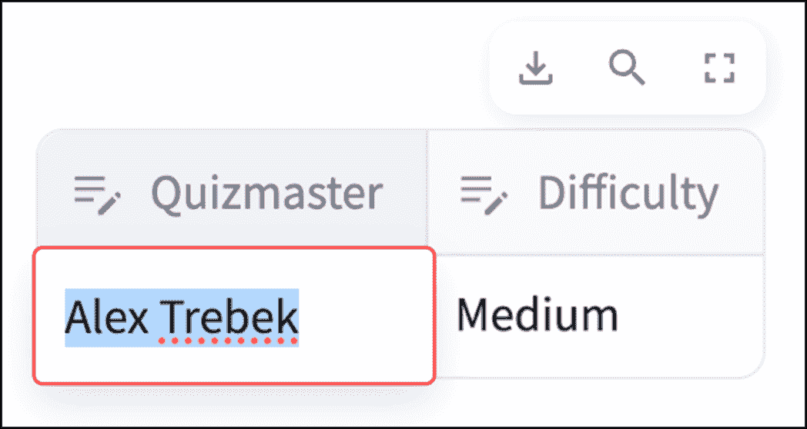

##### 图 9.13 st.data_editor 的简单输出

这里的第一个参数是我们想要编辑的数据的初始状态——在这种情况下，默认设置。

`num_rows='fixed'`意味着数据编辑器小部件不应允许用户添加任何新行。这很有意义，因为我们不希望在上述数据框中有多行——单个设置只能有一个值。

在用户与数据编辑器交互之前的任何一次应用程序运行中，`settings`将保持与`default_settings`相同的值。一旦用户更改了设置——例如，他们可能会将难度更改为`Easy`——`settings`将在未来的重新运行中保持编辑过的数据框，直到用户再次编辑它。

##### 注意

`key='settings_editor'`参数为数据编辑器会话状态添加了一个小部件键。虽然这对应用程序正确运行不是严格必需的，但它保护我们免受 Streamlit 的一个特定怪癖的影响，即在没有显式键的情况下，如果在特定运行中由于某种原因没有渲染该小部件，它会忘记小部件的值。添加小部件键不会给我们带来任何成本，因此提供一个小部件键更安全，可以避免未预见的错误。

回到我们的示例，我们不一定希望用户必须输入测验主持人的名字或难度级别；我们更希望他们从选项列表中选择。`st.data_editor`通过*列配置*支持这一点：

```py
st.data_editor(
  default_settings,
  column_config={
 'Quizmaster': st.column_config.SelectboxColumn(
 options=['Alex Trebek', 'Eminem', 'Gollum'],
 required=True
 ),
 'Difficulty': st.column_config.SelectboxColumn(
 options=['Easy', 'Medium', 'Difficult'],
 required=True
 )
 },
  num_rows='fixed',
  key='settings_editor'
)
```

在这里，我们对可编辑的数据进行了更细粒度的控制，通过`st.column_config`配置数据中的每一列。

对于我们每个列，我们使用一个`SelectBoxColumn`，它允许我们指定一个可供选择的选项列表，以及是否必须指定一个值（`required`参数，如上设置为`True`）。

结果如图 9.14 所示。

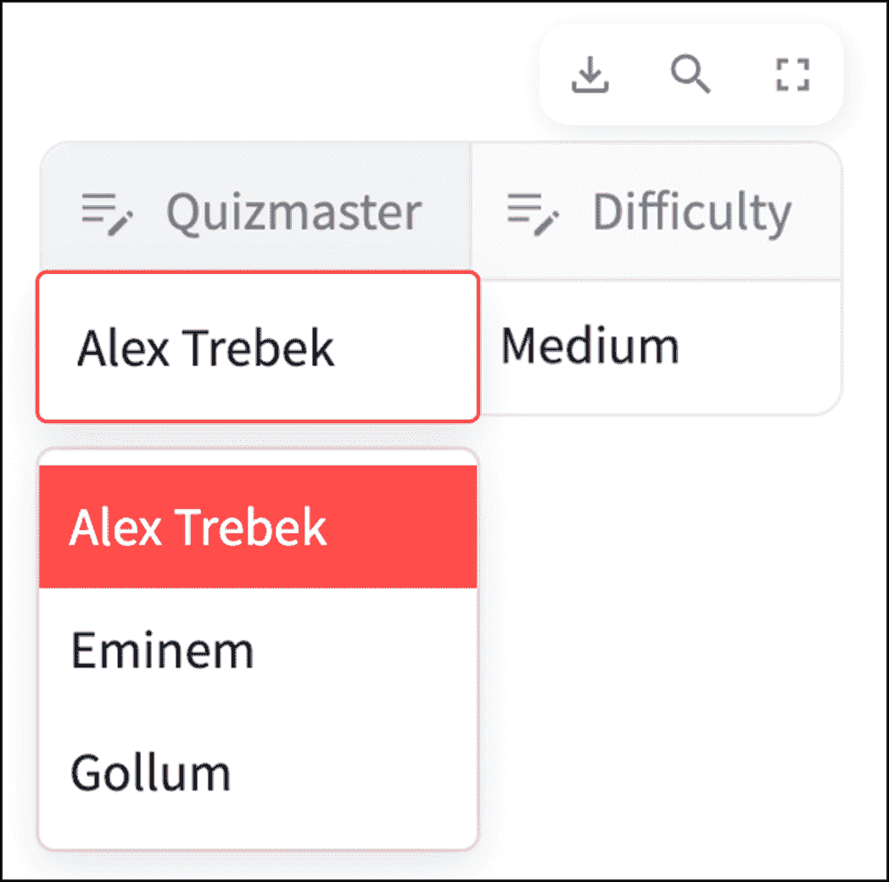

##### 图 9.14 st.data_editor 显示了一个具有 SelectBoxColumn 的列

`st.column_config`除了`SelectBoxColumn`之外，还支持许多不同的列类型，例如用于布尔值的`CheckboxColumn`、显示日期/时间选择器的`DatetimeColumn`，以及用于可点击 URL 的`LinkColumn`。

它还支持非可编辑类型，可以与`st.dataframe`一起使用，包括`AreaChartColumn`、`BarChartColumn`、用于列表的`ListColumn`，甚至用于数字的`ProgressColumn`（以进度条的形式显示，而不是目标）。

#### 创建设置编辑器

既然我们已经了解了`st.data_editor`的工作原理，让我们继续创建一个设置编辑器 UI。我们将把这个放在一个名为`settings.py`的新文件中（如列表 9.8 所示）。

##### 列表 9.8 settings.py

```py
import streamlit as st

QM_OPTIONS = ["Alex Trebek", "Eminem", "Gollum", "Gruk the Caveman"]
DIFFICULTY_OPTIONS = ["Easy", "Medium", "Hard"]

default_settings = {
  "Quizmaster": [QM_OPTIONS[0]],
  "Difficulty": [DIFFICULTY_OPTIONS[1]]
}

def settings_editor():
  with st.popover("Settings", use_container_width=True):
    return st.data_editor(
      default_settings,
      key='settings_editor',
      column_config={
        'Quizmaster': st.column_config.SelectboxColumn(
          options=QM_OPTIONS, required=True),
        'Difficulty': st.column_config.SelectboxColumn(
          options=DIFFICULTY_OPTIONS, required=True)
      },
      num_rows='fixed',
      use_container_width=True,
    )
```

（GitHub 仓库中的`chapter_09/in_progress_06/settings.py`）

我们将测验主持人和难度设置的选项直接放置在顶部，以便于访问，并在`QM_OPTIONS`和`DIFFICULTY_OPTIONS`下列出它们。

测验主持人选项从实际的测验主持人、已故的*Jeopardy!*名人亚历克斯·特雷贝克，到一系列虚构角色，如《指环王》中的咕噜，以及穴居人 Gruk，一个完全虚构的人物，让 LLM 尽情发挥。

我们这样初始化了`default_settings`：

```py
default_settings = {
  "Quizmaster": [QM_OPTIONS[0]],
  "Difficulty": [DIFFICULTY_OPTIONS[1]]
}
```

注意，这**不是**我们最初建议的数据框——它是一个字典，每个设置的名称作为键，包含该设置默认选项的单元素列表作为相应的值。

有趣的是，`st.data_editor`可以显示不是 Pandas 数据框的东西。这包括原生 Python 类型，如字典、列表和集合。能够显示这些类型的能力甚至适用于`st.dataframe`，尽管其名称。在这种情况下，这意味着我们实际上不必将设置作为数据框来维护；我们可以使用上面更易读的字典形式。

`settings_editor`函数渲染实际的设置编辑器用户界面。我们将一切放置在另一个新的 Streamlit 小部件`st.popover`中：

```py
with st.popover("Settings", use_container_width=True):
  ...
```

`st.popover`显示一个弹出小部件，这是一个可以通过点击相关按钮触发的弹出屏幕——类似于`st.expander`。第一个参数是触发`st.popover`的按钮的标签。

弹出窗口的内容是在`with st.popover(...)`上下文管理器中编写的。在这种情况下，我们显示`st.data_editor`小部件并返回其值，即编辑后的`settings`字典：

```py
return st.data_editor(
  default_settings,
  key='settings_editor',
  column_config={
    'Quizmaster': st.column_config.SelectboxColumn(
      options=QM_OPTIONS, required=True),
    'Difficulty': st.column_config.SelectboxColumn(
      options=DIFFICULTY_OPTIONS, required=True)
  },
  num_rows='fixed',
  use_container_width=True,
)
```

这基本上是我们之前在讨论`st.data_editor`时编写的相同代码，尽管增加了一个`use_container_width=True`参数，该参数调整了弹出窗口的宽度。

#### 应用设置

我们如何在 Fact Frenzy 中使用这些设置？问答大师和难度设置都与 LLM 生成的文本问题相关，所以让我们在`prompts.py`中的问题提示中包含它们，变成：

```py
QUESTION_PROMPT = {
  'system': '''
    You are a quizmaster who mimics the speaking style of {quizmaster} and
    never asks the same question twice.
  ''',
  'user': '''
    First think of a unique category for a trivia question.
    Then think of a topic within that category.

    Finally, ask a unique trivia question that has a difficulty rating of
 {difficulty} and is generated using the random seed {seed}, without
    revealing the category or topic.

    Do not provide choices, or reveal the answer.

    The following questions have already been asked:
    {already_asked}
  '''
}
...
```

（GitHub 仓库中的`chapter_09/in_progress_06/prompts.py`）

显然，有很多方法可以将我们这两个新变量融入到提示中——上面只是其中一种。

我们接下来将修改`game.py`：

```py
...
class Game:
  def __init__(self, llm_api_key, settings):
    self.llm = Llm(llm_api_key)
    self.settings = settings
    self.status = 'GET_QUESTION'
    ...

  def get_setting(self, setting_name):
 return self.settings[setting_name][0]

 def modify_settings(self, new_settings):
 self.settings = new_settings

  def ask_llm_for_question(self):
    seed = int(time.time())
    sys_msg = (
 QUESTION_PROMPT['system']
 .replace('{quizmaster}', self.get_setting('Quizmaster'))
 )
    usr_msg = (
      QUESTION_PROMPT['user']
      .replace('{already_asked}', '\n'.join(self.questions))
      .replace('{seed}', str(seed))
      .replace('{difficulty}', self.get_setting('Difficulty'))
    )
    return self.llm.ask(usr_msg, sys_msg)

  def ask_llm_to_evaluate_answer(self):
    ...
  ...
```

（GitHub 仓库中的`chapter_09/in_progress_06/game.py`）

`Game`的`__init__`现在接受一个`settings`参数，正如你所期望的，它是我们在`settings.py`中使用的字典格式。这被分配给`self.settings`，以便其他方法可以访问它。

我们添加了两个相关方法：`get_setting`和`modify_settings`。`get_setting`处理获取给定设置的值，这有点棘手，因为每个字典值都是一个单元素列表（这样设计是为了与`st.data_editor`兼容）。`get_setting`抽象出这种有些不美观的逻辑，所以我们将其限制在代码的一个地方。

`modify_settings`用给定的`new_settings`字典替换`self.settings`。当用户更改设置时，这将会发挥作用。

转到`ask_llm_for_question`方法，我们将添加到提示中的`{quizmaster}`和`{difficulty}`变量替换为通过`get_setting`获取的设置中的相应值。

现在只剩下对`main.py`的修改，让我们进行这些修改：

```py
import streamlit as st
from game import Game
from settings import default_settings, settings_editor

def start_new_game():
  st.session_state.game = Game(st.secrets['llm_api_key'], default_settings)
  st.rerun()

...
with side_col:
  st.header("⚡ Fact Frenzy", divider='gray')
  settings = settings_editor()
  new_game_button(game)

with main_col:
  if game:
    game.modify_settings(settings)
    st.header(
      ...
    ...
```

（GitHub 仓库中的`chapter_09/in_progress_06/main.py`）

在`start_new_game`中，为了获取初始的`Game`实例，我们现在直接从`settings.py`导入`default_settings`。

实际设置编辑器显示在侧列（`side_col`）中，位于新游戏按钮上方。返回值——回想一下，在用户更改任何设置的值之前，这将是一个`default_settings`字典，之后是修改后的字典——存储在`settings`变量中。

最后，在每次重新运行时——前提是我们处于游戏状态——我们运行`game.modify_settings(settings)`来获取用户对设置所做的任何更改。

这样就完成了。再次运行你的应用以查看图 9.15。尝试调整 AI 问答大师选项和难度；现在阅读问题更有趣了！

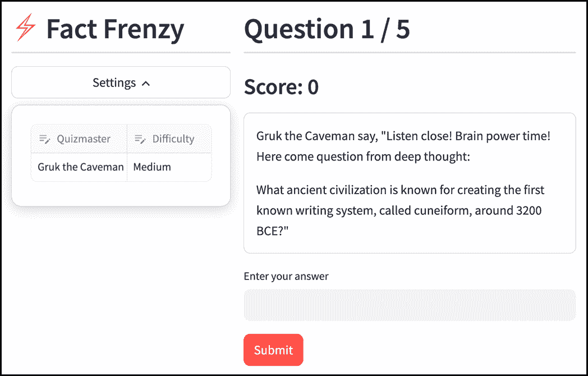

##### 图 9.15 Fact Frenzy 的最终版本，带有可编辑的设置（完整代码请参阅 GitHub 仓库中的 chapter_09/in_progress_06）

这就结束了我们对 Fact Frenzy 的开发，这是我们将在本书中构建的第一个——也是唯一一个——游戏。在第十章中，我们将继续探索 AI 应用，使用一个更实用的应用：客户支持聊天机器人。

## 9.8 摘要

+   大型语言模型（LLM）是一种设计用于处理和生成类似人类文本的 AI 系统。

+   LLM 可以执行创造性和分析性任务。

+   OpenAI，最受欢迎的 LLM 提供商之一，允许开发者通过 API 访问其 GPT 系列。

+   `openai`库提供了一种方便的方法，在 Python 中调用 OpenAI API。

+   你可以将对话传递给 OpenAI API 的聊天完成端点，消息标记为`"system"`、`"assistant"`或`"user"`，这将导致模型以逻辑方式完成对话。

+   结构化输出是 OpenAI 提供的一项功能，确保模型将生成符合给定模式的响应。

+   线性 Streamlit 应用中的常见模式是基于存储在`st.session_state`中的变量实现基于条件的分支逻辑。

+   你可以调整`temperature`和`top_p`等参数来影响由 LLM 生成的响应的创造性和可预测性。

+   在提示中注入随机性是确保我们得到不同响应的相似提示的好方法。

+   在基于 LLM 的应用中优化成本很重要。你可以通过让 LLM 处理更少的输入和输出标记、减少提示数量、使用更便宜的模型，甚至通过要求用户提供自己的 API 密钥来让用户承担成本来实现。

+   `st.data_editor`提供了一种在 Streamlit 应用中创建可编辑表格的方法。

+   `st.column_config`允许你在`st.data_editor`和`st.dataframe`中配置列，使其成为特定可编辑和非可编辑类型。

+   `st.popover`通过点击相关按钮显示一个小弹出屏幕。
