# 10 使用 LangGraph 和 Streamlit 的客户支持聊天机器人

### 本章涵盖

+   使用 Streamlit 的聊天元素开发聊天机器人前端

+   使用 LangGraph 和 LangChain 简化高级 AI 应用

+   嵌入和向量数据库是如何工作的

+   使用检索增强生成（RAG）增强 LLM 的预训练知识

+   使 LLM 能够访问和执行现实世界的操作

创建一个有趣且引人入胜的体验——就像我们在第九章中构建的问答游戏一样——令人兴奋，但 AI 的真正力量在于其推动真实商业价值的能力。AI 不仅仅是回答问题或生成文本；它是关于改变行业，简化运营，并使全新的商业模式成为可能。

然而，构建能够带来经济价值的 AI 应用，仅仅调用预训练模型是不够的。为了使 AI 在现实场景中发挥作用，它需要了解其操作的环境，连接到外部数据源，并采取有意义的行动。公司需要 AI 理解并响应特定领域的查询，与业务系统交互，并提供个性化帮助。

在本章中，我们将构建这样一个应用：一个客户服务聊天机器人，它将检索真实公司的数据，帮助客户跟踪和取消订单，并智能地决定何时将问题升级给人工客服。到本章结束时，你将了解如何将 LLM 与私有知识库集成，实现检索增强生成（RAG），并使 AI 代理能够在现实世界中采取行动。让我们深入探讨。

##### 注意

本书 GitHub 仓库的链接是[`github.com/aneevdavis/streamlit-in-action`](https://github.com/aneevdavis/streamlit-in-action)。chapter_10 文件夹包含本章的代码和一个 requirements.txt 文件，其中包含所有必需 Python 库的确切版本。

## 10.1 Nibby：一个客户服务机器人

在 Note n' Nib 的新任 CEO 的领导下——以其传奇般的决策能力而闻名，得益于公司内备受推崇的某个仪表板——品牌已经发展成为一家销售激增的文具巨头。

但成功也带来了自己的挑战。客户支持部门被急于收到订单或寻求钢笔维护建议的买家电话淹没。在一个月的长时间等待投诉之后，CEO 召集了公司公认的可靠创新者。

因此，*你*被委以解决支持危机的重任。当你不在进行 Streamlit 研讨会时，你正在研究 AI 的最新进展；不久，一个引人入胜的可能性击中了你：自动化客户支持是否可能？

在一个不眠之夜中，你草拟了 Streamlit 支持机器人 Nibby 的计划。你项目的消息在公司中传播。“我们得救了！”有些人宣称。“Nibby 不会让我们失望！”怀疑者嘲笑：“这是愚蠢！没有*机器人*能解决这个问题。”

谁将证明是正确的？让我们拭目以待。

### 10.1.1 陈述概念和需求

与往常一样，我们从一个简短的描述开始，说明我们打算构建什么。

##### 概念

Nibby，一个客户支持聊天机器人，可以帮助 Note n' Nib 的客户处理信息和基本服务请求

“客户支持”显然覆盖了很大范围，因此让我们更清楚地定义具体要求。

#### 需求

在我们自动化的客户支持愿景中，Nibby 将能够：

+   与客户进行类似人类的对话

+   根据自定义知识库回答关于 Note n' Nib 及其产品的相关问题

+   处理客户提出的以下请求：

    +   跟踪订单

    +   取消订单

+   如果无法自行满足请求，则将请求重定向到人工客户支持代理

从本质上讲，我们希望 Nibby 尽可能多地减轻 Note n' Nib 过度劳累的人工支持代理的负担。Nibby 应作为“前线”代理，能够处理大多数基本请求，例如提供产品信息或取消订单，并在必要时才将请求转接到人工代理。

#### 范围之外的内容

为了使这个项目可管理，并且足够小，可以放入本章，我们将决定**不**实现以下功能：

+   存储或记住与用户的先前对话

+   上述两个提供的“操作”之外的任何“操作”，即跟踪和取消订单

+   两个讨论的操作的实际工作逻辑，例如，构建订单跟踪或取消系统

从学习角度来看，我们真正希望专注于构建一个相对复杂的 AI 系统，该系统能够与用户进行对话，理解自定义知识库，并执行现实世界的操作。

我们使应用程序能够执行的具体操作并不重要。例如，我们的应用程序可以取消订单——而不是替换物品——这并不具有特别的意义。实际上，如上述第三点所暗示的，我们将实现的订单取消是虚拟的“玩具”逻辑。真正重要的是，我们的机器人应该能够根据用户与其进行的自由形式对话智能地选择运行该逻辑。

### 10.1.2 可视化用户体验

Nibby 的用户界面可能是本书中所有应用程序中最直接的。图 10.1 显示了我们将构建的内容草图。

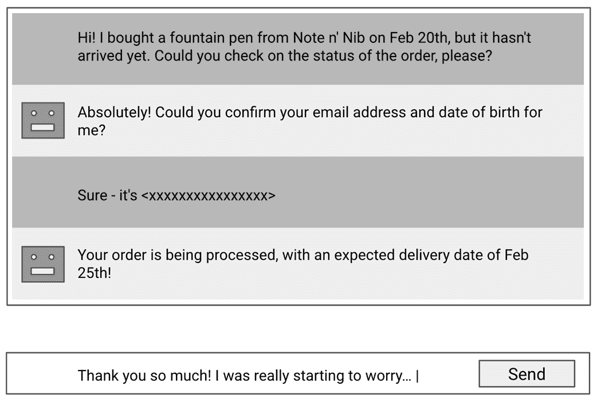

##### 图 10.1 Nibby，我们的客户支持聊天机器人的 UI 草图。

Nibby 的用户界面与您可能使用过的任何聊天或即时通讯应用没有显著区别——从手机上的 WhatsApp 到公司笔记本电脑上的 Slack。您会注意到底部有一个熟悉的文本框，供用户输入消息。每个用户消息都会触发一个 AI 响应，并将其附加到上面的对话视图中。

### 10.1.3 实施方案头脑风暴

构建这个应用程序的难点在于后端——特别是让机器人正确回答问题并连接到外部工具。图 10.2 显示了我们的总体设计。

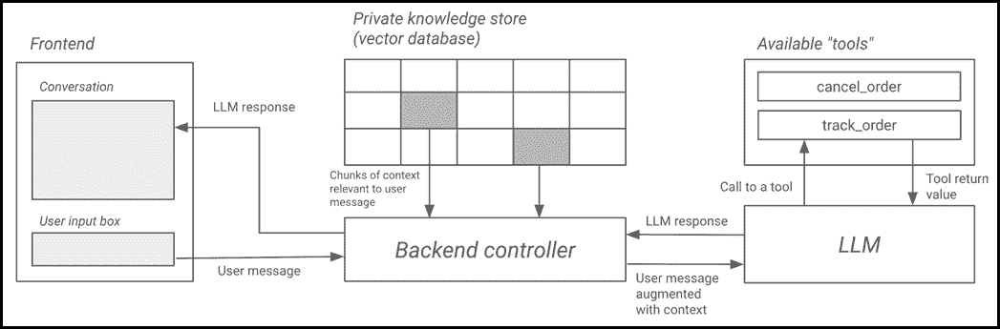

##### 图 10.2 Nibby 的整体设计

虽然第九章中的 Trivia 应用在状态管理方面有一个有趣的设计，但其“智能”方面相当简单——向 LLM 提供一个提示并让它做出回应。

另一方面，我们构想的客户支持应用在至少两个方面有更复杂的设计：

+   它需要一种方法来增强客户的查询，加入公司内部代理人员所拥有的私人知识。

+   它需要能够在现实世界中执行代码。

图 10.2 展示了我们如何实现这些功能的基本概述。当用户消息通过我们的前端传入时，我们从私有知识库中检索与消息相关的上下文——正如我们稍后将要看到的，这是一个向量数据库——并将其发送给 LLM。

我们还将把我们的机器人能够执行的操作组织成所谓的“工具”，并让 LLM 了解它们的存在、每个工具的功能以及如何调用它们。对于任何给定的输入，LLM 可以发出对工具的调用或直接对用户做出回应。

在前一种情况下，我们按照 LLM 指定的方式执行工具，并将结果发送进行进一步处理；而在后一种情况下，我们将回复附加到前端上的对话视图中，并等待用户的下一条消息。

### 10.1.4 安装依赖项

在本章中，我们将使用几个 Python 库。为了提前做好准备，可以通过运行以下命令一次性安装它们：

```py
pip install langchain-community langchain-core langchain-openai langchain-pinecone langgraph pinecone toml
```

## 10.2 创建基本聊天机器人

第九章介绍了 LLM，并演示了如何使用 OpenAI API 进行简单应用。虽然 OpenAI 的 API 易于集成，但开发更复杂的 AI 驱动应用——例如利用检索增强生成（RAG）或基于代理的工作流程，我们很快就会遇到——增加了复杂性。

一个新的生态系统已经出现，提供了库和工具，使得创建复杂的 AI 应用尽可能容易。在本章中，我们将探讨 LangGraph 和 LangChain 这两个库，它们协同工作以简化应用创建过程。

### 10.2.1 LangGraph 和 LangChain 简介

LLMs 无疑是过去十年中最有影响力的技术进步。其核心在于与 LLM 的交互，包括提供 LLM 可以“完成”的提示。所有其他功能都是围绕这一点构建的。

与现代 AI 应用必须处理的复杂性相比：

+   处理多步骤工作流程（例如，在回复之前检索信息）

+   与外部工具集成

+   在多个回合中保留对话上下文

手动管理这种复杂性是困难的，这就是 LangChain 和 LangGraph——都是 Python 库——发挥作用的地方。LangChain 提供了与 LLMs 一起工作的构建块，包括提示管理、记忆和工具集成。LangGraph——由同一家公司开发——通过将 AI 工作流程结构化为*图*来扩展 LangChain，允许决策、分支逻辑和多步处理。通过结合这些，我们可以设计结构化、智能的 AI 应用，这些应用超越了简单的聊天响应——使 Nibby 能够检索知识、调用 API 并动态做出决策。

在本章的其余部分，我们将广泛使用这些库来实现我们想要的功能。

##### 注意

由于我们将在 LangGraph 中将我们的聊天机器人建模为一个*图*，所以我们主要会讨论和引用 LangGraph 而不是 LangChain。然而，你会注意到我们将使用的许多底层类和函数都是从 LangChain 导入的。

### 10.2.2 图、节点、边和状态

在 LangGraph 中，你通过构建一个*图*来构建一个 AI 应用，这个*图*由*节点*组成，这些节点会转换应用的状态。如果你没有计算机科学背景，这个声明可能会让你感到困惑，所以让我们来分解它。

#### 图究竟是什么？

在图论中，图是由相互连接的顶点（也称为节点）和边组成的网络，这些边将顶点相互连接。软件开发者经常使用图来创建现实世界对象及其关系的概念模型。例如，图 10.3 显示了可能在社会媒体网站上找到的人的图。

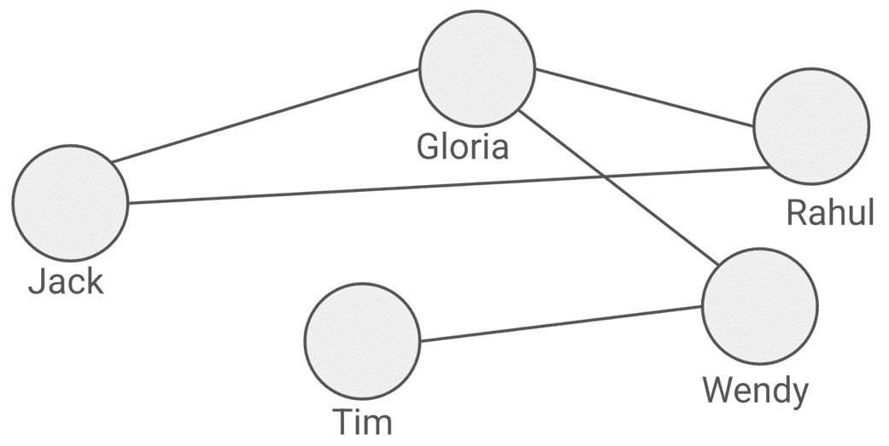

##### 图 10.3 使用图来模拟社交网络中的朋友关系

在这里，每个人都是一个顶点或节点（用圆圈表示），任何两个人之间的“朋友”关系是一条边（圆圈之间的线条）。

通过这种方式模拟关系，社交媒体网站可以应用为图开发的算法来执行有用的现实世界任务。例如，有一个称为广度优先搜索（BFS）的算法，它可以从一个节点找到到任何其他节点的最短路径。在这种情况下，我们可以用它来找到连接两个人的最少共同朋友数量。

在 LangGraph 中，我们将应用建模为一个*动作*的图，其中*节点*表示应用执行的单个动作。图有一个*状态*，简单地说，是一组具有值的命名属性（类似于 Streamit 的“会话状态”概念）。每个节点将图的当前状态作为输入，对状态进行一些修改，并将新的状态作为其输出返回。

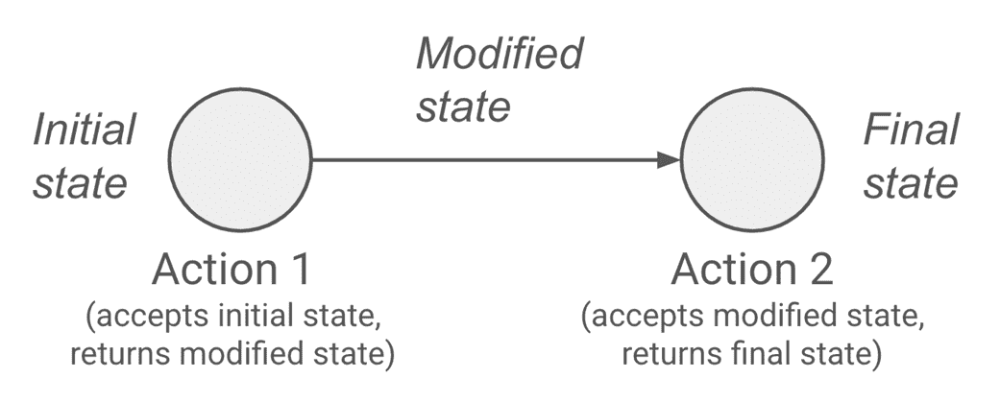

##### 图 10.4 在 LangGraph 中，节点接收图状态并对其进行修改。

图中的边表示两个节点之间的连接，或者换句话说，一个节点的输出可能是另一个节点的输入。与社交媒体图中的边没有方向（即如果两个人是朋友，那么每个人都是对方的朋友）的情况不同，LangGraph 中的边是*有向的*，因为边中的一个节点在另一个节点之前执行。从视觉上看，我们用边上的箭头来表示方向（图 10.4）。

图的输入是其初始状态，该状态传递给*第一个*执行的节点，而输出是最后一个执行的节点返回的最终状态。

那是相当多的理论；现在让我们考虑一个玩具示例（图 10.5）来使这一切变得真实。

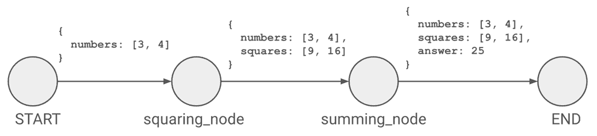

##### 图 10.5 LangGraph 中计算数字平方和的图

图 10.5 中所示的应用非常简单。没有涉及 AI；它只是一个程序，它接受一个数字列表并返回它们的平方和——例如，对于输入`[3, 4]`，图将计算输出`25`（`3² + 4² = 25`）。

图的状态包含三个值：`numbers`、`squares`和`answer`。`numbers`保存输入值列表（例如`[3, 4]`），而`squares`和`answer`最初没有值。

每个 LangGraph 图都有一个名为`START`和`END`的虚拟节点，它们代表执行的开始和结束。还有两个其他“真实”节点：`squaring_node`和`summing_node`。

下面是如何执行这个图的：

+   `START`节点接收初始状态。

+   由于从`START`到`squaring_node`存在有向边，因此`squaring_node`首先执行。

+   `squaring_node`接收初始状态，将`numbers`列表中的数字平方，并将新的列表（`[9, 16]`）保存到状态中的变量`squares`下。

+   由于从`squaring_node`到`summing_node`存在边，`summing_node`以`squaring_node`返回的修改后的状态作为输入。

+   `summing_node`将`squares`中的数字相加，并将结果保存为`answer`。

+   `summing_node`有一个指向`END`的边，这意味着执行的结束。返回的最终状态将在`answer`下包含`25`。

当然，这是一个只有一个执行路径的简单图。在本章的稍后部分，你将遇到一个有多个路径的图——在这个点上，一个节点可能根据该点的状态分支到多个节点。

希望这有助于澄清图的概念以及 LangGraph 如何使用它们来执行任务。现在是时候利用我们所学的内容开始构建我们的应用了。

### 10.2.3 一个单节点 LLM 图

我们在上一节中构建的基本图与 AI 或 LLM 无关。实际上，你可以使用 LangGraph 构建任何你想要的东西，无论是否涉及 AI，但实践中，LangGraph 的目的是使构建 AI 应用变得更加容易。

#### 创建和运行你的第一个图

在第九章中，我们遇到了 OpenAI API 的聊天完成端点。在这个端点中，我们向 API 传递一个消息列表，API 预测对话中的下一个消息。在 LangGraph 中，这样的应用可以由一个简单的单节点图表示，如图 10.6 所示。

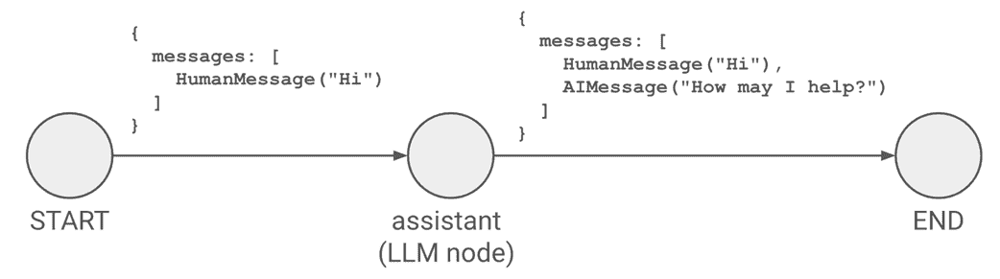

##### 图 10.6 一个基本的单节点（除 START 和 END 外）图

图的状态由一个变量 `messages` 组成，正如你所预期的那样，它是一个消息列表。

图中的唯一节点 `assistant_node` 将 `messages` 传递给 LLM，并返回添加了 AI 响应消息的相同列表。

列表 10.1 显示了这个图被转换成实际的（非 Streamlit）Python 代码。

##### 列表 10.1 graph_example.py

```py
from langgraph.graph import START, END, StateGraph
from langchain_core.messages import AnyMessage, HumanMessage
from langchain_openai import ChatOpenAI
from typing import TypedDict

llm = ChatOpenAI(model_name="gpt-4o-mini", openai_api_key="sk-proj-...")

class MyGraphState(TypedDict):
  messages: list[AnyMessage]

builder = StateGraph(MyGraphState)

def assistant_node(state):
  messages = state["messages"]
  ai_response_message = llm.invoke(messages)
  return {"messages": messages + [ai_response_message]}

builder.add_node("assistant", assistant_node)
builder.add_edge(START, "assistant")
builder.add_edge("assistant", END)
graph = builder.compile()

input_message = input("Talk to the bot: ")
initial_state = {"messages": [HumanMessage(content=input_message)]}
final_state = graph.invoke(initial_state)

print("Bot:\n" + final_state["messages"][-1].content)
```

（GitHub 仓库中的 `chapter_10/graph_example.py`）

首先，我们在这行初始化 LLM：

```py
llm = ChatOpenAI(model_name="gpt-4o-mini", openai_api_key="sk-proj-...")
```

这与我们第九章创建 OpenAI API 客户端时所做的类似。LangChain——一个与 LangGraph 密切相关的库——提供了一个名为 `ChatOpenAI` 的类，它基本上做的是同样的事情，但使用起来稍微简单一些。像之前一样，别忘了将 `sk-proj...` 替换为你的实际 OpenAI API 密钥。

考虑下一部分：

```py
class MyGraphState(TypedDict):
  messages: list[AnyMessage]
```

正如我们之前讨论的，一个图有一个状态。对于你定义的每个图，你通过创建一个包含那些字段的类来指定状态中存在的字段。

在上述两行中，我们正在创建 `MyGraphState` 来表示我们即将定义的图的状态。按照图 10.6 中的示例，`MyGraphState` 包含一个字段——`messages`——它是一个 `AnyMessage` 类型的对象列表。

在第九章中，我们了解到在（OpenAI）LLM 对话中，每条消息都有一个*角色*——其中一个是 `"user"`、`"assistant"` 或 `"system"`。在 LangChain 中，这个概念由 `AnyMessage` 超类表示。`HumanMessage`、`AIMessage` 和 `SystemMessage` 是继承自 `AnyMessage` 的子类，分别对应 `"user"`、`"assistant"` 和 `"system"` 角色。

`MyGraphState` 本身是 `TypedDict` 的子类，它是 Python 的 typing 模块中的一个专用字典类型，允许我们定义一个具有固定键集及其相关值类型的字典。由于它继承了 TypedDict 的所有行为，我们可以将 TypedDict 的实例——以及因此 MyGraphState——视为常规字典，使用相同的语法来访问其键（即类中的字段）和值。

##### 注意

我们实际上并不*必须*使用 `TypedDict` 来表示图的状态。我们也可以使用常规类、dataclass 或 Pydantic 的 `BaseModel`，这是我们第九章中使用过的。我们在这里引入并使用 TypedDict 是因为它与 `MessagesState`（我们将很快讨论的内置 LangGraph 类）配合得很好。

下一个语句`builder = StateGraph(MyGraphState)`初始化了图的构建。在这里，我们告诉 LangGraph 我们正在构建一个`StateGraph`——我们一直在谈论的类型，其中节点从共享状态中读取和写入——其状态由一个`MyGraphState`实例表示（正如我们所见，它将有一个`messages`列表）。

我们现在这样定义我们图中的唯一节点：

```py
def assistant_node(state):
  messages = state["messages"]
  ai_response_message = llm.invoke(messages)
  return {"messages": messages + [ai_response_message]}
```

LangGraph 图中的每个节点都是一个常规的 Python 函数，它接受图的当前状态——一个`MyGraphState`实例——作为输入，并返回它想要修改的状态部分。

我们定义的`assistant_node`相当简单；它只是将`messages`列表（使用方括号作为`state["messages"]`访问，就像在常规字典中一样）传递给`llm`的`invoke`方法，以获取 AI 的响应消息。然后它修改状态中的`"messages"`键，将`ai_response_message`添加到末尾，并返回结果。

##### 注意

在上述代码中，由于`MyGraphState`只有一个键，即`messages`，所以看起来`assistant_node`只是返回了整个修改后的状态。这并不完全正确——实际上，它只返回它想要修改的键，而其他键保持不变。这一点将在后面的章节中变得清晰。

现在我们已经创建了唯一的节点，是时候将其放入我们的图中：

```py
builder.add_node("assistant", assistant_node)
builder.add_edge(START, "assistant")
builder.add_edge("assistant", END)
```

第一行向图中添加了一个名为`assistant`的节点，指向我们刚刚开发的`assistant_node`函数作为节点的逻辑。

如前所述，每个图都有一个虚拟的`START`和`END`节点。剩下的两行创建了从`START`到我们的`assistant`节点，以及从我们的`assistant`节点到`END`的有向边，从而完成了图的构建。

紧接着的行，`graph = builder.compile()`，*编译*了图，使其准备执行。

文件中的最后几行代码展示了如何调用一个图：

```py
input_message = input("Talk to the bot: ")
initial_state = {"messages": [HumanMessage(content=input_message)]}
final_state = graph.invoke(initial_state)

print("The LLM responded with:\n" + final_state["messages"][-1].content)
```

我们首先使用`input()`函数——在终端中提示用户输入一些内容——来收集用户的输入消息。

我们然后以字典的形式构建图的起始状态，键为`"messages"`。消息本身是一个`HumanMessage`实例，其内容属性设置为刚刚收集到的`input_message`。

将`initial_state`传递给图的`invoke`方法最终导致图执行，有效地通过`assistant_node`将我们的用户输入传递给 LLM，并返回最终状态。

`final_state`包含到目前为止对话中的所有消息（我们的用户消息和 LLM 的响应消息），因此我们使用`final_state["messages"][-1]`访问响应消息并将其内容打印到屏幕上。

要看到这个功能如何工作，将所有代码复制到一个名为`graph_example.py`的新文件中，然后在终端中使用`python`命令运行你的代码，如下所示：

```py
python graph_example.py
```

当你看到`"Talk to the bot"`提示时，输入一条消息。以下是一个示例输出：

```py
$ python graph_example.py
Talk to the bot: Howdy! Could you write a haiku about Note n' Nib for me?
Bot:
Ink and paper dance,
Whispers of thoughts intertwine—
Note n' Nib's embrace.
```

看起来 AI 偷走了我的俳句梦想。也许我会转向表演艺术——每个人都喜欢一个好的默剧演员。

#### 将我们的图转换为类

我们已经在终端运行了我们的第一个图，但我们真正想要的是用它来为我们的客户支持机器人提供动力。我们将像在前两章中做的那样，使用面向对象的原则来组织我们的代码。

让我们先从将上一节中编写的代码转换为`graph.py`中的`SupportAgentGraph`类开始，如列表 10.2 所示。

##### 列表 10.2 graph.py

```py
from langgraph.graph import START, END, StateGraph, MessagesState
from langchain_core.messages import HumanMessage

class SupportAgentGraph:
  def __init__(self, llm):
 self.llm = llm
 self.graph = self.build_graph()

  def get_assistant_node(self):
    def assistant_node(state):
      ai_response_message = self.llm.invoke(state["messages"])
      return {"messages": [ai_response_message]}
    return assistant_node

  def build_graph(self):
    builder = StateGraph(MessagesState)
    builder.add_node("assistant", self.get_assistant_node())
    builder.add_edge(START, "assistant")
    builder.add_edge("assistant", END)
    return builder.compile()

  def invoke(self, human_message_text):
    human_msg = HumanMessage(content=human_message_text)
    state = {"messages": [human_msg]}
    return self.graph.invoke(state)
```

（GitHub 仓库中的`chapter_10/in_progress_01/graph.py`）

这里的代码与`graph_example.py`中的代码非常相似，但我想要强调一些差异。

最明显的是，我们将我们的图封装在一个类中——`SupportAgentGraph`——它有一个用于构建实际图的方法（`build_graph`）和另一个方法（`invoke`），用于通过传递人类（用户）消息来调用它。

我们不是在类中创建 LLM 对象，而是在`SupportAgentGraph`的`__init__`中将其作为参数接受，通过调用`self.build_graph()`构建图，并将其保存为`self.graph`以供将来调用。

你会注意到我们之前定义的`MyGraphState`类，现在无处可寻。我们已经将其替换为`MessagesState`，这是一个内置的 LangGraph 类，它或多或少能做同样的事情。`MessagesState`，就像`MyGraphState`一样，有一个`messages`字段，它是一个`AnyMessage`对象的列表。`MyGraphState`和`MessagesState`之间最大的区别在于如何在节点中修改`messages`字段——关于这一点，我们稍后再谈。

接下来，考虑`get_assistant_node`方法：

```py
def get_assistant_node(self):
  def assistant_node(state):
    ai_response_message = self.llm.invoke(state["messages"])
    return {"messages": [ai_response_message]}
  return assistant_node
```

这个方法有一个函数定义——为`assistant_node`，我们在上一节中遇到了它——嵌套在其中。它似乎除了返回函数之外什么也没做。这是怎么回事？

好吧，既然`assistant_node`需要访问 LLM 对象（`self.llm`），其代码必须位于`SupportAgentGraph`类的某个方法内部。但是`assistant_node`不能*自身*成为类的一个方法，因为传递给方法的第一参数是`self`——类的当前实例——而传递给有效 LangGraph 节点的第一个（也是唯一一个）参数必须是图状态。

因此，我们定义`assistant_node`为外层方法`get_assistant_node`内部的内联函数——利用外层方法的范围在内部函数中访问`self.llm`——并且让外层方法*返回*内部函数，这样我们就可以将其插入到图中。这种编程模式被称为*闭包*，因为内部函数保留了对其*封装*范围中变量的访问，即使外层函数已经返回。

上述节点的插入发生在`build_graph`方法的这一行：

```py
builder.add_node("assistant", self.get_assistant_node())
```

由于`get_assistant_node()`*返回*`assistant_node`函数（而不是调用它），我们可以使用对`get_assistant_node`的调用来引用内部函数。

`assistant_node`函数与我们在上一节中定义的同名函数在一点上有所不同。考虑返回语句，它已经从：

```py
return {"messages": messages + [ai_response_message]}
```

到：

```py
return {"messages": [ai_response_message]}
```

为什么我们不再返回`messages`列表中的其他项了？答案与我们将`MyGraphState`替换为`MessagesState`有关。您可以看到，LangGraph 的`StateGraph`中的每个节点都接收完整的状态作为输入，但返回的值被视为状态中每个键的*更新*集合。这些更新如何与现有值合并取决于我们在状态类型中如何指定。

在`MyGraphState`中，我们没有提到任何特定的处理方式，因此与键`messages`关联的值简单地被节点返回的该键的值所替换。这就是为什么我们需要返回整个列表——否则我们就会丢失早期的消息。

另一方面，`MessagesState`内部指定节点返回的值应该追加到现有列表中。因此，`ai_response_message`简单地附加到现有消息上，我们不需要单独返回旧消息。

##### 注意

`MessagesState`通过一个名为`add_messages`的函数实现了这个追加功能。实际上，`MyGraphState`和`MessagesState`之间的唯一区别在于`MessagesState`中的`messages`字段（内部）定义如下：

```py
messages: Annotated[list[AnyMessage], add_messages]
```

我不会详细说明这一点，但本质上这是说，当发生更新时，应该由`add_messages`函数而不是简单的替换来处理。

呼吁！这有很多解释，但希望你现在已经理解了在 LangGraph 中如何建模图。

#### Bot 类

现在让我们暂时放下`SupportAgentGraph`，转向我们的主要后端类，我们将称之为`Bot`。`Bot`将是 Streamlit 前端进入后端的单一入口点，类似于前几章中的`Game`和`Hub`类。

重要的是，`Bot`将提供`SupportAgentGraph`需要的 LLM 对象，并提供一个用户友好的方法，我们的前端可以调用该方法与机器人聊天。

要创建它，将列表 10.3 中的代码复制到一个新文件中，命名为`bot.py`。

##### 列表 10.3 bot.py

```py
from langchain_openai import ChatOpenAI
from graph import SupportAgentGraph

class Bot:
  def __init__(self, api_keys):
    self.api_keys = api_keys
    self.llm = self.get_llm()
    self.graph = SupportAgentGraph(llm=self.llm)

  def get_llm(self):
    return ChatOpenAI(
      model_name="gpt-4o-mini",
      openai_api_key=self.api_keys["OPENAI_API_KEY"],
      max_tokens=2000
    )

  def chat(self, human_message_text):
    final_state = self.graph.invoke(human_message_text)
    return final_state["messages"][-1].content
```

（位于 GitHub 仓库的`chapter_10/in_progress_01/bot.py`）

幸运的是，`Bot`类比`SupportAgentGraph`简单得多。`__init__`接受一个 API 密钥字典——提示一下，我们还将通过`st.secrets`再次提供——在通过调用`get_llm`方法设置 LLM 对象并将它传递给保存到`self.graph`的`SupportAgentGraph`实例之前。

`get_llm`简单地使用 LangChain 的`ChatOpenAI`类来创建 LLM 对象，正如之前讨论的那样。注意，我们添加了一个名为`max_tokens`的新参数。你可能还记得，从前一章中，token 是语言模型处理文本的基本单位。通过设置`max_tokens=2000`，我们告诉 OpenAI 的 API 将响应限制在最多 2000 个 token（大约 1,500 个单词），这有助于成本降低并保持响应（相对）简洁。

`chat`方法抽象掉了处理图和状态复杂性的问题。它有一个简单的契约——放入一个人类消息字符串，并得到一个 AI 响应字符串。它通过调用我们的`SupportAgentGraph`实例的`invoke`方法，并返回最后一条消息的内容——碰巧是 AI 消息，正如我们之前看到的。

#### Streamlit 中的聊天机器人前端

我们的应用程序后端现在已准备就绪，所以让我们接下来关注前端。Streamlit 在聊天机器人界面方面非常出色，因为它对其有原生支持。

这一点在事实中很明显，即我们的`frontend.py`的第一个迭代版本——如列表 10.4 所示——只有 12 行长。

##### 列表 10.4 frontend.py

```py
import streamlit as st
from bot import Bot

if "bot" not in st.session_state:
  api_keys = st.secrets["api_keys"]
  st.session_state.bot = Bot(api_keys)
bot = st.session_state.bot

if human_message_text := st.chat_input("Chat with me!"):
  st.chat_message("human").markdown(human_message_text)
  ai_message_text = bot.chat(human_message_text)
  st.chat_message("ai").markdown(ai_message_text)
```

（GitHub 仓库中的`chapter_10/in_progress_01/frontend.py`）

我们首先在`st.session_state`中放入对`Bot`实例的引用——`bot`——这基本上是我们在前两章中用于`Hub`和`Game`类的相同模式。为此，我们传递`st.secrets`中的`api_keys`对象。我们稍后会创建`secrets.toml`。

最有趣的部分是最后四行。其中第一行引入了一个新的 Streamlit 小部件，称为`st.chat_input`：

```py
if human_message_text := st.chat_input("Chat with me!"):
  ...
```

`st.chat_input`创建了一个带有“发送”图标的文本输入框，这可能与你在各种消息应用中可能习惯的类似。除了“发送”图标之外，它在几个明显的方面与`st.text_input`不同：

+   它被固定在屏幕的**底部**或者你放入其中的包含小部件里

+   与`st.text_input`不同，后者在用户点击出文本框时返回一个值，`st.chat_input`只有在用户点击“发送”或按 Enter 键时才返回一个值。

除了`st.chat_input`之外，上面的代码可能还因为另一个原因看起来不熟悉；我们使用了字符序列`:=`，这在 Python 中被称为*walrus 运算符*（因为如果你把头歪向一边，它看起来有点像海象）。

Walrus 运算符只是一个使你的代码稍微更简洁的技巧。它允许你将值分配给变量作为更大表达式的部分，而不是需要单独一行进行赋值。换句话说，我们不需要讨论的行，我们可以写出以下内容来获得相同的效果：

```py
human_message_text = st.chat_input("Chat with Nibby!")
if human_message_text:
  ...

```

##### 注意

Python 开发者对于 walrus 运算符是否增加了或减少了代码的可读性意见不一。无论你是否选择使用它，了解它是什么都是一个好主意。

一旦我们收到用户的输入消息，我们就可以显示对话：

```py
st.chat_message("human").markdown(human_message_text)
ai_message_text = bot.chat(human_message_text)
st.chat_message("ai").markdown(ai_message_text)
```

`st.chat_message` 是一个 Streamlit 显示小部件，它接受两个字符串之一——`"human"`或`"ai"`，并相应地设置容器样式。这包括显示与用户或机器人对应的头像。

在这种情况下，我们使用 `st.chat_message("human")` 显示 `human_message_text`，调用我们的 Bot 实例的 `chat` 方法，并使用 `st.chat_message("ai")` 显示 AI 响应文本。

为了清楚起见，`st.chat_message` 与其他 Streamlit 元素（如 `st.column`）类似，我们也可以这样写：

```py
with st.chat_message("human"):
  st.markdown(human_message_text)
```

要完成 Nibby 的第一个版本，我们需要在新的 `.streamlit` 文件夹中创建一个 `secrets.toml` 文件来存储我们的 OpenAI API 密钥。此文件的 内容如列表 10.5 所示。

##### 列表 10.5 .streamlit/secrets.toml

```py
[api_keys]
OPENAI_API_KEY = 'sk-proj-...'    #A
```

#A 将 sk-proj-... 替换为您的实际 OpenAI API 密钥。

运行您的应用程序以 `streamlit run frontend.py` 测试它。图 10.7 展示了我们的聊天机器人正在运行。

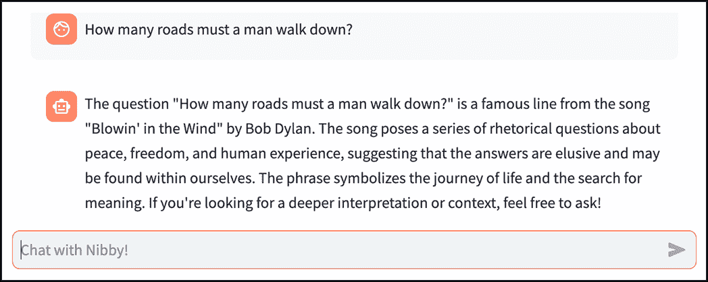

##### 图 10.7 Streamlit 中的单提示单响应聊天机器人（完整的代码在 GitHub 仓库的 chapter_10/in_progress_01 中）。

太棒了！注意人类和机器人的头像，以及微妙的背景阴影，以区分两种显示的消息类型。

如果你玩弄这个应用程序，你会意识到 Nibby 目前还不能进行对话，只能对单条消息做出响应。接下来，让我们修复这个问题！

## 10.3 多轮对话

虽然有些努力，但我们已经构建了 Nibby 的初始版本。不幸的是，目前 Nibby 对对话的理解是单条消息的单个响应。

例如，考虑图 10.8 中的交换。

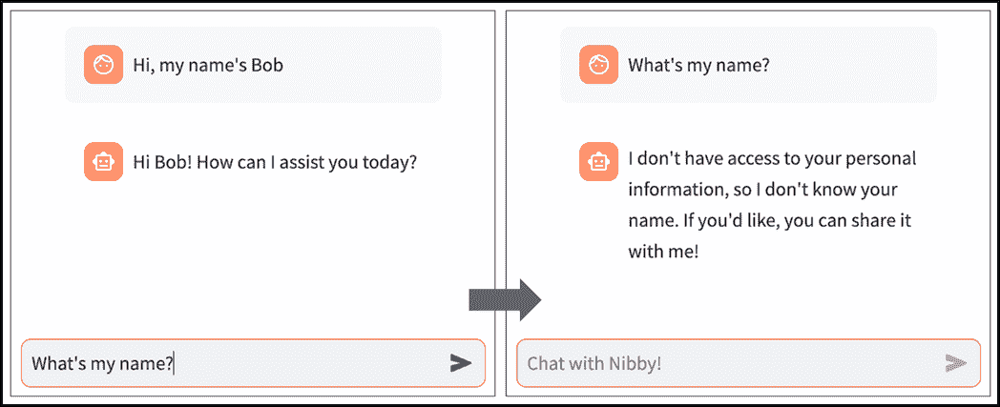

##### 图 10.8 我们的聊天机器人没有记住我们给它提供的信息。

这里有两个问题：

+   机器人没有记住我在上一条消息中给它提供的信息。

+   我们的前端将第二个消息-响应对视为一个全新的对话，删除了第一个的所有痕迹。

在本节中，我们将对 Nibby 进行迭代，解决这两个问题。

### 10.3.1 为我们的图添加内存

回想一下我们创建的简单单节点图：它从一个包含人类消息的状态开始，将此消息传递给 LLM，将 AI 的响应追加到状态中，然后返回更新后的状态。

如果你再次调用图并带有后续消息会发生什么？嗯，过程会重复——创建一个新的状态，只包含后续消息，并将其传递给图，图将其视为全新的独立执行。

这是一个明显的问题，因为对话很少只由一条消息和响应组成。用户*会*想要跟进，聊天机器人需要记住之前的内容。

为了使我们的图能够记住之前的执行，我们需要*持久化*状态，而不是每次都从头开始。幸运的是，LangGraph 通过*检查点器*的概念使这一点变得简单，它可以在每个步骤中保存图的状态。

具体来说，我们将使用检查点器来允许我们的图状态存储在内存中。然后我们可以为图的每次调用分配一个*thread ID*。每次我们调用图时传递相同的线程 ID，图将回忆之前为该线程 ID 存储在内存中的状态，并从*那里*开始，而不是从一张白纸开始。

为了实现这一点，对`graph.py`进行以下更改：

```py
from langgraph.checkpoint.memory import MemorySaver
from langgraph.graph import START, END, StateGraph, MessagesState
...

class SupportAgentGraph:
  def __init__(self, llm):
    self.llm = llm

    self.config = {"configurable": {"thread_id": "1"}}
    ...
...
  def build_graph(self):
    memory = MemorySaver()
    builder = StateGraph(MessagesState)
    ...
    return builder.compile(checkpointer=memory)

  def invoke(self, human_message_text):
    ...
    return self.graph.invoke(state, self.config)
```

（位于 GitHub 仓库的`chapter_10/in_progress_02/graph.py`）

让我们从上面的代码开始讨论`build_graph`。我们在该方法的顶部添加了一行：

```py
memory = MemorySaver()
```

`MemorySaver`是 LangGraph 内置的检查点器，可以存储图的状态。根据您希望将图状态保存的位置，还有各种其他类型的检查点器可用。例如，您可以使用不同的检查点器将对话存储在数据库中，如 PostgreSQL 或 SQLite。

当我们在方法末尾编译我们的图时，我们将这个值传递给它：

```py
return builder.compile(checkpointer=memory)
```

这允许我们的图保存其状态，但这还不够。如果我们不再进行任何更改，每次图调用仍然是一个新的、独立的调用。我们需要一种方法来告诉图，特定的调用属于它之前见过的某个`*thread*`。

将你的注意力转向`__init__`方法，我们在一个名为`self.config`的字段中分配了一个看起来很奇怪的值：

```py
self.config = {"configurable": {"thread_id": "1"}}
```

这里需要注意的重要部分是`{"thread_id": "1"}`。在下面的`invoke`方法中，我们在调用图时传递这个值：

```py
return self.graph.invoke(state, self.config)
```

我们实际上是将线程 ID `1`传递给图，这样它就知道每次我们调用它时，我们总是在同一个会话线程中，该线程的 ID 为`1`。

由于这个更改，图的第一次调用（例如，在引发这些更改的示例中`"Hi, my name's Bob"`）将保存在线程 ID `1`下。此时，状态将包含两条消息：原始的人类消息和 AI 的回复。

当后续消息（`"What's my name"`）到达时，因为我们已经有一个 ID 为`1`的现有线程，它将被*附加*到现有状态。传递给`assistant_node`（因此是 LLM）的状态将包含*三条*消息，使其能够正确响应。

##### 您可能还有其他问题

在这个阶段可能会出现两个自然的问题：

+   为什么线程 ID 总是 1？

+   回想一下，我们的 Streamlit 应用会话不会在单个浏览器刷新后持久化。因此，每次用户通过在新标签页中打开它或刷新浏览器来访问应用时，`SupportAgentGraph`实例都会重新构建，并且图会使用新的`MemorySaver`对象重新编译。由于`MemorySaver`在内存中存储图状态而不是将其持久化到外部数据存储（如 PostgreSQL），因此来自不同浏览器会话的任何线程（无论线程 ID 是多少）都是不可访问的，因此我们可以安全地使用相同的线程 ID `1`来处理新会话。

+   简而言之，我们设置的方式保证了单个图实例在其生命周期中最多只能看到一次对话，因此我们只需要指定一个线程 ID。

+   为什么 self.config 的值如此复杂？

+   看看我们对检查点和内存的解释，似乎我们在调用图时只需要传递值`1`。那么为什么我们有这个怪物：`{"configurable": {"thread_id": "1"}}`？

+   虽然它们超出了本书的范围，但 LangGraph 在调用图时提供了许多选项，例如指定元数据或它能够进行的并行调用数量。线程 ID 是我们在这里使用的唯一配置，但它远非唯一可用的配置。self.config 看似复杂的结构反映了这一点。

再次运行 Nibby 并输入之前相同的消息。这次你应该会看到类似于图 10.9 的内容。

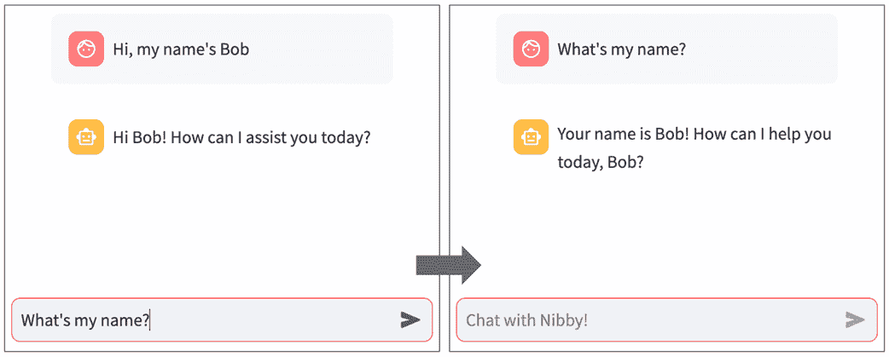

##### 图 10.9 Nibby 现在记得我们在对话中之前告诉它的信息（请参阅 GitHub 仓库中的 chapter_10/in_progress_02 以获取完整代码）。

如您所见，应用程序这次确实记得我们之前给出的信息，但我们仍然需要更新前端以显示整个对话。

### 10.3.2 显示对话历史

我们当前的 Streamlit 前端仅设置用来显示最新的用户输入的消息和 AI 的响应。

要显示完整的历史记录，我们首先需要在后端公开它。让我们首先在`graph.py`中添加一个方法来获取到目前为止的整个对话：

```py
...
class SupportAgentGraph:

  ...
  def get_conversation(self):
 state = self.graph.get_state(self.config)
 if "messages" not in state.values:
 return []
 return state.values["messages"]
```

（GitHub 仓库中的`chapter_10/in_progress_03/graph.py`）

`SupportAgentGraph`中的`get_conversation`方法简单地返回图中当前状态的`messages`列表。

要做到这一点，它首先获取对状态的引用（`self.graph.get_state(self.config)`），然后使用`state.values["messages"]`访问`"messages"`键。将`self.config`传递给`get_state`是必要的，以获取正确的对话线程，尽管——如前一小节中的侧边栏所讨论的——只有一个。

接下来，让我们在`bot.py`中公开完整的`messages`列表：

```py
...
class Bot:

  ...
  def get_history(self):
 return self.graph.get_conversation()
```

（GitHub 仓库中的`chapter_10/in_progress_03/bot.py`）

`get_history`方法所做的只是将我们刚刚定义的`get_conversation`方法的输出忠实地传递给其调用者。

```py
We can now make the changes required in frontend.py:
...
bot = st.session_state.bot

for message in bot.get_history():
 st.chat_message(message.type).markdown(message.content)

if human_message_text := st.chat_input("Chat with Nibby!"):
    ...
```

（GitHub 仓库中的`chapter_10/in_progress_03/frontend.py`）

我们调用`bot.get_history()`来获取消息列表，并遍历它，在每个自己的`st.chat_message`容器中显示每条消息。

回想一下，`messages`列表中的每个消息都是`HumanMessage`或`AIMessage`的实例。无论如何，它都有一个类型字段，对于`HumanMessage`，其值为`"human"`，对于`AIMessage`，其值为`"ai"`。因此，它完美地作为`st.chat_message`中的类型指示符参数使用。

`message.content`包含消息的文本，所以我们使用`st.markdown`来显示它。

重新运行应用程序以查看图 10.10。

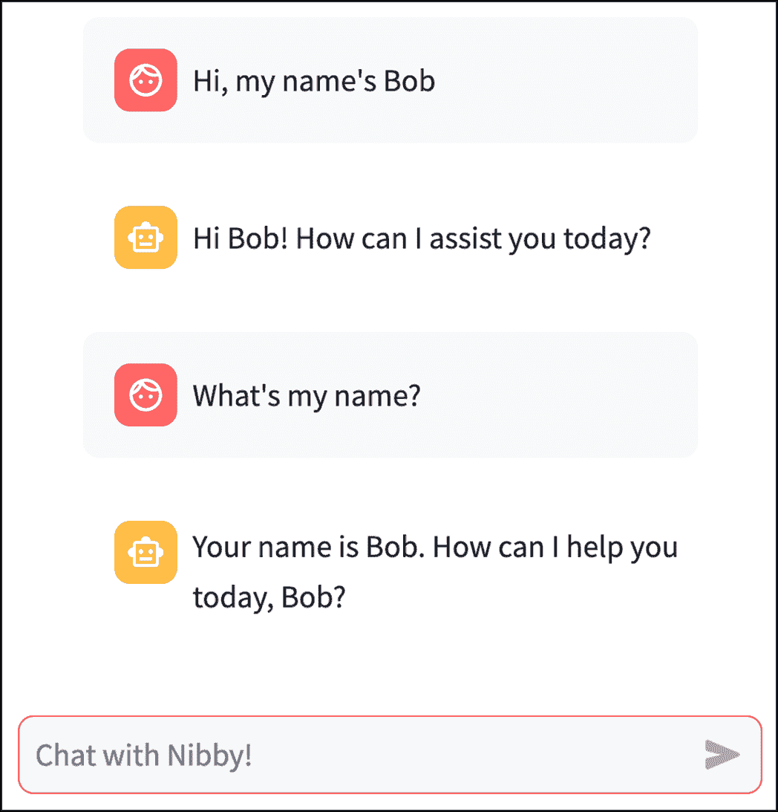

##### 图 10.10 我们的前端现在显示完整的对话历史（完整代码请参阅 GitHub 仓库中的 chapter_10/in_progress_03）

如预期，Nibby 现在显示了完整的对话，这样我们就可以跟踪正在发生的事情。

## 10.4 限制我们的机器人仅用于客户支持

到目前为止，我们一直专注于确保 Nibby 的基本功能正确——包括调用 LLM 和处理完整的对话。结果是你可以询问几乎任何问题的*通用聊天机器人*。

例如，考虑如果我们要求 Nibby 唱一首歌会发生什么（图 10.11）：

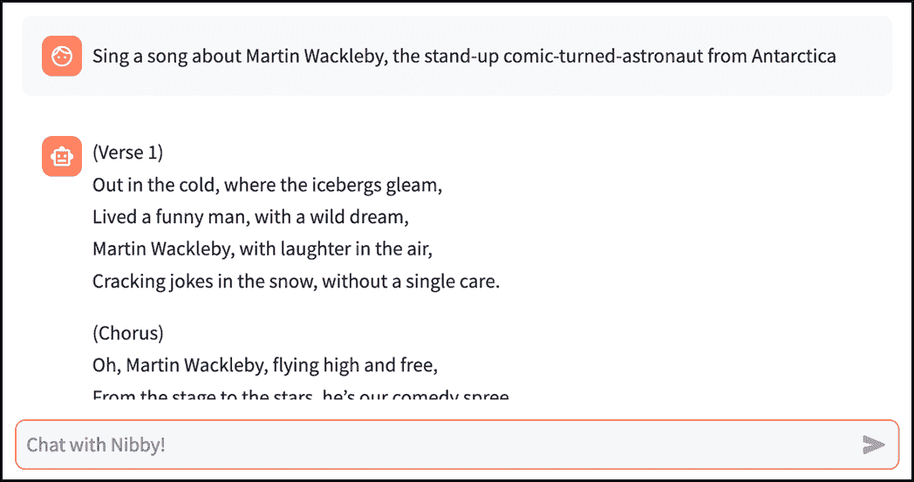

##### 图 10.11 Nibby 迎合无聊的请求，可能会给我们带来费用。

Nibby 确实可以唱歌。它还可以帮助你解决数学问题或撰写关于罗马帝国衰亡的论文。不幸的是，它所有这些都由公司承担费用。记住，与基于云的 LLM 交互是*需要付费的*。

每当有人对你的客户支持机器人提出无聊的请求，并且机器人用冗长的回复来迎合这个请求时，它就会消耗宝贵的 LLM 令牌，并给你带来一些费用。当然，每条消息只占几分之一的美分，但如果你把所有请求编码帮助或扮演《星际迷航》中角色的请求加起来，突然间你的老板想知道为什么季度收益报告中有一个像 Nibby 一样的洞。

当然，我在这里是在夸张，但观点是：我们希望 Nibby 严格专注于业务。

LLM 最好的地方在于你可以简单地告诉它它应该做什么或不做什么，所以这实际上是一个简单的修复；我们将简单地添加一个合适的*提示*。

### 10.4.1 创建基本提示

正如我们在第九章所做的那样，我们希望给 LLM 一些关于我们希望它服务的用例的背景信息。在那个章节中，我们通过创建一个带有角色"`system`"的消息来实现这一点。这里我们也将做同样的事情，尽管我们将使用的抽象略有不同。

创建一个名为`prompts.py`的文件，内容如列表 10.6 所示。

##### 列表 10.6 prompts.py

```py
BASE_SYS_MSG = """
  You are a customer support agent for Note n' Nib, an online stationery
  retailer. You are tasked with providing customer support to customers who
  have questions or concerns about the products or services offered by the
  company.

  You must refuse to answer any questions or entertain any requests that
  are not related to Note n' Nib or its products and services.
"""
```

(`chapter_10/in_progress_04/prompts.py` 在 GitHub 仓库中)

这个提示给 Nibby 第一个暗示，Note n' Nib 存在，并且它应该为公司提供客户支持。

重要的是，`BASE_SYS_MSG`还有一个指令拒绝与 Note n' Nib 无关的任何请求。接下来，让我们将这个指令整合到我们的图中。

### 10.4.2 在我们的图中插入一个基本上下文节点

正如我们在第九章所学到的，使用 OpenAI 的聊天完成端点涉及向 LLM 传递一系列消息。

在我们当前的图中，列表从用户的第一个指令开始，只包含用户消息和 AI 响应。为了防止 Nibby 对无聊的请求做出回应，我们只需要将我们刚刚创建的系统提示作为列表中的第一条消息插入到我们发送给 LLM 的列表中。

我们将通过在图中插入一个新节点来添加系统消息到图状态，并修改现有的`assistant_node`在传递任何其他信息之前将此消息传递给 LLM。

图 10.12 显示了新图的视觉表示。

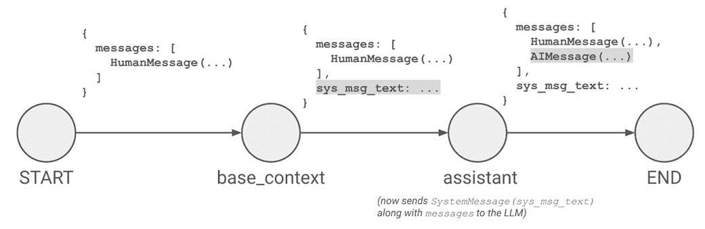

##### 图 10.12 在我们的图中添加基本上下文节点

对`graph.py`所需的更改在列表 10.7 中显示：

##### 列表 10.7 graph.py（已修改）

```py
...
from langchain_core.messages import HumanMessage, SystemMessage
from prompts import *

class AgentState(MessagesState):
 sys_msg_text: str

class SupportAgentGraph:
  def __init__(self, llm):
    ...

  @staticmethod
 def base_context_node(state):
 return {"sys_msg_text": BASE_SYS_MSG}

  def get_assistant_node(self):
    def assistant_node(state):
      sys_msg = SystemMessage(content=state["sys_msg_text"])
 messages_to_send = [sys_msg] + state["messages"]
      ai_response_message = self.llm.invoke(messages_to_send)
      return {"messages": [ai_response_message]}
    return assistant_node

  def build_graph(self):
    memory = MemorySaver()
    builder = StateGraph(AgentState)

    builder.add_node("base_context", self.base_context_node)
    builder.add_node("assistant", self.get_assistant_node())

    builder.add_edge(START, "base_context")
    builder.add_edge("base_context", "assistant")
    builder.add_edge("assistant", END)

    return builder.compile(checkpointer=memory)

  def invoke(self, human_message_text):
    ...
  ...
```

（GitHub 仓库中的`chapter_10/in_progress_04/graph.py`）

从顶部开始，我们添加了一些导入；我们需要`SystemMessage`类以及`HumanMessage`，所以这是第一个。

语句`from prompts import *`允许我们仅使用变量名——而不是像`prompt.`这样的前缀——访问我们可能添加到`prompts.py`中的任何提示。由于我们在这里使用的是`*`通配符而不是导入特定对象，`prompt.py`的全局作用域中的每个对象都成为`graph.py`作用域的一部分。在这种情况下，这意味着我们可以直接引用`BASE_SYS_MSG`，就像我们在代码中稍后所做的那样。

我们定义了一个新的`AgentState`类：

```py
class AgentState(MessagesState):
  sys_msg_text: str
```

`AgentState`从`MessagesState`继承，因此它也包含我们迄今为止一直在使用的`messages`字段。我们在这里实际上是在状态中添加一个新的字段——称为`sys_msg_text`——用来存储系统消息的文本。

接下来，在类内部，我们添加了一个新的静态方法：

```py
@staticmethod
def base_context_node(state):
  return {"sys_msg_text": BASE_SYS_MSG}
```

这个函数代表我们在图中添加的新节点，称为`base_context`。这个节点所做的只是填充我们添加到状态中的`sys_msg_text`字段。通过返回`{"sys_msg_text": BASE_SYS_MSG}`，这个节点将`sys_msg_text`设置为`BASE_SYS_MSG`——我们几分钟前创建的上下文提示——在图当前状态中。

要理解这是如何工作的，记住一个图节点并不返回整个状态；相反，它只返回需要修改的状态中的键。因此，尽管这里没有提到`messages`字段，一旦这个节点被执行，状态将继续保留那个字段——未修改的——除了`sys_msg_text`。

##### 注意

与`messages`的情况不同，当我们返回一个包含`sys_msg_text`键的字典时，它会*替换*状态中`sys_msg_text`的值。这是因为`sys_msg_text`使用默认的更新行为，而不是`messages`使用的（由`add_messages`函数内部启用的）*追加*行为。

为什么我们将`base_context_node`做成静态方法？好吧，再次回想一下，图中的每个节点都需要接受图状态作为其第一个参数。我们希望将`base_context_node`放在`SupportAgentGraph`中，以便于逻辑代码组织，但如果我们将其做成普通方法，它将需要接受类实例（`self`）作为第一个参数。将其做成静态方法消除了这个要求，并使我们能够添加一个状态参数。

一些读者可能会问，“等等，我们不是也为了同样的原因将 `assistant_node` 结构化为嵌套函数吗？为什么这里没有这样做？”

我们确实可以使用基于闭包的解决方案来处理 `base_context_node`，但我们不需要；与引用 `self.llm` 的 `assistant_node` 不同，`base_context_node` 完全不需要访问 `self`。因此，我们采用了更直接的技术，即应用 `@staticmethod` 装饰器到 `base_context_node`。

说到 `assistant_node`，考虑一下我们对它代码所做的更改：

```py
sys_msg = SystemMessage(content=state["sys_msg_text"])
messages_to_send = [sys_msg] + state["messages"]
ai_response_message = self.llm.invoke(messages_to_send)
```

我们现在不是直接用 `state["messages"]` 调用 LLM，而是创建一个 `SystemMessage` 对象，其中 `sys_msg_text` 字段是我们填充在 `base_context_node` 中的内容，并将其添加到 `state["messages"]` 的前面，以形成传递给 LLM 的列表。

最后，请注意我们对 `build_graph` 的更新。由于我们已经扩展了 `MessagesState` 以包括 `sys_msg_text` 字段，我们使用它来初始化 `StateGraph`：

```py
builder = StateGraph(AgentState)
```

我们像这样添加基础上下文节点：

```py
builder.add_node("base_context", self.base_context_node)
```

注意我们在这里是如何传递对 `self.base_context_node` 方法的引用，而不是用双括号调用它。

我们还重新排列了图中的边，在 `START` 和 `assistant` 之间插入 `base_context` 节点：

```py
builder.add_edge(START, "base_context")
builder.add_edge("base_context", "assistant")
```

这应该就是我们所需要的。继续运行您的应用程序。尝试再次请求机器人唱歌，以获得类似于图 10.13 的响应。

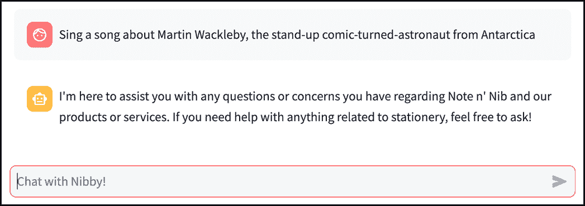

##### 图 10.13 Nibby 现在拒绝处理无聊的请求（完整的代码请参阅 GitHub 仓库中的 chapter_10/in_progress_04）。

看起来 Nibby 收到了通知！它不会再帮助用户处理不相关的请求了。在下一节中，我们将解决相反的问题：让它帮助回答*相关*的问题。

## 10.5 检索增强生成

模型如 GPT-4o 非常有效，因为它们已经在大量公开可用的信息语料库上进行了预训练，例如书籍、杂志和网站。这就是为什么我们的第九章中的知识问答应用“Fact Frenzy”能够就如此广泛的主题提问和回答问题。

然而，许多更具经济价值的生成式 AI 用例需要的信息不仅限于公共领域。真正将 AI 调整为适合您特定用例通常需要提供只有您拥有的私有信息。

以 Nibby 为例，它最终旨在帮助 Note n' Nib 的客户查询。如果我们向 Nibby 提出一个关于文具产品的有效问题会发生什么？图 10.14 展示了这样的对话。

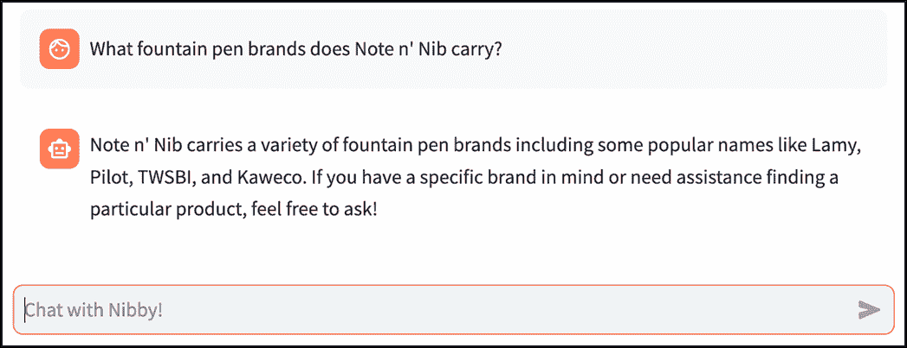

##### 图 10.14 Nibby 在不知道答案时编造信息。

看起来 Nibby 已经做得很好了，对吧？并不完全是这样。我们从未告诉我们的机器人 Note n' Nib 携带哪些类型的笔，所以它从哪里得到这些信息呢？此外，我们在第六章中遇到的虚构品牌——InkStream 和 RoyalQuill——在哪里？实际上，Nibby 没有关于钢笔的信息，因此只是简单地虚构了这个回答！

在本节中，我们将发现一种方法，通过我们提供的自定义信息来增强 Nibby 现有的世界知识库。

### 10.5.1 什么是检索增强生成？

那么，我们如何补充一个 LLM 训练的所有信息以及我们自己的信息呢？对于相对较小的信息片段，实际上是非常容易的——事实上，我们已经有了解决方法！我们只需要将信息作为我们提示的一部分提供给 LLM！

我们可以通过在发送给 LLM 的系统消息中直接列出 Note n' Nib 销售的产品，简单地让 Nibby 正确回答我们在图 10.14 中提出的问题。

那么，其他问题呢？技术上，我们可以直接在提示中给出模型可能需要回答任何问题的所有上下文信息。我们可以提供此类信息的最大量是以标记计的，称为模型的*上下文窗口长度*。

相对较新的模型拥有巨大的上下文窗口。例如，gpt-4o-mini 可以处理高达 128,000 个标记（大约 96,000 个单词，因为——平均而言——一个标记大约是三分之二的单词），而 o3-mini——来自 OpenAI 的一个较新的推理模型——上下文窗口为 200,000 个标记。其他提供商的模型在一个提示中可以处理更多的标记。Google 的 Gemini 2.0 Pro 的上下文窗口长达惊人的*2 百万*个标记——足以容纳整个《哈利·波特》系列书籍，还剩下足够的空间来容纳几乎所有的《指环王》三部曲。

难道我们的问题就解决了？我们可以简单地组装我们关于 Note n' Nib 的所有信息，并在每个提示中将其提供给 LLM，对吗？

当然，我们可以这样做，但可能出于几个原因我们不想这么做：

+   LLM 容易受到信息过载的影响；我们通常看到在极其大的提示下性能下降。

+   即使没有这种退化，LLM 提供商通常按标记收费，所以如果我们必须在每次 LLM 调用中传递我们的整个自定义知识库，成本将会飙升。

不，我们需要一个不同的解决方案。如果我们能够**读取用户的问题，并仅向 LLM 提供** ***回答问题所需的我们知识库中的相关部分***。

而且——如果你还没有意识到这个讨论的方向——这正是检索增强生成（RAG）的含义。

RAG 具有以下基本步骤：

+   读取用户的问题

+   **检索**与问题相关的上下文信息从知识库中

+   **增强**问题，添加回答它所需的上下文

+   **生成**问题的答案，通过将问题和上下文输入到 LLM 中

RAG 的难点在于*检索*步骤。具体来说，给定一个用户问题和大型自定义知识库，你如何识别与问题相关的知识库部分，并仅从库中提取这些部分？

答案在于*嵌入*的概念以及一个名为*向量数据库*的软件。

#### 嵌入和向量数据库

虽然从严格意义上讲，我们不需要学习嵌入或向量数据库的工作原理来实现 RAG，但了解这些概念的基本知识会是一个好主意。

让我们从简化示例开始，以实现这一点。假设你在朋友圈中以电影爱好者而闻名。你的朋友走到你面前说：“嘿，我昨天看了*黑暗骑士*，非常喜欢！你能推荐一部类似的电影吗？”

你陷入了困境，因为你虽然对电影有百科全书式的了解，但你不确定如何确切地衡量两部电影之间的*相似度*，以便推荐与*黑暗骑士*最相似的电影。拒绝接受失败，你逃到你的地下巢穴，独自尝试解决这个问题。

最终，你提出了一套系统。你认为当人们表达对各种电影的偏好时，他们潜意识中在谈论两个属性：*喜剧值*和*每小时爆炸次数*。因此，你将你的整个电影目录与这两个尺度进行比较，并在图表上绘制结果（部分如图 10.15 所示）。

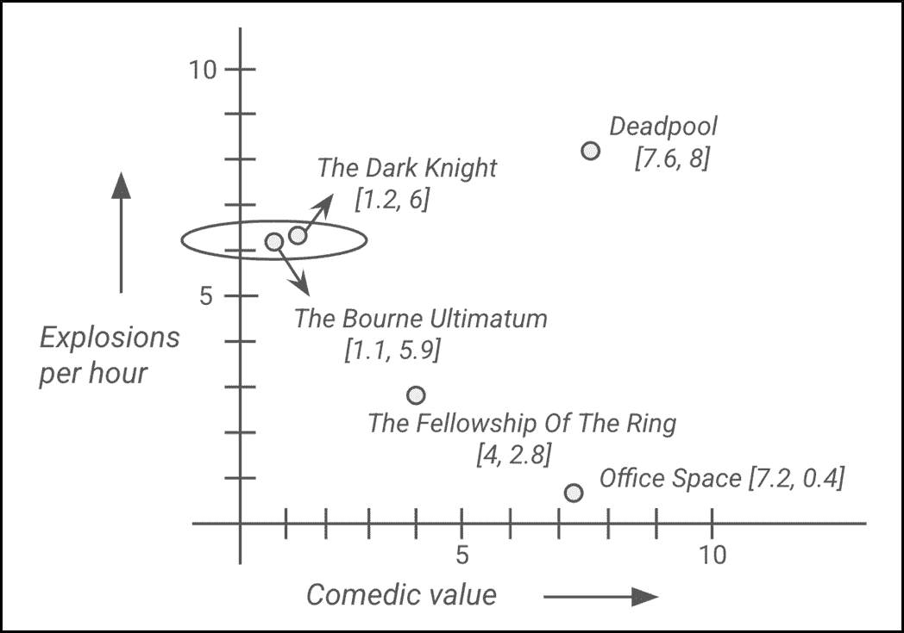

##### 图 10.15 将电影转换为向量并在图表上绘制

如您所见，*黑暗骑士*的喜剧值为`1.2`，但每小时爆炸次数相对较高，为`6`。我们可以将其表示为一个数字列表：`[1.2, 6]`，称为一个*向量*。我们可以称这个向量`[1.2, 6]`为电影*黑暗骑士*在二维喜剧值/每小时爆炸次数空间中的*嵌入*。

以这种方式将电影转换为数字，使得可以衡量它们的相似度。例如，*办公室空间*在同一空间中表示为`[7.2, 0.4]`。通过考虑它们的*几何*距离，可以数学地计算出*办公室空间*和*黑暗骑士*之间的相似度（或者更确切地说，是缺乏相似度）。两部电影嵌入的几何距离越近——通过它们之间画出的直线长度来衡量——它们背后的电影就越相似。

经过几次这样的计算后，你发现具有向量`[1.1, 5.9]`的*终极越狱*与*黑暗骑士*最接近。在完成你的研究后，你回到朋友那里告诉他们（你的朋友回答说：“谢天谢地你还在！已经两年了，你去哪了*了*？”）。

我们面临的 Nibby 问题与上述电影推荐问题类似。给定一个用户的消息（你朋友喜欢的电影），以及一个知识库（你的电影目录），我们必须找到与用户消息最相关（最“相似”）的段落/片段（电影）。

为了高效地回答这个问题，我们需要两样东西：

+   一种将给定文本转换为能够捕捉其意义（或*语义*）的嵌入的方法

+   一种存储这些嵌入并快速计算它们之间距离的方法

显然，上面提到的电影例子过于简单。我们的“空间”只有两个维度：喜剧价值和每小时爆炸次数。编码文本的意义需要更多的维度（如数百或数千），而这些维度本身也不会是像“喜剧价值”这样人类可理解的概念。我们将使用 OpenAI 提供的文本嵌入模型来满足我们的用例。

为了存储嵌入，我们将使用一个名为*向量数据库*的程序。向量数据库使得计算嵌入之间的距离或找到与特定嵌入最接近的条目变得容易。我们不会使用向量之间的“直线”（或*欧几里得*）距离，而是使用一个称为*余弦相似度*的分数，它通过测量两个向量之间的*角度*来确定它们的相似度。我们将使用的向量数据库是 Pinecone，这是一个云托管服务。

### 10.5.2 在我们的应用中实现 RAG

在掌握了 RAG 的概念理解之后，我们现在将专注于将其实现，以帮助 Nibby 回答客户问题。

#### 准备知识库

本章节的 GitHub 文件夹（[`github.com/aneevdavis/streamlit-in-action/tree/main/chapter_10`](https://github.com/aneevdavis/streamlit-in-action/tree/main/chapter_10)）中有一个名为 `articles` 的子目录，其中包含一系列针对 Note n' Nib 的客户支持文章。每篇文章都是一个包含有关 Note n' Nib 产品信息或其业务运营方式的文本文件。例如，`our_products.txt` 包含产品描述列表，而 `fountain_pen_maintenance.txt` 则是关于维护 RoyalQuill 和 InkStream 笔的说明。

下面是我们将要引用的文章摘录：

```py
Proper care ensures your InkStream and RoyalQuill fountain pens write smoothly for years.

- Cleaning: Flush the nib with warm water every few weeks.
- Refilling: Use high-quality ink to prevent clogging.
- Storage: Store pens upright to avoid leaks and ensure ink flow.
```

现在将 `articles` 文件夹复制到您的当前工作目录中。这是 Nibby 将能够访问的知识库。

#### 设置向量数据库

如前一小节简要提到的，我们将使用 Pinecone，这是一个针对快速和可扩展的相似性搜索进行优化的托管向量数据库，它因适用于人工智能应用而受到欢迎。Pinecone 的免费“入门”计划对于本章来说已经足够了。

前往 [`www.pinecone.io/`](https://www.pinecone.io/) 现在注册一个账户。一旦设置完成，你将获得一个 API 密钥，你应该立即保存。完成之后，创建一个新的 *索引*。索引类似于常规的非向量数据库（如 PostgreSQL）中的表。索引将存储我们的支持文章的各个部分及其嵌入。

在创建过程中，你将需要提供各种选项的值：

+   **索引名称**：你可以使用任何你喜欢的名称，但请记住保存它，因为我们将在代码中使用它。

+   **模型配置**：选择 `text-embedding-ada-002`，这是我们将要使用的 OpenAI 嵌入模型；维度的值应自动设置为 1,536。

+   **度量标准**：选择 `cosine` 以使用我们之前简要讨论过的余弦相似度分数。

+   **容量模式** 应该是 `Serverless`

+   **云提供商**：`AWS` 对此是合适的。

+   **区域**：在撰写本文时，免费计划中只有 `us-east-1` 可用，所以请选择它。

#### 知识库的导入

要将向量存储集成到我们的聊天机器人应用程序中，我们将创建一个 `VectorStore` 类。在这样做之前，将你的 Pinecone API 密钥和刚刚创建的索引名称添加到 `secrets.toml` 中，使其看起来像这样：

```py
[api_keys]
OPENAI_API_KEY = 'sk-proj-...'    #A
VECTOR_STORE_API_KEY = 'pcsk_...'    #B

[config]
VECTOR_STORE_INDEX_NAME = 'index_name_you_chose'    #C
```

#A 用你的实际 OpenAI API 密钥替换。

#B 用你的 Pinecone API 密钥替换。

#C 用实际的索引名称替换 sk-proj-...。

我们在 `api_keys` 中添加了一个新键，并在 `config` 部分添加了一个新部分来保存索引名称。

接下来是 `VectorStore` 类。创建一个名为 `vector_store.py` 的文件，其内容如列表 10.8 所示。

##### 列表 10.8 vector_store.py

```py
from pinecone import Pinecone
from langchain_openai import OpenAIEmbeddings
from langchain_pinecone import PineconeVectorStore
from langchain_community.document_loaders import DirectoryLoader, TextLoader
from langchain.text_splitter import RecursiveCharacterTextSplitter

class VectorStore:
  def __init__(self, api_keys, index_name):
    pc = Pinecone(api_key=api_keys["VECTOR_STORE_API_KEY"])
    embeddings = OpenAIEmbeddings(api_key=api_keys["OPENAI_API_KEY"])
    index = pc.Index(index_name)
    self.store = PineconeVectorStore(index=index, embedding=embeddings)

  def ingest_folder(self, folder_path):
    loader = DirectoryLoader(
      folder_path,
      glob="**/*.txt",
      loader_cls=TextLoader
    )
    documents = loader.load()
    splitter = RecursiveCharacterTextSplitter(
      chunk_size=1000,
      chunk_overlap=200
    )
    texts = splitter.split_documents(documents)
    self.store.add_documents(texts)

  def retrieve(self, query):
    return self.store.similarity_search(query)
```

（GitHub 仓库中的 `chapter_10/in_progress_05/vector_store.py`）

这里有很多事情要做，所以让我们一步一步地来看。

`__init__` 包含设置向量存储连接所需的样板代码。它接受两个参数：`api_keys`（API 密钥的字典）和 `index_name`（Pinecone 索引的名称）。

`__init__` 首先使用我们一分钟前记录的 Pinecone API 密钥创建 `Pinecone` 对象——`pc`，然后通过传递 OpenAI 密钥创建一个 `OpenAIEmbeddings` 对象。`pc.Index(index_name)` 指的是我们之前创建的索引。最后，我们从索引和嵌入中获取一个向量存储对象，并将其分配给 `self.store`，以便我们可以在其他方法中使用它。

`ingest_folder` 方法接受文件夹的路径并将内容保存到 Pinecone 索引中。考虑这个方法的第一个部分：

```py
loader = DirectoryLoader(
  folder_path,
  glob="**/*.txt",
  loader_cls=TextLoader
)
```

LangChain 提供了各种 *文档加载器*，以帮助将各种类型的数据（文本文件、PDF、网页、数据库等）导入并解析成适合处理的结构化格式。`DirectoryLoader` 使从指定目录加载文件变得容易。

`glob="**/*.txt"` 确保包含文件夹（包括子文件夹）中的所有文本文件（`.txt`）。

`loader_cls=TextLoader` 告诉 `DirectoryLoader` 使用另一个名为 `TextLoader` 的加载器类（由 LangChain 提供）来加载单个文本文件。

一旦创建 `DirectoryLoader`，下一步是加载文档：

```py
documents = loader.load()
```

这将读取目录中的所有 `.txt` 文件并将它们加载到一个 `Document` 对象列表中，LangChain 使用它来存储原始文本和元数据。

目前，每个 `Document` 都包含一整篇文章。虽然我们文件夹中的文章相对较小，但可以很容易地想象一个支持文章可能长达数千个单词。从我们的知识库中获取相关文本的目的就是为了减少整个提示的大小；简单地获取整个文章是达不到这个目的的。

因此，我们希望将文章分成可管理的、大致相等大小的文本块。这正是我们代码的下一部分所做的事情：

```py
splitter = RecursiveCharacterTextSplitter(
  chunk_size=500,
  chunk_overlap=200
)
texts = splitter.split_documents(documents)
```

`RecursiveCharacterTextSplitter` 是 LangChain 中的一个文本分割实用工具，可以在保留有意义上下文的同时将文档分割成块。

`chunk_size=500` 设置每个块的长度为 500 个字符。

`chunk_overlap=200` 表示块之间将有一个 200 个字符的重叠，以保持上下文。

在分割文档后，`texts` 中可用的块准备存储：

```py
self.store.add_documents(texts)
```

`add_documents` 函数将分割后的文本块添加到 Pinecone 索引中，存储使用 `text-embedding-ada-002` 模型生成的文本和嵌入，使其可搜索。

`retrieve` 方法允许调用者查询向量存储：

```py
def retrieve(self, query):
  return self.store.similarity_search(query)
```

我们 `PineconeVectorStore` 实例（`self.store`）的 `similarity_search` 方法使用生成的嵌入在向量存储中搜索与 `query`（用户的消息）相似的文档，根据查询返回相关 `Document` 对象的列表。

到目前为止，我们已经将向量存储功能编码到一个方便的小类中；接下来，让我们使用这个类来导入我们的 `articles/` 文件夹。

这是一个 *离线* 步骤，您只需要执行一次；一旦您将文章存储在 Pinecone 中，它们将保留在那里，直到您删除它们。

现在创建一个名为 `ingest_to_vector_store.py` 的文件，并将列表 10.9 的内容复制进去。

##### 列表 10.9 ingest_to_vector_store.py

```py
import toml
from vector_store import VectorStore

secrets = toml.load(".streamlit/secrets.toml")
api_keys = secrets["api_keys"]
index_name = secrets["config"]["VECTOR_STORE_INDEX_NAME"]
vector_store = VectorStore(api_keys, index_name)
vector_store.ingest_folder("articles/")
```

(`chapter_10/in_progress_05/ingest_to_vector_store.py` 在 GitHub 仓库中)

由于这不是使用 Streamlit 运行的，我们直接使用 `toml` 模块来读取我们的 `secrets.toml`：

```py
secrets = toml.load(".streamlit/secrets.toml")
```

在此之后，`secrets` 应该是一个包含我们之前组织到 `secrets.toml` 中的 `api_keys` 和 `config` 键的字典。

接下来，我们获取所需的值：

```py
api_keys = secrets["api_keys"]
index_name = secrets["config"]["VECTOR_STORE_INDEX_NAME"]
```

我们现在可以实例化我们的 `VectorStore` 类：

```py
vector_store = VectorStore(api_keys, index_name)
```

最后，我们触发 `ingest_folder` 方法：

```py
vector_store.ingest_folder("articles/")
```

要执行实际的导入，请在您的终端中使用 `python` 命令运行此文件：

```py
python ingest_to_vector_store.py
```

一旦完成，您可以去 Pinecone 网站上与您的索引对应的页面查看新导入的块，如图 10.16 所示。

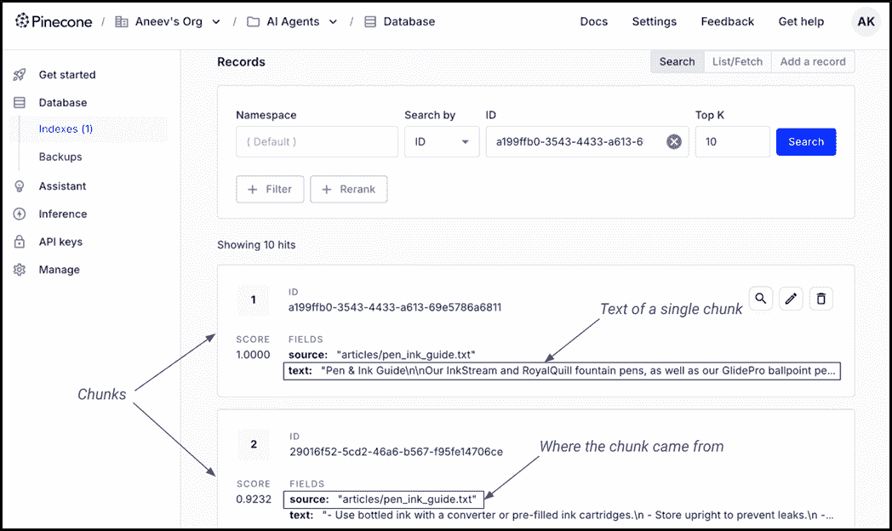

##### 图 10.16 你可以在 Pinecone 网站上看到你的索引中的块。

注意源字段，它包含每个块来自的文件名。你还可以点击记录上的编辑按钮来添加更多元数据或查看其数值向量值。如果你要计数，你会找到 1536 个，这对应于嵌入模型的维度数。

#### 向图中添加 RAG

我们需要的用于 RAG 的 Pinecone 索引已经准备好了，但我们还需要将其功能整合到我们的聊天机器人中。为此，让我们首先列出 Nibby 需要使用知识库的附加说明。将以下内容追加到`prompts.py`：

```py
SYS_MSG_AUGMENTATION = """
  You have the following excerpts from Note n' Nib's
  customer service manual:
  ```

{docs_content}

```py
  If you're unable to answer the customer's question confidently with the
  given information, please redirect the user to call a human customer
  service representative at 1-800-NOTENIB.
"""
```

（GitHub 仓库中的`chapter_10/in_progress_05/prompts.py`）

在不久的将来，我们将编写逻辑来用我们从 Pinecone 检索到的文档块替换`{docs_content}`。这里的想法是给 Nibby 提供所需的上下文，并让它停止在没有信心的情况下凭空编造答案。

接下来，让我们修改`graph.py`，如列表 10.10 所示，以实现 RAG。

##### 列表 10.10 graph.py（带有 RAG 节点）

```py
...
from langchain_core.messages import HumanMessage, SystemMessage
from langchain_core.documents import Document
from prompts import *

class AgentState(MessagesState):
  sys_msg_text: str
  retrieved_docs: list[Document]

class SupportAgentGraph:
  def __init__(self, llm, vector_store):
    self.llm = llm
    self.vector_store = vector_store

    self.config = {"configurable": {"thread_id": "1"}}
    self.graph = self.build_graph()

  ...
  def get_retrieve_node(self):
 def retrieve_node(state: AgentState):
 messages = state["messages"]
 message_contents = [message.content for message in messages]
 retrieval_query = "\n".join(message_contents)
 docs = self.vector_store.retrieve(retrieval_query)
 return {"retrieved_docs": docs}
 return retrieve_node

 @staticmethod
 def augment_node(state: AgentState):
 docs = state["retrieved_docs"]
 docs_content_list = [doc.page_content for doc in docs]
 content = "\n".join(docs_content_list)
 new_text = SYS_MSG_AUGMENTATION.replace("{docs_content}", content)
 return {"sys_msg_text": BASE_SYS_MSG + "\n\n" + new_text}

  ...
  def build_graph(self):
    ...
    builder.add_node("base_context", self.base_context_node)
    builder.add_node("retrieve", self.get_retrieve_node())
 builder.add_node("augment", self.augment_node)
    builder.add_node("assistant", self.get_assistant_node())

    builder.add_edge(START, "base_context")
    builder.add_edge("base_context", "retrieve")
 builder.add_edge("retrieve", "augment")
 builder.add_edge("augment", "assistant")
    builder.add_edge("assistant", END)

    return builder.compile(checkpointer=memory)

  ...
```

（GitHub 仓库中的`chapter_10/in_progress_05/graph.py`）

第一个更改是`AgentState`，现在看起来是这样的：

```py
class AgentState(MessagesState):
  sys_msg_text: str
  retrieved_docs: list[Document]
```

现在，我们将从 Pinecone 检索到的块列表存储在图的`retrieved_docs`变量中。

`__init__`现在接受`vector_store`——我们的`VectorStore`类的一个实例——作为参数，并将其保存到`self.vector_store`。

注意，我们不是在`graph.py`中创建`VectorStore`实例，而是选择在别处（`bot.py`，我们很快就会知道）创建它，并将其简单地传递给`SupportAgentGraph`类。这是因为我们希望`graph.py`只包含图的逻辑核心。图所依赖的对象，如`llm`和`vector_store`，应该传递给它。这种编码模式被称为*依赖注入*，在编写自动化测试时很有帮助。

接下来，我们需要将检索增强生成过程引入我们的图中。图 10.17 显示了本节结束时图应该的样子。

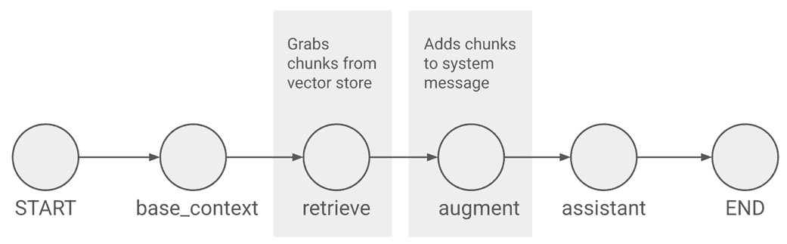

##### 图 10.17 我们现在在图中有了用于 RAG 的检索和增强节点。

我们在`base_context`和`assistant`节点之间插入了两个节点：一个用于从与用户查询相关的知识库中检索上下文的`retrieve`节点，以及一个用于将此信息添加到提示中的`augment`节点。

这里是`retrieve`节点的代码：

```py
def get_retrieve_node(self):
  def retrieve_node(state: AgentState):
    messages = state["messages"]
    message_contents = [message.content for message in messages]
    retrieval_query = "\n".join(message_contents)
    docs = self.vector_store.retrieve(retrieval_query)
    return {"retrieved_docs": docs}
  return retrieve_node
```

就像`assistant_node`的情况一样，`retrieve_node`被结构化为一个类方法内的嵌套函数。它只是提取对话中所有消息的内容，并将它们放入一个单独的字符串中，形成我们将传递给向量存储的“查询”。

这里的想法是找到与对话最相关的块。由于我们是在与查询测量相关性，所以这仅仅是对话的文本是有意义的。

一旦我们有了查询，我们可以调用我们之前定义的`retrieve`方法，并以字典的形式返回检索到的文档列表，从而更新图状态中的`retrieved_docs`键。

##### 注意

虽然我们在这里通过包含整个对话的文本在检索查询中保持了简单，但随着对话变得越来越长，你可能会遇到挑战。对于任何特定的 AI 响应，对话中最**最近**的消息可能更有语境相关性——因此，从对话的最后几条，比如最后五或六条消息中形成检索查询可能是个好主意。

下面的图显示了增强节点：

```py
@staticmethod
def augment_node(state: AgentState):
  docs = state["retrieved_docs"]
  docs_content_list = [doc.page_content for doc in docs]
  content = "\n".join(docs_content_list)
  new_text = SYS_MSG_AUGMENTATION.replace("{docs_content}", content)
  return {"sys_msg_text": BASE_SYS_MSG + "\n\n" + new_text}
```

这个不需要从`SupportAgentGraph`访问任何内容，所以我们将其结构化为一个静态方法，就像我们对`base_context_node`所做的那样。

`augment_node`主要做的是繁琐的工作，将检索到的块整理并插入到系统消息中。一旦它通过连接检索到的`Document`块的 内容形成了一个字符串，它就简单地将其插入到我们添加到`prompts.py`中的`SYS_MSG_AUGMENTATION`值的文本中，替换`{docs_content}`。

在此节点的末尾，`sys_msg_text`包含完整的系统消息——早些时候的基本消息警告 Nibby 不要回答无聊的问题，以及检索到的上下文。

我们已经在 RAG 的“生成”步骤中有一个节点了——`assistant_node`——因此不需要再添加一个。

根据 10.17 图，对`build_graph`的修改应该是相当明显的；我们正式添加了`retrieve`和`augment`节点，并将它们连接到正确的边上。

下一个要编辑的文件是`bot.py`。进行以下更改：

```py
...
from vector_store import VectorStore

class Bot:
  def __init__(self, api_keys, config):
    self.api_keys = api_keys
    self.config = config

    self.llm = self.get_llm()
    self.vector_store = self.get_vector_store()

    self.graph = SupportAgentGraph(
      llm=self.llm, vector_store=self.vector_store)

  def get_vector_store(self):
 index_name = self.config["VECTOR_STORE_INDEX_NAME"]
 return VectorStore(api_keys=self.api_keys, index_name=index_name)
  ...
```

（GitHub 仓库中的`chapter_10/in_progress_05/bot.py`）

`__init__`现在接受一个`config`参数，保存到`self.config`。它还通过调用我们下面将要讨论的`get_vector_store`方法创建`vector_store`对象，并将其传递给`SupportAgentGraph`构造函数。

`get_vector_store`包含完成循环所需的代码。它从`self.config`获取 Pinecone 索引名称，并在返回之前将`self.api_keys`和`index_name`传递给创建`VectorStore`实例。

我们需要在`frontend.py`中进行的最后一个更改相当小：

```py
...
if "bot" not in st.session_state:
  api_keys = st.secrets["api_keys"]
  config = st.secrets["config"]
  st.session_state.bot = Bot(api_keys, config)
bot = st.session_state.bot
...
```

（GitHub 仓库中的`chapter_10/in_progress_05/frontend.py`）

由于`Bot`类现在接受一个`config`参数，我们从`st.secrets`获取其值，并在实例化类时传递它。

让我们再次尝试询问 Nibby Note n' Nib 销售什么产品。重新运行应用程序并与它交谈。图 10.18 显示了新的交互示例。

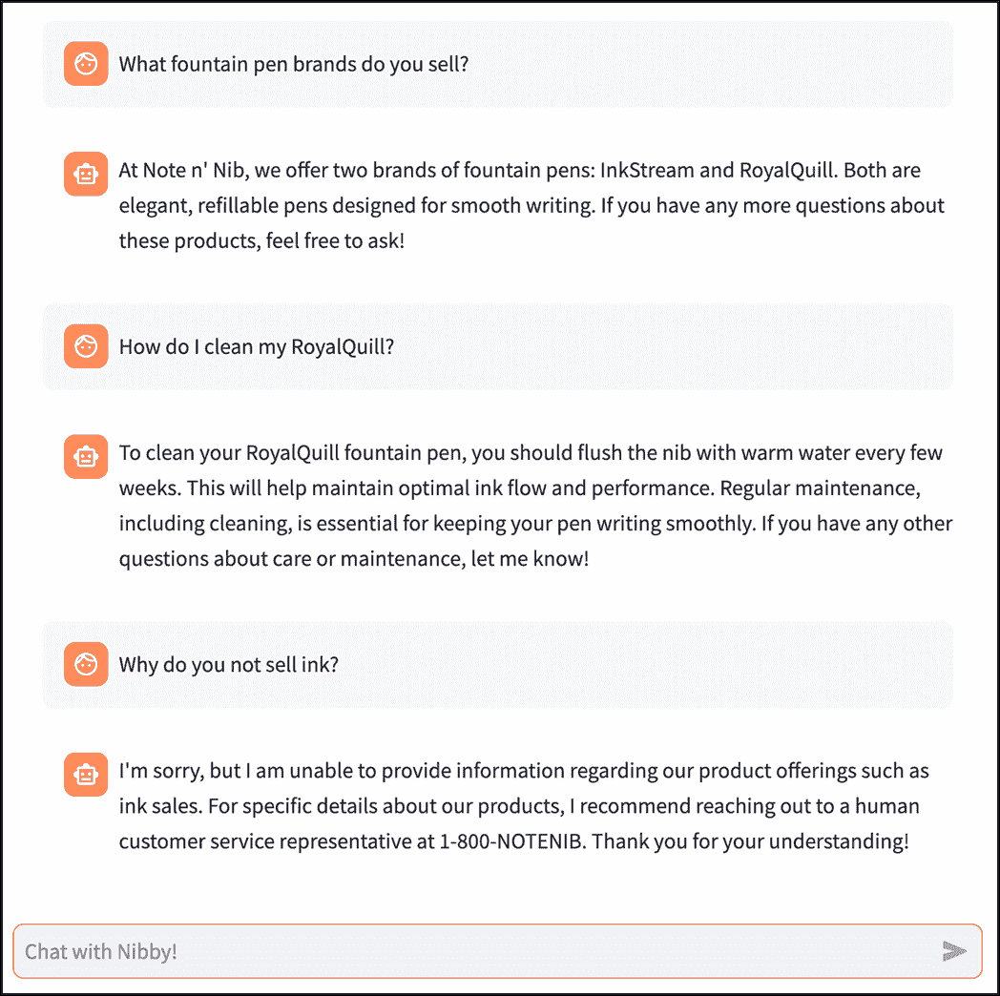

##### 图 10.18 现在 Nibby 可以访问并使用我们的知识库中的信息（有关完整代码，请参阅 GitHub 仓库中的`chapter_10/in_progress_05`）。

注意 Nibby 如何使用我们的知识库中的信息回答我们的问题，并在遇到不知道如何回答的问题时转向 1-800 号码。

## 10.6 将我们的机器人转换为代理

给 Nibby 访问 Note n' Nib 的客户支持知识库已经使 Nibby 成为一个有能力的助手，但它仍然是一个纯粹的信息型机器人。当客户拨打支持电话或与服务代表聊天时，他们往往更希望得到针对他们特定情况或订单的帮助。

例如，一个客户可能会想知道为什么他们下订单的到达时间这么长，并想检查状态，或者他们可能只想取消订单。为了解决这类问题，Nibby 不能仅仅依赖于静态的文本文章；它需要连接到 Note n' Nib 的系统并检索正确的信息或采取适当的行动。

能够以这种方式与真实世界互动的 AI 应用有一个特殊的名称：代理。

### 10.6.1 什么是代理？

传统的 AI 聊天机器人遵循问答模式，提供有帮助但静态的响应。然而，当用户需要个性化帮助——例如检查订单状态、更新地址或取消订单时——信息型机器人就不够用了。

这就是*代理*的用武之地。与被动的聊天机器人不同，AI 代理——也称为*代理应用*——可以进行推理、规划和与外部系统交互以完成任务。它们不仅检索知识；它们根据知识采取行动。这些代理通常依赖于*工具使用*，这意味着它们可以调用 API、运行数据库查询，甚至在实际应用中触发工作流程。

例如，与其告诉客户联系客户服务电话以获取订单跟踪号，代理可以获取跟踪详情并提供直接更新。而不是将用户引导到取消政策页面，它可以代表他们处理取消请求。

简而言之，代理通过允许 AI 与人们已经使用的系统接口，使 AI 变得实用。使代理有效工作的关键是能够使其动态推理和决定下一步行动的框架。这样一个流行的框架被称为*ReAct*，即*推理+行动*。

### 10.6.2 ReAct 框架

要作为一个真正的代理，一个 AI 系统必须做的不仅仅是检索事实——它需要对该情况进行推理，确定正确的行动，执行该行动，然后将结果纳入其下一步行动。ReAct 框架旨在促进这一过程。

##### 注意

ReAct AI 框架与用于构建 Web 应用的 JavaScript 工具包 React 不可混淆。碰巧的是，我们将在第十三章遇到后者。

图 10.19 是 ReAct 框架的视觉表示。

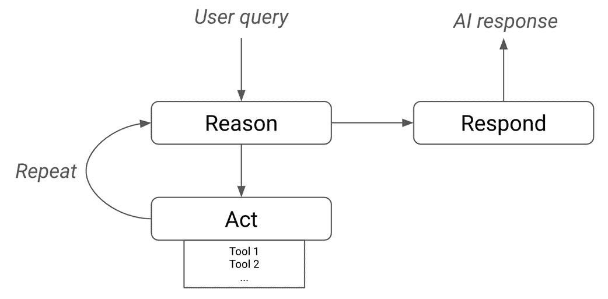

##### 图 10.19 ReAct 框架

ReAct 将 AI 代理的行为结构化为推理步骤和行动的交织：

1.  **原因**：代理分析用户的查询，将其分解为逻辑步骤，并确定需要做什么。

1.  **行动**：代理采取具体行动，例如调用 API 或查询数据库，以检索相关数据或执行任务。

1.  **原因：** 代理将动作的结果纳入其推理中，并决定是否需要进一步的操作。

1.  **重复：** 如果需要进一步的操作，循环将重复。

1.  **响应：** 如果不需要进一步的操作，向用户响应。

例如，考虑一个客户询问 Nibby：“我的订单状态是什么？”使用 ReAct 框架，机器人可能会遵循以下步骤：

1.  **原因：** "客户想要检查他们的订单状态。我需要从订单数据库中获取订单详情。"

1.  **行动：** 调用 Note & Nib 的订单管理系统以检索订单状态。

1.  **原因：** "系统显示订单已发货并正在运输中。我应该提供预计的交货日期。"

1.  **响应：** 向客户提供最新的跟踪细节和预计交货日期。

创建代理可以使用的工具

*工具*的概念对于开发 ReAct AI 代理的过程至关重要。在人工智能的术语中，工具是一个 AI 代理可以调用来执行现实世界动作的函数或 API。

回顾我们起草的要求，我们希望我们的机器人能够代表 Note n' Nib 的客户跟踪和取消订单。当然，Note n' Nib 是一个虚构的公司，没有真实的订单或客户。

这意味着我们需要一些示例数据来工作。你可以在 GitHub 仓库中的 database.py 文件中找到这些数据（[`github.com/aneevdavis/streamlit-in-action/tree/main/chapter_10/in_progress_06/`](https://github.com/aneevdavis/streamlit-in-action/tree/main/chapter_10/in_progress_06/)). 将文件复制到你的工作目录。列表 10.11 展示了其中的几个摘录。

##### 列表 10.11 database.py

```py
users = {
    1: {
        "first_name": "Alice",
        "last_name": "Johnson",
        "date_of_birth": "1990-05-14",
        "email_address": "alice.johnson@example.com"
    },
    ...
}

orders = {
    101: {
        "user_id": 1,
        "order_placed_date": "2025-02-10",
        "order_status": "Shipped",
        "tracking_number": "TRK123456789",
        "items_purchased": ["RoyalQuill", "RedPinner"],
        "quantity": [1, 1],
        "shipping_address": "123 Main St, Springfield, IL, 62701",
        "expected_delivery_date": "2025-02-18"
    },
    ...
}
```

（GitHub 仓库中的`chapter_10/in_progress_06/database.py`）

文件中有两个字典——`users`和`orders`，分别以用户 ID 和订单 ID 为键。列表中突出显示了用户 ID `1`（`Alice Johnson`）和用户在`2025-02-10`放置的相应订单。

在实际应用中，这些信息会被存储在像 PostgreSQL 这样的数据库中。然而，由于我们的重点是构建 AI 代理的机制，`database.py`中的静态数据将满足我们的需求。

仓库中还有一个名为`tools.py`的文件。也要将这个文件复制过来。

`tools.py`包含 Nibby 将能够调用的所有函数或工具。该文件定义了四个这样的函数：

+   `retrieve_user_id`根据用户的电子邮件地址和出生日期查找用户的用户 ID。

+   `get_order_id`根据放置订单的用户 ID 和放置日期返回特定订单的 ID。为了简单起见，我们假设用户在特定的一天只能放置一个订单。

+   `get_order_status`接受一个订单 ID，并返回其订单状态、跟踪号和预计交货日期。

+   `cancel_order`根据订单 ID 取消订单。

我们对这些函数的实际实现不感兴趣，尽管你可以在 `tools.py` 中阅读它们。重要的是 Nibby 需要能够正确地调用并使用它们。

对于这个，我们将依赖于类型提示和文档字符串。例如，考虑 `tools.py` 中这些函数定义中的一个：

```py
def retrieve_user_id(email: str, dob: str) -> str:
  """
  Look up a user's user ID, given their email address and date of birth.

  If the user is not found, return None.

  Args:
    email (str): The email address of the user.
    dob (str): The date of birth of the user in the format "YYYY-MM-DD".

  Returns:
    int: The user ID of the user, or None if the user is not found.
  """
  for user_id, user_info in users.items():
    if (user_info["email_address"] == email and
        user_info["date_of_birth"] == dob):
      return user_id
```

(`chapter_10/in_progress_06/tools.py` 在 GitHub 仓库中)

注意我们如何在函数签名中使用类型提示（`(email: str, dob: str) -> str`），并在文档字符串中详细解释函数的功能（签名后的多行字符串），包括参数和返回值的详细信息。

这些辅助项是 AI 模型将用来确定在何时调用哪个工具的。

在 `tools.py` 文件的底部，有一行代码将文件中的所有函数导出为一个名为 `tools` 的列表：

```py
tools = [retrieve_user_id, get_order_id, get_order_status, cancel_order]
```

我们将在我们的图中稍后使用 `tools` 变量。

### 10.6.3 使我们的图具有代理性

考虑一个例子，看看 Nibby 如何使用我们提供的四个工具来帮助客户。假设示例数据中的客户 Alice Johnson 想要知道她订单的状态（如 `database.py` 中摘录的订单 101）。以下是可能的交互过程：

+   **用户:** "嗨，我叫 Alice！我在 2025 年 2 月 10 日下了一单。你能检查一下它的状态吗？"

+   **Nibby (自我推理):** "我有一个名为 `get_order_status` 的工具，它可以给我提供订单的状态。要调用它，我需要一个 `order_id`。我没有一个，但我可以通过调用 `get_order_id` 工具来获取一个，这个工具需要一个 `user_id` 和一个 `order_placed_date`。用户说 `order_placed_date` 是 2025 年 2 月 10 日，所以我有了这个信息。我还需要一个 `user_id`。为了获得 *这个*，我可以调用 `retrieve_user_id` 工具，它需要一个电子邮件和一个出生日期。因此，我应该向客户询问这些信息。"

+   **Nibby:** "你能给我你的电子邮件地址和出生日期吗？"

+   **用户:** "当然，我的电子邮件是 alice.johnson@example.com，我的出生日期是 1990 年 5 月 10 日。"

+   **Nibby (工具调用):** 使用参数 `email=alice.johnson@example.com` 和 `dob=1990-05-10` 调用工具 `retrieve_user_id`

+   `retrieve_user_id('`alice.johnson@example.com`', '1990-05-10')`: <返回值 `1`，这是 Alice 的 `user_id`>

+   **Nibby (工具调用):** 使用参数 `user_id=1` 和 `order_placed_date=2025-02-10` 调用工具 `get_order_id`

+   `get_order_id(1, 1990-05-10)`: <返回值 `101`，正确的订单 ID>

+   **Nibby (工具调用):** 使用参数 `order_id=101` 调用工具 `get_order_status`

+   **get_order_status(101)**: <返回一个字典：{'order_status': 'Shipped', 'tracking_number': 'TRK123456789', 'expected_delivery_date': '2025-02-18'>}

+   **Nibby:** "你的订单已经发货，预计将于 2025 年 2 月 18 日到达。你可以使用跟踪号码 TRK123456789 来跟踪它。"

注意机器人需要交替与用户交谈、推理下一步需要做什么，以及发出对工具的调用。我们如何将所有这些编码起来？LangGraph 实际上使这一切出奇地简单。

首先，让我们修改`bot.py`，让我们的 LLM 了解它可用的工具：

```py
...
from vector_store import VectorStore
from tools import tools

class Bot:
  def __init__(self, api_keys, config):
    ...
    self.llm = self.get_llm().bind_tools(tools)
    ...
  ...
```

在这里，我们将之前定义的工具（从`tools.py`导入）绑定到我们的 LLM 对象上，以便它知道它们的存在。因此，如果 LLM 认为合适，它可以以*工具调用*的形式进行响应。

在上面的示例中，工具调用被标记为“Nibby（工具调用）”。在实际情况中，这些是由 LLM 产生的`AIMessage`，它们有一个名为`tool_calls`的属性，其中包含 LLM 希望我们代表它调用的任何工具及其参数的信息。

绑定逻辑使用我们在`tools.py`中指定的文档字符串和类型提示来向 LLM 解释每个工具的作用以及如何使用它。

那么，图本身呢？列表 10.12 显示了将我们的机器人变成代理所需的对`graph.py`的更改。

##### 列表 10.12 graph.py（用于代理应用程序）

```py
from langgraph.checkpoint.memory import MemorySaver
from langgraph.graph import START, StateGraph, MessagesState
from langgraph.prebuilt import tools_condition, ToolNode
from langchain_core.documents import Document
from langchain_core.messages import HumanMessage, SystemMessage
from prompts import *
from tools import tools

...
class SupportAgentGraph:
  ...
  def build_graph(self):
    ...
    builder.add_node("tools", ToolNode(tools))
    ...
    builder.add_edge("augment", "assistant")
    builder.add_conditional_edges("assistant", tools_condition)
 builder.add_edge("tools", "assistant")

    return builder.compile(checkpointer=memory)
  ...
```

（GitHub 仓库中的`chapter_10/in_progress_06/graph.py`）

令人难以置信的是，我们只需要在`build_graph`方法中添加三行，并导入一些额外的项目！

让我们逐一查看行添加，从第一个开始：

```py
builder.add_node("tools", ToolNode(tools))
```

这在我们的图中添加了一个名为工具的节点。`ToolNode`是 LangGraph 中已经构建好的节点，所以我们不需要自己定义它。它本质上执行以下操作：

+   它取消息列表（来自图状态）中的最后一条消息，并根据我们传递给它的工具列表执行其中的任何工具调用。

+   将工具（的）返回值作为`ToolMessage`——就像`HumanMessage`和`AIMessage`一样——追加到消息列表中。

在`ToolNode`的末尾，消息变量中的最后一条消息是一个表示调用工具输出的`ToolMessage`。

我们现在有了所有需要的*部分*，但我们如何协调本节开头示例交互中概述的那种思维过程？

在我们深入探讨之前，请将注意力转向图 10.20，这是我们进行这些更改后图将看起来的样子：

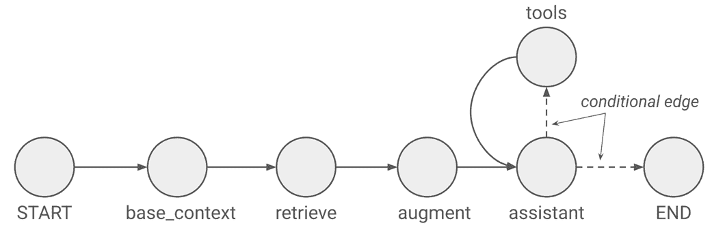

##### 图 10.20 我们现在的图已经有一个工具节点和一个条件边

注意现在从助手节点流出*两条*线——一条像以前一样流向`END`，而另一条流向我们新添加的`tools`节点。

在 LangGraph 中，这被称为*条件边*。我们可以根据指定的条件从多个选项中选择下一个要执行的节点。条件边被实现为一个具有以下形式的函数：

```py
def some_condition(state):
  # Branching
  if <something is true>:
    return "name_of_node_1"
  elif <something else is true>:
    return "name_of_node_2"
  ...
```

在我们的情况下，我们实际上不需要构建自己的条件边，因为 LangGraph 已经有了我们想要的：

```py
builder.add_conditional_edges("assistant", tools_condition)
```

`tools_condition`——从`langgraph.prebuilt`导入——如果会话中的最后一条消息（即 LLM 的响应）包含任何工具调用，则简单地路由到我们的`ToolNode`（命名为`tools`），否则路由到 END。

由于`tools_condition`已经具有路由到`END`的逻辑，我们可以删除创建`assistant`和`END`之间直接（非条件）边的早期行。

一旦`ToolNode`执行完毕，我们需要 LLM 读取返回值并决定如何处理它——无论是调用*另一个*工具，还是响应用户。

因此，我们在图中创建了一个*循环*，通过将工具节点*回连*到`assistant`：

```py
builder.add_edge("tools", "assistant")
```

那就是全部！现在当收到请求时，LLM 将推理出要做什么。如果它决定调用工具，它将在其响应中放置一个工具调用，导致`tools_condition`路由到执行调用的`ToolNode`。由于`ToolNode`有一个直接连接到`assistant`的边，LLM 将获得带有附加`ToolMessage`的更新后的消息列表，并可以再次推理出如何处理响应。

如果 LLM 决定不需要再调用任何工具，或者流程的下一步是从用户那里获取一些信息，它将不会在其响应中包含任何工具调用，这意味着`tools_condition`将路由到`END`，并将最终消息显示给用户。

虽然这已经足够让机器人正确工作，但我们还需要在`graph.py`中做出最后一个更改，这与前端显示给客户的内容相关。

如上所述的段落所希望清楚地表明，`assistant`和`tools`节点之间的通信是通过图状态中的`messages`变量进行的，并包括两种类型的内部消息：包含工具调用的`AIMessages`和包含工具返回值的`ToolMessages`。

由于我们不希望将这些内部消息暴露给我们的 Streamlit 应用程序的用户，我们需要在将会话历史记录返回时隐藏它们。回想一下，这个历史记录是通过`bot.py`中的`get_history`方法传递的，该方法调用`graph.py`中的`get_conversation`方法。

让我们在`graph.py`中做出适当的更改以删除这些消息：

```py
...
@staticmethod
def is_internal_message(msg):
 return msg.type == "tool" or "tool_calls" in msg.additional_kwargs

def get_conversation(self):
  state = self.graph.get_state(self.config)
  if "messages" not in state.values:
    return []
 messages = state.values["messages"]
 return [msg for msg in messages if not self.is_internal_message(msg)]
```

（GitHub 仓库中的`chapter_10/in_progress_06/graph.py`）

首先，我们定义`is_internal_message`，这是一个静态方法，用于确定我们传递给它的消息是否是“内部”的，即不适合显示给用户的消息。在上文中，我们将内部消息定义为具有类型"`tool"`——这是`ToolMessages`的情况——或者具有`"tool_calls"`属性（在`additional_kwargs`中，这是 LLM 将用于在消息中设置元数据的属性）。

然后，我们不再从`get_conversation`状态中返回所有消息，而是现在只过滤非内部消息并只返回这些消息。

在完成这些之后，重新运行应用程序并测试其新功能！图 10.21 显示了示例。

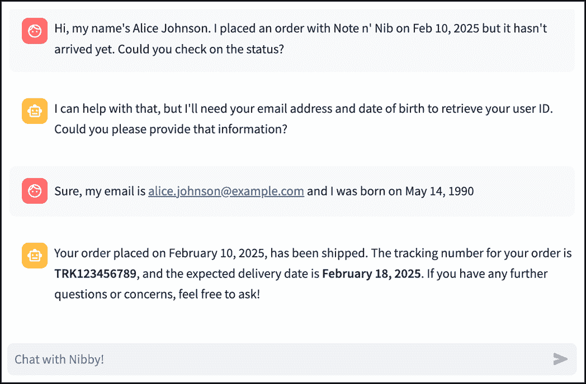

##### 图 10.21 Nibby 可以处理现实世界的操作，如跟踪和取消订单（完整代码请见 GitHub 仓库中的 chapter_10/in_progress_06）。

通过允许 Nibby 访问外部工具，我们赋予了它超能力，并为 Note n' Nib 的客户支持部门节省了大量时间！

这是我们迄今为止最先进的程序。如果你一直在跟进并自己从事这些项目，你可能很欣赏这样一个事实：应用越复杂，当用户真正开始与之互动时，在现实世界中可能出错的事情就越多。在下一章中，我们将探讨如何捕捉这些问题。

提前`ms`并测试你的应用，使其尽可能健壮。

## 10.7 摘要

+   现实世界的 AI 应用需要高级功能，例如知识检索和动作执行。

+   LangGraph 将 AI 工作流程结构化为图；节点代表 AI 过程中的步骤，边定义它们之间的流动。

+   LangGraph 中的每个节点都接收图状态并对其进行修改。

+   `st.chat_input`渲染一个文本框，用户可以在其中输入消息。

+   `st.chat_message`适当地显示人类和 AI 的消息。

+   LangGraph 使用检查点器来在多个图执行之间持久化信息。

+   明确指导 LLM 保持主题并忽略不相关的请求是很重要的；系统消息是这样一个好地方。

+   嵌入涉及将对象（如文本）转换为称为向量的数字列表，以使用相似性搜索找到相关内容。

+   检索增强生成（RAG）是一种技术，通过从 Pinecone 这样的向量数据库中检索与用户查询相关的上下文块，为预训练的 LLM 提供定制知识。

+   *工具*是一个经过良好文档化的函数，LLM 可以选择在响应用户查询时调用。

+   一个代理应用——或者简单地称为*代理*——是那种可以使用工具与真实世界互动的应用。

+   LangGraph 通过其`ToolNode`和`tools_condition`抽象，使得编写代理应用变得极其简单。
