# 第二章：2 编码地理信息

### 本章涵盖

+   如何使用以结果为导向的方法来解决实际问题

+   在不确定的情况下做出分析决策

现在你已经了解了以结果为导向的方法，让我们将其应用于一个真实的数据科学任务。我们将解决一个现实世界的问题，并应用以结果为导向的方法。这是一个处理其他项目和未来遇到的任何其他项目的模板。

所有项目和数据都可在[`davidasboth.com/book-code`](https://davidasboth.com/book-code)找到，供你尝试。在那里，你可以找到项目所需的数据集以及章节中展示的相同示例解决方案，以 Jupyter 笔记本的形式呈现。

##### 关于 Jupyter 笔记本的注意事项

Jupyter 是一个允许以笔记本形式混合代码和相关文本的开发环境。笔记本文件允许你在文档中直接阅读文本并运行代码。它们在教育和数据分析中很受欢迎。

伴随本书的笔记本收集了每一章的代码片段，并将其整合成一个可运行的单一文档。例如，GitHub 这样的网站甚至允许你在浏览器中查看笔记本，无需安装 Jupyter。请参阅附录，了解如何安装 Python 以运行代码。

对于本章的项目，让我们考察分析师遇到的一个示例任务，乍一看可能足够简单——编码地理信息。

## 2.1 项目 1：识别客户地理信息

让我们看看我们将从中提取位置信息的项目，以更好地了解我们的客户基础。作为 ProWidget Systems（一家位于英国的 B2B（企业对企业）零售商）的分析师，你被要求报告伦敦客户的支出量与英国其他地区的客户相比。董事会提供了一份包含所有客户地址及其迄今为止总支出的高级数据摘要。他们想知道

+   哪些英国城市目前服务不足

+   他们的客户是否主要是伦敦基地

如果这是一个经过净化的教程，你的数据可能有一个名为`city`的列，你的任务将更多关于按城市分组数据并使用适当的指标进行总结所需的技术步骤。也许你会从所有伦敦客户的总支出中提取数据，并将其与其他英国主要城市或所有`city`列不是伦敦的数据进行比较。也许你会选择显示分布，以获得更详细的差异图。无论如何，你的选择更多关于获取答案所需的具体*技术*步骤。

将此与作为真实业务中的分析师回答相同问题进行比较。例如，在这个项目中，可用的数据组织得不够整洁，以至于没有`城市`列：我们只有一个包含客户地址的`客户`列，该地址可能包含也可能不包含城市信息。这个项目的地址数据来自英国政府商业和贸易部赞助的执行机构公司注册处。我修改了原始的公开数据，用于这个练习，可在[`mng.bz/mGxr`](https://mng.bz/mGxr)找到。

在进行任何分析之前，我们需要决定如何识别一个地址与哪个城市相关。我们将遵循第一章中概述的结果导向过程来完成这项工作，并为我们的利益相关者获得一个答案。

##### 真实业务案例：利用地址数据寻找新线索

作为一名数据科学家，我构建的一个数据驱动工具是我们所有客户的地图与所有可能成为潜在客户的英国相关行业的公司名单的结合。销售团队使用这张地图在访问现有客户时识别当地地区的潜在客户。

该项目涉及将我们自己的客户数据与政府官方的公司公开名单相结合，大部分工作是对两个列表中的地址数据进行清理，以便进行比较，这也是本章的主题。

### 2.1.1 数据字典

理解数据集中有什么的第一步是阅读数据字典，或者如果未提供，则请求一个。你最终可能需要自己编写一个。现实世界与本书项目的一个区别是，我提供了详细的数据字典。不要习惯它！表 2.1 显示了提供数据的数据字典，图 2.1 显示了数据的前几行的快照。

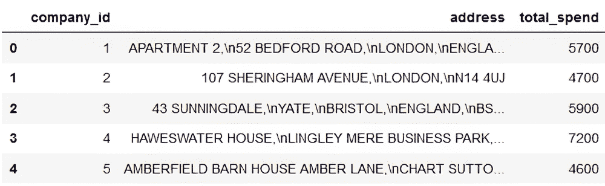

##### 图 2.1 客户地址数据的前几行的快照

##### 表 2.1 客户地址数据集的数据字典

| 列 | 定义 |
| --- | --- |
| `company_id`  | 数据集中每个客户公司的唯一标识符  |
| `address`  | 存储客户地址的单个字段  |
| `total_spend`  | 到目前为止，这位客户花费的总金额（以英镑计）  |

现在我们已经明确了问题陈述并看到了可用的数据，是时候开始我们的以结果为导向的过程，以找到解决方案。

## 2.2 一个示例解决方案：寻找伦敦

在本节中，我将深入一个示例解决方案，重点关注结果驱动方法的步骤以及解决问题的细节。在继续之前，你可能希望尝试这个问题，或者使用本章来了解其余项目的结构。至于我提供的多数解决方案，代码本身将用 Python 编写，主要使用`pandas`库。虽然将使用代码片段来解释示例解决方案，但我将重点讨论概念解决方案，而不是代码的具体细节。解决方案将分为三个部分：设置问题和数据，创建解决方案的第一迭代，以及审查工作并决定下一步。

### 2.2.1 为成功做好准备


第一步是确保我们理解了问题。在这种情况下，我们知道我们需要使用我们的客户地址数据来计算英国的总支出，并找出伦敦客户与该国其他地区相比的答案。如果我们遇到多个指标，例如客户进行的交易数量或他们作为客户的时长，我们需要与我们的利益相关者澄清问题的目的，以便我们知道应该关注哪些指标。

在这种情况下，提供的数据不包含这种歧义；很明显，我们关注的是两个预定义地理区域的支出模式。然而，如果我们的利益相关者询问我们哪些地区普遍服务不足，我们也会寻求了解是否应该查看城市层面的数据或不同粒度的数据。


任何分析中的关键步骤是考虑我们将走向何方。最小可行答案将采取什么形式？在这个例子中，我们的利益相关者有两个问题：

+   *不同城市是否服务不足？* 这需要我们按城市计算总客户支出，并找出客户支出最低的城市。

+   *伦敦与其他英国地区相比如何？* 这可以从第一个答案的输出中得到回答。

为了存在一个最小可行答案，我们需要在我们的数据中添加一个`城市`列，我们将从地址中提取它。这将使我们能够按城市细分支出，这意味着我们可以将伦敦的行与表格中的其余部分进行比较。至于最终输出，表格或条形图对于这两种情况都足够了。这看起来可能很明显，但了解我们输出的确切格式将引导我们找到相关的解决方案，即包含每个城市一行及其相关总支出金额的表格。

*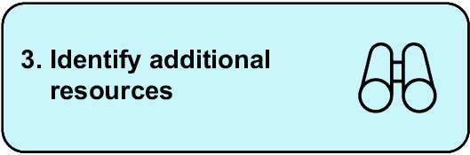

为了解决任何分析问题，我们需要知道回答该问题需要哪些数据。为了获得城市级别的客户数据，我们需要知道每个客户属于哪个城市的数据。这要求每个客户记录都有一个`城市`列，或者至少有一些地址数据。我们知道在这种情况下，已经提供了地址字段，所以我们有足够的数据尝试解决这个问题，即使我们不确定在这个阶段是否可以得到令人满意的答案。在这个步骤中，我们还决定可能需要的额外数据源。在这种情况下，可能需要提高我们地址数据的准确性。我们的第一次迭代通常应该专注于我们已有的数据，而额外的数据源可以在未来的迭代中考虑。


获取数据的步骤不应被低估。整个数据科学项目可能因为数据科学团队从未收到任何可用的数据来分析而失败。获取数据的障碍不是技术性的，而是组织性的，这是我们不会在现实世界中模拟的一个方面。在整个项目中，你不需要自己寻找任何数据；它将被提供。它可能不会总是容易清理，但你不会花时间去给组织中的某个人发邮件，希望他们的善意能发送给你数据提取！

### 2.2.2 创建解决方案的第一迭代


到目前为止，我们已经建立了问题陈述并获得了所有必要的数据。现在是时候在提取每个地址的城市成分和按城市汇总客户消费数据之前探索数据集了。让我们先导入必要的库并读取数据：

```py
import pandas as pd
customers = pd.read_csv("./data/addresses.csv")
print(customers.shape)
```

输出是 `(100000, 3)`，这意味着我们总共有 100,000 行数据，以及我们在数据字典中看到的三列。在提取任何城市数据之前，我们应该检查缺失值。

#### 调查缺失值

根据你选择的工具，尝试从空地址中提取数据可能会产生错误。以下代码片段的输出显示在图 2.2 中：

```py
customers.isnull().sum()
```

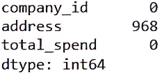

##### 图 2.2 展示每列缺失值的数量

我们可以看到有 968 个缺失的地址，这大约是行总数的 1%。由于我们无法仅从提供的数据中知道那些缺失客户的地址，我们可以安全地删除这些行：

```py
customers = customers.dropna(subset=["address"])
```

可以接受的行缺失百分比将取决于上下文，但由于缺失关键信息而丢失 1%是可以接受的。如果我们有 10%的客户地址缺失，我们可能想调查一下原因。

然而，这是一个分析可能分叉的点。缺失的地址数据可以保留并简单地分类为“其他”，或者如果我们有更多与客户相关的数据，我们可能选择花时间在其他地方查找客户的地址，以获得更完整的数据集。

在分析中，有许多地方没有明确的正确决策，只有基于不同假设的不同决策。正因为如此，你的分析将在多个地方与我分叉。图 2.3 通过图表展示了可能的路径分支，我将大量使用这个图表来重申这一点。

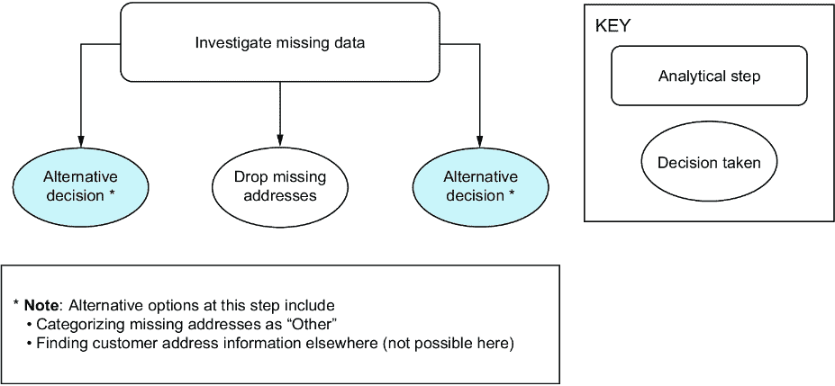

##### 图 2.3 分析的第一步及其替代路径的可视化

形状有两种类型：步骤和决策。步骤代表在分析中需要执行的顺序任务。这些步骤来自原始行动计划，但也可能受到我们在数据中发现的信息的影响。决策代表分析可能因假设和选择而分叉的地方。你的分析不一定包含与我相同的步骤或决策。

当我们在探索我们的列时，我们还应该检查我们的`total_spend`列是否包含任何奇怪值，例如负值。以下代码片段的输出显示在图 2.4 中：

```py
customers["total_spend"].describe()
```

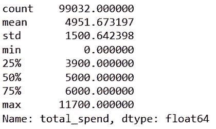

##### 图 2.4 `total_spend`列的汇总统计

如上图所示，数值范围从 0 到略低于 12,000 英镑，没有负值。现在我们已经看到了我们的数据，我们需要决定一个方法来提取有关城市的信息。让我们回顾一下我们的两个利益相关者问题：“不同的城市是否被服务不足？”以及“伦敦与其他英国地区相比如何？”第二个问题是第一个问题的子集。也就是说，一旦你有了按城市划分的客户消费数据集，比较伦敦与其他城市就很容易了。解决一个问题意味着解决另一个问题，所以如果我们首先专注于识别伦敦的地址，我们就可以找到地址表示的细微差别和边缘情况。

#### 从地址中提取城市列

在决定方法之前，我们应该查看一些样本地址。以下代码打印出前五个地址，其输出显示在图 2.5 中：

```py
for address in customers["address"].head():
    print(address, "\n")
```

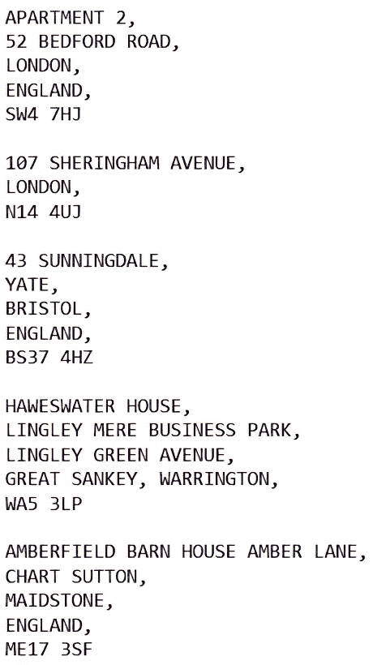

##### 图 2.5 五个样本地址

我们已经可以注意到一些模式，以及一些潜在的陷阱。从我们的有限样本来看，地址似乎以邮编结束，但有时伦敦地址包含一行英格兰，有时则不包含。这意味着我们不能依赖于查看地址的特定行来给我们城市的信息，这是有用的信息。

那么，寻找字符串“London”来识别伦敦的客户怎么样？这会足够吗？可能不会。首先，你可能会包括住在其他城镇的“London Road”上的人。检查数据，我们可以看到地址行由逗号和换行符分隔，因此寻找 `"LONDON,"` 可以缓解这个特定问题。注意搜索字符串中的额外逗号。我们的规则可以简单地是以下这样：如果一个地址的某一行是“London”，那么这个地址就是伦敦的地址。在我们的样本中，所有地址都是大写，但我们不应假设所有 100,000 行都会是这样，因此我们应该确保它们都是大写的。为了比较我们的清洗后的地址数据与原始数据，我们将创建一个新列来存储清洗后的版本。通常，将数据保留在原始形式以便需要时参考是一个好主意：

```py
customers["address_clean"] = customers["address"].str.upper()
```

现在我们已经确保了大小写的一致性，我们可以调查寻找 `"LONDON"` 和 `"LONDON,"` 之间的差异：

```py
len(customers[customers["address_clean"].str.contains("LONDON")])
len(customers[customers["address_clean"].str.contains("LONDON,")])
```

这些代码行的输出分别是 `21,768` 和 `20,831`，这意味着当我们添加逗号时，将近 1,000 行不再被选中。这些是包含单词“London”的地址，但我们假设实际上它们并不在伦敦市（例如，位于伦敦路的地址）。我们已经从我们的样本地址中看到，我们不能依赖于行的位置来决定城市成分的位置。然而，地址结构可能只有有限的数量。让我们看看有多少地址由多少行组成。此代码的输出如图 2.6 所示：

```py
customers["address_lines"] = (
    customers["address_clean"]
    .str.split(",\n")                     #1
    .apply(len)                       #2
)
customers["address_lines"].value_counts().sort_index()    #3
```

#1 将地址拆分为子字符串列表（即分离行）

#2 计算每个列表的长度（即地址中的行数）

#3 现在计算由多少行组成的地址数量

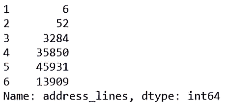

##### 图 2.6 地址长度的分布

我们可以观察到，一些地址只有一行或两行，而一些地址多达六行。理论上，如果每三行、四行、五行等地址都是一致的，我们就可以制定一个规则，从每个地址中提取城市的方式略有不同。我们还应该检查一些这些较短的地址，看看它们是什么样子。此代码的输出分别如图 2.7 和 2.8 所示：

```py
print(customers.loc[customers["address_lines"] == 1, "address_clean"])
print((
    customers[customers["address_lines"] == 2]
    .sample(5, random_state=42)                  #1
    ["address_clean"])
)
```

#1 查看只有两行地址的五个随机行。random_state 参数确保我们每次都能得到相同的结果，以保证可重复性。

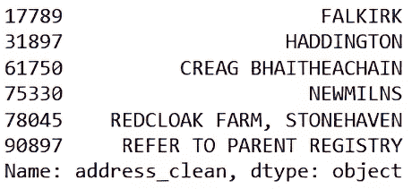

##### 图 2.7 我们数据中所有的单行地址

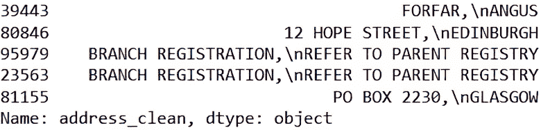

##### 图 2.8 两行地址数据的五个样本行

这些图显示了数据的可变性。有些行只是一个城市，福尔柯克；有些行完全缺失地址，指引我们到一个父注册处；我们还有邮政信箱地址。我们不太可能仅基于地址行中的位置制定出提取城市的规则，而不编写大量的定制代码。

让我们再次提醒自己我们的目标：我们的直接任务是创建一个 `城市` 列，我们现在必须决定如何进行。一个选项是采用我们的伦敦查找示例，并通过在 `地址` 列中显式查找城市名称来扩展它。这需要一份英国城市的综合列表，这并不是一个不可能的任务。这样的列表是存在的——例如，[`mng.bz/5gKB`](https://mng.bz/5gKB) 上的列表是由英国政府提供的。在这种情况下，我们仍然需要决定如何处理位于这些城市之外地址的情况。我们是否简单地将其标记为“其他”？对于第一次迭代，这可能足够了，因为问题特别询问的是城市，而不是镇或村庄。

另一个选项是使用每个地址的邮政编码部分，并在国家邮政编码数据库中进行查找，我们必须获取并确保我们有权限使用它。这可能是一种更准确的方法，但需要额外的工作，例如首先识别每个地址的邮政编码部分。

通常，在我们的第一次迭代中，我们应该尽量减少工作量，因此我们将尝试使用英国政府提供的英国城市列表。网页包含每个英国国家的城市列表，其中一部分如图 2.9 所示。

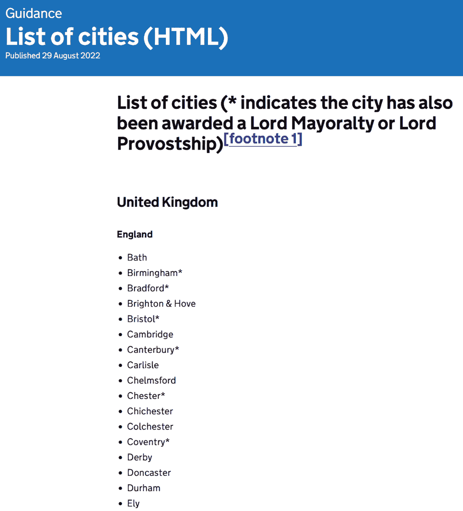

##### 图 2.9 英国政府网页上列出的所有英国城市摘录

有多种方法将这些信息提取成代码友好的格式。最简单的一种是将网站上的项目符号直接复制粘贴到 Excel 中，这样每个城市就单独占一行，然后我们可以在代码中导入并清理这些数据。最快的选项并不总是编写代码！然而，为了确保完全可重复性，你可能希望自动化这一步骤。由于我们预计英国城市的列表不会经常变化，手动获取这些数据在这里是合适的。这些原始数据作为单独的文件提供，文件名为 `cities.csv`。这些数据的前几行如图 2.10 所示：

```py
cities = pd.read_csv("./data/cities.csv", header=None, names=["city"])
cities.head()
```

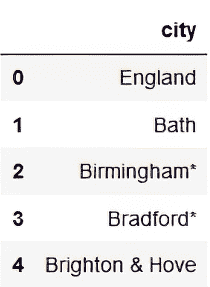

##### 图 2.10 城市数据的前几行

在使用它作为城镇的最终列表之前，显然需要清理一些数据。首先，国家标题被包含在数据中的行中，所以需要移除值`England`、`Scotland`、`Wales`和`Northern Ireland`。然后，需要修剪尾随的星号`*`字符，剩余的城镇名应该大写以匹配我们的地址数据。图 2.11 显示了我们的最终、清洗后的城镇列表样本：

```py
countries_to_remove = ["England", "Scotland", "Wales", "Northern Ireland"]

print(len(cities))
cities_to_remove = cities[cities["city"].isin(countries_to_remove)].index
cities = cities.drop(index=cities_to_remove)
print(len(cities))

cities["city"] = cities["city"].str.replace("*", "", regex=False)

cities["city"] = cities["city"].str.upper()
cities.head()
```

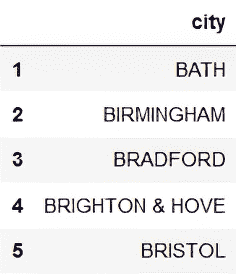

##### 图 2.11 我们清洗后的、确定的城镇列表样本

现在我们有了确定的城镇列表，我们可以用它来创建`city`列。图 2.12 显示了我们所做的工作以及我们最近步骤中的替代方案。

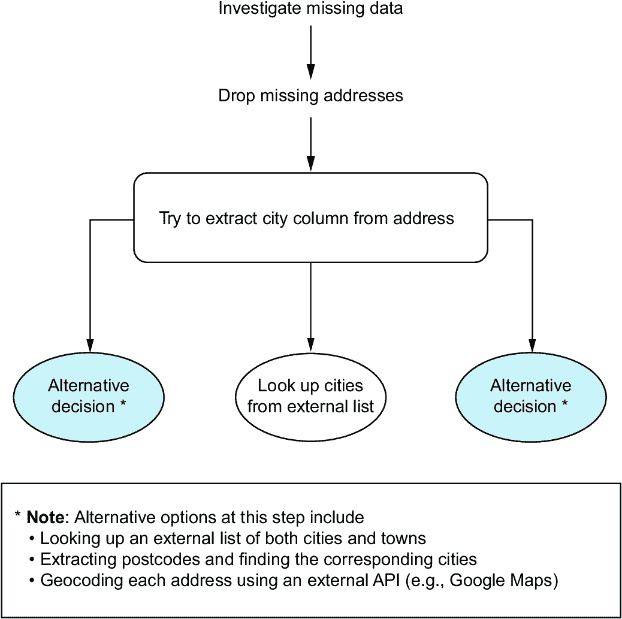

##### 图 2.12 分析到目前为止的两个主要步骤后的分析图

#### 创建城镇列

如果在地址中找到某个城市名和额外的逗号，我们可以使用我们的城镇列表来标记一个特定城市的地址。以图 2.11 为例，我们将假设包含子字符串“`BATH,`”的地址是巴斯市的地址，因此`city`列中的值将是“`BATH`”。任何新创建的`city`列没有值，地址中没有找到任何城市名的地方，将被归类为“`OTHER`”。以下代码实现了这一点，图 2.13 显示了我们数据的最新状态：

```py
for city in cities["city"].values:
    customers.loc[customers["address_clean"].str.contains(f"\n{city},"),
↪ "city"] = city

customers["city"] = customers["city"].fillna("OTHER")

customers.head()
```

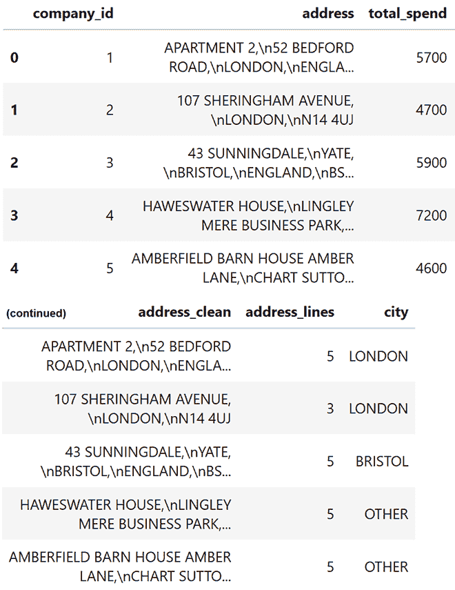

##### 图 2.13 带有新添加的`city`列的数据摘录

现在我们有了新的`city`列，我们需要探索它，看看我们的客户在哪些城市，以及根据他们的地址，我们无法将多少客户分配到城市的比例。

#### 探索新的城镇列

根据图 2.13，看起来我们已经正确地将前五行中的伦敦和布里斯托尔地址归类，并将其余的归入“其他”类别。现在我们可以通过计算每个城市中出现的客户数量来进行我们的第一次分析，根据我们的分类。让我们看看图 2.14 中显示的前 20 个：

```py
customers["city"].value_counts().head(20)
```

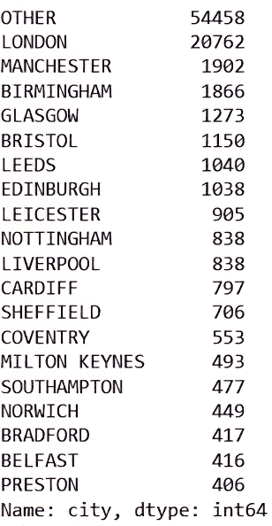

##### 图 2.14 按客户数量排名前 20 的城市

我们的数据中超过一半属于“其他”类别，这意味着我们的一半客户群是在大城市之外建立的。这是一个需要向我们的利益相关者传达的重要见解。让我们看看这个类别中的一些地址，如图 2.15 所示：

```py
sample_other = customers[customers["city"] == "OTHER"]
↪ .sample(5, random_state=42)
for address in sample_other["address_clean"].values:
    print(address, "\n")
```

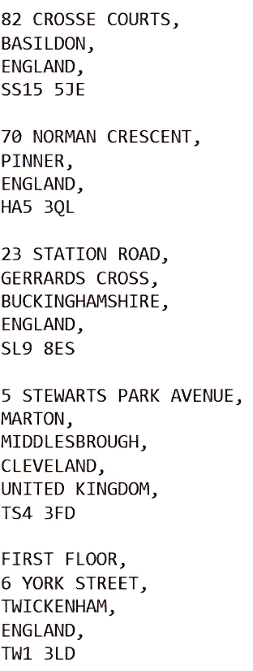

##### 图 2.15 被归类为“其他”的城镇的地址样本

其中一些地址与城镇相关，但在特威肯汉姆有一个地址，它是伦敦的一个郊区。虽然这个地址没有包含“伦敦”这个词，但这位客户应该被归类为伦敦本地。我们已经开始看到我们选择的方法的一些不足之处。在这个阶段，我们将它们记下来，并可能在未来的迭代中解决它们。

注意：除非你了解英国地理，否则你可能错过这些没有“London”一词的伦敦地址实例。这突出了领域知识对分析师的重要性以及为什么你应该与领域专家密切合作。

此时的一个合理性检查是查看政府数据和我们的标记地址数据中有多少独特的城市。根据业务，我们可能假设我们在每个主要英国城市至少有一个客户，我们可以验证这一点。Python 的一个技巧是创建政府城市列表和我们的新`city`列中独特城市列表的唯一集合，并从其中一个集合中减去另一个。这将给出两个列表之间的差异，即出现在政府列表中但不在我们的地址数据中的城市：

```py
set(cities["city"]) - set(customers["city"])     #1
```

#1 在 Python 中，减去集合意味着找出一个列表中不在另一个列表中的项目。

此代码的输出是字符串`{'KINGSTON-UPON-HULL'}`，这告诉我们城市 Kingston-upon-Hull 不在我们的客户地址数据的`city`列中。这可能意味着我们那里没有客户，考虑到其人口只有大约 25 万，这是可能的，或者还有其他情况。该城市通常简称为“Hull”，这又是一个将特定领域知识应用于问题的例子，因此让我们在我们的地址数据中查找它：

```py
customers[customers["address_clean"].str.contains("\nHULL,")]
```

此代码的输出告诉我们有 284 条相关记录。我们可以手动更新我们的`city`列以解决这个问题：

```py
customers.loc[customers["address_clean"].str.contains("\nHULL,"),
↪ "city"] = "HULL"
```

让我们再次回顾到目前为止的分析。我们已完成的工作和替代步骤如图 2.16 所示。

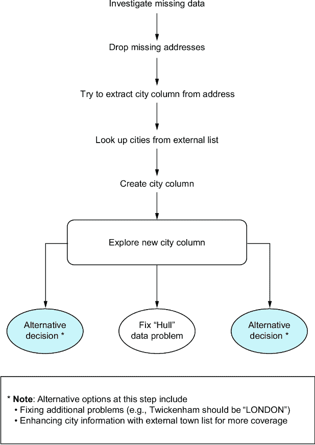

##### 图 2.16 我们分析目前的进度

现在我们可以查看使用新创建的`city`列的城市消费数据了。

#### 分析按城市消费

严谨的工作是将数据整理成正确的格式；分析本身只是一个简单的分组和汇总。输出图表如图 2.17 所示：

```py
from matplotlib.ticker import FuncFormatter
import matplotlib.pyplot as plt

def millions(x, pos):                #1
    return '£%1.1fM' % (x * 1e-6)

formatter = FuncFormatter(millions)

fig, axis = plt.subplots()

top_20_spend = (
    customers
    .groupby("city")
    ["total_spend"].sum()
    .sort_values(ascending=False)      #2
    .head(20)
    .sort_values(ascending=True)      #3
)

top_20_spend.plot.barh(ax=axis)

axis.xaxis.set_major_formatter(formatter)
axis.set(
    title="Total customer spend by city",
    xlabel="Total spend"
)

plt.show()
```

#1 定义一个函数以显示百万为单位的数据

#2 按总消费额降序排序以获取前 20 位最高消费者（分析所需）

#3 现在按相反方向排序，使我们的水平条形图顶部显示最高数字（Python 绘图所需）


##### 图 2.17 各城市总消费额

很明显，“其他”类别占主导地位。正如我们之前看到的，我们的客户同样可能在主要城市之外。这部分是由于英国对城市的定义。只有 76 个被官方称为“城市”，但有许多人口众多的“镇”。城镇与城市之间的这种区别部分解释了为什么“其他”类别如此之大。

另一个观察结果是，伦敦确实在客户消费和客户数量方面都是最高的城市。在消费方面排名第二和第三的城市，曼彻斯特和伯明翰，也是人口最多的城市。在这张图表和图 2.14 中我们的客户量计算中，顶级城市通常与人口最多的城市相对应。利兹可能低于你根据其人口预期的水平，但没有任何理由说客户消费数字应该与人口完美相关。

我们最后的调查是对伦敦与其他英国地区的比较。我们可以将其理解为“除了伦敦以外的所有英国”或“除了伦敦以外的所有主要城市”。我们应该计算这两个数字并决定如何报告我们的发现：

```py
print("Total spend for all customers:")
print(customers["total_spend"].sum())

print("Total spend for London customers:")
print(customers.loc[customers["city"] == "LONDON", "total_spend"].sum())

print("Total spend outside London:")
print(customers.loc[customers["city"] != "LONDON", "total_spend"].sum())

print("Total spend outside London (excluding OTHER):")
print(customers.loc[customers["city"].isin(["LONDON", "OTHER"]) == False,
↪ "total_spend"].sum())
```

这段代码的输出告诉我们，我们客户的总消费为 4.9 亿英镑。这分解为伦敦客户的 1.03 亿英镑和英国其他地区的 3.87 亿英镑。如果我们看伦敦以外的所有主要城市，总数为 1.19 亿英镑。也就是说，如果我们将伦敦与其他城市比较，我们可以看到我们的伦敦客户产生的收入几乎与其他所有主要城市之和相当。确实看起来我们的客户基础是以伦敦为中心的。

这为我们提供了最小可行答案，但我们还没有完全回答某些城市是否被忽视的问题。图 2.17 显示，最大的城市产生了最高的客户消费。要了解一个城市是否被忽视，我们需要知道更多关于我们基于什么来评估的信息。这需要与我们的利益相关者进行对话，了解他们是否遗漏了他们在图 2.17 中期望看到的高消费城市。在我们继续之前，让我们回顾一下我们在这次分析中采取的所有步骤（图 2.18）。

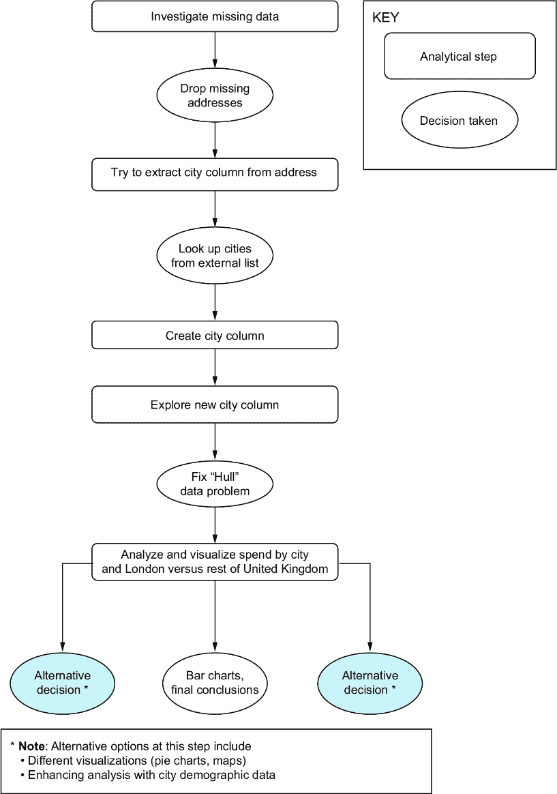

##### 图 2.18 最终分析步骤的可视化

在这个过程的最后，我们得到了我们的最小可行答案，并且我们准备将其带给我们的利益相关者。

### 2.2.3 审查和未来步骤


在清理我们的数据并提取城市信息后，我们得到了对分析问题的答案。我们的客户在大城市花费最多，因为大城市通常有更多的客户，而伦敦产生的收入几乎与其他所有城市之和相当。这个见解，结合图 2.14 中的表格和图 2.17 中的图表，可以放在一两个幻灯片上向我们的利益相关者展示。

在展示时，我们应该清楚地说明我们分析的限制；即，并非所有地址都采用允许我们正确提取城市的格式，至少在我们选择的方法中是这样。另一个限制是我们使用了政府的城市名单，该名单排除了我们的利益相关者可能感兴趣的较大城镇。我们会向我们的利益相关者明确表示，可以进行进一步的工作，以使我们的城市级别数据更加准确。然而，我们需要了解在可能不会改变整体结果的情况下，花费更多时间来获得更准确的数据的业务价值。


在展示我们的结果后，我们的利益相关者可能希望我们继续分析并得到一个更全面的答案。我们如何改进我们的解决方案？也许，正如我们讨论的那样，我们可以通过识别邮编来识别地址所指的城市或城镇。嗯，为此，我们需要一个全面的英国邮编列表，假设“客户地址”字段中的所有值都包含邮编，以及假设我们每次都能找到邮编。另一个选择是将我们当前的城镇名单扩展到包括一定人口以上的城镇。然而，这并不能解决有时城市或城镇的名称不在地址中的问题。

另一个选择是将这些地址发送到第三方地理编码系统，例如 Google Maps API，该系统将为我们提供的地址找到最佳匹配项，并且结果数据将包含一个我们可以使用的城镇/城市字段。然而，这个特定的选项引发了隐私问题。我们是否希望将所有客户的地址发送给第三方？我们甚至是否有权这样做？

最后，我们可以通过人口统计数据或甚至每个城市或城镇的人口统计数据来增强我们的数据。这可以帮助我们了解是否存在客户在根据其城市人口预期花费较少的城市，因此受到服务不足的情况。这是我们利益相关者最初的担忧之一，这也是进一步解决这一问题的方法之一。

你可以开始看到解决一个真实商业问题涉及多少额外的考虑。这就是为什么尽快找到一个可行的解决方案至关重要，这样这些额外的可能性只有在这样做具有实际商业价值时才予以考虑。任何进一步工作的价值都应在与关键利益相关者的合作中决定。

##### 活动：使用这些数据进一步的项目想法

在每个项目章节中，我鼓励你考虑其他可能的研究问题，用这些数据来回答，这些问题与特定章节项目无关。这是一个练习，帮助你使你的解决方案真正属于你，并使其在作品集中脱颖而出。以下是一些帮助你开始的想法：

+   客户消费数据在不同粒度级别上看起来是什么样子？你可能需要深入到次城市级别，例如区，或者找出如何将属于同一地理区域（例如，西南英格兰）的地址分组的方法。

+   你能否识别商业地址，并考虑比较拥有私人地址的客户与拥有商业地址的客户？

+   用人口数据或其他人口统计信息增强你的地理分析。是否存在任何模式，例如一个地区的财富与客户消费金额之间的关系？你也可以计算每个城市的“人均消费”并查看它在整个国家中是否有所变化。

## 2.3 如何使用本书的其余部分

本章介绍了实践中以结果为导向的方法的具体示例以及所有项目的格式。在你整个职业生涯中，每个项目都将要求你

+   确保你理解了问题

+   思考你正在努力实现的目标

+   考虑你是否拥有正确的数据

+   识别在展示你的发现时需要标记的注意事项

+   记录在得到最小可行答案后可能进行的进一步工作

本书中的每个项目都针对你在现实世界的分析项目中会遇到的不同主题，并且它们都将遵循本章中相同的流程。

## 摘要

+   采用以结果为导向的方法有助于集中精力解决具体问题。

+   以结果为导向的方法的一部分是确保在开始分析之前你理解了问题。

+   在开始分析之前就设想最终结果可以创建一个目标去努力实现。

+   提取自由格式地址中的城市部分有多个可能的方法，每种方法都有其优缺点。

+   分析结果将根据所做的选择和假设而有所不同；因此，可能得到不同的，但仍然正确的结果。

+   即使是看似较小的任务，例如从地址数据中提取城市信息，也能通过帮助关注有价值的成果而受益。*
