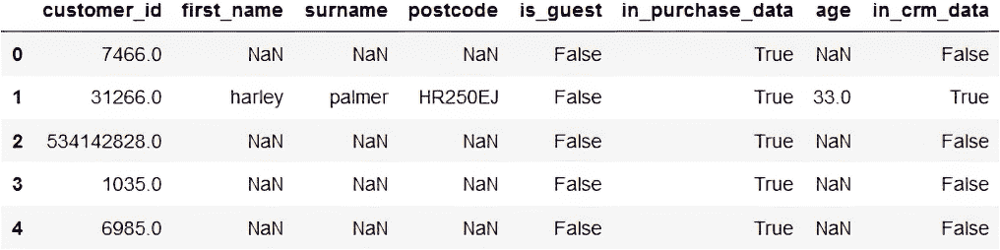
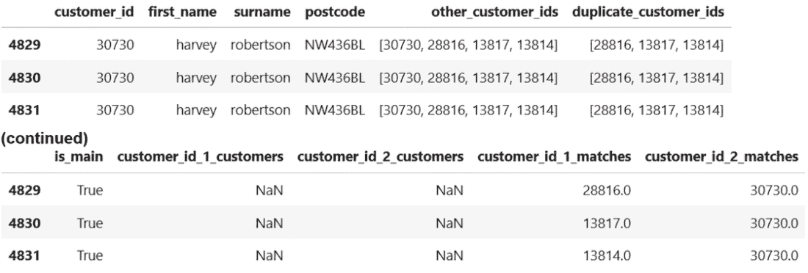

# 3 数据建模

### 本章涵盖

+   将数据建模作为基本分析活动

+   如何从原始数据中定义业务实体

+   如何构建数据模型以最好地适应分析问题

作为一名分析师，您将发现自己反复将相同的逻辑应用于原始数据。例如，每次计算收入时，您可能需要记住要删除部门之间的内部资金转移。或者当您查看客户支出时，您可能需要排除某个客户，因为他们运营方式不同。每当这些业务规则需要不断应用以确保数据准确时，这是一个构建*数据模型*的好机会。

数据模型是从经过清洗的原始数据中创建的数据集，其中内置了特定的业务规则。创建可重用的数据模型将在未来节省您的时间和维护烦恼。数据建模还迫使您深入思考您或您的利益相关者的问题，这将导致更有价值的答案。

##### 真实业务案例：客户去重

曾经，在我从事行业工作时，我花费了几个月的时间在一个客户去重项目上。我们想要跟踪客户随时间的变化，但我们的客户分布在多个数据库中。去重他们不是一个简单任务，特别是在某些数据库中，客户以公司名称出现，例如“西南汽车”，而在其他数据库中，他们被记录为个人，例如“约翰·史密斯”，没有任何关于他们工作的公司的信息。

最后，我们的解决方案涉及文本相似性算法来找到“西南汽车”在一个数据库中存在于另一个数据库中的“西南汽车有限公司”的情况。我们还使用了图论来将客户连接到我们公司的网络中。这些是针对看似简单任务（计数客户）的高级算法。实体解析问题无处不在，这就是为什么本章探讨了该主题，并让您在一个真实的问题上练习。

在本章中，我们将回顾数据建模的基本原理和重要性，并使用一个真实世界的项目练习将原始数据转换为可重用的数据模型。

## 3.1 数据建模的重要性

数据建模是分析工作流程的基础步骤。它是将原始数据映射到特定业务实体，并创建新的数据模型的过程。我们可以将其视为将原始状态的数据转换为更有用的形式，我们称之为信息。数据分析随后是将这些信息转换为洞察的过程。这个中间步骤是必需的，因为在原始形式中，数据通常还没有准备好进行分析。图 3.1 显示了数据建模在数据科学工作流程的抽象和具体版本中的位置。


##### 图 3.1 数据建模与分析在数据科学流程中的映射

您的数据模型应该编码任何将原始数据转换为适合分析所需的业务逻辑。如果您总是需要记住从原始数据中过滤掉某些行，您应该有一个中间数据模型，其中已经应用了该过滤器。对于您的业务，“流失客户”意味着什么？是有人在一定时间内没有购买任何东西吗？或者可能是有人很久没有登录到您的平台？无论这个定义是什么，它都应该编码在数据模型中。

创建数据模型增加了透明度，因为有一个单一的地方可以查找客户、车辆或购买事件是如何定义的。所有其他分析都应该使用这些中间模型进行，而不是原始数据。另一个好处是这种更干净的数据模型可以被数据熟练的利益相关者直接使用，从而实现自助服务。例如，Tableau 和 Power BI 这样的商业智能工具允许高级用户创建自己的报告。如果使用集中式数据模型来完成这项工作，分析错误的可能性就会降低。

作为分析师，我们应该寻找机会通过在数据模型中编码来标准化业务逻辑。这些不必在技术上复杂，因为它们可以简单地是我们数据库中的附加表。让我们看看数据建模中涉及的一些任务，我们将在项目中练习这些任务。

### 3.1.1 常见的数据建模任务

数据建模通常涉及以下任务的组合

+   重复的数据清理任务，例如修复日期格式或将文本列转换为它们的数值等效。

+   定义业务实体、概念和活动。

+   去重源数据。

+   重新结构化原始数据，使其更适合于它旨在回答的分析问题。这可能涉及在宽数据或长数据之间做出选择，我们将在本节稍后讨论。

+   放大或缩小，改变不同分析问题的粒度级别。

这些都是您不希望在每次进行某些分析时都执行的任务。它们应该只做一次，并且输出应该被捕获在适当的数据模型中。

#### 就术语达成一致

作为初级分析师，您可能会进入一个您不熟悉的行业。重要的是要提出问题以澄清术语，因为即使是像“客户”这样的日常术语也可能有模糊的含义。客户是指一个人还是一个组织？如果您的业务同时涉及两者怎么办？数据建模过程的一部分是定义这些术语，以便它们可以编码在数据表中。

注意：在定义方面，您不能孤立地工作；关于哪些概念具体含义的决定需要与您的利益相关者合作进行。

#### 处理重复数据

你将要处理的数据不可避免地会包含一些重复，这可能以数据行的重复或多个系统中的重复记录的形式出现。如果你在汽车行业工作，你可能需要花费相当多的时间来确定一个数据库中的“John Smith Motors”是否与另一个数据库中的“JS Motors”是同一个客户。在数据建模阶段投入时间进行这种协调是值得的。

另一个重要的数据建模任务是决定你的数据结构，例如数据应该以宽格式还是长格式存储。

#### 宽格式与长格式数据

在许多情况下，你的数据将包含每行一个实体，例如一个客户。每一行代表一个客户，每一列代表该客户的属性或属性，例如他们的名字、年龄、部门等等。这被称为*宽格式*，因为随着测量数量的增长，数据将增加额外的列。

相比之下，*长格式*数据是指一行代表一个实体的单一测量值。这意味着一个实体，例如一个客户，将需要多行。当关于实体的新测量值被添加时，数据将增加额外的行。

让我们用一个具体的例子来说明。假设你为一家体育数据分析公司工作，并希望分析赢得重大比赛的体育队伍的因素。表 3.1 显示了你的足球比赛结果数据集。

##### 表 3.1 宽格式的足球比赛结果

| 匹配 ID | 日期 | 比赛 | 轮次 | 主场球队 | 客场球队 | 主场进球 | 客场进球 |
| --- | --- | --- | --- | --- | --- | --- | --- |
| 1  | 2014-07-04  | 2014 年世界杯  | 半决赛  | 法国  | 德国  | 0  | 1  |
| 2  | 2014-07-04  | 2014 年世界杯  | 半决赛  | 巴西  | 哥伦比亚  | 2  | 1  |
| 3  | 2014-07-05  | 2014 年世界杯  | 半决赛  | 阿根廷  | 比利时  | 1  | 0  |

这是一种宽格式数据，因为每一行代表一个实体，在这种情况下，是一场比赛。通过一些增强（例如，添加“赢家”列），这个数据集将允许轻松分析诸如“哪个国家在世界杯上赢得的比赛最多？”等问题。

然而，如果有人问，“哪个国家参加了最多的世界杯比赛？”这个问题就复杂了，因为每一行的粒度级别是每场比赛一行，因此我们必须考虑“主场球队”和“客场球队”这两列。为了更容易回答这个问题，我们需要的是每行一个参与者的数据。我们可以考虑创建一个类似于表 3.2 的长格式数据版本。

##### 表 3.2 以长格式呈现的相同足球比赛结果，每行代表一个比赛参与者

| 匹配 ID | 日期 | 比赛 | 轮次 | 球队 | 主场或客场？ | 进球数 |
| --- | --- | --- | --- | --- | --- | --- |
| 1  | 2014-07-04  | 2014 年世界杯  | 半决赛  | 法国  | 主场  | 0  |
| 1  | 2014-07-04  | 2014 年世界杯  | 半决赛  | 德国  | 客场  | 1  |
| 2  | 2014-07-04  | 世界杯 2014  | 半决赛  | 巴西  | 主场  | 2  |
| 2  | 2014-07-04  | 世界杯 2014  | 半决赛  | 哥伦比亚  | 客场  | 1  |
| 3  | 2014-07-05  | 世界杯 2014  | 半决赛  | 阿根廷  | 主场  | 1  |
| 3  | 2014-07-05  | 世界杯 2014  | 半决赛  | 比利时  | 客场  | 0  |

这现在变成了长数据，因为行不代表唯一的实体。这个表格编码了相同的信息，但每个比赛都是故意重复的。从这个表格中，更容易只关注“队伍”列来找到拥有最多世界杯比赛的队伍。这种格式的缺点是，我们不能简单地计数行数来找到统计数据，比如在世界杯上进行的比赛数量，因为我们将会重复计数。

无论是宽格式还是长格式，没有一个比另一个更好；它们之间的选择取决于你使用数据试图回答的问题。评估哪种格式最适合你的分析问题是数据建模的本质。

#### 确定合适的粒度级别

就像足球示例一样，你将遇到分析粒度不合适的数据集。美国选举结果数据可能是在县一级，但你可能对个别候选人感兴趣。拥有候选人级别的数据模型将有助于更快地回答针对候选人的特定问题。信息是相同的；只是存储的格式更适合你的分析问题。

在开始这个项目时，先问自己，“最终数据模型的结构应该是什么？”朝着这个目标（以结果为导向的方式！）将指导你需要采取的具体步骤。

## 3.2 项目 2：你的客户是谁？

让我们来看看我们的项目，在这个项目中，我们将从一系列零售交易中提取客户数据库。我们将查看问题陈述，这是我们利益相关者用自己的话想要实现的目标。我提供了可用数据的概述，并讨论了示例解决方案的一些技术细节。阅读第 3.2 节就足够开始，但你可能会发现第 3.3 节有助于了解在这个场景中如何应用以结果为导向的方法。

数据可在[`davidasboth.com/book-code`](https://davidasboth.com/book-code)找到。你将找到可以尝试项目的数据集，以及以 Jupyter 笔记本形式的示例解决方案。

### 3.2.1 问题陈述

在这个例子中，你被雇佣到 Ebuy Emporium，一家新的电子商务初创公司。他们已经运营了一个月，并且取得了意外的成功。他们开始对他们的客户群产生浓厚的兴趣。他们的客户是谁？他们买了什么？是什么驱使他们购买？然而，在他们对任何严肃的分析之前，他们需要能够计算他们的客户数量，这比预期的要困难得多。一个问题是有多个客户数据来源，它们是

+   电子商务平台的客户数据库，当客户在线注册账户时，客户详细信息会被记录。这是大多数客户详细信息应该被找到的地方。

+   内部客户关系管理（CRM）系统，当客户通过电话购买或以其他方式成为客户（除了使用注册账户在线购买）时，客户详细信息会被记录。

+   原始交易数据，我们在此之后将称之为“购买”或“销售”，其中还包含作为访客进行的购买，这意味着在购买时没有明确创建客户记录。

注意：原始交易数据由 REES46 提供 ([`mng.bz/6eZo`](https://mng.bz/6eZo))，并增加了来自欧盟研究与方法论合作项目（CROS）记录链接培训计划的虚构客户数据 ([`mng.bz/oKad`](https://mng.bz/oKad))。感谢数据集所有者允许重新使用原始源数据。

另一个问题在于现有数据源可能不是相互排斥的——它们之间可能存在重叠。几乎可以肯定存在一些重复，要么是因为同一客户在多个系统中输入了他们的详细信息，要么是因为他们以访客身份和注册账户身份都进行了购买。重复账户可能不包含完全相同的信息；可能存在拼写错误或误拼。正是这些复杂情况使得初创公司需要分析师的帮助来回答他们的问题：“我们的客户是谁？”

### 3.2.2 数据字典

表 3.3 和 3.4 展示了三个数据源的数据字典，图 3.2 和 3.3 展示了样本数据。

##### 表 3.3 “购买”数据集的数据字典

| 列 | 定义 |
| --- | --- |
| `event_time`  | 购买发生的确切日期和时间。  |
| `product_id`  | 购买产品的唯一标识符。  |
| `category_id`  | 购买产品特定类别的唯一标识符。  |
| `category_code`  | 购买产品的广泛类别。在层次结构中，类别代码包含多个类别 ID，且一个 `category_id` 只应与一个 `category_code` 相关联。  |
| `brand`  | 购买物品的品牌（如果适用）。  |
| `price`  | 购买物品的价格（以美元计）。  |
| `session_id` | 购买会话的唯一标识符。如果在交易中购买了多个项目，则每个项目在表中将有一行，并且这些行将共享一个`session_id`。 |
| `customer_id` | 如果客户使用注册账户进行购买，则客户的唯一标识符。对于访客购买，此值将不存在。 |
| `guest_first_name` | 如果作为访客进行购买，提供的名字。对于使用注册账户进行的购买，此值将不存在。 |
| `guest_surname` | 如果作为访客进行购买，提供的姓氏。对于使用注册账户进行的购买，此值将不存在。 |
| `guest_postcode` | 如果作为访客进行购买，提供的邮编。对于使用注册账户进行的购买，此值将不存在。 |


##### 图 3.2 购买数据集的快照

##### 表 3.4 CRM 和客户数据集的数据字典，它们具有相同的结构

| 列 | 定义 |
| --- |
| `customer_id` | 本系统中客户的唯一标识符 |
| `first_name` | 客户的姓氏 |
| `surname` | 客户的姓氏 |
| `postcode` | 客户的邮政编码 |
| `age` | 客户的年龄，以年为单位 |


##### 图 3.3 客户数据的快照

备注：重要的是要记住，数据字典指的是关于每个列中存在哪些数据的假设。在探索性数据分析阶段验证这些假设是良好的实践。例如，购买数据中提供的客户 ID 是否总是与客户数据库中的一个记录匹配？

在这个案例中，数据字典是自解释的，但处理新数据集的第一步始终是确保我们已经阅读了任何相关的文档。

### 3.2.3 预期结果

本项目的输出应是一个代表您的客户数据模型的单一数据集——这是您对初创公司目前拥有的整个客户基础的最好估计。数据将来自提供的三个来源，您需要相应地进行整合和去重。您需要根据数据集中可用的列来决定数据模型的结构。此数据模型应结构化，以便所有定义客户的逻辑都已经就绪，回答“我们有多少客户？”的问题应该像计数行一样简单。

你并不追求一个唯一的正确解决方案，也没有一个可以用来验证你答案的基准事实。这主要是因为分析中包含了很多模糊性，不同的分析师会做出不同的假设并得出不同的结论，部分也因为这类任务在现实世界中通常没有可以用来验证答案的答案。成为一名优秀分析师的部分是接受持续的不确定性和模糊性，并对可能永远不完整的答案感到舒适。重要的是能够提供你的利益相关者可以使用答案。

### 3.2.4 必需的工具

虽然项目是技术中立的，但在这个示例解决方案中，我使用 Python 库`pandas`来操作数据集，并使用`numpy`进行数值函数。我还介绍了用于实体解析的`recordlinkage`库。我将代码片段保持在最小，并专注于概念解决方案，但完整的解决方案以 Jupyter 笔记本的形式呈现。这是一个用于在单一文档中展示代码、数据和文本的工具，使得分享你的发现以及背后的方法变得容易。只要你使用的工具满足以下标准，即它们能够

+   从 CSV 文件中加载包含数万行数据的集合

+   创建新的列并操作现有的列

+   将数据集合并在一起

+   执行基本分析任务，如排序、分组和重塑数据

## 3.3 制定客户数据建模的方法规划

让我们使用以结果为导向的方法将问题分解为其逻辑组成部分。这将在我们开始工作之前，让我们对问题有更深入的理解。我们还将明确决定我们不想做的事情，也就是说，我们将找出哪些问题的特征对于第一次迭代不是必要的。

### 3.3.1 将结果驱动过程应用于数据建模


首先，我们需要理解问题。在这种情况下，问题模糊地是“我们的客户是谁？”这通常需要一些反驳以澄清。在这个例子中，无论关于客户的实际分析问题是什么，数据建模步骤对于回答它是基本的。我们必须首先从三个数据源中整合客户数据。

TIP  我们可以考虑添加哪些额外数据来更好地满足分析问题的需求。我们知道我们希望每个客户对应一行，但我们还不知道客户购买历史的总结是否会是一个有用的补充。在这种情况下，我们不希望预先花费时间在我们的数据模型中添加信息，因为我们认为将来可能会有人要求它。

*

我们的产品最终形态非常明确，但具体来说，从最终结果开始意味着对最终数据模型的结构有一个概念，其存在将使我们能够计数客户以产生我们的最小可行答案。我们知道它最重要的属性之一应该是它包含每名客户的一行。这是我们追求的粒度级别。因此，我们添加的任何购买数据都需要汇总到客户级别；我们无法包括客户购买的个别产品，但可以包括他们的总消费、他们首次注册的日期、他们做出的独特购买数量等等。

另一个展望最终结果的角度是确定我们最终数据模型的模式。我们的数据集中有哪些列是通用的？在我们合并数据源之前，我们需要删除哪些列，或者它们是否足够重要，以至于我们可以在最终解决方案中接受一些缺失的数据？在数据建模中，这些都是需要提前考虑的重要方面，这样我们就可以在编码解决方案的细节中记住它们，并且不会花费时间处理最终数据模型中无法使用的数据。


在这个案例中，数据集已经被识别并为我们提供了，因此我们的“识别”和“获取”步骤已经完成。然而，在现实世界的场景中，考虑我们组织内部可能存在的任何额外客户数据来源是谨慎的。这通常包括各种销售经理在他们的电脑桌面上保存的电子表格！


实际进行数据建模任务时，以下是一些需要考虑的关键步骤：

1.  我们将首先探索所有三个数据集。我们想要确认列是否包含数据字典中所述的内容。例如，当我们没有客户 ID 时，客户详情是否总是完整的？我们还想看看值是否有意义。我们专注于客户数据，但也可能想看看`价格`列是否包含任何不切实际的价值。日期和时间值是否都在同一时期内？邮编值是否有任何异常？这是一个迭代过程，所以我们可能不会在开始时就耗尽我们的探索；其中一些问题可能只有在稍后才会出现。我们也不想花费太多时间探索我们不会使用的列。

1.  一旦我们验证了关于数据的一些关键假设，一个想法是在合并之前对每个数据集进行去重，只保留唯一的客户。这在购买数据中尤其如此，因为每次客户购买多个项目时，他们的详细信息都会重复。我们还会就模式差异做出一些关键决策。如果有些数据只存在于某些来源中，我们该怎么办？

1.  下一步是将这些单独的数据集合并起来；我们希望得到一个包含所有可能的客户记录的数据集。合并后的数据集可能包含重复项。我们可以通过删除精确重复项来消除一些明显的重复，这些重复项可能出现在客户数据库和 CRM 数据中，并且记录在其他方面完全相同。如果两个客户记录中的信息完全相同，但唯一标识符不同，我们需要小心处理。随意删除重复项可能会导致我们可能称之为“数据来源可追溯性”的丢失，即我们数据最初来源的可追溯性。如果我们有一个 Jane Smith 的客户记录，良好的做法是保留我们在各个数据集中遇到的该客户的所有可能的标识符。也许她在某个数据集中是客户 8834，在另一个数据集中是 931，我们希望以某种方式在我们的最终数据模型中知道这一点。这不仅使追踪她的账户回到其来源更容易，而且增加了对我们最终解决方案的信任。任何使用我们数据模型的人都知道我们关于哪些客户账户构成了 Jane Smith 的“实体”所做出的假设。

1.  接下来，我们可以考虑在识别精确重复数据之外，对合并后的客户数据进行去重。模糊字符串匹配可能是一个不错的选择；在这种情况下，我们比较两个字符串，如果它们几乎相同，则判断它们为相同。在使用模糊匹配时，会考虑拼写错误，“London”和“Lodnon”被视为相同的字符串。在记录链接和实体解析领域的 研究 可能有助于深入了解。这些是专门用于确定两个略有不同版本的实体实际上是否相同的完整主题。我们需要判断这项额外工作是否有实际效益，并且是否值得我们投入时间。这甚至可能是一个我们留给第二稿的任务，因为我们可能更愿意在承诺进行这一更复杂的步骤之前，向我们的利益相关者展示我们的初步发现。

1.  最后，我们会清理数据模型，使其具有我们想要的架构，确保列名具有意义。根据我们选择如何处理重复账户，我们可能需要为每个客户实体决定一个主要账户，例如。


展示数据模型的方式是关注我们工作的影响。创建一个小型演示文稿，概述我们所做的工作、我们发现了多少客户以及我们的工作基于哪些假设，这会比提供数据库中的数据模型获得更多的关注。实际上，我们的利益相关者不太可能直接使用我们的数据模型来分析数据；这项工作的主要好处是提高了准确性，并在以后的客户分析中提供了更多机会。

展示我们的发现也为我们与利益相关者一起做出一些分析决策提供了机会。有时，我们可能没有足够的直觉来在两个看似相似的选择之间做出选择。我本人面临的一个问题是当客户在一个数据库中作为公司存在，而在另一个数据库中作为个人存在时。作为分析师的我，不应该是决定“简·史密斯”是否与她的公司“JS Motors”是同一客户的最终决定者；这是一个需要更广泛业务输入的决定，特别是如果业务将随着时间的推移来衡量和跟踪客户数量。您可以使用您数据模型的第一次迭代来向您的利益相关者展示一些这些关键问题，让他们思考。


在对您的初步发现获得反馈后，通常可以清楚地知道您解决方案的下一迭代需要什么。在项目背景下，由于我们缺乏来自利益相关者的直接反馈，迭代可能意味着您快速创建一个最小可行数据模型，也许在执行任何有意义的去重之前就停止。除了让您更快地对工作获得反馈外，尽快达到最小可行解决方案还可以让您有信心您正在正确的轨道上。您还将有一个更容易迭代改进的解决方案，而不是在一个更复杂的解决方案上花费大量时间，直到更长过程结束时才有所成果。或者，这可能是明显没有进一步改进解决方案的实质性商业价值的点，因此，而不是进一步迭代，项目被认为是完成的。

### 3.3.2 需要考虑的问题

在您处理这个项目的过程中，以下是一些需要考虑的关键问题：

+   客户可以以哪些方式在这些数据集中表示？列出所有场景（CRM 中的客户、已购物的客户、匿名结账等）可能有助于精确地确定您需要编码的内容。

+   当您考虑重复项时，如何表示关联账户（即主账户与关联账户）？

+   在去重记录时，您想使用哪些字段进行去重？两个同名且住在同一邮编的人是否一定是同一个人？两个客户的详细信息需要有多少差异，我们才认为他们是不同的人？

## 3.4 示例解决方案：从交易数据中识别客户

让我们深入探讨一个实际解决方案的细节。我强烈建议在审查示例解决方案之前先尝试自己完成项目。与每个项目一样，数据文件，如第 3.2 节所述，包含在补充材料中。我也建议即使您已经有一个满意的解决方案，也要阅读这一节，不是因为示例解决方案是唯一的解决方案，而是因为我们可以从看到他人如何处理相同的问题中学到很多东西。

### 3.4.1 制定行动计划

我们首先将探索数据，以查看我们对它的假设是否成立，是否有任何数据缺失，等等。然后，我们将为我们的数据集决定一个共同的架构，并将它们全部裁剪到这个共同的架构中，这意味着我们将有三个较小的客户数据集——一个来自购买，一个来自客户数据库，一个来自 CRM 数据——它们都以相同的方式结构化，可以很容易地组合。在合并数据集之后，我们将消除重复的记录，以得出我们客户群的最好猜测。

### 3.4.2 探索、提取和合并多个数据源

我们将探索这三个数据集，从中提取共同的客户信息，并将它们合并成一个“主”客户视图。然后，我们将查看消除合并数据集的重复项。让我们从原始购买数据开始。

#### 探索新的数据集

我们首先导入必要的库并读取销售数据：

```py
import pandas as pd
import numpy as np        #1

sales = pd.read_csv("./data/purchases.csv")      #2
print(sales.shape)            #3
```

#1 导入必要的库

#2 将我们的购买 CSV 文件作为 pandas DataFrame 读取

#3 检查 DataFrame 的大小

这段代码的输出是 `(71519,` `11)`，这意味着超过 71,000 行数据，11 列，所以购买表中有超过 71,000 笔交易。我们知道从问题陈述中，访客结账不会构成我们所有交易的全部，所以检查缺失数据至少应该揭示一些缺失的访客信息。下面的代码生成了图 3.4 的输出，显示了每列缺失值的计数：

```py
sales.isnull().sum()     #1
```

#1 一个 pandas 技巧来“加总”缺失值的行


##### 图 3.4 我们购买数据中的缺失值

有 18,448 个缺失的客户 ID，这些应该与访客结账相关，还有 53,071 个缺失的访客值。将它们加起来得到 71,519，这是记录总数，这意味着访客结账和注册用户结账构成了我们的整个数据集。似乎没有一行信息全部缺失或两者都存在，但我们应该验证这一点。首先，让我们创建一个新的列来跟踪访客结账，这发生在客户 ID 未提供时：

```py
sales["is_guest"] = sales["customer_id"].isnull()
```

现在，我们的 `is_guest` 列如果客户 ID 缺失，则取布尔值 `True`。我们可以使用这个列来验证我们对访客结账和客户 ID 互斥的假设。这段代码的第一行检查了交易是访客结账，但我们也有客户 ID 的情况，第二行返回了既没有客户 ID 也没有访客值的情况：

```py
sales[sales["is_guest"] & sales["customer_id"].notnull()]
sales[(sales["is_guest"] == False) & sales["customer_id"].isnull()]
```

这两条线的输出都在图 3.5 中展示。


##### 图 3.5 检查访客和注册用户结账是否重叠的代码输出

这是 Python 告诉我们没有符合我们标准的记录的方式，这意味着我们可以确信所有行要么是访客退房，要么是注册客户做出的购买。接下来在我们的数据质量议程中，我们需要检查有多少比例的记录是访客退房。这不仅仅是为了信息目的，也是为了我们了解我们将要推断多少客户记录。由于访客退房是我们客户记录的最弱信号，我们添加到客户数据库中的任何访客都被假定为客户。他们是推断出来的，而不是具体的客户账户。

例如，如果有人将 John Smith 作为他们的访客退房名称，这可能是因为史密斯先生代表其他人购买东西，可能是作为礼物。在这种情况下，John Smith 是客户吗？或者可能是有人使用史密斯先生的信用卡，可能是他的孩子之一。在这种情况下，客户是 John Smith 还是孩子？无论如何，我们除了访客名称 John Smith 之外没有更多的信息可以依据，这就是我们需要放入客户数据库的信息。计算访客账户的数量有助于确定我们客户数据中会有多少“假设”案例。使用我们之前创建的`is_guest`列，我们可以计算其分布：

```py
sales["is_guest"].value_counts(normalize=True)
```

输出如图 3.6 所示。


##### 图 3.6 客户与注册用户购买的比例

这告诉我们有 25%的行是访客退房，但我们需要记住，每一行代表的是一个购买的*项目*，而不是客户记录，所以作为访客退房的客户比例不一定为 25%。我们可以计算出这个实际比例：

```py
guest_columns = ["guest_first_name", "guest_surname",
↪ "guest_postcode"]
unique_guests = sales[guest_columns].drop_duplicates()    #1
print(len(unique_guests))
unique_customers = sales["customer_id"].unique()           #2
cust_total = len(unique_customers) + len(unique_guests)
print(len(unique_guests) / (cust_total-1))                 #3
```

#1 获取访客列的唯一组合

#2 获取所有唯一的客户 ID

#3 从唯一的客户计数中减去 1，因为 NULL 也被计算在内

这会打印出`8301`的值和另一个略低于`0.25`的值，这意味着我们有 8,301 种独特的访客列组合，一旦我们提取出独特的客户，结果发现确实有四分之一的人没有注册，而是以访客的身份退房。这个数字不会完全准确，因为可能会有打字错误。我们假设每个姓名和邮编的组合都是唯一的客户，但一个客户在他们的退房过程中犯了一个打字错误，就会导致我们在这里重复计算他们。当然，这是假设他们在退房过程中允许犯打字错误。我们需要了解更多关于实际电子商务系统的信息，以了解这些访客列是否与账单或信用卡信息相关，例如，打字错误可能会导致购买被拒绝。了解数据生成过程至关重要。

让我们总结到目前为止我们已经做了什么。图 3.7 显示了我们在探索购买数据集方面取得的进展。


##### 图 3.7 探索购买数据集的进展

#### 识别数据集之间的共同结构

大约有 25,000 个唯一的客户 ID，代表注册客户，还有大约 8,000 个唯一的推断访客，所以仅从购买数据来看，我们估计客户数量的上限大约为 33,000。我说上限是因为我们稍后必须调查重复账户，如果发现任何重复，这个数字可能会减少。我们还知道，对于访客结账，我们有可用的名字、姓氏和邮政编码。当我们查看其他客户数据库时，我们需要记住这一点。

然而，在我们导出第一个中间数据集之前，我们需要决定我们数据模型的模式。我们知道我们的访客客户有名字和邮政编码，如果我们查看数据字典，我们可以看到客户和 CRM 数据集也包含客户年龄。我们并不真的想因为访客账户缺失而删除该列，所以我们的最终模式将包括它。

一旦记录合并到单个表中，跟踪记录的来源通常是一个好主意。我们可以通过添加一个`source`列来实现，该列可以具有`purchases`、`customer` `database`或`CRM`等值，但这种结构假设记录只能来自一个地方。我们可能会遇到重复，所以更好的选择是为每个数据源添加一个指示列，即标记记录是否存在于购买数据中的列，另一个指示它是否存在于客户数据库中的列，等等。这些主要用于数据溯源目的，因此信息的来源更加透明。我们还可以决定明确跟踪记录是否来自访客结账，因为这可能在利益相关者想要知道有多少比例的客户在购买时不注册时变得很重要。表 3.5 显示了最终的架构，这是三个数据集需要转换成的模式。

##### 表 3.5 所有数据源需要转换成的数据模型模式

| 列 | 描述 |
| --- | --- |
| `customer_id`  | 客户记录的唯一 ID，或访客为 NULL。  |
| `first_name`  | 来自客户或 CRM 表或访客信息。  |
| `surname`  | 来自客户或 CRM 表或访客信息。  |
| `postcode`  | 来自客户或 CRM 表或访客信息。  |
| `age`  | 来自客户或 CRM 表，对访客不可用。  |
| `is_guest`  | `True` 如果数据来自访客结账。  |
| `in_purchase_data`  | `True` 如果此客户记录出现在购买表中。它不是排他的，因为客户也可能出现在客户或 CRM 数据集中。  |
| `in_crm_data`  | `True` 如果客户记录存在于 CRM 数据库中。  |
| `in_customer_data`  | `True` 如果客户记录存在于客户数据库中。  |

让我们继续将我们的第一个原始数据集，销售数据，转换成这个期望的结构。

#### 将数据集重构为通用结构

从购买数据中导出我们的客户最简单的方法是分别提取访客和非访客，然后将它们合并。这两个子集的结构将不同，因为我们为访客有三个列（名、姓和邮编），而对于注册客户，我们只有他们的 ID。我们可以从客户和 CRM 表中连接数据以找到这些 ID 的相关名字和邮编，或者我们可以在探索和操作客户数据集时这样做。这个选择更多的是个人偏好，我选择将连接推迟到以后，所以现在我们将导出不完整的数据。

要仅导出访客信息，我们可以使用我们的`is_guest`列进行筛选，并仅导出相关列：

```py
guest_columns = ["guest_first_name", "guest_surname",
↪ "guest_postcode", "is_guest"]
guests = sales.loc[sales["is_guest"], guest_columns]
guests = guests.drop_duplicates()     #1
guests.head()
```

#1 我们删除重复项以确保我们只有唯一的访客信息。

输出结果如图 3.8 所示。


##### 图 3.8 购买表中的访客数据，准备与客户数据合并

对于非访客结账，我们不会有这些列；我们只有客户 ID：

```py
non_guests = (
  pd.DataFrame(            #1
    sales.loc[sales["customer_id"].notnull(), "customer_id"]
      .unique()                    #2
      .astype(int),
    columns=["customer_id"]
  )
)
non_guests.head()
```

#1 客户 ID 是一个单独的列，因此我们需要明确将其转换为 DataFrame。

#2 我们从非访客行中提取唯一的客户 ID。

输出结果如图 3.9 所示。


##### 图 3.9 购买中的非访客数据，它只是一个客户 ID 列

图表 3.8 和 3.9 所示的数据结构不同。然而，当我们合并它们时，我们将拥有两个数据集的所有列，以及在一个数据集中某个列不存在时的缺失数据：

```py
sales_customers = pd.concat([non_guests,guests], axis=0, ignore_index=True)
```

首先，我们将两个数据集连接起来（如果你习惯于 SQL 术语，可以说“合并”）。然后，我们重命名我们的列并移除访客前缀：

```py
new_col_names = ["customer_id", "first_name", "surname",
↪ "postcode", "is_guest"]
sales_customers = sales_customers.set_axis(new_col_names, axis=1)
```

我们还想要确保没有缺失数据，所以我们在`is_guest`列中填充缺失值。技术上，我们可以留空以表示某人不是访客，但明确使用`True`/`False`值更清晰：

```py
sales_customers["is_guest"] = sales_customers["is_guest"].fillna(False)
```

现在我们添加了我们为我们的模式所决定的`in_purchase_data`列：

```py
sales_customers["in_purchase_data"] = True
```

由于我们正在处理文本数据，另一个重要的步骤是确保没有尾随空格，并且所有名称都使用相同的首字母大小写。这样即使一个名称是小写的而另一个是大写的，客户名称也会被视为相同。我们可以使用`pandas`内置的`.str`访问器类，它允许我们操作整个字符串列：

```py
for col in ["first_name", "surname"]:
    sales_customers[col] = sales_customers[col].str.lower().str.strip()

sales_customers["postcode"] = sales_customers["postcode"].str.strip()
```

现在，从我们的购买中提取的客户数据看起来像图 3.10。


##### 图 3.10 从购买中提取的客户数据预览

前几行显示了非访客结账和注册客户。目前，我们没有他们的名字或邮编，因为我们决定稍后将其连接。预览中最后几行显示了我们的访客，因此缺少客户 ID。

在我们继续之前，让我们总结一下到目前为止我们所做的工作。图 3.11 显示了我们在探索和重塑购买数据集时所采取的步骤。没有形状的文本表示来自前几节中的步骤和决策。


##### 图 3.11 我们在购买数据集上所采取的步骤

现在我们已经准备好继续前进，探索客户数据集，并将它们与我们刚刚从原始购买中导出的客户数据合并。

#### 探索第二个数据集

从数据字典中我们知道，两个客户数据集具有相同的架构。我们在两个数据集中寻找的是是否存在任何缺失数据，客户 ID 是否都已填写，以及是否存在任何重复记录。由于客户 ID 是唯一的标识符，我们预计不会出现重复，但不可假设任何事情。我们从 CRM 数据开始：

```py
crm = pd.read_csv("./data/crm_export.csv")
print(crm.shape)
crm.head()
```

数据集的形状是`(7825,` `5`)`，意味着有 7,825 行和 5 列。图 3.12 显示了 CRM 数据集的预览。


##### 图 3.12 原始 CRM 数据的前几行

我们使用以下代码检查缺失数据，其输出如图 3.13 所示：

```py
crm.isnull().sum()
```


##### 图 3.13CRM 表中没有缺失数据

下一步的合理性检查是确保客户 ID 是唯一的。一种方法是按客户 ID 分组，并找到组内有多行记录的实例。如果客户 ID 是唯一的，则不应返回任何记录。让我们验证这一点：

```py
crm.groupby("customer_id").size().loc[lambda x: x > 1]
```

这里我们使用`groupby`和`size`来计算每个客户 ID 的记录数，并使用`loc`来过滤出有多条记录的实例。Python 输出是`Series([],` `dtype:` `int64),`这表示没有找到记录，因为空方括号在 Python 中表示一个空集合。这意味着客户 ID 确实是唯一的。

然而，这并不意味着客户*详细信息*在表中是唯一的。如果我们看看我们有多少个独特的姓名、邮编和年龄组合，我们可以看到这一点：

```py
print(len(crm))
print(len(crm.drop(columns="customer_id").drop_duplicates()))
```

输出分别是 7,825 和 7,419，这意味着虽然 CRM 数据中有 7,825 行，但一旦我们删除客户 ID，只有 7,419 个唯一的列组合，这表明我们大约有 400 个重复的客户详细信息，这些信息分布在多个 ID 上。这可能并不意味着有 400 个重复的客户，因为我们也可能有多个同名的人住在同一个邮编下，但由于我们也考虑了年龄，所以这些很可能是所有冗余的重复。如果存在任何错误重复，考虑到数据集的大小，它们很可能是非常小的百分比，因此没有必要过分关注这一点，现在我们可以这样说，每个姓名、邮编和年龄的唯一组合都是一个唯一的客户。数据建模工作的本质是总会有一个误差范围。

图 3.14 总结了到目前为止我们对 CRM 数据所做的工作。


##### 图 3.14 处理 CRM 数据的第一步

#### 将数据集连接起来以增强一个数据集，使用另一个数据集的信息

下一步是将 CRM 数据转换为与购买表中的客户相同的模式，并且我们还需要用 CRM 数据中的详细信息增强购买历史中的注册客户。到目前为止，我们只有这些客户的 ID，但我们需要他们的名字、邮编和年龄。并非所有这些信息都能在 CRM 数据中找到，但我们可以将两者连接起来，尽可能填充更多的行。我们将使用左连接来完成这个操作，因为这将确保无论我们在另一侧找到匹配与否，我们都保留原始数据中的所有行。以下是这个操作的代码，结果如图 3.15 所示：

```py
sales_and_crm_customers = sales_customers.merge(crm,
↪ on="customer_id", how="left", suffixes=("_sales", "_crm"))
print(len(sales_and_crm_customers))
sales_and_crm_customers.isnull().sum()
```


##### 图 3.15 合并销售和 CRM 数据后的缺失值检查

`pandas`的一个特定特性是，同时出现在两个表中的列默认会得到一个`_x`和`_y`后缀。我们在这里覆盖了这个特性，使其更具描述性，因此带有`_sales`后缀的是源数据——购买数据，而`_crm`后缀是给合并数据的，在这种情况下，是 CRM 数据。

由于销售数据中大约有 33,000 行，而新添加的 CRM 客户列中缺失了 26,000 行，我们可以看到我们在客户 ID 上匹配了大约 7,000 行。这意味着 7,000 次购买的客户记录存储在 CRM 表中。我们现在有一个数据集，其中 7,000 个客户记录位于以`_crm`结尾的列中，我们应该将这些合并到标记为`_sales`的列中，这些列包含客户结账时的客户数据。首先，我们定义一个过滤器来选择只有客户 ID 的行，从而排除访客和包含`crm`后缀列中客户信息的行：

```py
merged_customers_filter = (
  (sales_and_crm_customers["customer_id"].notnull())
    & ((sales_and_crm_customers["first_name_crm"].notnull())
      | (sales_and_crm_customers["surname_crm"].notnull()))
)
```

然后，可以使用此过滤器来识别这些行在 CRM 数据中已被找到：

```py
sales_and_crm_customers.loc[merged_customers_filter, "in_crm_data"] = True
sales_and_crm_customers.loc[~merged_customers_filter, "in_crm_data"] = False
sales_and_crm_customers["in_crm_data"].value_counts()
```

输出如图 3.16 所示。


##### 图 3.16 合并 CRM 数据后包含客户信息的行数

这个 7,114 的数量与我们之前观察到的相符，即现在大约有 7,000 行客户信息已经更新。现在是时候将`crm`后缀列中的数据复制到我们`_sales`后缀列中，并且只保留后者，以回到原始模式：

```py
sales_and_crm_customers.loc[merged_customers_filter, ["first_name_sales",
↪ "surname_sales", "postcode_sales"]] = (
    sales_and_crm_customers.loc[merged_customers_filter, ["first_name_crm",
↪ "surname_crm", "postcode_crm"]]
    .values
)
```

在这里，我们简单地复制了名字、姓氏和邮编来覆盖`sales`后缀列中 CRM 客户数据在`crm`后缀列中的缺失值。现在我们准备移除后者：

```py
sales_and_crm_customers = (
    sales_and_crm_customers
    .drop(columns=["first_name_crm", "surname_crm", "postcode_crm"])
    .rename(columns={
        "first_name_sales": "first_name",
        "surname_sales": "surname",
        "postcode_sales": "postcode"
    })
)
sales_and_crm_customers.head()
```

输出如图 3.17 所示，这是我们预期的结果。模式现在与之前相同，除了一个新的`in_crm_data`标志，购买数据中的客户信息已经尽可能用 CRM 数据增强了。



##### 图 3.17 合并购买和 CRM 客户数据

在第二行立即注意到一个例子，一个客户使用注册账户购买了商品，所以他们不是客人，但他们的详细信息是通过 CRM 数据集填充的。剩下要做的就是检查并添加存在于我们的 CRM 系统中但未出现在我们的购买记录中的客户详细信息。可能存在一些原因；也许那些客户在电话上购买了商品，而这些销售没有记录在同一地方。无论原因是什么，这是一个我们需要考虑的可能性，以确保全面覆盖。

#### 使用集合交叉引用两个数据集

要找到这些记录，我们使用 Python 技巧从一组客户 ID 中减去另一组，从而得到差集：

```py
crm_ids_to_add = list(set(crm["customer_id"].unique())
↪ - set(sales_and_crm_customers["customer_id"].unique()))
print(len(crm_ids_to_add))
```

在这里，“集合”指的是一组独特项目的严格数学定义，“差集”则意味着从一个集合中减去另一个集合，从而只留下在 CRM 数据中出现但不在购买记录中的客户 ID。输出结果显示，有 711 位这样的客户需要将他们的详细信息添加到我们不断增长的客户数据集中。我们只需将数据与刚刚选定的 ID 对应的客户数据连接/合并：

```py
sales_and_crm_customers = (
    pd.concat([sales_and_crm_customers,
↪ crm[crm["customer_id"].isin(crm_ids_to_add)]],
              axis=0,
             ignore_index=True)
)
```

需要清理的此数据的最后一个方面是，对于这些新客户，我们没有源标志的数据，因此我们用默认值填充它们。从 CRM 数据添加的客户将他们的`in_crm_data`标志设置为`True`，`in_purchase_data`设置为`False`，因为他们不是客人，所以`is_guest`设置为`False`。以下代码的输出显示在图 3.18 中：

```py
sales_and_crm_customers["is_guest"]
↪ = sales_and_crm_customers["is_guest"].fillna(False)
sales_and_crm_customers["in_purchase_data"]
↪ = sales_and_crm_customers["in_purchase_data"].fillna(False)
sales_and_crm_customers["in_crm_data"]
↪ = sales_and_crm_customers["in_crm_data"].fillna(True)

sales_and_crm_customers.isnull().sum()
```


##### 图 3.18 合并并清理 CRM 数据后，我们的源标志没有缺失值。

在继续之前，让我们回顾一下我们对 CRM 数据所做的工作。图 3.19 显示了我们所采取的所有步骤。


##### 图 3.19 探索 CRM 数据并导出客户信息的步骤

总结一下，我们现在有一个客户数据集，包括所有进行过购买的客户，包括使用注册账户购买的客户，以及来自我们的 CRM 系统的数据，包括仅存在于 CRM 数据中且没有记录购买的客户。现在我们需要用客户数据库中的数据重复这个过程，该数据库的结构与 CRM 数据相似。

#### 探索第三个数据集

现在来看看我们的客户数据库。代码将与用于操作 CRM 数据的代码类似，但这里包含以示完整：

```py
customers = pd.read_csv("./data/customer_database.csv")
print(customers.shape)
customers.head()
```

输出是`(23476,` `5`)`，这意味着我们有超过 23,000 个客户记录，这比我们的 CRM 数据中的记录多得多。此数据的外观预览显示在图 3.20 中。


##### 图 3.20 客户数据的前几行

以下代码检查缺失数据，并产生图 3.21 所示的输出：

```py
customers.isnull().sum()
```


##### 图 3.21 客户数据库中没有缺失数据

我们像处理 CRM 数据那样清理我们的列：

```py
for col in ["first_name", "surname"]:
    customers[col] = customers[col].str.lower().str.strip()

customers["postcode"] = customers["postcode"].str.strip()
```

现在，我们可以检查客户 ID 是否唯一以及我们有多少独特的客户信息组合：

```py
customers.groupby("customer_id").size().loc[lambda x: x>1]
```

此代码产生与 CRM 数据相同的输出，即一个空的 Python 集合，这意味着没有相同的客户 ID 出现两次：

```py
print("{} rows".format(len(customers)))
unique_customers = customers.drop(columns="customer_id").drop_duplicates()
print("{} unique combinations of customers".format(len(unique_customers)))
```

上一段代码的输出告诉我们有 23,476 行代表 19,889 个独特的客户详细信息组合，因此我们可能需要处理大约 3,500 个重复记录。我们将在所有客户数据合并到一个单独的表中后进行此操作。

#### 合并所有我们的数据源

下一步是将客户信息通过连接合并到不断增长的客户数据中。同样，我们给重复的列名赋予有意义的后缀，以显示它们来自哪个表：

```py
all_customers = sales_and_crm_customers.merge(customers,
↪ on="customer_id", how="left", suffixes=("_sales", "_customers"))
all_customers.head()
```

此合并的输出显示在图 3.22 中。


##### 图 3.22 销售和 CRM 客户与客户数据库合并的前几行

与 CRM 数据一样，客户详细信息列有重复项。现在我们将确定哪些行成功合并到客户数据库中，用最终的标志`in_customer_data`标记它们，并在最终删除冗余列并达到最终模式之前，将这些详细信息复制到以`_sales`后缀命名的列中。以下代码的输出显示在图 3.23 中：

```py
merged_customers_filter = (
    (all_customers["customer_id"].notnull())
    & ((all_customers["first_name_customers"].notnull())
       | (all_customers["surname_customers"].notnull()))
)
all_customers.loc[merged_customers_filter, "in_customer_data"] = True
all_customers.loc[~merged_customers_filter, "in_customer_data"] = False
all_customers["in_customer_data"].value_counts()
```


##### 图 3.23 新标志的分布，显示客户的详细信息是否出现在客户数据库中

几乎三分之二的销售与存储在客户数据库中的客户详细信息相关。我们现在可以用客户数据库中的详细信息更新原始客户详细信息，即带有`_sales`后缀的详细信息：

```py
update_filter = (                              #1
    (all_customers["in_customer_data"])
    & (all_customers["first_name_sales"].isnull())
    & (all_customers["surname_sales"].isnull())
)

all_customers.loc[update_filter, ["first_name_sales",
↪ "surname_sales", "postcode_sales", "age_sales"]] = (
    all_customers.loc[update_filter, ["first_name_customers",
↪ "surname_customers", "postcode_customers", "age_customers"]].values
)                                                            #2

all_customers = (                                              #3
    all_customers
    .drop(columns=["first_name_customers", "surname_customers", "age_customers", "postcode_customers"])
    .rename(columns={
        "first_name_sales": "first_name",
        "surname_sales": "surname",
        "age_sales": "age",
        "postcode_sales": "postcode"
    })
)
```

#1 一个过滤器来标记我们将复制的客户详细信息

#2 然后我们覆盖那些客户的详细信息。

#3 最后，我们将列合并到最终模式中。

我们还需要添加任何出现在客户数据库中但不在购买表中的客户：

```py
customer_ids_to_add = list(set(customers["customer_id"].unique())
↪ - set(all_customers["customer_id"].unique()))
print(len(customer_ids_to_add))
```

这将返回 1,423 个额外的客户以添加：

```py
all_customers = (
    pd.concat([all_customers,
↪ customers[customers["customer_id"].isin(customer_ids_to_add)]],
              axis=0,
              ignore_index=True)
)
```

最后，如果它们缺失，我们将更新源标志以反映它们的正确默认值。任何新添加的客户都不是访客，也没有来自购买或 CRM 数据，但存在于客户数据库中：

```py
all_customers["is_guest"] = all_customers["is_guest"].fillna(False)
all_customers["in_purchase_data"]
↪ = all_customers["in_purchase_data"].fillna(False)
all_customers["in_crm_data"]
↪ = all_customers["in_crm_data"].fillna(False)
all_customers["in_customer_data"] 
↪ = all_customers["in_customer_data"].fillna(True)
```

我们现在可以检查我们合并的客户数据模型的最终模式，如图 3.24 所示：

```py
all_customers.head()
```


##### 图 3.24 从所有三个来源合并的客户数据的预览

从图 3.24 中，我们可以理解客户数据来源的组合。第三行显示我们不得不准备应对的另一个边缘情况——来自注册客户但我们在 CRM 数据或客户数据库中没有其详细信息的购买。我们对这位客户了解甚少，但他们被分配了一个 ID，因此他们的详细信息可能存在于另一个系统中。作为分析师，我们会向业务内部寻求解释。在此之前，我们应该保留这些行，因为它们可能是合法的客户实体，因此应该在数据模型中计数。

让我们总结到目前为止的所有步骤。我们探索了三种不同的客户数据源，将它们转换成相同的模式，并最终将它们合并成一个客户信息表。图 3.25 显示了到目前为止的所有步骤。


##### 图 3.25 处理三个客户数据源并最终合并的步骤

总结到目前为止我们所做的工作，我们已经合并了三个客户数据源，注意覆盖所有可能情况，总计 35,395 条记录。在继续进行去重之前，我们将先了解我们各种客户记录类型的大小。我们可能有四种方式将客户添加到我们的数据模型中：

+   *已识别的客户*—进行了购买并且他们的详细信息存在于 CRM 数据或客户数据库中的客户

+   *匿名结账*—客户的详细信息来自他们作为访客输入的信息

+   *未知的客户 ID*—拥有有效 ID 但客户数据集中没有对应记录的客户

+   *未购买商品的客户*—存在于客户数据集中但未出现在购买数据中的客户

这些客户类型是互斥的，它们的数量应该加起来等于整个数据模型。我们可以验证这一点：

```py
identified_customers = (
    all_customers[(all_customers["customer_id"].notnull())
                  & (all_customers["in_purchase_data"])
                  & ((all_customers["in_crm_data"])
                     | (all_customers["in_customer_data"]))]
)

guests = all_customers[all_customers["is_guest"]]

customer_ids_not_found = (
    all_customers[(all_customers["customer_id"].notnull())
                  & (all_customers["first_name"].isnull())
                  & (all_customers["surname"].isnull())]
)
customer_data_only = (
    all_customers[((all_customers["in_crm_data"])
                   | (all_customers["in_customer_data"])
                  )
                  & (all_customers["in_purchase_data"] == False)]
)

print(len(all_customers), len(identified_customers))
print(len(guests), len(customer_ids_not_found), len(customer_data_only))
```

输出如下：整个数据模型中有 35,395 条记录，其中 23,713 条是已识别客户，8,300 条是访客，1,248 条是未知的客户 ID，2,134 条是未购买商品的客户。第一个数字是其他数字的总和，因此我们可以确信我们没有遗漏任何可能情况，并且它们没有重叠。在这个阶段，我们知道可能存在一些重复，因此我们继续进行客户数据建模的最后部分——实体解析。

### 3.4.3 应用实体解析以去重记录

可能的一种重复情况是同一客户的详细信息同时出现在 CRM 数据和客户数据库中。在这种情况下，我们的数据模型中可能有完全相同的重复行，这些行很容易删除：

```py
print(len(all_customers))                    #1
all_customers = all_customers.drop_duplicates()
print(len(all_customers))           #2
```

#1 在去重之前检查行数

#2 再次检查行数以查看是否有影响

两个语句的输出相同——35,395 条记录——这意味着没有精确的重复项。在这种情况下，这是因为我们在过程中更新了我们的标志。也就是说，存在于多个数据源中的客户只是设置了多个源标志为`True`，因此没有精确的重复项需要删除。

在这一点上需要考虑的一个因素是，访客结账客户缺少`年龄`列。这里有一个选择：我们是删除这个列，因为我们的最终数据模型将包含缺失数据，还是包含它但避免在去重中使用它？如果你打算删除数据，最好尽可能晚地做，因此保留该列是有意义的。当我们去重记录时，我们可以决定两个在其他信息上完全相同的客户是否是同一客户，其中一个填写了年龄，而另一个没有。

#### 用唯一标识符填充缺失数据

我们可以做出的另一个决定是，是否给访客账户分配虚假的客户 ID，而不是让他们保持为缺失数据。当我们到达去重步骤时，将账户链接在一起是一个好主意，也就是说，识别与同一基础客户实体相关的客户 ID。对于访客账户，除非它们也有唯一的标识符，否则我们无法做到这一点，因此给他们自己的 ID 是有意义的。一个想法是为访客账户分配一个整数范围。我们可以查看现有的 ID 以查看当前的范围：

```py
all_customers["customer_id"].agg(["min", "max"])
```

输出告诉我们当前 ID 的范围从数字 1 一直延伸到 9 位数整数，因此一个安全的范围需要远远超出这个范围。一个选项是使用负数来识别每个唯一的访客（即每个访客客户数据点的组合）。对于唯一标识符来说，负 ID 是不寻常的，但为访客分配 ID 范围的替代方法，比如在 12 位数的范围内，感觉同样不自然。另一个选项可能是创建字母数字标识符，比如以“G”开头的数字，表示“访客”，但由于客户 ID 都是整数，这是一个个人选择，不扩展到字母数字：

```py
all_guests = all_customers[all_customers["is_guest"]].copy()
new_ids = np.arange(-1, -(len(all_guests) + 1), -1)                    #1
all_customers.loc[all_customers["is_guest"], "customer_id"] = new_ids
```

#1 我们创建一个从-1 开始递减的自动值范围。

现在，我们的访客客户 ID 范围从-1 到-8300。在这个阶段，我们应该没有出现在多个数据集中的客户重复记录。然而，如果他们在不同的系统中以某种方式收到了两个不同的客户 ID，我们仍然可能有相同的客户的重复记录。拥有 ID 为 123 的 John Smith 可能与拥有 ID 为 456 的 John Smith 是同一个人。

现在，我们处于最后的去重阶段；我们可能不会谈论大量重复的记录。正如我在讨论迭代时提到的，在第一次遍历中，我们甚至可以选择忽略重复项，在这种情况下，我们已经有了一个客户数据模型。然而，这是一个我们希望尽可能准确的任务，并理想地将重复项减少到零。

#### 寻找和链接重复记录

最直接的最初去重方法是说，如果两个客户在名字、姓氏、邮编和年龄方面的值相同，那么他们是同一个客户。然而，如果我们有一个访客账户，它与 CRM 系统中的某个客户相同，而我们又没有在比较中包含年龄，因为访客记录中可能缺少年龄信息，这可能会成为一个问题。仅使用名字、姓氏和邮编可能是一个足够好的起点组合。我们现在可以编写一些代码来找到所有名字、姓氏和邮编完全匹配的客户 ID。

首先，我们创建一个对象，`duplicates`，它是一个列表，包含所有在我们指定的列中彼此完全相同的客户记录。`keep=False`参数确保我们保留所有相关记录，而不仅仅是重复的记录。将`keep`参数设置为其他任何值都会丢弃第一个实例，只保留其他行，即重复项：

```py
columns_to_consider = ["first_name", "surname", "postcode"]

duplicates = all_customers[all_customers.duplicated(
↪ subset=columns_to_consider, keep=False)]
```

我们现在可以创建一个查找字典，其中每个客户 ID 都链接到所有其他记录，即它的重复记录。图 3.26 展示了这个字典的一个样本：

```py
duplicate_dict = duplicates.groupby(columns_to_consider)['customer_id']
↪ .apply(list).to_dict()
```


##### 图 3.26 重复查找字典的样本

这个字典告诉我们，例如，在邮编为 SO760SX 的地方，Aaliyah Harvey 有两个客户 ID：22648 和 27397。我们可以使用这个字典来创建一个新的列，`other_customer_ids`，其中我们为具有重复项的账户存储这个列表。图 3.27 展示了结果数据的一个样本：

```py
all_customers['other_customer_ids'] = all_customers.apply(
↪ lambda x: duplicate_dict.get((x['first_name'],
↪ x['surname'], x['postcode'])), axis=1)
```


##### 图 3.27 具有新`other_customer_ids`列的行样本

图 3.27 显示，例如，邮编为 HR250EJ 的 Harley Palmer 有两个客户记录：ID 31266 和 5411。严格来说，我们的`other_customer_ids`列不应该自引用，因此我们应该从其中移除客户的自身 ID。我们可以创建一个小的函数来完成这个任务，并将其应用于具有重复项的行。图 3.28 显示了运行以下代码后的数据。从这些数据中，我们可以注意到一个实例，即邮编为 M902XX 的 Max Moore 的访客账户作为重复项与一个已注册的客户 ID 相关联：

```py
def remove_own_record(row):
    ids = list(row["other_customer_ids"])
    ids.remove(row["customer_id"])
    return ids

all_customers.loc[all_customers["other_customer_ids"].notnull(),
↪ "duplicate_customer_ids"] = ( all_customers[all_customers["other_customer_ids"].notnull()]
↪ .apply(remove_own_record, axis=1)
)
```


##### 图 3.28 新的`duplicate_customer_ids`列

作为提醒，我们希望我们的数据库包含每名客户一行，并且每个有重复记录的客户都以某种方式标记这一事实。目前的数据，对于同一客户实体有多个行，每个行都是从不同角度的，如图 3.29 所示。客户 31266 和 5411 可能是同一实体，他们的重复记录是从两个角度记录的。


##### 图 3.29 同一客户实体以两行表示

解决这个问题有两种方法。一种是将其中一个重复记录完全删除，从而将数据减少到每个实体一行。`duplicate_customer_ ids`列仍然会记录这个客户实体被多个客户 ID 引用的事实，但重复 ID 的客户数据的其余部分将不再存在。理想情况下，每行都是一个去重后的客户记录，但另一个选项是创建一个`is_main`标记来识别它们。优点是保留了所有数据来源，缺点是你不能再简单地计数行数了；你需要记住每次都要过滤`is_main`。选择哪种表示方式更适合你的数据模型将再次取决于数据模型将使用的上下文。技术上，如果客户 1480 和 1481 是同一客户，他们是同一客户*实体*但两个不同的*记录*，我个人的偏好是尽可能少地删除数据，所以在示例解决方案中，我使用了`is_main`标记方法。

无论你选择哪种表示方式，你仍然需要决定哪个客户记录是主要的。一种方法是简单地使用你遇到的第一个。这不太可能造成大的差异，但更原则性的方法可能是使用更好的指标，比如交易次数、总消费等等，来决定哪个客户记录应获得“主要”状态。

创建标记的技术技巧是生成一列，为每个重复项分配一个排名和它们被遇到的行号。任何排名为 1 的项简单地成为主账户。这种方法适用于重复项和唯一记录，因为客户详情组合的第一个实例总是会有一个排名为 1：

```py
all_customers["rank"]
↪ = all_customers.groupby(columns_to_consider).cumcount()+1
```

图 3.30 显示了与图 3.24 相同的重复对，并添加了新的`rank`列。


##### 图 3.30 带有新`rank`列的数据

现在，我们每条客户记录一行，但要计算不同的客户实体，我们可以创建我们的`is_main`标记，使数据模型更明显。一旦我们这样做，我们就不再需要我们的`rank`列：

```py
all_customers.loc[all_customers["rank"] == 1, "is_main"] = True
all_customers["is_main"] = all_customers["is_main"].fillna(False)
all_customers = all_customers.drop(columns="rank")
```

最后，我们可以计算记录数：

```py
print(f"Total customers in DB: {len(all_customers)}")
print(f"Of which {len(all_customers[all_customers['is_main']])}
↪ are unique/main records")
```

输出显示，在 35,395 条记录中，有 27,394 条是唯一的/主要记录。这假设两个具有相同姓名和邮编的客户是同一个客户，并且只有*完全相同*的重复。为了确保我们的解决方案尽可能准确，考虑到数据，我们可以尝试匹配几乎相同的记录。

#### 使用实体解析工具来提高去重

一旦我们的数据集去重完成，大约在 27,000 个记录左右，我们可能希望在未来的迭代中应用更高级的想法。一个是模糊字符串匹配，用于链接因简单错误而不同的账户。另一个想法是调查是否可以使用购买模式来识别相同的客户。在两个客户在大多数列上匹配但，例如，年龄不同的情况下，你可以使用额外的信息，如他们的购买记录，来决定他们是否指的是同一个客户。对于这个例子，我们将识别几乎相同的账户，看看这是否有影响。当涉及到更复杂的话题，如记录链接时，我们通常可以使用 Python 包而不是自己实现任何算法。在这种情况下，我们将使用 Python 记录链接工具包，该工具包高效地实现了多个记录去重和链接算法。作为一名分析师，一个重要的方面是确定何时使用他人的工作。只要我们知道输出应该是什么，并且能够在出现问题时进行调查，我们就不一定需要在使用外部库之前对底层算法和实现有深入的了解。

让我们将数据输入到这个工具包中，一个名为`recordlinkage`的模块：

```py
import recordlinkage
```

我们可以有效地遵循工具包数据去重页面上的基本教程（[`mng.bz/nRYa`](https://mng.bz/nRYa)）并根据我们的需求进行修改。首先，我们对数据集进行索引，这样我们就不需要尝试比较每一对记录，而是告诉代码在同一邮编下的两个记录应该被测试是否存在重复。这假设邮编没有错误，但这可能并不总是成立，但这样我们的代码运行速度会更快，因为需要比较的记录更少。有时，我们需要在准确性和性能之间进行权衡：

```py
indexer = recordlinkage.Index()     #1
indexer.block('postcode')                #2
candidate_links
↪ = indexer.index(all_customers.set_index("customer_id"))      #3
```

#1 创建一个索引对象

#2 将邮编标记为用于索引的列

#3 将索引应用于数据

我们将索引设置为`customer_id`列，因为这样我们的最终匹配数据集将保留这个名称，正如我们将看到的。接下来，我们设置比较规则：我们的记录应该如何相互比较？匹配应该是精确的还是允许模糊匹配？我们还可以选择用于字符串之间模糊比较的算法。在这里，我们使用 Damerau–Levenshtein 方法，这是一种*编辑距离*的度量，即从一个字符串到另一个字符串所需的单个字符编辑次数。距离越高，两个字符串越不相似。在这里，您可以尝试不同的比较方法并观察结果：

```py
compare = recordlinkage.Compare()              #1
compare.string('first_name', 'first_name', method='damerau_levenshtein',
↪ threshold=0.85, label="first_name")                                #2
compare.string('surname', 'surname', method='damerau_levenshtein',
↪ threshold=0.85, label="surname")
compare.exact('postcode', 'postcode', label="postcode")     #3
```

#1 创建一个比较对象

#2 名称应该是模糊比较；任何超过 85%相似度的都是匹配。

#3 邮编应该完全匹配。

现在，我们准备使用我们的比较规则进行成对比较。这创建了一个包含所有比较对以及每个比较标准是否满足的 DataFrame。输出样本如图 3.31 所示：

```py
compare_vectors = compare.compute(candidate_links,
↪ all_customers.set_index("customer_id"))
```


##### 图 3.31 展示了我们的记录链接尝试的输出样本

这个样本显示，例如，客户 ID 7523 和 7466 在邮编上匹配，但在姓名上不匹配。我们可以将数据缩减到所有比较都返回匹配的案例：

```py
matches = compare_vectors[compare_vectors.sum(axis=1) == 3]
```

输出的结构与图 3.31 相同，但只有完美匹配。接下来，我们应该将这些客户 ID 合并回原始数据集，看看我们是否改进了之前的记录链接尝试：

```py
match_df = pd.DataFrame(            #1
    data=matches.index.tolist(),
    columns=["customer_id_1", "customer_id_2"]
)
matched = all_customers.merge(match_df, left_on="customer_id",
↪ right_on="customer_id_1", how="left", suffixes=("_customers", "_matches")) #2
matched = matched.merge(match_df, left_on="customer_id",
↪ right_on="customer_id_2", how="left", suffixes=("_customers", "_matches")) #3
```

#1 创建一个新的 DataFrame，只包含两个客户 ID 列

#2 在第一个客户 ID 上连接客户数据

#3 在第二个客户 ID 上连接客户数据

`matches`数据集已经去重，即如果客户 1 和客户 2 是重复的，我们不会从每个客户的角度各自有两个记录，因此在两个客户 ID 上连接意味着我们确保将主要客户与`recordlinkage`找到的所有重复项合并。图 3.32 显示了当前合并数据的相关列。有一个实例，即由查找精确匹配创建的`duplicate_customer_ids`列和由最新的模糊匹配尝试创建的新`customer_id`列在记录 5411 和 31226 上达成一致。


##### 图 3.32 展示了将链接的记录合并回我们的客户数据模型后添加的新列

我们需要解决的新合并数据的一个问题是，现在具有多个重复项的记录现在是重复的（例如，客户 ID 30730），如图 3.33 所示。



##### 图 3.33 显示有三个重复项意味着有三行数据，我们需要将它们合并为一行

要将这些行合并成一行，就像我们在`duplicate_customer_ids`列中所做的那样，我们可以编写一个小的函数来收集给定客户 ID 的所有关联客户 ID。我们连接了我们的关联对两次，因此`customer_id_1_customers`和`customer_id_2_matches`列都可以引用我们的客户，而`customer_id_2_customers`和`customer_id_1_matches`列可以引用重复的 ID：

```py
def merge_duplicates(group):
    duplicate_list = []
    if np.isnan(group["customer_id_1_matches"].values[0]) == False:
        duplicate_list.extend(group["customer_id_1_matches"].tolist())
    if np.isnan(group["customer_id_2_customers"].values[0]) == False:
        duplicate_list.extend(group["customer_id_2_customers"].tolist())
    if len(duplicate_list) > 0:
        return sorted(list(set([int(x) for x in duplicate_list])))
    return np.nan

linkages = (
    matched
    .groupby("customer_id")
    .apply(merge_duplicates)
    .reset_index(name="linked_duplicates")
)
```

我们的功能将多个行中的必要值收集到一个列表中，然后我们依次将此函数应用于每个客户 ID，将数据集减少到每个客户 ID 一行。输出如图 3.34 所示。


##### 图 3.34 我们客户 ID 与其重复项链接的预览

我们可以使用`customer_id`列将此数据合并回我们的数据模型，这样我们就有了两组重复数据可以并排比较——只使用精确匹配的那一组，以及最新的一组，它还使用了模糊字符串匹配：

```py
all_customers = all_customers.merge(linkages, on="customer_id", how="left")
```

我们的数据现在看起来就像图 3.35 中的那样。


##### 图 3.35 包含两种不同去重方法结果的客户数据

现在，我们可以比较两个列`duplicate_customer_ids`和`linked_duplicates`不一致的实例。图 3.36 显示了以下代码的输出中的一些行：

```py
(
    all_customers[(all_customers["duplicate_customer_ids"].notnull())
               & (all_customers["linked_duplicates"].notnull())
               & (all_customers["duplicate_customer_ids"]
↪ != all_customers["linked_duplicates"])]
)
```


##### 图 3.36 两种去重方法不一致的实例

让我们检查这些情况中的一个，如图 3.37 所示。我们观察到，对于 Scarlett Jackson，`recordlinkage`找到了两个额外的重复记录，其中一个指的是 Sgarlett Jagkson，另一个指的是 Scariett Jackson。所有这些很可能是同一个客户，所以使用模糊方法来查找所有可能的重复记录是有意义的。


##### 图 3.37 两种去重方法找到不同结果的一个实例

最终，只有 13 种情况下两种方法不一致，所以使用`recordlinkage`似乎只给我们带来了微小的改进。然而，我们现在有了未来可以更智能地去除客户数据的代码，并且我们结果的确切性得到了提高。

在我们继续到结论和建议之前，让我们回顾一下图 3.38 中显示的整个分析过程。与所有分析一样，你的具体路径可能已经偏离了我选择的道路。


##### 图 3.38 本项目的整个分析过程图

现在我们已经完成了工作并记录了我们的分析，让我们继续到结论和建议。

### 3.4.4 结论和建议

我们最初的难题是请求帮助计数客户。我们的最终数据模型有 35,395 行，对应 27,394 个独特的客户，这与我们最初的“最多 33,000 名客户”的估计相符。然而，这个数字更加精确，因此更有用，因为它是我们迄今为止所做所有分析的结果。如果你决定使用`recordlinkage`库的结果来创建去重数据模型，这个数字可能会有所不同。

我们如何评估最终解决方案的质量？这很难量化，因为没有基准事实可以对照检查，但了解数据模型中存在的不同完整程度是个不错的主意。

例如，我们在购买数据中有大约 26,000 个客户 ID，这些 ID 在任一客户数据集中都没有对应的记录。这意味着我们有 26,000 名客户已经注册在线购买，但我们没有他们的详细信息，因为他们没有使用访客结账，所以我们最终数据模型中只有他们的客户 ID。我们可以选择将他们作为不完整的记录删除，但这会歪曲我们对客户群规模的测量。更好地理解我们的数据模型在完整性上有所不同，适合某些任务——如计数客户——但不完全适合其他任务，如客户细分。

这是我们基于数据模型进行分析时应该与利益相关者分享的结论。这也是我们需要学会接受和传达的不确定性和模糊性。

无论你使用什么方法，实体解析很难自动化达到 100%。总会有一些边缘情况使得数据模型低于 100%的准确性。这个任务的价值在于，一旦你有了“最佳猜测”的客户数据模型，你可以确信，所有后续的分析，虽然不是完全准确的，但将是基于你所拥有的数据的最佳分析。此外，每次分析不必从定义我们所说的客户开始，因为这项工作已经在数据模型中完成了。

##### 活动：使用这些数据的进一步项目想法

电子商务数据中充满了等待被发现的模式和趋势。想想看，可以用这些数据回答的其他研究问题。以下是一些启发思考的想法：

+   有没有一种方法可以根据他们的购买历史来去重具有相同名字的客户？如果有两个在相同邮编下但客户 ID 和购买档案不同的 John Smith，这会使得他们不是同一个人的可能性降低吗？

+   数据中是否包含关于家庭的信息？也许是在同一邮编下同姓的人？

+   购买行为在注册客户和作为访客结账的人之间是否有差异？

## 3.5 对数据建模的总结思考

在本章中，您尝试了一个数据建模任务，可能没有正式的数据建模培训。如果您对这个主题感兴趣，一个开始的地方是拉尔夫·金伯尔（Ralph Kimball）和玛吉·罗斯（Margy Ross）的经典著作《数据仓库工具箱》（The Data Warehouse Toolkit）（Wiley, 2013）。有一些关键的数据建模概念，如“星型模式”（star schemas）和“事实表”（fact tables），需要探索以获得对数据建模最佳实践的更深入理解。一种不那么技术化、更以业务为导向的方法是研究业务事件分析与建模（BEAM）技术。其背后的理念是，核心业务实体是关注业务生命周期中发生的事件。您的数据模型将采取“客户购买产品”的形式，其中一条记录是客户购买产品的单个实例，包括有关客户、产品和购买事件的所有详细信息。从事件的角度思考迫使您思考业务实际上是如何运作的，以及最终生成您原始数据的过程。一个相关的文本是劳伦斯·科尔（Lawrence Corr）和吉姆·斯塔吉托（Jim Stagnitto）的《敏捷数据仓库设计》（Agile Data Warehouse Design）（DecisionOne Press, 2011）。

最重要的是，您要考虑数据的目的，以及因此必要的细节，并养成创建数据模型的习惯，这些模型将原始数据的复杂性抽象为更相关的业务形式。这项技能将在您的大多数分析项目中出现。

### 3.5.1 任何项目的数据建模技能

在本章中，我们专注于创建新的数据集，我们称之为数据模型。为数据建模学习到的具体技能，可用于任何问题，包括

+   探索多个数据集以识别共同的结构

+   重新塑造数据集以符合这种共同结构

+   确定数据模型应存储的形式（例如，宽或长）

+   将多个数据集连接起来，以增强其中一个数据集，使其包含来自另一个数据集的信息

+   交叉引用两个数据集（即查找只出现在其中一个数据集中的行）

+   将较小的数据模型组合成主数据模型

+   使用简单方法去重记录

+   使用高级方法，如实体解析工具，去重记录

## 摘要

+   思考数据集的目的有助于确定您数据模型正确的结构。

+   数据建模是分析师的一项关键技能，应应用于从原始数据集中创建干净、定义明确、去重、重构和可用的数据。

+   即使是像计数这样的基本分析任务，在数据正确建模的情况下也更容易完成。

+   正确的数据建模提供了通过调整粒度级别或提供宽或长视角来轻松重用相同数据以回答额外分析问题的能力。*
