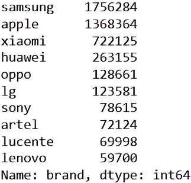
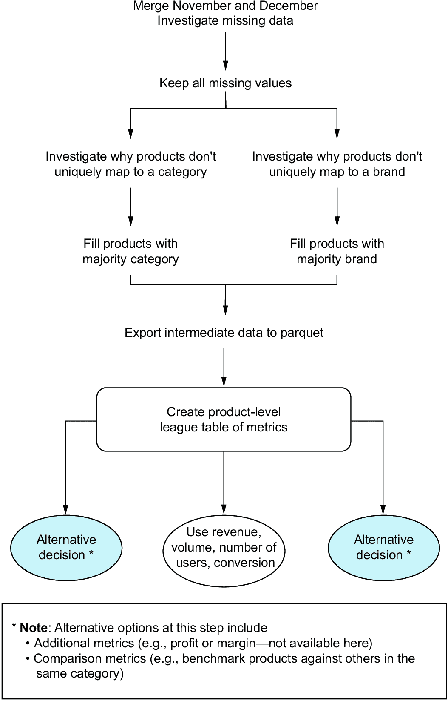

# 4 指标

### 本章涵盖

+   定义指标以使你的项目取得成功

+   识别错误的指标，这些指标衡量了错误的事情

+   评估所选指标的影响

在你的职业生涯中，你可能会被要求创建和维护一个跟踪业务关键绩效指标（KPIs）的仪表板。这是因为业务中发生的事情很多，简单的、总结性的指标是最常见的衡量和分析发生情况的方式。而不是从每个业务单元或员工那里获取详细的口头总结，高管们会查看诸如周转率、利润或利润率等关键数字的趋势。

##### 真实业务案例：定义关键业务指标

在我工作多年的二手车拍卖领域，一个重要的指标是转化率。该业务有多个分析和仪表板专门针对转化率相关的问题。

转化率被用来衡量我们能够为我们客户、即卖家，出售的拍卖汽车的比例。这似乎很简单，但结果却是业务中的每个人都对转化的定义没有达成一致，尤其是在汇总多个拍卖活动时。还有一个与之相关但不同的指标，称为“首次转化率”，这对利益相关者来说更难达成一致。

最初只是一个简单的指标，最终变成了一个大项目，涉及业务多个领域的协作来定义这些基本术语。指标定义至关重要，它们构成了本章项目的基石。

我们选择的指标定义了我们所做的每一件事，从董事会到个人分析师，因此我们需要确保它们有很好的定义。

## 4.1 明确定义指标的重要性

有时候，你会被要求衡量和跟踪一个定义不足或不适合问题的指标。任何分析的第一步，以及我们的以结果为导向的方法，是理解问题——在这种情况下，我们被要求衡量的指标。像“最佳”这样的词（例如，“什么月份是运行广告活动的最佳月份？”）表明某些事情还没有得到适当的定义。

一些常见的使用指标出错的方式包括

+   过度依赖指标会有意想不到的后果。一个例子是社交媒体平台试图最大化用户的注意力作为他们的关键指标。这激励了点击诱饵和引发强烈情感的内容。

+   该指标没有包含业务中每个重要的元素。学校被激励最大化学生出勤率而不是教育质量就是一个例子。

+   该指标没有衡量预期的结果。客户满意度的常见衡量标准是净推荐者分数或 NPS。这个分数的计算方式意味着只有给出 10 分中的 9 分或 10 分的用户才被认为是“推荐者”，而 8 分中的 10 分也被丢弃。这意味着可能得到一个很高的平均分数，但 NPS 却很低，这可能会误导。

在这些情况中，解决方案是选择一个更好地捕捉问题所有方面的指标，选择额外的指标来补充所选的单个指标，或者理想情况下，两者都选择。我们始终应该对声称完美总结复杂问题的单个指标持怀疑态度，并从不同的角度考虑解决方案。

单个指标可以让我们一目了然地了解整个企业的运营情况，但过度简化往往会有后果。一个相关的格言，Goodhart 定律，指出：“当一个衡量标准成为目标时，它就不再是一个好的衡量标准。”一旦你开始针对单个指标进行优化，它就不再是一个好的测量指标。这并不意味着使用简化的指标是错误的，但只是我们应该了解其后果。

本章的项目探讨了这一想法；它完全是关于根据模糊的利益相关者请求定义指标，所以让我们直接进入正题。

## 4.2 项目 3：为更好的决策制定定义精确的指标

让我们看看这个项目，我们将被要求定义和计算指标以找到表现最佳的产品。数据可在[`davidasboth.com/book-code`](https://davidasboth.com/book-code)上找到，你可以尝试该项目，以及以 Jupyter 笔记本形式的示例解决方案。

首先，让我们看一下问题陈述并检查业务背景。

### 4.2.1 问题陈述

在这种情况下，你是一名为电子商务初创公司 Online Odyssey Outlet 工作的初级分析师。如果你已经尝试了第三章的项目，实际上它就是同类型的初创公司。数据将与第三章的数据结构相似，如果不是完全相同。

注意：再次感谢 REES46 提供原始交易数据([`mng.bz/6eZo`](https://mng.bz/6eZo))，该数据仅为此项目进行了调整，通过过滤掉“查看”事件并仅保留注册用户（那些有有效`user_id`的用户）来缩小到可管理的规模。

日期是 2020 年 1 月，该初创公司刚刚经历了第一个冬季大促销。高级利益相关者希望了解哪些产品在圣诞节期间表现最好，以便他们可以简化未来促销期间宣传的产品。你将通过分析最多两个月的事件数据来完成这项工作，这些数据以两个具有相同结构的数据源的形式呈现。事件不仅指销售，还包括更普遍的客户行为，如在网上查看产品或将产品放入他们的虚拟购物车。

挑战在于，当被追问时，利益相关者并不确切知道他们所说的“最佳”是什么意思。在最初的头脑风暴会议中，他们强调了在产品排名时关心的某些方面：

+   销售量

+   单个产品的总收入

+   人气，通过购买产品的独特客户数量来衡量

+   转化率，即产品被放入虚拟购物车后购买的比例

+   11 月到 12 月表现提升的产品

你的利益相关者没有为这些因素分配权重，因此它们相对的重要性不明确，但你应该在呈现你的发现时考虑一个或多个这些指标。他们也对提出有助于提高未来销售表现的额外指标的建议持开放态度。

### 4.2.2 数据字典

表 4.1 显示了事件数据的数据字典，图 4.1 显示了部分样本数据。11 月和 12 月的事件分别在不同的表中，但结构相同，因此可以很容易地合并。

##### 表 4.1 事件数据的数据字典

| 列 | 描述 |
| --- | --- |
| `event_time`  | 交易日期和时间  |
| `event_type`  | 用户事件的类型，要么是`cart`（客户将产品放入购物车）要么是`purchase`（客户购买了商品）  |
| `product_id`  | 产品的唯一标识符  |
| `category_id`  | 产品类别的唯一标识符  |
| `category_code`  | 描述产品主要和子类别的代码  |
| `brand`  | 产品品牌（如果适用）  |
| `price`  | 产品的价格（添加到购物车时的列表价格，或事件为`购买`时的销售价格）以美元计  |
| `user_id`  | 已注册客户的唯一标识符  |
| `user_session`  | 用户浏览会话的唯一标识符  |


##### 图 4.1 事件数据的快照

### 4.2.3 预期结果

分析的输出应该是针对你选择的维度上表现最佳产品的推荐。推荐可以是单个产品 ID，也可以是更广泛的相关于品牌或产品类别的推荐，只要你在分析中合理地证明了最佳产品的选择。推荐可以以任何格式呈现给利益相关者。这可能是一整套演示文稿，一些精选的可视化，或者甚至只是由你的分析工具生成的数据表。

##### 活动：演示

考虑你将如何呈现你的发现。哪种格式最合适？你的利益相关者最感兴趣的是哪些细节？关键的是，你想要省略哪些不必要的细节？知道如何为合适的受众总结你的工作是重要的分析技能之一。

### 4.2.4 必需工具

对于本章的示例解决方案，我将使用 Python 库`pandas`来读取和处理数据集，使用`numpy`库进行额外的数值计算，以及使用`matplotlib`来创建可视化。与每个项目一样，你使用的具体技术并不重要，只要它满足每个项目的标准。对于这个项目，你需要一个可以

+   从 CSV 文件中按百万行顺序加载数据集

+   创建新列并操作现有列

+   合并（联合）具有相同结构的两个数据集

+   执行基本的数据操作任务，如排序、分组和重塑数据

+   创建数据可视化（可选）

## 4.3 将结果驱动方法应用于不同的指标定义

让我们再次使用以结果为导向的方法来分解问题。在像这样一个开放性问题中，了解我们的利益相关者希望从分析中获得什么尤为重要。我们需要了解一个最小可行答案，这个答案可以被接受并可能成为未来工作迭代的基石。


这一步在开始工作之前总是至关重要的，但在像这样一个开放性问题中尤其如此。关注利益相关者建议的不同指标意味着什么？

+   仅关注数量可能会过分夸大人们大量购买的产品相对于其他产品的价值。

+   仅关注总收入可能会过分强调昂贵的产品。

+   优先考虑流行度可能仅仅揭示了每个人都购买的产品，例如智能手机、衣服或厨房电器。然而，它可能有助于区分其类别中的“更好”产品（即，我们可以假设几乎每个人都将购买一部智能手机，但不是同一部）。

+   仅关注转化率可能会突出那些人们不太可能改变主意的产品，但与“最佳表现”是否有直接关系尚不清楚。

+   特定比较 11 月和 12 月之间的表现将直接针对利益相关者的问题，因为他们询问了圣诞节期间的最佳表现者。


这一步迫使我们甚至在开始之前就考虑我们工作的输出。在这种情况下，输出尚未明确定义。然而，我们知道我们的最小可行答案应该包含

+   在产品层面（例如，按产品排序的 12 月总收入表）对我们选择的指标进行测量

+   一个排名，以便我们可以突出表现最好的

+   选择哪些指标的理由

+   以表格或视觉形式总结我们的发现

+   如果需要，提供进一步迭代的建议

这些最终目标帮助我们确定在分析过程中应关注什么，因此我们不太可能无谓地陷入死胡同。


与第三章一样，我们的数据已经提供给我们，没有必要明确标识或获取。然而，我们可能想要执行的一个任务是检查所有可能的指标是否都可以用现有数据进行测量。这可以通过查看数据字典并在分析过程中验证我们的假设来完成。一个需要做出的选择是是否只关注 12 月的事件，还是包括 11 月的数据，以便我们可以在圣诞节前后比较产品性能。在未来的迭代中，我们也可能要求获取上一年的数据来进行年度比较，这是现有数据无法实现的。


在分析过程中，需要考虑的一些步骤包括

+   如果我们决定调查这些比较指标，则合并 11 月和 12 月的数据。

+   探索事件数据。我们特别感兴趣的问题包括

    +   什么使产品独特？其 ID 是否足够，ID 是否真的是一个唯一的标识符？有些产品目录可能会为不同的颜色变体多次列出相同的产品 ID，在这种情况下，ID 将不足以作为唯一的标识符。

    +   我们的数据中是否存在任何空白（例如，我们没有事件日期的日期）？识别空白将有助于我们了解可用数据的局限性。

    +   通常表现最好的类别/子类别/品牌是什么？这将有助于确定我们后来的结果是否在上下文中合理。

    +   产品价格分布如何？是否有需要进一步调查的异常值？如果我们选择探索产品收入，这一点尤为重要。

    +   产品流行度和转换率的基线是什么？再次强调，了解典型产品的转换率或一般有多少人购买某样东西将有助于将结果置于适当的背景中。

+   将数据聚合到产品级别，因为原始数据是在交易级别。

+   计算每个产品的选择指标

+   如果我们选择测量多个指标，则比较多个指标的产品

+   以表格或视觉形式总结我们的发现

+   如果利益相关者希望根据我们的发现深入了解问题，则建议进一步的工作


在展示我们的发现时，我们希望专注于总结我们的方法、我们选择的指标以及产生的最佳产品。需要关注的重要方面是“那么呢？”我们的发现应以建议采取具体行动的方式呈现。告诉利益相关者袜子全年销量良好，圣诞节期间销量激增，对他们来说可能不是新闻。如果我们选择创建幻灯片，我们应该力争三到四张幻灯片，自然流畅，简洁的信息，以及适当的可视化。在我们的代码中，这意味着我们应该创建最有效地传达我们发现的可视化。


我们通常希望在有一个最小可行答案时就向利益相关者展示我们的发现。这可能意味着在分析完成之前进行迭代。然而，在这个例子中，要调查的可能指标已经明确定义，我们应该为每个指标在我们的产品和可能还在类别和品牌上计算出一个值。这样，在讨论未来的迭代时，我们可以关注那些已经提出的指标之外的指标。

### 4.3.1 需要考虑的问题

在这个分析过程中，你应该始终思考以下内容：

+   每个选择的指标的定义是什么？像“量”或“收入”这样的词听起来很直观，但在计算之前需要严格定义。

+   选择特定指标作为“最佳”定义的影响是什么？“最佳”应该衡量什么，我们的定义将如何对利益相关者有用？

## 4.4 一个示例解决方案：寻找表现最佳的产品

让我们通过一个示例解决方案来解决这个问题。就像每个项目一样，我鼓励你在查看解决方案之前先尝试自己完成项目，并记住这只是一多种可能的解决问题的方法之一。探索步骤的顺序并不总是重要的。你可能会选择先调查数据的不同方面，而不是我选择的那些，这也是可以预料的。

至于我们的行动计划，我们首先将 11 月和 12 月的事件合并，并探索合并后的数据，同时解决任何数据问题。接下来，我们将数据聚合以生成产品级别的数据集。然后我们可以定义和计算多个指标，以查看产品排名在不同指标中的差异。最后，我们将总结我们的发现，看看我们可以向利益相关者提出哪些初步建议。

### 4.4.1 合并和探索产品数据

由于我们的两个数据集，11 月和 12 月的事件，在结构上是相同的，我们将在它们合并后只探索一次数据。让我们从这里开始：

```py
import pandas as pd
import numpy as np
import matplotlib.pyplot as plt

november = pd.read_csv("./data/november.csv.gz")
december = pd.read_csv("./data/december.csv.gz")

events = pd.concat([november, december], axis=0, ignore_index=True)
print(events.shape)
```

在这里，我们使用`pandas`库来连接两个数据集。如果你熟悉 SQL，这相当于一个并操作。代码的输出是`(7033125,` `9)`，这意味着我们有超过 700 万行和九列的数据。

现在是时候对数据进行一些基本合理性检查了。我们有没有任何缺失值？图 4.2 显示了查找缺失数据的输出：

```py
events.isnull().sum()
```


##### 图 4.2 我们事件数据中每列缺失值的行数

我们有一些用户会话缺失，这意味着我们不知道这 27 个事件属于哪个独特的浏览会话。这不应该影响我们的分析，因为我们感兴趣的是产品，所以我们可以保留这些行。对于`品牌`列来说，缺失值在这个阶段并不一定是个问题，因为我们还不知道我们将如何使用这些信息。

让我们开始构建我们的图表来记录我们的步骤。到目前为止，我们已经完成了图 4.3 中显示的步骤。


##### 图 4.3 我们分析的第一步，可视化展示

是时候继续前进，验证我们数据中的不同假设了，包括关于日期范围和产品分类的假设。

#### 验证数据中的假设

我们的下一个假设是我们确实有 11 月和 12 月的数据，我们应该独立验证。图 4.4 显示了检查我们数据中日期范围的输出：

```py
events["event_time"] = pd.to_datetime(events["event_time"],
↪ format="%Y-%m-%d %H:%M:%S %Z")
events["event_time"].agg(["min", "max"])
```


##### 图 4.4 我们数据中的日期范围

我们的数据在预期的范围内（11 月 1 日至 12 月 31 日），但我们仍然不知道我们是否每天都有事件数据。以下代码计算了每个月的独特天数，其输出结果如图 4.5 所示：

```py
(
    events
    .assign(month=events["event_time"].dt.month,
            day=events["event_time"].dt.day)      #1
    .groupby("month")
    ["day"]
    .nunique()     #2
)
```

#1 使用 assign 函数创建临时列用于日和月

#2 nunique 函数计算每个月的独特天数。


##### 图 4.5 每月遇到的天数的唯一数量

输出结果符合预期，因此我们数据中的每一天至少有一个事件。最后，我们还想了解事件数量是否在这些天中保持一致。以下代码计算并可视化了这个结果，输出图表如图 4.6 所示：

```py
fig, axis = plt.subplots(figsize=(10, 6))

(
    events
    .assign(month=events["event_time"].dt.month,
            day=events["event_time"].dt.day)
    .groupby(["month", "day"])
    .size()
    .plot
    .bar(ax=axis)
)

labels = (
    pd.date_range(                   #1
        events["event_time"].dt.date.min(),
        events["event_time"].dt.date.max(),
        freq="D")
    .strftime("%b %d")     #2
)

axis.set(title="Number of events per calendar day",
         xlabel="Number of rows",
         ylabel="Calendar day",
         xticklabels=labels)

plt.show()
```

#1 根据数据中的日期创建自定义轴标签

#2 标签格式化为“月日”（例如，“Nov 1”）


##### 图 4.6 每个日历日的活动数量，可视化展示

我们的数据清楚地显示了每天都有广泛的量级范围。我们关注的是图表中是否存在任何方向上的异常值。有七天低活动日，它们对应于 11 月的第一周。这可能意味着客户还没有像现在这样频繁地使用该平台，知道网站启动的确切时间将有助于将这些情况置于上下文中。在 11 月中旬也有三天特别高的活动。同样，这可能是因为用户参与度的自然增长或社交媒体帖子走红。这可能是由于当时进行的广告活动或促销活动造成的，或者可能是因为有销售活动。没有更多信息，我们只能猜测，但这是我们看到这些结果时需要做的猜测。

我们接下来要关注的是事件类型。我们数据中不同事件的比例是多少？图 4.7 显示了以下代码的输出：

```py
events["event_type"].value_counts(dropna=False)
```


##### 图 4.7 不同事件类型的比例

在典型的电子商务环境中，用户从探索开始，然后把商品放入购物车，最后购买它们，形成了一个事件漏斗。正如预期的那样，在这种情况下，我们观察到这个漏斗变窄了，这意味着我们看到的购买事件比购物车事件少得多。

现在是时候将我们的注意力转向产品目录，并调查电子商务平台提供的产品类型。首先，我们产品的典型价格范围是多少？图 4.8 显示了我们对价格的研究结果：

```py
fig, axis = plt.subplots()

(
    events["price"]
    .hist(bins=25, ax=axis)
)

axis.ticklabel_format(useOffset=False, style='plain') #1

axis.set(title="Distribution of product price",
         xlabel="Product price ($)",
         ylabel="Frequency")

plt.show()
```

#1 禁用科学记数法


##### 图 4.8 产品价格分布

这种输出在价格数据中很常见，即小值的聚类和向右的长偏斜。这意味着我们的大部分产品都标价或销售在 500 美元以下，有些异常值高达 2500 美元。

那么，品牌情况如何？图 4.9 展示了使用以下代码获取的前 10 大品牌。故意不包括缺失的品牌：

```py
events["brand"].value_counts().head(10)
```



##### 图 4.9 按事件数量排名的前 10 大品牌

一眼看上去，这似乎表明我们的大部分用户事件都集中在技术类别上。我们独特的商品目录的实际构成可能不同，如果我们只看购买事件，前 10 大品牌也可能不同。现在我们已经看了品牌，让我们也看看产品类别。

#### 调查产品类别的一致性

我们的产品是否被正确分类？这是我们每次拥有带有 ID 和相关分配类别的数据集时都应该提出的问题。一种检查方法是问，我们是否有任何产品 ID 被分配到多个类别？以下代码对此进行了调查，输出显示在图 4.10 中：

```py
(
    events
    .groupby("product_id")
    ["category_code"]
    .nunique()                     #1
    .loc[lambda x: x > 1]          #2
    .sort_values(ascending=False)
)
```

#1 首先，计算每个产品 ID 遇到的唯一类别代码的数量

#2 查找计数超过 1 的实例


##### 图 4.10 调查分配给多个类别的产品的结果

如我们所见，近 13000 个产品被分配到多个类别。这表明我们的基础产品目录中可能存在某个错误。让我们查看顶级类别代码以进一步调查。图 4.11 显示了查看前 10 个最常见类别代码的输出：

```py
events["category_code"].value_counts().head(10)
```


##### 图 4.11 按行数排名的前 10 个类别代码

这并不一定意味着我们的大部分产品都在“轻型建筑工具”类别中，因为这是事件数量，而不是独特产品的数量，但它确实表明了一个与我们在图 4.10 中发现的类似问题。让我们通过查看这个“轻型建筑工具”类别中的前 10 大品牌来了解品牌和类别代码如何交叉。以下代码生成了图 4.12 中的输出：

```py
(
    events
    .loc[events["category_code"] == "construction.tools.light", "brand"]
    .value_counts()
    .head(10)
)
```


##### 图 4.12 `construction.tools.light`类别中的前 10 大品牌

除非技术制造商秘密扩展到建筑工具领域，否则我们在产品类别上存在问题。这些品牌通常以智能手机而闻名，我们可以看看一些例子来验证这一点。以下代码找出所有针对多个代码的产品 ID，以便我们知道哪些需要关注。图 4.13 显示了这些产品 ID 子集的样本：

```py
dupe_product_ids = (
    events
    .groupby("product_id")
    ["category_code"]
    .nunique()
    .loc[lambda x: x > 1]
    .index
    .values
)

dupe_product_ids[:10]
```


##### 图 4.13 具有多个分配类别的产品 ID 子集

从这个数据子集中，我们可以找到一类是“轻型建筑工具”的实例，并查看该产品被分配到哪些其他类别。以下代码和图 4.14 展示了示例：

```py
(
    events.loc[events["product_id"] == 1001588,
               "category_code"]
    .value_counts()
)
```


##### 图 4.14 特定错误产品的类别分解

在这个例子中，我们有一部也被错误分类为建筑工具的手机。我们现在必须做出一个重大决定：我们如何处理这些产品？我们有几个选择：

+   *忽略这个问题* — 缺点是，由于我们知道它经常被错误分配，我们将无法使用分类代码来调查表现最好的产品。

+   *丢弃错误分类的产品* — 问题在于这可能是我们数据中相当大的一部分。

+   *修复产品分类* — 这看起来是最好的方法，但我们可能没有足够的信息来为每个产品找到正确的类别。

在现实中，我们希望了解更多关于这些产品类别是如何产生的信息，理想情况下，我们应该从源头解决问题。然而，在这种情况下，我们只有这些数据可以工作，所以让我们尝试使用我们拥有的数据来修复问题。

#### 修复数据类别的不一致性

我们的行动计划是找到具有重复类别的产品，对于其中一个是`construction.tools.light`的情况，我们使用另一个类别。对于不涉及`construction.tools.light`类别的重复情况，我们需要相应地调查或使用多数类别。例如，如果一个产品 ID 主要被分类为冰箱，但有时被分类为智能手机，我们将覆盖数据，使产品 ID 始终位于冰箱类别中。存在错误分类某些产品的风险，但我们也将会修复建筑工具类别的错误。

以下代码定义了一个修复单个产品 ID 分类代码的方法，并将其应用于所有重复的产品 ID 数据。输出是受影响的产品 ID 的每个新分类代码，如图 4.15 所示：

```py
def get_correct_category_code(product_id_rows):
    categories = product_id_rows["category_code"].value_counts() #1

    if "construction.tools.light" in categories.index: #2
        return categories.index.drop("construction.tools.light").values[0]
    else:
        return categories.index[0] #3

corrected_categories = (
    events[events["product_id"].isin(dupe_product_ids)]
    .groupby("product_id")
    .apply(get_correct_category_code)
    .reset_index(name="corrected_category")
)

corrected_categories.head()
```

#1 `product_id_rows` 包含一个产品 ID 的所有行，因此我们可以找到与该 ID 相关的两个类别。

#2 如果一个是`construction.tools.light`，则返回另一个。

#3 否则，返回多数类别。


##### 图 4.15 我们将使用以纠正产品 ID 类别的数据预览

如图 4.15 所示，我们有很多产品应该是智能手机，但并不总是被这样分类。现在，我们将这个修正后的分类数据与我们的原始事件数据集合并，并覆盖原始和修正分类不匹配的分类。为了验证我们的更改，我们将再次查看顶级分类代码，并将我们的结果与图 4.11 进行比较。以下代码产生了一个类似的结果，如图 4.16 所示：

```py
events = events.merge(corrected_categories, on="product_id", how="left")
events.loc[events["corrected_category"].notnull(), "category_code"] = \
↪ events.loc[events["corrected_category"].notnull(), "corrected_category"]

events["category_code"].value_counts()
```


##### 图 4.16 应用我们的修正后分类代码的细分

现在，我们的数据主要是由智能手机组成，这与我们关于最受欢迎的品牌的研究结果更为一致。需要注意的是，我们可能高估了智能手机的普及率，因为我们对如何处理数据做出了特定的假设，这些假设可能并不正确。然而，在现有数据中，我们没有足够的信息来进一步调查这一点。

检查后，这个分类代码列还包含一个“主要”类别，对应于字符串的第一个部分，直到第一个点字符，这可能对我们的分析有用，所以让我们将其隔离出来。以下代码的输出显示了这一主要类别的细分，如图 4.17 所示：

```py
events["category"] = events["category_code"].str.split(".").str[0]

events = events.rename(columns={"category_code": "subcategory"})

events["category"].value_counts()
```


##### 图 4.17 产品“主要”类别的细分

这个表格进一步使我们相信，我们的大部分产品都是某种类型的电子产品。在我们继续在产品级别总结数据之前，我们想要确保特定的产品 ID 只指代一个产品。我们将很快到达这一步。在继续之前，让我们总结一下到目前为止的工作。图 4.18 显示了我们所采取的步骤以及我们的决策可能发生分歧的地方。


##### 图 4.18 我们到目前为止的分析步骤

产品分类的另一种方式是使用它们的品牌。我们也应该调查是否有任何产品 ID 对应多个品牌。考虑到我们对`brand`列有缺失数据，这似乎是一个相关的步骤。

#### 调查品牌标签的一致性

在这里，为了调查每个产品是否只附有一个品牌，我们遵循了一个与我们在产品分类时非常相似的过程。以下代码的输出显示在图 4.19 中：

```py
duplicated_brands = (
    events
    .assign(brand = events["brand"].fillna("No brand"))   #1
    .groupby("product_id")
    ["brand"]
    .nunique()
    .loc[lambda x: x > 1]
    .index
)

print(len(duplicated_brands))

duplicated_brands[:10]
```

#1 使用占位符暂时填充缺失的品牌数据，因为 nunique 函数忽略了缺失值


##### 图 4.19 检查带有多个品牌的产品的结果

在我们的目录中有 1,245 个产品，它们要么有两个不同的品牌，要么有时缺少`brand`列。为了清理这些数据，我们将应用类似于我们用于类别的逻辑：对于有多个品牌的产品，我们选择多数非空品牌。以下代码块实现了此逻辑，输出是产品 ID 到它们应分配的品牌映射。图 4.20 显示了此输出的一个子集：

```py
def get_correct_brand(product_id_rows):
    brand_counts = product_id_rows["brand"].value_counts(dropna=False) #1

    if isinstance(brand_counts.index[0], str):
        return brand_counts.index[0] #2

    if len(brand_counts) == 1:
        return np.nan #3

    return brand_counts.index[1] #4

corrected_brands = (
    events[events["product_id"].isin(duplicated_brands)]
    .groupby("product_id")
    .apply(get_correct_brand)
    .reset_index(name="corrected_brand")
)

corrected_brands.head()
```

#1 product_id_rows 包含一个产品 ID 的所有行，因此我们可以找到与该 ID 关联的品牌。使用 value_counts 将只给出非 NA 值。

#2 如果没有 NA 值，则直接返回多数品牌。

#3 现在，如果 np.NaN 是唯一值，则返回它。

#4 否则，返回第二个值（多数非空值）。


##### 图 4.20 产品 ID 与它们应分配的品牌

类似于我们处理类别的方式，我们可以将这些修正后的品牌与原始事件数据连接起来，并在必要时覆盖`brand`列。

#### 修正品牌标签的不一致性

我们使用以下代码执行此操作，之后我们验证是否有任何产品 ID 仍然有多个品牌和类别的组合。预期的输出是没有这样的产品 ID，唯一的产品 ID、类别和品牌组合的数量应与唯一产品 ID 的数量相匹配。运行以下代码块不会导致断言错误，这意味着条件得到满足，产品 ID 最终以独特的方式分类：

```py
events = events.merge(corrected_brands, on="product_id", how="left")
events.loc[events["corrected_brand"].notnull(), "brand"] = \
    events.loc[events["corrected_brand"].notnull(), "corrected_brand"]

assert (
    len(events[["product_id", "category", "subcategory", "brand"]]
        .drop_duplicates())
    ==
    events["product_id"].nunique()
)
```

在项目的剩余部分，我们将处理产品级数据，因此一个有用的步骤是为每个产品赋予一个更具描述性的名称，尤其是因为我们没有“产品名称”列。每个产品 ID 应该有一个唯一名称，这意味着产品 ID 应该是名称的一部分，因为这是我们数据集中产品独特性的原因。我们可以将产品的 ID、品牌和类别代码组合起来，为每个产品得到一个更易读的字符串。以下代码执行此操作，并显示了包含此附加列的数据输出，如图 4.21 所示：

```py
def get_product_name(row):
    brand = ""

    if isinstance(row["brand"], str):  #1
        brand = row["brand"]

    return f"{str(row['product_id'])} - {brand} {row['subcategory']}" 

events["product_name"] = events.apply(get_product_name, axis=1)

events.head()
```

#1 仅当品牌可用时包含品牌。


##### 图 4.21 新增到事件数据中的列的快照

最后，我们可能希望将此修改后的数据导出到一个中间数据集中，我们可以使用它进行分析。由于数据量较大，一些操作可能需要几分钟，我们不希望每次回到分析工作时都成为瓶颈。

#### 将中间数据模型导出以将数据清洗与分析分离

将清理数据的代码与分析数据的代码分开是一种良好的做法。一种方法是将清理后的数据输出到单独的文件中，分析代码可以直接读取。

中间数据可以是任何格式，但*parquet*很有用，因为它是一种压缩的数据格式，它存储类型信息，与 CSV 等其他格式不同。这意味着当我们未来读取 parquet 文件时，我们不需要将日期列转换为日期类型，因为我们的代码已经知道它们：

```py
events.to_parquet("./data/events.parquet.gz", compression="gzip")
```

在继续之前，让我们总结一下这一部分的分析。图 4.22 显示了到目前为止我们所采取的步骤，直到我们导出我们的中间数据集。请注意，我们对类别和品牌的调查是并排表示的，因为它们是相互独立的，可以按任何顺序完成。


##### 图 4.22 分析第一部分的所有步骤

现在，我们准备继续进行解决方案的第二部分，即总结数据到产品级别并计算所有相关指标。

### 4.4.2 计算产品级指标

我们已经探索并清理了我们的数据，现在准备开始查看我们想要的指标。然而，首先我们需要将数据转换到正确的粒度。

#### 改变数据的粒度以适应问题

原始数据在事件级别，而我们感兴趣的是产品，因此我们应该将数据聚合，使每行对应一个产品。在这样做的时候，我们需要定义各种聚合来在正确的级别上总结数据。为了了解我们需要哪些聚合，我们必须精确地定义我们的指标。根据我们的项目概述，我们将计算的指标是

+   *体积* — 指定产品 ID 的购买事件数量。我们没有“数量”列，这意味着如果某个用户购买了同一产品两次，数据中会有两行分别表示这一情况。因此，通过计算对应购买事件的行数，我们可以统计产品的销售量。

+   *收入* — `价格`列的总和。我们没有关于运费、产品的批发成本或税额的信息，因此我们只能计算每个产品的毛总收入。

+   *受欢迎程度* — 购买产品的独特用户数量。这将忽略单个用户购买多个产品的情况，但可以作为受欢迎程度的良好代理。

+   *性能变化* — 对于这一点，我们将简单地分别计算 11 月和 12 月事件中的每个指标。

+   *转化率* — 给定数据，它将被定义为在给定期间内购买事件作为购物车事件的百分比。也就是说，在所有有人将商品放入购物车的情况下，有多少百分比变成了购买事件？理想情况下，我们也会考虑有多少百分比查看的商品变成了销售，但我们没有数据来回答这个问题。

转化率是一个棘手的指标，因为分母可以有多种解释方式。例如，如果用户将一个项目放入购物车，然后移除它，再次添加，并最终购买，我们可能会有两个事件贡献给分母而不是一个。我们是否将这些事件作为单个实例去重或使用两行将影响我们的转化率。在这里，在计算转化率时，我们将保持简单，将所有购物车事件作为我们的分母，所有购买事件作为我们的分子。

考虑到我们感兴趣的指标类型，我们在产品级别的聚合将包括

+   11 月和 12 月的数据分别进行月度比较

+   收入的`价格`列总和

+   行数计数以衡量数量

+   独特用户数量以衡量受欢迎程度

+   每月数字之间的差异

+   购物车和购买事件的次数，以便我们可以计算转化率

对于除了转化率以外的所有指标，我们只需要购买事件。只有在引入转化率时，我们才想查看购物车事件。因此，为了使我们的代码更高效，我们将在单独计算转化率指标并将其加入之后，在购买事件之前计算大多数指标。

要做到这一点，我们需要将购物车事件数据与购买事件数据分开：

```py
purchases = events[events["event_type"] == "purchase"].copy()
carts = events[events["event_type"] == "cart"].copy()
```

现在，让我们逐步构建一个按产品级别的指标联赛表（排名系统）。

#### 同时计算多个指标

创建这个联赛表将是一段密集的代码，因为这是我们进行更多计算的地方，所以让我们将其分解为其单独的步骤。首先，我们创建新的指标列来计算月度值。指标是包含值或回退值（如 0）的列，如果数据行不符合所需的条件。在这种情况下，`november_revenue`将包含 11 月份事件的价格列的值。否则，它将包含 0。因此，计算给定产品 ID 此列的总和将只给我们 11 月份的总收入。以下代码创建了指标列：

```py
purchases
    .assign(
        november_count=np.where(purchases["event_time"].dt.month==11,
↪ 1, 0),
        november_revenue=np.where(purchases["event_time"].dt.month==11, 
↪ purchases["price"], 0),
        november_user_id=np.where(purchases["event_time"].dt.month==11, 
↪ purchases["user_id"], np.nan),
        december_count=np.where(purchases["event_time"].dt.month==12,
↪ 1, 0),
        december_revenue=np.where(purchases["event_time"].dt.month==12, 
↪ purchases["price"], 0),
        december_user_id=np.where(purchases["event_time"].dt.month==12, 
↪ purchases["user_id"], np.nan))
```

接下来，我们按产品 ID 分组我们的数据，并总结这些新的指标列以获取月收入、行数和唯一用户 ID 计数：

```py
.groupby(["product_id", "product_name"])
    .agg(november_volume=('november_count', 'sum'),
         november_revenue=('november_revenue', 'sum'),
         november_users=('november_user_id', 'nunique'),
         december_volume=('december_count', 'sum'),
         december_revenue=('december_revenue', 'sum'),
         december_users=('december_user_id', 'nunique')
    )
```

最后，我们创建新的列来计算 11 月和 12 月数字之间的差异。这给我们所有所需的指标，这些指标只需要购买事件数据。这就是我们将加入我们的转化率指标的数据库。以下是最终的完整代码块，图 4.23 显示了创建的联赛表的快照：

```py
purchases_league_table = (
    purchases
    .assign(
        november_count=np.where(purchases["event_time"].dt.month==11,
↪ 1, 0),
        november_revenue=np.where(purchases["event_time"].dt.month==11, 
↪ purchases["price"], 0),
        november_user_id=np.where(purchases["event_time"].dt.month==11, 
↪ purchases["user_id"], np.nan),
        december_count=np.where(purchases["event_time"].dt.month==12, 
↪ 1, 0),
        december_revenue=np.where(purchases["event_time"].dt.month==12, 
↪ purchases["price"], 0),
        december_user_id=np.where(purchases["event_time"].dt.month==12, 
↪ purchases["user_id"], np.nan))
    .groupby(["product_id", "product_name"])
    .agg(november_volume=('november_count', 'sum'),
         november_revenue=('november_revenue', 'sum'),
         november_users=('november_user_id', 'nunique'),
         december_volume=('december_count', 'sum'),
         december_revenue=('december_revenue', 'sum'),
         december_users=('december_user_id', 'nunique')
    )
    .assign(
        volume_diff=lambda x:
            x["december_volume"] - x["november_volume"],
        revenue_diff=lambda x:
            x["december_revenue"] - x["november_revenue"],
        users_diff=lambda x:
            x["december_users"] - x["november_users"])
    .reset_index()
)

purchases_league_table.head()
```


##### 图 4.23 购买联赛表数据的快照

从这张表中，我们可以一目了然地获取大量信息，包括

+   11 月份比 12 月份销售更多，反之亦然的产品

+   11 月份没有销售但在 12 月份销售的产品

+   比较每月购买产品数量多或少

在某些方面，我们甚至可以在这里停下来，通过根据我们认为代表最佳产品指标的列对这张表进行排序来简单地使用这张表来回答我们的问题。然而，我们还想首先计算转换指标。以下代码计算了每个月每个产品 ID 每个事件类型的行数：

```py
conversion_table = (
    pd.pivot_table(
        data=events.assign(month=events["event_time"].dt.month),
        index=["product_id", "product_name"],
        columns=["month", "event_type"],
        values="user_session",
        aggfunc="count"
    )
    .fillna(0)
    .set_axis(labels=["november_cart", "november_sold",
↪ "december_cart", "december_sold"],
              axis=1)
    .reset_index()
    .assign(november_conversion
↪ = lambda x: x["november_sold"] / x["november_cart"],
            december_conversion
↪ = lambda x: x["december_sold"] / x["december_cart"])
)

conversion_table.head()
```

使用`pandas`中的`pivot_table`函数意味着这个表可以扩展到计算任何数量的事件类型，如果我们要获取查看事件的数据，也可以使用。这在这里不是严格必要的，但它需要一点预防性的编码来为未来的情况做准备。图 4.24 显示了这个转换联赛表的快照。


##### 图 4.24 转换联赛表数据的快照

从这个快照中，我们已经发现了一个问题；这些数据将包含缺失值。没有购物车或购买事件会导致缺失值，而不是零，因为严格来说，0 转换意味着我们有了购物车事件，但没有一个导致了购买。每次你计算除法时，你也应该准备好遇到无穷大的值，这发生在你尝试除以零时。

目前，让我们合并这两个产品联赛表，并确保产品 ID 是唯一的。图 4.25 显示了当我们查看这个合并的指标数据集的列时的输出：

```py
league_table = purchases_league_table.merge(conversion_table,
↪ on=["product_id", "product_name"], how="left")
assert len(league_table) == purchases["product_id"].nunique()
league_table.dtypes
```


##### 图 4.25 我们的指标表中的列及其数据类型

让我们将这些最新的步骤添加到我们不断增长的图中，以展示我们的分析步骤。图 4.26 显示了最新版本。我将产品品牌和类别的调查并排放置，以表明它们是独立发生的，并且不一定按照特定的顺序依次进行。



##### 图 4.26 到目前为止采取的步骤，直到创建指标联赛表

现在，我们有了所有我们可能感兴趣的指标，下一步是查看表现良好的产品。

### 4.4.3 使用我们定义的指标寻找最佳产品

在所有这些指标都到位的情况下，我们如何使用它们来找到“最佳”产品？答案是，正如通常情况下那样，这取决于。

#### 根据具体问题定义指标

我们有多种选择，例如

+   选择一个单一指标来对联赛表进行排序，并将前*N*名产品视为最佳。

+   我们可以通过每个指标的相对重要性对其进行加权，创建一个加权指标值的组合，以得出一个单一值来定义每个产品，并使用该值来找到前*N*名。

+   如果我们特别关注 12 月份的表现者，我们可以查看差异指标中的异常值，例如 11 月和 12 月之间的数量差异。

选项还有很多，但由于简要报告特别关注的是 12 月份的销售期，我们将集中精力在那些月销量增长最大的产品上。我们应该关注哪些指标来衡量这种差异？我们的选项有

+   *收入变化* — 关注绝对收入可能会使贵重商品扭曲我们的结果。

+   *唯一用户数量变化* — 这可能是一个衡量产品月度表现良好的良好指标。

+   *销量变化* — 这似乎是一个坚实、合理的起点，因为仅仅每月销量增加就是一个良好表现的指标。

我们首先应该了解典型月份间的销量变化。图 4.27 显示了以下代码生成的直方图：

```py
fig, axis = plt.subplots()

league_table["volume_diff"].hist(bins=100, ax=axis)

axis.set(title="Distribution of month-on-month change in volume",
         xlabel="Change in volume from November to December",
         ylabel="Frequency")
```


##### 图 4.27 产品月销量变化的直方图

显然，存在异常值，这些异常值使这个直方图失去了实用性。让我们放大中间部分，看看月销量变化是否围绕零中心。以下代码生成了图 4.28 中的直方图：

```py
fig, axis = plt.subplots()

league_table.loc[league_table["volume_diff"].between(-100,100),
↪ "volume_diff"].hist(bins=100, ax=axis)

axis.set(title="Distribution of month-on-month change in volume",
         xlabel="Change in volume from November to December",
         ylabel="Frequency")
```


##### 图 4.28 图 4.27 的放大版本

仔细观察这个直方图，我们发现大多数产品的月销量变化不大，有些产品销量增加，而有些产品销量减少。然而，这些都是绝对值。每月通常只卖出少量商品的产品在这些图表中可能被低估。因此，我们实际上应该计算并查看销量变化的百分比。以下代码计算了这个值，并生成了如图 4.29 所示的百分比变化直方图。请注意，代码还移除了缺失的百分比变化值，以及除以零时产生的无穷大值：

```py
league_table["volume_diff_pct"] = (
    100 * (league_table["volume_diff"] / league_table["november_volume"])
)

fig, axis = plt.subplots()

(
    league_table["volume_diff_pct"]
    .replace([np.inf, -np.inf], np.nan)
    .dropna()
    .loc[lambda x: x.between(-101,501)]
    .hist(bins=50, ax=axis)
)

axis.set(
    title="Distribution of month-on-month percentage change in volume",
    xlabel="% difference between sales in November and December",
    ylabel="Frequency"
)
```


##### 图 4.29 销售量月度百分比变化的分布

此图表显示，与 11 月相比，大多数产品在 12 月实际上没有卖出任何东西，因为-100%的变化意味着 12 月没有卖出任何商品。也有一些产品月销量增加了两倍、三倍、四倍和五倍。使用百分比值时，我们需要注意可能出现的偏差。例如，如果我们 11 月卖出了一件产品，12 月卖出了五件，这是 500%的变化，但可能不像在上一月只卖出 500 件时卖出 1000 件那样具有重大意义，尽管从技术上讲这是一个更小的百分比变化。减轻这种问题的一种方法是不包括那些通常只卖出少量商品的项目。

在我们继续分析之前，我们应该在我们的排行榜中包含更多的产品细节，这样当我们识别出高绩效产品时，我们可以查看它们代表哪些类别或品牌。

#### 根据我们的发现迭代我们的指标

我们本可以在创建排行榜时使用这些额外数据来增强我们的产品，但我们现在在分析的这个阶段这样做是为了响应我们进一步调查的愿望。以下代码创建了一个产品目录，我们可以将其与排行榜连接以添加额外的产品细节。图 4.30 显示了该产品目录的快照：

```py
product_catalog = (
    events[["product_id", "product_name", "category_id", "subcategory",
↪ "brand", "category"]]
    .drop_duplicates(subset=["product_id", "product_name", "subcategory",
↪ "brand", "category"])
)

assert len(product_catalog) == events["product_id"].nunique()

print(product_catalog.shape)
product_catalog.head()
```


##### 图 4.30 产品目录快照

现在，我们通过定义特定产品销售数量作为寻找顶级表现者的截止点来继续我们的分析。排除每次只售出少量产品的产品意味着高百分比变化值更有可能是有意义的：

```py
DEC_VS_NOV_PCT_CUTOFF = 200
NOV_VOLUME_CUTOFF = 10
ONLY_DEC_VOLUME_CUTOFF = 100

december_high_performers = (
    pd.concat(
    [
        league_table[(np.isinf(league_table["volume_diff_pct"]) == False)
            & (league_table["november_volume"] > NOV_VOLUME_CUTOFF)
            & (league_table["volume_diff_pct"] > DEC_VS_NOV_PCT_CUTOFF)],
        league_table[(np.isinf(league_table["volume_diff_pct"]))
            & (league_table["december_volume"] > ONLY_DEC_VOLUME_CUTOFF)]
    ],
    axis=0,
    ignore_index=True)
    .merge(product_catalog.drop(columns="product_name"), on="product_id")
)

print(december_high_performers.shape)
```

在这里，我们定义了一些截止点，这意味着我们只考虑那些

+   在十二月售出的数量是十一月的两倍以上

+   在十一月至少售出 10 件

+   在十二月至少售出 100 件

这些截止点有些是任意选择的，改变它们将会影响我们的结果，但它们确实确保我们只识别出在十二月真正超越自己的产品。我们特定的截止点产生了 449 个产品。我们可以直接将这些产品提供给我们的利益相关者，或者我们可以进行进一步的分析，看看哪些类型的产品更频繁地出现在高绩效者名单中。让我们来看看这些高绩效产品的顶级类别、子类别和品牌。这些分别显示在图 4.31 至图 4.33 中：

```py
from IPython.display import display

for col in ["category", "subcategory", "brand"]:
    print(col)
    display(december_high_performers[col].value_counts())
```


##### 图 4.31 顶级产品类别


##### 图 4.32 顶级产品子类别


##### 图 4.33 顶级产品品牌

从结果中可以看出，智能手机、各种服装和 Lucente 制造的产品在十二月的最佳表现者排名中位居前列。还有一些咖啡研磨机似乎表现良好。实际上，更深入地挖掘结果表明，这些咖啡研磨机占 Lucente 在排行榜上成功的大部分。以下代码显示了如图 4.34 所示的类别、子类别和品牌的顶级唯一组合：

```py
december_high_performers[["category", "subcategory", "brand"]]
↪ .value_counts().head(10)
```


##### 图 4.34 按类别和品牌划分的顶级产品

最终表格中的一个可能引起注意的方面是索尼制造的鞋子的存在，这可能需要一些调查。它们可能是真正的索尼品牌鞋子，或者是不正确分类的产品。

我们现在有足够的结果可以向利益相关者展示。为了回顾，我们有

+   合并了事件数据集

+   清理了错误分类的产品数据

+   计算了所有感兴趣的可能的指标

+   决定将什么作为“最佳”的衡量标准

+   根据我们选择的指标提取了最高绩效的产品

+   对这些高绩效者进行了更详细的研究

无论您选择哪个（些）度量，过程都将与这个示例解决方案中显示的过程相似。我们不太可能得出相同的结论，因为这些结论完全取决于您在整个分析过程中的选择。

让我们简要看看当我们使用不同的度量来定义最佳产品时会发生什么，以及这如何影响我们的结果。

#### 调查替代的度量定义

如果我们决定最佳产品是那些在 12 月份将最多购物车事件转化为购买事件的，会发生什么？首先，我们使用以下代码生成图 4.35 中的直方图，显示 12 月份的转化率分布：

```py
fig, axis = plt.subplots()

(
    league_table[(np.isinf(league_table["december_conversion"]) == False)
↪ & (np.isnan(league_table["december_conversion"]) == False)]
    ["december_conversion"]
    .mul(100)
    .hist(bins=50, ax=axis)
)

axis.set(
    title="Distribution of December conversion",
    xlabel="Conversion (%)",
    ylabel="Frequency"
)
```


##### 图 4.35 12 月份转化率分布

大多数产品的转化率大约在 30%左右，但有很多产品的转化率是 100%，甚至更多。后者理论上是不可能的，因为我们逻辑上不应该有比放入购物车的商品更多的购买。让我们调查这些记录。以下代码仅提取转化率超过 99%的行，并排除无限值和其他数据错误。使用这些结果，我们检查了一个高转化率的单个示例，如图 4.36 所示：

```py
(
    league_table[(np.isinf(league_table["december_conversion"]) == False)
                 & (np.isnan(league_table["december_conversion"]) == False)
                 & (league_table["december_conversion"] > 0.99)]
    .sort_values("december_conversion", ascending=False)
    .head(20)
)
events[(events["product_id"] == 9200694)
↪ & (events["event_time"].dt.month == 12)]
```


##### 图 4.36 导致超过 100%转化率的原始数据示例

有一个围巾，同一个用户在两个不同的日期购买了三次，但只关联了一个购物车事件。这可能意味着我们遗漏了两个购物车事件的数据错误，或者我们对数据生成过程做出了错误的假设。当我们说转化率不应超过 100%时，我们假设了一个线性过程，其中用户在将商品放入购物车之前不能进行购买。然而，可能存在一个“订单”页面，用户可以查看他们的过去订单并重新订购产品，同时绕过购物车屏幕。如果情况如此，图 4.35 中显示的数据就不会令人意外。

如此看来，我们无法知道这些实例是否有效，因此为了得到我们的顶级表现者，我们可以简单地限制我们的数据在 100%以下转化率。让我们还规定一些截止点，并说一个产品必须至少被*N*个用户购买，总销售量达到*M*，才能包括在我们的顶级转化表现者中。以下代码确定了顶级表现者，总共有 55 行：

```py
MIN_USERS = 5
MIN_PURCHASES = 10
CONVERSION_LOWER_LIMIT = 0.7

best_december_converters = (
    league_table[(np.isinf(league_table["december_conversion"]) == False)
             & (np.isnan(league_table["december_conversion"]) == False)
             & (league_table["december_conversion"]
↪ .between(CONVERSION_LOWER_LIMIT, 1))
             & (league_table["december_users"] > MIN_USERS)
             & (league_table["december_sold"] > MIN_PURCHASES)]
    .sort_values("december_conversion", ascending=False)
    .merge(product_catalog.drop(columns=["product_name"]),
↪ on=["product_id"])
)

print(best_december_converters.shape)
```

这意味着总共有 55 个产品至少被五个不同的用户购买，总销售量至少为 10，并且将超过 70%的购物车事件转化为购买事件。现在我们可以通过查看它们的类别来查看这些产品对应的是什么。这个输出在图 4.37 中显示：

```py
best_december_converters["category"].value_counts()
```


##### 图 4.37 最高转化率产品类别

结果与基于体积的排名大相径庭。当考虑转换率为关键指标时，家具和建筑用品成为表现最好的类别。进一步分析，使用以下代码可以得到图 4.38 所示的结果：

```py
best_december_converters.loc[best_december_converters["category"]
↪ .isin(["furniture", "construction"]), "subcategory"].value_counts()
```


##### 图 4.38 12 月份转换率最高的家具和建筑产品

这告诉我们，一旦大多数人已经识别了一个水龙头、钻头或沙发，他们很可能会继续购买。智能手机在基于转换率的排名中占比较少，这可能表明即使在将商品放入购物车后，人们对智能手机的购买也可能不确定。

在总结我们的结论之前，让我们以图表的形式回顾整个分析过程，以便提醒自己采取的步骤以及我们的选择可能出现的分歧。图 4.39 展示了最终的图示。


##### 图 4.39 显示我们分析中所有步骤和决策点的最终图示

我们现在已准备好总结我们的结果，以便向我们的利益相关者展示。

#### 项目成果

根据这些结果，向我们的利益相关者推荐经典圣诞礼物，如智能手机和厨房电器，在 12 月份可能表现良好。基于转换率的结果说服力较弱，因为它们只突出了人们在将产品添加到购物车后购买的产品，但它们可能不会告诉我们关于这些产品成功与否的任何信息。

与以往一样，我们的分析存在局限性。我们没有考虑产品价格与性能之间的相关性。我们的数据可能隐含地告诉我们何时有促销活动，我们可以通过观察价格突然下降的产品来识别这些促销活动，这可以为我们决定在促销期间哪些产品销售最好提供信息。我们还可以请求额外的定价数据，例如邮费、税费或商品批发成本。这个数据可以告诉我们哪些产品创造了最多的收入，也可以告诉我们哪些产品创造了最高的利润。

我们仅限于两个月的数据也意味着我们的分析是不完整的。拥有更多数据将使我们能够更好地基准测试我们的产品，并看到哪些产品的表现与平均基线性能差异最大。目前，我们基于一个月的数据进行分析，这可能是不足够的。

我们最初的发现需要与我们的利益相关者进行进一步讨论，并且，希望向他们展示选择不同指标的影响能帮助他们关注真正重要的指标。在选择向他们展示的内容时，考虑我们的建议是否可行很重要。告诉利益相关者人们通常购买他们已经识别的水龙头、钻头或沙发，这不太可能促使他们采取行动，而告诉他们智能手机在 12 月期间最能增加他们的销售额则更有可能促使他们采取行动。

##### 活动：使用这些数据的进一步项目想法

本章中的电子商务数据为你提供了大量练习计算和反思不同指标的机会。与所有项目一样，我建议考虑不同的研究问题，例如

+   哪些产品的价格波动比其他产品更大？没有理由假设同一产品 ID 每次都以相同的金额出售。

+   数据中是否存在时间模式（例如，周末比工作日销售更多或转化更好的产品）？

+   你可以深入产品目录，寻找表现优于其他子类别的子类别。这里的“更好”意味着什么？

## 4.5 关于指标的结束语

作为一名分析师，你将遇到许多类似的项目，其中指标可能定义不足。你的工作不仅仅是执行利益相关者给出的计算，而是与他们进行对话，定义在现有数据下清晰可衡量，并能捕捉到正确的基本概念的指标。我们通常应该对将复杂问题简化为单一指标持谨慎态度，并且应该感到舒适地拒绝，以帮助利益相关者创建更可用的问题定义。

有两条途径可以进一步探索这些概念：一条是了解不同的商业指标通常，以便使你更熟悉商业术语；另一条是研究你所在行业的特定指标。

你如何知道该阅读哪些关于这个主题的内容？事实证明，为新的主题生成阅读列表是生成式 AI 工具的绝佳用途，例如 Open AI 的 ChatGPT 这样的大型语言模型。我给出了以下提示：

> 给我一份阅读列表，供对探索不同商业指标及其影响感兴趣的人阅读

ChatGPT 能够生成一份阅读列表，以进一步探索指标。该列表包括像罗伯特·S·卡普兰和戴维·P·诺顿所著的《平衡计分卡：将战略转化为行动》（哈佛商学院出版社，1996 年）这样的通用作品，该书“超越了财务指标，以衡量组织的各个方面绩效”，或者专注于更具体领域，如社交媒体的《衡量什么重要：在线工具理解客户、社交媒体、参与度和关键关系》（威利出版社，2011 年）凯蒂·德拉海耶·佩恩所著的标题。

虽然 AI 提出的所有建议可能并不都能使用，但将其用于启动研究过程是它成为分析师工具箱中一项有价值的工具的一种方式。

### 4.5.1 定义任何项目更好指标所需的技能

在本章中，我们最大的挑战是将模糊的要求转化为我们可以分析的衡量指标。适用于任何类似项目的关键技能包括

+   确保数据中的定义是一致的（例如，同一产品始终被分配到同一类别）

+   将数据的中级版本导出，以便将探索和清洗与分析分离

+   改变数据的粒度以适应问题（例如，将交易级别的数据汇总到产品级别）

+   计算多个指标以从不同角度研究问题

+   在获得一些初步发现后，迭代我们选择的指标

+   调查替代指标，以便向我们的利益相关者展示更全面的图景

## 摘要

+   选择合适的指标是分析师发展的重要专业技能。

+   你选择的任何用于衡量性能的指标都将影响整个分析路径。

+   谨慎将复杂问题简化为单一指标。

+   关键指标的定义应当明确，以避免分析错误。
