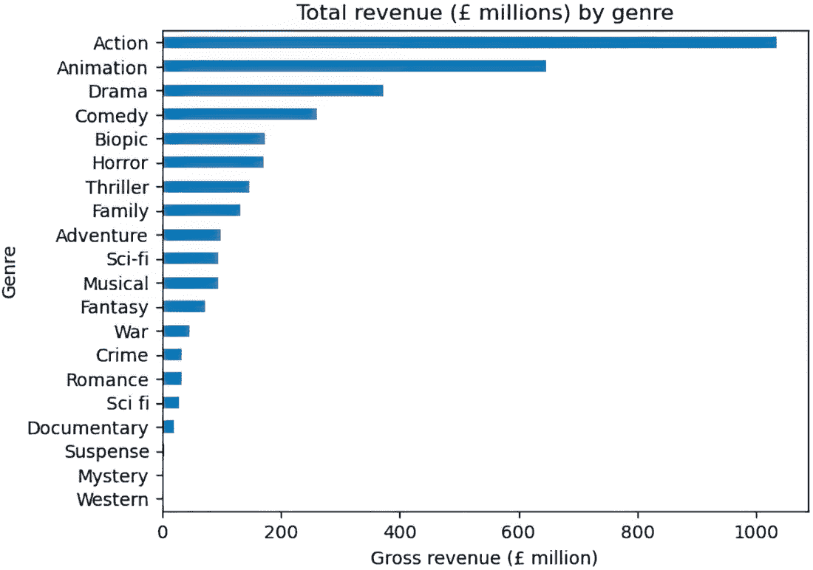

# 5 种不寻常的数据源

### 本章涵盖

+   考虑数据不仅仅是结构化格式中可用的数据

+   创造性地使用你所能获得的所有数据源，无论其格式如何

+   在使用额外数据源时，在花费的时间和增加的价值之间进行权衡

你在职业生涯中遇到的大多数数据集都不像学习环境中提供的那样干净和结构化。现实情况是，通常分析师必须寻找正确的数据，这些数据可能隐藏在复杂的电子表格中，甚至更隐藏在非结构化、非传统数据源中。本章是关于练习识别和使用新颖的非结构化数据源来回答有趣的统计分析问题的创造力。

##### 结构化数据与非结构化数据

为了清晰起见，当我使用“结构化”和“非结构化”这些词来描述数据集时，我的意思是表格数据，二维数据与所有其他数据的对比。分析师通常处理结构化数据——可以在 Excel 中打开的具有行和列的数据，或者位于数据库中，理论上可以在 Excel 中打开的数据。非结构化数据是任何不是行和列格式的数据，范围从文档或原始音频到自由文本或二进制数据格式。

在这个项目中，你将处理包含结构化数据表的未结构化 PDF 文件。我们称这些数据为未结构化、结构化、半结构化或其他，其语义不会改变这样一个事实：处理 PDF 与处理表格数据并不相同。这是我们本章中处理的结构化与非结构化差异。

## 5.1 识别新型数据源

我总是主张从要解决的问题开始。在考虑用于分析的其他数据源时，这也没有什么不同。一旦你有一个明确的问题陈述，就更容易理解你还需要哪些数据源。这就是为什么识别和获取数据是结果驱动方法中的第 3 步和第 4 步，而不是第 1 步和第 2 步。

你能获得的数据将在不同工作场所之间有所不同，但通常，可能有助于考虑的数据类型包括

+   由典型业务流程生成数据，例如电子邮件。

+   运营系统中的数据，如果尚未可用。

+   自托管数据，意味着人们为自己创建的数据，例如人们电脑桌面上的电子表格。这些数据只有在人们依赖它们进行决策时才重要。否则，它们可能只是现有运营数据的更不准确版本。一个例子是销售人员在公司 CRM 之外跟踪自己的客户管道。

+   行业数据，例如由中央机构发布的市场统计数据。

+   政府统计数据，作为公开数据发布。

+   白皮书，公开文件，以易于理解的方式总结特定主题的研究，这些文件可能由内部创建或由竞争对手创建。

##### 真实业务案例：从 PDF 中提取已发布的行业数据

在许多行业中，领先的行业机构发布市场统计数据，这些数据通常是衡量市场状况随时间变化的最佳指标。许多这些统计数据以表格数据的形式发布，通常是 Excel 文件。然而，在过去，我不得不求助于寻找不那么结构化的重要统计数据，并编写自己的 PDF 数据提取代码。这是每位有抱负的分析师都应该经历的经历，因此包含了这个项目。

### 5.1.1 使用新数据集的考虑因素

在决定使用额外的数据源来增强分析时，有一些一般性的考虑因素：

+   这个数据源是否与现有数据集成？我们能否将这个数据集与我们已经使用的那个合并，或者这并不是必需的？有些情况下，销售人员会在自己的电子表格中记录销售情况，无论是在“官方”CRM 系统之外还是在旁边。是否有可能将他们自己的自定义电子表格中的数据与 CRM 系统中的数据合并？这两个数据集中是否存在一个共同的客户标识符，比如 ID？如果没有，我们是否还能通过某种方式将客户在这两个数据集中联系起来，比如通过姓名？请参考第三章，以了解这样一个具体问题的例子。

+   从这个数据源中提取结构化数据需要多少努力？这可能涉及操作非结构化格式并创建表格表示，或者取一个格式与我们的现有数据不同的结构化数据集，因此需要工作来更改和重命名列以匹配我们需要的格式。无论如何，在决定使用新的数据源之前，估算这项工作的努力程度是很重要的：

    +   这个问题的子集之一是，你目前是否具备操作这些数据的专业知识？没有与特定数据格式合作的经验并不是一个不可逾越的障碍，但学习必要的技能是估算所涉及努力的一个因素。

    +   相关的考虑因素之一是，你的工具是否支持这种数据格式？例如，如果你习惯于仅使用 Excel 进行工作，那么处理不寻常的数据格式可能会更困难，但像 Python 或 R 这样的编程语言可能有一个易于安装和使用的相关库。

+   这额外数据的价值是什么？它能回答哪些你之前无法回答的问题？了解这一点将有助于确定这些努力是否值得。

+   这数据是否创建了额外的依赖？这些额外数据是一次性使用，还是需要工程资源来持续摄取和存储的东西？

## 5.2 项目 4：使用 PDF 数据分析电影行业趋势

让我们看看这个项目，我们将从 PDF 文件中提取结构化数据，以了解 COVID-19 大流行对电影行业的影响。我们将研究我们的利益相关者想要解决的问题以及他们提供的数据来源。第 5.3 节将深入探讨如何使用结果驱动的方法来解决这个问题，以及处理 PDF 文件时的一些技术考虑。与每个项目一样，有一个专门用于逐步示例解决方案的部分，可在第 5.4 节找到。像往常一样，我们的解决方案可能会不同，尤其是如果您不使用 Python，因为我探索了一些从 PDF 中读取数据表的 Python 特定方法。

数据可在[`davidasboth.com/book-code`](https://davidasboth.com/book-code)找到。您将找到可用于尝试项目的文件，以及以 Jupyter 笔记本形式的示例解决方案。

### 5.2.1 问题陈述

在这个场景中，您为 EchoTale Analytics 工作，这是一家娱乐行业的研究公司。他们的主要任务是发布关于娱乐行业演变的分析文章，您被分配到他们的电影部门负责一个项目。具体来说，公司希望发布一份关于 COVID-19 大流行如何影响电影行业的白皮书。他们目前还没有一个更具体的主题，因此您的任务是完成并展示初步研究。由于目标是白皮书，优先考虑的是能够讲述一个对电影爱好者有吸引力的故事。

该公司仅与外部数据源合作，对于这个项目，他们给了您来自英国电影行业（BFI）研究统计单位（RSU）的 PDF 报告，称为统计年鉴。这些年鉴包含了关于电影行业的年度统计数据摘要，包括嵌入的数据表。大部分数据与英国的电影行业相关，但也包括一些全球统计数据。数据可以追溯到近 20 年前，自然地，PDF 报告的格式并不一致。

备注：感谢 BFI RSU 以及具体的高级研究与分析员 John Sandow 允许使用 PDF 报告。

要完成这个项目，您需要

+   确定在年鉴中分析电影行业的维度

+   决定提取数据的范围，以及构成 COVID-19 前和封锁后时期的内容

+   提取必要的底层数据

+   分析电影统计数据，得出一个对您的利益相关者准备白皮书有用的叙事

您的利益相关者的优先事项是研究结果既有趣又出乎意料。他们已经假设在疫情期间电影院入场人数下降，在封锁期间降至零，他们不希望发布一份包含如此明显统计数据的白皮书。他们更希望您探索以下内容：

+   不同的国家在封锁后恢复情况是否不同？

+   在大流行前后，哪些电影类型流行？自封锁限制解除以来，这种变化了吗？

+   哪些发行商在大流行后经历了最大的变化？

+   人们对待独立电影的态度是否有所改变？

你将在分析部分的大部分时间探索封锁前后的趋势，并将它们进行比较，以识别最显著的变化，这些变化最有可能引起你的利益相关者的兴趣。

### 5.2.2 数据字典

该项目没有明确的数据字典，这在现实世界中是一个常见问题。即使你没有创建数据字典，你也需要在决定关注哪些数据之前，记下每本年鉴中存在的数据类型。数据的一些方面可能只存在于较老或较新的年鉴中，但你需要确保你的数据在所有你最终使用的文档中都能一致地可用。

文档的一个方面将使你的工作变得容易一些，那就是数据在表格中，可以使用适当的工具提取。图 5.1 展示了这样一个表格的例子。


##### 图 5.1 来自统计年鉴 PDF 文件的一个示例数据表

##### 活动：创建数据字典

尝试为最终使用的数据编写数据字典。通常，分析师为最终用于分析的数据编写字典，因为他们是第一个使用它的人。为未来的数据使用者创建此文档是一个好习惯，包括未来的你！

### 5.2.3 预期成果

你的分析输出应该是关于白皮书潜在主题的建议。建议应该是具体的，所以如果你认为自封锁限制解除以来，人们更喜欢不同电影类型的故事，你的分析应该包含关于哪些类型在大流行前后流行的具体结论。你的建议还应得到可视化支持，这些可视化可能包含在最终的白皮书中。作为一个额外的考虑，你也可以考虑你的数据提取方法，无论是代码还是特定的工具，是否可以用于该项目的未来版本。

### 5.2.4 必需的工具

对于本章的示例解决方案，我使用了 Python 库 `pandas` 和 `matplotlib` 来探索和可视化数据。最初从 PDF 文件中提取数据时，我最终使用了 Python 库 `pdfplumber`，但我将讨论其他选项。你选择的工具可能不同，并且与每个项目一样，工具的重要性不如过程，但你选择的工具必须能够

+   读取 PDF 文件并从中提取表格数据到更典型的格式，例如 CSV 文件

+   从 CSV 或 Excel 文件中加载多个数据集

+   合并两个或多个数据集

+   执行基本的数据操作任务，如排序、分组和重塑数据

+   创建数据可视化

我选择在这个章节中也保持在我的 Python 工具包内，但我将讨论一些你可供选择的其它选项。你可能会选择使用常规工具包之外的工具从 PDF 中提取数据，在这种情况下，你的常规工具只需要满足后面的要点，而不一定是第一个要点。

## 5.3 将结果驱动方法应用于从 PDF 中提取数据

这个项目有很多不确定性，部分原因是 PDF 文件的结构未知且不一致，部分原因是利益相关者请求的模糊性。使用结果驱动方法，我们可以制定一个行动计划。


我们的利益相关者并没有给我们太多指导，因此在这个阶段我们对问题的理解还不完整。我们的第一次迭代需要专注于识别年鉴中多年间的共同数据表，并分析我们手头上的资源。一旦我们开始观察疫情前和封锁后的趋势，我们将对分析的主要主题有更多了解。


尽管我们不知道白皮书的具体主题是什么，但我们知道我们需要专注于比较不同时间段的相同数据。我们的最小可行答案将专注于这一比较。即使这些信息也让我们对我们的工作最终输出有了概念，我们可以朝着这个方向努力。


在这个项目中，识别阶段将是关键。这是我们在探索 PDF 并记录下我们可以探索的共同数据主题的地方。一旦我们完成了这些，我们就可以继续提取我们需要的特定数据。这将从长远来看节省我们的时间，因为提取所有数据表然后再探索它们会花费更长的时间。


你可能会认为数据是在我们的利益相关者提供 PDF 文件时获得的，但正如我们所看到的，在我们拥有一个结构化的数据集来探索之前，还有很多工作要做。并非所有遵循结果驱动方法的项目都会在每个部分花费相同的时间。在这个项目中，我预计这一步骤将占据我们大部分的时间。

*

让我们勾勒出我们将采取的步骤，基于第 5.2.1 节中讨论的步骤：

+   首先，我们将按年份降序打开 PDF 年鉴，并记录我们可用的数据表。在打开分析工具之前，实际查看我们的数据是必不可少的，这样我们才能对正在处理的内容有一个大致的了解。

+   接下来，我们将决定我们要追溯到多远的时间。我们没有很多数据来建立封锁后的趋势，我们也不想花太多时间查看太远过去的数据。

+   然后，我们可以决定我们将能够从数据中提取哪些方面进行分析。这将取决于我们在确定的时间段内可用的内容。

+   下一步将是找到并提取我们需要的特定数据表，并将它们保存为结构化格式，例如 CSV 文件。

##### 活动：可重复使用的方法

当你到达这个阶段时，考虑一下你选择的提取方法的可重复使用性。无论你是手动提取数据还是编写脚本来做这件事，都有可能在未来的迭代中再次需要这样做。提前考虑可重复使用性是一个好的做法，可以节省你长远的时间。

+   在这一点上，我们可以通过检查我们已确定的维度上的疫情前和疫情后的趋势来分析数据，无论是类型的变化、独立电影的招生情况，还是其他方面。

+   最后，我们将确定一个故事，向我们的利益相关者展示，并将其包含在白皮书中。

*

我们无法模拟你展示研究结果时与利益相关者的实际互动。然而，我们可以通过考虑你可能会听到的后续问题来练习准备这样的互动，并准备你的答案。准备好对未来迭代提出建议，可以导致更有效的利益相关者对话。


在这种情况下，我们希望在有一个或多个我们的发现的确凿证据后，尽快向我们的利益相关者展示。构成“确凿”的并不一定是统计意义的问题，而更多的是关于我们的利益相关者会对哪种故事感兴趣并愿意发布的直觉。这项分析，就像其他分析一样，不是你交付的一次性工作；它是一个对话。关于展示什么的想法是分析师技能集的一部分，只能通过沉浸在实际场景中才能发展。

## 5.4 一个示例解决方案：COVID-19 封锁期间对电影产业的影响

让我们来解决这个问题的示例解决方案。在你自己尝试过这个项目之后，阅读我的解决方案将更有价值。记住，我们的解决方案可能会有所不同。你可能会以不同的顺序完成事情。

我们将首先检查我们的 PDF 文件，看看在多年的时间里哪种数据是一直可用的。一旦我们决定要关注哪些数据集，我们将找到一个 PDF 提取方法，并确保它可以从我们的 PDF 文件中可靠地提取数据表。在第二部分，我们将分析我们新创建的结构化数据，以回答我们利益相关者的一些问题。

### 5.4.1 检查可用数据

第一步是决定要查看哪些年份的数据。如果我们查看可用的文件，如图 5.2 所示的一个快照，我们会注意到年鉴在 2018 年之前每年只有一个文件，之后文件按类别划分。然而，从 2018 年开始的文件似乎也有一个“主”文档，例如，标题为“2018—BFI 统计年鉴”的那个。


##### 图 5.2 可用 PDF 文件的快照

我们似乎还缺少 2015 年的文件，该文件将包含 2014 年的数据。这是一个我们需要解决的问题，如果我们想追溯到更早的时间。

备注：文件中指出的年份实际上是前一年的，这意味着名为“2018 统计年鉴”的文件包含 2017 年的数据。

我们可以选择稍后扩展我们的时间范围，但就目前而言，我们将目标设定为获取我们所需的最小数据量，以了解封锁前后的趋势。第一次 COVID 封锁是在 2020 年初，所以我们至少需要 2019 年的数据。由于我们感兴趣的是模式，更多的数据会更好，所以我们将包括 COVID 之前的两年：2018 年和 2019 年。这也意味着我们只包括文档格式一致的年份。

长期回顾会给我们更多信息，但我们想平衡时间和复杂性，所以两年将足够我们第一次迭代。如果我们追溯到 2017 年之前，我们想要确保单个文档中的类别与从 2018 年开始分开的文件中的类别相匹配。也就是说，是否有关于观众、发行、公共投资等方面的数据？

2021 年大多数封锁限制都放宽了，所以那之后的 everything 都将是“后封锁”时期，我们需要决定如何对 2021 年的数据进行分类。

由于我们希望我们的数据从 2018 年开始，我们将从 2019 年年鉴开始。让我们看看有哪些数据表可用。查看目录，部分内容如图 5.3 所示，我们看到子标题与 2019 年的单个文件相匹配，这表明所有必要的数据可能都包含在这个单一文件中。


##### 图 5.3 2019 年鉴目录的部分视图

该文件包含文本、图表、信息图表和数据表的混合。

#### 确定要提取的数据

查看数据表，仅就入场人数而言，我们有以下统计数据：

+   按国家划分的总入场人数

+   英国每月入场人数

+   英国地区入场人数

+   回到 1935 年的年度入学人数

此外，我们还有关于以下广泛类别的数据

+   总票房收入

+   年度热门电影

+   原产国

+   类型

+   导演

+   独立电影

+   发行商

即使只是查看这些数据表也激发了许多分析方向。由于这些数据是为白皮书准备的，我们应该选择可能包含有趣故事的类别。当然，我们事先不知道，但直觉和领域专业知识可以帮助我们选择更有可能产生结果的路径。这种直觉只有通过大量的实践才能建立。我们将关注

+   招生模式

+   类型分布

+   发行商之间的市场份额

选择这些类别意味着我们可以询问季节性模式是否随时间而改变，现在人们是否更喜欢不同的类型，以及是否有任何发行商在市场份额方面成为疫情后的赢家。

让我们总结一下到目前为止我们所做的工作，因为我们刚刚达到了第一个关键决策点。图 5.4 显示了当前步骤和替代选项。


##### 图 5.4 分析的第一步和决策点

现在，我们可以准确地识别出在所有文件中应该查找哪些表格，以确保我们每年都有正确的数据。为了简单起见，让我们限制每个类别只有一个数据表。图 5.5–5.7 显示了 2019 年文档中我们将要搜索的 2019 年之后的文件中的数据表。

根据我们决定专注于招生、类型和发行商的决定，我们可以看到必要的数据仅存在于三个表中。我们可以验证这些数据表在 2018 年之后的年份在其各自的年鉴中存在。如果我们遇到了结构上的差异，我们就必须调查相同的信息是否在每个表中都存在，并确保它们的结构匹配，以便我们可以将它们跨多年合并成单个文件。


##### 图 5.5 2019 年鉴的月度英国招生情况


##### 图 5.6 2019 年鉴按类型划分的发行和收入


##### 图 5.7 2019 年鉴按发行商的市场份额

### 5.4.2 从 PDF 中提取数据

现在我们知道了我们需要哪些数据表，我们有多种方法来提取它们。我们可以

+   手动从 PDF 中复制有限的数据

+   使用专门的 PDF 提取工具

+   为我们首选的工具（例如，Python）查找 PDF 提取功能

表 5.1 显示了这些不同方法之间的权衡。

##### 表 5.1 比较 PDF 提取技术

| 选项 | 优点 | 缺点 |
| --- | --- | --- |

| 将数据从 PDF 手动复制到 Excel | • 对于少量数据来说很快  | • 无法自动化 • 无法扩展到更多数据 |

|

| 专用 PDF 提取工具，无论是基于 Web 还是桌面 | • 很可能准确 • 基于 Web 的工具无需安装 |

| • 可能不是免费的 • 上传文件到网络时的隐私问题 |

• 难以自动化

• 可能无法扩展到多个文件

|

| 在我们当前的工具中查找 PDF 功能 | • 允许自动化并扩展到多个文件 • 无需离开/更改我们首选的工具 |

| • 当前工具包可能没有这样的功能 • 如果文件很少且是一次性任务，手动提取数据可能更快。

|

无论我们决定哪种选项，我们仍然需要经历选择工具、实施/设置它以及使用它从 PDF 中提取数据的过程。让我们详细看看每个步骤，从在 AI 的帮助下选择正确的工具开始。

#### 选择 PDF 提取方法

在这些选项中存在很多不确定性。处理我们只需要偶尔执行的具体任务是 AI 工具的完美用例。图 5.8 显示了 OpenAI GPT-3.5 模型对以下提示的部分回答：

> *从 PDF 中轻松提取数据表到机器可读格式的选项有哪些？建议的选项必须是免费、开源的，并且可以包括 Python 库。*


##### 图 5.8 ChatGPT 建议的 PDF 数据提取选项列表

首先，重要的是要记住，由于这些工具正在快速发展，相同的提示将根据我们使用哪个 AI 工具以及何时使用它而给出不同的结果。我们可以看到，ChatGPT 根据要求推荐了 Python 库和非 Python 选项的混合，这为我们提供了大量的探索空间。然而，在调查其中一个非 Python 选项时，我们发现 TabbyPDF 的 GitHub 链接是错误的。在这种情况下，我们可以自己找到它，但这提醒我们 AI 工具有时会在建议中产生幻觉，甚至可能推荐不存在的工具。

让我们也使用 AI 工具帮助我们开始使用其中一个库。当被问及“在 Python 选项中，哪一个最容易设置且依赖项最少？”时，它的建议是从`tabula-py`开始，因为它有最少的依赖项。然而，它的依赖项是安装 Java 运行时环境，这是我们可能不愿意做的事情。它的下一个建议，`pdfplumber`库，没有这样的外部依赖项，但它的文档表明表格提取功能是一个“加分项”。另一个建议，`camelot`，专注于数据表提取，但根据 ChatGPT 的说法，由于它自己的外部依赖项，设置起来可能更困难。因此，我们不应将 AI 的回答视为完美；它应该是过程的开始，而不是结束。

在权衡我们的选择后，让我们先尝试使用`pdfplumber`，因为其他易于安装的 Python 库只是它的依赖项。如果它的表格读取功能不能给我们所需的结果，我们总是可以尝试另一个库，但我们将首先尝试保持简单。

使用`pdfplumber`可以通过您使用的任何包管理器来完成，无论是`pip`、`conda`还是`poetry`。由于这些工具会自动安装依赖库，在这个步骤中我们几乎不需要做什么。然而，如果您选择使用不同的工具进行 PDF 提取，这个步骤可能更加复杂。

既然我们已经决定了一个方法，让我们在继续到实际提取步骤之前，总结一下到目前为止的过程。图 5.9 显示了到目前为止的过程。


##### 图 5.9 选择 PDF 提取方法的步骤

现在我们将使用我们选择的工具从我们的 PDF 中提取结构化数据。

#### 使用我们选择的工具从 PDF 中提取数据

在安装了 `pdfplumber` 之后，我们首先导入我们的库：

```py
import numpy as np
import pandas as pd

import pdfplumber

from IPython.display import display
```

这可能是我们第一次使用 `pdfplumber` 库，因此为了开始，我们会阅读其文档以了解如何打开 PDF 并从中提取表格。由于我们将从多个文档的多个页面中提取多个表格，我们应该编写一个可重用的函数，该函数可以从单个 PDF 的多个页面中提取一个或多个表格。这个函数需要打开一个 PDF 文件，提取我们指定的页面中的所有表格，并将它们作为 `pandas` DataFrame 返回，以便进行分析。

让我们从提取代码开始。给定一个指定的路径和页码，以下代码将打开 PDF，遍历页面，并提取它所识别的所有表格：

```py
pdf_path = "./files/2019 - BFI yearbook 2019 - 888.pdf"
page_num = 11

page_tables = []

with pdfplumber.open(pdf_path) as pdf:
    page = pdf.pages[page_num-1]
    page_tables = [t.extract() for t in page.find_tables()] #1

page_tables
```

#1 `page_tables` 是从特殊的表格对象中提取出来的列表的列表（列表的列表！）。

到目前为止，`page_tables` 变量是一个包含列表的列表的列表。输出如图 5.10 所示。


##### 图 5.10 `pdfplumber` 从单个 PDF 页面提取的表格

表格的每一行都是一个字符串列表，以列标题开头。这些行本身也是一个列表，代表一个单独的表格。使用 `page.find_tables()` 函数意味着我们最终得到一个这些表格的列表。因此，我们的数据结构是一个列表的列表的列表。幸运的是，`pandas` 让我们很容易将其转换为 DataFrame 的列表，如下面的代码片段所示：

```py
table = page_tables[0]
pd.DataFrame(table[1:-1], columns=table[0])
```

这些代码片段可以扩展到跨多页工作，并且通过一些额外的打印语句和逻辑检查，整个函数在下面的代码片段中展示，其中一部分输出如图 5.11 所示：

```py
def extract_tables(pdf_path, pages=None, print_tables=True):
  """
  Extract all tables found in a PDF.

  `pdf_path`: file path pointing to the PDF
  `pages`: the page number(s) to read
  `print_tables`: whether to also print out
  all the tables that are found (default: True)

  returns: a list of pandas DataFrames
  """

  if not pages:
      pages = []

  print(f"Reading {pdf_path}")

  tables = []

  with pdfplumber.open(pdf_path) as pdf:
      for page_num in pages:
          page = pdf.pages[page_num-1]

          page_tables = [t.extract() for t in page.find_tables()]

          df = [pd.DataFrame(table[1:-1], columns=table[0]) #1
↪ for table in page_tables]

          tables.extend(df)

  print(f"{len(tables)} tables found.")

  if len(tables) > 0:
    if print_tables:
        for index, df in enumerate(tables):
          print(f"\n##########################\n\tTable
↪ {index}\n##########################\n")
          display(df)

  return tables

tables = extract_tables("./files/2019 - BFI yearbook 2019 - 888.pdf",
↪ pages=[11,34,70])
```

#1 在每种情况下，变量 `table` 现在是一个列表的列表，第一个列表包含列标题。


##### 图 5.11 我们 `extract_tables` 函数的部分输出

存储我们函数输出的变量 `tables` 现在是一个 DataFrame 的列表，每个 DataFrame 代表从 PDF 中提取的一个表格。现在是时候将这个函数应用到我们的 PDF 上，提取我们需要的数据了。我们将通过 2018 年的数据来演示这个过程，但为了完整性，所有数据提取的代码都包含在补充代码列表中。

首先，我们确定感兴趣的页码，并使用我们的函数提取招生、类型和发行商数据：

```py
tables_2018 = extract_tables("./files/2019 - BFI yearbook 2019 - 888.pdf",
↪ pages=[11,34,70])
```

完整的招生数据如图 5.12 所示。


##### 图 5.12 从我们的 PDF 中提取的 2018 年招生数据

我们注意到这个数据的一个重要方面是，列本身并没有告诉我们这些数据属于哪一年。当我们需要将多年的招生数据合并时，这一点将非常重要，因此我们将添加一个年份列。我们也不需要 2017 年的数据或百分比变化，因此我们可以删除这些列。修改后的招生数据样本如图 5.13 所示：

```py
admissions_2018 = (
    tables_2018[0]
    .iloc[:,[0, 2]]
)

admissions_2018.columns = ["Month", "Admissions (million)"]

admissions_2018.insert(0, "Year", 2018)

admissions_2018.head()
```


##### 图 5.13 修改后的招生数据快照

接下来是类型，我们提取的 DataFrame 列表中的第二个表格包含我们需要的数据，如图 5.14 所示。


##### 图 5.14 从 PDF 中提取的 2018 年类型分解

与招生数据不同，这种分解是按类型进行的，并涉及 2018 年整年的数据。我们仍然需要添加一个年份列来区分不同年份的类型，但我们需要记住这个数据集具有不同的粒度级别。同样，我们不需要所有列，并且我们需要清理列名以删除 `\n` 换行符。以下代码片段生成了修改后的类型数据，其快照如图 5.15 所示：

```py
genres_2018 = (
    tables_2018[1]
    .drop(columns=[tables_2018[1].columns[2], tables_2018[1].columns[4]])
)

genres_2018.insert(0, "Year", 2018)

genres_2018.columns = ["Year", "Genre", "Number of releases",
↪ "Gross box office (£ million)", "Top performing title"]

genres_2018.head()
```


##### 图 5.15 2018 年修改后的类型数据

最后，转向发行商，从 PDF 中直接提取的数据如图 5.16 所示。


##### 图 5.16 从 PDF 中提取的原始发行商数据

在这个例子中，我们所有的列都将是有用的，我们需要再次添加年份列。我们还应该删除第 10 行，因为它上面所有行的总和，如果我们保留它，将会歪曲我们的计算。以下代码修改了数据以适应我们的需求，修改后的数据快照如图 5.17 所示：

```py
distributors_2018 = (
    tables_2018[2]
    .drop(index=[10]) #1
)

distributors_2018.insert(0, "Year", 2018)

distributors_2018.columns = ["Year", "Distributor", "Market share",
↪ "Films on release", "Box office gross (£ million)"]

distributors_2018.head()
```

#1 删除“前 10 名总计”行


##### 图 5.17 2018 年修改后的发行商数据

注意：对后续年份重复此过程会显示一些差异。在 2019 年，同一页上有两个招生表格，因此我们需要明确选择正确的表格。此外，在 2022 年年鉴中，表格分布在多个 PDF 中。所有年份的表格提取过程都是相同的，但这些细微差异使得 PDF 数据提取变得复杂。

多年间的同类型数据集结构相同，因此我们不需要在合并之前进行任何额外的清理。以下代码展示了如何将年度招生数据集合并成一个单一的数据集：

```py
admissions = pd.concat([admissions_2018, admissions_2019,
  admissions_2020, admissions_2021],
  ignore_index=True,
  axis=0)
```

为了确保我们有正确数量的数据，我们进行快速合理性检查，查看每年每月数据的行数。我们预计每年正好有 12 行，如图 5.18 所示的输出中已验证：

```py
admissions["Year"].value_counts()
```


##### 图 5.18 验证我们每年都有 12 行招生数据

最后，我们将合并后的招生数据写入其自己的文件：

```py
admissions.to_csv("admissions.csv", index=False)
```

组合和导出类型和发行商数据的流程是相同的，我们最终得到三个我们准备分析文件。

### 5.4.3 分析从 PDF 中提取的数据

既然我们已经从我们的 PDF 中提取并合并了数据，我们可以开始探索它，以找到可用于我们白皮书的故事。我们将一次处理一个数据集，从招生数据开始。我们可以继续编写代码，这意味着我们已经有招生数据作为变量，但我选择明确地分离提取和分析过程。在配套资源中，您将找到将过程分为两个 Jupyter 笔记本。对于分析部分，我们将使用第一个笔记本中创建的数据启动一个新的 Jupyter 笔记本。

将提取与分析分离有多重好处：

+   只要提取步骤产生分析步骤期望的输出，提取和分析就可以分别工作。

+   通过不必每次分析更改时重新运行提取步骤，您可以节省时间。

+   步骤可以更容易地维护，因为它们彼此之间逻辑上是解耦的。

通常，当您看到有机会通过将逻辑步骤彼此分离来创建更干净的解决方案时，您应该抓住这个机会。任何将来查看您的工作的人，包括您自己，都会为你在早期付出的额外努力感到感激。

#### 使用自定义逻辑增强提取数据

我们首先读取招生数据并查看它。以下代码生成图 5.19 中的输出：

```py
import pandas as pd
import matplotlib.pyplot as plt
import datetime
admissions = pd.read_csv("admissions.csv")
print(admissions.shape)
admissions.head()
```


##### 图 5.19 招生数据的快照

由于它只是跨越几年的单一月度值，数据集很小。然而，它足以分为三个时期：COVID 前封锁期、COVID 封锁期和 COVID 解锁后。我们通过创建一个具有正确数据类型的日期列来实现这一点。以下代码的输出显示在图 5.20 中：

```py
COVID_START_DATE = datetime.datetime(2020, 3, 1)     #1
LOCKDOWN_END_DATE = datetime.datetime(2021, 7, 1)

admissions["date"] = (
    "1 " +      #2
    admissions["Month"] +
    " " +
    admissions["Year"].astype(str)
)

admissions["date"] = pd.to_datetime(admissions["date"], format="%d %B %Y")
admissions.head()
```

#1 我们定义变量来标记 COVID 时期的截止点。

#2 我们的数据没有日期，所以我们随意将日期设置为每月的第一天。


##### 图 5.20 验证我们新添加的日期列是否符合预期

接下来，我们定义三个时期的截止点并将它们应用于数据。我们还使用 `pandas` 中的 `Categorical` 数据类型来确保在排序时观察到正确的顺序；否则，这些时期将按字母顺序排序。然后，我们验证这个新列的分布是否符合我们的预期，并且我们没有遗漏任何数据。以下代码的输出显示在图 5.21 中：

```py
admissions.loc[admissions["date"] < COVID_START_DATE, "covid_period"]
↪ = "pre-COVID"
admissions.loc[admissions["date"].between(COVID_START_DATE,
↪ LOCKDOWN_END_DATE, "left"), "covid_period"] = "during COVID"
admissions.loc[admissions["date"] >= LOCKDOWN_END_DATE, "covid_period"]
↪ = "post-lockdowns"

admissions["covid_period"] = (
    pd.Categorical(
        admissions["covid_period"],
        categories=["pre-COVID", "during COVID", "post-lockdowns"],
        ordered=True
    )
)

admissions["covid_period"].value_counts(dropna=False)
```


##### 图 5.21 不同 COVID 时期的行数

现在我们可以使用以下代码绘制月度招生数据，并用不同颜色和线条样式标记每个 COVID 时期，如图 5.22 所示：

```py
fig, axis = plt.subplots(figsize=(10, 6))

linestyles = ["solid", "dotted", "dashed"]

for idx, covid_period in 
↪ enumerate(admissions["covid_period"].value_counts().index):
    (
        admissions
        .query(f"covid_period=='{covid_period}'")
        .set_index("date")
        ["Admissions (million)"]
        .plot(ax=axis, label=covid_period, linestyle=linestyles[idx])
    )

axis.set(
    title="Monthly cinema admissions over time",
    ylabel="Admissions (millions)"
)

axis.legend()

plt.show()
```


##### 图 5.22 多个 COVID 时期的招生情况

初看之下，由于封锁期间缺失了几个月份，在最后一次封锁解除后，似乎入院人数已经开始恢复到疫情前的水平。如果我们有更多的后封锁数据，我们还可以检查季节性模式是否与疫情前相似。

如果我们要查看三个时期的平均每月入院人数，我们可以进一步调查这一点。以下代码执行此操作，并产生图 5.23 所示的输出：

```py
fig, axis = plt.subplots()

admissions_by_period = (
    admissions
    .groupby("covid_period")
    ["Admissions (million)"]
    .agg(["mean", "median"])
)

for i, metric in enumerate(admissions_by_period.columns):
    hatch = "/" if i == 0 else "\\\\"                            #1
    color = "C0" if i == 0 else "C1"     #2
    admissions_by_period[metric].plot(kind="bar", ax=axis, position=i,
                                      hatch=hatch, label=metric,
                                      width=0.2, color=color)

axis.set(
    title="Average monthly cinema admissions during COVID periods",
    ylabel="Admissions (millions)",
    xlabel="Period",
    xticklabels = admissions_by_period.index
)

axis.legend()

plt.show()
```

#1 不同指标使用不同阴影模式

#2 不同指标使用不同颜色


##### 图 5.23 按 COVID 时期划分的平均入院人数

观察均值和中位数的原因是为了调查数据是否在任一方向上存在偏斜。也就是说，COVID 前或后封锁的月份是否倾向于在任一方向上有异常值？通过查看按时期划分的每月入院人数的直方图可以进一步调查这一点。以下代码生成了图 5.24 所示的直方图：

```py
fig, axes = plt.subplots(1, 2, figsize=(10, 6), sharey=True)

(
    admissions
    .loc[admissions["covid_period"] == "pre-COVID", "Admissions (million)"]
    .hist(bins=10, ax=axes[0])
)

axes[0].set(
    title="Distribution of monthly admissions pre-COVID",
    xlabel="Admissions (million)",
    ylabel="Frequency"
)

(
    admissions
    .loc[admissions["covid_period"] == "post-lockdowns",
↪ "Admissions (million)"]
    .hist(ax=axes[1])
)

axes[1].set(
    title="Distribution of monthly admissions post-lockdowns",
    xlabel="Admissions (million)"
)

plt.show()
```


##### 图 5.24 COVID 前和后封锁的入院人数直方图

后封锁的数据并不多，但我们可以观察到有更多月份的入院人数较少，这是根据缓慢的恢复所预期的。COVID 前，我们预计每月大约有 1500 万至 1700 万的入院人数，正负方向上都有一些异常值。目前，关于后封锁的入院习惯没有太多可以讲述的故事，除了注意到到 2021 年底，入院人数似乎又开始趋向于 COVID 前的水平。

#### 使用来自多个来源的数据研究趋势随时间的变化

现在，让我们看看在疫情前后流行的品类。首先，让我们读取并检查我们的数据。图 5.25 显示了以下代码产生的行快照：

```py
genres = pd.read_csv("genres.csv")
print(genres.shape)
genres.head()
```


##### 图 5.25 品类数据集的行快照

有两点需要注意。首先，由于只是记录了几年内的少量品类，因此这个数据集很小。其次，这个数据集是按年度级别，而不是按月度级别，这改变了我们对 COVID 时期的定义。具体来说，我们必须接受 2020 年最初几个月的数据将被分配为“在 COVID 期间”，即使它们发生在第一次封锁之前，并且我们需要决定如何处理 2021 年的数据。2021 年仍然有封锁，但下半年的数据是关于后封锁趋势的有用数据，我们不想将其丢弃。我们将倾向于将 2021 年视为“后封锁”，并将 2020 年视为唯一的“在 COVID 期间”的年份。以下代码执行此操作，并产生图 5.26 所示的输出：

```py
genres.loc[genres["Year"] < 2020, "covid_period"] = "pre-COVID"
genres.loc[genres["Year"] == 2020, "covid_period"] = "during COVID"
genres.loc[genres["Year"] > 2020, "covid_period"] = "post-lockdowns"

genres["covid_period"].value_counts(dropna=False)
```


##### 图 5.26 品类数据集中按 COVID 时期分布的行

看数据时，我们可能会注意到票房总收入列有非数值值，即<0.1，表示总收入低于 10 万英镑的类型。例如，为了按类型计算收入，我们需要这一列是数值的。我们可以将这个值转换为零，但这将是误导性的，并且这个值与数据中存在的 0.1 不同。为了表示低收入，我们可以添加一个占位符值，比如 0.05：

```py
genres.loc[genres["Gross box office (£ million)"] == "<0.1",
↪ "Gross box office (£ million)"] = 0.05
genres["Gross box office (£ million)"] =
↪ genres["Gross box office (£ million)"].astype(float)
```



##### 图 5.27 按类型划分的总收入

现在，我们可以查看数据集中按类型划分的总收入。以下代码的输出显示在图 5.27 中：

```py
fig, axis = plt.subplots()

(
    genres
    .groupby("Genre")
    ["Gross box office (£ million)"]
    .sum()
    .sort_values()
    .plot
    .barh(ax=axis)
)

axis.set(
    title="Total revenue (£ millions) by genre",
    xlabel="Gross revenue (£ million)"
)

plt.show()
```

看起来人们最喜欢动作和动画电影。我们真正想看到的是这种按年份相同的分布。我们也可以按 COVID 时期来看，但让我们先看看更细致的图景。以下代码实现了这一点，并在图 5.28 中产生了输出：

```py
years = genres["Year"].unique()

fig, axes = plt.subplots(1, len(years),
↪ figsize=(3*len(years),8), sharex=True)

for idx, year in enumerate(years):
    (
        genres[genres["Year"] == year]
        .groupby("Genre")
        ["Gross box office (£ million)"]
        .sum()
        .sort_values()
        .plot
        .barh(ax=axes[idx])
    )

    axes[idx].set(
        title=f"Revenue by genre ({year})"
    )

plt.tight_layout()
plt.show()
```


##### 图 5.28 多年按类型划分的收入分解

这给出了一个非常清晰的图景。动作电影无论在哪个年份都是最受欢迎的。喜剧电影在 COVID 之前的表现一直不太好，但在 2021 年其受欢迎程度有所上升。以下是关于这一结果的几种理论：

+   动画电影需要多年的努力，如果动画师在 COVID 期间没有在任何时候工作，那么这就会推迟 2021 年动画电影的上映。

+   相比之下，喜剧电影可能制作成本更低，但这是一个需要领域专家回答的问题。

+   在解封后，人们可能更喜欢轻松愉快的慰藉。

让我们先测试这个第一个假设。如果我们的理论成立，我们应该看到 2021 年动画类型的上映数量更少。图 5.29 显示了这项调查的输出：

```py
(
    genres[genres["Genre"] == "Animation"]
    .groupby("Year")
    ["Number of releases"]
    .sum()
)
```


##### 图 5.29 随时间动画电影发布数量

2021 年上映的动画电影数量几乎与 2019 年一样多，因此我们的理论无法解释为什么该类型的收入下降了。从图 5.28 中还可以看到 2020 年战争电影的流行：

```py
genres[(genres["Genre"] == "War") & (genres["Year"] == 2020)]
```

深入研究后，我们发现这个类别中表现最好的电影是电影*1917*，该电影于 2020 年 1 月上映。尽管这部电影的收入使其在 2020 年的排名中占据高位，但它是在第一次封锁之前上映的，因此这并不能告诉我们任何关于人们在大流行期间喜欢战争电影的信息。这当然不能作为证据表明人们在大流行期间喜欢战争电影。

总结来说，尽管动作电影无疑是最受欢迎的类型，但喜剧电影在解封后收入有所增长。这无疑是一个值得将领域专家引入以了解更多信息的发现。

#### 解决跨数据源的不同实体名称

我们最后一个问题与发行商有关。哪些公司在封锁期间为他们的电影赚取了最多的收入？让我们看看我们可用的数据在图 5.30 中：

```py
distributors = pd.read_csv("distributors.csv")
print(distributors.shape)
distributors.head()
```


##### 图 5.30 发行商数据集快照

对于每个发行商，我们都有他们的收入市场份额、每年发布的电影数量和总票房收入。让我们再次分配我们的 COVID 时期。图 5.31 显示了每个 COVID 时期的数据行数：

```py
distributors.loc[distributors["Year"] < 2020, "covid_period"] = "pre-COVID"
distributors.loc[distributors["Year"] == 2020, "covid_period"]
↪ = "during COVID"
distributors.loc[distributors["Year"] > 2020, "covid_period"]
↪ = "post-lockdowns"

distributors["covid_period"].value_counts(dropna=False)
```


##### 图 5.31 分销商数据中每个 COVID 时期的行数

我们还应该验证市场份额列每年是否加起来是 100%。图 5.32 显示了这是否是情况：

```py
distributors.groupby("Year")["Market share"].sum()
```


##### 图 5.32 每年的总市场份额

统计年鉴明确提到了舍入误差，这可能是图 5.32 中数字的原因。现在让我们看看我们数据的每年按发行商的市场份额。使用`pandas`的最简单方法是为每个不同的发行商创建一个交叉表，其中每列代表一个不同的发行商，每行代表一个不同的年份。这样，当我们调用`plot`函数时，我们可以看到每个发行商随时间的变化。让我们看看这种数据重塑会做什么。以下代码生成了图 5.33 所示的交叉表：

```py
(
    distributors
    .groupby(["Year", "Distributor"])
    ["Market share"]
    .sum()
    .unstack()
)
```


##### 图 5.33 按发行商和年份汇总的交叉表快照

存在许多数据问题变得明显。我们需要合并 20 世纪福克斯的两个单独值，将“其他”类别合并成一个单一名称，以便它们随着时间的推移获得单行，并调查名称中包含“娱乐”的各个发行商。经过调查，发现娱乐一公司和 eOne Films，这两者都出现在我们的数据中，实际上是同一实体（[`www.entertainmentone.com/about-eone/`](https://www.entertainmentone.com/about-eone/))). 娱乐电影发行商是 Entertainment One 的一个合法独立实体，但我们没有证据表明仅标记为“娱乐”的发行商是否应该合并到其他任何类别中。我们将将其保留独立。在这些更正之后，我们可以查看每个发行商在我们的数据中代表了多少年。这一结果在图 5.34 中显示：

```py
distributors["Distributor"] = (
    distributors["Distributor"].replace({
        "20th Century Fox*": "20th Century Fox",
        "eOne Films": "Entertainment One"
    })
)

distributors.loc[distributors["Distributor"].str.startswith("Other"),
↪ "Distributor"] = "Other"

distributors["Distributor"].value_counts()
```


##### 图 5.34 每个发行商在我们的数据中出现的年数

我们还可以使用这个结果来决定是否绘制所有发行商。我们特别关注随时间的变化，因此我们应该只保留出现在我们数据所有年份中的发行商。这可能会省略在疫情期间或因疫情而倒闭的发行商。这些可以进一步单独分析：

```py
distributors_to_keep = (
    distributors["Distributor"]
    .value_counts()
    .loc[lambda x: x == distributors["Year"].nunique()]
    .index
)
```

我们可以使用这些发行商来重新创建我们的交叉表，并查看市场份额在年份间的比较：

```py
distributors_pivot = (
  distributors
  .query("Distributor in @distributors_to_keep")
  .assign(Year=distributors["Year"]
          .apply(lambda x: datetime.datetime(x, 1, 1))     #1
         )
  .groupby(["Year", "Distributor"])
  ["Market share"]
  .sum()
  .unstack()      #2
)
```

#1 将每年转换为 1 月 1 日以使其成为日期类型

#2 每年一行，每家发行商一列

从视觉上看，如果年份跨越列，交叉表更容易阅读，所以让我们转置数据，并检查图 5.35 中显示的输出：

```py
distributors_pivot.transpose()
```


##### 图 5.35 发行商市场份额（%）随时间变化

从这个交叉表中，我们可以得出以下结论：

+   华特迪士尼在 2019 年完成了对 20 世纪福克斯的收购，但这并没有导致市场份额在 2021 年有大幅增长。

+   索尼在解封后实现了市场份额的最大增长，将市场份额从 2018 年翻倍，但环球也从 COVID 之前的水平增加了市场份额。

+   除了索尼和环球之外，市场份额较大的发行商在 2021 年大致回到了 COVID 之前的市场份额水平。一些较小的发行商，如 StudioCanal，未能达到 COVID 之前的水平。

对这些结果的初步推测可能是，较大的发行商是那些拥有资源从全球大流行中恢复过来的，而较小的发行商可能会遇到更大的困难。

在总结我们的发现之前，让我们回顾整个过程，包括我们的最新步骤可能发生分歧的地方。图 5.36 显示了整个过程。


##### 图 5.36 示例解决方案中采取的最终步骤

现在我们来回顾我们的发现，并总结我们对利益相关者的建议。

### 5.4.4 项目结论和建议

我们的结果对白皮书意味着什么？

+   英国层面的招生数据并没有讲述一个非常有趣的故事，除了招生看起来像是达到了 COVID 之前的水平。额外一年的数据将有助于阐明解封后的趋势，同样，从更细致的层面，如地区或电影类型来看招生情况，也会有所帮助。

+   解封后，类型分布有所不同，确实有足够的不同来进一步调查这个角度。

+   发行商遵循一般市场趋势，大型实体比小型实体更容易从 COVID 中恢复过来。

我们分析的限制主要在于数据不足。我们没有很多解封后的数据可以与过去趋势进行比较，因此我们的结论只能是试探性的。我们的数据集中在英国，因此它不能提供一个全球的视角。然而，我们可以假设我们工作的研究公司会有更细致的数据，以便我们进一步调查我们的发现。我们的结论中有足够的论据可以与我们的领域专家进行对话，但第一轮分析并不表明我们有足够的论据来支持一份白皮书。

这种分析的一个好处，无论它是否导致发表论文，就是我们编写了一个数据管道，用于从 BFI 发布的统计数据中提取数据。以这种格式拥有这些数据将为未来的项目带来价值。有时，以这种方式清理数据本身就是一项有价值的贡献。

##### 活动：使用这些数据进一步的项目想法

本章中包含的 PDF 文件是关于电影行业信息的宝库。这个项目专注于大流行的影响，但还有许多其他角度可以探索，以及许多可以回答的研究问题。以下是一些帮助你开始的想法：

+   人们的类型偏好是如何随时间演变的？

+   成功的独立电影有什么样的模式吗？

+   不同国家的观众人数是如何随时间变化的？电影观众是否在各地以相同的方式改变？

## 5.5 关于探索新颖数据源的总结性思考

从本章中我们可以得到两个启示。一个是你会遇到需要学习特定、狭窄的技能来从异常格式中提取数据的情况。这是一个了解你现有工具中更神秘部分的好机会，例如其 PDF 提取功能。AI 工具可以加速这一学习过程，本章的项目就是一个深度不是必需的例子。要成功完成本章的项目，你不需要成为 PDF 提取或光学字符识别的专家，即图像转换为机器可读文本形式的过程。你只需要找到相关的库和代码片段，从 PDF 中提取表格数据。这是一个学习足够以保持对最终结果专注而无需更多的例子。

其次，更广泛的启示是数据以许多形式存在。知道我们的工具使我们能够从异常、无结构的数据源中提取数据，这将扩大我们用于分析的可用数据潜力。它使我们能够为问题生成更多创造性的解决方案，这将帮助我们通过我们的工作增加更多价值。

### 5.5.1 探索任何项目的不寻常数据源所需的技能

在本章中，我们探索了一种新的数据来源，即 PDF 文件。对于不寻常的数据源，以及更广泛地探索新的数据源，这些技能可以用于任何问题，包括

+   在非结构化文件中找到相关数据，例如 PDF

+   识别现有工具从新颖的数据源中提取数据

+   使用 AI 工具（如 ChatGPT）了解特定数据格式的特定工具

+   使用新工具从非结构化源提取数据到结构化格式（例如，从 PDF 到 CSV 文件的数据）

+   使用自定义逻辑（例如，COVID 封锁前后的时期）增强提取的数据

+   通过从多个来源随时间提取相似数据来调查趋势（例如，跨多年的相同年度报告）

+   解决多个类似数据源之间的差异（例如，随着时间的推移，制作公司的名称发生变化，但与同一实体相关）

## 摘要

+   识别新颖和无结构的数据源是优秀分析师的核心技能。

+   在分析中考虑新的数据源可能会引入非表格或无结构数据，需要付出努力来清理：在包括它们时应考虑的时间。

+   将数据中蕴含的故事讲述出来，而不是我们利益相关者在问题陈述中要求的那一个，这对于避免误导自己至关重要。

+   专注于要解决的问题而不是数据，会增加你考虑的任何额外数据相关的可能性。**
