# 第六章：6 分类数据

### 本章涵盖

+   确定处理分类数据的最佳方法

+   在处理分类数据时如何避免常见错误

+   使用正确的方法分析分类数据以调查模式和关联

有时，你可能会遇到非数值型数据，你的典型分析方法不适用。相反，这种数据代表具有有限选项集合的组或类别。客户位置、部门和人口统计信息是此类离散值的典型来源。我们称这种数据为*分类*数据，它在大多数数据集中很常见。

适用于数值或连续数据的方 法不适用于分类数据。了解正确处理分类数据的方法将扩展你的工具箱，并确保当你的数据主要是分类数据时，你使用正确的工具来完成工作。在本章中，我们将在深入研究项目之前，回顾处理分类数据的常用工具。

## 6.1 处理分类数据

任何分析中的第一个任务之一是理解你的数据。在表格数据集中，每一列的数据将属于两种类型之一：连续或分类。这种区分不适用于非结构化数据，如音频或视频文件，但大多数分析师主要处理表格数据。无论这些列中的值代表什么，它们要么是连续尺度上的，要么是离散集合的一部分。有时，如果条目是数值型的，甚至可能不明显是否某一列是分类的。让我们看看一个示例数据集。

图 6.1 显示了机器学习社区用于教学目的的广泛使用数据集的快照。原始数据由 Jánosi 等人（1988 年）创建，可在[`mng.bz/vKo7`](https://mng.bz/vKo7)找到。这是一个不同患者测量值的医学数据集，也显示了患者是否患有冠心病。相关数据问题是用测量值来预测患者是否患有冠心病。

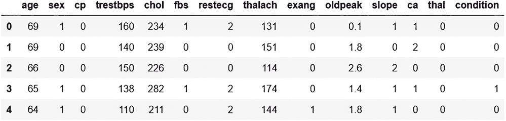

##### 图 6.1 UCI 心脏病数据集的预览

前两列，`年龄`和`性别`，分别容易识别为连续和分类。尽管`性别`是数值型，但我们将其视为与文本值（例如，“男性”或“女性”）相同。例如，计算此列的数值平均值与计算我们患者的平均年龄并不相同。我们称这种类型的分类列为*名义*，因为类别之间没有自然的顺序。其他例子包括颜色或政党。

分类数据也可以是*有序*的，其中类别确实有自然顺序，但不是数值尺度。例子包括尺寸（例如，小、中、大）或调查响应（例如，在“强烈不同意”和“强烈同意”之间的值）。为了完整性，表 6.1 显示了我们可以遇到的不同类型数据的分解。

##### 表 6.1 不同数据类型的概述

| 姓名 | 分类或连续？ | 属性 | 示例 |
| --- | --- | --- | --- |
| 名义 | 分类 | 数据具有离散值，类别没有顺序。 | 颜色、政党 |
| 序数 | 分类 | 数据具有离散值，类别之间有自然顺序，但类别之间的间隔不均匀。 | T 恤尺码（S/M/L）、调查响应（好/坏） |
| 间隔 | 连续 | 值间隔均匀，但零不是测量值的缺失。 | 温度 |
| 比率 | 连续 | 值间隔均匀，零表示测量值的缺失。 | 身高、体重 |

备注：在这些定义中，“比率”一词不应与两个测量值相互比较的意义混淆，比如新客户与回头客的比率。在这种情况下，“比率”是连续变量的技术术语，它从零开始，其中零表示该数量的缺失。你可以有负温度，但不能有负身高，这是“间隔”和“比率”量之间的区别。

回到心脏病例子的讨论。关于`年龄`和`性别`之外的列，又是怎样的情况呢？如果我们只检查导入数据时的数据类型，我们会观察到所有列都是数值型的。图 6.2 展示了验证这一点的 Python 输出示例。

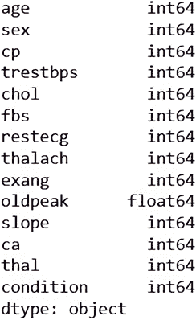

##### 图 6.2 心脏病数据中的数据类型

根据目前的信息，我们可能会得出结论，因为我们的列是数值型的，所以所有数据都必须是连续的。然而，经过更仔细的检查，我们发现我们的一些列只取了少数几个离散值。例如，图 6.3 展示了`slope`列值的分布情况。

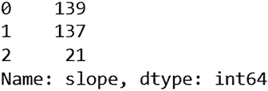

##### 图 6.3 心脏病数据集中`slope`列值的分布

尽管这是一个整数列，但只有三个离散值。这些值对应于患者的与运动相关的测试是在上升坡度、下降坡度还是完全没有进行。因此，这个列是分类的，具体来说是名义的。

这可能看起来像是一个微不足道的发现，但如果我们将这个列当作连续的来处理，我们可能会用它进行错误的计算，比如取平均值。我们可能会得到平均坡度值为 0.6，但这没有意义。它并不代表介于 0（上升）、1（平坦）之间的中间值，因为编号是任意的。我们分配给每个类别的数字的改变会改变这个结果及其解释。

##### 真实业务案例：通过分类数据增强分析

参加拍卖的二手车会有各种各样的数据被输入，其中很多是分类数据。变速器类型、燃料类型、制造商和型号都是分类值，对于理解二手车市场至关重要。我建立的用于预测二手车价格或其销售可能性的模型都极大地依赖于这些分类值。

我们的团队也定期被要求查看汽车的颜色是否对其价值有任何影响。这不仅涉及到操作一个分类的`color`列，还涉及到从人们可以输入任何颜色的自由文本字段中提取这些类别！

那么，我们如何处理分类数据呢？让我们回顾一下连续数据与分类数据方法之间的一些差异。

### 6.1.1 处理分类数据的方法

让我们看看分析连续和分类数据的一些关键方法。当我们处理连续数据时，我们特别感兴趣的是

+   我们值的范围

+   我们值的分布

+   异常值的存在

+   连续值之间的关联

为了探索这些特性，我们可用的工具是

+   概率统计（最小值、最大值、平均值、中位数等）

+   直方图和箱线图来调查范围和分布

+   散点图和相关度量来调查连续变量之间的关系

当涉及到分类数据时，并不是所有这些方法都适用。让我们回顾一下心脏病数据集，以一个例子来说明将分类值视为连续值会导致我们误入歧途。

我们可能会犯的一个错误是将分类的`slope`变量在回归模型中当作连续变量来使用，也就是说，在一个我们试图根据测试时的设备斜率来预测某人患心脏病风险的场景中。我们可能会得到一个结果，其解释为“斜率每增加一个单位，我们患者患心脏病的可能性增加 7%。”这种解释对于年龄这样的连续度量是有效的，因为某人年龄每增加一年，患心脏病的风险就会增加。然而，“单位增加”的斜率值意味着什么呢？由于编号是任意的，这实际上并不代表任何意义，整个问题被错误地表述了。

对于回归的`slope`列的正确处理方法是将它转换为二元指示变量，每一列代表分类列中可能的离散值之一。在我们的斜率示例中，我们会创建代表每个患者的斜率值是 0、1 还是 2 的列，因此我们会创建三个列，每个可能的斜率值一个列。这些列的值将是 0 或 1，具体取决于斜率值是 0、1 还是 2。因此，这些二元列将是互斥的，因为`slope`列只能有一个值。这也被称为*独热编码*，在我们的场景中，这种编码的结果如图 6.4 所示，与原始的`slope`列并排展示。

备注：你可能也见过“虚拟变量”这个术语来描述这种格式。技术上，虚拟变量是省略了一列的独热编码，但概念是相同的。

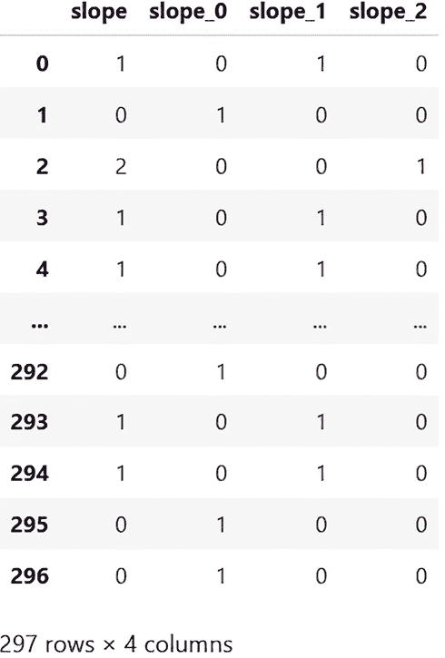

##### 图 6.4 原始的`slope`列和通过应用独热编码创建的三个新列

从这个格式中，我们仍然可以推断出每个患者的`slope`列的值，但现在，这些列也可以作为回归模型的输入。这只是有专门针对分类数据的方法的一个例子。一般来说，对于分类数据，我们感兴趣的是

+   我们值的频率分布

+   我们分类值与其他值之间的关联，包括连续和分类值

一些专门针对这些属性处理分类数据的方法是

+   分组和聚合

+   条形图来可视化值的频率分布

+   交叉表和交叉表来比较两个分类列的共现情况

+   通过分类列着色来显示连续变量在不同类别中的分布的直方图和箱线图

有许多其他方法可以研究连续和分类数据，其中一些我们将在本章中更详细地探讨。我们将要处理的一个常见的分类值来源是调查响应数据。

### 6.1.2 处理调查数据

问卷调查数据有其特定的考虑因素，而不仅仅是它是分类列的常见来源。在我们进行分析时，我们需要考虑以下因素：

+   问卷调查数据是自我报告的，这意味着它会有特殊的偏见。人们可能会选择出于个人原因省略答案或提供不真实的答案。回答调查的参与者可能是那些愿意回答调查的人，这再次意味着样本是有偏见的。

+   数据可能因为不同于其他数据集的原因而缺失。缺失数据可能表明不愿意回答特定问题，用户在调查中途退出，或者基于其他问题的答案对用户不可用的问题（例如，如果他们回答了是，则需要进一步阐述）。

+   许多答案将采用李克特量表，参与者从“强烈不同意”到“强烈同意”中选择五个答案中的一个。这意味着我们将处理有序值——具有自然顺序但不是一致数值尺度的类别。

我们得到的启示是，我们不应低估了解我们数据的重要性，而了解我们每一列的正确类型以及数据本身的来源是其中的关键方面。现在让我们在本章的项目中检验这一点。

## 6.2 项目 5：分析调查以了解开发者对 AI 工具的态度

现在让我们看看我们的项目，我们将分析调查结果以了解软件开发者如何使用 AI 工具。大部分数据是分类的，因为数据来源是一个包含大量多项选择题的调查，这些题目的结果产生了分类值。我们将查看问题陈述、数据字典、我们应追求的输出以及我们的工具需要解决此问题的能力。然后我们将使用以结果为导向的框架进行详细规划，然后再深入研究一个示例解决方案。

数据可在[`davidasboth.com/book-code`](https://davidasboth.com/book-code)处获取，你可以找到尝试项目所需的文件，以及以 Jupyter 笔记本形式的示例解决方案。

### 6.2.1 问题陈述

在这个场景中，你作为 AI Dev Elite 的分析师，一个专注于为编写代码的人创建生成式 AI 工具的 AI 创业公司。他们正努力聚焦产品理念，因此他们要求你研究编码者目前如何使用生成式 AI 工具。他们希望识别人们的痛点并找到可以利用的市场空白。

他们有两个假设希望你来测试：

+   新手和经验丰富的编码者使用这些工具的方式不同。

+   人们对于当前 AI 工具的有用性和可信度的看法取决于他们的经验、工作角色以及他们具体使用工具的目的。

尽管他们很想直接访问人们输入到这些工具中的查询，但他们已确定 Stack Overflow 开发者调查是本项目的第一轮迭代中一个很好的信息来源。在这项调查中，开发者透露了关于他们的工作、当前工具以及他们对生成式 AI 工具的使用和态度的详细信息。他们希望我们从这些调查结果中测试他们的假设。

备注：感谢 Stack Overflow 在此处提供他们的开发者调查结果：[`insights.stackoverflow.com/survey`](https://insights.stackoverflow.com/survey)，根据开放数据库许可（ODbL）。

### 6.2.2 数据字典

该数据集的数据字典分为两部分，均包含在补充材料中：

+   有一个按问题分解的列表，`survey_results_schema.csv`记录了哪些列包含答案。一些问题的答案分布在多个列中。

+   此外，还有调查本身的 PDF 副本。有了这个，您可以直接观察数据生成过程，这是很少见的。

我建议首先查看调查，因为这会将数据字典和数据本身中的列置于上下文中。直接查看调查问题将有助于确定分析中感兴趣的问题。然后，您可以使用`survey_results_schema.csv`文件在答案数据中找到相关的列名。图 6.5 显示了此查找文件的摘录。

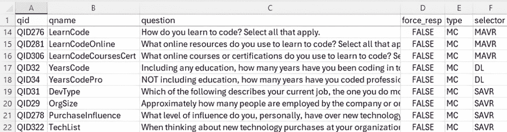

##### 图 6.5 使用作数据字典的映射文档摘录

如图 6.5 所示，关于某人专业编码多少年的问题在答案数据中引用为`YearsCodePro`。这就是我们在示例解决方案中识别所有相关分析列的方法。

### 6.2.3 预期结果

由于我们的利益相关者有特定的假设，我们的分析应专注于这些假设。我们需要对数据进行一些一般性的探索，以识别缺失值等，但我们的重点是请求的具体内容。我们最小可行的答案应该是支持或反驳这些假设的证据。因此，

+   我们的结论应包括是否在不同经验水平上使用 AI 存在差异。

+   我们应该传达影响人们对 AI 工具看法和信任度的因素，这些因素得到了调查数据的支持。

### 6.2.4 必需工具

与大多数章节一样，只要您的工具可以读取、探索和可视化数据，就可以完成这个项目。在示例解决方案中，我使用 Python、`pandas`库进行数据探索，以及`matplotlib`和`seaborn`进行可视化。在调查数据中的关联性时，我还介绍了一些来自`scipy`库的统计函数。因此，这个项目的清单是，您的工具可以

+   从 CSV 或 Excel 文件中加载多个数据集

+   合并两个或多个数据集

+   执行基本的数据操作任务，例如排序、分组和重塑数据

+   创建数据可视化

+   生成统计分析，特别是分类数据的统计分析，但这不是必需的

## 6.3 将结果驱动方法应用于分析开发者调查

现在我们来看看我们如何保持我们的结果在焦点上，并制定一个以结果为导向的行动计划。我们可以遵循以结果为导向的过程的步骤，在考虑利益相关者的请求和假设的同时探索数据。


首先，我们需要了解我们的利益相关者希望从这个分析中得到什么。他们的初步目标是找到证据来支持或反驳他们的初始理论，但他们的最终目标是找到一个可以利用 AI 产品的市场空白。在分析数据时，我们可以牢记这两个目标，以确保我们的结果有价值。


从我们的利益相关者的请求中，我们知道需要创建两种类型的输出：

+   不同经验水平开发者之间使用 AI 工具差异的证据

+   分析决定某人评估 AI 工具有用性和可信度时得分的因素

像往常一样，以结果为导向的焦点意味着我们可以忽略分析可能采取的某些路径，如果这些路径不能帮助我们找到对特定问题的答案。在实践中，这意味着忽略调查中与经验、AI 工具的有用性或可信度或可能与之相关联的因素无关的问题。


在这个项目中，数据源的选择已经为我们完成。这种情况并不少见，而且一如既往，我们正在在可用数据的限制内工作。


在这个阶段，有一个问题需要解决，那就是我们是否想查看 2023 年之前（目前最新版本）的调查。我们有多个调查可供选择，因此我们可以选择包括过去几年的数据。然而，反对这样做有两个论点。首先，我们希望有一个最小可行答案，这意味着一开始就使用较少的数据。其次，AI 工具的真正兴起是在 2023 年，所以早期的数据可能不会给我们提供更多有助于我们特定分析的信息。


在深入分析问题之前思考过，这是我们制定分析行动计划的部分。我们大致想要采取以下步骤：

+   阅读调查以确定确切的问题。

+   检查数据字典和我们的数据，看看问题如何与数据中的列相关。

+   通过查看通常的属性，如缺失数据、异常值和类似情况来探索数据。

+   确定与我们的研究问题相关的问卷问题和列。

+   分析我们的变量与我们所感兴趣的 AI 相关结果之间的关系。

+   根据我们的利益相关者的假设总结我们的发现。

提示：这是一个可能有用统计测试的项目，因为我们有特定的假设要调查。无论正确与否，利益相关者喜欢询问某事是否具有统计学意义，这是为他们提供实际答案的机会。


在这一步，我们希望展示证据来支持或反驳我们的利益相关者的假设，这些假设如下：

+   在不同经验水平上使用 AI 存在差异。

+   影响一个人对 AI 工具的看法和信任度的因素包括他们的经验水平、工作角色以及他们具体使用工具的目的。

我们特别希望提供最完整的答案，同时仍然能够得到我们数据的支持。我们不希望我们的利益相关者根据不是基于稳健发现的建议采取行动，所以除非我们对发现的关联有信心，否则我们应该使用适当的语言。像“数据表明”这样的短语通常比“证明”或“显示”这样的词更受欢迎。


一旦我们提出了我们的发现，与我们的利益相关者的讨论很可能会导致进一步探索数据的问题，以及有助于我们分析的其他数据来源。我们的目标是尽快达到这一点，而不是更晚，因此我们应该在我们的第一次迭代中只包含最小限度的复杂性。

## 6.4 示例解决方案：开发者如何使用 AI？

现在我们来逐步分析这个问题的解决方案。一如既往，如果你在阅读这一节之前尝试了项目，你会发现它更有价值，因为你可以将两种解决方案进行比较，当然，通常的警告是，我们的解决方案可能仅仅是因为我们做出的选择而有所不同。

当务之急是决定哪些列代表我们感兴趣的提问，因此，我们将关注哪些。接下来，我们将在查看影响开发者对 AI 态度的因素之前，对数据进行一个高层次、一般性的探索。

### 6.4.1 探索分类数据

通常，在一个分析项目中，第一步是查看可用的数据。然而，我们有一个难得的机会通过查看生成我们数据集的调查本身来观察数据生成过程。在滚动浏览它时，以下是初步观察：

+   大多数问题不是强制性的，这意味着我们可以预期会有大量缺失数据。

+   关于年龄、编码年数和职位的问题看起来立即相关。

+   每个与特定工具或技术相关的问题都包括标记它们为“目前正在使用”和“希望明年使用”的选项，AI 相关的问题还包括“感兴趣使用”和“不感兴趣使用”，以及仅仅是“目前正在使用”。拥有所有这些选项意味着我们可以交叉引用答案以找到更深层次的关系。

+   参与者可以通过使用李克特量表来标记他们认为 AI 工具有多有利和值得信赖，这是允许给出积极、中立和负面答案的调查问题的技术名称，并且代表有序数据。

+   README 文件中提到“自由回答提交已被移除”，这很遗憾，因为我们将会缺少对调查问题“请描述一下，如果一年后由于人工智能的进步，你的工作流程会有何不同（如果有不同的话）”的答案。此外，我们也不会看到有“其他”选项的问题的答案，参与者可以在其中进行详细说明。

当我们对数据有疑问时，我们无疑会重新审视调查本身，但就目前而言，我们对数据的了解已经足够开始我们的探索。让我们看看调查问题与我们的数据集中的行是如何关联的：

```py
import pandas as pd
import seaborn as sns
import matplotlib.pyplot as plt

survey = pd.read_csv("./data/survey_results_public.csv.gz")
print(survey.shape)
survey.head()
```

这段代码的输出告诉我们，我们正在处理 89,000 份调查回答，其中一部分在图 6.6 中展示。

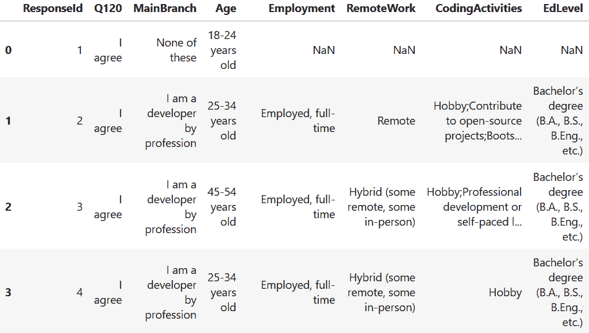

##### 图 6.6 原始调查数据的快照

从这个快照中，我们已能看出

+   如预期的那样，会有缺失值。

+   大多数答案，甚至年龄，都是以文本形式表示的分类数据。

+   多选题的答案存储为分号分隔的字符串。这种类型的数据可能有多种存储方式，因此确定我们面对的是哪种表示形式是很好的。

让我们更深入地挖掘缺失数据。

#### 调查缺失数据

理想情况下，我们应该发现只有非必填问题会有缺失答案。这是否是情况？图 6.7 显示了显示每一列缺失值数量的表格快照：

```py
survey.isnull().sum()
```

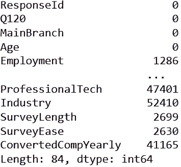

##### 图 6.7 每一列的缺失值

这表明，例如，参与者的唯一标识符和年龄列都没有缺失数据。《MainBranch》列代表调查问题的答案，“以下哪个选项最能描述你现在的状态？在本调查中，开发者是指‘编写代码的人’。”年龄是我们感兴趣的问题之一，并且在调查中是必填的。到目前为止，一切顺利。碰巧的是，我们有一个机器可读格式的数据字典，因此我们可以将其与数据交叉引用，以查看哪些必填问题实际上有缺失数据。图 6.8 是数据字典数据集的快照：

```py
data_dict = pd.read_csv("./data/survey_results_schema.csv")
data_dict.head(10)
```

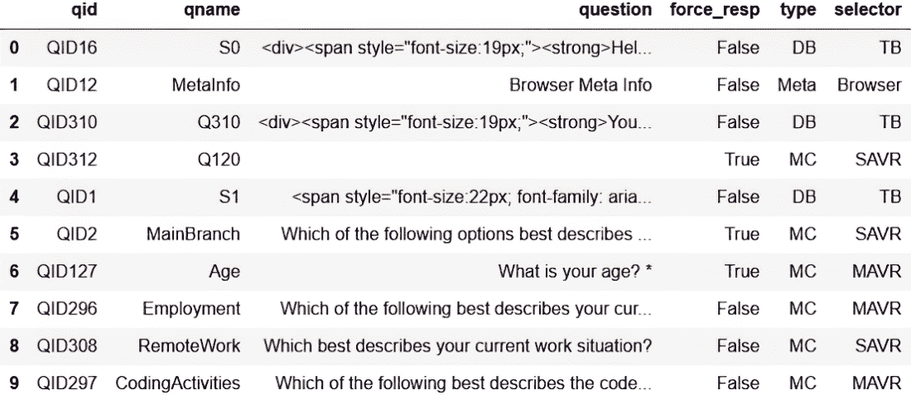

##### 图 6.8 数据字典数据集的快照

我们有一个`qname`列，它应该与我们的答案数据中的列名相匹配。我们还有问题本身，似乎以文本或 HTML 形式呈现，以及问题是否为必填项，在`force_resp`列中表示。看起来我们已经有足够的信息来交叉引用这些文件，但检查我们对`qname`列的假设是值得的。Python 中的一个巧妙技巧是使用集合比较列名。

集合论在数据科学课程中并不常见，但了解一些关于集合的技巧，这些集合只包含唯一值，可以在这种特定情况下有所帮助。我们将创建一个包含我们答案数据中的列名和数据字典数据集中`qname`列的值的集合，并查看它们在哪里重叠。

```py
len(set(survey.columns).intersection(set(data_dict["qname"])))
```

输出结果是 50，这意味着有 50 个列同时出现在两个集合中。这很有希望，但我们还想知道哪些列没有重叠。在 Python 中从另一个集合中减去一个集合实际上给出了这个差异。此代码的输出是我们答案数据中 34 个未在数据字典中考虑的列的集合，其中图 6.9 显示了这些列的样本。

```py
set(survey.columns) - set(data_dict["qname"])
```

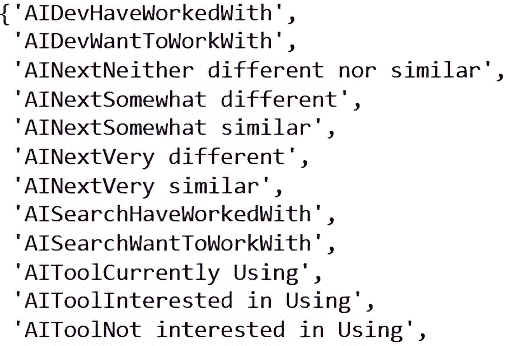

##### 图 6.9 数据字典中未考虑的列样本

检查时，许多这些看起来像是相同问题的多项选择题选项。例如，调查问题，“你目前正在使用 AI 工具开发工作流程的哪些部分，以及你接下来一年内感兴趣使用 AI 工具的部分有哪些？请选择所有适用的选项，”有“目前正在使用”、“感兴趣使用”和“不感兴趣使用”的复选框选项，这些答案记录在三个列中。图 6.10 和 6.11 分别显示了问题在调查中的格式以及答案在数据中的表示。

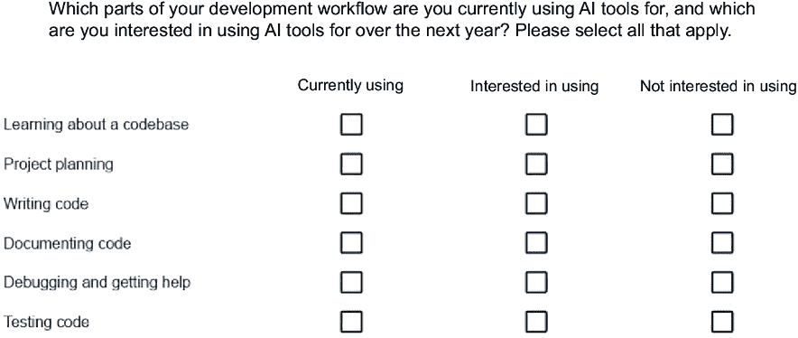

##### 图 6.10 调查中出现的关于 AI 工具的问题

调查中每个复选框列的对应数据中都有一个列，其值是该列中勾选的所有 AI 用例。也就是说，图 6.11 中第二行表示的参与者表示他们目前正在使用 AI 工具编写代码、提交和审查代码。

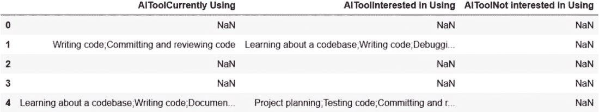

##### 图 6.11 调查答案数据中相同问题的表示

看起来我们无法轻松地将所有列与数据字典匹配，因此另一个选项是查看数据字典中强制性的内容，并检查所有相关列是否有任何缺失答案数据。图 6.12 显示了根据数据字典的强制性列：

```py
data_dict[data_dict["force_resp"] == True]
```


##### 图 6.12 根据数据字典的强制性列

至少，我们答案数据中的每一行都应该有年龄、最高教育水平、国家、货币以及参与者当前是否在其工作流程中使用 AI 工具的值。因此，我们不应该在`EdLevel`列中有缺失数据。是这样吗？图 6.13 显示了以下代码的输出：

```py
survey[survey["EdLevel"].isnull()]
```

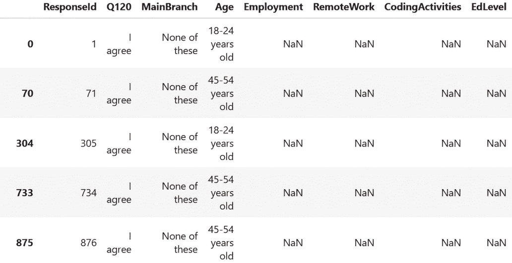

##### 图 6.13 教育水平缺失的行，这种情况绝不应该发生

显然，强制性问题存在缺失答案。这里的一个可疑元素是，当`EdLevel`缺失时，每个答案似乎都缺失。也许这些是完全错误的例子。让我们确定对于每个在`EdLevel`列缺失的参与者，缺失的列数有多少。图 6.14 显示了输出：

```py
survey[survey["EdLevel"].isnull()].isnull().sum(axis=1).sort_values()
```

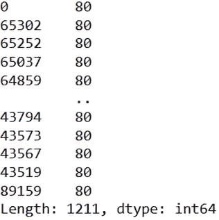

##### 图 6.14 EdLevel 缺失时每行的缺失值数量

这告诉我们，无论`EdLevel`缺失在哪里，都有精确的 80 个缺失值，这意味着这些是所有答案都缺失的调查响应，可以安全地删除。具体来说，任何所有调查答案列都缺失的地方都可以删除：

```py
survey = survey.dropna(subset=survey.columns[4:], how="all")
```

让我们重新审视我们的交叉引用，并查看我们答案数据中所有没有缺失值的列。我们可以手动与强制性问题进行交叉检查，使用图 6.12，并查看是否有任何问题的对应列有缺失数据。以下代码生成了图 6.15 所示的输出：

```py
survey.isnull().sum().loc[lambda x: x==0]
```

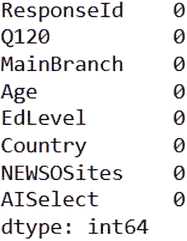

##### 图 6.15 无缺失数据的列列表

如果我们将此与图 6.12 中的表格进行交叉引用，似乎`Currency`列是唯一剩下的强制性问题，且存在缺失数据。让我们再次看看缺失数据中是否存在某种模式。当`Currency`缺失时，是否有相同数量的缺失值？图 6.16 显示了以下代码的输出：

```py
survey[survey["Currency"].isnull()].isnull().sum(axis=1)
```

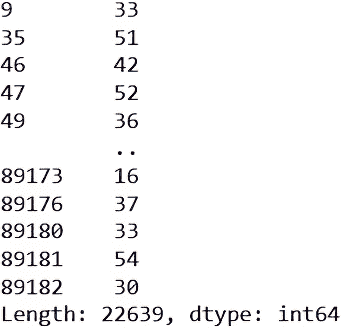

##### 图 6.16 当`Currency`缺失时每行的缺失值数量

这里似乎没有明显的模式。它表明，尽管强制性`Currency`问题有超过 20,000 个缺失答案，这可能是某种技术错误。也许可能存在其他因素影响这一点，例如某些国家货币数据缺失更频繁。无论如何，我们的初步研究问题不依赖于这个列，所以这是一个好的地方来决定现在不再进一步追究这一线索。让我们总结到目前为止的过程。我们的第一个决策点是调查并删除缺失值，如图 6.17 所示。

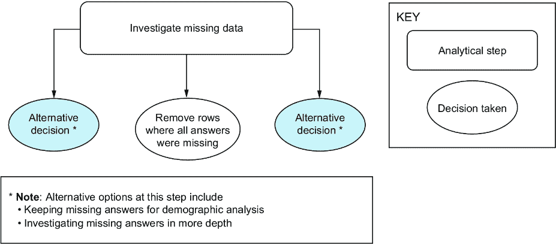

##### 图 6.17 我们分析的第一步，可视化展示

现在，让我们更详细地探索我们的 AI 相关列。

### 6.4.2 分析分类调查数据

首先，我们应该了解有多少比例的人甚至在使用 AI 工具。一张快速图表揭示了这一答案，如图 6.18 所示：

```py
fig, axis = plt.subplots()

(
    survey["AISelect"]
    .value_counts(dropna=False)
    .plot
    .barh(ax=axis)
)

axis.set(title="Answers to the question:\n'Do you currently
↪ use AI tools in your development process?'",
         xlabel="Number of responses")

plt.show()
```

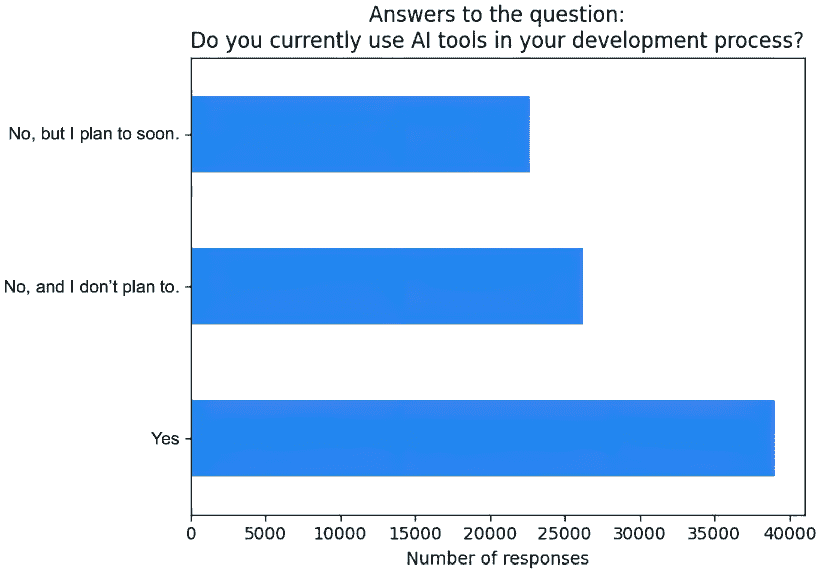

##### 图 6.18 参与者是否使用 AI 工具的回答分布

从这里我们可以继续探索很多方向。例如，我们可以找出 AI 工具用户和那些不使用它们的人的群体或工作角色。然而，由于我们专注于最终结果，我们可以意识到这并不是我们试图回答的问题。我们只对已经使用 AI 工具的子群体感兴趣，我们更关注他们是如何使用它们的。话虽如此，我们感兴趣的角度是人们如何看待 AI 工具的可信度，因此看看使用 AI 和不使用 AI 的参与者之间是否存在态度差异可能很有趣。

#### 调查调查答案中的 Likert 数据

对于 AI 用户对工具的感受问题，我们首先想使用`AISent`列，它揭示了图 6.19 中显示的问题的答案。

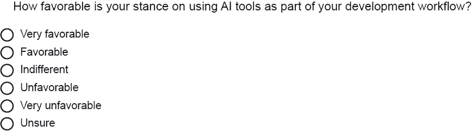

##### 图 6.19 关于 AI 情感的问题

现在，我们可以查看`AISent`列的分布，以确定人们是如何回答的。由于这个问题不是强制的，我们预计会找到一些缺失数据。以下代码生成了图 6.20 所示的输出：

```py
survey["AISent"].value_counts(dropna=False)
```

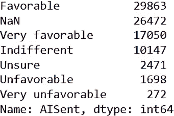

##### 图 6.20 AI 情感问题的答案分解

如预期的那样，有很多缺失答案。这些并不是坏数据；总的来说，它们代表的是选择不回答此问题的参与者，因此我们可以用占位符，如“未给出答案”来填充这个值。另一个，更具体的 Python 步骤是我们可以将此列的数据类型明确设置为分类类型。这将允许我们设置值的顺序，这样无论它们出现在数据表或图表中，都不会按字母顺序排序。我们使用`pandas`的`Categorical`数据类型来完成所有这些。以下代码的输出显示在图 6.21 中：

```py
survey["AISent"] = (
    pd.Categorical(
        survey["AISent"].fillna("No answer given"),
        categories=['No answer given', 'Unsure',
                    'Very unfavorable', 'Unfavorable',
                    'Indifferent', 'Favorable', 'Very favorable'],
        ordered=True)
)

survey["AISent"].value_counts(dropna=False).sort_index()
```

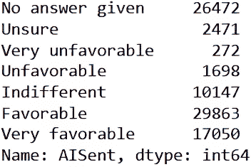

##### 图 6.21 将数据类型转换为`Categorical`后的 AI 情感答案分解

我必须做出的一个选择是值的顺序。这主要是我的个人偏好，我选择将“未给出答案”选项放在第一位，并从负面到正面情感开始剩余的答案。然而，我们在这个阶段仍然必须做出这个选择。现在，我们可以比较这些答案在 AI 工具用户、非用户和潜在用户群体中的分布。

#### 使用交叉表来交叉引用分类值

比较不同群体 AI 工具用户对喜好程度的答案，需要交叉引用两个分类变量。在`pandas`中，一个合适的方法是`crosstab`，以下代码生成了图 6.22 所示的输出：

```py
pd.crosstab(
    index=survey["AISelect"],      #1
    columns=survey["AISent"]      #2
)
```

#1 行表示参与者是否是 AI 工具用户。

#2 列表示对 AI 情感问题的答案。

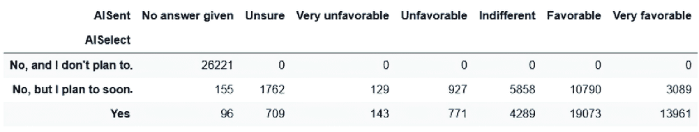

##### 图 6.22 比较 AI 用户和非用户是否对 AI 工具持好感

我们可以立即注意到，那些声称不使用 AI 的人也没有给出后续回答，要么是因为后续回答没有意义，要么是因为调查主动隐藏了该选项。我们可以在这里停下来，并尝试进一步理解这个表格，因为它并不太大。然而，我倾向于不要长时间盯着数字表格，而是创建可视化图表。

#### 使用热图可视化交叉表

使用热图可视化数字表通常是好机会，`seaborn`库可以提供这种功能。我选择了灰度选项，这对应于打印，但任何顺序色图都可以。

##### 关于颜色尺度术语的说明

当决定可视化的颜色，并且涉及多种颜色时，我们需要选择一个色图，即可视化中出现的颜色范围。我们的选择有顺序、分散或分类（也称为名义或定性）。

顺序色图在亮度上逐渐变化，以表示连续的尺度。亮度与测量的大小成比例；一个例子是灰度色图，如图 6.23 中使用的色图。较深的颜色表示更多的人落入某个类别。

分散色图包括多种颜色，这些颜色根据方向逐渐改变亮度。亮度仍然用来表示强度，但色调也指示方向。一个例子是负值用红色表示，正值用蓝色表示，较大的值分别用较深的红色或蓝色表示。

分类色图用于需要不同部分的可视化具有不同颜色的情况。它们通常用于饼图或柱状图中，其中每个切片或柱子都是完全不同的颜色。颜色纯粹是为了视觉分离，不应进行数值解释。

我还把最小和最大点分别锚定在 0 和 1，因为我们正在使用的尺度就是这样。图 6.23 显示了生成的热图：

```py
fig, axis = plt.subplots()

sns.heatmap(
    data=pd.crosstab(
        index=survey.loc[survey["AISelect"]
↪ != "No, and I don't plan to", "AISelect"],
        columns=survey.loc[survey["AISelect"]
↪ != "No, and I don't plan to", "AISent"],
        normalize="index"
    ),
    cmap="Greys",
    vmin=0,
    vmax=1,
    square=True,
    annot=True,
    ax=axis
)

fig.suptitle("How favorably do different people view AI tools?")

axis.set(
    xlabel="How favorable is your stance on using AI tools?",
    ylabel="Do you currently use AI tools?"
)

plt.show()
```

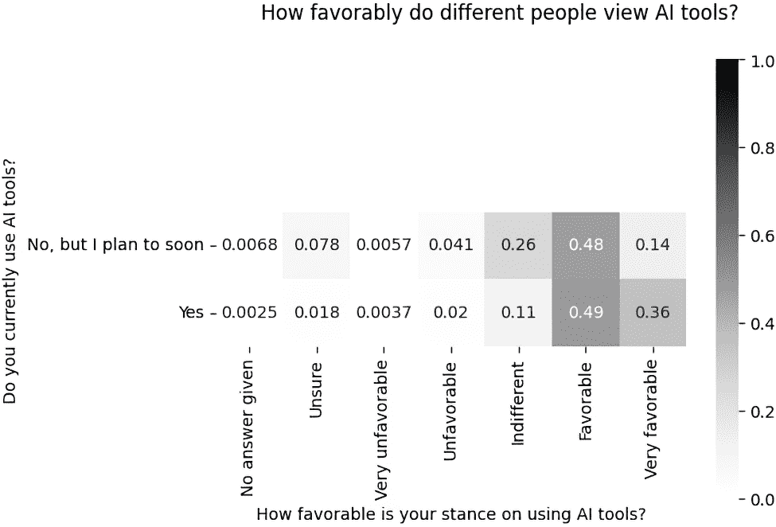

##### 图 6.23 展示了用户和潜在用户对 AI 工具的喜好热图

注意：这是一个将一些编程最佳实践纳入我们分析的好机会。我们无疑会创建更多像这样的热图，它们之间的区别将是数据和轴标签。其他选项将保持不变，因此我们应该创建一个可重用的函数，可以生成热图而无需重复代码。代码质量问题通常不在此类项目的范围内。

生成图 6.23 所示热图的修改后的代码如下。我们将在整个解决方案中重用这个`create_heatmap`方法：

```py
def create_heatmap(data, square=True):     #1
    fig, axis = plt.subplots()

    sns.heatmap(
        data=data,
        cmap="Greys",
        vmin=0,
        vmax=1,
        square=square,
        annot=True,
        ax=axis
    )

    return fig, axis     #2

fig, axis = create_heatmap(
    pd.crosstab(
        index=survey.loc[survey["AISelect"]
↪ != "No, and I don't plan to", "AISelect"],
        columns=survey.loc[survey["AISelect"]
↪ != "No, and I don't plan to", "AISent"],
        normalize="index"
    )
)

fig.suptitle("How favorably do different people view AI tools?")

axis.set(
    xlabel="How favorable is your stance on using AI tools?",
    ylabel="Do you currently use AI tools?"
)

plt.show()
```

#1 该函数只需要数据表，以及一个可选的方式来使热图成为正方形或不是。

#2 我们返回 Figure 和 Axis 对象，以便自定义轴标签和标题。

现在，回到解释热图。似乎当前和潜在 AI 用户之间存在一些明显的差异。首先，使用 AI 工具的人对它们的看法比潜在用户更积极，而尚未使用 AI 工具的人更有可能对它们持中立态度。这可能并不令人惊讶。对工具缺乏怀疑态度是有趣的；似乎很少有开发者对工具持负面看法。这可能是一种选择偏差；填写此调查的开发者可能已经更有可能拥有良好的 AI 工具用例，因此有更高的评价。让我们看看这些群体在关于工具输出可信度的问题上的表现如何。

`AIBen`列也存在缺失数据，因此我们选择填充这些数据并再次创建一个有序的`Categorical`列。然后，以下代码生成了图 6.24 中的输出：

```py
survey["AIBen"] = (
    pd.Categorical(
        survey["AIBen"].fillna("No answer given"),
        categories=['No answer given', 'Highly distrust',
                    'Somewhat distrust', 'Neither trust nor distrust',
                    'Somewhat trust', 'Highly trust'],
        ordered=True
    )
)

survey["AIBen"].value_counts(dropna=False).sort_index()
```

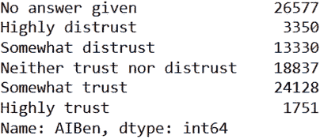

##### 图 6.24 AI 工具的可信度分布

尽管大多数参与者对 AI 工具持积极看法，但在信任它们的输出方面，分布更为广泛。通过以下代码比较 AI 用户和潜在用户这些答案的交叉表，如图 6.25 所示：

```py
pd.crosstab(
    index=survey["AISelect"],
    columns=survey["AIBen"]
)
```

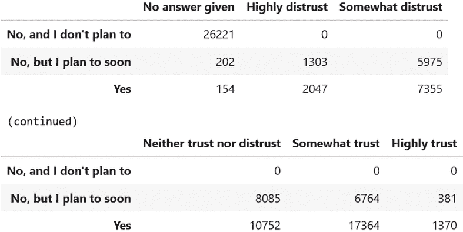

##### 图 6.25 比较不同用户对 AI 可信度的看法

再次，我们可以排除非用户，并生成交叉表的热图，如图 6.26 所示：

```py
fig, axis = create_heatmap(
    pd.crosstab(
        index=survey.loc[survey["AISelect"]
↪ != "No, and I don't plan to", "AISelect"],
        columns=survey.loc[survey["AISelect"]
↪ != "No, and I don't plan to", "AIBen"],
        normalize="index"
    )
)

fig.suptitle("How much do different people trust the output of AI tools?")

axis.set(
  xlabel="How much do you trust the accuracy of the output from AI tools?",
  ylabel="Do you currently use AI tools?"
)

plt.show()
```


##### 图 6.26 比较 AI 工具用户和潜在用户对 AI 可信度的热图

AI 工具的活跃用户对其输出的信任度更高，不信任度更低，尽管很少有人愿意说他们**高度**信任它们。潜在用户则更犹豫不决，更频繁地回答“既不信任也不怀疑”。这并不令人惊讶，但验证了一些基本假设。

在继续调查数据的各个方面之前，让我们回顾一下到目前为止的过程。图 6.27 显示了迄今为止采取的步骤。

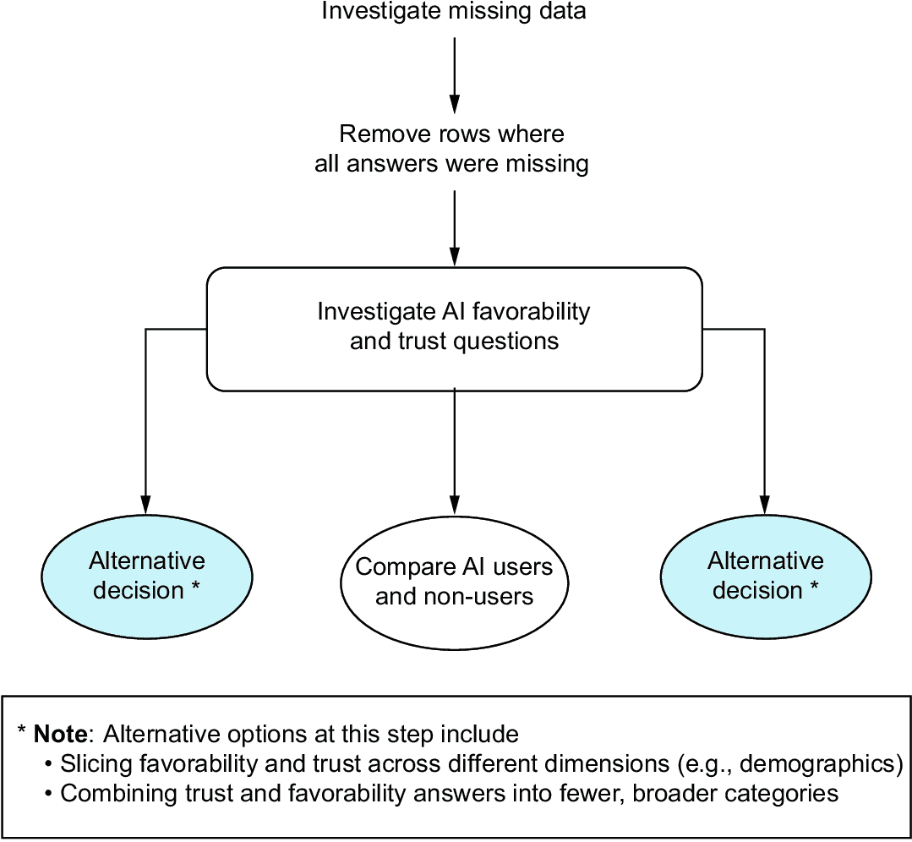

##### 图 6.27 可视化到目前为止的分析

现在，是时候深入探讨人们使用 AI 工具的目的了。

#### 将分类数据转换为指示变量

对于这部分内容，我们将只关注那些回答了他们是否使用这些工具的问题的人。让我们回顾一下关于他们使用 AI 工具的开发工作流程哪些部分的答案格式。图 6.28 显示了相关调查问题的部分内容。

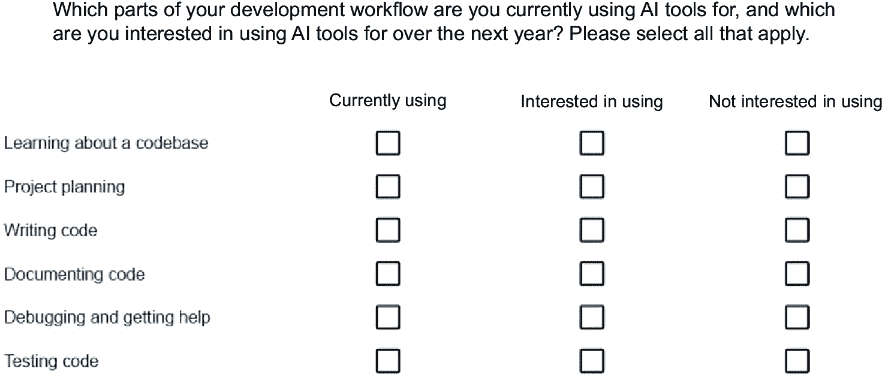

##### 图 6.28 关于参与者使用 AI 工具的调查问题的快照

图 6.29 展示了以分号分隔的字符串形式表示的答案列的快照。数据是通过以下代码选择的：

```py
(
    survey.loc[survey["AISelect"] == "Yes", "AIToolCurrently Using"]
    .dropna()
    .head(10)
)
```

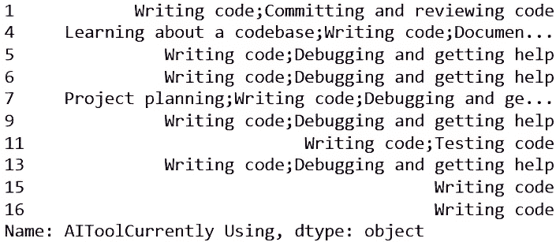

##### 图 6.29 存储人们如何使用 AI 工具的答案的数据快照

这不是我们可以直接处理的格式。通常，我们会将可用的答案分散为指示变量，即二元列，以表示每个可能的答案是否被选中。接下来的这一步，即独热编码，其中我们将这个字符串列转换为指示变量，是一个纯粹的技术步骤，如果你不知道如何使用现有工具进行转换，那么转向 AI 工具是一个完美的选择。让我们看看它是如何运作的。

我向 ChatGPT 提出了以下问题：

> *我有一个包含调查问题中多选题选项值的 pandas DataFrame 列。这些值不是互斥的，因此它们可以包含由分号分隔的多个答案。一个示例值将是“选项 1; 选项 2; 选项 3。”我想将这些值转换为多个指示列，每个值一个，所以我应该有名为“选项 1”、“选项 2”等列，每个列都是一个表示该值是否存在于原始列中的二元指示器。pandas 的代码是什么？*

它的答案以，“你可以通过使用 pandas 中的`str.get_dummies`方法来创建多选题列中的每个选项的指示列”开始，这正好是我要找的方法。它还提供了一些代码片段，如图 6.30 所示。

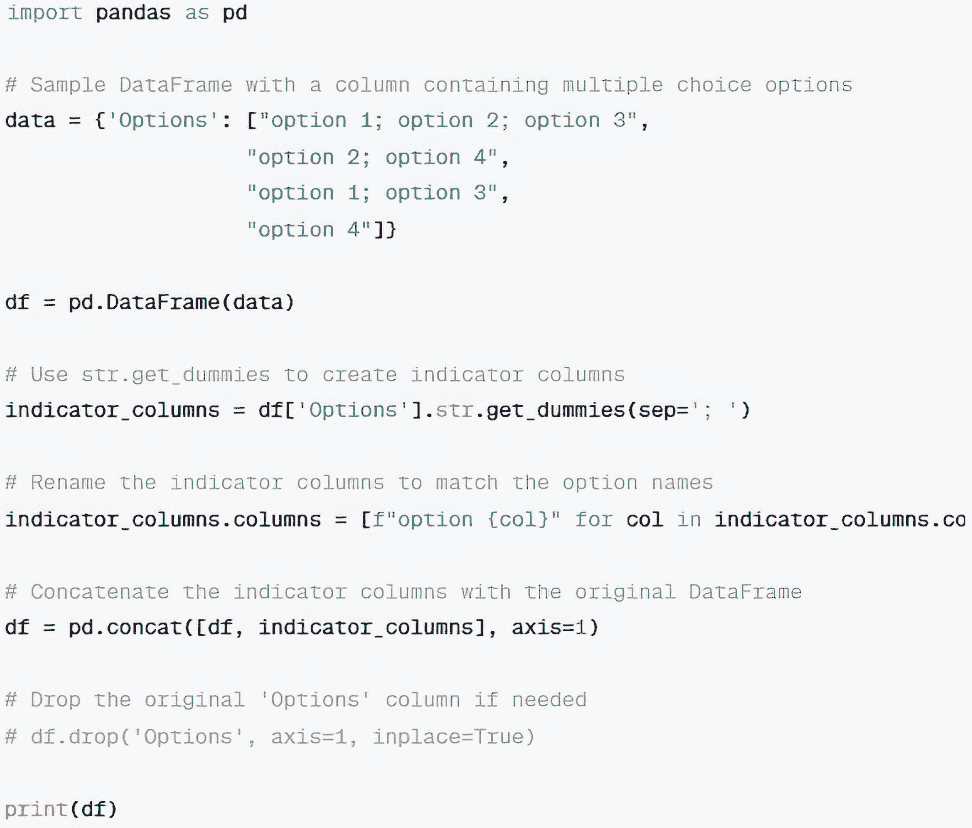

##### 图 6.30 ChatGPT 建议的代码片段

我必须进行的一个调整是将分隔符从“; ”改为“;”，因为我们的数据中分号分隔的值之间没有尾随空格。除此之外，`str.get_dummies`函数正是我们所需要的。以下代码生成了图 6.31 中显示的指示列：

```py
ai_tool_indicators = (
    survey.loc[survey["AISelect"] == "Yes", "AIToolCurrently Using"]
    .str.get_dummies(sep=";")
)
ai_tool_indicators
```

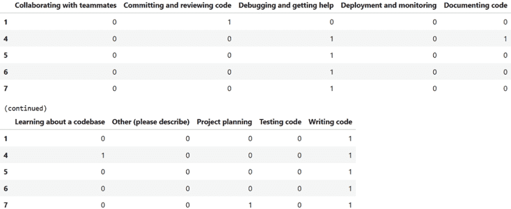

##### 图 6.31 新创建的指示列快照

再次强调，每一列代表图 6.28 中的其中一个复选框行，而值为 1 表示在“目前正在使用”列下勾选了复选框。如果我们对“感兴趣使用”和“不感兴趣使用”也进行重复操作，我们将得到三倍的指示变量，实际上每个问题下每个复选框对应一个列。

经验可能会告诉我们，在分隔定界字符串时，我们可能会在列名中出现尾随空格，所以让我们检查并修复这个问题：

```py
ai_tool_indicators.columns = [c.strip() for c in ai_tool_indicators.columns]
```

指示变量的一个好处是，每一列的总和代表勾选特定复选框的人数，每一列的平均值代表百分比。让我们看看检查了每个选项的参与者的百分比。记住，现在这仅仅是告诉我们他们目前使用 AI 工具做什么的 AI 用户。以下代码生成了图 6.32 中的图表：

```py
fig, axis = plt.subplots()

(
    ai_tool_indicators
    .mean()
    .sort_values()
    .plot
    .barh(ax=axis)
)

axis.set(
    title="What are AI users using their AI tools for?",
    xlabel="% of users who ticked that option"
)

plt.show()
```

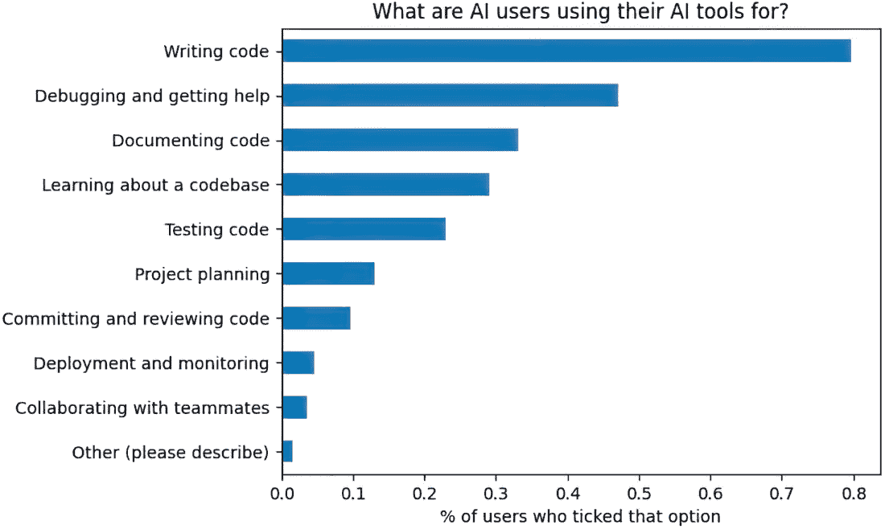

##### 图 6.32 显示了使用 AI 工具的百分比的用户勾选了每个“目前正在使用”选项的条形图

大多数开发者都在使用 AI 工具编写和调试代码，但还有其他相关的用例也很受欢迎，例如测试代码、项目规划和甚至编写代码文档。我们可以将指标列添加到我们的原始数据中，并保留一个仅包含 AI 用户的过滤数据集，用于剩余的调查。图 6.33 显示了以下操作后的数据快照：

```py
survey_ai_users = (
    pd.concat([survey, ai_tool_indicators], axis=1) #1
    .dropna(subset=ai_tool_indicators.columns, how="any")
)
assert len(survey[survey["AISelect"] == "Yes"]) == len(survey_ai_users)

survey_ai_users.head()
```

#1 `concat`默认会根据索引进行匹配。

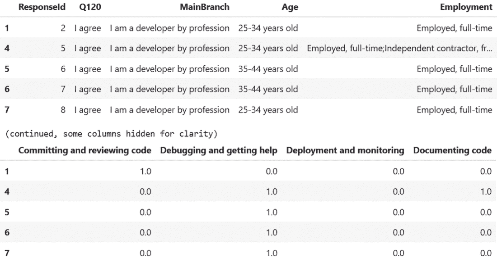

##### 图 6.33 AI 用户合并数据的快照

让我们看看参与者根据他们使用工具的目的来判断 AI 的喜好和可信度。我们的“从结果开始”的哲学在这里很有帮助。我们想要一个表格，其中每一行是 AI 工具的一个用例（例如，“编写代码”），每一列是喜好选项之一。每个单元格代表那些声称他们使用 AI 工具进行特定目的并针对喜好给出特定回答的人的数量，或者更好的是，百分比。这应该会显示不同用户之间是否存在意见差异。

#### 将数据转换为长格式以便于分析

将不同的使用案例与喜好意见进行交叉引用需要对我们的数据进行一些调整。这又是一个 AI 工具告诉我们如何做到这一点的用例，但这次，让我们自己尝试一下，并在之后与我们的 AI 工具比较笔记。我们想要的是长格式的数据，这将使生成正确的交叉表变得更容易。有关数据建模中宽数据与长数据的更多详细信息，请参阅第三章。以下代码创建了一个与喜好交叉引用的多个选择题之一的长格式版本，输出显示在图 6.34 中：

```py
(
    survey_ai_users[survey_ai_users["Collaborating with teammates"] == 1]
    .groupby("AISent")
    .size()
    .reset_index(name="count")
    .assign(option="Collaborating with teammates")
)
```

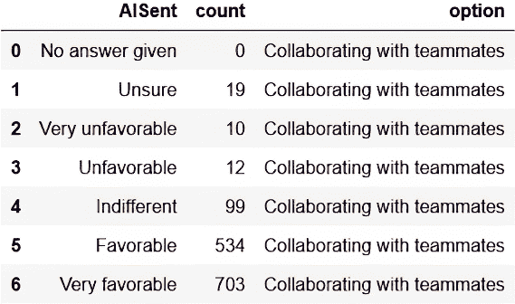

##### 图 6.34 使用 AI 工具进行协作的人的喜好

如果我们为每个选项都有一个组合成一个长表的数据库，我们就可以将其重塑为我们需要的交叉表。让我们遍历选项并构建这个长表：

```py
tool_favorability_dfs = []
for col in ai_tool_indicators.columns:      #1
    option_df = (
        survey_ai_users[survey_ai_users[col] == 1]
        .groupby("AISent")
        .size()
        .reset_index(name="count")
        .assign(option=col)
    )
    tool_favorability_dfs.append(option_df)     #2

options_vs_favorability = pd.concat(     #3
    tool_favorability_dfs,
    axis=0,
    ignore_index=True
)

print(options_vs_favorability.shape)
```

#1 遍历所有指标

#2 生成类似于图 6.32 的聚合，并在列表中跟踪

#3 将列表合并到一个 DataFrame 中

输出是`(70,` `3)`，这意味着我们现在有 70 行，对应于 10 个指标列，每个列有 7 个可能的喜好答案。现在我们可以使用这些数据创建一个百分比交叉表，正如计划的那样。以下代码执行此操作，并在图 6.35 中生成交叉表：

```py
favorability_crosstab = (
    pd.crosstab(index=options_vs_favorability["option"],
                columns=options_vs_favorability["AISent"],
                values=options_vs_favorability["count"],
                aggfunc="sum",
                normalize="index")
)
favorability_crosstab
```

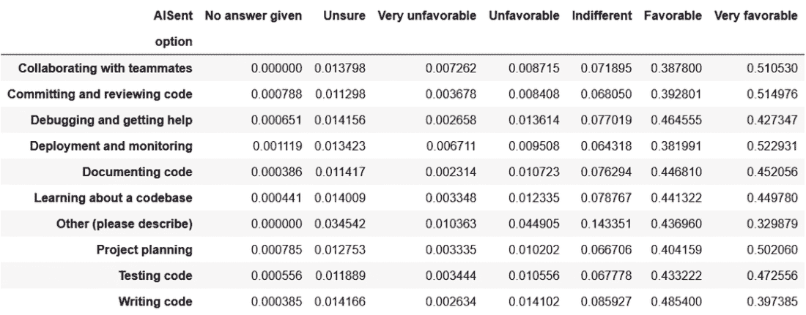

##### 图 6.35 喜好与不同 AI 工具用例的交叉表

现在是一个难以理解的表格，所以让我们也生成一个热图。最终的热图显示在图 6.36 中：

```py
fig, axis = create_heatmap(
    favorability_crosstab.round(2)
)

fig.suptitle("How favorably do people who use AI for different purposes
↪ view AI tools?")

axis.set(xlabel=None, ylabel=None)

plt.show()
```

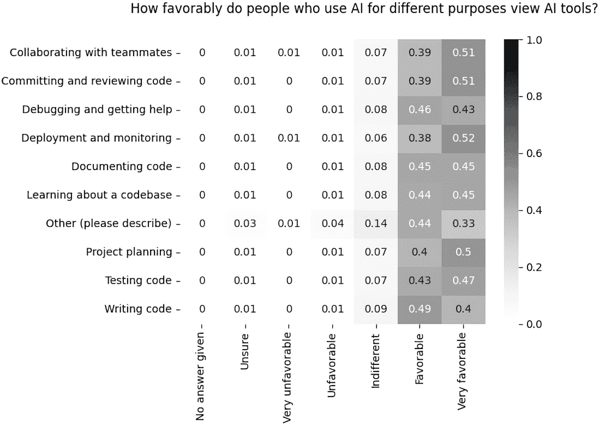

##### 图 6.36 比较不同 AI 工具用例的喜好热图

这比直接的数据表更容易解释。在使用案例之间似乎没有太大的差异，但我们还是可以得出一些观察结果：

+   即使我们将数据分解到使用案例中，AI 用户通常也会对他们的工具持积极态度。

+   那些使用这些工具进行项目规划、协作、提交和审查代码以及部署和监控的人，将 AI 工具评为“非常有利”的最多。

+   最大的“中立”类别是“其他”，但我们没有底层数据，因此无法进一步调查这一点。

在继续之前，让我们简要地看看 ChatGPT 是如何建议我们解决这个特定的技术挑战的。

#### 使用 AI 工具改进我们的分析

每当某件事需要两到三个离散步骤时，我都会觉得有更简单的方法来做，这正是 AI 工具可以帮助我们提高技术知识的地方。

注意：重要的是要记住，像 ChatGPT 这样的 AI 工具只是工具。这使得它们随着时间的推移可以互换。你可能不会使用这个特定的 AI 工具，而且无疑未来还会创造出更先进的工具。你可以自由地将所有关于 ChatGPT 的引用替换为你偏好的任何 AI 工具。

在这种情况下，ChatGPT 的回答非常相似；它建议通过遍历选项来构建 DataFrame。图 6.37 显示了 ChatGPT 的回答。我没有整合它的建议或深入挖掘它与我的代码之间的具体差异；我所寻找的只是是否有一个我忽视的单一`pandas`方法来完成这种转换。结果证明，AI 工具在遍历不同选项方面做得并不比这更好。

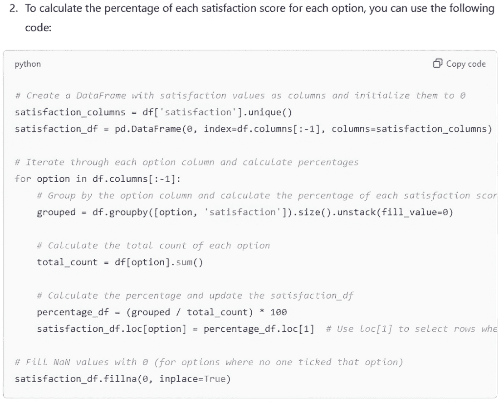

##### 图 6.37 ChatGPT 创建选项与喜好交叉表的方法

之前，关于输出可信度的问题产生了更有趣的发现，因此让我们也为`AIBen`列重复最新的交叉表和热力图过程。以下代码生成长格式数据，其快照显示在图 6.38 中：

```py
tool_trust_dfs = []
for col in ai_tool_indicators.columns:
    option_df = (
        survey_ai_users[survey_ai_users[col] == 1]
        .groupby("AIBen")
        .size()
        .reset_index(name="count")
        .assign(option=col)
    )
    tool_trust_dfs.append(option_df)

options_vs_trust = pd.concat(tool_trust_dfs, axis=0, ignore_index=True)

print(options_vs_trust.shape)
options_vs_trust.head()
```

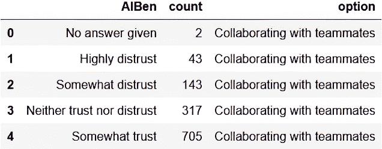

##### 图 6.38 比较 AI 工具使用案例选项与可信度的长格式数据快照

这生成了 60 行数据，10 个使用案例，每个案例有六个可信度选项。现在，我们可以创建以下代码生成的交叉表和热力图。最终的热力图显示在图 6.39 中：

```py
trust_crosstab = (
    pd.crosstab(index=options_vs_trust["option"],
                columns=options_vs_trust["AIBen"],
                values=options_vs_trust["count"],
                aggfunc="sum",
                normalize="index")
)

fig, axis = create_heatmap(
    trust_crosstab.round(2)
)

fig.suptitle("How much do people who use AI for different purposes
↪ trust the output of AI tools?")

axis.set(xlabel=None, ylabel=None)

plt.show()
```

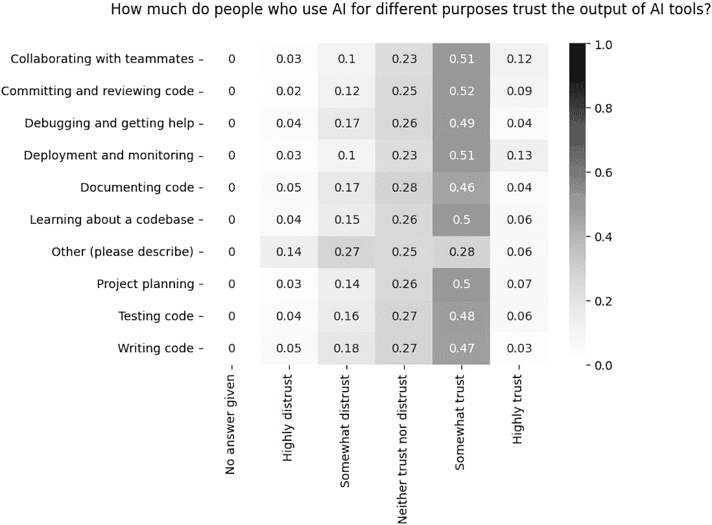

##### 图 6.39 不同 AI 工具使用案例与可信度视图的热力图

从这个热力图中可以看出，大多数用户“有些信任”AI 工具的输出，在使用案例之间没有太大的差异。关于“其他”类别的数据将会很有趣，因为那里的可信度变化最大。

注意：使用这种多选题数据的一个局限性是我们对那些表示他们使用 AI 超过一个目的的人进行了双重计数。这对我们的分析来说不是决定性的，但了解我们的类别不是互斥的总是好的。

在继续我们的分析之前，让我们回顾一下到目前为止的步骤，包括最新的一个，我们调查了不同用例中关于 AI 的意见。我们最新的步骤如图 6.40 所示。

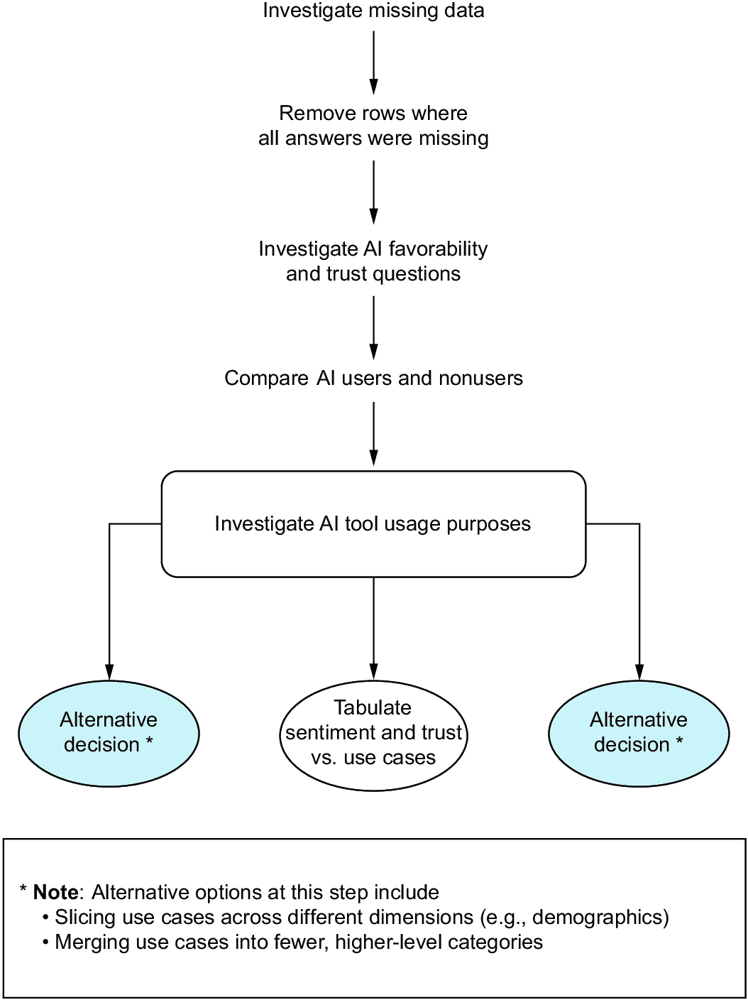

##### 图 6.40 分析过程中至调查 AI 工具使用所采取的步骤

接下来，我们对 AI 工具用户的个人资料（例如，他们有什么工作头衔）感兴趣。

#### 为了清晰起见，重新分类数据

在这些数据中，我们可以进一步探索更多的细微差别。声称使用 AI 编写代码的人可能出于非常不同的目的使用它。尽管名称如此，这份调查并不仅仅由开发者完成。还包括其他工作角色，因此值得探讨这些角色对 AI 的态度是否有所不同。首先，让我们看看使用 AI 工具的人`DevType`列中的值分布，但仅限于这些人。以下代码产生的结果如图 6.41 所示：

```py
survey_ai_users['DevType'].value_counts(dropna=False)
```


##### 图 6.41 使用 AI 工具的参与者中工作角色的分布

如我们所预期，大多数参与者是开发者，其他工作从数据角色到研究、营销，甚至管理，形成了一个长长的尾巴。为了我们的目的，我们可能可以将这些类别中的几个合并在一起，至少在第一次迭代中是这样。为了确定不同的工作角色是否以不同的方式使用 AI，我们可以一开始就将所有开发者归入一个单独的组。让我们看看哪些组可以归入我们更大的“开发者”组。以下代码的结果如图 6.42 所示：

```py
devtypes = (
    survey_ai_users
    .dropna(subset=["DevType"])
    .query("DevType.str.startswith('Developer')")
    .loc[:,"DevType"]
)

devtypes.value_counts()
```

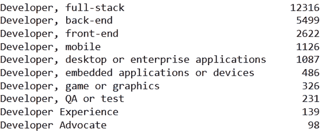

##### 图 6.42 AI 工具用户中不同开发者角色的分布

大多数这些角色可以归入一个单独的“开发者”类别，除了最后两个：“开发者经验”和“开发者倡导者”。这些是与开发者相邻的角色，更侧重于人际交往，例如创建和参与社区，而不一定需要编写大量代码。让我们将其他开发者角色归入一个单独的类别。具体来说，在 Python 中，我们可以创建一个字典，将每个角色与它们应属于的“新”类别匹配：

```py
devtype_map = {}

dev_exclusions = ["Developer Experience", "Developer Advocate"]

dev_devtypes = [col for col in devtypes.value_counts().index
↪ if col not in dev_exclusions]

for col in dev_devtypes:
    devtype_map[col] = "Developer"
```

再次查看图 6.42 中的列表，我们看到一些可以归为一组的工程角色，因此我们也这样做。以下代码产生的输出如图 6.43 所示：

```py
eng_devtypes = (
    survey_ai_users
    .dropna(subset=["DevType"])
    .query("DevType.str.contains('engineer', case=False)")
    .loc[:,"DevType"]
)

eng_devtypes.value_counts()
```

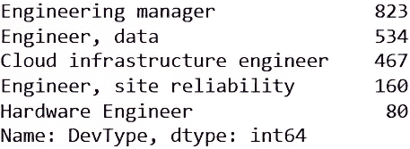

##### 图 6.43 AI 工具用户中工程角色的分布

目前，所有这些角色都可以归入一个“工程师”类别，除了管理类。让我们进行这个更改，然后查看我们新的、更紧凑的工作类别列的分布。以下代码产生的结果如图 6.44 所示：

```py
for col in ['Engineer, data', 'Cloud infrastructure engineer',
            'Engineer, site reliability', 'Hardware Engineer']:
    devtype_map[col] = "Engineer"

survey_ai_users["job_category"]
↪ = survey_ai_users["DevType"].replace(devtype_map)

survey_ai_users["job_category"].value_counts(dropna=False)
```

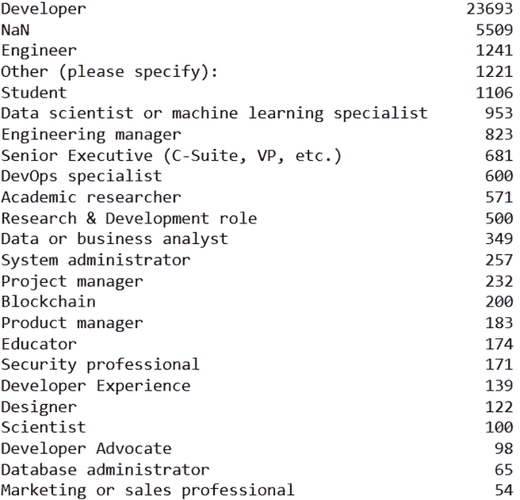

##### 图 6.44 新的`job_category`列的分布

现在，我们可以创建一个类似于我们之前创建的交叉表，这次是为了将职位角色与 AI 用例进行交叉引用。首先，我们将数据转换为长格式，然后创建我们的交叉表。最后，我们创建一个热图，以便更容易地调查结果。以下代码执行这些步骤，并在图 6.45 中生成热图：

```py
tool_job_dfs = []

for col in ai_tool_indicators.columns:      #1
    option_df = (
        survey_ai_users[survey_ai_users[col] == 1]
        .dropna(subset="job_category")
        .groupby("job_category")
        .size()
        .reset_index(name="count")
        .assign(option=col)
    )
    tool_job_dfs.append(option_df)

options_vs_jobs = pd.concat(tool_job_dfs, axis=0, ignore_index=True)
job_crosstab = (     #2
    pd.crosstab(index=options_vs_jobs["option"],
                columns=options_vs_jobs["job_category"],
                values=options_vs_jobs["count"],
                aggfunc="sum",
                normalize="columns")
    .transpose()
)

fig, axis = create_heatmap(      #3
    job_crosstab.round(2),
    square=False
)

fig.suptitle("What do different job roles use AI for?")

axis.set(xlabel=None, ylabel=None)

plt.show()
```

#1 将职位类别与 AI 用例进行交叉引用。

#2 转换为交叉表

#3 最后，绘制热图

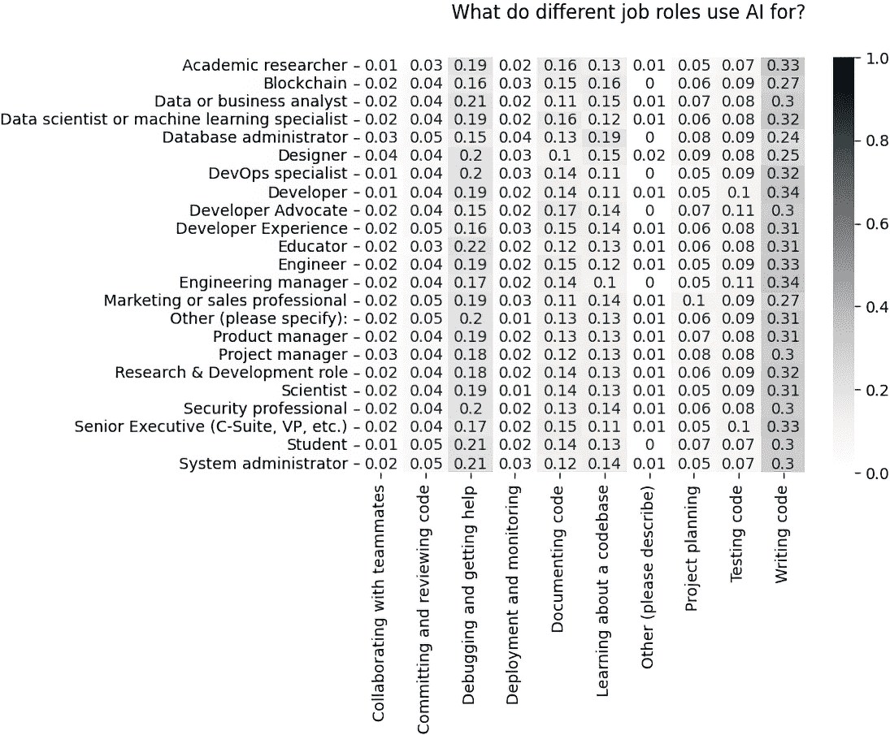

##### 图 6.45 显示不同职位角色间 AI 用例的热图

热图让我们对使用模式有一些了解：

+   大约 30%的人使用 AI 工具编写代码，数据库管理员、市场营销和销售专业人士以及设计师是例外。

+   数据库管理员比其他人更常使用 AI 来了解代码库。除了他们之外，其他最常使用 AI 的职位通常是编写代码较少的，如市场营销或产品职能。

+   虽然开发者倡导者也使用 AI 来编写代码，但他们也在使用 AI 进行文档方面得分最高，这可能是角色的重要方面。

除了这些观察结果之外，参与者似乎在使用 AI 工具的方式上或多或少是相同的。让我们再次回顾我们的步骤，包括这个最新的调查职位角色的步骤。图 6.46 显示了最新的步骤图。

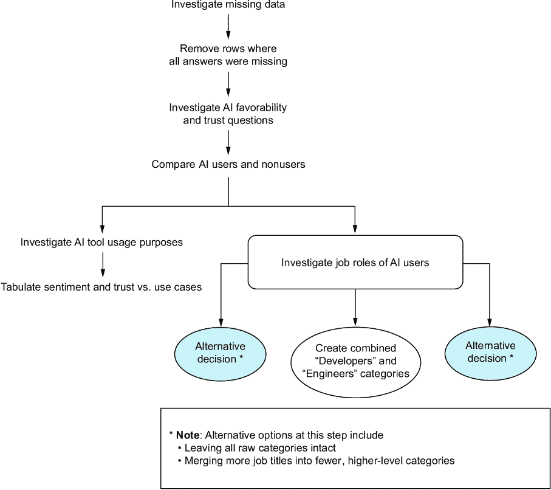

##### 图 6.46 显示我们分析中采取的最新步骤图

注意，一旦我们清理了 AI 情感和信任相关的列，我们的分析可以并行进行。图 6.46 说明了这一点，因为在调查 AI 用户的职位角色之前，没有必要比较 AI 工具的使用和信任以及好感度。这突出了分析有时不是完全线性的事实。

让我们导出我们将在下一章进一步探索问题的数据：

```py
survey.to_parquet("../chapter-7/data/survey.parquet.gz",
↪compression="gzip", index=False)
survey_ai_users.to_parquet("../chapter-7/data/survey_ai_users.parquet.gz",
↪compression="gzip", index=False)
```

现在，让我们回顾到目前为止我们所完成的一切，并确定在下一章中为了达到最小可行答案我们还需要做什么。

### 6.4.3 到目前为止的项目进度

到目前为止，我们已经回答了两个主要利益相关者问题中的一个，即开发者的意见是否取决于他们的经验、职位角色以及他们具体使用工具的目的。我们分析了调查结果，得出结论：

+   AI 工具的用户通常比非用户对其评价更高。

+   AI 工具的用户也比非用户表示的更信任工具的输出。

+   帮助编写和调试代码是 AI 工具最受欢迎的用例。

+   不同职位的人报告说他们使用 AI 工具的目的不同。

在下一章中，我们将通过解决第二个利益相关者假设来继续项目，该假设是新旧程序员使用这些工具的方式不同。为此，我们需要结合连续数据和分类数据的方法，并执行适当的统计测试。

## 摘要

+   分类数据在现实世界中很普遍。

+   连续数据的方法通常不适用于分类数据；因此，了解处理分类数据的方法对于分析师来说很重要。

+   像单热编码这样的方法将分类数据转换成更适合分析的形式。
