# 第七章：7 分类数据：高级方法

### 本章涵盖

+   在分析中结合连续数据和分类数据

+   在适当的情况下将连续数据转换为分类数据

+   使用高级方法（如统计测试）分析分类数据

在本章中，我们将继续探索分类数据的价值。在第六章中，我们探索了主要是分类数据的调查数据，并使用适合分类数据的方法回答了一些利益相关者的问题。提醒一下，该项目的数据和示例解决方案文件可在[`davidasboth.com/book-code`](https://davidasboth.com/book-code)找到。

本章深入探讨了更高级的方法：对分类数据进行统计测试以及结合连续数据和分类数据。我们首先回顾上一章的项目概述，然后总结到目前为止的工作，再继续分析。

## 7.1 项目 5 回顾：分析调查数据以确定开发者对 AI 工具的态度

回顾一下，我们正在分析 Stack Overflow 开发者调查，以确定编码者如何使用人工智能工具。我们的利益相关者对测试他们的两个假设感兴趣：

+   新手和经验丰富的编码者使用这些工具的方式不同。

+   人们对于当前人工智能工具的有用性和可信度的看法取决于他们的经验、工作角色以及他们具体使用这些工具的目的。

我们通过探索、重塑和总结调查数据中的分类列来回答了第二部分。下一节将描述可用的数据。

### 7.1.1 数据字典

该数据字典分为两部分，均包含在补充材料中：

+   有一个按问题分解的列表，`survey_results_schema.csv`，记录了哪个列包含答案。一些问题的答案分布在多个列中。

+   此外，还有调查本身的 PDF 副本。通过这个副本，你可以直接观察数据生成过程，这是很少见的。

让我们回顾一下我们的预期结果，以便我们知道要朝着什么结果努力。

### 7.1.2 预期结果

我们的利益相关者有特定的假设，我们的分析应该集中在它们上。我们已经对数据进行了一些一般性的探索，以识别如缺失值等元素。我们最小可行答案应该是支持或反驳主要假设的证据。因此，

+   我们的结论应该包括不同经验水平之间在人工智能工具使用上是否存在差异。

+   我们应该传达影响人们对于人工智能工具看法和信任度的因素，这些因素得到了调查数据的支持。

在继续我们的分析之前，让我们回顾一下上一章我们所做的工作。

### 7.1.3 到目前为止的项目总结

在第六章中，我们

+   探索了调查问题，以找到与我们的分析相关的那些问题

+   调查了缺失数据

+   分析了 AI 用户和非用户对 AI 工具友好度的信任和观点

+   探讨了 AI 用户使用这些工具的不同目的以及不同的使用目的如何影响用户的信任度

+   调查了受访者的不同工作角色以及信任度和好感度在这些角色中的变化

图 7.1 展示了到目前为止的工作。

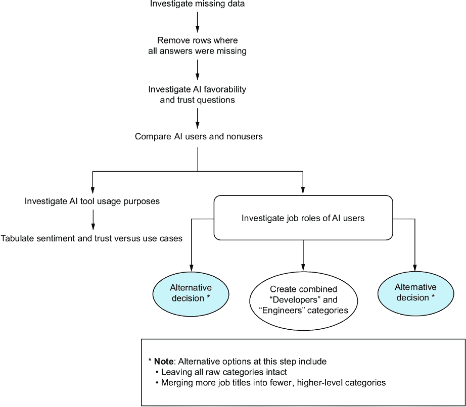

##### 图 7.1 上一章中我们的分析步骤

在本章中，我们将回答关于受访者经验水平的问题。我们感兴趣的是，更多的编码经验是否会改变对 AI 工具的看法，以及经验用户是否有与新手程序员不同的使用案例。

## 7.2 使用高级方法回答关于分类数据的进一步问题

有理由相信，经验更丰富的程序员比初级开发者需要从 AI 工具中获得不同类型的帮助。让我们看看 `YearsCodePro` 列中的值，该列询问受访者编程了多少年。以下代码的输出，该代码从上一章末尾导入了数据，如图 7.2 所示：

```py
import pandas as pd
import matplotlib.pyplot as plt
import seaborn as sns
survey = pd.read_parquet("./data/survey.parquet.gz")
survey_ai_users = pd.read_parquet("./data/survey_ai_users.parquet.gz")

survey_ai_users["YearsCodePro"].unique()
```

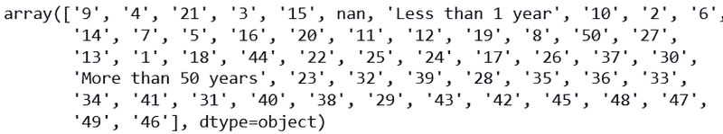

##### 图 7.2 `YearsCodePro` 的不同值

这列应该是数值类型，但由于“不到 1 年”和“超过 50 年”这两个值，实际上是以文本形式存储的。由于其余的值没有分箱，我们应该将这个列转换为数值类型。我们可以将这两个文本值分别替换为 0 和 50，而不会对数据造成太大影响：

```py
survey_ai_users["YearsCodePro"] = (
    survey_ai_users["YearsCodePro"]
    .replace({
        'Less than 1 year': 0,
        'More than 50 years': 50
    })
    .astype(float)
)
```

注意：在 `pandas` 的后续版本中，2.0 及以上版本实际上存在可空整数字段——即代表整数的数字，但也可以是缺失值。对于示例解决方案，出于兼容性原因，我使用的是 2.0 之前的版本，该版本只允许 `float` 类型，即小数，包含缺失值。

现在我们有一个名为 `YearsCodePro` 的数值列，让我们观察它的分布。结果直方图如图 7.3 所示：

```py
survey_ai_users["YearsCodePro"].hist(bins=20)
```

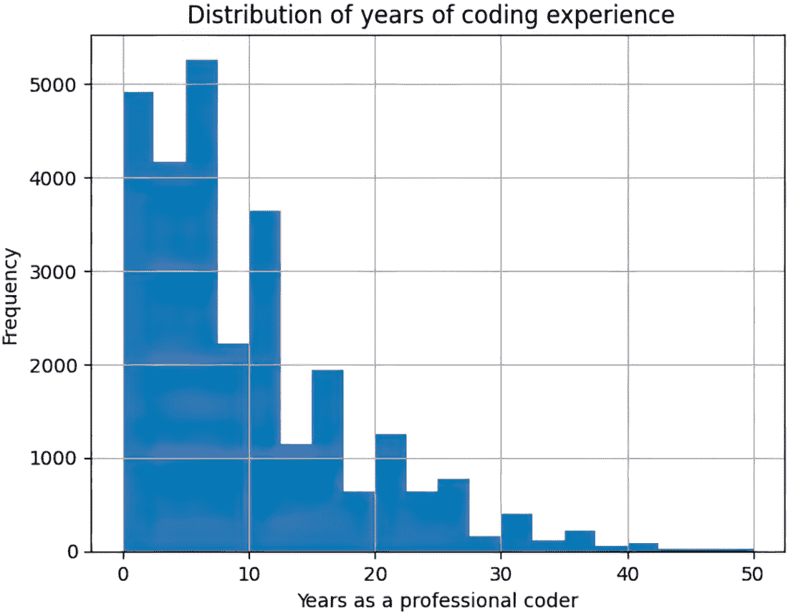

##### 图 7.3 AI 用户编程经验的分布

大多数参与者的经验不到 10 年，尾部延伸到 50 年。现在，如果我们想测试这个连续值与另一个值之间的关系，我们可以简单地计算相关系数。然而，我们正在尝试将其与分类数据（例如，某人如何看待 AI 的好感度）进行比较，因此传统的相关系数不适用。一个想法是将经验直方图或类似分布的可视化（如箱线图）根据对好感度问题的不同回答进行分离。让我们看看使用 Python 库 `seaborn` 中的“boxenplots”的一个例子，这些类似于箱线图，但包含更多信息。以下代码生成了图 7.4 中的图表：

```py
fig, axis = plt.subplots()

sns.boxenplot(
    data=survey_ai_users,
    x="YearsCodePro", y="AISent",
    color="gray",
    ax=axis
)

axis.set(
    title="Distribution of years of experience across
↪ answers to the favorability question",
    xlabel="Years of coding experience",
    ylabel="How favorably do you view AI tools?"
)

plt.show()
```

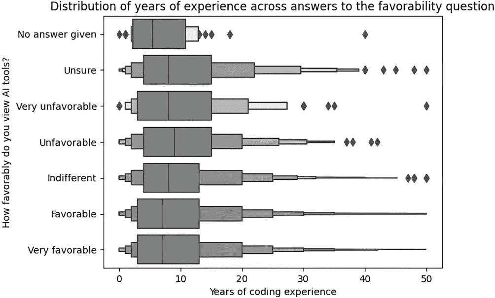

##### 图 7.4 根据对 AI 好感度问题的不同回答，经验分布情况

这个图表告诉我们，最高中位数的经验年份在不受欢迎的群体中。也就是说，那些对 AI 工具持负面看法的人平均来说是经验更丰富的程序员。然而，这个中位数并不比其他群体高很多，每个群体都有很大的变异性。现在让我们看看不同经验水平对 AI 工具输出的信任程度。以下代码生成了图 7.5 所示的箱线图：

```py
fig, axis = plt.subplots()

sns.boxenplot(
    data=survey_ai_users,
    x="YearsCodePro", y="AIBen",
    color="gray",
    ax=axis
)

axis.set(
    title="Distribution of years of experience across
↪ answers to the trust question",
    xlabel="Years of coding experience",
    ylabel="How much do you trust the output of AI tools?"
)

plt.show()
```

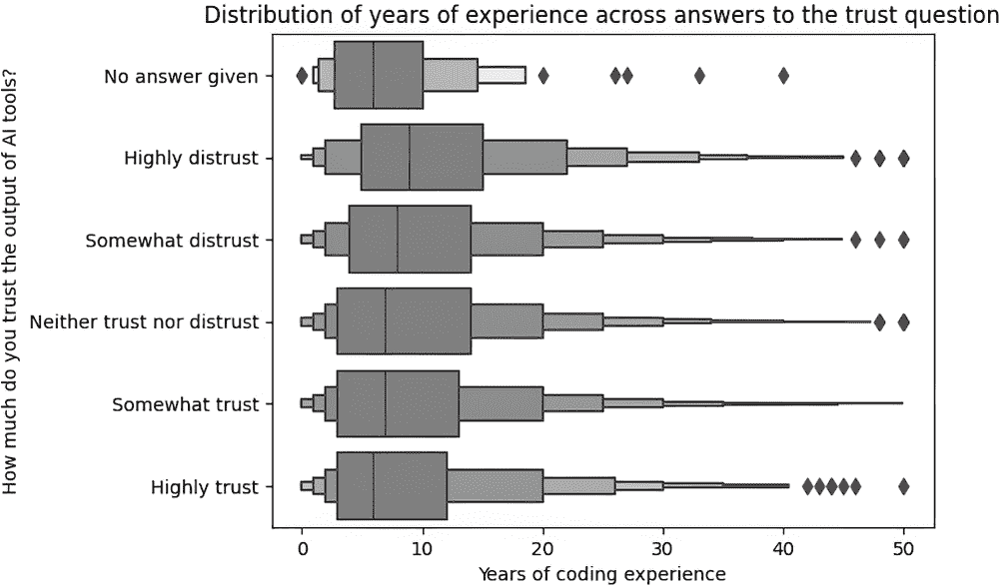

##### 图 7.5 经验年份在信任问题回答中的分布

再次，那些给出更负面回答的人平均来说经验更丰富。这种差异可能比喜好和信任更大，也表明经验更丰富的程序员不太可能信任此类工具的输出。我们真正想了解的是相反的问题：而不是不同答案中经验的分布，我们想知道，不同经验水平中不同答案的分布？

为了做到这一点，我们需要另一个交叉表到热图的转换过程，这次是比较经验年份和对于喜好和信任问题的回答。然而，我们只能这样做，如果“经验年份”被表示为分类值。

### 7.2.1 将连续值分箱到离散类别

我们首先将连续度量放入分类箱中。让我们总共创建六个逻辑箱，但请记住，你的箱选择将影响结果。箱可以手动创建，如下面的例子所示，也可以基于数据。一种方法可能是使用分位数，这可以确保每个箱有相同数量的数据。以下代码对数据进行分箱，并使用图 7.6 所示的输出验证每个箱内的最小和最大经验年份：

```py
exp_bins = pd.cut(survey_ai_users["YearsCodePro"],
                  bins=[-1, 0, 2, 5, 10, 20, 50],
                  labels=["0", "1-2 years", "3-5 years",
                          "6-10 years", "11-20 years",
                          "over 20 years"]
                 )

survey_ai_users.groupby(exp_bins)["YearsCodePro"].agg(["min", "max"])
```

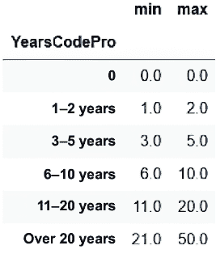

##### 图 7.6 我们的`YearsCodePro`分组，每个组内的最小和最大经验值也显示

现在我们经验列是分类的，我们可以查看其分布。这通过以下代码实现，输出显示在图 7.7 中：

```py
fig, axis = plt.subplots()

(
    exp_bins
    .value_counts()
    .sort_index()
    .plot
    .bar(ax=axis)
)

axis.set(
    title="Distribution of years of experience (binned)",
    xlabel="Years of experience",
    ylabel="Frequency"
)

plt.show()
```

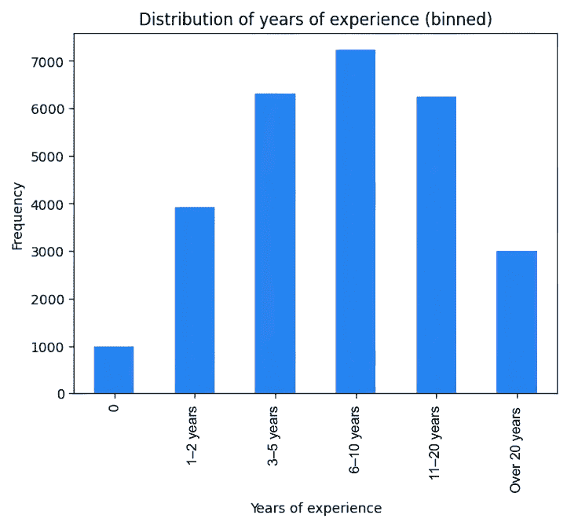

##### 图 7.7 新分箱的经验年份数据的分布

如图 7.7 所示，大多数参与者有不到 10 年的编码经验，其中 6-10 年是最常见的。与不同的 AI 工具用例不同，这个经验值在一个单独的列中，并没有分散在多个指标中。这使得我们的交叉表创建变得非常简单，因为我们只是交叉两个分类列。以下代码实现了这一点，并在图 7.8 中产生了输出：

```py
exp_vs_sent = pd.crosstab(
    index=exp_bins,
    columns=survey_ai_users["AISent"],
    normalize="index"
)

exp_vs_sent
```

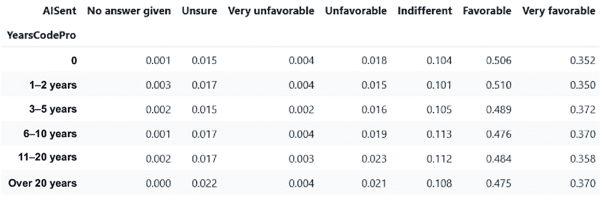

##### 图 7.8 经验与对喜好问题的回答的交叉表

与前面的例子一样，这最好通过热图来探索，以下代码生成了图 7.9 所示的热图：

```py
fig, axis = create_heatmap(   #1
    exp_vs_sent.round(2)
)

fig.suptitle("How favorably do people with different
↪ amounts of coding experience view AI?")

axis.set(
    xlabel=None,
    ylabel="Coding experience"
)

plt.show()
```

#1 此函数在第六章中定义。

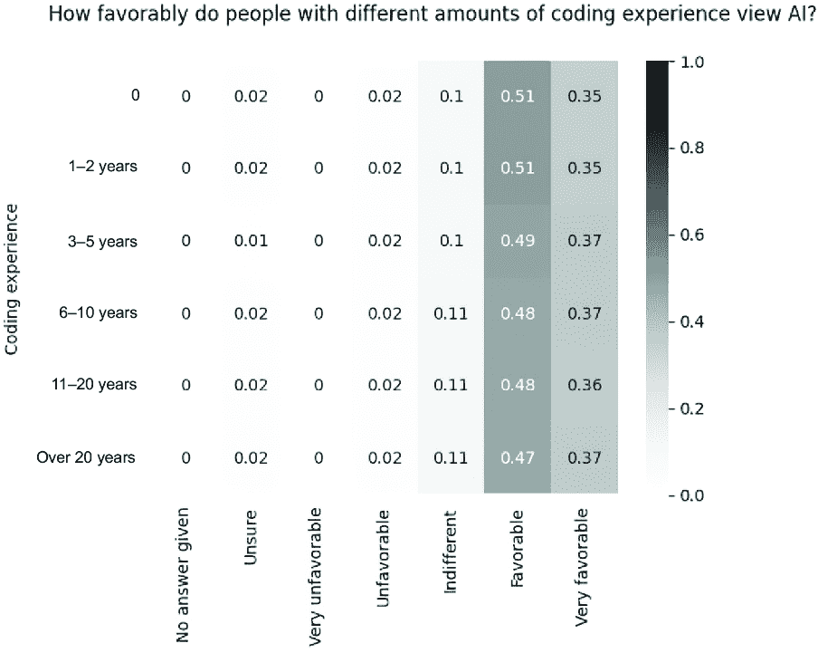

##### 图 7.9 喜好与经验的热图

虽然 7.4 图显示那些对 AI 工具评价不佳的人平均经验更丰富，但当问题反过来时，大多数群体的答案分布似乎相当均匀。那么，对 AI 工具的信任度如何呢？以下代码创建了交叉表和散点图，后者如图 7.10 所示：

```py
exp_vs_trust = pd.crosstab(
    index=exp_bins,
    columns=survey_ai_users["AIBen"],
    normalize="index"
)
fig, axis = create_heatmap(
    exp_vs_trust.round(2)
)

fig.suptitle("How much do people with different
↪ amounts of coding experience trust the output of an AI?")

axis.set(
    xlabel=None,
    ylabel="Coding experience"
)

plt.show()
```

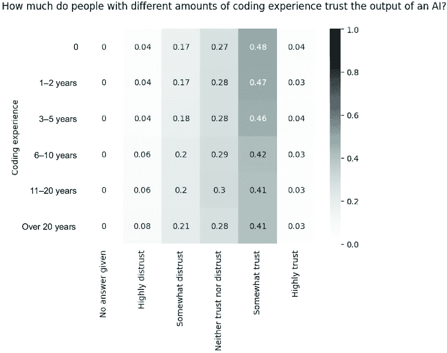

##### 图 7.10 编码经验与信任度对比的散点图

这个散点图描绘了一幅与图 7.5 类似的画面。似乎一个人的经验越丰富，平均来说，他们对 AI 工具输出的信任度就越低。这是一个考虑使用统计测试的好地方。我们想知道这个发现是否具有统计学意义。具体来说，我们的假设是“经验年数”的连续度量会影响一个人对 AI 工具输出信任度问题的回答。

### 7.2.2 使用统计测试处理分类数据

数据教育中涵盖的大多数统计测试都是为连续度量设计的。然而，有一些统计测试是专门针对分类数据或数据类型混合的。这是一个你可能知道但直到需要为项目使用时才具备所需特定知识的例子。因此，这是一个你可以求助于 AI 工具的问题。让我们看看当被问及“我可以使用什么方法来测量连续变量和有序变量之间的关联？”时，ChatGPT 会说什么。

它提供了多种方法，包括我们已执行的可视化。它用“如果你对关系的整体强度和方向感兴趣，斯皮尔曼秩相关或肯德尔 tau 系数可能很有用”来总结其建议。这些听起来像是开始的好地方。

这两种方法都是基于秩的，这意味着它们不直接使用序数值，而是使用它们在所有答案中的排名。这可能是你以前没有用你的特定工具做过的事情，AI 工具可以给你一个相关的代码片段。图 7.11 展示了当被提示提供计算 Python 中斯皮尔曼秩相关性的示例代码时，ChatGPT 的回答。

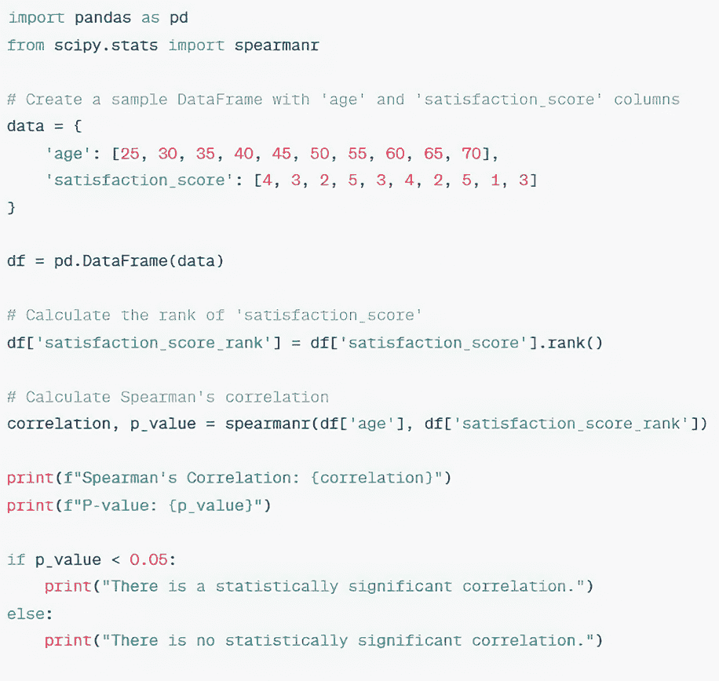

##### 图 7.11 ChatGPT 计算斯皮尔曼秩相关性的代码片段

显然，这个代码片段不能直接使用，但只需稍作修改。让我们将 ChatGPT 的代码应用到我们自己的数据上，并计算斯皮尔曼秩相关性，以及肯德尔 tau 值，这可以通过类似的方式进行。这里有两个小点需要注意：我们必须丢弃任何缺失数据进行分析，并忽略那些对信任问题没有给出答案的情况，因为那个值不适合答案的序数性质。首先，我们将创建排名，然后计算两个统计指标。输出，最终的打印结果，如图 7.12 所示：

```py
trust_exp_data = (
    survey_ai_users
    .dropna(subset=["YearsCodePro", "AIBen"], how="any")
    .loc[survey_ai_users["AIBen"] != "No answer given", :]
)

trust_rank = (
    pd.Series(
        trust_exp_data["AIBen"]
        .factorize(sort=True)[0]
    )
    .rank()
)

from scipy.stats import spearmanr, kendalltau

correlation, p_value = spearmanr(
    trust_exp_data["YearsCodePro"],
    trust_rank
)

print("Spearman's\n", correlation, p_value)

correlation, p_value = kendalltau(
    trust_exp_data["YearsCodePro"],
    trust_rank
)

print("Kendall's tau\n", correlation, p_value)
```

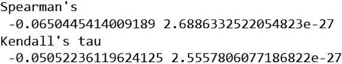

##### 图 7.12 统计测试输出

在两次测试中，接近零的相关值意味着变量之间的关联较弱。两次打印输出中的第二个值是 p 值，它是结果显著性的代理。接近零的值意味着在基础假设，或“零假设”为真的世界中，我们极不可能看到这些结果。也就是说，在一个我们假设经验与信任分数之间没有关联的世界中，我们计算出关联值的可能性有多大？这个可能性越低，我们越有信心我们的相关值是稳健的。低 p 值意味着我们倾向于拒绝零假设，这意味着我们接受我们发现的关联，或缺乏关联，在统计上是显著的。

在这种情况下，统计测试告诉我们有显著证据表明经验与信任分数之间没有联系。相关值是负的，这会暗示经验用户对 AI 的信任度更低，但值接近零，意味着关联较弱。我们仍然可以进一步探索这个关联，但如果利益相关者坚持要求了解统计显著性，我们已经有了一个答案。

让我们回顾到目前为止的过程，包括构成我们分析并行分支，如图 7.13 所示。

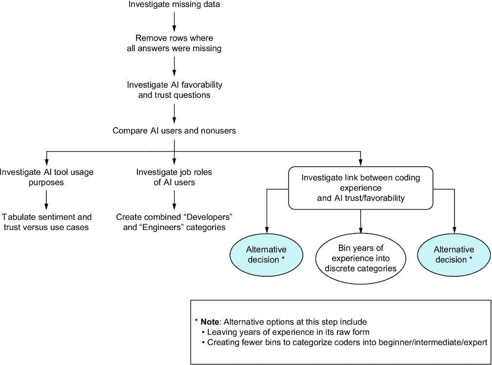

##### 图 7.13 到目前为止的分析，包括多个并行分支

在总结我们的结果之前，最后一个要探究的问题是查看开发者不感兴趣使用 AI 工具做什么。

### 7.2.3 从头到尾回答新问题

看看开发者不感兴趣的是什么，需要我们在这个项目中迄今为止所获得的所有技能。调查特别允许参与者为每个用例是否是他们不感兴趣的事项勾选一个复选框，这样我们就可以直接查看这些数据。这将有助于确定是否存在实际的市场机会。由于对这个问题的答案的记录方式与参与者目前使用 AI 工具的答案记录方式相同，我们可以按照第六章中所示的过程进行：

1.  为每个 AI 用例创建指标变量（这次来自`AIToolNot interested in Using`列）。

1.  仅将指标添加到 AI 用户的调查数据中。

1.  创建一个长格式数据集，将工作角色与人们对不感兴趣的用例进行交叉引用。

1.  使用这个长格式数据集创建一个交叉表。

1.  将这个交叉表可视化为一个热图。

让我们从指标变量开始，之后我们可以查看人们对哪些用例最不感兴趣，如图 7.14 中的条形图所示：

```py
ai_not_interested_indicators = (
  survey.loc[survey["AISelect"] == "Yes", "AIToolNot interested in Using"]
  .str.get_dummies(sep=";")
)

fig, axis = plt.subplots()

(
    ai_not_interested_indicators
    .mean()
    .sort_values()
    .plot
    .barh(ax=axis)
)

axis.set(
    title="What do AI users NOT want to use AI for?",
    xlabel="% of participants who ticked that option"
)

plt.show()
```

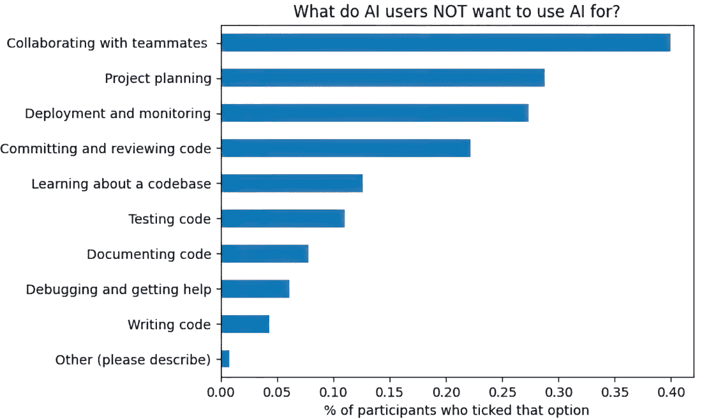

##### 图 7.14 人们最不感兴趣使用 AI 的用例

前面的发现，例如前一章图 6.45 中的热力图，显示很少有人使用 AI 进行协作，图 7.14 也加强了这一点。参与者明确表示他们不打算使用 AI 工具与人类进行协作，大约四分之一的人也对使用它们进行项目规划或部署和监控不感兴趣。似乎有一些特定的任务，人们不愿意委托给 AI 工具。最后，让我们进行我们的长格式数据转换，得到一个热力图，按职位角色分解这一最后分析。这个最终热力图如图 7.15 所示：

```py
ai_users_not_int = (
    pd.concat([survey, ai_not_interested_indicators], axis=1)
    .dropna(subset=ai_not_interested_indicators.columns, how="any")
)

ai_users_not_int["job_category"]
↪ = ai_users_not_int["DevType"].replace(devtype_map) #1

not_interested_job_dfs = []

for col in ai_not_interested_indicators.columns:      #2
    option_df = (
        ai_users_not_int[ai_users_not_int[col] == 1]
        .dropna(subset="job_category")
        .groupby("job_category")
        .size()
        .reset_index(name="count")
        .assign(option=col)
    )
    not_interested_job_dfs.append(option_df)

not_interested_options_vs_jobs = pd.concat(not_interested_job_dfs, 
↪axis=0, ignore_index=True)

job_not_int_crosstab = (      #3
    pd.crosstab(index=not_interested_options_vs_jobs["option"],
                columns=not_interested_options_vs_jobs["job_category"],
                values=not_interested_options_vs_jobs["count"],
                aggfunc="sum",
                normalize="columns")
    .transpose()
)

fig, axis = create_heatmap(      #4
    job_not_int_crosstab.round(2),
    square=False
)

fig.suptitle("What do different job roles NOT want to use AI for?")

axis.set(xlabel=None, ylabel=None)

plt.show()
```

#1 这个职位角色的映射是在第六章中定义的。

#2 将 AI“反”用例与职位类别交叉引用

#3 转换为交叉表

#4 最后，以热力图的形式可视化

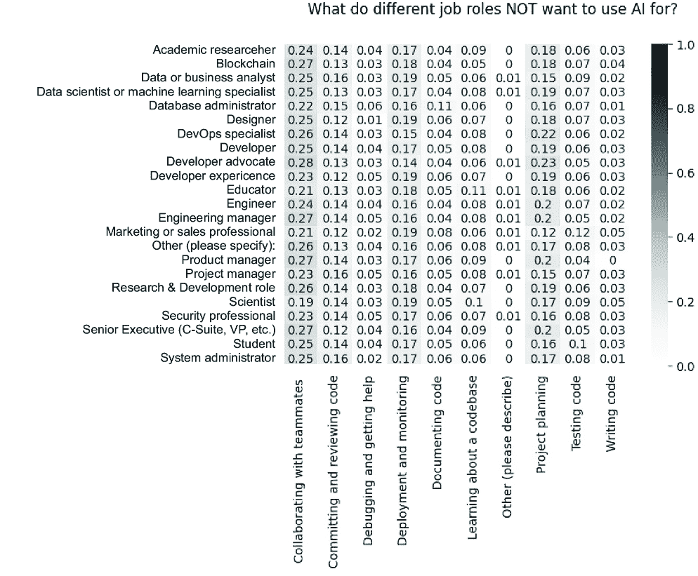

##### 图 7.15 比较不同职位角色不感兴趣的 AI 用例的热力图

这个最终热力图揭示了对 AI 用于人类协作、项目规划和部署以及监控的抵触情绪在各个职位角色中是恒定的。有一些差异，例如，营销专业人士将测试代码评为所有职位角色中最不愿意使用 AI 的。

在总结我们的结果之前，让我们总结我们的分析过程，可视化我们追求的四个并行线索，以得到对我们所有利益相关者问题的最小可行答案。图 7.16 显示了此图。

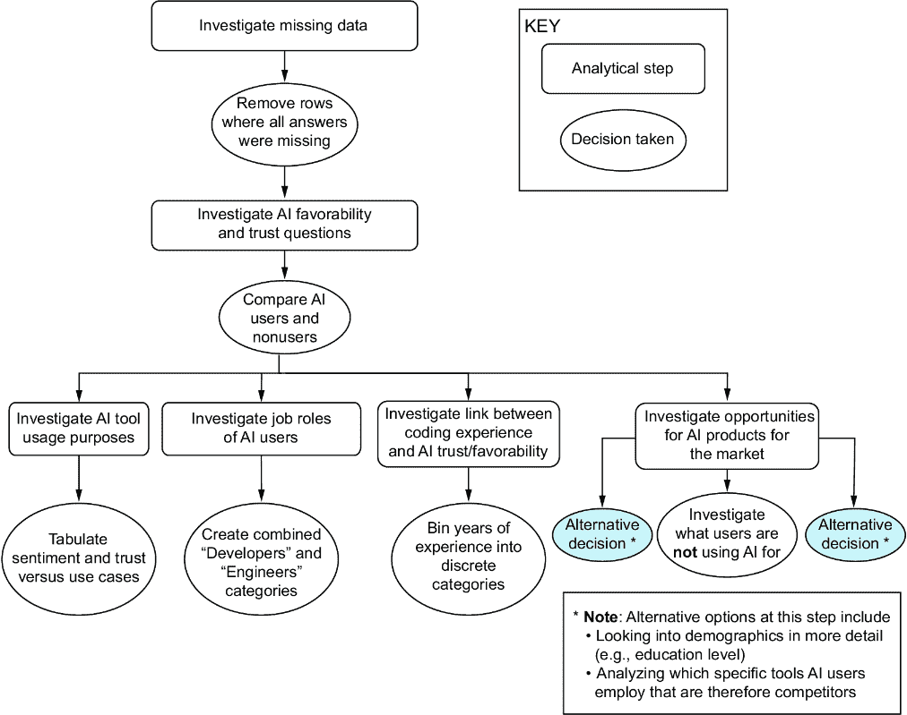

##### 图 7.16 整个分析过程的总结

现在，是时候总结我们发现了什么，并决定向我们的利益相关者传达什么信息。

### 7.2.4 项目结果

我们不如专注于与我们最初问题直接相关的研究发现。我们的利益相关者的初步假设是

+   新手和经验丰富的程序员使用这些工具的方式不同。

+   人们对于当前 AI 工具的有用性和可信度的看法取决于他们的经验、职位角色以及他们具体使用工具的方式。

为了回答这些观点，在我们的分析中，我们发现

+   编写和调试代码是最受欢迎的 AI 用例，但不同职位角色目前使用 AI 工具的方式存在不可否认的差异。

+   很明显，人们对 AI 的一些用例不太感兴趣。

+   现有的 AI 工具用户似乎比有志于使用这些工具的用户更倾向于信任这些工具。

+   几乎没有证据表明开发者的经验年数会影响对 AI 工具的信任。

在市场缺口方面，我们能推荐哪些可以利用的建议？我们看到，积极使用 AI 工具的人比潜在用户更有可能对他们持积极看法，因此营销这些工具的好处至关重要。市场已经饱和了 AI 驱动的编码工具，因此我们应该专注于那些流行但服务不足的用例。这包括了解代码库、记录现有代码和测试。我们也看到了哪些缺口不存在；似乎没有必要追求 AI 驱动的协作或项目管理工具。

这些发现对于初步的利益相关者审查已经足够，但在数据中还有许多途径可以进一步探索 AI 驱动的发现/文档工具的可行性，例如

+   有一个问题，那就是人们在他们的业务中多久能找到信息。我们可以将回答“经常”的人与当前和未来的用例进行交叉参考，以衡量对这种工具的兴趣。

+   人们花费多长时间搜索信息也是一个问题。同样，这可以与关于 AI 工具和用例的答案进行交叉参考。

+   最后，还有一个问题，那就是人们多久需要从他们的团队获得帮助，这同样可以作为一个探索人们如何对 AI 辅助产生兴趣的方法。

在我们的分析过程中，我们也遇到了一些值得与我们的利益相关者沟通的数据局限性。数据严重偏向于开发者，特别是那些活跃在 Stack Overflow 上的开发者。甚至数据集的 README 文件也指出，“Stack Overflow 上高度活跃的用户更有可能注意到调查的链接并点击开始。”这并不一定是一个坏的选择偏差案例，因为我们的初创公司的目标受众与 Stack Overflow 上的活跃用户重叠。我们缺少那些不活跃在线的开发者的存在，量化这个群体并调查其他捕捉他们的痛点和方法是值得的。

我们也没有访问到一些自由文本的回答，这些回答本可以让我们更深入地了解人们如何使用 AI 工具以及他们希望如何使用 AI 工具。创建我们自己的定性调查或访谈可以帮助我们更好地了解我们的目标市场，但与使用现有的调查相比，这将产生显著的成本。

##### 活动：使用这些数据进一步的项目想法

本章中使用的调查数据有更多维度可以探索。与所有项目一样，我建议花时间考虑可以回答的不同研究问题。以下是一些开始的想法：

+   开发者使用的工具和他们对 AI 的看法及使用之间是否存在关联？在项目中我们没有明确探讨的编程语言和其他相关工具的调查问题。

+   关于开发者目前所在行业的提问，这为跨行业比较结果提供了机会。是否有些行业在人工智能方面比其他行业更具前瞻性？

+   在调查开始时，有关于开发者如何喜欢学习的问题。这些问题的答案是否与对人工智能的不同立场相关？

值得强调的是，我们只是触及了调查数据中可用的信息的表面，但我们的以结果为导向的方法意味着我们只探索了与当前问题直接相关的途径。这就是从最终结果出发并有一个具体目标去努力的价值。

## 7.3 关于分类数据的总结性思考

在实际业务场景中，分类数据的普遍性不应被低估。任何数据录入由多选选项或下拉菜单组成、客户调查具有离散选项或包含国家、地区或部门等层次结构的数据都将生成分类数据。了解如何正确处理这些数据的相关选项至关重要，尤其是在基础培训中，通常很少有时间投入到这个主题上。在尝试弥合培训与现实世界之间的差距时，了解如何具体处理分类数据，例如了解一热编码等方法，将大有裨益。

最后，让我们看看本章涵盖的、对于处理分类数据所必需的技能。

### 7.3.1 适用于任何项目的处理分类数据的技能

在本章中，我们必须改变我们的方法，因为我们处理的是包含许多分类变量的调查数据。处理分类数据所需的具体技能，这些技能可用于任何涉及调查数据和分类值的问题，包括

+   理解在调查背景下数据缺失的原因（例如，人们决定省略某些答案）

+   确定顺序变量的自然顺序，例如李克特量表上的调查答案

+   使用交叉表来交叉引用两个分类变量，并可选地使用热图进行可视化

+   将多个答案拆分到单独的列中（例如，对于允许多选的多个选择题）

+   通过一热编码将分类数据转换为二元指示变量，以便在分析中使用

+   将数据从宽格式转换为长格式，以便更容易进行交叉制表

+   使用 AI 工具，如 ChatGPT，来持续改进我们的工作方式

+   通过合并相似类别等操作来调整现有类别，以使我们的分析更加清晰

+   选择何时优先考虑分类数据而非连续数据，例如将连续的“年龄”列划分成更少、更宽泛的类别

+   根据我们的数据类型选择合适的统计检验方法

## 摘要

+   如适当的统计测试等高级方法可以帮助我们回答有关分类数据的更详细的问题。

+   将连续数据分箱为分类数据可以增强我们的分析。

+   选择合适的可视化方式来展示分类数据对于调查我们的数据和传达我们的发现至关重要。

+   当处理调查数据时，了解调查问题如何映射到我们的数据集的列中是很重要的。
