# 8 时间序列数据：数据准备

### 本章涵盖

+   准备时间序列数据进行分析

+   确定使用哪些时间序列数据子集

+   通过处理缺失值和间隙来清理时间序列数据

+   分析时间序列数据中的模式

你会遇到的大多数数据集都有一个时间组件。如果生成数据的过程涉及到在重复的时间间隔内进行相同的测量，那么这些数据被称为*时间序列数据*。例如，测量一个国家的年度 GDP 或生产线上的机器输出。然而，即使是看似静态的东西，如客户数据库，如果我们查看客户记录创建的日期，它也有一个时间组件。我们可能不会明确地将数据视为时间序列，但使用这个时间组件可以让我们在数据中获得额外的洞察。例如，你可以分析新客户记录创建的速度或你的运营团队在一天中的哪些时间将数据输入到数据库中。

##### 真实业务案例：预测

第八章和第九章涵盖的项目灵感来源于我参与过的多个预测项目，以及大多数数据分析课程在处理时间数据主题上投入的时间相对较少的事实。

在 2020 年底，我不得不在最初的 COVID 封锁限制在英国解除后，提供对二手车市场走向的预测。准确预测整个市场已经足够困难，但封锁期间数据不完整以及必须预测一个没有人遇到过的情况，使得这个项目尤其困难。

最后，我们通过结合基本预测原则、对大流行的具体假设以及专家的领域知识，得出了预测。这是一个技术技能不足以解决业务问题的项目的良好例子。

与时间序列数据工作不仅仅是知道如何处理日期格式。它涉及到从数据中提取时间相关的组件，处理不同分辨率的时间数据，处理数据缺失，预测未来，以及确定数据是否可以进行预测。

在现实世界中，知道如何从你的数据中提取时间模式是一项至关重要的技能，我们将在本章的项目中通过实践来掌握这项技能。

## 8.1 与时间序列数据工作

时间序列是在不同、理想情况下均匀的时间间隔内进行的重复测量。典型的表格数据集，如客户数据集，将包含每名客户一行，每列将代表客户的不同属性，例如年龄、就业状态、地址等。然而，时间序列通常包含较少的列：一列代表测量的日期，一列或多列代表该时间点的单个测量值。因此，每一行代表相同的测量，而测量时间是使每一行独特的原因。

### 8.1.1 时间序列数据的潜在深度

让我们以一个简单的例子来解释——随时间推移的客户满意度。想象一下在机场、超市结账处或其他公共场所可以找到的那种基于笑脸的调查。当客户经过时，他们可以按下一个笑脸来表示他们的满意度水平。他们看到笑脸，数据库记录了一个从 1 到 5 的 Likert 量表上的简单值，以衡量从最不满意到最满意的值。表 8.1 显示了此数据集可能的样子。

##### 表 8.1 时间序列数据集的一个示例

| 日期 | 满意度得分 |
| --- | --- |
| 2023-11-01 11:03:55  | 4  |
| 2023-11-01 11:17:02  | 5  |
| 2023-11-01 13:41:11  | 3  |
| 2023-11-01 14:06:43  | 4  |

要捕捉随时间推移的满意度，你只需要一个时间戳和满意度值。如果你在多个地点设置了这样的系统，你也可能找到一个位置 ID 列，但数据不会比这更复杂。

对于乍一看非常简单的数据集，我们可以进行什么样的分析？我们可以

+   使用行簇作为代理来识别繁忙时期

+   计算不同粒度（每日、每周、每月等）上的平均满意度

+   调查数据中的趋势和季节性模式（如果客户在不同时间点或不同星期的不同日子满意度更高）

+   找出满意度意外上升或下降的异常值

+   将此与其他数据交叉引用以确定满意度与外部因素（如特殊事件）的关系

+   比较不同地点的满意度得分

事实上，大多数这些问题只需要两到三列数据就可以回答，这显示了时间序列数据所具有的潜在深度。

### 8.1.2 如何处理时间序列数据

与时间序列一起工作意味着什么？在探索时间数据时，我们关心的事情与探索表格数据时关心的事情有很多相同之处。我们想要理解每一列，确保数据类型一致，并检查缺失值。然而，对于时间数据也有一些特定的考虑：

+   时间序列的粒度是多少？它是一致的吗？

+   时间序列中是否存在任何间隔？这些间隔是故意设置的吗？

+   数据中是否存在趋势？

+   存在季节性模式吗？

+   是否有任何值得调查的异常值？

一旦您已经探索了您的时间序列数据集并想要进行预测，还有其他一些考虑因素：

+   预测的正确粒度是什么？这将在一定程度上取决于数据中的噪声程度。小时数据可能太嘈杂，尽管日平均数据可能更平滑且更容易预测，但在日级别可能没有足够的数据。

+   时间序列是否包含自相关：过去的值是否影响未来的值？对此有统计测试，时间序列模型将利用这一特性。

+   时间序列是否平稳？一些时间序列模型要求数据平稳，这意味着在时间上大致保持恒定的均值和方差。在现实中，许多时间序列都有一些趋势和季节性，因此我们可能需要直接处理这些数据，或者使用为我们处理这些数据的预测模型。

+   是否有任何异常值可以由外部因素解释？例如，您的销售数据中的某些峰值是否是由于一次性特别促销日，如黑色星期五？这些外部因素，技术上称为“外生变量”，可以用于许多预测模型以改善预测。

关于预测的最后一句话：你应该问的最重要的问题是，“预测将如何被使用？”这需要回答这些问题：

+   预测需要多频繁？

+   预测所需的粒度是多少？

+   预测应该延伸多远？

+   一个可接受的准确度水平看起来是什么样子？

+   准确预测在商业意义上的价值是什么？因此，额外工作以改善现有预测的投资回报率是多少？

+   预测模型所需的数据能否及时可用？

这些问题的答案至少与技术考虑一样，将指导您的分析决策。在完成这个项目时，就像任何项目一样，您应该始终关注您试图改善的商业结果。

## 8.2 项目 6：分析时间序列以改善自行车基础设施

让我们看看我们将分析道路交通数据以了解自行车基础设施应如何改进的项目。在本章中，我们将探索可用数据并为其分析做准备，分析将在第九章进行。

数据已提供，您可以在[`davidasboth.com/book-code`](https://davidasboth.com/book-code)自行尝试项目。您将找到可用于项目的数据，以及以 Jupyter 笔记本形式的示例解决方案。

这个项目完全是关于使用时间序列数据来寻找我们商业问题的答案。像往常一样，我们将从查看问题陈述、数据字典、我们希望达到的输出以及我们需要解决这个问题的工具开始。然后，我们将使用以结果为导向的框架制定我们的行动计划，然后再深入研究示例解决方案。

### 8.2.1 问题陈述

您被聘请参与一项新的政府倡议“Bikes4Britain”，该倡议旨在改善英国自行车基础设施。项目的第一阶段目标是确定全国最适合改善自行车基础设施的地方。具体来说，您的利益相关者正在寻找具有大量现有或增加自行车交通的地方的建议。

他们希望从公开数据源开始，并已将交通部道路交通统计数据（[`roadtraffic.dft.gov.uk`](https://roadtraffic.dft.gov.uk)）作为衡量全国自行车交通的一种方式。这是我们将在本项目中寻找模式和提出建议所使用的数据集。

备注  数据最初来自 [`roadtraffic.dft.gov.uk/downloads`](https://roadtraffic.dft.gov.uk/downloads)。感谢交通部在开放政府许可下提供这些数据。

我们将从部门的统计数据中使用的原始数据是原始计数数据。这是记录在特定计数位置在不同时间通过的车辆原始计数的记录。一些数据集过于高级，例如区域层面的年度汇总，而另一些则是估计值，例如估计的年度平均日流量数据（AADFs）。原始计数数据集包含最细粒度的数据，如果需要，我们总是可以将其汇总到更高的级别（例如，年度值）。

### 8.2.2 数据字典

在我们进一步思考项目之前，我们应该看看我们有哪些可用数据。数据字典文档（[`mng.bz/4ajw`](https://mng.bz/4ajw)）包含在项目文件中，表 8.2 详细显示了列。数据字典按原样显示，未对原始内容进行修改。

##### 表 8.2 数据字典，显示所有列定义

| 列名称 | 定义 |
| --- | --- |
| `Count_point_id`  | 将 AADFs 与道路网络连接的道路连接的唯一参考  |
| `Direction_of_travel`  | 行驶方向  |
| `Year`  | 从 2000 年开始显示每年的计数  |
| `Count_date`  | 实际计数发生的日期  |
| `Hour`  | 计数发生的时间，其中 7 代表早上 7 点到 8 点，17 代表下午 5 点到 6 点  |
| `Region_id`  | 网站区域标识符  |
| `Region_name`  | 计数点（CP）所在的区域名称  |
| `Region_ons_code`  | 该区域的英国国家统计办公室代码标识符  |
| `Local_authority_id`  | 网站当地政府标识符  |
| `Local_authority_name`  | CP 所在的当地政府机构  |
| `Local_authority_code`  | 英国国家统计办公室为当地政府机构提供的代码标识符  |
| `Road_name`  | 道路名称（例如，M25 或 A3）  |
| `Road_category`  | 道路类型的分类（请参阅数据定义以获取完整列表）  |
| `Road_type`  | 道路是主要道路还是次要道路 |
| `Start_junction_road_name`  | 链接起始交叉路口的道路名称 |
| `End_junction_road_name`  | 链接末端交叉路口的道路名称 |
| `Easting`  | CP 位置的东经坐标 |
| `Northing`  | CP 位置的北纬坐标 |
| `Latitude`  | CP 位置的纬度 |
| `Longitude`  | CP 位置的经度 |
| `Link_length_km`  | 该 CP 网络道路链接的总长度（千米） |
| `Link_length_miles`  | 该 CP 网络道路链接的总长度（英里） |
| `Pedal_cycles`  | 自行车计数 |
| `Two_wheeled_motor_vehicles`  | 两轮机动车计数 |
| `Cars_and_taxis`  | 汽车和出租车计数 |
| `Buses_and_coaches`  | 公共汽车和长途汽车计数 |
| `LGVs`  | 大型货车计数 |
| `HGVs_2_rigid_axle`  | 两轴刚性轴大型货车计数 |
| `HGVs_3_rigid_axle`  | 三轴刚性轴大型货车计数 |
| `HGVs_4_or_more_rigid_axle`  | 四轴或更多刚性轴大型货车计数 |
| `HGVs_3_or_4_articulated_axle`  | 三或四轴铰接轴大型货车计数 |
| `HGVs_5_articulated_axle`  | 五轴铰接轴大型货车计数 |
| `HGVs_6_articulated_axle`  | 六轴铰接轴大型货车计数 |
| `All_HGVs`  | 所有大型货车计数 |
| `All_motor_vehicles`  | 所有机动车计数 |

数据字典显示，我们有关于车辆计数记录的日期和时间的记录。有一列专门记录自行车的计数，以及关于计数发生的道路段落的丰富信息。我们可以看到，由于我们满足时间序列的定义，即具有日期和时间信息以及在不同时间间隔进行的相同测量，因此我们将能够将不同位置的车辆计数视为单独的时间序列。

### 8.2.3 预期成果

项目输出是对进一步分析应集中关注哪个区域或哪些区域的推荐。这些可能已经是自行车交通量很大的区域，或者可能是自行车正在兴起或预计未来将有高自行车需求的区域。我们的推荐可能包含我们建议可以纳入以继续分析的其他数据集。在开始任何基础设施工作之前，我们可能还希望了解这些区域的一些更多信息，并且我们应该向我们的利益相关者概述这项额外的工作。

由于本项目跨越多个章节，本章（数据准备部分）的预期成果是对原始数据进行筛选和清洗后的版本，以便进行分析。第九章的成果将是分析结果和最终建议。

### 8.2.4 需要的工具

与大多数项目一样，你的数据分析工具需要能够读取、探索和可视化数据，以便适合项目。在示例解决方案中，我使用 Python 以及`pandas`和`matplotlib`库分别进行数据探索和可视化。在下一章中，我还介绍了`statsmodels`库的一些时间序列函数，用于调查数据的时间特定方面，以及`pmdarima`模块用于自动选择最佳的预测模型。对于这个项目，你的工具应该能够

+   从包含数百万行的 CSV 或 Excel 文件中加载数据集

+   执行基本的数据操作任务，例如过滤、排序、分组和重塑数据

+   创建数据可视化

+   进行统计分析，特别是时间序列数据的分析

+   可选地基于时间序列数据进行预测

## 8.3 将结果驱动方法应用于分析道路交通数据

现在我们来看看我们将如何以结果驱动的方式解决这个问题并制定我们的行动计划。我们将遵循结果驱动过程的步骤，考虑到利益相关者的请求和感兴趣的区域来探索数据。


我们是否完全理解了问题陈述？我们的利益相关者对看到自行车数量随时间和不同区域的变化感兴趣。我们知道这是我们将会关注的数据部分。然而，他们的请求并不像我们可能希望的那样具体。

我们需要定义关键术语，例如，一个地方适合升级自行车基础设施意味着什么。是已经有大量自行车手的地方吗？或者我们想要找到潜在的自行车交通量较低但随时间自行车增长最快的地方？在这种情况下，“增长”的标准是什么？如果我们能预测时间序列，我们甚至可能基于预测的未来交通量提出建议。


现在我们来思考最终结果。我们必须关注自行车交通的模式，因此对于我们的分析，数据中的一些部分我们可以很大程度上忽略。知道我们对数据的特定方面感兴趣，将有助于我们在开始时确定在标准探索步骤之后下一步该去哪里。


这是决定使用原始计数数据而不是其他可用数据集的步骤。这直接由问题陈述驱动。区域层面的年度总结过于笼统，无法揭示自行车交通情况，而使用估计的测量值会降低我们发现的有用性，使我们只剩下原始计数数据来分析。在这种情况下，我们不需要就下载哪个数据集做出进一步的决定，因为整个原始数据集作为一个文件提供。


就像大多数项目一样，数据已经被下载了，但我们没有对其进行任何其他更改，以最好地模拟首次探索它的体验。在现实世界中，获取数据可能是一个令人惊讶的障碍，尤其是如果你需要许可，并且存在隐私和治理问题。这里的情况并非如此，因为我们正在处理开放政府数据。


让我们现在考虑我们分析中将要采取的步骤。在我们转向建议部分之前，我们需要彻底探索数据集。具体来说，我们想要

+   *调查我们数据粒度* — 一行数据代表什么？是一天一个地点的数据，还是其他什么？数据的粒度是首先要调查的事情之一，因为它会影响到所有其他的数据转换，比如聚合。

+   *了解数据的地理和时间覆盖范围* — 例如，因为数据集不是一个单一的时间序列，而是多个，我们需要知道每个可用的地点是否有相同数量的数据。

+   *识别时间序列中的差距* — 每个地点都有恒定间隔的测量值吗？这很重要，以确保我们在每个地点都有足够的样本，并且对于预测也是一项关键要求。大多数预测算法都不适用于数据中的差距或不一致的间隔。

+   *调查自行车计数分布* — 一行数据中典型的自行车流量是多少？了解这一点将立即帮助我们识别出自行车交通流量最高的地方。

+   *观察时间模式* — 这包括观察自行车交通在不同时间、不同星期日和多年间的波动情况。我们能识别出季节性模式吗？哪些地点显示出自行车交通增长的趋势？

+   *缩小搜索范围* — 这意味着由于存在差距，我们可能无法以相同程度详细分析每个地点。我们可能必须将数据过滤到在更长时间范围内有更完整记录的地点，特别是如果我们对寻找时间模式和预测感兴趣的话。

*

这个项目的输出很可能是线形图和对话的结合。线形图是事实上的时间序列可视化工具，因为它们最能代表分析结果的时间成分。我们可能还会创建其他可视化，但这是一个第一个迭代就会与我们的利益相关者引发很多讨论的项目。当我们确定可用数据的局限性时，我们将能够就其他数据集提出建议，并且决定关注哪些数据集将与我们的领域专家合作完成。


由于数据集专注于交通量，我们将在我们的初步建议之后探索多个角度。在示例解决方案中，我们将探索一些可能的未来迭代方向。

## 8.4 一个示例解决方案：应该在哪里集中改善骑行基础设施？

现在，是时候查看分析这些数据的一个示例流程了。像往常一样，我强烈建议您首先尝试自己完成这个项目。如果您有自己的分析来与之比较，示例解决方案将更有意义。重复一遍，这个解决方案不是*唯一的*解决方案，只是您在过程中可能做出的决策和可能得出的结论的一系列。使用它来产生更多想法，并从不同的角度看待您如何处理同一个项目概述。

明确我们的最终目标，并思考我们想要采取的各种步骤后，我们的行动计划将从调查数据开始。只有在这种情况下，我们才能理解我们可以用现有资源回答哪些具体问题。然后，我们可以专注于寻找骑行行为中的模式和趋势，甚至尝试预测未来的骑行趋势。

### 8.4.1 调查可用数据并提取时间序列

与任何数据问题一样，我们的第一步是查看数据本身。我们知道预期哪些列，但查看一些样本行将帮助我们理解。我们将导入必要的库并检查一些数据行。输出显示在图 8.1 中：

```py
import pandas as pd
import numpy as np
import matplotlib.pyplot as plt

traffic = pd.read_csv("./data/dft_traffic_counts_raw_counts.csv.gz")
print(traffic.shape)
traffic.head()
```

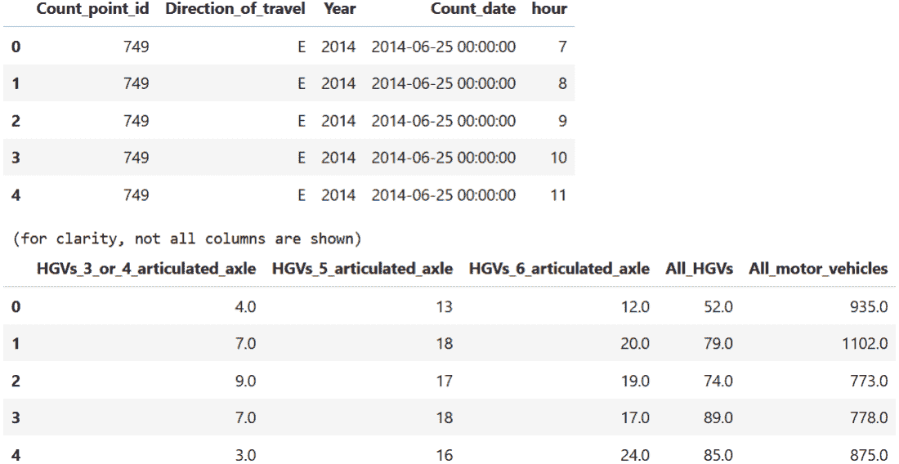

##### 图 8.1 交通计数数据的前几行的一瞥

数据的形状是 `(4815504, 35)`，这意味着我们有 35 列和接近 500 万的观测值。从列中，我们可以看出这不是一个单一的时间序列。实际上，它是由多个时间序列组成的，这些时间序列位于不同的“计数点”，即测量位置。每个计数点的测量可以被视为一个单独的时间序列，但我们也有按地区、地方当局或甚至不同时间段进行聚合的选项。从我们的数据字典中，我们还可以了解到我们将对`Pedal_cycles`列感兴趣，该列测量在测量期间观察到的自行车数量。

#### 调查时间序列的完整性

让我们检查数据以了解其完整性。首先，我们将查看缺失数据。以下代码生成了图 8.2 中的输出：

```py
traffic.isnull().sum()
```

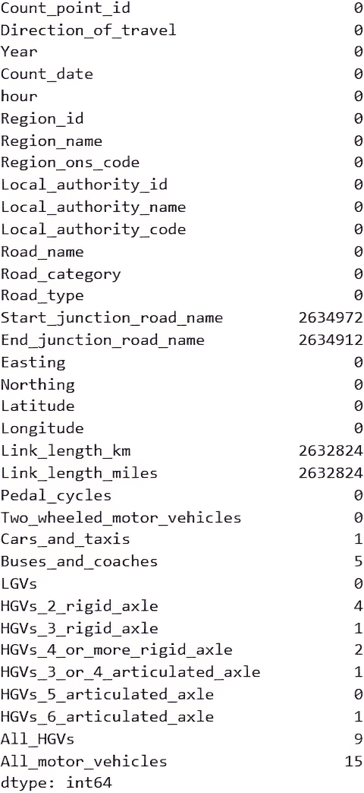

##### 图 8.2 交通数据中每列的缺失值

看起来记录大多是完整的，只是缺少了大量的道路名称和长度。这可能和不同的道路类型有关，因为并非该国所有的道路，以及因此数据集中的道路，都必须有名称。我们将保留这些缺失，因为我们没有理由相信这些行是错误的。有一些测量数据缺失，我们将假设可以用以下代码中的零来填充：

```py
measurement_cols = [
    'Pedal_cycles', 'Two_wheeled_motor_vehicles',
    'Cars_and_taxis', 'Buses_and_coaches',
    'LGVs', 'HGVs_2_rigid_axle', 'HGVs_3_rigid_axle',
    'HGVs_4_or_more_rigid_axle', 'HGVs_3_or_4_articulated_axle',
    'HGVs_5_articulated_axle', 'HGVs_6_articulated_axle',
    'All_HGVs', 'All_motor_vehicles'
]

for col in measurement_cols:
    traffic[col] = traffic[col].fillna(0)
```

为了完整性，我们还可以通过检查 `Region_name` 列来调查数据覆盖的区域。以下代码生成了图 8.3 中的输出：

```py
traffic["Region_name"].value_counts()
```

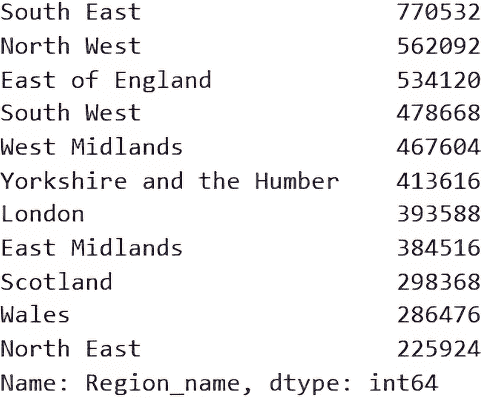

##### 图 8.3 交通数据中区域的分布

看起来数据覆盖了英格兰、苏格兰和威尔士，以及英格兰的各种地区。在我们继续调查之前，让我们开始构建图表来记录分析。图 8.4 显示了第一步，其中我们必须对缺失值做出决定。

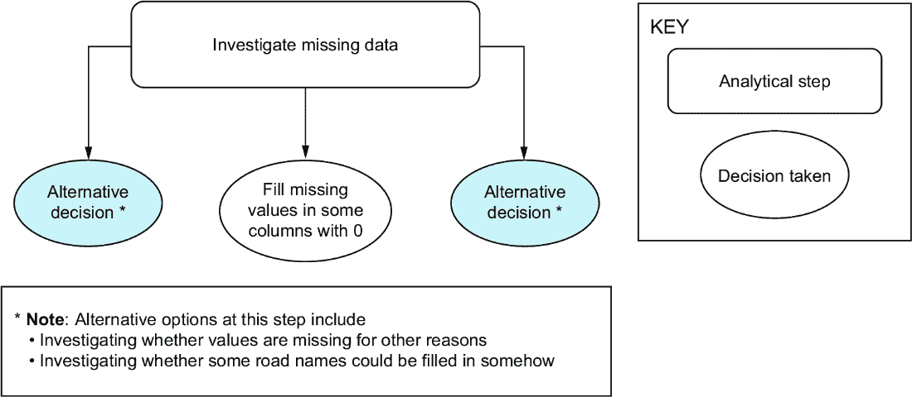

##### 图 8.4 分析的第一步

我们接下来的问题是关于粒度：一行数据究竟代表什么？

#### 调查时间序列粒度

建立我们数据中的一行代表什么非常重要。它是在特定时间和地点的测量，但是什么具体的列组合使一行独特？我们可以通过计算我们认为独特的列组合的行数来测试这一点，并验证它是否与整个数据集的行数相匹配。

##### 关于复合主键的注意事项

当多个列使记录独特时，这被称为 *复合主键*。这是唯一性不是来自单个 ID 列，而是来自多个列的组合。例如，如果多个客户数据库合并，客户 ID 可能不是唯一的。在这种情况下，客户 ID 和源数据库名称可能就是使记录独特的东西。

这又是基础训练与现实世界不同的另一种方式。在现实中，数据库通常具有复杂的结构，包括复合主键。

在这种情况下，唯一键至少必须包含 `Count_point_id`、`Count_date` 以及因此也包含的 `Year`。还有一个 `hour` 列，表明数据是按小时粒度。如果我们假设这些列是复合键，我们可以计算唯一的组合并验证它们是否与行数相匹配：

```py
len(traffic[["Count_point_id", "Year", "Count_date",
↪ "hour"]].drop_duplicates())
```

这给我们带来了 `2435120`，行数太少，这表明我们还没有考虑到另一列。这个数字大约是数据的一半，这表明我们正在寻找的列通常有两个值，因此在每个地点每小时，也有另一种测量方式。查看列，这可能就是 `Direction_of_travel`，意味着在每个地点的交通流量分别按两个方向计数。让我们将那一列添加到键中，看看它是否与行数匹配：

```py
len(traffic[["Count_point_id", "Year", "Count_date",
↪ "hour", "Direction_of_travel"]].drop_duplicates())
```

这返回 `4815480`，这个数字与行数非常接近，这表明我们已经找到了正确的列组合，但数据中包含重复项。让我们调查这些重复项。以下代码找到重复键并生成图 8.5 中的输出：

```py
duplicate_groups = (
    traffic
    .groupby(["Count_point_id", "Year", "Count_date",
↪ "hour", "Direction_of_travel"])
    .size()
    .loc[lambda x: x > 1]
)

duplicate_groups
```

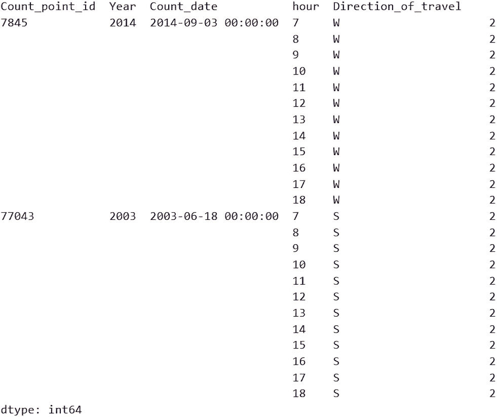

##### 图 8.5 具有相同复合主键的重复记录

看起来有两个地点在两个日期上有重复的测量值。我们想知道这些测量值是否也重复，或者行是否是完全重复的。我们通过以一个键为例，查看重复行在哪些值上有所不同来完成这项工作。以下代码执行此操作，并在图 8.6 中产生输出：

```py
example_dupes = (
  traffic[
    (traffic["Count_point_id"] == 7845)      #1
      & (traffic["Count_date"] == "2014-09-03 00:00:00")
      & (traffic["hour"] == 7)
      & (traffic["Direction_of_travel"] == "W")
  ]
)

(
  example_dupes
  .eq(example_dupes.shift(-1))   #2
  .iloc[0]
  .loc[lambda x: x == False]
)
```

#1 找到重复的一个特定例子

#2 使用位移法检查两行中的值是否相等

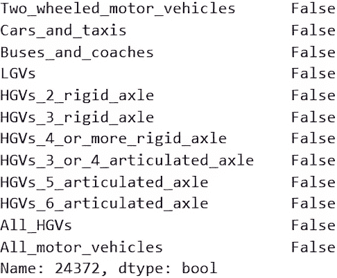

##### 图 8.6 示例重复行中值不匹配的列

这告诉我们，对于那个地点和日期，不同的列是测量通过车辆数量的列。让我们查看具体的测量值，以确定它们有多大的不同。以下代码提取了这些列。返回的数据包含许多列，默认情况下它们并没有全部显示。即使我们能够显示所有列，这也是可能的，但它们在屏幕上无法水平显示，需要滚动。一个技巧是取一行或两行数据，并将其*转置*以显示为只有一或两列。我们在这里这样做，输出显示在图 8.7 中：

```py
(
  example_dupes[[
    'Two_wheeled_motor_vehicles', 'Cars_and_taxis', 'Buses_and_coaches',
    'LGVs', 'HGVs_2_rigid_axle', 'HGVs_3_rigid_axle',
    'HGVs_4_or_more_rigid_axle', 'HGVs_3_or_4_articulated_axle',
    'HGVs_5_articulated_axle', 'HGVs_6_articulated_axle', 'All_HGVs',
    'All_motor_vehicles']]
  .transpose()
)
```

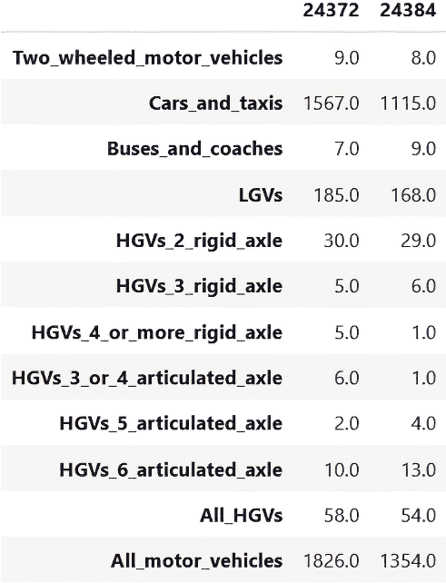

##### 图 8.7 相同记录的并列比较

对于相同的位置和测量日期时间的组合，值相当不同，因此我们现在面临一个决策。处理这些重复项时我们有哪些选择？

+   我们是否应该以某种方式合并值？如果这些是部分测量值，这将是合理的，但我们没有这方面的证据，而且数字太相似了。

+   其中一个是新数据，使得另一行变得过时，在这种情况下我们应该删除第一行吗？这是可能的，但如果是这样，我们除了假设出现较晚的那个更近之外，没有其他方法知道哪个是新的测量值。这感觉像是一个没有证据的强烈假设。

+   我们可以完全删除这些行，但这会在我们的时间序列中引入一个缺口，这对于时间序列分析是问题。

+   我们可以在两个记录之间平均计数。这保留了时间序列，并使我们的数字保持在正确的范围内，但本质上我们是以这种方式制造数据。

这里没有正确答案。每个选择都有自己的假设和后果。我们将倾向于保留时间序列，采用平均方法。虽然这确实补全了未实际记录的测量值，但这些重复值占整体数据的比例很小，不会造成大问题。

为了合并这些重复项，我们可以通过复合键对数据进行分组，为每个唯一标识符创建一个组，并平均测量行。在大多数情况下，由于键是唯一的，我们将平均一行，使其不受影响。唯一的额外技巧是处理缺失列。我们的道路名称和链接长度列，作为复合键的一部分，包含缺失值。特别是`pandas`库在分组列缺失时无法正确分组记录。

为了避免这种情况，我们将暂时用占位符填充缺失值，进行去重，然后删除占位符值。对于 `Road_name` 列，我们可以使用文本“占位符”，但对于数值列，我们需要找到一个在数据中尚未出现过的值。负数在这里效果很好，但我们应该检查是否有任何原因导致链接长度的负值：

```py
print(traffic["Link_length_km"].min(),
      traffic["Link_length_miles"].min())
```

输出分别是 0.1 和 0.06，这告诉我们没有负值，我们可以使用其中一个作为占位符。因此，去重的流程如下：

+   用占位符替换缺失值。

+   按除测量值外的所有列进行分组。

+   在每个组内，大多数情况下每行只有一个，计算测量值的平均值。

+   在分组和汇总的数据集中，再次用缺失数据替换占位符。

以下代码执行此操作并验证我们已经将行数减少到唯一组的数量：

```py
TEXT_PLACEHOLDER = "PLACEHOLDER"
NUMBER_PLACEHOLDER = -9999

group_cols = [
  'Count_point_id', 'Direction_of_travel', 'Year', 'Count_date', 'hour',
  'Region_id', 'Region_name', 'Region_ons_code', 'Local_authority_id',
  'Local_authority_name', 'Local_authority_code', 'Road_name',
  'Road_category', 'Road_type', 'Start_junction_road_name',
  'End_junction_road_name', 'Easting', 'Northing', 'Latitude',
  'Longitude', 'Link_length_km', 'Link_length_miles'
]

traffic_deduped = (
  traffic
  .assign(
    Start_junction_road_name = lambda df_:
↪ df_["Start_junction_road_name"].fillna(TEXT_PLACEHOLDER),
    End_junction_road_name = lambda df_:
↪ df_["End_junction_road_name"].fillna(TEXT_PLACEHOLDER),
    Link_length_km = lambda df_:
↪ df_["Link_length_km"].fillna(NUMBER_PLACEHOLDER),
    Link_length_miles = lambda df_:
↪ df_["Link_length_miles"].fillna(NUMBER_PLACEHOLDER)
  )
  .groupby(group_cols)
  .mean(numeric_only=True)
  .reset_index()
  .assign(
    Start_junction_road_name = lambda df_:
↪ df_["Start_junction_road_name"].replace(TEXT_PLACEHOLDER, np.nan),
    End_junction_road_name = lambda df_:
↪ df_["End_junction_road_name"].replace(TEXT_PLACEHOLDER, np.nan),
    Link_length_km = lambda df_:
↪ df_["Link_length_km"].replace(NUMBER_PLACEHOLDER, np.nan),
    Link_length_miles = lambda df_:
↪ df_["Link_length_miles"].replace(NUMBER_PLACEHOLDER, np.nan)
  )
)

print(traffic.shape, traffic_deduped.shape)
```

输出是 `(4815504, 35) (4815480, 35)`，其中第二对值显示我们已经将数据减少到每个复合主键唯一组合的一行。这感觉像是为了去除几个重复项而做了很多工作，但重复项的存在可能会在分析中引起多个问题，因此最好解决它们。

图 8.8 显示了我们的最新流程版本，包括我们刚刚采取的合并重复记录的步骤。

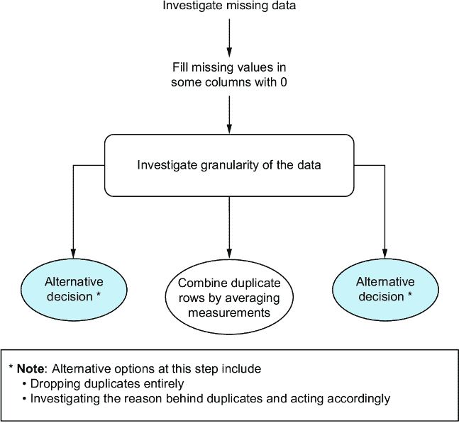

##### 图 8.8 我们分析两步的示意图

到目前为止，我们已经调查并处理了缺失数据，并确保我们理解了其粒度。现在，是时候查看覆盖范围了。

#### 调查时间序列覆盖范围

当我说我们要查看覆盖范围时，在这个例子中，我的意思是数据中值的日期范围。我们简要地查看过地理覆盖范围，现在我们想要调查以下内容：

+   数据的日期范围一般是怎样的？

+   日期范围在较小的时序（例如，每个位置）中是否会有所变化？

+   数据中是否存在一致的测量间隔？

+   任何时间序列中是否存在缺失？

这些问题的答案将不仅决定我们最终分析的质量，还决定我们是否需要仅仅因为全国数据覆盖不统一而专注于国家的某些部分。首先，让我们在将`Count_date`列转换为正确类型后，了解数据的日期范围。输出如图 8.9 所示：

```py
traffic["Count_date"] =
↪ pd.to_datetime(traffic["Count_date"], format="%Y-%m-%d %H:%M:%S")
traffic["Count_date"].agg(["min", "max"])
```

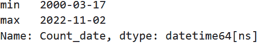

##### 图 8.9 整个数据集的日期范围

代码的输出显示，数据集中遇到的第一天是 2000 年 3 月，最后一天是 2022 年 11 月。我们有 20 年的覆盖范围，尽管还需要看这是否在测量地点上是一致的。我们想知道

+   每个位置都有 20 年的数据吗？

+   不同位置的时间序列中是否存在任何空缺？

调查这个问题的一种方法是为每个位置计算第一个和最后一个日期，计算它们之间的差异，并研究这个差异数字的分布。这将让我们一眼就能知道每个位置特定时间序列的长度。以下代码实现了这一点，输出如图 8.10 所示：

```py
coverage_by_point = (
    traffic
    .groupby("Count_point_id")
    ["Count_date"]
    .agg(["min", "max"])
    .assign(coverage_years = lambda x: (x["max"] - x["min"]).dt.days / 365)
    .sort_values("coverage_years", ascending=False)
)

coverage_by_point
```

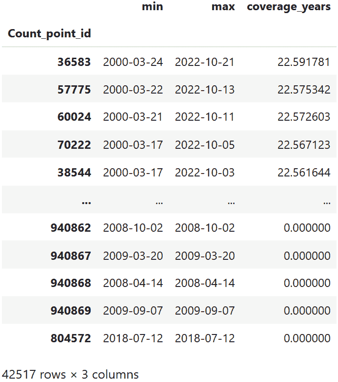

##### 图 8.10 各位置覆盖范围（按年）

这个表格告诉我们一些重要的事情：

+   *覆盖范围在位置之间差异很大。* 有些位置只有一天的测量数据，而有些位置则在整个 22 年期间都有数据。

+   *测量日期各不相同。* 初始查看数据时，这并不明显，但结果发现，任何测量时间序列都没有一致的开始或结束点。

为了更好地了解这些值的分布，让我们创建一个直方图。以下代码生成了图 8.11 中的直方图：

```py
fig, axis = plt.subplots()

coverage_by_point["coverage_years"].hist(bins=50, ax=axis)

axis.set(
    title="Distribution of coverage (years) by location",
    xlabel="Date range (number of years)",
    ylabel="Frequency"
)

plt.show()
```

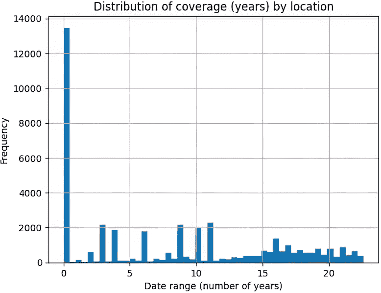

##### 图 8.11 显示不同位置覆盖范围的直方图

看起来，位置绝大多数的覆盖范围接近于零。也就是说，大多数位置只有一天的测量数据。这带来一个问题，因为那些位置的数据并不构成一个真正的时间序列，除了单日的小时测量数据。这些数据不足以得出很多见解。再次，我们面临以下选择：

+   我们是否包括只有一天测量数据的位置？这样做意味着我们不会失去很多覆盖范围，但我们也无法回答那些地区增长趋势的问题。

+   我们是否只关注数据量充足的位置？这意味着我们将有更稳健的结果，但位置和区域将大大减少。

这是一个提醒我们框架的好决策点。我们希望以结果为导向，并将研究问题置于我们思维的优先位置。我们可能需要进一步的工作来跟进我们的建议，并且绝对不希望基于稀疏的数据做出任何基础设施决策。基于这一点，我们将努力减少数据量，只保留数据量最大、覆盖范围最高且没有空缺的时间序列。

注意：这是那些将极大地影响我们解决方案差异性的决策之一。如果你的结果与我的不符，不要假设是你犯了错误。我们可能只是做出了不同的决策，导致了不同的结果。只要这些决策及其关键假设得到记录，不同的结果可能同样有价值且有用。

每当我们调查缺失数据时，我们想知道是否存在任何模式在缺口中。是否有任何特定因素导致我们的一部分数据缺失？在这种情况下，我们处理的是低覆盖率而不是缺失数据，但这个想法是适用的。让我们调查是否有某些地区的覆盖率较低。这可能是为什么？

+   一些地点可能比其他地点晚些时候被添加到“交通测量计划”中。

+   在某些地点进行测量可能存在物流困难。

+   新建住宅区周围已建成新道路，测量可能无法在更早的日期开始。

无论原因如何，我们想知道低覆盖率是否在全国范围内随机分布，或者是否存在我们应该注意的模式。让我们使用图 8.10 中的表格来关注只有一天数据的地点点。我们将删除相同位置 ID 的重复行，因为我们想了解它们的分布情况，而不是它们的细粒度测量。以下代码显示了按地区划分的只有一天覆盖率的地点数量，如图 8.12 所示：

```py
zero_location_ids = coverage_by_point                 #1
↪ [coverage_by_point["coverage_years"] == 0].index  

zero_locations = (
    traffic[traffic["Count_point_id"].isin(zero_location_ids)]
    .drop_duplicates("Count_point_id")
)
print(len(zero_locations))
zero_locations["Region_name"].value_counts()
```

#1 仅有一日测量数据的地点被称为“零”，因为首次和最后测量日期之间的差异为零。

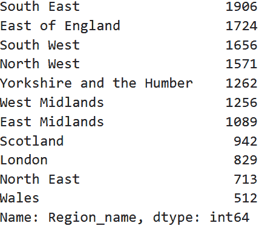

##### 图 8.12 按地区划分的只有一天数据的地点数量

这里存在差异，但我们不能陷入使用绝对数字做出判断的陷阱。可能只是因为东南部比威尔士有更多的单日地点，因为地点点更多。让我们将这些计算为每个地区总地点数的百分比，以获得公平的比较。

首先，我们按地区计算位置点的数量，然后使用这个数量来计算图 8.12 中的数字作为百分比。以下代码按地区计算位置，如图 8.13 所示：

```py
location_sizes = (
    traffic
    .groupby("Region_name")
    ["Count_point_id"]
    .nunique()
)
```

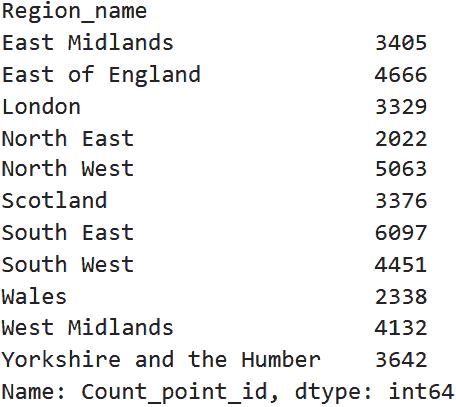

##### 图 8.13 按地区划分的计数点数量

以下代码将两个表合并在一起，并生成如图 8.14 所示的输出表：

```py
(
    location_sizes
    .reset_index()
    .merge(
        zero_locations["Region_name"]
            .value_counts()
            .reset_index(name="count")
            .rename(columns={"index": "Region_name"}),
        on="Region_name"
    )
    .rename(columns={
        "Count_point_id": "total_points",
        "count": "number_of_zeros"
    })
    .assign(pct_zeros = lambda x: x["number_of_zeros"] / x["total_points"])
)
```

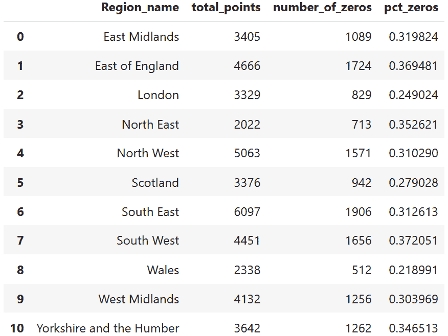

##### 图 8.14 每个地区的总地点数和单日地点数

如果单日地点真的存在仅限于某些地区的问题，我们会在表中发现相当大的变化。目前，只有威尔士和伦敦的单一日期数据的地点比例明显较低。我们可以对此进行更深入的调查，但本着尽快得到结果的精神，我们将假设我们对单日地点的存在感到满意，这是普遍发生的事情，而不是直接要解决的问题。

现在我们已经查看了缺失数据、粒度和覆盖范围，让我们将注意力转向缺口。在时间序列中，缺口是一个问题，因此我们希望将我们的数据减少到我们可以获得更长和完整时间序列的地点。

#### 调查时间序列中的缺口

我们已经确定，不同的地点从不同的起点开始跟踪数据，并且持续时间不同。为了识别缺口，我们不能仅仅计算一个地点看到的唯一日期的数量；我们需要计算每个遇到的日期与之前遇到的日期之间的差异，并标记任何超过一天缺口的案例。

首先，让我们看看每个地点每个日期的数据点数量，以了解是否可能存在连续性问题。以下代码计算了这一点，并在图 8.15 中产生了表格：

```py
points_and_dates = (
    traffic
    .groupby(["Count_point_id", "Count_date"])
    .size()
    .reset_index()
    .sort_values(["Count_point_id", "Count_date"])
)

points_and_dates.head()
```

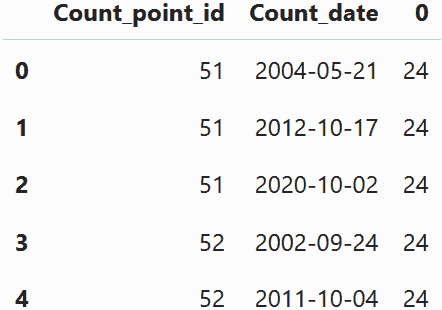

##### 图 8.15 每个地点 ID 和日期的数据点数量

这个表格向我们展示了重要的一点。我们错误地假设了一年中每天都会进行测量。数据在粒度上是每天的，但每年只有一天的数据。我们之前没有正确地切割数据以找到这一点，但这一点为我们提供了一个更清晰的了解我们所拥有的。

要了解是否存在缺口，首先，我们可以检查每个地点的`Year`列中有多少唯一值。那些有 23 个的是在 2000 年至 2022 年（包括 2022 年）之间每年都有测量的地点。我们将只关注至少有 10 年数据的地点，但这有些随意。我们也可以限制最近 5 到 10 年内数据完整的时序。在这里，我们将选择完整性而不是最近性，以下代码计算了这一点，并在图 8.16 中输出了结果：

```py
num_years_by_point = (
    traffic
    .groupby("Count_point_id")
    ["Year"]
    .nunique()
    .loc[lambda x: x > 10]
    .sort_values(ascending=False)
)

num_years_by_point
```

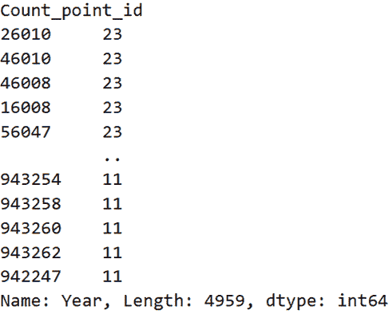

##### 图 8.16 每个地点的独特日历年分布

让我们也看看这些地点中的第一个地点的时间序列，以了解我们的数据中完整时间序列是什么样的。以下代码生成了图 8.17 中的图表：

```py
fig, axis = plt.subplots()

LOCATION_ID = "26010"

(
    traffic
    .query(f"Count_point_id == {LOCATION_ID}")
    .groupby("Count_date")
    ["All_motor_vehicles"]
    .sum()
    .plot(ax=axis)
)

axis.set(
    title=f"Number of vehicles over time (location {LOCATION_ID})",
    xlabel="Date",
    ylabel="Number of vehicles (total)"
)

plt.show()
```

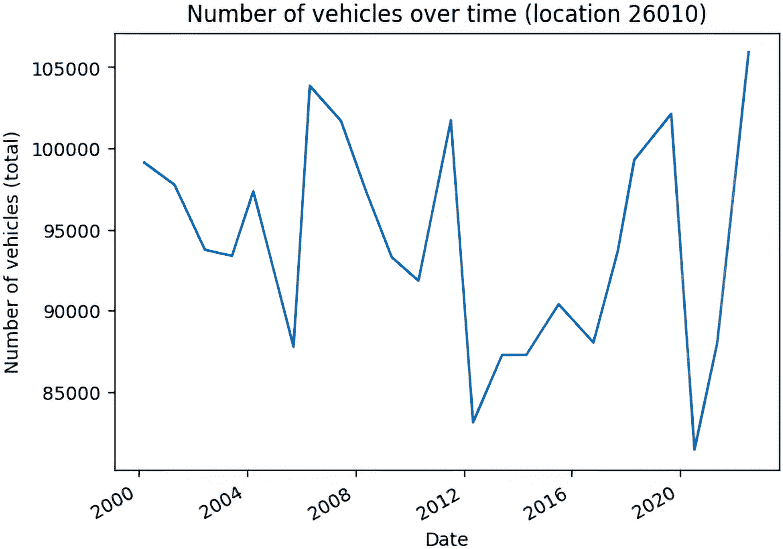

##### 图 8.17 位置 26010 的一个示例时间序列

这是每年计数当天在特定地点看到的车辆总数。已经有一些有趣的特点，例如由于 COVID-19 封锁导致的 2020 年的下降。

下一步是过滤我们的位置列表，只保留没有差距的时间序列。为此，我们将确保我们的数据已排序，并创建一个临时列来捕获前一年的年份，这样我们就可以找到行与前一行的差距超过一年的实例。以下代码添加了这些额外的列，新的`gaps` DataFrame 的快照显示在图 8.18 中：

```py
long_count_points = num_years_by_point.index

gaps = (
    traffic
    .query("Count_point_id in @long_count_points")
    [["Count_point_id", "Year"]]
    .drop_duplicates()
    .sort_values(["Count_point_id", "Year"])
    .assign(
        prev_year= lambda x: x["Year"].shift(),
        diff= lambda x: x["Year"] - x["prev_year"]
    )
)

gaps.head()
```

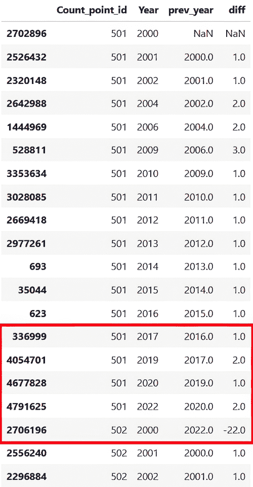

##### 图 8.18 显示了新的`gaps` DataFrame 的快照，其中突出显示了一些重要的行

这些新列帮助我们识别之前遇到的测量数据来自一年以上的地方。在图 8.18 的高亮部分，我们可以注意到 2018 年位置 ID 501 没有测量数据，因此行之间的差距是两年。当遇到下一个位置 ID 时，如果前一个位置 ID 的最后一年晚于下一个位置 ID 的第一年，差距可能会变成负数。

为了识别差距，我们可以简单地过滤这个数据集，使得`diff`列大于 1。然而，我们可能会遇到边缘情况，即下一个位置 ID 恰好在前一个 ID 之后两年开始，我们会错误地将其标记为存在差距。

为了确保我们正确地过滤差距，我们还需要跟踪前一个列的位置 ID，这样当我们遇到超过一年的差距时，我们也可以检查位置 ID 是否仍然相同。以下代码执行此操作，并显示了图 8.19 中一些有问题的差距行：

```py
gaps = (
    gaps
    .assign(
        prev_id= lambda x: x["Count_point_id"].shift()
    )
    .query("diff > 1 and Count_point_id == prev_id")
)

gaps.head()
```

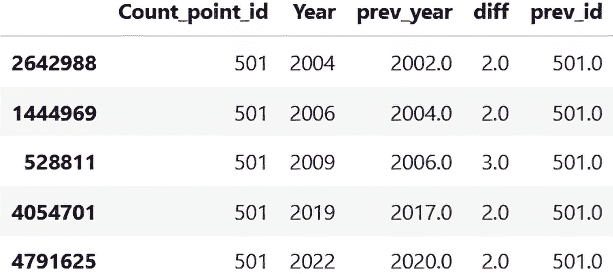

##### 图 8.19 显示了时间序列中一些表示问题差距的行

我们现在可以使用这个`gaps` DataFrame 来找到我们想要从最终时间序列数据中排除的所有独特位置 ID。这是通过以下代码完成的。结果 DataFrame 的一部分显示在图 8.20 中：

```py
gap_ids = gaps["Count_point_id"].unique()

all_time_series_raw = (
    traffic
    .query("Count_point_id in @long_count_points \
    and Count_point_id not in @gap_ids")
)

all_time_series_raw.head()
```

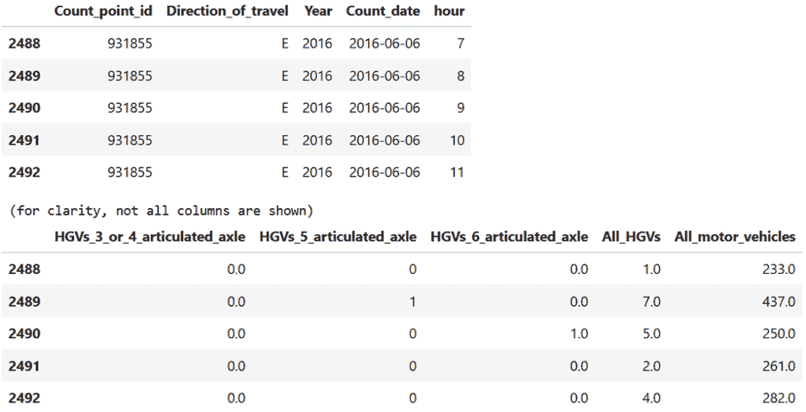

##### 图 8.20 显示了过滤后的交通数据行的快照

图 8.20 现在显示了从原始的原始`traffic` DataFrame 中过滤出的行。它只包含至少有 10 年连续无差距数据的位置 ID。现在让我们将此聚合为在位置级别汇总的时间序列，以便我们更好地了解我们剩下多少数据。以下代码执行此聚合，图 8.21 显示了新聚合数据的前几行：

```py
all_time_series = (
    all_time_series_raw
    .groupby(["Count_point_id", "Count_date"])
    ["All_motor_vehicles"]
    .sum()
    .reset_index()
)

print(all_time_series["Count_point_id"].nunique())
all_time_series.head()
```

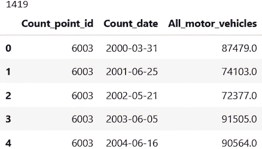

##### 图 8.21 显示了现在按年度时间序列聚合的过滤交通数据的快照

现在每一行对应一个位置 ID 和测量日期。如图 8.21 顶部所示，我们仍然有超过 1,400 个独特位置 ID 的数据。这些现在都是每年都有测量的时间序列，因此这是一个没有差距的时间序列。

要精确地说，我们有一个时序数据，显示了在特定年份某一天通过计数点的车辆总数。每年只有一天进行测量。这是一个重要的细节，因为它导致了一些注意事项：

+   图 8.21 显示，每年的测量不是在同一天进行的。如果我们想调查交通模式随时间的变化，测量至少应该在每年的同一时间进行，否则我们可能会比较夏季交通与冬季交通，例如。一个选择是只保留每年在相同时间进行一致测量的时序数据。

+   此后，无论我们从哪一年的哪个部分进行测量，都会引入偏差。对于只有冬季测量数据的地点，在当年那个时间骑车可能减少，因此骑车模式可能没有帮助。

+   如果每年的日期都相同，这实际上可能是一个问题，因为我们可能会比较不同星期几的日期，甚至工作日与周末。

让我们检查最后一个观点。数据分布在星期几？以下代码调查了这一点，输出结果如图 8.22 所示：

```py
(
    all_time_series_raw[["Count_date"]]
    .drop_duplicates()
    ["Count_date"]
    .dt.weekday
    .value_counts(normalize=True)
    .sort_index()
)
```

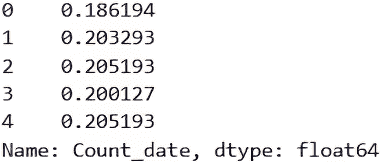

##### 图 8.22 不同星期几的行百分比

这告诉我们，大约 20%的行分布在星期二到星期五，而星期一略少。因为我们是从星期一开始计算一周的天数，所以我们也知道剩余数据中没有周末，这样就缓解了一个担忧。

我们仍然可以使用这些数据作为交通随时间变化的代理，帮助我们聚焦于具有有趣骑车交通模式的地点，但我们必须充分了解局限性，尤其是在向利益相关者展示结果时。

在继续分析这些时序数据之前，我们的最后一步是看看如果我们只保留每年每月都进行测量的时序数据会发生什么。

#### 找到每年在同一时间记录的时序数据

以下代码识别了每年仅在相同月份进行测量的位置点。图 8.23 显示了输出结果：

```py
same_month_time_series = (
    all_time_series
    .assign(month=lambda x: x["Count_date"].dt.month)
    .groupby("Count_point_id")
    ["month"]
    .nunique()
    .loc[lambda x: x == 1]
)

print(len(same_month_time_series))

same_month_time_series.head()
```

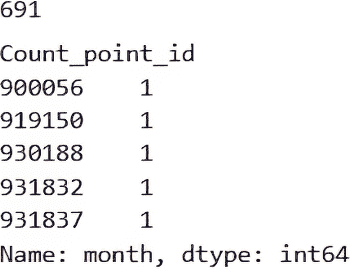

##### 图 8.23 仅遇到相同月份的位置 ID

保留这个过滤器将使我们的数据减半，但仍然留下不到 700 个时间序列。我们应该验证与这些位置 ID 相关的时间序列确实只包含相同的月份。我们将以第一个位置 ID 为例，但在现实中，我们可能想要抽查几个案例。以下代码检查了 ID 为 900056 的计数点的时序数据，输出结果如图 8.24 所示。

```py
all_time_series[all_time_series["Count_point_id"] == 900056]
```

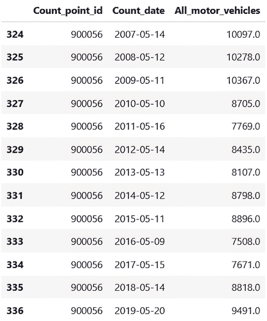

##### 图 8.24 位置 ID 900056 的时序数据

图 8.24 显示，在 900056 位置对交通进行了 13 年的计数，总是在 5 月份进行。这使得测量结果年复一年更具可比性。现在，让我们将此数据导出到一个中间文件中，以将清理过程与分析过程分开。

#### 仅导出完整的时间序列数据

导出数据的中间版本是一个好习惯，特别是如果你有大量的原始数据，并且清理和转换它需要一些时间。

我们希望将原始数据过滤到仅包含我们已识别的位置 ID。我们将使用 Parquet 格式，因为它紧凑且保留数据类型。此文件将是第九章分析的起点。以下代码创建了这个导出文件：

```py
ids_to_export = same_month_time_series.index

(
    traffic
    .query("Count_point_id in @ids_to_export")
    .to_parquet("time_series.parquet.gz", compression="gzip")
)
```

### 8.4.2 到目前为止的项目进度

在我们进入第九章项目分析部分之前，让我们回顾一下本章我们所取得的成果，这是项目的数据准备部分。以下是关于我们数据的了解：

+   一行代表在特定日期特定方向的单个位置上进行的测量。这些列的组合使记录独特。

+   对于每个位置，我们都有一个给定日历年度内最多一天的唯一测量日。

+   在不同的位置 ID 之间，测量年份的数量差异很大。这意味着我们的时间序列数据存在不一致的覆盖范围和许多缺口。

+   除了大约一半的道路名称和长度数据缺失外，没有显著的缺失值。

为了减轻一些问题，我们只提取了最长和最完整的时间序列位置，以便在分析的第二部分中集中关注。图 8.25 显示了我们所采取的分析步骤和到目前为止所做的决定。

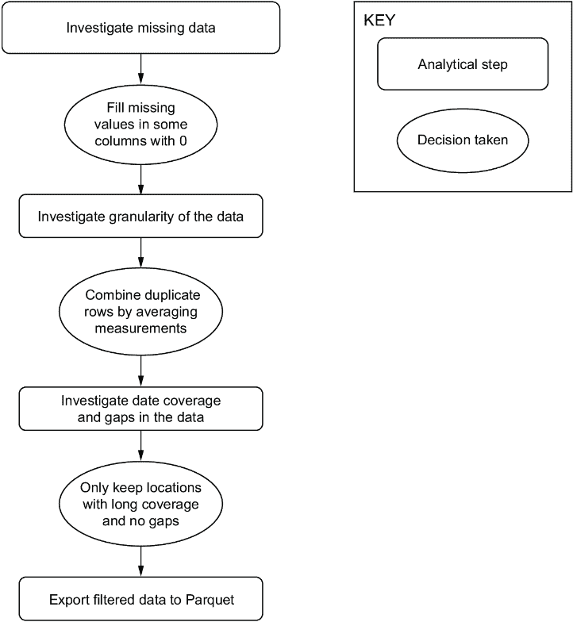

##### 图 8.25 我们步骤的最新图示，包括调查覆盖范围和处理缺口

此图展示了我们到目前为止的过程，我们将使用本章的输出，即原始交通数据的过滤版本，作为第九章分析的起点。

## 摘要

+   时间序列数据可能看似简单，但其中包含复杂性和隐藏的价值。

+   了解如何操作时间数据可以扩展你的数据分析工具集。

+   可用时间序列的粒度决定了我们可以执行的分析。例如，无法从月度数据中确定每日模式。

+   如果数据中没有缺口，时间序列分析效果最佳。

+   如果存在差距，需要通过平滑处理或估计这些差距中的值来处理*。
