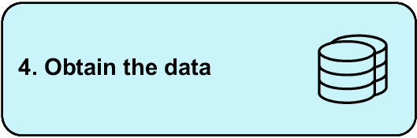

# 10 快速原型：数据分析

### 本章涵盖

+   快速原型化想法以支持商业案例

+   探索数据集以构建概念验证

有时，数据分析是关于调查一个想法是否可行。例如，现有数据是否足够让公司构建一个数据驱动的应用程序？我们可以通过分析数据来回答这样的问题，但如果我们能构建一个可工作的*概念验证*，那就更有力量了。通过这样做，我们让我们的利益相关者看到这个想法的可行性。关键的是，我们也会发现使用数据实现这一目的的任何障碍。

##### 真实商业案例：构建概念验证

本章的灵感来源于我作为数据科学家交付的第一个项目之一。数据团队的任务是创建一个盈利产品。想法是一个应用程序，允许用户输入车辆的注册信息，并显示该车辆及其类似车型的当前市场状况。定义什么使一辆车足够相似是难点，而这正是产品背后的数据驱动秘密。一旦我们确立了某些规则，我就构建了一个快速的概念验证，向利益相关者展示这个想法是可行的。构建这个概念验证也意味着我可以传达构建真实产品的具体挑战，因为我实际上已经尝试过使用可用的数据和系统使其工作。

在本章和下一章的项目中，我们通过探索一个新的数据集并构建一个概念验证来练习*快速原型*的技能。

## 10.1 快速原型制作过程

数据团队通常位于研发部门，或者作为他们工作的一部分被期望进行研发。这意味着他们不仅分析数据来回答问题，有时还会构建公司目前不存在的物品。对于分析师来说，一项宝贵且经常被忽视的技能是能够将某些功能组合在一起，以调查一个想法的可行性。这个“某些东西”通常被称为*概念验证*（POC）、*原型*或*最小可行产品*（MVP），尽管 MVP 通常比原型更进阶。

备注：本领域的术语往往有所不同。在本章中，我将使用“概念验证”和“原型”的具体定义。项目任务将是构建一个概念验证，但在章节标题中，构建某物以测试想法的更一般过程被称为“快速原型”。

虽然这些术语往往可以互换使用，但它们之间有细微的差别：

+   概念验证是测试一个想法的东西。它不一定要是一个精良的产品；它只需要足够复杂，以便可以看到一个想法是否可行。

+   原型从概念验证中演变而来。一旦一个想法经过测试，我们就可以基于概念验证和真实数据构建一个小型、可用的产品。它不会完成，它可以存在于像某人的笔记本电脑这样的开发环境中，并且它不会具备完全功能软件的所有功能，但它处于一个模仿最终产品的状态。

+   一旦原型存在并且已经向利益相关者展示，可能会有一步创建 MVP。MVP 是一种试点发布，以便尽可能快地将产品推向真实用户。它可能缺少一些功能，但它处于生产环境中，并且已经应用了严谨性以确保其正确运行。

+   无论我们是在谈论一个应用程序、一个网站还是机器学习模型，都会有一个将其投入生产的想法。生产意味着它在运行，并且人们在使用它，无论是内部用户还是外部客户。达到 MVP 阶段就相当于将其投入生产。

图 10.1 展示了这个过程的示例，包括一个想法可以在从最初的想法到构建工作原型之后的任何阶段被放弃的事实。


##### 图 10.1 从想法到生产以及中间的步骤

让我们看看一个具体的例子。

### 10.1.1 快速原型示例

假设您的利益相关者想知道哪些客户可能从他们的电子商务平台流失。换句话说，哪些客户可能停止使用该服务？他们希望看到一些工具或仪表板中的风险客户列表，例如“早期预警系统”，以便他们可以采取行动并防止这些用户流失。

作为一名分析师，你可能会构建一个模型来预测处于流失风险的用户，并将其整合到这样的交互式工具中。表 10.1 显示了该产品生命周期的三个阶段。

##### 表 10.1 三阶段示例遍历

| 阶段 | 任务 | 成功标准 | 在此阶段放弃的可能原因 |
| --- | --- | --- | --- |

| 1) 概念验证 | 构建一个基本的预测模型。  | • 基本模型已构建到可接受的准确度水平。 • 可用数据足以构建模型。

| • 可用数据甚至不足以构建一个基本的流失模型。  |
| --- |

| 2) 原型 | 构建一个可工作的交互式工具。  | • 用户可以使用该工具采取预防措施，以保持处于风险中的客户。 • 可以及时做出预测。

| • 预测所需数据在预测时不可用。 • 产品没有市场。

|

| 3) 生产 | 将工具构建为具有工作数据管道的完全功能软件。  | • 预防措施产生了可衡量的财务影响。  | • 投资回报率不足。 • 工具使用率低。

|

为什么在开始时进行概念验证如此重要？我们希望尽快理解以下内容：

+   我们是否有数据来回答问题、构建预测模型和创建我们的应用程序？

+   产品上线后，我们是否会在需要时拥有数据？许多机器学习项目都失败了，因为虽然历史数据可用于训练模型，但新数据在模型做出有用预测的时间点不可用。

+   建立这个产品的挑战有哪些？这些可能和数据可用性有关，但也可能涉及其他无数的技术挑战。关键在于，直到你真正尝试去建立它，你才知道所有建立某物的挑战。

原型阶段与概念验证的区别在于我们现在有不同的问题：

+   *有人对这个产品感兴趣吗？* 这个产品不必存在就能回答这个问题——一个原型就足够了。即使是一个在公司内部部署的仪表板或机器学习模型，也需要有产品市场匹配度。

+   *真实用户会如何使用这个产品？* 通过一个原型，你可以在不构建整个产品的情况下测试你对产品真实用户如何使用它的假设。这个过程还处于早期阶段，因此在这个阶段取消项目不应该花费太多。

这些概念对软件开发人员和产品经理来说是熟悉的，但它们对分析师也有价值。能够构建一个概念验证和随后的原型帮助分析师确定值得工作的内容，并更快地迭代想法，这反过来意味着更注重结果的工作方式。

现在我们将这些想法付诸实践。项目概述不仅仅是分析数据来回答问题，它还涉及到构建一些东西来评估数据是否能够支持一个付费产品。

## 10.2 项目 7：构建一个概念验证来调查威尔士房地产价格

让我们来看看这个项目，我们将不仅分析一些数据，还要构建一个概念验证数据产品向利益相关者展示。我们将从查看问题陈述、数据字典、我们追求的输出以及我们需要解决这个问题的工具开始。我们将比平时花更多的时间思考输出，因为我们不仅超越了分析，还进入了创造产品的阶段。然后我们可以制定一个以结果为导向的行动计划，并深入到示例解决方案中。

### 10.2.1 问题陈述

你在为 CymruHomes Connect 工作，这是一家专注于威尔士房产的房地产公司。他们希望通过数据来扩大业务；他们希望以新应用程序的形式向客户提供关于威尔士房地产市场的见解。这个应用程序将使用历史房产销售数据，使用户能够探索他们感兴趣地区的房产价格。

他们发现英国政府的土地注册处有一个名为“成交价格”的数据集，其中包含公开的历史销售数据。他们提取并提供了几年的这些数据。

注意：原始数据来自 [`mng.bz/yWvB`](https://mng.bz/yWvB)。它包含 HM 土地登记局数据 © 英国皇家版权和数据库权利 2021。此数据根据开放政府许可 v3.0 许可。感谢土地登记局和英国皇家邮政分别允许使用房价和地址数据。

他们要求你调查这些数据是否确实适合为他们的新应用程序提供动力。这相当模糊，但他们有一些想法希望融入：

+   他们特别关注房产类型的分析，例如，一栋房子是连排式还是独立式，因为他们坚信这强烈影响了他们的客户在选择房产时的决策，所以他们希望分析包括这一维度的细分。

+   他们还认为用户会对比较最细粒度的房产感兴趣，因此查看街级数据的能力很重要。

他们只要求你探索数据并看看可以用它回答哪些问题，重点关注他们之前提到的角度。然而，我们将超越他们的要求，构建一个概念证明来展示最终应用程序可能的样子和功能。

我从数据科学工作中学到的一个重要教训是，利益相关者往往无法明确表达他们想要什么，因为他们缺乏对可能性的了解。创建概念证明是帮助弥合这一差距并作为数据专业人士提供额外价值的一种方式。

在我们讨论在过程中可能采取的步骤之前，让我们回顾一下可用的数据、期望的结果以及我们将需要的工具。

### 10.2.2 数据字典

和往常一样，一个关键的第一步是查看可用的数据。表 10.2 显示了土地登记局提供的数据字典。数据字典的一部分来自 Kaggle ([`mng.bz/QDWG`](https://mng.bz/QDWG))，地址列在此处详细说明：[`mng.bz/XxWv`](https://mng.bz/XxWv)。原始数据字典的定义提供如下。

##### 表 10.2 价格支付数据的数据字典

| 列 | 定义 |
| --- | --- |
| 交易唯一标识符 | 自动生成的参考编号，记录每次发布的销售。该编号是唯一的，每次记录销售时都会更改。  |
| 价格 | 转让文件上声明的销售价格。  |
| 转让日期 | 销售完成的日期，如转让文件上所述。  |
| 邮编 | 地址的邮政编码。  |
| 房产类型 | D = 独立式，S = 半独立式，T = 连排式，F = 公寓/联排别墅，O = 其他  |

| 旧/新 | 表示房产的年龄，并适用于所有价格支付交易，住宅和非住宅。Y = 新建房产，N = 已建立的住宅建筑

|

| 持有时间 | 与产权相关：F = 自由持有，L = 租赁持有  |
| --- | --- |
| 主要地址对象名称（PAON） | 通常为门牌号/名称（例如，42 或“橡树小屋”）。  |
| 第二个可寻址对象名称（SAON） | 如果有子建筑，例如，建筑物被分割成公寓，将会有一个 SAON。  |
| 街道 | 地址中的街道部分。  |
| 地区 | 关于位置的额外详细信息（例如，城市中的区域）。  |
| 城镇/城市 | 地址中的城镇/城市部分。  |
| 区域 | 地址中的区域部分。  |
| 县 | 地址中的县部分。  |

| 类别类型 | 表示支付价格交易的类型。A = 标准支付价格条目；包括以全市场价值出售的单套住宅。

B = 额外支付价格条目；包括在出售/收回权下的转让、出租购房（如果可以通过抵押贷款识别）以及转让给非私人个人。

|

| 记录状态 | 仅与月度文件相关。表示记录的增加、更改和删除。年度文件包含所有记录的最新版本。  |
| --- | --- |

现在我们已经看到了可用的内容，让我们看看这个项目的成果。

### 10.2.3 预期成果

我们的利益相关者最初希望了解我们可以在潜在应用程序中包含哪些类型的分析。关于要纳入的额外数据源的建议也将很有用。最后，我们决定构建一个概念验证，部分是为了向利益相关者展示他们的潜在应用程序可能的样子，同时也是为了测试数据是否足以构建一个有用的产品。

### 10.2.4 必需工具

证明概念的内容将取决于您首选的工具。它可能是一个工作网络应用程序，例如示例解决方案中用 Python 库`streamlit`构建的应用程序。然而，它也可能是一个仪表板，例如用 R 语言的包 Shiny 或使用商业智能工具如 Tableau 或 Power BI 构建的仪表板。

在示例解决方案中，我使用 Python 和`pandas`库进行数据探索，以及`matplotlib`、`seaborn`和`ridgeplot`进行可视化。我还介绍了`streamlit`库来构建交互式、基于网络的证明概念。您的工具可能不同，尤其是在概念验证阶段。此项目的清单是您的工具可以

+   从包含数百万行数据的 CSV 文件中加载和组合大型数据集

+   执行基本的数据操作任务，例如过滤、排序、分组和重塑数据

+   创建数据可视化

+   创建一个交互式应用程序，无论是仪表板还是网络应用程序，其中根据用户输入显示不同的工件，例如图表或其他可视化。

小贴士  您可能发现使用两个不同的工具来完成此项目更容易：一个用于数据分析，另一个用于构建概念验证。如果您使用包含用于构建应用程序的库或包的编程语言，例如 R 语言的 Shiny 或 Python 的`streamlit`，您可能想使用此项目来尝试它们。

## 10.3 将结果驱动方法应用于调查威尔士房产数据

让我们现在用我们的以结果为导向的框架来解决这个问题，并制定我们的行动计划。


我们对利益相关者想要看到的内容有一个想法。他们的兴趣在于数据是否适合支持他们拥有的应用想法。他们表示，他们特别感兴趣的是房产类型以及是否可以将街级数据纳入他们的应用中。我们也理解，构建概念验证将使我们能够识别使用这些数据可能存在的问题，这就是为什么我们将花时间这样做。


从最后开始意味着首先考虑应用。在我们分析数据之前，我们无法确切知道应用中会有什么，但在分析阶段关注应用将帮助我们更快地获得结果。在分析阶段创建图表时，我们应该考虑它们是否对概念验证有用。因此，我们的分析不仅会考虑利益相关者的要求，还会考虑未来应用用户的可能偏好。在这个项目中，我们的最小可行答案将更类似于如果我们设计软件时的最小可行产品，这在某种程度上是我们正在做的事情。


在这个例子中，数据已经为我们识别出来。然而，在构建我们的概念验证时，我们可能会发现数据中的空白或该数据未涵盖的房地产市场方面。我们应该考虑额外的数据来源，以改善应用的质量，并在向利益相关者传达结果时推荐它们。



我们已经从土地登记处下载了原始数据。然而，在我们开始探索数据之前，我们需要将不同的年度文件合并。我们也可能希望花些时间查看数据的来源，即土地登记处的网站，以了解更多关于数据是如何收集的以及可能存在的局限性。


我们将分两个阶段进行项目工作。第一阶段是分析可用数据，因此我们的高级步骤可能是

+   调查数据的完整性，例如识别缺失数据。

+   理解数据的地理分布，例如不同的地址级别，如地区和区。

+   一旦我们了解了地理分布，我们就可以提取威尔士的房产数据用于我们的应用。

+   我们还希望根据利益相关者的要求调查房产类型。我们可能感兴趣的问题如下：销售价格如何随房产类型而变化？哪些房产类型更受欢迎？这些价格和流行模式在地理上是否有所不同？

+   最后，我们希望识别出可以在我们的概念验证应用中重新创建的可视化。

一旦我们完成了初步分析，我们就可以着手构建概念验证。这一阶段我们需要考虑的，以及因此对概念验证应用程序的要求如下：

+   应用程序中显示的任何数据和可视化应根据用户输入进行更改。

+   应用程序应使用所有真实、可用的威尔士房地产数据。

+   用户可以更改的选项应来自数据（例如，他们可以从中选择的县列表）。

概念验证不需要是一个网络应用程序；它只需要包含基于真实数据的交互元素，这样你就可以向利益相关者展示。在 BI 工具中构建的仪表板将满足这些标准。如果你是 Python 和 Jupyter 用户，甚至在 Jupyter 笔记本中拥有交互式小部件也足够了。


输出的展示将包括传达分析阶段的结果，以及让利益相关者看到甚至尝试交互式概念验证。这两者相辅相成，因为概念验证的任何局限性都将在分析阶段被发现，并在展示概念验证本身时进行传达。


在快速原型设计时，迭代至关重要。我们用于构建概念验证的任何工具都应该使我们能够轻松快速地对功能进行大量更改。在这个阶段，我们不受生产考虑的限制，如用户身份验证、权限或管理服务器和数据库。我们应该能够根据概念验证和原型阶段的反馈快速做出更改。

既然我们已经概述了行动计划，现在是时候开始着手项目了。如果你是从头到尾阅读这一章，我建议在阅读下一节之前，尝试自己完成这个项目，该节详细介绍了示例解决方案。

## 10.4 一个示例解决方案：构建原型以探索使用房价数据

现在，让我们通过一个示例解决方案来探讨。一如既往，我强烈建议你首先尝试自己完成这个项目，因为我们的解决方案会有所不同，尤其是对于这个项目。

至于行动计划，我们首先将合并单独的年度文件。然后，我们将探索合并后的数据集，特别关注数据中的物业类型和地理层次结构，正如利益相关者所要求的。在确定构建概念验证的适当工具之前，我们将决定哪些可视化将包含在我们的应用程序中。最后，我们将使用数据构建一个概念验证，用户可以根据他们的输入更改显示的可视化。

### 10.4.1 在原型设计前分析数据

我们流程的第一步是将利益相关者提供的不同年度文件合并。它们涵盖了从 2021 年到 2023 年 inclusive 的时期。最初，我们将假设它们具有相同的格式，但我们已准备好应对这种情况。

#### 合并没有标题的数据集

让我们看看其中一个文件。以下代码生成了如图 10.2 所示的输出：

```py
import pandas as pd

prices_2021 = pd.read_csv("./data/pp-2021.csv.gz", nrows=1000)
prices_2021.head()
```


##### 图 10.2 2021 年原始数据的快照

检查后发现，文件中没有标题，因此我们需要根据数据字典提供列名。除此之外，我们还将日期列转换为正确的类型，以便我们可以验证数据确实覆盖了它所声称的年份。以下代码按顺序读取每年的每个文件并将它们合并成一个单一的`pandas` `DataFrame`。合并数据的快照输出如图 10.3 所示。

```py
annual_dfs = []

for year in [2021, 2022, 2023]:
    print(f"Parsing {year}")
    df = pd.read_csv(
        f"./data/pp-{year}.csv.gz",
        names=["transaction_id", "sale_price", "sale_date", "postcode",
               "property_type", "old_new", "duration", "house_number_name",
               "second_addressable_object_name", "street", "locality",
               "town_city", "district", "county",
               "category_type", "record_status"],
        parse_dates=["sale_date"])
    annual_dfs.append(df)

price_paid = pd.concat(annual_dfs, axis=0, ignore_index=True)
print(price_paid.shape)
price_paid.head()
```


##### 图 10.3 合并后的价格数据快照

让我们验证这个合并后的数据集是否从 2021 年开始，并在 2023 年底结束。我们将查看最小和最大的日期来完成这项工作，如下面的代码所示，其输出结果如图 10.4 所示：

```py
price_paid["sale_date"].agg(["min", "max"])
```


##### 图 10.4 验证数据确实覆盖了 2021-2023 年

现在我们已经合并了数据并验证了日期范围，我们将导出它以供以后使用。这意味着我们的分析和概念验证代码可以直接引用合并后的数据：

```py
price_paid.to_csv("./data/price_paid.csv.gz", index=False)
```

我们现在可以进入分析阶段了。

#### 调查数据质量

让我们对合并后的数据进行一些初步的合理性检查。我们感兴趣的是查看缺失数据、异常值，尤其是在销售价格方面，以及各种类别的分解。我们将首先再次读取数据。如果我们从之前的代码片段继续，这并不是严格必要的，但因为我们决定将合并和数据分析代码分开是一种良好的实践，我们将这样编写代码。在示例代码文件中，合并和分析阶段发生在不同的文件中，因此我们也将保持一致性：

```py
import pandas as pd
import numpy as np
import matplotlib.pyplot as plt
import seaborn as sns

pd.options.display.float_format = '{:.2f}'.format

price_paid = pd.read_csv("./data/price_paid.csv.gz",
                         parse_dates=["sale_date"])
print(price_paid.shape)
price_paid.head()
```

在这里，我们还设置了一个名为“浮点格式”的东西。这是告诉`pandas`如何显示数字的一种方式。我们明确设置它的原因是因为房价会有很大的变化，`pandas`可能会使用科学记数法显示最大的数字。也就是说，一百万可能会显示为`1e6`或类似，而不是显示所有的零。设置浮点格式将避免这个问题，并且由于我们将处理的是货币价值的价格，两位小数是有意义的。

让我们先看看我们列中的缺失数据。以下代码调查了这个问题，输出结果如图 10.5 所示：

```py
price_paid.isnull().sum()
```


##### 图 10.5 每列缺失值的数量

这个输出告诉我们，所有缺失数据都与地址有关。我们有一些缺失的邮政编码、街道名称，以及大量缺失的本地性和“第二个可寻址对象名称”（SAON）数据。这些后列将针对不同的地区和财产，因此它们不太可能成为问题。数据字典甚至建议并非所有财产都有 SAON。

我们应该检查那些没有街道名称的属性实例，因为这可能是一个问题，特别是考虑到我们的利益相关者询问了街道级数据。以下代码调查了一些缺失的街道名称，输出结果如图 10.6 所示：

```py
price_paid.loc[price_paid["street"].isnull(),
               ["house_number_name", "second_addressable_object_name",
                "street", "postcode", "locality", "town_city",
                "district", "county"]]
```


##### 图 10.6 没有街道详细信息的属性样本

虽然这只是超过 50,000 行缺失街道名称的小部分，但似乎很多这些实例都是像“The Barn”或“The Old School”这样的属性名称。这或许可以解释为什么地址的一部分缺失。

我们可以保留这些缺失的街道名称，因为在许多情况下，它们似乎是不适用而不是缺失。然而，如果我们要在我们的应用程序中向用户展示街道名称，我们需要一个选项来过滤没有街道名称的属性。我们可以在应用程序本身中处理这个问题，或者用占位符值填充缺失的数据。让我们选择使数据尽可能干净，并填充缺失值。以下代码实现了这一点：

```py
STREET_PLACEHOLDER = "-- NO STREET INFORMATION --"
price_paid["street"] = price_paid["street"].fillna(STREET_PLACEHOLDER)
```

让我们总结一下到目前为止我们所做的工作，并开始构建我们的图来记录我们的步骤。图 10.7 显示了到目前为止我们所做的工作，包括关于如何处理缺失街道名称的决策。


##### 图 10.7 我们分析的第一步

#### 调查缺失的地理数据

比缺少街道名称更令人担忧的是，我们竟然有数千个缺失的邮政编码。再次，让我们看看这些缺失邮政编码的几个例子。以下代码找到了一些示例，输出结果如图 10.8 所示：

```py
price_paid.loc[price_paid["postcode"].isnull(),
               ["house_number_name", "second_addressable_object_name",
                "street", "postcode", "locality", "town_city",
                "district", "county"]]
```


##### 图 10.8 缺失邮政编码数据的记录选择

观察房屋名称，这些名称似乎也是具有明确名称的属性，以及一些关于车库的引用。然而，在这种情况下，这并不能解释为什么没有邮政编码信息，因为英国地址通常都有邮政编码。我们关于这些缺失数据有一个决策要做出。一方面，缺失的记录只占整体数据集的一小部分，但另一方面，这些记录仍然对房地产市场有贡献，因此它们都包含相关信息。

我们将记录没有邮政编码信息的记录，但在继续我们的分析时，我们会留意它们的存在。既然我们已经达到了另一个决策点，让我们将这一步添加到图 10.9 中的图中，以记录我们分析中的最新步骤。


##### 图 10.9 我们分析步骤的最新图

#### 调查价格列中的分布和异常值

我们也对价格列的分布感兴趣，因为它是我们应用程序将基于的关键变量。以下代码生成了数据的概要统计摘要，如图 10.10 所示：

```py
price_paid["sale_price"].describe()
```


##### 图 10.10 `sale_price`列的统计概述

存在的价值从£1 到超过£500 百万不等，因此将会有异常值需要处理。平均值也显著高于中位数，这在图表中显示为 50%，表明数据是右偏斜的。这本身并不可怕，因为价格数据往往呈现这种形状，但我们将调查异常值。首先，让我们看看售价低于£1,000 的房产。以下代码应用了这个过滤器，输出结果如图 10.11 所示：

```py
(
    price_paid.loc[price_paid["sale_price"] < 1000,
    ["sale_price", "house_number_name",
     "street", "town_city", "postcode",
     "district", "county", "category_type"]
    ]
    .sample(10, random_state=42)
)
```


##### 图 10.11 10 个售价低于£1,000 的房产样本

观察这些交易的地址，似乎没有其他数据错误可以解释这些低售价。然而，根据`category_type`列，所有这些交易都属于类别 B。参考表 8.1 中的数据字典，我们可以看到类别 B 记录是非标准交易，包括“在出售权/收回下的转让”。似乎属于 B 类别的房产以象征性的金额出售，原因并非标准房产购买。为了验证这一点，让我们看看低价值房产中 A 类与 B 类的比例。以下代码执行此操作，并在图 10.12 中产生输出：

```py
(
    price_paid.loc[price_paid["sale_price"] < 10_000,
                   "category_type"]
    .value_counts()
)
```


##### 图 10.12 低价值房产的`category_type`分布

这为我们数据中的最低值提供了一个解释。还有超过£500M 范围的房产，如图 10.10 中的表格所示。让我们检查这些房产以了解更多信息。以下代码识别这些高价值房产，输出结果如图 10.13 所示：

```py
price_paid[price_paid["sale_price"] > 300_000_000]
```


##### 图 10.13 值超过£300M 的房产

根据名称，其中之一是一个完整的科学园区，经过一番研究，最昂贵的交易可能是一种被称为 Nine Elms Park 的东西，这是一个位于伦敦 Nine Elms Lane 开发中的大型绿地。

为了总结我们对价格列的分析，低价值交易是由于特殊类型，即类别 B，而最高价值交易是整个开发项目而不是单个房产。我们不希望在我们的应用程序中包含这些高价值交易，该应用程序旨在面向住宅买家，因此我们将删除最高值。我们也可以考虑删除类别 B 交易，但也许应用程序的用户可能对感兴趣地区的收回或其他非标准交易感兴趣，所以我们将保留这些数据。以下代码仅保留低于高阈值的 数据，例如£10M，这对于大多数住宅买家来说是一个合理的截止点。任何预算更高的买家将更适合由更专业的房地产机构服务：

```py
price_paid = price_paid[price_paid["sale_price"] < 10_000_000]
```

由于我们必须对异常值做出决定，让我们在记录到目前为止过程的图表中添加另一个步骤，如图 10.14 所示。


##### 图 10.14 包括价格异常调查的最新流程图

现在，我们已经准备好查看数据的其他方面，即我们房产交易的多种分类。

#### 调查数据中的分类

在我们的数据中，房产的分类有几种不同的方式。根据表 8.1 中的数据字典，我们可能想要更新这些类别的名称，使其更具描述性。让我们依次查看它们。

房产类型对我们利益相关者来说非常重要。这些数据用单个字母标记（例如，T 代表排屋）。这没问题，但如果我们想在我们的应用程序中使用这些数据或正确标记图表，完整的名称会更好。以下代码将房产类型重新映射到它们的完整名称，然后创建图 10.15 所示的图表，该图表显示了我们的数据中房产类型的细分：

```py
property_type_map = {
    "D": "Detached",
    "S": "Semi-Detached",
    "T": "Terraced",
    "F": "Flats",
    "O": "Other"
}

price_paid["property_type"] = (
    price_paid["property_type"]
    .map(property_type_map)
)

fig, axis = plt.subplots()

(
    price_paid["property_type"]
    .value_counts()
    .sort_values()
    .plot
    .barh(ax=axis)
)

axis.set(
    title="Distribution of property type",
    xlabel="Count",
    ylabel="Property type"
)

plt.show()
```


##### 图 10.15 我们数据中房产类型的细分

如果你已经看到过英国的房子通常是什么样的，那么看到大多数房产要么是排屋要么是半独立式，就不会感到惊讶。现在，让我们重新映射其他分类列，从房产是否为新建开始，即在购买时新建。以下代码重新分类了数据，并在图 10.16 中产生了输出，以调查这一列的细分：

```py
price_paid["old_new"] = (
    price_paid["old_new"]
    .map(
        {
            "Y": "New build",
            "N": "Existing property"
        }
    )
)
price_paid["old_new"].value_counts()
```


##### 图 10.16 现有房产与新建房产的细分

这一列的合理性检查应该是大多数属性在购买时已经建成，这正是我们在数据中看到的情况。现在让我们更新`duration`列，这一列区分了自用房产和租赁房产。租赁意味着你并不拥有你结构所在的土地；如果租赁即将到期，你需要支付额外费用并续签租赁。英国的大多数房产应该是自用房产。让我们在重新分类数据的同时验证这一点。以下代码执行了这一操作，输出结果如图 10.17 所示：

```py
price_paid["duration"] = (
    price_paid["duration"]
    .map(
        {
            "F": "Freehold",
            "L": "Leasehold"
        }
    )
)

price_paid["duration"].value_counts()
```


##### 图 10.17 自用房产与租赁房产的细分

现在我们已经调查了大部分的房产数据，我们应该将注意力转向我们尚未触及的方面：地理。

### 10.4.2 调查数据集的地理方面

我们的利益相关者只对威尔士的房产市场感兴趣，因此在我们构建我们的概念证明之前，我们需要提取仅在威尔士发生的交易。这需要以某种方式提取这些信息，因为我们没有明显的国家列。有关从地址中提取信息的更多实践，请参阅第二章中的相关项目。

每当我们处理地址时，我们都有几种选项来提取额外信息：

+   理想情况下，有一个列已经存储了必要的信息。在这种情况下，并没有。

+   如果我们有一个组合的地址字段，例如第二章中的项目，我们可以提取正确的地址组件。在这个例子中我们也没有。

+   我们可以使用现有的列与官方列表进行交叉引用，类似于我们在第二章示例解决方案中所做的，在那里我们将地址数据与英国城市的确切列表进行交叉引用。在这个项目中，我们也可以交叉引用地址分类之一，找到对应于威尔士的地址。

+   一种更复杂但可能更准确的方法是使用第三方地理编码服务来获取我们地址数据的结构化版本。对于这个项目中的数据，我们可以将所有地址列的组合发送给该服务，并得到以标准化格式返回的相同地址，这将包括国家列。

在这些选项中，第三个似乎在准确性和努力之间找到了平衡。最后一个选项是我们想要最大化准确性时可以考虑的，但只有当我们确定额外的工作是值得的。现在让我们调查数据中的不同地址分类，看看哪一个可以与相关的官方列表进行交叉引用。

一个选项是查看`town_city`列，并将其与威尔士城市列表进行交叉引用。运行以下命令显示，城镇/城市组件有 1,150 个唯一值。我们还将该列转换为大写，以防数据中存在一些不一致的大小写：

```py
price_paid["town_city"] = price_paid["town_city"].str.upper()
price_paid["town_city"].nunique()
```

有这么多值增加了出错的可能性。可能会有拼写错误和其他重复值，还有一些城镇名称在英格兰和威尔士都存在，例如纽波特。让我们看看更高一级的地理层次：县。下面的代码调查了数据中存在的县的频率，同时也揭示了唯一项目的数量，如图 10.18 所示：

```py
price_paid["county"] = price_paid["county"].str.upper()
price_paid["county"].value_counts()
```


##### 图 10.18 按县记录数量的分解

从这个输出中，我们可以看出数据中有 115 个独特的县值，大伦敦是最常见的。最频繁的记录告诉我们，每个县的记录数在数万左右，这使得一些最不常见的值显得可疑。北安普顿郡不是一个小县，所以我们预计会有超过 707 条记录。也许有一些拼写错误或重叠的县值。我们将通过仅查找单词 NORTH 来调查这些情况，看看会返回什么。下面的代码就是这样做的，输出显示在图 10.19 中：

```py
(
    price_paid
    .loc[price_paid["county"].str.contains("NORTH"), "county"]
    .unique()
)
```


##### 图 10.19 包含单词 NORTH 的所有县

我们发现北北安普顿郡和西北安普顿郡也有记录。如果我们对英格兰的县感兴趣，我们可能会考虑将它们合并。这份数据可能并不完全符合官方列表，但清理 115 个县记录比清理 1000 多个镇名要容易。

#### 从外部来源对我们的数据进行合理性检查

目前，我们想要一个威尔士的官方县列表，以便与我们的数据进行交叉引用。威尔士政府已将此列表发布在其网站上：[`law.gov.wales/local-government-bodies`](https://law.gov.wales/local-government-bodies)。

备注：如果网站无法访问，本章补充材料中包含其相关内容的副本。文件名为`wales-local-government-bodies.htm`。它位于`data`文件夹中，可以在任何网络浏览器中查看。

列表在页面中间大约一半的位置以项目符号形式列出，如图 10.20 所示。


##### 图 10.20 威尔士官方县列表

从这个页面，我们可以提取县名的唯一名称。我们的数据是英文，不是威尔士文，所以我们只需要这个列表的英文部分。我们也不需要“县议会”部分，因为这些短语不包含在我们数据的`county`列中。我们将取这个县列表，并假设任何包含这些县之一的记录是威尔士的财产，其余的都在英格兰。以下代码根据县将记录分类为英格兰或威尔士。然后我们将查看这个新的`country`列的分布，如图 10.21 所示：

```py
welsh_councils = [
    c.upper() for c in ["Blaenau Gwent", "Bridgend", "Caerphilly",
                        "Cardiff", "Carmarthenshire", "Ceredigion",
                        "Conwy", "Denbighshire", "Flintshire",
                        "Gwynedd", "Isle of Anglesey", "Merthyr Tydfil",
                        "Monmouthshire", "Neath Port Talbot", "Newport",
                        "Pembrokeshire", "Powys", "Rhondda Cynon Taf", "Swansea", "The Vale of Glamorgan", "Torfaen",
                        "Wrexham"]
]

price_paid["country"] = (
    np.where(
        price_paid["county"].isin(welsh_councils),
        "WALES",
        "ENGLAND"
    )
)

price_paid["country"].value_counts(dropna=False)
```


##### 图 10.21 我们数据中英格兰与威尔士的细分

如我们之前所说，`county`列中的一些值可能并不完全符合威尔士县的列表。我们应该使用我们的方法查看所有被分类为英格兰的县，并检查是否有任何是威尔士县的误拼。以下代码检索了这些县，如图 10.22 所示：

```py
print(
    sorted(
        price_paid
        .loc[price_paid["country"] == "ENGLAND", "county"]
        .unique()
    )
)
```


##### 图 10.22 我们将其归类为英格兰的县列表

我们可以采用更复杂的方法来找到这个列表中几乎像威尔士县之一的县名，但由于总的县数量并不多，我们可以手动完成。参见第三章中的示例解决方案，了解如何进行更复杂的字符串匹配。

乍一看，似乎只有 Rhondda Cynon Taf 这个县被错误分类了，它在数据中末尾有两个 f。让我们手动将这些实例重新分类为威尔士，以使数据更准确：

```py
price_paid.loc[price_paid["county"] == "RHONDDA CYNON TAFF", "country"]
↪ = "WALES"
```

在本部分的最后一步，我们将仅将威尔士的属性提取到它们自己的 DataFrame 中，这样我们的所有分析都将仅限于威尔士的属性：

```py
wales = price_paid[price_paid["country"] == "WALES"].copy()
```

下一步是探索这个威尔士交易的子集，看看数据中哪些方面应该包含在我们的概念验证应用程序中。但在我们继续之前，让我们以图表的形式回顾到目前为止的进展，如图 10.23 所示。然后，我们将准备好探索威尔士物业数据，以确定我们想要包含在概念验证应用程序中的可视化。


##### 图 10.23 确定威尔士物业的过程

### 10.4.3 在原型中确定如何呈现数据

现在我们已经按国家分离开了数据，让我们探索威尔士房地产市场不同的方面。

#### 调查地理差异的变化

首先，让我们看看各县之间的销售价格差异。当用户想要购买物业时，应用程序应该帮助他们识别他们想要区域的物业价格。该图表显示在图 10.24 中，图后的代码计算并绘制了威尔士物业的按县的中位销售价格。


##### 图 10.24 威尔士按县的中位物业价格

```py
fig, axis = plt.subplots(figsize=(6, 12))

(
    wales
    .groupby("county")
    ["sale_price"]
    .median()
    .sort_values()
    .plot
    .barh(ax=axis)
)

axis.set(
    title="Median sale price by county (Wales)",
    xlabel="Median sale price (£)",
    ylabel="County"
)

for label in axis.get_yticklabels():
    label.set_fontsize(8)

plt.show()
```

在各县之间存在明显的地理差异。这些数据覆盖了多年，因此我们还应该调查其时间方面。交易数量是如何随时间变化的？以下代码创建了图 10.25 中的图表：

```py
wales["year"] = wales["sale_date"].dt.year

fig, axis = plt.subplots()

(
    wales
    .set_index("sale_date")
    .resample("YS")
    .size()
    .plot(ax=axis, color="gray")
)

axis.set(
    title="Transactions per year",
    xlabel="Year",
    ylabel="# of transactions",
    ylim=(0, 70_000)
)

plt.show()
```


##### 图 10.25 威尔士年度物业交易数量

交易数量有一个明显的整体下降趋势。这种模式是否也影响了价格？我们可以按县和年份计算中位销售价格来调查这一点。以下代码计算了这一点，并用图 10.26 中所示的热图进行可视化。

```py
by_county_and_year = (
    wales
    .pivot_table(
        values="sale_price",
        index="county",
        columns="year",
        aggfunc="median"
    )
)

fig, axis = plt.subplots(figsize=(10, 10))

sns.heatmap(
    by_county_and_year / 1000,
    annot=True,
    cmap="Greys",
    fmt=".1f",
    ax=axis
)

axis.set(
    title="Median price by county and year (£ thousands)",
    xlabel="Year",
    ylabel="County"
)

plt.show()
```


##### 图 10.26 展示按县和年份划分的房价热图

在大多数县，我们观察到从 2021 年到 2022 年中位销售价格的增加，然后在 2023 年再次下降。尽管交易数量似乎稳步下降，但价格似乎只受到最新完整年份数据的影响。我们希望在最终应用程序中包含这方面的某些信息。

县之间差异的另一个方面可能是物业类型，这是我们利益相关者特别感兴趣的。图 10.27 之后的代码计算了按县和物业类型的中位价格，并在图中绘制了热图。


##### 图 10.27 展示了跨县和物业类型的房价热图

```py
fig, axis = plt.subplots(figsize=(10, 10))

sns.heatmap(
    wales.pivot_table(
        index="county",
        columns="property_type",
        values="sale_price",
        aggfunc="median"
    ) / 1000,
    annot=True,
    cmap="Greys",
    fmt=".1f",
    ax=axis,
    annot_kws={"size": 8}      #1
)
axis.set(
    title="Median sale price (£ thousands) by county and property type",
    xlabel="Property type",
    ylabel="County"
)

plt.show()
```

#1 降低坐标轴标签的字体大小

这个热图告诉我们，在所有县中，独立式物业的价值最高，但在“其他”类别中存在很高的变异性。这与英国房地产市场典型情况相符：独立式物业比半独立式物业更受欢迎，而半独立式物业又比排屋更受欢迎。这种模式似乎在各县都存在。

#### 使用脊线图来查看组间的分布

这些热图没有告诉我们价格分布。我们可以使用直方图或箱线图按县或按年显示这种分布。然而，我们可能想要尝试一些更冒险的方法，使应用程序在视觉上更加突出。一个选项是所谓的*脊线图*，它看起来像按类别平滑的直方图，但直方图是相互堆叠的。为了更好地说明这一点，以下代码创建了一个按年价格分布的脊线图，如图 10.28 所示。数据需要是一个价格列表，每年一个列表。因为每年的交易数量不固定，我们不能使用表格数据结构，所以我们创建了三个不同长度的价格列表：

```py
years = sorted(wales["year"].unique())
annual_sales = []

for year in years:      #1
    prices = (
        wales.loc[(wales["year"] == year)
                  & (wales["sale_price"] < 500_000),
        "sale_price"]
    )
    annual_sales.append([prices])     #2

from ridgeplot import ridgeplot      #3

fig = ridgeplot(annual_sales,
                labels=[str(y) for y in years],
                colorscale="gray_r")

fig.update_layout(
    title="Welsh property sale prices over time",
    xaxis_title="Price (£)",
    yaxis_title="Year",
    showlegend=False
)

fig.show()
```

#1 创建一个按年价格列表，并将此列表收集到另一个列表中

#2 annual_sales 将是一个包含 pandas Series 对象的列表。

#3 脊线图模块专门用于这种类型的图表。


##### 图 10.28 显示随时间变化的房产价格脊线图

这个图表显示了随着时间的推移价格分布的变化，并通过在 3D 效果中重叠图表来节省空间。让我们通过按县来处理价格，以更好地展示价格的分布而不是简单的平均值。以下代码收集了按县的价格数据，并创建了相关的脊线图，如图 10.29 所示。这次，我们将去除时间维度，只关注 2023 年出售的房产，因此我们的图表尽可能最新和相关性最强：

```py
counties = sorted(wales["county"].unique())
sales_by_county = []

for county in counties:
    prices = (
        wales
        .loc[(wales["county"] == county)
             & (wales["sale_price"] < 500_000)
             & (wales["year"] == 2023),
        "sale_price"]
    )
    sales_by_county.append([prices])

fig = ridgeplot(sales_by_county,
                labels=counties,
                colorscale="gray",
                coloralpha=0.9,
                colormode="mean-minmax",
                spacing=0.7)

fig.update_layout(
    title="Sale prices in Wales in 2023, by county",
    height=650,
    width=950,
    font_size=12,
    plot_bgcolor="rgb(245, 245, 245)",
    xaxis_gridcolor="white",
    yaxis_gridcolor="white",
    xaxis_gridwidth=2,
    yaxis_title="County",
    xaxis_title="Sale price (£)",
    showlegend=False
)

fig.show()
```


##### 图 10.29 按县价格分布的脊线图

这个图表比图 10.24 中的图表信息密度更高，图 10.24 只显示了中位数价格。我们将把这个图表包含在应用程序中作为参考，这样用户就可以对全国范围内的房产价格有一个概念。我们还将包括用户感兴趣的区域随时间变化的交易数量，以及按房产类型（如图 10.15 所示的图表）进行细分。这些可视化，加上我们计划添加的交互性，将形成我们这个项目的最小可行方案。

让我们回顾一下到目前为止的整个过程。图 10.30 显示了我们所做的一切，包括决定在应用程序中包含哪些可视化的最新步骤。


##### 图 10.30 展示了直到决定在概念验证中包含哪些可视化过程

除了我们选择包含的视觉化之外，我们还想在应用中添加一些交互性。我们将通过过滤器来实现这一点，以便用户可以过滤数据，仅显示他们感兴趣的区域，这将相应地更新图表。为此，我们需要了解我们将允许用户钻取到哪些粒度级别。我们的利益相关者要求如果可能的话，在应用中提供街道级别的信息，因此让我们调查是否可以使用现有数据实现这一点。

#### 调查地理层级

数据中有几个列与不同的地址组成部分相关。为了设计我们应用的过滤器，我们需要了解它们的层级。根据对地址层级的了解，我们假设这个层级包括县、区、镇和街道。然而，“县”和“区”在不同的数据集中可能有不同的含义，因此我们将验证这个层级是否正确。为此，我们将计算每个类别的不同记录数量。不同值的数量越少，该类别在层级中的级别就越高。以下代码计算了这一点，并在图 10.31 中产生了结果。

```py
hierarchy = ["county", "district", "town_city", "street"]
level_counts = []

for col in hierarchy:
    num_values = wales[col].nunique()
    level_counts.append(num_values)

for z in zip(hierarchy, level_counts):
    print(z)
```


##### 图 10.31 每个地址组成部分的不同记录数量

有趣的是，似乎县和区之间存在一对一的映射。为了验证这一点，我们应该查看是否有任何县在数据中映射了多个区，反之亦然。我们通过以下代码实现了这一点。我们的假设是，如果这两行代码都返回 0 个结果，那么县和区之间就存在完美的一对一映射：

```py
wales.groupby("county")["district"].nunique().loc[lambda x: x > 1]
wales.groupby("district")["county"].nunique().loc[lambda x: x > 1]
```

两个结果都返回了空值，这意味着没有区与多个县相关联，也没有县与多个区相关联。也许区列对英格兰是相关的，但对威尔士来说是多余的。因此，我们可以得出结论，我们的地址层级是县，然后是城镇和城市，最后是街道。因此，这些是我们将在应用中包含的三个过滤器。在我们开始构建应用之前，让我们将我们的威尔士属性作为一个单独的数据集导出，应用可以读取它。应用应该读取我们清理和过滤后的数据，并且不应该需要以任何方式对其进行操作。以下代码将数据导出到优化的 Parquet 格式：

```py
wales.to_parquet("./data/wales.parquet", index=False)
```

这标志着项目的第一部分结束；我们已经准备好了数据，并准备好构建概念验证。在继续下一章构建概念验证之前，让我们回顾一下到目前为止我们所做的工作。

### 10.4.4 项目进展情况

到目前为止，在项目中，我们

+   合并了多年的房产销售数据

+   调查了数据质量，包括缺失值和异常值

+   确定感兴趣的地理数据

+   调查了销售价格列的分布和异常值

+   通过外部政府数据增强了我们的地理数据，以区分英格兰和威尔士的房产交易

+   为我们的概念验证确定了适当的可视化，包括脊线图

+   导出了相关的、清洗过的威尔士房产交易数据，这些数据我们的概念验证将使用

在我们继续到最后部分之前，图 10.32 展示了我们到目前为止的进展。在下一章中，我们将继续进行项目的最后部分，即构建概念验证工具本身。


##### 图 10.32 项目构建概念验证前的第一部分

## 摘要

+   构建一个可工作的概念验证可能是识别数据中问题的最佳方式，这些问题可能会阻止数据用于特定目的。

+   探索数据以构建概念验证包括评估数据是否适合该任务。

+   分析的输出应该是一个清洗后的数据集，我们的概念验证可以直接使用。
