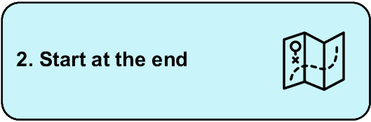
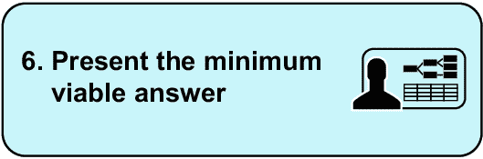
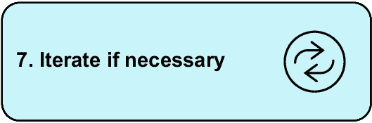
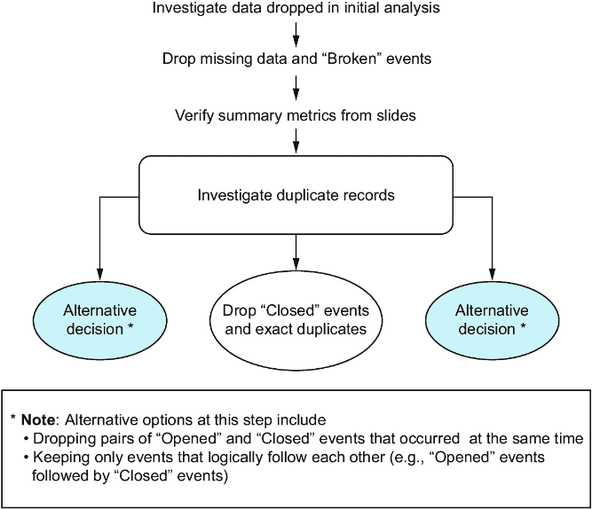
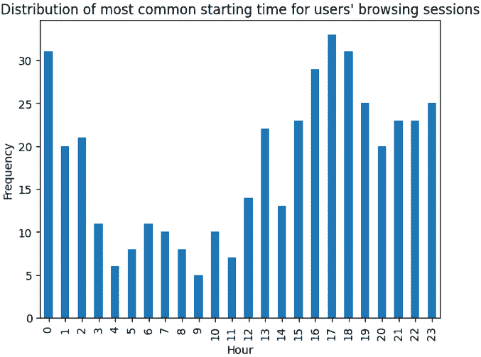

# 第十二章：12 在他人的工作中迭代：数据准备

### 本章涵盖

+   继续另一位分析师的工作

+   调查和验证现有分析

+   准备事件级别数据以适合用户级别分割

每个分析师在某个时候都需要继续他人的工作。这个人可能是几个月前的你。处理项目第二版的过程与从头开始是一样的。

因为我们将拥有这个新版本，即使别人已经做过，我们仍然需要理解问题、查看可用数据等等。在这个项目中，你将有机会练习接替他人。另一位分析师已经为利益相关者问题准备了一个最小可行答案，你将在此基础上进行迭代。

本章的具体主题是现实世界中也很常见的一个问题：分割。大多数企业都会提出类似“某些事物与其它事物有哪些相似之处？”的问题，而这个问题中的“事物”可以是任何东西，从产品到客户，甚至是一个完整的地理区域。

##### 真实业务案例：基于购买活动分割客户

用于分割客户的具体方法对于分割任何事物都很有用。例如，我参与的一个项目是识别在拍卖会上购买类似二手车的客户。有了买家相似性的概念，我们就能找到更多买家，并主动向他们推荐即将到来的拍卖。因为我们知道他们会购买类似的股票，所以能够邀请买家参加拍卖，这导致了更有效的对话，并使更多人关注我们拍卖的车辆。

找到相似实体的过程，我们在这里称之为“分割”，无论实体的类型如何，都是相同的。具体来说，在本章中，你将练习根据用户的 APP 使用活动将移动用户分组。你将使用事件级别数据，并继续另一位分析师已完成的项目迭代的工作。

## 12.1 寻找相似实体

分割问题出现在许多地方。典型的用例是根据人口统计或行为等特征找到彼此相似的客户。企业还可能希望将其产品目录应用于分割，以分类和简化其产品提供。

在每种情况下，结果都是对不同分割采取不同的行动。不同财务段的用户将被针对不同的银行产品。可能被分组到同一分割的产品可能被推荐给最终用户。推荐引擎大量使用用户和产品相似性的概念。

在机器学习中，细分或聚类是无监督学习的一个例子。这意味着，与监督预测问题不同，我们没有“真理”的例子，即实际客户细分来比较我们的结果。因此，我们衡量我们的细分好坏的能力是有限的。这些细分通常由人类专家主观评估。

##### 监督学习与无监督学习

在机器学习中，监督学习与无监督学习之间的区别在于我们是否有历史正确的预测例子来比较我们的模型预测。

如果我们根据房屋的特性预测房价，我们需要包含房屋特性和其售价的训练数据。这是*监督*学习，因为我们可以将我们的模型预测与实际值进行比较，从而监督我们的预测模型。

在*无监督*学习中，我们没有这样的过去例子。没有正确答案可以与之比较。相反，我们试图在

我们的数据，然后我们对其进行更主观的评价。客户细分恰好属于这个后者类别。

在任何相似性问题中，当我们决定我们的方法时，需要考虑某些因素：

+   当我们有了我们的组时，我们将采取什么行动？这是最重要的问题，因为它激励了整个项目。

+   在确定相似性时，哪些特征是重要的？我们是否关心住在同一地区或具有相似购买模式的人？

+   在相关的问题上，我们是否有冗余的特征？如果我们正在细分汽车，我们不想在千米和每小时英里数中包含它们的最高速度。一个变量来衡量一个特定的概念就足够了。

+   我们相信我们会找到多少组？我们可能没有确切的数字，但即使是一个大致的范围也会有所帮助。

+   我们将如何评估细分的结果？通常，这是在领域专家的帮助下完成的。

在这个项目中，除了这些因素外，我们还想有一个清单，列出如何继续前一位分析师的工作。

## 12.2 继续他人的工作

在我们继续他人工作的情境中，第一步应该是复制他们的发现，无论原始源代码是否可用。这样做的原因是

+   拥有我们自己的先前流程版本意味着我们可以更容易地对其进行更改。

+   重新创建他人的工作是为了检查错误，而不是为了责怪任何人，而是为了验证他们的步骤是否如他们所说的那样做了。

+   我们还想验证前一位分析师工作中存在的假设。他们可能做出了错误的假设，甚至可能做出了与我们不同的假设。明确这些假设可以让每个人都很清楚。

+   复制工作使我们能够更好地理解项目的细节、局限性以及可能的进一步步骤。简要查看他人的工作并不等同于亲自深入其中。

如果我们在开始工作之前考虑这些因素，并结合我们的以结果为导向的方法，我们将为项目的成功做好充分准备。

##### 与他人协作

在这个项目中，您通过继续另一位分析师的工作间接地与另一位分析师协作。您不总是项目中的唯一分析师；有时您需要与其他分析师共享工作。成为一名有效的协作者意味着

+   与其他技术同事沟通您的工作

+   将最佳实践应用于您的工作中，使您的代码更容易使用

+   不断寻找改进和学习的方法

为了磨练这些技能，您可以参与开源项目或花时间研究他人的工作。

现在让我们看看这一章的项目。

## 12.3 项目 8：从移动活动中发现客户细分

在这个项目中，我们将研究手机活动以识别相似客户群体。我们将审查问题陈述、可用数据、项目交付成果以及您尝试项目所需的工具。

数据已可供您在[`davidasboth.com/book-code`](https://davidasboth.com/book-code)自行尝试项目。您将找到可用于项目的文件，包括我们将在此基础上构建的前分析师的工作，以及以 Jupyter 笔记本形式的示例解决方案。

### 12.3.1 问题陈述

您在 AppEcho Insights 工作，这是一家专注于移动用户行为的分析公司。他们分析用户如何使用手机，并向手机制造商和应用程序开发者提供见解。他们的最新举措是客户细分。他们想了解是否存在行为相似的用户群体。了解这些用户细分对他们的客户来说将非常有用，因为他们的客户可以用不同的举措针对整个用户群体。例如，他们可以向休闲用户推广生产力技巧，向重度用户提供延长电池寿命的见解。

前一位分析师已经对用户群体进行了基本的细分，并向利益相关者展示了他们的发现。不幸的是，他们之后离开了公司，并且他们的代码丢失了。您的经理要求您使用第一版分析的结果作为起点，进行第二次分析。

第一版本的结论是，可以根据用户使用的应用数量和浏览会话的平均长度对客户进行细分。分析师提出了六个独特的客户类别，并为他们分配了角色，例如“休闲用户”和“高级用户”。你的利益相关者希望第二版本的细分更加复杂，并包含更多特征。他们希望关注以下方面：

+   人们使用的应用类型。例如，一些客户是否比其他人更频繁地使用社交媒体应用？

+   观察时间模式。用户是否喜欢在一天中的不同时间浏览他们的手机？

+   可能需要使用更合适的分段方法（例如，可以基于多个维度对用户进行分组的算法）。

他们已经为你提供了移动事件数据集和初始分析师提供的演示文稿。数据集包括单个移动事件，例如用户打开或关闭移动应用。列数不多，但可以提取丰富的行为信息。事件都有时间戳，因此时间元素也可以进行分析。有关处理时间数据的更多详细信息，请参阅第八章和第九章。

备注  数据最初来自[`github.com/aliannejadi/LSApp`](https://github.com/aliannejadi/LSApp)。感谢 Mohammad Aliannejadi 允许使用数据。 

数据和演示文稿文件都在补充材料中。你的任务是审查分析师的工作，并继续项目以回答利益相关者的问题。

### 12.3.2 数据字典

总是，一个关键的初始步骤是查看可用的数据。表 12.1 显示了数据字典。

##### 表 12.1 数据字典

| 列 | 定义 |
| --- | --- |
| 用户 ID | 一个用户的唯一标识符。 |
| 会话 ID | 唯一标识用户的会话活动。 |
| 时间戳 | 单个事件的日期和时间。 |
| 应用名称 | 正在使用中的应用名称。 |
| 事件类型 | 发生的事件类型。值可以是以下之一：“打开”、“关闭”、“用户交互”或“损坏”。 |

现在我们已经看到了可用的数据，让我们看看这个项目的成果。

### 12.3.3 预期成果

我们的利益相关者希望进行更深入的分析，并基于更多维度创建客户细分。我们的解决方案应包括对初始分析的重新创建以及我们的改进。最终输出是我们用户细分的定义，即哪些因素描述了每个细分，哪些用户属于哪个组。

### 12.3.4 必需工具

在示例解决方案中，我使用 Python 和`pandas`库进行数据探索，`matplotlib`进行可视化，以及`scikit-learn`进行聚类。为了完成这个项目，你需要一个能够

+   从 CSV 或类似文件加载数据集

+   执行基本数据操作任务，如排序、分组和重塑数据

+   创建数据可视化

+   执行分割（例如，使用聚类算法）

您可以选择手动执行分割，这意味着决定哪些维度的值组成组。然而，在两个或三个维度之后，手动执行变得越来越困难，这就是为什么我建议选择一个可以应用相关算法的工具。

现在让我们看看我们如何可能使用我们的以结果为导向的框架逐步解决这个问题。

## 12.4 将以结果为导向的方法应用于创建客户细分第二迭代

让我们看看以结果为导向的解决方案，并制定我们的行动计划。


问题陈述是清晰的：将用户分配到不同的细分市场。除此之外，我们还需要了解前一位分析师已经完成的工作。只有这样，我们才能确切地了解我们的任务是什么。重现分析师的工作也是至关重要的。首先，我们需要确保我们可以复制他们的结果并验证他们的假设，但在这个案例中，我们还需要有代码可用，因为原始代码已经丢失。



从末尾开始，在这种情况下，意味着回答第 12.1 节中提出的问题。应该有多少个组？根据我们的利益相关者想要如何使用输出结果，哪种类型的组是有意义的？他们希望能够针对不同的用户群体提供不同的产品，因此我们在评估用户群体时应该考虑到这一点。


在这个实例中，数据已经被为我们识别出来。然而，我们也应该考虑如何增强这些数据。我们能否从数据中提取更多信息，或者是否有外部数据源我们可以将其合并？


数据已经以原始形式为我们下载。然而，我们仍然可以增强它。在示例解决方案中，我们将回顾一些增强的想法。


分割过程与大多数数据分析问题相似：

+   我们将首先探索数据，寻找缺失和错误的数据值、异常值等。

+   接下来，我们将调查我们的记录在哪些特征上有所变化。也就是说，某些特征的变化是否比其他特征更大？如果所有客户都居住在同一个地理区域内，那么就没有必要将地理作为分割客户的一个维度。

+   我们还希望沿着不同的维度可视化我们的数据，以期发现明显的组。在大型、复杂的数据集中，这不太可能发生，但我们可能会发现异常值组，例如一些客户的花费远高于其他人。

+   最后两个步骤是分割问题的独特之处。首先，我们将选择要分割的维度并应用聚类算法。存在不同的算法适用于不同的用例，其中一些在示例解决方案中进行了讨论。

+   然后，我们将评估结果。我们将通过分析这些组来查看它们是否在意义上彼此不同。一种方法是为每个组分配组标签或角色。如果我们能给出每个组的独特描述，结果将比我们创建了具有相同特征的多组更有用。

此步骤将在我们为每个用户分配资源后完成，也就是说，我们知道他们属于我们新创建的哪些组。



上一次迭代的演示文稿是一个简短的幻灯片集。我们可以考虑创建一个类似的演示文稿作为输出。至少，我们应该有所有相同的成分在手：最终组的列表、每个组中的用户数量以及描述每个组的特征。



由于这将是我们项目的第二次迭代，我们应该向我们的利益相关者提出建议，关于我们版本完成后可能采取的额外步骤。显然，这是一个重要的公司倡议，如果我们利益相关者决定分配更多资源，我们可以通过提供进一步工作的建议来支持它。

## 12.5 示例解决方案：创建客户细分

现在，让我们通过一个示例解决方案来了解整个过程。一如既往，我强烈建议您首先尝试自己完成这个项目。

至于行动计划，首先，我们将尝试重新创建初始分析。接下来，我们将调查我们的利益相关者请求的附加功能，最后将我们的客户分组到新的细分市场并分析这些组。

### 12.5.1 重新创建他人的分析

在本部分的第一部分，我们将回顾前一位分析师展示的幻灯片，并尝试复制他们的发现。幻灯片 4 包含一些汇总指标，这是我们应从哪里开始的地方。图 12.1 显示了相关的幻灯片。


##### 图 12.1 原始演示文稿中的幻灯片 4，显示了汇总指标

我们的首要任务是验证我们能否重新创建这些指标。

#### 验证报告的指标

首先，我们将使用以下代码读取数据，并在图 12.2 中展示行预览。请注意，数据格式为.tsv，意味着值由制表符分隔，而不是逗号：

```py
import pandas as pd
import matplotlib.pyplot as plt

app_data = pd.read_csv(
    "./data/lsapp.tsv.gz",
    sep="\t",      #1
    names=["user_id", "session_id", "timestamp",
           "app_name", "event_type"],     #2
    parse_dates=["timestamp"],      #3
    skiprows=1     #4
)
print(app_data.shape)
app_data.head()
```

#1 指定分隔符为制表符

#2 给数据指定特定的列名

#3 明确将时间戳列转换为日期类型

#4 忽略原始列标题，因为我们提供了自己的


##### 图 12.2 原始数据的快照

代码的输出告诉我们有超过三百万行数据，快照告诉我们每行对应一个应用事件，即用户打开或关闭应用时。现在，让我们调查附录幻灯片上的声明，该声明称丢失的数据和标记为损坏的事件已被删除。相关的幻灯片如图 12.3 所示。


##### 图 12.3 幻灯片附录中相关的部分，显示了额外的数据清理步骤

为了调查这些额外的数据清理步骤，以下代码调查缺失数据，并在图 12.4 中产生输出：

```py
app_data.isnull().sum()
```


##### 图 12.4 查询缺失数据的结果

此图显示每个列中都有一个缺失值。无论这些缺失值是否在同一记录中，都可以安全地删除缺失数据，因为它只占我们数据集的一小部分：

```py
app_data = app_data.dropna()
```

图 12.2 也显示，用户 ID 和会话 ID，通常应该是整数，被当作十进制值处理。这是因为我所使用的`pandas`库版本没有可空整数类型。将此列转换为整数不是至关重要，但我们仍会这样做以明确表示并避免任何混淆。图 12.5 验证了所有列都有正确的数据类型：

```py
app_data["user_id"] = app_data["user_id"].astype(int)
app_data["session_id"] = app_data["session_id"].astype(int)

app_data.dtypes
```


##### 图 12.5 我们数据集中的修正数据类型

在验证幻灯片上的摘要指标之前，让我们调查根据附录，被删除的“损坏”事件类型。以下代码查看事件类型的分布，作为整个数据的百分比，结果如图 12.6 所示：

```py
app_data["event_type"].value_counts(normalize=True)
```


##### 图 12.6 每个事件类型的百分比分解

此图告诉我们，我们数据中只有 0.1%是“损坏”事件。我们没有太多关于这代表什么的信息，所以我们同意初始分析，并使用以下代码删除这些记录。

```py
app_data = app_data[app_data["event_type"] != "Broken"]
```

在我们继续之前，让我们开始构建我们正在遵循的过程图。图 12.7 显示了我们所做的一切以及分析可能发生分歧的地方。


##### 图 12.7 重新创建初始分析的第一步

现在，让我们验证根据图 12.1 中“数据集概览”幻灯片，我们有 292 个用户，87 个独特应用程序，跨越八个月的事件，以及三种不同的事件类型。首先，我们验证用户数量：

```py
app_data["user_id"].nunique()
```

此代码返回预期的 292。现在，我们验证不同应用程序的数量：

```py
app_data["app_name"].nunique()
```

再次，我们得到了预期的 87。现在，让我们看看我们数据中的日期范围：

```py
app_data["timestamp"].agg(["min", "max"])
```

输出告诉我们数据跨度为 2017 年 9 月至 2018 年 5 月，大约八个月，正如幻灯片上所述。我们还知道有三个事件类型，因为我们最初调查时是四个，我们完全删除了一个。下一步是重新创建幻灯片中图表背后的部分基础数据。

首先，有一张幻灯片显示了每个用户的会话数量，如图 12.8 所示。


##### 图 12.8 原始演示文稿中的一张幻灯片，显示了每个用户的会话数量分布

每个用户的会话数量似乎是一个有用的指标来计算，因为它是一个用户活跃度的代理。为此，我们将创建一个 DataFrame，其中对于每个用户，我们计算他们在数据中拥有的唯一会话数量。然后我们将探索这个指标的分布。以下代码创建了此 DataFrame，其描述性统计结果如图 12.9 所示：

```py
sessions_per_user = (
    app_data
    .groupby("user_id")
    ["session_id"]
    .nunique()    
)

sessions_per_user.describe()
```


##### 图 12.9 每个用户的会话数量描述性统计

这告诉我们，每个用户的会话中位数是 95，但有些用户只有一次会话，而有些用户超过 5,000 次。让我们通过可视化分布来更好地理解数据的分布和集中情况。以下代码创建了图 12.10 所示的直方图：

```py
fig, axis = plt.subplots()

sessions_per_user.hist(bins=20, ax=axis)

axis.set(
    title="Sessions per user",
    xlabel="Number of sessions",
    ylabel="Frequency"
)

plt.show()
```


##### 图 12.10 每个用户的会话数量分布

如我们从描述性统计中可能预期的，分布告诉我们大多数用户会话很少，但有一个长尾延伸到拥有数千次会话的用户。初步分析没有提到这些多产用户的情况，所以让我们调查他们。在我们这样做之前，让我们更新我们的图表来记录到目前为止的过程。图 12.11 显示了最新版本。


##### 图 12.11 我们迄今为止采取的步骤

从这个点开始，我们将超越幻灯片上展示的结果，进入我们自己的分析。现在让我们看看具有最高会话数量的用户的数据。以下代码找到了具有最多会话的用户，输出结果如图 12.12 所示：

```py
sessions_per_user.sort_values(ascending=False).head(5)
```


##### 图 12.12 最具独特会话的用户

以下代码提取了具有最多会话的用户（用户 138）的原始数据。他们的数据快照如图 12.13 所示：

```py
app_data[app_data["user_id"] == 138].head(10)
```


##### 图 12.13 具有最多会话的用户活动快照

看起来这个用户的数据从大约早上 5:30 开始使用各种应用。这个数据的一个明显方面是它从一个“打开”事件开始，紧接着是一个“关闭”事件，然后是另一个“打开”事件，所有这些事件都是针对同一应用的。这个信息是相关的还是冗余的？在图 12.13 的例子中，我们有一些精确重复，即第一行和第三行。让我们看看这个问题有多大。

#### 调查重复事件记录

以下代码计算了精确重复记录的比例：

```py
app_data.duplicated().sum() / len(app_data)
```

输出结果是 0.597，这意味着我们近 60%的数据是另一行的精确重复。这意味着具有相同用户 ID、相同会话 ID 和相同事件类型在相同时间发生同一应用的记录。

这个结果可能需要大量工作来调查和澄清，所以在我们做任何事情之前，让我们考虑一下重复项是否是我们想要进行的特定分析的问题。我们感兴趣的是

+   人们使用哪些类型的应用？如果我们计算每个用户独特的应用数量，重复记录就不会成为问题。

+   人们何时使用他们的手机？不幸的是，由于可能在不同时间有更多重复记录，重复记录会导致结果偏差，我们可能会无意中夸大一天中某些部分相对于其他部分。

因此，我们不能忽视存在重复记录的事实。我们需要权衡我们的可能选项：

+   我们可以简单地删除重复记录。如果我们对图 12.13 中的示例这样做会发生什么？我们会得到一个“打开”事件后面跟着两个“关闭”事件。由于“关闭”事件发生在不同时间，它们不会是重复的。删除完全重复的记录过于基础，并可能引起其他问题。

+   另一个选择是删除同时发生的“打开”和“关闭”事件对。然而，这假设“打开”事件总是有一个相应的“关闭”事件，这在实践中可能并不成立。

+   我们也可以从不同的角度思考这个问题。目前，我们并不对单个事件级别感兴趣，而是要总结用户级别的行为。这意味着我们可以认为“关闭”事件信息量较小。如果一个用户在浏览会话中打开了五个应用，即使没有“关闭”事件，我们也会知道这一点。

“关闭”事件信息上冗余的想法非常吸引人，所以我们采用这种方法。以下代码删除了“关闭”事件，并计算了我们删除的记录百分比以及剩余数据中完全重复记录的百分比：

```py
closed_dropped = app_data.loc[app_data["event_type"] != "Closed", :]

print(len(closed_dropped))
print(len(closed_dropped) / len(app_data))
print(closed_dropped.duplicated().sum() / len(closed_dropped))
```

这三个命令的输出分别是 1,987,090，0.54 和 0.599。这意味着我们剩余的记录数接近两百万，而最初有 370 万条记录，大约是原始数据的一半。这也告诉我们，我们仍有近 60%的完全重复记录。现在，对于我们的目的来说，完全重复是完全没有必要的，因此我们也可以删除这些记录。以下代码执行此操作，并计算我们剩余的数据量：

```py
app_data_reduced = closed_dropped.drop_duplicates()
len(app_data_reduced)
```

我们最终剩下不到 80 万条记录。在分析过程中删除如此多的数据是不寻常的，但在这个案例中，这是有道理的。图 12.14 显示了至今为止的过程，包括我们刚刚做出的选择。



##### 图 12.14 至今为止的过程，包括处理重复数据的决策

经过清理了大量重复数据后，让我们重新审视我们的数据。以下代码检查了前几行，如图 12.15 所示：

```py
app_data_reduced.head(10)
```


##### 图 12.15 移除重复记录后的示例事件

这个最新的图显示了一个新的挑战。有用户连续打开扫雷游戏的实例，有时间隔只有几秒钟。这可能意味着什么？

+   用户是否一直在改变他们是否想要玩游戏的想法？

+   用户是否尝试打开应用，但它不断崩溃？

+   这些是数据收集/整理过程中的问题吗？

我们需要更多信息才能确定。

#### 处理相关的事件记录对

按现状，我们必须就如何处理这类重复问题做出选择：

+   我们可以假设与一个应用相关的多个重复事件实际上是用户使用该应用的单一实例。在数据中，某人打开扫雷 10 次之后打开另一个应用的情况下，我们可以将其视为 2 个事件而不是 11 个。

+   我们可以查看同一应用交互之间的时间差，并移除过短的交互。这需要我们严格定义“过短”，这是一个强烈的内置假设。

+   我们也可以完全忽略这个问题。再次强调，我们感兴趣的是用户级和会话级指标，而不是单个事件级指标。如果我们通过会话开始和结束的时间差来定义用户会话的长度，那么用户以某种方式与手机交互期间发生的事情并不重要。

以结果为导向思考这个问题，我们可以回答利益相关者关于应用类型和用户浏览时间的问题，而无需明确处理用户快速连续打开和关闭应用的情况。由于我们做出了另一个选择，我们将它添加到我们的图中，最新的版本如图 12.16 所示。


##### 图 12.16 调查各种重复事件后的最新进展

现在我们已经处理了重复问题，可以重新创建与每个用户的平均会话长度相关的图表，如图 12.17 所示。


##### 图 12.17 原始演示文稿中显示用户平均会话长度分布的幻灯片

为了重新创建这个图表，我们需要创建一个包含单个会话及其长度的 DataFrame。首先，我们需要确定会话 ID 是否对用户是唯一的。如果会话 1 只能与用户 0 相关联，我们就可以简单地按会话 ID 分组；否则，我们必须包含用户 ID 以区分两个不同用户的会话，这两个会话的 ID 都是 1。以下代码查找属于多个用户的会话 ID：

```py
(
    app_data_reduced
    .groupby("session_id")
    ["user_id"]
    .nunique()
    .loc[lambda x: x > 1]
)
```

此代码的输出是一个空的`pandas` `Series`，这意味着没有会话 ID 跨越多个用户。因此，会话 ID 对用户是唯一的。现在，我们可以创建所需的会话 DataFrame。以下代码执行此操作，并生成 DataFrame，如图 12.18 所示预览：

```py
sessions = (
    app_data_reduced
    .groupby(["user_id", "session_id"])
    .agg(start=("timestamp", "min"),
         end=("timestamp", "max"))
    .reset_index()
    .assign(
        duration_mins=lambda _df: (_df["end"] - _df["start"]).dt.seconds/60
    )
)

sessions.head()
```


##### 图 12.18 用户会话及其持续时间的快照（以分钟为单位）

这个 DataFrame 每行包含一个用户会话，因此按用户 ID 分组并计算会话平均时长，可以得到制作幻灯片图表所需的数据。以下代码执行此操作，并生成图 12.19 所示的图表：

```py
fig, axis = plt.subplots()

avg_session_by_user = (
    sessions
    .groupby("user_id")
    ["duration_mins"]
    .median()
)

(
    avg_session_by_user
    .hist(bins=20, ax=axis)
)

axis.set(
    title="Distribution of users' average session length \
(one data point = 1 user)",
    xlabel="Session duration (minutes)",
    ylabel="Frequency"
)

plt.show()
```


##### 图 12.19 用户平均会话长度的分布

这个结果告诉我们，大多数用户的会话时间不到 2 分钟，但有一个长尾。有些会话甚至超过 10 分钟。你可能注意到，这个图表与幻灯片中的图表并不完全一致，如图 12.17 和 12.19 之间的差异所示。这是因为我们选择删除“关闭”事件，因此已经与初始分析有所不同。这没关系，因为我们正在做出不同的假设，从而得出不同的结论。

如果有会话以“关闭”事件结束，我们的特定方法可能会稍微扭曲结果，因为我们低估了这些会话的时长。然而，由于我们的主要目标是观察人们在会话中使用了哪些类型的应用程序以及这些会话发生的时间，因此最初的“打开”事件就足够了。

我们已经重新创建了原始分析的相关部分，但在继续回答利益相关者的问题之前，让我们回顾一下这个过程。最新的图表如图 12.20 所示。


##### 图 12.20 重新生成原始分析的过程

让我们继续分析的下一段，回答我们的利益相关者关于用户的新问题。

### 12.5.2 分析事件数据以了解客户行为

现在我们已经验证了原始分析的结果，我们可以继续回答利益相关者的新问题。第一个问题是关于人们何时使用手机，以及这是否会成为聚类的有用维度。

#### 分析时间戳以了解浏览行为

为了调查人们何时使用手机，我们需要一个定义，即“使用时间”的定义。也就是说，我们关心每个数据点发生的时间吗？可能不是，因为时间上紧密相连的一组“打开”和“关闭”事件应该算作一个用户在那个时间使用手机的例子。

这意味着我们可以使用之前创建的会话级 DataFrame 中的开始时间。以下代码创建了一个列来提取日期的小时部分，这样我们就可以隔离浏览开始的那个小时。然后，我们绘制了这些“开始小时”的分布，结果如图 12.21 所示：

```py
sessions["hour"] = sessions["start"].dt.hour

(
    sessions["hour"]
    .value_counts()
    .sort_index()
    .plot(kind="bar")
)
```


##### 图 12.21 用户开始浏览会话的时间分布

这个图表告诉我们，大多数浏览会话在傍晚/晚上开始，在一天早些时候有所下降。但它没有告诉我们是否有用户的行为与这个总体趋势不同。为了做到这一点，我们需要计算每个用户最常见的开始小时或一天中的哪个部分。

注释：在本节中，我们将探讨数据的时序方面。如果你对处理时间序列数据的更多示例感兴趣，请参阅第八章和第九章。

让我们现在计算每个用户最常开始的小时。我们可以使用统计众数来做这件事，它简单地返回最常出现的值。然而，我们需要决定如果出现平局怎么办。如果某人的最常见浏览时间是早上 8 点和下午 5 点怎么办？没有理由偏好其中一个，所以我们将保留两个值。因此，该用户将被表示两次，这可能会通过过度代表某些用户来扭曲结果，但也会保留有价值的信息。

以下代码定义了一个函数，用于返回每个用户可能的多重众数值，并将其应用于 DataFrame。结果 DataFrame 的快照如图 12.22 所示：

```py
def get_modes(group):
    mode_hours = group['hour'].mode()     #1
    return pd.DataFrame(
        {
            'user_id': group['user_id'].iloc[0],
            'most_frequent_hour': mode_hours
        }
    )

most_frequent_hours = (
    sessions
    .groupby("user_id")
    .apply(get_modes)     #2
    .rename(columns={"user_id": "duplicate_user_id"})
    .reset_index()
    .drop(columns=["level_1", "duplicate_user_id"])     #3
)

most_frequent_hours.head()
```

#1 计算众数，可能返回多个值

#2 应用此函数并提取所有最常开始的小时

#3 清理由分组和聚合创建的不必要列


##### 图 12.22 用户浏览会话最常见开始时间的快照

如图 12.22 所示，有用户有多个最频繁的开始时间的情况，例如用户 0，他们在下午 4 点和晚上 10 点浏览的频率相同。从这些数据中，我们现在可以查看新创建的`most_frequent_hour`列的分布，以了解是否有用户更喜欢一天中的不同时间使用他们的手机。以下代码调查了这一点，并生成了图 12.23 中的图表：

```py
fig, axis = plt.subplots()

(
    most_frequent_hours
    ["most_frequent_hour"]
    .value_counts()
    .sort_index()
    .plot
    .bar(ax=axis)
)

axis.set(
    title="Distribution of most common starting time
↪ for users' browsing sessions",
    xlabel="Hour",
    ylabel="Frequency"
)

plt.show()
```



##### 图 12.23 用户最常见浏览时间的分布

这个图表告诉我们，有不同群体的用户更喜欢在早上 6 点左右、中午 1 点左右或晚上 5 点左右浏览，还有一个高峰在午夜开始。

在我们决定如何在我们用户分割中使用这些信息之前，让我们将这个信息添加到我们不断增长的图表中，该图表如图 12.24 所示。


##### 图 12.24 过程图，包括分析第二部分的开头

我们可以使用图 12.22 中显示的数据作为我们分割的一个维度，即用户实际最常开始浏览的小时。然而，会有两个问题：

+   一些用户可能有多个行，这在分割问题中可能不起作用。

+   一天中的某些小时非常相似，也就是说，用户在下午 4 点或 5 点开始浏览没有区别。

我们想要找到不同的用户群体，这样我们就可以将这些相似的时间分组在一起。我们本可以在一开始就做这件事，即把一天的不同时间段分组为“早上”、“中午”等等，并调查这些类别的分布。然而，我们会做出关于哪些小时在移动使用方面相似的假设。通过首先查看个别小时的分布，我们可以创建与我们在数据中找到的非常接近的组。

#### 根据浏览模式创建客户标签

观察图 12.23 中的图表，我们可以得出结论，有两个到五个“峰值”，这些可以作为一天中的不同部分。使用多少个类别的选择将有些主观。让我们选择四个类别，因为这可能最适合数据，而不会在后续创建太多的用户细分。我们的群体将是

+   夜猫子，通常在晚上 9 点到凌晨 3 点（含）之间浏览

+   早晨用户，通常在凌晨 4 点到上午 9 点（含）之间浏览

+   中午用户，通常在上午 10 点到下午 2 点（含）之间浏览

+   晚间用户，通常在下午 3 点到晚上 8 点（含）之间浏览

让我们创建这些群体并调查每个群体中有多少用户。以下代码进行分类并在图 12.25 中生成输出：

```py
bins = [-1, 3, 9, 14, 20]
labels = ['night_owl', 'early_morning_browser',
          'midday_browser', 'late_day_browser']

most_frequent_hours["category"] = (
    pd.cut(
        most_frequent_hours["most_frequent_hour"],
        bins=bins,
        labels=labels,
        ordered=True
    )
)

most_frequent_hours.loc[
↪ most_frequent_hours["most_frequent_hour"].isin([21, 22, 23]),
↪ "category"] = "night_owl"   #1

most_frequent_hours.head()
```

#1 修复了额外的夜猫子值


##### 图 12.25 将用户最常浏览的时间分组为四个类别

现在，我们可以调查这些群体的成员资格。以下代码计算分布并生成图 12.26 所示的输出。

```py
(
    most_frequent_hours["category"]
    .value_counts()
    .sort_index()
)
```


##### 图 12.26 用户浏览会话类别的分布

现在让我们使用这个数据集来创建这些类别的 one-hot 编码表示，即一个二进制列来指示每个类别的成员资格。关键的是，一个用户可以属于多个类别，如图 12.25 所示。更多实践中的例子请见第六章。以下代码创建 one-hot 编码并生成用户级别数据集的开始部分，我们将使用它进行细分。这个新数据集的快照如图 12.27 所示：

```py
users = (
    pd.get_dummies(      #1
        most_frequent_hours.drop(columns=["most_frequent_hour"]),
        columns=["category"],
        prefix="time"
    )
    .groupby("user_id")
    .max()
    .reset_index()
)

users.head()
```

#1 get_dummies 创建了 one-hot 编码的列。


##### 图 12.27 用户级别的数据快照，显示用户属于哪些浏览时间类别

我们现在创建了一个可以添加额外列并运行细分算法的数据集。在我们继续下一个利益相关者问题之前，即人们使用哪些类型的应用程序，让我们更新到目前为止完成的工作的图表。最新版本如图 12.28 所示。


##### 图 12.28 到目前为止的过程，包括根据浏览时间将人们分组到类别中

我们现在可以继续我们的下一个利益相关者问题，即人们使用哪些类型的应用程序。

#### 使用人工智能进行数据标注

我们的利益相关者希望我们调查人们使用哪些类型的应用程序，并可能使用这些信息进行细分。然而，我们没有关于应用程序类型的直接数据，只有应用程序名称的列表。这是一个明显的例子，原始数据中包含的信息比我们最初想象的要多。领域专家可以轻松地将每个应用程序名称分类到更广泛的类别中。这是一个非常适合使用人工智能来增强我们工作的用例。

有超过 80 个不同的应用名称需要分类。手动操作虽然可行但很重复，所以让我们请一个 AI 来帮忙。我们可以使用以下代码片段来获取应用名称列表，然后传递给 AI 工具：

```py
print(app_data_reduced["app_name"].unique())
```

以下提示，要求 ChatGPT 为我们分类应用名称，生成了图 12.29 所示的输出。

> 我将提供一个移动应用名称列表。尽你所能，将它们分组到逻辑类别中，例如，电子邮件、社交媒体、网络浏览器、移动游戏等。我希望以包含列*'app_name'*和*'category'*的表格形式得到响应。如果你不确定一个应用属于哪个类别，请填写“未知。”以下是应用名称列表：<app names follow>。


##### 图 12.29 ChatGPT 对将应用名称分类到更广泛类别的一部分响应

注意：重要的是要注意，这些工具并不总是对相同的提示产生相同的输出。它们也在不断进化，所以你几乎肯定会得到与我相同的提示不同的输出。这是分析过程的一个特性，而不是一个错误。

一旦我们对输出满意，我们可以特别请求以 CSV 文件形式的数据，并将其合并到我们自己的数据中。以下代码实现了这一点，并在图 12.30 中展示了快照：

```py
categories = pd.read_csv("./data/App_Categories.csv",
                         skiprows=1,
                         names=["app_name", "app_category"])
print(categories.shape)
categories.head()
```


##### 图 12.30 ChatGPT 生成的分类数据快照

让我们将这个最新的步骤添加到我们的流程图中，最新的版本如图 12.31 所示。


##### 图 12.31 我们步骤的最新图示，包括 ChatGPT 对应用分类

让我们现在看看这个类别数据的分布。以下代码计算了这一点，并在图 12.32 中产生了输出：

```py
categories["app_category"].value_counts()
```


##### 图 12.32 新创建的应用类别分布

在这里有几个需要注意的事项。一是存在一些“未知”值，我们应该调查并手动分类。二是分类很多，可能太多以至于没有实际用途。首先，让我们解决“未知”值的问题。以下代码调查了这些值，并在图 12.33 中展示：

```py
categories[categories["app_category"] == "Unknown"]
```


##### 图 12.33 ChatGPT 无法分类的应用名称

我们可以通过一些研究和一些代码片段手动对这些应用名称进行分类。以下代码更新了这些特定应用名称的分类：

```py
categories.loc[categories["app_name"]=="MUIQ Survey App", "app_category"]
↪ = "Survey"
categories.loc[categories["app_name"]=="SurveyCow", "app_category"]
↪ = "Survey"
categories.loc[categories["app_name"]=="Reward Stash", "app_category"]
↪ = "Rewards"
categories.loc[categories["app_name"]=="Movie Play Box", "app_category"]
↪ = "Video Streaming"
categories.loc[categories["app_name"]=="MetroZone", "app_category"]
↪ = "Utility"
```

现在，让我们处理第二个问题，即 ChatGPT 创建了太多的类别。我们可以选择要求 ChatGPT 修订其分类并请求更少的列，或者我们可以使用 ChatGPT 的类别作为子类别，并自己定义主类别。这是一个个人选择，但这不应该花费太多时间，这样我们就有分类代码了，如果以后决定更改类别的话。

#### 审查 AI 创建的数据标签

一个`pandas`技巧是使用`map`方法根据字典将类别映射到新的类别。我们不想自己输入这个字典，但我们可以编写一些代码来以所需格式打印类别，然后将它们复制并粘贴到我们的主要映射代码中。以下代码以正确的格式打印现有类别，并在旁边留出空间用于新类别。输出显示在图 12.34 中，因此您可以看到它如何粘贴以创建稍后跟随的代码片段：

```py
for category in sorted(categories["app_category"].unique()):
    print(f"'{category}': '',")
```


##### 图 12.34 我们所需的 Python 字典格式的类别

现在，我们可以使用这个输出创建以下代码，该代码将更新每个现有类别及其新的分类。我们将保留现有的类别列作为子类别，因此我们有应用类别层次结构的两个级别。图 12.35 显示了这些更新后的类别数据集的快照。

```py
categories = categories.rename(columns={"app_category": "app_subcategory"})

category_map = {
    'Advertising': 'Money',
    'App Marketplace': 'Entertainment',
    'Cloud Storage': 'Utility',
    'Communication': 'Social',
    'Email': 'Social',
    'Finance': 'Money',
    'Health': 'Social',
    'Messaging': 'Social',
    'Mobile Games': 'Entertainment',
    'Music Streaming': 'Entertainment',
    'Navigation': 'Utility',
    'News': 'Social',
    'Note Taking': 'Utility',
    'Online Shopping': 'Money',
    'Photo Editing': 'Utility',
    'Photo Management': 'Utility',
    'Podcasts': 'Entertainment',
    'Productivity': 'Utility',
    'Rewards': 'Money',
    'Social Media': 'Social',
    'Social Media/Messaging': 'Social',
    'Survey': 'Money',
    'Utility': 'Utility',
    'Video Streaming': 'Entertainment',
    'Web Browser': 'Browsing',
    'Web Browser/Search Engine': 'Browsing'
}

categories["app_category"]
↪ = categories["app_subcategory"].map(category_map)
categories.head()
```


##### 图 12.35 应用类别数据应用新分类后的快照

在我们将这些合并回主要应用数据之前，让我们通过更新我们的流程图来回顾我们的过程。最新版本显示在图 12.36 中。


##### 图 12.36 最新流程，包括对 ChatGPT 分类的回顾

现在，是时候将这些类别合并回我们的原始数据，看看人们如何使用这些各种应用类型了。以下代码将事件级应用数据与应用类别合并，创建合并数据，图 12.37 显示了其快照。

```py
app_data_merged = app_data_reduced.merge(
    categories,
    on="app_name")
assert len(app_data_reduced) ==  len(app_data_merged)      #1
app_data_merged.head()
```

#1 如果合并后我们没有相同数量的行，将引发错误信息


##### 图 12.37 应用数据与应用类别合并后的快照

从这些数据中，我们希望找到每个用户最常用的应用类别。之后，我们将调查是否存在平局，即拥有多个类别作为最常用类别的用户。

#### 分析新创建的类别标签

以下代码计算每个用户的顶级类别，并在图 12.38 中显示了输出快照。请注意，`pandas`创建了一个名为`level_1`的列，因为`mode`函数可以返回多个值，就像我们在查看应用使用时间时做的那样：

```py
top_categories = (
    app_data_merged
    .groupby("user_id")
    ["app_category"]
    .apply(pd.Series.mode)
    .reset_index()
)

top_categories.head()
```


##### 图 12.38 “每个用户最常用类别”数据集的快照

从这些数据中，我们可以调查是否存在用户将多个类别作为他们最常用的类别。我们可以使用`pandas`创建的`level_1`列来过滤我们的数据。任何值为零的项意味着用户的顶级类别，因此大于零的值意味着用户有多个顶级类别。以下代码调查了这一点，并在图 12.39 中产生了输出：

```py
top_categories[top_categories["level_1"] > 0]
```


##### 图 12.39 拥有多个顶级应用类别的用户

让我们更详细地检查这些用户，看看我们是否可以决定如何继续。以下代码检索这些用户的全部记录，并在图 12.40 中生成输出：

```py
top_categories[top_categories["user_id"].isin([35, 223, 132])]
```


##### 图 12.40 拥有多个顶级类别的用户的所有类别数据

我们可以为每个用户删除一个类别，或者以与我们处理应用程序时间相同的方式记录我们的数据，即用户可以拥有多个顶级类别。在这种情况下，只有三个受影响的用户，我们将调查是否可以删除他们的一个顶级类别。我们如何决定删除哪两个类别？让我们首先查看 ID 为 35 的用户的底层数据。以下代码检索该用户的单个应用程序级别的数据，然后显示在图 12.41 中：

```py
(
    app_data_merged[app_data_merged["user_id"] == 35]
    .groupby(["app_category", "app_name"])
    .size()
)
```


##### 图 12.41 用户 35 的按类别和应用程序名称的应用程序使用情况

这个用户非常频繁地使用设置应用程序，这导致了对于他们来说“实用”类别是并列的顶级类别。我们没有更多关于为什么这个用户持续打开他们的手机设置的原因的详细信息。我们可以使用我们所拥有的信息来决定用户最频繁使用“社交”应用程序是否更相关。我们将删除这个用户必要的记录，使其“社交”成为他们唯一的顶级类别。用户 132 也将“实用”作为他们的并列顶级类别，因此出于同样的原因，我们将删除该记录。以下代码清理了这两个用户的数据：

```py
top_categories = (
    top_categories
    .drop(
        index=top_categories[
            (top_categories["user_id"].isin([35, 132]))
            & (top_categories["app_category"] == "Utility")
            ].index
    )
)
```

最后，让我们看看用户 223，并决定他们更适合“社交”还是“浏览”类别。以下代码查看他们的应用程序级别的数据，并生成图 12.42 中的输出：

```py
(
    app_data_merged[app_data_merged["user_id"] == 223]
    .groupby(["app_category", "app_name"])
    .size()
)
```


##### 图 12.42 用户 223 的应用程序级别使用数据

这个分类比较困难，因为他们大量使用社交应用程序，同时也频繁使用谷歌应用程序。然而，这可能意味着多件事，其中一些可能不适合“浏览”类别，因此我们将决定这个用户更适合“社交”标签。以下代码删除必要的记录。然后我们重新测试数据以验证没有用户有多个“顶级应用程序类别”记录：

```py
top_categories = (
    top_categories
    .drop(
        index=top_categories[
            (top_categories["user_id"] == 223)
            & (top_categories["app_category"] == "Browsing")
            ].index
    )
)
top_categories["user_id"].value_counts().loc[lambda x: x > 1]
```

那个最新片段的输出是一个空列表，这意味着我们不再有拥有多个顶级应用程序类别的用户。我们现在可以创建聚类算法所需的指标变量。以下代码创建这些指标变量，并在图 12.43 中生成输出：

```py
top_categories = (
    pd.get_dummies(
        top_categories,
        columns=["app_category"]
    ).drop(
        columns=["level_1"]
    )
)

top_categories.head()
```


##### 图 12.43 我们“按用户顶级应用程序类别”数据的独热编码版本

这种格式的数据已准备好与我们在图 12.27 中创建的用户级别数据合并。在合并这两个数据集之前，让我们回顾一下到目前为止的进展。我们分析的最新图示显示在图 12.44 中。


##### 图 12.44 我们分析的最新进展

我们已经调查了与我们的利益相关者问题相关的数据。现在，我们将合并最频繁使用的应用类别数据和最频繁的浏览时间数据，以构建我们的用户级数据集。我们还将创建并包含初始分析中的列，并准备好用于分割的用户级数据集。

#### 创建用于分割的用户级数据集

到目前为止，我们有一个用户级数据集，其中包含人们倾向于使用手机的时间，以及另一个包含每个用户最频繁使用的应用类别。我们将它们合并在一起，然后添加其他指标。以下代码合并了这两个数据集，合并数据的快照如图 12.45 所示：

```py
size_before = len(users)
users = users.merge(top_categories, on="user_id")
size_after = len(users)
assert size_before == size_after
users.head()
```


##### 图 12.45 到目前为止的用户级数据快照

初始分析包括每个用户使用的唯一应用数量和他们的浏览会话的平均长度，以分割用户。没有理由不保留这些指标，所以让我们重新创建它们并将它们添加到我们当前的数据集中。我们还将添加“会话数量”作为用户如何频繁使用手机的代理，因为否则，使用方面的这一方面在我们的任何变量中都没有被捕捉到。

首先，我们可以直接从原始应用数据中添加与应用数量和会话数量相关的列。以下代码计算每个用户的唯一应用和会话数量，并生成一个数据集，其快照如图 12.46 所示：

```py
user_metrics = (
    app_data_merged
    .groupby(["user_id"])
    .agg(
        number_of_apps=("app_name", "nunique"),
        number_of_sessions=("session_id", "nunique")
    )
    .reset_index()
)

user_metrics.head()
```


##### 图 12.46 计算每个用户唯一应用和会话数量的用户级数据集

现在让我们将此表与我们在图 12.45 中创建的数据集结合起来。以下代码实现了这一点：

```py
size_before = len(users)
users = users.merge(user_metrics, on="user_id")
size_after = len(users)
assert size_before == size_after
```

要添加平均会话长度，我们需要转向我们在 12.5.1 节中早期创建的会话级数据。我们将按用户 ID 对其进行分组，并计算每个用户的会话中值持续时间。以下代码执行此操作并生成一个数据集，其快照如图 12.47 所示：

```py
avg_sessions = (
    sessions
    .groupby("user_id")
    .agg(avg_session_length=("duration_mins", "median"))
    .reset_index()
)

avg_sessions.head()
```


##### 图 12.47 每个用户的平均会话持续时间

在分割之前，我们的最后一步是将此表合并到主要用户级数据中。以下代码执行此操作，图 12.48 显示了我们将用于分割的数据中的所有列：

```py
size_before = len(users)
users = users.merge(avg_sessions, on="user_id")
size_after = len(users)
assert size_before == size_after

users.columns
```


##### 图 12.48 我们将用于分割用户的所有列

让我们将此用户级数据直接导出到下一章的文件夹中，这样我们就可以直接从这个数据集开始分割过程：

```py
users.to_parquet("../chapter-13/data/users.parquet", index=False)
```

在进入下一章的分割部分之前，让我们回顾一下到目前为止我们所做的一切。

### 12.5.3 到目前为止的项目进度

让我们回顾一下这个项目的进度：

+   我们首先调查了初始演示背后的工作，并验证了所展示的总结统计信息。

+   我们通过深入分析用户行为继续分析，并得出结论，有不同时间使用手机的人群群体。

+   我们使用生成式 AI 将应用名称分类到更广泛的应用类别中。

+   我们根据用户最常使用哪些应用来识别不同的用户行为，并使用这些应用类别。

+   最后，我们导出了一个准备在下一阶段进行分段的用户级数据集。

图 12.49 显示了到目前为止的整个过程。


##### 图 12.49 分段开始前的分析部分 1 和 2

在下一章中，我们将使用导出的用户级数据将用户划分为不同的组，以回答利益相关者的问题。

## 摘要

+   继续别人的工作从重新追踪他们的步骤开始。

+   重新创建初始分析有助于我们理解问题并找出任何错误。

+   在继续别人的工作时，应该检查和验证他们的假设和决策。
