# 13 在他人工作的基础上迭代：客户细分

### 本章涵盖

+   根据行为数据细分用户

+   评估聚类算法的输出

在本章中，我们将使用上一章创建的数据集，根据用户的移动浏览行为将用户分组。在第十二章中，我们接管了另一位分析师的工作，验证了他们的发现，并继续分析我们客户的行為。我们将事件级数据集转换为用户级数据集，在本章中，我们将应用聚类算法来创建不同的用户细分。我们将评估这些细分并解决利益相关者的疑问。在继续之前，让我们回顾一下项目。

## 13.1 重访项目 8：从移动活动中寻找客户细分

回顾一下，我们为 AppEcho Insights 工作，这是一家专注于移动用户行为的分析公司。他们分析用户如何使用手机的数据，并向手机制造商和应用程序开发者提供见解。

他们想了解是否存在使用手机方式相似的用戶群体。了解这些用户细分将有助于他们的客户能够通过不同的倡议来针对整个用户基础。他们希望关注以下方面：

+   人们使用的应用类型。例如，是否有些客户比其他客户更倾向于使用社交媒体？

+   时间模式。用户是否喜欢在一天中的不同时间浏览他们的手机？

+   使用更合适的细分方法（例如，可以处理基于多个维度分组用户的算法）。

我们在第十二章中回答了他们前两个问题，其中我们研究了时间模式和应用程序使用差异。

数据可在[`davidasboth.com/book-code`](https://davidasboth.com/book-code)上找到，您可以使用这些数据尝试自己完成项目。您将找到可用于项目的文件，包括最初分析师的幻灯片，以及以 Jupyter 笔记本形式的示例解决方案。

我们现在准备应用聚类算法来解决 AppEcho 的最终点并创建更复杂的客户群体。

### 13.1.1 数据字典

作为提醒，他们提供了一套移动事件数据集以及最初分析师所做的演示。该数据集包括单个移动事件，例如用户打开或关闭移动应用。列数不多，但可以提取丰富的行为信息。事件都有时间戳，因此时间元素也可以进行分析。有关处理时间数据的更多详细信息，请参阅第八章和第九章。

注意：原始数据来自[`github.com/aliannejadi/LSApp`](https://github.com/aliannejadi/LSApp)。感谢 Mohammad Aliannejadi 允许使用这些数据。

一个关键初始步骤是查看可用的数据。表 13.1 显示了数据字典。

##### 表 13.1 数据字典

| 列 | 定义 |
| --- | --- |
| 用户 ID | 一个用户的唯一标识符。 |
| 会话 ID | 唯一标识用户的会话活动。 |
| 时间戳 | 单个事件的日期和时间。 |
| 应用名称 | 正在使用的应用的名称。 |
| 事件类型 | 发生的事件类型。值是以下之一：“打开”、“关闭”、“用户交互”或“损坏”。 |

让我们再回顾一下这个项目的预期成果。

### 13.1.2 预期成果

我们的利益相关者希望进行更深入的分析，我们已经完成了，并且基于更多维度的客户细分，这是本章的重点。最终输出是我们用户细分的定义，即哪些因素描述了每个细分，哪些用户属于哪个群体。

在继续分析之前，让我们回顾一下到目前为止的工作。

### 13.1.3 到目前为止的项目总结

在上一章

+   我们调查了初始演示背后的工作，并验证了前分析师提供的摘要统计信息。

+   我们通过深入研究用户行为继续分析，并得出结论：有不同时间使用手机的不同人群群体。

+   我们使用生成式 AI 将应用名称分类到更广泛的应用类别中。

+   我们使用这些应用类别根据用户最常使用哪些应用来识别不同的用户行为。

+   最后，我们导出了一个用户级数据集，为下一阶段的细分做好了准备。

图 13.1 显示了到目前为止的工作。

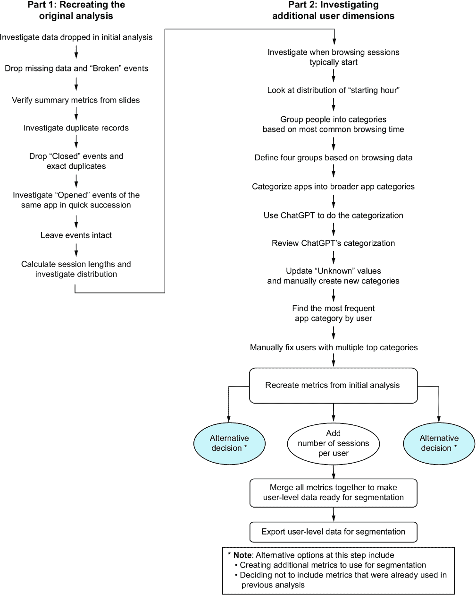

##### 图 13.1 上一章项目中完成的工作

现在我们可以使用上一章导出的用户级数据集来创建用户细分。在本章中，我们将选择一个聚类方法，应用它，并在确定结论和下一步之前评估结果。

### 13.1.4 使用聚类对移动用户进行细分

回顾一下，在我们的分析版本中，我们将根据以下维度对用户进行细分：

+   使用独特应用的数量（作为使用多样性的代理）

+   独特使用会话的数量（作为使用频率的代理）

+   用户会话的平均持续时间

+   他们使用手机的时间段

+   他们最常使用的应用类型

这些维度在我们的数据中总共组成 12 列。数据集有 13 列，但其中一列是用户 ID，它是一个任意的整数，不会用于聚类。我们将采取以下步骤来细分用户：

1.  将我们的数据转换，使所有列都在相同的尺度上

1.  选择一个聚类算法

1.  将聚类算法应用于将每个数据点分配到簇中

1.  评估输出

让我们读取上一章创建的用户级数据。图 13.2 显示了数据的样本：

```py
import pandas as pd
import matplotlib.pyplot as plt
users = pd.read_parquet("./data/users.parquet")
users.head()
```

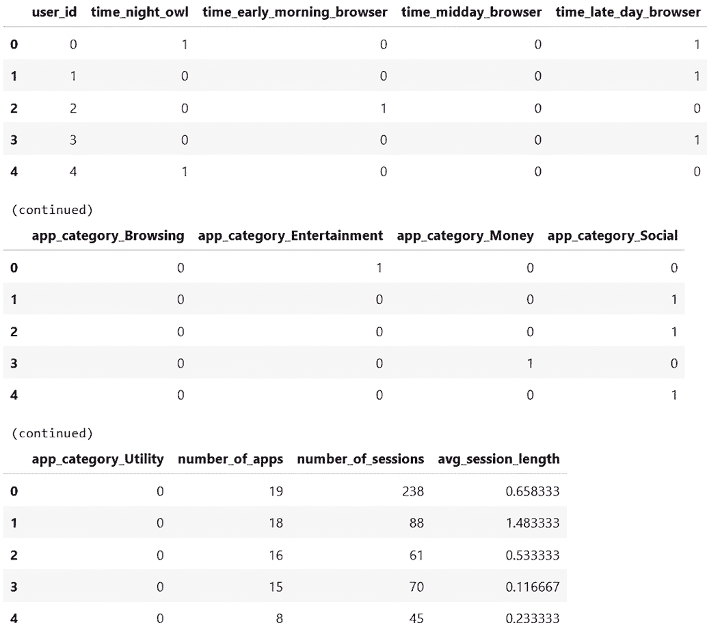

##### 图 13.2 上一章创建的用户级数据快照

在应用聚类算法到数据之前，我们需要检查我们的数据是否处于相同的尺度。图 13.3 展示了我们用户级数据中的列的提醒。

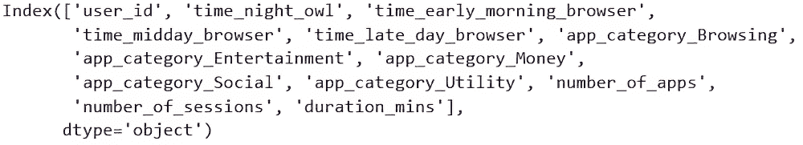

##### 图 13.3 我们用户级数据中可用的列

我们有一些变量处于不同的尺度。指标列只能为零或一，而像会话数量这样的列可能达到数千。这给基于距离的聚类方法带来了问题。

#### 将变量转换为同一尺度

聚类意味着找到彼此靠近的数据点。彼此“靠近”的定义需要一个距离的数值测量。如果我们的某一列的尺度比其他列大，那么该列将主导我们的聚类。在我们的例子中，如果我们使用原始数据，最可能的情况是用户将仅根据会话数量进行分割，因为这是变化最大的列。如果所有列都在大约相同的范围内，它们将对聚类贡献相等。

我们可以使用不同的缩放方法。一种典型的方法是将数据点转换为 z 分数，这意味着它们将通过距离，以标准差为单位，来衡量该列的平均值。所有以这种方式缩放的数据将大约在-5 到 5 的范围内，无论其基本单位如何。如果一个用户在转换后“会话数量”的值为 1，这意味着他们的会话数量比用户平均会话数量高出 1 个标准差。然后，这个值可以直接与“应用数量”的 1 进行比较，尽管这两个度量可能处于不同的尺度。

无论我们选择哪种方法进行缩放，我们只会将其应用于我们的连续数据，而不是指标列，因为那些列已经处于可比较的尺度。以下代码将我们的原始数据转换为缩放版本，图 13.4 显示了前几行。注意，图中的数据已转置，以便更容易看到所有 12 列的值：

```py
from sklearn.preprocessing import StandardScaler

scaler = StandardScaler()      #1

X = users.drop(columns=["user_id"])

continuous_features = ['number_of_apps',
                       'number_of_sessions',
                       'avg_session_length']

X_scaled = X.copy()
X_scaled.loc[:,continuous_features]
↪ = scaler.fit_transform(X[continuous_features])    #2

X_scaled.head().transpose()    #3
```

#1 创建一个缩放器对象

#2 仅转换连续列并覆盖它们的值

#3 显示了为了可读性而转置的前五行

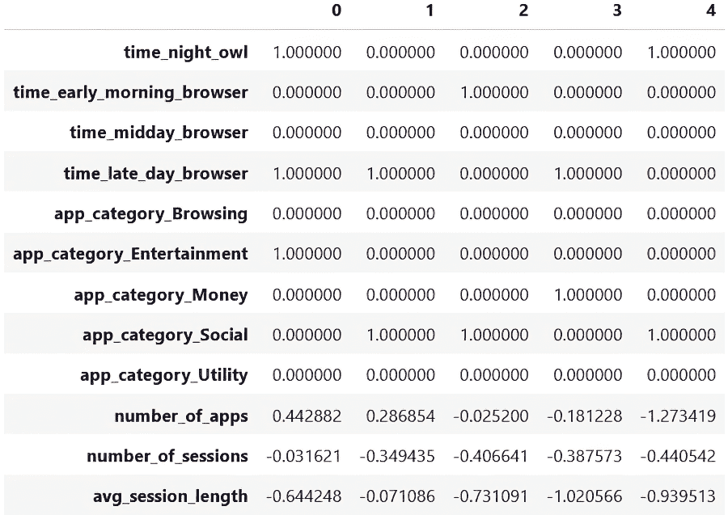

##### 图 13.4 准备进行聚类的转换数据的几行

注意，指标列仍然包含二进制值；只有最后三个连续列的值已被缩放。在选择并应用聚类算法之前，让我们回顾一下到目前为止的过程，并添加缩放步骤。图 13.5 显示了最新的图表。

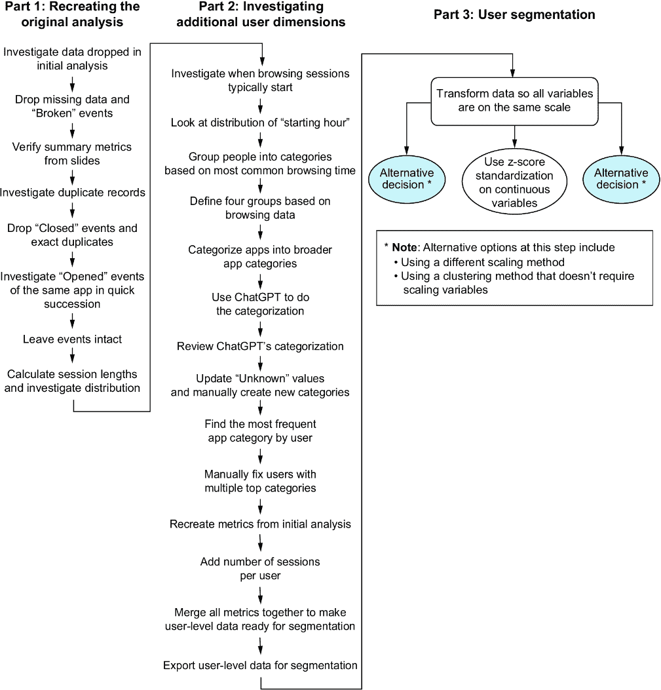

##### 图 13.5 到目前为止的过程，包括分割的开始

现在我们已经准备好选择并应用一个聚类算法来分割我们的用户。

#### 选择并应用聚类算法

选择聚类算法取决于可用的数据。一些聚类方法在大数据集上比其他方法表现更好，而其他方法在维度很多时表现更佳。一些方法需要事先选择簇的数量，而有些方法会根据数据自行确定簇的数量。与大多数数据分析方法一样，不同的方法都有其优缺点。有关这些优缺点的更多信息，请参阅 scikit-learn 文档：[`mng.bz/MD5W`](https://mng.bz/MD5W)。

对于这个解决方案，我们将保持简单，并使用最流行的 k-means 算法。这是一种基于距离的方法，如果数据空间中的点彼此靠近，它们就会被分组到同一个簇中。它试图找到一个解决方案，使得簇内的点尽可能接近，但簇之间尽可能远。这意味着组内部应该尽可能同质，但其他方面则应彼此不同。让我们将这个决策添加到我们不断发展的图表中，其最新版本如图 13.6 所示。

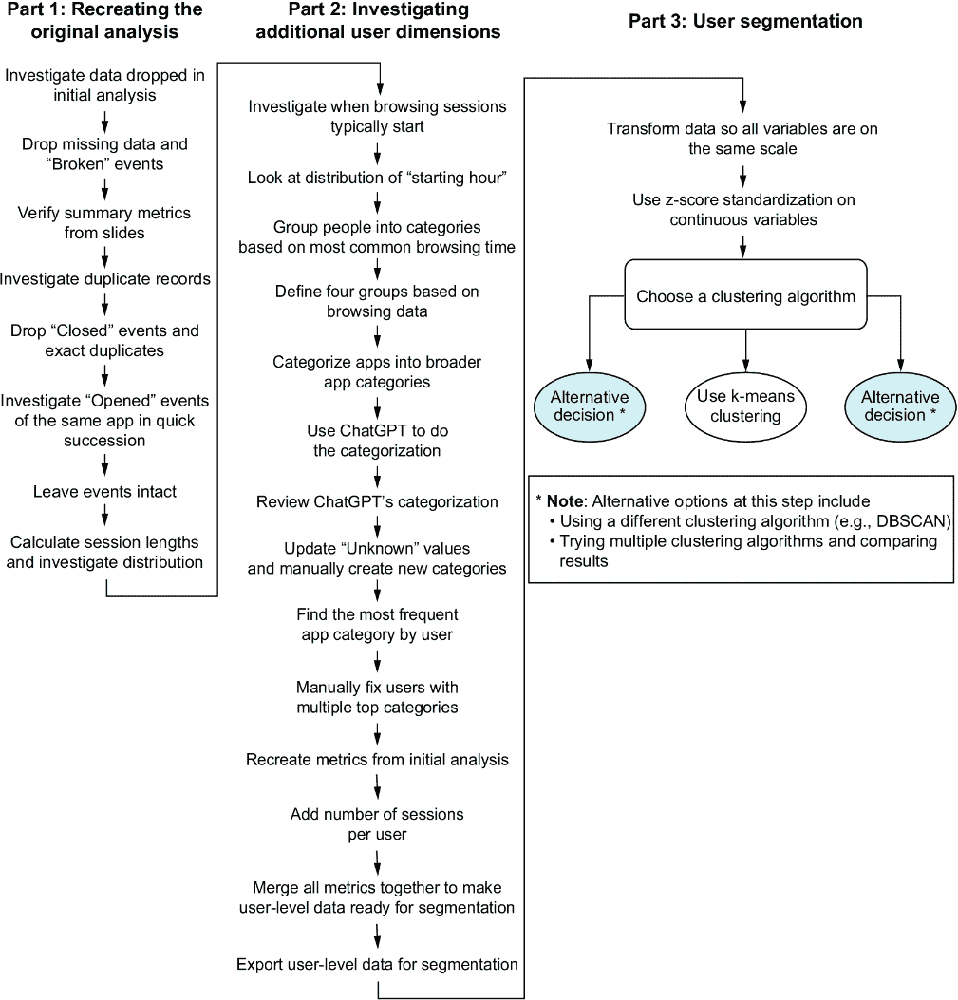

##### 图 13.6 我们最新的进展，包括聚类算法的选择

k-means 等聚类算法的一个重要组成部分是我们需要事先选择组数。这并不简单，因为我们可能对我们的当前案例没有合适的直觉。找到簇数量合适范围的一种方法被称为“肘部方法”。这意味着通过经验尝试不同的组数，并观察添加另一个组带来的好处何时开始减少。

我们将运行不同数量的组的 k-means 聚类算法，并测量一个称为“惯性”的指标，该指标衡量点与其簇中心之间的接近程度。惯性值低意味着聚类结构更好。然而，请注意，增加更多的组*总是*会降低惯性，因为拥有更多的簇中心意味着点更有可能接近其中一个。通常，我们会找到添加另一个簇不会显著降低惯性分数的点。

注意：在现实中，像聚类这样的无监督方法往往是主观评估的。相较于优化诸如惯性这样的数值指标，更重要的是考虑这些聚类是否适合我们的用例。

“肘部方法”的概念最好通过视觉方式来解释。以下代码从 3 个组运行到 15 个组，并绘制了相关的惯性分数，如图 13.7 所示：

```py
from sklearn.cluster import KMeans

k_values = range(3, 15)
inertia_values = []

for k in k_values:
    kmeans = KMeans(n_clusters=k, random_state=42)
    kmeans.fit(X_scaled)
    inertia_values.append(kmeans.inertia_)

fig, axis = plt.subplots()

axis.plot(k_values, inertia_values)

_ = axis.set(
    title="'Inertia' values for different values of k",
    xlabel="Number of clusters (the 'k' in k-means)",
    ylabel="Inertia"
)

axis.set_ybound(0, 900)

plt.show()
```

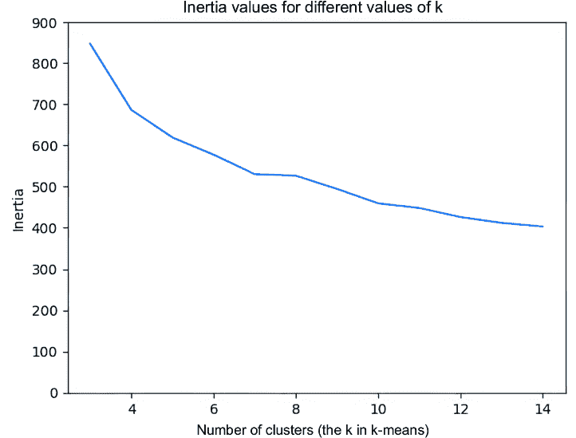

##### 图 13.7 使用不同数量的组进行聚类的结果

这显示了这样一个典型场景，当聚类数量较少时，添加一个聚类会显著降低惯性值，但这种模式不会持续。在图 13.7 中，从七个聚类增加到八个聚类几乎不会降低惯性分数。大多数时候，这些图表看起来像手臂，我们在寻找肘部，即曲线斜率平直的点。在图 13.7 的案例中，我们将使用七个作为拐点，因此从七个聚类开始。图 13.8 展示了包含这个最新决定的流程。

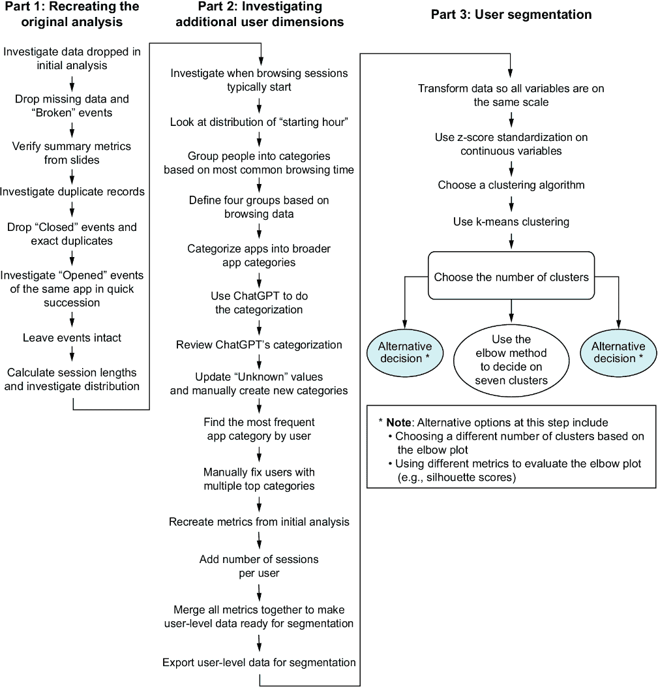

##### 图 13.8 选择聚类数量后的最新流程

让我们应用 k-means 聚类算法到我们的数据中，选择创建七个聚类。我们将使用 scikit-learn 来完成这个任务，这是流行的 Python 机器学习库。我们将创建一个 k-means 聚类对象，将其应用于数据，并在我们的用户表中创建一个新列，记录每个用户属于七个聚类中的哪一个。以下代码完成了这个任务，图 13.9 展示了增强后的用户表快照。再次强调，数据已经转置，这样我们可以看到所有列的值：

```py
kmeans = KMeans(n_clusters=7, random_state=42)
clusters = kmeans.fit_predict(X_scaled)
users["cluster"] = clusters

users.head().transpose()
```

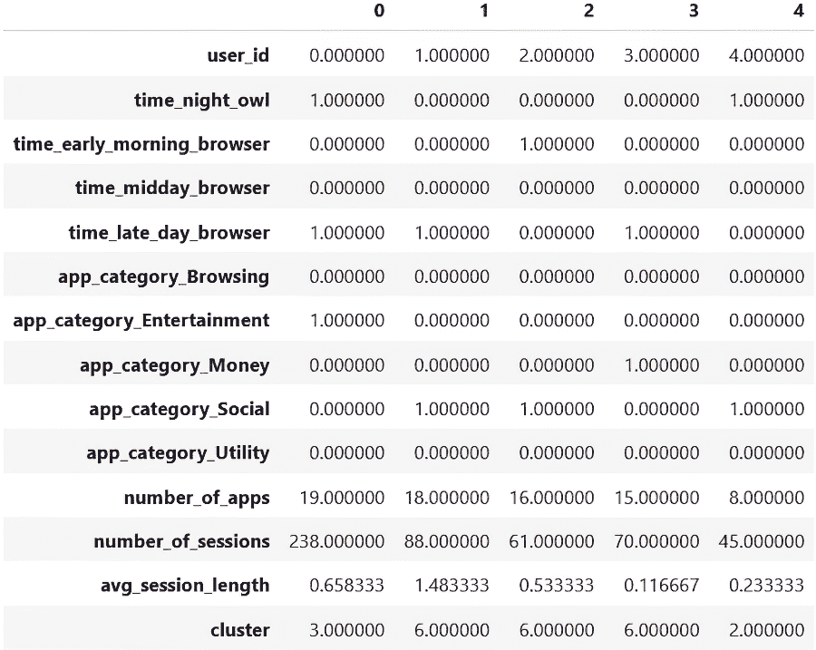

##### 图 13.9 带有附加聚类分配的五行用户数据

图 13.9 显示了初始用户数据，包括所有维度以及新的聚类分配。它告诉我们用户 0 被分配到聚类 3，用户 1-3 被分配到聚类 6，依此类推。我们将使用这个新列来评估结果。

#### 评估聚类结果

一旦聚类完成，我们想要评估我们的结果，这意味着以下内容：

+   调查每个聚类的中心（即，每个组中的典型用户是什么样的？）。

+   观察每个聚类的值分布（即，一个组中所有用户的典型特征是什么？）。

+   理解聚类是否彼此不同。我们不希望创建两个相似的聚类。我们希望每个组在某种程度上都是独特的。

首先，让我们看看每个聚类中有多少用户。以下代码完成了这个任务，并在图 13.10 中产生了输出：

```py
users["cluster"].value_counts().sort_index()
```

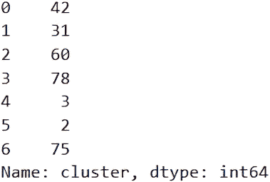

##### 图 13.10 每个聚类的用户数量

我们立即注意到有两个聚类中每个聚类只有两个或三个用户。这意味着这些用户可能确实与其他用户不同，或者我们需要更少的聚类。k-means 类似的方法的一个缺点是，要求它创建七个聚类将会创建七个聚类，无论这是否有根据。让我们看看聚类的中心，这告诉我们每个组的平均值，我们可以将其用作每个细分市场典型用户外观的代理。

我们需要记住做的一件事是*反转*我们之前对连续列所做的转换，以便集群中心与我们的输入数据处于相同的尺度。否则，应用程序数量、会话数量和平均会话长度都将大约在-3 到 3 之间。

以下代码执行了这种反转转换，并打印出每个集群的中心值，如图 13.11 所示：

```py
import numpy as np

original_cluster_centers
↪ = np.copy(kmeans.cluster_centers_)    #1

cluster_centers = pd.DataFrame(
    data=original_cluster_centers,
    columns=X_scaled.columns
)

cluster_centers.loc[:,continuous_features]
↪ = scaler.inverse_transform(original_cluster_centers[:,-3:])     #2

cluster_centers.transpose().round(2)
```

#1 复制集群中心，以防止意外修改

#2 仅反转连续列的转换，保留二进制列不变

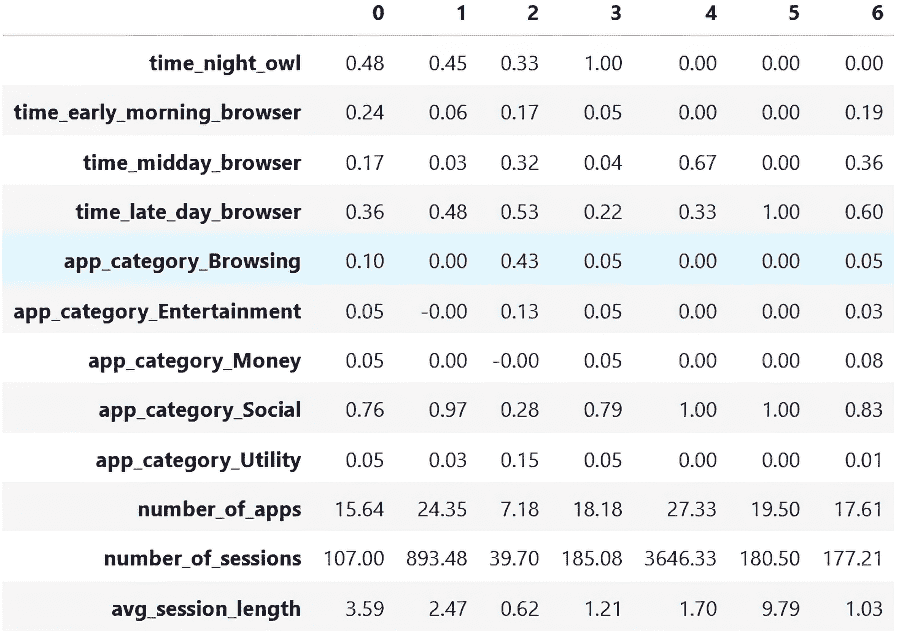

##### 图 13.11 集群中心和它们相关的属性

这表明，例如，从第一列向下阅读，在集群 0 中，48%的用户是夜猫子，其中 76%的用户主要用手机进行社交目的，平均有 107 个独特的会话。

集群 4 和 5 只有两到三个用户。看起来集群 4 之所以是一个独立的集群，其中一个原因是它是极端用户最多的地方，因为平均会话数超过 3,000。集群 5 看起来代表的是会话长度最长的用户，平均为 9.79 分钟。基于这些发现，我们将决定保留所有七个集群，因为它们似乎代表了不同类型的用户。

下一步是为每个组分配一个角色来描述他们。例如，集群 1 包含会话数量多且应用数量高的用户；他们主要用手机进行社交媒体活动，并且是晚上的或晚上的浏览器。这似乎是一个独特的角色：一个人下班回家后，大部分时间都在社交。

另一个明显的角色将是集群 2，它包含更多消费者用户。他们的总会话数量很少，通常很短；他们主要用手机进行浏览，平均只使用七个不同的应用程序。集群 6 的用户在白天浏览更多，但平均会话时间较短。也许他们是那些在午休时间使用社交媒体应用程序的人。让我们总结一下可能的角色。这个总结显示在表 13.2 中。

##### 表 13.2 用户角色总结

| 组 | 角色名称 | 角色特征 |
| --- | --- | --- |
| 0  | 典型社交媒体用户  | 会话数量平均，主要用于社交媒体，大多数在白天晚些时候和晚上使用 |
| 1  | 重度用户  | 会话和应用程序使用数量高，主要是社交媒体，大多数在白天晚些时候和晚上使用 |
| 2  | 消费者用户  | 会话和应用程序数量少，使用会话短，主要用于浏览 |
| 3  | 夜猫子  | 所有夜猫子，主要使用社交媒体 |
| 4  | 使用异常  | 在整个期间平均超过 3,600 个会话 |
| 5  | 会话长度异常  | 每次使用会话平均约 10 分钟 |
| 6  | 晚上社交用户  | 会话数量平均，使用会话短，主要用于社交媒体，大多数在白天晚些时候 |

从这个表格中，我们可以根据他们的统计数据为每个群体分配一个角色，但我们可能认为有一些群体相似，可以合并。例如，聚类 0 和 6 并没有太大的区别。你可能在向利益相关者展示之前做一些额外的合并，或者这可能是根据他们的意见来完成的。无论如何，这类主观评估是我们确定在这个案例中七个聚类是否合适的方法。

在总结我们的发现并讨论下一步计划之前，让我们回顾一下我们的整个流程。我们从重新创建初始分析到执行我们自己的分析，最后创建新的客户细分。图 13.12 展示了整个过程的可视化。

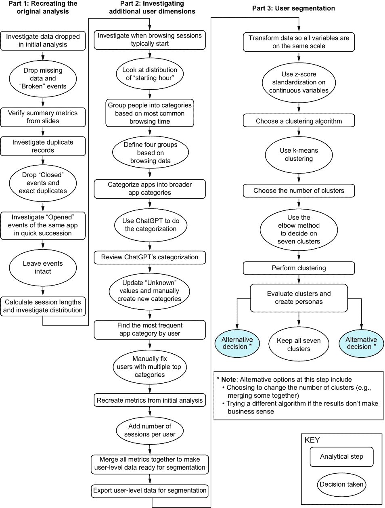

##### 图 13.12 整个过程的示意图

现在我们总结我们的发现并决定下一步计划。

### 13.1.5 结论和下一步计划

最后，添加利益相关者感兴趣维度使我们能够创建越来越复杂的用户细分。这些构成了我们的最小可行答案。重要的问题是我们的发现是否会引导行动。企业可以用这些客户细分做什么？因为公司的商业模式是将这些见解卖给移动制造商和应用程序开发者，我们可以想象他们可能使用这些信息的一些方式：

+   有一个更精确的方式来定义“重度用户”可能有助于为过度使用手机的人创造干预措施。

+   了解“偶然”用户意味着更好地定位中间内容（例如，如何充分利用你的手机）。

+   为那些主要使用手机进行社交媒体的人设立单独的用户细分可能导致对其他社交媒体应用程序的更好定位。

这个项目的一个重要方面是，我们的聚类完全基于我们的决策。我们的数据处理选择，变量的选择，以及聚类算法的选择都为最终解决方案做出了贡献。任何这些决策的变化都会产生不同的分组。这就是为什么与利益相关者的合作如此重要的原因。他们可以帮助做出创造最相关结果的决定。

##### 演示技巧

作为分析师展示你的结果是一种随着实践而来的技能。这需要与真实环境（即，在分析他们关心的情况下）中的人们进行许多互动。做好这项工作所需的能力包括：

+   了解你的受众，他们的动机，他们现有的理解，等等

+   与你的受众产生共鸣并调整你的信息

+   以相关的方式总结你的发现

+   讲述你的分析故事

最后一点广泛地属于“数据讲故事”这一概念，它包含了一系列相关技能。更多信息，请参阅 Kat Greenbrook（Rogue Kororaˉ，2023）所著的《数据讲故事手册》。

提高这些技能的最好方法是向相关受众展示你的结果。从受众那里获得实时反馈对于提高演讲技巧极为宝贵。另一种相关的方法是在聚会和会议上发表演讲。这将帮助你自信地传达你在某个主题上的专业知识。最后，建立一个项目组合在讨论招聘经理时可能很有价值。

关于额外的工作？尽管列数不多，但数据足够丰富，可以进行进一步的迭代。一个想法可能是推断用户的移动操作系统。如果他们使用了谷歌应用，他们可能在使用安卓设备，而使用苹果应用则意味着他们使用的是 iOS。这种区别可能会改变我们的用户细分结构。

我们也没有充分利用数据的个体事件级方面。我们可以查看用户在单个应用上花费的时间、应用打开和关闭的次数、人们切换应用频率的变化等。所有这些考虑都可以为我们提供更丰富的用户细分来探索。

数据的一个注意事项，我们多少回避了，就是会话的开始和结束并不干净利落。有时，一个会话以“打开”事件结束，紧接着几分钟后又开始了另一个会话。如果我们想更详细地探索会话和事件，我们可能需要更深入地清理这些会话。

##### 活动：使用这些数据的进一步项目想法

想想你可以用这个数据集进行的其他分析。以下是一些你可能想要考虑的方向：

+   不同人的应用级行为是什么样的？人们是否使用不同的应用方式不同？

+   每个类别中最受欢迎的应用是什么？

+   我们用户群中对于新应用的使用率如何？有没有方法通过外部数据源增强你的数据以更好地回答这个问题？

## 13.2 结束语：细分和聚类

在这个项目中练习的用户细分技能适用于各种现实场景。细分在许多领域都会出现。无论你想找到相似的客户、微波炉还是农作物，其基本思想都是相同的。

为了为未来的任何聚类项目做好准备，了解以下内容是有用的

+   一些不同的聚类算法以及每种算法在什么场景下更有用

+   无监督机器学习的预处理技术，例如我们在本项目中执行的标准化

+   评估指标，如我们之前测量的惯性得分，或更高级的概念，如轮廓得分

+   我们决定一组聚类是否适合特定业务案例的主观评估过程

至少对这些概念有一个表面上的熟悉度意味着，当你在现实生活中遇到相关项目时，你将能够识别聚类作为适当的方法，并深入研究你需要产生最小可行答案的方面。

总的来说，最好的方法是通过实践来磨练这些技能，所以如果你在生活中遇到一个聚类是相关方法的问题，就把它作为一个机会来检验你的技能。

### 13.2.1 用于任何项目的技能学习

让我们回顾一下这个最新项目的各个方面以及完成它所需的技能。为了成功继续他人的现有分析，可以应用于任何类似项目的关键技能包括

+   核实现有计算（例如，对于报告的汇总指标，如平均值）

+   如果有现成的分析代码，重新运行以验证结果

+   记录项目上以前分析师所做的假设和决策

要将记录，如客户，分割成不同的组，关键技能，适用于任何此类项目，包括

+   创建一个合适粒度的数据集（例如，如果细分用户，则使用用户级别的数据集）

+   将输入到聚类算法中的数据进行转换，使其都在同一尺度上

+   选择合适的聚类算法

+   使用合适的工具在数据上运行所选的聚类算法

+   对结果进行数值评估（例如，通过查看惯性得分）和主观评估（例如，从领域专业知识的角度看，是否聚类有意义）

## 摘要

+   分段/聚类算法在数据问题上有广泛的应用。

+   我们所做的决策，例如聚类数量或用于确定它们的变量，将彻底改变聚类算法的结果。

+   如用户细分这样的任务需要主观的人类评估。

+   给出聚类个性有助于识别其关键特征。
